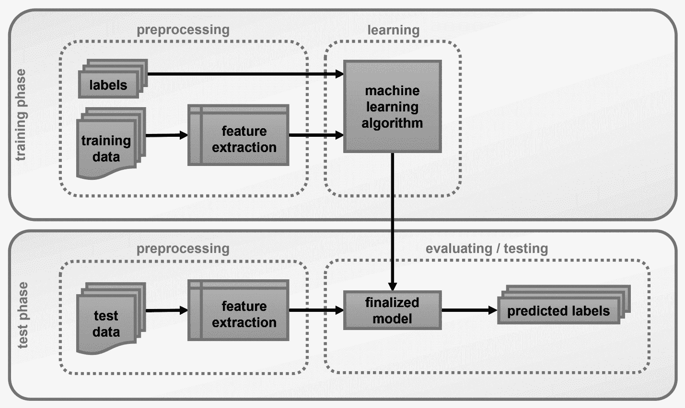
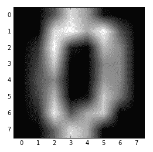
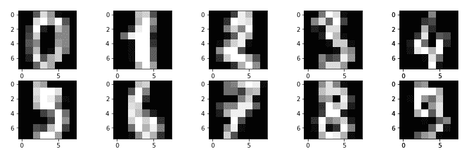

# 第二章：在 OpenCV 中处理数据

现在我们已经激发了大家对机器学习的兴趣，是时候深入探讨构成典型机器学习系统的不同部分了。

太频繁了，你可能会听到有人随意抛出“**J**ust apply machine learning to your data!”这样的短语，好像这样就能立刻解决你所有的问题。你可以想象，现实远比这复杂得多，尽管，我必须承认，如今，仅通过从互联网上复制粘贴几行代码，就极其容易构建自己的机器学习系统。然而，要构建一个真正强大和有效的系统，掌握底层概念以及深入了解每种方法的优缺点是至关重要的。所以，如果你还没有把自己视为机器学习专家，请不要担心。好事多磨。

之前，我把机器学习描述为人工智能的一个子领域。这可能确实如此——主要是出于历史原因——但大多数情况下，机器学习只是关于**理解数据**。因此，将机器学习视为数据科学的一个子领域可能更为合适，在那里我们构建数学模型来帮助我们理解数据。

因此，本章全部关于数据。我们想要了解数据如何与机器学习相结合，以及如何使用我们选择的工具（OpenCV 和 Python）来处理数据。

在本章中，我们将涵盖以下主题：

+   理解机器学习工作流程

+   理解训练数据和测试数据

+   学习如何使用 OpenCV 和 Python 加载、存储、编辑和可视化数据

# 技术要求

你可以从以下链接获取本章的代码：[`github.com/PacktPublishing/Machine-Learning-for-OpenCV-Second-Edition/tree/master/Chapter02`](https://github.com/PacktPublishing/Machine-Learning-for-OpenCV-Second-Edition/tree/master/Chapter02)。

下面是软件和硬件要求的总结：

+   你需要 OpenCV 版本 4.1.x（4.1.0 或 4.1.1 都完全可以）。

+   你需要 Python 版本 3.6（任何 3.x 版本的 Python 都行）。

+   你需要安装 Anaconda Python 3 来安装 Python 和所需的模块。

+   你可以使用任何操作系统——macOS、Windows 以及基于 Linux 的操作系统——配合本书使用。我们建议你的系统至少有 4GB 的 RAM。

+   运行本书提供的代码不需要 GPU。

# 理解机器学习工作流程

如前所述，机器学习就是构建数学模型来理解数据。当我们赋予机器学习模型调整其**内部参数**的能力时，学习过程就进入了这个环节；我们可以调整这些参数，使模型更好地解释数据。从某种意义上说，这可以理解为模型从数据中学习。一旦模型学习到足够多的东西——无论这意味着什么——我们就可以要求它解释新观察到的数据。

以下是一个典型的分类过程的示意图：



让我们一步一步地分解它。

首先要注意的是，机器学习问题总是分为（至少）两个不同的阶段：

+   一个**训练阶段**，在这个阶段，我们旨在使用我们称之为**训练数据集**的一组数据来训练机器学习模型

+   一个**测试阶段**，在这个阶段，我们评估学习到的（或最终确定的）机器学习模型在称为**测试数据集**的一组从未见过的新数据上的表现

将我们的数据分为训练集和测试集的重要性不容忽视。我们总是在一个独立的测试集上评估我们的模型，因为我们感兴趣的是了解我们的模型如何**泛化到新的数据**。最终，这不就是学习的全部意义所在——无论是机器学习还是人类学习吗？回想一下学校的时候，当你自己还是一名学习者时：作为家庭作业一部分需要解决的问题在期末考试中绝不会以完全相同的形式出现。同样的严格性应该应用于机器学习模型；我们并不那么关心我们的模型能够多好地记住一组数据点（例如家庭作业问题），而是想知道我们的模型将如何利用他们所学的知识来解决新的问题（例如在期末考试中出现的问题）并解释新的数据点。

高级机器学习问题的工作流程通常包括第三组数据，称为**验证数据集**。目前，这种区别并不重要。验证集通常是通过进一步划分训练数据集形成的。当我们已经熟练构建机器学习系统时，我们将在第十一章选择合适的模型与超参数调整中讨论的模型选择等高级概念中使用它。

接下来要注意的是，机器学习实际上完全是关于**数据**的。数据以原始形式进入之前描述的工作流程图——无论这意味着什么——并在训练和测试阶段中使用。数据可以是图像、电影、文本文档或音频文件等任何东西。因此，在原始形式下，数据可能由像素、字母、单词甚至更糟糕的是：纯比特组成。很容易看出，这种原始形式的数据可能不太方便处理。相反，我们必须找到方法来**预处理**数据，使其以易于**解析或使用**的形式出现。

数据预处理分为两个阶段：

+   **特征选择**：这是识别数据中重要属性（或特征）的过程。图像的可能特征可能包括边缘、角点或脊的位置。你可能已经熟悉 OpenCV 提供的一些更高级的特征描述符，如**加速鲁棒特征**（SURF）或**方向梯度直方图**（HOG）。尽管这些特征可以应用于任何图像，但它们可能对我们的特定任务并不那么重要（或效果并不好）。例如，如果我们的任务是区分干净和脏水，最重要的特征可能是水的颜色，而使用 SURF 或 HOG 特征可能对我们帮助不大。

+   **特征提取**：这是将原始数据转换为所需**特征空间**的实际过程。一个例子是**哈里斯算子**，它允许我们在图像中提取角点（即选定的特征）。

一个更高级的话题是发明信息特征的过程，这被称为**特征工程**。毕竟，在人们可以从流行的特征中选择之前，必须先有人发明它们。这对于我们算法的成功往往比算法本身的选择更重要。我们将在第四章表示数据和特征工程中广泛讨论特征工程。

不要让命名**规范**混淆你！有时候，特征选择和特征提取难以区分，主要是因为命名方式。例如，SURF 既可以指特征提取器，也可以指实际的特征名称。同样，**尺度不变特征变换**（SIFT）也是如此，它是一种特征提取器，可以产生所谓的**SIFT**特征。不幸的是，这两个算法都获得了专利，不能用于商业目的。我们不会分享任何关于这两个算法的代码。

最后一点是，在监督学习中，每个数据点都必须有一个**标签**。标签可以识别数据点属于某个类别（如猫或狗）或具有某个值（如房屋的价格）。最终，监督机器学习系统的目标是预测测试集中所有数据点的标签（如前图所示）。我们通过学习训练数据中的规律性，使用随附的标签，然后在测试集上测试我们的性能来实现这一点。

因此，为了构建一个功能齐全的机器学习系统，我们首先必须了解如何加载、存储和处理数据。你如何在 OpenCV 中使用 Python 做到这一点呢？

# 使用 OpenCV 和 Python 处理数据

数据的世界充满了各种类型的数据。有时，这会让用户很难区分特定值应使用的数据类型。在这里，我们将尝试将其保持简单，将所有内容视为数组，除了标量值，它们将保留其标准数据类型。因此，图像将成为二维数组，因为它们有宽度和高度。一维数组可能是一个随时间强度变化的音频剪辑。

如果你主要使用 OpenCV 的 C++ **应用程序编程接口**（**API**）并且计划继续这样做，你可能会发现处理 C++ 中的数据可能会有些痛苦。你不仅必须处理语法开销，...

# 启动一个新的 IPython 或 Jupyter 会话

在我们能够接触到 NumPy 之前，我们需要打开一个 IPython 壳或启动一个 Jupyter 笔记本：

1.  打开一个终端，就像我们在上一章中做的那样，并导航到 `OpenCV-ML` 目录：

```py
 $ cd Desktop/OpenCV-ML
```

1.  激活我们在上一章中创建的 `conda` 环境：

```py
 $ source activate OpenCV-ML  # Mac OS X / Linux
 $ activate OpenCV-ML         # Windows
```

1.  启动一个新的 IPython 或 Jupyter 会话：

```py
 $ ipython           # for an IPython session
      $ jupyter notebook  # for a Jupyter session
```

如果你选择启动一个 IPython 会话，程序应该会以如下欢迎信息问候你：

```py
$ ipython
Python 3.6.0 | packaged by conda-forge | (default, Feb 9 2017, 14:36:55) 
Type 'copyright', 'credits' or 'license' for more information
IPython 7.2.0 -- An enhanced Interactive Python. Type '?' for help.

In [1]: 
```

以 `In [1]` 开头的行是输入常规 Python 命令的地方。此外，在输入变量和函数名称时，你也可以使用 *Tab* 键让 IPython 自动完成。

有限数量的 Unix 和 macOS 系统外壳命令也可以使用——例如 `ls` 和 `pwd`。你可以通过在命令前加上 `!` 来运行任何外壳命令，例如 `!ping www.github.com`。更多信息，请查看官方 IPython 参考文档：[`ipython.org/ipython-doc/3/interactive/tutorial.html`](https://ipython.org/ipython-doc/3/interactive/tutorial.html)。

如果你选择启动一个 Jupyter 会话，你的网络浏览器应该会打开一个指向 `http://localhost:8888` 的新窗口。你想要通过点击右上角的“新建”并选择“Notebooks (Python 3)”来创建一个新的笔记本：


这将打开一个看起来像这样的新窗口：


标记为 `In [ ]` 的单元格（看起来像前面的文本框）与 IPython 会话中的命令行相同。现在你可以开始输入你的 Python 代码了！

# 使用 Python 的 NumPy 包处理数据

假设如果你已经安装了 Anaconda，那么你已经在虚拟环境中安装了 NumPy。如果你使用了 Python 的标准发行版或任何其他发行版，你可以访问 [`www.numpy.org`](http://www.numpy.org) 并遵循那里提供的安装说明。

如前所述，如果你还不是 Python 专家，这完全没问题。谁知道呢，也许你刚刚从 OpenCV 的 C++ API 转换过来。我只是想给你一个关于如何开始使用 NumPy 的快速概述。如果你是更高级的 Python 用户，你可以简单地跳过这一部分。

一旦你熟悉了 NumPy，你会发现 Python 世界中的大多数科学计算工具都是围绕 ...

# 导入 NumPy

一旦你开始一个新的 IPython 或 Jupyter 会话，你可以导入 NumPy 模块并验证其版本，如下所示：

```py
In [1]: import numpy
In [2]: numpy.__version__
Out[2]: '1.15.4'
```

回想一下，在 Jupyter Notebook 中，一旦你输入了命令，你可以按 *Ctrl* + *Enter* 来执行一个单元格。或者，按 *Shift* + *Enter* 将执行单元格并自动插入或选择下面的单元格。通过点击 帮助 | 键盘快捷键 或点击 帮助 | 用户界面巡游 来查看所有键盘快捷键。

对于本节讨论的包的各个部分，我建议使用 NumPy 版本 1.8 或更高版本。按照惯例，你会发现科学 Python 世界中的大多数人都会使用 `np` 作为别名来导入 NumPy：

```py
In [3]: import numpy as np
In [4]: np.__version__
Out[4]: '1.15.4'
```

在本章以及本书的其余部分，我们将坚持使用相同的约定。

# 理解 NumPy 数组

你可能已经 知道 Python 是一种 **弱类型语言**。这意味着你不必在创建新变量时指定数据类型。例如，以下内容将自动表示为整数：

```py
In [5]: a = 5
```

你可以通过输入以下内容来再次确认：

```py
In [6]: type(a)Out[6]: int
```

由于标准的 Python 实现是用 C 编写的，每个 Python 对象基本上都是伪装成 C 结构的。这在 Python 中的整数也是一样，实际上它们是指向包含不仅仅是**原始**整数值的复合 C 结构的指针。因此，用于表示 Python 整数的默认 C 数据类型将取决于你的系统架构（即，它是否是 32 位 ...

# 通过索引访问单个数组元素

如果你之前使用过 Python 的标准列表索引，那么你不会在 NumPy 的索引中遇到许多问题。在 1D 数组中，第 *i* 个值（从零开始计数）可以通过指定所需的索引来访问，就像 Python 列表一样：

```py
In [13]: int_arr
Out[13]: array([0, 1, 2, 3, 4, 5, 6, 7, 8, 9])
In [14]: int_arr[0]
Out[14]: 0
In [15]: int_arr[3]
Out[15]: 3
```

要从数组的末尾进行索引，你可以使用负索引：

```py
In [16]: int_arr[-1]
Out[16]: 9
In [17]: int_arr[-2]
Out[17]: 8
```

对于**切片数组**还有一些其他酷炫的技巧，如下所示：

```py
In [18]: int_arr[2:5]  # from index 2 up to index 5 - 1
Out[18]: array([2, 3, 4])
In [19]: int_arr[:5]    # from the beginning up to index 5 - 1
Out[19]: array([0, 1, 2, 3, 4])
In [20]: int_arr[5:]    # from index 5 up to the end of the array
Out[20]: array([5, 6, 7, 8, 9])
In [21]: int_arr[::2]   # every other element
Out[21]: array([0, 2, 4, 6, 8])
In [22]: int_arr[::-1]  # the entire array in reverse order
Out[22]: array([9, 8, 7, 6, 5, 4, 3, 2, 1, 0])
```

我鼓励你自己尝试操作这些数组！

NumPy 中切片数组的一般形式与标准 Python 列表中的相同。要访问数组的切片，使用 `x[start:stop:step]`。如果其中任何一个未指定，则默认为 `start=0`，`stop=维度大小`，`step=1` 值。

# 创建多维数组

数组不必局限于列表。实际上，它们可以有任意数量的维度。在机器学习中，我们通常会处理至少 2D 数组，其中列索引代表特定特征的值，而行包含实际的特征值。

使用 NumPy，从头创建多维数组很容易。假设我们想要创建一个有 3 行 5 列的数组，所有元素都初始化为零。如果我们没有指定数据类型，NumPy 将默认使用浮点数：

```py
In [23]: arr_2d = np.zeros((3, 5))...      arr_2dOut[23]: array([[0., 0., 0., 0., 0.],                [0., 0., 0., 0., 0.],                [0., 0., 0., 0., 0.]])
```

如您从 OpenCV 时代可能知道的，这 ...

# 在 Python 中加载外部数据集

感谢 SciPy 社区，有许多资源可以帮助我们获取数据。

一个特别有用的资源来自 **scikit-learn** 的 `sklearn.datasets` 包。这个包预先安装了一些小型数据集，我们不需要从外部网站下载任何文件。这些数据集包括以下内容：

+   `load_boston`：波士顿数据集包含波士顿不同郊区的房价，以及一些有趣的特征，如城镇人均犯罪率、住宅用地比例和非零售商业数量

+   `load_iris`：爱丽丝花数据集包含三种不同类型的爱丽丝花（塞托萨、变色和维吉尼卡），以及描述萼片和花瓣宽度和长度的四个特征

+   `load_diabetes`：糖尿病数据集让我们可以根据患者的年龄、性别、体重指数、平均血压和六项血液血清测量值来分类患者是否患有糖尿病

+   `load_digits`：数字数据集包含 *0-9* 数字 8 x 8 像素的图像

+   `load_linnerud`：Linnerud 数据集包含 3 个生理变量和 3 个锻炼变量，这些变量是在健身俱乐部对 20 名中年男性测量的

此外，scikit-learn 允许我们直接从外部存储库下载数据集，如下所示：

+   `fetch_olivetti_faces`：Olivetti 面部数据集包含 10 个不同图像，每个图像有 40 个不同的主题

+   `fetch_20newsgroups`：20 个新闻组数据集包含大约 18,000 个关于 20 个主题的新闻组帖子

更好的是，可以直接从机器学习数据库 [`openml.org`](http://mldata.org) 下载数据集。例如，要下载爱丽丝花数据集，只需输入以下命令：

```py
In [1]: from sklearn import datasets
In [2]: iris = datasets.fetch_openml('iris', version=1)
In [3]: iris_data = iris['data']
In [4]: iris_target = iris['target']
```

爱丽丝花数据库包含总共 `150` 个样本，具有 `4` 个特征——花瓣长度、花瓣宽度、萼片长度和萼片宽度。数据分为三个类别——爱丽丝花塞托萨、爱丽丝花变色和爱丽丝花维吉尼卡。数据和标签分别存放在两个独立的容器中，我们可以如下检查：

```py
In [5]: iris_data.shape 
Out[5]: (150, 4)
In [6]: iris_target.shape 
Out[6]: (150,)
```

在这里，我们可以看到 `iris_data` 包含 `150` 个样本，每个样本有 `4` 个特征（这就是为什么数字 4 出现在形状中）。标签存储在 `iris_target` 中，每个样本只有一个标签。

我们可以进一步检查所有目标值的值，但我们不想打印所有值。相反，我们感兴趣的是查看所有不同的目标值，这使用 NumPy 很容易做到：

```py
In [7]: import numpy as np
In [8]: np.unique(iris_target) # Find all unique elements in array
Out[8]: array(['Iris-setosa', 'Iris-versicolor', 'Iris-virginica'], dtype=object)
```

另一个你应该听说过的 Python 数据分析库是 **pandas** ([`pandas.pydata.org`](http://pandas.pydata.org))。pandas 实现了数据库和电子表格的几个强大的数据操作。尽管这个库很强大，但就我们的目的而言，pandas 现在可能有点过于高级了。

# 使用 Matplotlib 可视化数据

如果我们不知道如何查看数据，那么知道如何加载数据就有限的价值。幸运的是，有**Matplotlib**！

Matplotlib 是一个基于 NumPy 数组的跨平台数据可视化库——看，我承诺 NumPy 会再次出现。它由 John Hunter 在 2002 年构思，最初设计为 IPython 的一个补丁，用于从命令行启用交互式 MATLAB 风格的绘图。在最近几年，出现了更多更炫酷的工具来最终取代 Matplotlib（例如 R 语言中的`ggplot`和`ggvis`），但 Matplotlib 仍然是一个经过良好测试的跨平台图形引擎。

# 导入 Matplotlib

你可能又走运了：如果你遵循了上一章中概述的建议并安装了 Python Anaconda 堆栈，那么你已经有 Matplotlib 安装好了，可以开始使用了。否则，你可能需要访问[`matplotlib.org`](http://matplotlib.org/)以获取安装说明。

正如我们使用`np`简写来表示 NumPy 一样，我们将为 Matplotlib 导入使用一些标准简写：

```py
In [1]: import matplotlib as mpl
In [2]: import matplotlib.pyplot as plt
```

`plt` 接口是我们将最常使用的，正如我们将在整本书中看到的那样。

# 生成一个简单的图形

不再拖延，让我们创建我们的第一个图形。

假设我们想要生成一个简单的正弦函数`sin(x)`的线形图。我们希望函数在*x*轴上所有`0 < x < 10`的点上进行评估。我们将使用 NumPy 的`linspace`函数在*x*轴上创建线性间距，从`x`值`0`到`10`，总共`100`个采样点：

```py
In [3]: import numpy as npIn [4]: x = np.linspace(0, 10, 100)
```

我们可以使用 NumPy 的`sin`函数在所有点`x`上评估`sin`函数，并通过调用`plt`的`plot`函数来可视化结果：

```py
In [5]: plt.plot(x, np.sin(x))
```

你自己试了吗？发生了什么？有什么显示出来吗？

问题是，根据你运行此脚本的位置，你可能不会 ...

# 可视化外部数据集的数据

作为本章的最终测试，让我们可视化来自外部数据集的一些数据，例如 scikit-learn 中的`digits`数据集。

具体来说，我们需要三个工具来进行可视化：

+   scikit-learn 用于实际数据

+   NumPy 用于数据处理

+   Matplotlib

因此，让我们首先导入所有这些：

```py
In [1]: import numpy as np
...     from sklearn import datasets
...     import matplotlib.pyplot as plt
...     %matplotlib inline
```

第一步是实际加载数据：

```py
In [2]: digits = datasets.load_digits()
```

如果我们记得正确的话，`digits`应该有两个不同的字段：一个包含实际图像数据的`data`字段和一个包含图像标签的`target`字段。与其依赖我们的记忆，我们不如简单地调查`digits`对象。我们通过键入其名称，添加一个点，然后按*Tab*键来完成：`digits.<TAB>`。这将揭示`digits`对象还包含一些其他字段，例如一个名为`images`的字段。这两个字段`images`和`data`似乎只是在形状上有所不同：

```py
In [3]: print(digits.data.shape)
... print(digits.images.shape)
Out[3]: (1797, 64)
 (1797, 8, 8)
```

在这两种情况下，第一个维度对应于数据集中图像的数量。然而，`data`将所有像素排列在一个大向量中，而`images`则保留了每个图像的 8 x 8 空间排列。

因此，如果我们想绘制单个图像，`images` 字段将更为合适。首先，我们使用 NumPy 的数组切片从数据集中获取单个图像：

```py
In [4]: img = digits.images[0, :, :]
```

在这里，我们表示要从 1,797 项长数组中抓取第一行以及所有相应的 *8 x 8 = 64* 像素。然后我们可以使用 `plt` 的 `imshow` 函数来绘制图像：

```py
In [5]: plt.imshow(img, cmap='gray') 
...     plt.savefig('figures/02.04-digit0.png') 
Out[5]: <matplotlib.image.AxesImage at 0x7efcd27f30f0>
```

前一个命令给出了以下输出。请注意，由于我们将图像调整到了更大的尺寸，所以图像是模糊的。原始图像的大小仅为 8 x 8：



此外，我还指定了一个使用 `cmap` 参数的颜色映射。默认情况下，Matplotlib 使用 MATLAB 的默认颜色映射 **jet**。然而，对于灰度图像，**gray** 颜色映射更有意义。

最后，我们可以使用 `plt` 的 `subplot` 函数绘制大量数字样本。`subplot` 函数与 MATLAB 中的相同，我们指定行数、列数和当前子图索引（从 `1` 开始计数）。我们将使用 `for` 循环遍历数据集中的前 10 张图像，每张图像都会分配一个自己的子图：

```py
In [6]: plt.figure(figsize=(14,4))
...
...     for image_index in range(10):
...         # images are 0-indexed, but subplots are 1-indexed
...         subplot_index = image_index + 1
...         plt.subplot(2, 5, subplot_index)
...         plt.imshow(digits.images[image_index, :, :], cmap='gray')
```

这导致了以下输出：



对于各种数据集，我母校加州大学欧文分校的机器学习存储库也是一个极好的资源：[`archive.ics.uci.edu/ml/index.php`](http://archive.ics.uci.edu/ml/index.php)。

# 使用 OpenCV 的 TrainData 容器在 C++ 中处理数据

为了完整性和那些坚持使用 OpenCV 的 C++ API 的人，让我们快速了解一下 OpenCV 的 `TrainData` 容器，它允许我们从 `.csv` 文件中加载数值数据。

在其他方面，在 C++ 中，`ml` 模块包含一个名为 `TrainData` 的类，它提供了一个用于在 C++ 中处理数据的容器。其功能仅限于从 `.csv` 文件（包含逗号分隔值）中读取（最好是）数值数据。因此，如果您想要处理的数据来自整洁的 `.csv` 文件，这个类将为您节省大量时间。如果您的数据来自不同的来源，恐怕您最好的选择可能是手动创建一个 `.csv` 文件，使用 ...

# 摘要

在本章中，我们讨论了处理机器学习问题的典型工作流程：我们如何从原始数据中提取信息性特征，我们如何使用数据和标签来训练机器学习模型，以及我们如何使用最终模型来预测新的数据标签。我们了解到，将数据分为训练集和测试集是至关重要的，因为这是唯一了解模型如何泛化到新数据点的途径。

在软件方面，我们显著提高了我们的 Python 技能。我们学习了如何使用 NumPy 数组来存储和处理数据，以及如何使用 Matplotlib 进行数据可视化。我们讨论了 scikit-learn 及其许多有用的数据资源。最后，我们还提到了 OpenCV 自带的`TrainData`容器，它为 OpenCV 的 C++ API 用户提供了一些缓解。

拥有这些工具在手，我们现在已经准备好实现我们的第一个真正的机器学习模型了！在下一章中，我们将专注于监督学习及其两个主要问题类别，分类和回归。
