# 第一章：量化学习算法

我们已经进入了一个时代，我们正在构建智能或智能机器。这种智能或智能是通过基于数学/统计的智能算法注入到机器中的。这些算法使系统或机器能够自动学习，无需任何人为干预。作为这个例子，今天我们周围有大量的移动应用程序。今天的主要即时通讯应用之一是 WhatsApp（目前由 Facebook 拥有）。每当我们将信息输入 WhatsApp 的文本框时，例如，输入*I am...*，就会出现一些词提示，如*..going home*、*Rahul*、*traveling tonight*等等。我们能猜测这里发生了什么，为什么吗？会涌现出多个问题：

+   系统正在学习什么？

+   它从哪里学习？

+   它是如何学习的？

让我们在本章中回答所有这些问题。

在本章中，我们将涵盖以下主题：

+   统计模型

+   学习曲线

+   曲线拟合

+   建模文化

+   过拟合和正则化

+   训练、验证和测试

+   交叉验证和模型选择

+   自举法

# 统计模型

统计模型是通过数据、数学或统计学捕捉到的真理的近似，在这里充当使能者。这种近似用于预测事件。统计模型不过是一个数学方程。

例如，假设我们向银行申请房屋贷款。银行会问我们什么？他们首先会要求我们提供大量文件，例如工资单、身份证明文件、关于我们要购买的房屋的文件、水费账单、我们当前的贷款数量、我们的抚养人数等等。所有这些文件不过是银行用来评估和检查我们信用度的数据：


这意味着你的信用度是工资、贷款数量、抚养人数等因素的函数。我们可以通过数学方法得出这个方程或关系。

统计模型是一个数学方程，用于特定商业场景的给定数据。

在下一节中，我们将看到模型是如何学习的，以及模型如何不断变得更好。

# 学习曲线

学习曲线的基本前提是，你花在某一件事上的时间越多，你通常越擅长。最终，完成任务所需的时间会不断下降。这被称为不同的名称，如**改进曲线**、**进步曲线**和**启动函数**。

例如，当你开始学习手动驾驶汽车时，你会经历一个学习周期。最初，你非常小心地操作刹车、离合器和档位。你必须不断提醒自己何时以及如何操作这些部件。

但是，随着日子的推移，你继续练习，你的大脑就会习惯并训练整个流程。随着每一天的过去，你的驾驶会越来越顺畅，你的大脑会对情况做出反应，而无需意识到这一点。这被称为**潜意识智能**。通过大量的练习和从有意识智能过渡到具有循环的潜意识智能，你将达到这个阶段。

# 机器学习

让我来定义机器学习和其组成部分，这样你就不至于在听到很多术语时感到困惑。

按照 Tom Mitchell 的话说，“*如果计算机程序在任务 T 中，关于性能度量 P，从经验 E 中学习，那么它的性能在 T 中的任务，按照 P 来衡量，会随着经验 E 的提高而提高*。”也有另一种理论说，机器学习是赋予计算机学习能力而不需要明确编程的领域。

例如，如果一台计算机被给出了如下案例，*[(父亲，母亲)，(叔叔，阿姨)，(兄弟，姐妹)]*，基于此，它需要找出*(儿子，？)*。也就是说，给定儿子，将是什么相关项？为了解决这个问题，计算机程序将遍历之前的记录，并试图理解和学习从这些组合中跳转到另一个记录时的关联和模式。这被称为**学习**，它通过算法进行。随着记录的增加，即经验的增加，机器会变得越来越聪明。

让我们看看以下图中所示的不同机器学习分支：

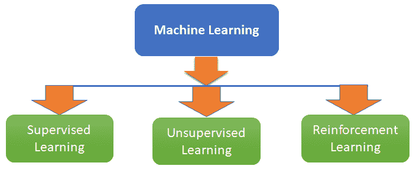

我们将如下解释前面的图示：

+   **监督学习**：在这种学习中，输入变量和输出变量都是我们所知的。在这里，我们应建立输入变量和输出之间的关系，学习将基于这一点。在其下有两种类型的问题，如下所示：

    +   **回归问题**：它有一个连续的输出。例如，一个房价数据集，其中需要根据面积、地区、城市、房间数量等输入变量预测房价。要预测的价格是一个连续变量。

    +   **分类**：它有一个离散的输出。例如，根据薪水、性别、家庭成员数量等预测一个员工是否会离开组织。

+   **无监督学习**：在这种场景中，没有输出变量。我们应根据所有给定的变量提取一个模式。例如，根据年龄、性别、收入等对客户进行细分。

+   **强化学习**：这是机器学习的一个领域，其中采取适当的行动以最大化奖励。例如，训练狗接球并给予奖励——如果它们执行这个动作，我们就奖励狗；否则，我们责备它们，导致惩罚。

# 赖特模型

在赖特模型中，学习曲线函数定义为以下：


变量如下：

+   *Y*：每单位累积平均时间

+   *X*：累积生产的单位数量

+   *a*：生产第一个单位所需的时间

+   *b*：函数在图表纸上绘制时的斜率（学习率的对数/2 的对数）

以下曲线具有一个垂直轴（*y*轴），表示特定工作的学习情况，以及一个对应学习所需时间的水平轴。一个开始陡峭的学习曲线可以理解为快速进步的标志。以下图表显示了**赖特学习曲线模型**：


然而，出现的问题是，*它与机器学习有何关联？*我们现在将详细讨论这个问题。

让我们通过以下步骤讨论一个实际上是监督学习问题的场景：

1.  我们将数据分成一个训练集（我们在其上让系统学习并形成模型）和一个验证集（我们在其上测试系统学习的好坏）。

1.  下一步将是取训练集的一个实例（观察值）并利用它来估计一个模型。训练集上的模型错误将为 0。

1.  最后，我们将找出验证数据上的模型错误。

*第二步*和*第三步*通过取多个实例（训练大小）如 10、50 和 100，研究训练错误和验证错误，以及它们与实例数量（训练大小）的关系来重复。这种曲线——或这种关系——在机器学习场景中被称为**学习曲线**。

让我们处理一个综合发电厂数据集。特征包括每小时平均环境变量，即**温度**（**T**）、**环境压力**（**AP**）、**相对湿度**（**RH**）和排气**真空**（**V**），以预测工厂的净每小时**电能输出**（**PE**）：

```py
# importing all the libraries
import pandas as pd
from sklearn.linear_model import LinearRegression
from sklearn.model_selection import learning_curve
import matplotlib.pyplot as plt

#reading the data
data= pd.read_excel("Powerplant.xlsx")

#Investigating the data
print(data.info())
data.head()
```

从这个结果中，我们能够看到数据中变量的数据结构：


输出结果如下：

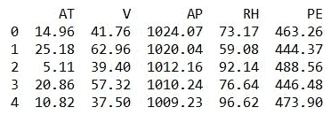

第二个输出可以让你对数据有一个良好的感觉。

数据集有五个变量，其中**环境温度**（**AT**）和 PE（目标变量）。

让我们改变数据的训练大小并研究它对学习的影响。创建了一个`train_size`列表，包含不同的训练大小，如下面的代码所示：

```py
# As discussed here we are trying to vary the size of training set
train_size = [1, 100, 500, 2000, 5000]
features = ['AT', 'V', 'AP', 'RH']
target = 'PE'
# estimating the training score & validation score
train_sizes, train_scores, validation_scores = learning_curve(estimator = LinearRegression(), X = data[features],y = data[target], train_sizes = train_size, cv = 5,scoring ='neg_mean_squared_error')
```

让我们生成`learning_curve`：

```py
# Generating the Learning_Curve
train_scores_mean = -train_scores.mean(axis = 1) 
validation_scores_mean = -validation_scores.mean(axis = 1)
import matplotlib.pyplot as plt 
plt.style.use('seaborn') 
plt.plot(train_sizes, train_scores_mean, label = 'Train_error') 
plt.plot(train_sizes, validation_scores_mean, label = 'Validation_error') 
plt.ylabel('MSE', fontsize = 16) 
plt.xlabel('Training set size', fontsize = 16) 
plt.title('Learning_Curves', fontsize = 20, y = 1) 
plt.legend() 

```

我们得到以下输出：

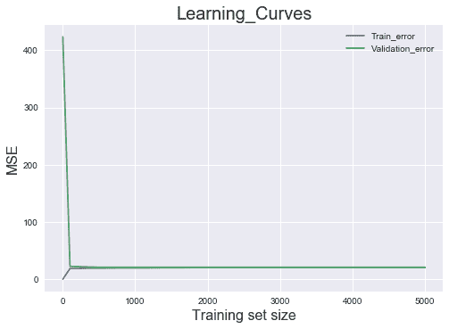

从前面的图中，我们可以看到当训练集大小仅为 1 时，训练误差为 0，但验证误差超过**400**。

随着训练集大小的不断增加（从 1 到 100），训练误差持续上升。然而，随着模型在验证集上的表现越来越好，验证误差开始急剧下降。当训练集大小达到 500 时，验证误差和训练误差开始收敛。那么，我们能从中推断出什么呢？模型的性能不会因为训练数据的量而改变。然而，如果你尝试添加更多特征，可能会产生影响，如下面的图表所示：

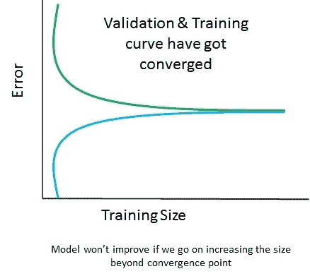

前面的图表显示，验证曲线和训练曲线已经收敛，因此添加训练数据将毫无帮助。然而，在下面的图表中，曲线尚未收敛，因此添加训练数据将是一个好主意：

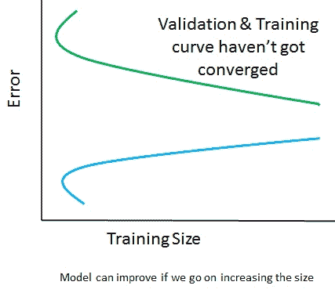

# 曲线拟合

到目前为止，我们已经了解了学习曲线及其重要性。然而，它只有在尝试在可用数据和特征上拟合曲线时才会出现。但曲线拟合是什么意思呢？让我们尝试理解这一点。

曲线拟合实际上就是建立多个特征与目标之间的关系。它有助于找出特征与目标之间的关联类型。

建立关系（曲线拟合）实际上就是提出一个数学函数，该函数应该能够以某种方式解释行为模式，使其成为数据集的最佳拟合。

我们进行曲线拟合的原因有很多：

+   进行系统模拟和优化

+   确定中间点的值（插值）

+   进行趋势分析（外推）

+   进行假设检验

曲线拟合有两种类型：

1.  **精确拟合**：在这种情况下，曲线将通过所有点。在这种情况下没有残差误差（我们很快会讨论什么被认为是误差），现在你可以将误差理解为实际误差与预测误差之间的差异。它可以用于插值，并且主要涉及分布拟合。

下面的图表显示了多项式但精确拟合：

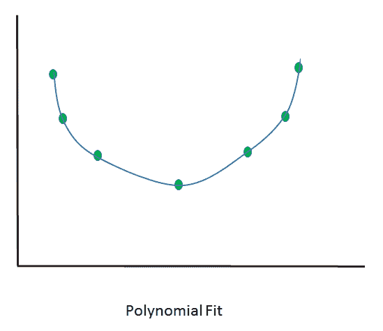

下面的图表显示了直线但精确拟合：


1.  **最佳拟合**：曲线不会通过所有点。将与这个曲线相关的残差。

让我们看看一些不同的场景，并研究它们以了解这些差异。

在这里，我们将为两个数字拟合曲线：

```py
# importing libraries
 import numpy as np
 import matplotlib.pyplot as plt
 from scipy.optimize import curve_fit

# writing a function of Line
 def func(x, a, b):
 return a + b * x 
 x_d = np.linspace(0, 5, 2) # generating 2 numbers between 0 & 5
 y = func(x_d,1.5, 0.7) 
 y_noise = 0.3 * np.random.normal(size=x_d.size)
 y_d = y + y_noise
 plt.plot(x_d, y_d, 'b-', label='data')

 popt, pcov = curve_fit(func, x_d, y_d) # fitting the curve
 plt.plot(x_d, func(x_d, *popt), 'r-', label='fit')
```

从这个结果中，我们将得到以下输出：

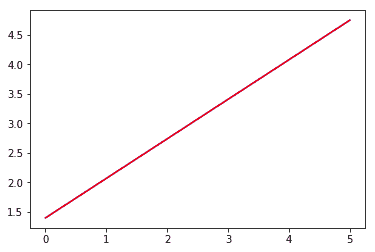

在这里，我们使用了两个点来拟合直线，我们可以清楚地看到它变成了一个**精确的拟合**。当我们引入三个点时，我们会得到以下结果：

```py
 x_d = np.linspace(0, 5, 3) # generating 3 numbers between 0 & 5
```

运行整个代码并关注输出：

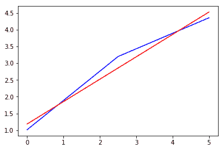

现在，你可以看到漂移和噪声的影响。它已经开始呈现出曲线的形状。一条直线可能在这里不是一个好的拟合（然而，说得太早了）。它不再是一个精确的拟合。

如果我们尝试引入 100 个点并研究其效果呢？到目前为止，我们知道如何引入点的数量。

通过这样做，我们得到以下输出：

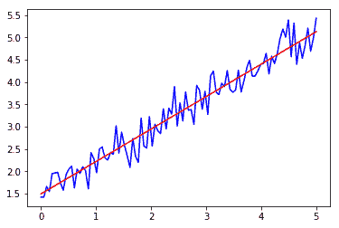

这不是一个精确的拟合，而是一个试图概括整个数据集的最佳拟合。

# 残差

残差是观察值或真实值与预测（拟合）值之间的差异。例如，在以下图中，一个残差是**(A-B)**，其中**A**是观察值，**B**是拟合值：

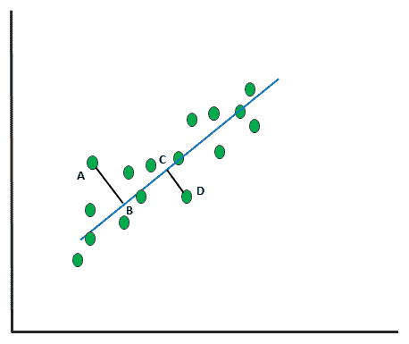

前面的散点图表明我们正在拟合一条可能代表所有数据点行为的直线。然而，值得注意的是，这条线并没有穿过所有点。大多数点都在线上方。

残差的和与平均值总是为 0。*∑e =0* 和 *e =0* 的平均值。

# 统计建模——莱奥·布雷曼的两种文化

每当我们试图分析数据并最终做出预测时，我们会考虑两种方法，这两种方法都是由加州大学伯克利分校教授莱奥·布雷曼在他的 2001 年论文《统计建模：两种文化》中发现的。

任何分析都需要数据。分析可以如下进行：


**X**（**特征**）向量经过一个自然箱，这转化为响应。自然箱试图建立**X**和**Y**之间的关系。通常，这个分析有一些目标，如下所示：

+   **预测**：用未来的输入特征来预测响应

+   **信息**：找出并理解响应和驱动输入变量之间的关联

布雷曼指出，在解决商业问题时，有两种截然不同的方法：

+   **数据建模文化**：在这种模型中，自然以随机模型的形式出现，该模型估计必要的参数。线性回归、逻辑回归和 Cox 模型通常在自然框下运行。这种模型讨论的是观察数据的模式，并试图设计出对所观察到的内容的近似。基于他们的经验，科学家或统计学家会决定使用哪种模型。这是模型在问题和数据之前的情况，从这个模型中得出的解决方案更倾向于模型架构。Breiman 说，过度依赖这种方法并不能帮助统计学家应对各种问题。当涉及到地震预测、降雨预测和全球变暖原因的解决方案时，它不会给出准确的结果，因为这种方法不关注准确性，而是关注两个目标。

+   **算法建模文化**：在这种方法中，使用预先设计的算法来做出更好的近似。在这里，算法使用复杂的数学来得出结论，并在自然框内运行。随着计算能力的提高和使用这些模型，很容易复制驱动因素，因为模型会一直运行，直到它学会并理解驱动结果的模式。这使得我们能够解决更复杂的问题，并更强调准确性。随着数据的增加，它比数据建模文化能给出更好的结果。

# 训练数据 - 开发数据 - 测试数据

这是在构建模型过程中最重要的步骤之一，它可能导致关于我们是否真的需要所有三个集合（训练集、开发集和测试集）以及如果需要，这些数据集应该如何划分的许多争论。让我们理解这些概念。

在我们有足够的数据开始建模后，我们首先需要做的是将数据分成三个部分，即**训练集**、**开发集**和**测试集**：


让我们考察拥有这三个集合的目标：

1.  **训练集**：训练集用于训练模型。当我们应用任何算法时，我们是在训练集中拟合参数。在神经网络的情况下，找到权重就发生在训练集中。

假设在一个场景中，我们正在尝试拟合不同次数的多项式：

+   +   *f(x) = a + bx* → 1^(st) 次多项式

    +   *f(x) = a + bx + cx²* → 2^(nd) 次多项式

    +   *f(x) = a + bx + cx² + dx³* → 3^(rd) 次多项式

在拟合模型后，我们计算所有拟合模型的训练误差：


我们不能仅根据训练误差来评估模型的好坏。如果我们这样做，可能会导致我们得到一个有偏见的模型，这个模型可能无法在未见过的数据上表现良好。为了解决这个问题，我们需要转向开发集。

1.  **开发集**：这也被称为**保留集**或**验证集**。这个集合的目标是调整我们从训练集得到的参数。它也是对模型性能评估的一部分。根据其性能，我们必须采取步骤来调整参数。例如，控制学习率、最小化过拟合和选择最佳模型都发生在开发集中。在这里，同样会计算开发集误差，并在看到哪个模型产生最小误差后对模型进行调整。在这个阶段产生最小误差的模型仍然需要调整以最小化过拟合。一旦我们确信了最佳模型，它就会被选择，然后我们转向测试集。

1.  **测试集**：测试集主要用于评估最佳选择的模型。在这个阶段，计算模型的准确度，如果模型的准确度没有太大偏离训练准确度和开发准确度，我们就将这个模型部署上线。

# 训练集、开发集和测试集的大小

通常，机器学习从业者会选择三个集合的大小比例为 60:20:20 或 70:15:15。然而，并没有一条硬性规定说开发集和测试集应该大小相等。以下图表显示了训练集、开发集和测试集的不同大小：


以下是一个三个不同集合的另一个例子：


但我们如何处理大数据的场景呢？例如，如果我们有 1000 万条记录或观测值，我们该如何划分数据？在这种情况下，机器学习从业者会将大部分数据用于训练集——多达 98-99%——其余的则分配给开发集和测试集。这样做是为了让从业者能够考虑不同类型的场景。因此，即使我们只有 1%的数据用于开发集和测试集，我们最终也会得到 10 万条记录，这是一个很好的数字。

# 偏差-方差权衡

在我们开始建模并试图弄清楚权衡是什么之前，让我们从以下图表中了解偏差和方差是什么：


在偏差-方差权衡中，产生了两种类型的误差，如下所示：

+   **训练误差**：这是在用训练输入预测输出时，拟合值与实际值之间偏差的度量。这个误差主要取决于模型的复杂度。随着模型复杂度的增加，误差似乎会急剧下降。

+   **开发错误**：这是预测值偏差的度量，开发集作为输入（在训练数据上使用相同模型的情况下）用于实际值。在这里，预测是在未见过的数据上进行的。我们需要最小化这个错误。最小化这个错误将决定这个模型在实际场景中的好坏。

随着算法复杂性的不断增加，训练错误会下降。然而，开发错误或验证错误会持续下降直到某个点，然后上升，如下面的图表所示：

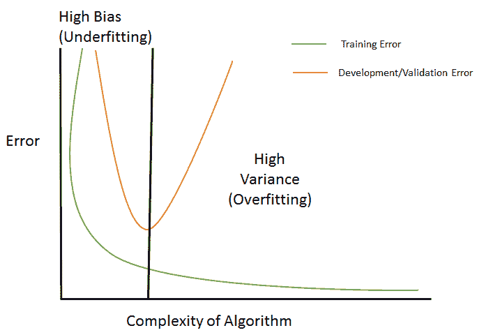

上述图表可以这样解释：

+   **欠拟合**：每个数据集都有特定的模式和属性，这是由于数据集中存在的变量所导致的。除此之外，它还有由不是数据集部分的变量引起的随机和潜在模式。每当我们要提出一个模型时，理想情况下模型应该从现有变量中学习模式。然而，这些模式的学习也取决于你的算法有多好、有多稳健。假设我们选择了一个无法从数据集中推导出基本模式的模型——这被称为**欠拟合**。在前面的图表中，这是一个分类场景，我们正在尝试对*x*和*o*进行分类。在图 1 中，我们试图使用线性分类算法对数据进行分类，但我们可以看到它导致了大量的误分类错误。这是一个欠拟合的例子。

+   **过拟合**：从图 1 进一步扩展，我们试图使用复杂的算法来找出模式并进行分类。值得注意的是，在第二个图表中，误分类错误已经下降，因为在这里使用的复杂模型能够检测到模式。开发错误（如前图所示）也下降了。我们将增加模型的复杂性并观察会发生什么。图 3 表明，现在模型中没有误分类错误。然而，如果我们看下面的图表，我们可以看到开发错误现在非常高。这是因为模型正在从数据集中不存在的变量所展示的误导性和随机模式中学习。这意味着它已经开始学习集合中存在的噪声。这种现象被称为**过拟合**。

+   **偏差**：我们见过这种情况有多少次？这种情况发生在我们使用了一个算法，但它并不合适。这意味着在这里被使用的函数对这个场景的相关性很小，并且它无法提取正确的模式。这导致了一个称为**偏差**的错误。这种情况主要是由于对数据做出了一定的假设，并使用了一个可能正确但并不正确的模型。例如，如果我们必须为某种情况使用二次多项式，我们会使用简单的线性回归，这并不能建立响应变量和解释变量之间的正确关系。

+   **方差**：当我们有一个用于训练模型的训练数据集时，即使我们将训练集更改为来自同一群体的集合，模型也应该保持免疫。如果数据集中的变化导致模型性能的变化，这被称为**方差错误**。这种情况是由于模型学习到了噪声（未解释的变化）而发生的，因此，这个模型在未见过的数据上不能给出好的结果：


我们将如下解释前面的图表：

+   如果**训练误差**下降，而（**开发误差**-**训练误差**）上升，这意味着**高方差**的情况（前表中的第 1 种情况）

+   如果**训练误差**和**开发误差**上升，而（**开发误差**-**训练误差**）下降，这意味着**高偏差**的情况（前表中的第 2 种情况）

+   如果**训练误差**和**开发误差**上升，并且（**开发误差**-**训练误差**）也上升，这意味着**高偏差**和**高方差**（前表中的第 3 种情况）

+   如果**训练误差**上升，而**开发误差**下降，即（**开发误差**-**训练误差**）下降，这意味着**低偏差**和**低方差**（前表中的第 4 种情况）

我们应该始终努力追求第 4 种情况，即训练误差低，以及开发集误差低。在前表中，这就是我们必须找出偏差-方差权衡的地方，它由一条垂直线表示。

现在，以下问题产生了：我们如何对抗过拟合？让我们通过继续下一节来找出这个答案。

# 正则化

现在我们对机器学习建模中过拟合的含义有了相当的了解。只是为了重申，当模型学习到数据中渗透的噪声时，它试图学习由于随机机会发生的模式，因此发生过拟合。由于这种现象，模型的泛化能力受到威胁，它在未见过的数据上的表现不佳。因此，模型的准确性急剧下降。

我们能否对抗这种现象？答案是肯定的。正则化来拯救。让我们弄清楚它能提供什么以及它是如何工作的。

正则化是一种技术，它使模型不会变得复杂，以避免过拟合。

让我们看一下下面的回归方程：


这个损失函数如下所示：


损失函数有助于调整系数并检索最优值。在训练数据中存在噪声的情况下，系数不会很好地泛化，并会遇到过拟合。正则化通过使这些估计或系数趋向于 0 来解决这个问题。

现在，我们将介绍两种类型的正则化。在后面的章节中，将介绍其他类型。

# 岭回归（L2）

由于岭回归，我们需要对损失函数做一些修改。原始损失函数通过一个收缩成分来增加：


现在，这个修改后的损失函数需要被最小化以调整估计或系数。在这里，lambda 正在调整正则化损失函数的参数。也就是说，它决定了应该对模型的灵活性进行多少惩罚。模型的灵活性取决于系数。如果模型的系数增加，灵活性也会增加，这对我们的模型来说不是好兆头。同样，当系数减少时，灵活性受到限制，模型开始表现更好。每个估计参数的收缩使模型在这里变得更好，这就是岭回归所做的事情。当 lambda 不断升高时，即λ → ∞，惩罚成分增加，估计开始缩小。然而，当λ **→ 0**时，惩罚成分减少并开始成为一个**普通最小二乘法**（OLS）来估计线性回归中的未知参数。

# 最小绝对收缩和选择算子

**最小绝对收缩和选择算子**（LASSO）也称为*L1*。在这种情况下，前面的惩罚参数被*|βj|*替换：


通过最小化前面的函数，找到并调整系数。在这种情况下，当 lambda 变得更大，λ → ∞，惩罚成分增加，因此估计开始缩小并变为 0（在岭回归的情况下不会发生；相反，它只会接近 0）。

# 交叉验证和模型选择

我们已经讨论了过拟合。这与模型的不稳定性有关，因为模型的真正测试发生在它处理未见和新的数据时。模型最重要的一个方面是，它不应该捕捉到噪声，而不仅仅是常规模式。

验证只是确保模型是响应和预测变量之间关系的一种保证，作为输入特征的输出结果，而不是噪声。一个良好的模型指标不是通过训练数据和错误来衡量。这就是为什么我们需要交叉验证。

在这里，我们将坚持使用 k 折交叉验证，并了解它是如何被使用的。

# K 折交叉验证

让我们一步步了解 k 折交叉验证的步骤：

1.  数据被划分为 k 个子集。

1.  一组数据被保留用于测试/开发，而模型建立在其余数据(*k-1*)上。也就是说，其余的数据形成训练数据。

1.  *第二步*会重复 k 次。也就是说，一旦前一步完成，我们就转向第二组，并形成测试集。剩下的(*k-1*)数据随后可用于构建模型：


4. 计算一个错误并取所有 k 次试验的平均值。

每个子集都有一次机会成为验证/测试集，因为大部分数据被用作训练集。这有助于减少偏差。同时，几乎所有数据都被用作验证集，这有助于减少方差。

如前图所示，*k = 5*已被选择。这意味着我们必须将整个数据集划分为五个子集。在第一次迭代中，子集 5 成为测试数据，其余成为训练数据。同样，在第二次迭代中，子集 4 变为测试数据，其余成为训练数据。这个过程会持续五次迭代。

现在，让我们尝试用 Python 通过使用 K 近邻分类器来分割训练数据和测试数据来完成这个任务：

```py
from sklearn.datasets import load_breast_cancer # importing the dataset
from sklearn.cross_validation import train_test_split,cross_val_score # it will help in splitting train & test
from sklearn.neighbors import KNeighborsClassifier
from sklearn import metrics

BC =load_breast_cancer() 
X = BC.data
y = BC.target

X_train, X_test, y_train, y_test = train_test_split(X, y, random_state=4)

knn = KNeighborsClassifier(n_neighbors=5)
knn.fit(X_train, y_train)
y_pred = knn.predict(X_test)
print(metrics.accuracy_score(y_test, y_pred))

knn = KNeighborsClassifier(n_neighbors=5)
scores = cross_val_score(knn, X, y, cv=10, scoring='accuracy')
print(scores)
print(scores.mean())
```

# 使用交叉验证进行模型选择

我们可以通过以下代码使用交叉验证来找出哪个模型表现更好：

```py
knn = KNeighborsClassifier(n_neighbors=20)
print(cross_val_score(knn, X, y, cv=10, scoring='accuracy').mean())
```

10 折交叉验证如下：

```py
# 10-fold cross-validation with logistic regression
from sklearn.linear_model import LogisticRegression
logreg = LogisticRegression()
print(cross_val_score(logreg, X, y, cv=10, scoring='accuracy').mean())
```

# 0.632 规则在自助法中

在我们深入探讨自助法中的 0.632 规则之前，我们需要了解什么是自助法。自助法是从由*n*个观察组成的总体中进行有放回随机抽样的过程。在这种情况下，样本可以包含重复的观察。例如，如果总体是(2,3,4,5,6)，而我们试图抽取两个大小为 4 的随机样本，那么样本 1 将是(2,3,3,6)，样本 2 将是(4,4,6,2)。

现在，让我们深入了解 0.632 规则。

我们已经看到，在使用预测估计训练误差时，*1/n ∑L(y[i,]y-hat)*。这实际上就是损失函数：


交叉验证是一种估计样本误差预期输出的方法：


然而，在 k 折交叉验证的情况下，它如下所示：


在这里，训练数据是*X=(x1,x2.....,xn)*，我们从该集合中抽取自助样本*(z1,.....,zb)*，其中每个*zi*是一组*n*个样本。

在这个场景中，以下是我们样本外误差：


在这里，*fb(xi)* 是从拟合到 bootstrap 数据集的模型在 *xi* 处的预测值。

不幸的是，这并不是一个特别好的估计器，因为用于生成 *fb(xi)* 的 bootstrap 样本可能已经包含了 *xi*。OOSE 解决了过拟合问题，但仍然存在偏差。这种偏差是由于在带有替换的抽样中产生的 bootstrap 样本中的非独特观察结果。每个样本中独特观察的平均数量约为 *0.632n*。为了解决偏差问题，Efron 和 Tibshirani 提出了 *0.632* 估计器：


# 模型评估

让我们看看目前正在使用的某些模型评估技术。

# 混淆矩阵

混淆矩阵是一个表格，有助于评估分类模型的好坏。它在已知真实值/标签时使用。大多数数据科学领域的初学者都会对混淆矩阵感到害怕，认为它比实际情况更难理解；让我告诉你——它相当简单且容易理解。

让我们通过一个例子来理解这一点。假设我们构建了一个分类模型，用于预测客户是否会购买某种产品。为此，我们需要在未见过的数据上评估模型。

有两个类别：

+   **是**：客户会购买产品

+   **否**：客户不会购买产品

从这里，我们构建了以下矩阵：


从前面的矩阵中，我们可以得出哪些推断？

+   分类器总共做出了 80 次预测。这意味着总共测试了 80 名客户，以确定他们是否会购买产品。

+   **54** 名客户购买了产品，而 **26** 名没有。

+   分类器预测 **56** 名客户会购买产品，而 **24** 名不会：

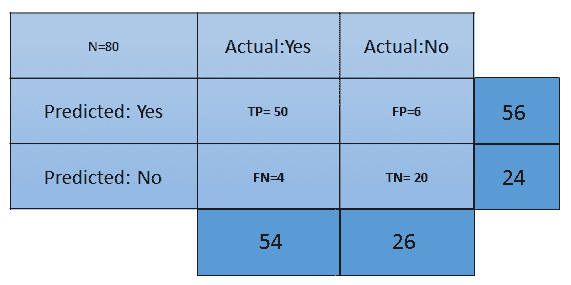

与混淆矩阵相关的不同术语如下：

+   **真阳性 (TP)**: 这些是我们预测客户会购买产品，而他们确实购买了的情况。

+   **真阴性 (TN)**: 这些是我们预测客户不会购买产品，而他们确实没有购买的情况。

+   **假阳性 (FP)**: 我们预测客户会购买产品，但他们没有。这被称为*类型 1*错误。

+   **假阴性 (FN)**: 我们预测 *不*，但客户购买了产品。这被称为*类型 2*错误。

现在，让我们谈谈评估分类模型所需的几个指标：

+   **准确率**: 这衡量了分类器的整体准确度。为了计算这个值，我们将使用以下公式：*(TP+TN)/总案例数*。在先前的场景中，准确率是(50+20)/80，结果是 0.875。因此，我们可以说这个分类器在 87.5%的场景中会做出正确的预测。

+   **误分类率**: 这衡量了分类器结果错误发生的频率。公式*(FP+FN)/总案例数*将给出结果。在先前的场景中，误分类率是*(6+4)/80*，即 0.125。因此，在 12.5%的案例中，它不会产生正确的结果。它也可以用(1-准确率)来计算。

+   **TP 率**: 这是一个衡量预测答案为*是*的概率，并且实际答案确实是*是*的指标。计算这个指标的公式是**TP/(实际:是)**。在这个场景中，*TPR = (50/54)= 0.92*。它也被称为**灵敏度**或**召回率**。

+   **FP 率**: 这是一个衡量预测答案为*是*，而实际答案是*否*的概率的指标。计算这个率的公式是**FP/(实际:否)**。在先前的例子中，*FPR = (6/26)= 0.23*。

+   **TN 率**: 这衡量的是当答案是*否*时，预测*否*的概率。计算这个率的公式是*TN/(实际:否)*。在这个场景中，*TNR= (20/26)= 0.76*。它也可以用(1-FPR)来计算。它也被称为**特异性**。

+   **精确率**: 这衡量了在所有预测为*是*的预测中预测*是*的正确性。它找出在总的*是*预测中，预测为*是*的正确次数。计算这个的公式是*TP/(预测:是)*。在这里，*精确率 = (50/56)=0.89*。

+   **患病率**: 这衡量了在总样本中给出*是*的比例。公式是*(实际:是/总样本)*。在这里，这是*54/80 = 0.67*。

+   **空错误率**: 这衡量了如果分类器只预测多数类，它会有多错误。公式是*(实际:否/总样本)*。在这里，这是*26/80=0.325*。

+   **Cohen's Kappa 值**: 这是一个衡量分类器性能相对于仅凭机会表现的好坏程度的指标。

+   **F-Score**: 这是召回率和精确率的调和平均数，即*(2*召回率*精确率)/(召回率+精确率)*。它将召回率和精确率都视为模型评估的重要指标。F-Score 的最佳值是 1，此时召回率和精确率都达到最大。F-Score 的最差值是 0。分数越高，模型越好：

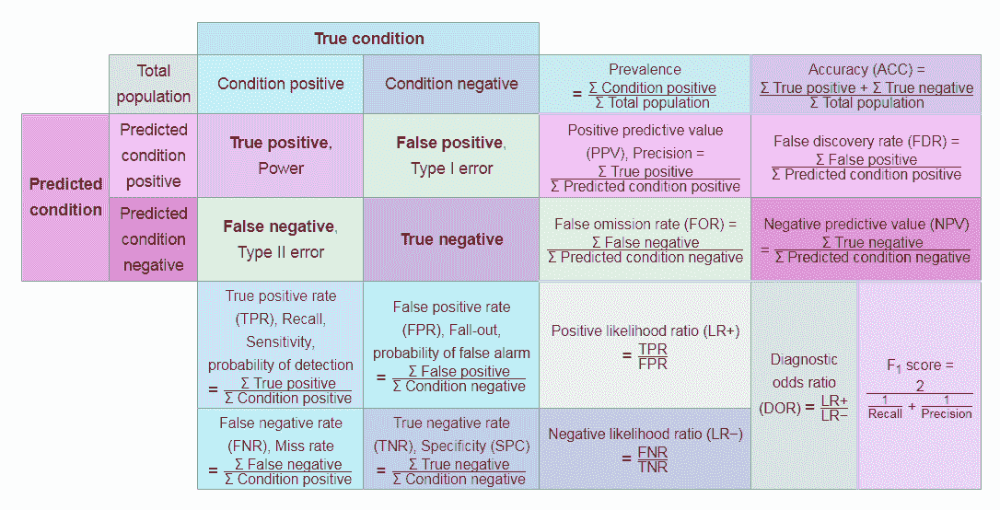

# 接收者操作特征曲线

我们遇到过许多初露头角的数据科学家，他们构建模型，并以评估的名义，只是满足于**整体准确性**。然而，这并不是评估模型的正确方法。例如，假设有一个数据集，其响应变量有两个类别：愿意购买产品的客户和不愿意购买产品的客户。假设该数据集中有 95%的客户不愿意购买产品，5%的客户愿意购买。假设分类器能够正确预测多数类而不是少数类。所以，如果有 100 个观测值，*TP=0*，*TN=95*，其余的都被错误分类，这仍然会导致 95%的准确率。然而，不能得出这是一个好模型的结论，因为它根本无法对少数类进行分类。

因此，我们需要超越准确性，以便对模型有更好的判断。在这种情况下，召回率、特异性、精确度和**接收者操作特征**（ROC）曲线就派上用场了。我们在上一节中学习了召回率、特异性和精确度。现在，让我们了解 ROC 曲线是什么。

大多数分类器产生的分数介于 0 和 1 之间。下一步发生在我们设置阈值时，根据这个阈值，分类被决定。通常，0.5 是阈值——如果它大于 0.5，就创建一个类别 1，如果阈值小于 0.5，它就属于另一个类别 2：


对于 ROC，**0.0**到**1.0**之间的每个点都被视为一个阈值，因此阈值线持续从**0.0**移动到**1.0**。阈值将导致我们得到 TP、TN、FP 和 FN。在每一个阈值，以下指标都会被计算：

+   *真阳性率 = TP/(TP+FN)*

+   *真阴性率 = TN/(TN + FP)*

+   *假阳性率 = 1 - 真阴性率*

（TPR 和 FPR）的计算从 0 开始。当阈值线在 0 时，我们将能够将所有愿意购买的客户（正例）分类，而不愿意购买的客户将被错误分类，因为会有太多的假阳性。这意味着阈值线将从零开始向右移动。随着这种情况的发生，假阳性开始下降，真阳性将继续增加。

最后，我们需要在计算了每个阈值点后的 TPR 和 FPR 后，绘制一个 TPR 与 FPR 的图表：


红色对角线代表随机分类，即没有模型的分类。完美的 ROC 曲线将沿着**y**轴延伸，并呈现一个绝对三角形的形状，穿过**y**轴的顶部。

# ROC 曲线下的面积

为了评估模型/分类器，我们需要确定**ROC 曲线下面积**（**AUROC**）。这个图的总面积是 1，因为 FPR 和 TPR 的最大值都是 1。因此，它呈现出一个正方形的形状。随机线完美地定位在 45 度角，将整个区域分成两个对称且等边的三角形。这意味着红色线以下和以上的面积都是 0.5。最佳和完美的分类器将是试图将 AUROC 达到 1 的那个。AUROC 越高，模型就越好。

在你拥有多个分类器的情况下，你可以使用 AUROC 来确定其中哪一个是最优的。

# H 度量

二元分类必须应用技术，以便将独立变量映射到不同的标签。例如，存在一些变量，如性别、收入、现有贷款数量以及按时/不按时付款，这些变量被映射以产生一个分数，帮助我们将客户分类为良好客户（更有可能付款）和不良客户。

通常，每个人都似乎陷入了误分类率或其导出的形式，因为众所周知，**曲线下面积**（**AUC**）是我们分类模型的最佳评估者。你是通过将误分类的实例总数除以实例总数来得到这个率的。但这真的给我们一个公平的评估吗？让我们看看。在这里，我们有一个误分类率，它隐藏了一些重要的东西。很多时候，分类器会提出一个调整参数，其副作用往往是倾向于优先考虑假阳性而不是假阴性，或者反之亦然。此外，将 AUC 作为唯一的模型评估者可能会对我们产生双重打击。AUC 对不同分类器有不同的误分类成本，这是不可取的。这意味着使用这个相当于使用不同的指标来评估不同的分类规则。

正如我们已经讨论过的，任何分类器的真正测试发生在未见过的数据上，这会在模型上造成一些小数点的损失。相反，如果我们有前面提到的那种场景，决策支持系统将无法很好地执行。它将开始产生误导性的结果。

H 度量克服了不同分类器产生不同误分类成本的情况。它需要一个严重性比率作为输入，该比率检查将一个类别 0 实例误分类比将一个类别 1 实例误分类严重多少：

*严重性比率 = cost_0/cost_1*

在这里，*cost_0 > 0* 是将类别 0 数据点误分类为类别 1 的成本。

有时考虑归一化成本 *c = cost_0/(cost_0 + cost_1)* 更为方便。例如，*severity.ratio = 2* 意味着假阳性成本是假阴性的两倍。

# 维度降低

让我们讨论一个场景，即我们从一个银行得到了一个数据集，它包含了与银行客户相关的特征。这些特征包括客户的收入、年龄、性别、支付行为等。一旦你查看数据维度，你就会意识到有 850 个特征。你被要求构建一个模型来预测如果发放贷款，哪些客户将会违约。你会使用所有这些特征来构建模型吗？

答案应该是明确的 **不**。数据集中特征越多，模型过拟合的可能性就越大。尽管拥有较少的特征并不能保证不会发生过拟合，但它减少了这种可能性。这不是一个坏交易，对吧？

维度降低是处理这种问题的方法之一。它意味着在特征空间中减少维度。

有两种实现方式：

+   **特征消除**：这是一个过程，其中拒绝了对模型没有贡献的特征。这样做会使模型非常简单。我们知道，根据奥卡姆剃刀原理，在构建模型时我们应该追求简单。然而，执行此步骤可能会导致信息丢失，因为这种变量的组合可能对模型有影响。

+   **特征提取**：这是一个过程，我们创建新的独立变量，这些变量是现有变量的组合。根据这些变量的影响，我们保留或删除它们。

主成分分析是一种特征提取技术，它考虑了所有变量，并形成了变量的线性组合。随后，可以删除最不重要的变量，同时保留该变量的最重要部分。

新形成的变量（成分）彼此独立，这可以是一个模型构建过程中的福音，其中数据分布是线性可分的。线性模型的基本假设是变量彼此独立。

要理解 PCA 的功能，我们必须熟悉几个术语：

+   **方差**：这是从平均值平均平方偏差的度量。它也被称为 **分散度**，它衡量数据的可变性：


在这里，*x* 是平均值。

+   **协方差**：这是衡量两个变量在同一方向上移动程度的度量：


在 PCA 中，我们通过以下方式找出数据的模式：在数据集以 *n* 维度表示时具有高协方差的情况下，我们用相同 *n* 维度的线性组合来表示这些维度。这些组合是相互正交的，这也是它们相互独立的原因。此外，维度按照方差排序。最上面的组合排在第一位。

让我们通过以下步骤来了解 PCA 是如何工作的：

1.  让我们把我们的数据集分成 *Y* 和 *X* 两部分，并只关注 *X*。

1.  一个以 *X* 为矩阵，并使用均值为 0 和标准差为 *1* 进行标准化的矩阵被选取。让我们称这个新的矩阵为 *Z*。

1.  现在我们来处理 *Z*。我们需要对其进行转置，并将转置后的矩阵与 *Z* 相乘。通过这样做，我们得到了我们的协方差矩阵：

*协方差矩阵 = Z^TZ*

1.  现在，我们需要计算 *Z^TZ* 的特征值及其对应的特征向量。通常，协方差矩阵分解为 *PDP*⁻¹，其中 *P* 是特征向量矩阵，*D* 是对角矩阵，其对角线上的元素是特征值，其余位置都是 0。

1.  取特征值 *λ₁*，*λ₂*，…，*λp* 并按从大到小的顺序排序。在这个过程中，按照相应的顺序对 *P* 中的特征向量进行排序。称这个排序后的特征向量矩阵为 *P**。

1.  计算 *Z**= *ZP**。这个新的矩阵，*Z**，是 *X* 的中心化/标准化版本，但现在每个观测值都是原始变量的组合，其中权重由特征向量确定。作为额外的好处，因为我们的 *P** 中的特征向量彼此独立，所以 *Z** 的列也彼此独立。

# 概述

在本章中，我们研究了统计模型、学习曲线和曲线拟合。我们还研究了 Leo Breiman 介绍的两个文化，它们描述了任何分析都需要数据。我们探讨了不同类型的训练、开发和测试数据，包括它们的大小。我们研究了正则化，它解释了在机器学习建模中过拟合的含义。

本章还解释了交叉验证和模型选择、自助法中的 0.632 规则，以及 ROC 和 AUC 的深入探讨。

在下一章中，我们将研究评估核学习，这是机器学习中应用最广泛的方法。
