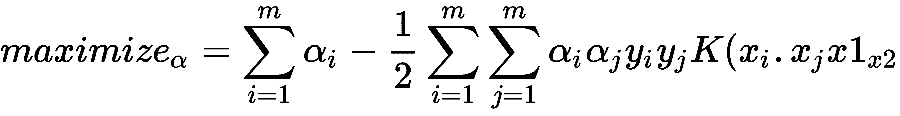

# 第二章：评估核学习

在机器学习中，模式识别是一个被彻底探索的领域。有许多方法和算法可以推动这种工作和分析。然而，在本章中，我们将尝试专注于核如何对整个机器学习前景产生重大影响。核学习的应用没有界限：从简单的回归问题到计算机视觉分类，它无处不在。**支持向量机**（**SVM**）是那些利用核学习的方法之一。

在本章中，我们将关注以下概念：

+   向量、线性可分性和超平面概念

+   SVM

+   核技巧

+   高斯过程

+   参数优化

# 向量简介

在继续探讨核心主题之前，我们希望为达到那个目标打下基础。因此，本章的这一部分非常重要。它可能对你来说很熟悉，你们中的许多人都会对此有所了解。然而，通过这条途径将设定流程。

向量是一个既有方向又有大小的对象。它由一个箭头和一个空间中的坐标 (*x*, *y*) 表示，如下面的图所示：


如前图所示，向量 OA 的坐标为 *(4,3)*：

*向量 OA= (4,3)*

然而，仅用坐标定义向量是不够的——我们还需要一个方向。这意味着从 *x* 轴的方向。

# 向量的模

向量的模也称为**范数**。它由 *||OA||* 表示：


要找出这个向量的模长，我们可以遵循勾股定理：

*OA² = OB² + AB²*

*= 4² + 3²*

*= 16 + 9*

*= 25*

因此：

*OA = √25 = 5*

*||OA||= 5*

所以，如果有一个向量 *x = (x[1], x[2], ..., x[n])*：

*||x||= x[1]² + x[2]² + ... + x[n]²*

以及这个向量的方向如下：


# 点积

两个向量的点积返回一个恰好是标量的数。它表示两个向量如何相互关联。

几何上，两个向量 *x* 和 *y* 的点积如下：

*x . y= ||x|| ||y|| cosθ*

*θ* 是向量 *x* 和 *y* 之间的角度。

然而，从代数上，我们得到以下结果：


几何上，我们得到以下结果：

*θ=β-α*

*cosθ=cos(β-α)*

*cosθ = cosβ cosα + sinβ sinα*

*cosθ = (x[1]/||x||) (y[1]/||y||) + (x[2]/||x||) (y[2]/||y||)*

*||x|| ||y|| cosθ= x[1]y[1] + x[2]y[2]*

*x . y = x[1]y[1] + x[2]y[2]*

# 线性可分性

线性可分性意味着如果有两个类别，那么将有一个点、线、平面或超平面将输入特征分割成这样的方式，即一个类别的所有点都在一个半空间中，而第二个类别在另一个半空间中。

例如，这里有一个基于面积和价格出售房屋的案例。我们为此得到了一些数据点以及类别，即房屋**已售出**/**未售出**：


在前面的图中，所有的 **N** 都代表**未售出**（事件）类别，这是基于房屋的**价格**和**面积**推导出来的，而所有的 **S** 代表**已售出**的房屋类别。**N** 和 **S** 的数量代表确定类别的数据点数量。

在第一幅图中，**N** 和 **S** 非常接近，并且更随机，因此很难实现线性可分，无论你如何尝试分离两个类别，至少有一个会在错误分类的区域。这意味着不可能有一条正确的线来分离这两个类别。但第二幅图描述的是根据给定条件可以轻松分离的数据集。

分离方法根据维度数而变化。如果只有一个维度的情况，我们可以有一个点来分离类别。增加更多维度将需要不同的排列来分割类别。一旦我们有了 2D 情况，就需要一条线（如之前所见）来分离它。同样，超过 2D 将需要平面（一组点）来分离类别，如下所示：


分离方法：

| **维度数** | **分离方法** |
| --- | --- |
| 1 | 点 |
| 2 | 直线 |
| 3 | 平面 |

如果我们有超过 3D 的情况呢？我们该怎么办？有什么解决方案？有什么猜测？

# 超平面

你们中的许多人可能已经猜对了。当我们涉及到超过 3D 的情况时，我们会使用超平面。我们将用一点数学来定义它。

一个线性方程看起来是这样的：*y = ax + b* 有两个变量，*x* 和 *y*，以及一个 *y*-截距，即 *b*。如果我们把 *y* 重命名为 *x[2]*，把 *x* 重命名为 *x[1]*，那么方程就变成了 *x[2]=ax[1] + b*，这等价于 *ax[1] - x[2] + b=0*。如果我们定义二维向量为 *x= (x[1],x[2])* 和 *w=(a,-1)*，并且使用点积，那么方程就变成了 *w.x + b = 0*。

记住，*x.y = x[1]y[1] + x[2]y[2]*。

因此，超平面是一组满足前述方程的点集。但是，我们如何借助超平面进行分类呢？

我们定义一个假设函数 *h*：

*h(x[i]) = +1 if w.x[i] + b ≥ 0*

*-1 if w.x[i] + b < 0*

这可能等同于以下内容：

*h(x[i])= sign(w.x[i] + b)*

它也可以等同于以下内容：

*sign(w.x[i]) if (x[0]=1 and w[0]=b)*

这意味着它将使用 *x* 相对于超平面的位置来预测 *y* 的值。位于超平面一侧的数据点得到一个分类，而位于超平面另一侧的数据点得到另一个分类。

因为它使用超平面的方程，而这个方程恰好是值的线性组合，所以它被称为 **线性分类器**。超平面的形状由 *w* 决定，因为它有 b 和 a 元素，这些元素负责形状。

# SVM

现在我们准备好理解支持向量机（SVM）。SVM 是一种算法，使我们能够将其用于分类和回归。给定一组示例，它构建一个模型将一组观测值分配到一个类别，并将其他观测值分配到第二个类别。它是一个非概率线性分类器。训练数据线性可分是关键。所有观测值或训练数据都是映射到空间的向量的表示，SVM 通过使用尽可能宽的边界来尝试对它们进行分类：


假设有两个类别 **A** 和 **B**，如前述截图所示。

并且从上一节中，我们学到了以下内容：

*g(x) = w. x + b*

其中：

+   *w*：权重向量，决定超平面的方向

+   *b*：偏差项，通过偏差决定超平面在 n 维空间中的位置

上述方程也被称为 **线性判别函数**。如果有一个向量 *x[1]* 位于超平面的正侧，方程变为以下形式：

*g(x[1])= w.x[1] +b >0*

方程将变为以下形式：

*g(x[1])<0*

如果 *x[1]* 位于超平面的正侧。

如果 *g(x[1])=0* 会怎样？你能猜到 *x[1]* 会在哪里吗？嗯，是的，它会在超平面上，因为我们的目标是找出向量的类别。

因此，如果 *g(x[1])>0 => x[1]* 属于 **类别 A**，*g(x[1])<0 => x[1]* 属于 **类别 B**。

在这里，很明显我们可以使用前面的方程进行分类。但你看到了问题吗？假设边界线如下所示：


即使在上述情况下，我们也能对这些特征向量进行分类。但这是否可取？在这里可以看到，边界线或分类器接近 **类别 B**。这意味着它给 **类别 A** 带来了很大的偏差，但惩罚了 **类别 B**。因此，由于靠近边界的向量中的任何干扰，它们可能会跨越并成为 **类别 A** 的一部分，这可能是错误的。因此，我们的目标是找到一个具有最宽边界的最优分类器，就像以下图中所示：


通过支持向量机（SVM），我们试图创建一个边界或超平面，使得每个特征向量到边界的距离最大化，这样任何微小的噪声或干扰都不会导致分类的改变。因此，在这种情况下，如果我们尝试引入某些属于 *xi* 类别的 *y[i]*，我们会得到以下结果：

*y[i]= ± 1*

*y[i] (w.x[i] + b)* 将始终大于 0。*yi >0* 因为当 *x[i ]∈ 类别 A* 时，*w.x[i] +b>0* 则 *y[i]>0*，因此整个项将是正的。同样，如果 *x[i ]∈ 类别 B*，*w.x[i] + b<0* 则 *y[i]<0*，这将使项为正。

因此，现在如果我们必须重新设计它，我们可以说以下内容：

*w.x[i] + b > γ* 其中 *γ* 是超平面到 *xi* 的距离的度量。

如果存在超平面 *w.x + b = 0*，则点 *x* 到先前超平面的距离如下：

* w.x + b/ ||w||*

因此，如前所述：

*w.x + b/ ||w|| ≥ γ*

*w.x + b ≥ γ.||w||*

在进行适当的缩放后，我们可以得出以下结论：

*w.x + b ≥ 1（因为 γ.||w|| = 1)*

这意味着如果基于前面的结果需要进行分类，那么它遵循以下规则：

*w.x + b ≥ 1 如果 x ∈ 类别 A*

*w.x + b ≤ -1 如果 x ∈ 类别 B*

现在，再次，如果我们引入一个属于 *y[i]* 的类别，方程变为以下形式：

*yi (w.xi + b) ≥ 1*

但是，如果 *y[i] (w.x[i] + b) =** 1*，*x[i]* 是一个支持向量。接下来，我们将学习什么是支持向量。

# 支持向量

我们绘制两条通过一个类别的特征向量与另一个类别的特征向量最近的边界线。这些边界线的中心线就是我们一直在谈论的超平面。例如，对于 **类别 B**，一条边界线通过 **p** 和 **q**，另一条边界线通过 **r** 和 **s**，因为 **p** 和 **q** 是最接近 **类别 B** 的特征向量，同样 **r** 和 **s** 也是。这些被称为 **支持向量**。我们现在将了解为什么它们被称为 **支持向量**：


假设我们尝试移除一个与边界线不太接近的特征向量，这将不会对超平面的位置或方向产生影响，因为超平面的位置是由穿过向量 **p**、**q**、**r** 和 **s** 的边界线决定的。由于这些点是支撑超平面的点，因此它们被称为支持向量。

因此，这个方程 *y[i] (w.x[i] + b) =** 1* 在 *x[i]* 是 **p**、**q**、**r** 或 **s** 时成立。

我们将回到方程 **w.x + b/ ||w|| ≥ γ**；在这里，我们试图最大化 **γ**，为了做到这一点，我们需要最大化 b 或最小化 **||w||**。

或者我们可以说我们必须最小化 *w.w*。如果我们将其转换为函数，*Φ(w) = w.w* 必须被最小化。*Φ(w) =1/2( w.w)*（这里添加了 1/2 以方便数学运算）。

因此，SVM 的目标函数变为 *Φ(w) =1/2( w.w)*，它必须在以下约束条件下被最小化：

*y[i] (w.x[i] + b) = 1*

由于这是一个约束优化问题，可以使用拉格朗日乘数将其转换为无约束优化问题。

因此，*L(w,b)= 1/2(w.w) - ∑ αi [yi(w.xi+b) - 1]*，其中 αi 是拉格朗日乘子，*L(w,b)= 1/2(w.w) - ∑ α[i] y[i] (w.x[i]) - ∑ α[i] y[i] b + ∑ α[i]*。

让我们通过使用最大值和最小值微积分来找出 *w* 和 *b*：

*δL/δb = 0*

这会导致* ∑ α[i] y[i]=0，δL/δw = 0*，这将导致 *∑ αi yi xi = w*。现在，将这些结果放回拉格朗日函数中，得到以下结果：

*L= ∑ α[i] - 1/2 ∑ α[i] α[j] y[i] y[j] (x[j].x[i])* 

这意味着如果 *α[i]* 的值非常高，那么相应的 *x* 将对超平面的位置产生很大影响。因此，对于分类和未知特征向量 *z*，所需的方程将是以下：

*D(z) = Sign(∑ αi xi yi z + b)*

如果 *D(z) >0*，则 *z* 属于类别 A；如果 *D(z)<0*，*z* 属于类别 B。让我们尝试在 Python 中做一个案例研究：


# 核技巧

我们已经看到，当数据是线性可分的时候，支持向量机（SVM）工作得非常顺利。只需看看以下图示；它描绘了向量不是线性可分的，但值得注意的是，它不是在二维空间中可分的：


经过一些调整，我们仍然可以使用支持向量机（SVM）。

将二维向量转换成三维向量或其他更高维度的向量可以为我们解决问题。下一步将是使用更高维度的向量来训练支持向量机（SVM）。但是，问题出现了，我们应该将向量转换到多高的维度。这意味着如果转换必须是一个二维向量，或者 3D、4D 或更高维，这实际上取决于它将可分性引入数据集。

# 核函数

像之前使用的那样，一个不可分的数据集总是很难处理，然而，有方法可以处理它。一种方法是通过转换将向量设置到更高的维度。但是，当我们有数百万的数据或向量时，我们真的能这样做吗？这将需要大量的计算和时间。这就是核函数帮我们解决问题的时刻。

我们已经看到了以下方程。在这个方程中，只有训练样本的点积负责使模型学习。让我们在这里尝试一个小练习：


在这里，让我们考虑两个向量：

```py
x1=[4,8] 
x2= [20,30]
```

现在，构建一个转换函数，它将帮助将这些二维向量转换成三维向量。

用于转换的函数如下：

*t(x1,x2)= (x1²,x1 x2 √2,x2²)*

```py
#transformation from 2-D to 3-D vector
def t(x): 
    return [x[0]**2, np.sqrt(2)*x[0]*x[1], x[1]**2]
```

现在，让我们使用这个函数：

```py
x1_3D= t(x1) 
x2_3D= t(x2)

print(np.dot(x1_3D,x2_3D))# the result is 102400
```

但是，我们能否在不转换值的情况下做到这一点呢？核函数可以帮助我们做到这一点：

```py
def kernel(a, b): 
    return a[0]**2 * b[0]**2 + 2*a[0]*b[0]*a[1]*b[1] + a[1]**2 * b[1]**2
```

现在是时候使用这个 `kernel` 了：

```py
kernel(x1,x2) #the result is 102400
```

看到这样一个惊人的结果，它和之前一样，而且没有使用转换，难道不令人兴奋吗？所以，核函数是在另一个空间中导致点积类似结果的函数。

# 回到核技巧

因此，现在我们已经对核及其重要性有了相当的了解。并且，如上一节所述，核函数是：

*K(x[i],x[j])= x[i ]. x[j]*

因此，现在边际问题变成了以下：



这适用于*0 ≤ α[i] ≤ C*，对于任何*i = 1, ..., m*：


应用核技巧简单来说就是用核函数替换两个示例之间的点积。

现在假设函数也会发生变化：


这个函数将能够决定并分类类别。此外，由于*S*表示支持向量的集合，这意味着我们只需要在支持向量上计算核函数。

# 核类型

我们将在本节中解释这些类型。

# 线性核

假设有两个向量，*x*[*1* ]和*x[2]*，那么线性核可以通过以下方式定义：

*K(x[1,] x[2])= x[1 . ]x[2]*

# 多项式核

如果有两个向量，*x**[1]*和*x**[2]*，线性核可以通过以下方式定义：

*K(x[1,] x[2])= (x[1 . ]x[2 ]+ c)^d*

其中：

+   *c*：常数

+   *d*：多项式的次数：

```py
def polynomial_kernel(x1, x2, degree, constant=0): 
    result = sum([x1[i] * x2[i] for i in range(len(x1))]) + constant 
    return pow(result, degree)
```

如果我们使用之前使用的相同的*x1*和*x2*，我们得到以下结果：

```py
x1= [4,8]
x2=[20,30] 
polynomial_kernel(x1,x2,2,0)
# result would be 102400
```

如果我们增加多项式的次数，我们试图受到其他向量的影响，因为决策边界变得过于复杂，这会导致过拟合：


使用 6 次方的多项式核。

# 高斯核

多项式核给出了良好的边界线。但我们是否可以始终使用多项式核？在以下场景中不行：


解决方案是径向基函数或高斯核。这不过是向量的相似函数，将它们转换到高维空间或无限维空间。其值取决于高斯核函数的距离，如下所示：

*K(x,x^') = exp(-γ ||x-x'||²)*

为了不失一般性，让：


在这个 RBF 相似函数的帮助下，所有特征向量都被计算出来。

# 通过网格搜索进行 SVM 示例和参数优化

在这里，我们正在使用乳腺癌数据集，其中根据癌症是否为良性/恶性进行分类。

以下是为了导入所有必需的库：

```py
import pandas as pd
import numpy as np
from sklearn import svm, datasets
from sklearn.svm import SVC
import matplotlib.pyplot as plt
from sklearn.model_selection import train_test_split
from sklearn.model_selection import GridSearchCV
from sklearn.metrics import classification_report
from sklearn.utils import shuffle
%matplotlib inline
```

现在，让我们加载乳腺癌数据集：

```py
BC_Data = datasets.load_breast_cancer()
```

以下允许我们检查数据集的详细信息：

```py
print(BC_Data.DESCR)
```

这是为了将数据集分为训练集和测试集：

```py
X_train, X_test, y_train, y_test = train_test_split(BC_Data.data, BC_Data.target, random_state=0)
```

这是为了设置具有线性核的模型并找出准确度：

```py
C= 1.0
svm= SVC(kernel="linear",C=C)
svm.fit(X_train, y_train)
print('Accuracy-train dataset: {:.3f}'.format(svm.score(X_train,y_train)))
print('Accuracy- test dataset: {:.3f}'.format(svm.score(X_test,y_test)))
```

我们得到如下的准确度输出：

```py
Accuracy-train dataset: 0.967

Accuracy- test dataset: 0.958
```

使用高斯/径向基函数核并设置准确度的方式如下：

```py
svm= SVC(kernel="rbf",C=C)
svm.fit(X_train, y_train)
print('Accuracy-train dataset: {:.3f}'.format(svm.score(X_train,y_train)))
print('Accuracy- test dataset: {:.3f}'.format(svm.score(X_test,y_test)))
```

输出如下所示：

```py
Accuracy-train dataset: 1.000

Accuracy- test dataset: 0.629
```

显然，模型已经过拟合。因此，我们将进行归一化：

```py
min_train = X_train.min(axis=0)
range_train = (X_train - min_train).max(axis=0)
X_train_scaled = (X_train - min_train)/range_train
X_test_scaled = (X_test - min_train)/range_train
```

此代码用于重新设置模型：

```py
svm= SVC(kernel="rbf",C=C)
svm.fit(X_train_scaled, y_train)
print('Accuracy-train dataset: {:.3f}'.format(svm.score(X_train_scaled,y_train)))
print('Accuracy test dataset: {:.3f}'.format(svm.score(X_test_scaled,y_test)))
```

下面的输出如下：

```py
Accuracy-train dataset: 0.948

Accuracy test dataset: 0.951
```

现在，过拟合问题已经不再明显。让我们继续追求最佳结果：

```py
parameters = [{'kernel': ['rbf'],
 'gamma': [1e-4, 1e-3, 0.01, 0.1, 0.2, 0.5],
 'C': [1, 10, 100, 1000]},
 {'kernel': ['linear'], 'C': [1, 10, 100, 1000]}]
clf = GridSearchCV(SVC(decision_function_shape='ovr'), parameters, cv=5)
clf.fit(X_train, y_train)
print("Best parameters set found on development set:")
print()
print(clf.best_params_)
print()
print("Grid scores on training set:")
print()
means = clf.cv_results_['mean_test_score']
stds = clf.cv_results_['std_test_score']
for mean, std, params in zip(means, stds, clf.cv_results_['params']):
 print("%0.3f (+/-%0.03f) for %r"
 % (mean, std * 2, params))
print()
```

在网格搜索的帮助下，我们得到了`gamma`、`kernel`和`C`的最佳组合，如下所示：


通过这个方法，我们可以看到并找出哪种参数组合给我们带来了更好的结果。

在这里，最佳组合是具有`C`值为`1`的线性核。

# 摘要

在本章中，我们介绍了向量、向量的模和点积。我们学习了可以用于分类和回归的支持向量机（SVMs）。我们研究了支持向量和核，以及不同类型的核。最后，我们通过网格搜索研究了 SVM 示例和参数优化。

在下一章，我们将学习集成学习中的性能。
