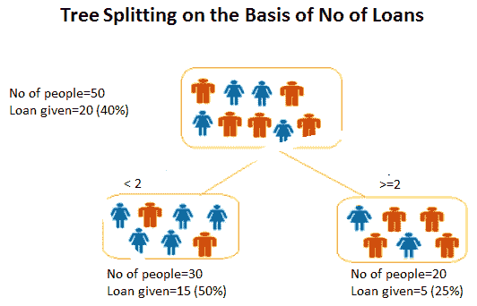
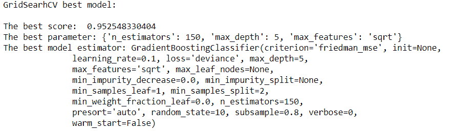

# 第三章：集成学习中的性能

到目前为止，我们已经了解到没有两个模型会给出相同的结果。换句话说，不同的数据或算法组合会导致不同的结果。这种结果可能对某个组合有利，而对另一个组合则不然。如果我们有一个模型试图考虑这些组合，并得出一个普遍和更好的结果会怎样？这被称为**集成模型**。

在本章中，我们将学习关于集成建模的多个概念，如下所示：

+   Bagging

+   随机森林

+   Boosting

+   梯度提升

+   参数优化

# 什么是集成学习？

有时候，一个机器学习模型可能不足以应对某个场景或用例，因为它可能无法提供所需的准确率、召回率和精确度。因此，多个学习模型——或者说是模型的集成——捕捉数据的模式，并给出更好的输出。

例如，假设我们正在尝试决定夏天想去的地方。通常情况下，如果我们计划旅行，关于地点的建议会从各个角落涌来。也就是说，这些建议可能来自我们的家人、网站、朋友和旅行社，然后我们必须基于过去的好体验来做出决定：

+   **家庭**：假设每次我们咨询家庭成员并听取他们的意见时，有 60%的可能性他们是对的，我们最终在旅行中获得了愉快的体验。

+   **朋友**：同样，如果我们听取朋友的意见，他们会建议我们去可能有好体验的地方。在这些情况下，有 50%的情况发生了好体验。

+   **旅游网站**：旅游网站是另一个我们可以获取大量关于去哪里游玩的信息的来源。如果我们选择接受他们的建议，有 35%的可能性他们是正确的，我们有了愉快的体验。

+   **旅行社**：如果我们首先向旅行社咨询，可能会得到更多建议和信息。根据我们的以往经验，我们发现他们在 45%的情况下是正确的。

然而，我们必须积累所有前面的输入并做出决定，因为到目前为止，没有任何来源是 100%正确的。如果我们结合这些结果，准确率场景将如下所示：

```py
1 - (60% * 50% * 35% * 45%)                                                                                                                                                                              1- 0.04725 = 0.95275

# Accuracy is close to 95%.
```

从这里，我们能够看到集成建模的影响。

# 集成方法

主要有三种构建集成模型的方法，即**Bagging**、**Boosting**和**Stacking**：


我们将逐一讨论每种方法。然而，在我们深入探讨之前，我们需要了解什么是自助法，这为**Bagging**和**Boosting**奠定了基础。

# Bootstrapping

自助法是一种统计技术，用于根据从总体中抽取的有放回样本进行推断，并平均这些结果。在有放回抽样的情况下，样本一个接一个地抽取，一旦从总体中抽取了一个样本，总体就用抽取的数据补充：


在前面的图中，有一个包含多个组件（**A**, **B**, **C**, **D**, **E**, **F**, **G**, **H**, 和 **I**）的数据集。首先，我们需要绘制三个相同大小的样本。让我们随机绘制**样本 1**，并假设第一个元素是**A**。然而，在我们绘制**样本 1**的第二个元素之前，**A**被返回到数据集中。整个过程都是如此。这被称为**有放回抽样**。因此，我们在一个集合中多次选择相同的项目。通过遵循这个过程，我们绘制了三个样本，即**样本 1**、**样本 2**和**样本 3**。

当我们进一步确定**样本 1**、**样本 2**和**样本 3**的统计量（各种指标）时，我们发现所有统计量的平均值，以推断有关数据集（总体）的信息。这个过程被称为**自助法**，绘制的样本被称为自助样本。这可以用以下方程定义：

*关于数据集（总体）的推断 = 样本 1、样本 2、……、样本 N 的平均值*

如果仔细观察前面的图，可能会出现一些数据集的元素没有被选中或不是这三个样本的一部分的情况：

+   **样本 1**：(**A**, **E**, **H**, **C**)

+   **样本 2**：(**F**, **G**, **A**, **C**)

+   **样本 3**：(**E**, **H**, **G**, **F**)

因此，未被选中的元素是**B**、**D**和**I**。那些不是绘制样本一部分的样本被称为**袋外样本**（**OOB**）。

让我们做一个简单的编码练习，看看如何在 Python 中实现：

1.  这里，我们将使用`sklearn`和`resample`函数。让我们导入必要的库：

```py
#importing Libraries
from sklearn.utils import resample
```

1.  接下来，创建一个我们需要采样的数据集：

```py
dataset=[10,2
```

1.  现在，我们将使用`resample`函数提取一个自助样本：

```py
0,30,40,50,60,70,80,90,100]
```

```py
#using "resample" function generate a bootstrap sample
boot_samp = resample(dataset, replace=True, n_samples=5, random_state=1)
```

1.  我们将使用列表推导来提取 OOB 样本：

```py
#extracting OOB sample
OOB=[x for x in dataset if x not in boot_samp]
```

1.  现在，让我们打印它：

```py
print(boot_samp)
```

我们得到以下输出：

```py
[60, 90, 100, 60, 10]
```

我们可以看到采样中存在 60 的重复。这是由于有放回抽样造成的。

1.  接下来，我们需要打印以下代码：

```py
print(OOB)
```

我们得到以下输出：

```py
[20, 30, 40, 50, 70, 80]
```

到此为止，我们希望得到以下结果：

*OOB = 数据集 - Boot_Sample*

*=[10,20,30,40,50,60,70,80,90,100] - [60,90,100,60,10]*

*=[20,30,40,50,70,80]*

这是代码得到的结果。

# 装袋法

带包装法代表的是**重抽样聚合（bootstrap aggregation）**。因此，很明显，带包装法的概念源于重抽样。它意味着带包装法具有重抽样的元素。它是一种重抽样集成方法，其中多个分类器（通常是同一算法）在从训练集/总体中随机抽取带有替换的样本（重抽样样本）上训练。所有分类器的聚合以平均或投票的形式进行。它试图减少模型中过度拟合问题的影响，如下面的图所示：


带包装法有三个阶段：

+   **重抽样（Bootstrapping）**：这是一种统计技术，用于生成带有替换的随机样本或重抽样样本。

+   **模型拟合**：在这个阶段，我们在重抽样样本上建立模型。通常，用于建立模型的算法是相同的。然而，没有限制使用不同的算法。

+   **模型组合**：这一步骤涉及组合所有模型并取平均值。例如，如果我们应用了决策树分类器，那么每个分类器输出的概率会被平均。

# 决策树

决策树是一种基于分而治之方法的监督学习技术。它可以用于解决分类和回归问题。总体根据最重要的特征被分割成两个或更多同质化的样本。

例如，假设我们得到了一组从银行申请贷款的人的样本。在这个例子中，我们将计数设为 50。在这里，我们有三个属性，即性别、收入和该人持有的其他贷款数量，以预测是否给他们贷款。

我们需要根据性别、收入和其他贷款数量来细分人群，并找出最重要的因素。这往往会产生最同质化的群体。

让我们先从收入开始，尝试根据它创建细分。申请贷款的总人数为 50 人。在 50 人中，有 20 人获得了贷款。然而，如果我们按收入划分，我们可以看到划分是根据收入<100,000 和>=100,000 进行的。这并没有生成一个同质化的群体。我们可以看到 40%的申请人（20 人）获得了贷款。在收入低于 100,000 的人群中，有 30%的人设法获得了贷款。同样，46.67%的收入高于或等于 100,000 的人群设法获得了贷款。以下图显示了基于收入的树分割：


让我们再来看贷款数量。即使这次，我们也没有看到同质化群体的形成。以下图显示了基于贷款数量的树分割：



让我们来看看性别，看看它在创建同质群体方面的表现。这实际上是一个同质群体。有 15 名女性，其中 53.3%获得了贷款。34.3%的男性也最终获得了贷款。以下图表显示了基于性别的树分割：


在此帮助下，已经找到了最重要的变量。现在，我们将探讨变量的重要性。

在我们这样做之前，了解与决策树相关的术语和命名法至关重要：

+   **根节点**：这代表整个总体或数据集，它被分割成两个或更多同质群体。

+   **决策节点**：当一个节点被进一步分割成子节点时，就会创建决策节点。

+   **叶节点**：当一个节点没有进一步分割的可能性时，该节点被称为叶节点或终端节点。

+   **分支**：整个树的一个子部分被称为**分支**或**子树**：


# 树分割

有各种算法有助于树分割，所有这些算法都将我们带到叶节点。决策树考虑了所有可用的特征（变量），并选择会导致最纯净或最均匀分割的特征。用于分割树的算法也取决于目标变量。让我们一步一步地来探讨这个问题：

1.  **基尼指数**：这表示如果我们从总体中随机选择两个项目，它们必须来自同一类别。如果总体完全纯净，这个事件发生的概率将是 1。它只执行二分分割。**分类和回归树（CARTs**）就是利用这种分割。

以下公式是计算基尼指数的方法：


这里，*p(t)*是具有目标变量值为*t*的观测值的比例。

对于二进制目标变量，*t=1*，最大的基尼指数值如下：

*= 1 — (1/2)²— (1/2)²*

*= 1–2*(1/2)²*

*= 1- 2*(1/4)*

*= 1–0.5*

*= 0.5*

基尼分数通过分割所创建的两个组中类别的混合程度来给出一个关于分割好坏的判断。完美的分离会导致基尼分数为 0，而最坏的情况分割会导致 50/50 的类别。

对于具有*k*个级别的名义变量，基尼指数的最大值是*(1- 1/k)*。

1.  **信息增益**：让我们深入了解它，看看它是什么。如果我们碰巧有三个场景，如下所示，它们很容易描述？


由于 **Z** 看起来相当均匀，并且它的所有值都相似，因此它被称为 **纯集**。因此，解释它需要更少的努力。然而，**Y** 需要更多的信息来解释，因为它不是纯的。**X** 似乎是其中最不纯的。它试图传达的是，随机性和无序增加了复杂性，因此需要更多的信息来解释。这种随机性的程度被称为 **熵**。如果样本完全均匀，则熵为 *0*。如果样本均匀分割，其熵将为 *1*：

*熵 = -p log[2]p - q log[2]q*

在这里，*p* 表示成功的概率，而 *q* 表示失败的概率。

当目标变量是分类的，也会使用熵。它选择与父节点相比熵最低的分割点。

在这里，我们首先必须计算父节点的熵。然后，我们需要计算每个已分割的单独节点的熵，然后包括所有子节点的加权平均值。

1.  **方差减少**：当涉及到连续的目标变量时，使用方差减少。在这里，我们使用方差来决定最佳的分割点。选择具有最低方差的分割点作为分割的标准：

方差 = 

这里， 是所有值的平均值，*X* 是真实值，而 *n* 是值的数量。

首先计算每个节点的方差，然后计算每个节点方差的加权平均值，这使我们选择最佳的节点。

# 树分割的参数

有许多参数我们需要调整或注意：

+   `Max_depth`: 最重要的参数之一是 `max_depth`。它捕捉了树可以延伸多深的核心。树的深度越大，意味着它能够从特征中提取更多信息。然而，有时过深的深度可能会引起担忧，因为它往往会带来过拟合的问题。

+   `min_samples_split`: 这表示分割内部节点所需的最小样本数。这可以在考虑每个节点至少一个样本到考虑每个节点的所有样本之间变化。当我们增加此参数时，树变得更加受约束，因为它必须在每个节点考虑更多的样本。`min_samples_split` 值的增加往往会引起欠拟合。

+   `min_samples_leaf`: 这是达到叶节点所需的最小样本数。将此值增加到最大可能会引起欠拟合。

+   `max_features`: 这是考虑最佳分割时可以使用的最大特征数。当增加最大特征数时，可能会引起过拟合。

现在，我们已经充分了解了随机森林算法。我们将在下一节讨论这一点。

# 随机森林算法

随机森林算法使用袋装技术。树木以以下方式种植和生长：

+   训练集中有*N*个观测值。从*N*个观测值中随机抽取样本，并替换。这些样本将作为不同树的训练集。

+   如果有*M*个输入特征（变量），则从*M*个特征中抽取*m*个特征作为子集，当然*m < M*。这样做是在树的每个节点随机选择*m*个特征。

+   每棵树都尽可能地生长。

+   预测是基于所有树木输出的结果聚合。在分类的情况下，聚合方法是投票，而在回归的情况下，则是所有结果的平均值：


让我们通过一个案例研究来深入了解这个概念。让我们研究乳腺癌数据。

# 案例研究

本案例研究中的数据是关于被检测出两种乳腺癌的患者的：

+   恶性

+   良性

这里给出了一些具有细胞核特征的特性，这些特性是从乳腺肿块**细针穿刺**（**FNA**）中计算出来的。基于这些特征，我们需要预测癌症是恶性还是良性。按照以下步骤开始：

1.  导入所有必需的库：

```py
import numpy as np
import pandas as pd
import seaborn as sns
import matplotlib.pyplot as plt
%matplotlib inline
from sklearn import preprocessing
from sklearn.model_selection import train_test_split
from sklearn.metrics import confusion_matrix
#importing our parameter tuning dependencies
from sklearn.model_selection import (cross_val_score, GridSearchCV,StratifiedKFold, ShuffleSplit )
#importing our dependencies for Feature Selection
from sklearn.feature_selection import (SelectKBest, RFE, RFECV)
from sklearn.ensemble import ExtraTreesClassifier
from sklearn.cross_validation import ShuffleSplit
from sklearn.ensemble import RandomForestClassifier
from sklearn.metrics import f1_score
from collections import defaultdict
# Importing our sklearn dependencies for the modeling
from sklearn.ensemble import RandomForestClassifier
from sklearn.preprocessing import StandardScaler
from sklearn.cross_validation import KFold
from sklearn import metrics
from sklearn.metrics import (accuracy_score, confusion_matrix, 
 classification_report, roc_curve, auc)
```

1.  加载乳腺癌数据：

```py
data= pd.read_csv("breastcancer.csv")
```

1.  让我们了解数据：

```py
data.info()
```

我们得到以下输出：


1.  让我们考虑`data.head()`这里：

```py
data.head()
```

从这个结果中，我们得到以下输出：


1.  我们从以下代码中得到数据诊断：

```py
data.diagnosis.unique()
```

以下是为前面代码的输出：


1.  数据描述如下：

```py
data.describe()
```

我们从前面的代码中得到以下输出：


```py
data['diagnosis'] = data['diagnosis'].map({'M':1,'B':0})

datas = pd.DataFrame(preprocessing.scale(data.iloc[:,1:32]))
datas.columns = list(data.iloc[:,1:32].columns)
datas['diagnosis'] = data['diagnosis']

datas.diagnosis.value_counts().plot(kind='bar', alpha = 0.5, facecolor = 'b', figsize=(12,6))
plt.title("Diagnosis (M=1, B=0)", fontsize = '18')
plt.ylabel("Total Number of Patients")
plt.grid(b=True)
```


```py
data_mean = data[['diagnosis','radius_mean','texture_mean','perimeter_mean','area_mean','smoothness_mean', 'compactness_mean', 'concavity_mean','concave points_mean', 'symmetry_mean', 'fractal_dimension_mean']]

plt.figure(figsize=(10,10))
foo = sns.heatmap(data_mean.corr(), vmax=1, square=True, annot=True)
```


```py
from sklearn.model_selection import train_test_split, cross_val_score, cross_val_predict
from sklearn import metrics
predictors = data_mean.columns[2:11]
target = "diagnosis"
X = data_mean.loc[:,predictors]
y = np.ravel(data.loc[:,[target]])
# Split the dataset in train and test:
X_train, X_test, y_train, y_test = train_test_split(X, y, test_size=0.2, random_state=0)
print ('Shape of training set : %i & Shape of test set : %i' % (X_train.shape[0],X_test.shape[0]) )
print ('There are very few data points so 10-fold cross validation should give us a better estimate')
```

前面的输入给出了以下输出：


```py
param_grid = {
 'n_estimators': [ 25, 50, 100, 150, 300, 500], 
 "max_depth": [ 5, 8, 15, 25],
 "max_features": ['auto', 'sqrt', 'log2'] 
 } 
#use OOB samples ("oob_score= True") to estimate the generalization accuracy.
rfc = RandomForestClassifier(bootstrap= True, n_jobs= 1, oob_score= True)
#let's use cv=10 in the GridSearchCV call
#performance estimation
#initiate the grid 
grid = GridSearchCV(rfc, param_grid = param_grid, cv=10, scoring ='accuracy')
#fit your data before you can get the best parameter combination.
grid.fit(X,y)
grid.cv_results_
```


```py
# Let's find out the best scores, parameter and the estimator from the gridsearchCV
print("GridSearhCV best model:\n ")
print('The best score: ', grid.best_score_)
print('The best parameter:', grid.best_params_)
print('The best model estimator:', grid.best_estimator_)
```


```py
# model = RandomForestClassifier() with optimal values
model = RandomForestClassifier(bootstrap=True, class_weight=None, criterion='gini',
 max_depth=8, max_features='sqrt', max_leaf_nodes=None,
 min_impurity_decrease=0.0, min_impurity_split=None,
 min_samples_leaf=1, min_samples_split=2,
 min_weight_fraction_leaf=0.0, n_estimators=150, n_jobs=1,
 oob_score=True, random_state=None, verbose=0, warm_start=False)
model.fit(X_train, y_train)
```


```py
print("Performance Accuracy on the Testing data:", round(model.score(X_test, y_test) *100))
```

从这个结果中，我们可以看到测试数据的性能准确率为`95.0`：

```py
#Getting the predictions for X
y_pred = model.predict(X_test)
print('Total Predictions {}'.format(len(y_pred)))
```

在这里，总预测数为`114`：

```py
truth = pd.DataFrame(y_test, columns= ['Truth'])
predictions = pd.DataFrame(y_pred, columns= ['Predictions'])
frames = [truth, predictions]
_result = pd.concat(frames, axis=1)
print(_result.shape)
_result.head()
```


```py
# 10 fold cross-validation with a Tree classifier on the training dataset# 10 fold 
#splitting the data, fitting a model and computing the score 10 consecutive times
cv_scores = []
scores = cross_val_score(rfc, X_train, y_train, cv=10, scoring='accuracy')
cv_scores.append(scores.mean())
cv_scores.append(scores.std())

#cross validation mean score
print("10 k-fold cross validation mean score: ", scores.mean() *100)
```

从这个结果中，我们可以看到 10 折交叉验证的平均分数为`94.9661835749`：

```py
# printing classification accuracy score rounded
print("Classification accuracy: ", round(accuracy_score(y_test, y_pred, normalize=True) * 100))
```

在这里，我们可以看到分类准确率为`95.0`：

```py
# Making the Confusion Matrix
cm = confusion_matrix(y_test, y_pred) 
plt.figure(figsize=(12,6))
ax = plt.axes()
ax.set_title('Confusion Matrix for both classes\n', size=21)
sns.heatmap(cm, cmap= 'plasma',annot=True, fmt='g') # cmap
plt.show()
```


```py
# The classification Report
target_names = ['Benign [Class 0]', 'Malignant[Class 1]']
print(classification_report(y_test, y_pred, target_names=target_names))
```


```py
y_pred_proba = model.predict_proba(X_test)[::,1]
fpr, tpr, _ = metrics.roc_curve(y_test, y_pred_proba)
auc = metrics.roc_auc_score(y_test, y_pred_proba)
plt.plot(fpr,tpr,label="curve, auc="+str(auc))
plt.legend(loc=4)
plt.show()
```


前面的图表是**接收者操作特征**（**ROC**）指标，用于通过交叉验证评估分类器输出的质量。

前面的图表显示了 ROC 对所选特征（`['compactness_mean', 'perimeter_mean', 'radius_mean', 'texture_mean', 'concavity_mean', 'smoothness_mean']`）和由 k 折交叉验证创建的诊断相关变量的响应。

ROC 面积为`0.99`相当不错。

# 提升法

当提到袋装法时，它可以应用于分类和回归。然而，还有一种技术也是集成家族的一部分：提升。然而，这两种技术的底层原理相当不同。在袋装法中，每个模型都是独立运行的，然后在最后汇总结果。这是一个并行操作。提升以不同的方式运作，因为它按顺序流动。这里的每个模型运行并将显著特征传递给另一个模型：


# 梯度提升

为了解释梯度提升，我们将采取本·戈尔曼的路线，他是一位伟大的数据科学家。他能够用一种数学而简单的方式解释它。让我们假设我们有九个训练示例，其中我们需要根据三个特征预测一个人的年龄，例如他们是否喜欢园艺、玩视频游戏或上网冲浪。这些数据如下：


要建立这个模型，目标是使均方误差最小化。

现在，我们将使用回归树建立模型。首先，如果我们想在训练节点至少有三个样本，树的第一次分割可能看起来像这样：


这看起来似乎不错，但它没有包括他们是否玩视频游戏或浏览互联网等信息。如果我们计划在训练节点有两个样本会怎样？


通过前面的树形图，我们可以从特征中获取某些信息，例如**SurfInternet**和**PlaysVideoGames**。让我们弄清楚残差/误差是如何产生的：


现在，我们将处理第一个模型的残差：


一旦我们在残差上建立了模型，我们必须将先前的模型与当前模型相结合，如下表所示：


我们可以看到残差已经下降，模型正在变得更好。

让我们尝试将到目前为止我们所做的工作公式化：

1.  首先，我们在数据 *f1 = y.* 上建立了一个模型。

1.  我们接下来做的事情是计算残差并在残差上建立模型：

*h 1=y- f1*

1.  下一步是组合模型，即 *f2= f1 + h 1.*

添加更多模型可以纠正先前模型的错误。前面的方程将变成如下：

*f3(x)= f2(x) + h2(x) *

方程最终将如下所示：

*fm= f[m]-1 + h[m]-1*

或者，我们可以写成以下形式：

* hm= y- fm*

1.  由于我们的任务是使平方误差最小化，因此 *f* 将初始化为训练目标值的平均值：


1.  然后，我们可以像之前一样找到 *f*[*m+1*, ]：

*fm= f[m]-1 + h[m]-1*

现在，我们可以使用梯度下降来优化我们的梯度提升模型。我们想要最小化的目标函数是 *L*。我们的起点是 *fo*。对于迭代 *m=1*，我们计算 *L* 对 *fo* 的梯度。然后，我们将弱学习器拟合到梯度分量。在回归树的情况下，叶子节点会在具有相似特征的样本中产生一个**平均梯度**。对于每个叶子节点，我们朝着平均梯度的方向前进。结果是 *f[1]*，这可以重复进行，直到我们得到 *f[m]*。

我们修改了我们的梯度提升算法，使其能够与任何可微分的损失函数一起工作。让我们清理前面的想法，并再次重新表述我们的梯度提升模型。

# 梯度提升参数

在应用梯度提升进行乳腺癌用例之前，需要考虑不同的参数：

+   `Min_samples_split`: 节点中需要考虑分割的最小样本数被称为 `min_samples_split`。

+   `Min_samples_leaf`: 在终端或叶子节点中需要的最小样本数被称为 `min_samples_leaf`。

+   `Max_depth`: 这是指从根节点到最远叶子节点的最大节点数。更深层次的树可以模拟更复杂的关系，然而，这也可能导致模型过拟合。

+   `Max_leaf_nodes`: 树中叶子节点的最大节点数。由于创建了二叉树，深度为 `n` 将产生最大为 *2^(n )* 的叶子节点。因此，可以定义 `max_depth` 或 `max_leaf_nodes`。

现在，我们将为乳腺癌用例应用梯度提升。在这里，我们正在加载构建模型所需的库：

```py
from sklearn.ensemble import GradientBoostingClassifier
from sklearn.metrics import classification_report, confusion_matrix, roc_curve, auc
```

在执行随机森林的过程中，我们已经完成了数据清洗和探索的各个步骤。现在，我们将直接进入模型的构建。

在这里，我们将执行网格搜索以找到梯度提升算法的最优参数：

```py
param_grid = {
 'n_estimators': [ 25, 50, 100, 150, 300, 500], # the more parameters, the more computational expensive
 "max_depth": [ 5, 8, 15, 25],
 "max_features": ['auto', 'sqrt', 'log2'] 
 }
gbm = GradientBoostingClassifier(learning_rate=0.1,random_state=10,subsample=0.8)
#performance estimation
#initiate the grid 
grid = GridSearchCV(gbm, param_grid = param_grid, cv=10, scoring ='accuracy')
#fit your data before you can get the best parameter combination.
grid.fit(X,y)
grid.cv_results_     
```

我们得到以下输出：


现在，让我们找出最优参数：

```py
#Let's find out the best scores, parameter and the estimator from the gridsearchCV
print("GridSearhCV best model:\n ")
print('The best score: ', grid.best_score_)
print('The best parameter:', grid.best_params_)
print('The best model estimator:', grid.best_estimator_)
```

输出如下所示：



现在，我们将构建模型：

```py
model2 = GradientBoostingClassifier(criterion='friedman_mse', init=None,
 learning_rate=0.1, loss='deviance', max_depth=5,
 max_features='sqrt', max_leaf_nodes=None,
 min_impurity_decrease=0.0, min_impurity_split=None,
 min_samples_leaf=1, min_samples_split=2,
 min_weight_fraction_leaf=0.0, n_estimators=150,
 presort='auto', random_state=10, subsample=0.8, verbose=0,
 warm_start=False)
model2.fit(X_train, y_train) 

print("Performance Accuracy on the Testing data:", round(model2.score(X_test, y_test) *100))
```

测试数据上的性能准确率是 `96.0`：

```py
#getting the predictions for X
y_pred2 = model2.predict(X_test)
print('Total Predictions {}'.format(len(y_pred2)))
```

预测的总数是 `114`：

```py
truth = pd.DataFrame(y_test, columns= ['Truth'])
predictions = pd.DataFrame(y_pred, columns= ['Predictions'])
frames = [truth, predictions]
_result = pd.concat(frames, axis=1)
print(_result.shape)
_result.head()
```


让我们进行交叉验证：

```py
cv_scores = []

scores2 = cross_val_score(gbm, X_train, y_train, cv=10, scoring='accuracy')
cv_scores.append(scores2.mean())
cv_scores.append(scores2.std())

#cross validation mean score 
print("10 k-fold cross validation mean score: ", scores2.mean() *100)
```

10 k-fold 交叉验证的平均分数是 `94.9420289855`：

```py
#printing classification accuracy score rounded
print("Classification accuracy: ", round(accuracy_score(y_test, y_pred2, normalize=True) * 100))
```

分类准确率是 `96.0`：

```py
# Making the Confusion Matrix
cm = confusion_matrix(y_test, y_pred2)
plt.figure(figsize=(12,6))
ax = plt.axes()
ax.set_title('Confusion Matrix for both classes\n', size=21)
sns.heatmap(cm, cmap= 'plasma',annot=True, fmt='g') # cmap
plt.show()
```

通过查看混淆矩阵，我们可以看到这个模型比之前的模型更好：


# 摘要

在本章中，我们研究了集成学习及其不同方法，即 bagging、boosting 和 stacking。我们还了解了什么是 bootstrapping，它是 bagging 和 boosting 等集成学习方法的根源。我们还学习了决策树及其通过例子（如申请贷款的人）进行划分和规则的方法。然后我们讨论了树分裂以及分裂决策树的参数，接着转向随机森林算法。我们使用所涵盖的概念进行了一个乳腺癌案例研究。我们还发现了 bagging 和 boosting 以及梯度提升之间的差异。我们还讨论了梯度提升的参数，以便在我们的乳腺癌例子中使用。

在下一章中，我们将学习关于训练神经网络的内容。
