# 第四章：训练神经网络

当你听到**神经网络**这个术语时，你会觉得它是一种与大脑相关的生物学术语。我必须坦白地告诉你，猜测这一点是显而易见的，而且实际上，我们这样做是在正确的道路上。我们将看到它是如何与之相关的。

神经网络在数据科学领域带来了革命。直到 2011 年，由于计算能力不足，支持神经网络的人无法将其传播到他们想要的程度。但是，随着更便宜的计算解决方案和神经网络领域研究的增加，它们在数据科学和人工智能领域引起了轰动。神经网络是一种可以应用于监督学习和无监督学习的算法。随着网络的加深，它们能够提供对非结构化数据，如图像和文本的解决方案。

在本章中，我们将涵盖以下主题：

+   神经网络

+   网络初始化

+   过拟合

+   丢弃法

+   随机梯度下降

+   循环神经网络

# 神经网络

首先，让我解释一下神经元是什么以及它们的结构。以下标注的图显示了典型的神经元：


我们将神经元定义为一种电兴奋细胞，它通过电和化学信号接收、处理和传输信息。树突是它的一部分，接收来自其他神经元的信号。我们需要注意的一点是，单个神经元不能做任何事情，而且有成亿个神经元相互连接，这使得电化学信号流动，进而信息通过它流动。信息通过轴突和突触传递，然后被传输。

当提到神经网络时，其结构变化不大。让我们来看看它。在中间，我们有一个神经元，这个神经元从三个其他神经元 X1、X2 和 X3 接收信号。这三个神经元通过箭头连接，箭头就像一个突触。这些神经元 X1、X2 和 X3 被称为**输入层神经元**。通过神经元后，我们得到输出值。有趣的是，人脑通过所有传感器如眼睛、耳朵、触觉和鼻子接收输入信号，所有的突触都让这些电化学信号通过，输出作为视觉、声音、触觉和嗅觉。神经网络中遵循的是类似的过程。

# 神经网络是如何工作的

假设我们有一组如下输入和输出：

| **输入 (X)** | **输出 (Y)** |
| --- | --- |
| 2 | 4 |
| 3 | 6 |
| 4 | 8 |
| 5 | 10 |
| 6 | 12 |

在先前的表中，输入和输出可能看起来有线性关系；然而，情况并不总是如此。此外，每次模型需要初始化时。让我们理解初始化的含义。

# 模型初始化

根据前面的表格，网络正在尝试寻找输入和输出之间的关系。例如，让我们假设通过的关系如下：

*Y = W. X*

在前面的方程中，*Y* 和 *X* 是已知的，并且基于这些，必须找到 *W* 的值。但是，在一次迭代中找到 *W* 的值是罕见的。它必须首先初始化。假设 *W* 被初始化为 *3* 的值。方程如下：

*Y= 3X*

| **输入 (X)** | **实际输出 (Y)** |
| --- | --- |
| 2 | 6 |
| 3 | 9 |
| 4 | 12 |
| 5 | 15 |
| 6 | 18 |

现在我们必须评估输出，以及它是否接近期望输出。

# 损失函数

到目前为止，模型已经被随机初始化，并且我们能够得到一个输出。为了评估实际输出是否接近期望输出，引入了**损失函数**。它使模型能够泛化，并找出模型达到期望输出的程度。

我们可以查看新的表格，其中包含实际输出和期望输出：

| **输入 (X)** | **实际输出 (Y[a])** | **期望输出 (Y)** |
| --- | --- | --- |
| 2 | 6 | 4 |
| 3 | 9 | 6 |
| 4 | 12 | 8 |
| 5 | 15 | 10 |
| 6 | 18 | 12 |

如果我们必须写下损失函数，它必须如下所示：

*损失函数 = 期望输出 - 实际输出*

然而，以这种方式添加损失函数会邀请两种类型的值：负值和正值。在损失函数为负值的情况下，这意味着网络超出了目标，因为**期望输出 < 实际输出**，而在相反的情况下（**期望输出 > 实际输出**），网络会低于目标。为了消除这种情况，我们将采用绝对损失：

| **输入(X)** | **实际输出(Y[a])** | **期望输出(Y)** | **损失=Y-Y[a]** | **绝对损失** |
| --- | --- | --- | --- | --- |
| 2 | 6 | 4 | -2 | 2 |
| 3 | 9 | 6 | -3 | 3 |
| 4 | 12 | 8 | -4 | 4 |
| 5 | 15 | 10 | -5 | 5 |
| 6 | 18 | 12 | -6 | 6 |

总绝对损失 = 20

采用这种绝对损失的方法对模型没有任何好处，就像如果我们小心翼翼地查看前面的表格，最小的损失是 2 个单位，最大的损失是 6 个单位。可能会给人一种感觉，最大损失和最小损失之间的差异并不大（这里，4 个单位），但对于模型来说，这可能是巨大的。因此，我们采取了完全不同的方法。与其采用绝对损失，我们更倾向于采用损失的平方：

| **输入(X)** | **实际输出(Y[a])** | **期望输出(Y)** | **损失=Y-Y[a]** | **损失的平方** |
| --- | --- | --- | --- | --- |
| 2 | 6 | 4 | -2 | 4 |
| 3 | 9 | 6 | -3 | 9 |
| 4 | 12 | 8 | -4 | 16 |
| 5 | 15 | 10 | -5 | 25 |
| 6 | 18 | 12 | -6 | 36 |

现在，损失越大，惩罚越重。它可以使我们更容易看到损失较多的情况。

# 优化

我们必须找出一种方法来最小化总损失函数，这可以通过改变权重来实现。可以通过使用一种粗略的方法，如修改参数 *W* 在 -500 到 500 的范围内，步长为 0.001 来实现。这将帮助我们找到一个点，使得误差平方和变为 0 或最小。

但这种方法将适用于这种场景，因为我们这里没有太多参数，计算也不会太复杂。然而，当我们有很多参数时，计算将会受到影响。

在这里，数学以微分（极值方法）的形式来帮助我们优化权重。函数在某个点的导数给出了该函数值变化的速率。在这里，我们将取损失函数的导数。它将评估通过轻微调整或改变权重对总误差的影响。例如，如果我们尝试改变权重 *δW，W= W+ δW*，我们可以找出它如何影响损失函数。我们的最终目标是通过这种方式最小化损失函数。

我们知道最小值将在 *w=2* 处达到；因此，我们在这里探索不同的场景：

+   *w<2* 表示正的损失函数，负的导数，意味着权重的增加会减少损失函数

+   *w>2* 表示正的损失函数，但导数是正的，意味着任何更多的权重增加将增加损失

+   在 *w=2* 时，损失=0，导数=0；达到最小值：


# 神经网络中的计算

现在，让我们看看一个简单且浅的网络：

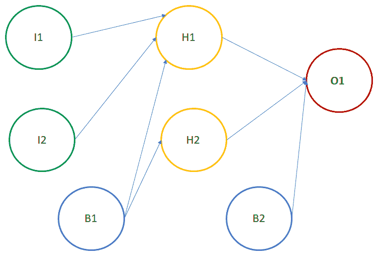

其中：

+   **I1**: 输入神经元 1

+   **I2**: 输入神经元 2

+   **B1**: 偏置 1

+   **H1**: 隐藏层中的神经元 1

+   **H2**: 隐藏层中的神经元 2

+   **B2**: 偏置 2

+   **O1**: 输出层的神经元

最终值在输出神经元 **O1** 处。**O1** 从 **H1**、**H2** 和 **B2** 接收输入。由于 **B2** 是偏置神经元，其激活始终为 1。然而，我们需要计算 **H1** 和 **H2** 的激活。为了计算 **H1** 和 **H2** 的激活，需要 **I1**、**I2** 和 **B1** 的激活。它可能看起来 **H1** 和 **H2** 将会有相同的激活，因为它们得到了相同的输入。但在这里并不是这样，因为 **H1** 和 **H2** 的权重是不同的。两个神经元之间的连接器代表权重。

# H1 的激活计算

让我们看看只涉及 **H1** 的网络部分：

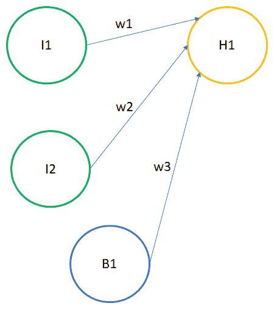

隐藏层的结果如下公式所示：


其中：

+   *A*: 激活函数

+   *x[i]*: 输入值

+   *w[i]*: 权重值

在我们的场景中，有三个输入值，*n=3*：

+   *x[1]* = *I1* = 来自第一个神经元的输入值 1

+   *x[2]*= *I2*= 来自第二个神经元的输入值 2

+   *x[3 ]*= *B1* = *1*

+   *w1 *= 从 *I1* 到 *H1* 的权重

+   *w2 *= 从 *I2* 到 *H1* 的权重

+   *w3 *= 从 *B1* 到 *H1* 的权重

# 反向传播

在这一步，我们计算损失函数 *f(y, y_hat)* 关于 *A*，*W* 和 *b* 的梯度，分别称为 *dA*，*dW* 和 *db*。使用这些梯度，我们更新从最后一层到第一层的参数值。

# 激活函数

激活函数通常在神经网络中引入，以引入非线性。没有非线性，神经网络几乎没有机会学习非线性。但您可能会质疑为什么一开始就需要非线性。如果我们认为每个关系都是线性的，那么模型将无法公正地处理实际关系，因为线性关系是非常罕见的。如果应用线性，模型的输出将不会是一般化的。

此外，激活函数的主要目的是将输入信号转换为输出。假设如果我们尝试去掉激活函数，它将输出一个线性结果。线性函数是一阶多项式，容易求解，但同样，它无法捕捉到各种特征之间的复杂映射，这在无结构数据的情况下是非常必要的。

非线性函数是那些次数大于一的函数。现在我们需要一个神经网络模型来学习和表示几乎任何东西，以及任何任意复杂的函数，它将输入映射到输出。神经网络也被称为**通用函数逼近器**。这意味着它们可以计算和学习任何函数。因此，激活函数是神经网络的一个基本组成部分，使其能够学习复杂的函数。

# 激活函数的类型

1.  **Sigmoid**：这种激活函数如下所示：


这个函数的值介于 *0* 和 *1* 之间。它存在许多问题：

+   +   梯度消失

    +   它的输出不是零中心化的

    +   它的收敛速度慢

1.  **双曲正切函数 (tanh)**：表示它的数学公式如下：


这个函数的值介于 -1 和 +1 之间。然而，它仍然面临梯度消失问题：


1.  **修正线性单元 (ReLU)**：从数学上，我们用以下方式表示它：


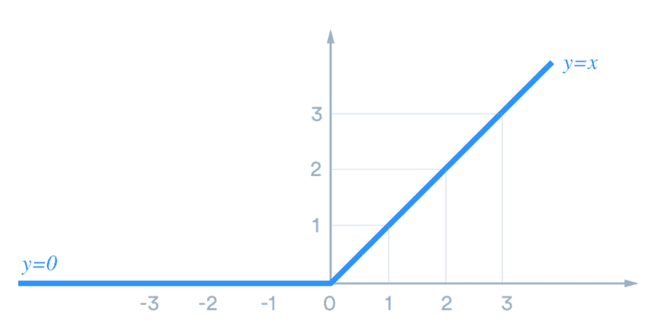

根据前面的图示，ReLU 对于所有正数是线性的，对于所有负数是零。这意味着以下都是正确的：

+   +   它的计算成本低，因为没有复杂的数学。因此，模型可以更快地进行训练。

    +   它的收敛速度更快。线性意味着当 *x* 变大时，斜率不会触及平台。它没有像 sigmoid 或 tanh 这样的激活函数所遭受的梯度消失问题。

# 网络初始化

到目前为止，我们已经看到神经网络模型中存在多个阶段。我们知道两个节点（来自不同层）之间存在权重。这些权重经历线性变换，并连同输入节点的值一起，通过非线性激活函数，以产生下一层的值。这个过程在下一层和随后的层中重复进行，最后，在反向传播的帮助下，找到权重的最优值。

很长一段时间里，权重都是随机初始化的。后来，人们意识到我们初始化网络的方式对模型有巨大的影响。让我们看看我们是如何初始化模型的：

+   **零初始化**：在这种初始化中，所有初始权重都设置为零。由于这个原因，所有层的所有神经元执行相同的计算，这会导致产生相同的输出。这将使整个深度网络变得毫无意义。从这个网络中出来的预测将和随机的一样好。直观地说，它没有执行对称性打破。通常，在神经网络的正向传播过程中，每个隐藏节点都会接收到一个信号，而这个信号实际上就是以下内容：

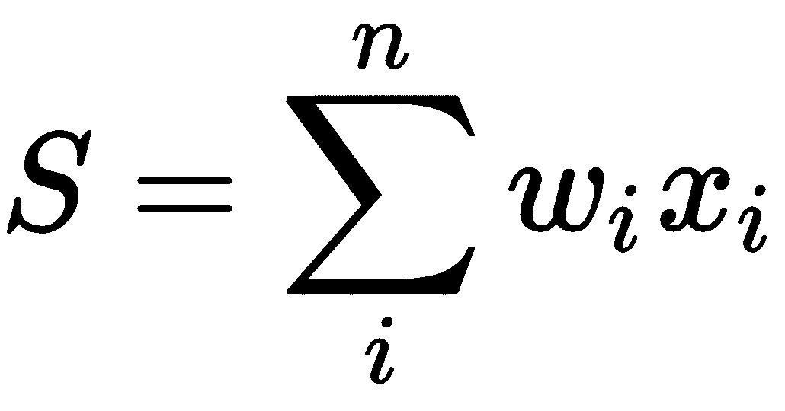

如果网络以零初始化，那么所有隐藏节点都将接收到零信号，因为所有输入都将乘以零。因此，无论输入值是多少，如果所有权重都相同，隐藏层中的所有单元也将相同。这被称为**对称性**，为了更好地捕捉信息，必须打破这种对称性。因此，权重应该随机初始化或使用不同的值：


+   **随机初始化**：这种初始化有助于打破对称性。在这种方法中，权重被随机初始化得非常接近零。每个神经元都不执行相同的计算，因为权重不等于零：


+   **He 等人初始化**：这种初始化依赖于前一层的大小。它有助于达到成本函数的全局最小值。权重是随机的，但根据神经元前一层的大小而有所不同：


# 反向传播

反向传播在正向传播完成后进行。它代表**误差反向传播**。在神经网络的情况下，这一步开始计算误差函数（损失函数）相对于权重的梯度。人们可能会想知道为什么术语**反向**与它相关联。这是因为梯度计算从网络中开始反向进行。在这里，首先计算最终层权重的梯度，然后最后计算第一层的权重。

反向传播需要三个元素：

+   **数据集**: 一个由输入-输出对 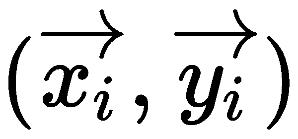 组成的数据集，其中 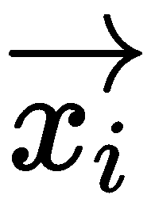 是输入，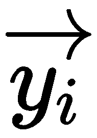 是我们期望的输出。因此，取一个大小为 *N* 的此类输入-输出集，表示为 。

+   **前馈网络**: 在这里，参数表示为 *θ*。参数包括 ，这是层 *l[k] 中节点 *j* 和层 *l[k-1] 中节点 *i* 之间的权重，以及层 *l[k-1] 中节点 *i* 的偏置 。同一层中的节点之间没有连接，层之间是完全连接的。

+   **损失函数**: *L(X,θ)*。

使用梯度下降训练神经网络需要计算损失/误差函数 *E(X,θ)* 对权重 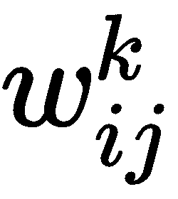 和偏置  的梯度。然后，根据学习率 *α*，梯度下降的每一次迭代都会集体更新权重和偏置，如下所示：


在这里  表示梯度下降迭代中的神经网络参数。

# 过度拟合

我们已经详细讨论了过度拟合。然而，让我们回顾一下我们在神经网络场景中学到的东西以及什么是过度拟合。

到目前为止，我们已经意识到，当有大量参数（在深度学习中）可供我们使用来映射和解释事件时，使用这些参数构建的模型往往会有很好的拟合度，并试图展示它有能力正确描述事件。然而，任何模型的真正测试总是在未见过的数据上，我们已经能够评估模型在这样未见过的数据点上的表现。我们希望我们的模型具有泛化能力，这将使模型能够在测试数据（未见过的）上获得与训练数据一致的分值。但是，很多时候，当涉及到未见过的数据时，我们的模型无法泛化，因为模型没有学习到事件的洞察力和因果关系。在这种情况下，人们可能会看到训练准确率和测试准确率之间巨大的差异，不用说，这不是我们希望从模型中得到的东西。这种现象被称为**过度拟合**。

在深度学习中，你可能会遇到数百万个参数，而且很可能会陷入过度拟合的陷阱。正如我们在第一章中定义的，过度拟合发生在模型学习训练数据中的细节和噪声到一定程度，以至于它对模型在新数据上的性能产生负面影响。

# 预防神经网络中的过度拟合

正如我们在前面的章节中讨论的那样，过度拟合是构建模型时需要考虑的主要问题，因为我们的工作并不只限于训练阶段。任何模型的试金石都发生在未见过的数据上。让我们探讨处理神经网络中过度拟合问题的技术。

# 消失的梯度

神经网络在从数据中提取复杂特征方面已经是一个启示。无论是图像还是文本，它们都能够找到导致更好预测的组合。网络越深，选择那些复杂特征的机会就越高。如果我们继续添加更多的隐藏层，添加的隐藏层的学习速度会更快。

然而，当我们进行反向传播时，这是在网络中向后移动以找到损失相对于权重的梯度，梯度往往会随着我们向第一层前进而越来越小。这意味着深度网络的前几层成为较慢的学习者，而后续层倾向于学习得更快。这被称为**消失的梯度问题**。

**网络初始层**很重要，因为它们负责*学习和检测简单模式*，实际上是我们的网络的**构建块**。显然，如果它们给出不适当和**不准确**的结果，那么我们如何期望下一层和整个网络有效地执行并产生准确的结果？以下图表显示了球在更陡斜率上滚动的图像：

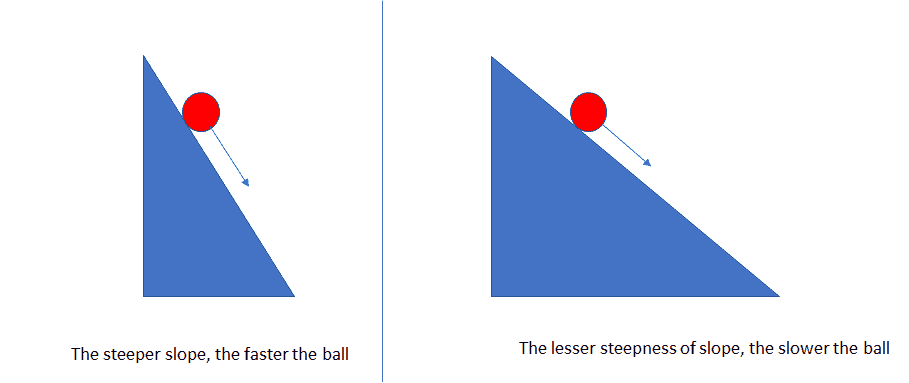

为了让我们更容易理解，让我们说有两个斜率：一个更陡，另一个较缓。两个斜率上都有球滚下来，很明显球会从更陡的斜率上滚得更快，而不是从较缓的斜率上。类似地，如果梯度大，学习和训练会更快；否则，如果梯度较缓，训练会变得太慢。

从反向传播的直觉来看，我们知道优化算法，如梯度下降，通过调节权重以降低成本函数的输出，缓慢地寻求达到局部最优。梯度下降算法通过将梯度的负值乘以学习率（*α*）（它很小）来更新权重：


它说我们必须重复进行，直到达到收敛。然而，这里有两种情况。第一种情况是，如果迭代次数较少，那么结果的准确性会受到影响；第二种情况是，迭代次数过多会导致训练时间过长。这是因为每次迭代中权重变化不够，因为梯度小（我们知道*α*已经非常小）。因此，权重不会移动到分配的迭代中的最低点。

让我们谈谈那个可能影响梯度消失问题的激活函数。在这里，我们讨论的是通常用作激活函数的 sigmoid 函数：


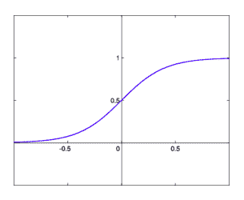

它将所有输入值转换到*(0,1)*的范围。如果我们需要找到 sigmoid 函数的导数，那么：


现在我们来绘制它：


很明显，导数的最大值为 0.25。因此，它所在的范围是*(0,1/4)*。

一个典型的神经网络看起来如下图所示：


一旦权重参数初始化，输入就会乘以权重，并通过激活函数传递，最终我们得到一个成本函数（**J**）。随后，通过梯度下降修改权重以最小化**J**进行反向传播。

为了计算相对于第一个权重的导数，我们使用链式法则。结果如下：


如果我们只尝试研究前面表达式中中间部分的导数，我们得到以下结果：


第一部分——从输出到隐藏层 2。

由于输出是第二个隐藏单元的激活，表达式如下：


同样，对于第二部分，从隐藏层 2 到隐藏层 1，表达式如下：


将所有内容综合起来，我们得到以下结果：


我们知道 sigmoid 函数的导数最大值为 1/4，如果权重以标准差 1 和平均值 0 初始化，权重通常可以取-1 到 1 之间的值。这将导致整个表达式变得更小。如果有一个深度网络需要训练，那么这个表达式会持续变得更小，结果，训练时间会变得缓慢。

# 克服梯度消失问题

从前面的梯度消失解释中可以看出，这个问题的根本原因是选择了 sigmoid 函数作为激活函数。当选择*tanh*作为激活函数时，也发现了类似的问题。

为了应对这种情况，ReLU 函数应运而生：

*ReLU(x)= max(0,x)*

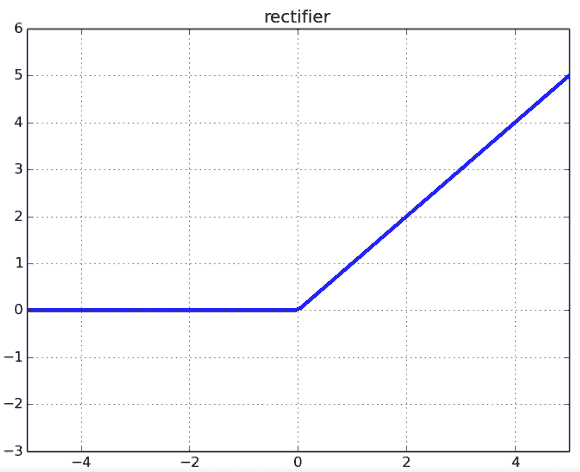

如果输入是负数或小于零，函数输出为零。在第二种情况下，如果输入大于零，则输出将等于输入。

让我们取这个函数的导数，看看会发生什么：

**情况 1**：*x<0*：

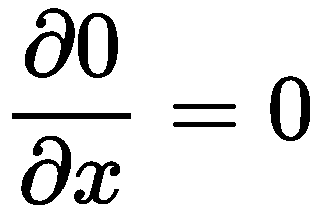

**情况 2**：*x>0*：


如果我们必须绘制它，我们得到以下结果：

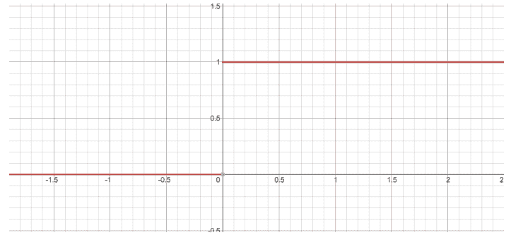

因此，ReLU 的导数要么是 0，要么是 1。图像呈现出阶梯函数的样子。现在，我们可以看到，由于导数的值不在 0 和 1 之间，我们不会遇到梯度消失的问题。

然而，这仍然是不正确的。当输入值恰好为负数且我们知道在这种情况下导数变为零时，我们可能仍然会遇到这个问题。通常，加权求和的结果不会是负数，如果我们担心出现这种问题，我们可以确实初始化权重为仅正数，并且/或规范化输入在 0 到 1 之间。

对于这种情况，我们仍然有一个解决方案。我们有一个叫做**Leaky ReLU**的另一个函数，其公式如下：

*RELU(x) = max(εx, x)*

这里，ε的值通常是 0.2–0.3。我们可以绘制如下：

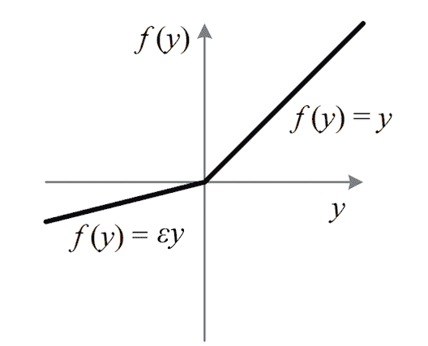

# 循环神经网络

我们的思想过程总是有一个顺序。我们总是按顺序理解事物。例如，如果我们看电影，我们会通过将其与之前的部分联系起来来理解下一个序列。我们保留最后一个序列的记忆，并理解整个电影。我们并不总是回到第一个序列以获取它。

神经网络能这样做吗？传统的神经网络通常不能以这种方式运行，这是一个主要缺点。这就是循环神经网络发挥作用的地方。它带有一个循环，允许信息流动：

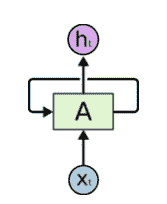

这里，神经网络将输入作为**X[t]**，并以**h[t]**的形式输出。循环神经网络由多个相同网络组成，这些网络将信息传递给后续网络。

如果我们将前面的网络展开，它看起来会像以下这样：


这种链式性质揭示了循环神经网络与序列和列表密切相关。它们是神经网络用于此类数据的自然架构。由于网络具有内部记忆，RNN 能够记住它们接收到的输入，这反过来又使它们能够提供准确和精确的结果和预测。

到目前为止，我们一直在谈论序列数据。但我们需要正确理解这个术语，即序列数据。这种数据形式是有序数据，其中存在时间*t*和时间*t-1*的数据之间的关系。这种类型的数据可以是金融数据、时间序列数据、视频等等。RNN 允许我们在向量的序列上操作。例如，看看下面的图像：


每个矩形表示为一个向量，箭头代表函数。输入向量用红色表示，输出向量用蓝色表示，绿色向量表示 RNN 的状态：

+   从固定大小的输入到输出的处理模式可以不包含 RNN。

+   以适当的格式对输出进行排序。

+   对输入进行排序。

+   对输入和输出进行排序（例如，机器翻译：一个 RNN 读取英语句子，然后输出其他语言的句子，如德语）。

+   同步排序后的输入和输出（例如，视频分类，为视频的每一帧贴标签）

# RNN 的局限性

当涉及到短期依赖时，循环神经网络（RNN）表现得很合适。这意味着，如果只有一个语句需要处理，神经网络可以很好地运行。例如，如果有一个句子，*印度的首都是 __*，在这种情况下，我们不可避免地会得到正确的结果，因为这个是一个普遍的陈述，这里没有上下文。这个陈述不依赖于前面的句子，而且这里也没有前面的句子。

因此，预测将是*印度的首都是新德里*。

最终，标准的 RNN 并不理解输入背后的上下文。我们将通过一个例子来理解：

在印度生活意味着我自然而然地喜欢上了板球。但是，10 年后，为了工作我搬到了美国。

*在印度流行的游戏是 ___*。

可以看到，第一句话中有上下文，然后在第二句中发生变化。然而，网络必须基于第一句话进行预测。在印度流行的游戏很可能是板球，但上下文在这里起着作用，并且网络必须理解这一点。简单的 RNN 在这里失败了。

这就是**长短期记忆**（**LSTM**）出现的地方。

# 用例

让我们研究一个有助于我们理解网络的用例。

我们将研究一个时间序列问题。我们得到了谷歌股票价格数据集。一个用于训练，另一个用于测试。现在，我们将查看一个用例来预测谷歌的股票价格：

1.  让我们先导入库：

```py
import numpy as np
import matplotlib.pyplot as plt
import pandas as pd
```

1.  接下来，导入训练集：

```py
dataset_train = pd.read_csv('Google_Stock_Price_Train.csv')
training_set = dataset_train.iloc[:, 1:2].values
```

1.  特征缩放将在下一步进行：

```py
from sklearn.preprocessing import MinMaxScaler
sc = MinMaxScaler(feature_range = (0, 1))
training_set_scaled = sc.fit_transform(training_set)
```

1.  让我们创建一个包含 60 个时间步长和 1 个输出的数据结构：

```py
X_train = []
y_train = []
for i in range(60, 1258):
 X_train.append(training_set_scaled[i-60:i, 0])
 y_train.append(training_set_scaled[i, 0])
X_train, y_train = np.array(X_train), np.array(y_train)
```

1.  接下来，重新塑形数据：

```py
X_train = np.reshape(X_train, (X_train.shape[0], X_train.shape[1], 1))
```

1.  现在，导入 Keras 库和包：

```py
from keras.models import Sequential
from keras.layers import Dense
from keras.layers import LSTM
from keras.layers import Dropout
```

1.  我们将使用回归函数初始化 RNN：

```py
regressor = Sequential()
```

1.  现在，添加第一个 LSTM 层和一些 dropout 规范化：

```py
regressor.add(LSTM(units = 50, return_sequences = True, input_shape = (X_train.shape[1], 1)))
regressor.add(Dropout(0.2))
```

1.  现在，添加第二个 LSTM 层和一些 dropout 规范化：

```py
regressor.add(LSTM(units = 50, return_sequences = True))
regressor.add(Dropout(0.2))
```

1.  添加第三个 LSTM 层和一些 dropout 规范化：

```py
regressor.add(LSTM(units = 50, return_sequences = True))
regressor.add(Dropout(0.2))
```

1.  添加第四个 LSTM 层和一些 dropout 规范化：

```py
regressor.add(LSTM(units = 50))
regressor.add(Dropout(0.2))
```

1.  最后，添加输出层：

```py
regressor.add(Dense(units = 1))
```

1.  接下来，我们将编译 RNN：

```py
regressor.compile(optimizer = 'adam', loss = 'mean_squared_error')
```

1.  我们将 RNN 拟合到训练集中：

```py
regressor.fit(X_train, y_train, epochs = 100, batch_size = 32)
```

1.  我们得到 2017 年的实际股价，如图所示：

```py
dataset_test = pd.read_csv('Google_Stock_Price_Test.csv')
real_stock_price = dataset_test.iloc[:, 1:2].values
```

1.  我们得到 2017 年预测的股价，如图所示：

```py
dataset_total = pd.concat((dataset_train['Open'], dataset_test['Open']), axis = 0)
inputs = dataset_total[len(dataset_total) - len(dataset_test) - 60:].values
inputs = inputs.reshape(-1,1)
inputs = sc.transform(inputs)
X_test = []
for i in range(60, 80):
 X_test.append(inputs[i-60:i, 0])
X_test = np.array(X_test)
X_test = np.reshape(X_test, (X_test.shape[0], X_test.shape[1], 1))
predicted_stock_price = regressor.predict(X_test)
predicted_stock_price = sc.inverse_transform(predicted_stock_price)
```

1.  最后，我们将可视化结果，如图所示：

```py
plt.plot(real_stock_price, color = 'red', label = 'Real Google Stock Price')
plt.plot(predicted_stock_price, color = 'blue', label = 'Predicted Google Stock Price')
plt.title('Google Stock Price Prediction')
plt.xlabel('Time')
plt.ylabel('Google Stock Price')
plt.legend()
plt.show()
```

# 摘要

在本章中，我们学习了神经网络及其工作原理，并介绍了反向传播和激活函数。我们研究了网络初始化以及如何初始化不同类型的模型。我们还学习了神经网络场景中的过拟合和 dropout。

我们介绍了 RNN 的概念，并研究了关于谷歌股价数据集的一个用例。在下一章中，我们将研究时间序列分析。
