# 第五章：时间序列分析

在本章中，我们将探讨时间序列分析，并学习几种在不同时间点观察和捕捉事件的方法。我们将介绍白噪声的概念，并学习如何在序列中检测它。

我们将取时间序列数据，计算连续观测之间的差异，这将导致形成一个新的序列。这些概念将帮助我们深入了解时间序列分析，并帮助我们对其有更深入的理解。

在本章中，我们将介绍以下主题：

+   时间序列分析简介

+   白噪声

+   随机游走

+   自回归

+   自相关

+   稳定性

+   差分

+   AR 模型

+   移动平均模型

+   自回归积分移动平均

+   参数优化

+   异常检测

# 时间序列分析简介

在某些情况下，我们可能会尝试在不同的时间点观察和捕捉事件。通常，我们会在相邻观测之间得出一种关联或关联，这种关联无法通过处理独立且同分布数据的方案来处理。这种在数学和统计方法上考虑所有这些因素的方法被称为 **时间序列分析**。

时间序列分析已在许多领域得到应用，例如汽车、银行和零售业、产品开发等。其应用没有边界，因此分析师和数据科学家正在深入探索这个领域，以从组织中获取最大利益。

在本节中，我们将探讨时间序列分析的一些概念，这将为进一步的深入理解奠定基础。一旦我们建立了这个基础，我们就会进入建模阶段。

# 白噪声

一个由一系列相互独立的随机变量组成，均值为零，标准差为 *σ²* 的简单序列被称为 **白噪声**。在这种情况下，变量是独立且同分布的。所有值都具有相同的方差 *σ²*。在这种情况下，序列来自高斯分布，被称为 **高斯白噪声**。

当序列表现为白噪声时，这意味着序列的性质是完全随机的，序列内部没有关联。因此，无法开发模型，在这种情况下无法进行预测。

然而，当我们通常使用非白噪声序列构建时间序列模型时，我们试图在残差或误差中实现白噪声现象。简单来说，无论我们何时尝试构建模型，目的都是从序列中提取最大量的信息，以便变量中不再存在更多信息。一旦我们构建了模型，噪声将始终是其一部分。方程如下：

*Y[t ]= X[t ]+ Error*

因此，误差序列在本质上应该是完全随机的，这意味着它是白噪声。如果我们已经得到了这些误差作为白噪声，那么我们就可以继续说我们已经从序列中提取了所有可能的信息。

# 在序列中检测白噪声

我们可以使用以下工具检测白噪声：

+   **线形图**：一旦我们有了线形图，我们就可以了解序列是否具有恒定的均值和方差

+   **自相关图**：有一个相关图可以让我们对滞后变量之间是否存在关联有所了解

+   **摘要**：检查序列的均值和方差与序列中有意义的连续值块的平均值和方差

让我们在 Python 中这样做：

1.  首先，我们将按照以下方式导入所有必需的库：

```py
from random import gauss
from random import seed
from pandas import Series
from pandas.tools.plotting import autocorrelation_plot
from matplotlib import pyplot
```

1.  接下来，我们将设置白噪声序列供我们分析，如下所示：

```py
seed(1000)
#creating white noise series
series = [gauss(0.0, 1.0) for i in range(500)]
series = Series(series)
```

1.  让我们使用以下代码来获取其摘要或统计信息：

```py
print(series.describe())
```

我们将得到以下输出：

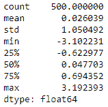

在这里，我们可以看到均值接近零，标准差接近 1。

1.  现在让我们制作一个线形图来检查趋势，使用以下代码：

```py
series.plot()
pyplot.show()
```

我们将得到以下输出：

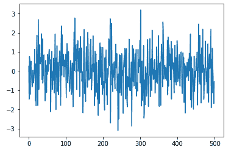

线性图看起来完全是随机的，这里无法观察到任何趋势。

1.  是时候制作自相关图了。让我们使用以下代码设置一个：

```py
autocorrelation_plot(series)
pyplot.show()
```

我们将得到以下输出：

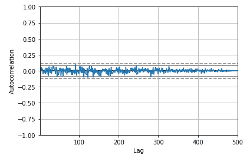

即使在**自相关**函数图上，相关性也突破了我们的置信区间。这告诉我们它是一个白噪声序列。

# 随机游走

随机游走是一种时间序列模型，其中当前观测值等于前一个观测值加上一个随机修改。它可以以下述方式描述：

*x[t]= x[t-1 ]+ w[t]*

在前面的公式中，*w[t]*是一个白噪声序列。

有时，我们可能会遇到反映不规则增长的序列。在这些情况下，预测下一个级别的策略可能是不正确的。相反，尝试预测从一个时期到下一个时期的变化可能更好——也就是说，查看序列的一阶差分可能更好地找出一个显著的模式。以下图显示了随机游走模式：

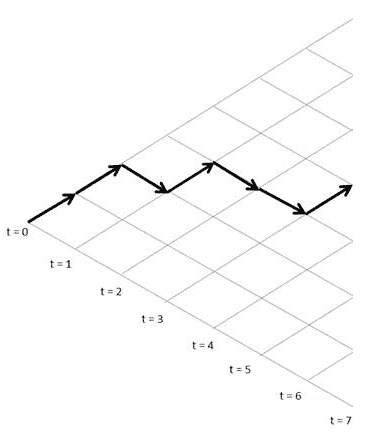

在每个时间段，从左到右，变量的值独立地随机向上或向下迈出一步，这被称为**随机游走**。

它也可以用以下方式描述：

*y(t)= b[o ]+ b[1]*x[t-1] + w[t]*

以下列表解释了前面的公式：

+   *y(t)*：序列中的下一个值

+   *b[o]*：系数，如果设置为非零数字，则表示随机游走伴随着漂移

+   *b[1]*：系数，设置为 1

+   *w[t]*：白噪声

# 自回归

自回归是一种时间序列模型，通常使用同一序列的先前值作为回归的解释因素，以预测下一个值。假设我们测量并跟踪了随时间变化的指标，称为 *y[t]*，它在时间 *t* 时测量，并且当这个值回归到同一时间序列的先前值时。例如，*y[t]* 在 *y[t-1]* 上：

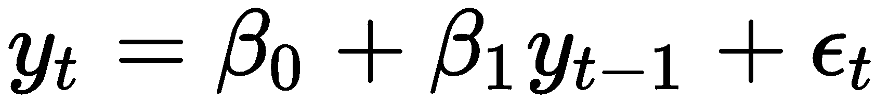

如前一个方程所示，前一个值 *y[t-1]* 已成为这里的预测值，而 *y[t]* 是要预测的响应值。此外，*ε[t]* 是均值为零，方差为 1 的正态分布。自回归模型的阶数由模型用来确定下一个值的先前值的数量定义。因此，前一个方程是一个一阶自回归，或 **AR(1)**。如果我们必须推广它，*k* 阶自回归，写作 **AR(k)**，是一个多元线性回归，其中时间序列在任何时间 (*t*) 的值是时间 *t-1*，*t-2*，…，*t-k* 的值的（线性）函数。

下面的列表显示了对于 AR(1) 模型，以下值代表什么：

+   当 *β[1]= 0*，*y**t*，它等同于白噪声

+   当 *β[1]= 1* 和 *β[0]= 0* 时，*y[t]* 等同于随机游走

+   当 *β[1]= 1* 和 *β[0]≠ 0* 时，*y[t]*，它等同于有漂移的随机游走

+   当 *β[1] < 1*，*y[t]*，它倾向于在正负值之间振荡

# 自相关

自相关是衡量时间序列滞后值之间相关性的度量。例如，*r[1]* 是 *y[t]* 和 *y[t-1]* 之间的自相关，同样，*r[2]* 是 *y[t]* 和 *y[t-2]* 之间的自相关。这可以总结如下公式：

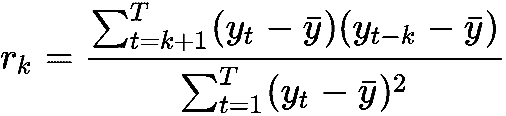

在前一个公式中，*T* 是时间序列的长度。

例如，假设我们有以下相关系数，如图所示：

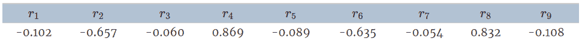

要绘制它，我们得到以下结果：

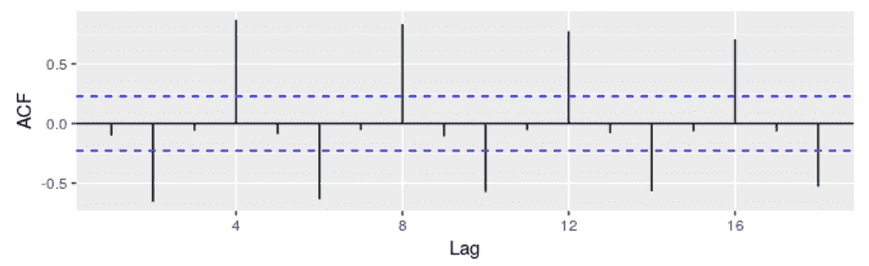

从这个自相关函数图中可以观察到以下内容：

+   **r[4]** 比其他延迟更高，这主要是因为季节性模式

+   蓝线是表示相关性是否显著不同于零的指标

+   延迟 0 的自相关始终为 1

# 平稳性

对于一些时间序列模型，一个常见的假设是数据必须是平稳的。让我们看看平稳性对时间序列意味着什么。

平稳过程是指其均值、方差和自相关结构随时间不变的过程。这意味着数据没有趋势（增加或减少）。

我们可以使用以下公式来描述这一点：

*E(x[t])= μ*，对于所有 *t*

*E(x[t]²)= σ²*，对于所有 *t*

*cov(x[t],x[k])= cov(x[t+s], x[k+s])*，对于所有 *t*，*k* 和 *s*

# 稳定性检测

有多种方法可以帮助我们确定数据是否平稳，如下所示：

+   **绘制数据图**：根据时间变量绘制数据图可以帮助我们判断是否存在趋势。根据平稳性的定义，数据中的趋势意味着没有恒定的均值和方差。让我们用 Python 来实现这一点。在这个例子中，我们使用的是国际航空公司乘客数据。

首先，让我们加载所有必需的库，如下所示：

```py
 from pandas import Series
from matplotlib import pyplot
%matplotlib inline

data = Series.from_csv('AirPassengers.csv', header=0)
  series.plot()
  pyplot.show()
```

我们将得到以下输出：

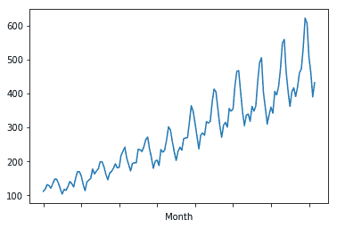

从图中非常清楚地可以看出，这里存在一个上升趋势，并且这证实了我们的假设，即这是一个非平稳序列。

+   **分割数据集并计算摘要**：下一个方法是将数据序列分为两部分，并计算均值和方差。通过这样做，我们将能够确定均值和方差是否恒定。让我们使用以下代码来实现这一点：

```py
X = data.values
partition =int(len(X) / 2)
X1, X2 = X[0:partition], X[partition:]
mean1, mean2 =np.nanmean(X1),np.nanmean(X2)
var1, var2 = np.nanvar(X1), np.nanvar(X2)
print('mean1=%f, mean2=%f' % (mean1, mean2))
print('variance1=%f, variance2=%f' % (var1, var2))
```

输出如下：

```py
mean1=182.902778, mean2=377.694444 variance1=2244.087770, variance2=7367.962191
```

我们可以看到序列 1 和序列 2 的均值和方差不相等，因此我们可以得出结论，该序列是非平稳的。

+   **Augmented Dickey-Fuller 测试**：Augmented Dickey-Fuller 测试是一种统计测试，它倾向于以一定的置信水平指示序列是否平稳。统计测试通过其假设和过程对数据进行测试，以检验我们对数据的假设。最终，它以一定的置信度给出结果，这有助于我们做出决策。

这个测试实际上就是单位根测试，它试图找出时间序列是否受到趋势的影响。它使用**自回归**（**AR**）模型，并在不同的滞后值上优化信息准则。

在这里，零假设如下：

+   ***H[o]***：时间序列具有单位根，这意味着序列是非平稳的。

替代假设如下：

+   ***H[1]***：时间序列没有单位根，因此它是平稳的。

根据假设检验的规则，如果我们为测试选择了 5%的显著性水平，那么结果将被解释如下：

如果 *p-value >0.05* =>，则我们未能拒绝零假设。也就是说，序列是非平稳的。

如果 *p-value <0.05* =>，则拒绝零假设，这意味着该序列是平稳的。

让我们在 Python 中执行以下操作：

1.  首先，我们将加载库，如下所示：

```py
import pandas as pd
import numpy as np
import matplotlib.pylab as plt
%matplotlib inline
from matplotlib.pylab import rcParams
rcParams['figure.figsize'] = 25, 6
```

1.  接下来，我们按照以下方式加载数据和时间图：

```py
data = pd.read_csv('AirPassengers.csv')
print(data.head())
print('\n Data Types:')
print(data.dtypes)
```

输出可以在以下图表中看到：

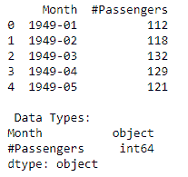

1.  然后，我们按照以下方式解析数据：

```py
dateparse = lambda dates: pd.datetime.strptime(dates, '%Y-%m')
data = pd.read_csv('./data/AirPassengers.csv', parse_dates=['Month'], index_col='Month',date_parser=dateparse)
print(data.head())
```

然后，我们得到以下输出：

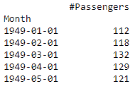

```py
ts= data["#Passengers"]
ts.head()
```

从这里，我们得到以下输出：

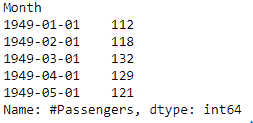

1.  然后，我们绘制以下图表：

```py
plt.plot(ts)
```

输出如下所示：

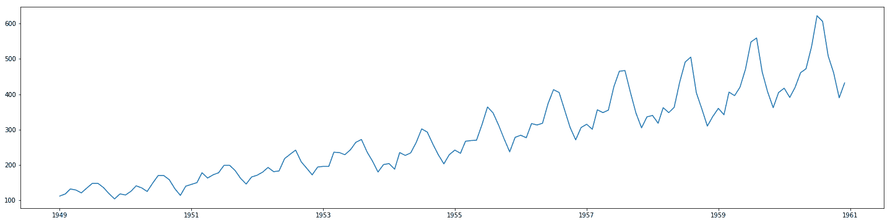

1.  让我们创建一个函数来执行以下代码的平稳性测试：

```py
from statsmodels.tsa.stattools import adfuller
def stationarity_test(timeseries):
 dftest = adfuller(timeseries, autolag='AIC')
 dfoutput = pd.Series(dftest[0:4], index=['Test Statistic','p-value','#Lags Used','Number of Observations Used'])
 for key,value in dftest[4].items():
               dfoutput['Critical Value (%s)'%key] = value
 print(dfoutput)

stationarity_test(ts)
```

输出如下所示：

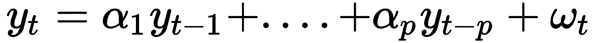

在前面的方程中，* ω* 是白噪声项，*α* 是系数，不能为零。聚合方程如下所示：

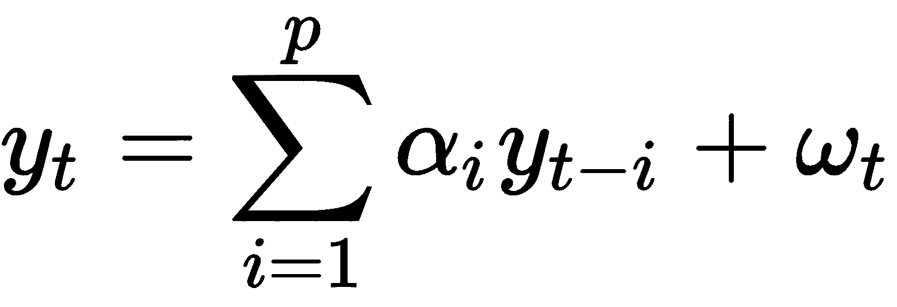

有时，我们可能会讨论模型的阶数。例如，我们可能会将 AR 模型描述为阶数 *p*。在这种情况下，*p* 代表模型中使用的滞后变量的数量。例如，AR(2) 模型或二阶 AR 模型看起来如下：

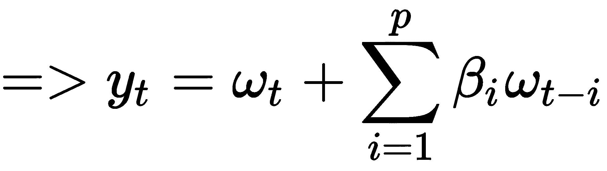

在这里，*ω* 是具有 *E(ω[t])=0* 和方差 =* σ²* 的白噪声。

为了找出 AR 模型的阶数，我们需要绘制一个偏自相关函数图，然后寻找第一次被上置信水平跨越的滞后。

# 自回归积分移动平均

**自回归积分移动平均**（**ARIMA**）模型是以下元素的组合：

+   **自回归算子**：我们已经学习了这是什么意思；只是为了重申，它是平稳化序列的滞后。它用 *p* 表示，这仅仅是自回归项的数量。PACF 图提供了这个组成部分。

+   **积分算子**：一个需要通过差分使其平稳的序列被称为平稳序列的积分形式。它用*d*表示，这是将非平稳时间序列转换为平稳序列所需的差分量。这是通过从当前周期的观测值中减去前期的观测值来实现的。如果这个过程只对序列进行了一次，那么它被称为**一阶差分**。这个过程消除了序列中按恒定速率增长的趋势。在这种情况下，序列是按递增速率增长的，差分序列需要另一轮差分，这被称为**二阶差分**。

+   **移动平均算子**：预测误差的滞后，用*q*表示。它是方程中滞后预测误差的数量。ACF 图将产生这个成分。

ARIMA 模型只能应用于平稳序列。因此，在应用它之前，必须检查序列的平稳性条件。可以使用 ADF 测试来建立这一点。

ARIMA 方程看起来如下：

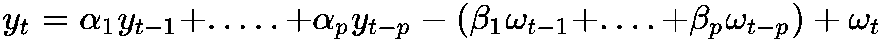

方程的前一部分（在*-*符号之前）是自回归部分，第二部分（在*-*符号之后）是移动平均（MA）部分。

我们还可以在 ARIMA 模型中添加季节性成分，这将形成 ARIMA *(p,d,q)(p,d,q)[s]*。在添加它时，我们需要执行季节性差分，这意味着从季节滞后中减去当前观测值。

让我们绘制自相关函数（ACF）和偏自相关函数（PACF）以找出*p*和*q*参数。

在这里，我们取滞后数为 20，并使用`statsmodel.tsa.stattools`库导入`acf`和`pacf`函数，如下所示：

```py
from statsmodels.tsa.stattools import acf,pacf
lag_acf= acf(ts_log_dif,nlags=20)
lag_pacf = pacf(ts_log_dif, nlags=20,method="ols")
```

现在，我们将使用以下代码通过`matplotlib`绘制图表：

```py

plt.subplot(121) 
plt.plot(lag_acf)
plt.axhline(y=0,linestyle='--',color='gray')
plt.axhline(y=-1.96/np.sqrt(len(ts_log_diff)),linestyle='--',color='gray')
plt.axhline(y=1.96/np.sqrt(len(ts_log_diff)),linestyle='--',color='gray')
plt.title('Autocorrelation Function')
```

输出如下：

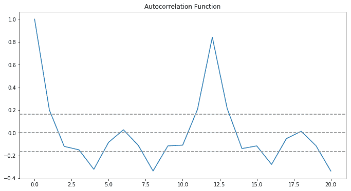

在这里，我们正在测量时间序列与其滞后版本之间的相关性。例如，在滞后 5 的情况下，ACF 将比较时间点*t1*，*t2*处的序列与时间点*t[1-5]*，*…*，*t[2-5]*处的序列。这是一张相关系数与其滞后值的相关图。

如果我们仔细观察前面的图表，我们会看到在滞后 2 时上置信水平线已被穿过。因此，移动平均（MA）的阶数将是*2*，而*q=2*。

画出了序列与滞后值之间的部分相关性，并给出了**部分自相关函数**（**PACF**）图。这是一个非常有趣的术语。如果我们继续计算*Y*变量与*X*3 之间的相关性，同时我们知道*Y*与*X*1 和*X*2 有分离的关联，那么部分相关性就解决了这部分相关性，这部分相关性不能由它们与*X*1 和*X*2 的相关性来解释。

在这里，偏相关是平方根（通过添加一个变量（此处为*X*3）并在其他变量（此处为*X*1，*X*2）上对*Y*进行回归时减少方差）。

在时间序列的情况下，Y 与滞后值 Y[t-3]之间的偏自相关将是未被*Y*与*Y*[*t*-1]和*Y*[*t*-2]之间的相关性解释的值，如下代码所示：

```py
#Plot PACF:
plt.subplot(122)
plt.plot(lag_pacf)
plt.axhline(y=0,linestyle='--',color='gray')
plt.axhline(y=-1.96/np.sqrt(len(ts_log_diff)),linestyle='--',color='gray')
plt.axhline(y=1.96/np.sqrt(len(ts_log_diff)),linestyle='--',color='gray')
plt.title('Partial Autocorrelation Function')
plt.tight_layout()
```

我们将得到以下输出：

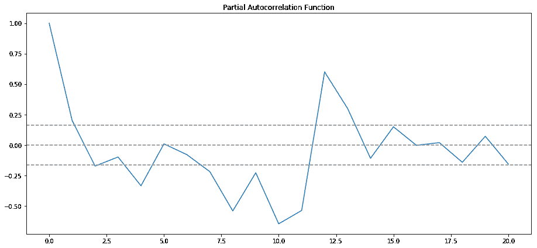

如果我们仔细观察前面的图，我们会看到在滞后 2 时上置信水平线已被穿过。因此，AR 的阶数应该是 2，*p=2*。

让我们尝试一个阶数为*(p=2, d=1, q=0)*的 AR 模型。*d*值取为 1，因为这是一个一阶差分的情况。同时计算了残差平方和，以判断模型的好坏，并与其他模型进行比较，如下代码所示：

```py
from statsmodels.tsa.arima_model import ARIMA
model1 = ARIMA(ts_log, order=(2, 1, 0)) 
results_AR = model1.fit(disp=-1) 
plt.plot(ts_log_dif)
plt.plot(results_AR.fittedvalues, color='red')
plt.title('RSS: %.4f'% sum((results_AR.fittedvalues-ts_log_dif)**2))
```

输出如下所示：

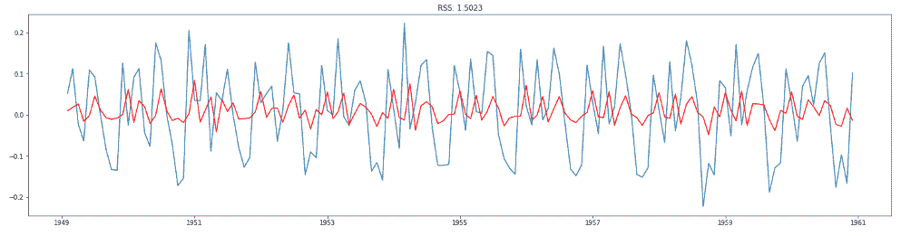

现在，我们可以使用以下代码查看描述 AR1 和 AR2 系数的模型摘要：

```py
results_AR.summary()
```

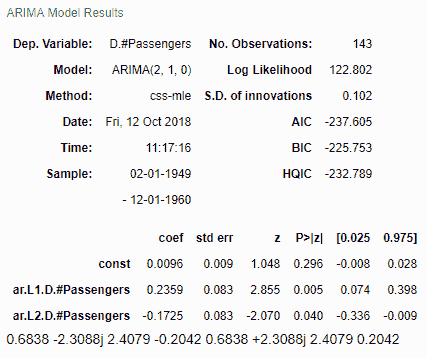

现在，让我们使用以下代码构建一个阶数为*(p=0,d=1,q=2)*的 MA 模型：

```py
model2 = ARIMA(ts_log, order=(0, 1, 2)) 
results_MA = model2.fit(disp=-1) 
plt.plot(ts_log_dif)
plt.plot(results_MA.fittedvalues, color='red')
plt.title('RSS: %.4f'% sum((results_MA.fittedvalues-ts_log_dif)**2))
```

输出如下所示：

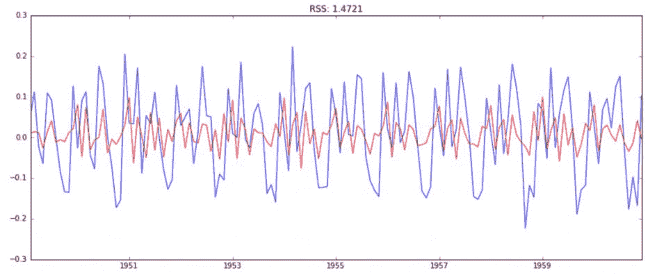

现在，让我们结合这两个模型，并使用以下代码构建一个 ARIMA 模型：

```py
model3 = ARIMA(ts_log, order=(2, 1, 2))  
results_ARIMA = model.fit(disp=-1)  
plt.plot(ts_log_dif)
plt.plot(results_ARIMA.fittedvalues, color='red')
plt.title('RSS: %.4f'% sum((results_ARIMA.fittedvalues-ts_log_dif)**2))
```

输出如下所示：

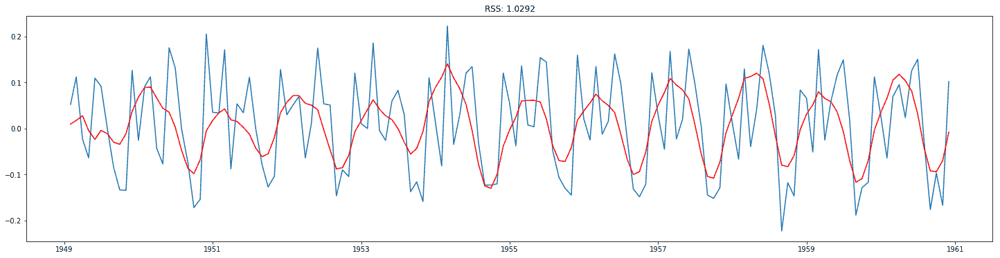

我们可以从 AR 模型到 ARIMA 模型观察到 RSS 值的下降。现在**RSS= 1.0292**：

```py
results_ARIMA.summary()
```

我们可以看到 AR1、AR2、MA1 和 MA2 的系数，并且根据*p*值，我们可以看到所有这些参数都是显著的，如下截图所示：

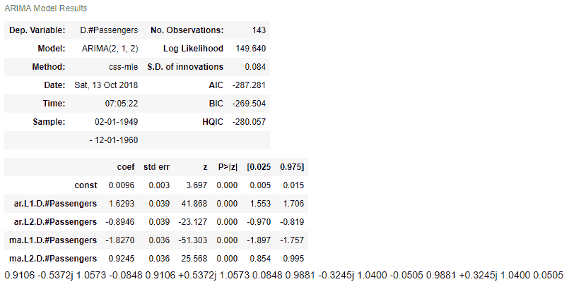

让我们使用以下代码将预测值转换成一个序列：

```py
predictions_ARIMA_dif= pd.Series(results_ARIMA.fittedvalues, copy=True)
print(predictions_ARIMA_dif.head())
```

我们将得到以下输出：

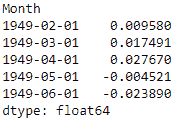

将差分转换为对数尺度的方法是连续将这些差异添加到基数中。一种简单的方法是首先确定索引处的累积和，然后将其添加到基数中。累积和可以使用以下代码找到：

```py
predictions_ARIMA_dif_cumsum = predictions_ARIMA_dif.cumsum()
print(predictions_ARIMA_dif_cumsum.head())
```

从这个结果，我们将得到以下输出：

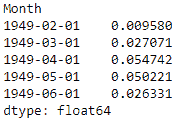

我们将创建一个所有值都为基数，并添加差异以添加到基数序列中的序列，如下所示：

```py
predictions_ARIMA_log = pd.Series(ts_log.ix[0], index=ts_log.index)
predictions_ARIMA_log = predictions_ARIMA_log.add(predictions_ARIMA_dif_cumsum,fill_value=0)
predictions_ARIMA_log.head()
```

下面的代码显示了输出：

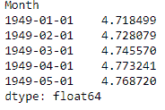

现在我们使用以下代码来找出预测结果：

```py
predictions_ARIMA = np.exp(predictions_ARIMA_log)
plt.plot(ts)
plt.plot(predictions_ARIMA)
plt.title('RMSE: %.4f'% np.sqrt(sum((predictions_ARIMA-ts)**2)/len(ts)))
```

输出如下所示：

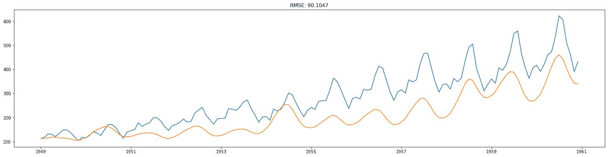

# 参数优化

让我们看看如何优化模型的参数。

# AR 模型

```py
import statsmodels.tsa.api as smtsa
aic=[] 
for ari in range(1, 3): 
 obj_arima = smtsa.ARIMA(ts_log_diff, order=(ari,2,0)).fit(maxlag=30, method='mle', trend='nc') 
 aic.append([ari,2,0, obj_arima.aic])
print(aic)
[[1, 2, 0, -76.46506473849644], [2, 2, 0, -116.1112196485397]]
```

因此，在这种情况下，AR 模型的最优模型参数是`p=2`，`d=2`，`q=0`，因为这种组合的 AIC 值最小。

# ARIMA 模型

即使对于 ARIMA 模型，我们也可以使用以下代码来优化参数：

```py
import statsmodels.tsa.api as smtsa
aic=[] 
for ari in range(1, 3): 
     for maj in range(1,3): 
        arima_obj = smtsa.ARIMA(ts_log, order=(ari,1,maj)).fit(maxlag=30, method='mle', trend='nc') 
        aic.append([ari,1, maj, arima_obj.aic])
print(aic)
```

执行上述代码后，您将得到以下输出：

```py
[[1, 1, 1, -242.6262079840165], [1, 1, 2, -248.8648292320533], [2, 1, 1, -251.46351037666676], [2, 1, 2, -279.96951163008583]]
```

应选择具有最小**赤池信息准则**（**AIC**）的组合。

# 异常检测

异常本质上是一系列中的异常模式，是不规则偏离预期行为的偏差。例如，我们中的许多人看过板球比赛。在这场比赛中出局的一种方式是被接住，在球直接飞到守门员手中之前，它必须触碰到击球手的球棒。如果体育场非常嘈杂，有时很难判断球是否触碰到球棒。为了解决这个问题，裁判员使用一种称为**snickometer**的设备来帮助他们做出判断。snickometer 使用球桩麦克风的声波生成麦克风的声波图。如果图是直线，则球没有接触到球棒；否则，图将显示一个尖峰。因此，尖峰是异常的标志。另一个异常的例子可能是扫描中检测到恶性肿瘤。

异常检测是一种我们可以用来确定异常行为的技巧。异常也可以称为**离群值**。以下列表展示了几个不同的异常类型：

+   **点异常**：点异常是突破已分配给整个系统以保持监控的阈值边界的点。通常有一个系统在位，当点异常突破这个边界时，会发送警报。例如，金融行业的欺诈检测可以使用点异常检测来检查是否发生了从不同城市到持卡人常用位置的交易。

+   **上下文异常**：特定上下文的观察被称为**上下文异常**。例如，在工作日有大量交通是常见的，但如果假日落在周一，可能会看起来像是一个异常。

+   **集体异常**：一组集体数据实例有助于检测异常。比如说，有人意外地试图从远程机器复制数据到本地主机。在这种情况下，这种异常将被标记为潜在的网络安全攻击。

在本节中，我们将重点关注上下文异常，并尝试使用简单的移动平均来检测它们。

首先，让我们按照以下方式加载所有必需的库：

```py
import numpy as np # vectors and matrices
import pandas as pd # tables and data manipulations
import matplotlib.pyplot as plt # plots
import seaborn as sns # more plots
from sklearn.metrics import mean_absolute_error
import warnings # `do not disturb` mode
warnings.filterwarnings('ignore')
%matplotlib inline
```

接下来，我们使用以下代码读取数据集。我们保持相同的数据集——即`AirPassenger.csv`：

```py
data = pd.read_csv('AirPassengers.csv', index_col=['Month'], parse_dates=['Month'])
 plt.figure(figsize=(20, 10))
 plt.plot(ads)
 plt.title('Trend')
 plt.grid(True)
 plt.show()
```

我们得到以下输出：

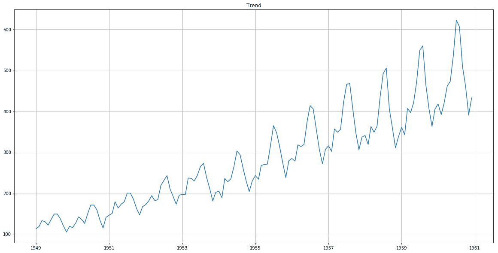

现在我们将编写一个函数，并使用以下代码创建一个用于检测异常的阈值：

```py
def plotMovingAverage(series, window, plot_intervals=False, scale=1.96, plot_anomalies=False):
       rolling_mean = series.rolling(window=window).mean()
       plt.figure(figsize=(15,5))
       plt.title("Moving average\n window size = {}".format(window))
       plt.plot(rolling_mean, "g", label="Rolling mean trend")
      # Plot confidence intervals for smoothed values
      if plot_intervals:
          mae = mean_absolute_error(series[window:], rolling_mean[window:])
          deviation = np.std(series[window:] - rolling_mean[window:])
          lower_bond = rolling_mean - (mae + scale * deviation)
          upper_bond = rolling_mean + (mae + scale * deviation)
          plt.plot(upper_bond, "r--", label="Upper Bond / Lower Bond")
          plt.plot(lower_bond, "r--") 
 # Having the intervals, find abnormal values
      if plot_anomalies:
         anomalies = pd.DataFrame(index=series.index, columns=series.columns)
         anomalies[series<lower_bond] = series[series<lower_bond]
         anomalies[series>upper_bond] = series[series>upper_bond]
         plt.plot(anomalies, "ro", markersize=10) 
         plt.plot(series[window:], label="Actual values")
         plt.legend(loc="upper left")
         plt.grid(True)
```

现在，让我们使用以下方法向序列中引入异常：

```py
data_anomaly = data.copy()
data_anomaly.iloc[-20] = data_anomaly.iloc[-20] * 0.2
```

现在，让我们使用以下代码来绘制它以检测引入的异常：

```py
plotMovingAverage(data_anomaly, 4, plot_intervals=True, plot_anomalies=True)
```

下图显示了输出结果：

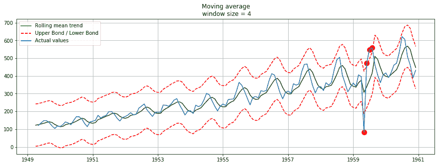

现在，引入的异常可以在 1959 年之后被看作是旅行者数量的下降。然而，需要注意的是，这是一种较为简单的方法。在此场景下，也可以使用 ARIMA 和 Holt-Winters 方法。

# 摘要

在本章中，我们学习了时间序列分析和白噪声。我们介绍了随机游走、自回归、自相关和平稳性的概念，这些概念描述了如何判断数据是否平稳。

我们还学习了差分法，即对时间序列数据进行处理，计算连续观测值之间的差异，从而形成一个新的序列。本章还讨论了 AR 模型，它是随机过程的一部分，其中特定滞后值*y**[t]*被用作预测变量，并回归到*y**[t ]*上来估计值。我们还学习了两个优化参数，即 AR 模型和 ARIMA 模型。

在下一章中，我们将学习关于自然语言处理的内容。
