# 第八章：概率图模型

在我们深入探讨**贝叶斯网络**（**BN**）的概念之前，我们应该了解概率论的理论。因此，我们将尝试简要介绍它们，并建立贝叶斯网络的基础。

我们已经知道，概率是事件发生的确定性/不确定性程度。然而，它也可以被称为信念程度，这在讨论贝叶斯网络时更为常用。

当我们抛一个公平的硬币时，我们说，关于发生正面/反面的信念程度是 *0.5*。这意味着我们对发生正面的信念程度与发生反面的信念程度一样强。概率可以如下表示：

*p(Heads)=p(tails)=0.5*

在本章中，我们将涵盖以下主题：

+   贝叶斯规则

+   贝叶斯网络

# 关键概念

在我们进入本章的主体之前，我们将介绍几个关键概念：

+   在离散分布的情况下，概率质量函数用于找出概率，*p(X= x)*，其中 *X* 是一个离散随机变量，*x* 是一个实数值。

+   在连续分布的情况下，概率密度函数用于找出概率 *p(X <= x)*。在这种情况下，绘制一个概率曲线，曲线下的面积（积分）帮助我们确定概率。

+   条件概率是为了理解这一点，板球比赛可以是一个完美的例子。假设印度和澳大利亚之间有一场比赛安排，我们正在试图传递我们对印度获胜的信念。你认为这个概率会受到印度选择的队伍的影响吗？如果 *维拉特·科赫利* 和 *罗希特·沙尔马* 是队伍中的一员，印度赢得比赛的概率会受到什么影响？所以，*p(India winning|Rohit and Virat are playing)* 表示在 *罗希特* 和 *维拉特* 参赛的情况下，印度获胜的概率。本质上，这意味着一个事件的概率依赖于另一个事件的概率。这被称为**条件概率**。

给定 *y*，*x* 的概率可以表示如下：

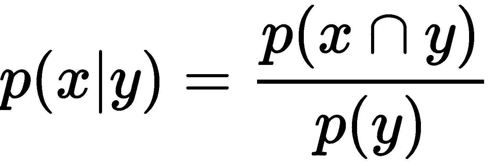

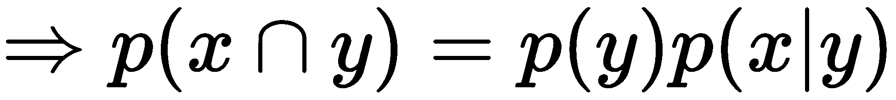

+   链式法则通过使用随机变量的条件概率来计算一组随机变量的联合分布。从条件概率中，我们知道 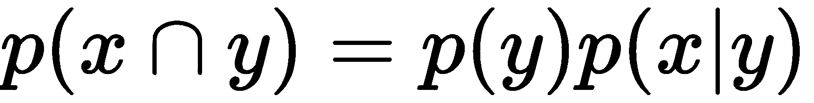。

这意味着如果有 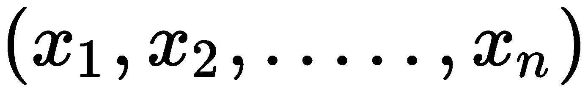 个事件。联合概率分布将呈现如下：

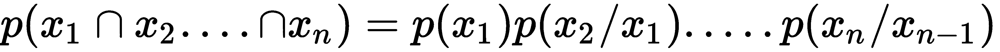

# 贝叶斯定理

贝叶斯定理是概率论的一个基石。它源于条件概率和联合概率，并扩展了其应用范围。

我们将通过再次从板球中举一个例子，以简单的方式解释这一点。在板球中，场地条件随着从一个地方到另一个地方的变化而变化，这是决定队伍时可能是一个重要的因素。结果也可能依赖于它。

假设印度队去澳大利亚比赛，我们必须预测一名印度球员在这场比赛中得分百（100 分）的信念。如果这名球员有在那国打球的经验，我们可能会非常确信他可能会得分百。但是，还有另一名球员是第一次来这个国家。那么他的先验信念会是什么？当然，很多人会认为他得分百的信念较低。

然而，我们的先验信念会随着我们看到球员的表现而改变。也就是说，随着球员参加更多比赛，我们将有更多关于球员的数据。基于这些，后验信念将不断更新。它变化很大，很大程度上是由于观察或更多数据（称为**似然**）。贝叶斯定理基于这些概念。

假设 *A[i]* 与 *B* 形成互斥事件：

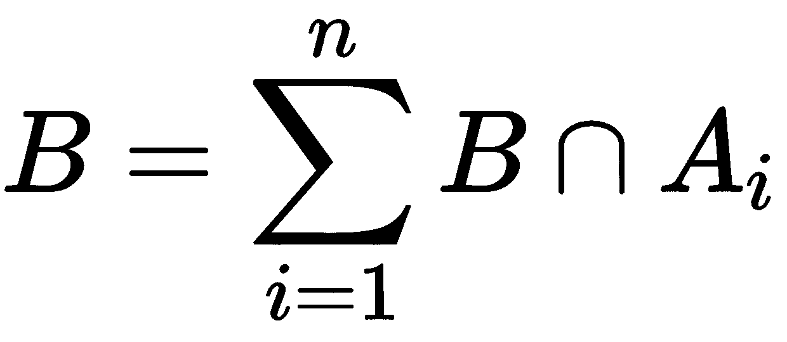

*B* 的概率如下：

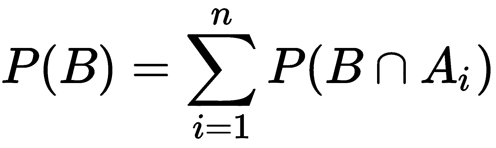

我们从条件概率中得到 *B* 的概率如下：

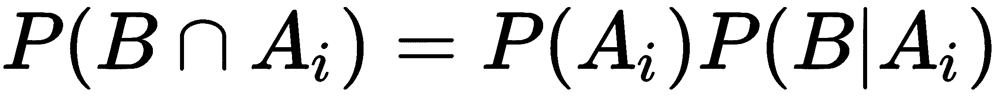

因此：

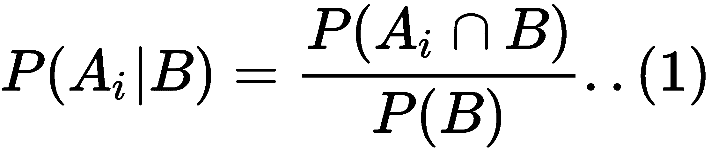

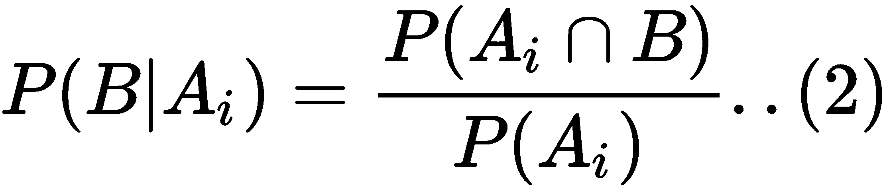

现在，从方程 2 中提取 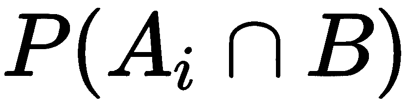 的值，并将其放入方程 1 中，我们得到以下结果：

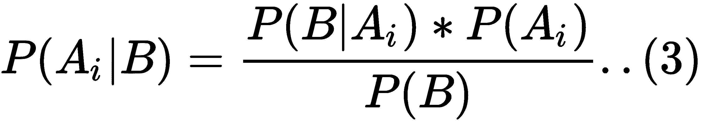

在将先前的方程中的 *P(B)* 值替换后，我们得到以下结果：

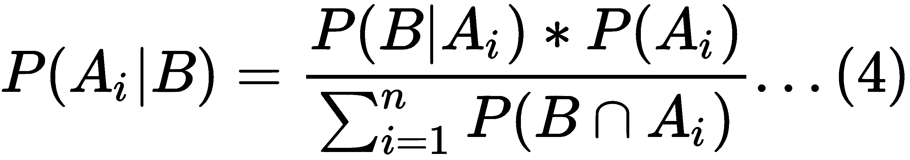

首先看看方程 3。这被称为**贝叶斯定理**。

*P(A|B)* 被称为**后验概率**，需要被估计。在先前的例子中，这将是玩家在之前有在该地打球经验的情况下得分百的概率。

*P(B|A)* 被称为**似然**，是在给定我们的初始假设的情况下观察新证据的概率。例如，一名球员在之前有打板球经验的情况下得分百的概率。

*P(A)* 被称为**先验概率**，是在没有任何额外先验信息的情况下我们假设的概率。

*P(B)* 被称为**边缘似然**，是观察证据的总概率。

# 贝叶斯网络

贝叶斯网络是一种概率图模型，可用于构建解决商业问题的模型。这种应用非常广泛。例如，它可以用于异常检测、预测建模、诊断、自动洞察以及许多其他应用。

对于这里使用的某些词汇，你可能现在还感到陌生。例如，我们在这里所说的“图形化”是什么意思？

图是由一组节点和边组成的。节点用*N={N1,N2……Nn}*表示，其中独立变量位于每个节点上。边是节点之间的连接器。边可以用*E={E1, E2……En}*表示，并且有两种类型：

+   有向的，表示为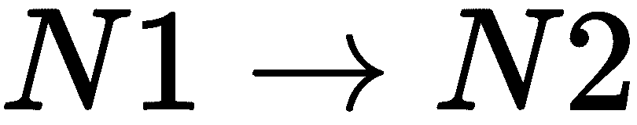

+   无向的，表示为：

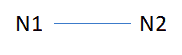

通过节点和边，可以展示变量之间的关系。这可能是一个条件独立性关系或条件依赖关系。贝叶斯网络（BN）是一种可以在变量之间引入因果关系的技巧。尽管因果关系不是其本质的一部分，但在网络中拥有这种（因果关系）可以使结构相当紧凑。

让我们通过一个例子来看一下。有许多变量，例如晚起、高速公路上的事故、雨天、交通堵塞，他们将会迟到上班，以及会议迟到。如果一个人起床晚，这意味着上班迟到。高速公路上的事故可以导致交通堵塞，进而导致上班迟到。在雨天，道路更容易发生事故，而且也可能有缓慢移动的交通，这将导致交通堵塞，进而导致上班迟到。以下图表解释了该例子：

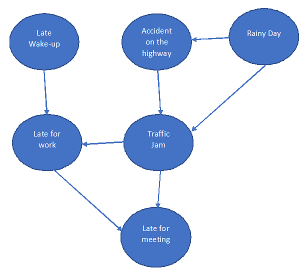

这种网络被称为**有向无环图**。无环意味着网络中没有循环。我们在这里讨论的是变量之间的关系。例如，晚起和会议迟到通常不是独立的。但考虑到上班迟到，它们是条件独立的。

此外，可能看起来晚起与高速公路上的事故之间没有联系和关系。也就是说，它们可能看起来彼此独立。然而，如果你知道上班迟到的重要性，那么这两个可以被称为条件独立。

因此，贝叶斯网络允许节点之间的条件独立性。同时，它是一个高效的联合概率分布表示，这是由链式法则实现的。

假设 X 代表 n 个独立变量或节点。弧或指向箭头代表变量之间的概率依赖或独立性。没有弧表示概率独立性。该网络是一个有向无环图，其中每个节点都保持局部概率分布，这也可以称为**条件概率表**（**CPT**）。

如果我们谈论前面的网络，那么我们需要整个网络所需的概率分布。为了简化，我们将所有节点都保持为布尔值。

# 节点的概率

让我们看看每个节点的概率，并找出会有多少概率出现在那里。

带有**晚起**和**雨天**的节点是父节点，因为没有节点指向这样的节点。不同的节点可以在以下要点中看到：

1.  **节点（晚起）**：作为父节点之一，我们只需找出晚起的概率。因此，要找到的概率计数在这里是 1。

1.  **节点（雨天）**：与晚起节点一样，概率的计数在这里也是 1。

1.  **节点（高速公路事故）**：作为雨天节点的子节点，它讨论了在雨天和不是雨天的情况下发生事故的概率。因此，概率计数在这里是 2。

1.  **节点（交通堵塞）**：它有两个父母（雨天和事故）。雨天有两个值，即真和假，与事故相同。结合两者将产生四种不同的组合。因此，概率计数将是 4。

1.  **节点（上班迟到）和节点（开会迟到）**：这两个节点也有类似的解释。这些概率的计数是 4：

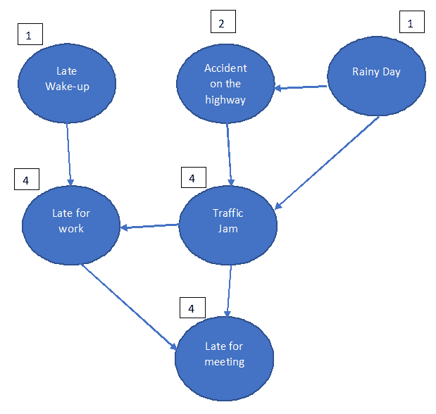

概率的总数是 1 + 2 + 1 + 4 + 4 + 4 = 16。

如果它只是一个普通的联合概率分布而不是贝叶斯网络（BN），我们就会有 2⁶-1 个概率。因此，BN 使得网络相当紧凑。此外，我们还必须注意的一个更基本的假设是，每个节点在给定其直接父母的情况下对其非后裔是条件独立的。例如，起床晚和开会迟到在“上班迟到”也存在的情况下是条件独立的。一般来说，我们可以以下述方式表达 BN，这显示了联合分布如何转化为紧凑的结构：

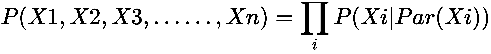

如果*G*是图，*X[i]*是图*G*中的一个节点，*P*是*X[i]*节点的父母。

这里有一些关于方程的注意事项：

+   方程式的右侧是链式法则的应用，它展示了条件独立性关系。它是联合概率分布的图结构近似。

+   当然，图必须是循环的。

+   它可以提供显示各种事件之间关系的便利。

现在，让我们通过一个简单的场景来展示 CPT（共变概率定理）。以下是将三个事件组合起来的示例：

如果下雨，狗开始叫，男人会旷工：

+   下雨的概率（是/否）

+   狗会叫的概率（是/否）

+   男人是否会旷工（是/否）

让我们将网络准备成一个有向无环图。所有这些节点都反映一个事件，有向箭头是条件概率。我们将在这里看到如何读取这个图：

+   连接器 1 表示如果下雨狗会叫的概率

+   连接器 2 表示如果狗叫，男人会旷工的概率

以下图表显示了两个概率的流程图：

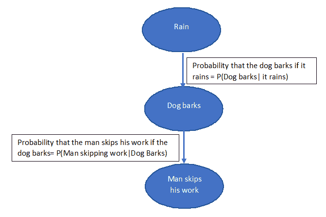

# 条件概率表（CPT）

让我们为连接器 1 做条件概率表（CPT）：

|  | **狗叫** | **狗不叫** | **总计** |
| --- | --- | --- | --- |
| 下雨 |                10 |               4 |           14 |
| 不下雨 |                 8 |             5 |        13 |
| 总计 |               18 |               9 |           27 |

这里，我们讨论以下场景：

+   概率*(狗叫|下雨) = 10/14*

+   概率*(狗不叫 | 下雨) = 4/14*

+   概率*(狗叫 | 不下雨) = 8/13*

+   概率*(狗不叫 | 不下雨) = 5/13*

|  | **狗叫** | **狗不叫** |
| --- | --- | --- |
| 下雨 |                10/14 |               4/14 |
| 不下雨 |                 8/13 |             5/13 |

以下图表详细显示了概率：

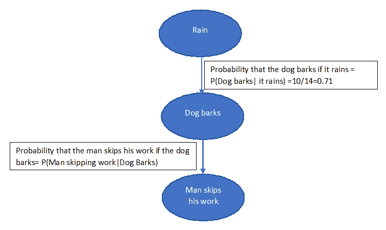

假设下雨的概率为 *P(下雨) = 0.6*，那么不下雨的概率为 *P(不下雨) = 0.4*。

假设男人旷工的条件概率表（CPT）如下：

|  | **男人旷工** | **男人不旷工** |
| --- | --- | --- |
| 狗叫 |                0.8 |               0.2 |
| 狗不叫 |                0.3 |             0.7 |

每个事件的概率都必须相对于父节点来计算。

现在，我们应该找出男人旷工、狗叫但不下雨的概率 *P (男人旷工, 狗叫, 不下雨)*：

*= P (男人旷工|狗叫) *P (狗叫|不下雨) *P(不下雨)*

*=0.8 * (8/13) *0.4*

*=0.1969*

# 训练集和测试集的示例

让我们用一个案例来演示，并在 Python 中实现它。我们将使用 Kaggle 上的泰坦尼克号数据。

数据已经被分成两组：

+   训练集(`train.csv`)

+   测试集(`test.csv`)

数据是关于在泰坦尼克号上旅行的乘客。它捕捉了他们的特征：

+   `pclass`: 票等级 1 = 1 等，2 = 2 等，3 = 3 等

+   `gender`: 性别

+   `Age`: 年龄（年）

+   `sibsp`: 泰坦尼克号上的兄弟姐妹/配偶数量

+   `parch`: 泰坦尼克号上的父母/孩子数量

+   `ticket`: 票号

+   `fare Passenger`: 乘客票价

+   `cabin`: 船舱号

+   `embarked`: 登船港口 `C = Cherbourg`, `Q = Queenstown`, 和 `S = Southampton`

我们必须构建模型来预测他们是否在泰坦尼克号沉没中幸存。最初，按照以下方式导入参数：

```py
import pandas as pd
import numpy as np
```

我们在这里加载数据集：

```py
traindf= pd.read_csv("train.csv")
testdf= pd.read_csv("test.csv")
```

我们必须寻找每个变量的唯一值数量，因为贝叶斯网络是离散模型：

```py
for k in traindf.keys():
 print('{0}: {1}'.format(k, len(traindf[k].unique())))
```

输出如下：

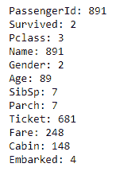

为了避免系统过载和过多的计算，我们将减少变量的数量：

```py
for k in traindf.keys():
 if len(traindf[k].unique())<=10:
 print(k)
```

我们得到以下输出：

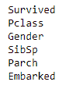

现在，我们剩下六个变量。

此外，如果需要将连续变量纳入模型，我们必须对它们进行离散化：

```py
import math
def forAge(row):
 if row['Age'] < 10:
    return '<10'
 elif math.isnan(row['Age']):
    return "nan"
 else:
    dec = str(int(row['Age']/10))
    return "{0}0's".format(dec)
 decade=traindf.apply(forAge, axis=1)
 print("Decade: {1}".format(k, len(decade.unique())))
```

输出结果如下：

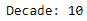

现在让我们进行预处理：

```py
def preprocess(df):
 # create a dataframe with discrete variables (len<10)
 filt=[k for k in df.keys() if len(df[k].unique())<=10]
 filtr2=df[filt].copy()
 forAge = lambda row: int(row['Age']/10) if not math.isnan(row['Age']) else np.nan
 filtr2['Decade']=df.apply(forAge, axis=1)
 filtr2=filtr2.dropna()
 filtr2['Decade']=filtr2['Decade'].astype('int32')
 return filtr2
```

对于`traindf`和`testdf`，我们使用以下方法：

```py
ptraindf= preprocess(traindf)
ptestdf=preprocess(testdf)
```

我们需要保存这些数据，因为`pyAgrum`库只接受文件作为输入：

```py
ptraindf.to_csv('post_train.csv', index=False)
ptestdf.to_csv( 'post_test.csv', index=False)

df=pd.read_csv('post_train.csv')
for k in df.keys():
  print("{} : {}".format(k, df[k].unique()))
```

下面的输出结果如下：

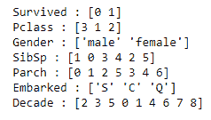

```py
import pyAgrum as gum
import pyAgrum.lib.notebook as gnb
```

现在，是时候构建模型了。在这里，选择`RangeVariable`和`LabelizedVariable`变量时需要格外小心：

```py
template=gum.BayesNet()
template.add(gum.RangeVariable("Survived", "Survived",0,1))
template.add(gum.RangeVariable("Pclass", "Pclass",1,3))
template.add(gum.LabelizedVariable("Gender", "Gender",0).addLabel("female").addLabel("male"))
template.add(gum.RangeVariable("SibSp", "SibSp",0,8))
template.add(gum.RangeVariable("Parch", "Parch",0,9))
template.add(gum.LabelizedVariable("Embarked", "Embarked",0).addLabel('').addLabel('C').addLabel('Q').addLabel('S'))
template.add(gum.RangeVariable("Decade", "Calculated decade", 0,9))
gnb.showBN(template)
```

输出结果如下：


对于`learnBN()`函数，我们使用以下方法：

```py
learner = gum.BNLearner('post_train.csv', template)
bn = learner.learnBN()
bn
```

下面的输出结果如下：

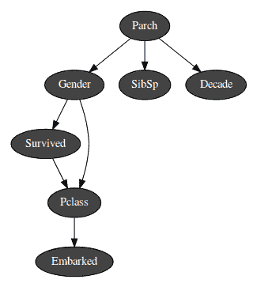

现在我们有了模型，让我们尝试从中提取信息：

```py
gnb.showInformation(bn,{},size="20")
```

我们得到的输出结果如下：

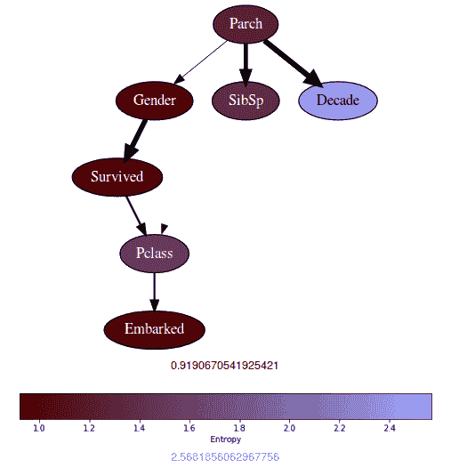

变量的熵意味着值越大，变量的边际概率分布的不确定性就越大。熵值越低，不确定性就越低。`Decade`变量具有最高的熵，这意味着它是均匀分布的。Parch 具有较低的熵，分布不均匀。

熵的计算结果导致熵值在随机变量具有许多模式时往往会变大。

找到推理结果让我们看到了边际概率分布的情况：

```py
gnb.showInference(bn)
```

输出结果如下：

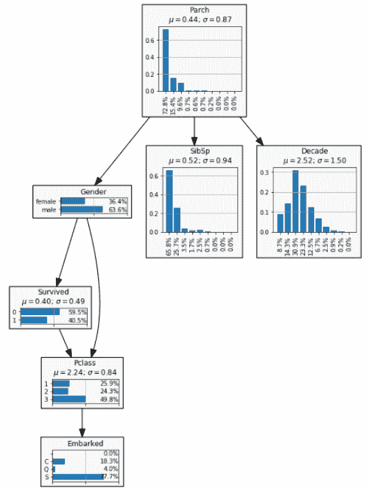

现在，让我们看看如何进行分类：

```py
gnb.showPosterior(bn,evs={},target='Survived')
```

我们得到的输出结果如下：

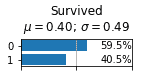

在这里，超过 40%的乘客存活。但我们没有施加任何条件。

假设我们想知道一位年轻男性的存活机会：

```py
gnb.showPosterior(bn,evs={"Gender": "male", "Decade": 3},target='Survived')
```

下面的输出结果如下：

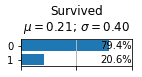

因此，存活的机会是 20.6%。

如果我们需要找出一位老妇人存活的机会，我们将按照以下步骤进行：

```py
gnb.showPosterior(bn,evs={"Gender": "female", "Decade": 8},target='Survived')
```

输出结果如下：

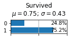

现在，为了评估模型以了解其好坏，我们将绘制 ROC 曲线：

```py
from pyAgrum.lib.bn2roc import showROC
 showROC(bn, 'post_train.csv','Survived',"1",True,True)
```

输出结果如下：

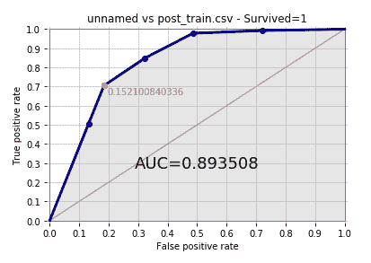

在这里，**AUC**值为**0.893508**，相当不错。

我们在这里完成了建模部分。此外，我们还学习了概率论、贝叶斯网络、CPT 的计算以及如何在 Python 中执行它。

# 摘要

本章让我们了解了概率论。同时，概率论的应用也得到了实践。我们了解了贝叶斯定理和贝叶斯网络及其形成方式。我们亲自动手计算了 CPT。最后，我们通过一个案例了解了如何使用贝叶斯网络进行分类。读者现在将具备深入了解贝叶斯定理和贝叶斯网络的能力。

在下一章，我们将研究深度学习中的选定主题。
