# 第十一章：高级方法

我们已经到达了这本书的最后一章。然而，这并不意味着我们可以忽视即将讨论的主题。这些主题是当前最前沿的，并将使你与其他人区分开来。

本章我们将涵盖以下主题：

+   核主成分分析

+   独立成分分析

+   压缩感知

+   贝叶斯多重插补

+   自组织映射

# 简介

在上一章中，我们了解了**主成分分析**（PCA）是什么，它是如何工作的，以及我们应该在何时部署它。然而，作为一种降维技术，你认为你可以在每个场景中都使用它吗？你能回忆起我们讨论过的它背后的障碍或潜在假设吗？

是的，PCA 背后最重要的假设是它适用于线性可分的数据集。然而，在现实世界中，你很少遇到这种类型的数据集。我们需要一种方法来捕捉非线性数据模式。

在左侧，我们有一个包含两个类别的数据集。我们可以看到，一旦我们到达投影并建立组件，PCA 对它没有影响，并且它不能在二维维度上通过一条线将其分开。也就是说，PCA 只有在我们有低维度和线性可分数据时才能很好地工作。以下图显示了两个类别的数据集：

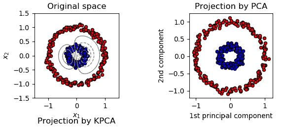

正是因为这个原因，我们引入了核方法：这样我们就可以将其与 PCA 结合以实现它。

只为了回顾一下你关于核方法学到的知识，我们将简要讨论它及其重要性：

+   我们在低维空间中有数据。然而，当我们有非线性数据（如下面的图所示）时，有时很难进行分类（绿色和红色）。话虽如此，我们确实清楚地理解，拥有一种可以将数据从低维映射到高维的工具将导致适当的分类。这个工具被称为**核方法**。

+   相同的数据集在新特征空间中表现出线性可分性。

下图显示了低维和高维空间中的数据：

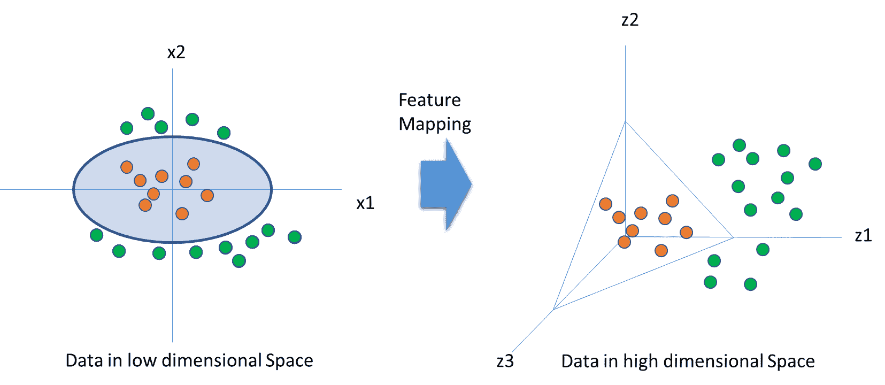

为了将前图中绿色和红色点进行分类，特征映射函数必须将数据从二维转换为三维，即*Φ = R² → R³*。这个方程如下：

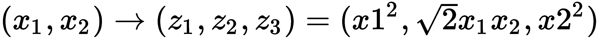

核方法的目标是找出并选择核函数*K*。这样我们就可以在新维度中找到几何特征并对数据模式进行分类。让我们看看这是如何完成的：

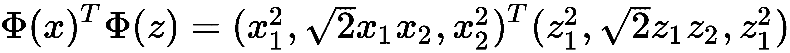

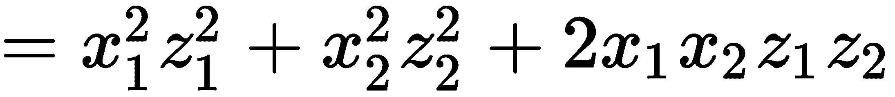

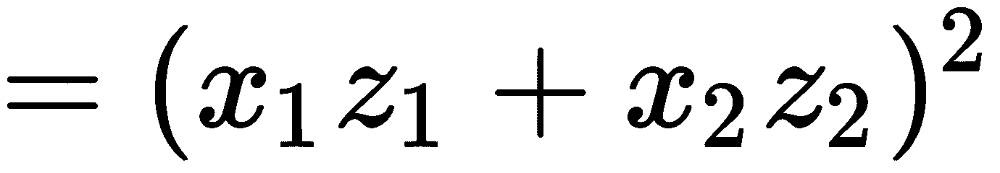

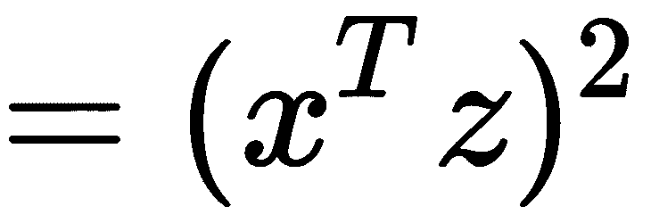

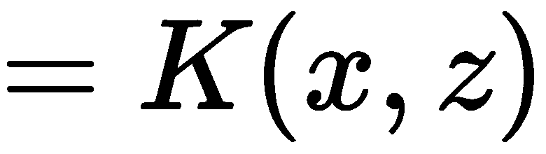

这里，Phi 是一个特征映射函数。但我们是否总是需要知道特征映射函数？实际上并不需要。核函数*K*完成了这项工作。给定核函数*K*，我们可以得到一个特征空间*H*。两种流行的核函数是高斯核函数和多项式核函数。

选择一个合适的核函数将使我们能够很好地了解新特征空间中数据的特征。

现在我们已经熟悉了核技巧，让我们继续学习核 PCA。

# 核 PCA

核 PCA 是一种算法，它不仅保留了 PCA 的主要精神，而且更进一步，利用核技巧使其能够处理非线性数据：

1.  让我们定义特征空间中数据的协方差矩阵，它是映射函数与映射函数转置的乘积：

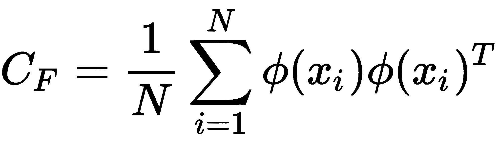

它与我们用于 PCA 的类似。

1.  下一步是解下面的方程，以便我们能够计算主成分：

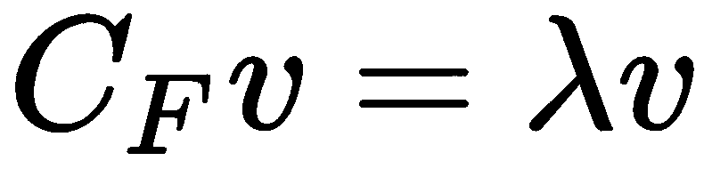

这里，*C[F]*是特征空间中数据的协方差矩阵，*v*是特征向量，*λ*（lambda）是特征值。

1.  让我们将*步骤 1*的值放入*步骤 2*中——即在*步骤 2*的方程中的*C[F]*的值。特征向量将如下所示：

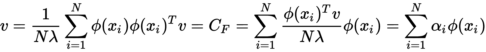

这里，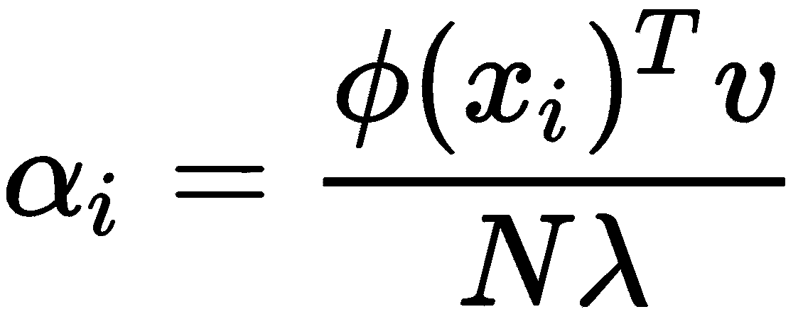是一个标量数。

1.  现在，让我们将核函数添加到方程中。让我们将*Φ(x[k])*乘以公式的两边，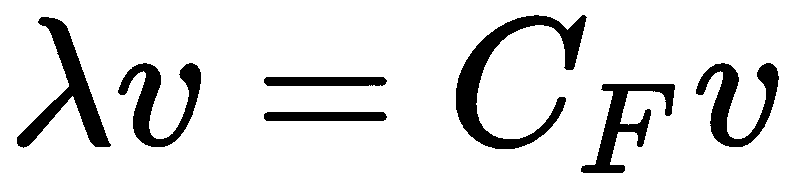：

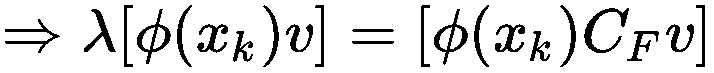

1.  让我们将*步骤 3*中的方程中的*v*值放入*步骤 4*的方程中，如下所示：

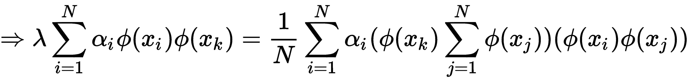

1.  现在，我们调用*K*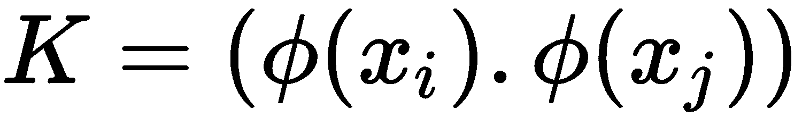。通过输入*K*的值简化*步骤 5*的方程，我们得到以下结果：

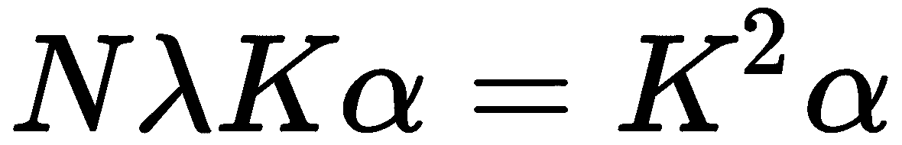

在进行特征值分解后，我们得到以下结果：

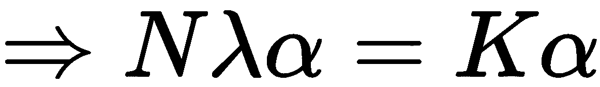

在对特征空间进行归一化以进行中心化后，我们得到以下结果：

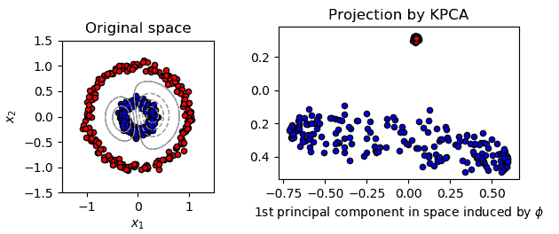

现在，让我们在 Python 中执行核 PCA。我们将保持简单，并使用 Iris 数据集进行操作。我们还将看看我们如何利用模型中的新压缩维度：

1.  让我们加载库：

```py
import numpy as np # linear algebra
import pandas as pd # data processing
import matplotlib.pyplot as plt
from sklearn import datasets
```

1.  然后，加载数据并创建解释变量和目标变量的单独对象：

```py
iris = datasets.load_iris()
X = iris.data 
y = iris.target
```

1.  让我们看看解释数据：

```py
X
```

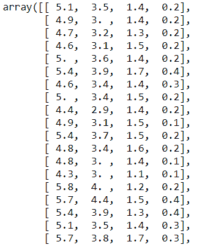

1.  让我们将数据分为训练集和测试集，如下所示：

```py
from sklearn.model_selection import train_test_split
X_train, X_test, y_train, y_test = train_test_split(X, y, test_size = 0.25, random_state = 0)
```

1.  现在，我们可以标准化数据：

```py
from sklearn.preprocessing import StandardScaler
sc = StandardScaler()
X_train = sc.fit_transform(X_train)
X_test = sc.transform(X_test)
```

1.  让我们看看`X_train`：

```py
X_train
```

输出如下：

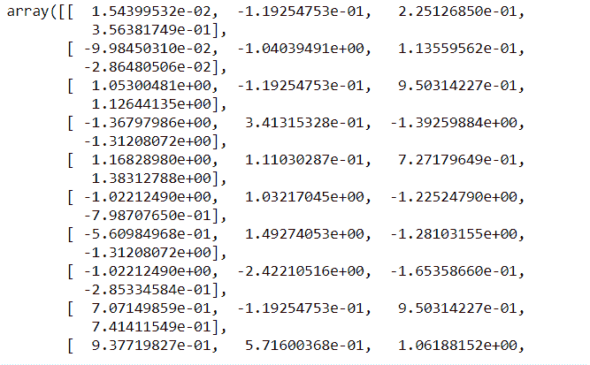

1.  现在，让我们将核 PCA 应用到此。这里，我们试图将数据压缩成仅两个成分。这里选择的核心是径向基函数：

```py
from sklearn.decomposition import KernelPCA
kpca = KernelPCA(n_components = 2, kernel = 'rbf')
X_train2 = kpca.fit_transform(X_train)
X_test2 = kpca.transform(X_test)
```

我们借助核 PCA 获得了新的训练和测试数据。

1.  让我们看看数据看起来像什么：

```py
X_train2
```

我们得到以下输出：

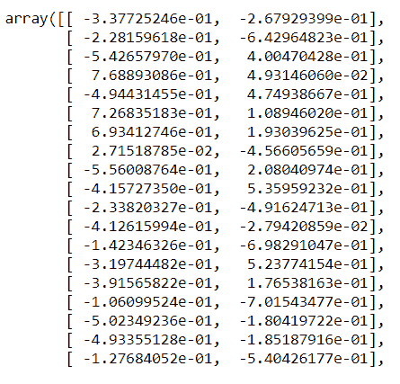

现在，我们这里有两个成分。之前，`X_train` 展示了四个变量。现在，数据已经被缩减成两个字段。

# 独立成分分析

**独立成分分析** (**ICA**) 在降维方面与 PCA 类似。然而，它起源于信号处理领域，在那里他们面临这样一个问题，即多个信号从多个来源传输，并设置了多个设备来捕获它。然而，问题是设备捕获的信号并不清晰，因为它碰巧是多个来源的混合。他们需要为产生 ICA 的不同设备提供清晰和独立的接收。Heralt 和 Jutten 提出了这个概念。

PCA 和 ICA 的区别在于，PCA 侧重于寻找不相关的因子，而 ICA 则是关于推导独立因子。困惑吗？让我来帮你。不相关的因子意味着它们之间没有线性关系，而独立性意味着两个因子之间没有任何影响。例如，数学得高分与你在哪个州生活无关。

该算法的一个基本假设是变量是未知潜在变量和独立变量的线性组合。

数据 *xi * 使用隐藏变量 *si* 进行建模：

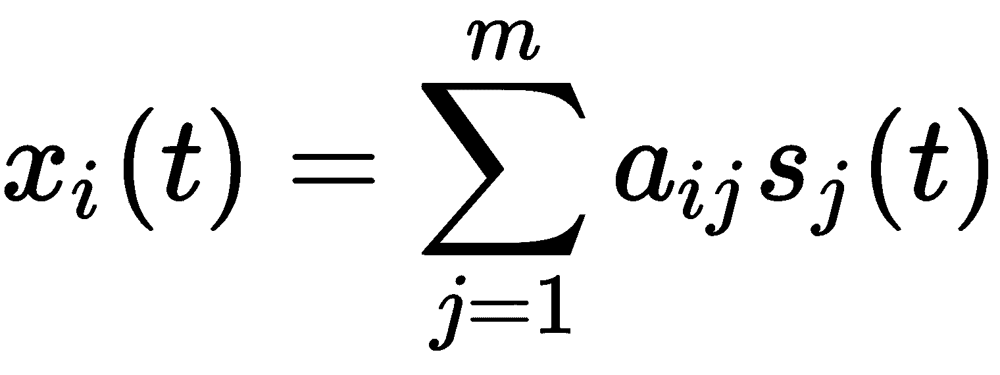

这里， *i= 1,2,3..........n.*

它也可以写成矩阵分解的形式作为 **x=As**：

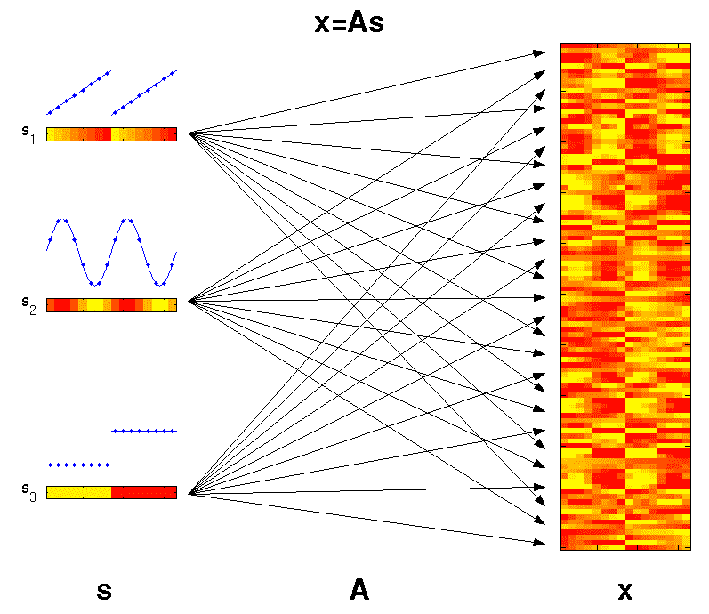

这里，我们有以下内容：

+   **A**：常数混合矩阵

+   **s**：相互独立的潜在因子矩阵

当我们有 **X** 时，我们必须估计 **A** 和 **s** 的值。

换句话说，我们的目标是找到 *W*，它是 *W= A*^(*-1*)，这是一个去混矩阵。

这里， *s[ij] *必须与统计独立且非高斯（不遵循正态分布）。

# ICA 预处理

ICA 的预处理可以按以下方式进行：

+   **中心化**：第一步是使 *x* 中心化。也就是说，我们需要从 *x* 中减去其均值向量，以便使 *x* 成为零均值变量。

+   **白化**：在将数据通过 ICA 之前，我们应当对数据进行白化。这意味着数据必须是相互独立的。从几何上讲，它倾向于恢复数据的初始形状，并且只需要旋转结果矩阵。

# 方法

为了找出哪些去混矩阵是独立的，我们必须依赖于非高斯性。让我们看看我们如何做到这一点。

在这里，我们需要最大化峰度，这将使分布变成非高斯分布。这将导致独立成分。以下图显示了快速 ICA 的图像：

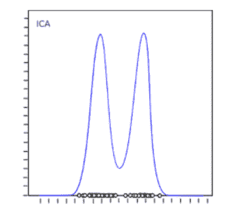

对于这一点，Python 中有 `FastICA` 库。

让我们看看如何在 Python 中执行这个操作。我们将使用相同的数据集 Iris。这可能不是一个执行 ICA 的理想数据集，但这是为了方向性的目的。要在 Python 中执行代码，我们需要执行以下步骤：

1.  首先，我们需要加载库：

```py
import numpy as np # linear algebra
import pandas as pd # data processing
import matplotlib.pyplot as plt
from sklearn import datasets
```

1.  现在，我们需要加载数据：

```py
iris = datasets.load_iris()
X = iris.data 
y = iris.target
```

1.  让我们把数据分成训练集和测试集：

```py
from sklearn.model_selection import train_test_split
X_train, X_test, y_train, y_test = train_test_split(X, y, test_size = 0.25, random_state = 0)
```

1.  让我们把数据转换成标准标量：

```py
from sklearn.preprocessing import StandardScaler
sc = StandardScaler()
X_train = sc.fit_transform(X_train)
X_test = sc.transform(X_test)
```

1.  现在，我们需要加载 ICA 库：

```py
from sklearn.decomposition import FastICA
```

1.  我们将按照以下方式进行 ICA。在这里我们将坚持三个成分：

```py
ICA = FastICA(n_components=3, random_state=10,whiten= True) 
X=ICA.fit_transform(X_train)
```

1.  然后，我们将绘制结果，如下所示：

```py
plt.figure(figsize=(8,10))
plt.title('ICA Components')
plt.scatter(X[:,0], X[:,1])
plt.scatter(X[:,1], X[:,2])
plt.scatter(X[:,2], X[:,0])
```

这个输出如下：

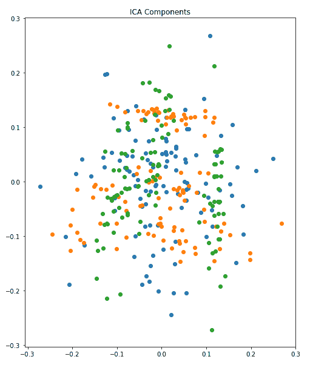

我们可以看到这里有三个不同的成分（通过颜色）。

# 压缩感知

压缩感知是信息理论和信号处理领域中容易解决的问题之一。它是一种信号采集和重建技术，其中信号是可压缩的。信号必须是稀疏的。压缩感知试图将信号的样本拟合到函数中，并且它倾向于使用尽可能少的基本函数来匹配样本。这将在以下图中描述：

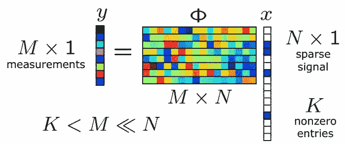

这是我们在线性代数中看到的主要方程之一，其中 **y** 是一个 **M x 1** 矩阵，phi 是一个 **M x N** 矩阵，其列数多于行数，而 **x** 是一个由 **k** 个非零项组成的 **N x 1** 矩阵。未知数非常多，这可以用一个 **N** 长度的向量表示，以及 **M** 个测量值，其中 **M << N**。在这种类型的方程中，我们知道由于这个矩阵的零空间非平凡，所以可能存在许多解。因此，这个方程可以容纳许多解。

# 我们的目标

我们的目标是找到所有解中非零项最少的解。也就是说，解应该给我们尽可能少的非零项。你在想这能应用在哪里吗？有很多应用场景。它可以应用在以下领域：

+   信号表示

+   医学成像

+   稀疏信道估计

假设我们有一个时间信号。这个信号非常稀疏，但我们对其有一些了解，因为它有几个频率。你能从之前的方程中感受到它是什么吗？是的，它可以被认为是 *X*。

让我们称这个**未知**信号为 *X*。现在，尽管我们不知道整个信号，我们仍然可以对其做出观察，或者说是样本，如下面的代码所示：

```py
import numpy as np
import matplotlib as mpl
import matplotlib.pyplot as plt
import scipy.optimize as spopt
import scipy.fftpack as spfft
import scipy.ndimage as spimg
import cvxpy as cvx
```

这将形成一个随机方程：

```py
x = np.sort(np.random.uniform(0, 15, 30))
y = 5 + 0.5 * x + 0.1 * np.random.randn(len(x))
```

现在，我们需要拟合 `l1` 范数。我们得到以下输出：

```py

l1 = lambda x0, x, y: np.sum(np.abs(x0[0] * x + x0[1] - y))
opt1 = spopt.fmin(func=l1, x0=[1, 1], args=(x, y))
```

然后，我们需要拟合 `l2` 范数。我们得到以下输出：

```py

l2 = lambda x0, x, y: np.sum(np.power(x0[0] * x + x0[1] - y, 2))
opt2 = spopt.fmin(func=l2, x0=[1, 1], args=(x, y))

y2 = y.copy()
y2[3] += 5
y2[13] -= 10
xopt12 = spopt.fmin(func=l1, x0=[1, 1], args=(x, y2))
xopt22 = spopt.fmin(func=l2, x0=[1, 1], args=(x, y2))
```

通过将两个正弦波相加，我们得到以下输出：

```py
n = 10000
t = np.linspace(0, 1/5, n)
y = np.sin(1250 * np.pi * t) + np.sin(3000 * np.pi * t)
yt = spfft.dct(y, norm='ortho')
plt.figure(figsize=[10,5])
plt.plot(t,y)
plt.title('Original signal')
plt.xlabel('Time (s)')
plt.ylabel('y')
```

现在，让我们从`n`中取出一个样本：

```py
m = 1000 # 10% sample
ran = np.random.choice(n, m, replace=False) # random sample of indices
t2 = t[ran]
y2 = y[ran]
```

让我们创建`idct`矩阵运算符：

```py
# create idct matrix operator
A = spfft.idct(np.identity(n), norm='ortho', axis=0)
A = A[ran]
# do L1 optimization
vx = cvx.Variable(n)
objective = cvx.Minimize(cvx.norm(vx, 1))
constraints = [A*vx == y2]
prob = cvx.Problem(objective, constraints)
result = prob.solve(verbose=True)
```

此输出的结果如下：

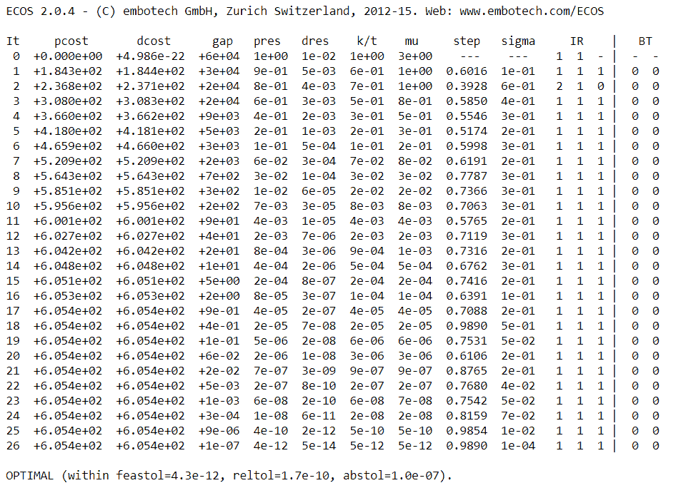

为了重构信号，我们必须执行以下操作：

```py
x = np.array(vx.value)
x = np.squeeze(x)
signal = spfft.idct(x, norm='ortho', axis=0)
```

这就是我们的信号重构方式。

# 自组织映射

**自组织映射**（**SOM**）是由 Teuvo Kohonen 在 20 世纪 80 年代发明的。有时，它们也被称为**Kohonen 映射**。那么，它们为什么存在呢？这类映射的主要动机是通过神经网络来降低维度。以下图显示了输入层的不同 2D 模式：

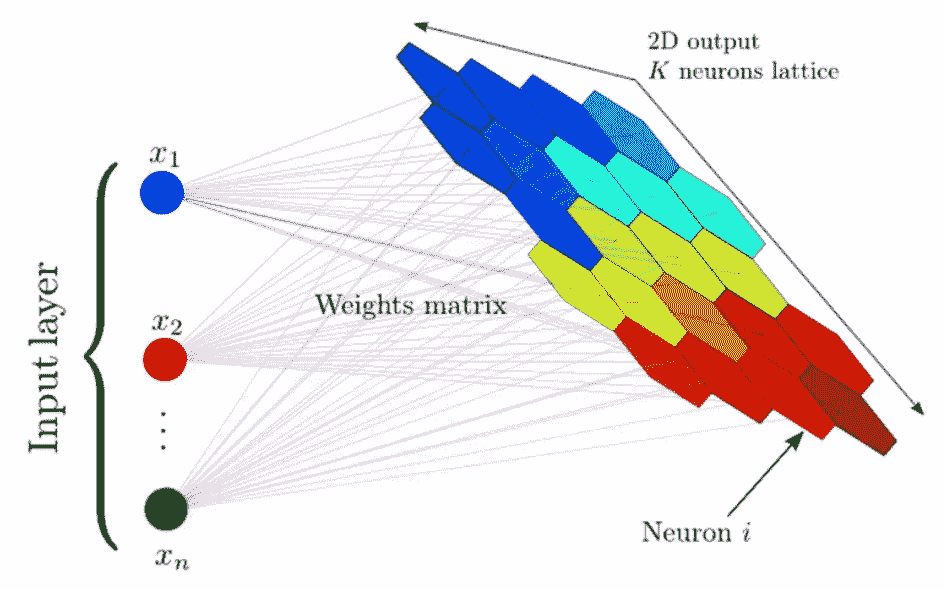

它以列数作为输入。正如我们从 2D 输出中可以看到的，它将数据集中的列数转换并减少到 2D。

以下链接指向 2D 输出：[`www.cs.hmc.edu/~kpang/nn/som.html`](https://www.cs.hmc.edu/~kpang/nn/som.html)

前面图的 2D 表示是根据各种因素来描述一个国家的健康状况。也就是说，它显示了它们是富裕还是贫穷。考虑的其他因素包括教育、生活质量、卫生、通货膨胀和健康。因此，它形成了一个巨大的列集或维度集。比利时和瑞典等国家似乎显示出相似的特性，表明它们在健康指标上得分很高。

由于这是一种无监督学习技术，数据没有被标记。仅基于模式，神经网络能够理解哪个国家应该放在哪里。

与我们刚才讨论的情况类似，自组织映射有很多可以利用的机会。它可以被认为是与 K-means 聚类在本质上相似。

# SOM

让我们来看看 SOM（自组织映射）是如何学习的：

1.  每个节点的权重都通过小的标准化随机值初始化。这些值类似于不同输出节点的坐标。

1.  第一行的输入（从所有变量中取第一行）被输入到第一个节点。

1.  现在，我们有两个向量。如果*V*是当前输入向量，而*W*是节点的权重向量，那么我们计算欧几里得距离，如下所示：

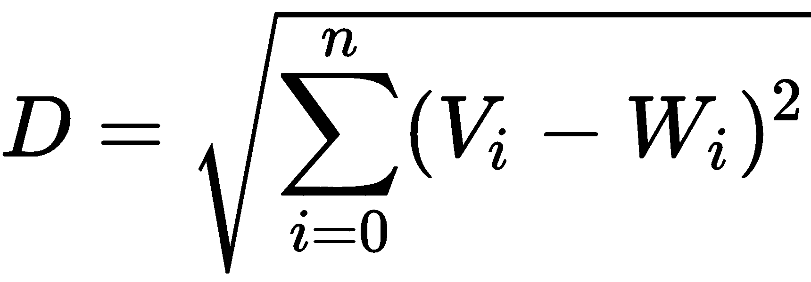

1.  权重向量与输入向量最接近的节点被标记为**最佳匹配单元**（**BMU**）。

1.  对输入和权重向量的所有行都执行类似的操作。为所有找到 BMU。

1.  一旦确定了每个迭代的 BMU（最佳匹配单元），BMU 邻域内的其他节点将被计算。同一半径内的节点将更新其权重。绿色箭头表示半径。随着时间的推移，邻域将逐渐缩小到仅剩一个节点的大小，如下面的图所示：

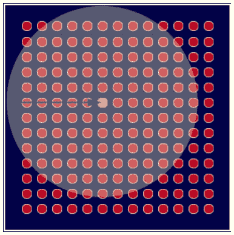

1.  Kohonen 算法最有趣的部分是邻域的半径不断缩小。这是通过指数衰减函数实现的。lambda 的值依赖于 sigma。算法运行所选择的迭代次数由以下方程给出：

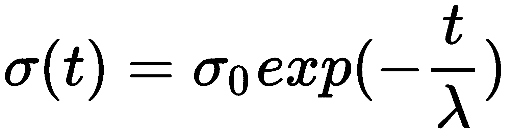


1.  权重通过以下方程更新：

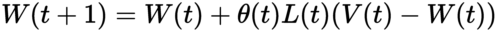

这里，这是如下：

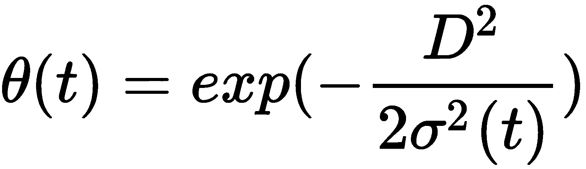

*t= 1, 2...* 可以解释如下：

+   +   *L(t)*：学习率

    +   *D*：节点到 BMU 的距离

    +   *σ*：函数的宽度

现在，让我们在 Python 中演示这个用例。我们将尝试检测信用卡数据集中的欺诈行为：

1.  让我们加载库：

```py
import numpy as np
import matplotlib.pyplot as plt
import pandas as pd
```

1.  现在，是时候加载数据了：

```py
data = pd.read_csv('Credit_Card_Applications.csv')
X = data.iloc[:, :-1].values
y = data.iloc[:, -1].values
```

1.  接下来，我们将标准化数据：

```py
from sklearn.preprocessing import MinMaxScaler
sc = MinMaxScaler(feature_range = (0, 1))
X = sc.fit_transform(X)
```

1.  让我们导入`minisom`库并输入超参数，即学习率、sigma、长度和迭代次数：

```py
from minisom import MiniSom
som = MiniSom(x = 10, y = 10, input_len = 15, sigma = 1.0, learning_rate = 0.5)
som.random_weights_init(X)
som.train_random(data = X, num_iteration = 100)    
```

1.  让我们可视化结果：

```py
from pylab import bone, pcolor, colorbar, plot, show
bone()
pcolor(som.distance_map().T)
colorbar()
markers = ['o', 's']
colors = ['r', 'g']
for i, x in enumerate(X):
 w = som.winner(x)
 plot(w[0] + 0.5,
 w[1] + 0.5,
 markers[y[i]],
 markeredgecolor = colors[y[i]],
 markerfacecolor = 'None',
 markersize = 10,
 markeredgewidth = 2)
show()
```

以下输出将由前面的代码生成：


我们可以看到，有欺诈倾向的节点具有白色背景。这意味着我们可以通过这些节点追踪到那些客户：

```py
mappings = som.win_map(X)
frauds = np.concatenate((mappings[(8,1)], mappings[(6,8)]), axis = 0)
frauds = sc.inverse_transform(frauds)                                         
```

这将给出欺诈的模式。

# 贝叶斯多重插补

贝叶斯多重插补具有贝叶斯框架的精神。需要指定完整数据的参数模型以及未知模型参数*θ*的先验分布。随后，从缺失数据中抽取*m*个独立的试验，如使用贝叶斯定理根据观察数据给出。可以使用马尔可夫链蒙特卡洛模拟缺失数据的整个联合后验分布。BMI 在生成缺失值的插补时遵循正态分布。

假设数据如下：

*Y = (Yobs, Ymiss),*

这里，*Yobs*是观察到的*Y*，而*Ymiss*是缺失的*Y*。

如果*P(Y|θ)*是参数模型，参数*θ*是正态分布的均值和协方差矩阵。如果是这种情况，让*P(θ)*为先验：

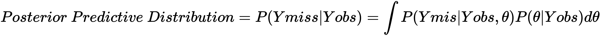

让我们利用 R 中的`Amelia`包并执行以下操作：

```py
library(foreign)
dataset = read.spss("World95.sav", to.data.frame=TRUE)

library(Amelia)

myvars <- names(dataset) %in% c("COUNTRY", "RELIGION", "REGION","CLIMATE") 
newdata <- dataset[!myvars]
```

现在，让我们进行插补：

```py
impute.out <- amelia(newdata, m=4)
```

# 摘要

在本章中，我们研究了核主成分分析（Kernel PCA），以及独立成分分析（ICA）。我们还研究了压缩感知、压缩感知的目标以及自组织映射及其工作原理。最后，我们以贝叶斯多重插补作为结论。
