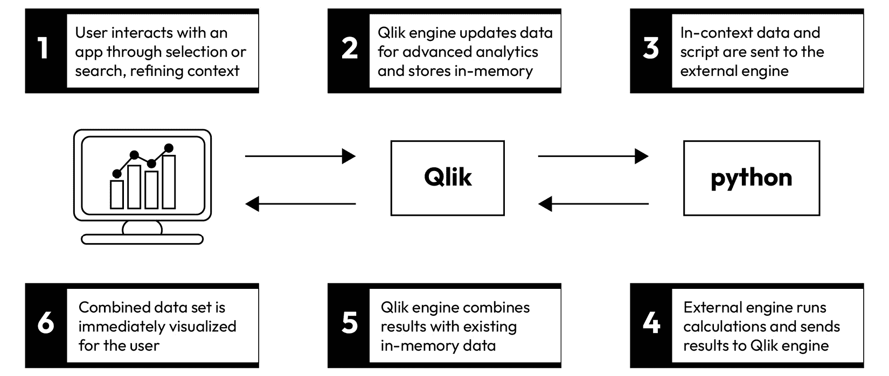
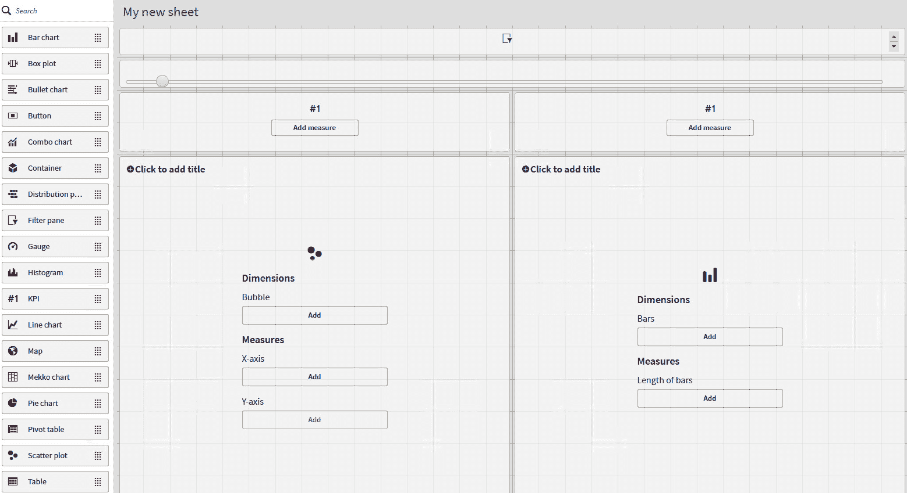
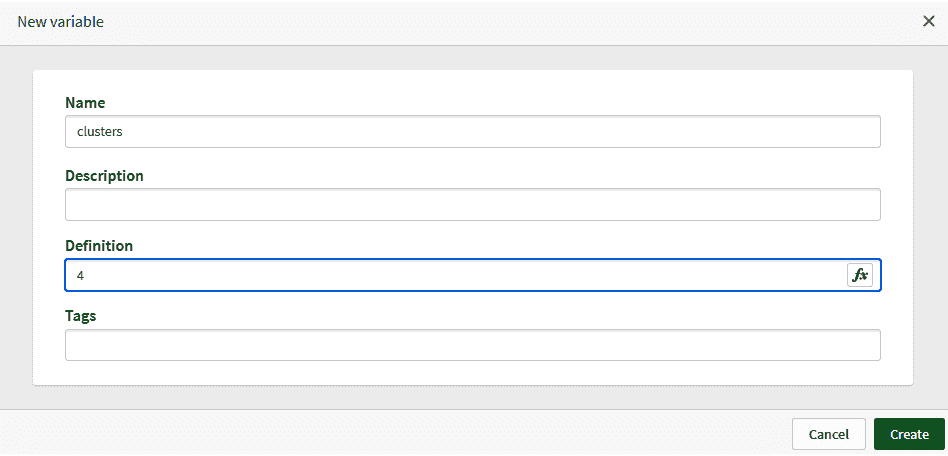
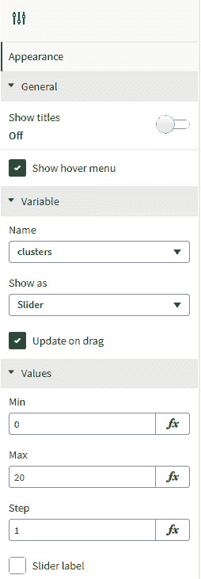
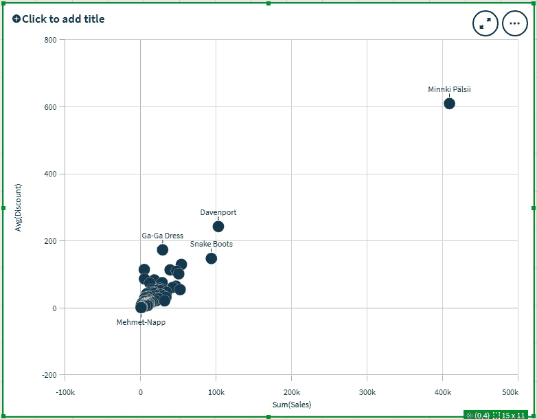
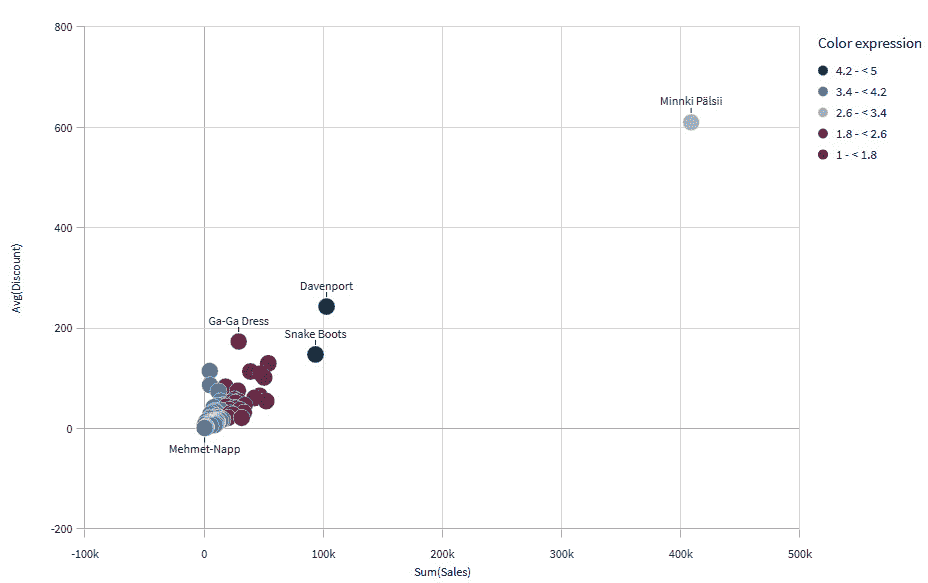
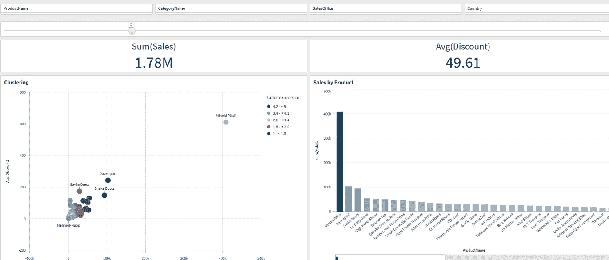
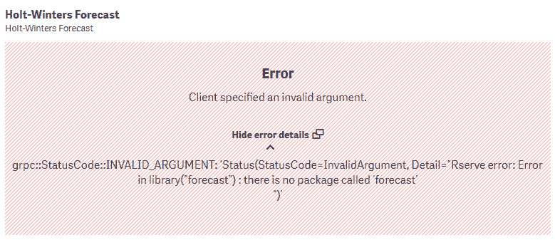

# 第七章：部署和监控机器学习模型

在前面的章节中，我们学习了关于不同模型和技术的很多知识。理解概念和构建机器学习模型只是实现其实际价值的旅程的开始。这些模型的成功部署和持续监控对于确保它们在实际场景中的有效性和可靠性至关重要。

确保模型表现最佳、无缝集成到现有系统中，并适应不断变化的需求，需要对部署过程及其相关考虑因素有全面的了解。在 Qlik 平台的情况下，大多数典型痛点都由平台本身和组件的设计处理，但仍有一些事情我们需要牢记。

一旦部署了机器学习模型，持续监控其性能以识别潜在问题、保持准确性和防范意外故障至关重要。监控可以提供关于模型行为的洞察，帮助检测数据漂移或概念漂移，并促进识别随时间推移的性能下降。通过主动监控和分析关键指标，组织可以做出有关模型维护、重新训练和更新的明智决策，以确保可靠的和最新的预测。

在本章中，我们将熟悉以下主要主题：

+   使用高级分析集成在本地环境中构建模型

+   监控和调试模型

本章重点介绍本地环境。我们将在下一章中看到如何使用 Qlik AutoML 部署和监控模型。

# 使用高级分析连接在本地环境中构建模型

在*第五章*中，我们使用 Qlik 的高级分析连接为 R 和 Python 准备了一个环境。在本章中，我们将利用这个相同的环境。这个练习将特别使用 R。

通常，有两种方式可以利用 Qlik 应用程序的高级分析连接。以下是这两种方式：

+   **实时连接**：实时连接在用户与应用程序交互的同时与第三方机器学习环境进行交互。实时连接允许进行“如果...将会怎样”的场景、模拟和类似用例。它最适合不需要大量训练的轻量级模型。实时连接背后的理念在以下图中解释：



图 7.1：高级分析连接

+   **加载时连接**：加载时连接是在执行 Qlik 加载脚本时进行的一次性预测模型运行。当在加载时使用高级分析连接时，结果将保存到 Qlik 数据模型中的一个表中。然后，可以在创建应用程序时使用这些结果。加载时连接适用于只需要一个预测值的用例。例如，如果我们正在预测产品未来的销售额并希望将预测保存到数据模型中以供以后分析，则使用加载时连接。它也适用于需要大量训练的模型。可以将实时连接与加载时连接结合使用，在数据加载时预测一些值，并交互式地利用情景分析。

注意

准备好的模型可以在加载时或实时模式下保存和重用。这样，如果模型的参数没有变化并且已知之前表现良好，我们可以在部署过程中节省一些时间。例如，要在 R 中保存一个模型，我们可以使用以下命令：

使用 `saveRDS()` 和 `readRDS()` 函数：此方法允许您使用 `saveRDS()` 函数将任何 R 对象（包括机器学习模型）保存到文件中，并使用 `readRDS()` 函数重新加载它。

使用 `save()` 和 `load()` 函数：`save()` 函数允许您将多个 R 对象（包括模型）保存到二进制格式的文件中，可以使用 `load()` 函数加载这些文件。

使用特定包的函数：R 中的某些机器学习包提供了用于保存和加载模型的专用函数。例如，如果你正在使用 `caret` 包，你可以使用 `saveModel()` 和 `loadModel()` 函数。

在下一个动手示例中，我们将利用加载时的高级分析连接并创建一个简单的 K-means 聚类模型。首先，我们应该确保我们的 R 环境正在运行，并且 `Sales Multi Table.xlsx` 在 Qlik 应用程序中已加载，并带有准备好的数据模型。

在以下示例中，我们希望根据产品类别、销售额和平均折扣创建聚类，以检查不同的产品类别与给定的折扣相比会产生怎样的销售额。我们还将创建一个切片器来控制显示的聚类数量。

我们将首先为我们的应用程序创建一个简单的布局。我们将向工作表添加散点图对象、柱状图、筛选面板、变量切片器和两个关键绩效指标（KPI）对象。它应该看起来像以下屏幕截图：



图 7.2：聚类示例布局

要添加用于变量输入的切片器，需要安装仪表板扩展包。创建一个名为 `clusters` 的变量，并将其默认值设置为 `4`。变量及其输入的设置分别在下述屏幕截图中进行展示：



图 7.3：变量设置



图 7.4：变量输入设置

接下来，我们配置我们的散点图并开始创建我们的聚类模型。首先添加 `ProductName` 作为维度，`sum(Sales)` 作为 *x* 轴度量，`avg(Discount)` 作为 *y* 轴度量。这将产生以下图表：



图 7.5：具有维度和度量的散点图

我们希望使用 R 的聚类模型来定义气泡颜色。让我们先选择 **外观** - **颜色和图例**。关闭自动着色并选择 **按表达式** 颜色。

在 **表达式** 字段中输入以下公式：

```py
R.ScriptEval('
q$id <- 1:nrow(q);
F2 <- q[order(q$sales,q$discount),];
F3 <- data.frame(sales=F2$sales ,discount=F2$discount);
rows <- nrow(F2);
if(rows >= $(clusters)){
     set.seed(5);
     clusterdata <- kmeans(F3,$(clusters),nstart = 20);
    df <- data.frame(rowid=F2$id,data=clusterdata$cluster);
     out <- df[order(df$rowid),];
}else{
     out$data <- c(rep(1,rows))
}
out$data',
Sum(Sales) as sales,
avg(Discount) as discount)
```

上述代码以 `R.ScriptEval` 函数开始，它告诉 Qlik 引擎表达式应该使用高级分析连接执行。`R` 是连接名称，`ScriptEval` 是本例中使用的函数。总共，以下表达式类型由 R **服务器端** **扩展** （**SSE**） 支持：

| **函数名称** | **函数类型** | **参数类型** | **返回类型** |
| --- | --- | --- | --- |
| ScriptEval | 标量，张量 | 数值 | 数值 |
| ScriptEvalStr | 标量，张量 | 字符串 | 字符串 |
| ScriptAggr | 聚合 | 数值 | 数值 |
| ScriptAggrStr | 聚合 | 字符串 | 字符串 |
| ScriptEvalEx | 标量，张量 | 数值或字符串 | 数值 |
| ScriptEvalExStr | 标量，张量 | 数值或字符串 | 字符串 |
| ScriptAggrEx | 聚合 | 数值或字符串 | 数值 |
| ScriptAggrExStr | 聚合 | 数值或字符串 | 字符串 |
| ScriptEvalEx | 标量，张量 | 数值或字符串 | 数值 |

表 7.1：R SSE 支持的函数

在初始函数调用之后，我们可以编写实际的 R 代码。在上面的例子中，我们使用 k-means 函数计算每个产品的聚类数。最后两行是从 Qlik 传递到 R 环境的数据。Qlik 引擎创建了一个名为 *q* 的数据框，其中包含发送的数据。在这种情况下，它包含我们的聚合销售额 `q$sales` 和我们的折扣 `q$discount`。我们使用之前创建的变量聚类来描述代码中的聚类数量。以下是对代码的逐步分解：

1.  `q$id <- 1:nrow(q)`: 这一行在 `q` 数据框中创建了一个名为 `id` 的新列，并给它分配从 `1` 到 `0071` 行数的值。这个列用于在排序和聚类过程中保留原始行顺序。

1.  `F2 <- q[order(q$sales, q$discount), ]`: 这里，`q` 数据框根据 `sales` 列按升序排序，然后在每个 `sales` 值内部，根据 `discount` 列排序。排序后的数据存储在 `F2` 数据框中。

1.  `F3 <- data.frame(sales = F2$sales, discount = F2$discount)`: 这行代码创建了一个新的`F3`数据框，其中只包含来自`F2`的`sales`和`discount`列。这实际上是从这两个列中提取数据以进行进一步处理。

1.  `rows <- nrow(F2)`: 这行代码计算`F2`数据框中的行数，并将其分配给`rows`变量。

1.  `if(rows >= clusters) { ... } else { ... }`: 这是一个 if-else 语句，它检查`F2`中的行数是否大于或等于`clusters`变量的值。如果是，则执行聚类；否则，将默认值`1`分配给所有行。

1.  `set.seed(5)`: 这行代码为聚类算法的可重复结果设置了一个种子值。在这种情况下，使用的是`5`这个种子值。

1.  `clusterdata <- kmeans(F3, clusters, nstart = 20)`: 这行代码将 k-means 聚类算法应用于`F3`数据框。`clusters`变量确定要形成的聚类数量，而`nstart = 20`指定算法将以不同的初始聚类分配重新启动的次数。

1.  `df <- data.frame(rowid = F2$id, data = clusterdata$cluster)`: 在这里，创建了一个新的`df`数据框，包含两个列，`rowid`和`data`。`rowid`列包含来自`F2`的原始行标识符，而`data`列包含从`clusterdata`对象获得的聚类分配。

1.  `out <- df[order(df$rowid), ]`: 这行代码根据`rowid`列对`df`数据框的行进行排序，以原始行顺序重新排列。排序后的数据框存储在`out`变量中。

1.  `out$data`: 最后，这行代码从`out`数据框中检索`data`列，它代表聚类分配或每行的默认值`1`。

Qlik 从`out`数据框中获取数据字段，并将值分配给每个产品名称。然后，我们可以使用聚类编号作为我们的散点图中的颜色维度。

要获得可见的结果，我们应该禁用**表达式是颜色代码**设置，并选择**发散类别**作为颜色方案。具有五个聚类（您可以使用切片器将变量值设置为五）的结果应类似于以下截图：



图 7.6：以聚类为颜色的散点图

如您所见，我们有五组具有相似特征的项目，这些特征包括总销售额和平均折扣。如果将鼠标悬停在单个气泡上，可以看到聚类编号。

注意

始终鼓励使用主项。在生产环境中，聚类应作为主项创建。这样，对模型所做的更改将继承到所有图表中。

作为最后一步，我们可以完成我们的布局。将**sum(Sales)**和**avg(Discount)**插入 KPI 对象中，并将一些维度添加到筛选面板中。最后，将按产品名称划分的销售数据添加到柱状图中。您应该得到一个类似于以下截图的视图：



图 7.7：最终布局

我们现在已经成功使用 R 和高级分析集成创建了第一个模型。接下来，我们将更详细地查看调试和监控。我们将在*第十章*中实现一个具有稍微更高级用例的另一个模型。

# 监控和调试模型

在开发过程中调试模型是一个关键的开发步骤。在本地环境中，通过高级分析集成，我们有几种选项来调试我们的模型并了解其性能。

在交互式场景中，开始调试的第一个和最合逻辑的地方是查看图表输出。如果代码有问题，你将在这里得到错误信息。在以下示例中，我们可以看到环境中缺少名为`forecast`的库：



图 7.8：图表中的错误信息

有时，你可能需要从实际的 R 代码中获得更全面的信息或调试打印。由于 R 作为服务运行，在执行过程中没有简单的方法来获取调试打印。然而，你可以使用文件写入。回到我们之前的`Rserve`示例，添加以下代码将在我们的`Rserve`主文件夹中生成一个名为`debug.txt`的文件（添加的代码用**粗体**标出）：

```py
R.ScriptEval('
q$id <- 1:nrow(q);
F2 <- q[order(q$sales,q$discount),];
F3 <- data.frame(sales=F2$sales ,discount=F2$discount);
rows <- nrow(F2);
write(c("----------------"),file="debug.txt",append=TRUE);
summary<-summary(q);
head<-capture.output(head(q))
write(summary,file="debug.txt",append=TRUE);
write(c("----------------"),file="debug.txt",append=TRUE);
write(head,file="debug.txt",append=TRUE);
write(c("----------------"),file="debug.txt",append=TRUE);
if(rows >= $(clusters)){
     set.seed(5);
     clusterdata <- kmeans(F3,$(clusters),nstart = 20);
    df <- data.frame(rowid=F2$id,data=clusterdata$cluster);
     out <- df[order(df$rowid),];
}else{
     out$data <- c(rep(1,rows))
}
out$data',
Sum(Sales) as sales,
avg(Discount) as discount)
```

以下代码将使用`capture.output`函数打印`q`数据框的摘要及其样本：

```py
----------------
Min.   :   348.8
1st Qu.:  6491.4
Median : 10984.5
Mean   : 23157.8
3rd Qu.: 25525.6
Max.   :408674.5
Min.   :  1.224
1st Qu.: 11.709
Median : 28.048
Mean   : 47.583
3rd Qu.: 52.524
Max.   :609.970
Min.   : 1
1st Qu.:20
Median :39
Mean   :39
3rd Qu.:58
Max.   :77
----------------
      sales discount id
1  6833.144 15.36303  1
2  7815.963 11.11661  2
3 13523.793 15.85746  3
4 24966.158 41.04122  4
5  3633.208 11.70914  5
6 15295.435 45.96056  6
----------------
```

注意

如果需要定义文件路径，可以在文件参数中定义。如果没有定义路径，文件将被写入到`Rserve`的主目录。一个示例路径是`C:\Program Files\R\R-4.3.0\library\Rserve\libs\x64`。

如果需要调试桥接组件的操作，服务器端扩展的根目录下的`/logs`文件夹中存储有日志文件。日志文件是按天创建和存储的。如果代码执行有问题，这些日志文件是开始调试的好方法。你还可以使用这些日志文件监控返回的数据和执行时间。以下是在我们的聚类示例执行期间编写的部分样本输入：

```py
2023-05-30 21:12:10.3865 INFO EvaluateScript called from client (ipv6:[::1]:49924), hashid (38116153)
2023-05-30 21:12:10.3865 DEBUG EvaluateScript header info: AppId (bedcb600-18c3-4e6e-a1dc-55562ac21e48), UserId (UserDirectory=QMI-QS-06C0; UserId=qmi), Cardinality (77 rows)
2023-05-30 21:12:10.3865 INFO EvaluateScript call with hashid(38116153) got Param names:  sales discount
2023-05-30 21:12:10.3865 DEBUG Evaluating R script, hashid (38116153):
q$id <- 1:nrow(q);
F2 <- q[order(q$sales,q$discount),];
F3 <- data.frame(sales=F2$sales ,discount=F2$discount);
rows <- nrow(F2);
write(c("----------------"),file="debug.txt",append=TRUE);
summary<-summary(q);
head<-capture.output(head(q))
write(summary,file="debug.txt",append=TRUE);
write(c("----------------"),file="debug.txt",append=TRUE);
write(head,file="debug.txt",append=TRUE);
write(c("----------------"),file="debug.txt",append=TRUE);
if(rows >= 4){
     set.seed(5);
     clusterdata <- kmeans(F3,4,nstart = 20);
    df <- data.frame(rowid=F2$id,data=clusterdata$cluster);
     out <- df[order(df$rowid),];
}else{
     out$data <- c(rep(1,rows))
}
out$data
2023-05-30 21:12:10.4115 INFO Rserve result: 77 rows, hashid (38116153)
2023-05-30 21:12:10.4115 DEBUG Took 23 ms, hashid (38116153)
```

上述日志条目首先为我们提供了来自 Qlik 引擎的传入请求的一些信息。它详细说明了哪个用户正在调用以及从哪个应用程序。它还告诉我们数据的基数。当评估性能时，这些信息很重要。

接下来，我们获取从 Qlik 传递的函数和参数信息。如果启用了`DEBUG-level`，它还会将整个代码打印到日志中。最后，我们获取关于总执行时间和返回行数的信息。这些日志条目是评估模型性能的好起点。更全面的性能指标可以写入模型代码，并使用本节之前描述的方法进行评估。

# 摘要

在本章中，我们更详细地探讨了使用高级分析集成和本地环境中的服务器端 R 扩展来创建和部署模型。在*第五章*中完成了初始环境设置之后。

我们在本章的开始部分通过熟悉利用高级分析集成的两个概念来开启我们的旅程。然后，我们深入研究了即时数据分析用例，并创建了一个与 R 实时集成的 k-means 聚类示例。

我们构建了一个简单的仪表板来支持我们的分析，并深入研究了高级分析集成的语法。在本章的后半部分，我们学习了如何在本地环境中调试和监控我们的模型。

在下一章中，我们将我们的重点转向 Qlik AutoML。我们将学习与 AutoML 一起使用的实现模型，以及如何在 Qlik Cloud 和本地环境中利用这个工具。我们还将学习如何使用 AutoML 部署和监控模型。
