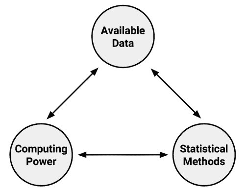
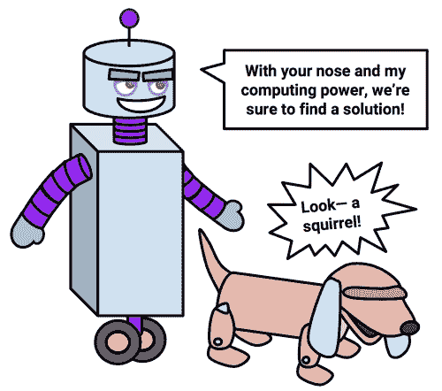
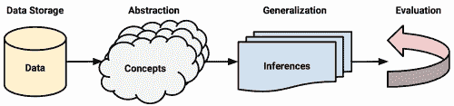
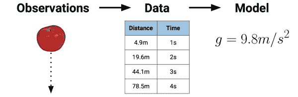
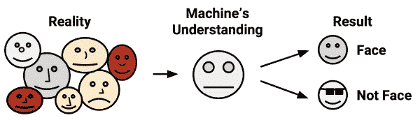
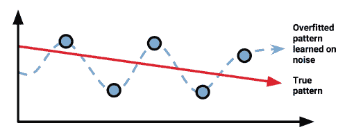
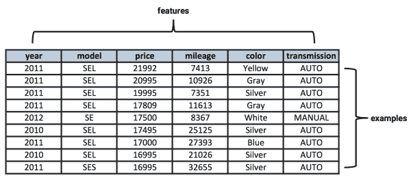

# 第一章：介绍机器学习

如果相信科幻小说的描写，人工智能的发明必然会引发机器与制造者之间的末日战争。在早期，计算机被教导玩简单的井字棋和国际象棋游戏。后来，机器被赋予控制交通灯和通讯的权限，接着是军事无人机和导弹。机器的进化在计算机变得具有感知能力并学会自我教学后走向了一个不祥的转折。它们不再需要人类程序员，因此人类便被“删除”了。

值得庆幸的是，直到目前为止，机器仍然需要用户输入。

虽然你对机器学习的印象可能受到这些大众传媒描绘的影响，但今天的算法过于特定于应用，无法威胁到它们自我意识的产生。当前机器学习的目标不是创造一个人工大脑，而是帮助我们理解世界庞大的数据存储。

摆脱流行误解后，阅读完本章，你将对机器学习有更细致的理解。同时，你也将了解定义并区分最常用机器学习方法的基本概念。

你将学到：

+   机器学习的起源与实际应用

+   计算机如何将数据转化为知识与行动

+   如何将机器学习算法与数据匹配

机器学习领域提供了一套算法，将数据转化为可操作的知识。继续阅读，看看使用 R 语言将机器学习应用于现实问题有多么简单。

# 机器学习的起源

自出生以来，我们便被数据淹没。我们身体的感官——眼睛、耳朵、鼻子、舌头和神经——不断受到原始数据的冲击，这些数据被我们的脑袋转化为视觉、声音、气味、味道和触觉。通过语言，我们能够与他人分享这些体验。

自从书面语言的出现，人类的观察就被记录了下来。猎人监控动物群体的移动，早期的天文学家记录行星和星星的排列，城市则记录税款、出生和死亡情况。今天，这些观察以及更多的内容正越来越多地被自动化，并系统地记录在不断增长的计算机化数据库中。

电子传感器的发明进一步促进了记录数据的量和丰富性的爆炸性增长。专业传感器能够看、听、嗅、尝和触感。这些传感器处理数据的方式与人类截然不同。与人类有限且主观的注意力不同，电子传感器从不休息，且永远不会让判断偏离其感知。

### 提示

尽管传感器不受主观性影响，但它们不一定能报告现实的单一、确定的描绘。由于硬件限制，某些传感器具有固有的测量误差。其他传感器则受到其范围的限制。一张黑白照片与一张彩色照片提供的对象描绘不同。同样，显微镜提供的现实描绘与望远镜提供的截然不同。

在数据库和传感器之间，我们生活的许多方面都被记录下来。政府、企业和个人正在记录和报告各种信息，从重大的到琐碎的。天气传感器记录温度和压力数据，监控摄像头观察人行道和地铁隧道，各种电子行为都在被监控：交易、通讯、友谊等。

这股数据洪流让一些人声称我们已经进入了**大数据**时代，但这可能有点不准确。人类一直以来都被大量的数据包围。当前时代的独特之处在于，我们拥有大量的*已记录*数据，而且这些数据中的许多可以被计算机直接访问。更大、更有趣的数据集越来越容易获取，只需通过网络搜索即可。这个信息的财富，若能通过系统化的方法加以理解，便具有潜力引导行动。

研究计算机算法以将数据转化为智能行动的学科被称为**机器学习**。这个领域起源于一个数据、统计方法和计算能力迅速同时发展的环境。数据的增长促使了额外计算能力的需求，进而推动了**统计方法**的发展，以分析大数据集。这创造了一个进步的循环，使得更大、更有趣的数据得以收集。



与机器学习密切相关的**数据挖掘**关注的是从大型数据库中生成新颖的见解。顾名思义，数据挖掘涉及的是对可操作性智能的系统化挖掘。尽管人们对机器学习和数据挖掘的重叠程度有不同看法，但一个可能的区别点是，机器学习侧重于教计算机如何利用数据来解决问题，而数据挖掘则侧重于教计算机识别模式，这些模式随后由人类用来解决问题。

几乎所有的数据挖掘都涉及机器学习的使用，但并非所有机器学习都涉及数据挖掘。例如，你可能会应用机器学习对汽车交通数据进行挖掘，以寻找与事故率相关的模式；另一方面，如果计算机正在学习如何自己驾驶汽车，那么这纯粹是机器学习，而不涉及数据挖掘。

### 提示

“数据挖掘”这个词有时也被用作贬义词，描述一种用挑选数据来支持理论的欺骗性做法。

# 机器学习的使用与滥用

大多数人都听说过下棋的计算机**深蓝**——它是第一个战胜世界冠军的计算机——或者**沃森**，这个计算机在电视问答节目《危险边缘》中战胜了两位人类对手。基于这些惊人的成就，一些人猜测计算机智能将取代许多信息技术职业中的人类，就像机器取代了人类在田间工作，机器人取代了人类在生产线上的工作一样。

事实是，即便机器取得了如此令人印象深刻的成就，它们在全面理解问题的能力上仍然相对有限。它们只是纯粹的智力马力，没有方向。计算机在发现大数据中的微妙模式方面可能比人类更有能力，但它仍然需要人类来推动分析并将结果转化为有意义的行动。

机器并不擅长提问，甚至不知道该问什么问题。它们更擅长回答问题，前提是问题以计算机能够理解的方式表达出来。现今的机器学习算法与人类合作，就像血犬与它的训练师一样；虽然狗的嗅觉可能远比主人灵敏，但如果没有正确的指引，它可能最终会追着自己的尾巴转圈。



为了更好地理解机器学习的现实世界应用，我们现在来看看一些机器学习成功应用的案例，也有一些地方它仍然有提升空间，还有一些情况下它可能弊大于利。

## 机器学习的成功案例

机器学习最成功的地方是它能增强而非取代专业领域专家的专业知识。它与医疗医生共同努力，处于消除癌症斗争的最前线，协助工程师和程序员创造更智能的家居和汽车，并帮助社会科学家了解社会如何运作。为实现这些目标，机器学习被广泛应用于无数的企业、科研实验室、医院和政府机构。任何产生或聚合数据的组织，都可能会使用至少一个机器学习算法来帮助理解数据。

尽管不可能列举机器学习的每一个应用案例，但最近的成功案例调查包括了几个突出的应用：

+   识别电子邮件中的垃圾邮件

+   按客户行为细分进行精准广告投放

+   预测天气行为和长期气候变化

+   减少信用卡欺诈交易

+   风暴和自然灾害的财务损失精算估算

+   预测流行的选举结果

+   自动驾驶无人机和自动驾驶汽车算法的开发

+   住宅和办公楼中能源使用的优化

+   犯罪活动最可能发生的区域预测

+   与疾病相关的基因序列的发现

在本书结束时，你将理解用于教计算机执行这些任务的基本机器学习算法。现在，只需要知道，不论在什么上下文中，机器学习的过程都是相同的。无论任务是什么，算法都会获取数据并识别其中的模式，这些模式形成了进一步行动的基础。

## 机器学习的局限性

尽管机器学习被广泛使用，并具有巨大的潜力，但理解其局限性同样重要。目前，机器学习绝不是人脑的替代品。它在超出学习范围的推断方面缺乏灵活性，也没有常识。鉴于此，在将算法投入实际应用之前，人们应该非常小心，确保准确理解算法已经学到的内容。

由于计算机缺乏过去的经验积累，它们在做出关于逻辑下一步的简单常识推断时也会受到限制。例如，许多网站上看到的横幅广告，可能是基于通过数据挖掘数百万用户浏览历史得出的模式。根据这些数据，查看卖鞋网站的人应该看到鞋子的广告，而查看床垫网站的人应该看到床垫的广告。问题在于，这种方式形成了一个永无止境的循环，展示的是更多的鞋子或床垫广告，而不是鞋带和鞋油广告，或者床单和毯子的广告。

许多人都熟悉机器学习在理解或翻译语言、识别语音和手写文字方面的不足。或许最早的一个例子是 1994 年《辛普森一家》中的一集，该集讽刺了苹果的 Newton 平板电脑。对于当时的技术水平，Newton 以其先进的手写识别技术而闻名。不幸的是，对于苹果来说，它有时会出错，造成很大的影响。该集通过一段情节展示了这一点，其中一位恶霸写给**马丁的殴打信**被 Newton 误解为**吃掉玛莎**，如下图所示：


《冰上的丽莎》截图，《辛普森一家》，20 世纪福克斯（1994）

自 1994 年以来，机器理解语言的能力已经足够强大，以至于 Google、Apple 和 Microsoft 都足够自信地提供通过语音识别操作的虚拟礼宾服务。尽管如此，即使这些服务仍然常常难以回答相对简单的问题。更何况，在线翻译服务有时会误解那些连幼儿都能理解的句子。许多设备上的预测文本功能也导致了一些幽默的*自动纠正失败*网站，这些网站展示了计算机能够理解基本语言，但完全误解上下文的能力。

这些错误有些是可以预见的，毕竟，语言复杂，包含多层文本和潜在意思，有时人类也会误解上下文。话虽如此，这些机器中的失败实例恰恰说明了机器学习仅仅取决于其学习的数据的质量。如果上下文没有直接隐含在输入数据中，那么就像人类一样，计算机将不得不做出最好的猜测。

## 机器学习伦理

从本质上讲，机器学习只是一个帮助我们理解世界复杂数据的工具。像任何工具一样，它可以用于善事或恶事。当机器学习被广泛或粗暴地应用到人类，甚至将人类视为实验鼠、自动化机器或盲目消费者时，可能会带来问题。一个看似无害的过程，经过无情计算机的自动化处理后，可能会导致意想不到的后果。因此，使用机器学习或数据挖掘的人，不能忽视考虑这一艺术的伦理影响。

由于机器学习作为一个学科相对年轻，并且发展速度极快，因此与之相关的法律问题和社会规范常常不确定，并且处于不断变化之中。在获取或分析数据时应保持谨慎，以避免违反法律、服务条款或数据使用协议，避免滥用顾客或公众的信任或侵犯其隐私。

### 提示

Google 的非正式公司口号是“别做坏事”，作为一家或许比任何其他公司都更收集个人数据的组织，这看似已经足够明确，但可能还不够充分。一个更好的方法可能是遵循*希波克拉底誓言*，这一医学原则指出“首先，不做伤害”。

零售商常常使用机器学习进行广告投放、定向促销、库存管理或店内商品布局。许多零售商甚至已经在结账通道上配备了能够根据顾客购买历史打印优惠券的设备。顾客只需提供一些个人数据，就能在其希望购买的特定商品上获得折扣。起初，这看起来无害。然而，考虑到当这种做法进一步发展时可能发生的情况。

有一个可能是传说的故事，讲述了一家美国的大型零售商使用机器学习来识别准妈妈进行优惠券邮寄。零售商希望通过向这些准妈妈提供丰厚的折扣，能够吸引她们成为忠实客户，进而购买如尿布、婴儿奶粉和玩具等有利可图的商品。

这家零售商利用机器学习方法，识别了客户购买历史中的物品，这些物品能够高概率地预测出一个女性是否怀孕，并且预测宝宝的预计出生时间。

在零售商使用这些数据进行促销邮寄后，一位愤怒的男子联系了这家零售商，要求了解为什么他的十几岁女儿收到了孕妇用品的优惠券。他非常愤怒，认为零售商似乎在鼓励未成年怀孕！故事是这样的，当零售商的经理打电话道歉时，最终是父亲向零售商道歉，因为在与女儿对话后，他发现她确实怀孕了！

无论前述故事是否完全真实，从中学到的教训是，在盲目应用机器学习分析结果之前，应当应用常识。在涉及健康数据等敏感信息的情况下，这一点尤为重要。稍加小心，零售商本可以预见到这种情况，并在选择如何展示其机器学习分析发现的模式时更加谨慎。

某些司法管辖区可能会因商业原因阻止你使用种族、民族、宗教或其他受保护类别的数据。请记住，仅仅从分析中排除这些数据可能还不够，因为机器学习算法可能会无意中独立地学习到这些信息。例如，如果某一特定人群通常生活在某个地区，购买某种产品，或者以某种方式表现出独特的群体特征，一些机器学习算法可能会从这些其他因素中推断出受保护的信息。在这种情况下，你可能需要完全“去标识化”这些人，除了排除受保护信息之外，还需要排除任何*可能*的识别性数据。

除了法律后果外，不当使用数据可能还会伤害公司的底线。如果客户觉得自己的隐私被侵犯，或者他们认为私密的生活细节被公开，他们可能会感到不舒服或受到惊吓。近年来，几款高知名度的网页应用程序在服务条款变动后，遭遇了大量用户的流失，许多人认为自己被利用了，因为这些应用程序将数据用于了用户原本未同意的目的。由于隐私期望因上下文、年龄层和地域而异，因此在决定如何恰当使用个人数据时，事情变得更加复杂。在开始项目之前，明智的做法是考虑到工作可能带来的文化影响。

### 提示

你*可以*使用数据来达到某个特定目的，并不意味着你*应该*这么做。

# 机器如何学习

计算机科学家汤姆·M·米切尔提出的机器学习正式定义指出，机器每当能够利用其经验，从而在未来类似的经历中提升表现时，就说明机器在学习。虽然这个定义直观易懂，但它完全忽略了经验如何转化为未来行动的过程——当然，学习总是说起来容易做起来难！

虽然人类大脑从出生起就具备自然的学习能力，但计算机学习所需的条件必须明确提出。因此，尽管了解学习的理论基础并非绝对必要，但这一基础有助于理解、区分和实现机器学习算法。

### 提示

当你将机器学习与人类学习进行对比时，你可能会以不同的角度审视自己的思维。

无论学习者是人类还是机器，基本的学习过程是相似的。它可以分为四个相互关联的组成部分：

+   **数据存储**利用观察、记忆和回忆，为进一步推理提供事实基础。

+   **抽象**涉及将存储的数据转化为更广泛的表示和概念。

+   **泛化**利用抽象数据创造知识和推理，从而驱动在新环境中的行动。

+   **评估**提供了一种反馈机制，用于衡量所学知识的效用并提供潜在的改进建议。

下图展示了学习过程的步骤：



请记住，尽管学习过程已被概念化为四个独立的组成部分，但它们仅仅是为了说明方便而如此组织。实际上，整个学习过程是密不可分的。在人类中，这一过程是潜意识的。我们在思维的框架内回忆、推理、归纳和直觉地进行操作，而由于这一过程是隐性的，任何人与人之间的差异都归因于一种模糊的主观性概念。相比之下，计算机的这些过程是显式的，并且由于整个过程是透明的，所学到的知识可以被检查、转移并用于未来的行动。

## 数据存储

所有学习必须以数据为基础。人类和计算机都利用**数据存储**作为更高级推理的基础。在人类中，这包括大脑利用电化学信号通过生物细胞网络来存储和处理观察到的信息，以便进行短期和长期的回忆。计算机也有类似的短期和长期回忆能力，通过硬盘驱动器、闪存和随机存取内存（RAM）与中央处理单元（CPU）结合使用。

说出来可能很显然，但仅仅有存储和检索数据的能力是不足以进行学习的。没有更高层次的理解，知识仅限于回忆，即仅仅是之前见过的东西，别无其他。数据只是磁盘上的零和一。它们是没有更广泛意义的存储记忆。

为了更好地理解这个概念的细微差别，可能有助于回想一下你上次为一场艰难的考试做准备的情景，也许是大学的期末考试或职业资格认证考试。你是否曾渴望拥有一个记忆力极好的（照相式）记忆？如果是这样，你可能会失望地发现，完美的回忆并不一定会有太大帮助。即便你能完美地记住材料，你的死记硬背也没什么用，除非你事先知道考试中会出现的确切问题和答案。否则，你将陷入试图记住每一个可能被问到的问题的困境。显然，这是一个不可持续的策略。

相反，更好的方法是有选择地花时间，记住一小部分具有代表性的想法，同时发展如何将这些想法联系起来以及如何使用存储信息的策略。通过这种方式，可以在不需要死记硬背的情况下理解更大的思想。

## 抽象

这一赋予存储数据意义的工作发生在**抽象**过程中，在此过程中，原始数据变得具有更抽象的意义。这种连接，例如对象与其表示之间的关系，可以通过著名的雷内·马格里特画作《影像的背叛》来体现：


来源：http://collections.lacma.org/node/239578

画作描绘了一只烟斗，旁边的说明文字写着*Ceci n'est pas une pipe*（“这不是一只烟斗”）。马格里特想表达的观点是，烟斗的表现形式并不等同于真正的烟斗。然而，尽管这只烟斗不是真的，任何观看这幅画的人都很容易将它认作一只烟斗。这表明，观察者的思维能够将烟斗的*图像*与烟斗的*概念*、与可以拿在手中的*实物*烟斗联系起来。像这样的抽象连接是**知识表示**的基础，形成逻辑结构，帮助将原始的感官信息转化为有意义的洞察。

在机器进行知识表示的过程中，计算机通过**模型**总结存储的原始数据，模型是数据中模式的明确描述。就像马格里特的烟斗一样，模型表示超越了原始数据的生命。它代表了一个比组成部分之和更大的概念。

有许多不同类型的模型。你可能已经熟悉其中一些。举例来说：

+   数学方程

+   关系图表，如树形图和图形

+   逻辑的 if/else 规则

+   数据的分组，称为簇

模型选择通常不是由机器决定的。相反，学习任务和手头的数据决定了模型的选择。本章稍后将更详细地讨论选择模型类型的方法。

将模型拟合到数据集的过程称为**训练**。当模型被训练后，数据被转换成一个抽象形式，总结了原始信息。

### 提示

您可能会想知道为什么这一步骤称为训练而不是学习。首先，请注意，学习过程并不随着数据抽象而结束；学习者仍需进行概括和评估其训练。其次，词语“训练”更能准确地表达人类教师训练机器学生以特定方式理解数据的事实。

需要注意的是，学得的模型本身并不提供新数据，但确实产生了新的知识。这是如何做到的呢？答案是通过对潜在数据施加假设的结构来揭示看不见的东西，假设数据元素如何相关的概念。比如，重力的发现。通过将观测数据拟合到方程中，艾萨克·牛顿推断出了重力的概念。但我们现在所知道的重力力量一直存在。只是直到牛顿将其认识为一个解释物体自由落体观测的模型中的*g*项的抽象概念，它才被认可。



大多数模型可能不会导致颠覆科学思想几个世纪的理论发展。但是，您的模型可能会发现数据之间以前未曾见过的关系。一个以基因组数据为基础的模型可能会发现几种基因，这些基因结合起来导致糖尿病的发作；银行可能会发现一种看似无害的交易类型在欺诈活动发生之前系统性出现；心理学家可能会识别一种新疾病的特定人格特征组合。这些潜在模式一直存在，但仅仅通过以不同格式呈现信息，就可以概念化一个新的想法。

## 概括

学习过程直到学习者能够利用其抽象化的知识进行未来行动才算完成。然而，在抽象化过程中可能识别出无数潜在模式和建模这些模式的多种方式中，有些模式比其他模式更有用。除非抽象化的产生受到限制，否则学习者将无法继续前进。它将停留在起点——具有大量信息但缺乏可操作的洞察力。

**泛化**一词描述了将抽象的知识转化为可以用于未来行动的形式的过程，适用于与之前见过的任务相似但不完全相同的任务。泛化是一个有些模糊的过程，难以用语言准确描述。传统上，它被视为在训练过程中抽象出的所有可能模型（即理论或推论）中进行搜索。换句话说，如果你能想象一个包含所有可能由数据建立的理论的假设集合，泛化就是将这个集合缩减为一个可以管理的重要发现的数量。

在泛化过程中，学习者的任务是将其发现的模式限制为那些对未来任务最相关的模式。通常，通过逐一检查这些模式并按未来效用进行排名来减少模式数量并不可行。相反，机器学习算法通常采用捷径，更快速地缩小搜索空间。为了实现这一点，算法将使用**启发式方法**，这是一种关于在哪找到最有用推论的有根据的猜测。

### 提示

由于启发式方法利用近似值和其他经验法则，它们不能保证找到唯一最优的模型。然而，如果不采取这些捷径，在一个大型数据集中找到有用的信息将是不可行的。

启发式方法通常被人类用来迅速将经验推广到新场景。如果你曾在完全评估情况之前，仅凭直觉做出迅速决策，那么你直观地使用了心理启发式方法。

人类做出快速决策的惊人能力，往往不是依赖于计算机般的逻辑，而是依赖于由情绪指导的启发式方法。有时，这会导致不合逻辑的结论。例如，尽管汽车在统计上更危险，更多的人对乘坐飞机感到恐惧而非乘坐汽车。这可以通过可得性启发式来解释，指人们通过事件的例子多容易被回忆来估计事件发生的可能性。航空旅行的事故被广泛报道，作为创伤性事件，它们很容易被回忆起来，而汽车事故几乎不在报纸上提及。

错误使用启发式方法的愚蠢不仅限于人类。机器学习算法使用的启发式方法有时也会导致错误的结论。如果结论系统性地错误，或者以可预测的方式错误，则说该算法存在**偏见**。

例如，假设一个机器学习算法通过寻找代表眼睛的两个黑色圆圈，位于一条表示嘴巴的直线之上，学习识别面部特征。那么该算法可能会遇到困难，或者*存在偏见*，无法识别那些不符合其模型的面孔。带眼镜的面孔、角度倾斜的面孔、侧脸或者具有不同肤色的面孔可能无法被算法检测到。同样，它也可能*偏向*那些具有特定肤色、面部特征或其他与其理解世界不符的特征的面孔。



在现代用法中，“偏见”一词常带有负面含义。各种形式的媒体频繁声称自己没有偏见，并宣称客观报道事实，不受情感污染。然而，试想一下，适度的偏见可能是有益的。如果没有一点武断的决策，是否在多种竞争选择中作出决定会显得困难，尤其是当每个选择都有其独特的优缺点时？实际上，一些心理学领域的最新研究表明，天生有大脑某些负责情感的部分受损的个体，在决策时往往无效，可能花费数小时辩论简单的决策，比如穿什么颜色的衬衫或者去哪儿吃午餐。矛盾的是，偏见正是让我们忽视某些信息的同时，又能利用其他信息作出行动决策的原因。这正是机器学习算法在理解一组数据的无数方式中做出选择的方式。

## 评估

偏见是与任何学习任务中固有的抽象化和概括化过程相关的必要之恶。为了在无限可能性面前推动行动，每个学习者必须以某种特定方式产生偏见。因此，每个学习者都有其弱点，没有一种学习算法能够统治所有任务。因此，概括过程中的最后一步是**评估**或衡量学习者在偏见的影响下的成功，并利用这些信息在必要时进行额外的训练。

### 提示

一旦你在某一机器学习技术上获得成功，你可能会倾向于将其应用于所有问题。但重要的是要抵制这种诱惑，因为没有任何一种机器学习方法适用于所有的情况。这个事实由 David Wolpert 在 1996 年提出的*无免费午餐定理*描述。欲了解更多信息，请访问：[`www.no-free-lunch.org`](http://www.no-free-lunch.org)。

通常，评估发生在模型在初始训练数据集上训练完成之后。然后，模型会在新的测试数据集上进行评估，以判断其对训练数据的刻画能否推广到新的、未见过的数据。值得注意的是，模型能够完美推广到每一个未预见的情况是极为罕见的。

部分模型未能完美地泛化，这是由于**噪声**问题，即数据中无法解释或无法说明的变化。噪声数据是由看似随机的事件引起的，比如：

+   由于传感器不精确，测量误差有时会导致读数增加或减少一些。

+   人类受试者的问题，例如调查问卷回答者为了更快完成而随意填写答案

+   数据质量问题，包括缺失、空值、截断、编码错误或损坏的值

+   现象过于复杂或理解不足，以至于它们以无法预测的方式影响数据。

尝试建模噪声是导致**过拟合**问题的根源。由于大多数噪声数据定义上是无法解释的，试图解释这些噪声会导致错误的结论，这些结论无法很好地泛化到新的案例中。试图解释噪声通常还会导致更复杂的模型，错失学习者试图识别的真实模式。一个在训练过程中表现良好，但在评估过程中表现不佳的模型，被称为对训练数据集**过拟合**，因为它无法很好地泛化到测试数据集。



解决过拟合问题的方案通常依赖于特定的机器学习方法。目前，重要的是要意识到这一问题。模型能够处理噪声数据的能力，是它们之间重要的区别来源。

# 机器学习在实践中的应用

到目前为止，我们专注于机器学习理论的运作方式。为了将学习过程应用于现实任务，我们将采用五步法。无论任务是什么，通过以下步骤都可以部署任何机器学习算法：

1.  **数据收集**：数据收集步骤包括收集算法用于生成可操作知识的学习材料。在大多数情况下，这些数据需要合并成一个单一来源，如文本文件、电子表格或数据库。

1.  **数据探索与准备**：任何机器学习项目的质量在很大程度上取决于其输入数据的质量。因此，在数据探索这一实践过程中，了解数据及其细节非常重要。在为学习过程准备数据时，还需要进行额外的工作。这包括修复或清理所谓的“脏数据”，去除不必要的数据，以及重新编码数据以符合学习者的预期输入。

1.  **模型训练**：当数据准备好进行分析时，你可能已经有了对数据中可以学习内容的初步认识。所选的具体机器学习任务将决定合适算法的选择，而算法将以模型的形式呈现数据。

1.  **模型评估**：由于每个机器学习模型都会对学习问题产生偏向性的解决方案，因此评估算法从经验中学习的效果非常重要。根据使用的模型类型，你可能能够通过测试数据集来评估模型的准确性，或者可能需要开发特定于预期应用的性能评估标准。

1.  **模型改进**：如果需要更好的性能，就必须使用更高级的策略来增强模型的表现。有时，可能需要完全切换到另一种类型的模型。你可能需要通过额外的数据或进行额外的准备工作来补充数据，如该过程的第二步所示。

完成这些步骤后，如果模型的表现良好，可以将其部署到预定的任务中。根据具体情况，你可能会利用模型提供预测的得分数据（可能是实时的），财务数据的预测，生成营销或研究的有用见解，或自动化任务，如邮件投递或飞行器操作。部署模型的成功与失败甚至可能为训练下一个代际的学习器提供额外数据。

## 输入数据类型

机器学习的实践涉及将输入数据的特征与现有方法的偏差相匹配。因此，在将机器学习应用于实际问题之前，了解区分输入数据集的术语非常重要。

**观察单位**一词用来描述研究中测量特定属性的最小实体。通常，观察单位可以是人、物体、事务、时间点、地理区域或测量值。有时，观察单位会结合形成其他单位，例如“人年”，指的是同一个人在多个年份内被追踪的情况；每个人年包括一个人在一年中的数据。

### 提示

观察单位与**分析单位**相关，但不完全相同，后者是进行推理时使用的最小单位。尽管通常情况下，观察单位和分析单位是相同的，但也不总是如此。例如，来自个人的数据可能用于分析不同国家之间的趋势。

存储观察单位及其属性的数据集可以想象成由以下内容组成的数据集合：

+   **示例**：记录了属性的观察单位实例

+   **特征**：记录的示例属性或特征，可能对学习有所帮助

最容易通过现实案例来理解特征和示例。为了构建一个识别垃圾邮件的学习算法，观察单位可以是电子邮件，示例将是具体的邮件，而特征可能包括邮件中使用的单词。对于癌症检测算法，观察单位可以是患者，示例可能包括癌症患者的随机样本，特征可能是来自活检细胞的基因组标记，以及患者的其他特征，如体重、身高或血压。

尽管示例和特征不需要以任何特定形式收集，但通常采用**矩阵格式**，即每个示例具有完全相同的特征。

以下电子表格展示了一个矩阵格式的数据集。在矩阵数据中，电子表格中的每一行是一个示例，每一列是一个特征。在这里，行表示汽车的示例，而列记录了每辆汽车的各种特征，如价格、里程、颜色和传动方式。矩阵格式数据是机器学习中最常见的数据形式。不过，正如你将在后续章节中看到的那样，在一些特定场景下，也会使用其他形式的数据：



特征也有多种形式。如果一个特征代表以数字衡量的特征，它通常被称为**数值型**。或者，如果特征是由一组类别组成的属性，则该特征被称为**分类变量**或**名义变量**。分类变量的一个特殊情况被称为**顺序变量**，它是指类别有顺序的名义变量。一些顺序变量的例子包括服装尺寸（如小号、中号、大号）；或者客户满意度的测量尺度，从“非常不满意”到“非常满意”。考虑特征所代表的内容非常重要，因为数据集中特征的类型和数量将帮助确定适合任务的机器学习算法。

## 机器学习算法的类型

机器学习算法根据其目的分为不同类别。了解学习算法的类别是使用数据推动所需操作的关键第一步。

**预测模型**用于涉及根据数据集中其他值预测一个值的任务，正如名称所示。学习算法尝试发现并建模**目标**特征（被预测的特征）与其他特征之间的关系。尽管“预测”一词通常意味着预见未来的事件，但预测模型不一定需要预测未来的事件。例如，预测模型可以用于预测过去的事件，如使用母亲当前的激素水平预测婴儿的受孕日期。预测模型也可以实时使用，控制高峰时段的交通信号灯。

由于预测模型会明确指示它们需要学习什么以及它们如何学习，因此训练预测模型的过程被称为**监督学习**。监督并不指人类的参与，而是指目标值为学习者提供了一种了解其学习任务完成情况的方式。更正式地说，给定一组数据，监督学习算法尝试优化一个函数（模型），以找到特征值的组合，从而得到目标输出。

常用的监督学习任务之一是预测一个样本属于哪个类别，这被称为**分类**。可以很容易地想到分类器的潜在用途。例如，你可以预测以下内容：

+   一封电子邮件是否是垃圾邮件

+   一个人患有癌症

+   一支足球队将赢得比赛或输掉比赛

+   一名申请人将违约

在分类中，要预测的目标特征是一个类别特征，称为**类别**，并被划分为称为**级别**的类别。一个类别可以有两个或更多的级别，而这些级别可能是有序的，也可能不是有序的。由于分类在机器学习中的广泛应用，存在许多类型的分类算法，各有优缺点，适用于不同类型的输入数据。我们将在本章及全书中看到这些算法的示例。

监督学习算法也可以用于预测数值数据，例如收入、实验室值、测试分数或物品计数。为了预测这些数值，一个常见的**数值预测**方法是将线性回归模型拟合到输入数据中。尽管回归模型不是唯一的数值模型类型，但它们是迄今为止最广泛使用的。回归方法在预测中被广泛应用，因为它们能够准确量化输入与目标之间的关联，包括关系的大小和不确定性。

### 提示

由于将数字转换为类别（例如，年龄 13 至 19 岁是青少年）以及将类别转换为数字（例如，将 1 分配给所有男性，将 0 分配给所有女性）是很容易的，因此分类模型和数值预测模型之间的边界并不一定是明确的。

**描述性模型**用于从数据中总结出新的、有趣的见解，适用于那些能够从数据总结中受益的任务。与预测模型不同，预测模型是为了预测某个目标，而在描述性模型中，没有任何单一特征比其他特征更为重要。事实上，由于没有特定的目标需要学习，因此训练描述性模型的过程称为**无监督学习**。虽然很难为描述性模型找到应用——毕竟，若没有特定学习目标，这种学习有什么用处呢——但它们在数据挖掘中被广泛使用。

例如，名为**模式发现**的描述性建模任务用于识别数据中的有用关联。模式发现常用于零售商的**市场篮分析**，以分析其交易购买数据。在这里，目标是识别经常一起购买的商品，以便将学到的信息用于优化营销策略。例如，如果零售商发现游泳裤和太阳镜经常一起购买，零售商可能会将这些商品重新摆放得更近，或者进行促销以“追加销售”相关商品。

### 提示

最初仅在零售领域使用的模式发现，现在开始以非常创新的方式使用。例如，它可以用于检测欺诈行为的模式、筛查基因缺陷或识别犯罪活动的热点。

将数据集划分为同质群体的描述性建模任务称为**聚类**。这有时用于**细分分析**，通过识别具有相似行为或人口统计信息的个体群体，以便广告活动能够针对特定的受众进行定制。尽管机器能够识别出这些簇，但仍然需要人工干预来解释它们。例如，在杂货店中，如果有五个不同的购物者簇，营销团队需要了解各组之间的差异，以便制定最适合每组的促销活动。

最后，一类称为**元学习者**的机器学习算法并不专注于特定的学习任务，而是侧重于如何更有效地学习。元学习算法利用某些学习的结果来指导进一步的学习。这对于非常具有挑战性的问题或需要尽可能精确的预测算法性能时非常有帮助。

## 输入数据与算法的匹配

下表列出了本书中涵盖的机器学习算法的一般类型。虽然这仅覆盖了整个机器学习算法集的一小部分，但学习这些方法将为您提供足够的基础，以便理解未来可能遇到的任何其他方法。

| 模型 | 学习任务 | 章节 |
| --- | --- | --- |
| **监督学习算法** |
| 最近邻 | 分类 | 3 |
| 朴素贝叶斯 | 分类 | 4 |
| 决策树 | 分类 | 5 |
| 分类规则学习者 | 分类 | 5 |
| 线性回归 | 数值预测 | 6 |
| 回归树 | 数值预测 | 6 |
| 模型树 | 数值预测 | 6 |
| 神经网络 | 双重用途 | 7 |
| 支持向量机 | 双重用途 | 7 |
| **无监督学习算法** |
| 关联规则 | 模式检测 | 8 |
| K 均值聚类 | 聚类 | 9 |
| **元学习算法** |
| 集成法 | 双重用途 | 11 |
| 提升法 | 双重用途 | 11 |
| 随机森林 | 双重用途 | 11 |

要开始将机器学习应用于真实世界的项目，你需要确定你的项目代表的是哪种学习任务：分类、数值预测、模式检测或聚类。任务的类型将决定算法的选择。例如，如果你正在进行模式检测，你可能会使用关联规则。类似地，聚类问题可能会使用 K 均值算法，数值预测则会使用回归分析或回归树。

对于分类问题，需要更多的思考来将学习问题与合适的分类器匹配。在这些情况下，考虑算法之间的各种区别是有帮助的——这些区别只有通过深入研究每个分类器才能显现出来。例如，在分类问题中，决策树生成的模型容易理解，而神经网络的模型则以难以解释而著称。如果你正在设计一个信用评分模型，这可能是一个重要的区别，因为法律通常要求必须通知申请人其贷款被拒绝的原因。即使神经网络在预测贷款违约方面表现更好，如果其预测无法解释，那么对于这个应用来说也没有用处。

为了帮助算法选择，在每一章中列出了每种学习算法的关键优缺点。尽管有时你会发现这些特点排除了某些模型的考虑，但在许多情况下，算法的选择是任意的。当这种情况发生时，可以自由选择你最熟悉的算法。其他时候，当预测准确性是主要考虑时，你可能需要测试几个算法，并选择最合适的一个，或者使用一个元学习算法，结合几种不同的学习者，利用每个算法的优势。

# 使用 R 进行机器学习

许多用于 R 机器学习的算法并没有包含在基础安装包中。相反，机器学习所需的算法可以通过一个庞大的专家社区获得，这些专家们自由分享了他们的工作。你需要手动将这些算法安装到基础 R 中。由于 R 是免费的开源软件，因此这一功能没有额外费用。

一组可以在用户之间共享的 R 函数被称为**包**。每种本书中涵盖的机器学习算法都有免费的包存在。事实上，本书仅涵盖了 R 中机器学习包的一个小部分。

如果你对 R 包的广度感兴趣，可以在**综合 R 存档网络**（**CRAN**）查看包的列表，CRAN 是一个遍布全球的 web 和 FTP 网站集合，提供 R 软件和包的最新版本。如果你通过下载获取了 R 软件，极有可能是从 CRAN 获取的，网址为 [`cran.r-project.org/index.html`](http://cran.r-project.org/index.html)。

### 提示

如果你还没有安装 R，CRAN 网站还提供了安装说明以及如果遇到问题时如何寻求帮助的信息。

页面左侧的**Packages**链接将带你到一个页面，你可以按字母顺序或按发布时间顺序浏览包。在撰写本文时，总共有 6,779 个包可用——与第一版编写时相比，增长超过 60%，而且这一趋势看不到放缓的迹象！

CRAN 页面左侧的**Task Views**链接提供了根据主题领域整理的包的列表。机器学习任务视图列出了本书中涉及的包（以及更多包），可以访问 [`cran.r-project.org/web/views/MachineLearning.html`](http://cran.r-project.org/web/views/MachineLearning.html)。

## 安装 R 包

尽管 R 的附加组件种类繁多，但包的格式使得安装和使用几乎成为一项轻松的过程。为了演示包的使用，我们将安装并加载`RWeka`包，该包由 Kurt Hornik、Christian Buchta 和 Achim Zeileis 开发（更多信息请参阅《开源机器学习：R 遇见 Weka》，《计算统计学》第 24 期：225-232）。`RWeka`包提供了一系列函数，使 R 能够访问由 Ian H. Witten 和 Eibe Frank 开发的基于 Java 的 Weka 软件包中的机器学习算法。关于 Weka 的更多信息可以参考 [`www.cs.waikato.ac.nz/~ml/weka/`](http://www.cs.waikato.ac.nz/~ml/weka/)。

### 提示

要使用`RWeka`包，你需要安装 Java（许多计算机已经预装了 Java）。Java 是一套可免费使用的编程工具，允许使用像 Weka 这样的跨平台应用程序。有关更多信息以及如何在你的系统上下载 Java，请访问 [`java.com`](http://java.com)。

安装包的最直接方法是通过`install.packages()`函数。要安装`RWeka`包，只需在 R 命令提示符下输入：

```py
> install.packages("RWeka")

```

R 随后将连接到 CRAN，并以适合你操作系统的格式下载包。一些包（如`RWeka`）需要在使用之前安装额外的包（这些称为依赖项）。默认情况下，安装程序将自动下载并安装所有依赖项。

### 提示

第一次安装包时，R 可能会要求你选择一个 CRAN 镜像。如果发生这种情况，请选择一个靠近你位置的镜像。这通常会提供最快的下载速度。

默认的安装选项适用于大多数系统。然而，在某些情况下，你可能希望将包安装到另一个位置。例如，如果你没有系统的 root 或管理员权限，你可能需要指定一个备用安装路径。这可以通过使用`lib`选项来实现，如下所示：

```py
> install.packages("RWeka", lib="/path/to/library")

```

安装函数还提供了从本地文件安装、从源代码安装或使用实验版本的附加选项。你可以通过以下命令阅读有关这些选项的帮助文件：

```py
> ?install.packages

```

更一般来说，可以使用问号运算符来获取任何 R 函数的帮助。只需在函数名之前键入`?`。

## 加载和卸载 R 包

为了节省内存，R 默认不会加载每个已安装的包。相反，包是根据用户的需要动态加载的，使用`library()`函数。

### 提示

该函数的名称使得一些人错误地将库（library）和包（package）这两个术语互换使用。然而，准确来说，库指的是包安装的位置，而绝不是包本身。

要加载我们之前安装的`RWeka`包，可以键入以下命令：

```py
> library(RWeka)

```

除了`RWeka`之外，还有若干其他 R 包将在后续章节中使用。安装说明将在使用其他包时提供。

要卸载一个 R 包，使用`detach()`函数。例如，要卸载之前提到的`RWeka`包，可以使用以下命令：

```py
> detach("package:RWeka", unload = TRUE)

```

这将释放包占用的任何资源。

# 概述

机器学习起源于统计学、数据库科学和计算机科学的交叉点。它是一种强大的工具，能够从大量数据中发现可操作的洞察。然而，仍然需要谨慎使用，以避免在现实世界中对机器学习的常见滥用。

从概念上讲，学习涉及将数据抽象成结构化的表示，并将这种结构概括为可以评估其效用的行动。从实践角度看，机器学习者使用包含待学习概念的示例和特征的数据，并将这些数据总结成模型，然后用于预测或描述目的。这些目的可以分为任务，包括分类、数值预测、模式检测和聚类。在众多选项中，机器学习算法的选择是基于输入数据和学习任务的。

R 提供了通过社区贡献的包来支持机器学习。这些强大的工具可以免费下载，但在使用之前需要安装。本书中的每一章都会根据需要介绍这些包。

在下一章，我们将进一步介绍用于管理和准备机器学习数据的基本 R 命令。尽管你可能会想跳过这一步，直接进入机器学习的核心部分，但常见的经验法则表明，典型的机器学习项目中，80%或更多的时间都花费在这一步。因此，投资于这项早期工作将在后续带来回报。
