# 第二章。管理和理解数据

任何机器学习项目的关键早期组成部分涉及管理和理解数据。虽然这可能不像构建和部署模型那样令人满足——在这些阶段中，您开始看到劳动成果的时候，但忽视这项重要的准备工作是不明智的。

任何学习算法的好坏取决于其输入数据，在许多情况下，输入数据是复杂的、混乱的，并且分布在多个来源和格式中。由于这种复杂性，机器学习项目中投入的大部分精力通常用于数据准备和探索。

本章通过三种方式探讨这些主题。第一部分讨论了 R 用于存储数据的基本数据结构。在创建和操作数据集时，您将对这些结构非常熟悉。第二部分是实用的，因为它涵盖了几个有助于将数据输入和输出 R 的函数。在第三部分中，通过探索一个真实世界的数据集来说明理解数据的方法。

通过本章的结尾，您将理解：

+   如何使用 R 的基本数据结构存储和提取数据

+   从常见来源格式将数据导入 R 的简单函数

+   理解和可视化复杂数据的典型方法

由于 R 如何思考数据将定义您处理数据的方式，在直接进行数据准备之前了解 R 的数据结构是有帮助的。但是，如果您已经熟悉 R 编程，请随时跳到数据预处理部分。

# R 数据结构

各种编程语言都有各种类型的数据结构，每种都有其特定任务的优缺点。由于 R 语言广泛用于统计数据分析，它使用的数据结构是为了这种类型的工作而设计的。

在机器学习中最常用的 R 数据结构包括向量、因子、列表、数组和矩阵以及数据框。每种都针对特定的数据管理任务，这使得了解它们在你的 R 项目中如何互动非常重要。接下来的章节中，我们将回顾它们的相似性和差异。

## 向量

基本的 R 数据结构是**向量**，它存储称为**元素**的有序值集。向量可以包含任意数量的元素，但所有元素必须属于相同类型的值。例如，向量不能同时包含数字和文本。要确定向量`v`的类型，请使用`typeof(v)`命令。

在机器学习中常用几种向量类型：`integer`（无小数点的数字）、`double`（带有小数点的数字）、`character`（文本数据）和`logical`（`TRUE`或`FALSE`值）。还有两个特殊值：`NULL`，用于表示没有任何值，以及`NA`，表示缺失值。

### 提示

一些 R 函数会将 `integer` 和 `double` 向量都报告为 `numeric`，而其他函数则会区分这两者。因此，尽管所有 `double` 向量都是 `numeric`，但并非所有 `numeric` 向量都是 `double` 类型。

手动输入大量数据是很繁琐的，但可以使用 `c()` 合并函数创建小型向量。还可以使用 `<-` 箭头运算符为向量命名，这是 R 赋值的方式，类似于许多其他编程语言中使用的 `=` 赋值运算符。

例如，我们构建几个向量来存储三位病人的诊断数据。我们将创建一个名为 `subject_name` 的 `character` 向量来存储三位病人的姓名，一个名为 `temperature` 的 `double` 向量来存储每位病人的体温，以及一个名为 `flu_status` 的逻辑向量来存储每位病人的诊断（如果患有流感则为 `TRUE`，否则为 `FALSE`）。让我们看一下下面的代码来创建这三个向量：

```py
> subject_name <- c("John Doe", "Jane Doe", "Steve Graves")
> temperature <- c(98.1, 98.6, 101.4)
> flu_status <- c(FALSE, FALSE, TRUE)

```

由于 R 向量天生是有序的，可以通过计算集合中项目的编号来访问记录，从一开始，并在向量名称后用方括号（即 `[` 和 `]`）括住这个编号。例如，要获取病人 Jane Doe 的体温（即 `temperature` 向量中的第二个元素），只需输入：

```py
> temperature[2]
[1] 98.6

```

R 提供了多种方便的方法来从向量中提取数据。可以使用 (`:`) 冒号运算符获取一系列的值。例如，要获取 Jane Doe 和 Steve Graves 的体温，输入：

```py
> temperature[2:3]
[1] 98.6 101.4

```

可以通过指定负的项目编号来排除项目。要排除 Jane Doe 的 `temperature` 数据，输入：

```py
> temperature[-2]
[1]  98.1 101.4

```

最后，有时指定一个逻辑向量也很有用，用于指示每个项目是否应被包括。例如，要包括前两个 `temperature` 读数，但排除第三个，输入：

```py
> temperature[c(TRUE, TRUE, FALSE)]
[1] 98.1 98.6

```

正如你将很快看到的，向量为许多其他 R 数据结构提供了基础。因此，了解各种向量操作对于在 R 中处理数据至关重要。

### 提示

**下载示例代码**

你可以从你的账户中下载所有已购买的 Packt 书籍的示例代码文件，网址为 [`www.packtpub.com`](http://www.packtpub.com)。如果你在其他地方购买了本书，可以访问 [`www.packtpub.com/support`](http://www.packtpub.com/support) 注册并直接通过电子邮件获取文件。

本书第二版新增了示例代码，并且可以通过 GitHub 在 [`github.com/dataspelunking/MLwR/`](https://github.com/dataspelunking/MLwR/) 获得。在这里查看最新的 R 代码、问题追踪和公共 Wiki。请加入社区！

## 因子

如果你还记得来自第一章，*机器学习导论*，表示具有类别值特征的特征被称为**名义型**。尽管可以使用字符向量来存储名义数据，R 提供了一个专门用于此目的的数据结构。**因子**是一种特殊的向量，仅用于表示类别变量或有序变量。在我们正在构建的医疗数据集中，我们可能会使用因子来表示性别，因为它使用两个类别：`MALE`和`FEMALE`。

为什么不使用字符向量？因子的一个优势是类别标签只存储一次。例如，计算机可以存储`1`、`1`、`2`，而不是存储`MALE`、`MALE`、`FEMALE`，这减少了存储相同信息所需的内存空间。此外，许多机器学习算法会以不同方式处理名义数据和数值数据。将数据编码为因子通常是必要的，能够告诉 R 函数如何正确处理类别数据。

### 提示

对于不是严格类别型的字符向量，不应该使用因子。如果一个向量主要存储唯一值，比如名字或身份识别字符串，应保持其为字符向量。

要从字符向量创建因子，只需应用`factor()`函数。例如：

```py
> gender <- factor(c("MALE", "FEMALE", "MALE"))
> gender
[1] MALE   FEMALE MALE
Levels: FEMALE MALE

```

请注意，当显示 John Doe 和 Jane Doe 的性别数据时，R 打印了关于`gender`因子的额外信息。`levels`变量包含因子可能取的类别集，在这个例子中是：`MALE`或`FEMALE`。

当我们创建因子时，可以添加在数据中可能未出现的额外级别。假设我们为血型添加了另一个因子，如以下示例所示：

```py
> blood <- factor(c("O", "AB", "A"),
 levels = c("A", "B", "AB", "O"))
> blood[1:2]
[1] O  AB
Levels: A B AB O

```

请注意，当我们为三位患者定义`blood`因子时，我们使用`levels`参数指定了一个包含四种可能血型的额外向量。因此，尽管我们的数据仅包括`O`、`AB`和`A`型，所有四种类型都被与`blood`因子一起存储，如输出所示。存储额外的级别为将来可能添加其他血型数据提供了可能性。它还确保了，如果我们要创建一个血型表格，即使数据中没有记录`B`型，我们也知道`B`型是存在的。

因子数据结构还允许我们包含关于名义变量类别顺序的信息，这为存储有序数据提供了一种便捷的方法。例如，假设我们有关于患者`symptoms`（症状）严重性的数据显示，严重性从轻度到中度再到重度依次递增。我们通过按所需顺序提供因子的`levels`，从最低到最高升序排列，并将`ordered`参数设置为`TRUE`，如所示，以表示有序数据。

```py
> symptoms <- factor(c("SEVERE", "MILD", "MODERATE"),
 levels = c("MILD", "MODERATE", "SEVERE"),
 ordered = TRUE)

```

现在得到的`symptoms`因子包括我们请求的顺序信息。与之前的因子不同，这个因子的水平值由`<`符号分隔，用以表示从轻到重的顺序：

```py
> symptoms
[1] SEVERE   MILD     MODERATE
Levels: MILD < MODERATE < SEVERE

```

有序因子的一个有用特性是逻辑测试按预期工作。例如，我们可以测试每个患者的症状是否大于中度：

```py
> symptoms > "MODERATE"
[1]  TRUE FALSE FALSE

```

能够建模有序数据的机器学习算法会期待有序因子，因此请确保按此要求对数据进行编码。

## 列表

**列表**是一种数据结构，类似于向量，用于存储有序的元素集合。然而，与向量要求所有元素类型相同不同，列表允许包含不同类型的元素。由于这种灵活性，列表常用于存储各种类型的输入输出数据，以及机器学习模型的配置参数集。

为了说明列表的使用，考虑我们构建的医疗患者数据集，其中包含存储在六个向量中的三名患者数据。如果我们想展示 John Doe（患者 1）的所有数据，我们需要输入五个 R 命令：

```py
> subject_name[1]
[1] "John Doe"
> temperature[1]
[1] 98.1
> flu_status[1]
[1] FALSE
> gender[1]
[1] MALE
Levels: FEMALE MALE
> blood[1]
[1] O
Levels: A B AB O
> symptoms[1]
[1] SEVERE
Levels: MILD < MODERATE < SEVERE

```

要展示一个患者的医疗数据似乎工作量很大。列表结构允许我们将患者的所有数据归为一个对象，这样我们就可以重复使用它。

类似于使用`c()`创建向量，列表是通过`list()`函数创建的，如下所示。一个显著的不同是，当构造列表时，序列中的每个组件几乎总是被赋予一个名称。名称在技术上不是必需的，但它允许以后通过名称而非编号位置访问列表的值。为了创建一个包含患者 1 所有数据的命名组件的列表，可以输入以下内容：

```py
> subject1 <- list(fullname = subject_name[1],
 temperature = temperature[1],
 flu_status = flu_status[1],
 gender = gender[1],
 blood = blood[1],
 symptoms = symptoms[1])

```

现在这个患者的数据已经收集在`subject1`列表中了：

```py
> subject1
$fullname
[1] "John Doe"

$temperature
[1] 98.1

$flu_status
[1] FALSE

$gender
[1] MALE
Levels: FEMALE MALE

$blood
[1] O
Levels: A B AB O

$symptoms
[1] SEVERE
Levels: MILD < MODERATE < SEVERE

```

注意，值已标记为我们在前面命令中指定的名称。然而，列表仍然可以使用类似于向量的方法进行访问。要访问`temperature`值，可以使用以下命令：

```py
> subject1[2]
$temperature
[1] 98.1

```

在列表对象上使用向量样式操作符的结果是另一个列表对象，它是原始列表的一个子集。例如，前面的代码返回了一个只包含`temperature`组件的列表。要以原始数据类型返回单个列表项，可以在选择列表组件时使用双括号（`[[`和`]]`）。例如，下面的代码将返回一个长度为 1 的数值向量：

```py
> subject1[[2]]
[1] 98.1

```

为了清晰起见，直接访问列表组件通常更为方便，通过在列表组件名称后附加`$`和值的名称，格式如下：

```py
> subject1$temperature
[1] 98.1

```

与双括号符号类似，这将返回列表组件的原始数据类型（在这种情况下是一个长度为 1 的数值向量）。

### 提示

按名称访问值也确保了即使列表元素的顺序稍后发生变化，仍然能够正确检索到相应的项。

可以通过指定名称向量来获得列表中的多个项。以下代码返回 `subject1` 列表的子集，只包含 `temperature` 和 `flu_status` 组件：

```py
> subject1[c("temperature", "flu_status")]
$temperature
[1] 98.1

$flu_status
[1] FALSE

```

整个数据集可以通过使用列表和列表的列表来构建。例如，你可能会考虑创建一个 `subject2` 和 `subject3` 列表，并将它们合并成一个名为 `pt_data` 的单一列表对象。然而，以这种方式构建数据集足够常见，以至于 R 提供了一个专门的结构来执行这个任务。

## 数据框

到目前为止，在机器学习中使用的最重要的 R 数据结构是 **数据框（data frame）**，它类似于电子表格或数据库结构，因为它具有行和列的数据。在 R 术语中，数据框可以理解为一个向量或因子的列表，每个向量或因子具有相同数量的值。因为数据框本质上是向量类型对象的列表，它结合了向量和列表的特点。

让我们为患者数据集创建一个数据框。使用我们之前创建的患者数据向量，`data.frame()` 函数将它们组合成一个数据框：

```py
> pt_data <- data.frame(subject_name, temperature, flu_status,
 gender, blood, symptoms, stringsAsFactors = FALSE)

```

你可能会注意到前面的代码中有些新内容。我们加入了一个额外的参数：`stringsAsFactors = FALSE`。如果我们没有指定这个选项，R 会自动将每个字符向量转换为因子。

这个特性偶尔会有用，但有时也没有必要。例如，这里 `subject_name` 字段显然不是类别数据，因为名字不是值的类别。因此，将 `stringsAsFactors` 选项设置为 `FALSE`，让我们只在对项目有意义的情况下将字符向量转换为因子。

当我们显示 `pt_data` 数据框时，可以看到它的结构与我们之前使用的数据结构有很大不同：

```py
> pt_data
 subject_name temperature flu_status gender blood symptoms
1     John Doe        98.1      FALSE   MALE     O   SEVERE
2     Jane Doe        98.6      FALSE FEMALE    AB     MILD
3 Steve Graves       101.4       TRUE   MALE     A MODERATE

```

相较于一维的向量、因子和列表，数据框（data frame）有两个维度，并且以矩阵格式显示。这个特定的数据框每个患者数据的向量对应一个列，每个患者对应一行。在机器学习的术语中，数据框的列是特征或属性，行是示例。

要提取整个列（向量）数据，我们可以利用数据框本质上是一个向量的列表这一特性。类似于列表，提取单个元素最直接的方式是通过名称引用它。例如，要获取 `subject_name` 向量，可以输入：

```py
> pt_data$subject_name
[1] "John Doe"     "Jane Doe"     "Steve Graves"

```

类似于列表，姓名向量可以用来从数据框中提取多个列：

```py
> pt_data[c("temperature", "flu_status")]
 temperature flu_status
1        98.1      FALSE
2        98.6      FALSE
3       101.4       TRUE

```

当我们以这种方式访问数据框时，结果是一个包含所有请求列的所有行数据的数据框。或者，`pt_data[2:3]` 命令也可以提取 `temperature` 和 `flu_status` 列。然而，通过名称请求列会得到一个清晰且易于维护的 R 代码，如果数据框将来重新结构化，也不会出错。

要提取数据框中的值，可以使用类似于访问向量值的方法。然而，有一个重要的例外。由于数据框是二维的，因此必须同时指定要提取的行和列。行先指定，后面跟着一个逗号，然后是列，格式如下：`[行, 列]`。与向量一样，行和列从 1 开始计数。

例如，要提取患者数据框中第一行和第二列的值（即 John Doe 的`temperature`值），请使用以下命令：

```py
> pt_data[1, 2]
[1] 98.1

```

如果你需要不止一行或一列的数据，可以指定所需的行和列向量。以下命令将从第一行和第三行以及第二列和第四列提取数据：

```py
> pt_data[c(1, 3), c(2, 4)]
 temperature gender
1        98.1   MALE
3       101.4   MALE

```

要提取所有的行或列，只需将行或列部分留空。例如，要提取第一列的所有行：

```py
> pt_data[, 1]
[1] "John Doe"     "Jane Doe"     "Steve Graves"

```

要提取第一行的所有列，请使用以下命令：

```py
> pt_data[1, ]
 subject_name temperature flu_status gender blood symptoms
1     John Doe        98.1      FALSE   MALE     O   SEVERE

```

要提取所有内容，请使用以下命令：

```py
> pt_data[ , ]
 subject_name temperature flu_status gender blood symptoms
1     John Doe        98.1      FALSE   MALE     O   SEVERE
2     Jane Doe        98.6      FALSE FEMALE    AB     MILD
3 Steve Graves       101.4       TRUE   MALE     A MODERATE

```

访问列表和向量中的值的其他方法也可以用来提取数据框的行和列。例如，可以通过名称而不是位置来访问列，并且可以使用负号来排除某些行或列的数据。因此，以下命令：

```py
> pt_data[c(1, 3), c("temperature", "gender")]

```

等价于：

```py
> pt_data[-2, c(-1, -3, -5, -6)]

```

为了更熟悉数据框，尝试用患者数据集进行类似的操作，或者更好的是，使用你自己项目中的数据。这些类型的操作对于我们将在接下来的章节中做的许多工作至关重要。

## 矩阵和数组

除了数据框，R 还提供了其他以表格形式存储值的结构。**矩阵**是一种数据结构，表示一个具有行和列数据的二维表格。与向量类似，R 矩阵可以包含任何一种类型的数据，尽管它们通常用于数学运算，因此通常只存储数值数据。

要创建一个矩阵，只需向`matrix()`函数提供一个数据向量，并指定行数（`nrow`）或列数（`ncol`）的参数。例如，要创建一个存储数字 1 到 4 的 2 x 2 矩阵，我们可以使用`nrow`参数来要求将数据分为两行：

```py
> m <- matrix(c(1, 2, 3, 4), nrow = 2)
> m
 [,1] [,2]
[1,]    1    3
[2,]    2    4

```

这等同于使用`ncol = 2`所产生的矩阵：

```py
> m <- matrix(c(1, 2, 3, 4), ncol = 2)
> m
 [,1] [,2]
[1,]    1    3
[2,]    2    4

```

你会注意到，R 首先加载了矩阵的第一列，然后才加载第二列。这被称为**列主序**，是 R 加载矩阵的默认方法。

### 提示

要覆盖此默认设置并按行加载矩阵，在创建矩阵时设置参数`byrow = TRUE`。

为了进一步说明这一点，让我们看看如果我们向矩阵中添加更多值会发生什么。

使用六个值，请求两行会创建一个包含三列的矩阵：

```py
> m <- matrix(c(1, 2, 3, 4, 5, 6), nrow = 2)
> m
 [,1] [,2] [,3]
[1,]    1    3    5
[2,]    2    4    6

```

请求两列会创建一个包含三行的矩阵：

```py
> m <- matrix(c(1, 2, 3, 4, 5, 6), ncol = 2)
> m
 [,1] [,2]
[1,]    1    4
[2,]    2    5
[3,]    3    6

```

与数据框一样，矩阵中的值可以使用`[行, 列]`符号提取。例如，`m[1, 1]`将返回值`1`，而`m[3, 2]`将从`m`矩阵中提取值`6`。此外，整个行或列也可以被请求：

```py
> m[1, ]
[1] 1 4
> m[, 1]
[1] 1 2 3

```

与矩阵结构密切相关的是**数组**，它是一个多维的数据表格。矩阵具有行和列的值，而数组则具有行、列以及任意数量的附加层级值。尽管我们将在接下来的章节中偶尔使用矩阵，但数组的使用超出了本书的范围。

# 使用 R 管理数据

在处理大量数据集时，面临的挑战之一是收集、准备以及管理来自多种来源的数据。尽管我们将在后续章节中通过实际的机器学习任务深入讨论数据准备、数据清理和数据管理，但本节将突出介绍如何将数据导入和导出 R 的基本功能。

## 保存、加载和删除 R 数据结构

当你花了很多时间将一个数据框整理成所需的形式时，你不应该在每次重新启动 R 会话时都需要重新创建你的工作。要将数据结构保存到一个可以稍后重新加载或传输到另一个系统的文件中，请使用`save()`函数。`save()`函数将一个或多个 R 数据结构写入由`file`参数指定的位置。R 数据文件的扩展名为`.RData`。

假设你有三个对象，名为`x`、`y`和`z`，并希望将它们保存到一个永久文件中。无论它们是向量、因子、列表还是数据框，我们都可以使用以下命令将它们保存到名为`mydata.RData`的文件中：

```py
> save(x, y, z, file = "mydata.RData")

```

`load()`命令可以重新创建已保存到`.RData`文件中的任何数据结构。要加载我们在前面代码中保存的`mydata.RData`文件，只需输入：

```py
> load("mydata.RData")

```

这将重新创建`x`、`y`和`z`数据结构。

### 提示

小心你正在加载的内容！所有存储在你通过`load()`命令导入的文件中的数据结构都会被添加到你的工作区，即使它们覆盖了你正在处理的其他内容。

如果你需要急速结束你的 R 会话，`save.image()`命令将会把你的整个会话保存到一个名为`.RData`的文件中。默认情况下，下次启动 R 时，R 会查找这个文件，你的会话将会如你上次离开时那样被重新创建。

在 R 会话中工作了一段时间后，你可能会积累许多数据结构。`ls()`列出函数返回当前内存中所有数据结构的向量。例如，如果你跟随本章的代码操作，`ls()`函数将返回如下内容：

```py
> ls()
[1] "blood"        "flu_status"   "gender"       "m" 
[5] "pt_data"      "subject_name" "subject1"     "symptoms" 
[9] "temperature"

```

R 会在退出会话时自动从内存中删除这些对象，但对于大型数据结构，您可能希望更早释放内存。可以使用 `rm()` 删除函数来达到此目的。例如，要删除 `m` 和 `subject1` 对象，只需输入：

```py
> rm(m, subject1)

```

`rm()` 函数也可以接受一个包含要删除的对象名称的字符向量。结合 `ls()` 函数，可以清除整个 R 会话：

```py
> rm(list=ls())

```

执行前述命令时请务必小心，因为在删除对象之前不会提示您确认！

## 从 CSV 文件导入和保存数据

公共数据集通常存储在文本文件中。文本文件几乎可以在任何计算机或操作系统上读取，这使得这种格式几乎是通用的。它们还可以导入到 Excel 等程序中，提供了一种快速简便的方式来处理电子表格数据。

**表格**（如“表”）数据文件是以矩阵形式结构化的，每行文本表示一个示例，每个示例具有相同数量的特征。每行中的特征值由预定义符号分隔，该符号被称为**分隔符**。通常，表格数据文件的第一行列出数据列的名称，这称为**标题**行。

最常见的表格文本文件格式可能是**CSV**（**逗号分隔值**）文件，顾名思义，它使用逗号作为分隔符。CSV 文件可以被许多常见应用程序导入和导出。之前构建的医学数据集可以存储为一个 CSV 文件，示例如下：

```py
subject_name,temperature,flu_status,gender,blood_type
John Doe,98.1,FALSE,MALE,O
Jane Doe,98.6,FALSE,FEMALE,AB
Steve Graves,101.4,TRUE,MALE,A
```

给定名为 `pt_data.csv` 的患者数据文件，位于 R 工作目录中，可以如下使用 `read.csv()` 函数将文件加载到 R 中：

```py
> pt_data <- read.csv("pt_data.csv", stringsAsFactors = FALSE)

```

这将把 CSV 文件读入名为 `pt_data` 的数据框。正如我们在构建数据框时所做的那样，我们需要使用 `stringsAsFactors = FALSE` 参数，防止 R 将所有文本变量转换为因子。此步骤最好由您而非 R 执行。

### 提示

如果您的数据集位于 R 工作目录之外，则可以在调用 `read.csv()` 函数时使用 CSV 文件的完整路径（例如，`/path/to/mydata.csv`）。

默认情况下，R 假定 CSV 文件包含一个列出数据集中各特征名称的标题行。如果 CSV 文件没有标题行，请指定选项 `header = FALSE`，如以下命令所示，R 会为每个特征分配默认名称，如 `V1`、`V2` 等：

```py
> mydata <- read.csv("mydata.csv", stringsAsFactors = FALSE, 
 header = FALSE)

```

`read.csv()` 函数是 `read.table()` 函数的一个特例，它可以读取许多不同形式的表格数据，包括其他分隔格式，如**制表符分隔值**（**TSV**）。有关 `read.table()` 函数族的更多详细信息，请使用 `?read.table` 命令查看 R 帮助页面。

若要将数据框保存为 CSV 文件，使用`write.csv()`函数。如果你的数据框名为`pt_data`，只需输入：

```py
> write.csv(pt_data, file = "pt_data.csv", row.names = FALSE)

```

这将把一个名为`pt_data.csv`的 CSV 文件写入 R 工作文件夹。`row.names`参数覆盖了 R 的默认设置，默认设置是将行名输出到 CSV 文件中。除非数据框中已添加行名，否则这种输出是多余的，且只会增加文件的大小。

# 探索并理解数据

在收集数据并将其加载到 R 的数据结构中后，机器学习过程中的下一步是详细检查数据。正是在这一步，你将开始探索数据的特征和示例，并意识到使数据独特的特殊性。你对数据理解得越透彻，就越能将合适的机器学习模型应用于你的学习问题。

学习数据探索过程的最佳方式是通过一个例子。在本节中，我们将探索`usedcars.csv`数据集，该数据集包含了最近在美国一个流行网站上广告出售的二手车的实际数据。

### 提示

`usedcars.csv`数据集可以在本书的 Packt Publishing 支持页面下载。如果你正在跟随本书的例子进行操作，确保已将该文件下载并保存到你的 R 工作目录中。

由于数据集以 CSV 形式存储，我们可以使用`read.csv()`函数将数据加载到 R 数据框中：

```py
> usedcars <- read.csv("usedcars.csv", stringsAsFactors = FALSE)

```

给定`usedcars`数据框，我们现在将扮演数据科学家的角色，任务是理解二手车数据。尽管数据探索是一个流动的过程，但可以将这些步骤想象成一种调查，其中关于数据的问题得到解答。确切的问题可能因项目而异，但问题的类型始终相似。你应该能够将这种调查的基本步骤适应到任何你喜欢的数据集上，无论它们是大是小。

## 探索数据的结构

在调查一个新数据集时，首先要问的问题之一是数据集是如何组织的。如果幸运的话，你的源数据将提供一个**数据字典**，这是一份描述数据集特征的文档。在我们的案例中，二手车数据并没有随附该文档，因此我们需要自己创建一个数据字典。

`str()`函数提供了一种显示 R 数据结构（如数据框、向量或列表）结构的方法。它可以用来创建我们数据字典的基本框架：

```py
> str(usedcars)
'data.frame':   150 obs. of 6 variables:
 $ year        : int  2011 2011 2011 2011 ...
 $ model       : chr  "SEL" "SEL" "SEL" "SEL" ...
 $ price       : int  21992 20995 19995 17809 ...
 $ mileage     : int  7413 10926 7351 11613 ...
 $ color       : chr  "Yellow" "Gray" "Silver" "Gray" ...
 $ transmission: chr  "AUTO" "AUTO" "AUTO" "AUTO" ...

```

通过这样一个简单的命令，我们可以获得关于数据集的大量信息。语句`150 obs`告知我们数据集包含 150 个**观察值**，这只是另一种说法，意思是数据集包含 150 条记录或示例。观察值的数量通常简写为*n*。既然我们知道数据描述的是二手车，那么我们可以推测这些是*n = 150*辆待售的汽车。

`6 variables` 语句指的是数据中记录的六个特征。这些特征按名称列出，每个特征占一行。查看 `color` 特征的这一行，我们可以注意到一些额外的细节：

```py
$ color       : chr  "Yellow" "Gray" "Silver" "Gray" ...

```

在变量名之后，`chr` 标签告诉我们该特征是 `character` 类型。在这个数据集中，三个变量是字符型，而三个变量标记为 `int`，表示整数类型。尽管 `usedcars` 数据集只包含 `character` 和 `integer` 类型的变量，但在使用非整数数据时，你也可能遇到 `num` 或 `numeric` 类型。任何因素都将列为 `factor` 类型。在每个变量的类型后，R 会显示几个特征值的序列。`color` 特征的前四个值是 `"Yellow" "Gray" "Silver" "Gray"`。

将一些领域知识应用于特征名称和值，可以让我们对变量代表的内容做出一些假设。`year` 变量可能指的是车辆的生产年份，也可能指广告发布年份。我们将需要更详细地调查这个特征，因为四个示例值（`2011 2011 2011 2011`）可能支持这两种可能性。`model`、`price`、`mileage`、`color` 和 `transmission` 变量很可能指的是待售汽车的特征。

虽然我们的数据似乎已经给出了有意义的变量名称，但这并不总是如此。有时，数据集中的特征名称或代码可能像 `V1` 这样毫无意义。在这种情况下，可能需要进一步调查才能确定一个特征实际代表什么。不过，即使特征名称有帮助，我们仍然应对所提供的标签保持怀疑态度。让我们进一步调查。

## 探索数值型变量

为了调查 `usedcar` 数据中的数值型变量，我们将使用一组常见的度量来描述这些值，这些度量被称为**汇总统计量**。`summary()` 函数会显示几个常见的汇总统计量。让我们来看看一个特征，`year`：

```py
> summary(usedcars$year)
 Min.  1st Qu.  Median    Mean 3rd Qu.    Max.
 2000     2008     2009    2009   2010    2012

```

即使你还不熟悉汇总统计量，你也可以从 `summary()` 输出前的标题中猜测一些统计量。暂时忽略值的含义，看到像 `2000`、`2008` 和 `2009` 这样的数字，可能会让我们认为 `year` 变量指示的是生产年份，而不是广告发布年份，因为我们知道这些车辆是最近列出的待售车。

我们还可以使用 `summary()` 函数同时获取多个 `numeric` 变量的汇总统计量：

```py
> summary(usedcars[c("price", "mileage")])
 price           mileage 
 Min.   : 3800   Min.   :  4867 
 1st Qu.:10995   1st Qu.: 27200 
 Median :13592   Median : 36385 
 Mean   :12962   Mean   : 44261 
 3rd Qu.:14904   3rd Qu.: 55125 
 Max.   :21992   Max.   :151479

```

`summary()` 函数提供的六个汇总统计量是简单但强大的数据分析工具。它们可以分为两类：集中度量和分散度量。

### 测量集中趋势 – 平均数和中位数

**集中趋势**度量是用来识别一组数据中间值的统计量类别。你很可能已经熟悉一种常见的中心度量：平均值。在日常使用中，当某物被认为是平均时，它位于尺度的两个极端之间。一个平均学生可能成绩位于同班同学的中间；一个平均体重既不特别轻也不特别重。一个平均项目是典型的，与组中的其他项目没有太大差异。你可以将其视为所有其他项目的示范。

在统计学中，平均值也称为**均值**，它是通过将所有数值相加后除以数值的个数来定义的。例如，计算三个人的平均收入，假设他们的收入分别为 36,000 美元、44,000 美元和 56,000 美元，可以使用以下命令：

```py
> (36000 + 44000 + 56000) / 3
[1] 45333.33

```

R 还提供了一个`mean()`函数，用于计算一组数字的均值：

```py
> mean(c(36000, 44000, 56000))
[1] 45333.33

```

这组人的平均收入大约是 45,333 美元。从概念上讲，这可以想象为如果将总收入平均分配给每个人，每个人的收入将会是多少。

回想一下之前`summary()`输出的均值，列出了`price`和`mileage`变量的均值。这些均值表明，这个数据集中典型的二手车价格为 12,962 美元，里程为 44,261 英里。那这告诉我们什么呢？由于平均价格相对较低，我们可能会认为数据集中包含了经济型汽车。当然，数据中也可能包括了高里程的晚期豪华车，但相对较低的均值里程并没有提供证据支持这一假设。另一方面，它也没有提供证据去忽略这个可能性。在进一步分析数据时，我们需要记住这一点。

尽管均值是衡量数据集中心的最常引用的统计量，但它并不总是最合适的。另一个常用的集中趋势度量是**中位数**，它是排序后的数值列表中位于中间的值。与均值一样，R 提供了一个`median()`函数，我们可以将其应用于我们的工资数据，如下所示：

```py
> median(c(36000, 44000, 56000))
[1] 44000

```

因为中间值是`44000`，所以中位数收入为 44,000 美元。

### 提示

如果数据集中的数值个数为偶数，则没有中间值。在这种情况下，中位数通常计算为排序列表中两个中间数值的平均值。例如，数值 1、2、3 和 4 的中位数是 2.5。

初看之下，似乎中位数和均值是非常相似的度量。确实，均值 45,333 和中位数 44,000 差异不大。为什么要有两个集中趋势的度量呢？原因在于均值和中位数受数据范围两端值的影响不同。特别是，均值对**离群值**（即相对于大多数数据来说，值异常高或低的值）非常敏感。由于均值对离群值敏感，它更容易受到少数极端值的影响，导致均值偏高或偏低。

再次回顾一下在 `summary()` 输出中报告的二手车数据集的中位数值。尽管均值和中位数价格非常相似（相差大约 5%），但里程的均值和中位数之间有很大的差异。对于里程，均值 44,261 比中位数 36,385 高出大约 20%。由于均值对极端值更为敏感，因此均值远高于中位数，可能暗示数据集中存在一些极高里程的二手车。为了进一步调查这一点，我们需要在分析中加入更多的汇总统计数据。

### 测量分布——四分位数和五数概括

测量均值和中位数提供了一种快速总结数值的方法，但这些集中趋势的度量对数据是否存在多样性并没有提供太多信息。为了衡量多样性，我们需要采用另一种关注数据**分布**的汇总统计方法，即数据的值是如何紧密或松散分布的。了解数据的分布可以帮助我们了解数据的极端值，以及大多数值是类似于均值和中位数，还是与其不同。

**五数概括**是一组五个统计值，粗略地描述了特征值的分布情况。所有这五个统计值都包含在 `summary()` 函数的输出中。按顺序排列，它们是：

1.  最小值 (`Min.`)

1.  第一四分位数，或 Q1 (`1st Qu.`)

1.  中位数，或 Q2 (`Median`)

1.  第三四分位数，或 Q3 (`3rd Qu.`)

1.  最大值 (`Max.`)

正如你所预期的，最小值和最大值是最极端的特征值，分别表示最小值和最大值。R 提供了 `min()` 和 `max()` 函数，用于计算数据向量的这些值。

最小值和最大值之间的跨度被称为**范围**。在 R 中，`range()` 函数返回最小值和最大值。将 `range()` 与 `diff()` 差异函数结合使用，可以通过一行代码检查数据的范围：

```py
> range(usedcars$price)
[1]  3800 21992
> diff(range(usedcars$price))
[1] 18192

```

第一四分位数和第三四分位数——Q1 和 Q3——是指其中一个值以下或以上的四分之一数据值。与中位数（Q2）一起，**四分位数**将数据集划分为四个部分，每部分包含相同数量的数据值。

四分位数是一种特殊情况，属于称为**分位数**的统计类型，它将数据等分为相同大小的数量。除了四分位数，常用的分位数还包括**三分位数**（三部分）、**五分位数**（五部分）、**十分位数**（十部分）和**百分位数**（100 部分）。

### 提示

百分位数通常用来描述值的排名；例如，考试成绩排在第 99 百分位数的学生比其他考生中的 99%表现更好或相等。

介于第一四分位数（Q1）和第三四分位数（Q3）之间的中间 50%数据特别重要，因为它本身是一个简单的展布度量。Q1 到 Q3 的差异被称为**四分位距**（**IQR**），可以通过`IQR()`函数计算：

```py
> IQR(usedcars$price)
[1] 3909.5

```

我们还可以通过从`summary()`输出的`usedcars$price`变量计算*14904 – 10995 = 3909*来手动计算这个值。我们计算和`IQR()`输出之间的小差异是因为 R 自动舍入`summary()`输出。

`quantile()` 函数提供了一个强大的工具来识别一组值的分位数。默认情况下，`quantile()` 函数返回五数概括。将该函数应用于二手车数据会产生与之前相同的统计结果：

```py
> quantile(usedcars$price)
 0%     25%     50%     75%    100% 
 3800.0 10995.0 13591.5 14904.5 21992.0

```

### 提示

在计算分位数时，有许多方法处理数值和数据集中没有中间值的情况。`quantile()`函数允许您通过指定`type`参数来选择九种不同的算法之一。如果您的项目需要精确定义的分位数，重要的是要阅读使用`?quantile`命令查看函数文档。

如果我们使用一个指定切点的向量作为额外的`probs`参数，我们可以获取任意的分位数，比如第 1 和第 99 百分位数：

```py
> quantile(usedcars$price, probs = c(0.01, 0.99))
 1%      99% 
 5428.69 20505.00

```

`seq()` 函数用于生成均匀间隔数值的向量。这使得获取其他数据片段变得简单，比如以下命令中显示的五分位数（五组）：

```py
> quantile(usedcars$price, seq(from = 0, to = 1, by = 0.20))
 0%     20%     40%     60%     80%    100% 
 3800.0 10759.4 12993.8 13992.0 14999.0 21992.0

```

在了解了五数概括之后，我们可以重新检查二手车`summary()`输出。对于`price`变量，最小值是$3,800，最大值是$21,992。有趣的是，最小值到 Q1 之间的差异约为$7,000，Q3 到最大值之间的差异也是如此；然而，从 Q1 到中位数再到 Q3 的差异大约为$2,000。这表明，值的下 25%和上 25%比中间 50%的值更分散，似乎更紧密地聚集在中心周围。我们在`mileage`变量中也看到了类似的趋势，这并不令人惊讶。正如本章稍后将介绍的那样，这种数据分布的模式是常见的“正态”分布。

`mileage`变量的分布也展示了另一个有趣的特性：Q3 与最大值之间的差距远大于最小值与 Q1 之间的差距。换句话说，较大的值比较小的值分布得更加分散。

这一发现解释了为什么均值远大于中位数。由于均值对极端值敏感，它被拉得更高，而中位数保持相对不变。这是一个重要特性，尤其在数据以图形方式呈现时更为明显。

### 可视化数值变量 – 箱线图

可视化数值变量有助于诊断数据问题。五数概括的常见可视化方式是**箱线图**，也称为**箱须图**。箱线图以一种可以让你快速了解变量的范围和偏态，或者将其与其他变量进行比较的格式展示了数值变量的中心位置和分布。

让我们来看一下二手车价格和里程数据的箱线图。为了获取某个变量的箱线图，我们将使用`boxplot()`函数。我们还会指定一对额外的参数，`main`和`ylab`，分别为图形添加标题和标注*y*轴（纵轴）。创建`price`和`mileage`箱线图的命令如下：

```py
> boxplot(usedcars$price, main="Boxplot of Used Car Prices",
 ylab="Price ($)")
> boxplot(usedcars$mileage, main="Boxplot of Used Car Mileage",
 ylab="Odometer (mi.)")

```

R 将生成如下图形：

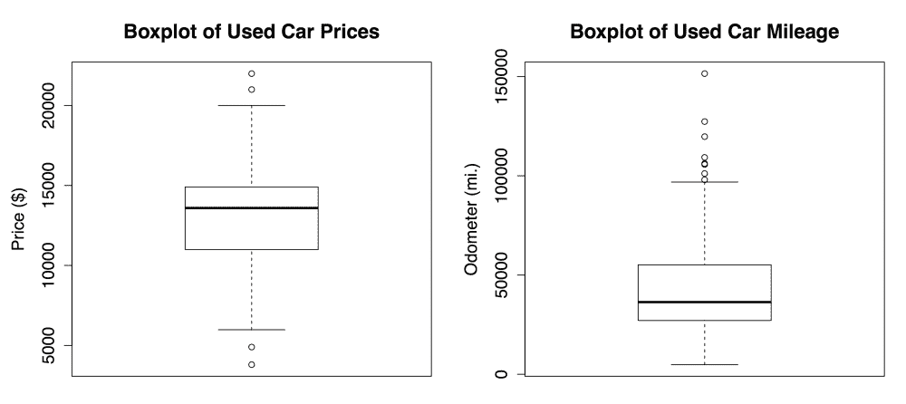

箱线图通过水平线和点来展示五数概括的值。图形中间箱体的水平线表示 Q1、Q2（中位数）和 Q3，按从下到上的顺序阅读图表。中位数由深色线表示，在`price`的纵轴上与$13,592 对齐，在`mileage`的纵轴上与 36,385 mi.对齐。

### 提示

在像前图那样简单的箱线图中，箱体和胡须的宽度是任意的，并不反映数据的任何特征。对于更复杂的分析，可以通过箱体的形状和大小来比较多个组的数据。要了解这些功能，可以首先查看 R 语言`boxplot()`文档中的`notch`和`varwidth`选项，方法是键入`?boxplot`命令。

最小值和最大值可以通过延伸到箱体上下方的胡须来表示；然而，广泛使用的约定只允许胡须延伸到距离 Q1 下方或 Q3 上方 1.5 倍 IQR 的最小值或最大值。超出此阈值的任何值被认为是离群值，并以圆圈或点表示。例如，回想一下`price`变量的 IQR 为 3909，Q1 为 10995，Q3 为 14904。因此，离群值是任何小于*10995 - 1.5 * 3909 = 5131.5*或大于*14904 + 1.5 * 3909 = 20767.5*的值。

图表显示了在高端和低端都有两个此类异常值。在`mileage`箱线图中，低端没有异常值，因此底部的胡须延伸到最小值 4,867。高端则出现了多个超过 100,000 英里标记的异常值。这些异常值是我们之前发现的原因，表明均值远大于中位数。

### 可视化数值变量 – 直方图

**直方图**是另一种图形化展示数值变量分布的方式。它与箱线图相似，因为它将变量的值划分为预定数量的部分或**区间**，这些区间充当值的容器。然而，它们的相似性仅止于此。一方面，箱线图要求数据的四个部分包含相同数量的值，并根据需要调整区间的宽度。另一方面，直方图使用任意数量的等宽区间，但允许每个区间包含不同数量的值。

我们可以使用`hist()`函数为二手车价格和里程数据创建直方图。就像我们在箱线图中做的那样，我们将使用`main`参数为图形指定标题，并使用`xlab`参数标记*X*轴。创建直方图的命令如下：

```py
> hist(usedcars$price, main = "Histogram of Used Car Prices",
 xlab = "Price ($)")
> hist(usedcars$mileage, main = "Histogram of Used Car Mileage",
 xlab = "Odometer (mi.)")

```

这将生成以下图表：

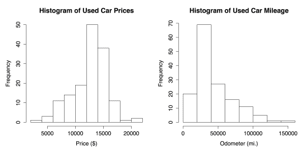

该直方图由一系列条形图组成，每个条形的高度表示值在各个相等宽度的区间（**区间**）内的数量或**频率**。分隔条形的垂直线，如横轴上所标记的，表示每个区间的起始和结束位置。

### 提示

你可能注意到，前面的直方图有不同数量的区间。这是因为`hist()`函数会尝试为变量的范围确定一个合理的区间数量。如果你想覆盖这个默认值，可以使用`breaks`参数。传递一个整数值如`breaks = 10`将创建恰好 10 个等宽的区间；传递一个向量如`c(5000, 10000, 15000, 20000)`将创建在指定值处断开的区间。

在`price`直方图中，10 个柱状图中的每一个跨越一个$2,000 的区间，从$2,000 开始，到$22,000 结束。图形中心的最高柱子覆盖$12,000 到$14,000 的范围，频率为 50。由于我们知道数据包括 150 辆车，我们可以推断出三分之一的车辆价格在$12,000 到$14,000 之间。近 90 辆车——超过一半——的价格在$12,000 到$16,000 之间。

`mileage`直方图包括八个柱状图，每个柱状图表示 20,000 英里区间，从 0 开始，到 160,000 英里结束。与价格直方图不同，最高的柱状图不在数据的中心，而是在图表的左侧。这个区间内的 70 辆车的里程数从 20,000 到 40,000 英里不等。

你可能还会注意到，两个直方图的形状有些不同。二手车的价格似乎在中间两侧比较均匀分布，而汽车的行驶里程则更多地集中在右侧。这种特征被称为**偏斜**，或者更具体地说是右偏，因为高端（右侧）的值比低端（左侧）的值分布得更广。如下面的图所示，偏斜数据的直方图在一侧看起来被拉长：

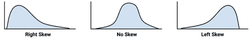

快速诊断数据中的这种模式是直方图作为数据探索工具的优点之一。随着我们开始检视数值数据中其他离散模式，这一点将变得更加重要。

### 理解数值数据 – 均匀分布和正态分布

直方图、箱形图以及描述中心和离散度的统计量提供了检视变量值分布的方法。一个变量的**分布**描述了一个值在不同范围内出现的可能性。

如果所有值的出现概率相等——比如说，在记录公平六面骰子掷出的数值的数据集中——这种分布被称为**均匀分布**。均匀分布通过直方图很容易被检测到，因为条形大致相同高度。通过直方图可视化时，它可能看起来像下面的图：

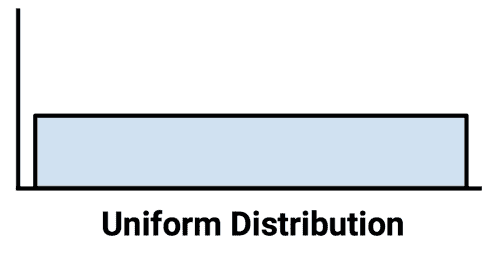

需要注意的是，并非所有的随机事件都是均匀分布的。例如，掷一颗加权的六面骰子会导致某些数字比其他数字更频繁地出现。虽然每次掷骰子的结果都是随机选出的数字，但它们并不是等概率的。

以二手车数据为例。这显然不是均匀分布，因为某些值的出现概率远高于其他值。实际上，在价格直方图中，值似乎越是远离中心条的两侧，出现的可能性就越小，从而形成了数据的钟形分布。这个特征在现实世界的数据中非常常见，它是所谓**正态分布**的标志。正态分布的典型钟形曲线如下面的图所示：

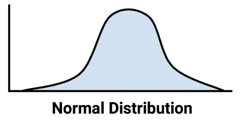

尽管存在许多类型的非正态分布，但许多现实世界现象生成的数据可以用正态分布来描述。因此，正态分布的属性已经被深入研究。

### 测量离散度 – 方差和标准差

分布让我们能够使用更少的参数来表征大量的值。正态分布描述了许多类型的现实世界数据，它只需要两个参数来定义：中心和分布。正态分布的中心由它的平均值定义，我们之前已经使用过了。分布则通过一个叫做**标准差**的统计量来衡量。

为了计算标准差，我们必须首先获得**方差**，它被定义为每个值与平均值之间差异的平方的平均值。用数学符号表示，一组*n*个*x*值的方差通过以下公式定义。希腊字母*mu*（看起来类似于*m*或*u*）表示值的平均数，而方差本身用希腊字母*sigma*的平方表示（看起来像是一个横着的*b*）：

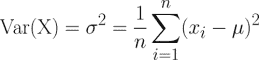

标准差是方差的平方根，用*sigma*表示，如下公式所示：

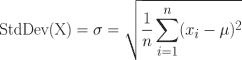

`var()`和`sd()`函数可以用来获取 R 中的方差和标准差。例如，计算我们`price`和`mileage`变量的方差和标准差，结果如下：

```py
> var(usedcars$price)
[1] 9749892
> sd(usedcars$price)
[1] 3122.482
> var(usedcars$mileage)
[1] 728033954
> sd(usedcars$mileage)
[1] 26982.1

```

在解释方差时，较大的数值表示数据在平均值周围的分布较广。标准差则表示每个值与平均值之间的差异程度。

### 提示

如果你手动使用前面图示中的公式来计算这些统计数据，你会得到一个与内建的 R 函数稍有不同的结果。这是因为前面的公式使用了总体方差（它除以*n*），而 R 使用了样本方差（它除以*n - 1*）。除了非常小的数据集外，这个区别是微小的。

标准差可以用来快速估算给定值在假设它来自正态分布的情况下有多极端。**68-95-99.7 规则**指出，正态分布中 68%的值落在平均值一个标准差的范围内，而 95%和 99.7%的值分别落在两个和三个标准差的范围内。如下图所示：

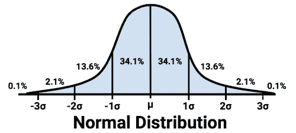

将这些信息应用于二手车数据，我们知道，由于`price`的平均值和标准差分别为 12,962 美元和 3,122 美元，假设价格呈正态分布，那么我们数据中大约 68%的车的价格在*12,962 美元 - 3,122 美元 = 9,840 美元* 和 *12,962 美元 + 3,122 美元 = 16,804 美元* 之间。

### 提示

严格来说，68-95-99.7 法则仅适用于正态分布，但基本原则适用于任何数据；与均值相差超过三个标准差的值是极为罕见的事件。

## 探索类别变量

如果你还记得，二手车数据集有三个类别变量：`model`、`color` 和 `transmission`。由于在加载数据时我们使用了 `stringsAsFactors = FALSE` 参数，R 将它们保留为 `character`（`chr`）类型向量，而不是自动将它们转换为 `factor` 类型。此外，我们可能考虑将年份变量视为类别变量；尽管它已作为 `numeric`（`int`）类型向量加载，但每个年份都是可以应用于多辆车的类别。

与 `numeric` 数据不同，类别数据通常通过表格而不是摘要统计量进行检查。呈现单个类别变量的表格称为 **单向表格**。可以使用 `table()` 函数为我们的二手车数据生成单向表格：

```py
> table(usedcars$year)
2000 2001 2002 2003 2004 2005 2006 2007 2008 2009 2010 2011 2012 
 3    1    1    1    3    2    6   11   14   42   49   16    1
> table(usedcars$model)
 SE SEL SES 
78  23  49
> table(usedcars$color)
 Black   Blue   Gold   Gray  Green    Red Silver  White Yellow 
 35     17      1     16      5     25     32     16      3

```

`table()` 输出列出了名义变量的类别以及落入该类别的值的计数。由于我们知道数据集中有 150 辆二手车，因此可以确定大约三分之一的所有汽车是在 `2010` 年制造的，因为 *49/150 = 0.327*。

R 还可以通过对 `table()` 函数生成的表格使用 `prop.table()` 命令，直接计算表格比例：

```py
> model_table <- table(usedcars$model)
> prop.table(model_table)
 SE       SEL       SES 
0.5200000 0.1533333 0.3266667

```

`prop.table()` 的结果可以与其他 R 函数结合使用，以转换输出。假设我们希望以单个小数位显示结果。我们可以通过将比例乘以 100，然后使用 `round()` 函数并指定 `digits = 1` 来实现，如下例所示：

```py
> color_pct <- table(usedcars$color)
> color_pct <- prop.table(color_table) * 100
> round(color_pct, digits = 1)
Black   Blue   Gold   Gray  Green    Red Silver  White Yellow 
 23.3   11.3    0.7   10.7    3.3   16.7   21.3   10.7    2.0

```

尽管这与默认的 `prop.table()` 输出包含相同的信息，但这种格式更易读。结果显示，黑色是最常见的颜色，因为几乎四分之一（23.3%）的广告车是 `Black`。`Silver` 紧随其后，占 21.3%，`Red` 排名第三，占 16.7%。

### 衡量集中趋势——众数

从统计学的角度来看，**众数**是出现频率最高的值。像均值和中位数一样，众数也是一种集中趋势的度量。它通常用于类别数据，因为均值和中位数对于名义变量是无法定义的。

例如，在二手车数据中，`year` 变量的众数是 2010，而 `model` 和 `color` 变量的众数分别是 `SE` 和 `Black`。一个变量可能有多个众数；具有单一众数的变量称为 **单峰**，具有两个众数的变量称为 **双峰**。具有多个众数的数据通常称为 **多峰**。

### 提示

虽然你可能怀疑可以使用 `mode()` 函数，R 语言使用它来获取变量的类型（如 `numeric`、`list` 等），而不是统计学中的众数。相反，要找到统计学中的众数，只需查看类别表格输出中出现次数最多的值。

众数或众数们在定性意义上被用来理解重要值。然而，过于强调众数是危险的，因为最常见的值不一定是多数值。例如，尽管 `color` 变量中 `Black` 是最常见的值，但黑色轿车仅占所有广告车的大约四分之一。

最好将众数与其他类别进行对比。是否有一个类别主导了其他所有类别，还是有几个类别？在这里，我们可以问，最常见的值告诉我们有关被测量变量的信息。如果黑色和银色是常见的汽车颜色，我们可能会假设数据是关于豪华车的，因为豪华车通常采用更加保守的颜色。这些颜色也可能表示经济型轿车，它们的颜色选择较少。在我们继续分析数据时，我们会保持这个问题在心。

将众数看作是常见值，允许我们将统计学中的众数概念应用于数值数据。严格来说，对于连续变量，几乎不可能有众数，因为两个值重复的可能性极小。然而，如果我们将众数看作直方图中的最高柱状条，就能讨论 `price` 和 `mileage` 等变量的众数。在探索数值数据时，考虑众数是很有帮助的，尤其是在检查数据是否是多众数的情况下。

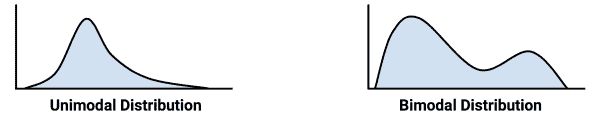

## 探索变量之间的关系

到目前为止，我们已经逐一检查了变量，只计算了**单变量**统计数据。在我们的调查过程中，我们提出了一些当时无法回答的问题：

+   `price` 数据是否意味着我们仅在研究经济型轿车，还是也有高里程的豪华车？

+   `model` 和 `color` 数据之间的关系是否能为我们研究的汽车类型提供一些见解？

这些类型的问题可以通过查看**双变量**关系来解决，双变量关系考虑了两个变量之间的关系。超过两个变量的关系被称为**多变量**关系。让我们从双变量情况开始。

### 可视化关系 – 散点图

**散点图**是用来可视化双变量关系的图表。它是一个二维图形，点被绘制在坐标平面上，使用一个特征的值作为水平 *x* 坐标，另一个特征的值作为垂直 *y* 坐标。点的分布模式揭示了两个特征之间的潜在关联。

为了回答我们关于`price`和`mileage`之间关系的问题，我们将检查散点图。我们将使用`plot()`函数，并结合之前用于标注图表的`main`、`xlab`和`ylab`参数。

要使用`plot()`，我们需要指定包含用于确定图中点位置的`x`和`y`向量。尽管无论使用哪个变量来提供*x*和*y*坐标，结论都将相同，但惯例规定*y*变量是假定依赖于其他变量的（因此被称为因变量）。由于卖家无法修改里程表读数，因此里程不太可能依赖于汽车的价格。相反，我们的假设是价格依赖于里程表读数。因此，我们将使用`price`作为*y*或因变量。

创建我们散点图的完整命令是：

```py
> plot(x = usedcars$mileage, y = usedcars$price,
 main = "Scatterplot of Price vs. Mileage",
 xlab = "Used Car Odometer (mi.)",
 ylab = "Used Car Price ($)")

```

这将生成以下散点图：

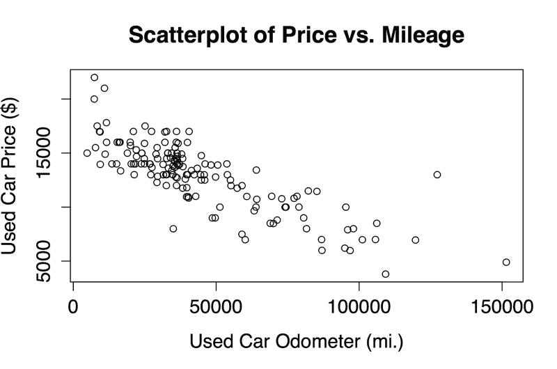

使用散点图时，我们注意到二手车价格和里程表读数之间存在明确的关系。要读取图表，请检查当*x*轴的值增大时，*y*轴变量的值如何变化。在这种情况下，随着里程的增加，汽车价格趋向于下降。如果你曾经出售或购买过二手车，你一定能体会到这一点。

也许一个更有趣的发现是，几乎没有汽车既有高价格又有高里程，除了一个大约 125,000 英里和 14,000 美元的孤立点。缺乏更多类似的点为我们提供了证据，支持我们的结论，即数据中不太可能包含高里程的豪华车。数据中所有最贵的汽车，特别是那些价格超过 17,500 美元的，似乎都有异常低的里程，这意味着我们可能在看一种零售价格约为 20,000 美元的新车。

我们发现的汽车价格和里程之间的关系被称为负相关，因为它形成了一个向下倾斜的直线状数据点模式。正相关则会形成一个向上倾斜的直线。平坦的直线或看似随机分散的数据点表明这两个变量之间没有任何关联。两个变量之间线性关系的强度通过一个称为**相关性**的统计量来衡量。相关性在第六章《预测数值数据–回归方法》中有详细讨论，该章节介绍了建模线性关系的方法。

### 提示

请记住，并非所有的关联都形成直线。有时候，数据点会形成一个*U*形状，或者*V*形状；有时候，随着`x`或`y`变量的增大，模式可能会显得更弱或更强。这些模式表明两个变量之间的关系并非线性。

### 检查关系 – 双向交叉表

为了检验两个名义变量之间的关系，使用**双向列联表**（也称为**列联表**或**列联表格**）。列联表类似于散点图，它可以帮助你检视一个变量的值如何随另一个变量的值变化。其格式为一个表格，其中行表示一个变量的各个水平，而列表示另一个变量的各个水平。表格中每个单元格的计数值表示该行和该列组合所对应的值的数量。

为了回答我们之前提出的关于汽车`model`（型号）和`color`（颜色）之间是否存在关系的问题，我们将检查列联表。在 R 中，有多个函数可以生成双向表格，包括我们用来生成单向表格的`table()`。`gmodels`包中的`CrossTable()`选项由 Gregory R. Warnes 编写，可能是最易于使用的函数，因为它将行、列和边际百分比都呈现在一个表格中，节省了我们自己合并这些数据的麻烦。要安装`gmodels`包，输入：

```py
> install.packages("gmodels")

```

在包安装完成后，输入`library(gmodels)`来加载该包。在每次使用`CrossTable()`函数的 R 会话中，你都需要执行此操作。

在继续进行分析之前，让我们通过减少`color`变量的水平数量来简化项目。该变量有九个水平，但我们不需要这么多细节。我们真正关心的是汽车颜色是否为保守色。为此，我们将九种颜色分为两组：第一组包括保守色`Black`（黑色）、`Gray`（灰色）、`Silver`（银色）和`White`（白色）；第二组包括`Blue`（蓝色）、`Gold`（金色）、`Green`（绿色）、`Red`（红色）和`Yellow`（黄色）。我们将创建一个二元指示变量（通常称为**虚拟变量**），表示汽车颜色是否符合我们定义的保守色。若为保守色，值为`1`，否则为`0`：

```py
> usedcars$conservative <-
 usedcars$color %in% c("Black", "Gray", "Silver", "White")

```

你可能已经注意到一个新命令：`%in%`运算符会返回`TRUE`或`FALSE`，取决于运算符左侧向量中的每个值是否在右侧向量中找到。简单来说，可以将这行代码理解为“该汽车颜色是否属于`Black`（黑色）、`Gray`（灰色）、`Silver`（银色）和`White`（白色）这一集合？” 

查看我们新创建的变量的`table()`输出，我们看到约三分之二的汽车颜色为保守色，而三分之一的汽车颜色则不是保守色：

```py
> table(usedcars$conservative)
FALSE  TRUE
 51    99

```

现在，我们来看看一个列联表，了解保守色彩的汽车比例如何随车型变化。由于我们假设汽车的型号决定了颜色的选择，因此我们将保守色彩指示器视为因变量（`y`）。因此，`CrossTable()`命令如下：

```py
> CrossTable(x = usedcars$model, y = usedcars$conservative)

```

上述命令将生成以下表格：

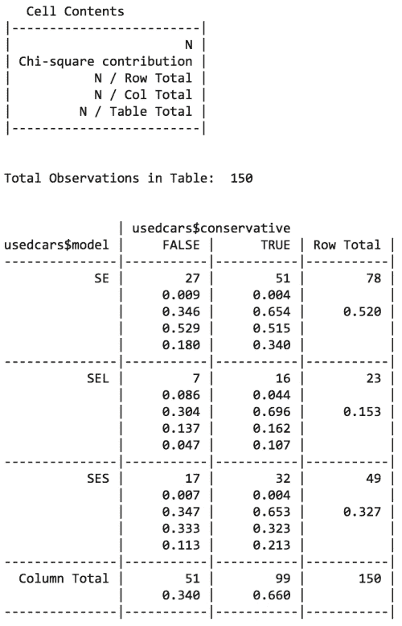

`CrossTable()`输出中包含了大量数据。顶部的图例（标记为`Cell Contents`）表示如何解释每个值。表格的行表示三种二手车模型：`SE`、`SEL`和`SES`（以及表示所有车型总和的附加行）。列表示车辆的颜色是否为保守色（并且还有一列显示两种颜色类型的总和）。每个单元格中的第一个值表示具有该车型和颜色组合的车辆数量。比例表示该单元格的比例是相对于卡方统计量、行总数、列总数和表格总数的。

我们最感兴趣的是每个车型中保守色车的行比例。行比例告诉我们，`SE`车型中有 0.654（65％）的车辆是保守色的，相比之下，`SEL`车型中有 0.696（70％）的车辆是保守色，`SES`车型中则为 0.653（65％）。这些差异相对较小，表明不同车型之间在选择颜色类型上没有实质性的差异。

卡方值指的是**皮尔逊卡方独立性检验**中每个单元格的贡献。该检验衡量的是表格中单元格计数差异仅由偶然因素造成的可能性。如果概率非常低，则提供了强有力的证据，表明这两个变量之间存在关联。

你可以通过在调用`CrossTable()`函数时添加额外的参数`chisq = TRUE`来获得卡方检验结果。在这种情况下，概率约为 93％，这表明单元格计数的变化很可能仅由偶然因素造成，而不是由于车型和颜色之间的真正关联。

# 总结

本章我们学习了在 R 中管理数据的基础知识。我们首先深入了解了用于存储各种类型数据的结构。R 的基础数据结构是向量，它被扩展并组合成更复杂的数据类型，如列表和数据框。数据框是 R 中的数据结构，类似于数据集的概念，既有特征也有样本。R 提供了读取和写入数据框的函数，可以将数据存储为类似电子表格的表格数据文件。

接下来，我们探讨了一个包含二手车价格数据的真实数据集。我们使用常见的汇总统计量（如集中趋势和离散程度）来分析数值变量，并通过散点图可视化了价格与里程表读数之间的关系。我们使用表格分析了名义变量。在分析二手车数据时，我们遵循了一种探索性过程，这种过程可用于理解任何数据集。这些技能将在本书的其他项目中得到应用。

现在我们已经花了一些时间了解了 R 的数据管理基础，你已经准备好开始使用机器学习来解决现实世界的问题了。在下一章中，我们将使用最近邻方法解决我们的第一个分类任务。
