# 第三章：懒惰学习——使用最近邻进行分类

一种有趣的新型用餐体验正在世界各地的城市中出现。顾客在完全黑暗的餐厅中，由记住路线并仅凭触觉和听觉在餐厅中小心走动的服务员进行服务。这些餐厅的吸引力在于，人们相信剥夺视觉感官输入将增强味觉和嗅觉，使食物以新的方式被体验。每一口都充满惊奇，同时发现厨师所准备的美味。

你能想象一下食客是如何体验那些看不见的食物吗？第一次咬下去时，感官会被完全压倒。主导的味道是什么？食物是咸的还是甜的？味道是否像以前吃过的东西？就个人而言，我将这个发现的过程想象成一种略微修改过的谚语：如果闻起来像鸭子，吃起来也像鸭子，那你很可能是在吃鸭子。

这说明了一个可以用于机器学习的思想——另一个涉及家禽的格言也有类似的启示：“物以类聚”。换句话说，相似的事物很可能具有相似的特征。机器学习运用这一原则，通过将数据与相似或“最近”的邻居放在同一类别中来进行分类。本章将专门讲解使用这种方法的分类器。你将学习：

+   定义**最近邻**分类器的关键概念，以及它们为何被认为是“懒惰”学习者

+   使用距离来衡量两个示例相似度的方法

+   应用一种流行的最近邻分类器，称为 k-NN

如果所有这些关于食物的谈话让你感到饿了，可以随时去吃点零食。我们的第一个任务是通过将 k-NN 方法应用于一个长期存在的烹饪争论来理解这一方法。

# 理解最近邻分类

用一句话来说，**最近邻**分类器的定义是通过将未标记的示例分类为与之相似的已标记示例的类别。尽管这个想法简单，最近邻方法却非常强大。它们已被成功应用于：

+   计算机视觉应用，包括光学字符识别和静态图像及视频中的人脸识别

+   预测一个人是否会喜欢电影或音乐推荐

+   在遗传数据中识别模式，也许可以用于检测特定的蛋白质或疾病

一般来说，最近邻分类器非常适用于分类任务，其中特征与目标类别之间的关系众多、复杂或极其难以理解，但相似类别的项目往往是相当同质的。换句话说，如果一个概念很难定义，但你一看就知道它是什么，那么最近邻可能是合适的选择。另一方面，如果数据很嘈杂，因此各组之间没有明确的区分，最近邻算法可能会难以识别类别边界。

## k-NN 算法

最近邻分类方法以**k 近邻算法**（**k-NN**）为代表。尽管这是可能最简单的机器学习算法之一，但它仍然被广泛使用。

该算法的优缺点如下：

| 优点 | 缺点 |
| --- | --- |

|

+   简单有效

+   对底层数据分布不做假设

+   训练阶段较快

|

+   不产生模型，限制了对特征与类别关系的理解

+   需要选择合适的*k*

+   分类阶段较慢

+   名义特征和缺失数据需要额外处理

|

k-NN 算法得名于它使用一个示例的 k 个最近邻的信息来分类未标记的示例。字母*k*是一个变量，意味着可以使用任意数量的最近邻。选择*k*之后，算法需要一个训练数据集，数据集中包含已分类为若干类别的示例，并由名义变量标记。然后，对于测试数据集中每个未标记的记录，k-NN 会在训练数据中识别出最“接近”的*k*个记录。未标记的测试实例将被分配给 k 个最近邻的大多数类别。

为了说明这个过程，让我们回顾一下引言中描述的盲品体验。假设在品尝神秘餐前，我们创建了一个数据集，其中记录了我们之前品尝过的若干食材的印象。为了简化起见，我们仅对每个食材的两个特征进行了评分。第一个是衡量食材脆度的 1 到 10 的评分，第二个是食材甜度的 1 到 10 的评分。然后，我们将每个食材标记为三种食品类型之一：水果、蔬菜或蛋白质。这样的数据集的前几行可能是如下结构：

| 成分 | 甜度 | 脆度 | 食品类型 |
| --- | --- | --- | --- |
| 苹果 | 10 | 9 | 水果 |
| 培根 | 1 | 4 | 蛋白质 |
| 香蕉 | 10 | 1 | 水果 |
| 胡萝卜 | 7 | 10 | 蔬菜 |
| 芹菜 | 3 | 10 | 蔬菜 |
| 奶酪 | 1 | 1 | 蛋白质 |

k-NN 算法将特征视为多维特征空间中的坐标。由于我们的数据集只包含两个特征，因此特征空间是二维的。我们可以在散点图上绘制二维数据，其中 *x* 维表示食材的甜度，*y* 维表示脆度。在向味道数据集中添加更多食材后，散点图可能会像这样：

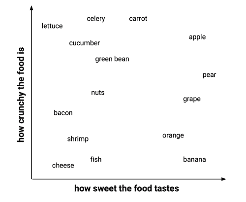

你注意到这个模式了吗？相似类型的食物往往被聚集在一起。正如下图所示，蔬菜往往脆但不甜，水果通常是甜的，并且可能脆也可能不脆，而蛋白质则通常既不脆也不甜：

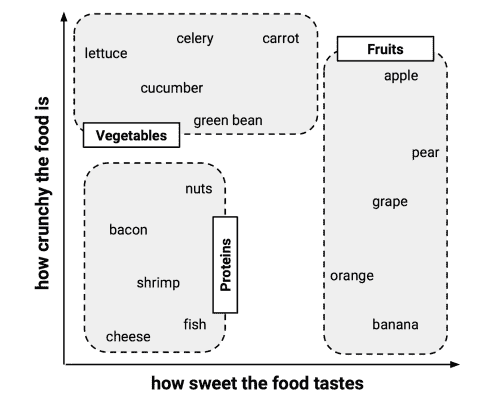

假设在构建完这个数据集后，我们决定用它来解决那个长期悬而未决的问题：番茄是水果还是蔬菜？我们可以使用最近邻方法来确定哪个类别更合适，如下图所示：

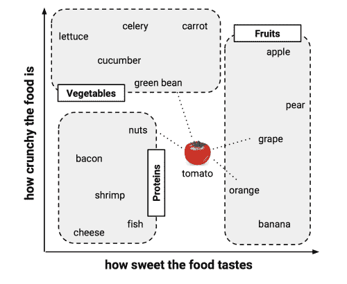

### 用距离度量相似性

找到番茄的最近邻需要一个**距离函数**，即一个衡量两个实例相似性的公式。

计算距离有许多不同的方法。传统上，k-NN 算法使用**欧几里得距离**，这是一种如果可以用尺子连接两点时所测量的距离，如前图中虚线连接番茄和邻居所示。

### 提示

欧几里得距离是“按直线飞行”的方式来度量的，意味着最短的直接路径。另一种常见的距离度量是曼哈顿距离，它是基于行人走过城市街区的路径。如果你想了解更多其他的距离度量，可以阅读 R 的距离函数文档（这个工具本身也非常有用），使用`?dist`命令。

欧几里得距离由以下公式指定，其中 *p* 和 *q* 是要比较的示例，每个示例有 *n* 个特征。术语 *p[1]* 指示示例 *p* 的第一个特征的值，而 *q[1]* 指示示例 *q* 的第一个特征的值：

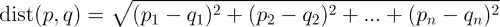

距离公式涉及比较每个特征的值。例如，要计算番茄（*甜度 = 6*，*脆度 = 4*）与青豆（*甜度 = 3*，*脆度 = 7*）之间的距离，我们可以使用如下公式：

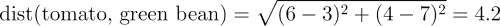

类似地，我们可以计算番茄与其几个最接近邻居之间的距离，如下所示：

| 食材 | 甜度 | 脆度 | 食物类型 | 到番茄的距离 |
| --- | --- | --- | --- | --- |
| 葡萄 | 8 | 5 | 水果 | *sqrt((6 - 8)² + (4 - 5)²) = 2.2* |
| 青豆 | 3 | 7 | 蔬菜 | *sqrt((6 - 3)² + (4 - 7)²) = 4.2* |
| 坚果 | 3 | 6 | 蛋白质 | *sqrt((6 - 3)² + (4 - 6)²) = 3.6* |
| 橙子 | 7 | 3 | 水果 | *sqrt((6 - 7)² + (4 - 3)²) = 1.4* |

为了将番茄分类为蔬菜、蛋白质或水果，我们将首先根据番茄最近的单一邻居来分配其食物类型。这称为 1-NN 分类，因为*k = 1*。橙子是番茄的最近邻，距离为 1.4。由于橙子是水果，因此 1-NN 算法会将番茄分类为水果。

如果我们改用*k = 3*的 k-NN 算法，它会在三个最近邻居之间进行投票：橙子、葡萄和坚果。由于这些邻居中多数类为水果（这三票中的两票），因此番茄再次被分类为水果。

### 选择合适的 k

选择用于 k-NN 的邻居数量决定了模型对未来数据的泛化能力。训练数据的过拟合与欠拟合之间的平衡问题被称为**偏差-方差权衡**。选择较大的*k*值可以减少噪声数据带来的影响或方差，但也可能使学习器产生偏差，从而忽略一些微小但重要的模式。

假设我们采取极端的做法，将*k*设定为非常大，甚至与训练数据中的观测总数相同。由于每个训练实例都被包含在最终投票中，最常见的类别总是会占多数选票。因此，模型将始终预测多数类，而不考虑最近邻居的情况。

在另一种极端情况下，使用单一最近邻会让噪声数据或异常值不当地影响示例的分类。例如，假设一些训练样本被错误地标记。如果任何未标记的示例恰好是错误标记邻居的最近邻，它将被预测为错误的类别，即使其他九个最近邻可能会投不同的票。

显然，最佳的*k*值应该介于这两种极端之间。

下图更普遍地展示了决策边界（由虚线表示）如何受到较大或较小*k*值的影响。较小的*k*值允许更复杂的决策边界，这些边界能够更精细地拟合训练数据。问题在于，我们并不知道直线边界还是曲线边界更能准确地表示要学习的真实底层概念。

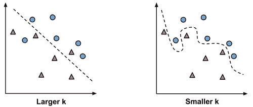

在实际应用中，选择*k*的大小取决于待学习概念的难度以及训练数据中的记录数。一种常见的做法是将*k*设为训练样本数量的平方根。在我们之前开发的食物分类器中，可能将*k = 4*，因为训练数据中有 15 个示例食材，而 15 的平方根是 3.87。

然而，这些规则并不总是能得出最佳的单一*k*值。另一种方法是对多个*k*值进行测试，并选择在各种测试数据集上表现最佳的那个。也就是说，除非数据非常嘈杂，否则一个大的训练数据集可以使得*k*的选择变得不那么重要。因为即使是细微的概念，也会有足够多的示例来作为最近邻进行投票。

### 提示

一种不太常见，但有趣的解决方案是选择一个较大的*k*值，但采用**加权投票**过程，其中较近邻居的投票比远离邻居的投票更具权威性。许多 k-NN 实现提供了这个选项。

### 为 k-NN 准备数据

在应用 k-NN 算法之前，特征通常会被转换为标准范围。这样做的理由是距离公式在很大程度上依赖于特征的度量方式。特别是，如果某些特征的值范围远大于其他特征，那么距离度量将会被那些具有更大范围的特征主导。对于食品品尝示例而言，这不是问题，因为甜度和脆度都是在 1 到 10 的范围内测量的。

然而，假设我们为数据集添加了一个额外的特征，用于表示食物的辣味，这个辣味是使用斯科维尔指数来衡量的。如果你不熟悉这个度量，它是一个标准化的辣味热度衡量标准，范围从零（完全不辣）到超过一百万（最辣的辣椒）。由于辣味与非辣味食物之间的差异可以超过一百万，而甜味与非甜味或脆度与非脆度食物之间的差异最多只有 10，尺度上的差异导致辣味的水平对距离函数的影响远大于另外两个因素。如果不调整数据，我们可能会发现距离度量仅仅通过辣味来区分食物；脆度和甜度的影响会被辣味的贡献所掩盖。

解决方案是通过缩小或扩展特征的范围来重新调整特征的尺度，使得每个特征对距离公式的贡献相对均衡。例如，如果甜度和脆度都在 1 到 10 的范围内测量，我们也希望辣味能在 1 到 10 的范围内测量。实现这种缩放有几种常见的方法。

k-NN 中调整特征尺度的传统方法是**最小-最大** **归一化**。这个过程将一个特征转换为其所有值都落在 0 到 1 的范围内。归一化特征的公式如下：

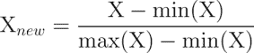

本质上，该公式从每个值中减去特征*X*的最小值，并除以*X*的范围。

标准化特征值可以解释为指示原始值在原始最小值和最大值之间的范围内，距离 0%到 100%的位置。

另一个常见的转换方法叫做**z-score 标准化**。以下公式减去特征*X*的均值，并将结果除以*X*的标准差：

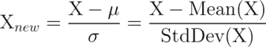

这个公式基于第二章中讲解的正态分布的特性，*管理与理解数据*，将每个特征的值重新缩放为它们相对于均值的标准差数量。结果值称为**z-score**。z-score 值在负数和正数的无限范围内波动。与标准化值不同，它们没有预定义的最小值和最大值。

### 提示

用于 k-NN 训练数据集的相同重缩放方法也必须应用于算法后续分类的示例。这可能导致最小-最大标准化的棘手情况，因为未来案例的最小值或最大值可能超出了训练数据中观察到的值范围。如果您提前知道合理的最小值或最大值，可以使用这些常数，而不是观察到的值。或者，您可以使用 z-score 标准化，假设未来的示例将具有与训练示例相似的均值和标准差。

欧几里得距离公式对名义数据没有定义。因此，为了计算名义特征之间的距离，我们需要将其转换为数值格式。一种典型的解决方案是使用**虚拟编码**，其中*1*表示一个类别，*0*表示另一个类别。例如，性别变量的虚拟编码可以构建如下：

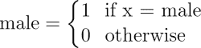

请注意，二类（即二进制）性别变量的虚拟编码结果是一个名为 male 的新特征。无需为 female 构建单独的特征；由于两性是互斥的，知道其中之一就足够了。

更普遍地说，*n*类名义特征可以通过为特征的(*n - 1*)个水平创建二进制指示变量来进行虚拟编码。例如，对于一个三类温度变量（例如，热、中等或冷），可以将虚拟编码设置为*(3 - 1) = 2*个特征，如下所示：

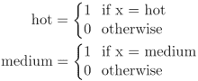

知道热和中等的值都是*0*就足够知道温度是冷的。因此，我们不需要为冷类构建第三个特征。

虚拟编码的一个方便之处在于，虚拟编码特征之间的距离始终为 1 或 0，因此，这些值与最小-最大标准化的数值数据处于相同的尺度上。不需要额外的转换。

### 提示

如果一个名义特征是有序的（例如温度可以这样认为），那么除了虚拟编码之外，还可以通过对类别编号并应用归一化来实现。例如，冷、温暖和热可以被编号为 1、2 和 3，然后归一化为 0、0.5 和 1。需要注意的是，这种方法只应在类别之间的差距是等价时使用。例如，尽管贫穷、中产阶级和富裕的收入类别是有序的，但贫穷与中产阶级之间的差距可能与中产阶级与富裕之间的差距不同。由于各组之间的差距不等，虚拟编码是更安全的方法。

## 为什么 k-NN 算法是懒惰的？

基于最近邻方法的分类算法被认为是**懒惰学习**算法，因为从技术上讲，没有发生抽象化。抽象和泛化过程完全跳过了，这削弱了第一章中提出的学习定义，*机器学习介绍*。

在严格的学习定义下，懒惰学习者实际上并没有学到任何东西。相反，它只是逐字地存储训练数据。这使得训练阶段（实际上并没有训练任何东西）可以非常快速地完成。当然，缺点是，与训练相比，做出预测的过程通常较慢。由于高度依赖于训练实例而非抽象模型，懒惰学习也被称为**基于实例的学习**或**死记硬背学习**。

由于基于实例的学习者不建立模型，因此这种方法被归类为**非参数**学习方法——即没有关于数据的任何参数被学习。由于不生成关于底层数据的理论，非参数方法限制了我们理解分类器如何使用数据的能力。另一方面，这使得学习者能够发现自然的模式，而不是试图将数据拟合到一个预设的且可能存在偏差的功能形式中。

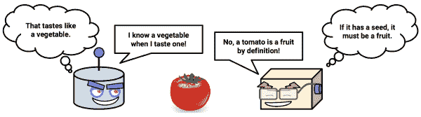

虽然 k-NN 分类器可能被认为是懒惰的，但它们仍然非常强大。正如你很快会看到的，最近邻学习的简单原理可以用于自动化癌症筛查过程。

# 示例 – 使用 k-NN 算法诊断乳腺癌

常规的乳腺癌筛查可以在疾病引发明显症状之前就诊断并治疗。早期检测过程涉及检查乳腺组织是否有异常的肿块或肿块。如果发现肿块，会进行细针穿刺活检，使用一个中空的针头从肿块中提取少量细胞样本。然后，临床医生在显微镜下检查细胞，以确定肿块是良性还是恶性。

如果机器学习能够自动化识别癌细胞，将为健康系统带来显著益处。自动化过程可能会提高检测效率，使医生能够花更少的时间诊断、更多的时间治疗疾病。自动筛查系统还可能通过去除过程中的人为主观成分，提高检测的准确性。

我们将通过应用 k-NN 算法，对来自患有异常乳腺肿块的女性的活检细胞测量数据进行研究，以探讨机器学习在癌症检测中的应用。

## 第 1 步 – 收集数据

我们将利用来自 UCI 机器学习库的威斯康星乳腺癌诊断数据集，网址为 [`archive.ics.uci.edu/ml`](http://archive.ics.uci.edu/ml)。该数据由威斯康星大学的研究人员捐赠，包含来自乳腺肿块的细针抽吸数字化图像的测量数据。这些数值代表了数字图像中细胞核的特征。

### 注意

如需了解更多关于此数据集的信息，请参考：Mangasarian OL, Street WN, Wolberg WH. Breast cancer diagnosis and prognosis via linear programming. *Operations Research*. 1995; 43:570-577.

乳腺癌数据集包括 569 个癌症活检样本，每个样本具有 32 个特征。其中一个特征是标识号，另一个是癌症诊断结果，30 个是数值型实验室测量值。诊断结果用 `"M"` 表示恶性，`"B"` 表示良性。

另外的 30 个数值型测量包含了 10 个不同细胞核特征的均值、标准误差和最差（即最大）值。这些特征包括：

+   半径

+   纹理

+   周长

+   面积

+   平滑度

+   紧凑度

+   凹陷度

+   凹点

+   对称性

+   分形维度

根据这些名称，所有特征似乎都与细胞核的形状和大小有关。除非你是肿瘤学家，否则你不太可能知道每个特征如何与良性或恶性肿块相关。这些模式将在我们继续进行机器学习过程时揭示出来。

## 第 2 步 – 探索和准备数据

让我们探索数据，看看是否能揭示一些关系。在此过程中，我们将为 k-NN 学习方法准备数据。

### 提示

如果你计划跟着一起操作，请从 Packt 网站下载 `wisc_bc_data.csv` 文件，并将其保存到你的 R 工作目录中。该数据集在原始形式的基础上略作修改，特别是添加了一个标题行，并且数据行已被随机排序。

我们将像以前章节一样，首先导入 CSV 数据文件，并将威斯康星乳腺癌数据保存到 `wbcd` 数据框中：

```py
> wbcd <- read.csv("wisc_bc_data.csv", stringsAsFactors = FALSE)

```

使用 `str(wbcd)` 命令，我们可以确认数据结构与预期相符，包含 569 个样本和 32 个特征。输出的前几行如下所示：

```py
'data.frame':  569 obs. of  32 variables:
 $ id               : int  87139402 8910251 905520 ...
 $ diagnosis        : chr  "B" "B" "B" "B" ...
 $ radius_mean      : num  12.3 10.6 11 11.3 15.2 ...
 $ texture_mean     : num  12.4 18.9 16.8 13.4 13.2 ...
 $ perimeter_mean   : num  78.8 69.3 70.9 73 97.7 ...
 $ area_mean        : num  464 346 373 385 712 ...

```

第一个变量是一个名为`id`的整数变量。由于它仅仅是数据中每个病人的唯一标识符（ID），并不提供有用信息，因此我们需要将其排除在模型之外。

### 提示

无论使用哪种机器学习方法，ID 变量都应始终被排除。忽略这一点可能会导致错误的结果，因为 ID 可以用于唯一地“预测”每个示例。因此，包含标识符的模型会出现过拟合的情况，而且不太可能在其他数据上具有良好的泛化能力。

让我们完全删除`id`特征。由于它位于第一列，我们可以通过制作`wbcd`数据框的副本，排除第一列来去除它：

```py
> wbcd <- wbcd[-1]

```

下一个变量`diagnosis`尤其重要，因为它是我们希望预测的结果。这个特征表示示例是来自良性肿块还是恶性肿块。`table()`输出显示 357 个肿块是良性的，而 212 个是恶性的：

```py
> table(wbcd$diagnosis)
 B   M 
357 212

```

许多 R 机器学习分类器要求目标特征被编码为因子，因此我们需要重新编码`diagnosis`变量。我们还将借此机会通过`labels`参数为`"B"`和`"M"`值提供更具信息性的标签：

```py
> wbcd$diagnosis<- factor(wbcd$diagnosis, levels = c("B", "M"),
 labels = c("Benign", "Malignant"))

```

现在，当我们查看`prop.table()`输出时，注意到值已被标记为`Benign`和`Malignant`，分别占 62.7%和 37.3%的肿块：

```py
> round(prop.table(table(wbcd$diagnosis)) * 100, digits = 1)
 Benign Malignant 
 62.7      37.3

```

剩下的 30 个特征都是数值型的，正如预期的，它们由十个特征的三种不同测量组成。为了便于说明，我们将只对其中三个特征进行更深入的分析：

```py
> summary(wbcd[c("radius_mean", "area_mean", "smoothness_mean")])
 radius_mean       area_mean      smoothness_mean 
 Min.   : 6.981   Min.   : 143.5   Min.   :0.05263 
 1st Qu.:11.700   1st Qu.: 420.3   1st Qu.:0.08637 
 Median :13.370   Median : 551.1   Median :0.09587 
 Mean   :14.127   Mean   : 654.9   Mean   :0.09636 
 3rd Qu.:15.780   3rd Qu.: 782.7   3rd Qu.:0.10530 
 Max.   :28.110   Max.   :2501.0   Max.   :0.16340

```

看着这些特征并排放置，你是否注意到数值上有任何问题？请记住，k-NN 的距离计算在很大程度上依赖于输入特征的测量尺度。由于平滑度范围从 0.05 到 0.16，而面积范围从`143.5`到`2501.0`，面积在距离计算中的影响将远大于平滑度。这可能会对我们的分类器造成问题，因此我们需要应用规范化将特征重新缩放到一个标准的数值范围。

### 转换——规范化数值数据

为了规范化这些特征，我们需要在 R 中创建一个`normalize()`函数。这个函数接受一个数值型向量`x`，对于`x`中的每个值，减去`x`中的最小值，并除以`x`中值的范围。最后，返回规范化后的向量。这个函数的代码如下：

```py
> normalize <- function(x) {
 return ((x - min(x)) / (max(x) - min(x)))
}

```

执行前面的代码后，`normalize()`函数可以在 R 中使用。让我们在几个向量上测试该函数：

```py
> normalize(c(1, 2, 3, 4, 5))
[1] 0.00 0.25 0.50 0.75 1.00
> normalize(c(10, 20, 30, 40, 50))
[1] 0.00 0.25 0.50 0.75 1.00

```

该函数似乎正常工作。尽管第二个向量中的值比第一个向量大 10 倍，但经过规范化后，它们看起来完全相同。

现在我们可以将`normalize()`函数应用于数据框中的数值特征。我们将不再单独对每一个 30 个数值变量进行标准化，而是使用 R 的一个函数来自动化这一过程。

`lapply()`函数接受一个列表，并将指定的函数应用于每个列表元素。由于数据框是一个等长向量的列表，我们可以使用`lapply()`将`normalize()`函数应用于数据框中的每个特征。最后一步是使用`as.data.frame()`函数将`lapply()`返回的列表转换为数据框。完整的过程如下所示：

```py
> wbcd_n <- as.data.frame(lapply(wbcd[2:31], normalize))

```

用简单的语言来说，这个命令将`normalize()`函数应用于`wbcd`数据框的第 2 到第 31 列，将结果列表转换为数据框，并将其命名为`wbcd_n`。这里使用`_n`后缀，提醒我们`wbcd`中的值已经被标准化。

为了确认转换是否正确应用，让我们查看一个变量的汇总统计信息：

```py
> summary(wbcd_n$area_mean)
Min. 1st Qu.Median    Mean 3rd Qu.    Max. 
0.0000  0.1174  0.1729  0.2169  0.2711  1.0000 

```

正如预期的那样，`area_mean`变量，原始值范围从 143.5 到 2501.0，现在的范围从 0 到 1。

### 数据准备——创建训练集和测试集

尽管所有的 569 个活检样本都已标记为良性或恶性状态，但预测我们已经知道的结果并不十分有趣。此外，在训练过程中获得的任何性能度量可能会误导我们，因为我们不知道这些案例过拟合的程度，或者学习者如何将其推广到未见过的案例。一个更有趣的问题是，学习者在未标记数据集上的表现如何。如果我们能够进入实验室，我们可以将学习者应用于下一批 100 个未知癌症状态的肿块测量值，并观察机器学习者的预测与常规方法获得的诊断结果的比较。

如果没有这些数据，我们可以通过将数据分为两部分来模拟这种情况：一部分是训练数据集，用于构建 k-NN 模型；另一部分是测试数据集，用于估算模型的预测准确性。我们将使用前 469 条记录作为训练数据集，剩余的 100 条记录用于模拟新患者。

使用第二章中给出的数据提取方法，*管理与理解数据*，我们将`wbcd_n`数据框分割为`wbcd_train`和`wbcd_test`：

```py
> wbcd_train <- wbcd_n[1:469, ]
> wbcd_test <- wbcd_n[470:569, ]

```

如果前面的命令让你感到困惑，请记住，数据是通过使用`[行, 列]`语法从数据框中提取的。行或列值为空表示应包含所有行或列。因此，第一行代码获取第 1 到 469 行以及所有列，第二行代码获取第 470 到 569 行的 100 行和所有列。

### 提示

在构建训练和测试数据集时，重要的是每个数据集都是完整数据集的代表性子集。`wbcd`记录已经是随机排序的，因此我们可以简单地提取 100 个连续的记录来创建测试数据集。如果数据是按时间顺序或按类似值的分组排序的，这种做法就不合适。在这些情况下，需要使用随机抽样方法。随机抽样将在第五章中讨论，*分治法——使用决策树和规则进行分类*。

当我们构建标准化的训练和测试数据集时，我们排除了目标变量`diagnosis`。在训练 k-NN 模型时，我们需要将这些类别标签存储在因子向量中，并将其分为训练集和测试集：

```py
> wbcd_train_labels <- wbcd[1:469, 1]
> wbcd_test_labels <- wbcd[470:569, 1]

```

这段代码提取`wbcd`数据框第一列中的`diagnosis`因子，并创建向量`wbcd_train_labels`和`wbcd_test_labels`。我们将在接下来的步骤中使用这些向量来训练和评估我们的分类器。

## 第 3 步 —— 在数据上训练模型

配备了我们的训练数据和标签向量后，我们现在准备对未知记录进行分类。对于 k-NN 算法，训练阶段实际上不涉及模型构建；训练像 k-NN 这样的“懒惰学习者”的过程仅仅是将输入数据存储在结构化格式中。

为了对我们的测试实例进行分类，我们将使用`class`包中的 k-NN 实现，该包提供了一组用于分类的基本 R 函数。如果你的系统上还没有安装该包，可以通过输入以下命令进行安装：

```py
> install.packages("class")

```

在任何希望使用该函数的会话中，加载该包时，只需输入`library(class)`命令。

`class`包中的`knn()`函数提供了 k-NN 算法的标准经典实现。对于测试数据中的每个实例，函数将使用欧几里得距离识别 k 个最近邻，其中*k*是用户指定的数字。通过在 k 个最近邻之间进行“投票”，对测试实例进行分类——具体来说，这包括为多数* k *邻居分配类别。如果出现平局投票，则随机打破平局。

### 提示

还有其他一些 k-NN 函数在其他 R 包中，它们提供了更复杂或更高效的实现。如果你在使用`knn()`时遇到限制，可以在**综合 R 档案网络**（**CRAN**）上搜索 k-NN。

使用`knn()`函数进行训练和分类是通过一次函数调用完成的，使用四个参数，如下表所示：

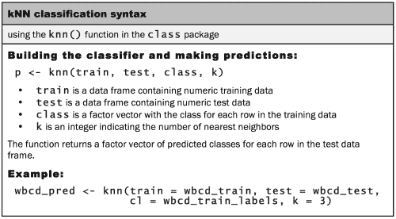

现在我们几乎具备了应用 k-NN 算法所需的一切。我们已经将数据分成了训练数据集和测试数据集，每个数据集都有完全相同的数值特征。训练数据的标签存储在一个单独的因子向量中。唯一剩下的参数是 `k`，它指定了投票中要包含的邻居数量。

由于我们的训练数据包含 469 个实例，我们可以尝试使用 `k = 21`，这是一个奇数，接近 469 的平方根。在二分类结果的情况下，使用奇数可以避免最终出现平局投票的情况。

现在我们可以使用 `knn()` 函数对 `test` 数据进行分类：

```py
> wbcd_test_pred <- knn(train = wbcd_train, test = wbcd_test,
 cl = wbcd_train_labels, k = 21)

```

`knn()` 函数返回一个预测标签的因子向量，对应 `test` 数据集中的每一个例子，我们将其赋值给 `wbcd_test_pred`。

## 步骤 4 – 评估模型性能

过程的下一步是评估 `wbcd_test_pred` 向量中的预测类别与 `wbcd_test_labels` 向量中的已知值的匹配程度。为此，我们可以使用 `gmodels` 包中的 `CrossTable()` 函数，该函数在 第二章，*数据管理与理解* 中介绍。如果你还没有安装该包，请使用 `install.packages("gmodels")` 命令进行安装。

在使用 `library(gmodels)` 命令加载包之后，我们可以创建一个交叉列联表，表示两个向量之间的一致性。指定 `prop.chisq = FALSE` 将从输出中移除不必要的卡方值：

```py
> CrossTable(x = wbcd_test_labels, y = wbcd_test_pred,
 prop.chisq=FALSE)

```

结果表格如下所示：

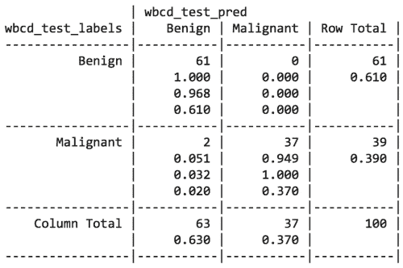

表格中的单元格百分比表示四个类别中值的比例。左上角的单元格表示**真负**结果。这 100 个值中有 61 个是良性肿块，且 k-NN 算法正确地将其识别为良性。右下角的单元格表示**真阳性**结果，其中分类器和临床确定的标签一致，表明肿块为恶性。总共 100 个预测中，有 37 个是真阳性。

其他对角线上的单元格包含的是 k-NN 方法与真实标签不一致的示例数量。左下角的两个示例是**假阴性**结果；在这种情况下，预测值为良性肿块，但实际上肿瘤是恶性的。此类错误可能极为代价高昂，因为它们可能导致患者误以为自己没有癌症，而实际上，疾病可能还在继续扩散。右上角的单元格将包含**假阳性**结果（如果有的话）。这些值发生在模型将肿块分类为恶性时，但实际上它是良性的。尽管此类错误比假阴性结果危害较小，但仍应避免，因为它们可能导致医疗系统额外的经济负担，或由于需要额外的检测或治疗而给患者带来更多压力。

### 提示

如果我们愿意的话，完全可以通过将每个肿块分类为恶性肿瘤来消除假阴性。显然，这并不是一种现实的策略。尽管如此，这仍然说明了预测需要在假阳性率和假阴性率之间找到平衡。在第十章，*评估模型表现*，你将学习到更复杂的预测准确性衡量方法，这些方法可以用来识别那些错误率可以根据每种类型错误的成本进行优化的地方。

总共有 100 个肿块中有 2 个被错误分类，即 2%的肿块被 k-NN 方法错误分类。虽然 98%的准确率看起来对于几行 R 代码来说相当令人印象深刻，但我们可能会尝试模型的另一个迭代版本，看看能否改善性能，减少错误分类的数量，特别是因为这些错误是危险的假阴性。

## 第 5 步 – 提高模型性能

我们将尝试对之前的分类器做两个简单的变动。首先，我们将采用一种替代方法对数值特征进行重缩放。其次，我们将尝试几个不同的*k*值。

### 转换 – z 分数标准化

尽管归一化通常用于 k-NN 分类，但它并不总是最合适的特征重缩放方法。由于 z 分数标准化后的值没有预定义的最小值和最大值，极端值不会被压缩到中心。因此，人们可能会怀疑在恶性肿瘤的情况下，肿瘤可能会 uncontrollably 地生长，产生一些非常极端的异常值。因此，允许异常值在距离计算中有更高的权重可能是合理的。让我们看看 z 分数标准化是否能改善我们的预测准确性。

为了标准化一个向量，我们可以使用 R 的内置`scale()`函数，默认情况下，它使用 z 分数标准化值。`scale()`函数的额外优点是它可以直接应用于数据框，这样我们就可以避免使用`lapply()`函数。要创建`wbcd`数据的 z 分数标准化版本，我们可以使用以下命令：

```py
> wbcd_z <- as.data.frame(scale(wbcd[-1]))

```

该命令对所有特征进行标准化，`diagnosis`除外，并将结果存储为`wbcd_z`数据框。`_z`后缀是提醒值已经进行了 z 分数转换。

为了确认转换是否正确应用，我们可以查看汇总统计：

```py
> summary(wbcd_z$area_mean)
 Min. 1st Qu.  Median    Mean 3rd Qu.    Max. 
-1.4530 -0.6666 -0.2949  0.0000  0.3632  5.2460

```

一个 z 分数标准化变量的均值应该始终为零，范围应该相对紧凑。大于 3 或小于-3 的 z 分数表示极其罕见的值。考虑到这一点，转换似乎成功了。

正如我们之前所做的，我们需要将数据分为训练集和测试集，然后使用`knn()`函数对测试实例进行分类。接着，我们将使用`CrossTable()`将预测标签与实际标签进行比较：

```py
> wbcd_train <- wbcd_z[1:469, ]
> wbcd_test <- wbcd_z[470:569, ]
> wbcd_train_labels <- wbcd[1:469, 1]
> wbcd_test_labels <- wbcd[470:569, 1]
> wbcd_test_pred <- knn(train = wbcd_train, test = wbcd_test,
 cl = wbcd_train_labels, k = 21)
> CrossTable(x = wbcd_test_labels, y = wbcd_test_pred,
 prop.chisq = FALSE)

```

不幸的是，在下面的表格中，我们的新转换结果显示准确率略有下降。我们之前正确分类了 98%的例子，而这次我们仅正确分类了 95%。更糟糕的是，我们在分类危险的假阴性时也没有取得更好的成绩：

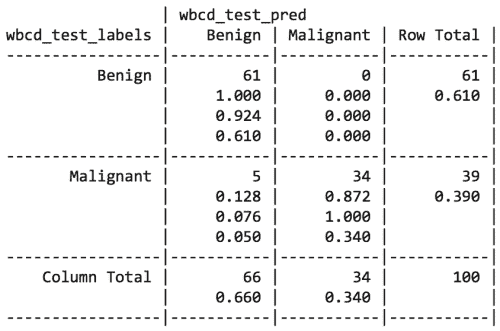

### 测试不同的 k 值

我们也许可以通过检查不同*k*值下的表现来做得更好。使用标准化后的训练集和测试集，使用多个不同的*k*值对相同的 100 条记录进行了分类。每次迭代的假阴性和假阳性的数量如下所示：

| k 值 | 假阴性 | 假阳性 | 错误分类的百分比 |
| --- | --- | --- | --- |
| 1 | 1 | 3 | 4 百分比 |
| 5 | 2 | 0 | 2 百分比 |
| 11 | 3 | 0 | 3 百分比 |
| 15 | 3 | 0 | 3 百分比 |
| 21 | 2 | 0 | 2 百分比 |
| 27 | 4 | 0 | 4 百分比 |

尽管分类器从未完美，但 1-NN 方法能够避免一些假阴性，尽管代价是增加了假阳性。然而，需要记住的是，我们不应过于根据测试数据来调整我们的做法；毕竟，另一组 100 个患者记录很可能会与我们用来衡量性能的记录有所不同。

### 提示

如果你需要确定一个学习算法能否对未来的数据进行泛化，你可以随机创建多个 100 个患者的集合，并反复重新测试结果。关于如何仔细评估机器学习模型性能的方法，将在第十章，*评估模型性能*中进一步讨论。

# 总结

在本章中，我们学习了使用 k-NN 进行分类。与许多分类算法不同，k-NN 不进行任何学习。它只是逐字存储训练数据。然后，使用距离函数将未标记的测试样本与训练集中最相似的记录进行匹配，并将未标记样本分配给其邻居的标签。

尽管 k-NN 是一个非常简单的算法，但它能够处理极为复杂的任务，比如癌症肿块的识别。在几行简单的 R 代码中，我们能够以 98%的准确率正确识别一个肿块是恶性还是良性。

在下一章，我们将研究一种分类方法，它利用概率来估计一个观察值属于某些类别的可能性。将会很有趣地比较这种方法与 k-NN 的不同之处。稍后，在第九章，*数据分组——使用 k-means 进行聚类*，我们将学习与 k-NN 关系密切的另一种方法，它使用距离度量进行完全不同的学习任务。
