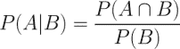

# 第四章：概率学习——使用朴素贝叶斯进行分类

当气象学家提供天气预报时，降水通常用诸如“70%可能下雨”这样的术语来描述。这类预报被称为降水概率报告。你有没有想过它们是如何计算出来的？这是一个令人困惑的问题，因为实际上，要么下雨，要么不下雨。

天气预估基于概率方法或那些描述不确定性的方法。它们使用过去事件的数据来推测未来事件。以天气为例，下雨的机会描述了过去在类似的可测量大气条件下降水发生的天数比例。70%的降雨概率意味着，在过去 10 个类似条件的案例中，有 7 个地方发生了降水。

本章介绍了朴素贝叶斯算法，它通过概率与天气预报的方式类似。学习该方法时，你将了解到：

+   概率的基本原理

+   使用 R 分析文本数据所需的专业方法和数据结构

+   如何运用朴素贝叶斯构建短信垃圾信息过滤器

如果你以前上过统计学课，本章中的部分内容可能是复习内容。尽管如此，重新温习一下概率知识可能还是有帮助的，因为这些原理是朴素贝叶斯得名的基础。

# 理解朴素贝叶斯

理解朴素贝叶斯算法所需的基本统计学理念已经存在了几个世纪。这一技术源于 18 世纪数学家托马斯·贝叶斯的工作，他发展了描述事件概率的基础原理，并阐述了在获得额外信息的情况下，如何修正概率。这些原理构成了如今被称为**贝叶斯方法**的基础。

我们将在后面更详细地讲解这些方法。但目前，只需说概率是一个介于 0 和 1 之间的数字（即 0%到 100%之间），它表示根据现有证据，某个事件发生的概率。概率越低，事件发生的可能性就越小。概率为 0 表示事件肯定不会发生，而概率为 1 表示事件将以 100%的确定性发生。

基于贝叶斯方法的分类器利用训练数据计算每个结果的观察概率，这些结果基于特征值提供的证据。当分类器应用于未标记的数据时，它使用观察到的概率来预测新特征的最可能类别。这是一个简单的理念，但它产生了一种通常能与更复杂算法相媲美的效果。实际上，贝叶斯分类器已被用于：

+   文本分类，如垃圾邮件（垃圾邮件）过滤

+   计算机网络中的入侵或异常检测

+   根据一组观察到的症状诊断医疗状况

通常，贝叶斯分类器最好应用于需要同时考虑多个属性信息的情境，以估算结果的总体概率。尽管许多机器学习算法会忽略效果较弱的特征，贝叶斯方法利用所有可用的证据来微妙地改变预测。如果大量特征的效果相对较小，结合起来，它们的综合影响可能会非常大。

## 贝叶斯方法的基本概念

在深入研究朴素贝叶斯算法之前，值得花些时间定义贝叶斯方法中使用的概念。用一句话总结，贝叶斯概率论的核心思想是，**事件**或潜在结果的估计可能性应该基于当前证据，并且通过多个**试验**或事件发生的机会来加以判断。

以下表格展示了几个现实世界结果的事件和试验：

| 事件 | 试验 |
| --- | --- |
| 正面结果 | 投币实验 |
| 雨天 | 单一天 |
| 消息是垃圾邮件 | 收到的电子邮件消息 |
| 候选人当选总统 | 总统选举 |
| 中头奖 | 彩票 |

贝叶斯方法提供了有关如何从观察到的数据估算这些事件概率的洞见。为了了解这一点，我们需要正式化我们的概率理解。

### 理解概率

事件的概率是通过将事件发生的试验次数除以总的试验次数来估算的。例如，如果在与今天类似的条件下，10 天中有 3 天下雨，那么今天下雨的概率可以估算为*3 / 10 = 0.30*，即 30%。类似地，如果 50 封先前的电子邮件中有 10 封是垃圾邮件，那么任何收到的电子邮件是垃圾邮件的概率可以估算为*10 / 50 = 0.20*，即 20%。

为了表示这些概率，我们使用类似*P(A)*的符号，表示事件*A*的概率。例如，*P(rain) = 0.30* 和 *P(spam) = 0.20*。

一次试验的所有可能结果的概率之和必须始终为 1，因为一次试验总会产生某种结果。因此，如果试验有两个无法同时发生的结果，比如雨天与晴天，或者垃圾邮件与非垃圾邮件（ham），那么知道其中一个结果的概率就能推断出另一个结果的概率。例如，给定*P(spam) = 0.20*，我们可以计算出*P(ham) = 1 – 0.20 = 0.80*。这表明垃圾邮件和非垃圾邮件是**互斥且穷尽的**事件，意味着它们不能同时发生，并且是唯一可能的结果。

因为一个事件不能同时发生又不发生，所以一个事件与其**补集**始终是互斥的且穷尽的，补集是指事件不发生时所有可能结果的集合。事件*A*的补集通常表示为*A^c*或*A'*。此外，简写符号*P(¬A)*可以用来表示事件*A*不发生的概率，如*P(¬spam) = 0.80*。该符号等同于*P(A^c)*。

为了说明事件及其补集，通常有助于想象一个被划分为各个事件概率的二维空间。在下图中，矩形表示电子邮件可能的结果。圆圈表示邮件是垃圾邮件的 20%的概率。其余的 80%表示补集*P(¬spam)*，即那些不是垃圾邮件的消息：


### 理解联合概率

通常，我们对监控多个非互斥事件感兴趣，尤其是在同一次试验中。如果某些事件与感兴趣的事件同时发生，我们可能能够利用这些事件进行预测。以电子邮件中包含“伟哥”一词为例，在大多数情况下，这个词只出现在垃圾邮件中；因此它出现在一封邮件中，是垃圾邮件的强烈证据。更新后的图示，加入了第二个事件，可能如下所示：


在图示中可以看到，伟哥圆圈并没有完全填满垃圾邮件圆圈，也没有完全被垃圾邮件圆圈包含。这意味着并不是所有的垃圾邮件都包含“伟哥”这个词，而包含“伟哥”一词的邮件也并不一定是垃圾邮件。

为了更仔细地查看垃圾邮件和伟哥圆圈之间的重叠部分，我们将使用一种叫做**维恩图**的可视化方法。维恩图最早由约翰·维恩在 19 世纪末期使用，利用圆圈来展示各个集合之间的重叠。在大多数维恩图中，圆圈的大小和重叠程度并没有实际意义。它更多地用于提醒我们给所有可能的事件组合分配概率：


我们知道，20%的邮件是垃圾邮件（左侧圆圈），5%的邮件包含“伟哥”一词（右侧圆圈）。我们希望量化这两个比例之间的重叠程度。换句话说，我们希望估算“垃圾邮件”和“伟哥”同时发生的概率，可以表示为*P(spam ∩ Viagra)*。倒“U”符号表示两个事件的**交集**；符号*A ∩ B*表示事件*A*和*B*同时发生的事件。

计算*P(spam ∩ Viagra)*取决于两个事件的**联合概率**，或者说一个事件的概率与另一个事件的概率之间的关系。如果两个事件完全无关，则称为**独立事件**。这并不意味着独立事件不能同时发生；事件独立性仅意味着知道一个事件的结果不会提供关于另一个事件结果的任何信息。例如，抛硬币的正面结果与某天的天气是否晴天或下雨是独立的。

如果所有事件都是独立的，就不可能通过观察一个事件来预测另一个事件。换句话说，**依赖事件**是预测建模的基础。就像云的存在可以预测下雨天一样，Viagra 这个词的出现可以预测垃圾邮件。


计算依赖事件的概率比计算独立事件的概率更为复杂。如果*P(spam)*和*P(Viagra)*是独立的，我们可以轻松计算*P(spam ∩ Viagra)*，即两个事件同时发生的概率。因为所有消息中有 20%是垃圾邮件，而 5%的电子邮件包含 Viagra 这个词，我们可以假设 1%的消息是含有 Viagra 的垃圾邮件。这是因为*0.05 * 0.20 = 0.01*。更一般地，对于独立事件*A*和*B*，两个事件同时发生的概率可以表示为*P(A ∩ B) = P(A) * P(B)*。

话虽如此，我们知道*P(spam)*和*P(Viagra)*很可能是高度相关的，这意味着这个计算是不正确的。为了获得一个合理的估计，我们需要使用一种更精确的公式来描述这两个事件之间的关系，该公式基于先进的贝叶斯方法。

### 使用贝叶斯定理计算条件概率

依赖事件之间的关系可以使用**贝叶斯定理**来描述，如下所示的公式。这种公式提供了一种思路，帮助我们根据另一个事件提供的证据来修正对一个事件概率的估计：



表示为*P(A|B)*的符号表示在事件*B*发生的情况下，事件*A*发生的概率。这就是**条件概率**，因为*A*的概率依赖于事件*B*的发生（即，条件概率）。贝叶斯定理告诉我们，我们对*P(A|B)*的估计应该基于*P(A ∩ B)*，即*A*和*B*共同发生的频率，以及*P(B)*，即*B*发生的频率。

贝叶斯定理指出，*P(A|B)*的最佳估计是在所有*B*发生的试验中，*A*与*B*同时发生的比例。简单来说，这告诉我们，如果我们知道事件*B*发生了，那么事件*A*发生的概率会随着每次观察到*A*和*B*同时发生的次数而增加。在某种程度上，这调整了*P(A ∩ B)*对*B*发生的概率；如果*B*非常罕见，*P(B)*和*P(A ∩ B)*将始终很小；然而，如果*A*和*B*几乎总是一起发生，无论*B*的概率如何，*P(A|B)*都会很高。

根据定义，*P(A ∩ B) = P(A|B) * P(B)*，这个事实可以通过对先前公式进行一点代数运算来轻松推导出来。再次重新排列这个公式，利用*P(A ∩ B) = P(B ∩ A)*的知识，得出*P(A ∩ B) = P(B|A) * P(A)*的结论，然后我们可以在贝叶斯定理的以下公式中使用它：


实际上，这是贝叶斯定理被规定的传统方式，这样做的原因将在我们将其应用于机器学习时变得清晰。首先，为了更好地理解贝叶斯定理在实践中的工作方式，让我们重新审视我们的假设垃圾邮件过滤器。

没有关于即将到来的消息内容的知识，其垃圾邮件状态的最佳估计将是*P(spam)*，即任何先前消息是垃圾邮件的概率，我们先前计算为 20%。这个估计被称为**先验概率**。

假设你通过仔细查看先前接收到的消息集合，检查“伟哥”一词出现的频率，获得了额外的证据。在先前的垃圾邮件中使用“伟哥”一词的概率，或*P(Viagra|spam)*，被称为**似然性**。任何消息中出现“伟哥”的概率，或*P(Viagra)*，被称为**边际似然性**。

通过将贝叶斯定理应用于这些证据，我们可以计算一个衡量消息可能是垃圾邮件的**后验概率**。如果后验概率大于 50%，那么消息更可能是垃圾邮件而不是正常邮件，可能应该被过滤。以下公式显示了如何将贝叶斯定理应用于先前电子邮件消息提供的证据：


为了计算贝叶斯定理的这些组成部分，有助于构建一个**频率表**（如下图左侧所示），记录了“Viagra”出现在垃圾邮件和正常邮件中的次数。就像一个双向交叉表一样，表的一个维度表示类变量的级别（垃圾邮件或正常邮件），而另一个维度表示特征的级别（Viagra: 是或否）。然后单元格指示具有特定类值和特征值组合的实例数。然后可以使用频率表构建一个**似然表**，如下图右侧所示。似然表的行表示给定邮件是垃圾邮件或正常邮件时“Viagra”（是/否）的条件概率：


似然表表明*P(Viagra=Yes|spam) = 4/20 = 0.20*，这意味着在垃圾邮件中包含词汇“Viagra”的概率为 20%。此外，由于*P(A ∩ B) = P(B|A) * P(A)*，我们可以计算*P(spam ∩ Viagra)*为*P(Viagra|spam) * P(spam) = (4/20) * (20/100) = 0.04*。在频率表中也可以找到相同的结果，其中指出 100 封邮件中有 4 封是带有词汇“Viagra”的垃圾邮件。无论哪种方式，这都比我们在错误假设独立性下计算的 0.01 的先前估计要大四倍。这当然说明了在计算联合概率时贝叶斯定理的重要性。

要计算后验概率*P(spam|Viagra)*，我们只需取*P(Viagra|spam) * P(spam) / P(Viagra)*或*(4/20) * (20/100) / (5/100) = 0.80*。因此，如果一封邮件包含词汇“Viagra”，那么该邮件是垃圾邮件的概率为 80%。根据这个结果，任何包含这个词汇的邮件可能应该被过滤。

这正是商业垃圾邮件过滤器的工作原理，尽管它们在计算频率和似然表时同时考虑了更多的单词。在下一节中，我们将看到当涉及到其他特征时，这个概念是如何被应用的。

## 朴素贝叶斯算法

**朴素贝叶斯**算法描述了一种简单的方法，将贝叶斯定理应用于分类问题。虽然它不是唯一利用贝叶斯方法的机器学习方法，但它是最常见的方法。这在文本分类中尤为明显，已成为事实上的标准。该算法的优势和劣势如下：

| 优势 | 劣势 |
| --- | --- |

|

+   简单、快速且非常有效

+   在处理嘈杂和缺失数据方面表现良好

+   需要相对较少的训练示例，但也适用于非常大量的示例

+   易于获得预测的估计概率

|

+   依赖于一个经常错误的假设，即特征同等重要且独立

+   对于具有大量数值特征的数据集不理想

+   估算的概率不如预测的类别可靠

|

朴素贝叶斯算法之所以得名，是因为它对数据做出了一些“天真的”假设。特别地，朴素贝叶斯假设数据集中的所有特征都是同等重要且相互独立的。这些假设在大多数实际应用中几乎都不成立。

例如，如果你试图通过监控电子邮件来识别垃圾邮件，那么几乎可以肯定，某些特征比其他特征更为重要。例如，电子邮件发送者可能是识别垃圾邮件的更重要指标，而不仅仅是邮件正文的内容。此外，邮件正文中的词语并不是相互独立的，因为某些词语的出现通常预示着其他词语也可能出现。一封包含“Viagra”这个词的邮件，可能也会包含“prescription”或“drugs”等词语。

然而，在大多数情况下，即使这些假设被违反，朴素贝叶斯仍然表现得相当好。即使在特征之间存在强相关性的极端情况下也是如此。由于该算法在多种条件下的灵活性和准确性，朴素贝叶斯通常是分类学习任务中的强有力的首选候选算法。

### 注意

尽管朴素贝叶斯存在一些错误的假设，但它为何依然能够表现良好，一直是许多学者推测的对象。一个解释是，获取精确的概率估计并不重要，只要预测结果是准确的。例如，如果垃圾邮件过滤器能够正确识别垃圾邮件，是否在预测中它有 51%的信心还是 99%的信心并不重要？关于这个话题的一个讨论，参考：Domingos P, Pazzani M. 在零一损失下，简单贝叶斯分类器的最优性。*机器学习*，1997；29：103-130。

### 使用朴素贝叶斯进行分类

让我们通过在监测术语“Viagra”之外，添加一些额外的术语来扩展我们的垃圾邮件过滤器：Money、Groceries 和 Unsubscribe。通过为这四个单词（标记为*W[1]*，*W[2]*，*W[3]*，*W[4]*）的出现构建似然性表来训练朴素贝叶斯学习器，如下图所示，基于 100 封电子邮件：


随着新邮件的到来，我们需要计算后验概率，以确定根据邮件文本中单词的出现情况，邮件更可能是垃圾邮件还是正常邮件。例如，假设一封邮件包含“Viagra”和“Unsubscribe”这两个词，但不包含“Money”或“Groceries”。

使用贝叶斯定理，我们可以像以下公式所示那样定义问题。它捕获了在给定*Viagra = Yes*，*Money = No*，*Groceries = No*，*Unsubscribe = Yes*的情况下，邮件是垃圾邮件的概率：


出于多种原因，这个公式在计算上是困难的。随着附加特征的增加，需要巨大的内存来存储所有可能交集事件的概率；想象一下，如果四个单词的事件形成一个维恩图的复杂性，更不用说成百上千个单词了。

如果我们能够利用朴素贝叶斯假设事件之间独立性的事实，工作将变得更轻松。具体来说，它假设**类条件独立性**，意味着只要事件在相同的类别值条件下，它们是独立的。假设条件独立性使我们能够使用独立事件的概率规则简化公式，概率规则是*P(A ∩ B) = P(A) * P(B)*。因为分母与类别（垃圾邮件或正常邮件）无关，它被视为常数值，可以暂时忽略。这意味着垃圾邮件的条件概率可以表示为：


并且消息是“ham”的概率可以表示为：


请注意，等号被替换为与符号（类似于一个横向的开放“8”），以表示分母被省略了。

使用似然表中的数值，我们可以开始在这些方程中填写数字。垃圾邮件的总体似然度为：

(4/20) * (10/20) * (20/20) * (12/20) * (20/100) = 0.012

而“ham”的似然度为：

(1/80) * (66/80) * (71/80) * (23/80) * (80/100) = 0.002

因为*0.012/0.002 = 6*，我们可以说这条信息是垃圾邮件的可能性是“ham”的六倍。然而，为了将这些数字转换为概率，我们需要执行最后一步，重新引入之前被排除的分母。实质上，我们必须通过将其除以所有可能结果的总似然度，来重新调整每个结果的似然度。

通过这种方式，垃圾邮件的概率等于该消息是垃圾邮件的似然度除以该消息是垃圾邮件或正常邮件的似然度：

0.012/(0.012 + 0.002) = 0.857

类似地，正常邮件的概率等于该消息是正常邮件的似然度除以该消息是垃圾邮件或正常邮件的似然度：

0.002/(0.012 + 0.002) = 0.143

根据这条信息中找到的单词模式，我们可以预计该信息是垃圾邮件的概率为 85.7%，是“ham”的概率为 14.3%。因为这两者是互斥且穷尽的事件，概率加和为 1。

我们在前面的示例中使用的朴素贝叶斯分类算法可以通过以下公式总结。给定特征*F[1]*到*F[n]*所提供的证据，类*C*的*L*级别的概率等于每个证据在类级别条件下的概率与类级别的先验概率以及一个缩放因子*1/Z*的乘积，后者将似然值转化为概率：


尽管这个公式看起来令人畏惧，但正如前面的例子所示，步骤非常简单。首先构建一个频率表，使用这个表构建一个似然表，然后按照朴素贝叶斯规则相乘条件概率。最后，通过总似然性进行除法，将每个类的似然性转化为概率。经过几次手动计算后，这将变成第二天性。

### 拉普拉斯估计量

在我们将朴素贝叶斯应用于更复杂的问题之前，有一些细节需要考虑。假设我们收到了另一条消息，这次包含了所有四个词：Viagra、Groceries、Money 和 Unsubscribe。像之前一样使用朴素贝叶斯算法，我们可以计算垃圾邮件的似然性为：

(4/20) * (10/20) * (0/20) * (12/20) * (20/100) = 0

正常邮件的似然性为：

(1/80) * (14/80) * (8/80) * (23/80) * (80/100) = 0.00005

因此，垃圾邮件的概率为：

0/(0 + 0.00005) = 0

正常邮件的概率为：

0.00005/(0 + 0.00005) = 1

这些结果表明，该消息的垃圾邮件概率为 0%，而正常邮件的概率为 100%。这个预测合理吗？可能不合理。该消息包含多个通常与垃圾邮件相关的词汇，包括 Viagra，这是合法邮件中很少使用的词汇。因此，很可能该邮件被错误地分类了。

如果某个事件在一个或多个类别级别上从未发生，可能会出现这个问题。例如，术语 Groceries 以前从未出现在垃圾邮件中。因此，*P(spam|groceries) = 0%*。

由于朴素贝叶斯公式中的概率是按链式相乘的，这个 0%的值导致垃圾邮件的后验概率为零，从而使得“Groceries”这个词能够有效地否定并推翻所有其他证据。即使这封邮件在其他方面明显应该是垃圾邮件，垃圾邮件中缺少“Groceries”一词也总是会否决其他证据，导致垃圾邮件的概率为零。

解决这个问题的方法之一是使用被称为**拉普拉斯估计器**的工具，该工具以法国数学家皮埃尔-西蒙·拉普拉斯的名字命名。拉普拉斯估计器本质上是向频率表中的每个计数值添加一个小的数字，确保每个特征在每个类别中都有非零的发生概率。通常，拉普拉斯估计器设置为 1，这确保每个类别-特征组合至少在数据中出现一次。

### 提示

拉普拉斯估计器可以设置为任何值，并不一定对每个特征都相同。如果你是一个坚定的贝叶斯信徒，你可以使用拉普拉斯估计器来反映特征与类别之间的假定先验概率。在实践中，给定一个足够大的训练数据集，这一步通常是不必要的，值通常设置为 1。

让我们看看这如何影响我们对这条信息的预测。使用拉普拉斯值为 1 时，我们将 1 加到似然函数中的每个分子。每个条件概率的分母也必须加上 1 的总数。因此，垃圾邮件的似然性是：

(5/24) * (11/24) * (1/24) * (13/24) * (20/100) = 0.0004

火腿的似然性是：

(2/84) * (15/84) * (9/84) * (24/84) * (80/100) = 0.0001

这意味着垃圾邮件的概率是 80%，火腿的概率是 20%，这个结果比仅凭“杂货”一项就决定结果的情况更为合理。

### 在朴素贝叶斯中使用数值特征

由于朴素贝叶斯使用频率表来学习数据，因此每个特征必须是类别型的，以便创建包含类别和特征值组合的矩阵。由于数值特征没有类别值，前述算法不能直接应用于数值数据。然而，有一些方法可以解决这个问题。

一个简单有效的解决方案是**离散化**数值特征，这意味着将数字放入被称为**箱**的类别中。因此，离散化有时也被称为**分箱**。当训练数据量非常大时，这种方法非常理想，而在使用朴素贝叶斯时，通常会遇到这种情况。

有几种不同的方法可以对数值特征进行离散化。最常见的一种方法是通过探索数据中自然的类别或**切点**来实现。例如，假设你在垃圾邮件数据集中添加了一个特征，记录电子邮件发送的时间，时间从午夜后的 0 到 24 小时不等。

使用直方图表示，时间数据可能类似于以下图示。在清晨时段，消息频率较低。活动在工作时间期间增多，并在晚上逐渐减少。这似乎形成了四个自然的活动区间，由虚线分隔，虚线表示数据在这些位置被分割为新类别特征的不同水平，这些特征随后可以与朴素贝叶斯算法一起使用：


请记住，选择四个区间是基于数据的自然分布和对垃圾邮件在一天内比例变化的直觉判断，这一选择有些任意。我们可能会预期垃圾邮件发送者会在深夜时分活跃，或者在白天活跃，当人们更可能查看电子邮件时。也就是说，为了捕捉这些趋势，我们也可以使用三个区间或十二个区间。

### 提示

如果没有明显的切分点，一个选择是使用分位数对特征进行离散化。你可以通过三分位将数据分为三个区间，四分位分为四个区间，或者五分位分为五个区间。

需要记住的一点是，离散化数值特征总是会导致信息的丧失，因为特征的原始粒度被减少为更少的类别数量。在这里找到平衡点非常重要。区间过少可能会导致重要的趋势被忽视，而区间过多则可能导致朴素贝叶斯频率表中的计数过小，从而增加算法对噪声数据的敏感性。

# 示例 – 使用朴素贝叶斯算法过滤手机垃圾短信

随着全球手机使用量的增加，一个新的电子垃圾邮件渠道为不道德的营销商打开了大门。这些广告商利用短信（SMS）文本信息，通过 SMS 垃圾短信向潜在消费者推送不必要的广告。此类垃圾短信特别麻烦，因为与电子邮件垃圾邮件不同，许多手机用户每接收到一条短信都需要支付费用。开发一种能够过滤 SMS 垃圾短信的分类算法，将为手机服务提供商提供一个有用的工具。

由于朴素贝叶斯算法在电子邮件垃圾邮件过滤中取得了成功，因此它也可能适用于 SMS 垃圾短信。然而，与电子邮件垃圾邮件相比，SMS 垃圾短信为自动过滤器带来了额外的挑战。SMS 消息通常限制为 160 个字符，减少了可以用来判断消息是否为垃圾信息的文本量。这一限制，再加上手机小巧的键盘，促使许多人采用了一种短信简写语言，这进一步模糊了合法消息和垃圾信息之间的界限。让我们看看一个简单的朴素贝叶斯分类器如何应对这些挑战。

## 步骤 1 – 收集数据

为了开发朴素贝叶斯分类器，我们将使用从 SMS 垃圾信息数据集中改编的数据，数据来源：[`www.dt.fee.unicamp.br/~tiago/smsspamcollection/`](http://www.dt.fee.unicamp.br/~tiago/smsspamcollection/)。

### 注意

若想了解更多关于如何开发 SMS 垃圾信息数据集的内容，请参考：Gómez JM, Almeida TA, Yamakami A. 《新 SMS 垃圾信息数据集的有效性》。《第 11 届 IEEE 国际机器学习与应用大会论文集》，2012 年。

该数据集包括短信文本及其标签，标签指示该短信是否为垃圾信息。垃圾信息标记为 spam，正常信息标记为 ham。以下表格展示了一些垃圾信息和正常信息的示例：

| 示例短信正常信息 | 示例短信垃圾信息 |
| --- | --- |

|

+   更好。为了弥补星期五的空缺，我昨天吃得像个猪一样。现在感觉有点不舒服。不过，至少不是什么剧烈的痛苦那种不舒服。

+   如果他开始找工作，他很快就能找到工作。他有很大的潜力和才能。

+   我找到另一份工作了！那份在医院的工作，做数据分析之类的，星期一开始！不确定我的论文什么时候完成。

|

+   恭喜你获得 500 元 CD 优惠券或 125 元礼品，保证免费参加 100 次每周抽奖，发送 MUSIC 到 87066。

+   仅限 12 月！你的手机已使用超过 11 个月了吗？你有权免费更新为最新的彩色相机手机！拨打 08002986906 免费联系移动更新公司。

+   情人节特别活动！在我们的问答比赛中赢取超过 1000 英镑，并带上你的伴侣一起去体验一生一次的旅行！现在发送 GO 到 83600。每条信息收费 150 便士。

|

查看之前的消息时，你是否注意到垃圾信息的一些显著特点？一个显著特点是三条垃圾信息中有两条使用了“free”这个词，而在任何一条正常信息中都没有出现这个词。另一方面，两条正常信息引用了具体的星期几，而垃圾信息中没有一条这样做。

我们的朴素贝叶斯分类器将利用单词频率中的这些模式来判断短信是否更符合垃圾信息或正常信息的特征。虽然不能排除“free”这个词出现在正常短信中的可能性，但合法信息通常会提供更多解释上下文的单词。例如，正常信息可能会写道：“你星期天有空吗？”而垃圾信息可能会使用“免费铃声”这个词组。分类器将根据消息中的所有单词所提供的证据计算垃圾信息和正常信息的概率。

## 步骤 2——探索与准备数据

构建分类器的第一步是处理原始数据以供分析。文本数据的准备非常具有挑战性，因为需要将单词和句子转化为计算机能够理解的形式。我们将把数据转化为一种称为**词袋模型**的表示方法，该方法忽略单词顺序，仅提供一个变量，表示该单词是否出现过。

### 提示

这里使用的数据已从原始数据中稍作修改，以便在 R 中更容易处理。如果你打算跟随本示例进行操作，请从 Packt 网站下载 `sms_spam.csv` 文件，并将其保存在你的 R 工作目录中。

我们将首先导入 CSV 数据并将其保存在数据框中：

```py
> sms_raw <- read.csv("sms_spam.csv", stringsAsFactors = FALSE)

```

使用 `str()` 函数，我们看到 `sms_raw` 数据框包含了 5,559 条短信，总共有两个特征：`type` 和 `text`。短信类型被编码为 `ham` 或 `spam`。`text` 元素存储了完整的原始短信文本。

```py
> str(sms_raw)
'data.frame':   5559 obs. of  2 variables:
 $ type: chr  "ham" "ham" "ham" "spam" ...
 $ text: chr  "Hope you are having a good week. Just checking in" "K..give back my thanks." "Am also doing in cbe only. But have to pay." "complimentary 4 STAR Ibiza Holiday or £10,000 cash needs your URGENT collection. 09066364349 NOW from Landline not to lose out"| __truncated__ ...

```

`type` 元素目前是一个字符向量。由于这是一个分类变量，最好将其转换为因子，如以下代码所示：

```py
> sms_raw$type <- factor(sms_raw$type)

```

使用 `str()` 和 `table()` 函数检查，我们看到 `type` 现在已经被正确地重新编码为因子。此外，我们看到在我们的数据中，747 条（大约 13%）短信被标记为垃圾短信，而其他的则被标记为正常短信：

```py
> str(sms_raw$type)
 Factor w/ 2 levels "ham","spam": 1 1 1 2 2 1 1 1 2 1 ...
> table(sms_raw$type)
 ham spam
4812  747

```

目前，我们将暂时不处理短信文本。正如你将在下一节中学到的那样，处理原始短信消息将需要使用一套专门设计用于处理文本数据的新工具。

### 数据准备——清洗和标准化文本数据

短信消息是由单词、空格、数字和标点符号组成的文本字符串。处理这种复杂数据需要大量的思考和努力。需要考虑如何去除数字和标点符号；处理如 *and*、*but* 和 *or* 等无关紧要的词；以及如何将句子拆解成单独的词。幸运的是，这一功能已经由 R 社区的成员通过一个名为`tm`的文本挖掘包提供。

### 注意

`tm` 包最初是由 Ingo Feinerer 在维也纳经济与商业大学作为论文项目创建的。欲了解更多信息，请参见：Feinerer I, Hornik K, Meyer D. 《R 中的文本挖掘基础设施》.*统计软件杂志*。2008；25:1-54。

可以通过 `install.packages("tm")` 命令安装 `tm` 包，并通过 `library(tm)` 命令加载它。即使你已经安装了该包，也值得重新运行安装过程，以确保你的版本是最新的，因为 `tm` 包仍在积极开发中。这有时会导致其功能发生变化。

### 提示

本章是使用 tm 版本 0.6-2 编写和测试的，该版本在 2015 年 7 月时是最新的。如果你发现输出不同或代码无法运行，可能是你使用的是不同的版本。此书的 Packt Publishing 支持页面会发布未来 `tm` 包的解决方案，若发现有显著变化。

处理文本数据的第一步是创建一个 **语料库**，即一组文本文件。文件可以是短的或长的，可能是单个新闻文章、书籍中的页面或整个书籍。对于我们而言，语料库将是一组短信。

为了创建一个语料库，我们将使用`tm`包中的`VCorpus()`函数，它指的是一个易失性语料库——因为它存储在内存中，而不是存储在磁盘上（`PCorpus()`函数可以用来访问存储在数据库中的永久语料库）。这个函数要求我们指定语料库的文档来源，这些文档可以来自计算机的文件系统、数据库、网络或其他地方。由于我们已经将短信文本加载到 R 中，我们将使用`VectorSource()`读取器函数从现有的`sms_raw$text`向量创建一个源对象，然后可以将其传递给`VCorpus()`，如下所示：

```py
> sms_corpus <- VCorpus(VectorSource(sms_raw$text))

```

结果语料库对象被保存为`sms_corpus`。

### 提示

通过指定可选的`readerControl`参数，`VCorpus()`函数提供了从 PDF 和 Microsoft Word 文件等来源导入文本的功能。要了解更多，请使用`vignette("tm")`命令查看`tm`包手册中的*数据导入*部分。

通过打印语料库，我们可以看到它包含了训练数据中 5,559 条短信的文档：

```py
> print(sms_corpus)
<<VCorpus>>
Metadata:  corpus specific: 0, document level (indexed): 0
Content:  documents: 5559

```

因为`tm`语料库本质上是一个复杂的列表，所以我们可以使用列表操作来选择语料库中的文档。为了接收特定信息的摘要，我们可以使用带有列表操作符的`inspect()`函数。例如，以下命令将查看语料库中第一和第二条短信的摘要：

```py
> inspect(sms_corpus[1:2])
<<VCorpus>>
Metadata:  corpus specific: 0, document level (indexed): 0
Content:  documents: 2

[[1]]
<<PlainTextDocument>>
Metadata:  7
Content:  chars: 49

[[2]]
<<PlainTextDocument>>
Metadata:  7
Content:  chars: 23

```

要查看实际的消息文本，必须对所需的消息应用`as.character()`函数。要查看一条消息，可以对单个列表元素使用`as.character()`函数，注意需要使用双括号表示法：

```py
> as.character(sms_corpus[[1]])
[1] "Hope you are having a good week. Just checking in"

```

要查看多个文档，我们需要对`sms_corpus`对象中的多个项使用`as.character()`。为此，我们将使用`lapply()`函数，它是 R 函数家族的一部分，能够对 R 数据结构的每个元素应用一个过程。包括`apply()`和`sapply()`等在内的这些函数，是 R 语言的关键用法之一。经验丰富的 R 程序员使用这些函数，就像其他编程语言中使用`for`或`while`循环一样，因为它们使代码更加易读（有时也更高效）。将`as.character()`应用于语料库元素子集的`lapply()`命令如下所示：

```py
> lapply(sms_corpus[1:2], as.character)
$`1`
[1] "Hope you are having a good week. Just checking in"

$`2`
[1] "K..give back my thanks."

```

如前所述，语料库包含了 5,559 条短信的原始文本。为了进行分析，我们需要将这些消息分解为单独的单词。但首先，我们需要清理文本，以标准化单词，通过去除标点符号和其他杂乱的字符来简化结果。例如，我们希望字符串*Hello*！，*HELLO*，和*hello*被计为同一个单词的实例。

`tm_map()`函数提供了一种将转换（也称为映射）应用到`tm`语料库的方法。我们将使用此函数通过一系列转换清理语料库，并将结果保存在一个名为`corpus_clean`的新对象中。

我们的首要任务是将消息标准化，只使用小写字母。为此，R 提供了一个`tolower()`函数，它返回文本字符串的小写版本。为了将这个函数应用到语料库中，我们需要使用`tm`包装函数`content_transformer()`将`tolower()`视为一种转换函数，可以用于访问语料库。完整的命令如下：

```py
> sms_corpus_clean <- tm_map(sms_corpus,
 content_transformer(tolower))

```

为了检查命令是否如预期那样工作，我们来检查原始语料库中的第一条消息，并将其与转换后的语料库中的相同消息进行对比：

```py
> as.character(sms_corpus[[1]])
[1] "Hope you are having a good week. Just checking in"
> as.character(sms_corpus_clean[[1]])
[1] "hope you are having a good week. just checking in"

```

正如预期的那样，大写字母已被其对应的小写字母替换。

### 提示

`content_transformer()`函数可以用于应用更复杂的文本处理和清理过程，如`grep`模式匹配和替换。只需编写自定义函数并在应用之前通过`tm_map()`进行包装，就像之前做的那样。

让我们继续清理工作，移除 SMS 消息中的数字。尽管某些数字可能提供有用信息，但大多数数字可能是特定于发送者的，因此无法在所有消息中提供有用的模式。考虑到这一点，我们将按照以下方式从语料库中删除所有数字：

```py
> sms_corpus_clean <- tm_map(sms_corpus_clean, removeNumbers)

```

### 提示

请注意，前面的代码没有使用`content_transformer()`函数。这是因为`removeNumbers()`是`tm`内置的，并且还有其他一些不需要包装的映射函数。要查看其他内置转换，只需输入`getTransformations()`。

我们的下一个任务是从 SMS 消息中删除填充词，如*to*、*and*、*but*和*or*。这些词被称为**停用词**，通常在文本挖掘之前被移除。这是因为，尽管它们出现频繁，但对机器学习来说并未提供太多有用信息。

我们不打算自己定义停用词列表，而是使用`tm`包提供的`stopwords()`函数。该函数允许我们访问多个语言的停用词集合。默认情况下，使用的是常见的英语停用词。要查看默认列表，请在命令行输入`stopwords()`。要查看其他语言和可用选项，请输入`?stopwords`以访问文档页面。

### 提示

即使在同一种语言中，也没有一个统一的停用词列表。例如，`tm`中的默认英文停用词列表包含约 174 个单词，而另一个选项包含 571 个单词。如果需要，您甚至可以指定自己的停用词列表。无论选择哪个列表，都请记住这次转换的目标，即在尽可能保留有用信息的同时，消除所有无用数据。

停用词本身并不是一个有用的转换。我们需要的是一种方法，能够移除停用词列表中出现的任何单词。解决方案在于`removeWords()`函数，这是`tm`包中包含的一个转换功能。正如我们之前所做的那样，我们将使用`tm_map()`函数将此映射应用于数据，并提供`stopwords()`函数作为参数，明确表示我们想要移除的单词。完整命令如下：

```py
> sms_corpus_clean <- tm_map(sms_corpus_clean,
 removeWords, stopwords())

```

由于`stopwords()`仅仅返回一个停用词向量，如果我们愿意，也可以用我们自己的词向量来替代它。通过这种方式，我们可以根据自己的需要扩展或缩减停用词列表，甚至完全移除一个不同的单词集合。

继续我们的清理过程，我们还可以使用内置的`removePunctuation()`转换来消除文本中的标点符号：

```py
> sms_corpus_clean <- tm_map(sms_corpus_clean, removePunctuation)

```

`removePunctuation()`转换会盲目地去除文本中的标点符号，这可能会导致一些意外的后果。例如，考虑当它如下应用时会发生什么：

```py
> removePunctuation("hello...world")
[1] "helloworld"

```

如图所示，省略号后没有空格，导致单词*hello*和*world*被连接为一个单词。虽然这对我们的分析没有实质性影响，但还是值得注意。

### 提示

为了规避`removePunctuation()`的默认行为，只需创建一个自定义函数，用来替换而不是移除标点符号字符：

```py
> replacePunctuation <- function(x) {
 gsub("[[:punct:]]+", " ", x)
}

```

本质上，这使用了 R 的`gsub()`函数，将`x`中的任何标点符号字符替换为空格。然后，可以像其他转换一样，使用`replacePunctuation()`函数与`tm_map()`一起使用。

另一个常见的文本数据标准化方法是通过一个叫做**词干提取**的过程，将单词简化为其词根形式。词干提取过程将像*learned*、*learning*和*learns*这样的单词去除后缀，转化为基础形式*learn*。这使得机器学习算法能够将相关术语视为单一概念，而不是尝试为每个变体学习一个模式。

`tm`包通过与`SnowballC`包的集成提供词干提取功能。在撰写本文时，`SnowballC`并未默认安装在`tm`中。如果尚未安装，可以使用`install.packages("SnowballC")`进行安装。

### 注意

`SnowballC`包由 Milan Bouchet-Valat 维护，并提供了一个 R 接口，连接到基于 C 的`libstemmer`库，后者基于 M.F. Porter 的“Snowball”词干提取算法，这是一个广泛使用的开源词干提取方法。更多细节，见[`snowball.tartarus.org`](http://snowball.tartarus.org)。

`SnowballC`包提供了一个`wordStem()`函数，对于一个字符向量，它返回该向量的词根形式。例如，该函数能够正确地提取*learn*一词的不同变体，如前所述：

```py
> library(SnowballC)
> wordStem(c("learn", "learned", "learning", "learns"))
[1] "learn"   "learn"   "learn"   "learn"

```

为了将`wordStem()`函数应用于整个文本文档语料库，`tm`包提供了一个`stemDocument()`转换。我们通过`tm_map()`函数将其应用于我们的语料库，方式与之前相同：

```py
> sms_corpus_clean <- tm_map(sms_corpus_clean, stemDocument)

```

### 提示

如果在应用`stemDocument()`转换时遇到错误消息，请确认你已安装`SnowballC`包。如果在安装包后仍然遇到“所有计划的核心都遇到错误”的消息，你还可以尝试强制将`tm_map()`命令限制为单一核心，通过添加一个额外参数`mc.cores=1`来指定。

在移除数字、停用词和标点符号并进行词干提取之后，文本消息留下了原先分隔这些已消失部分的空格。我们文本清理过程的最后一步是去除额外的空白字符，使用内置的`stripWhitespace()`转换：

```py
> sms_corpus_clean <- tm_map(sms_corpus_clean, stripWhitespace)

```

以下表格展示了 SMS 语料库中前 3 条消息在清理过程前后的样子。消息已经缩减为最有趣的单词，标点符号和大小写已被移除：

| 清理前的 SMS 消息 | 清理后的 SMS 消息 |
| --- | --- |

|

```py
> as.character(sms_corpus[1:3])

[[1]] Hope you are having a good week. Just checking in

[[2]] K..give back my thanks.

[[3]] Am also doing in cbe only. But have to pay.

```

|

```py
> as.character(sms_corpus_clean[1:3])

[[1]] hope good week just check

[[2]] kgive back thank

[[3]] also cbe pay

```

|

### 数据准备 – 将文本文件拆分为单词

现在数据已经按照我们的需求处理完成，最后一步是通过一个叫做**分词（tokenization）**的过程将消息拆分成单独的组件。一个词元（token）是文本字符串的一个单独元素；在这里，词元指的是单词。

正如你可能猜到的，`tm`包提供了将 SMS 消息语料库进行分词的功能。`DocumentTermMatrix()`函数将处理一个语料库并创建一个叫做**文档-词矩阵（Document Term Matrix，DTM）**的数据结构，其中行表示文档（SMS 消息），列表示术语（单词）。

### 提示

`tm`包还提供了一种叫做**词-文档矩阵（Term Document Matrix，TDM）**的数据结构，它仅仅是 DTM 的转置，其中行是词语，列是文档。为什么需要两者？有时，使用其中一个更方便。例如，如果文档的数量较少，而词汇表很大，使用 TDM 可能更合适，因为显示许多行通常比显示许多列更为容易。话虽如此，二者常常是可以互换的。

矩阵中的每个单元格存储一个数字，表示由列所代表的单词在由行所代表的文档中出现的次数。以下插图仅展示了 SMS 语料库 DTM 的一个小部分，完整的矩阵有 5,559 行和超过 7,000 列：


表中每个单元格为零，意味着列顶部列出的单词在语料库中的前五条消息中都没有出现。这突显了为什么这种数据结构被称为**稀疏矩阵**的原因；矩阵中的绝大多数单元格都填充的是零。用现实世界的术语来说，尽管每条消息必须至少包含一个单词，但某个单词出现在给定消息中的概率是很小的。

给定一个`tm`语料库，创建一个 DTM 稀疏矩阵只需要一条命令：

```py
> sms_dtm <- DocumentTermMatrix(sms_corpus_clean)

```

这将创建一个包含使用默认设置进行标记化语料库的` sms_dtm`对象，默认设置应用最小处理。默认设置是合适的，因为我们已经手动准备了语料库。

另一方面，如果我们没有执行预处理操作，可以在此通过提供` control`参数选项来覆盖默认设置。比如，直接从原始未处理的 SMS 语料库创建 DTM，我们可以使用以下命令：

```py
> sms_dtm2 <- DocumentTermMatrix(sms_corpus, control = list(
 tolower = TRUE,
 removeNumbers = TRUE,
 stopwords = TRUE,
 removePunctuation = TRUE,
 stemming = TRUE
 ))

```

这对 SMS 语料库应用相同的预处理步骤，顺序与之前相同。然而，将` sms_dtm`与` sms_dtm2`进行比较时，我们可以看到矩阵中术语的数量有轻微差异：

```py
> sms_dtm
<<DocumentTermMatrix (documents: 5559, terms: 6518)>>
Non-/sparse entries: 42113/36191449
Sparsity           : 100%
Maximal term length: 40
Weighting          : term frequency (tf)

> sms_dtm2
<<DocumentTermMatrix (documents: 5559, terms: 6909)>>
Non-/sparse entries: 43192/38363939
Sparsity           : 100%
Maximal term length: 40
Weighting          : term frequency (tf)

```

这种差异的原因与预处理步骤的顺序微小差异有关。` DocumentTermMatrix()`函数仅在文本字符串被拆分成单词后才会应用其清理功能。因此，它使用略有不同的停用词移除函数。因此，一些单词的拆分方式与它们在标记化之前清理时有所不同。

### 提示

为了强制将两个先前的文档术语矩阵保持一致，我们可以用自己的函数覆盖默认的停用词功能，该函数使用原始的替换功能。只需将`stopwords = TRUE`替换为以下内容：

```py
stopwords = function(x) { removeWords(x, stopwords()) }

```

这两种情况的差异说明了清理文本数据时一个重要的原则：操作的顺序很重要。考虑到这一点，仔细思考处理过程中的早期步骤如何影响后续步骤是非常重要的。这里提供的顺序在许多情况下有效，但当该过程针对特定数据集和使用案例进行更加精细的定制时，可能需要重新思考。例如，如果有某些术语是你希望从矩阵中排除的，考虑是否应该在词干提取之前或之后搜索它们。此外，还要考虑如何去除标点符号——以及标点符号是被消除还是被空格替代——对这些步骤的影响。

### 数据准备——创建训练集和测试集

在数据准备好进行分析后，我们现在需要将数据分成训练集和测试集，以便在构建完垃圾邮件分类器后，可以在未曾见过的数据上进行评估。但即便如此，我们需要确保在数据清洗和处理之后再进行拆分；我们需要在训练集和测试集上进行相同的准备步骤。

我们将把数据分成两部分：75%用于训练，25%用于测试。由于短信是随机排序的，我们可以简单地取前 4,169 条用于训练，将剩下的 1,390 条用于测试。幸运的是，DTM 对象非常像数据框，可以使用标准的`[row, col]`操作进行拆分。由于我们的 DTM 将短信存储为行，单词存储为列，我们必须为每一部分请求特定的行范围以及所有列：

```py
> sms_dtm_train <- sms_dtm[1:4169, ]
> sms_dtm_test  <- sms_dtm[4170:5559, ]

```

为了以后的方便，也有必要保存一对包含训练和测试矩阵中每一行标签的向量。这些标签并未存储在 DTM 中，所以我们需要从原始的`sms_raw`数据框中提取它们：

```py
> sms_train_labels <- sms_raw[1:4169, ]$type
> sms_test_labels  <- sms_raw[4170:5559, ]$type

```

为了确认这些子集代表完整的短信数据集，让我们比较训练数据和测试数据框中垃圾邮件的比例：

```py
> prop.table(table(sms_train_labels))
 ham      spam
0.8647158 0.1352842
> prop.table(table(sms_test_labels))
 ham      spam
0.8683453 0.1316547

```

训练数据和测试数据中大约有 13%的垃圾邮件。这表明垃圾邮件在两个数据集之间被均匀地划分。

### 可视化文本数据——词云

**词云**是一种通过可视化文本数据中单词出现频率的方式。词云由随机分布的单词组成，文本中出现频率更高的单词会显示为较大的字体，而较少出现的词则显示为较小的字体。这种类型的图形最近越来越流行，因为它提供了一种观察社交媒体网站上热门话题的方式。

`wordcloud`包提供了一个简单的 R 函数来创建这种类型的图表。我们将使用它来可视化短信中的词汇类型，因为比较垃圾邮件和正常邮件的词云将帮助我们评估我们的朴素贝叶斯垃圾邮件过滤器是否可能成功。如果你还没有安装这个包，可以通过在 R 命令行输入`install.packages("wordcloud")`和`library(wordcloud)`来安装并加载它。

### 注

`wordcloud`包是由 Ian Fellows 编写的。有关此包的更多信息，请访问他的博客 [`blog.fellstat.com/?cat=11`](http://blog.fellstat.com/?cat=11)。

可以直接从`tm`语料库对象创建词云，使用以下语法：

```py
> wordcloud(sms_corpus_clean, min.freq = 50, random.order = FALSE)

```

这将从我们准备好的短信语料库中创建一个词云。由于我们指定了`random.order = FALSE`，词云将按非随机顺序排列，频率较高的单词会被放置在中心附近。如果我们没有指定`random.order`，词云将默认随机排列。`min.freq`参数指定了一个单词在语料库中必须出现的次数，只有达到这个次数，单词才会出现在词云中。由于频率为 50 大约是语料库的 1%，这意味着一个单词必须至少在 1%的短信中出现，才能被包含在词云中。

### 提示

你可能会收到一个警告消息，指出 R 无法将所有单词都显示在图中。如果是这样，尝试增加`min.freq`以减少词云中的单词数量。使用`scale`参数来缩小字体大小也可能有所帮助。

结果的词云应类似于下图所示：


另一个可能更有趣的可视化是比较短信垃圾信息（spam）和正常信息（ham）的词云。由于我们没有为垃圾信息和正常信息构建单独的语料库，这是一个非常适合说明`wordcloud()`函数的有用功能的时机。给定一个原始文本字符串的向量，它会在显示词云之前自动应用常见的文本预处理过程。

让我们使用 R 的`subset()`函数通过短信`type`来获取` sms_raw`数据的一个子集。首先，我们将创建一个`type`为`spam`的子集：

```py
> spam <- subset(sms_raw, type == "spam")

```

接下来，我们将对`ham`子集做相同的操作：

```py
> ham <- subset(sms_raw, type == "ham")

```

### 提示

请小心注意双等号。像许多编程语言一样，R 使用`==`来测试相等性。如果你不小心使用了单个等号，你将得到一个比预期更大的子集！

现在我们有了两个数据框，`spam`和`ham`，每个框中都有一个`text`特征，包含短信的原始文本字符串。创建词云与之前一样简单。这一次，我们将使用`max.words`参数来查看两个集合中最常见的 40 个单词。`scale`参数允许我们调整词云中单词的最大和最小字体大小。根据需要自由调整这些参数。以下命令示范了这一过程：

```py
> wordcloud(spam$text, max.words = 40, scale = c(3, 0.5))
> wordcloud(ham$text, max.words = 40, scale = c(3, 0.5))

```

结果的词云显示在下图中：


你能猜到哪个是垃圾信息词云，哪个是正常信息词云吗？

### 提示

由于随机化过程，每个词云可能看起来略有不同。运行`wordcloud()`函数几次可以让你选择一个在展示中最具视觉吸引力的词云。

如你所猜测的，垃圾短信云在左边。垃圾短信中包含如*urgent*（紧急）、*free*（免费）、*mobile*（手机）、*claim*（索赔）和*stop*（停止）等词汇；这些词汇在正常短信云中完全没有出现。相反，正常短信使用如*can*（可以）、*sorry*（抱歉）、*need*（需要）和*time*（时间）等词汇。这些显著的差异表明，我们的朴素贝叶斯模型将拥有一些强有力的关键词来区分这两类信息。

### 数据准备——为频繁出现的词汇创建指示特征

数据准备过程的最后一步是将稀疏矩阵转换为一个可以用来训练朴素贝叶斯分类器的数据结构。目前，稀疏矩阵包含超过 6,500 个特征；每个特征对应一个至少在一条短信中出现的词汇。这些特征不一定都是有用的，因此为了减少特征的数量，我们将剔除任何在少于五条短信中出现的词汇，或者出现在训练数据中不到 0.1%的记录中的词汇。

查找频繁词汇需要使用`findFreqTerms()`函数，该函数位于`tm`包中。该函数接受一个文档词项矩阵（DTM）并返回一个字符向量，包含在至少指定次数中出现的词汇。例如，以下命令将显示在`sms_dtm_train`矩阵中至少出现五次的词汇：

```py
> findFreqTerms(sms_dtm_train, 5)

```

该函数的结果是一个字符向量，因此让我们将频繁出现的词保存以供后续使用：

```py
> sms_freq_words <- findFreqTerms(sms_dtm_train, 5)

```

向量内容的预览显示，我们发现有 1,136 个术语在至少五条短信中出现：

```py
> str(sms_freq_words)
 chr [1:1136] "abiola" "abl" "abt" "accept" "access" "account" "across" "act" "activ" ...

```

我们现在需要过滤我们的 DTM，只保留在指定向量中出现的术语。与之前一样，我们将使用数据框风格的`[row, col]`操作来请求 DTM 的特定部分，并注意到列名是 DTM 所包含词汇的名称。我们可以利用这一点将 DTM 限制为特定的词汇。由于我们希望保留所有行，但仅保留表示`sms_freq_words`向量中词汇的列，因此我们的命令是：

```py
> sms_dtm_freq_train<- sms_dtm_train[ , sms_freq_words]
> sms_dtm_freq_test <- sms_dtm_test[ , sms_freq_words]

```

训练集和测试集现在包含 1,136 个特征，这些特征对应于在至少五条短信中出现的词汇。

朴素贝叶斯分类器通常在具有类别特征的数据上进行训练。这就带来了一个问题，因为稀疏矩阵中的单元格是数字型的，表示一个词在消息中出现的次数。我们需要将其转换为一个类别变量，简单地根据该词是否出现来指示“是”或“否”。

以下定义了一个`convert_counts()`函数，将计数转换为`Yes`/`No`字符串：

```py
> convert_counts <- function(x) {
 x <- ifelse(x > 0, "Yes", "No")
 }

```

到目前为止，前面函数的一些部分应该看起来很熟悉。第一行定义了函数。`ifelse(x > 0, "Yes", "No")`语句将转换`x`中的值，使得如果值大于 0，它将被替换为`"Yes"`，否则将被替换为`"No"`字符串。最后，返回新转换的`x`向量。

现在我们需要对稀疏矩阵中的每一列应用`convert_counts()`。你或许能猜到完成这个操作的 R 函数是什么。这个函数就是`apply()`，它的使用方式与之前的`lapply()`类似。

`apply()`函数允许在矩阵的每一行或每一列上使用一个函数。它使用一个`MARGIN`参数来指定行或列。这里我们将使用`MARGIN = 2`，因为我们关心的是列（`MARGIN = 1`用于行）。用于转换训练矩阵和测试矩阵的命令如下：

```py
> sms_train <- apply(sms_dtm_freq_train, MARGIN = 2,
 convert_counts)
> sms_test <- apply(sms_dtm_freq_test, MARGIN = 2,
 convert_counts)

```

结果将是两个字符类型的矩阵，每个单元格表示列所代表的单词是否出现在行所代表的消息中，显示为“是”或“否”。

## 步骤 3 – 在数据上训练模型

现在我们已经将原始的短信消息转化为可以通过统计模型表示的格式，是时候应用朴素贝叶斯算法了。该算法将利用单词的出现与否来估算给定短信是垃圾邮件的概率。

我们将使用的朴素贝叶斯实现位于`e1071`包中。这个包是由维也纳工业大学（TU Wien）统计学系开发的，包含了多种机器学习函数。如果你还没有安装该包，请确保在继续之前使用`install.packages("e1071")`和`library(e1071)`命令安装并加载该包。

### 提示

许多机器学习方法在多个 R 包中都有实现，朴素贝叶斯也不例外。另一个选择是`klaR`包中的`NaiveBayes()`函数，它与`e1071`包中的函数几乎相同。你可以随意选择你喜欢的选项。

与我们在上一章中使用的 k-NN 算法不同，朴素贝叶斯学习器是分阶段进行训练和分类的。尽管如此，正如下表所示，这些步骤相对简单：


为了在`sms_train`矩阵上构建我们的模型，我们将使用以下命令：

```py
> sms_classifier <- naiveBayes(sms_train, sms_train_labels)

```

`sms_classifier`对象现在包含一个`naiveBayes`分类器对象，可以用来进行预测。

## 步骤 4 – 评估模型性能

为了评估短信分类器，我们需要在测试数据中的未见过的消息上测试其预测结果。回想一下，未见消息的特征存储在一个名为`sms_test`的矩阵中，而类标签（垃圾邮件或正常邮件）存储在名为`sms_test_labels`的向量中。我们训练过的分类器被命名为`sms_classifier`。我们将使用该分类器来生成预测，然后将预测值与真实值进行比较。

`predict()`函数用于进行预测。我们将把这些预测存储在一个名为`sms_test_pred`的向量中。我们只需向函数提供分类器和测试数据集的名称，如下所示：

```py
> sms_test_pred <- predict(sms_classifier, sms_test)

```

为了将预测与真实值进行比较，我们将使用`gmodels`包中的`CrossTable()`函数，这是我们之前使用过的。这次，我们将添加一些附加参数以消除不必要的单元格比例，并使用`dnn`参数（维度名称）重新标记行和列，如下代码所示：

```py
> library(gmodels)
> CrossTable(sms_test_pred, sms_test_labels,
 prop.chisq = FALSE, prop.t = FALSE,
 dnn = c('predicted', 'actual'))

```

这产生了以下表格：


看着表格，我们可以看到总共有*6 + 30 = 36*条短信被错误分类（占 2.6％）。这些错误包括 1,207 条正常短信中有 6 条被误分类为垃圾邮件，以及 183 条垃圾邮件中有 30 条被错误标记为正常邮件。考虑到我们在项目中投入的精力不多，这个性能水平似乎相当令人印象深刻。这个案例研究展示了朴素贝叶斯成为文本分类标准的原因；直接使用时，它的表现出乎意料地好。

另一方面，那些被错误分类为垃圾邮件的六条合法信息可能会对我们的过滤算法部署造成重大问题，因为过滤器可能会导致某个人错过一条重要的短信。我们应该调查一下是否可以稍微调整模型以提高性能。

## 步骤 5 – 改进模型性能

你可能已经注意到，在训练模型时，我们没有为拉普拉斯估计器设置值。这使得在零垃圾邮件或零正常邮件中出现的词汇在分类过程中拥有不可争辩的发言权。仅仅因为“铃声”这个词只出现在训练数据的垃圾邮件中，并不意味着包含该词的每条信息都应该被分类为垃圾邮件。

我们将像之前一样构建一个朴素贝叶斯模型，但这次设置`laplace = 1`：

```py
> sms_classifier2 <- naiveBayes(sms_train, sms_train_labels,
 laplace = 1)

```

接下来，我们将进行预测：

```py
> sms_test_pred2 <- predict(sms_classifier2, sms_test)

```

最后，我们将通过交叉表来比较预测类别和实际分类：

```py
> CrossTable(sms_test_pred2, sms_test_labels,
 prop.chisq = FALSE, prop.t = FALSE, prop.r = FALSE,
 dnn = c('predicted', 'actual'))

```

这导致了以下表格：


添加拉普拉斯估计器将误报（正常邮件错误地分类为垃圾邮件）的数量从六个减少到了五个，将漏报的数量从 30 个减少到了 28 个。虽然这看起来是一个小变化，但考虑到模型的准确性已经相当令人印象深刻，这个变化还是相当显著的。在过度调整模型之前，我们需要小心，以确保在过滤垃圾邮件时保持过于激进和过于被动之间的平衡。用户更愿意接受少数垃圾邮件漏过过滤器，而不是正常邮件被过度过滤的情况。

# 总结

在本章中，我们了解了使用朴素贝叶斯进行分类。这种算法构建了概率表，用于估算新样本属于不同类别的可能性。这些概率通过一个被称为贝叶斯定理的公式来计算，该定理说明了事件之间的依赖关系。尽管贝叶斯定理计算开销较大，但其简化版在做出所谓的“朴素”假设，即特征独立性假设的基础上，能够处理极其庞大的数据集。

朴素贝叶斯分类器通常用于文本分类。为了说明其有效性，我们将朴素贝叶斯应用于一个涉及垃圾短信分类的任务。在进行文本数据分析时，我们使用了专门的 R 包进行文本处理和可视化。最终，该模型能够正确分类超过 97%的短信，准确地识别出垃圾短信和正常短信。

在下一章中，我们将介绍两种机器学习方法。每种方法通过将数据分割成相似值的组来执行分类。
