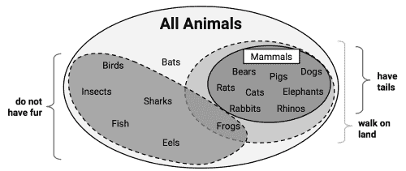

# 第五章. 分治法 – 使用决策树和规则进行分类

在决定是否接受多个薪资和福利不同的工作邀请时，许多人通常通过列出利弊清单，并根据简单的规则排除选项。例如，“如果我需要通勤超过一个小时，我会感到不高兴。”或者，“如果我的收入低于 50k 美元，我将无法养活我的家人。”通过这种方式，预测未来幸福的复杂且艰难的决策可以简化为一系列简单的决策。

本章讲解了决策树和规则学习器——这两种机器学习方法也从一系列简单的选择中做出复杂决策。这些方法然后以逻辑结构的形式呈现其知识，且无需统计学知识也能理解。这一特点使得这些模型在商业战略和流程改进方面特别有用。

在本章结束时，你将学到：

+   树和规则如何“贪婪地”将数据划分为有趣的片段

+   最常见的决策树和分类规则学习器，包括 C5.0、1R 和 RIPPER 算法

+   如何使用这些算法执行现实世界中的分类任务，例如识别风险较高的银行贷款和有毒蘑菇

我们将从研究决策树开始，随后探讨分类规则。然后，我们将通过预览后面的章节来总结所学内容，这些章节讨论了将树和规则作为基础的更先进的机器学习技术。

# 理解决策树

决策树学习器是强大的分类器，它们利用**树结构**来建模特征与潜在结果之间的关系。正如下图所示，这种结构得名于其形状类似于字面意义上的树木，它从粗大的树干开始，向上延伸时分成越来越细的枝条。决策树分类器以相同的方式使用分支决策的结构，将示例引导到最终的预测类别值。

为了更好地理解其实际应用，假设我们考虑以下这棵树，它预测一个工作邀请是否应该被接受。一个待考虑的工作邀请从**根节点**开始，然后通过**决策节点**传递，根据工作的属性做出选择。这些选择将数据分割到**分支**上，指示决策的潜在结果，这里表现为“是”或“否”的结果，尽管在某些情况下可能有多个可能性。如果可以做出最终决定，树将通过**叶节点**（也叫**终端节点**）终止，叶节点表示一系列决策的结果应该采取的行动。在预测模型中，叶节点提供给定树中一系列事件后的预期结果。


决策树算法的一个巨大优势是，其流程图式的树结构并不一定仅供学习者内部使用。在模型创建之后，许多决策树算法会以人类可读的格式输出生成的结构。这为我们提供了对模型如何以及为何在某项任务中工作或不工作的深刻理解。这也使得决策树特别适用于那些需要因法律原因或为了向他人分享结果以指导未来业务实践而使分类机制透明的应用场景。考虑到这一点，一些潜在的应用包括：

+   信贷评分模型，其中导致申请人被拒绝的标准需要明确记录，并且必须排除偏见。

+   关于客户行为的营销研究，如满意度或流失率，这些研究将与管理层或广告公司共享。

+   基于实验室测量、症状或疾病进展速度的医疗状况诊断。

尽管前述应用展示了树在决策过程中提供价值，但这并不意味着它们的效用就此结束。事实上，决策树可能是最广泛使用的机器学习技术之一，可以应用于几乎任何类型的数据——通常可以获得出色的开箱即用的应用效果。

尽管决策树有广泛的应用，但值得注意的是，在某些情况下，树可能不是理想选择。一个这样的例子是当数据包含大量具有多个级别的名义特征，或者数据包含大量数值特征时。这些情况可能导致决策数量非常庞大，并且树结构过于复杂。它们还可能导致决策树出现过拟合数据的倾向，尽管正如我们很快会看到的，甚至这种弱点也可以通过调整一些简单的参数来克服。

## 分治法

决策树是使用一种名为**递归划分**的启发式方法构建的。这种方法通常也被称为**分治法**，因为它将数据划分成子集，然后将这些子集反复划分成更小的子集，依此类推，直到算法判断子集内的数据足够同质化，或满足其他停止准则为止。

要了解如何将数据集拆分以创建决策树，可以想象一个裸根节点，它将成长为一棵成熟的树。最初，根节点代表整个数据集，因为此时尚未进行拆分。接下来，决策树算法必须选择一个特征来进行拆分；理想情况下，它选择的是最能预测目标类别的特征。然后，根据该特征的不同值，示例数据被分成多个组，树的第一个分支就此形成。

沿着每个分支往下，算法继续分治数据，每次选择最合适的特征来创建另一个决策节点，直到达到停止标准。分治法可能会在某个节点停止，情形如下：

+   节点处的所有（或几乎所有）示例都属于同一类

+   没有剩余的特征可以用来区分各个示例

+   该树已经增长到预设的大小限制

为了说明树形结构的构建过程，让我们考虑一个简单的例子。假设你在一家好莱坞电影公司工作，负责决定公司是否应该继续制作那些有潜力的新人作家所提交的电影剧本。度假回来后，你的办公桌上堆满了提案。由于没有时间逐一阅读每份提案，你决定开发一个决策树算法，用来预测一部潜在电影是否会落入以下三类之一：**关键成功**、**主流热片**或**票房失败**。

为了构建决策树，你查阅了公司档案，分析了影响公司最近发布的 30 部电影成功与失败的因素。你很快注意到，电影的预估拍摄预算、一线明星的出演数量和电影的成功程度之间存在某种关系。对这一发现感到兴奋，你制作了一个散点图来展示这种模式：


使用分治策略，我们可以从这些数据中构建一个简单的决策树。首先，为了创建树的根节点，我们根据明星数量这一特征进行划分，将电影分为有无大量一线明星的两组：


接下来，在具有较多明星的电影组中，我们可以再次进行划分，区分有无高预算的电影：


到这个阶段，我们已经将数据划分为三组。图表左上角的组完全由获得好评的电影组成。这个组的特点是有大量的明星出演，且预算相对较低。在右上角，绝大多数电影都是票房热片，具有高预算和大量的明星阵容。最后一个组虽然没有太多明星，但预算从小到大不等，包含了票房失败的电影。

如果我们愿意，我们可以继续通过基于越来越具体的预算和名人数量范围来划分数据，直到每个当前错误分类的值都位于自己的小分区中，并且被正确分类。然而，不建议以这种方式过度拟合决策树。虽然没有什么可以阻止我们无限制地划分数据，但过于具体的决策并不总是能够更广泛地泛化。我们将通过在此停止算法来避免过拟合的问题，因为每个组中超过 80%的示例都来自同一类。这构成了我们停止标准的基础。

### 提示

你可能已经注意到，斜线可能会更加干净地划分数据。这是决策树知识表示的一个局限性，它使用的是**轴对齐划分**。每次划分只考虑一个特征，这使得决策树无法形成更复杂的决策边界。例如，可以通过一个决策来创建一条斜线，询问：“名人数量是否大于预估预算？”如果是，那么“它将是一个关键性的成功”。

我们用于预测电影未来成功的模型可以用一个简单的树表示，如下图所示。为了评估剧本，按照每个决策的分支，直到预测出剧本的成功或失败。很快，你将能够从一堆积压的剧本中识别出最有前途的选项，然后回到更重要的工作，如写奥斯卡颁奖典礼的获奖感言。


由于现实世界的数据包含超过两个特征，决策树很快就会变得比这复杂得多，包含更多的节点、分支和叶子。在接下来的部分中，你将学习一种流行的算法，它可以自动构建决策树模型。

## C5.0 决策树算法

决策树有很多实现方式，但最著名的一种实现是**C5.0 算法**。该算法由计算机科学家 J. Ross Quinlan 开发，是他之前算法**C4.5**的改进版，而**C4.5**本身则是他**迭代二分法 3**（**ID3**）算法的改进。尽管 Quinlan 将 C5.0 推向商业客户（详情见[`www.rulequest.com/`](http://www.rulequest.com/)），但该算法的单线程版本的源代码已经公开，因此被像 R 这样的程序所采用。

### 注意

更令人困惑的是，一个流行的基于 Java 的开源替代方案**J48**，它是 C4.5 的替代品，已包含在 R 的`RWeka`包中。由于 C5.0、C4.5 和 J48 之间的差异很小，本章中的原理将适用于这三种方法，且这些算法应被视为同义。

C5.0 算法已成为生成决策树的行业标准，因为它对大多数类型的问题在开箱即用时表现出色。与其他先进的机器学习模型（如第七章中描述的*黑箱方法 – 神经网络和支持向量机*）相比，C5.0 生成的决策树通常表现几乎相同，但更易于理解和部署。此外，如下表所示，该算法的弱点相对较小，并且大多可以避免：

| 优势 | 弱点 |
| --- | --- |

|

+   一种多用途的分类器，能够在大多数问题上表现良好

+   高度自动化的学习过程，能够处理数值型或名义型特征，以及缺失数据

+   排除不重要的特征

+   可用于小型和大型数据集

+   生成的模型可以在没有数学背景的情况下进行解释（对于相对较小的树）

+   比其他复杂模型更高效

|

+   决策树模型通常偏向于对具有大量层级的特征进行划分

+   容易出现过拟合或欠拟合问题

+   由于依赖于轴对齐的划分，可能在建模某些关系时遇到困难

+   训练数据的微小变化可能会导致决策逻辑的巨大变化

+   大型树可能难以解释，且它们做出的决策可能显得不合直觉

|

为了简化问题，我们之前的决策树示例忽略了机器如何运用分治策略的数学原理。让我们更详细地探讨这个问题，研究这种启发式方法在实践中的工作原理。

### 选择最佳的划分

决策树面临的第一个挑战是识别应该在哪个特征上进行划分。在之前的示例中，我们寻找了一种划分数据的方法，使得划分后的数据主要包含单一类别的示例。一个示例子集仅包含单一类别的程度被称为**纯度**，任何仅由单一类别组成的子集都被称为**纯**。

有多种纯度度量方法可以用来识别最佳的决策树划分候选。C5.0 使用**熵**，这是一个借自信息论的概念，用于量化一个类值集合中的随机性或无序性。熵高的集合非常多样化，几乎不能提供关于其他可能属于该集合的项目的信息，因为没有明显的共同点。决策树希望找到减少熵的划分，从而最终增加组内的同质性。

通常情况下，熵以**比特**为单位进行度量。如果只有两个可能的类别，熵值的范围为 0 到 1。对于*n*个类别，熵的范围是从 0 到*log2*。在每种情况下，最小值表示样本完全同质，而最大值表示数据尽可能多样化，且没有任何一个群体占据主导地位。

在数学符号中，熵被定义如下：


在这个公式中，对于给定的数据片段*(S)*，术语*c*表示类别的数量，而*p[i]*表示属于类别级别*i*的值的比例。例如，假设我们有一个数据分区，其中包含两个类别：红色（60%）和白色（40%）。我们可以按如下方式计算熵：

```py
> -0.60 * log2(0.60) - 0.40 * log2(0.40)
[1] 0.9709506

```

我们可以检查所有可能的二类排列的熵。如果我们知道一个类别中示例的比例为*x*，那么另一个类别的比例就是*(1 – x)*。通过使用`curve()`函数，我们可以绘制出所有可能的*x*值下的熵：

```py
> curve(-x * log2(x) - (1 - x) * log2(1 - x),
 col = "red", xlab = "x", ylab = "Entropy", lwd = 4)

```

这会产生如下图所示的结果：


正如在*x = 0.50*时熵的峰值所示，50-50 的划分会导致最大熵。当一个类别逐渐主导另一个类别时，熵会减少到零。

为了使用熵来确定最佳划分特征，算法会计算在每个可能的特征上进行划分后同质性变化的量，这个度量被称为**信息增益**。特征*F*的信息增益是通过计算划分前的片段熵*(S[1])*与划分后分区的熵*(S[2])*之间的差值来得到的：


一个复杂的地方是，划分后数据被分成了多个分区。因此，计算*Entropy(S[2])*的函数需要考虑所有分区的总熵。它通过根据每个分区中记录所占比例来加权每个分区的熵。可以用以下公式来表示：


简单来说，划分后的总熵是每个*n*个分区的熵之和，加权每个分区的示例比例（*w[i]*）。

信息增益越高，特征在此特征上进行划分后，生成同质群体的效果越好。如果信息增益为零，则说明在该特征上进行划分不会减少熵。另一方面，最大信息增益等于划分前的熵。这意味着划分后的熵为零，表示该划分结果形成了完全同质的群体。

之前的公式假设了名义特征，但决策树也使用信息增益对数值特征进行分裂。为此，一个常见的做法是测试不同的分裂方法，将值划分为大于或小于某个数值阈值的组。这将数值特征转换为一个二级类别特征，从而可以像往常一样计算信息增益。选择具有最大信息增益的数值切分点进行分裂。

### 注意

尽管 C5.0 使用了信息增益，但信息增益并不是构建决策树时可以使用的唯一分裂准则。其他常用的准则包括**基尼指数**、**卡方统计量**和**增益比**。有关这些（以及更多）准则的回顾，请参考 Mingers J. *决策树归纳的选择度量的实证比较*。机器学习。1989; 3:319-342。

### 剪枝决策树

决策树可以无限地生长，选择分裂特征并将数据分割成越来越小的部分，直到每个示例都被完美分类，或者算法无法再找到特征进行分裂。然而，如果树过度生长，许多决策将变得过于具体，模型将过拟合训练数据。**剪枝**决策树的过程涉及缩小树的大小，以便它能够更好地泛化到未见过的数据。

解决此问题的一个方法是，当树达到一定的决策数量或决策节点仅包含少量示例时，停止树的生长。这被称为**早期停止**或**预剪枝**决策树。由于树避免了不必要的工作，这是一个有吸引力的策略。然而，这种方法的一个缺点是，无法知道树是否会错过那些微妙但重要的模式，这些模式如果树生长到更大规模时可能会学习到。

另一种方法，称为**后剪枝**，包括先生长一棵故意过大的树，并通过剪枝叶子节点将树的大小减少到一个更合适的水平。这通常比预剪枝更有效，因为在没有先生长树的情况下很难确定决策树的最优深度。稍后对树进行剪枝可以确保算法发现了所有重要的数据结构。

### 注意

剪枝操作的实现细节非常技术性，超出了本书的范围。如需了解一些可用方法的比较，请参阅 Esposito F, Malerba D, Semeraro G. *决策树剪枝方法的比较分析*。IEEE 模式分析与机器智能学报。1997;19: 476-491。

C5.0 算法的一个优点是它在修剪过程中有明确的方向——它会使用相当合理的默认设置自动做出许多决策。其整体策略是后期修剪树形结构。它首先生成一个过拟合训练数据的大树，然后删除那些对分类错误影响较小的节点和分支。在某些情况下，整个分支会被移动到树的更高位置，或被更简单的决策所替代。这些移植分支的过程分别被称为**子树提升**和**子树替换**。

平衡决策树的过拟合与欠拟合是一项艺术，但如果模型准确性至关重要，花时间调整不同的修剪选项，看看是否能提高测试数据的表现，是值得投入的。正如你将很快看到的，C5.0 算法的一个优点是它非常容易调整训练选项。

# 示例 – 使用 C5.0 决策树识别高风险银行贷款

2007-2008 年的全球金融危机突显了银行业务中透明度和严格性的重要性。由于信贷供应受到限制，银行收紧了贷款系统，并转向机器学习，以更准确地识别高风险贷款。

由于决策树具有高准确性和用通俗语言制定统计模型的能力，因此在银行业得到了广泛应用。由于许多国家的政府组织严格监控贷款实践，银行高层必须能够解释为什么一个申请人被拒绝贷款，而其他申请人却被批准。这些信息对于希望了解为什么自己的信用评级不合格的客户也非常有用。

自动化信用评分模型可能被用来在电话和网络上即时批准信用申请。在本节中，我们将使用 C5.0 决策树开发一个简单的信用批准模型。我们还将看到如何调整模型结果，以最小化可能导致机构经济损失的错误。

## 步骤 1 – 收集数据

我们的信用模型背后的理念是识别那些能够预测较高违约风险的因素。因此，我们需要获取大量过去银行贷款的数据，了解这些贷款是否发生了违约，以及有关申请人的信息。

具有这些特征的数据可以在由汉斯·霍夫曼（Hans Hofmann）捐赠给 UCI 机器学习数据仓库的一个数据集中找到 ([`archive.ics.uci.edu/ml`](http://archive.ics.uci.edu/ml))。该数据集包含来自德国一家信用机构的贷款信息。

### 提示

本章中展示的数据集与原始数据集略有修改，目的是消除一些预处理步骤。为了跟随示例操作，请从 Packt Publishing 的网站下载 `credit.csv` 文件并将其保存到你的 R 工作目录中。

信用数据集包括 1,000 个贷款实例，另外还有一组数值型和名义型特征，表示贷款和贷款申请者的特点。一个类别变量表示贷款是否违约。让我们看看是否能发现一些预测这一结果的模式。

## 步骤 2 – 探索和准备数据

正如我们之前所做的那样，我们将使用`read.csv()`函数导入数据。我们将忽略`stringsAsFactors`选项，因此使用默认值`TRUE`，因为数据中的大多数特征都是名义型的：

```py
> credit <- read.csv("credit.csv")

```

`str()`函数的前几行输出如下：

```py
> str(credit)
'data.frame':1000 obs. of  17 variables:
 $ checking_balance : Factor w/ 4 levels "< 0 DM","> 200 DM",..
 $ months_loan_duration: int  6 48 12 ...
 $ credit_history      : Factor w/ 5 levels "critical","good",..
 $ purpose             : Factor w/ 6 levels "business","car",..
 $ amount              : int  1169 5951 2096 ...

```

我们看到期望的 1,000 条观察数据和 17 个特征，这些特征是因子和整数数据类型的组合。

让我们看一下`table()`函数输出的几个可能预测违约的贷款特征。申请者的支票和储蓄账户余额被记录为分类变量：

```py
> table(credit$checking_balance)
 < 0 DM   > 200 DM 1 - 200 DM    unknown 
 274         63        269        394
> table(credit$savings_balance)
 < 100 DM > 1000 DM  100 - 500 DM 500 - 1000 DM   unknown 
 603        48           103            63       183

```

支票和储蓄账户余额可能是预测贷款违约状态的重要指标。请注意，由于贷款数据来自德国，因此货币记录为德国马克（DM）。

贷款的某些特征是数值型的，例如贷款的期限和请求的信用金额：

```py
> summary(credit$months_loan_duration)
 Min. 1st Qu.  Median    Mean 3rd Qu.    Max. 
 4.0    12.0    18.0    20.9    24.0    72.0 
> summary(credit$amount)
 Min. 1st Qu.  Median    Mean 3rd Qu.    Max. 
 250    1366    2320    3271    3972   18420

```

贷款金额从 250 DM 到 18,420 DM 不等，期限从 4 个月到 72 个月不等，贷款的中位数期限为 18 个月，金额为 2,320 DM。

`default`向量表示贷款申请者是否未能按约定的付款条款履约并进入违约。该数据集中有 30%的贷款进入了违约状态：

```py
> table(credit$default)
 no yes 
700 300

```

高违约率对银行来说是不利的，因为这意味着银行不太可能完全收回其投资。如果我们成功了，我们的模型将能够识别出高违约风险的申请者，从而允许银行拒绝这些申请的信用请求。

### 数据准备 – 创建随机的训练和测试数据集

正如我们在前面的章节中所做的那样，我们将把数据分成两部分：一个用于构建决策树的训练数据集和一个用于评估模型在新数据上表现的测试数据集。我们将使用 90%的数据用于训练，10%的数据用于测试，这将为我们提供 100 条记录来模拟新申请者。

与前几章使用的数据是按随机顺序排序的不同，我们简单地将数据集分为两部分，取前 90%的记录用于训练，剩余的 10%用于测试。相比之下，信用数据集没有经过随机排序，因此采用之前的方法是不明智的。假设银行按贷款金额排序数据，最大贷款位于文件末尾。如果我们使用前 90%的数据用于训练，剩余 10%用于测试，我们将仅在小额贷款上训练模型，而在大额贷款上测试模型。显然，这可能会造成问题。

我们将通过使用信用数据的**随机样本**来解决这个问题。随机样本仅仅是一个随机选择记录子集的过程。在 R 中，`sample()`函数用于执行随机抽样。然而，在执行之前，一个常见的做法是设置**种子**值，这样可以确保随机化过程遵循一个可以在以后复制的序列。看起来这似乎违背了生成随机数的目的，但这样做是有原因的。通过`set.seed()`函数提供种子值可以确保如果将来重复分析，可以得到相同的结果。

### 提示

你可能会想，怎么一个所谓的随机过程可以设置种子来产生相同的结果呢？这是因为计算机使用一种名为**伪随机数生成器**的数学函数来创建看似非常随机的随机数序列，但实际上只要知道序列中前一个值，它们是可以预测的。实际上，现代伪随机数序列与真正的随机序列几乎无法区分，但它们的优势在于计算机可以快速、轻松地生成这些序列。

以下命令使用`sample()`函数从 1 到 1000 的整数序列中随机选择 900 个值。请注意，`set.seed()`函数使用了一个任意值`123`。如果省略这个种子值，你的训练和测试集划分将与本章其余部分所示的结果不同：

```py
> set.seed(123)
> train_sample <- sample(1000, 900)

```

正如预期的那样，生成的`train_sample`对象是一个包含 900 个随机整数的向量：

```py
> str(train_sample)
 int [1:900] 288 788 409 881 937 46 525 887 548 453 ... 

```

通过使用这个向量从信用数据中选择行，我们可以将其分为我们所需的 90%的训练数据集和 10%的测试数据集。请记住，在选择测试记录时使用的破折号运算符告诉 R 选择那些不在指定行中的记录；换句话说，测试数据仅包含那些不在训练样本中的行。

```py
> credit_train <- credit[train_sample, ]
> credit_test  <- credit[-train_sample, ]

```

如果一切顺利，我们应该在每个数据集中都有大约 30%的违约贷款：

```py
> prop.table(table(credit_train$default))
 no       yes 
0.7033333 0.2966667 

> prop.table(table(credit_test$default))
 no  yes 
0.67 0.33

```

这似乎是一个相当均匀的划分，所以我们现在可以构建我们的决策树。

### 提示

如果你的结果不完全匹配，请确保在创建`train_sample`向量之前立即运行了命令`set.seed(123)`。

## 第 3 步 – 在数据上训练模型

我们将使用`C50`包中的 C5.0 算法来训练我们的决策树模型。如果你还没有安装该包，可以通过`install.packages("C50")`来安装，并使用`library(C50)`将其加载到 R 会话中。

以下语法框列出了构建决策树时最常用的一些命令。与我们之前使用的机器学习方法相比，C5.0 算法提供了更多定制模型以适应特定学习问题的方式，但也提供了更多选项。一旦加载了`C50`包，`?C5.0Control`命令将显示帮助页面，以获得有关如何精细调整算法的更多细节。


对于我们信用审批模型的第一次迭代，我们将使用默认的 C5.0 配置，如下所示的代码。`credit_train`的第 17 列是`default`类别变量，因此我们需要将其从训练数据框中排除，但作为分类的目标因子向量提供：

```py
> credit_model <- C5.0(credit_train[-17], credit_train$default)

```

`credit_model`对象现在包含一个 C5.0 决策树。我们可以通过输入它的名称来查看树的一些基本数据：

```py
> credit_model

Call:
C5.0.default(x = credit_train[-17], y = credit_train$default)

Classification Tree
Number of samples: 900 
Number of predictors: 16 

Tree size: 57 

Non-standard options: attempt to group attributes

```

上述文本显示了有关决策树的一些基本事实，包括生成该树的函数调用、特征数量（标记为`predictors`）和用于生成树的示例（标记为`samples`）。还列出了树的大小为 57，表示该树有 57 个决策层级——比我们之前考虑的示例树要大得多！

要查看树的决策，我们可以在模型上调用`summary()`函数：

```py
> summary(credit_model)

```

这将产生以下输出：


上述输出显示了决策树中的一些初步分支。前三行可以用简单的语言表示为：

1.  如果支票账户余额未知或大于 200 德国马克，则分类为“ unlikely to default”（不太可能违约）。

1.  否则，如果支票账户余额小于零德国马克或在 1 至 200 德国马克之间。

1.  如果信用历史完美或非常好，则分类为“ likely to default”（可能违约）。

括号中的数字表示满足该决策标准的示例数量，以及被该决策错误分类的数量。例如，在第一行，`412/50`表示在达到该决策的 412 个示例中，50 个被错误分类为不太可能违约。换句话说，尽管模型预测相反，实际上有 50 个申请人违约了。

### 提示

有时，决策树会产生一些逻辑上没有意义的决策。例如，为什么信用历史非常好的申请人可能会违约，而支票账户余额未知的申请人不太可能违约？像这样的矛盾规则有时会出现。它们可能反映了数据中的真实模式，或者可能是统计异常。无论是哪种情况，调查这些奇怪的决策，看看树的逻辑是否适用于业务使用，都是很重要的。

在决策树之后，`summary(credit_model)`的输出显示了一个混淆矩阵，这是一个交叉表，表示模型在训练数据中错误分类的记录：

```py
Evaluation on training data (900 cases):

 Decision Tree 
 ---------------- 
 Size      Errors 
 56  133(14.8%)   <<

 (a)   (b)    <-classified as
 ----  ----
 598    35    (a): class no
 98   169    (b): class yes

```

错误输出指出，模型正确分类了 900 个训练实例中除了 133 个实例之外的所有实例，错误率为 14.8%。总共有 35 个实际的"no"被错误分类为"yes"（假阳性），而 98 个"yes"被错误分类为"no"（假阴性）。

决策树因其容易将模型过度拟合训练数据而闻名。因此，报告的训练数据错误率可能过于乐观，特别重要的是要在测试数据集上评估决策树。

## 第四步 – 评估模型性能

为了将我们的决策树应用于测试数据集，我们使用`predict()`函数，如下面的代码行所示：

```py
> credit_pred <- predict(credit_model, credit_test)

```

这创建了一个预测类别值的向量，我们可以使用`gmodels`包中的`CrossTable()`函数将其与实际类别值进行比较。将`prop.c`和`prop.r`参数设置为`FALSE`可以从表格中移除列和行的百分比。剩余的百分比（`prop.t`）表示单元格中记录占总记录数的比例：

```py
> library(gmodels)
> CrossTable(credit_test$default, credit_pred,
 prop.chisq = FALSE, prop.c = FALSE, prop.r = FALSE,
 dnn = c('actual default', 'predicted default'))

```

这导致了以下表格：


在 100 个测试贷款申请记录中，我们的模型正确预测了 59 个未违约和 14 个违约，准确率为 73%，错误率为 27%。这比其在训练数据上的表现稍差，但考虑到模型在未见数据上的表现通常较差，这并不意外。还要注意，模型只正确预测了测试数据中 33 个实际贷款违约中的 14 个，正确率为 42%。不幸的是，这种类型的错误可能是一个非常昂贵的错误，因为银行在每次违约时都会损失资金。让我们看看是否可以通过更多的努力来改进结果。

## 第五步 – 改进模型性能

我们模型的错误率可能太高，无法在实时信用评分应用中部署。事实上，如果模型对每个测试案例都预测为"无违约"，它的正确率将是 67%，这与我们模型的结果差不多，但所需的努力要小得多！从 900 个样本中预测贷款违约似乎是一个具有挑战性的问题。

更糟糕的是，我们的模型在识别那些确实违约的申请人时表现尤其糟糕。幸运的是，有几种简单的方法可以调整 C5.0 算法，这可能有助于提高模型的整体性能，并改善那些更为昂贵的错误类型。

### 提高决策树的准确率

C5.0 算法通过增加**自适应提升**（adaptive boosting）改进了 C4.5 算法。这是一个过程，其中构建了多个决策树，并且这些树对每个实例的最佳类别进行投票。

### 注意

提升的理念主要基于 Rob Schapire 和 Yoav Freund 的研究。欲了解更多信息，请尝试在网上搜索他们的出版物或他们的近期教材《Boosting: Foundations and Algorithms》。MIT 出版社（2012 年）。

由于提升可以更广泛地应用于任何机器学习算法，它将在本书后续章节中详细介绍，第十一章，*提高模型性能*。现在，我们只需说提升基于这样一个概念：通过将多个表现较弱的学习者结合起来，可以创建一个比任何单独的学习者都强大的团队。每个模型都有独特的优缺点，它们在解决某些问题时可能表现得更好或更差。因此，使用多个具有互补优缺点的学习者的组合，可以显著提高分类器的准确性。

`C5.0()`函数使得在我们的 C5.0 决策树中添加提升变得非常简单。我们只需要添加一个额外的`trials`参数，指示要在提升团队中使用的单独决策树的数量。`trials`参数设置了上限；如果算法识别到额外的试验似乎并没有改善准确性，它将停止添加树。我们将从 10 次试验开始，这是一个事实上的标准，研究表明这样可以将测试数据的错误率降低大约 25%：

```py
> credit_boost10 <- C5.0(credit_train[-17], credit_train$default,
 trials = 10)

```

在检查结果模型时，我们可以看到一些额外的线条被添加进来，表明了变化：

```py
> credit_boost10
Number of boosting iterations: 10 
Average tree size: 47.5

```

在这 10 次迭代中，我们的树的大小缩小了。如果您愿意，可以通过在命令提示符下键入`summary(credit_boost10)`来查看所有 10 棵树。它还列出了模型在训练数据上的表现：

```py
> summary(credit_boost10)

 (a)   (b)    <-classified as
 ----  ----
 629     4    (a): class no
 30   237    (b): class yes

```

分类器在 900 个训练样本上犯了 34 个错误，错误率为 3.8%。这相比我们在添加提升前注意到的 13.9%的训练误差率有了相当大的改进！然而，是否能在测试数据上看到类似的改进仍然有待观察。让我们来看一下：

```py
> credit_boost_pred10 <- predict(credit_boost10, credit_test)
> CrossTable(credit_test$default, credit_boost_pred10,
 prop.chisq = FALSE, prop.c = FALSE, prop.r = FALSE,
 dnn = c('actual default', 'predicted default'))

```

结果表格如下：


在这里，我们将总错误率从提升前的 27%降低到了提升后模型的 18%。这看起来并不是一个很大的增益，但实际上它比我们预期的 25%的降低要大。另一方面，模型在预测违约方面仍然表现不佳，只有*20/33 = 61%*的预测是正确的。没有看到更大改进的原因可能是我们相对较小的训练数据集，或者这可能只是一个非常难以解决的问题。

话虽如此，如果提升（boosting）可以如此轻松地添加，为什么不默认将其应用于每个决策树呢？原因有二。首先，如果建立一个决策树需要大量的计算时间，那么构建多个树可能在计算上是不可行的。其次，如果训练数据非常嘈杂，那么提升可能根本不会带来改进。不过，如果需要更高的准确度，尝试一下还是值得的。

### 使错误的成本比其他错误更高

向可能违约的申请人发放贷款可能是一个昂贵的错误。减少错误负样本数量的一种解决方案可能是拒绝更多边缘申请人，假设银行从高风险贷款中获得的利息远远不能弥补若贷款完全无法偿还时所遭受的巨额损失。

C5.0 算法允许我们为不同类型的错误分配惩罚，以避免决策树犯更多代价更高的错误。惩罚值被指定在**成本矩阵**中，矩阵定义了每个错误相对于其他预测的成本。

要开始构建成本矩阵，我们需要首先指定维度。由于预测值和实际值都可以取“是”或“否”两种值，我们需要描述一个 2 x 2 矩阵，使用两个向量的列表，每个向量包含两个值。同时，我们还将为矩阵的维度命名，以避免日后混淆：

```py
> matrix_dimensions <- list(c("no", "yes"), c("no", "yes"))
> names(matrix_dimensions) <- c("predicted", "actual")

```

检查新对象时，表明我们的维度已正确设置：

```py
> matrix_dimensions
$predicted
[1] "no"  "yes"

$actual
[1] "no"  "yes"

```

接下来，我们需要通过提供四个值来为各种类型的错误分配惩罚，以填充矩阵。由于 R 通过从上到下依次填充列来填充矩阵，我们需要按特定顺序提供这些值：

+   预测为否，实际为否

+   预测为是，实际为否

+   预测为否，实际为是

+   预测为是，实际为是

假设我们认为贷款违约对银行的成本是错失机会的四倍。那么我们的惩罚值可以定义为：

```py
> error_cost <- matrix(c(0, 1, 4, 0), nrow = 2,
 dimnames = matrix_dimensions)

```

这将创建以下矩阵：

```py
> error_cost
 actual
predicted no yes
 no   0   4
 yes  1   0

```

根据这个矩阵的定义，当算法正确地分类为“否”或“是”时没有任何成本，但错误负样本的成本为 4，而错误正样本的成本为 1。为了了解这如何影响分类，我们可以将其应用到决策树中，使用`C5.0()`函数的`costs`参数。其他步骤与我们之前做的一样：

```py
> credit_cost <- C5.0(credit_train[-17], credit_train$default,
 costs = error_cost)
> credit_cost_pred <- predict(credit_cost, credit_test)
> CrossTable(credit_test$default, credit_cost_pred,
 prop.chisq = FALSE, prop.c = FALSE, prop.r = FALSE,
 dnn = c('actual default', 'predicted default'))

```

这将生成以下混淆矩阵：


与我们提升后的模型相比，这个版本的错误更多：这里的错误率为 37%，而提升模型的错误率为 18%。然而，错误的类型却大不相同。之前的模型仅有 42%和 61%的违约案例被正确分类，而在这个模型中，79%的实际违约被预测为非违约。这种以增加假阳性为代价减少假阴性的权衡，若我们的成本估算准确，可能是可以接受的。

# 理解分类规则

分类规则以逻辑的 if-else 语句形式表示知识，赋予未标记示例一个类别。它们通过**前件**和**后件**来指定；这些形成一个假设，声明“如果发生这个，那么就会发生那个”。一个简单的规则可能是，“如果硬盘发出点击声，那么它即将发生故障。”前件包含某些特征值的组合，而后件则指定当规则条件满足时，应该分配的类别值。

规则学习者通常以类似于决策树学习者的方式使用。像决策树一样，它们可以用于生成未来行动的知识应用，如：

+   确定导致机械设备硬件故障的条件

+   描述群体的关键特征用于客户细分

+   寻找股票市场上股价大幅下跌或上涨之前的条件

另一方面，规则学习者在某些任务中相比树形结构提供了一些独特的优势。与必须通过一系列决策从上到下应用的树不同，规则是一种命题，可以像陈述事实一样被读取。此外，出于稍后会讨论的原因，规则学习者的结果可能比基于相同数据构建的决策树更简单、直接且更容易理解。

### 提示

正如你将在本章后面看到的，规则可以通过决策树生成。那么，为什么还要使用一个单独的规则学习算法呢？原因在于，决策树给任务带来了一些特定的偏差，而规则学习者通过直接识别规则来避免这些偏差。

规则学习者通常应用于特征主要或完全为名义型的数据问题。即使罕见事件仅在特征值之间的某种特定交互作用下发生，它们也能很好地识别这些罕见事件。

## 分而治之

分类规则学习算法利用一种叫做**分而治之**的启发式方法。这个过程包括识别一个覆盖训练数据子集的规则，然后将这个子集与剩余数据分离。当规则被添加时，数据的其他子集也会被分离，直到整个数据集被覆盖，且没有更多的例子留下。

想象规则学习过程的一种方式是通过创建越来越具体的规则来逐步深入数据，以识别类别值。假设你的任务是创建规则来判断一个动物是否是哺乳动物。你可以将所有动物的集合描绘成一个大空间，如下图所示：


规则学习者首先利用可用的特征来找到同质的群体。例如，使用一个表示物种是通过陆地、海洋还是空中移动的特征，第一个规则可能建议所有陆地动物都是哺乳动物：


你注意到这个规则有什么问题吗？如果你是一个动物爱好者，你可能已经意识到青蛙是两栖动物，而不是哺乳动物。因此，我们的规则需要更具体一点。我们可以进一步深入，假设哺乳动物必须在陆地上行走并且有尾巴：


可以定义一个额外的规则来分离蝙蝠，它是唯一剩下的哺乳动物。因此，这个子集可以与其他数据分开。

可以定义一个额外的规则来区分蝙蝠，它是唯一剩下的哺乳动物。一个可能的特征是蝙蝠与其他剩余动物的区别在于它们有毛发。通过使用基于这个特征的规则，我们就正确地识别了所有的动物：


到这一点时，由于所有训练实例都已经被分类，规则学习过程将停止。我们总共学到了三个规则：

+   会走在陆地上并且有尾巴的动物是哺乳动物。

+   如果动物没有毛发，它就不是哺乳动物。

+   否则，动物就是哺乳动物。

上面的例子说明了规则如何逐渐消耗更大、更大的数据片段，最终对所有实例进行分类。

由于规则似乎覆盖了数据的部分内容，分离并征服算法也被称为**覆盖算法**，而由此产生的规则则被称为覆盖规则。在下一节中，我们将通过研究一个简单的规则学习算法来了解覆盖规则是如何在实践中应用的。然后我们将研究一个更复杂的规则学习者，并将这两者应用于实际问题。

## 1R 算法

假设有一个电视游戏节目，节目中有一个轮盘，轮盘上有十个大小均等的彩色分区。三个分区是红色的，三个是蓝色的，四个是白色的。在转动轮盘之前，你需要选择其中一种颜色。当轮盘停止时，如果显示的颜色与你的预测匹配，你将赢得一大笔现金奖励。你应该选择哪种颜色？

如果你选择白色，当然更有可能赢得奖品——这是轮盘上最常见的颜色。显然，这个游戏节目有点荒谬，但它展示了最简单的分类器**ZeroR**，一个实际上不学习任何规则的规则学习器（因此得名）。对于每一个未标记的样本，无论其特征值如何，都会预测最常见的类别。

**1R 算法**（**单规则**或**OneR**）通过选择一个规则改进了 ZeroR。尽管这看起来可能过于简化，但它往往比你想象的表现更好。正如实证研究所示，对于许多实际任务，这个算法的准确率可以接近更复杂算法的表现。

### 注意

对 1R 算法出乎意料的表现进行深入了解，请参见 Holte RC. *非常简单的分类规则在大多数常用数据集上表现良好*。《机器学习》1993 年；11:63-91。

1R 算法的优缺点如下表所示：

| 优点 | 缺点 |
| --- | --- |

|

+   生成一个简单易懂、可读性强的经验法则

+   经常表现得出奇的好

+   可以作为更复杂算法的基准

|

+   仅使用一个特征

+   可能过于简化

|

这个算法的工作原理很简单。对于每个特征，1R 将数据根据特征的相似值划分成组。然后，对于每个子集，算法预测多数类。计算基于每个特征的规则的错误率，选择错误最少的规则作为最终的单一规则。

以下表格展示了这个算法如何作用于我们在本节中早些时候看到的动物数据：


对于**通过何种方式移动**特征，数据集被划分为三组：**空中**、**陆地**和**海洋**。**空中**和**海洋**组的动物被预测为非哺乳动物，而**陆地**组的动物则被预测为哺乳动物。这导致了两个错误：蝙蝠和青蛙。**是否有毛发**特征将动物分为两组。有毛发的被预测为哺乳动物，而没有毛发的则被预测为非哺乳动物。统计了三个错误：猪、大象和犀牛。由于**通过何种方式移动**特征导致的错误较少，1R 算法将基于**通过何种方式移动**返回以下“单一规则”：

+   如果动物通过空气移动，它不是哺乳动物

+   如果动物通过陆地移动，它是哺乳动物

+   如果动物通过海洋移动，它不是哺乳动物

算法在这里停止，已找到最重要的单一规则。

显然，这个规则学习算法对于某些任务可能过于基础。你希望医疗诊断系统只考虑一个症状，还是希望自动驾驶系统仅根据一个因素来决定停车或加速？对于这些类型的任务，可能需要更复杂的规则学习器。我们将在接下来的章节中了解一个。

## RIPPER 算法

早期的规则学习算法存在一些问题。首先，它们以速度慢而闻名，这使得它们在处理日益增多的大型数据集时效果不佳。其次，它们在噪声数据上通常容易出现不准确的情况。

解决这些问题的第一步由 Johannes Furnkranz 和 Gerhard Widmer 于 1994 年提出。他们的**增量减少误差修剪（IREP）算法**结合了预修剪和后修剪方法，这些方法使得规则变得非常复杂，然后在从完整数据集中分离实例之前进行修剪。尽管这一策略提高了规则学习者的性能，但决策树通常仍然表现得更好。

### 注意

关于 IREP 的更多信息，参见 Furnkranz J, Widmer G. *增量减少误差修剪*。1994 年《第 11 届国际机器学习大会论文集》：70-77。

规则学习算法在 1995 年迈出了新的一步，当时 William W. Cohen 提出了**重复增量修剪以产生误差减少（RIPPER）算法**，该算法在 IREP 的基础上进行了改进，生成的规则能够匹配或超越决策树的性能。

### 注意

关于 RIPPER 的更多细节，参见 Cohen WW. *快速有效的规则归纳*。1995 年《第 12 届国际机器学习大会论文集》：115-123。

如下表所示，RIPPER 的优缺点与决策树基本相当。主要的优点是，它们可能生成一个稍微更简洁的模型：

| 优势 | 劣势 |
| --- | --- |

|

+   生成易于理解的人类可读规则

+   在大型和噪声数据集上效率高

+   通常比可比的决策树生成更简单的模型

|

+   可能会生成似乎违背常识或专家知识的规则

+   不适合处理数值数据

+   可能不如更复杂的模型表现得好

|

RIPPER 算法是从多个规则学习算法的迭代中发展而来的，它是规则学习的高效启发式算法的拼凑。由于其复杂性，技术实现的详细讨论超出了本书的范围。然而，可以将其大致理解为一个三步过程：

1.  增长

1.  修剪

1.  优化

增长阶段使用分离与征服技术，贪婪地向规则中添加条件，直到它完美分类数据子集或没有更多的属性可用于拆分。与决策树类似，信息增益标准用于确定下一个拆分属性。当增加规则的特异性不再减少熵时，规则会立即被修剪。步骤一和步骤二会反复进行，直到达到停止标准，此时使用各种启发式方法优化整个规则集。

RIPPER 算法能够创建比 1R 算法更复杂的规则，因为它可以考虑多个特征。这意味着它可以创建具有多个前提的规则，例如“如果动物会飞并且有毛发，那么它是哺乳动物”。这提高了算法处理复杂数据的能力，但就像决策树一样，这也意味着规则可能会迅速变得更难理解。

### 注意

分类规则学习者的发展并未止步于 RIPPER。新的规则学习算法正在快速提出。文献调查显示了诸如 IREP++、SLIPPER、TRIPPER 等多种算法。

## 来自决策树的规则

分类规则也可以直接从决策树中获得。从一个叶节点开始，沿着分支回到根节点，你将获得一系列决策。这些可以组合成一条规则。下图展示了如何从决策树构建规则来预测电影的成功：


从根节点到每个叶子节点的路径，规则将是：

1.  如果明星数量较少，那么电影将会是**票房惨败**。

1.  如果明星数量较多且预算较高，那么电影将会是**主流热片**。

1.  如果明星数量较多且预算较低，那么电影将会是**口碑成功**。

由于接下来的部分将会阐明的原因，使用决策树生成规则的主要缺点是，结果的规则通常比规则学习算法学到的规则更复杂。决策树采用的分治策略与规则学习者的偏差不同。另一方面，有时从树中生成规则在计算上更加高效。

### 提示

`C5.0()`函数在`C50`包中会生成一个使用分类规则的模型，前提是你在训练模型时指定`rules = TRUE`。

## 是什么让树和规则显得贪心？

决策树和规则学习者被称为**贪心学习者**，因为它们按先到先得的方式使用数据。决策树使用的分治策略和规则学习者使用的分离策略都试图一次做出一个分割，首先找到最同质的分割，然后是下一个最好的分割，依此类推，直到所有实例都被分类。

贪婪方法的缺点是，贪婪算法并不保证为特定数据集生成最佳、最准确或最少数量的规则。通过提前采摘低悬果实，贪婪学习者可能会迅速找到一个对某个数据子集准确的单一规则；然而，采取这种做法，学习者可能会错失开发一个更加细致的规则集的机会，而这个规则集在整个数据集上具有更好的整体准确性。然而，如果不使用贪婪方法进行规则学习，那么对于除了最小的数据集以外的所有情况，规则学习将变得计算上不可行。


尽管树和规则都采用贪婪学习启发式，但它们在构建规则的方式上存在微妙的差异。也许区分它们最好的方式是注意到，一旦分治法在某个特征上进行分裂，分裂产生的分区就不能被重新征服，只能进一步细分。通过这种方式，树会永久地受到过去决策历史的限制。相反，一旦分离与征服法找到一个规则，任何不被所有规则条件覆盖的示例都可以被重新征服。

为了说明这一对比，考虑前面的例子，其中我们构建了一个规则学习器来判断一种动物是否是哺乳动物。规则学习器识别了三个规则，能够完美地分类示例动物：

+   上陆行走且有尾巴的动物是哺乳动物（熊、猫、狗、大象、猪、兔子、老鼠、犀牛）

+   如果动物没有毛发，那么它就不是哺乳动物（鸟类、电鳗、鱼类、青蛙、昆虫、鲨鱼）

+   否则，该动物是哺乳动物（蝙蝠）

相反，基于相同数据构建的决策树可能会提出四个规则来实现相同的完美分类：

+   如果动物上陆行走且有毛发，那么它是哺乳动物（熊、猫、狗、大象、猪、兔子、老鼠、犀牛）

+   如果一种动物上陆行走且没有毛发，那么它就不是哺乳动物（青蛙）

+   如果动物不上陆行走且有毛发，那么它是哺乳动物（蝙蝠）

+   如果动物不上陆行走且没有毛发，那么它就不是哺乳动物（鸟类、昆虫、鲨鱼、鱼类、电鳗）

这两种方法产生不同结果的原因在于青蛙在“上陆行走”决策后发生的变化。规则学习器允许青蛙被“没有毛发”决策重新分类，而决策树无法修改现有的分区，因此必须将青蛙归入自己的规则中。

一方面，由于规则学习器可以重新审视那些曾被考虑但最终未被先前规则覆盖的案例，规则学习器通常会找到比决策树生成的规则集更加简洁的规则集。另一方面，这种数据的重复使用意味着规则学习器的计算成本可能比决策树略高。

# 示例——使用规则学习器识别有毒蘑菇

每年，许多人因食用有毒野生蘑菇而生病，有时甚至死亡。由于许多蘑菇在外观上非常相似，偶尔甚至经验丰富的蘑菇采摘者也会中毒。

与识别有毒植物（如毒橡树或常春藤）不同，识别野生蘑菇是否有毒或可食用并没有像“叶子三片，留它们”这样的明确规则。更复杂的是，许多传统规则，如“有毒蘑菇是鲜艳的颜色”，提供了危险或误导性的信息。如果有简单、明确且一致的规则来识别有毒蘑菇，它们可能会拯救采蘑菇者的生命。

由于规则学习算法的一个优势是它们生成易于理解的规则，因此它们似乎非常适合这项分类任务。然而，这些规则的有效性将取决于它们的准确性。

## 第 1 步——收集数据

为了识别区分有毒蘑菇的规则，我们将使用卡内基梅隆大学 Jeff Schlimmer 的蘑菇数据集。原始数据集可以在 UCI 机器学习库中免费获得（[`archive.ics.uci.edu/ml`](http://archive.ics.uci.edu/ml)）。

数据集包含来自《北美蘑菇观鸟指南》（1981 年版）中 23 种带柄蘑菇的 8,124 个蘑菇样本的信息。在该指南中，每种蘑菇的种类都被标定为“肯定可食用”，“肯定有毒”或“可能有毒，不建议食用”。对于该数据集，后者与“肯定有毒”类别合并，形成了两个类别：有毒和无毒。UCI 网站上的数据字典描述了蘑菇样本的 22 个特征，包括盖形、盖色、气味、鳃的大小和颜色、柄形状以及栖息地等特征。

### 提示

本章使用的是经过略微修改的蘑菇数据。如果你打算跟着例子一起操作，请从 Packt Publishing 网站下载`mushrooms.csv`文件并将其保存到你的 R 工作目录中。

## 第 2 步——探索并准备数据

我们首先使用`read.csv()`导入数据进行分析。由于所有 22 个特征和目标类别都是名义型的，在本例中，我们将设置`stringsAsFactors = TRUE`并利用自动因子转换功能：

```py
> mushrooms <- read.csv("mushrooms.csv", stringsAsFactors = TRUE)

```

`str(mushrooms)`命令的输出显示数据包含 8,124 个观察值，涵盖 23 个变量，正如数据字典所描述的那样。虽然`str()`的输出大部分没有特别之处，但有一个特征值得一提。你是否注意到以下行中的`veil_type`变量有什么不同之处？

```py
$ veil_type : Factor w/ 1 level "partial": 1 1 1 1 1 1 ...

```

如果你觉得一个因子只有一个水平很奇怪，那么你是对的。数据字典列出了该特征的两个水平：部分和普遍。然而，我们数据中的所有示例都被归类为部分。很可能这个数据元素被错误地编码了。无论如何，由于面纱类型在样本间没有变化，它不会为预测提供任何有用信息。我们将通过以下命令从分析中删除该变量：

```py
> mushrooms$veil_type <- NULL

```

通过将`NULL`赋值给面纱类型向量，R 会从`mushrooms`数据框中删除该特征。

在深入分析之前，我们应该快速查看一下数据集中蘑菇`type`类别变量的分布：

```py
> table(mushrooms$type)
 edible poisonous 
 4208      3916

```

大约 52%的蘑菇样本（*N = 4,208*）是可食用的，而 48%（*N = 3,916*）是有毒的。

为了本实验的目的，我们将蘑菇数据集中的 8,214 个样本视为所有可能野生蘑菇的完整集合。这是一个重要的假设，因为这意味着我们不需要将一些样本从训练数据中排除用于测试。我们不是试图开发涵盖未知蘑菇类型的规则；我们只是试图找到准确描述已知蘑菇类型完整集合的规则。因此，我们可以在相同的数据上构建并测试模型。

## 步骤 3 – 在数据上训练模型

如果我们在这些数据上训练一个假设的 ZeroR 分类器，它会预测什么？由于 ZeroR 忽略所有特征，仅仅预测目标的众数，用简单的话来说，它的规则会说所有蘑菇都是可食用的。显然，这不是一个很有用的分类器，因为它会让采蘑菇的人生病或死亡，因为几乎一半的蘑菇样本有可能是有毒的。我们的规则必须比这个做得好得多，才能提供可以发布的安全建议。同时，我们需要简单易记的规则。

由于简单规则通常具有极强的预测性，让我们看看一个非常简单的规则学习器在蘑菇数据上的表现。最后，我们将应用 1R 分类器，它将识别目标类别中最具预测性的单一特征，并使用它来构建一套规则。

我们将使用`RWeka`包中的 1R 实现，名为`OneR()`。你可能记得我们在第一章，*机器学习介绍*中，作为安装和加载包的教程一部分，安装了`RWeka`。如果你没有按照这些说明安装该包，你将需要使用`install.packages("RWeka")`命令，并确保你的系统上安装了 Java（参阅安装说明获取更多详情）。完成这些步骤后，输入`library(RWeka)`加载该包：


`OneR()`实现使用 R 公式语法来指定要训练的模型。公式语法使用`~`运算符（称为波浪号）来表达目标变量与其预测变量之间的关系。要学习的类别变量放在波浪号的左侧，预测特征写在右侧，用`+`运算符分隔。如果你想建模`y`类与预测变量`x1`和`x2`之间的关系，你可以写成`y ~ x1 + x2`。如果你想在模型中包含所有变量，可以使用特殊术语`.`。例如，`y ~ .`指定了`y`与数据集中的所有其他特征之间的关系。

### 提示

R 公式语法在许多 R 函数中被广泛使用，并提供了一些强大的功能来描述预测变量之间的关系。我们将在后面的章节中探索其中的一些特性。如果你急于了解，可以使用`?formula`命令查看文档。

使用`type ~ .`公式，我们将允许我们的第一个`OneR()`规则学习器在构建预测类型的规则时，考虑蘑菇数据中的所有可能特征：

```py
> mushroom_1R <- OneR(type ~ ., data = mushrooms)

```

要检查它创建的规则，我们可以输入分类器对象的名称，在这个例子中是`mushroom_1R`：

```py
> mushroom_1R

odor:
 almond  -> edible
 anise  -> edible
 creosote  -> poisonous
 fishy  -> poisonous
 foul  -> poisonous
 musty  -> poisonous
 none  -> edible
 pungent  -> poisonous
 spicy  -> poisonous
(8004/8124 instances correct)

```

在输出的第一行，我们看到选中了“气味”特征用于规则生成。气味的类别，如杏仁、茴香等，指定了蘑菇是否可能是可食用或有毒的规则。例如，如果蘑菇闻起来有腥味、腐臭味、霉味、刺激味、辣味或柏油味，那么蘑菇很可能是有毒的。另一方面，闻起来更宜人的气味，如杏仁和茴香，或者没有气味的蘑菇，通常被预测为可食用。对于蘑菇采集的野外指南来说，这些规则可以总结为一个简单的经验法则：“如果蘑菇闻起来不舒服，那么它很可能是有毒的。”

## 第 4 步 – 评估模型性能

输出的最后一行指出，规则正确预测了 8,124 个蘑菇样本中 8,004 个的可食性，约占 99％。我们可以使用`summary()`函数获得分类器的更多细节，如下例所示：

```py
> summary(mushroom_1R)

=== Summary ===
Correctly Classified Instances        8004  98.5229 %
Incorrectly Classified Instances       120  1.4771 %
Kappa statistic                          0.9704
Mean absolute error                      0.0148
Root mean squared error                  0.1215
Relative absolute error                  2.958  %
Root relative squared error             24.323  %
Coverage of cases (0.95 level)          98.5229 %
Mean rel. region size (0.95 level)      50      %
Total Number of Instances             8124 

=== Confusion Matrix ===
 a    b   <-- classified as
 4208    0 |    a = edible
 120 3796 |    b = poisonous

```

标记为`Summary`的部分列出了多种不同的方式来衡量我们 1R 分类器的性能。我们将在第十章中详细介绍其中许多统计量，*评估模型性能*，因此现在暂时不讨论这些内容。

标有`混淆矩阵`的部分与之前使用的相似。在这里，我们可以看到规则出现错误的地方。右侧显示了关键，其中`a = 可食用`，`b = 有毒`。表格的列表示预测的蘑菇类别，行则将 4,208 个可食用蘑菇与 3,916 个有毒蘑菇分开。通过检查表格，我们可以看到，尽管 1R 分类器没有将任何可食用蘑菇错误分类为有毒蘑菇，但它却将 120 个有毒蘑菇错误分类为可食用的——这可是一个非常危险的错误！

考虑到学习者仅使用了一个特征，模型表现得相当不错；如果在采摘蘑菇时避免不愉快的气味，他们几乎可以避免去医院的风险。尽管如此，当涉及到生命时，“接近”并不足够，更不用说当读者生病时，野外指南的出版商可能会因为面临诉讼而不高兴。让我们看看能否增加一些规则，开发出一个更好的分类器。

## 步骤 5 – 改进模型性能

对于更复杂的规则学习器，我们将使用`JRip()`，它是一个基于 Java 的 RIPPER 规则学习算法实现。与之前使用的 1R 实现一样，`JRip()`包含在`RWeka`包中。如果尚未安装，确保使用`library(RWeka)`命令加载该包：


如语法框所示，训练`JRip()`模型的过程与我们之前训练`OneR()`模型的方式非常相似。这是`RWeka`包的一个优点；不同算法的语法一致，使得比较多个不同模型的过程变得非常简单。

让我们像训练`OneR()`模型一样训练`JRip()`规则学习器，让它从所有可用的特征中选择规则：

```py
> mushroom_JRip <- JRip(type ~ ., data = mushrooms)

```

要检查规则，输入分类器的名称：

```py
> mushroom_JRip

JRIP rules:
===========
(odor = foul) => type=poisonous (2160.0/0.0)
(gill_size = narrow) and (gill_color = buff) => type=poisonous (1152.0/0.0)
(gill_size = narrow) and (odor = pungent) => type=poisonous (256.0/0.0)
(odor = creosote) => type=poisonous (192.0/0.0)
(spore_print_color = green) => type=poisonous (72.0/0.0)
(stalk_surface_below_ring = scaly) and (stalk_surface_above_ring = silky) => type=poisonous (68.0/0.0)
(habitat = leaves) and (cap_color = white) => type=poisonous (8.0/0.0)
(stalk_color_above_ring = yellow) => type=poisonous (8.0/0.0)
 => type=edible (4208.0/0.0)
Number of Rules : 9

```

`JRip()`分类器从蘑菇数据中学习了共九条规则。可以将这些规则看作是一系列的 if-else 语句，类似于编程逻辑。前面三条规则可以表示为：

+   如果气味刺鼻，则蘑菇类型为有毒

+   如果鳃的大小狭窄且鳃的颜色为浅棕色，则蘑菇类型为有毒

+   如果鳃的大小狭窄且气味刺鼻，则蘑菇类型为有毒

最后，第九条规则意味着任何未被前面八条规则涵盖的蘑菇样本都是可食用的。按照我们编程逻辑的示例，可以这样理解：

+   否则，蘑菇是可食用的

每条规则旁边的数字表示该规则涵盖的实例数量以及误分类实例的数量。值得注意的是，使用这九条规则时，没有任何蘑菇样本被误分类。因此，最后一条规则涵盖的实例数量正好等于数据中可食用蘑菇的数量（*N = 4,208*）。

以下图表大致说明了规则如何应用于蘑菇数据。如果你把椭圆内的所有内容想象为所有种类的蘑菇，规则学习器识别了特征或特征集，将同质的群体从更大的群体中分离出来。首先，算法找到了一大群具有独特恶臭味的有毒蘑菇。接着，它找到了更小、更具体的有毒蘑菇群体。通过识别每种有毒蘑菇的覆盖规则，剩余的所有蘑菇都被确定为可食用。感谢大自然，每种蘑菇的特性足够独特，以至于分类器能够实现 100%的准确率。


# 总结

本章介绍了两种分类方法，它们使用所谓的“贪婪”算法，根据特征值将数据进行划分。决策树采用分而治之的策略，创建类似流程图的结构，而规则学习器则通过分离和征服数据，识别逻辑的 if-else 规则。两种方法生成的模型都可以在没有统计背景的情况下进行解释。

一种流行且高度可配置的决策树算法是 C5.0。我们使用 C5.0 算法创建了一个决策树来预测贷款申请人是否会违约。通过使用提升和成本敏感错误的选项，我们能够提高准确率，避免那些会使银行蒙受更大损失的高风险贷款。

我们还使用了两种规则学习器，1R 和 RIPPER，来开发规则以识别有毒蘑菇。1R 算法使用一个特征，在识别潜在致命的蘑菇样本时达到了 99%的准确率。另一方面，使用更复杂的 RIPPER 算法生成的九条规则正确地识别了每个蘑菇的可食性。

本章仅仅触及了树和规则应用的表面。在第六章，*数值数据预测—回归方法*中，我们将学习回归树和模型树等技术，它们使用决策树进行数值预测而非分类。在第十一章，*提升模型性能*中，我们将探讨如何通过将决策树组合成一个叫做随机森林的模型来提升其性能。在第八章，*寻找模式—使用关联规则的市场篮子分析*中，我们将看到如何利用关联规则（分类规则的一种相关形式）来识别交易数据中的项目组。
