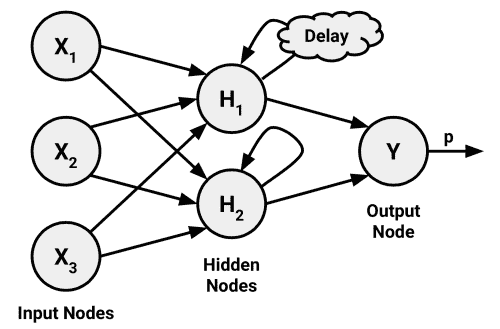

# 第七章：黑箱方法——神经网络与支持向量机

已故科幻作家阿瑟·C·克拉克曾写道：“任何足够先进的技术都无法与魔法区分开。”本章涵盖了一对初看起来像魔法的机器学习方法。尽管它们极其强大，但其内部原理可能难以理解。

在工程学中，这些被称为**黑箱**过程，因为将输入转化为输出的机制被一个虚拟的盒子所遮掩。例如，闭源软件的黑箱故意隐藏专有算法，政治立法的黑箱根植于官僚流程，而香肠制造的黑箱则涉及一些故意的（但美味的）无知。在机器学习的情况下，黑箱则源于其运作所依赖的复杂数学。

虽然它们可能不易理解，但盲目应用黑箱模型是危险的。因此，在本章中，我们将一窥黑箱内部，并调查拟合此类模型所涉及的统计香肠制作过程。你将发现：

+   神经网络模仿动物大脑的结构来模拟任意函数

+   支持向量机使用多维表面来定义特征与结果之间的关系

+   尽管它们的复杂性，依然可以轻松应用于现实世界问题

如果幸运的话，你会意识到，解决黑箱机器学习方法并不需要统计学的黑带——完全没有必要感到畏惧！

# 了解神经网络

**人工神经网络**（**ANN**）使用一种基于我们对生物大脑如何响应来自感官输入的刺激的理解所衍生的模型，来模拟输入信号与输出信号之间的关系。就像大脑通过一组叫做**神经元**的相互连接的细胞构建一个巨大的并行处理器，ANN 则利用一组人工神经元或**节点**来解决学习问题。

人脑由约 850 亿个神经元组成，形成了一个能够表示大量知识的网络。正如你所预料的，这一数量远远超过其他生物的脑量。例如，一只猫大约有 10 亿个神经元，一只老鼠大约有 7500 万个神经元，而一只蟑螂只有大约 100 万个神经元。相比之下，许多 ANN 包含的神经元要少得多，通常只有几百个，因此我们目前离制造人工大脑还远——即便是一个拥有 10 万个神经元的果蝇大脑，也远远超出了现有的最先进 ANN 的能力。

虽然完全模拟一只蟑螂的大脑可能不可行，但神经网络仍然可以提供一个足够的启发式模型来模拟其行为。假设我们开发了一个算法，能够模仿蟑螂在被发现时逃跑的反应。如果机器人蟑螂的行为让人信服，那么它的大脑是否与活体生物一样复杂重要吗？这个问题正是有争议的**图灵测试**的基础。图灵测试由开创性计算机科学家艾伦·图灵于 1950 年提出，旨在通过判断一个人类是否无法将机器的行为与活体生物区分开，来评定机器是否具备智能。

基本的人工神经网络（ANNs）已经被使用超过 50 年，用来模拟大脑解决问题的方法。最初，这包括学习简单的函数，比如逻辑与（AND）函数或逻辑或（OR）函数。这些早期的练习主要是为了帮助科学家理解生物大脑如何运作。然而，随着近年来计算机性能的不断增强，人工神经网络的复杂性也大幅增加，以至于现在它们常常被应用于更实际的问题，包括：

+   语音和手写识别程序，例如语音邮件转录服务和邮政邮件分拣机所使用的技术

+   智能设备的自动化，如办公楼的环境控制、自动驾驶汽车和自驾无人机

+   精密的天气和气候模式、抗拉强度、流体动力学以及许多其他科学、社会或经济现象的模型

广义来说，人工神经网络是多才多艺的学习者，几乎可以应用于任何学习任务：分类、数值预测，甚至是无监督的模式识别。

### 提示

无论是否值得，人工神经网络学习器常常在媒体中被大肆宣传。例如，谷歌最近开发的“*人工大脑*”因其能够识别 YouTube 上的猫视频而受到推崇。这种炒作可能与人工神经网络的独特性关系不大，而更多地与人工神经网络因其与活体思维的相似性而引人入胜有关。

人工神经网络最适用于那些输入数据和输出数据定义明确或至少相对简单，但输入与输出之间的过程极其复杂的问题。作为一种黑箱方法，它们在这类黑箱问题中表现优异。

## 从生物神经元到人工神经元

因为人工神经网络（ANNs）是故意设计为人类大脑活动的概念模型，因此首先理解生物神经元的功能是很有帮助的。如以下图所示，细胞的**树突**通过生化过程接收传入的信号。这个过程使得冲动信号可以根据其相对重要性或频率进行加权。当**细胞体**开始积累传入的信号时，会达到一个阈值，在此阈值下细胞会激发，并通过电化学过程将输出信号沿着**轴突**传递。在轴突的末端，电信号再次被处理为化学信号，并通过一个被称为**突触**的小间隙传递给相邻的神经元。


单个人工神经元的模型可以用非常类似于生物模型的方式理解。如以下图所示，一个有向网络图定义了输入信号（由树突接收的 *x* 变量）和输出信号（*y* 变量）之间的关系。就像生物神经元一样，每个树突的信号根据其重要性被加权（*w* 值）——暂时忽略这些权重是如何确定的。输入信号被细胞体汇总，并根据**激活函数** *f* 传递信号：


一个典型的人工神经元有*n*个输入树突，可以通过以下公式表示。*w* 权重使得每个*n*个输入（用*x[i]*表示）能够对输入信号的总和贡献更多或更少。总和会被激活函数 *f(x)* 使用，结果信号 *y(x)* 就是输出轴突的信号：


神经网络使用这样定义的神经元作为构建块来构建复杂的数据模型。尽管神经网络有许多变种，但每个变种都可以通过以下特征来定义：

+   **激活函数**，它将神经元的综合输入信号转换为一个单一的输出信号，然后将其进一步广播到网络中

+   **网络拓扑**（或架构），它描述了模型中神经元的数量、层数以及它们如何连接的方式

+   **训练算法**，它指定了如何设置连接权重，以便根据输入信号来抑制或激发神经元

让我们看一下每个类别内的一些变化，看看它们如何被用来构建典型的神经网络模型。

## 激活函数

激活函数是人工神经元处理传入信息并将其传递到整个网络的机制。就像人工神经元是基于生物神经元模型的，激活函数也是基于自然界的设计模型的。

在生物学的情况下，激活函数可以被想象为一个过程，涉及将所有输入信号加总并确定是否达到触发阈值。如果是，神经元将传递信号；否则，它什么也不做。在人工神经网络（ANN）术语中，这被称为**阈值激活函数**，因为它只有在达到指定的输入阈值后才会产生输出信号。

以下图显示了一个典型的阈值函数；在这种情况下，当输入信号的总和至少为零时，神经元触发。因为它的形状类似楼梯，有时被称为**单位阶跃激活函数**。


尽管阈值激活函数因其与生物学的相似性而具有趣味性，但在人工神经网络中很少使用。摆脱了生物化学的限制，ANN 的激活函数可以根据它们展示期望的数学特性和准确建模数据之间关系的能力来选择。

或许最常用的替代函数是**sigmoid 激活函数**（更具体来说，是*logistic* sigmoid），如以下图所示。请注意，在公式中，*e*是自然对数的底数（约为 2.72）。尽管它与阈值激活函数共享类似的阶梯或“S”形状，但输出信号不再是二进制的；输出值可以落在 0 到 1 的范围内。此外，sigmoid 是**可微分**的，这意味着可以计算整个输入范围内的导数。如你稍后所学，这一特性对于创建高效的 ANN 优化算法至关重要。


尽管 sigmoid 可能是最常用的激活函数，且通常作为默认选项使用，但一些神经网络算法允许选择其他替代函数。以下图展示了这种激活函数的选择：


区分这些激活函数的主要细节是输出信号的范围。通常，这个范围是（0，1）、（-1，+1）或（-∞，+∞）。激活函数的选择会影响神经网络的偏置，使其能够更适合某些类型的数据，从而构建专门的神经网络。例如，线性激活函数会使神经网络非常类似于线性回归模型，而高斯激活函数则会导致一个称为**径向基函数**（**RBF**）网络的模型。每个模型都有其更适合某些学习任务的优点。

重要的是要认识到，对于许多激活函数来说，影响输出信号的输入值范围相对较窄。例如，在 Sigmoid 函数的情况下，当输入信号低于*-5*或高于*+5*时，输出信号始终接近 0 或 1。这种信号压缩会导致在高低端出现饱和信号，就像将吉他放大器音量调得过高导致声音失真一样，因为音波的峰值被削波。由于这会将输入值压缩到更小的输出范围，像 Sigmoid 这样的激活函数有时被称为**压缩函数**。

解决压缩问题的方法是对所有神经网络输入进行变换，使得特征的值落在接近 0 的一个小范围内。通常，这涉及对特征进行标准化或归一化。通过限制输入值的范围，激活函数将在整个范围内起作用，从而防止像家庭收入这样的高值特征主导像家庭中孩子数量这样的低值特征。一个额外的好处是，模型的训练速度可能更快，因为算法可以更快速地在有效的输入值范围内进行迭代。

### 提示

尽管理论上神经网络可以通过多次迭代调整其权重来适应非常动态的特征，但在极端情况下，许多算法会在此之前停止迭代。如果你的模型预测结果不合理，请仔细检查是否正确标准化了输入数据。

## 网络拓扑

神经网络的学习能力根植于其**拓扑结构**，即互联神经元的模式和结构。尽管网络架构形式多种多样，但它们可以通过三个关键特征来区分：

+   层数

+   网络中的信息是否允许反向传播

+   网络中每一层的节点数量

拓扑结构决定了网络能够学习的任务复杂性。通常，更大且更复杂的网络能够识别更微妙的模式和复杂的决策边界。然而，网络的能力不仅取决于网络的大小，还与单元的排列方式有关。

### 层数

为了定义拓扑结构，我们需要一种术语来区分基于其在网络中位置的人工神经元。接下来的图示例了一个非常简单网络的拓扑结构。一组被称为**输入节点**的神经元直接接收来自输入数据的未处理信号。每个输入节点负责处理数据集中一个单独的特征；该特征的值将通过对应节点的激活函数进行转换。输入节点发送的信号被输出节点接收，输出节点利用自己的激活函数生成最终预测（此处表示为*p*）。

输入节点和输出节点按**层**的形式分组排列。由于输入节点以接收到的数据的原始形式进行处理，因此网络只有一组连接权重（此处标记为*w[1]*，*w[2]*，和*w[3]*）。因此，它被称为**单层网络**。单层网络可以用于基本的模式分类，尤其是对于线性可分的模式，但大多数学习任务需要更复杂的网络。


正如你可能预期的那样，创建更复杂网络的一种明显方法是通过增加额外的层。如图所示，**多层网络**增加了一个或多个**隐藏层**，它们在信号到达输出节点之前处理来自输入节点的信号。大多数多层网络是**全连接**的，这意味着一个层中的每个节点都与下一层中的每个节点相连，但这并不是必须的。


### 信息流动的方向

你可能已经注意到，在之前的例子中，箭头用来表示信号仅朝一个方向流动。那些输入信号从一个连接到另一个连接，持续朝一个方向传输直到到达输出层的网络被称为**前馈网络**。

尽管存在信息流动的限制，前馈网络仍然提供了令人惊讶的灵活性。例如，可以改变每一层的节点数和层数，可以同时建模多个结果，或可以应用多个隐藏层。具有多个隐藏层的神经网络被称为**深度神经网络**（**DNN**），而训练这种网络的实践有时被称为**深度学习**。


相比之下，**递归网络**（或**反馈网络**）允许信号通过循环在两个方向上传播。这一特性，更加接近生物神经网络的工作方式，使得学习极为复杂的模式成为可能。加入短期记忆或**延迟**，极大增强了递归网络的能力。特别是，这使得网络能够理解一段时间内的事件序列。这可以用于股市预测、语音理解或天气预报等应用。一个简单的递归网络如下所示：



尽管具有潜力，递归网络仍然主要是理论性的，实际中很少使用。另一方面，前馈网络已广泛应用于现实问题中。实际上，多层前馈网络，有时被称为**多层感知器**（**MLP**），是事实上的标准人工神经网络拓扑结构。如果有人提到他们正在拟合神经网络，那么他们很可能是在指 MLP。

### 每层的节点数量

除了层数和信息传递方向的变化外，神经网络的复杂性还可以通过每层的节点数量来变化。输入节点的数量由输入数据中的特征数量预先确定。类似地，输出节点的数量由要建模的结果数量或结果中的类别层次数预先确定。然而，隐藏层节点的数量则由用户在训练模型之前决定。

不幸的是，没有可靠的规则来确定隐藏层中的神经元数量。合适的数量取决于输入节点的数量、训练数据的数量、噪声数据的数量以及学习任务的复杂性等许多因素。

一般来说，具有更多网络连接的复杂网络拓扑结构可以学习更复杂的问题。更多的神经元将导致一个更贴近训练数据的模型，但这也带来了过拟合的风险；它可能在未来数据上表现不佳。大型神经网络还可能在计算上非常昂贵，并且训练速度较慢。

最佳做法是使用最少的节点，以在验证数据集上获得足够的性能。在大多数情况下，即使只有少量的隐藏节点——通常只有几个——神经网络也能提供极大的学习能力。

### 提示

已经证明，至少具有一个隐藏层且神经元足够的神经网络是**通用函数逼近器**。这意味着神经网络可以用于在有限区间内，以任意精度逼近任何连续函数。

## 使用反向传播训练神经网络

网络拓扑结构本身是空白的，尚未学习到任何内容。就像一个新生儿，它必须通过经验来训练。当神经网络处理输入数据时，神经元之间的连接会被加强或削弱，类似于婴儿大脑在经历环境时的发育过程。网络的连接权重会根据观察到的模式随时间调整。

通过调整连接权重训练神经网络非常耗费计算资源。因此，尽管人工神经网络（ANNs）在此之前已被研究了几十年，但直到 1980 年代中后期，当一种高效的 ANN 训练方法被发现时，ANN 才被应用于现实世界的学习任务。这种算法通过反向传播误差的策略训练网络，现在通常被称为**反向传播（backpropagation）**。

### 注意

巧合的是，多个研究团队在大致相同的时间独立地发现并发布了反向传播算法。其中，最常被引用的工作之一是：Rumelhart DE, Hinton GE, Williams RJ. 通过反向传播误差学习表示。*自然*杂志，1986 年；323：533-566。

尽管相对于许多其他机器学习算法仍然非常缓慢，反向传播方法却促使了对人工神经网络（ANNs）的重新关注。因此，使用反向传播算法的多层前馈网络现在在数据挖掘领域中非常常见。这些模型具有以下优点和缺点：

| 优势 | 劣势 |
| --- | --- |

|

+   可以适用于分类或数值预测问题

+   能够建模比几乎任何其他算法更复杂的模式

+   对数据的潜在关系假设较少

|

+   计算量极大且训练速度慢，特别是当网络拓扑结构复杂时

+   非常容易导致过拟合训练数据

+   结果是一个复杂的黑箱模型，难以理解，甚至不可能理解。

|

在其最一般的形式中，反向传播算法通过两个过程的多个循环进行迭代。每个循环被称为**一个周期（epoch）**。因为网络不包含任何*先验*（已有的）知识，所以起始权重通常是随机设置的。然后，算法在两个过程中迭代，直到达到停止标准。反向传播算法中的每个周期包括：

+   一个**前向阶段**，在该阶段，神经元从输入层到输出层依次激活，并在过程中应用每个神经元的权重和激活函数。当达到最后一层时，会生成一个输出信号。

+   一个**后向阶段**，在该阶段，网络在前向阶段产生的输出信号与训练数据中的真实目标值进行比较。网络输出信号与真实值之间的差异导致一个误差，该误差向后传播至网络，以修改神经元之间的连接权重，减少未来的误差。

随着时间的推移，网络会利用向后传播的信息来减少网络的总误差。然而，仍然有一个问题：由于每个神经元的输入和输出之间的关系是复杂的，算法如何确定权重应变化多少？这个问题的答案涉及到一个名为**梯度下降**的技术。从概念上讲，它的工作原理类似于被困在丛林中的探险者如何找到通往水源的路径。通过检查地形并不断朝着最大下坡的方向前进，探险者最终会到达最低的山谷，这里很可能就是河床。

在类似的过程中，反向传播算法使用每个神经元激活函数的导数来识别各输入权重方向上的梯度——因此，具有可微分激活函数非常重要。梯度指示了权重变化时，误差会如何陡峭地增加或减少。该算法将尝试通过一个称为**学习率**的量来改变权重，以实现误差的最大减少。学习率越大，算法越快地沿着梯度下降，这可以减少训练时间，但也可能有超越最低点的风险。


尽管这个过程看起来复杂，但在实际应用中却很容易操作。我们将运用对多层前馈网络的理解来解决一个现实问题。

# 示例 – 使用 ANNs 建模混凝土强度

在工程领域，准确估算建筑材料的性能至关重要。这些估算对于制定建筑物、桥梁和道路施工材料的安全指南是必要的。

估算混凝土的强度是一个特别具有挑战性的任务。尽管混凝土几乎在每个建筑项目中都有使用，但其性能因多种不同的成分以及复杂的相互作用而存在很大差异。因此，很难准确预测最终产品的强度。一个能够根据输入材料的组成来可靠预测混凝土强度的模型，可能会导致更安全的建筑实践。

## 第一步 – 收集数据

对于本分析，我们将使用由叶怡诚提供给 UCI 机器学习数据集库的混凝土抗压强度数据（[`archive.ics.uci.edu/ml`](http://archive.ics.uci.edu/ml)）。由于他成功地利用神经网络建模这些数据，我们也将尝试使用简单的神经网络模型在 R 中复制他的工作。

### 注意

欲了解叶氏方法在此学习任务中的应用，请参阅：叶怡诚. 使用人工神经网络建模高性能混凝土的强度. *水泥与混凝土研究*. 1998; 28:1797-1808.

根据网站信息，混凝土数据集包含 1,030 个混凝土样本，这些样本有八个特征，描述了混合物中所用成分的情况。这些特征被认为与最终的抗压强度有关，包含了水泥、矿渣、粉煤灰、水、减水剂、粗骨料和细骨料的数量（单位为千克每立方米），以及养护时间（以天为单位）。

### 提示

要跟随这个示例，请从 Packt Publishing 网站下载`concrete.csv`文件，并将其保存到您的 R 工作目录中。

## 第 2 步 – 探索和准备数据

和往常一样，我们将通过使用`read.csv()`函数将数据加载到 R 对象中，并确认它符合预期的结构：

```py
> concrete <- read.csv("concrete.csv")
> str(concrete)
'data.frame':   1030 obs. of  9 variables:
 $ cement      : num  141 169 250 266 155 ...
 $ slag        : num  212 42.2 0 114 183.4 ...
 $ ash         : num  0 124.3 95.7 0 0 ...
 $ water       : num  204 158 187 228 193 ...
 $ superplastic: num  0 10.8 5.5 0 9.1 0 0 6.4 0 9 ...
 $ coarseagg   : num  972 1081 957 932 1047 ...
 $ fineagg     : num  748 796 861 670 697 ...
 $ age         : int  28 14 28 28 28 90 7 56 28 28 ...
 $ strength    : num  29.9 23.5 29.2 45.9 18.3 ...

```

数据框中的九个变量对应着我们预期的八个特征和一个结果，尽管一个问题已经显现出来。神经网络在输入数据缩放到接近零的狭窄范围时表现最佳，而在这里，我们看到的值从零到一千多不等。

通常，解决这个问题的方法是使用归一化或标准化函数对数据进行重新缩放。如果数据遵循钟形曲线（如第二章，*管理和理解数据*中所描述的正态分布），那么使用 R 的内置`scale()`函数进行标准化可能是有意义的。另一方面，如果数据呈均匀分布或严重偏离正态分布，则可能更适合将数据归一化到 0-1 范围。在这种情况下，我们将使用后者。

在第三章，*懒学习——使用最近邻进行分类*中，我们定义了自己的`normalize()`函数，如下所示：

```py
> normalize <- function(x) {
 return((x - min(x)) / (max(x) - min(x)))
 }

```

执行此代码后，我们的`normalize()`函数可以使用`lapply()`函数应用于混凝土数据框的每一列，如下所示：

```py
> concrete_norm <- as.data.frame(lapply(concrete, normalize))

```

为了确认归一化操作已生效，我们可以看到，最小强度和最大强度现在分别为 0 和 1：

```py
> summary(concrete_norm$strength)
 Min. 1st Qu.  Median    Mean 3rd Qu.    Max. 
 0.0000  0.2664  0.4001  0.4172  0.5457  1.0000

```

相比之下，原始的最小值和最大值分别为 2.33 和 82.60：

```py
> summary(concrete$strength)
 Min. 1st Qu.  Median    Mean 3rd Qu.    Max. 
 2.33   23.71   34.44   35.82   46.14   82.60

```

### 提示

在训练模型之前对数据应用的任何转换，之后都必须逆向应用，以便转换回原始的计量单位。为了方便重新缩放，最好保存原始数据，或者至少保存原始数据的汇总统计信息。

根据 Yeh 在原始出版物中的做法，我们将数据分为训练集和测试集，训练集占 75%的样本，测试集占 25%。我们使用的 CSV 文件已经是随机排序的，因此我们只需要将其分成两部分：

```py
> concrete_train <- concrete_norm[1:773, ]
> concrete_test <- concrete_norm[774:1030, ]

```

我们将使用训练数据集来构建神经网络，并使用测试数据集评估模型如何将结果推广到未来。由于神经网络容易发生过拟合，因此这个步骤非常重要。

## 第三步 – 在数据上训练模型

为了建模混凝土中所用原料与成品强度之间的关系，我们将使用一个多层前馈神经网络。Stefan Fritsch 和 Frauke Guenther 的`neuralnet`包提供了这样网络的标准且易于使用的实现。它还提供了一个函数用于绘制网络拓扑。因此，`neuralnet`的实现是学习神经网络的一个强有力选择，尽管这并不意味着它不能用于完成实际工作——它是一个非常强大的工具，正如你很快会看到的那样。

### 提示

还有几个其他常用的包可以用来训练 R 中的 ANN 模型，每个包都有独特的优缺点。由于它作为 R 标准安装的一部分，`nnet`包可能是引用最多的 ANN 实现。它使用的算法比标准的反向传播算法稍微复杂一些。另一个强大的选择是`RSNNS`包，它提供了完整的神经网络功能，但缺点是它更难学习。

由于`neuralnet`不包含在基础 R 中，你需要通过输入`install.packages("neuralnet")`来安装它，并使用`library(neuralnet)`命令加载它。所包含的`neuralnet()`函数可以用于训练用于数值预测的神经网络，语法如下：


我们将从训练最简单的多层前馈网络开始，只有一个隐藏节点：

```py
> concrete_model <- neuralnet(strength ~ cement + slag + ash + water + superplastic + coarseagg + fineagg + age, data = concrete_train)

```

然后我们可以使用结果模型对象上的`plot()`函数来可视化网络拓扑：

```py
> plot(concrete_model)

```


在这个简单模型中，每个八个特征都有一个输入节点，接着是一个隐藏节点和一个输出节点，输出节点预测混凝土强度。每个连接的权重也被描绘出来，**偏置项**（由标记为**1**的节点表示）也被显示。偏置项是数值常数，它允许指示节点的值上下移动，类似于线性方程中的截距。

### 提示

拥有一个隐藏节点的神经网络可以被看作是我们在第六章中学习的线性回归模型的远亲，*预测数值数据 – 回归方法*。每个输入节点和隐藏节点之间的权重类似于回归系数，而偏置项的权重类似于截距。

在图的底部，R 报告了训练步骤的数量和一个名为**平方误差和**（**SSE**）的误差度量，正如你所预期的那样，它是预测值减去实际值的平方和。较低的 SSE 意味着更好的预测性能。这有助于估计模型在训练数据上的表现，但不能告诉我们它在未见数据上的表现。

## 第 4 步 – 评估模型性能

网络拓扑图为我们提供了一窥人工神经网络黑匣子的视角，但并未提供关于模型如何拟合未来数据的详细信息。要在测试数据集上生成预测，我们可以使用如下的`compute()`函数：

```py
> model_results <- compute(concrete_model, concrete_test[1:8])

```

`compute()`函数的工作方式与我们迄今使用的`predict()`函数有所不同。它返回一个包含两个组件的列表：`$neurons`，用于存储网络中每层的神经元，以及`$net.result`，用于存储预测值。我们将需要后者：

```py
> predicted_strength <- model_results$net.result

```

因为这是一个数值预测问题，而不是分类问题，我们不能使用混淆矩阵来检查模型的准确性。相反，我们必须衡量我们预测的混凝土强度与真实值之间的相关性。这提供了两个变量之间线性关联强度的洞察。

请记住，`cor()`函数用于获取两个数值向量之间的相关性：

```py
> cor(predicted_strength, concrete_test$strength)
 [,1]
[1,] 0.8064655576

```

### 提示

如果你的结果不同，不要惊慌。由于神经网络以随机权重开始，预测结果可能因模型而异。如果你想完全匹配这些结果，请尝试在构建神经网络之前使用`set.seed(12345)`。

接近 1 的相关性表明两个变量之间有很强的线性关系。因此，这里约为 0.806 的相关性表明了相当强的关系。这意味着我们的模型做得相当不错，即使只有一个隐藏节点。

鉴于我们只使用了一个隐藏节点，我们很可能可以提高模型的性能。让我们试着再做得更好一些。

## 第 5 步 – 改进模型性能

鉴于更复杂的拓扑结构的网络能够学习更复杂的概念，让我们看看当我们将隐藏节点数增加到五时会发生什么。我们像之前一样使用`neuralnet()`函数，但添加了`hidden = 5`参数：

```py
> concrete_model2 <- neuralnet(strength ~ cement + slag +
 ash + water + superplastic +
 coarseagg + fineagg + age,
 data = concrete_train, hidden = 5)

```

再次绘制网络，我们看到连接数量大幅增加。我们可以看到这如何影响了性能，如下所示：

```py
> plot(concrete_model2)

```


注意，报告的误差（再次由 SSE 测量）已从前一个模型的 5.08 降至 1.63。此外，训练步骤的数量从 4,882 增加到 86,849，这并不奇怪，因为模型变得更加复杂。更复杂的网络需要更多的迭代来找到最优权重。

应用相同的步骤将预测值与真实值进行比较，我们现在得到的相关性约为 0.92，相比之前单个隐藏节点得到的 0.80，这是一个相当可观的改进：

```py
> model_results2 <- compute(concrete_model2, concrete_test[1:8])
> predicted_strength2 <- model_results2$net.result
> cor(predicted_strength2, concrete_test$strength)
 [,1]
[1,] 0.9244533426

```

有趣的是，在最初的出版物中，Yeh 报告使用一个非常相似的神经网络获得了 0.885 的平均相关性。这意味着，凭借相对较少的努力，我们就能够匹配专家的表现。如果你想更深入地练习神经网络，可能可以尝试应用本章早些时候学到的原理，看看它如何影响模型性能。也许可以尝试使用不同数量的隐藏节点，应用不同的激活函数等等。`?neuralnet`帮助页面提供了更多关于可调参数的信息。

# 理解支持向量机

**支持向量机**（**SVM**）可以被想象为一个表面，它在多维空间中为数据点创建边界，这些数据点代表示例及其特征值。SVM 的目标是创建一个平坦的边界，称为**超平面**，该超平面将空间划分为相对均匀的两侧。通过这种方式，SVM 学习结合了第三章中介绍的基于实例的最近邻学习，*懒惰学习——使用最近邻进行分类*，以及第六章中描述的线性回归建模，*预测数值数据——回归方法*。这种结合极为强大，使 SVM 能够建模高度复杂的关系。

尽管驱动 SVM 的基础数学已经存在几十年，但它们最近爆发式地流行起来。当然，这源于它们的先进性能，但也可能与获奖的 SVM 算法在多个流行且得到良好支持的库中实现有关，涵盖了包括 R 在内的多种编程语言。因此，SVM 被更广泛的用户群体采用，原本这些用户可能无法应用实现 SVM 所需的复杂数学。好消息是，尽管数学可能很困难，但基本概念是可以理解的。

SVM 可以适应几乎任何类型的学习任务，包括分类和数值预测。该算法的许多关键成功案例出现在模式识别中。显著的应用包括：

+   在生物信息学领域，对微阵列基因表达数据进行分类，以识别癌症或其他遗传疾病

+   文本分类，例如识别文档使用的语言或根据主题对文档进行分类

+   检测稀有但重要的事件，如燃烧发动机故障、安全漏洞或地震

SVM 最容易理解当它用于二元分类时，这也是该方法传统应用的方式。因此，在剩余的部分中，我们将仅专注于 SVM 分类器。但不要担心，因为你在这里学到的原则同样适用于将 SVM 适应到其他学习任务，比如数值预测。

## 超平面分类

正如前面所述，SVM 使用一种称为超平面的边界来将数据分成类似类值的群体。例如，下图展示了在二维和三维中分隔圆圈和方块的超平面。因为圆圈和方块可以通过直线或平面完美分开，所以它们被称为**线性可分**。首先，我们将仅考虑这种情况，在其中这是真实的，但 SVM 也可以扩展到数据点不是线性可分的问题。


### 小贴士

为了方便起见，在 2D 空间中，超平面通常被描绘为一条线，但这只是因为在超过两个维度的空间中描绘空间是困难的。实际上，超平面是高维空间中的一个平面——这是一个可能很难理解的概念。

在二维空间中，SVM 算法的任务是识别一个分隔两个类别的直线。如下图所示，在圆圈和方块的群体之间有多种分隔线的选择。这些可能性标记为**a**、**b**和**c**。算法是如何选择的？


那个问题的答案涉及寻找**最大间隔超平面**（MMH），它在两个类别之间创建了最大的分离。虽然分隔圆圈和方块的三条线都可以正确分类所有数据点，但最大间隔的线可能对未来数据的泛化效果最好。最大间隔将提高即使在随机噪声的情况下，点仍然保持在边界的正确一侧的机会。

**支持向量**（在接下来的图中用箭头标出）是每个类别中距离 MMH 最近的点；每个类别必须至少有一个支持向量，但可以有多个。仅使用支持向量，就可以定义 MMH。这是 SVM 的一个关键特征；支持向量提供了一种非常紧凑的方式来存储分类模型，即使特征数量极大。


识别支持向量的算法依赖于向量几何，并涉及一些超出本书范围的相当棘手的数学。然而，该过程的基本原理是相当简单的。

### 注意

有关支持向量机（SVM）数学原理的更多信息，可以参考经典论文：Cortes C, Vapnik V. Support-vector network. *Machine Learning*. 1995; 20:273-297。初学者级别的讨论可以参考：Bennett KP, Campbell C. Support vector machines: hype or hallelujah. SIGKDD Explorations. 2003; 2:1-13。更深入的探讨可以参阅：Steinwart I, Christmann A. *Support Vector Machines*. New York: Springer; 2008。

### 线性可分数据的案例

在假设类别是线性可分的情况下，最容易理解如何找到最大间隔。在这种情况下，最大间隔超平面（MMH）距离两组数据点的外边界尽可能远。这些外边界被称为 **凸包**。最大间隔超平面是两条凸包之间最短线段的垂直平分线。使用一种叫做 **二次优化** 的技术的复杂计算机算法能够通过这种方式找到最大间隔。


另一种（但等效的）方法涉及通过搜索每个可能的超平面空间，以找到一对将数据点分成同质组的平行平面，并且这两个平面之间的距离尽可能远。用一个比喻来说，可以把这个过程想象成在试图找到一个能顺利通过楼梯到卧室的最厚的床垫。

为了理解这个搜索过程，我们需要准确地定义什么是超平面。在 *n* 维空间中，使用以下方程：


如果你不熟悉这种符号，上面字母上的箭头表示它们是向量，而不是单个数字。特别地，*w* 是一个 *n* 维的权重向量，即 *{w[1], w[2], ..., w[n]}*，而 *b* 是一个单一数字，称为 **偏置**。偏置在概念上等同于 第六章 中讨论的斜截式方程中的截距项，*数值数据预测 - 回归方法*。

### 提示

如果你很难想象这个平面，不要担心细节。只需将这个方程视为指定一个表面的方式，就像在二维空间中使用斜截式方程 (*y = mx + b*) 来指定直线一样。

使用这个公式，过程的目标是找到一组权重，指定两个超平面，如下所示：


我们还需要要求这些超平面是按以下方式指定的：使得一个类别的所有点都位于第一个超平面之上，而另一个类别的所有点都位于第二个超平面之下。只要数据是线性可分的，这是可能的。

向量几何定义了这两个平面之间的距离如下：


在这里，*||w||* 表示**欧几里得范数**（即原点到向量 *w* 的距离）。由于 *||w||* 位于分母，为了最大化距离，我们需要最小化 *||w||*。这个任务通常会被重新表达为一组约束条件，如下所示：


虽然这看起来有些混乱，但实际上从概念上理解并不太复杂。基本上，第一行表示我们需要最小化欧几里得范数（平方后除以 2 以简化计算）。第二行表示这是受约束（*s.t.*）的，即每个 *y[i]* 数据点必须被正确分类。请注意，*y* 表示类别值（转化为 +1 或 -1），而倒立的 "A" 是 "对于所有" 的简写。

与寻找最大间隔的另一种方法一样，解决这个问题的任务最好交给二次优化软件。尽管这可能会占用大量处理器资源，但专门的算法能够迅速解决这些问题，即使是在相当大的数据集上。

### 非线性可分数据的情况

在我们分析了 SVM 背后的理论后，你可能会想知道一个问题：如果数据不是线性可分的，会发生什么？解决这个问题的方法是使用**松弛变量**，它创建了一个软间隔，允许一些数据点落在间隔的错误一侧。接下来的图示说明了两个数据点落在直线的错误一侧，并显示了相应的松弛项（用希腊字母 Xi 表示）：


对所有违反约束的点应用一个成本值（记为 *C*），与其寻找最大间隔，算法会尝试最小化总成本。因此，我们可以将优化问题修改为：


如果你仍然感到困惑，不用担心，你不是唯一一个。幸运的是，SVM 软件包会很高兴地为你优化这一过程，而无需你理解技术细节。需要理解的重要部分是**成本参数 C**的引入。修改该值将调整惩罚，例如，数据点落在超平面错误的一侧。成本参数越大，优化过程越会努力实现 100% 的分类准确率。另一方面，较低的成本参数则会将重点放在更宽的整体间隔上。为了创建一个能很好地泛化到未来数据的模型，平衡这两者是非常重要的。

## 使用核函数处理非线性空间

在许多实际应用中，变量之间的关系是非线性的。正如我们刚刚发现的，SVM 仍然可以通过添加松弛变量来训练这类数据，从而允许某些示例被误分类。然而，这并不是处理非线性问题的唯一方式。SVM 的一个关键特点是它们能够使用一种称为 **核技巧** 的过程将问题映射到一个更高维度的空间。在这样做的过程中，非线性关系可能突然变得非常线性。

尽管这看起来像是废话，但实际上通过示例很容易说明。在下图中，左侧的散点图描绘了天气类别（晴天或雪天）与两个特征：纬度和经度之间的非线性关系。图中心的点属于雪天类别，而图边缘的点都是晴天。这些数据可能来自一组天气报告，其中一些来自山顶附近的气象站，另一些则来自山脚下的气象站。


在图的右侧，应用了核技巧后，我们通过一个新维度——海拔高度来观察数据。随着这个特征的加入，类别现在可以完美地线性分开。这之所以可能，是因为我们从一个新的视角来看待数据。在左图中，我们是从鸟瞰视角观察这座山，而在右图中，我们是从地面远处观察这座山。在这里，趋势非常明显：雪天出现在更高的海拔。

使用非线性核的 SVM 通过增加数据的额外维度来创造分离。实际上，核技巧包括构建新特征的过程，这些特征表达了度量特征之间的数学关系。例如，海拔特征可以数学地表达为纬度和经度之间的交互作用——该点离这两个尺度的中心越近，海拔就越高。这使得 SVM 能够学习到原始数据中没有明确度量的概念。

使用非线性核的 SVM 是非常强大的分类器，尽管它们确实有一些缺点，如下表所示：

| 优势 | 弱点 |
| --- | --- |

|

+   可用于分类或数值预测问题

+   不容易受到噪声数据的影响，也不容易发生过拟合

+   可能比神经网络更容易使用，尤其是因为存在多个得到良好支持的 SVM 算法

+   由于其高准确率和在数据挖掘竞赛中的高调获胜，SVM 正在获得越来越多的关注

|

+   寻找最佳模型需要测试不同核函数和模型参数的组合

+   训练可能较慢，特别是当输入数据集具有大量特征或示例时

+   结果是一个复杂的黑箱模型，难以解释，甚至可能无法解释

|

核函数通常具有以下形式。由希腊字母 phi 表示的函数，即 ϕ(x)，是将数据映射到另一个空间。因此，一般的核函数对特征向量 *x[i]* 和 *x[j]* 进行某种变换，并使用 **点积**将它们结合，点积操作将两个向量转换为一个单一的数字。


使用这种形式，已经为许多不同领域的数据开发了核函数。以下列出了几种最常用的核函数。几乎所有的 SVM 软件包都会包含这些核函数及其他许多核函数。

**线性核**完全不对数据进行转换。因此，它可以简单地表示为特征的点积：


**多项式核**的度数为 *d*，对数据进行简单的非线性变换：


**Sigmoid 核**导致的 SVM 模型与使用 sigmoid 激活函数的神经网络有些类似。希腊字母 kappa 和 delta 被用作核参数：


**高斯 RBF 核**类似于 RBF 神经网络。RBF 核在许多类型的数据上表现良好，且被认为是许多学习任务的合理起点：


没有可靠的规则可以将特定的核函数与某个学习任务匹配。匹配程度很大程度上依赖于要学习的概念、训练数据的数量以及特征之间的关系。通常，需要通过在验证数据集上训练和评估多个 SVM 来进行一些试错法。话虽如此，在许多情况下，核函数的选择是任意的，因为性能可能会有所波动。为了实践这种方法，让我们将 SVM 分类应用到一个现实问题中。

# 示例 – 使用 SVM 进行 OCR（光学字符识别）

图像处理是许多类型的机器学习算法面临的困难任务。像素模式与更高层次概念之间的关系极为复杂且难以定义。例如，人类很容易识别出一张脸、一只猫或字母 "A"，但将这些模式定义为严格的规则却十分困难。此外，图像数据往往存在噪声。图像的捕获方式可能因光线、方向和主体位置的不同而有所变化。

支持向量机（SVM）非常适合应对图像数据的挑战。它们能够学习复杂的模式而不对噪声过于敏感，从而能够高精度地识别视觉模式。此外，SVM 的一个关键弱点——黑箱模型表示——对于图像处理的影响较小。如果一个 SVM 能区分猫和狗，那么它是如何做到的就不那么重要了。

在本节中，我们将开发一个类似于**光学字符识别**（**OCR**）软件中核心使用的模型，这类软件通常与桌面文档扫描仪捆绑在一起。此类软件的目的是通过将打印或手写文本转换为电子形式来处理纸质文档，以便保存到数据库中。当然，由于手写风格和打印字体的多样性，这是一个困难的问题。尽管如此，软件用户仍然期望完美，因为错误或错别字可能在商业环境中导致尴尬或代价高昂的错误。让我们看看我们的 SVM 是否能够完成这项任务。

## 步骤 1 – 收集数据

当 OCR 软件首次处理文档时，它会将纸张分割成一个矩阵，使得网格中的每个单元格包含一个单独的**字形**，字形只是指一个字母、符号或数字的术语。接下来，软件将尝试将每个单元格的字形与它识别的所有字符集合进行匹配。最后，单个字符将被重新组合成单词，并且可以选择通过字典对文档语言中的单词进行拼写检查。

在本次练习中，我们假设我们已经开发了算法，将文档划分为每个包含单个字符的矩形区域。我们还假设文档仅包含英文字母字符。因此，我们将模拟一个过程，涉及将字形与 26 个字母（A 到 Z）中的一个进行匹配。

为此，我们将使用 W. Frey 和 D. J. Slate 捐赠给 UCI 机器学习数据集库（[`archive.ics.uci.edu/ml`](http://archive.ics.uci.edu/ml)）的数据集。该数据集包含 20,000 个示例，展示了使用 20 种不同随机形变和失真的黑白字体打印的 26 个英文字母的大写字母。

### 注意

有关此数据集的更多信息，请参考 Slate DJ, Frey W.《使用霍兰德风格适应分类器的字母识别*》。机器学习.* 1991; 6:161-182。

以下图像由 Frey 和 Slate 发布，提供了一些打印字形的示例。这些字形被扭曲后，计算机很难识别，但人类却能轻松识别：


## 步骤 2 – 探索和准备数据

根据 Frey 和 Slate 提供的文档，当字形被扫描到计算机中时，它们会被转换为像素，并记录 16 个统计属性。

这些属性测量了字形的水平和垂直维度、黑色（与白色）像素的比例，以及像素的平均水平和垂直位置。可以推测，字形中黑色像素在不同区域的浓度差异应能提供一种区分 26 个字母的方法。

### 提示

为了跟随这个例子，请从 Packt Publishing 网站下载`letterdata.csv`文件，并将其保存到你的 R 工作目录中。

将数据读入 R 后，我们确认已经接收到包含定义每个字母类别的 16 个特征的数据。正如预期的那样，字母类有 26 个水平：

```py
> letters <- read.csv("letterdata.csv")
> str(letters)
'data.frame':  20000 obs. of 17 variables:
 $ letter: Factor w/ 26 levels "A","B","C","D",..
 $ xbox  : int  2 5 4 7 2 4 4 1 2 11 ...
 $ ybox  : int  8 12 11 11 1 11 2 1 2 15 ...
 $ width : int  3 3 6 6 3 5 5 3 4 13 ...
 $ height: int  5 7 8 6 1 8 4 2 4 9 ...
 $ onpix : int  1 2 6 3 1 3 4 1 2 7 ...
 $ xbar  : int  8 10 10 5 8 8 8 8 10 13 ...
 $ ybar  : int  13 5 6 9 6 8 7 2 6 2 ...
 $ x2bar : int  0 5 2 4 6 6 6 2 2 6 ...
 $ y2bar : int  6 4 6 6 6 9 6 2 6 2 ...
 $ xybar : int  6 13 10 4 6 5 7 8 12 12 ...
 $ x2ybar: int  10 3 3 4 5 6 6 2 4 1 ...
 $ xy2bar: int  8 9 7 10 9 6 6 8 8 9 ...
 $ xedge : int  0 2 3 6 1 0 2 1 1 8 ...
 $ xedgey: int  8 8 7 10 7 8 8 6 6 1 ...
 $ yedge : int  0 4 3 2 5 9 7 2 1 1 ...
 $ yedgex: int  8 10 9 8 10 7 10 7 7 8 ...

```

记住，SVM 学习器要求所有特征都是数值型的，而且每个特征都要缩放到一个相对较小的区间。在这种情况下，每个特征都是整数，因此我们不需要将任何因子转换为数字。另一方面，这些整数变量的某些范围似乎相当宽泛，这表明我们需要对数据进行归一化或标准化。然而，我们现在可以跳过这一步，因为我们将使用的 R 包在拟合 SVM 模型时会自动执行重新缩放。

由于数据准备工作已经基本完成，我们可以直接进入机器学习过程的训练和测试阶段。在之前的分析中，我们随机地将数据分为训练集和测试集。尽管我们可以在这里这样做，但 Frey 和 Slate 已经对数据进行了随机化，因此建议使用前 16,000 条记录（80%）来构建模型，使用接下来的 4,000 条记录（20%）进行测试。根据他们的建议，我们可以按以下方式创建训练和测试数据框：

```py
> letters_train <- letters[1:16000, ]
> letters_test  <- letters[16001:20000, ]

```

数据准备好后，让我们开始构建分类器。

## 步骤 3 – 在数据上训练模型

在 R 中拟合 SVM 模型时，有几个出色的包可供选择。来自维也纳大学（TU Wien）统计学系的`e1071`包提供了一个 R 接口，连接到获奖的 LIBSVM 库，这是一个广泛使用的用 C++编写的开源 SVM 程序。如果你已经熟悉 LIBSVM，你可能希望从这里开始。

### 注意

有关 LIBSVM 的更多信息，请访问作者的官方网站：[`www.csie.ntu.edu.tw/~cjlin/libsvm/`](http://www.csie.ntu.edu.tw/~cjlin/libsvm/)。

同样，如果你已经使用 SVMlight 算法，来自多特蒙德大学（TU Dortmund）统计学系的`klaR`包提供了直接在 R 中使用该 SVM 实现的功能。

### 注意

关于 SVMlight 的信息，可以查看[`svmlight.joachims.org/`](http://svmlight.joachims.org/)。

最后，如果你是从头开始，最好从`kernlab`包中的 SVM 函数开始。这个包的一个有趣的优点是它是原生用 R 开发的，而不是用 C 或 C++，这使得它非常容易自定义；包的内部实现完全透明，不会隐藏任何内容。或许更重要的是，与其他选项不同，`kernlab`可以与`caret`包一起使用，这使得 SVM 模型能够使用各种自动化方法进行训练和评估（在第十一章中有介绍，*提升模型性能*）。

### 注意

如果你想更详细地了解`kernlab`，请参阅作者的论文，地址为[`www.jstatsoft.org/v11/i09/`](http://www.jstatsoft.org/v11/i09/)。

使用`kernlab`训练 SVM 分类器的语法如下。如果你确实使用的是其他包，命令大体是类似的。默认情况下，`ksvm()`函数使用高斯 RBF 核，但也提供了其他多种选项。


为了提供 SVM 性能的基准衡量标准，我们从训练一个简单的线性 SVM 分类器开始。如果你还没有安装，可以通过`install.packages("kernlab")`命令将`kernlab`包安装到你的库中。然后，我们可以在训练数据上调用`ksvm()`函数，并使用`vanilladot`选项指定线性（即基础）核，如下所示：

```py
> library(kernlab)
> letter_classifier <- ksvm(letter ~ ., data = letters_train,
 kernel = "vanilladot")

```

根据你计算机的性能，这个操作可能需要一些时间才能完成。当完成时，输入已存储模型的名称，以查看一些关于训练参数和模型拟合的基本信息。

```py
> letter_classifier
Support Vector Machine object of class "ksvm" 

SV type: C-svc  (classification) 
 parameter : cost C = 1 

Linear (vanilla) kernel function. 

Number of Support Vectors : 7037 

Objective Function Value : -14.1746 -20.0072 -23.5628 -6.2009 -7.5524 -32.7694 -49.9786 -18.1824 -62.1111 -32.7284 -16.2209...

Training error : 0.130062

```

这些信息对我们了解模型在实际应用中的表现几乎没有帮助。我们需要检查它在测试数据集上的表现，才能知道它是否能够很好地推广到未见过的数据。

## 第 4 步 – 评估模型性能

`predict()`函数允许我们使用字母分类模型对测试数据集进行预测：

```py
> letter_predictions <- predict(letter_classifier, letters_test)

```

因为我们没有指定类型参数，所以使用了默认值`type = "response"`。这将返回一个向量，其中包含测试数据中每一行值对应的预测字母。通过使用`head()`函数，我们可以看到前六个预测字母分别是`U`、`N`、`V`、`X`、`N`和`H`：

```py
> head(letter_predictions)
[1] U N V X N H
Levels: A B C D E F G H I J K L M N O P Q R S T U V W X Y Z

```

为了检查我们的分类器表现如何，我们需要将预测的字母与测试数据集中的真实字母进行比较。我们将使用`table()`函数来完成这一任务（这里只显示了完整表格的一部分）：

```py
> table(letter_predictions, letters_test$letter)
letter_predictions   A   B   C   D   E
 A 144   0   0   0   0
 B   0 121   0   5   2
 C   0   0 120   0   4
 D   2   2   0 156   0
 E   0   0   5   0 127

```

`144`、`121`、`120`、`156`和`127`这些对角线上的值表示预测字母与真实值匹配的记录总数。类似地，错误的数量也列出了。例如，`B`行和`D`列中值为`5`表示有 5 个案例将字母`D`错误地识别为`B`。

分别查看每种类型的错误可能会揭示一些关于模型在处理特定字母时遇到的困难的有趣模式，但这需要大量时间。我们可以通过计算整体准确率来简化评估过程。这只考虑预测是否正确，而忽略错误的类型。

以下命令返回一个`TRUE`或`FALSE`值的向量，表示模型预测的字母是否与测试数据集中实际的字母一致（即，是否匹配）：

```py
> agreement <- letter_predictions == letters_test$letter

```

使用`table()`函数，我们看到分类器在 4000 个测试记录中的 3357 个记录上正确识别了字母：

```py
> table(agreement)
agreement
FALSE  TRUE
643 3357

```

按百分比计算，准确率大约为 84%：

```py
> prop.table(table(agreement))
agreement
 FALSE    TRUE
0.16075 0.83925

```

请注意，当 Frey 和 Slate 在 1991 年发布数据集时，他们报告的识别准确率大约为 80%。仅通过几行 R 代码，我们就超越了他们的结果，尽管我们也得到了二十多年额外机器学习研究的好处。考虑到这一点，我们可能能够做得更好。

## 第五步 – 提高模型性能

我们之前的 SVM 模型使用了简单的线性核函数。通过使用更复杂的核函数，我们可以将数据映射到更高维的空间，并可能获得更好的模型拟合。

然而，从众多不同的核函数中选择合适的一个可能是具有挑战性的。一种常见的做法是从高斯 RBF 核开始，因为它已被证明在许多类型的数据上表现良好。我们可以像这样使用`ksvm()`函数训练基于 RBF 的 SVM：

```py
> letter_classifier_rbf <- ksvm(letter ~ ., data = letters_train,
 kernel = "rbfdot")

```

接下来，我们像之前一样进行预测：

```py
> letter_predictions_rbf <- predict(letter_classifier_rbf,
 letters_test)

```

最后，我们将与线性 SVM 的准确率进行比较：

```py
> agreement_rbf <- letter_predictions_rbf == letters_test$letter
> table(agreement_rbf)
agreement_rbf
FALSE  TRUE

  275  3725
> prop.table(table(agreement_rbf))
agreement_rbf
 FALSE    TRUE
0.06875 0.93125

```

### 提示

由于`ksvm` RBF 核函数的随机性，你的结果可能与这里展示的有所不同。如果你希望它们完全匹配，可以在运行 ksvm()函数之前使用`set.seed(12345)`。

通过简单地更改核函数，我们成功将字符识别模型的准确率从 84%提高到了 93%。如果 OCR 程序的表现仍然不令人满意，可以尝试其他核函数，或者调整约束参数 C 的成本，以修改决策边界的宽度。作为练习，你应该尝试这些参数，看看它们如何影响最终模型的成功。

# 总结

在本章中，我们考察了两种机器学习方法，它们具有巨大的潜力，但由于复杂性经常被忽视。希望你现在能看到，这种声誉至少在某种程度上是不公平的。驱动 ANNs 和 SVM 的基本概念相当容易理解。

另一方面，由于人工神经网络（ANNs）和支持向量机（SVMs）已经存在了几十年，每种方法都有许多变种。本章只是简单介绍了这些方法可能实现的部分内容。通过运用你在这里学到的术语，你应该能够掌握那些每天都在发展的各种进展之间的细微差别。

现在我们已经花了一些时间学习了从简单到复杂的多种预测模型；在下一章，我们将开始考虑其他类型学习任务的方法。这些无监督学习技术将揭示数据中的迷人模式。
