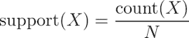

# 第八章：发现模式—使用关联规则进行市场篮子分析

回想一下你上一次冲动购买的经历。也许你在超市结账时买了一包口香糖或一块巧克力棒。也许你在深夜去买尿布和奶粉时顺便拿了一瓶含咖啡因的饮料或一六瓶啤酒。你可能甚至是在书店推荐下冲动地买了这本书。这些冲动购买可不是偶然的，零售商通过使用复杂的数据分析技术来识别那些能够驱动零售行为的模式。

在过去的几年里，这种推荐系统主要依赖于营销专业人员和库存经理或采购员的主观直觉。近年来，随着条形码扫描仪、计算机化库存系统和在线购物趋势积累了大量的交易数据，机器学习被越来越多地应用于学习购买模式。由于这种技术经常应用于超市数据，因此这一实践通常被称为**市场篮子分析**。

尽管该技术起源于购物数据，但它在其他背景下也同样有用。当你读完这一章时，你将能够将市场篮子分析技术应用到你自己的任务中，无论这些任务是什么。一般而言，这项工作包括：

+   使用简单的性能指标在大型数据库中寻找关联

+   理解交易数据的特殊性

+   知道如何识别有用且可操作的模式

市场篮子分析的结果是可操作的模式。因此，当我们应用这项技术时，即使你与零售链没有任何关联，也很可能会识别出对你的工作有用的应用。

# 理解关联规则

市场篮子分析的基本构件是可能出现在任何给定交易中的商品。一个或多个商品组成的组被括号括起来，表示它们形成了一个集合，或者更具体地说，是一个在数据中有规律出现的**项集**。交易是通过项集来指定的，例如在典型的杂货店中可能找到的以下交易：


市场篮子分析的结果是一组**关联规则**，这些规则指定了在商品项集之间的关系中发现的模式。关联规则总是由项集的子集组成，并通过将规则的左侧（LHS）中的一个项集与右侧（RHS）中的另一个项集联系起来来表示。LHS 是需要满足的条件，以触发规则，而 RHS 是满足该条件后预期的结果。一个从示例交易中识别出的规则可以表示为：


用简单的话来说，这个关联规则表示，如果花生酱和果冻一起购买，那么面包也很可能会被购买。换句话说，“花生酱和果冻意味着面包。”

在零售交易数据库的背景下，关联规则不是用来进行预测，而是用于在大型数据库中进行无监督的知识发现。这与前几章介绍的分类和数值预测算法不同。尽管如此，你会发现关联规则学习器与第五章中的分类规则学习器紧密相关，并共享许多相同的特征，*分而治之——使用决策树和规则进行分类*。

由于关联规则学习器是无监督的，因此算法无需进行训练；数据无需提前标注。程序只是被释放到数据集上，希望能够发现有趣的关联。当然，缺点是，除了通过定性有用性评估规则学习器外，没有简单的方法来客观衡量其性能——通常需要某种形式的人工检查。

虽然关联规则最常用于市场篮分析，但它们在发现多种不同类型数据的模式中也很有帮助。其他潜在应用包括：

+   在癌症数据中搜索有趣且频繁出现的 DNA 和蛋白质序列模式

+   寻找与信用卡或保险欺诈使用相关联的购买模式或医疗索赔模式

+   识别导致客户取消手机服务或升级有线电视套餐的行为组合

关联规则分析用于在大量元素中搜索有趣的关联。人类能够凭直觉进行这样的洞察，但通常需要专家级的知识或大量经验，才能完成规则学习算法在几分钟甚至几秒钟内就能完成的任务。此外，一些数据集对于人类来说过于庞大和复杂，难以从中找到“针尖”。

## 关联规则学习的 Apriori 算法

正如人类感到具有挑战性一样，交易数据使得关联规则挖掘对于机器来说也是一项挑战。交易数据集通常非常庞大，无论是交易数量还是监控的商品或特征数量都很庞大。问题在于，潜在项集的数量随着特征数量的增加呈指数级增长。假设有*k*个商品可能会出现在集合中或不出现在集合中，那么有*2^k*个潜在的项集可能成为规则。一个只卖 100 种商品的零售商，可能需要评估大约*2¹⁰⁰ = 1.27e+30*个项集——这看似是不可能完成的任务。

与其逐一评估这些项集，不如利用更智能的规则学习算法，利用许多潜在的商品组合在实践中很少出现这一事实。例如，即使商店同时出售汽车配件和女性化妆品，*{机油, 口红}*这种组合也可能极其不常见。通过忽略这些稀有（而且可能不太重要）组合，可以将规则搜索的范围限制到一个更易管理的大小。

已经做了大量工作来识别启发式算法，以减少需要搜索的项集数量。也许最广泛使用的高效搜索大数据库中规则的方法是**Apriori**算法。该算法由 Rakesh Agrawal 和 Ramakrishnan Srikant 于 1994 年提出，此后已成为关联规则学习的代名词。其名称来源于该算法利用一种简单的先验信念（即*a priori*）关于频繁项集的属性。

在我们深入讨论之前，值得注意的是，这种算法与所有学习算法一样，并非没有优缺点。以下是其中的一些优缺点：

| 优势 | 劣势 |
| --- | --- |

|

+   能够处理大量的交易数据

+   产生易于理解的规则

+   有助于“数据挖掘”和发现数据库中的意外知识

|

+   对于小型数据集不太有用

+   需要努力将真正的洞察力与常识区分开

+   容易从随机模式中得出虚假的结论

|

如前所述，Apriori 算法通过简单的*a priori*信念来减少关联规则搜索空间：频繁项集的所有子集也必须是频繁的。这一启发式方法被称为**Apriori 属性**。利用这一精明的观察，我们可以大幅限制需要搜索的规则数量。例如，*{机油, 口红}*集只有在*{机油}*和*{口红}*都频繁出现时，才能是频繁的。因此，如果机油或口红出现频率较低，那么包含这些物品的任何集合都可以从搜索中排除。

### 注意

如需了解 Apriori 算法的更多细节，请参阅：Agrawal R, Srikant R. 快速挖掘关联规则的算法。*第 20 届国际大型数据库会议论文集*，1994:487-499。

为了了解这一原则如何应用于更现实的场景，让我们考虑一个简单的交易数据库。下表显示了一个假想医院礼品店的五笔已完成交易：

| 交易编号 | 购买的物品 |
| --- | --- |
| 1 | *{花, 康复卡片, 苏打水}* |
| 2 | *{毛绒玩具熊, 花, 气球, 巧克力棒}* |
| 3 | *{康复卡片, 巧克力棒, 花}* |
| 4 | *{毛绒玩具熊, 气球, 苏打水}* |
| 5 | *{花, 康复卡片, 苏打水}* |

通过查看购买集，可以推断出一些典型的购买模式。拜访生病的朋友或家人时，人们往往会购买一张祝早日康复的卡片和鲜花，而拜访新妈妈的人则倾向于购买毛绒玩具熊和气球。这些模式之所以引人注目，是因为它们频繁出现，足以引起我们的兴趣；我们只需运用一些逻辑和专业经验来解释这些规则。

类似地，Apriori 算法通过使用项集“有趣性”的统计度量来定位更大事务数据库中的关联规则。在接下来的章节中，我们将探讨 Apriori 如何计算这些有趣性的度量，以及如何将它们与 Apriori 属性结合起来，以减少需要学习的规则数量。

## 衡量规则兴趣 – 支持度与置信度

是否将某个关联规则视为有趣，取决于两个统计度量：支持度和置信度。通过为每个度量提供最小阈值，并应用 Apriori 原则，可以轻松地大幅度限制报告的规则数量，甚至可能只识别出显而易见或常识性的规则。因此，重要的是要仔细理解在这些标准下被排除的规则类型。

项集或规则的**支持度**衡量它在数据中出现的频率。例如，项集 *{祝早日康复的卡片，鲜花}* 在医院礼品店数据中的支持度为 *3 / 5 = 0.6*。类似地，*{祝早日康复的卡片} → {鲜花}* 的支持度也是 0.6。支持度可以计算任何项集，甚至是单一项；例如，*{糖果棒}* 的支持度为 *2 / 5 = 0.4*，因为糖果棒出现在 40% 的购买中。定义项集 *X* 的支持度的函数可以如下定义：



这里，*N* 是数据库中事务的数量，而 *count(X)* 是包含项集 *X* 的事务数量。

一条规则的**置信度**是其预测能力或准确度的度量。它被定义为包含 *X* 和 *Y* 的项集的支持度除以仅包含 *X* 的项集的支持度：


本质上，置信度告诉我们，在多少比例的交易中，物品或项集 *X* 的存在导致了物品或项集 *Y* 的存在。记住，*X* 导致 *Y* 的置信度和 *Y* 导致 *X* 的置信度是不同的。例如，*{鲜花} → {祝贺卡}* 的置信度是 *0.6 / 0.8 = 0.75*。相比之下，*{祝贺卡} → {鲜花}* 的置信度是 *0.6 / 0.6 = 1.0*。这意味着购买鲜花的交易有 75% 的可能性会同时购买祝贺卡，而购买祝贺卡的交易则有 100% 的可能性会购买鲜花。这些信息对于礼品店管理层非常有用。

### 提示

你可能已经注意到支持度、置信度和贝叶斯概率规则之间的相似性，这些内容在第四章，*概率学习——使用朴素贝叶斯分类*中有提到。事实上，*support(A, B)* 就是 *P(A∩B)*，而 *confidence(A → B)* 就是 *P(B|A)*。只是上下文不同。

类似 *{祝贺卡} → {鲜花}* 的规则被称为**强规则**，因为它们具有较高的支持度和置信度。找到更多强规则的一种方法是检查礼品店中每一对物品的所有可能组合，衡量支持度和置信度的值，然后仅报告那些符合特定兴趣水平的规则。然而，如前所述，这种策略通常只适用于最小的数据集。

在下一部分中，你将看到 Apriori 算法如何利用最小支持度和置信度水平，并结合 Apriori 原则，通过减少规则数量到一个更易管理的水平，快速找到强规则。

## 使用 Apriori 原则构建规则集

回忆一下，Apriori 原则指出，频繁项集的所有子集也必须是频繁的。换句话说，如果 *{A, B}* 是频繁的，那么 *{A}* 和 *{B}* 都必须是频繁的。还要记住，根据定义，支持度表示项集在数据中出现的频率。因此，如果我们知道 *{A}* 未达到所需的支持度阈值，那么就没有理由考虑 *{A, B}* 或任何包含 *{A}* 的项集；它不可能是频繁的。

Apriori 算法利用这种逻辑，在实际评估潜在的关联规则之前，先排除不可能的规则。创建规则的实际过程分为两个阶段：

1.  确定所有满足最小支持度阈值的项集。

1.  使用满足最小置信度阈值的项集来创建规则。

第一个阶段在多个迭代中进行。每次迭代都涉及评估一组越来越大的项集的支持度。例如，第一次迭代评估 1 项项集（1-itemsets），第二次迭代评估 2 项项集，以此类推。每次迭代*i*的结果是满足最低支持度阈值的所有*i*-项集的集合。

第*i*次迭代中的所有项集将被合并，以生成第*i + 1*次迭代的候选项集进行评估。但是，Apriori 原理甚至可以在下一轮开始之前就排除其中的一些项集。如果在第一次迭代中*{A}*、*{B}*和*{C}*是频繁项集，而*{D}*不是，那么第二次迭代将只考虑*{A, B}*、*{A, C}*和*{B, C}*。因此，算法只需要评估三个项集，而不是评估包含*D*的六个项集，如果没有通过*先验*排除这些项集的话。

继续这个思路，假设在第二次迭代中，发现*{A, B}*和*{B, C}*是频繁项集，但*{A, C}*不是。尽管第三次迭代通常会通过评估*{A, B, C}*的支持度来开始，但并不强制要求这一步一定发生。为什么不呢？Apriori 原理指出，由于子集*{A, C}*不是频繁的，*{A, B, C}*不可能是频繁项集。因此，在第三次迭代中没有生成新的项集，算法可能会停止。

此时，Apriori 算法的第二阶段可以开始。给定频繁项集的集合，从所有可能的子集生成关联规则。例如，*{A, B}*将生成*{A} → {B}*和*{B} → {A}*的候选规则。这些规则将根据最低置信度阈值进行评估，任何不满足所需置信度水平的规则都会被淘汰。

# 示例 – 使用关联规则识别常购商品

如本章介绍所述，市场篮子分析在许多实体店和在线零售商的推荐系统背后默默发挥着作用。通过学习得到的关联规则能够指示出经常一起购买的商品组合。了解这些模式为杂货连锁店提供了新的洞察力，帮助优化库存、进行促销广告或组织商店的物理布局。例如，如果顾客经常购买咖啡或橙汁与早餐点心一起食用，那么通过将点心移近咖啡和橙汁的位置，可能会提高利润。

在本教程中，我们将对来自一家杂货店的交易数据进行市场篮子分析。然而，这些技术可以应用于许多不同类型的问题，从电影推荐到约会网站，再到寻找药物之间的危险相互作用。在这个过程中，我们将看到 Apriori 算法如何高效地评估一个潜在的庞大的关联规则集。

## 第一步 – 收集数据

我们的市场篮分析将利用来自一家现实世界杂货店运营一个月的购买数据。数据包含 9,835 笔交易，约合每天 327 笔交易（在一个 12 小时的营业日中大约 30 笔交易），表明该零售商规模既不特别大，也不特别小。

### 注意

这里使用的数据集改编自`arules` R 包中的`Groceries`数据集。有关更多信息，请参见：Hahsler M, Hornik K, Reutterer T. 概率数据建模对挖掘关联规则的影响。载：Gaul W, Vichi M, Weihs C, ed. *分类学、数据分析与知识组织研究：从数据与信息分析到知识工程*。纽约：Springer; 2006:598–605。

一般的杂货店提供种类繁多的商品。可能会有五种不同品牌的牛奶、十几种不同类型的洗衣粉和三种品牌的咖啡。鉴于零售商的规模适中，我们假设他们并不太关心寻找只适用于某一特定品牌牛奶或洗衣粉的规则。考虑到这一点，可以从购买数据中去除所有品牌名称。这样，商品种类减少为 169 种，更易于管理，涵盖了鸡肉、冷冻餐、玛琪琳和苏打水等广泛类别。

### 提示

如果你希望识别非常具体的关联规则——例如，客户是否喜欢将葡萄酒或草莓果酱与花生酱搭配——你将需要大量的事务数据。大型连锁零售商使用数百万笔交易的数据库来发现特定品牌、颜色或口味的物品之间的关联。

你有什么猜测关于哪些类型的物品可能会一起购买吗？葡萄酒和奶酪会是常见的搭配吗？面包和黄油？茶和蜂蜜？让我们深入分析这些数据，看看是否能确认我们的猜测。

## 第 2 步——探索与准备数据

事务数据以与我们之前使用的格式略有不同的方式存储。我们以前的大多数分析使用的是矩阵形式的数据，其中行表示示例实例，列表示特征。由于矩阵格式的结构，所有示例都必须具有完全相同的特征集。

相比之下，事务数据的形式更加自由。像往常一样，数据中的每一行表示一个单独的示例——在这种情况下，是一次交易。然而，与其有固定数量的特征，每条记录由一个用逗号分隔的物品列表组成，数量从一个到多个不等。实质上，特征可能会因示例而异。

### 提示

为了跟随本次分析，请从 Packt Publishing 网站下载`groceries.csv`文件，并将其保存在你的 R 工作目录中。

`grocery.csv` 文件的前五行如下：

```py
citrus fruit,semi-finished bread,margarine,ready soups
tropical fruit,yogurt,coffee
whole milk
pip fruit,yogurt,cream cheese,meat spreads
other vegetables,whole milk,condensed milk,long life bakery product
```

这些行表示五个独立的杂货店交易。第一次交易包含了四个项目：柑橘类水果、半成品面包、玛格丽琳和即食汤。相比之下，第三次交易仅包含一个项目：全脂牛奶。

假设我们像之前的分析那样，尝试使用 `read.csv()` 函数加载数据。R 会欣然执行，并将数据读取成如下的矩阵形式：


你会注意到，R 创建了四列来存储事务数据中的项目：`V1`、`V2`、`V3` 和 `V4`。虽然这看起来合情合理，但如果我们使用这种格式的数据，后续会遇到问题。R 选择创建四个变量是因为第一行恰好有四个用逗号分隔的值。然而，我们知道，杂货购买可能包含超过四个项目；在四列设计中，这样的交易会被拆分到矩阵中的多行。我们可以尝试通过将包含最多项目的交易放在文件的顶部来解决这个问题，但这忽略了另一个更为棘手的问题。

通过这种方式构建数据，R 创建了一组特征，不仅记录了交易中的商品，还记录了它们出现的顺序。如果我们把学习算法想象成是在尝试找出 `V1`、`V2`、`V3` 和 `V4` 之间的关系，那么 `V1` 中的全脂牛奶可能会与 `V2` 中的全脂牛奶有所不同。相反，我们需要的是一个数据集，它不会把一笔交易视为一组需要填写（或不填写）特定商品的位置，而是将其视为一个市场购物篮，里面包含或不包含每一个特定商品。

### 数据准备 – 为事务数据创建稀疏矩阵

解决这个问题的方法是使用一种名为 **稀疏矩阵** 的数据结构。你可能还记得，我们在第四章中，*概率学习 – 使用朴素贝叶斯分类*，使用了稀疏矩阵来处理文本数据。和前面的数据集一样，稀疏矩阵中的每一行表示一次交易。然而，稀疏矩阵为每个可能出现在某人购物袋中的商品提供了一个列（即特征）。由于我们的杂货店数据中有 169 种不同的商品，所以我们的稀疏矩阵将包含 169 列。

为什么不直接像我们在大多数分析中那样将其存储为数据框（data frame）呢？原因是随着更多的交易和商品被添加，传统的数据结构很快会变得太大，无法适应可用的内存。即使是这里使用的相对较小的交易数据集，矩阵也包含近 170 万个单元格，其中大多数是零（因此称为“稀疏”矩阵——非零值非常少）。由于存储所有这些零值没有任何意义，稀疏矩阵实际上并不会将整个矩阵存储在内存中；它只存储那些由项目占用的单元格。这使得该结构比同等大小的矩阵或数据框更节省内存。

为了从交易数据中创建稀疏矩阵数据结构，我们可以使用`arules`包提供的功能。通过执行`install.packages("arules")`和`library(arules)`命令来安装和加载该包。

### 注意

欲了解更多有关 arules 包的信息，请参考：Hahsler M, Gruen B, Hornik K. arules – a computational environment for mining association rules and frequent item sets. *Journal of Statistical Software. 2005; 14*。

由于我们正在加载交易数据，不能简单地使用之前的`read.csv()`函数。相反，`arules`提供了一个`read.transactions()`函数，类似于`read.csv()`，但其结果是适用于交易数据的稀疏矩阵。`sep = ","`参数指定输入文件中的项目由逗号分隔。要将`groceries.csv`数据读入名为`groceries`的稀疏矩阵，输入以下代码：

```py
> groceries <- read.transactions("groceries.csv", sep = ",")

```

要查看我们刚刚创建的`groceries`矩阵的基本信息，可以对该对象使用`summary()`函数：

```py
> summary(groceries)
transactions as itemMatrix in sparse format with
 9835 rows (elements/itemsets/transactions) and
 169 columns (items) and a density of 0.02609146

```

输出中的第一部分信息（如前所示）提供了我们创建的稀疏矩阵的摘要。输出中的`9835 rows`表示交易的数量，`169 columns`表示可能出现在购物篮中的 169 个不同商品。矩阵中的每个单元格，如果相应的交易中购买了该商品，则为`1`，否则为`0`。

`0.02609146`（2.6%）的**密度**值表示矩阵中非零单元格的比例。由于矩阵中共有*9,835 * 169 = 1,662,115*个位置，我们可以计算出在商店的 30 天运营期间，共购买了*1,662,115 * 0.02609146 = 43,367*个商品（忽略了同一商品可能重复购买的情况）。通过额外的步骤，我们可以确定平均每笔交易包含了*43,367 / 8,835 = 4.409*个不同的杂货商品。当然，如果我们进一步查看输出结果，会看到每笔交易的商品平均数已经在输出中给出。

`summary()`输出的下一个区块列出了在交易数据中最常见的项目。由于*2,513 / 9,835 = 0.2555*，我们可以确定全脂牛奶出现在 25.6％的交易中。其他常见的项目包括其他蔬菜、卷/小圆面包、汽水和酸奶，具体如下：

```py
most frequent items:
 whole milk other vegetables       rolls/buns
 2513             1903             1809
 soda           yogurt          (Other)
 1715             1372            34055

```

最后，我们展示了一组关于交易大小的统计信息。共有 2,159 个交易仅包含单一项目，而有一个交易包含 32 个项目。第一四分位数和中位数购买大小分别为 2 和 3 个项目，这意味着 25％的交易包含两个或更少的项目，并且交易在包含少于三个项目的和包含更多项目的交易之间平均分配。每个交易 4.409 个项目的平均值与我们手动计算的结果一致。

```py
element (itemset/transaction) length distribution:
sizes
 1    2    3    4    5    6    7    8    9   10   11   12
2159 1643 1299 1005  855  645  545  438  350  246  182  117
 13   14   15   16   17   18   19   20   21   22   23   24
 78   77   55   46   29   14   14    9   11    4    6    1
 26   27   28   29   32
 1    1    1    3    1

 Min. 1st Qu.  Median    Mean 3rd Qu.    Max.
 1.000   2.000   3.000   4.409   6.000  32.000

```

`arules`包包含一些有用的功能，用于检查交易数据。要查看稀疏矩阵的内容，请将`inspect()`函数与向量操作符结合使用。可以按如下方式查看前五个交易：

```py
> inspect(groceries[1:5])
 items 
1 {citrus fruit, 
 margarine, 
 ready soups, 
 semi-finished bread} 
2 {coffee, 
 tropical fruit, 
 yogurt} 
3 {whole milk} 
4 {cream cheese, 
 meat spreads, 
 pip fruit, 
 yogurt} 
5 {condensed milk, 
 long life bakery product,
 other vegetables, 
 whole milk}

```

这些交易与我们查看原始 CSV 文件时的数据一致。要检查特定的项目（即一列数据），可以使用`[row, column]`矩阵概念。将其与`itemFrequency()`函数结合使用，可以查看包含该项目的交易比例。例如，这使我们能够查看`groceries`数据中前 3 个项目的支持度：

```py
> itemFrequency(groceries[, 1:3])
abrasive cleaner artif. sweetener   baby cosmetics
 0.0035587189     0.0032536858     0.0006100661

```

请注意，稀疏矩阵中的项目按字母顺序按列排序。磨砂清洁剂和人工甜味剂出现在大约 0.3％的交易中，而婴儿化妆品出现在大约 0.06％的交易中。

### 可视化项目支持度 - 项目频率图

为了直观展示这些统计信息，可以使用`itemFrequencyPlot()`函数。这允许你生成一张条形图，显示包含特定项目的交易比例。由于交易数据包含大量项目，你通常需要限制显示在图表中的项目，以便生成清晰的图表。

如果你希望这些项目出现在交易的最低比例中，可以使用带有`support`参数的`itemFrequencyPlot()`：

```py
> itemFrequencyPlot(groceries, support = 0.1)

```

如下图所示，这导致了一个显示`groceries`数据中至少有 10％支持度的八个项目的直方图：


如果你希望限制图表中的项目数量，可以使用带有`topN`参数的`itemFrequencyPlot()`：

```py
> itemFrequencyPlot(groceries, topN = 20)

```

然后，直方图按支持度递减排序，如下图所示，展示了`groceries`数据中的前 20 个项目：


### 可视化交易数据 - 绘制稀疏矩阵

除了查看商品外，还可以可视化整个稀疏矩阵。为此，请使用`image()`函数。显示前五笔交易的稀疏矩阵的命令如下：

```py
> image(groceries[1:5])

```

结果图表描绘了一个包含 5 行和 169 列的矩阵，表示我们请求的 5 笔交易和 169 个可能的商品。矩阵中的单元格用黑色填充，表示在某笔交易（行）中购买了某个商品（列）。


尽管前面的图表较小且可能略显难以阅读，但你可以看到第一、第四和第五行的交易每行都包含四个项目，因为它们的行中有四个单元格被填充。你还可以看到第三、第五、第二和第四行在右侧图表中有一个共同的项目。

这种可视化可以成为探索数据的有用工具。首先，它可能有助于识别潜在的数据问题。完全填充的列可能表明在每一笔交易中都有购买某个商品——这可能是一个问题，例如，如果零售商的名称或识别号不小心包含在交易数据集中。

此外，图表中的模式可能有助于揭示交易和商品中的可操作见解，尤其是当数据以有趣的方式排序时。例如，如果交易按日期排序，黑色点的模式可能揭示购买的商品数量或类型的季节性变化。或许在圣诞节或光明节时，玩具更为常见；而在万圣节时，糖果可能变得受欢迎。如果商品也被分类，这种可视化可能尤其强大。然而，在大多数情况下，图表看起来将相当随机，就像电视屏幕上的雪花。

请记住，这种可视化对于极大的交易数据库来说并不那么有用，因为单元格会小到难以辨认。尽管如此，通过将其与`sample()`函数结合使用，你可以查看一个随机抽样的交易集的稀疏矩阵。创建 100 笔交易随机选择的命令如下：

```py
> image(sample(groceries, 100))

```

这将生成一个有 100 行和 169 列的矩阵图：


一些列看起来填充得相当密集，表明商店里有一些非常受欢迎的商品。但总体来说，点的分布似乎相当随机。既然没有其他值得注意的内容，我们继续进行分析。

## 步骤 3 – 在数据上训练模型

数据准备完成后，我们现在可以开始寻找购物车物品之间的关联了。我们将使用`arules`包中的 Apriori 算法实现，这个包我们之前已经用来探索和准备杂货数据。如果你还没有安装和加载这个包，记得先操作。以下表格显示了使用`apriori()`函数创建规则集的语法：


尽管运行`apriori()`函数非常直接，但有时可能需要一定的试错过程来找到产生合理数量关联规则的`support`和`confidence`参数。如果你设定这些值过高，你可能找不到规则，或者找到的规则过于宽泛，无法提供实际价值。另一方面，阈值设定得过低可能会导致规则数量过多，甚至更糟，可能会导致学习阶段运行时间过长或内存不足。

在这种情况下，如果我们尝试使用默认设置`support = 0.1`和`confidence = 0.8`，最终将得到一组零规则：

```py
> apriori(groceries)
set of 0 rules

```

显然，我们需要稍微扩大一下搜索范围。

### 提示

如果你仔细想一想，这个结果其实并不令人惊讶。因为`support = 0.1`是默认设置，要生成规则，一个项必须至少出现在*0.1 * 9,385 = 938.5*次交易中。由于在我们的数据中只有八个项出现得如此频繁，因此我们没能找到任何规则也就不足为奇了。

设定最小支持度阈值的一种方法是思考在什么样的最小交易数下，你会认为一个模式是有趣的。例如，你可以认为，如果某个项每天被购买两次（在一个月的数据中大约是 60 次），它可能是一个有趣的模式。从这里开始，你可以计算出需要的支持度水平，以便仅找到匹配至少那么多次交易的规则。由于 60/9,835 等于 0.006，我们首先尝试将支持度设为这个值。

设置最小置信度是一个微妙的平衡。一方面，如果置信度太低，我们可能会被大量不可靠的规则所淹没——例如，几十个规则显示电池通常会与其他物品一起购买。那么，我们怎么知道该将广告预算投向哪里呢？另一方面，如果我们将置信度设定得过高，那么规则将仅限于那些显而易见或不可避免的情况——类似于烟雾探测器总是与电池一起购买的事实。在这种情况下，将烟雾探测器放得更靠近电池可能不会带来额外的收益，因为这两种物品已经几乎总是一起购买了。

### 提示

适当的最小置信度水平在很大程度上取决于你分析的目标。如果你从保守的值开始，若未找到可操作的情报，你总是可以减少置信度，扩大搜索范围。

我们将从 0.25 的置信度阈值开始，这意味着为了被包括在结果中，规则必须至少正确 25% 的时间。这将剔除最不可靠的规则，同时为我们通过有针对性的促销调整行为提供一定的空间。

我们现在可以生成一些规则。除了最小的 `support` 和 `confidence` 参数外，设置 `minlen = 2` 也很有帮助，以排除那些包含少于两个项目的规则。这可以防止一些无趣的规则被创建，比如仅因为某个项目购买频繁而生成的规则，如 *{}* *→* *whole milk*。这条规则符合最小支持度和置信度，因为全脂牛奶在超过 25% 的交易中被购买，但它并不是一个非常有行动价值的洞察。

使用 Apriori 算法查找关联规则的完整命令如下：

```py
> groceryrules <- apriori(groceries, parameter = list(support =
 0.006, confidence = 0.25, minlen = 2))

```

这将我们的规则保存在 `rules` 对象中，可以通过键入其名称来查看：

```py
> groceryrules
set of 463 rules

```

我们的 `groceryrules` 对象包含了一组 463 条关联规则。为了确定它们是否有用，我们需要深入挖掘。

## 步骤 4 – 评估模型性能

为了获得关联规则的高层概览，我们可以按如下方式使用 `summary()`。规则长度分布告诉我们每条规则包含的项目数量。在我们的规则集中，150 条规则只有两个项目，297 条规则有三个项目，16 条规则有四个项目。与此分布相关的 `summary` 统计数据也会提供：

```py
> summary(groceryrules)
set of 463 rules

rule length distribution (lhs + rhs):sizes
 2   3   4
150 297  16

 Min. 1st Qu.  Median    Mean 3rd Qu.    Max.
 2.000   2.000   3.000   2.711   3.000   4.000

```

### 提示

如前述输出所示，规则的大小是通过计算规则的左侧（`lhs`）和右侧（`rhs`）的总和来得出的。这意味着像 *{bread}* *→* *{butter}* 这样的规则是两个项，而 *{peanut butter, jelly}* *→* *{bread}* 是三个。

接下来，我们看到规则质量度量的汇总统计数据：支持度、置信度和提升度。支持度和置信度的度量不应该令人惊讶，因为我们使用这些作为规则的选择标准。如果大多数或所有规则的支持度和置信度接近最低阈值，我们可能会感到警觉，因为这意味着我们可能设置的标准过高。但这里并非如此，因为有许多规则的每个值都远高于这些最低值。

```py
summary of quality measures:
 support           confidence          lift 
 Min.   :0.006101   Min.   :0.2500   Min.   :0.9932 
 1st Qu.:0.007117   1st Qu.:0.2971   1st Qu.:1.6229 
 Median :0.008744   Median :0.3554   Median :1.9332 
 Mean   :0.011539   Mean   :0.3786   Mean   :2.0351 
 3rd Qu.:0.012303   3rd Qu.:0.4495   3rd Qu.:2.3565 
 Max.   :0.074835   Max.   :0.6600   Max.   :3.9565 

```

第三列是我们尚未考虑的度量。规则的 *lift* 衡量的是在已知另一个项目或项目集被购买的情况下，某个项目或项目集的购买可能性相对于其通常购买率的提高程度。这个值通过以下方程定义：


### 提示

与置信度不同，提升度 *lift(X → Y)* 与 *lift(Y → X)* 是相同的。

例如，假设在一家超市里，大多数人都购买牛奶和面包。仅凭偶然，我们就可以预期会有许多同时购买牛奶和面包的交易。然而，如果 *lift(牛奶 → 面包)* 大于 1，这意味着这两种商品比偶然情况下更常一起出现。因此，较高的提升值是规则重要性的强烈指示，反映了商品之间的真实联系。

在 `summary()` 输出的最后部分，我们会看到挖掘信息，告诉我们规则是如何选择的。在这里，我们看到包含 9,835 个交易的 `groceries` 数据被用来构建规则，最小支持度为 0.0006，最小置信度为 0.25：

```py
mining info:
 data ntransactions support confidence
 groceries          9835   0.006       0.25

```

我们可以使用 `inspect()` 函数查看特定规则。例如，可以通过以下方式查看 `groceryrules` 对象中的前三条规则：

```py
> inspect(groceryrules[1:3])

```


第一个规则可以用简单的语言表述为：“如果顾客购买盆栽植物，他们也会购买全脂牛奶。”通过支持度为 0.007 和置信度为 0.400，我们可以确定这个规则覆盖了 0.7% 的交易，并且在涉及盆栽植物的购买中正确率为 40%。提升值告诉我们，相比于平均顾客，购买盆栽植物的顾客购买全脂牛奶的可能性有多大。由于我们知道大约 25.6% 的顾客购买了全脂牛奶（`support`），而 40% 购买盆栽植物的顾客购买了全脂牛奶（`confidence`），因此我们可以计算提升值为 *0.40 / 0.256 = 1.56*，这与显示的值一致。

### 注意

请注意，标有 `support` 的列表示的是规则的支持值，而不是 `lhs` 或 `rhs` 的支持值单独的支持值。

尽管置信度和提升值很高，*{盆栽植物}* *→* *{全脂牛奶}* 看起来仍然像是一个非常有用的规则吗？可能不是，因为似乎没有逻辑理由说明某人购买盆栽植物时更有可能购买牛奶。然而，我们的数据却暗示了不同的结果。我们如何解释这一事实呢？

一种常见的方法是将关联规则分为以下三类：

+   可操作的

+   微不足道的

+   无法解释的

显然，市场篮分析的目标是找到**可操作的**规则，这些规则能提供明确且有用的洞察。有些规则很明确，有些规则很有用；同时具备这两者的组合则较为少见。

所谓的**微不足道规则**是指那些过于明显、没有价值的规则——它们很清晰，但没有用处。假设你是一名市场咨询师，受雇于客户，获取丰厚的报酬去识别新的交叉销售机会。如果你报告发现 *{纸尿裤}* *→* *{奶粉}*，你可能不会被邀请回来进行下一次咨询工作。

### 提示

微不足道的规则也可能伪装成更有趣的结果。例如，假设你发现某个特定品牌的儿童谷物和某部 DVD 电影之间存在关联。如果这部电影的主角出现在谷物盒的封面上，那么这个发现就没有太大意义。

如果规则之间的关联不明确，导致无法或几乎无法理解如何使用这些信息，则该规则是**无法解释的**。这个规则可能仅仅是数据中的一个随机模式，例如，一个规则表明*{腌黄瓜}* *→* *{巧克力冰淇淋}*，可能是因为某个顾客的孕妇妻子经常对奇怪的食物组合有特殊的渴望。

最佳规则是隐藏的宝石——那些似乎一旦被发现就显而易见的模式洞察。给定足够的时间，可以评估每一条规则来发现这些宝石。然而，我们（执行市场购物篮分析的人）可能并不是判断规则是否具有可操作性、微不足道或无法解释的最佳人选。在接下来的部分中，我们将通过使用排序和共享已学规则的方法来提高我们的工作效用，从而使最有趣的结果能够浮到最上面。

## 第 5 步 – 提高模型表现

专家可能能够非常迅速地识别有用的规则，但让他们评估成百上千的规则将是浪费他们时间。因此，能够根据不同标准对规则进行排序，并将它们从 R 中导出，以便与营销团队共享并深入研究是很有用的。通过这种方式，我们可以通过使结果更具可操作性来提高规则的表现。

### 排序关联规则集合

根据市场购物篮分析的目标，最有用的规则可能是那些具有最高`support`、`confidence`或`lift`值的规则。`arules`包包含一个`sort()`函数，可以用来重新排序规则列表，使得具有最高或最低质量度量值的规则排在最前面。

要重新排序`groceryrules`对象，我们可以在`by`参数中指定一个`"support"`、`"confidence"`或`"lift"`值并应用`sort()`函数。通过将`sort`函数与向量操作符结合使用，我们可以获得一个特定数量的有趣规则。例如，按照 lift 统计值排序，可以使用以下命令检查最佳的五条规则：

```py
> inspect(sort(groceryrules, by = "lift")[1:5])

```

输出如下所示：


这些规则似乎比我们之前查看的规则更有趣。第一条规则的`lift`约为 3.96，意味着购买香草的人比普通顾客更可能购买根菜类蔬菜，其可能性是普通顾客的近四倍——也许是为了做某种炖菜？第二条规则也很有趣。打发奶油在购物车中与浆果一起出现的概率是其他购物车的三倍多，这或许暗示了一种甜点搭配？

### 提示

默认情况下，排序顺序是降序的，意味着最大的值排在前面。要反转此顺序，只需添加一行 `parameterdecreasing = FALSE`。

### 获取关联规则的子集

假设根据前面的规则，营销团队对创建一个广告来推广当前正当季的浆果感到兴奋。然而，在最终确定活动之前，他们要求你调查一下浆果是否经常与其他商品一起购买。为了回答这个问题，我们需要找出所有包含浆果的规则。

`subset()` 函数提供了一种方法来查找交易、项目或规则的子集。要使用它查找任何包含 `berries` 的规则，可以使用以下命令。它会将规则存储在一个名为 `berryrules` 的新对象中：

```py
> berryrules <- subset(groceryrules, items %in% "berries")

```

然后，我们可以像处理更大数据集时那样检查这些规则：

```py
> inspect(berryrules)

```

结果是以下一组规则：


涉及浆果的规则有四条，其中两条似乎足够有趣，可以称为可执行的。除了鲜奶油，浆果也经常与酸奶一起购买——这种搭配既适合早餐或午餐，也可以作为甜点。

`subset()` 函数非常强大。选择子集的标准可以通过多个关键字和操作符来定义：

+   前面解释过的关键字 `items` 匹配规则中任何位置出现的项目。为了将子集限制为只匹配出现在左侧或右侧的项目，可以改用 `lhs` 和 `rhs`。

+   操作符 `%in%` 表示在你定义的列表中，至少有一个项目必须存在。如果你想要匹配浆果或酸奶的任何规则，可以写 `items %in%c("berries", "yogurt")`。

+   还提供了额外的操作符，用于部分匹配（`%pin%`）和完全匹配（`%ain%`）。部分匹配允许你通过一个查询同时找到柑橘类水果和热带水果：`items %pin% "fruit"`。完全匹配要求所有列出的项目都必须出现。例如，`items %ain% c("berries", "yogurt")` 只会找到包含 `berries` 和 `yogurt` 的规则。

+   子集还可以通过 `support`、`confidence` 或 `lift` 来限制。例如，`confidence > 0.50` 将限制为那些置信度大于 50% 的规则。

+   匹配标准可以与标准的 R 逻辑运算符结合使用，如与（`&`）、或（`|`）和非（`!`）。

使用这些选项，你可以将规则的选择限制得尽可能具体或宽泛。

### 将关联规则保存到文件或数据框

为了分享你的市场购物篮分析结果，你可以使用 `write()` 函数将规则保存为 CSV 文件。这将生成一个可以在大多数电子表格程序（包括 Microsoft Excel）中使用的 CSV 文件：

```py
> write(groceryrules, file = "groceryrules.csv",
 sep = ",", quote = TRUE, row.names = FALSE)

```

有时，将规则转换为 R 数据框也是很方便的。可以通过 `as()` 函数轻松实现，如下所示：

```py
> groceryrules_df <- as(groceryrules, "data.frame")

```

这将创建一个数据框，其中包含按因子格式表示的规则，以及`支持度`、`置信度`和`提升度`的数值向量：

```py
> str(groceryrules_df)
'data.frame':463 obs. of 4 variables:
 $ rules     : Factor w/ 463 levels "{baking powder} => {other vegetables}",..: 340 302 207 206 208 341 402 21 139 140 ...
 $ support   : num  0.00691 0.0061 0.00702 0.00773 0.00773 ...
 $ confidence: num  0.4 0.405 0.431 0.475 0.475 ...
 $ lift      : num  1.57 1.59 3.96 2.45 1.86 ...

```

如果你想对规则执行进一步处理或需要将它们导出到另一个数据库中，你可以选择这样做。

# 总结

关联规则通常用于在大型零售商的海量交易数据库中提供有用的洞察。作为一种无监督学习过程，关联规则学习器能够从大型数据库中提取知识，而无需提前了解要寻找什么样的模式。问题在于，它需要一定的努力才能将大量信息缩减为一个更小、更易管理的结果集。我们在本章中研究的 Apriori 算法通过设置最小兴趣阈值，并仅报告满足这些标准的关联，从而实现了这一目标。

我们在进行一个中型超市一个月交易数据的市场购物篮分析时，运用了 Apriori 算法。即使在这个小示例中，也发现了大量的关联。在这些关联中，我们注意到了一些可能对未来营销活动有用的模式。我们应用的相同方法也被用于更大规模的零售商，分析的数据集大小是这些的多倍。

在下一章中，我们将研究另一种无监督学习算法。与关联规则类似，它也旨在在数据中找到模式。但与寻找特征间模式的关联规则不同，下一章中的方法更关注在示例之间发现联系。
