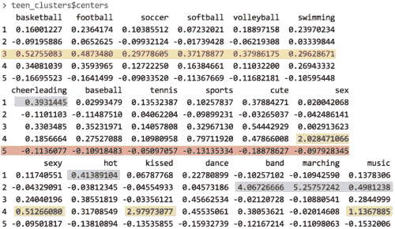

# 第九章：数据分组—使用 k-means 进行聚类

您是否曾花时间观察过一大群人？如果有，您可能已经见过一些反复出现的个性。也许某种类型的人，穿着刚熨好的西装，手拿公文包，成为了典型的“肥猫”商界高管。一个穿着紧身牛仔裤、法兰绒衬衫和太阳镜的二十多岁年轻人可能被称为“嬉皮士”，而一位从小面包车里抱出孩子的女性则可能被标记为“足球妈妈”。

当然，这些刻板印象在应用到个体时是危险的，因为没有两个完全相同的人。然而，作为描述一个集体的方式，这些标签捕捉到了群体内个体之间某些潜在的相似性。

正如您很快会学到的，聚类或在数据中识别模式的过程，与在人群中识别模式并没有太大不同。在这一章中，您将学到：

+   聚类任务与我们之前研究的分类任务有何不同

+   聚类如何定义一个组，以及如何通过 k-means 这一经典且易于理解的聚类算法识别这些组

+   将聚类应用于现实世界任务的步骤，比如在青少年社交媒体用户中识别营销细分

在开始实际操作之前，我们将深入探讨聚类的具体内容。

# 理解聚类

聚类是一种无监督的机器学习任务，它会自动将数据分成**聚类**，即一组组相似的项目。它在不知道如何预先划分组的情况下进行。这就像我们可能甚至不知道自己在寻找什么，聚类用于知识发现而非预测。它为我们提供了数据中自然分组的洞察。

在没有预先了解一个聚类由什么组成的情况下，计算机如何可能知道一个组何时结束，另一个组何时开始呢？答案很简单。聚类是由一个原则指导的：聚类内部的项应该彼此非常相似，而与聚类外部的项有很大不同。相似性的定义可能会因应用场景的不同而有所变化，但基本思想始终相同——将数据分组，使相关元素聚集在一起。

生成的聚类可以用于实际操作。例如，您可能会发现聚类方法应用于以下场景：

+   将客户按相似的人口统计信息或购买模式进行分组，以进行定向营销活动

+   通过识别使用模式，发现超出已知聚类范围的异常行为，例如未经授权的网络入侵

+   通过将具有相似值的特征分组为更少的同质类别，从而简化极其庞大的数据集

总的来说，聚类在数据多样且可以通过更少的组来概括时非常有用。它能产生有意义且可操作的数据结构，减少复杂性并为关系模式提供洞察。

## 聚类作为机器学习任务

聚类与我们之前探讨的分类、数值预测和模式检测任务有所不同。在这些任务中，结果是一个模型，将特征与结果或特征之间的关系进行关联；从概念上讲，模型描述了数据中的现有模式。相比之下，聚类会创造新的数据。未标记的示例会被赋予一个聚类标签，该标签完全是根据数据内部的关系推断出来的。因此，有时你会看到聚类任务被称为**无监督分类**，因为从某种意义上来说，它是对未标记的示例进行分类。

关键在于，来自无监督分类器的类别标签没有内在意义。聚类将告诉你哪些示例组之间有紧密的关系——例如，它可能会返回 A、B 和 C 组——但你需要为这些组应用一个可操作且有意义的标签。为了了解这对聚类任务的影响，我们来看一个假设的例子。

假设你正在组织一个关于数据科学的会议。为了促进专业的社交和合作，你计划根据三种研究专长之一将与会者分组：计算机和/或数据库科学、数学和统计学、以及机器学习。不幸的是，在发送会议邀请后，你意识到忘记了包含一项调查，询问与会者希望与哪个学科的人员坐在一起。

一时灵感迸发，你意识到可以通过检查每个学者的出版历史来推断他们的研究专长。为此，你开始收集每个与会者在计算机科学相关期刊上发表的文章数量，以及在数学或统计学相关期刊上发表的文章数量。通过收集几位学者的数据，你绘制了一个散点图：


正如预期的那样，似乎确实存在一个模式。我们可能会猜测，位于左上角的群体，代表那些在计算机科学方面有许多出版物，但在数学方面文章较少的人，可能是计算机科学家的聚类。按照这一逻辑，右下角可能是数学家的群体。同样，右上角那些既有数学又有计算机科学经验的人，可能是机器学习专家。

我们的分组是通过视觉方式形成的；我们只是简单地将数据点作为紧密聚集的群体进行识别。然而，尽管这些分组看起来显而易见，但不幸的是，我们没有办法知道这些分组是否真正同质化，因为我们无法逐个询问每位学者的学术专长。我们所应用的标签要求我们对可能属于该组的人进行定性、假设性的判断。因此，你可以把群体标签理解为不确定的术语，如下所示：


与其主观地定义群体边界，不如使用机器学习来客观地定义它们。考虑到前面图中的轴向分割，我们的问题似乎是第五章中所描述的决策树的明显应用，*分治法 – 使用决策树和规则进行分类*。这可能会为我们提供一个规则，形式为“如果学者的数学出版物较少，那么他/她就是计算机科学专家。”不幸的是，这个计划存在问题。由于我们没有每个点的真实类别数据，监督学习算法无法学习到这样的模式，因为它无法知道哪些分割能形成同质化的群体。

另一方面，聚类算法使用的过程与我们通过视觉检查散点图所做的非常相似。通过衡量样本之间的关系程度，可以识别出同质的群体。在接下来的部分中，我们将开始探讨聚类算法是如何实现的。

### 提示

这个例子突出了聚类的一个有趣应用。如果你从未标记的数据开始，你可以使用聚类来创建类别标签。从那里，你可以应用监督学习算法，如决策树，来找出这些类别最重要的预测因素。这被称为**半监督学习**。

## k-means 聚类算法

**k-means** **算法**可能是最常用的聚类方法。经过数十年的研究，它为许多更复杂的聚类技术奠定了基础。如果你理解了它使用的简单原理，你就具备了理解今天几乎所有聚类算法所需的知识。许多此类方法列在以下网站上，即**CRAN 聚类任务视图**：[`cran.r-project.org/web/views/Cluster.html`](http://cran.r-project.org/web/views/Cluster.html)。

### 注意

随着 k-means 的不断发展，该算法有许多不同的实现。一个常见的方法描述在：Hartigan JA, Wong MA. A k-means clustering algorithm. Applied *Statistics*. 1979; 28:100-108。

尽管聚类方法自 k-means 诞生以来已有了进展，但这并不意味着 k-means 已经过时。事实上，这种方法现在可能比以往任何时候都更受欢迎。以下表格列出了一些 k-means 仍然广泛使用的原因：

| 优势 | 弱点 |
| --- | --- |

|

+   使用简单的原则，可以用非统计学术语进行解释

+   高度灵活，可以通过简单的调整适应，解决几乎所有的缺点

+   在许多实际应用场景中表现良好

|

+   比不上更现代的聚类算法复杂

+   由于它使用了随机因素，因此无法保证找到最优的聚类集

+   需要合理猜测数据中自然存在多少个聚类

+   对于非球形聚类或密度差异较大的聚类不理想

|

如果“k-means”这个名字让你觉得熟悉，你可能是在回忆第三章中讨论的 k-NN 算法，*懒学习 – 使用最近邻分类*。正如你将很快看到的，k-means 与 k 最近邻的相似之处远不止字母 k。

k-means 算法将每个*n*个样本分配到*k*个聚类中的一个，*k*是一个事先确定的数字。目标是最小化每个聚类内的差异，并最大化聚类之间的差异。

除非*k*和*n*非常小，否则计算所有可能组合的最优聚类是不可行的。相反，算法使用启发式过程来寻找**局部最优**解。简单来说，这意味着它从初始聚类分配开始，然后稍微修改分配，看看这些变化是否能提高聚类内部的一致性。

我们将很快深入讨论这个过程，但该算法基本上分为两个阶段。首先，它将样本分配到初始的*k*个聚类中。然后，它通过根据当前落入聚类中的样本调整聚类边界来更新分配。更新和分配的过程会重复几次，直到变化不再改善聚类拟合为止。此时，过程停止，聚类最终确定。

### 提示

由于 k-means 的启发式特性，仅通过轻微改变初始条件，你可能会得到略有不同的最终结果。如果结果差异很大，这可能意味着存在问题。例如，数据可能没有自然分组，或者*k*的值选择不当。考虑到这一点，最好多次尝试聚类分析，以测试结果的稳健性。

为了了解分配和更新的过程如何在实践中工作，让我们重新审视一下假设的数据科学会议的案例。虽然这是一个简单的例子，但它将展示 k-means 在背后如何运作的基础。

### 使用距离分配和更新聚类

与 k-NN 一样，k-means 将特征值视为多维特征空间中的坐标。对于这次会议数据，只有两个特征，因此我们可以将特征空间表示为如前所示的二维散点图。

k-means 算法首先通过在特征空间中选择 *k* 个点作为聚类中心。这些中心是推动剩余样本归类的催化剂。通常，这些点通过从训练数据集中随机选择 *k* 个样本来确定。假设我们希望识别三个聚类，按照这种方法，*k = 3* 个点将被随机选择。这些点在下图中分别用星号、三角形和菱形表示：


值得注意的是，尽管前图中的三个聚类中心恰好相距较远，但这并不一定总是如此。由于它们是随机选择的，这三个中心也有可能是相邻的三个点。由于 k-means 算法对聚类中心的初始位置高度敏感，这意味着随机因素可能对最终的聚类结果产生重大影响。

为了解决这个问题，k-means 可以通过不同的方法来选择初始中心。例如，一种变体会在特征空间中的任意位置选择随机值（而不仅仅是从数据中选择已观察到的值）。另一种选择是完全跳过这一步；通过将每个样本随机分配到一个聚类中，算法可以立即跳到更新阶段。每种方法都会对最终的聚类集添加特定的偏差，你可能可以利用这些偏差来改进你的结果。

### 注意

2007 年，提出了一种名为 **k-means++** 的算法，它提供了一种选择初始聚类中心的替代方法。该方法声称是一种高效的方式，能够在减少随机因素影响的同时，接近最优的聚类结果。欲了解更多信息，请参阅 *Arthur D, Vassilvitskii S*。k-means++: 精心初始化的优势。*第十八届 ACM-SIAM 离散算法年会论文集*，2007：1027–1035。

选择初始聚类中心后，其他样本会根据距离函数被分配到最近的聚类中心。你应该还记得我们在学习 k-最近邻时研究了距离函数。传统上，k-means 使用欧几里得距离，但也有时使用曼哈顿距离或闵可夫斯基距离。

回想一下，如果 *n* 表示特征的数量，则示例 *x* 和示例 *y* 之间的欧几里得距离公式为：


例如，如果我们要比较一位有五篇计算机科学论文和一篇数学论文的访客与一位没有计算机科学论文但有两篇数学论文的访客，我们可以在 R 中按如下方式计算：

```py
> sqrt((5 - 0)² + (1 - 2)²)
[1] 5.09902

```

使用该距离函数，我们计算每个示例与每个聚类中心之间的距离。然后，示例被分配到最近的聚类中心。

### 提示

请记住，由于我们正在使用距离计算，所有特征需要是数值型的，且值应提前标准化到一个标准范围。第三章中讨论的方法，*惰性学习——使用最近邻分类*，对这个任务会很有帮助。

如下图所示，三个聚类中心将示例分为三个部分，分别标记为**聚类 A**、**聚类 B**和**聚类 C**。虚线表示由聚类中心创建的**Voronoi 图**的边界。Voronoi 图显示了离某个聚类中心比其他任何中心都近的区域；三个边界相交的顶点是离所有三个聚类中心最远的点。利用这些边界，我们可以轻松看到每个初始 k-means 种子所占据的区域：


现在初始分配阶段已经完成，k-means 算法进入更新阶段。更新聚类的第一步是将初始中心移动到新的位置，称为**质心**，其位置是当前分配给该聚类的点的平均位置。下图展示了当聚类中心移动到新的质心时，Voronoi 图中的边界也会发生变化，而原本在**聚类 B**中的一个点（由箭头表示）被加入到了**聚类 A**中：


由于此次重新分配，k-means 算法将继续进行另一个更新阶段。在移动聚类中心、更新聚类边界并重新分配点到新聚类之后（如箭头所示），图形如下所示：


由于又有两个点被重新分配，因此必须进行另一次更新，这将移动中心并更新聚类边界。然而，由于这些变化没有导致任何重新分配，k-means 算法停止。聚类分配现在是最终的：


最终的聚类结果可以通过两种方式之一来报告。首先，你可以简单地报告每个样本的聚类分配，如 A、B 或 C。或者，你可以报告最终更新后聚类中心的坐标。无论哪种报告方式，你都可以通过计算中心点或将每个样本分配给其最近的聚类来定义聚类边界。

### 选择适当数量的聚类

在 k-means 的介绍中，我们了解到该算法对随机选择的聚类中心非常敏感。实际上，如果我们在前一个例子中选择了不同的三个起始点，可能会得到与我们预期不同的数据分组。同样，k-means 对聚类数量也非常敏感；这个选择需要一个微妙的平衡。将 *k* 设置得非常大将提高聚类的同质性，但同时也有过拟合数据的风险。

理想情况下，你应该具有 *先验* 知识（即先前的信念）关于真实的分组情况，并可以利用这些信息来选择聚类数量。例如，如果你在对电影进行聚类，你可能会将 *k* 设置为奥斯卡奖提名的类型数量。在我们之前讨论的数据科学会议座位问题中，*k* 可能反映了受邀的学术领域数量。

有时候，聚类的数量由业务需求或分析的动机决定。例如，会议厅中的桌子数量可能决定了应该从数据科学参与者名单中创建多少个小组。将这个思路扩展到另一个商业案例，如果市场部门只有限制资源来创建三种不同的广告活动，那么将 *k = 3* 设置为将所有潜在客户分配给三个吸引点中的一个可能是合理的。

在没有任何先验知识的情况下，有一个经验法则建议将 *k* 设置为 *(n / 2)* 的平方根，其中 *n* 是数据集中的样本数量。然而，对于大型数据集来说，这个经验法则可能会导致聚类数量过多而难以处理。幸运的是，还有其他统计方法可以帮助找到合适的 k-means 聚类集。

一种名为 **肘部法则** 的技术试图衡量在不同的 *k* 值下，聚类内的同质性或异质性是如何变化的。正如下图所示，随着聚类数量的增加，聚类内部的同质性预期会增加；同样，异质性也会随着聚类数量的增加而继续减少。尽管你可以继续观察到每个样本被分配到其自己的聚类，目标不是最大化同质性或最小化异质性，而是找到一个 *k*，在这个点之后，收益递减。这种 *k* 值被称为 **肘部点**，因为它看起来像一个肘部。


有许多统计方法可以衡量聚类内部的同质性和异质性，这些方法可以与肘部法（以下信息框提供了详细的引用）一起使用。然而，在实际应用中，并不总是可行的反复测试大量*k*值。部分原因是，聚类大数据集本身就可能非常耗时；而反复进行数据聚类则更加浪费时间。无论如何，需要精确的最优聚类集的应用相对较少。在大多数聚类应用中，选择一个方便的*k*值而非严格的性能要求通常就足够了。

### 注意

对于关于聚类性能度量的大量综述，请参考：*Halkidi M, Batistakis Y, Vazirgiannis M*。关于聚类验证技术。*智能信息系统杂志*。2001；17:107-145。

设置*k*的过程本身有时会带来有趣的洞见。通过观察随着*k*变化，聚类的特征如何变化，可能会推测出数据自然的边界所在。聚集得更紧密的组变化较小，而异质性较大的组则会随着时间的推移不断形成和解散。

一般来说，花费很少的时间去担心*k*是否完全准确是明智的。下一个例子将展示，即使是从一部好莱坞电影中借来的一点点专业知识，也能用于设定*k*，以便发现可操作且有趣的聚类。由于聚类是无监督的，任务的本质实际上是你如何理解它；真正的价值在于从算法发现中获得的洞察。

# 示例——使用 k-means 聚类寻找青少年市场细分

与朋友在**社交网络服务**（**SNS**）上互动，例如 Facebook、Tumblr 和 Instagram，已经成为全球青少年的一项通行仪式。这些青少年通常拥有相对较多的可支配收入，因此成为了企业争相吸引的群体，企业希望通过他们销售零食、饮料、电子产品和卫生用品。

使用这些网站的数百万青少年消费者已经吸引了市场营销人员的关注，他们在日益竞争激烈的市场中努力寻找竞争优势。一种获得这种优势的方法是识别出具有相似品味的青少年群体，以便客户避免将广告投放给那些对所售产品没有兴趣的青少年。例如，运动服饰可能很难成功地销售给对体育不感兴趣的青少年。

给定青少年 SNS 页面的文本，我们可以识别出一些具有共同兴趣的群体，例如体育、宗教或音乐。聚类可以自动化发现这一人群中的自然分段过程。然而，是否认为这些聚类有趣，以及如何利用它们进行广告投放，仍然需要我们自己决定。让我们从头到尾尝试这一过程。

## 第 1 步 – 收集数据

对于本次分析，我们将使用一个代表 2006 年在一个著名 SNS 上有个人资料的 30,000 名美国高中生的随机样本数据集。为了保护用户的匿名性，SNS 的名称将保持不公开。然而，在数据收集时，这个 SNS 是美国青少年常用的网络平台。因此，可以合理假设这些个人资料代表了 2006 年美国青少年群体的一个较为广泛的横截面。

### 提示

该数据集是 Brett Lantz 在大学进行青少年身份的社会学研究时编制的。如果你用于研究目的，请引用这本书的章节。完整数据集可在 Packt Publishing 网站上下载，文件名为`snsdata.csv`。为了进行互动操作，本章假设你已将该文件保存到你的 R 工作目录中。

数据在四个高中毕业年份（2006 年至 2009 年）之间均匀抽样，代表了数据收集时的高年级、低年级、二年级和一年级学生。使用自动化的网络爬虫，下载了 SNS 个人资料的完整文本，并记录了每个青少年的性别、年龄和 SNS 好友数量。

使用了一个文本挖掘工具，将其余的 SNS 页面内容分割成单词。从所有页面中出现的前 500 个单词中，选择了 36 个单词来代表五类兴趣：即课外活动、时尚、宗教、浪漫和反社会行为。选中的 36 个单词包括*足球*、*性感*、*亲吻*、*圣经*、*购物*、*死亡*和*毒品*等。最终的数据集显示了每个人在其 SNS 个人资料中每个单词出现的次数。

## 第 2 步 – 探索和准备数据

我们可以使用`read.csv()`的默认设置将数据加载到数据框中：

```py
> teens <- read.csv("snsdata.csv")

```

让我们也快速查看一下数据的具体情况。`str()`输出的前几行如下：

```py
> str(teens)
'data.frame':  30000 obs. of  40 variables:
 $ gradyear    : int  2006 2006 2006 2006 2006 2006 2006 2006 ...
 $ gender      : Factor w/ 2 levels "F","M": 2 1 2 1 NA 1 1 2 ...
 $ age         : num  19 18.8 18.3 18.9 19 ...
 $ friends     : int  7 0 69 0 10 142 72 17 52 39 ...
 $ basketball  : int  0 0 0 0 0 0 0 0 0 0 ...

```

正如我们预期的那样，数据包括 30,000 名青少年，四个变量表示个人特征，36 个单词表示兴趣。

你是否注意到`gender`行中的异常情况？如果你仔细查看，可能已经注意到`NA`值，它与`1`和`2`的值不太一致。`NA`是 R 用来告诉我们记录缺少值的方式——我们不知道这个人的性别。到目前为止，我们还没有处理缺失数据，但对于许多类型的分析来说，缺失数据可能是一个重要问题。

让我们看看这个问题的严重程度。一个选择是使用`table()`命令，如下所示：

```py
> table(teens$gender)
 F     M
22054  5222

```

尽管此命令告诉我们有多少`F`和`M`值存在，但`table()`函数排除了`NA`值，而不是将其视为一个单独的类别。为了包括`NA`值（如果有的话），我们只需添加一个额外的参数：

```py
> table(teens$gender, useNA = "ifany")
 F     M  <NA>
22054  5222  2724

```

在这里，我们看到有 2,724 条记录（占 9%）缺少性别数据。有趣的是，SNS 数据中女性的数量是男性的四倍多，这表明男性使用 SNS 网站的倾向不如女性。

如果你检查数据框中的其他变量，你会发现除了`gender`，只有`age`存在缺失值。对于数值型数据，`summary()`命令会告诉我们缺失的`NA`值的数量：

```py
> summary(teens$age)
 Min. 1st Qu.  Median    Mean 3rd Qu.    Max.    NA's
 3.086  16.310  17.290  17.990  18.260 106.900    5086

```

总共有 5,086 条记录（占 17%）缺少年龄数据。令人担忧的是，最小和最大值似乎不合理；一个 3 岁或 106 岁的学生不太可能上高中。为了确保这些极端值不会对分析造成问题，我们需要在继续之前清理它们。

高中生的合理年龄范围应包括至少 13 岁但不满 20 岁的学生。任何超出此范围的年龄值应视为缺失数据——我们无法信任提供的年龄。为了重新编码年龄变量，我们可以使用`ifelse()`函数，当年龄至少为 13 岁且小于 20 岁时，将`teen$age`的值设为`teen$age`；否则，赋值为`NA`：

```py
> teens$age <- ifelse(teens$age >= 13 & teens$age < 20,
 teens$age, NA)

```

通过重新检查`summary()`输出，我们发现现在的年龄范围呈现出一个更像实际高中学生的分布：

```py
> summary(teens$age)
 Min. 1st Qu.  Median    Mean 3rd Qu.    Max.    NA's
 13.03   16.30   17.26   17.25   18.22   20.00    5523

```

不幸的是，现在我们制造了一个更大的缺失数据问题。在继续分析之前，我们需要找到一种处理这些缺失值的方法。

### 数据准备——虚拟编码缺失值

处理缺失值的一个简单方法是排除任何缺失值的记录。然而，如果你考虑这种做法的后果，可能会在做之前三思而后行——仅仅因为这种方法简单，并不意味着它是个好主意！这种方法的问题在于，即使缺失值的数量不多，你也可能会轻易排除大量数据。

例如，假设在我们的数据中，缺失性别值的人群与缺失年龄数据的人群完全不同。这意味着，如果你排除了缺失性别或年龄的记录，你将排除*9% + 17% = 26%*的数据，或者超过 7,500 条记录。而这仅仅是针对两个变量的缺失数据！缺失值数量越多，任何给定记录被排除的可能性就越大。很快，你将只剩下一个非常小的子集数据，或者更糟，剩下的记录将系统性地不同或不具代表性，无法代表整体人群。

对于像性别这样的分类变量，另一种选择是将缺失值视为单独的类别。例如，而不是仅限于女性和男性，我们可以为未知性别添加一个额外的类别。这允许我们使用虚拟编码，这在第三章中有讲解，*懒惰学习 – 使用最近邻分类*。

如果你还记得，虚拟编码涉及为名义特征的每个级别创建一个单独的二进制（1 或 0）值的虚拟变量，除了一个级别，该级别被保留作为参考组。可以排除一个类别的原因是因为可以从其他类别推断出它的状态。例如，如果某人既不是女性也不是未知性别，他们必须是男性。因此，在这种情况下，我们只需为女性和未知性别创建虚拟变量：

```py
> teens$female <- ifelse(teens$gender == "F" &
 !is.na(teens$gender), 1, 0)
> teens$no_gender <- ifelse(is.na(teens$gender), 1, 0)

```

正如你可能预期的那样，`is.na()` 函数测试性别是否等于 `NA`。因此，第一条语句如果性别等于 `F` 且性别不等于 `NA`，则为 `teens$female` 赋值 `1`；否则，赋值 `0`。在第二条语句中，如果 `is.na()` 返回 `TRUE`，表示性别缺失，则将 `teens$no_gender` 变量赋值为 `1`；否则，赋值为 `0`。为了确认我们的工作是否正确，让我们将构建的虚拟变量与原始的 `gender` 变量进行比较：

```py
> table(teens$gender, useNA = "ifany")
 F     M  <NA>
22054  5222  2724
> table(teens$female, useNA = "ifany")
 0     1
 7946 22054
> table(teens$no_gender, useNA = "ifany")
 0     1
27276  2724

```

对于 `teens$female` 和 `teens$no_gender` 中的 `1` 值数量与 `F` 和 `NA` 值的数量匹配，因此我们应该能够信任我们的工作。

### 数据准备 – 填补缺失值

接下来，让我们排除 5,523 个缺失的年龄值。由于年龄是数值型的，为未知值创建一个额外的类别没有意义——相对于其他年龄，你会将"未知"排名在哪里呢？相反，我们将使用一种称为**插补**的不同策略，它涉及用真实值的猜测填补缺失数据。

你能想到我们如何能够利用 SNS 数据来推断青少年的年龄吗？如果你考虑使用毕业年份，那么你有正确的想法。一个毕业队列中的大多数人在一个日历年内出生。如果我们能够确定每个队列的典型年龄，我们将有一个相当合理的估计来描述该毕业年份的学生的年龄。

找到典型值的一种方法是计算平均值或均值。如果我们尝试应用 `mean()` 函数，就像我们之前分析过的那样，会有一个问题：

```py
> mean(teens$age)
[1] NA

```

问题在于对包含缺失数据的向量计算均值是未定义的。由于我们的年龄数据包含缺失值，`mean(teens$age)` 返回一个缺失值。我们可以通过添加额外的参数在计算均值之前删除缺失值来纠正这一点：

```py
> mean(teens$age, na.rm = TRUE)
[1] 17.25243

```

这表明我们数据中的平均学生年龄大约为 17 岁。这只帮助我们达成了一部分目标；我们实际上需要每个毕业年份的平均年龄。你可能会想计算四次均值，但 R 的一个优点是通常有方法避免重复。在这种情况下，`aggregate()` 函数就是合适的工具。它计算数据子组的统计信息。在这里，它计算每个毕业年份的平均年龄，并在去除 `NA` 值后进行：

```py
> aggregate(data = teens, age ~ gradyear, mean, na.rm = TRUE)
 gradyear      age
1     2006 18.65586
2     2007 17.70617
3     2008 16.76770
4     2009 15.81957

```

平均年龄每变化一次毕业年份大约差一年。这一点并不令人惊讶，但对于确认我们的数据合理性是一个有用的发现。

`aggregate()` 输出的是一个数据框。这对某些目的很有帮助，但需要额外的工作将其合并回原始数据。作为替代方案，我们可以使用 `ave()` 函数，它返回一个包含组均值的向量，这样结果的长度与原始向量相同：

```py
> ave_age <- ave(teens$age, teens$gradyear, FUN =
 function(x) mean(x, na.rm = TRUE))

```

为了将这些均值填充到缺失值上，我们需要再调用一次 `ifelse()`，只有当原始年龄值为 `NA` 时才使用 `ave_age` 值：

```py
> teens$age <- ifelse(is.na(teens$age), ave_age, teens$age)

```

`summary()` 结果显示，现在缺失值已被消除：

```py
> summary(teens$age)
 Min. 1st Qu.  Median    Mean 3rd Qu.    Max.
 13.03   16.28   17.24   17.24   18.21   20.00

```

数据准备好进行分析后，我们可以深入到这个项目的有趣部分。让我们看看我们的努力是否得到了回报。

## 第 3 步 – 在数据上训练模型

为了将青少年分为不同的营销群体，我们将使用 `stats` 包中的 k-means 实现，该包应该默认包含在你的 R 安装中。如果你碰巧没有这个包，可以像安装其他包一样安装它，并使用 `library(stats)` 命令加载它。尽管各种 R 包中有很多 k-means 函数，但 `stats` 包中的 `kmeans()` 函数被广泛使用，并提供了该算法的标准实现。


`kmeans()` 函数需要一个仅包含数值数据的数据框以及一个指定所需簇数的参数。如果你准备好了这两样东西，实际构建模型的过程就很简单。问题在于，选择合适的数据和簇的组合有时是一门艺术；这通常需要经过大量的反复试验。

我们将通过仅考虑代表青少年 SNS 个人资料中各种兴趣出现次数的 36 个特征来开始我们的聚类分析。为方便起见，我们创建一个仅包含这些特征的数据框：

```py
> interests <- teens[5:40]

```

如果你记得第三章，*懒学习 - 使用最近邻分类*，在进行任何距离计算分析之前的常见做法是对特征进行归一化或 z-score 标准化，以确保每个特征使用相同的范围。通过这样做，你可以避免某些特征仅因为它们具有比其他特征更大的数值范围而主导结果的问题。

z-score 标准化过程会重新缩放特征，使其均值为零，标准差为一。这种转换改变了数据的解释方式，这在此处可能会有用。具体来说，如果某人在其个人资料中提到足球三次，在没有更多信息的情况下，我们无法判断这是否意味着他们比其他人更喜欢足球。另一方面，如果 z-score 为三，我们就知道他们提到足球的次数远远超过了平均水平的青少年。

要对`interests`数据框应用 z-score 标准化，我们可以使用`lapply()`配合`scale()`函数，如下所示：

```py
> interests_z <- as.data.frame(lapply(interests, scale))

```

由于`lapply()`返回的是矩阵，因此必须使用`as.data.frame()`函数将其转换回数据框形式。

我们最后的决定是决定使用多少个簇来对数据进行分段。如果我们使用太多的簇，可能会发现它们过于具体，无法发挥作用；相反，选择太少的簇可能导致分组不均。你应该敢于尝试不同的*k*值。如果你不喜欢结果，可以轻松尝试另一个值并重新开始。

### 提示

如果你对分析群体有所了解，选择簇的数量会更加容易。对自然分组的真实数量有直觉可以帮助你节省一些试错的时间。

为了帮助我们预测数据中的簇的数量，我想引用我最喜欢的电影之一，《*早餐俱乐部*》，这是一部 1985 年上映的成长喜剧片，由约翰·休斯执导。电影中的青少年角色按照五种刻板印象进行分类：学霸、运动员、怪胎、公主和罪犯。考虑到这些身份在流行的青少年小说中常常出现，五个似乎是*k*的一个合理起点。

要使用 k-means 算法将青少年的兴趣数据分成五个簇，我们在`interests`数据框上使用`kmeans()`函数。由于 k-means 算法使用随机起始点，因此使用`set.seed()`函数来确保结果与以下示例中的输出一致。如果你记得前几章的内容，这个命令初始化了 R 的随机数生成器，设置为特定的序列。如果没有这个命令，每次运行 k-means 算法时结果都会不同：

```py
> set.seed(2345)
> teen_clusters <- kmeans(interests_z, 5)

```

k-means 聚类过程的结果是一个名为`teen_clusters`的列表，存储了五个聚类的各项属性。让我们深入了解一下，看看算法是如何将青少年的兴趣数据划分的。

### 提示

如果你发现你的结果与这里展示的不同，请确保在运行`kmeans()`函数之前，立即执行`set.seed(2345)`命令。

## 步骤 4 – 评估模型性能

评估聚类结果可能是有一定主观性的。最终，模型的成功或失败取决于聚类是否能为其预期的目的提供帮助。由于本次分析的目标是识别具有相似兴趣的青少年群体，以便用于市场营销，我们将主要从定性角度来衡量成功。对于其他聚类应用，可能需要更多定量的成功衡量标准。

评估一组聚类有效性的最基本方法之一是检查每个组中示例的数量。如果这些组太大或太小，它们可能不会非常有用。要获取`kmeans()`聚类的大小，请使用`teen_clusters$size`组件，如下所示：

```py
> teen_clusters$size
[1]   871   600  5981  1034 21514

```

在这里，我们看到了我们请求的五个聚类。最小的聚类有 600 个青少年（占 2%），而最大的聚类有 21,514 个（占 72%）。虽然最大和最小聚类之间人数差距较大，这有点令人担忧，但在没有更仔细检查这些组的情况下，我们无法知道这是否表示存在问题。也许，聚类大小的差异反映了某些实际情况，例如一大群有相似兴趣的青少年，或者它可能是由初始的 k-means 聚类中心引起的随机巧合。随着我们开始查看每个聚类的同质性，我们会了解更多。

### 提示

有时，k-means 可能会找到极小的聚类——有时甚至只有一个点。如果初始聚类中心恰好落在一个远离其他数据的离群点上，就可能发生这种情况。是否将这样的极小聚类视为一个真实的发现，代表一个极端案例的聚类，或者视为由随机机会引起的问题，并不总是很明确。如果遇到这个问题，可以考虑使用不同的随机种子重新运行 k-means 算法，看看这个小聚类是否对不同的起始点具有稳健性。

要更深入地了解这些聚类，我们可以通过`teen_clusters$centers`组件检查聚类中心的坐标，以下是前四个兴趣的情况：

```py
> teen_clusters$centers
 basketball   football      soccer    softball
1  0.16001227  0.2364174  0.10385512  0.07232021
2 -0.09195886  0.0652625 -0.09932124 -0.01739428
3  0.52755083  0.4873480  0.29778605  0.37178877
4  0.34081039  0.3593965  0.12722250  0.16384661
5 -0.16695523 -0.1641499 -0.09033520 -0.11367669

```

输出的行（标记为`1`到`5`）表示五个聚类，而每行中的数字表示该聚类在每列顶部列出的兴趣项的平均值。由于这些值是经过 z 分数标准化的，正值表示该兴趣项高于所有青少年总体均值，负值表示低于总体均值。例如，第三行在篮球这一列中的值最高，这意味着聚类`3`在所有聚类中对篮球的平均兴趣最高。

通过检查聚类在每个兴趣类别上是否高于或低于平均水平，我们可以开始注意到区分聚类的模式。实际上，这涉及打印聚类中心并搜索其中的模式或极端值，类似于一个数字版的单词搜索谜题。以下截图显示了五个聚类在 36 个青少年兴趣中的 19 个兴趣的突出模式：



根据这一子集的兴趣数据，我们已经能够推断出一些聚类的特征。**聚类 3**在所有体育项目上的兴趣水平都显著高于平均水平。这表明这可能是*早餐俱乐部*刻板印象中的**运动员**群体。**聚类 1**包括最多提到“啦啦队”的内容、词汇“热”和高于平均水平的足球兴趣。这些是所谓的**公主**吗？

通过继续以这种方式检查聚类，我们可以构建一张表，列出每个群体的主要兴趣。在以下表格中，显示了每个聚类与其他聚类最具区别性的特征，以及最能准确描述该群体特点的*早餐俱乐部*身份。

有趣的是，**聚类 5**的特点在于其成员在每项活动中的兴趣水平都低于平均值，且它是成员数量最多的单一群体。一种可能的解释是，这些用户创建了一个网站个人资料，但从未发布任何兴趣。


### 提示

在分享分段分析结果时，通常应用具有信息量的标签可以帮助简化并捕捉群体的本质，如此处应用的*早餐俱乐部*类型学。加入此类标签的风险在于，它们可能通过刻板印象掩盖群体的细微差别。由于此类标签可能会偏向我们的思维，如果将标签视为全部真理，可能会错过一些重要的模式。

根据表格，营销主管将能清晰地描绘出五种类型的青少年社交网站访客。基于这些档案，主管可以向相关产品的企业出售有针对性的广告展示。在接下来的部分中，我们将看到如何将群体标签应用回原始人群以用于此类用途。

## 第五步 – 改进模型性能

由于聚类创造了新信息，聚类算法的表现至少在某种程度上取决于群体本身的质量以及如何利用这些信息。在前面的部分中，我们已经展示了这五个群体为青少年的兴趣提供了有用且新颖的见解。以此衡量，算法的表现相当不错。因此，我们现在可以将精力集中在将这些见解转化为行动上。

我们将首先将群体应用回完整数据集。由`kmeans()`函数创建的`teen_clusters`对象包含一个名为`cluster`的组件，该组件包含样本中 30,000 个个体的群体分配信息。我们可以通过以下命令将其作为一列添加到`teens`数据框中：

```py
> teens$cluster <- teen_clusters$cluster

```

鉴于这一新数据，我们可以开始检查群体分配与个人特征之间的关系。例如，以下是 SNS 数据中前五个青少年的个人信息：

```py
> teens[1:5, c("cluster", "gender", "age", "friends")]
 cluster gender    age friends
1       5      M 18.982       7
2       3      F 18.801       0
3       5      M 18.335      69
4       5      F 18.875       0
5       4   <NA> 18.995      10

```

使用`aggregate()`函数，我们还可以查看各群体的不同人口特征。群体间的平均年龄变化不大，这并不令人惊讶，因为这些青少年的身份通常在上高中之前就已确定。情况如下所示：

```py
> aggregate(data = teens, age ~ cluster, mean)
 cluster      age
1       1 16.86497
2       2 17.39037
3       3 17.07656
4       4 17.11957
5       5 17.29849

```

另一方面，不同群体中女性所占比例存在一些显著差异。这是一个非常有趣的发现，因为我们并未使用性别数据来创建群体，但群体仍然能预测性别：

```py
> aggregate(data = teens, female ~ cluster, mean)
 cluster    female
1       1 0.8381171
2       2 0.7250000
3       3 0.8378198
4       4 0.8027079
5       5 0.6994515

```

回想一下，SNS 用户中大约 74%是女性。**群体 1**，即所谓的**公主群体**，女性比例接近 84%，而**群体 2**和**群体 5**的女性比例仅约为 70%。这些差异表明青少年男孩和女孩在社交网络页面上讨论的兴趣有所不同。

鉴于我们在预测性别上的成功，您可能也会怀疑群体能否预测用户拥有的朋友数量。这个假设似乎得到了数据的支持，具体如下：

```py
> aggregate(data = teens, friends ~ cluster, mean)
 cluster  friends
1       1 41.43054
2       2 32.57333
3       3 37.16185
4       4 30.50290
5       5 27.70052

```

平均而言，**公主**拥有最多的朋友（41.4），其次是**运动员**（37.2）和**学霸**（32.6）。最低的是**罪犯**（30.5）和**精神病患者**（27.7）。与性别一样，青少年朋友数量与其预测聚类之间的联系非常显著，尽管我们并未将朋友数据作为聚类算法的输入。另外有趣的是，朋友数量似乎与每个群体在高中受欢迎程度的刻板印象相关；那些在刻板印象中受欢迎的群体往往拥有更多的朋友。

群体成员、性别和朋友数量之间的关联表明，聚类可以是行为的有用预测指标。通过这种方式验证它们的预测能力，可以使聚类在向营销团队推销时更具吸引力，从而最终提升算法的表现。

# 总结

我们的发现支持了那句流行的格言：“物以类聚，人以群分。”通过使用机器学习方法将青少年与有相似兴趣的人进行聚类，我们能够开发出一种青少年身份的分类法，该分类法能够预测个人特征，如性别和朋友数量。这些相同的方法也可以应用于其他情境，并取得类似的结果。

本章仅介绍了聚类的基本概念。作为一种非常成熟的机器学习方法，k-means 算法有许多变体，还有许多其他聚类算法，它们为任务带来了独特的偏差和启发式方法。基于本章的基础，你将能够理解并应用其他聚类方法来解决新的问题。

在下一章，我们将开始探讨衡量学习算法成功的方法，这些方法适用于许多机器学习任务。虽然我们的过程一直在评估学习的成功，但为了获得最高的性能水平，能够在最严格的术语下定义和衡量它是至关重要的。
