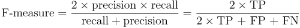

# 第十章：评估模型性能

当只有富人能负担得起教育时，测试和考试并没有评估学生的潜力。相反，教师是根据家长的要求来评判的，家长们希望知道他们的孩子是否学到了足够的知识，以证明教员的薪水。显然，随着时间的推移，这种情况发生了变化。现在，这些评估被用来区分高成就和低成就的学生，并将他们筛选到职业和其他机会中。

鉴于这个过程的重要性，投入了大量精力来开发准确的学生评估。公平的评估有大量的问题，覆盖广泛的主题，奖励真实的知识而不是运气猜测。它们还要求学生思考他们之前从未遇到过的问题。因此，正确的回答表明学生能够更广泛地概括他们的知识。

评估机器学习算法的过程与评估学生的过程非常相似。由于算法有不同的优缺点，测试应该能够区分不同的学习者。预测学习者在未来数据上的表现也同样重要。

本章提供了评估机器学习者所需的信息，例如：

+   为什么预测准确率不足以衡量性能，以及你可以使用的其他性能度量

+   确保性能度量合理反映模型预测或预测未见过案例的能力的方法

+   如何使用 R 语言将这些更有用的度量和方法应用到前几章中讨论的预测模型上

就像学习某个主题的最佳方式是尝试将其教授给别人一样，教学和评估机器学习者的过程将为你提供更多关于迄今为止所学方法的洞察。

# 衡量分类的性能

在前几章中，我们通过将正确预测的比例除以预测的总数来衡量分类器的准确性。这表示学习者在多少情况下是正确的或错误的。例如，假设在 100,000 名新生儿中，有 99,990 名婴儿的基因缺陷是否携带被分类器正确预测。这样的话，准确率将是 99.99%，错误率仅为 0.01%。

乍一看，这似乎是一个极其准确的分类器。然而，在将你孩子的生命交给该测试之前，最好先收集更多的信息。如果这种基因缺陷仅在每 10 万个婴儿中有 10 个发现，怎么办？无论在什么情况下，始终预测*没有缺陷*的测试对 99.99%的所有案例都是正确的，但对 100%最重要的案例却是错误的。换句话说，尽管预测非常准确，但这个分类器对于防止可治疗的出生缺陷并没有多大帮助。

### 提示

这是**类别不平衡问题**的一个后果，指的是数据中大多数记录属于同一类别所带来的问题。

尽管有许多方法可以衡量分类器的性能，但最好的衡量标准总是能够捕捉分类器在其预期目标上是否成功的标准。定义性能度量时，关键是要以效用为导向，而非单纯的准确率。为此，我们将开始探索从混淆矩阵中衍生出的各种替代性性能度量方法。然而，在我们开始之前，我们需要考虑如何准备分类器进行评估。

## 在 R 中处理分类预测数据

评估分类模型的目标是更好地理解其性能如何推断到未来的案例。由于在实际环境中测试一个尚未验证的模型通常是不可行的，我们通常通过要求模型对一个包含类似未来任务的案例的数据集进行分类，从而模拟未来的情况。通过观察学习者对这一检验的回应，我们可以了解其优点和缺点。

尽管我们在前面的章节中评估了分类器，但值得反思一下我们所拥有的数据类型：

+   实际类别值

+   预测类别值

+   预测的估计概率

实际值和预测的类别值可能是显而易见的，但它们是评估的关键。就像老师用答案解析来评估学生的答案一样，我们需要知道机器学习者预测的正确答案。目标是保持两个数据向量：一个存储正确或实际的类别值，另一个存储预测的类别值。这两个向量必须包含相同数量的值，并按相同的顺序排列。预测值和实际值可以存储为独立的 R 向量，或者在一个 R 数据框中作为列存储。

获取这些数据很容易。实际的类别值直接来自测试数据集中的目标特征。预测类别值是通过基于训练数据构建的分类器来获取的，并应用于测试数据。对于大多数机器学习包来说，这通常涉及对模型对象和测试数据框应用`predict()`函数，例如：`predicted_outcome <- predict(model, test_data)`。

到目前为止，我们仅仅使用这两个数据向量来检查分类预测。然而，大多数模型可以提供另一个有用的信息。即使分类器对每个样本做出单一的预测，它对于某些决策的信心可能会高于其他决策。例如，分类器可能有 99% 的把握认为包含“免费”和“铃声”字样的短信是垃圾短信，但对含有“今晚”字样的短信只有 51% 的把握是垃圾短信。在这两种情况下，分类器都会将消息归类为垃圾短信，但对其中一个决策的信心远高于另一个。


研究这些内部预测概率可以提供有用的数据来评估模型的表现。如果两个模型犯了相同数量的错误，但其中一个能够更准确地评估其不确定性，那么这个模型更为智能。理想情况下，应该找到一个在做出正确预测时非常自信，而在面对不确定时则保持谨慎的学习者。信心与谨慎之间的平衡是模型评估的关键部分。

不幸的是，获取内部预测概率可能有些棘手，因为不同的分类器获取预测概率的方法不同。通常，对于大多数分类器，`predict()`函数用于指定所需的预测类型。要获取单一预测类别（如垃圾邮件或正常邮件），通常需要将`type = "class"`参数设置为该值。要获取预测概率，`type`参数应根据所使用的分类器设置为`"prob"`、`"posterior"`、`"raw"`或`"probability"`之一。

### 提示

本书中介绍的几乎所有分类器都会提供预测概率。在每个模型的语法框中都会包含`type`参数。

例如，要输出在第五章中构建的 C5.0 分类器的预测概率，可以使用`predict()`函数，并设置`type = "prob"`，如下所示：

```py
> predicted_prob <- predict(credit_model, credit_test, type = "prob")

```

为了进一步说明评估学习算法的过程，让我们更详细地看看在第四章中开发的 SMS 垃圾邮件分类模型的表现，*概率学习 – 使用朴素贝叶斯分类*。要输出朴素贝叶斯的预测概率，可以使用`predict()`函数，并设置`type = "raw"`，如下所示：

```py
> sms_test_prob <- predict(sms_classifier, sms_test, type = "raw")

```

在大多数情况下，`predict()`函数会为每个结果类别返回一个概率。例如，在像 SMS 分类器这样的二分类模型中，预测的概率可能是一个矩阵或数据框，如下所示：

```py
> head(sms_test_prob)
 ham         spam
[1,] 9.999995e-01 4.565938e-07
[2,] 9.999995e-01 4.540489e-07
[3,] 9.998418e-01 1.582360e-04
[4,] 9.999578e-01 4.223125e-05
[5,] 4.816137e-10 1.000000e+00
[6,] 9.997970e-01 2.030033e-04

```

输出中的每一行显示了分类器对`垃圾邮件`和`正常邮件`的预测概率，这两个概率的总和始终为 1，因为这是唯一的两个可能结果。在构建评估数据集时，确保你使用的是与所关注类别级别相符的正确概率非常重要。为了避免混淆，在二分类情况下，甚至可以考虑去掉其中一个类别的预测向量。

为了方便评估过程，可以构建一个数据框，包含预测的类别值、实际类别值，以及感兴趣的估计概率。

### 提示

构建评估数据集的步骤为了简洁起见已被省略，但它们包含在本章的代码中，可以在 Packt Publishing 网站上找到。要跟随本示例操作，请下载`sms_results.csv`文件，并使用`sms_results <- read.csv("sms_results.csv")`命令将其加载到数据框中。

`sms_results`数据框非常简单，它包含四个向量，包含 1,390 个值。一个向量包含表示实际短信类型（`spam`或`ham`）的值，一个向量表示朴素贝叶斯模型的预测类型，第三个和第四个向量分别表示消息是`spam`或`ham`的概率：

```py
> head(sms_results)
 actual_type predict_type prob_spam prob_ham
1         ham          ham   0.00000  1.00000
2         ham          ham   0.00000  1.00000
3         ham          ham   0.00016  0.99984
4         ham          ham   0.00004  0.99996
5        spam         spam   1.00000  0.00000
6         ham          ham   0.00020  0.99980

```

对于这六个测试案例，预测值与实际的短信类型一致；模型正确地预测了它们的状态。此外，预测的概率表明模型对这些预测极其自信，因为它们的值都接近零或一。

当预测值和实际值远离零和一时，会发生什么？使用`subset()`函数，我们可以找出一些这样的记录。以下输出显示了模型预测的`spam`概率介于 40 到 60 百分比之间的测试案例：

```py
> head(subset(sms_results, prob_spam > 0.40 & prob_spam < 0.60))
 actual_type predict_type prob_spam prob_ham
377         spam          ham   0.47536  0.52464
717          ham         spam   0.56188  0.43812
1311         ham         spam   0.57917  0.42083

```

根据模型自己的说明，这些是正确预测几乎等同于掷硬币的情况。然而，所有三个预测都是错误的——这是一个不幸的结果。让我们再看看几个模型错误的案例：

```py
> head(subset(sms_results, actual_type != predict_type))
 actual_type predict_type prob_spam prob_ham
53         spam          ham   0.00071  0.99929
59         spam          ham   0.00156  0.99844
73         spam          ham   0.01708  0.98292
76         spam          ham   0.00851  0.99149
184        spam          ham   0.01243  0.98757
332        spam          ham   0.00003  0.99997

```

这些案例说明了一个重要的事实：模型可以非常有信心，但也可能极其错误。所有这六个测试案例都是`spam`，而分类器认为它们被判定为`ham`的概率不低于 98%。

尽管存在这些错误，这个模型是否仍然有用呢？我们可以通过对评估数据应用各种错误度量来回答这个问题。事实上，许多这样的度量是基于我们在前几章中已广泛使用的工具。

## 更深入地看混淆矩阵

**混淆** **矩阵**是一个表格，用于根据预测值是否与实际值匹配来对预测进行分类。表格的一个维度表示预测值的可能类别，另一个维度表示实际值的类别。尽管我们至今只见过 2 x 2 的混淆矩阵，但也可以为预测任何类别值的模型创建矩阵。下图展示了熟悉的二分类模型的混淆矩阵，以及三类模型的 3 x 3 混淆矩阵。

当预测值与实际值相同，说明是正确分类。正确的预测会出现在混淆矩阵的对角线上（用**O**表示）。对角线外的矩阵单元格（用**X**表示）表示预测值与实际值不同的情况，这些是错误预测。分类模型的性能度量是基于这些表格中对角线上的预测数和对角线外的预测数：


最常见的性能衡量指标考虑的是模型区分一个类别与所有其他类别的能力。关注类别被称为**正类**，而所有其他类别被称为**负类**。

### 提示

使用“正类”和“负类”这些术语并不意味着任何价值判断（即好与坏），也不一定表示结果是存在或不存在（例如，出生缺陷与否）。正类的选择甚至可以是任意的，比如在模型预测“晴天与雨天”或“狗与猫”等类别的情况下。

正类和负类预测之间的关系可以通过一个 2 x 2 的混淆矩阵来表示，矩阵记录了预测是否属于以下四个类别之一：

+   **真正（TP）**：正确地分类为关注类别

+   **真负（TN）**：正确地分类为非关注类别

+   **假正（FP）**：错误地分类为关注类别

+   **假负（FN）**：错误地分类为非关注类别

对于垃圾邮件分类器，正类是 `spam`，因为这是我们希望检测的结果。我们可以将混淆矩阵想象为以下示意图所示：


以这种方式呈现的混淆矩阵是许多重要模型性能指标的基础。在接下来的部分，我们将使用该矩阵更好地理解准确率的含义。

## 使用混淆矩阵衡量性能

使用 2 x 2 混淆矩阵，我们可以形式化定义预测的**准确率**（有时称为**成功率**）为：


在此公式中，*TP*、*TN*、*FP* 和 *FN* 指的是模型预测落入这些类别的次数。因此，准确率是一个比例，表示真正例和真负例的数量，除以总预测数量。

**错误率**或错误分类示例的比例定义为：


请注意，错误率可以通过 1 减去准确率来计算。直观上，这是有道理的；一个 95% 正确的模型，其错误率为 5%。

将分类器的预测结果汇总到混淆矩阵中，一种简便的方法是使用 R 的 `table()` 函数。创建 SMS 数据混淆矩阵的命令如下所示。该表格中的计数值可以用于计算准确率和其他统计数据：

```py
> table(sms_results$actual_type, sms_results$predict_type)

 ham spam
 ham  1203    4
 spam   31  152

```

如果你想创建一个更具信息性的混淆矩阵输出，`gmodels`包中的`CrossTable()`函数提供了一个可定制的解决方案。如果你还记得，我们在第二章，*管理与理解数据*中首次使用了这个函数。如果你当时没有安装这个包，你需要使用`install.packages("gmodels")`命令进行安装。

默认情况下，`CrossTable()`的输出包括每个单元格中的比例，表示该单元格的计数占表格的行、列或总体总计的百分比。输出结果还包括行和列的总计。如下面的代码所示，语法与`table()`函数类似：

```py
> library(gmodels)
> CrossTable(sms_results$actual_type, sms_results$predict_type)

```

结果是一个包含大量附加细节的混淆矩阵：


我们在前几章中已经使用了`CrossTable()`，所以现在你应该对输出结果比较熟悉。如果你忘记了如何解读输出结果，只需参考关键部分（标记为`Cell Contents`），它提供了表格单元格中每个数字的定义。

我们可以使用混淆矩阵来获得准确率和误差率。由于准确率是*(TP + TN) / (TP + TN + FP + FN)*，我们可以使用以下命令来计算它：

```py
> (152 + 1203) / (152 + 1203 + 4 + 31)
[1] 0.9748201

```

我们还可以计算误差率*(FP + FN) / (TP + TN + FP + FN)*，方法如下：

```py
> (4 + 31) / (152 + 1203 + 4 + 31)
[1] 0.02517986

```

这与准确度的补集相同：

```py
> 1 - 0.9748201
[1] 0.0251799

```

尽管这些计算看起来很简单，但重要的是要练习思考混淆矩阵的各个组成部分是如何相互关联的。在接下来的章节中，你将看到如何将这些组件以不同方式组合，从而创建各种附加的性能度量。

## 除了准确度——其他的性能度量

无数的性能度量已经为特定目的在诸如医学、信息检索、市场营销和信号检测理论等领域开发并使用。涵盖所有这些度量将填满数百页，因此在这里进行全面描述是不可行的。相反，我们将只考虑机器学习文献中最常用和最常引用的一些度量。

Max Kuhn 的分类与回归训练包`caret`包括计算许多此类性能度量的函数。该包提供了大量的工具，用于准备、训练、评估和可视化机器学习模型和数据。除了在这里的使用外，我们还将在第十一章，*提升模型性能*中广泛使用`caret`。在继续之前，你需要使用`install.packages("caret")`命令安装该包。

### 提示

关于`caret`的更多信息，请参考：Kuhn M. 使用 caret 包在 R 中构建预测模型。*统计学期刊*软件。2008 年；28。

`caret` 包提供了另一个函数来创建混淆矩阵。如下命令所示，其语法与 `table()` 类似，但有一个小的差异。因为 `caret` 提供了考虑到分类正类能力的模型性能度量，所以应指定 `positive` 参数。在本例中，由于 SMS 分类器旨在检测 `spam`，我们将设置 `positive = "spam"`，如下所示：

```py
> library(caret)
> confusionMatrix(sms_results$predict_type,
 sms_results$actual_type, positive = "spam")

```

这将产生如下输出：


输出顶部是一个混淆矩阵，类似于 `table()` 函数生成的矩阵，但它被转置了。输出还包括一组性能度量。其中一些，如准确性，是我们熟悉的，而许多其他度量则是新的。让我们看看几个最重要的指标。

### Kappa 统计量

**Kappa 统计量**（在之前的输出中标记为`Kappa`）通过考虑仅凭随机猜测就能做出正确预测的可能性来调整准确性。这对于具有严重类别不平衡的数据集尤为重要，因为分类器只需始终猜测最频繁的类别就能获得高准确率。Kappa 统计量只有在分类器的正确率超过这种简单策略时，才会给予奖励。

Kappa 值的范围从 0 到最大值 1，表示模型预测与真实值之间的完美协议。值小于 1 表示协议不完全。根据模型的使用方式，Kappa 统计量的解释可能有所不同。以下是常见的解释：

+   差的协议 = 小于 0.20

+   公平协议 = 0.20 到 0.40

+   中等协议 = 0.40 到 0.60

+   良好的协议 = 0.60 到 0.80

+   非常好的协议 = 0.80 到 1.00

需要注意的是，这些类别是主观的。虽然“良好的协议”可能足以预测某人最喜欢的冰淇淋口味，但如果目标是识别出生缺陷，单凭“非常好的协议”可能不足够。

### 提示

有关前述量表的更多信息，请参阅：Landis JR, Koch GG. The measurement of observer agreement for categorical data. *Biometrics*. 1997; 33:159-174.

以下是计算 Kappa 统计量的公式。在这个公式中，*Pr(a)* 指的是实际协议的比例，而 *Pr(e)* 指的是在假设随机选择的情况下，分类器与真实值之间的期望协议：


### 提示

定义 Kappa 统计量的方法不止一种。这里描述的最常见方法使用 **Cohen 的 Kappa 系数**，该方法在论文中有所阐述：Cohen J. A coefficient of agreement for nominal scales. *Education and Psychological Measurement*. 1960; 20:37-46.

这些比例可以通过混淆矩阵轻松获得，一旦你知道该从哪里查找。让我们考虑使用`CrossTable()`函数创建的 SMS 分类模型的混淆矩阵，为了方便起见，这里重复显示：


请记住，每个单元格底部的值表示所有实例中落入该单元格的比例。因此，计算观察到的一致性*Pr(a)*时，我们只需将预测类型与实际短信类型一致的所有实例的比例相加。这样，我们可以计算*Pr(a)*如下：

```py
> pr_a <- 0.865 + 0.109
> pr_a
[1] 0.974

```

对于这个分类器，观察值和实际值有 97.4%的时间是一致的——你会注意到这与准确度是相同的。kappa 统计量根据预期一致性*Pr(e)*调整了准确度，*Pr(e)*是指在假设两者都是根据观察到的比例随机选择的前提下，仅凭运气，预测值和实际值匹配的概率。

为了找到这些观察到的比例，我们可以使用我们在第四章中学到的概率规则，*概率学习 – 使用朴素贝叶斯分类*。假设两个事件是独立的（意味着一个事件不会影响另一个事件），概率规则指出，两者同时发生的概率等于每个事件发生概率的乘积。例如，我们知道两者都选择正常邮件的概率是：

*Pr(实际类型是正常邮件) * Pr(预测类型是正常邮件)*

两者都选择垃圾邮件的概率是：

*Pr(实际类型是垃圾邮件) * Pr(预测类型是垃圾邮件)*

预测类型或实际类型是垃圾邮件（spam）或正常邮件（ham）的概率可以从行或列的总计中获得。例如，*Pr(实际类型是正常邮件) = 0.868* 和 *Pr(预测类型是正常邮件) = 0.888*。

*Pr(e)*是通过计算预测值和实际值因运气而一致的概率之和来计算的，无论消息是垃圾邮件还是正常邮件。回想一下，对于互斥事件（不能同时发生的事件），发生任意一个的概率等于它们各自概率的总和。因此，为了获得最终的*Pr(e)*，我们只需将两个乘积相加，如以下命令所示：

```py
> pr_e <- 0.868 * 0.888 + 0.132 * 0.112
> pr_e
[1] 0.785568

```

由于*Pr(e)*是 0.786，单纯依靠运气，我们预期观察值与实际值大约有 78.6%的时间是一致的。

这意味着我们现在拥有了完成 kappa 公式所需的所有信息。将*Pr(a)*和*Pr(e)*值代入 kappa 公式中，我们得到：

```py
> k <- (pr_a - pr_e) / (1 - pr_e)
> k
[1] 0.8787494

```

kappa 大约是 0.88，这与`caret`的`confusionMatrix()`输出一致（小差异是由于四舍五入）。根据建议的解释，我们注意到分类器的预测与实际值之间有很好的一致性。

有几个 R 函数可以自动计算 kappa。Visualizing Categorical Data (`vcd`) 包中的 `Kappa()` 函数（请注意大写的 'K'）使用预测值和实际值的混淆矩阵。在安装该包后（使用命令 `install.packages("vcd")`），可以使用以下命令获取 kappa 值：

```py
> library(vcd)
> Kappa(table(sms_results$actual_type, sms_results$predict_type))
 value        ASE
Unweighted 0.8825203 0.01949315
Weighted   0.8825203 0.01949315

```

我们关心的是不带权的 kappa。值 0.88 与我们预期的相符。

### 提示

加权 kappa 用于存在不同程度一致性的情况。例如，使用“冷、凉、温暖、热”这样的尺度时，温暖与热的值更为接近，而与冷的值差异较大。在二分类事件中，例如垃圾邮件和正常邮件，带权和不带权的 kappa 统计量将是相同的。

Inter-Rater Reliability (`irr`) 包中的 `kappa2()` 函数可以用来计算存储在数据框中的预测值和实际值向量的 kappa。安装该包（使用 `install.packages("irr")` 命令）后，可以使用以下命令获取 kappa 值：

```py
> kappa2(sms_results[1:2])
 Cohen's Kappa for 2 Raters (Weights: unweighted)

 Subjects = 1390 
 Raters = 2 
 Kappa = 0.883 

 z = 33 
 p-value = 0

```

`Kappa()` 和 `kappa2()` 函数报告相同的 kappa 统计量，因此你可以选择更熟悉的函数。

### 提示

小心不要使用内置的 `kappa()` 函数。它与之前报告的 kappa 统计量完全无关！

### 灵敏度和特异性

寻找一个有用的分类器通常涉及在过于保守和过于激进的预测之间做出平衡。例如，一个电子邮件过滤器可以通过激进地过滤几乎所有的正常邮件来确保删除每一封垃圾邮件。另一方面，为了确保不误过滤正常邮件，可能需要允许不可接受的垃圾邮件通过过滤器。一对性能度量捕捉了这种权衡：灵敏度和特异性。

模型的**灵敏度**（也叫做**真正率**）衡量的是正例中被正确分类的比例。因此，如下公式所示，它是通过将真正例数除以所有正例的总数（包括正确分类的真正例和错误分类的假负例）来计算的：


模型的**特异性**（也叫做**真负率**）衡量的是负例中被正确分类的比例。与灵敏度类似，这个值是通过将真负例数除以所有负例的总数（包括真负例和假正例）来计算的：


给定短信分类器的混淆矩阵，我们可以轻松手动计算这些度量。假设垃圾邮件为正类，我们可以确认 `confusionMatrix()` 输出中的数字是正确的。例如，灵敏度的计算公式如下：

```py
> sens <- 152 / (152 + 31)
> sens
[1] 0.8306011

```

同样，对于特异性，我们可以计算：

```py
> spec <- 1203 / (1203 + 4)
> spec
[1] 0.996686

```

`caret` 包提供了从预测值和实际值的向量直接计算灵敏度和特异性（sensitivity and specificity）的函数。请小心地指定 `positive` 或 `negative` 参数，如下所示：

```py
> library(caret)
> sensitivity(sms_results$predict_type, sms_results$actual_type,
 positive = "spam")
[1] 0.8306011

> specificity(sms_results$predict_type, sms_results$actual_type,
 negative = "ham")
[1] 0.996686

```

灵敏度和特异性范围从 0 到 1，接近 1 的值更为理想。当然，找到两者之间的适当平衡是很重要的——这一任务通常是特定于上下文的。

例如，在这种情况下，0.831 的灵敏度意味着 83.1%的垃圾短信被正确分类。类似地，0.997 的特异性意味着 99.7%的非垃圾短信被正确分类；或者，0.3%的有效短信被误判为垃圾短信。拒绝 0.3%的有效短信可能是不可接受的，或者考虑到垃圾短信减少，这可能是一个合理的权衡。

灵敏度和特异性为思考这种权衡提供了工具。通常，通过对模型进行修改并测试不同的模型，直到找到一个满足期望的灵敏度和特异性阈值的模型。可视化工具（如本章稍后讨论的内容）也有助于理解灵敏度和特异性之间的权衡。

### 精准度与召回率

与灵敏度和特异性密切相关的，还有两个与分类妥协相关的性能度量：精准度和召回率。它们主要用于信息检索领域，旨在提供模型结果的相关性和有趣性指示，或者判断预测是否被无意义的噪声稀释。

**精准度**（也称为**正预测值**）定义为真正的正例所占比例；换句话说，当模型预测为正类时，它有多大的准确性？一个精准的模型只会在非常可能为正的情况下预测为正类，因此它非常值得信赖。

想象一下，如果模型非常不精准，会发生什么。随着时间的推移，结果的可信度会降低。在信息检索的背景下，这类似于一个像 Google 这样的搜索引擎返回无关的结果。最终，用户会转向像 Bing 这样的竞争对手。在短信垃圾过滤器的案例中，高精准度意味着模型能够精确地识别垃圾短信，同时忽略非垃圾短信。


另一方面，**召回率**是衡量结果完整性的一个指标。如以下公式所示，召回率定义为真阳性数占所有阳性数的比例。你可能已经认识到这与灵敏度相同。然而，在这种情况下，解释略有不同。一个具有高召回率的模型捕捉到了大量的正例，这意味着它具有广泛的覆盖范围。例如，一个具有高召回率的搜索引擎会返回大量与搜索查询相关的文档。同样，短信垃圾邮件过滤器具有高召回率时，意味着大多数垃圾短信都能被正确识别。


我们可以从混淆矩阵中计算精确度和召回率。再次假设`spam`是正类，精确度为：

```py
> prec <- 152 / (152 + 4)
> prec
[1] 0.974359

```

召回率为：

```py
> rec <- 152 / (152 + 31)
> rec
[1] 0.8306011

```

`caret`包可以用来从预测和实际类别的向量中计算这些度量之一。精确度使用`posPredValue()`函数：

```py
> library(caret)
> posPredValue(sms_results$predict_type, sms_results$actual_type,
 positive = "spam")
[1] 0.974359

```

召回率使用我们之前使用的`sensitivity()`函数：

```py
> sensitivity(sms_results$predict_type, sms_results$actual_type, 
 positive = "spam")
[1] 0.8306011

```

类似于灵敏度和特异性之间的固有权衡，对于大多数实际问题而言，很难构建一个同时具有高精确度和高召回率的模型。如果你只针对简单的、容易分类的样本，保持精确度就变得容易。同样，如果一个模型通过使用一个非常宽泛的筛选标准来捕捉尽可能多的正例，那么它的召回率会很高。在这种情况下，模型会过于激进地识别正样本。相比之下，同时具备高精度和高召回率非常具有挑战性。因此，测试多种模型以找到精度和召回率的最佳组合，以满足项目需求是至关重要的。

### F-measure

一种结合了精确度和召回率的模型性能度量方法称为**F-measure**（有时也叫**F[1]分数**或**F-score**）。F-measure 通过**调和平均数**将精确度和召回率结合起来，调和平均数是一种用于变化率的平均值类型。由于精确度和召回率都表示为介于零和一之间的比例，可以解释为比率，因此使用调和平均数而非常见的算术平均数。以下是 F-measure 的公式：



要计算 F-measure，请使用之前计算的精确度和召回率值：

```py
> f <- (2 * prec * rec) / (prec + rec)
> f
[1] 0.8967552

```

这个计算结果与使用混淆矩阵中的计数值完全相同：

```py
> f <- (2 * 152) / (2 * 152 + 4 + 31)
> f
[1] 0.8967552

```

由于 F 度量在一个数字中描述了模型的性能，它提供了一种方便的方式来并排比较多个模型。然而，这假设了精确度和召回率应该赋予相同的权重，这一假设并不总是有效。可以使用不同的权重来计算 F 分数，但选择权重可能在最好的情况下比较棘手，最坏的情况下则显得任意。更好的做法是将像 F 分数这样的度量与更全面考虑模型优缺点的方法结合使用，如下一节中描述的方法。

## 可视化性能权衡

可视化有助于更详细地理解机器学习算法的性能。当统计数据如敏感性和特异性，或精确度和召回率试图将模型性能简化为一个数字时，可视化则描绘了学习者在各种条件下的表现。

由于学习算法有不同的偏差，两个模型可能在准确率相似的情况下，在实现准确率的方式上存在巨大的差异。有些模型可能在一些预测上遇到困难，而其他模型则轻松完成这些预测，同时对于其他模型无法正确预测的情况表现得游刃有余。可视化提供了一种理解这些权衡的方法，通过将多个学习者并排比较在一个图表中。

`ROCR`包提供了一套易于使用的函数，用于可视化分类模型的性能。它包括用于计算常见性能度量和可视化的大量函数。`ROCR`官网 [`rocr.bioinf.mpi-sb.mpg.de/`](http://rocr.bioinf.mpi-sb.mpg.de/) 列出了完整的功能集以及多个可视化功能示例。继续之前，请使用`install.packages("ROCR")`命令安装该包。

### 提示

有关 ROCR 开发的更多信息，请参见：Sing T, Sander O, Beerenwinkel N, Lengauer T. ROCR：在 R 中可视化分类器性能。*生物信息学*。2005；21：3940-3941。

要使用`ROCR`创建可视化，需要两个数据向量。第一个必须包含预测的类别值，第二个必须包含正类的估计概率。这些数据用于创建预测对象，然后可以通过`ROCR`的绘图功能进行检查。

SMS 分类器的预测对象需要分类器的垃圾邮件概率估计值和实际类别标签。这些数据通过`prediction()`函数结合在以下几行中：

```py
> library(ROCR)
> pred <- prediction(predictions = sms_results$prob_spam,
 labels = sms_results$actual_type)

```

接下来，`performance()`函数将允许我们从刚刚创建的`prediction`对象中计算性能度量，然后可以使用 R 的`plot()`函数进行可视化。通过这三步，可以创建多种有用的可视化图。

### ROC 曲线

**接收者操作特征（ROC）曲线**通常用于检验在避免假阳性的同时，检测真实阳性的权衡。正如你可能从名称中猜到的，ROC 曲线最初由通信领域的工程师开发。在二战时期，雷达和无线电操作员使用 ROC 曲线来衡量接收器区分真实信号和假警报的能力。今天，这一技术在可视化机器学习模型的有效性时依然非常有用。

典型 ROC 图的特征如下面的图所示。曲线定义在一个图上，纵轴表示真实阳性比例，横轴表示假阳性比例。由于这些值分别等同于灵敏度和（1 – 特异性），因此该图也被称为灵敏度/特异性图：


组成 ROC 曲线的点表示在不同假阳性阈值下的真实阳性率。为了创建这些曲线，分类器的预测结果按模型对正类的估计概率排序，最大的值排在前面。从原点开始，每个预测对真实阳性率和假阳性率的影响将导致曲线向上（对于正确预测）或向右（对于错误预测）延伸。

为了说明这一概念，前面的图中对比了三种假设的分类器。首先，从图的左下角到右上角的对角线代表一个**没有预测价值的分类器**。这种分类器以相同的速度检测到真实阳性和假阳性，意味着分类器无法区分二者。这是其他分类器评判的基准线。接近此线的 ROC 曲线表示模型没有太大用处。**完美分类器**的曲线通过一个点，表示 100%的真实阳性率和 0%的假阳性率。它能够在错误分类任何负结果之前正确识别所有的正结果。大多数现实世界的分类器与测试分类器类似，它们的表现位于完美分类器和无用分类器之间。

曲线越接近完美分类器，越能更好地识别正值。这可以通过一个统计量来衡量，称为**ROC 曲线下面积**（简称**AUC**）。AUC 将 ROC 图作为一个二维方形，并测量 ROC 曲线下的总面积。AUC 的值范围从 0.5（表示分类器没有预测价值）到 1.0（表示完美分类器）。解释 AUC 分数的惯例使用一个类似于学术字母评分的系统：

+   **A**：优秀 = 0.9 到 1.0

+   **B**：优秀/良好 = 0.8 到 0.9

+   **C**：可接受/一般 = 0.7 到 0.8

+   **D**：差 = 0.6 到 0.7

+   **E**：无区分能力 = 0.5 到 0.6

与大多数类似的量表一样，某些任务可能比其他任务更适合使用这些等级；这种分类是有一定主观性的。

### 提示

还值得注意的是，两个 ROC 曲线的形状可能截然不同，但 AUC 却相同。正因为如此，单独使用 AUC 可能会产生误导。最佳做法是结合 AUC 和 ROC 曲线的定性检查一起使用。

使用`ROCR`包创建 ROC 曲线涉及从我们之前计算的`prediction`对象中构建一个`performance`对象。由于 ROC 曲线绘制的是真实正例率与假正例率之间的关系，我们只需调用`performance()`函数并指定`tpr`和`fpr`这两个度量值，如下代码所示：

```py
> perf <- performance(pred, measure = "tpr", x.measure = "fpr")

```

使用`perf`对象，我们可以通过 R 的`plot()`函数可视化 ROC 曲线。如以下代码所示，可以使用许多标准参数来调整可视化效果，例如`main`（添加标题）、`col`（改变线条颜色）和`lwd`（调整线条宽度）：

```py
> plot(perf, main = "ROC curve for SMS spam filter",
 col = "blue", lwd = 3)

```

尽管`plot()`命令足以创建有效的 ROC 曲线，但添加参考线来指示一个没有预测价值的分类器的表现会更有帮助。

为了绘制这样的曲线，我们将使用`abline()`函数。这个函数可以用来指定一个斜截式方程，其中`a`是截距，`b`是斜率。由于我们需要一条通过原点的单位线，我们将截距设置为`a=0`，斜率设置为`b=1`，如下图所示。`lwd`参数调整线条的粗细，而`lty`参数调整线条的类型。例如，`lty = 2`表示虚线：

```py
> abline(a = 0, b = 1, lwd = 2, lty = 2)

```

最终结果是带有虚线参考线的 ROC 图：


从定性上看，我们可以看到这条 ROC 曲线似乎占据了图表的左上角区域，这表明它比表示无用分类器的虚线更接近一个完美的分类器。为了定量验证这一点，我们可以使用 ROCR 包来计算 AUC。为此，我们首先需要创建另一个`performance`对象，这次指定`measure = "auc"`，如下代码所示：

```py
> perf.auc <- performance(pred, measure = "auc")

```

由于`perf.auc`是一个 R 对象（具体来说是 S4 对象），我们需要使用特殊的符号来访问其中存储的值。S4 对象在被称为槽位的位置存储信息。可以使用`str()`函数查看一个对象的所有槽位：

```py
> str(perf.auc)
Formal class 'performance' [package "ROCR"] with 6 slots
 ..@ x.name      : chr "None"
 ..@ y.name      : chr "Area under the ROC curve"
 ..@ alpha.name  : chr "none"
 ..@ x.values    : list()
 ..@ y.values    :List of 1
 .. ..$ : num 0.984
 ..@ alpha.values: list()

```

请注意，槽位前面有`@`符号。在访问存储在`y.values`槽位中的 AUC 值时，我们可以使用`@`符号和`unlist()`函数，后者将列表简化为数值向量：

```py
> unlist(perf.auc@y.values)
[1] 0.9835862

```

SMS 分类器的 AUC 为 0.98，这非常高。但是我们怎么知道该模型是否同样能够在另一个数据集上表现良好呢？为了回答这些问题，我们需要更好地理解我们能够将模型的预测结果从测试数据外推的范围。

# 估计未来表现

一些 R 语言机器学习包在构建模型过程中会显示混淆矩阵和性能度量。这些统计数据的目的是提供关于模型**重新替换误差**的见解，这种误差发生在即使模型直接从训练数据构建，训练数据仍被错误预测时。这些信息可以用作粗略的诊断工具，以识别明显表现不佳的模型。

重新替换误差并不是一个非常有用的未来性能指标。例如，一个通过死记硬背完美分类每个训练实例并且零重新替换误差的模型，将无法将其预测泛化到从未见过的数据上。因此，训练数据上的错误率可能对模型未来的表现过于乐观。

与其依赖重新替换误差，更好的做法是评估模型在它尚未见过的数据上的表现。我们在前几章中使用了这种方法，将可用数据分为训练集和测试集。然而，在某些情况下，创建训练集和测试集并不总是理想的。例如，在只有一小部分数据的情况下，你可能不希望再进一步减少样本量。

幸运的是，还有其他方法可以估计模型在未见数据上的表现。我们用来计算性能度量的`caret`包也提供了多个函数来估计未来的表现。如果你正在跟随 R 语言代码示例并且尚未安装`caret`包，请安装它。你还需要将该包加载到 R 会话中，使用`library(caret)`命令。

## 保留法

我们在前几章中使用的将数据划分为训练集和测试集的过程被称为**保留法**。如下面的图示所示，**训练集**用于生成模型，然后将其应用于**测试集**以生成预测结果并进行评估。通常，大约三分之一的数据用于测试，三分之二用于训练，但这个比例可以根据可用数据的多少而有所不同。为了确保训练数据和测试数据没有系统性的差异，它们的样本会被随机地分配到两个组中。


为了使保留法真正准确地估计未来的性能，在任何时候都不应让测试数据集上的表现影响模型。很容易不知不觉地违反这一规则，通过反复测试选择最佳模型。例如，假设我们在训练数据上构建了多个模型，并选择了在测试数据上表现最好的那个。因为我们已经挑选了最佳结果，所以测试性能并不能公正地衡量在未见数据上的表现。

为了避免这个问题，最好将原始数据分割，以便除了训练数据集和测试数据集之外，还可以有一个**验证数据集**。验证数据集将用于迭代和优化所选择的模型，留出测试数据集仅在最后一步使用，用于报告未来预测的估计误差率。训练、测试和验证的典型分割比例是 50%、25%和 25%。


### 提示

一位敏锐的读者会注意到，前几章中使用了保留测试数据集来评估模型并提高模型性能。这样做是为了说明问题，但确实违反了前面提到的规则。因此，所展示的模型性能统计数据并不是对未来在未见数据上的性能的有效估计，整个过程应该更准确地称为验证。

创建保留样本的一种简单方法是使用随机数生成器将记录分配到不同的分区中。这个技术最早在第五章，*分而治之 – 使用决策树和规则进行分类*中，用于创建训练数据集和测试数据集。

### 提示

如果你希望跟随以下的示例进行操作，可以从 Packt 出版网站下载`credit.csv`数据集，并使用`credit <- read.csv("credit.csv")`命令将其加载到数据框中。

假设我们有一个名为 credit 的数据框，包含 1000 行数据。我们可以按如下方式将其分为三个分区。首先，使用`runif()`函数创建一个随机排序的行 ID 向量，范围从 1 到 1000。`runif()`函数默认生成指定数量的 0 到 1 之间的随机值。`runif()`函数的名称来源于随机均匀分布，这一点在第二章，*管理和理解数据*中已有讨论。

```py
> random_ids <- order(runif(1000))

```

这里使用的`order()`返回一个向量，表示 1,000 个随机数的排名顺序。例如，`order(c(0.5, 0.25, 0.75, 0.1))`返回序列`4 2 1 3`，因为最小的数（0.1）排在第四，第二小的（0.25）排在第二，依此类推。

我们可以使用生成的随机 ID 将`credit`数据框分成包含 500、250 和 250 条记录的训练、验证和测试数据集：

```py
> credit_train <- credit[random_ids[1:500], ]
> credit_validate <- credit[random_ids[501:750], ]
> credit_test <- credit[random_ids[751:1000], ]

```

留出抽样的一个问题是每个分区可能具有某些类的较大或较小比例。在某些情况下，特别是某些类在数据集中占很小比例的情况下，这可能导致某个类在训练数据集中被省略。这是一个重大问题，因为模型将无法学习该类。

为了减少这种情况发生的机会，可以使用一种称为**分层随机抽样**的技术。尽管从长远来看，随机样本应该包含与整个数据集相同比例的每个类值，但分层随机抽样确保随机分区几乎与整个数据集中每个类的比例相同，即使某些类很小。

`caret`包提供了一个`createDataPartition()`函数，该函数基于分层留出抽样创建分区。以下是为`credit`数据集创建分层样本的代码示例。要使用该函数，必须指定一个类值向量（这里的`default`指的是贷款是否违约），以及一个参数`p`，指定要包含在分区中的实例比例。`list = FALSE`参数防止结果以列表格式存储：

```py
> in_train <- createDataPartition(credit$default, p = 0.75,
 list = FALSE)
> credit_train <- credit[in_train, ]
> credit_test <- credit[-in_train, ]

```

`in_train`向量指示包含在训练样本中的行号。我们可以使用这些行号从`credit_train`数据框中选择示例。类似地，通过使用负号，我们可以使用未在`in_train`向量中找到的行号来获取`credit_test`数据集。

尽管分层抽样可以均匀分布类别，但不能保证其他类型的代表性。一些样本可能包含太多或太少的难例、易于预测的案例或异常值。对于较小的数据集尤其如此，这些案例可能没有足够大的部分可以在训练和测试集之间划分。

除了可能存在偏倚的样本外，留出法的另一个问题是必须保留大量数据用于测试和验证模型。由于这些数据在评估模型性能之前不能用于训练模型，因此性能估计可能过于保守。

### 提示

由于通常在较大数据集上训练的模型表现更好，一种常见的做法是在选择和评估最终模型后，重新在整套数据（即训练加测试和验证）上训练模型。

一种叫做**重复留出法**的技术有时被用来减轻随机组成的训练数据集所带来的问题。重复留出法是留出法的一种特殊情况，它通过使用几个随机留出样本的平均结果来评估模型的表现。由于使用了多个留出样本，因此模型训练或测试时使用非代表性数据的可能性较小。我们将在下一节中详细讨论这个概念。

### 交叉验证

重复留出法是一个叫做**k 折交叉验证**（或**k-fold CV**）技术的基础，这已经成为估计模型表现的行业标准。与反复进行随机抽样（可能会多次使用相同的记录）不同，k 折交叉验证将数据随机划分为*k*个完全独立的随机分区，称为**折叠**。

尽管*k*可以设置为任何数字，但迄今为止，最常见的约定是使用**10 折交叉验证**（10-fold CV）。为什么是 10 个折叠？原因在于经验数据表明，使用更多折叠的好处并不显著。对于每个 10 折中的折叠（每个折叠包含总数据的 10%），机器学习模型会在剩余的 90%数据上进行训练。然后，使用与折叠匹配的 10%样本进行模型评估。经过 10 次训练和评估（10 种不同的训练/测试组合）后，报告所有折叠的平均表现。

### 提示

k 折交叉验证的一个极端情况是**留一法**，它使用数据的每个示例作为一个折叠来进行 k 折交叉验证。这确保了最大限度地利用数据来训练模型。尽管这看起来很有用，但由于计算成本极高，它在实际中很少使用。

数据集的交叉验证可以通过`caret`包中的`createFolds()`函数来创建。与分层随机留出采样类似，这个函数会尝试在每个折叠中保持与原始数据集相同的类别平衡。以下是创建 10 个折叠的命令：

```py
> folds <- createFolds(credit$default, k = 10)

```

`createFolds()`函数的结果是一个向量列表，存储着每个请求的`k = 10`个折叠的行号。我们可以通过`str()`查看其内容：

```py
> str(folds)
List of 10
 $ Fold01: int [1:100] 1 5 12 13 19 21 25 32 36 38 ...
 $ Fold02: int [1:100] 16 49 78 81 84 93 105 108 128 134 ...
 $ Fold03: int [1:100] 15 48 60 67 76 91 102 109 117 123 ...
 $ Fold04: int [1:100] 24 28 59 64 75 85 95 97 99 104 ...
 $ Fold05: int [1:100] 9 10 23 27 29 34 37 39 53 61 ...
 $ Fold06: int [1:100] 4 8 41 55 58 103 118 121 144 146 ...
 $ Fold07: int [1:100] 2 3 7 11 14 33 40 45 51 57 ...
 $ Fold08: int [1:100] 17 30 35 52 70 107 113 129 133 137 ...
 $ Fold09: int [1:100] 6 20 26 31 42 44 46 63 79 101 ...
 $ Fold10: int [1:100] 18 22 43 50 68 77 80 88 106 111 ...

```

在这里，我们看到第一个折叠被命名为`Fold01`，并存储了`100`个整数，表示第一个折叠中的信用数据框中的 100 行。为了创建训练集和测试集以构建和评估模型，还需要额外的步骤。以下命令展示了如何为第一个折叠创建数据。我们将选定的 10%分配给测试数据集，并使用负号将剩余的 90%分配给训练数据集：

```py
> credit01_test <- credit[folds$Fold01, ]
> credit01_train <- credit[-folds$Fold01, ]

```

要执行完整的 10 次交叉验证（10-fold CV），此步骤需要重复 10 次；每次都要构建模型并计算模型的表现。最后，所有表现指标会被平均，以获得整体性能。幸运的是，我们可以通过应用之前学到的几种技术来自动化这一过程。

为了演示该过程，我们将使用 10 次交叉验证估计信用数据的 C5.0 决策树模型的卡帕统计量。首先，我们需要加载一些 R 包：`caret`（用于创建折叠）、`C50`（用于决策树）和 `irr`（用于计算卡帕）。后两个包是为了示例目的选择的；如果你愿意，也可以使用其他模型或其他性能指标，沿用相同的步骤。

```py
> library(caret)
> library(C50)
> library(irr)

```

接下来，我们将像之前一样创建一个包含 10 个折叠的列表。这里使用 `set.seed()` 函数来确保如果再次运行相同的代码，结果是一致的：

```py
> set.seed(123)
> folds <- createFolds(credit$default, k = 10)

```

最后，我们将使用 `lapply()` 函数对折叠列表应用一系列相同的步骤。如以下代码所示，由于没有现成的函数可以完美满足我们的需求，我们必须定义自己的函数并传递给 `lapply()`。我们自定义的函数将信用数据框分为训练数据和测试数据，使用 `C5.0()` 函数在训练数据上构建决策树，从测试数据生成一组预测，并使用 `kappa2()` 函数比较预测值和实际值：

```py
> cv_results <- lapply(folds, function(x) {
 credit_train <- credit[-x, ]
 credit_test <- credit[x, ]
 credit_model <- C5.0(default ~ ., data = credit_train)
 credit_pred <- predict(credit_model, credit_test)
 credit_actual <- credit_test$default
 kappa <- kappa2(data.frame(credit_actual, credit_pred))$value
 return(kappa)
 })

```

结果的卡帕统计量被编译成一个列表，存储在 `cv_results` 对象中，我们可以使用 `str()` 函数检查它：

```py
> str(cv_results)
List of 10
 $ Fold01: num 0.343
 $ Fold02: num 0.255
 $ Fold03: num 0.109
 $ Fold04: num 0.107
 $ Fold05: num 0.338
 $ Fold06: num 0.474
 $ Fold07: num 0.245
 $ Fold08: num 0.0365
 $ Fold09: num 0.425
 $ Fold10: num 0.505

```

10 次交叉验证过程只剩下最后一步：我们必须计算这 10 个值的平均值。虽然你可能会倾向于输入 `mean(cv_results)`，但是由于 `cv_results` 不是一个数值向量，这样会导致错误。相反，应该使用 `unlist()` 函数，它可以消除列表结构，将 `cv_results` 转化为数值向量。然后，我们就可以像预期的那样计算平均卡帕值：

```py
> mean(unlist(cv_results))
[1] 0.283796

```

这个卡帕统计量相对较低，对应于解释尺度中的“公平”，这表明信用评分模型的表现仅略优于随机猜测。在下一章中，我们将研究基于 10 次交叉验证的自动化方法，帮助我们提升该模型的表现。

### 提示

也许目前最可靠的模型性能估计方法是 **重复的 k 折交叉验证（repeated k-fold CV）**。正如你从名字中猜到的那样，这涉及到反复应用 k 折交叉验证，并平均结果。一种常见的策略是进行 10 次 10 折交叉验证。尽管这种方法计算量大，但它提供了一个非常稳健的估计。

### 自助抽样

一种使用频率稍低的替代方法是**自助采样**（bootstrap sampling），简称**bootstrap**或**自助法**。一般而言，这些指的是使用数据的随机样本来估计较大数据集属性的统计方法。当这个原理应用于机器学习模型的性能时，它意味着创建几个随机选择的训练集和测试集，然后用它们来估计性能统计数据。来自不同随机数据集的结果会被平均，最终得到对未来性能的估计。

那么，这个过程与 k 折交叉验证有何不同呢？交叉验证将数据划分为不同的分区，其中每个示例只能出现一次，而自助法通过**有放回采样**允许示例被多次选择。这意味着，从原始的*n*个示例的数据集中，自助法程序将创建一个或多个新的训练数据集，这些数据集也包含*n*个示例，其中一些是重复的。相应的测试数据集则从未被选入相应训练数据集的示例集中构建。

使用前面描述的带有替代的采样方法，任何给定实例被包含在训练数据集中的概率为 63.2%。因此，任何实例出现在测试数据集中的概率为 36.8%。换句话说，训练数据仅代表了 63.2%的可用示例，其中一些是重复的。与使用 90%示例用于训练的 10 折交叉验证（10-fold CV）相比，自助法样本对完整数据集的代表性较差。

因为仅在 63.2%的训练数据上训练的模型可能会比在更大训练集上训练的模型表现差，所以自助法的性能估计可能比后来在完整数据集上训练模型时的结果低得多。自助法的一个特例，称为**0.632 自助法**，通过将最终的性能度量计算为训练数据（过于乐观）和测试数据（过于悲观）性能的函数来考虑这一点。最终的误差率可以通过以下方式估算：


自助法相较于交叉验证的一个优点是它在非常小的数据集上表现得更好。此外，自助采样不仅用于性能测量，还有其他应用。特别是在下一章中，我们将学习如何利用自助采样的原理来提高模型性能。

# 摘要

本章介绍了评估机器学习分类模型性能的几种常见度量和技术。尽管准确度提供了一种简单的方法来检查模型的正确性，但在稀有事件的情况下，这可能会误导，因为此类事件的实际成本可能与它们出现的频率成反比。

基于混淆矩阵的多个度量方法更好地捕捉了各种错误类型成本之间的平衡。仔细审视灵敏度与特异性，或者精确度与召回率之间的权衡，可能是思考现实世界中错误影响的一个有用工具。像 ROC 曲线这样的可视化工具也有助于这一点。

还值得一提的是，有时评估一个模型性能的最佳标准是考虑它在满足或未能满足其他目标方面的表现。例如，你可能需要用简单的语言解释模型的逻辑，这将排除一些模型的考虑范围。此外，即使一个模型表现非常好，如果它太慢或难以在生产环境中扩展，那么它也是完全没有用的。

测量性能的一个明显扩展是找到自动化方法，为特定任务寻找最佳模型。在下一章中，我们将基于目前的工作，研究通过系统地迭代、优化和结合学习算法来构建更智能模型的方法。
