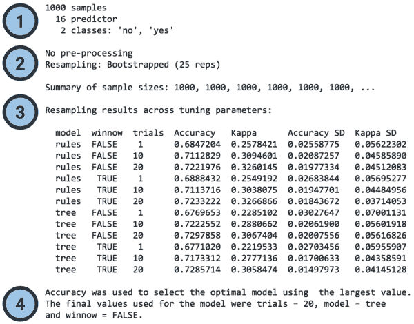
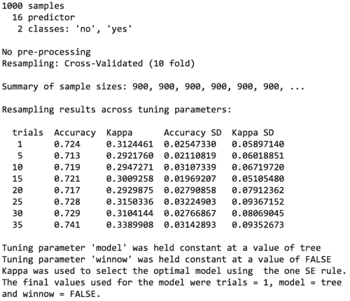
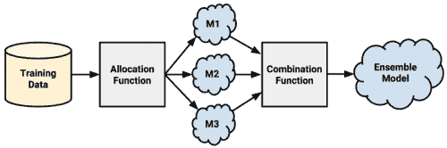
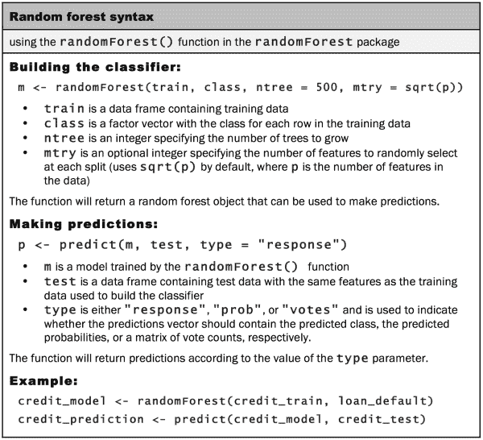

# 第十一章：改进模型性能

当一支运动队未能达到其目标时——无论目标是获得奥运金牌、联赛冠军还是世界纪录——它必须寻找可能的改进方向。假设你是该队的教练，你会如何安排训练？或许你会指示运动员更加努力训练或改变训练方式，以最大化他们的潜力。或者，你可能会强调更好的团队合作，更聪明地利用运动员的长处和短处。

现在，假设你正在训练一款世界级的机器学习算法。也许你希望参加数据挖掘竞赛，比如 Kaggle 上发布的竞赛（[`www.kaggle.com/competitions`](http://www.kaggle.com/competitions)）。或者你仅仅是希望改善商业成果。你该从哪里开始？尽管背景不同，但提升运动队表现的策略同样可以用来提升统计学习器的表现。

作为教练，你的任务是找到训练技巧和团队协作技能的组合，以帮助你实现性能目标。本章在本书中所覆盖的内容的基础上，介绍了一组提高机器学习器预测性能的技巧。你将学习：

+   如何通过系统地寻找最佳训练条件的组合来自动化模型性能调优

+   将模型组合成利用团队合作解决困难学习任务的方法

+   如何应用一种变体的决策树，这种决策树因其出色的表现而迅速流行

这些方法并非对每个问题都有效。然而，从机器学习竞赛的获奖作品来看，你可能会发现其中至少使用了某种方法。为了具有竞争力，你也需要将这些技能纳入你的技能库。

# 调优标准模型以提高性能

一些学习问题非常适合前几章中介绍的标准模型。在这种情况下，可能不需要花费太多时间反复调整和优化模型；它可能已经足够好。然而，另一方面，有些问题本质上更为复杂。需要学习的基本概念可能极为复杂，涉及许多微妙的关系，或者它可能受到随机变化的影响，使得在噪音中定义信号变得困难。

开发在困难问题上表现极佳的模型既是一门艺术，也是一门科学。在尝试找出性能提升的方向时，直觉有时是有帮助的。在其他情况下，找到提升的方法可能需要一种蛮力式的反复试验方法。当然，借助自动化程序，搜索可能的改进方法的过程可以得到帮助。

在第五章，*分治法——使用决策树和规则进行分类*中，我们尝试了解决一个难题：识别可能进入违约的贷款。尽管我们通过性能调优方法获得了大约 82%的可接受分类准确率，但在第十章，*模型性能评估*中仔细检查后，我们发现高准确率有些误导。尽管准确率合理，但 Kappa 统计量只有大约 0.28，表明模型的实际表现并不理想。在这一节中，我们将重新审视信用评分模型，看看是否可以改善结果。

### 提示

要跟随示例，下载 Packt Publishing 网站上的 `credit.csv` 文件，并将其保存到你的 R 工作目录中。使用命令 `credit <- read.csv("credit.csv")` 将文件加载到 R 中。

你可能还记得，我们首先使用了一个标准的 C5.0 决策树来构建信用数据的分类器。然后，我们尝试通过调整 `trials` 参数来增加提升迭代次数，从而提高模型性能。通过将迭代次数从默认值 1 增加到 10，我们成功提高了模型的准确度。这个调整模型选项以找出最佳拟合的过程称为**参数** **调优**。

参数调优不限于决策树。例如，当我们搜索最佳 *k* 值时，我们对 k-NN 模型进行了调优。当我们调整神经网络和支持向量机的节点数或隐藏层数，或者选择不同的核函数时，我们也进行了调优。大多数机器学习算法允许调整至少一个参数，而最复杂的模型提供了大量调节模型拟合的方法。尽管这使得模型能够更好地适应学习任务，但所有可能选项的复杂性可能会让人感到压倒。此时，更系统的方法是必要的。

## 使用 caret 进行自动化参数调优

与其为每个模型的参数选择任意的值——这不仅是繁琐的，而且有些不科学——不如通过搜索多个可能的参数值来找到最佳组合。

`caret` 包，我们在第十章，*模型性能评估*中广泛使用，提供了帮助自动化参数调优的工具。核心功能由 `train()` 函数提供，该函数作为一个标准化接口，支持超过 175 种不同的机器学习模型，用于分类和回归任务。通过使用这个函数，可以通过选择不同的评估方法和指标，自动化地搜索最优模型。

### 提示

不要被大量模型吓到——我们在前面的章节中已经介绍了很多模型。其他的模型只是基础概念的简单变体或扩展。考虑到你目前所学的内容，你应该有信心能理解所有可用的方法。

自动调优参数需要你考虑三个问题：

+   应该在数据上训练什么类型的机器学习模型（以及具体的实现）？

+   哪些模型参数可以调整，应该如何调节这些参数以找到最佳设置？

+   应该使用什么标准来评估模型，以找到最佳候选模型？

回答第一个问题需要在机器学习任务和 175 个模型之间找到一个合适的匹配。显然，这需要对机器学习模型的广度和深度有一定了解。进行排除法也会有所帮助。根据任务是分类还是数值预测，几乎一半的模型可以被排除；其他的可以根据数据的格式或是否需要避免使用黑箱模型来排除。无论如何，也没有理由不能尝试多种方法并比较每种方法的最佳结果。

解决第二个问题在很大程度上取决于模型的选择，因为每个算法使用一组独特的参数。本书中涵盖的预测模型的可用调优参数列在下表中。请记住，虽然一些模型可能有未显示的额外选项，但`caret`仅支持表中列出的选项进行自动调优。

| 模型 | 学习任务 | 方法名称 | 参数 |
| --- | --- | --- | --- |
| k 近邻算法 | 分类 | `knn` | `k` |
| 朴素贝叶斯 | 分类 | `nb` | `fL`, `usekernel` |
| 决策树 | 分类 | `C5.0` | `model`, `trials`, `winnow` |
| OneR 规则学习器 | 分类 | `OneR` | 无 |
| RIPPER 规则学习器 | 分类 | `JRip` | `NumOpt` |
| 线性回归 | 回归 | `lm` | 无 |
| 回归树 | 回归 | `rpart` | `cp` |
| 模型树 | 回归 | `M5` | `pruned`, `smoothed`, `rules` |
| 神经网络 | 双重用途 | `nnet` | `size`, `decay` |
| 支持向量机（线性核） | 双重用途 | `svmLinear` | `C` |
| 支持向量机（径向基核） | 双重用途 | `svmRadial` | `C, sigma` |
| 随机森林 | 双重用途 | `rf` | `mtry` |

### 提示

要查看`caret`所涵盖的模型及其调优参数的完整列表，请参考包作者 Max Kuhn 提供的表格：[`topepo.github.io/caret/modelList.html`](http://topepo.github.io/caret/modelList.html)。

如果你忘记了某个模型的调优参数，可以使用`modelLookup()`函数来查找它们。只需提供方法名称，以下是 C5.0 模型的示例：

```py
> modelLookup("C5.0")
 model parameter                 label forReg forClass probModel
1  C5.0    trials # Boosting Iterations  FALSE     TRUE      TRUE
2  C5.0     model            Model Type  FALSE     TRUE      TRUE
3  C5.0    winnow                Winnow  FALSE     TRUE      TRUE

```

自动调整的目标是搜索一个候选模型集合，这些模型由一组参数组合的矩阵或**网格**构成。由于不现实去搜索所有可能的组合，因此只使用部分可能性来构建网格。默认情况下，`caret` 每个 *p* 参数最多搜索三个值。这意味着最多会测试 *3^p* 个候选模型。例如，默认情况下，k-最近邻的自动调整会比较 *3¹ = 3* 个候选模型，分别对应 `k=5`、`k=7` 和 `k=9`。类似地，调整决策树将比较最多 27 个不同的候选模型，这些模型由 *3³ = 27* 个 `model`、`trials` 和 `winnow` 设置的组合构成。然而，实际上，只会测试 12 个模型。这是因为 `model` 和 `winnow` 参数只能取两个值（分别是 `tree` 与 `rules` 和 `TRUE` 与 `FALSE`），所以网格大小为 *3 * 2 * 2 = 12*。

### 提示

由于默认的搜索网格可能并不适合你的学习问题，`caret` 允许你通过一个简单的命令提供自定义的搜索网格，我们将在后面介绍。

自动调整模型的第三步也是最后一步，涉及从候选模型中识别最佳模型。这个过程使用了在第十章中讨论的方法，即通过选择重采样策略来创建训练集和测试集，并使用模型性能统计量来衡量预测准确性。

所有我们学到的重采样策略和许多性能统计量都得到了 `caret` 的支持。这些包括精度、Kappa（对于分类器）以及 R-squared 或 RMSE（对于数值模型）等统计量。如果需要，还可以使用如灵敏度、特异性和 ROC 曲线下的面积（AUC）等成本敏感度度量。

默认情况下，`caret` 会选择具有最大性能度量值的候选模型。由于这种做法有时会选择那些通过大幅增加模型复杂度来实现边际性能提升的模型，因此提供了替代的模型选择函数。

鉴于有各种各样的选项，许多默认设置是合理的，这一点非常有帮助。例如，`caret` 将使用在自助法样本上的预测准确度来选择最佳的分类模型表现者。通过这些默认值开始，我们可以调整 `train()` 函数来设计各种各样的实验。

### 创建一个简单的调整模型

为了说明调整模型的过程，我们首先观察一下当我们尝试使用 `caret` 包的默认设置来调整信用评分模型时会发生什么。接下来，我们将根据需要调整选项。

调整学习器的最简单方法只需通过`method`参数指定模型类型即可。由于我们之前在`credit`模型中使用了 C5.0 决策树，因此我们将继续通过优化此学习器来进行后续工作。使用默认设置调整 C5.0 决策树的基本`train()`命令如下：

```py
> library(caret)
> set.seed(300)
> m <- train(default ~ ., data = credit, method = "C5.0")

```

首先，使用`set.seed()`函数初始化 R 的随机数生成器，以一个设定的起始位置。你可能还记得我们在之前的章节中使用过这个函数。通过设置`seed`参数（在这里设为任意的数字 300），随机数将按照预定的序列生成。这使得使用随机抽样的模拟可以重复进行并得到相同的结果——这对于共享代码或重复先前的结果非常有帮助。

接下来，我们使用 R 公式接口定义一个树模型，表示为`default ~ .`。这个模型使用`credit`数据框中的所有其他特征来建模贷款违约状态（`yes`或`no`）。参数`method = "C5.0"`告诉`caret`使用 C5.0 决策树算法。

在输入前述命令后，可能会有一个较长的延迟（具体取决于你计算机的性能），因为调整过程正在进行。尽管这是一个相对较小的数据集，但仍需要进行大量的计算。R 必须反复生成随机数据样本，构建决策树，计算性能统计量并评估结果。

实验的结果保存在一个名为`m`的对象中。如果你想检查该对象的内容，`str(m)`命令会列出所有相关数据，但这可能会显得有些繁杂。相反，只需输入对象的名称，即可获得一个简洁的结果概览。例如，输入`m`会产生以下输出（注意，为了清晰起见，已添加标签）：



标签突出显示了输出中的四个主要组成部分：

1.  **输入数据集的简要描述**：如果你对自己的数据比较熟悉，并且正确应用了`train()`函数，这些信息应该不会让你感到惊讶。

1.  **应用的预处理和重采样方法报告**：在这里，我们看到使用了 25 个 bootstrap 样本，每个样本包括 1,000 个示例，用于训练模型。

1.  **评估的候选模型列表**：在这一部分，我们可以确认测试了 12 个不同的模型，这些模型是基于三个 C5.0 调整参数的组合——`model`、`trials`和`winnow`。每个候选模型的准确性和卡帕统计量的平均值和标准差也在这里显示。

1.  **最佳模型的选择**：正如脚注所述，选择了准确性最高的模型。这个模型使用了一个有 20 次试验的决策树，并设置`winnow = FALSE`。

在确定最佳模型后，`train()` 函数使用其调优参数在完整的输入数据集上构建模型，并将其存储在 `m` 列表对象中的 `m$finalModel`。在大多数情况下，你不需要直接使用 `finalModel` 子对象。相反，只需按如下方式使用 `predict()` 函数和 `m` 对象：

```py
> p <- predict(m, credit)

```

生成的预测向量按预期工作，使我们能够创建一个比较预测值和实际值的混淆矩阵：

```py
> table(p, credit$default)

p      no yes
 no  700   2
 yes   0 298

```

在用于训练最终模型的 1,000 个示例中，只有两个被错误分类。然而，非常重要的是要注意，由于模型是基于训练数据和测试数据构建的，因此该准确性是乐观的，不能作为未见数据的性能指标。总结输出中的 73% 自助法估计值是对未来表现的更现实估计。

使用 `train()` 和 `predict()` 函数除了自动参数调优外，还提供了几个额外的好处。

首先，`train()` 函数应用的任何数据准备步骤将同样应用于用于生成预测的数据。这包括像中心化、缩放以及缺失值填充等变换。让 `caret` 处理数据准备可以确保那些对最佳模型性能有贡献的步骤在模型部署时得以保留。

其次，`predict()` 函数提供了一个标准化接口，用于获取预测的类别值和类别概率，即使是那些通常需要额外步骤才能获取这些信息的模型类型。预测类别默认会被提供：

```py
> head(predict(m, credit))
[1] no  yes no  no  yes no
Levels: no yes

```

要获得每个类别的估计概率，请使用 `type = "prob"` 参数：

```py
> head(predict(m, credit, type = "prob"))
 no        yes
1 0.9606970 0.03930299
2 0.1388444 0.86115561
3 1.0000000 0.00000000
4 0.7720279 0.22797208
5 0.2948062 0.70519385
6 0.8583715 0.14162851

```

即使在底层模型使用不同字符串表示预测概率的情况下（例如，`naiveBayes` 模型使用 `"raw"`），`predict()` 函数也会在幕后将 `type = "prob"` 转换为适当的字符串。

### 自定义调优过程

我们之前创建的决策树展示了 `caret` 包在最小干预下生成优化模型的能力。默认设置使得优化模型的创建变得简单。然而，也可以更改默认设置，使其更符合学习任务的具体需求，这有助于解锁更高水平的性能。

模型选择过程中的每个步骤都可以定制。为了说明这一灵活性，让我们修改在信用决策树中的工作，使其与我们在第十章中使用的过程相似，*评估模型性能*。如果你还记得，我们使用 10 折交叉验证估算了 kappa 统计量。我们将在这里做同样的事情，使用 kappa 来优化决策树的提升参数。请注意，决策树提升在第五章中已有介绍，并将在本章后面更详细地讨论。

`trainControl()`函数用于创建一组配置选项，称为**控制对象**，它指导`train()`函数的执行。这些选项允许管理模型评估标准，例如重采样策略和用于选择最佳模型的度量标准。尽管此函数可以用来修改调优实验的几乎每个方面，我们将重点关注两个重要的参数：`method`和`selectionFunction`。

### 提示

如果你渴望获取更多细节，可以使用`?trainControl`命令查看所有参数的列表。

对于`trainControl()`函数，`method`参数用于设置重采样方法，如留出法或 k 折交叉验证。下表列出了所有可能的重采样方法类型以及调整样本大小和迭代次数的其他参数。尽管这些重采样方法的默认选项遵循了常见的惯例，但你可以根据数据集的大小和模型的复杂性调整这些选项。

| 重采样方法 | 方法名称 | 额外选项及默认值 |
| --- | --- | --- |
| 留出法采样 | `LGOCV` | `p = 0.75`（训练数据比例） |
| k 折交叉验证 | `cv` | `number = 10`（折数） |
| 重复 k 折交叉验证 | `repeatedcv` | `number = 10`（折数）`repeats = 10`（迭代次数） |
| 自助法采样 | `boot` | `number = 25`（重采样迭代次数） |
| 0.632 自助法 | `boot632` | `number = 25`（重采样迭代次数） |
| 留一交叉验证 | `LOOCV` | 无 |

`selectionFunction` 参数用于指定将在各种候选模型中选择最佳模型的函数。包括三种此类函数。`best` 函数简单地选择在指定性能度量上表现最好的候选模型，这是默认使用的函数。其他两个函数用于选择在性能上接近最佳模型的最简模型。`oneSE` 函数选择在最佳表现的一个标准误差范围内最简单的候选模型，而 `tolerance` 函数则在用户指定的百分比范围内选择最简单的候选模型。

### 提示

`caret` 包根据简化性对模型进行排名时涉及一些主观性。如需了解如何对模型进行排名，请在 R 命令提示符下输入 `?best`，查看选择函数的帮助页面。

若要创建一个名为 `ctrl` 的控制对象，该对象使用 10 折交叉验证和 `oneSE` 选择函数，请使用以下命令（请注意，`number = 10` 仅为清晰起见包含，因为这是 `method = "cv"` 的默认值，可以省略）：

```py
> ctrl <- trainControl(method = "cv", number = 10,
 selectionFunction = "oneSE")

```

我们很快将使用这个函数的结果。

与此同时，定义实验的下一步是创建要优化的参数网格。该网格必须包含每个期望模型参数命名的列，并以句点作为前缀。它还必须包含每个期望参数值组合的行。由于我们使用的是 C5.0 决策树，这意味着我们需要名为 `.model`、`.trials` 和 `.winnow` 的列。对于其他机器学习模型，请参考本章前面提供的表格，或者使用 `modelLookup()` 函数根据之前的描述查找参数。

与其一一填写数据框的每个单元格——如果有许多参数值组合，这将是一项繁琐的任务——我们可以使用 `expand.grid()` 函数，它可以根据提供的所有值的组合创建数据框。例如，假设我们希望保持 `model = "tree"` 和 `winnow = "FALSE"` 不变，同时搜索八种不同的 `trials` 值。这可以这样创建：

```py
> grid <- expand.grid(.model = "tree",
 .trials = c(1, 5, 10, 15, 20, 25, 30, 35),
 .winnow = "FALSE")

```

生成的网格数据框包含 *1 * 8 * 1 = 8* 行：

```py
> grid
 .model .trials .winnow
1   tree       1   FALSE
2   tree       5   FALSE
3   tree      10   FALSE
4   tree      15   FALSE
5   tree      20   FALSE
6   tree      25   FALSE
7   tree      30   FALSE
8   tree      35   FALSE

```

`train()` 函数将使用每行的模型参数组合构建一个候选模型进行评估。

给定这个搜索网格和先前创建的控制列表，我们准备运行一个彻底定制的 `train()` 实验。像之前一样，我们将随机种子设置为任意数字 `300`，以确保结果可重复。但这次，我们将在传递控制对象和调参网格的同时，添加一个参数 `metric = "Kappa"`，指示模型评估函数要使用的统计量——在这种情况下为 `"oneSE"`。完整命令如下：

```py
> set.seed(300)
> m <- train(default ~ ., data = credit, method = "C5.0",
 metric = "Kappa",
 trControl = ctrl,
 tuneGrid = grid)

```

这将生成一个对象，我们可以通过输入其名称查看：

```py
> m

```



尽管大部分输出与自动调优后的模型相似，但仍有一些值得注意的差异。由于使用了 10 折交叉验证，构建每个候选模型的样本大小被减少到了 900，而不是自助法中的 1,000。根据我们的要求，测试了八个候选模型。此外，由于`model`和`winnow`保持不变，它们的值不再显示在结果中，而是作为脚注列出。

这里的最佳模型与之前的实验差异明显。之前，最佳模型使用了`trials = 20`，而这里使用的是`trials = 1`。这个看似奇怪的发现是因为我们使用了`oneSE`规则，而不是`best`规则来选择最佳模型。尽管 35 次实验模型根据 kappa 值提供了最好的原始性能，但 1 次实验模型在性能上几乎相同，而且形式更加简单。简单模型不仅计算效率更高，而且还能减少过拟合训练数据的可能性。

# 通过元学习提高模型性能

作为提高单一模型性能的替代方法，可以将多个模型组合成一个强大的团队。就像最优秀的运动队拥有互补而非重叠技能的球员一样，一些最好的机器学习算法利用互补模型的团队。由于每个模型都会为学习任务带来独特的偏差，它可能很容易学习某个子集的样本，但对另一个子集则可能表现不佳。因此，通过智能地利用多个不同团队成员的优势，可以创建一个由多个弱学习者组成的强大团队。

结合和管理多个模型预测的技术属于**元学习**方法的一部分，定义了涉及学习如何学习的技术。这包括从简单的算法（通过反复设计决策逐步改进性能——例如，本章早些时候提到的自动参数调优）到使用借鉴自进化生物学和遗传学的概念进行自我修改和适应学习任务的高度复杂算法。

在本章剩余部分，我们将专注于**元学习**，仅限于建模多个模型预测与期望结果之间关系的内容。本节中介绍的基于团队合作的技术非常强大，并且在构建更有效的分类器时被广泛使用。

## 理解集成模型

假设你是电视答题节目的一名参赛者，可以选择五个朋友组成团队来帮助你回答最终的百万美元大奖问题。大多数人会试图选取一组多样化的学科专家。一个包含文学、科学、历史、艺术教授以及当代流行文化专家的团队，将是一个均衡的团队。考虑到他们的知识广度，几乎不可能有一个问题能让这个团队感到难倒。

利用类似于创建一个多样化专家团队的原理的元学习方法被称为**集成方法**。所有的集成方法都基于这样一个理念：通过将多个较弱的学习器组合起来，创造出一个更强的学习器。各种集成方法的区别，主要可以通过以下两个问题的答案来区分：

+   如何选择和/或构建弱学习模型？

+   如何将弱学习器的预测结果组合成一个最终的预测？

在回答这些问题时，想象集成方法的过程图可能会很有帮助；几乎所有的集成方法都遵循这个模式：



首先，使用输入的训练数据来构建多个模型。**分配函数**决定了每个模型接收多少训练数据。它们是否每个都接收到完整的训练数据集，还是仅仅接收到一个样本？它们是否每个都接收到所有特征，还是仅接收到一部分特征？

虽然理想的集成方法包括多样化的模型集，但分配函数可以通过人为改变输入数据来增加多样性，从而使得生成的学习器产生偏差，即使它们是同一类型的。例如，它可能使用自助抽样（bootstrap sampling）来构建独特的训练数据集，或者将不同的特征或样本子集传递给每个模型。另一方面，如果集成方法已经包含了多种算法——如神经网络、决策树和 k-NN 分类器——那么分配函数可能会将数据传递给每个算法，而数据保持相对不变。

在模型构建完成后，它们可以用于生成一组预测结果，这些预测结果必须以某种方式进行管理。**组合函数**决定了如何解决预测之间的分歧。例如，集成方法可能会使用多数投票来确定最终的预测结果，或者使用更复杂的策略，比如根据每个模型的历史表现来加权每个模型的投票。

一些集成方法甚至使用另一个模型来学习从各种预测组合中得到一个组合函数。例如，假设当*M1*和*M2*都投票“是”时，实际的类别值通常是“否”。在这种情况下，集成方法可以学习忽略*M1*和*M2*的投票，当它们一致时。这种使用多个模型的预测结果来训练最终裁定模型的过程被称为**堆叠**。


使用集成方法的一个好处是，它们可能让你在追求单一最佳模型时花费更少的时间。你可以训练多个合理强大的候选模型并将其结合起来。然而，方便性并不是集成方法在机器学习竞赛中持续获胜的唯一原因；集成方法在多个方面也提供了相对于单一模型的性能优势：

+   **更好的泛化能力**：由于多个学习者的意见被整合到最终的预测中，因此没有任何单一的偏差能够主导预测结果。这减少了过拟合学习任务的风险。

+   **在大规模或极小数据集上提升性能**：许多模型在使用非常大规模的特征或样本集时会遇到内存或复杂度的限制，这时训练多个小模型比训练一个完整的模型更高效。相反，集成方法在最小的数据集上也表现良好，因为许多集成设计本身就包含了如自助抽样（bootstrapping）等重采样方法。或许最重要的是，集成方法通常可以通过分布式计算方法并行训练。

+   **合成来自不同领域的数据的能力**：由于没有一种适用于所有情况的学习算法，集成方法能够结合来自多种学习者的证据，这在复杂现象依赖于来自不同领域的数据时变得越来越重要。

+   **对困难学习任务的更细致理解**：现实世界中的现象往往非常复杂，包含许多相互作用的细节。将任务划分为更小部分的模型，往往能更准确地捕捉到单一全局模型可能忽略的微妙模式。

如果你无法轻松地在 R 中应用集成方法，那么这些好处将大打折扣，幸运的是，已经有许多包可以用来实现这一点。我们来看一下几种最流行的集成方法，以及它们如何帮助提升我们正在研究的信用模型的性能。

## 自助法（Bagging）

第一个获得广泛认可的集成方法使用了一种叫做**自助聚合**（bootstrap aggregating），简称**Bagging**的方法。正如 Leo Breiman 在 1994 年所描述的那样，自助法通过对原始训练数据进行自助抽样生成多个训练数据集。这些数据集随后被用来生成一组模型，使用同一个学习算法。这些模型的预测结果通过投票（分类）或平均（数值预测）进行结合。

### 注意事项

关于自助法的更多信息，请参阅 Breiman L. *Bagging predictors*. Machine Learning. 1996; 24:123-140.

虽然袋装是一种相对简单的集成方法，但只要与相对**不稳定**的学习器一起使用，它可以表现得相当好。所谓不稳定学习器，就是那些生成的模型在输入数据发生轻微变化时会发生显著变化的模型。为了确保集成的多样性，即使是从 bootstrap 训练数据集之间仅有微小的变化，不稳定的模型是至关重要的。正因如此，袋装方法常常与决策树一起使用，因为决策树在输入数据发生微小变化时往往会发生剧烈变化。

`ipred`包提供了经典的袋装决策树实现。为了训练模型，`bagging()`函数的工作方式与之前使用的许多模型类似。`nbagg`参数用于控制在集成中投票的决策树数量（默认值为`25`）。根据学习任务的难度和训练数据的数量，增加这个数量可能会提高模型的性能，但也有一个限制。缺点是，这会带来额外的计算开销，因为训练大量的树可能需要一些时间。

安装`ipred`包后，我们可以按如下方式创建集成。我们将保持默认的 25 棵决策树：

```py
> library(ipred)
> set.seed(300)
> mybag <- bagging(default ~ ., data = credit, nbagg = 25)

```

生成的模型按预期工作，可以使用`predict()`函数：

```py
> credit_pred <- predict(mybag, credit)
> table(credit_pred, credit$default)

credit_pred  no yes
 no  699   2
 yes   1 298

```

根据之前的结果，该模型似乎非常适合训练数据。为了查看这一点如何转化为未来的表现，我们可以使用带有 10 倍交叉验证的袋装树，并使用`caret`包中的`train()`函数。请注意，`ipred`袋装树函数的方法名是`treebag`：

```py
> library(caret)
> set.seed(300)
> ctrl <- trainControl(method = "cv", number = 10)
> train(default ~ ., data = credit, method = "treebag",
 trControl = ctrl)

Bagged CART 

1000 samples
 16 predictor
 2 classes: 'no', 'yes' 

No pre-processing
Resampling: Cross-Validated (10 fold) 

Summary of sample sizes: 900, 900, 900, 900, 900, 900, ... 

Resampling results

 Accuracy  Kappa      Accuracy SD  Kappa SD 
 0.735     0.3297726  0.03439961   0.08590462

```

该模型的 kappa 统计量为 0.33，表明集成树模型的表现至少与我们在本章早些时候调优的最佳 C5.0 决策树相当。这说明了集成方法的强大；一组简单的学习器协同工作可以超越非常复杂的模型。

为了超越决策树的袋装，`caret`包还提供了一个更通用的`bag()`函数。它原生支持一些模型，尽管通过一些额外的努力，它可以适配到其他类型的模型。`bag()`函数使用控制对象来配置袋装过程。它需要指定三个函数：一个用于拟合模型，一个用于做出预测，一个用于聚合投票。

例如，假设我们想要创建一个袋装支持向量机模型，可以使用我们在第七章中使用的`kernlab`包中的`ksvm()`函数。`bag()`函数要求我们提供训练 SVM、做出预测和统计投票的功能。

我们无需自己编写这些功能，`caret`包内置的`svmBag`列表对象提供了三个我们可以使用的函数：

```py
> str(svmBag)
List of 3
 $ fit      :function (x, y, ...) 
 $ pred     :function (object, x) 
 $ aggregate:function (x, type = "class")

```

通过查看`svmBag$fit`函数，我们可以看到它只是调用了`kernlab`包中的`ksvm()`函数并返回结果：

```py
> svmBag$fit
function (x, y, ...) 
{
 library(kernlab)
 out <- ksvm(as.matrix(x), y, prob.model = is.factor(y), ...)
 out
}
<environment: namespace:caret>

```

`svmBag`的`pred`和`aggregate`函数也同样简单。通过研究这些函数并以相同的格式创建自己的函数，可以使用袋装法与任何你想要的机器学习算法。

### 提示

`caret`包还包括了朴素贝叶斯模型袋（`nbBag`）、决策树（`ctreeBag`）和神经网络（`nnetBag`）的示例对象。

通过应用`svmBag`列表中的三个函数，我们可以创建一个袋装控制对象：

```py
> bagctrl <- bagControl(fit = svmBag$fit, 
 predict = svmBag$pred,
 aggregate = svmBag$aggregate)

```

通过将此与`train()`函数和之前定义的训练控制对象（`ctrl`）一起使用，我们可以如下评估袋装 SVM 模型（请注意，`kernlab`包是必需的，如果尚未安装，需要先安装它）：

```py
> set.seed(300)
> svmbag <- train(default ~ ., data = credit, "bag",
 trControl = ctrl, bagControl = bagctrl)
> svmbag

Bagged Model
1000 samples
 16 predictors
 2 classes: 'no', 'yes' 

No pre-processing
Resampling: Cross-Validation (10 fold) 

Summary of sample sizes: 900, 900, 900, 900, 900, 900, ... 

Resampling results

 Accuracy  Kappa      Accuracy SD  Kappa SD 
 0.728     0.2929505  0.04442222   0.1318101

Tuning parameter 'vars' was held constant at a value of 35

```

由于 kappa 统计量低于 0.30，似乎袋装 SVM 模型的表现不如袋装决策树模型。值得指出的是，与袋装决策树模型相比，kappa 统计量的标准差相当大。这表明，在交叉验证的各个折叠中，性能变化很大。这种变化可能意味着通过增加集成中的模型数量，性能可能会进一步提高。

## 提升法

另一种常见的基于集成的方法称为**提升法**，因为它通过提升弱学习器的表现来达到强学习器的表现。这种方法主要基于 Robert Schapire 和 Yoav Freund 的工作，他们在这个主题上发表了大量的研究。

### 注意

有关提升法的更多信息，请参考 Schapire RE, Freund Y. *Boosting: Foundations and Algorithms*。剑桥，马萨诸塞州，麻省理工学院出版社；2012 年。

类似于袋装法，提升法（boosting）使用在重采样数据上训练的模型集和投票来确定最终预测。这里有两个关键的区别。首先，提升法中的重采样数据集是特别构建的，目的是生成互补的学习器。其次，提升法不是给每个学习器平等的投票，而是根据其过去的表现为每个学习器的投票加权。表现较好的模型在集成中的最终预测中有更大的影响。

提升法通常会产生比集成中最好的模型更优的表现，且绝不会差于最强的模型。由于集成中的模型是为了互补性而构建的，假设每个分类器的表现优于随机机会，理论上可以通过增加额外的分类器来随意提高集成的性能。考虑到这一发现的明显实用性，提升法被认为是机器学习领域最重要的发现之一。

### 提示

尽管提升方法可以创建一个满足任意低误差率的模型，但在实践中这可能并不总是合理的。首先，随着更多学习器的加入，性能提升会越来越小，这使得某些阈值在实际中不可行。此外，追求纯粹的准确度可能会导致模型过拟合训练数据，而无法推广到未见过的数据。

一种名为**AdaBoost**或**自适应增强**的提升算法由 Freund 和 Schapire 于 1997 年提出。该算法基于生成弱学习器的思想，通过对频繁被误分类的样本给予更多关注（即，赋予更大的权重），迭代地学习更多难以分类的样本。

从一个未加权的数据集开始，第一个分类器尝试对结果进行建模。分类器正确预测的样本将不太可能出现在下一个分类器的训练数据集中，反之，难以分类的样本将更频繁地出现。随着更多轮弱学习器的加入，它们在越来越难分类的样本上进行训练。该过程持续进行，直到达到预期的整体误差率或性能不再提高为止。此时，每个分类器的投票将根据其在训练数据上的准确性进行加权。

虽然提升原理几乎可以应用于任何类型的模型，但这些原理最常见的应用是与决策树一起使用。我们在第五章中，*分治法 – 使用决策树和规则进行分类*，已经使用提升方法来提高 C5.0 决策树的性能。

**AdaBoost.M1**算法提供了另一个基于树的 AdaBoost 实现，用于分类。AdaBoost.M1 算法可以在`adabag`包中找到。

### 注意

如需了解更多关于`adabag`包的信息，请参考 Alfaro E, Gamez M, Garcia N 的文章。*adabag – an R package for classification with boosting and bagging*。统计软件杂志。2013；54：1-35。

让我们为信用数据创建一个`AdaBoost.M1`分类器。该算法的一般语法与其他建模技术类似：

```py
> set.seed(300)
> m_adaboost <- boosting(default ~ ., data = credit)

```

像往常一样，`predict()`函数应用于结果对象以进行预测：

```py
> p_adaboost <- predict(m_adaboost, credit)

```

与传统方法不同，该方法并不是返回预测结果的向量，而是返回一个包含模型信息的对象。预测结果存储在名为`class`的子对象中：

```py
> head(p_adaboost$class)
[1] "no"  "yes" "no"  "no"  "yes" "no"

```

混淆矩阵可以在`confusion`子对象中找到：

```py
> p_adaboost$confusion
 Observed Class
Predicted Class  no yes
 no  700   0
 yes   0 300

```

你注意到 AdaBoost 模型没有犯错吗？在你兴奋之前，记住之前的混淆矩阵是基于模型在训练数据上的表现。由于提升方法允许将错误率降低到任意低的水平，学习器会继续训练直到不再犯错。这很可能导致了在训练数据集上的过拟合。

为了更准确地评估在未见数据上的表现，我们需要使用另一种评估方法。`adabag`包提供了一个简单的函数来使用 10 折交叉验证（10-fold CV）：

```py
> set.seed(300)
> adaboost_cv <- boosting.cv(default ~ ., data = credit)

```

根据你计算机的性能，这可能需要一些时间，期间它会在屏幕上记录每次迭代。完成后，我们可以查看一个更合理的混淆矩阵：

```py
> adaboost_cv$confusion
 Observed Class
Predicted Class  no yes
 no  594 151
 yes 106 149

```

我们可以使用`vcd`包找到 kappa 统计量，具体方法参见第十章，*评估模型性能*。

```py
> library(vcd)
> Kappa(adaboost_cv$confusion)
 value       ASE
Unweighted 0.3606965 0.0323002
Weighted   0.3606965 0.0323002

```

该模型的 kappa 值约为 0.36，这是我们迄今为止表现最好的信用评分模型。让我们看看它与最后一种集成方法的比较。

### 提示

可以通过在`caret`中指定`method = "AdaBoost.M1"`来调整 AdaBoost.M1 算法。

## 随机森林

另一种基于集成的方法，称为**随机森林**（或**决策树森林**），仅专注于决策树的集成。这一方法由 Leo Breiman 和 Adele Cutler 提倡，结合了袋装（bagging）和随机特征选择的基本原则，以增加决策树模型的多样性。在生成了决策树集成（森林）之后，模型通过投票来合并这些树的预测结果。

### 注意

关于随机森林构建的更多细节，请参阅 Breiman L. *Random Forests*。机器学习，2001；45：5-32。

随机森林将多样性和强大功能融合为单一的机器学习方法。由于集成只使用了完整特征集中的一小部分随机特征，随机森林可以处理非常大的数据集，在这些数据集中，所谓的“维度灾难”可能会导致其他模型失败。与此同时，它在大多数学习任务上的错误率与几乎所有其他方法相当。

### 提示

虽然“随机森林”（Random Forests）这个术语是由 Breiman 和 Cutler 注册的商标，但有时人们也用它来泛指任何类型的决策树集成。一个严格的学者会使用更通用的术语“决策树森林”，除非是在指 Breiman 和 Cutler 的具体实现。

值得注意的是，相对于其他基于集成的方法，随机森林非常具有竞争力，并且相较于其他方法具有关键优势。例如，随机森林往往更容易使用，且不容易发生过拟合。下表列出了随机森林模型的一般优缺点：

| 优点 | 缺点 |
| --- | --- |

|

+   一种在大多数问题上表现良好的通用模型

+   能处理噪声或缺失数据以及类别型或连续型特征

+   仅选择最重要的特征

+   可以用于具有极大量特征或样本的数据

|

+   与决策树不同，该模型不容易解释

+   可能需要一些工作来调整模型以适应数据

|

由于随机森林具有强大的功能、广泛的适应性和易用性，它们正在迅速成为最受欢迎的机器学习方法之一。在本章后面，我们将把随机森林模型与增强版的 C5.0 决策树进行正面比较。

### 训练随机森林

虽然在 R 中有多个包可以创建随机森林，但`randomForest`包可能是最忠实于 Breiman 和 Cutler 规范的实现，并且也受到`caret`包的支持，可以进行自动化调参。训练该模型的语法如下：



默认情况下，`randomForest()`函数会创建一个包含 500 棵树的集成模型，每棵树在每次分裂时都会考虑`sqrt(p)`个随机特征，其中`p`是训练数据集中的特征数量，`sqrt()`是 R 的平方根函数。是否使用这些默认参数取决于学习任务和训练数据的性质。一般来说，更复杂的学习问题和更大的数据集（无论是更多的特征还是更多的样本）都能通过更多的树来取得更好的效果，但这需要与训练更多树的计算开销进行平衡。

使用大量决策树的目的是训练足够多的树，以便每个特征都有机会出现在多个模型中。这也是`mtry`参数的默认值`sqrt(p)`的基础；使用该值限制特征的数量，确保树与树之间有足够的随机变化。例如，由于信用数据有 16 个特征，每棵树在任何时候只能在四个特征上进行分裂。

让我们来看一下默认的`randomForest()`参数如何与信用数据一起使用。我们将像之前训练其他学习器一样训练模型。再次强调，`set.seed()`函数确保结果可以复现：

```py
> library(randomForest)
> set.seed(300)
> rf <- randomForest(default ~ ., data = credit)

```

要查看模型表现的总结，我们只需输入结果对象的名称：

```py
> rf

Call:
 randomForest(formula = default ~ ., data = credit) 
 Type of random forest: classification
 Number of trees: 500
No. of variables tried at each split: 4

 OOB estimate of error rate: 23.8%
Confusion matrix:
 no yes class.error
no  640  60  0.08571429
yes 178 122  0.59333333

```

输出结果显示随机森林包括了 500 棵树，并且在每次分裂时尝试了四个变量，正如我们所期望的那样。乍一看，你可能会对困惑矩阵中看似不理想的表现感到惊讶——23.8%的错误率远高于到目前为止其他集成方法的重置误差。然而，这个困惑矩阵并没有显示重置误差。相反，它反映的是**袋外错误率**（在输出中列为`OOB estimate of error rate`），与重置误差不同，袋外错误率是测试集错误的无偏估计。这意味着它应该是对未来表现的相当合理的估计。

袋外估计在构建随机森林时计算。实际上，任何没有被选为单棵树的自助法样本的例子，都可以用来测试模型在未见过数据上的表现。在森林构建结束时，每个例子在每次被保留时的预测都会被统计，并通过投票来确定该例子的最终预测结果。这样的预测的总误差率即为袋外误差率。

### 评估随机森林性能

如前所述，`randomForest()`函数得到了`caret`的支持，这使我们能够优化模型，同时计算袋外误差率以外的性能度量。为了增加趣味性，我们将比较一个自动调优的随机森林与我们开发的最佳自动调优提升 C5.0 模型。我们将这次实验视为希望找到一个候选模型，提交到机器学习竞赛中。

我们首先需要加载`caret`并设置训练控制选项。为了对模型性能进行最准确的比较，我们将使用重复的 10 折交叉验证，或者说是重复 10 次的 10 折交叉验证。这意味着模型的构建时间将大大增加，并且评估计算量会更大，但由于这是我们的最终比较，我们必须*非常*确保我们做出了正确的选择；这场对决的胜者将是我们唯一进入机器学习竞赛的模型。

```py
> library(caret)
> ctrl <- trainControl(method = "repeatedcv",
 number = 10, repeats = 10)

```

接下来，我们将为随机森林设置调优网格。该模型的唯一调优参数是`mtry`，它定义了每次分裂时随机选择多少特征。默认情况下，我们知道随机森林将使用`sqrt(16)`，即每棵树使用四个特征。为了全面起见，我们还将测试该值的一半、两倍以及完整的 16 个特征。因此，我们需要创建一个包含`2`、`4`、`8`和`16`的网格，如下所示：

```py
> grid_rf <- expand.grid(.mtry = c(2, 4, 8, 16))

```

### 提示

一个在每次分裂时考虑完整特征集的随机森林，本质上与一个集成决策树模型相同。

我们可以将生成的网格传递给`train()`函数，并使用`ctrl`对象，如下所示。我们将使用 kappa 指标来选择最佳模型：

```py
> set.seed(300)
> m_rf <- train(default ~ ., data = credit, method = "rf",
 metric = "Kappa", trControl = ctrl,
 tuneGrid = grid_rf)

```

前面的命令可能需要一些时间才能完成，因为它有很多工作要做！完成后，我们将与使用`10`、`20`、`30`和`40`次迭代的提升树进行比较：

```py
> grid_c50 <- expand.grid(.model = "tree",
 .trials = c(10, 20, 30, 40),
 .winnow = "FALSE")
> set.seed(300)
> m_c50 <- train(default ~ ., data = credit, method = "C5.0",
 metric = "Kappa", trControl = ctrl,
 tuneGrid = grid_c50)

```

当 C5.0 决策树最终完成时，我们可以将这两种方法进行并排比较。对于随机森林模型，结果是：

```py
> m_rf

Resampling results across tuning parameters:

 mtry  Accuracy  Kappa      Accuracy SD  Kappa SD 
 2    0.7247    0.1284142  0.01690466   0.06364740
 4    0.7499    0.2933332  0.02989865   0.08768815
 8    0.7539    0.3379986  0.03107160   0.08353988
 16    0.7556    0.3613151  0.03379439   0.08891300

```

对于提升 C5.0 模型，结果是：

```py
> m_c50

Resampling results across tuning parameters:

 trials  Accuracy  Kappa      Accuracy SD  Kappa SD 
 10      0.7325    0.3215655  0.04021093   0.09519817
 20      0.7343    0.3268052  0.04033333   0.09711408
 30      0.7381    0.3343137  0.03672709   0.08942323
 40      0.7388    0.3335082  0.03934514   0.09746073

```

在`mtry = 16`时，随机森林模型的 kappa 约为 0.361，是这八个模型中表现最好的。它高于最佳的 C5.0 决策树，其 kappa 约为 0.334，并且略高于 kappa 约为 0.360 的`AdaBoost.M1`模型。根据这些结果，我们将提交随机森林模型作为最终模型。在没有实际在竞赛数据上评估模型的情况下，我们无法确定它是否最终获胜，但根据我们的性能评估，它是更安全的选择。幸运的话，也许我们能赢得奖项。

# 总结

阅读本章后，你现在应该知道了在数据挖掘和机器学习竞赛中获胜所需的基本技术。自动调优方法可以帮助从单一模型中挤出每一分性能。另一方面，通过创建多个协同工作的机器学习模型，也可以实现性能的提升。

尽管本章旨在帮助你准备竞赛级别的模型，但请注意，你的竞争对手也可以使用相同的技术。你不能停滞不前；因此，继续将独特的方法加入你的工具箱。也许你能带来独特的专业知识，或者也许你的优势在于数据准备时对细节的关注。无论如何，实践出真知，因此利用开放竞赛来测试、评估和提升你自己的机器学习技能。

在下一章——本书的最后一章——我们将从更高的角度审视如何利用 R 语言将机器学习应用于一些高度专业化且复杂的领域。你将获得将机器学习应用于前沿任务所需的知识。
