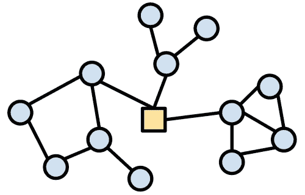
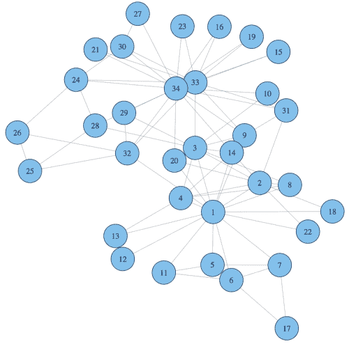
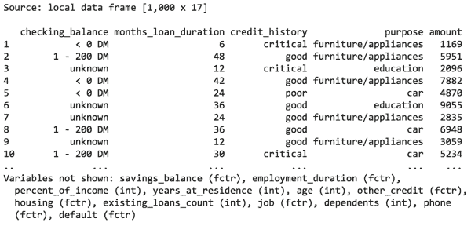
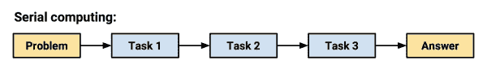
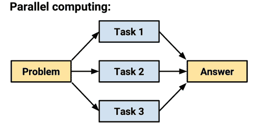
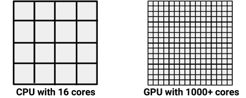

# 第十二章：专门的机器学习主题

恭喜你已经到达了机器学习旅程的这一阶段！如果你还没有开始自己的项目，很快就会开始。而在这过程中，你可能会发现将数据转化为行动的任务比最初想象的要更为困难。

当你收集数据时，你可能已经意识到信息被困在专有格式中，或者分布在互联网上的各个页面上。更糟糕的是，经过几个小时的重新格式化，可能因为内存不足，电脑变得极其缓慢。也许 R 甚至崩溃或冻结了你的机器。希望你没有气馁，因为这些问题可以通过多一点努力得到解决。

本章介绍了可能并不适用于所有项目的技术，但在处理这些专业性问题时，将会非常有用。如果你经常处理以下类型的数据，你可能会特别觉得这些信息有用：

+   存储在无结构或专有格式中，例如网页、Web API 或电子表格

+   来自生物信息学或社交网络分析等专业领域

+   数据太大无法加载到内存中，或者分析需要非常长的时间才能完成

如果你遇到这些问题，你并不孤单。虽然没有万能的解决方案——这些问题是数据科学家的痛点，也是数据技能需求高涨的原因——通过 R 社区的努力，许多 R 包为解决这些问题提供了一个起点。

本章提供了一本这样的解决方案食谱。即使你是经验丰富的 R 老手，你也可能会发现一个简化工作流程的包。或者，也许有一天，你会编写一个让大家的工作变得更轻松的包！

# 处理专有文件和数据库

与本书中的例子不同，现实世界中的数据很少以简单的 CSV 格式进行打包，可以从网站下载。相反，准备数据进行分析需要付出相当大的努力。数据必须被收集、合并、排序、过滤或重新格式化，以满足学习算法的要求。这个过程通常被称为**数据清理**或**数据整理**。

随着典型数据集的大小从兆字节增长到千兆字节，且数据来自无关且凌乱的来源，许多数据被存储在庞大的数据库中，数据准备变得更加重要。以下章节列出了几个用于检索和处理专有数据格式及数据库的包和资源。

## 从 Microsoft Excel、SAS、SPSS 和 Stata 文件中读取和写入数据

数据分析的一个令人沮丧的方面是需要花费大量工作去从各种专有格式中提取和结合数据。海量的数据存储在文件和数据库中，只需解锁它们，便可用于 R 中。幸运的是，正是为了这个目的，存在相关的 R 包。

过去，需要掌握多个 R 包中的特定技巧和工具，才能完成繁琐且费时的过程。而现在，由于一个相对较新的 R 包`rio`（代表 R 输入输出），这一过程变得轻而易举。这个包由 Chung-hong Chan、Geoffrey CH Chan、Thomas J. Leeper 和 Christopher Gandrud 开发，被描述为“数据的瑞士军刀”。它能够导入和导出多种文件格式，包括但不限于：制表符分隔（`.tsv`）、逗号分隔（`.csv`）、JSON（`.json`）、Stata（`.dta`）、SPSS（`.sav`和`.por`）、Microsoft Excel（`.xls`和`.xlsx`）、Weka（`.arff`）和 SAS（`.sas7bdat`和`.xpt`）等。

### 注意

有关`rio`可以导入和导出的文件类型的完整列表，以及更详细的使用示例，请参见[`cran.r-project.org/web/packages/rio/vignettes/rio.html`](http://cran.r-project.org/web/packages/rio/vignettes/rio.html)。

`rio`包包含三个用于处理专有数据格式的函数：`import()`、`export()`和`convert()`。根据函数的名称，它们分别完成预期的操作。与该包保持简单的理念一致，每个函数通过文件名扩展名来猜测要导入、导出或转换的文件类型。

例如，要导入前几章中的信用数据，它以 CSV 格式存储，只需键入：

```py
> library(rio)
> credit <- import("credit.csv")

```

这将创建预期的`credit`数据框；作为额外好处，我们不仅无需指定 CSV 文件类型，`rio`还自动设置了`stringsAsFactors = FALSE`以及其他合理的默认值。

要将`credit`数据框导出为 Microsoft Excel（`.xlsx`）格式，请使用`export()`函数并指定所需的文件名，如下所示。对于其他格式，只需将文件扩展名更改为所需的输出类型：

```py
> export(credit, "credit.xlsx")

```

也可以直接使用`convert()`函数将 CSV 文件转换为另一种格式，无需导入步骤。例如，这将`credit.csv`文件转换为 Stata（`.dta`）格式：

```py
> convert("credit.csv", "credit.dta")

```

尽管`rio`包覆盖了许多常见的专有数据格式，但它并不支持所有操作。下一节将介绍通过数据库查询将数据导入 R 的其他方法。

## 查询 SQL 数据库中的数据

大型数据集通常存储在**数据库管理系统**（**DBMSs**）中，如 Oracle、MySQL、PostgreSQL、Microsoft SQL 或 SQLite。这些系统允许使用**结构化查询语言**（**SQL**）访问数据集，SQL 是一种用于从数据库中提取数据的编程语言。如果你的 DBMS 配置为允许**开放数据库连接**（**ODBC**），则可以使用 Brian Ripley 的`RODBC`包将数据直接导入 R 数据框。

### 提示

如果您在使用 ODBC 连接到数据库时遇到困难，可以尝试使用一些特定于 DBMS 的 R 包。这些包包括 `ROracle`、`RMySQL`、`RPostgresSQL` 和 `RSQLite`。虽然它们的功能与这里的指令大致相似，但请参考 CRAN 上的包文档，获取每个包特定的说明。

ODBC 是一种标准协议，用于连接数据库，与操作系统或数据库管理系统无关。如果您之前连接过 ODBC 数据库，您很可能会通过其 **数据源名称** (**DSN**) 来引用它。要使用 `RODBC`，您需要 DSN 以及用户名和密码（如果数据库需要的话）。

### 提示

配置 ODBC 连接的指令非常依赖于操作系统和数据库管理系统（DBMS）的组合。如果您在设置 ODBC 连接时遇到问题，请与您的数据库管理员联系。另一种获取帮助的方式是通过 `RODBC` 包的 `vignette`，在安装了 `RODBC` 包之后，可以通过 R 中的 `vignette("RODBC")` 命令访问。

要为数据库使用 `my_dsn` DSN 打开一个名为 `my_db` 的连接，请使用 `odbcConnect()` 函数：

```py
> library(RODBC)
> my_db <- odbcConnect("my_dsn")

```

如果您的 ODBC 连接需要用户名和密码，应该在调用 `odbcConnect()` 函数时指定：

```py
> my_db <- odbcConnect("my_dsn",
 uid = "my_username",
 pwd = "my_password")

```

在打开的数据库连接下，我们可以使用 `sqlQuery()` 函数根据 SQL 查询拉取的数据库行创建 R 数据框。此函数与许多创建数据框的函数类似，允许我们指定 `stringsAsFactors = FALSE`，以防止 R 自动将字符数据转换为因子。

`sqlQuery()` 函数使用典型的 SQL 查询，如下面的命令所示：

```py
> my_query <- "select * from my_table where my_value = 1"
> results_df <- sqlQuery(channel = my_db, query = sql_query,
 stringsAsFactors = FALSE)

```

结果 `results_df` 对象是一个数据框，包含了使用存储在 `sql_query` 中的 SQL 查询选择的所有行。

一旦完成使用数据库，可以使用以下命令关闭连接：

```py
> odbcClose(my_db)

```

尽管 R 会在 R 会话结束时自动关闭 ODBC 连接，但最好明确地执行此操作。

# 使用在线数据和服务

随着来自网络来源的数据量不断增加，机器学习项目能否访问并与在线服务互动变得越来越重要。R 本身能够从在线源读取数据，但有一些注意事项。首先，默认情况下，R 无法访问安全网站（即使用 `https://` 而非 `http://` 协议的网站）。其次，需要注意的是，大多数网页并没有以 R 可以理解的格式提供数据。在数据可以有用之前，它需要被 **解析**，即拆解并重建为结构化的形式。我们稍后将讨论一些解决方法。

然而，如果这些警告都不适用（也就是说，如果数据已经在一个不安全的网站上并且是表格形式，如 CSV 格式，R 可以原生理解），那么 R 的`read.csv()`和`read.table()`函数就能像访问本地机器上的数据一样，访问网络上的数据。只需提供数据集的完整 URL，如下所示：

```py
> mydata <- read.csv("http://www.mysite.com/mydata.csv")

```

R 还提供了从网络下载其他文件的功能，即使 R 无法直接使用它们。对于文本文件，可以尝试以下`readLines()`函数：

```py
> mytext <- readLines("http://www.mysite.com/myfile.txt")

```

对于其他类型的文件，可以使用`download.file()`函数。要将文件下载到 R 的当前工作目录，只需提供 URL 和目标文件名，如下所示：

```py
> download.file("http://www.mysite.com/myfile.zip", "myfile.zip")

```

除了这些基本功能外，还有许多包扩展了 R 处理在线数据的能力。最基础的部分将在接下来的章节中介绍。由于网络庞大且不断变化，这些章节远不是 R 连接到在线数据的所有方法的全面集合。实际上，几乎每个领域都有成百上千个包，涵盖从小型项目到大型项目的各种需求。

### 注意

要获取最完整且最新的包列表，请参考定期更新的 CRAN 网页技术与服务任务视图，地址为[`cran.r-project.org/web/views/WebTechnologies.html`](http://cran.r-project.org/web/views/WebTechnologies.html)。

## 下载网页的完整文本

Duncan Temple Lang 的`RCurl`包提供了一种更强大的方式来访问网页，通过为**curl**（URL 客户端）工具提供一个 R 接口，这个工具是一个命令行工具，用于通过网络传输数据。curl 程序就像一个可编程的网页浏览器；给定一组命令，它可以访问并下载网络上几乎所有可用的内容。与 R 不同，它不仅可以访问安全网站，还能向在线表单提交数据。它是一个极其强大的工具。

### 注意

正因为 curl 功能如此强大，完整的 curl 教程超出了本章的范围。相反，请参考在线`RCurl`文档，地址为[`www.omegahat.org/RCurl/`](http://www.omegahat.org/RCurl/)。

安装`RCurl`包后，下载一个页面就像输入以下命令那样简单：

```py
> library(RCurl) 
> packt_page <- ("https://www.packtpub.com/")

```

这将把 Packt Publishing 主页的完整文本（包括所有网页标记）保存到名为`packt_page`的 R 字符对象中。正如接下来的几行所示，这并不是非常有用：

```py
> str(packt_page, nchar.max=200)
 chr "<!DOCTYPE html>\n<html xmlns=\"http://www.w3.org/1999/xhtml\" lang=\"en\" xml:lang=\"en\">\n\t<head>\n\t\t<title>Packt Publishing | Technology Books, eBooks & Videos</title>\n\t\t<script>\n\t\t\tdata"| __truncated__

```

页面前 200 个字符看起来像是乱码的原因是因为网站使用**超文本标记语言**（**HTML**）编写，它将页面文本与特殊的标签结合，这些标签告诉浏览器如何显示文本。这里的`<title>`和`</title>`标签包围了页面标题，告诉浏览器这是 Packt Publishing 主页。类似的标签用于标示页面的其他部分。

虽然 curl 是访问在线内容的跨平台标准，但如果你在 R 中频繁处理网页数据，Hadley Wickham 开发的 `httr` 包基于 `RCurl` 打造，使其更加便捷且符合 R 的使用习惯。通过尝试使用 `httr` 包的 `GET()` 函数下载 Packt Publishing 的主页，我们可以立刻看到一些不同：

```py
> library(httr)
> packt_page <- GET("https://www.packtpub.com")
> str(packt_page, max.level = 1)
List of 9
 $ url        : chr "https://www.packtpub.com/"
 $ status_code: int 200
 $ headers    : List of 11
 $ all_headers: List of 1
 $ cookies    : list()
 $ content    : raw [1:58560] 3c 21 44 4f ...
 $ date       : POSIXct[1:1], format: "2015-05-24 20:46:40"
 $ times      : Named num [1:6] 0 0.000071 0.000079 ...
 $ request    : List of 5

```

在 `RCurl` 中的 `getURL()` 函数仅下载 HTML 内容，而 `GET()` 函数则返回一个包含网站属性的列表，此外还包括 HTML 内容。要访问页面内容本身，我们需要使用 `content()` 函数：

```py
> str(content(packt_page, type="text"), nchar.max=200)
 chr "<!DOCTYPE html>\n<html xmlns=\"http://www.w3.org/1999/xhtml\" lang=\"en\" xml:lang=\"en\">\n\t<head>\n\t\t<title>Packt Publishing | Technology Books, eBooks & Videos</title>\n\t\t<script>\n\t\t\tdata"| __truncated__

```

要在 R 程序中使用这些数据，需要处理页面，将其转化为像列表或数据框这样的结构化格式。如何进行这一步骤将在接下来的章节中讨论。

### 注意

要了解更详细的 `httr` 文档和教程，请访问项目的 GitHub 页面：[`github.com/hadley/httr`](https://github.com/hadley/httr)。快速入门指南特别有助于学习基本功能。

## 从网页抓取数据

由于许多网页的 HTML 标签结构是统一的，我们可以编写程序来寻找页面中的目标部分，并将其提取出来，最终将数据编译成一个数据集。这一从网站抓取数据并将其转换为结构化形式的过程，称为 **网页抓取**。

### 提示

尽管网页抓取被广泛使用，但它应该被视为从 Web 获取数据的最后手段。原因在于，任何对基础 HTML 结构的更改都可能使代码失效，修复时可能需要额外的工作。更糟糕的是，这可能会在数据中引入不可察觉的错误。此外，许多网站的使用条款明确禁止自动化数据提取，更不用说你的程序的流量可能会超载他们的服务器。在开始项目前，务必检查网站的条款；你甚至可能发现该网站通过开发者协议免费提供数据。

Hadley Wickham 开发的 `rvest` 包（"harvest" 的双关语）使得网页抓取过程基本不费吹灰之力，前提是你想要的数据可以在 HTML 中的某个固定位置找到。

让我们从一个简单的例子开始，使用 Packt Publishing 的主页。我们首先使用 `rvest` 包中的 `html()` 函数下载页面。请注意，这个函数在提供 URL 时，实际上是调用了 Hadley Wickham 的 `httr` 包中的 `GET()` 函数：

```py
> library(rvest)
> packt_page <- html("https://www.packtpub.com")

```

假设我们想要抓取页面标题。通过查看之前的 HTML 代码，我们知道每个页面只有一个标题，它被包裹在 `<title>` 和 `</title>` 标签之间。为了提取标题，我们将标签名称传递给 `html_node()` 函数，代码如下：

```py
> html_node(packt_page, "title")
<title>Packt Publishing | Technology Books, eBooks &amp; Videos</title>

```

这样可以保持 HTML 格式不变，包括 `<title>` 标签和 `&amp;` 代码，这是 HTML 中代表和符号的标记。要将其转换为纯文本，我们只需通过 `html_text()` 函数进行处理，如下所示：

```py
> html_node(packt_page, "title") %>% html_text()
[1] "Packt Publishing | Technology Books, eBooks & Videos"

```

注意使用了`%>%`操作符。这被称为管道，因为它本质上是将数据从一个函数“传输”到另一个函数。管道的使用允许创建强大的函数链来处理 HTML 数据。

### 注意

管道操作符是`magrittr`包的一部分，由 Stefan Milton Bache 和 Hadley Wickham 开发，并与`rvest`包一起默认安装。这个名字来源于 René Magritte 的著名画作《管子》，你可能记得它出现在第一章，*介绍机器学习*中。有关该项目的更多信息，请访问其 GitHub 页面：[`github.com/smbache/magrittr`](https://github.com/smbache/magrittr)。

让我们尝试一个稍微有趣一点的例子。假设我们想抓取 CRAN 机器学习任务视图中的所有包的列表。我们与之前一样，通过使用`html()`函数下载 HTML 页面开始。由于我们不知道页面的结构，因此我们还会通过键入`cran_ml`，即我们创建的 R 对象的名称，来查看 HTML 内容：

```py
> library(rvest)
> cran_ml <- html("http://cran.r-project.org/web/views/MachineLearning.html")
> cran_ml

```

查看输出结果，我们发现有一个部分似乎包含了我们感兴趣的数据。请注意，这里只显示了输出的一个子集：

```py
 <h3>CRAN packages:</h3>
 <ul>
 <li><a href="../packages/ahaz/index.html">ahaz</a></li>
 <li><a href="../packages/arules/index.html">arules</a></li>
 <li><a href="../packages/bigrf/index.html">bigrf</a></li>
 <li><a href="../packages/bigRR/index.html">bigRR</a></li>
 <li><a href="../packages/bmrm/index.html">bmrm</a></li>
 <li><a href="../packages/Boruta/index.html">Boruta</a></li>
 <li><a href="../packages/bst/index.html">bst</a></li>
 <li><a href="../packages/C50/index.html">C50</a></li>
 <li><a href="../packages/caret/index.html">caret</a></li>

```

`<h3>`标签表示一个大小为 3 的标题，而`<ul>`和`<li>`标签分别用于创建无序列表和列表项。我们想要的数据元素被`<a>`标签包围，这些是超链接锚标签，指向每个包的 CRAN 页面。

### 提示

由于 CRAN 页面是持续维护的，且随时可能发生变化，因此如果你的结果与这里展示的不同，不要感到惊讶。

有了这些知识，我们可以像之前那样抓取链接。唯一的例外是，由于我们预计会找到多个结果，我们需要使用`html_nodes()`函数来返回一个结果向量，而不是`html_node()`，后者只返回单个项：

```py
> ml_packages <- html_nodes(cran_ml, "a")

```

让我们使用`head()`函数查看结果：

```py
> head(ml_packages, n = 7)
[[1]]
<a href="../packages/nnet/index.html">nnet</a> 

[[2]]
<a href="../packages/RSNNS/index.html">RSNNS</a> 

[[3]]
<a href="../packages/rpart/index.html">rpart</a> 

[[4]]
<a href="../packages/tree/index.html">tree</a> 

[[5]]
<a href="../packages/rpart/index.html">rpart</a> 

[[6]]
<a href="http://www.cs.waikato.ac.nz/~ml/weka/">Weka</a> 

[[7]]
<a href="../packages/RWeka/index.html">RWeka</a>

```

如我们在第 6 行所看到的，似乎一些其他项目的链接也出现在了结果中。这是因为有些包被超链接到其他网站；在这种情况下，`RWeka`包同时链接到 CRAN 和其主页。为了排除这些结果，你可以将这个输出链接到另一个函数，查找超链接中的`/packages`字符串。

### 提示

一般而言，网页抓取总是一个不断迭代和改进的过程，随着你识别出更具体的标准来排除或包括特定的情况。最困难的情况可能甚至需要人工检查才能达到 100%的准确性。

这些都是简单的示例，仅仅触及了`rvest`包的可能性。通过使用管道功能，实际上可以查找嵌套在标签中的标签或特定类别的 HTML 标签。对于这些复杂的例子，请参考包的文档。

### 解析 XML 文档

XML 是一种纯文本、可读性强的结构化标记语言，许多文档格式都基于它。它使用类似 HTML 的标签结构，但在格式上要严格得多。因此，它是一个流行的在线格式，用于存储结构化数据集。

Duncan Temple Lang 的 `XML` 包提供了一套基于流行的 C 语言 `libxml2` 解析器的 R 功能，能够读取和写入 XML 文档。它是 R 中 XML 解析包的祖先，至今仍广泛使用。

### 注意

关于 `XML` 包的信息，包括一些简单的示例，可以在该项目的官方网站上找到：[`www.omegahat.org/RSXML/`](http://www.omegahat.org/RSXML/)。

最近，Hadley Wickham 的 `xml2` 包作为一个更简单、更像 R 的接口，浮出水面，成为对 `libxml2` 库的封装。前面章节中提到的 `rvest` 包在幕后利用 `xml2` 来解析 HTML。此外，`rvest` 也可以用来解析 XML。

### 注意

`xml2` 的 GitHub 页面可以在此找到：[`github.com/hadley/xml2`](https://github.com/hadley/xml2)。

由于解析 XML 与解析 HTML 密切相关，因此这里不涉及具体的语法。有关示例，请参考这些软件包的文档。

### 从 Web API 解析 JSON

在线应用程序通过称为**应用程序编程接口** (**APIs**) 的 Web 可访问函数进行互相通信。这些接口的工作方式类似于典型的网站；它们通过特定的 URL 接收客户端请求，并返回响应。不同之处在于，普通网站返回的是用于在 Web 浏览器中显示的 HTML，而 API 通常返回的是结构化的数据，供机器处理。

尽管基于 XML 的 API 并不少见，但今天最常见的 API 数据结构可能是**JavaScript 对象表示法** (**JSON**)。像 XML 一样，JSON 是一种标准的纯文本格式，通常用于 Web 上的数据结构和对象。由于其与基于浏览器的 JavaScript 应用程序的联系，JSON 最近变得流行，但尽管如此，它的应用并不限于 Web。JSON 数据结构易于人类理解且易于机器解析，这使得它成为许多项目类型中有吸引力的数据结构。

JSON 基于简单的 `{key: value}` 格式。`{ }` 括号表示一个 JSON 对象，`key` 和 `value` 参数表示对象的属性及该属性的状态。一个对象可以包含任意数量的属性，且属性本身也可以是对象。例如，这本书的 JSON 对象可能如下所示：

```py
{
  "title": "Machine Learning with R",
  "author": "Brett Lantz",
  "publisher": {
     "name": "Packt Publishing",
     "url": "https://www.packtpub.com"
  },
  "topics": ["R", "machine learning", "data mining"],
  "MSRP": 54.99
}
```

这个例子展示了 JSON 可用的数据类型：数字、字符、数组（由 `[` 和 `]` 括起来）和对象。未显示的是 `null` 和布尔值（`true` 或 `false`）。这些类型的对象在应用程序与应用程序之间，以及应用程序与 Web 浏览器之间的传输，是许多最受欢迎网站的动力来源。

### 注意

有关 JSON 格式的详细信息，请访问 [`www.json.org/`](http://www.json.org/)。

公共 API 允许像 R 这样的程序系统地查询网站，使用像 `RCurl` 和 `httr` 这样的包以 JSON 格式检索结果。虽然使用 Web API 的完整教程值得单独成书，但基本过程只依赖于几个步骤——真正复杂的是细节。

假设我们想要查询 Google Maps API 以定位法国埃菲尔铁塔的纬度和经度。首先，我们需要查看 Google Maps API 文档，以确定进行此查询所需的 URL 和参数。然后，我们将这些信息提供给 `httr` 包的 `GET()` 函数，并添加一组查询参数以进行地址搜索：

```py
> library(httr)
> map_search <-
 GET("https://maps.googleapis.com/maps/api/geocode/json",
 query = list(address = "Eiffel Tower"))

```

通过输入结果对象的名称，我们可以查看关于请求的一些详细信息：

```py
> map_search
Response [https://maps.googleapis.com/maps/api/geocode/json?address=Eiffel%20T ower]
 Status: 200
 Content-Type: application/json; charset=UTF-8
 Size: 2.34 kB
{
 "results" : [
 {
 "address_components" : [
 {
 "long_name" : "Eiffel Tower",
 "short_name" : "Eiffel Tower",
 "types" : [ "point_of_interest", "establishment" ]
 },
 {
...

```

要访问 `httr` 包自动解析的 JSON 结果，我们使用 `content()` 函数。为简便起见，这里只展示了几行代码：

```py
> content(map_search)
$results[[1]]$formatted_address
[1] "Eiffel Tower, Champ de Mars, 5 Avenue Anatole France, 75007 Paris, France"

$results[[1]]$geometry
$results[[1]]$geometry$location
$results[[1]]$geometry$location$lat
[1] 48.85837

$results[[1]]$geometry$location$lng
[1] 2.294481

```

要单独访问这些内容，只需使用列表语法引用它们。名称基于 Google API 返回的 JSON 对象。例如，整个结果集在一个名为 `results` 的对象中，每个结果都有编号。在此案例中，我们将访问第一个结果的格式化地址属性，以及纬度和经度：

```py
> content(map_search)$results[[1]]$formatted_address
[1] "Eiffel Tower, Champ de Mars, 5 Avenue Anatole France, 75007 Paris, France"

> content(map_search)$results[[1]]$geometry$location$lat
[1] 48.85837

> content(map_search)$results[[1]]$geometry$location$lng
[1] 2.294481

```

这些数据元素可以在 R 程序中根据需要使用。

### 提示

因为 Google Maps API 可能在未来进行更新，如果你发现你的结果与此处显示的不同，请检查 Packt Publishing 支持页面以获取更新的代码。

另一方面，如果你想在 `httr` 包之外进行 JSON 格式的转换，可以使用一些包来实现这个功能。

Alex Couture-Beil 的 `rjson` 包是最早允许 R 数据结构与 JSON 格式互转的包之一。其语法简单。在安装了 `rjson` 包后，要将 R 对象转换为 JSON 字符串，我们使用 `toJSON()` 函数。请注意，引用字符已使用 `\"` 符号转义：

```py
> library(rjson)
> ml_book <- list(book_title = "Machine Learning with R",
 author = "Brett Lantz")
> toJSON(ml_book)
[1] "{\"book_title\":\"Machine Learning with R\",
\"author\":\"Brett Lantz\"}"

```

要将 JSON 字符串转换为 R 对象，使用 `fromJSON()` 函数。字符串中的引号需要转义，如下所示：

```py
> ml_book_json <- "{
 \"title\": \"Machine Learning with R\",
 \"author\": \"Brett Lantz\",
 \"publisher\": {
 \"name\": \"Packt Publishing\",
 \"url\": \"https://www.packtpub.com\"
 },
 \"topics\": [\"R\", \"machine learning\", \"data mining\"],
 \"MSRP\": 54.99
}"

> ml_book_r <- fromJSON(ml_book_json)

```

这将产生一个与原始 JSON 形式相似的列表结构：

```py
> str(ml_book_r)
List of 5
 $ title    : chr "Machine Learning with R"
 $ author   : chr "Brett Lantz"
 $ publisher:List of 2
 ..$ name: chr "Packt Publishing"
 ..$ url : chr "https://www.packtpub.com"
 $ topics   : chr [1:3] "R" "machine learning" "data mining"
 $ MSRP     : num 55

```

最近，出现了两个新的 JSON 包。第一个是由 Duncan Temple Lang 开发的`RJSONIO`，旨在成为`rjson`包的更快和更可扩展的版本，尽管现在它们几乎是相同的。第二个包是由 Jeroen Ooms 开发的`jsonlite`，它因能够创建更一致且更符合 R 语言的数据结构而迅速受到关注，尤其是在使用来自 Web API 的数据时。你选择使用哪个包是个人偏好问题；实际上，所有三个包在实践中几乎是相同的，因为它们都实现了`fromJSON()`和`toJSON()`函数。

### 注意

有关`jsonlite`包的更多信息，参见：Ooms J. The jsonlite package: a practical and consistent mapping between JSON data and R objects. 2014. 可访问：[`arxiv.org/abs/1403.2805`](http://arxiv.org/abs/1403.2805)

# 使用特定领域的数据

机器学习无疑已应用于各个学科的问题。虽然基本技术在所有领域中都很相似，但有些技术非常专业化，以至于形成了特定社区，专门开发解决该领域独特挑战的方法。这促使了新技术和新术语的出现，这些术语仅与特定领域的问题相关。

本节介绍了一对广泛使用机器学习技术，但需要专业知识才能充分发挥其潜力的领域。由于这些话题已有专门的书籍撰写，本节仅提供最简短的介绍。欲了解更多详情，请参考每节中引用的资源。

## 分析生物信息学数据

**生物信息学**领域关注计算机和数据分析在生物领域的应用，尤其是在更好地理解基因组方面。由于基因数据与许多其他类型的数据不同，生物信息学领域的数据分析面临着一些独特的挑战。例如，由于生物体拥有大量基因且基因测序仍然相对昂贵，典型的数据集比它们长的维度宽；也就是说，它们的特征（基因）多于样本（已测序的生物体）。这在尝试应用传统可视化、统计测试和机器学习方法时会遇到问题。此外，越来越多的专有**微阵列**“芯片上实验室”技术的使用，仅仅加载基因数据就需要高度专业的知识。

### 注意

一个 CRAN 任务视图列出了 R 语言在统计遗传学和生物信息学方面的一些专用包，具体内容可参见：[`cran.r-project.org/web/views/Genetics.html`](http://cran.r-project.org/web/views/Genetics.html)。

**Bioconductor** 项目是位于华盛顿州西雅图的弗雷德·哈钦森癌症研究中心发起的，旨在通过提供一套标准化的基因组数据分析方法来解决一些问题。Bioconductor 以 R 语言为基础，向其基础软件添加了生物信息学特定的包和文档。

Bioconductor 提供了用于分析来自常见微阵列平台（如 Affymetrix、Illumina、Nimblegen 和 Agilent）的 DNA 和蛋白质微阵列数据的工作流程。其他功能包括序列注释、多重测试程序、专业可视化、教程、文档等。

### 注意

有关 Bioconductor 项目的更多信息，请访问项目网站 [`www.bioconductor.org`](http://www.bioconductor.org)。

## 分析和可视化网络数据

社交网络数据和图形数据集由描述连接或 **链接**（有时也叫 **边**）的结构组成，这些连接发生在人或物体之间，这些人或物体称为 **节点**。对于 *N* 个节点，可以创建一个 *N* x *N = N[2]* 的潜在链接矩阵。随着节点数量的增加，这会带来巨大的计算复杂性。

**网络分析**领域关注的是识别连接的有意义模式的统计度量和可视化。例如，下面的图展示了三个由圆形节点组成的集群，所有这些节点通过位于中心的方形节点连接。网络分析可能揭示方形节点的重要性，以及其他关键度量。



Carter T. Butts、David Hunter 和 Mark S. Handcock 的 `network` 包提供了一种专门的数据结构用于处理网络。由于需要存储 *N[2]* 个潜在链接的矩阵很快就会超过可用内存，因此这个数据结构是必要的；`network` 数据结构使用稀疏表示法，只存储存在的链接，如果大多数关系不存在，这可以节省大量内存。一个密切相关的包 `sna`（社交网络分析）允许对 `network` 对象进行分析和可视化。

### 注意

有关 `network` 和 `sna` 的更多信息，包括非常详细的教程和文档，请参考由华盛顿大学主办的项目网站 [`www.statnet.org/`](http://www.statnet.org/)。

Gábor Csárdi 的 `igraph` 包提供了一组用于可视化和分析网络数据的工具。它能够计算非常大的网络的度量。`igraph` 的另一个优点是，它拥有适用于 Python 和 C 编程语言的类似包，使得可以在几乎任何地方进行分析。正如我们稍后将演示的，它非常易于使用。

### 注意

有关 `igraph` 包的更多信息，包括演示和教程，请访问主页 [`igraph.org/r/`](http://igraph.org/r/)。

在 R 中使用网络数据需要使用专门的格式，因为网络数据通常不会以 CSV 文件或数据框等典型的表格数据结构存储。如前所述，由于在*N*个网络节点之间有*N[2]*个潜在连接，除非是最小的*N*值，否则表格结构很快就会变得不适用。因此，图形数据通常以只列出实际存在的连接的形式存储；缺失的连接通过缺少数据来推断。

其中最简单的一种格式是**边列表**，这是一种文本文件，每行表示一个网络连接。每个节点必须分配一个唯一的标识符，节点之间的链接通过将连接节点的标识符放在同一行中并用空格分隔来定义。例如，以下边列表定义了节点 0 与节点 1、2 和 3 之间的三条连接：

```py
0 1
0 2
0 3
```

要将网络数据加载到 R 中，`igraph`包提供了一个`read.graph()`函数，可以读取边列表文件以及其他更复杂的格式，如**图建模语言**（**GML**）。为了说明这一功能，我们将使用一个描述小型空手道俱乐部成员之间友谊的数据集。要跟随操作，请从 Packt Publishing 网站下载`karate.txt`文件并将其保存在 R 的工作目录中。安装了`igraph`包后，可以通过以下方式将空手道网络读入 R 中：

```py
> library(igraph)
> karate <- read.graph("karate.txt", "edgelist", directed = FALSE)

```

这将创建一个稀疏矩阵对象，可用于绘图和网络分析。注意，`directed = FALSE`参数强制网络使用节点之间的无向或双向链接。由于空手道数据集描述的是友谊关系，这意味着如果人 1 是人 2 的朋友，那么人 2 也必须是人 1 的朋友。另一方面，如果数据集描述的是战斗结果，那么人 1 击败人 2 并不意味着人 2 击败了人 1。在这种情况下，应设置`directed = TRUE`参数。

### 注意

这里使用的空手道网络数据集由密歇根大学的*M.E.J. Newman*编制。该数据集首次出现在 Zachary WW 的《小组中的信息流模型：冲突与分裂》一文中。人类学研究期刊，1977；33：452-473。

要查看图形，可以使用`plot()`函数：

```py
> plot(karate)

```

这将产生如下图形：



通过检查网络可视化图，可以明显看到空手道俱乐部中有一些连接度较高的成员。节点 1、33 和 34 似乎比其他节点更为中心，其他节点则位于俱乐部的边缘。

使用`igraph`计算图度量时，可以从分析中证明我们的直觉。**度数**是指节点连接的其他节点数量。`degree()`函数确认了我们的直觉，即节点 1、33 和 34 比其他节点更为连接，分别有`16`、`12`和`17`个连接：

```py
> degree(karate)
 [1] 16  9 10  6  3  4  4  4  5  2  3  1  2  5  2  2  2  2
[19]  2  3  2  2  2  5  3  3  2  4  3  4  4  6 12 17

```

因为某些连接比其他连接更重要，所以已经开发出多种网络度量方法来衡量节点的连接性。一个名为 **介数中心性** 的网络度量旨在捕捉节点之间通过每个节点的最短路径数量。真正对整个图形更为核心的节点会有更高的介数中心性值，因为它们充当了其他节点之间的桥梁。我们可以使用 `betweenness()` 函数获得中心性度量的向量，方法如下：

```py
> betweenness(karate)
 [1] 231.0714286  28.4785714  75.8507937   6.2880952
 [5]   0.3333333  15.8333333  15.8333333   0.0000000
 [9]  29.5293651   0.4476190   0.3333333   0.0000000
[13]   0.0000000  24.2158730   0.0000000   0.0000000
[17]   0.0000000   0.0000000   0.0000000  17.1468254
[21]   0.0000000   0.0000000   0.0000000   9.3000000
[25]   1.1666667   2.0277778   0.0000000  11.7920635
[29]   0.9476190   1.5428571   7.6095238  73.0095238
[33]  76.6904762 160.5515873

```

由于节点 1 和 34 的介数值远高于其他节点，它们在空手道俱乐部的友谊网络中更加核心。这两个拥有广泛个人友谊网络的人，可能是将整个网络联系在一起的“粘合剂”。

### 提示

介数中心性只是众多用于捕捉节点重要性的度量之一，它甚至不是唯一的中心性度量。请参考 `igraph` 文档以获取其他网络属性的定义。

`sna` 和 `igraph` 包能够计算许多此类图形度量，计算结果可以作为机器学习函数的输入。例如，假设我们试图建立一个预测谁会赢得俱乐部会长选举的模型。节点 1 和 34 之间的良好连接表明他们可能具备担任此类领导角色所需的社交资本。这些可能是选举结果的关键预测因子。

### 提示

通过将网络分析与机器学习相结合，像 Facebook、Twitter 和 LinkedIn 这样的服务提供了大量的网络数据，用以预测用户未来的行为。一个引人注目的例子是 2012 年美国总统竞选，在该竞选中，首席数据科学家 Rayid Ghani 利用 Facebook 数据识别出那些可能被说服去投票给巴拉克·奥巴马的人。

# 提高 R 性能

R 以运行缓慢和内存效率低而著称，这种声誉至少在某种程度上是当之无愧的。对于包含数千条记录的数据集，这些缺点在现代 PC 上通常不易察觉，但当数据集包含百万条记录或更多时，可能会超出当前消费级硬件所能处理的极限。如果数据集包含许多特征或使用复杂的学习算法，这个问题会更加严重。

### 注意

CRAN 提供了一个高性能计算任务视图，列出了推动 R 功能极限的相关包。可以通过 [`cran.r-project.org/web/views/HighPerformanceComputing.html`](http://cran.r-project.org/web/views/HighPerformanceComputing.html) 进行查看。

扩展 R 功能的包正在快速开发。这项工作主要体现在两个方面：一些包通过加快数据操作速度或允许数据大小超过可用系统内存的限制，来管理极大的数据集；其他包则使 R 工作更高效，可能通过将工作分布到更多计算机或处理器上，利用专用硬件，或提供针对大数据问题优化的机器学习算法。

## 管理超大数据集

极大的数据集可能会导致 R 在系统内存不足以存储数据时陷入停顿。即使整个数据集能够装入可用内存，数据处理仍然需要额外的内存开销。此外，极大的数据集可能会因为记录量庞大而花费很长时间进行分析；即使是简单操作，在进行数百万次时也可能会造成延迟。

多年前，许多人会在 R 外的其他编程语言中进行数据准备，或使用 R 但只在数据的较小子集上进行分析。然而，现在不再需要这样做，因为已经有多个包被贡献到 R 中，以解决这些问题。

### 使用 dplyr 对表格数据结构进行泛化

`dplyr` 包由 Hadley Wickham 和 Romain Francois 于 2014 年推出，它可能是开始在 R 中处理大数据集最直接的方式。尽管其他包在原始速度或数据大小上可能超过它的能力，`dplyr` 仍然非常强大。更重要的是，在初步学习曲线过后，它几乎是透明的。

### 注意

有关 `dplyr` 的更多信息，包括一些非常有用的教程，请访问该项目的 GitHub 页面：[`github.com/hadley/dplyr`](https://github.com/hadley/dplyr)。

简而言之，该包提供了一个名为 `tbl` 的对象，它是表格数据的抽象。它的作用类似于数据框，但有几个重要的例外：

+   关键功能已经用 C++ 编写，作者表示，这对于许多操作能带来 20 倍到 1000 倍的性能提升。

+   R 数据框受到可用内存的限制。`dplyr` 版本的数据框可以透明地与基于磁盘的数据库链接，这些数据库的存储量超过了内存能容纳的数据。

+   `dplyr` 包对数据框做出合理假设，从而优化了你的工作效率和内存使用。它不会自动改变数据类型。而且，如果可能，它会避免通过指向原始值来创建数据副本。

+   新的操作符被引入，可以用更少的代码完成常见的数据转换，同时保持高度可读性。

从数据框转换到 `dplyr` 非常简单。要将现有的数据框转换为 `tbl` 对象，可以使用 `as.tbl()` 函数：

```py
> library(dplyr)
> credit <- read.csv("credit.csv")
> credit_tbl <- as.tbl(credit)

```

输入表名会提供有关该对象的信息。即使在这里，我们也看到了`dplyr`和典型 R 行为之间的区别；传统的数据框会显示大量数据行，而`dplyr`对象则更考虑实际需求。例如，输入对象名称时，输出会以适合单屏显示的形式进行总结：

```py
> credit_tbl

```



将`dplyr`连接到外部数据库也很简单。`dplyr`包提供了连接到 MySQL、PostgreSQL 和 SQLite 数据库的函数。这些函数创建一个连接对象，允许从数据库中提取`tbl`对象。

我们使用`src_sqlite()`函数创建一个 SQLite 数据库来存储信用数据。SQLite 是一个简单的数据库，不需要服务器，它只是连接到一个数据库文件，我们将其命名为`credit.sqlite3`。由于该文件尚未创建，我们需要设置`create = TRUE`参数来创建该文件。请注意，要使此步骤正常工作，如果您尚未安装`RSQLite`包，可能需要先安装它：

```py
> credit_db_conn <- src_sqlite("credit.sqlite3", create = TRUE)

```

创建连接后，我们需要使用`copy_to()`函数将数据加载到数据库中。此函数使用`credit_tbl`对象在由`credit_db_conn`指定的数据库中创建一个数据库表。`temporary = FALSE`参数强制立即创建该表。由于`dplyr`尽量避免复制数据，除非必须，它只有在明确要求时才会创建表：

```py
> copy_to(credit_db_conn, credit_tbl, temporary = FALSE)

```

执行`copy_to()`函数将把数据存储到`credit.sqlite3`文件中，该文件可以根据需要传输到其他系统。要稍后访问该文件，只需重新打开数据库连接并创建`tbl`对象，如下所示：

```py
> credit_db_conn <- src_sqlite("credit.sqlite3")
> credit_tbl <- tbl(credit_db_conn, "credit_tbl")

```

尽管`dplyr`通过数据库进行路由，但这里的`credit_tbl`对象将像其他任何`tbl`对象一样工作，并且将获得`dplyr`包的所有其他好处。

### 使用`data.table`加速数据框操作

`data.table`包由 Matt Dowle、Tom Short、Steve Lianoglou 和 Arun Srinivasan 开发，提供了一种称为**数据表**的增强版数据框。与数据框相比，`data.table`对象在子集化、连接和分组操作中通常更快。对于最大的数据集——包含数百万行的数据集——这些对象可能比`dplyr`对象更快。然而，由于它本质上是一个改进版的数据框，生成的对象仍然可以被任何接受数据框的 R 函数使用。

### 注意

`data.table`项目可以在 GitHub 上找到，网址是[`github.com/Rdatatable/data.table/wiki`](https://github.com/Rdatatable/data.table/wiki)。

安装`data.table`包后，`fread()`函数将读取类似 CSV 的表格文件并将其转换为数据表对象。例如，要加载之前使用的信用数据，可以输入：

```py
> library(data.table)
> credit <- fread("credit.csv")

```

然后，可以使用类似于 R 中 `[row, col]` 形式的语法查询信用数据表，但它经过优化以提高速度并提供一些额外的实用功能。特别是，数据表结构允许 `row` 部分使用简化的子集命令选择行，`col` 部分则可以使用一个对所选行执行某些操作的函数。例如，以下命令计算具有良好信用历史的人的平均请求贷款金额：

```py
> credit[credit_history == "good", mean(amount)]
[1] 3040.958

```

通过使用这种简单的语法构建更大的查询，可以在数据表上执行非常复杂的操作。由于数据结构经过优化以提高速度，因此可以在大型数据集上使用。

`data.table` 结构的一个限制是，与数据框一样，它们受限于系统可用内存。接下来的两个章节讨论了可以克服这一缺点的包，但代价是破坏与许多 R 函数的兼容性。

### 小贴士

`dplyr` 和 `data.table` 包各自有独特的优点。要进行深入比较，可以查看以下 Stack Overflow 讨论：[`stackoverflow.com/questions/21435339/data-table-vs-dplyr-can-one-do-something-well-the-other-cant-or-does-poorly`](http://stackoverflow.com/questions/21435339/data-table-vs-dplyr-can-one-do-something-well-the-other-cant-or-does-poorly)。也可以两者兼得，因为 `data.table` 结构可以通过 `tbl_dt()` 函数加载到 `dplyr` 中。

### 使用 ff 创建基于磁盘的数据框

由 Daniel Adler、Christian Gläser、Oleg Nenadic、Jens Oehlschlägel 和 Walter Zucchini 提供的 `ff` 包提供了一种替代数据框（`ffdf`）的方法，允许创建超过二十亿行的数据集，即使这远超出可用系统内存。

`ffdf` 结构具有一个物理组件，用于以高效的形式将数据存储在磁盘上，和一个虚拟组件，类似于典型的 R 数据框，但透明地指向存储在物理组件中的数据。你可以把 `ffdf` 对象想象成一个指向磁盘上数据位置的映射。

### 注意

`ff` 项目可以在网上访问：[`ff.r-forge.r-project.org/`](http://ff.r-forge.r-project.org/)。

`ffdf` 数据结构的一个缺点是大多数 R 函数不能原生使用它们。相反，数据必须分块处理，结果必须稍后合并。分块处理数据的好处是，可以使用本章后面介绍的并行计算方法同时在多个处理器上进行任务分配。

安装 `ff` 包后，要读取一个大型 CSV 文件，可以使用 `read.csv.ffdf()` 函数，示例如下：

```py
> library(ff)
> credit <- read.csv.ffdf(file = "credit.csv", header = TRUE)

```

不幸的是，我们无法直接与 `ffdf` 对象进行操作，因为试图将其当作传统数据框使用会导致错误消息：

```py
> mean(credit$amount)
[1] NA
Warning message:
In mean.default(credit$amount) :
 argument is not numeric or logical: returning NA

```

Edwin de Jonge、Jan Wijffels 和 Jan van der Laan 所开发的`ffbase`软件包通过为`ff`对象提供基本分析功能，部分解决了这一问题。这样可以直接使用`ff`对象进行数据探索。例如，安装`ffbase`软件包后，均值函数将按预期工作：

```py
> library(ffbase)
> mean(credit$amount)
[1] 3271.258

```

该软件包还提供了其他基本功能，如数学运算符、查询函数、摘要统计和与优化过的机器学习算法（如`biglm`，将在本章后面描述）配合使用的包装器。虽然这些功能不能完全消除处理极大数据集时的挑战，但它们使整个过程变得更加顺畅。

### 注意

欲了解更多关于高级功能的信息，请访问`ffbase`项目网站：[`github.com/edwindj/ffbase`](http://github.com/edwindj/ffbase)。

### 使用 bigmemory 的大型矩阵

Michael J. Kane、John W. Emerson 和 Peter Haverty 开发的`bigmemory`软件包允许使用超出可用系统内存的大型矩阵。这些矩阵可以存储在磁盘或共享内存中，使得它们可以被同一计算机上的其他进程或通过网络的进程使用。这促进了并行计算方法的应用，如本章后面讨论的方法。

### 注意

相关文档可在`bigmemory`软件包的网站找到：[`www.bigmemory.org/`](http://www.bigmemory.org/)。

由于`bigmemory`矩阵与数据框有意不同，它们不能直接与本书中涵盖的大多数机器学习方法一起使用。它们也只能用于数值数据。尽管如此，鉴于它们与典型的 R 矩阵相似，创建可以转换为标准 R 数据结构的较小样本或数据块是很容易的。

作者们还提供了`bigalgebra`、`biganalytics`和`bigtabulate`软件包，允许对这些矩阵执行简单的分析。特别值得注意的是，`biganalytics`包中的`bigkmeans()`函数，它执行如第九章中所描述的 k 均值聚类，*数据分组—使用 k 均值聚类*。由于这些软件包的高度专业化，使用案例超出了本章的范围。

## 使用并行计算加速学习

在计算机早期，处理器以**串行**方式执行指令，这意味着它们一次只能执行一个任务。在完成上一条指令之前，下一条指令无法开始。尽管广泛认为通过同时完成多个步骤可以更高效地完成许多任务，但当时的技术尚不支持这一点。



这个问题通过**并行计算**方法得到了改进，后者使用两台或更多的处理器或计算机来解决更大的问题。许多现代计算机都设计为支持并行计算。即使它们只有一个处理器，它们通常也拥有两个或更多能够并行工作的**核心**。这使得任务可以独立完成。



多台计算机组成的网络，称为**集群**，也可以用于并行计算。一个大型集群可能包含多种硬件，并且分布在较远的距离上。在这种情况下，集群被称为**网格**。如果将其推向极限，使用普通硬件的数百或数千台计算机组成的集群或网格可能成为一个非常强大的系统。

然而，问题是，并不是所有问题都可以并行化。有些问题更适合并行执行。一些人可能期望添加 100 个处理器会使得在相同的时间内完成 100 倍的工作（即整体执行时间为 1/100），但通常并非如此。原因是管理这些工作者需要付出努力。工作必须被分割成等量的、不重叠的任务，并且每个工作者的结果必须合并成最终答案。

所谓的**极度并行**问题是理想的。这类任务容易被拆分为不重叠的工作块，并且可以重新组合结果。一个极度并行的机器学习任务例子是 10 折交叉验证；一旦将 10 个样本划分好，每一个工作块都是独立的，意味着它们不会相互影响。正如你很快将看到的，这项任务可以通过并行计算显著加速。

### 测量执行时间

如果无法系统地衡量节省的时间，那么加速 R 的努力将会白费。虽然使用秒表是一种选择，但一个更简单的解决方案是将代码封装在`system.time()`函数中。

例如，在我的笔记本电脑上，`system.time()`函数显示生成 100 万个随机数大约需要`0.093`秒：

```py
> system.time(rnorm(1000000))
 user  system elapsed 
 0.092   0.000   0.093

```

相同的函数可以用来评估使用刚才描述的方法或任何 R 函数所获得的性能提升。

### 注意

说到这里，值得一提的是，当第一版发布时，生成 100 万个随机数需要 0.13 秒。尽管我现在使用的计算机稍微更强大一些，但仅仅两年后，处理时间减少了约 30%，这展示了计算机硬件和软件是如何快速发展的。

### 使用多核和雪崩并行工作

`parallel`包，现在已包含在 R 版本 2.14.0 及更高版本中，降低了部署并行算法的门槛，提供了一个标准框架来设置工作进程，使它们可以同时完成任务。它通过包含`multicore`和`snow`包的组件来实现，每个组件对多任务处理采取不同的方法。

如果你的计算机相对较新，你很可能能够使用并行处理。要确定你的机器有多少个核心，可以使用`detectCores()`函数，如下所示。请注意，输出结果会根据你的硬件规格有所不同：

```py
> library(parallel)
> detectCores()
[1] 8

```

`multicore`包由 Simon Urbanek 开发，允许在具有多个处理器或处理器核心的单台机器上进行并行处理。它利用计算机操作系统的多任务能力，通过**fork**额外的 R 会话，共享相同的内存。它可能是开始使用 R 进行并行处理的最简单方法。不幸的是，由于 Windows 不支持 fork，这种解决方案并非适用于所有环境。

使用`multicore`功能的一个简单方法是使用`mclapply()`函数，它是`lapply()`的并行版本。例如，以下代码块演示了如何将生成一百万个随机数的任务分配到 1、2、4 和 8 个核心上。在每个核心完成其任务后，使用`unlist()`函数将并行结果（一个列表）合并成一个单一的向量：

```py
> system.time(l1 <- rnorm(1000000))
 user  system elapsed 
 0.094   0.003   0.097

> system.time(l2 <- unlist(mclapply(1:2, function(x) {
 rnorm(500000)}, mc.cores = 2)))
 user  system elapsed 
 0.106   0.045   0.076

> system.time(l4 <- unlist(mclapply(1:4, function(x) {
 rnorm(250000) }, mc.cores = 4)))
 user  system elapsed 
 0.135   0.055   0.063

> system.time(l8 <- unlist(mclapply(1:8, function(x) {
 rnorm(125000) }, mc.cores = 8)))
 user  system elapsed 
 0.123   0.058   0.055 

```

注意，当核心数增加时，经过的时间减少，但收益逐渐减小。虽然这是一个简单的例子，但它可以轻松地适应许多其他任务。

`snow`包（工作站的简单网络连接）由 Luke Tierney、A. J. Rossini、Na Li 和 H. Sevcikova 开发，允许在多核或多处理器机器以及多个机器的网络上进行并行计算。它使用起来稍微有些复杂，但提供了更多的能力和灵活性。安装`snow`后，要在单台机器上设置集群，可以使用`makeCluster()`函数，并指定要使用的核心数量：

```py
> library(snow)
> cl1 <- makeCluster(4)

```

因为`snow`是通过网络通信的，根据你的操作系统，你可能会收到一条消息，要求批准通过防火墙的访问。

为了确认集群是否正常运行，我们可以要求每个节点报告其主机名。`clusterCall()`函数会在集群中的每台机器上执行一个函数。在这个例子中，我们将定义一个简单的函数，它调用`Sys.info()`函数并返回`nodename`参数：

```py
> clusterCall(cl1, function() { Sys.info()["nodename"] } )
[[1]]
 nodename 
"Bretts-Macbook-Pro.local" 

[[2]]
 nodename 
"Bretts-Macbook-Pro.local" 

[[3]]
 nodename 
"Bretts-Macbook-Pro.local" 

[[4]]
 nodename 
"Bretts-Macbook-Pro.local"

```

不出所料，由于所有四个节点都在同一台机器上运行，它们会返回相同的主机名。为了让四个节点运行不同的命令，可以通过`clusterApply()`函数为它们提供一个唯一的参数。在这里，我们将为每个节点提供一个不同的字母。然后，每个节点将并行地在其字母上执行一个简单的函数：

```py
> clusterApply(cl1, c('A', 'B', 'C', 'D'),
 function(x) { paste("Cluster", x, "ready!") })
[[1]]
[1] "Cluster A ready!"

[[2]]
[1] "Cluster B ready!"

[[3]]
[1] "Cluster C ready!"

[[4]]
[1] "Cluster D ready!"

```

一旦我们完成了集群的操作，重要的是终止它所启动的进程。这将释放每个节点所占用的资源：

```py
> stopCluster(cl1)

```

使用这些简单的命令，可以加速许多机器学习任务。对于更大的大数据问题，可以配置更复杂的`snow`配置。例如，你可以尝试配置一个**Beowulf 集群**——由许多消费级机器组成的网络。在学术和工业研究环境中，使用专用计算集群时，`snow`可以利用`Rmpi`包访问这些高性能的**消息传递接口**（**MPI**）服务器。与此类集群合作需要了解网络配置和计算硬件，这超出了本书的范围。

### 注意

如果你想了解关于`snow`的更详细介绍，包括如何在多台计算机之间通过网络配置并行计算的相关信息，请参阅[`homepage.stat.uiowa.edu/~luke/classes/295-hpc/notes/snow.pdf`](http://homepage.stat.uiowa.edu/~luke/classes/295-hpc/notes/snow.pdf)。

### 利用并行与 foreach 和 doParallel

由 Revolution Analytics 的 Steve Weston 开发的`foreach`包提供了可能是最简单的并行计算入门方式，特别是如果你在 Windows 上运行 R，因为其他一些包是特定于平台的。

该包的核心是一个新的`foreach`循环结构。如果你曾使用过其他编程语言，可能对它有所了解。它本质上允许在一个集合中的多个项上进行循环，而无需显式地计算项的数量；换句话说，*对于每一个*集合中的项，*执行*某些操作。

### 注意

除了`foreach`包外，Revolution Analytics（最近被微软收购）还开发了高性能、企业级的 R 构建版本。免费版本可供试用和学术使用。欲了解更多信息，请访问他们的网站：[`www.revolutionanalytics.com/`](http://www.revolutionanalytics.com/)。

如果你认为 R 已经提供了一组用于循环集合项的 apply 函数（例如，`apply()`、`lapply()`、`sapply()`等等），你是对的。然而，`foreach`循环有一个额外的好处：循环的迭代可以使用非常简单的语法并行完成。让我们看看它是如何工作的。

回想一下我们一直在使用的生成一百万个随机数的命令：

```py
> system.time(l1 <- rnorm(1000000))
 user  system elapsed 
 0.096   0.000   0.096 

```

安装`foreach`包后，它可以通过一个循环来表示，该循环并行生成四组各 250,000 个随机数。`.combine`参数是一个可选设置，用来告诉`foreach`它应该使用哪个函数来组合每次循环迭代的最终结果。在这种情况下，由于每次迭代都会生成一组随机数，我们只是使用`c()`连接函数来创建一个单一的合并向量：

```py
> library(foreach)
> system.time(l4 <- foreach(i = 1:4, .combine = 'c')
 %do% rnorm(250000))
 user  system elapsed 
 0.106   0.003   0.109 

```

如果你注意到这个函数没有带来速度改进，那就很好！原因是默认情况下 `foreach` 软件包在串行模式下运行每个循环迭代。`doParallel` 的姐妹软件包为 `foreach` 提供了一个并行后端，利用了本章早些时候描述的 R 包中包含的 `parallel` 软件包。安装 `doParallel` 软件包后，只需注册核心数量，并将 `%do%` 命令替换为 `%dopar%`，如下所示：

```py
> library(doParallel)
> registerDoParallel(cores = 4)
> system.time(l4p <- foreach(i = 1:4, .combine = 'c')
 %dopar% rnorm(250000))
 user  system elapsed 
 0.062   0.030   0.054

```

如输出所示，此代码导致预期的性能改进，几乎将执行时间减少了一半。

要关闭 `doParallel` 集群，只需键入：

```py
> stopImplicitCluster()

```

尽管在 R 会话结束时集群会自动关闭，但最好还是显式关闭。

### 使用 MapReduce 和 Hadoop 进行并行云计算

**MapReduce** 编程模型是在 Google 开发的，用于在大型网络计算机集群上处理它们的数据。MapReduce 将并行编程定义为一个两步过程：

+   **map** 步骤将问题分解为较小的任务，分布在集群中的计算机上

+   **reduce** 步骤中，将小块工作的结果收集并合成为解决原始问题的最终解决方案

一个流行的开源替代专有 MapReduce 框架的选项是 **Apache Hadoop**。Hadoop 软件包括 MapReduce 概念，以及一个分布式文件系统，能够在计算机集群中存储大量数据。

### 注意

Packt Publishing 出版了大量关于 Hadoop 的书籍。要搜索当前的产品，请访问 [`www.packtpub.com/all/?search=hadoop`](https://www.packtpub.com/all/?search=hadoop)。

正在开发几个将 R 接口提供给 Hadoop 的 R 项目。Revolution Analytics 的 RHadoop 项目提供了一个 R 接口给 Hadoop。该项目提供了一个名为 `rmr` 的软件包，旨在为 R 开发人员编写 MapReduce 程序提供一种简单的方式。另一个伴侣软件包 `plyrmr` 提供了类似于 `dplyr` 软件包的功能，用于处理大型数据集。其他 RHadoop 软件包提供了访问 Hadoop 分布式数据存储的 R 函数。

### 注意

有关 RHadoop 项目的更多信息，请参见 [`github.com/RevolutionAnalytics/RHadoop/wiki`](https://github.com/RevolutionAnalytics/RHadoop/wiki)。

另一个类似的项目是由 Saptarshi Guha 开发的 RHIPE，它试图通过管理 R 和 Hadoop 之间的通信，将 Hadoop 的分割和重新组合哲学带入 R 中。

### 注意

`RHIPE` 软件包目前尚未在 CRAN 上提供，但可以从 [`www.datadr.org`](http://www.datadr.org) 上的源代码构建。

## GPU 计算

一种并行处理的替代方法是使用计算机的**图形处理单元**（**GPU**）来加速数学计算。GPU 是一种专用处理器，经过优化以快速在计算机屏幕上显示图像。由于计算机通常需要显示复杂的 3D 图形（特别是用于视频游戏），许多 GPU 使用为并行处理和极为高效的矩阵与向量计算而设计的硬件。一个额外的好处是，它们可以高效地解决某些类型的数学问题。计算机处理器可能有 16 个核心，而 GPU 可能有成千上万个。



GPU 计算的缺点是，它需要特定的硬件，而许多计算机并不包含此类硬件。在大多数情况下，需要使用 Nvidia 的 GPU，因为 Nvidia 提供了一种名为**完全统一设备架构**（**CUDA**）的专有框架，使得 GPU 可以使用 C++等常见语言进行编程。

### 注意

想了解更多 Nvidia 在 GPU 计算中的角色，请访问[`www.nvidia.com/object/what-is-gpu-computing.html`](http://www.nvidia.com/object/what-is-gpu-computing.html)。

`gputools`包由 Josh Buckner、Mark Seligman 和 Justin Wilson 开发，包含多个 R 函数，例如使用 Nvidia CUDA 工具包进行矩阵运算、聚类和回归建模。该包需要 CUDA 1.3 或更高版本的 GPU，并且需要安装 Nvidia CUDA 工具包。

## 部署优化的学习算法

本书中讨论的部分机器学习算法能够通过相对较小的修改，在极大的数据集上工作。例如，使用前面章节中描述的大数据集数据结构来实现朴素贝叶斯或 Apriori 算法将是相当直接的。一些类型的学习器，如集成方法，非常适合并行化，因为每个模型的工作可以分配到集群中的处理器或计算机上。另一方面，有些算法需要对数据或算法进行较大的改动，或者完全重新设计，才能在庞大的数据集上使用。

以下部分将探讨提供优化版本的学习算法的包，这些算法是我们迄今为止使用过的。

### 使用 biglm 构建更大的回归模型

Thomas Lumley 开发的`biglm`包提供了在可能无法完全载入内存的大数据集上训练回归模型的功能。它通过使用迭代过程，将小块数据逐步更新模型，尽管这是不同的方法，但结果几乎与在整个数据集上运行传统的`lm()`函数所得结果相同。

为了方便处理最大的数据库，`biglm()`函数允许使用 SQL 数据库代替数据框。该模型也可以使用通过之前提到的`ff`包创建的数据对象的块来进行训练。

### 使用`bigrf`扩展随机森林的规模和速度

Aloysius Lim 的`bigrf`包实现了在无法完全加载到内存中的数据集上进行分类和回归的随机森林训练。它使用前面章节中描述的`bigmemory`对象。为了更快地增长森林，可以将该包与前面提到的`foreach`和`doParallel`包一起使用，以并行方式生长树木。

### 注意

欲了解更多信息，包括示例和 Windows 安装说明，请访问此软件包的 wiki，地址为[`github.com/aloysius-lim/bigrf`](https://github.com/aloysius-lim/bigrf)。

### 使用`caret`并行训练和评估模型

Max Kuhn 的`caret`包（在第十章，*评估模型性能* 和 第十一章，*改进模型性能* 中有详细介绍）将自动使用并行后端，如果通过前面提到的`foreach`包已在 R 中注册。

让我们看一个简单的例子，在这个例子中，我们尝试在信用数据集上训练一个随机森林模型。如果不使用并行化，模型训练大约需要 109 秒：

```py
> library(caret)
> credit <- read.csv("credit.csv")
> system.time(train(default ~ ., data = credit, method = "rf"))
 user  system elapsed 
107.862   0.990 108.873

```

另一方面，如果我们使用`doParallel`包注册四个核心进行并行，模型的训练时间不到 32 秒——不到原来的三分之一——而且我们甚至没有需要修改`caret`代码中的一行：

```py
> library(doParallel)
> registerDoParallel(cores = 4)
> system.time(train(default ~ ., data = credit, method = "rf"))
 user  system elapsed 
114.578   2.037  31.362

```

许多涉及训练和评估模型的任务，如创建随机样本和反复测试 10 折交叉验证的预测，都是典型的并行任务，十分适合性能提升。因此，在开始`caret`项目之前，建议始终注册多个核心。

### 注意

配置说明和使`caret`启用并行处理所需的性能改进案例研究，可以在项目网站[`topepo.github.io/caret/parallel.html`](http://topepo.github.io/caret/parallel.html)上找到。

# 总结

现在是学习机器学习的好时光。并行和分布式计算领域的不断发展为挖掘大数据中的知识提供了巨大的潜力。蓬勃发展的数据科学社区得益于免费的开源 R 编程语言，这为入门提供了非常低的门槛——你只需要愿意学习。

你在本章和之前章节中学到的内容为理解更高级的机器学习方法打下了基础。现在，继续学习并为自己的工具库添加新工具是你的责任。在这个过程中，一定要牢记*无免费午餐*定理——没有任何一种学习算法能做到全能，它们各自有不同的优缺点。正因为如此，机器学习中将始终存在一个人类因素，提供领域特定的知识，并能够将合适的算法与眼前的任务匹配。

在未来的几年里，随着机器学习与人类学习之间的界限越来越模糊，看看人类一方如何变化将会是非常有趣的。像亚马逊的机械土耳其人（Mechanical Turk）这样的服务提供了众包智能，汇集了一群随时准备执行简单任务的人类大脑。也许有一天，正如我们曾利用计算机执行人类无法轻易完成的任务一样，计算机会雇佣人类来做相反的事情。真是令人深思的有趣话题！
