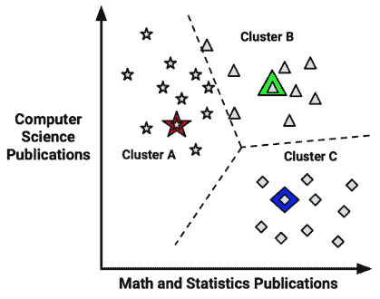

# 第九章：寻找数据组——使用 k-means 进行聚类

你是否曾经花时间观察过人群？如果是的话，你可能已经看到了一些反复出现的个性特征。也许某种类型的人，通过一套新熨烫的西装和公文包，可以代表“肥猫”商业高管。一个二十多岁穿着紧身牛仔裤、法兰绒衬衫和太阳镜的人可能被称为“嬉皮士”，而一个从微型货车卸下孩子的女人可能被贴上“足球妈妈”的标签。

当然，将这些类型的刻板印象应用于个人是危险的，因为没有人是完全相同的。然而，如果将其理解为描述集体的一种方式，这些标签就能捕捉到群体中个体之间共享的一些潜在相似性。

如你很快就会了解到的那样，聚类或发现数据中的模式这一行为，与发现人群中的模式并没有太大的区别。本章将描述：

+   聚类任务与我们之前考察的分类任务的不同之处

+   聚类如何定义一个组以及这些组如何通过 k-means，一种经典且易于理解的聚类算法来识别

+   将聚类应用于识别青少年社交媒体用户中营销细分市场的实际任务所需的步骤

在采取行动之前，我们将首先深入探讨聚类究竟意味着什么。

# 理解聚类

聚类是一种无监督的机器学习任务，它自动将数据划分为**簇**，或相似项的组。它这样做，而无需事先被告知这些组应该如何看起来。因为我们没有告诉机器我们具体在寻找什么，所以聚类用于知识发现而不是预测。它提供了对数据中自然分组洞察。

没有关于构成簇的先进知识，计算机怎么可能知道一个组在哪里结束，另一个组在哪里开始呢？答案是简单的：聚类是由这样一个原则指导的，即簇内的项目应该彼此非常相似，但与簇外的项目非常不同。相似性的定义可能因应用而异，但基本思想始终相同：将数据分组，使得相关元素放在一起。

然后可以使用这些簇进行行动。例如，你可能会发现聚类方法被用于以下应用：

+   将客户分成具有相似人口统计或购买模式的小组，以进行定向营销活动

+   通过识别使用模式落在已知簇之外的模式来检测异常行为，例如未经授权的网络入侵

+   通过创建少量类别来简化极其“宽”的数据集——那些具有大量特征的数据集——以描述具有相对同质特征值的行

总体而言，当可以用更少的组来代表多样化和多变的数据时，聚类是有用的。它产生了有意义的可操作数据结构，减少了复杂性，并提供了对关系模式的洞察。

## 聚类作为机器学习任务

聚类与我们迄今为止考察的分类、数值预测和模式检测任务有所不同。在这些任务中，目标是建立一个将特征与结果相关联的模型，或者将一些特征与另一些特征相关联。这些任务中的每一个都描述了数据中的现有模式。相比之下，聚类的目标是创建新的数据。在聚类中，未标记的示例被赋予一个新的聚类标签，这个标签完全是从数据中的关系推断出来的。因此，有时你会看到聚类任务被称为**无监督分类**，因为在某种程度上，它对未标记的示例进行了分类。

但问题是，从无监督分类器获得的类别标签没有内在的意义。聚类会告诉你哪些示例组紧密相关——例如，它可能会返回组 A、B 和 C——但具体应用一个有意义的可操作标签，以及讲述“为什么 A 与 B 不同”的故事，取决于你。为了了解这如何影响聚类任务，让我们考虑一个简单的假设例子。

假设你正在组织一个关于数据科学的会议。为了促进专业网络和协作，你计划根据他们的研究专长将人们安排在三个桌子中的一张。不幸的是，在发出会议邀请后，你意识到你忘记包括一个调查，询问与会者希望坐在哪个学科组内。

在一次灵光一闪中，你意识到你可能能够通过检查每位学者的出版物历史来推断他们的研究专长。为此，你开始收集每位与会者在计算机科学相关期刊上发表的文章数量以及发表在数学或统计学相关期刊上的文章数量。使用为学者收集的数据，你创建了一个散点图：


图 9.1：通过数学和计算机科学出版物数据可视化学者

如预期的那样，似乎存在一种模式。我们可能会猜测左上角，代表那些有众多计算机科学出版物但数学文章很少的人，是一群计算机科学家。按照这个逻辑，右下角可能是一群数学家或统计学家。同样，右上角，那些既有数学又有计算机科学经验的人，可能是机器学习专家。

应用这些标签会产生以下可视化效果：


图 9.2：可以根据对每组学者的假设来识别集群

我们的分组是通过视觉形成的；我们只是将紧密聚集的数据点识别为集群。然而，尽管看似明显的分组，如果没有亲自询问每位学者的学术专长，我们就无法知道这些群体是否真正同质。标签是关于每个群体中人的类型的定性、假设性判断，基于有限的一组定量数据。

与主观定义群体边界相比，使用机器学习来客观地定义它们会更好。鉴于前一个图中的轴平行分割，我们的问题似乎是一个明显的决策树应用，如*第五章*，*分而治之 – 使用决策树和规则进行分类*中所述。这将为我们提供一个干净的规则，例如：“如果一个学者数学出版物很少，那么他们是计算机科学专家。”不幸的是，这个计划有问题。没有每个点的真实类别值数据，监督学习算法就无法学习这样的模式，因为它无法知道哪些分割会产生同质群体。

与监督学习相反，聚类算法使用的过程与我们通过视觉检查散点图所做的过程非常相似。使用示例之间关系的度量，可以识别出同质群体。在下一节中，我们将开始探讨聚类算法是如何实现的。

这个例子突出了聚类的一个有趣应用。如果您从未标记的数据开始，可以使用聚类来创建类标签。从那里，您可以应用像决策树这样的监督学习器来找到这些类别的最重要的预测因子。这是*第一章*，*介绍机器学习*中描述的半监督学习的一个例子。

## 聚类算法的集群

正如构建预测模型有许多方法一样，执行聚类描述性任务的方法也有很多。许多此类方法列在以下网站上，CRAN 聚类任务视图：[`cran.r-project.org/view=Cluster`](https://cran.r-project.org/view=Cluster)。在这里，您可以找到用于在数据中发现自然分组的众多 R 包。不同的算法主要根据两个特征来区分：

+   **相似度度量**，它提供了两个示例之间关系的定量度量

+   **聚合函数**，它控制着根据示例之间的相似性将示例分配到集群的过程

尽管这些方法之间可能存在细微的差异，但它们当然可以以各种方式聚类。存在多种这样的类型，但一个简单的三部分框架有助于理解主要区别。使用这种方法，从最简单到最复杂，以下是聚类算法的三个主要类别：

+   **层次方法**，这些方法创建了一种家族树式的层次结构，将最相似的示例在图结构中放置得更近。

+   **基于划分的方法**，这些方法将示例视为多维空间中的点，并试图找到这个空间中的边界，以形成相对同质的小组。

+   **基于模型或密度的方法**，这些方法依赖于统计原理和/或点的密度来发现簇之间的模糊边界；在某些情况下，示例可能部分分配到多个簇中，甚至没有任何簇。

尽管层次聚类是这些方法中最简单的，但它并非没有两个有趣的优点。首先，它产生了一种称为**树状图**的层次图可视化，它描绘了示例之间的关联，使得最相似的示例在层次结构中位置更近。

这可以是一个有用的工具，用来理解哪些示例和示例的子集是最紧密地分组的。其次，层次聚类不需要预先定义数据集中存在多少簇的期望。相反，它实施了一个过程，在这个过程中，在一种极端情况下，每个示例都包含在一个包含所有其他示例的单个大簇中；在另一种极端情况下，每个示例都发现自己在一个只包含它自己的小簇中；在两者之间，示例可能包含在其他大小不一的簇中。

*图 9.3* 展示了一个包含八个示例的简单数据集的假设树状图，这些示例分别标记为 A 到 H。请注意，最相关的示例（通过*x*轴上的邻近性表示）在图中被更紧密地连接，作为兄弟姐妹。例如，示例 D 和 E 是最相似的，因此它们是最先被分组的。然而，所有八个示例最终都会连接到一个大的簇中，或者可能包含在任何数量的簇之间。在树状图的横向不同位置切割，会创建不同数量的簇，如图所示为三个和五个簇：


图 9.3：层次聚类产生一个树状图，描绘了所需簇数的自然分组。

层次聚类的树状图可以使用“自下而上”或“自上而下”的方法生成。前者称为**聚合聚类**，它从每个示例自己的簇开始，然后首先连接最相似的示例，直到所有示例都连接到一个单独的簇中。后者称为**分裂聚类**，它从一个大型簇开始，以所有示例都在自己的单独簇中结束。

在将示例连接到示例组时，可以使用不同的度量标准，例如示例与组中最相似、最不相似或平均成员的相似度。一种更复杂的度量标准称为**沃德方法**，它不使用示例之间的相似度，而是考虑簇同质性的度量来构建链接。无论如何，结果是旨在将最相似的示例分组到任意数量的子组中的层次结构。

层次聚类技术的灵活性是以计算复杂性为代价的，这是由于需要计算每个示例与其他每个示例之间的相似性。随着示例数量（N）的增长，计算数量会增长到 N*N = N²，存储结果的相似性矩阵所需的内存也会增加。因此，层次聚类仅用于非常小的数据集，本章没有演示。然而，R 的`stats`包中包含的`hclust()`函数提供了一个简单的实现，该实现默认与 R 一起安装。

分裂聚类的巧妙实现可能比聚合聚类在计算上稍微高效一些，因为算法可能会在不需要创建更多簇的情况下提前停止。尽管如此，聚合聚类和分裂聚类都是“贪婪”算法的例子，正如在第五章“分而治之——使用决策树和规则进行分类”中定义的那样，因为它们基于“先来先服务”的原则使用数据，因此不能保证为给定的数据集产生整体最优的簇集。

**基于划分的聚类**方法在效率上具有比层次聚类明显的优势，因为它们通过应用启发式方法将数据划分为集群，而不需要评估每对示例之间的相似性。我们将在稍后更详细地探讨一种广泛使用的基于划分的方法，但就目前而言，只需了解这种方法关注的是寻找集群之间的边界，而不是将示例相互连接——这种方法需要远少于示例之间的比较。这种启发式方法在计算上可能非常高效，但有一个缺点是，在分组分配方面可能有些僵硬甚至任意。例如，如果请求五个集群，它将示例划分为所有五个集群；如果某些示例位于两个集群之间的边界上，这些示例将被随意但坚定地放入一个集群或另一个集群。同样，如果四个或六个集群可能更好地分割数据，这不会像层次聚类树状图那样明显。

更复杂的**基于模型和密度聚类**方法通过估计示例属于每个集群的概率来解决了一些这些不灵活的问题，而不是仅仅将其分配到单个集群。其中一些可能允许集群边界遵循在数据中识别出的自然模式，而不是强制在组之间进行严格的划分。基于模型的方法通常假设一个统计分布，认为示例是从该分布中抽取的。

其中一种方法，称为**混合建模**，试图解开由从统计分布混合中抽取的示例组成的集合数据——通常是高斯分布（正态钟形曲线）。例如，想象你有一个由混合男性和女性音域的语音数据组成的集合数据，如图*图 9.4*所示（请注意，分布是假设的，并非基于现实世界的数据）。尽管两者之间有一些重叠，但平均而言，男性的音域通常低于女性的音域。


图 9.4：混合建模为每个示例分配属于潜在分布之一的概率

考虑到未标记的整体分布（图的下部），混合模型能够为任何给定示例属于男性集群或女性集群的概率分配一个概率，令人难以置信的是，它从未在图的上部单独对男声或女声进行过训练！这是通过发现最有可能生成观察到的整体分布的统计参数，如均值和标准差，在假设涉及特定数量的不同分布的情况下实现的——在这种情况下，是两个高斯分布。

作为一种无监督方法，混合模型将无法知道左边的分布是男性，而右边的分布是女性，但一个人类观察者比较记录时，如果左簇中男性出现的可能性高于右簇，这将是显而易见的。这种技术的缺点是，它不仅需要了解涉及多少分布，还需要假设分布的类型。这可能对许多实际聚类任务来说过于僵化。

另一种名为**DBSCAN**的强大聚类技术，其命名来源于它所使用的“基于密度的空间聚类应用噪声”方法，该方法用于在数据中识别自然簇。这项获奖技术极其灵活，在处理许多聚类挑战方面表现良好，例如适应数据集的自然簇数量、对簇之间的边界灵活处理，以及不对数据进行特定的统计分布假设。

虽然实现细节超出了本书的范围，但 DBSCAN 算法可以直观地理解为创建一个过程，该过程为簇中的示例创建邻域，这些示例都在给定半径内。在指定半径内预定义的**核心点**形成初始簇核，然后位于任何核心点指定半径内的点被添加到簇中，并构成簇的最外层边界。与许多其他聚类算法不同，一些示例可能根本不会被分配到任何簇中，因为任何距离核心点不够近的点将被视为噪声。

尽管 DBSCAN 强大且灵活，但可能需要实验来优化参数以适应数据，例如构成核心点的数量或点之间的允许半径，这增加了机器学习项目的时间复杂度。当然，仅仅因为基于模型的方法更复杂，并不意味着它们适合每个聚类项目。正如我们将在本章剩余部分看到的那样，一个简单的基于分区的方法在具有挑战性的实际聚类任务上可以表现得非常出色。

尽管混合模型和 DBSCAN 在本章中没有演示，但有一些 R 包可以用来将这些方法应用于您自己的数据。`mclust`包可以将模型拟合到高斯分布的混合，而`dbscan`包提供了 DBSCAN 算法的快速实现。

## k-means 聚类算法

**k-means 算法**可能是最常使用的聚类方法，并且是分区聚类方法的一个例子。经过几十年的研究，它成为了许多更复杂聚类技术的基础。如果你理解它使用的简单原则，你将拥有理解今天使用的几乎所有聚类算法所需的知识。

随着 k-means 算法随着时间的推移而发展，出现了许多算法的实现。一种早期的方法在*《k-means 聚类算法，Hartigan, J.A., Wong, M.A., 应用统计学，1979，第 28 卷，第 100-108 页》*中进行了描述。

尽管自 k-means 算法诞生以来聚类方法已经发展，但这并不意味着 k-means 已经过时。事实上，这个方法可能比以往任何时候都更受欢迎。以下表格列出了 k-means 仍然被广泛使用的一些原因：

| **优点** | **缺点** |
| --- | --- |

|

+   使用可以非统计术语解释的简单原则

+   非常灵活，可以通过简单的调整来应对许多其不足之处

+   在许多实际应用场景下表现良好

|

+   不像更现代的聚类算法那样复杂

+   由于它使用随机性的元素，不能保证找到最优的聚类集

+   需要对数据中自然存在的聚类数量进行合理的猜测

+   不适合非球形聚类或密度差异很大的聚类

|

如果你熟悉 k-means 这个名字，你可能是在回忆*第三章*中提出的**k 近邻算法**（**k-NN**）。正如你很快就会看到的，k-means 与 k-NN 的共同之处不仅仅在于字母 k。

k-means 算法将每个*n*个示例分配给*k*个聚类中的一个，其中*k*是一个事先确定的数字。目标是使每个聚类内示例的特征值差异最小化，并使聚类之间的差异最大化。

除非*k*和*n*非常小，否则无法计算所有可能的示例组合的最优聚类。相反，算法使用一种启发式过程来找到**局部最优**解。简单来说，这意味着它从一个初始的聚类分配猜测开始，然后稍微修改分配以查看这些变化是否改善了聚类内的同质性。

我们将在稍后深入探讨这个过程，但算法本质上涉及两个阶段。首先，它将示例分配给一组初始的*k*个聚类。然后，根据当前属于聚类的示例调整聚类边界来更新分配。这个过程会多次更新和分配，直到不再通过改变来改善聚类拟合。此时，过程停止，聚类被最终确定。

由于 k-means 的启发式性质，您可能只需对起始条件进行轻微的改变就会得到不同的结果。如果结果差异很大，这可能表明存在问题。例如，数据可能没有自然的分组，或者*k*的值选择不当。考虑到这一点，尝试多次进行聚类分析以测试您发现结果的稳健性是个好主意。

为了了解分配和更新过程在实际中的工作方式，让我们回顾一下假设的数据科学会议案例。虽然这是一个简单的例子，但它将说明 k-means 在底层是如何工作的。

### 使用距离分配和更新聚类

与 k-NN 一样，k-means 将特征值视为多维特征空间中的坐标。对于会议数据，只有两个特征，因此我们可以将特征空间表示为之前描述的两个维度的散点图。

k-means 算法首先在特征空间中选择*k*个点作为聚类中心。这些中心是推动剩余示例归位的催化剂。通常，这些点是通过从训练数据集中选择*k*个随机示例来选择的。因为我们希望识别三个聚类，所以使用这种方法，*k = 3*个点将被随机选择。

这些点在*图 9.5*中由星号、三角形和菱形表示：


图 9.5：k-means 聚类算法首先通过选择 k 个随机聚类中心开始

值得注意的是，尽管前面图中三个聚类中心恰好分布得很远，但这并不总是必然的情况。因为起始点是随机选择的，三个中心也可能只是三个相邻的点。结合 k-means 算法对聚类中心起始位置高度敏感的事实，一组好的或坏的初始聚类中心可能会对最终的聚类集产生重大影响。

为了解决这个问题，k-means 可以被修改为使用不同的方法来选择初始中心。例如，一个变体选择在特征空间中任何地方出现的随机值，而不是仅从数据中观察到的值中选择。另一个选项是完全跳过这一步；通过随机将每个示例分配给一个聚类，算法可以立即跳到更新阶段。这些方法中的每一种都会给最终的聚类集添加特定的偏差，您可能可以利用这些偏差来改进您的结果。

在 2007 年，引入了一种名为**k-means++**的算法，它提出了一种选择初始簇中心的不同方法。它声称这是一种更有效的方法，可以在减少随机机会影响的同时，更接近最优聚类解决方案。更多信息，请参阅*《k-means++：谨慎播种的优势，Arthur, D, Vassilvitskii, S, 第十八届 ACM-SIAM 离散算法年度会议论文集，2007 年，第 1,027–1,035 页》*。

在选择初始簇中心之后，其他示例根据距离函数分配到最近的簇中心，该距离函数用作相似性度量。你可能还记得，我们在学习 k-NN 监督学习算法时使用了距离函数作为相似性度量。像 k-NN 一样，k-means 传统上使用欧几里得距离，但如果需要，也可以使用其他距离函数。

有趣的是，任何返回相似性数值度量的函数都可以用来代替传统的距离函数。事实上，k-means 甚至可以通过使用测量图像或文本对相似性的函数来适应聚类图像或文本文档。

要应用距离函数，请记住，如果*n*表示特征的数量，那么示例*x*和示例*y*之间的欧几里得距离的公式如下：


例如，为了比较一个有五个计算机科学出版物和一个数学出版物的访客与一个没有计算机科学论文但有两位数学论文的访客，我们可以在 R 中这样计算：

```py
> sqrt((5 - 0)² + (1 - 2)²) 
```

```py
[1] 5.09902 
```

使用这种方式的距离函数，我们可以找到每个示例与每个簇中心的距离。然后，每个示例被分配到最近的簇中心。

请记住，因为我们使用距离计算，所以所有特征都需要是数值的，并且应该在事先将值归一化到标准范围内。第三章中提出的*《懒惰学习 – 使用最近邻进行分类》*方法将有助于这项任务。

如以下图所示，三个簇中心将示例划分为三个分区，分别标记为*Cluster A*、*Cluster B*和*Cluster C*。虚线表示由簇中心创建的**Voronoi 图**的边界。Voronoi 图表示比其他簇中心更接近一个簇中心的区域；所有三个边界相交的顶点是离所有三个簇中心的最大距离。

使用这些边界，我们可以轻松地看到每个初始 k-means 种子的所声称的区域：



图 9.6：初始簇中心创建了三个“最近”点的三组

现在初始分配阶段已经完成，k-means 算法进入更新阶段。更新簇的第一步是将初始中心移动到新的位置，称为**质心**，它是当前分配给该簇的点的平均位置。以下图示说明了随着簇中心移动到新的质心，Voronoi 图中的边界也移动，一个曾经位于*簇 B*（由箭头指示）的点被添加到*簇 A*：


图 9.7：更新阶段移动簇中心，导致一个点的重新分配

由于这次重新分配，k-means 算法将继续通过另一个更新阶段。在移动簇质心、更新簇边界并将点重新分配到新的簇（如箭头所示）之后，图看起来是这样的：


图 9.8：在另一次更新后，另外两个点被重新分配到最近的簇中心

由于另外两个点被重新分配，必须进行另一次更新，这将移动质心并更新簇边界。然而，因为这些变化没有导致重新分配，k-means 算法停止。簇分配现在是最终的：


图 9.9：更新阶段没有导致新的簇分配后，聚类停止

最终的簇可以通过两种方式之一进行报告。首先，你可能只是简单地报告每个示例的 A、B 或 C 簇的分配。或者，你可以在最终更新后报告簇质心的坐标。

无论是采用哪种报告方法，你都可以计算另一种方法；你可以使用每个簇示例的坐标来计算质心，或者你可以使用质心坐标来将每个示例分配到其最近的簇中心。

### 选择合适的簇数量

在 k-means 的介绍中，我们了解到该算法对随机选择的簇中心很敏感。确实，如果我们之前在示例中选择了不同的三个起始点组合，我们可能会找到与我们预期不同的数据分割的簇。同样，k-means 对簇的数量也很敏感；选择需要微妙的平衡。将*k*设置得非常大可以提高簇的同质性，同时它也冒着过度拟合数据的风险。

理想情况下，你将拥有关于真实分组的前置知识（即先验信念），并可以应用这些信息来选择簇的数量。例如，如果你对电影进行聚类，你可能首先将*k*设置为考虑的奥斯卡奖项类别数量。在我们之前解决的数据科学会议座位问题中，*k*可能反映了受邀者所属的学术研究领域数量。

有时，簇的数量是由业务需求或分析的动机决定的。例如，会议室中的桌子数量可能决定了从数据科学参会者名单中应该创建多少组人。将这个想法扩展到另一个业务案例，如果营销部门只有资源创建三个不同的广告活动，那么将*k = 3*分配所有潜在客户到三个吸引之一可能是有意义的。

如果没有任何先验知识，一个经验法则建议将*k*设置为*(n / 2)*的平方根，其中*n*是数据集中示例的数量。然而，这个经验法则很可能会导致大型数据集簇的数量过多。幸运的是，还有其他定量方法可以帮助找到合适的 k-means 簇集。

一种称为**肘部方法**的技术试图评估簇内同质性和异质性与*k*的不同值如何变化。如图中所示，随着额外簇的增加，簇内的同质性预计会增加；同样，簇内的异质性应该随着簇的增加而减少。因为你可能会继续看到改进，直到每个示例都在自己的簇中，所以目标不是无限期地最大化同质性或最小化异质性，而是找到*k*，这样在该值之后就没有递减的回报。这个*k*值被称为**肘点**，因为它像人手臂的肘关节一样弯曲。


图 9.10：肘部是增加*k*导致相对较小改进的点

有许多用于测量簇内同质性和异质性的统计数据，可以与肘部方法（以下信息框提供了更多细节的引用）一起使用。然而，在实践中，并不总是可行地迭代测试大量*k*值。这部分是因为聚类大型数据集可能相当耗时；重复聚类数据甚至更糟。此外，需要精确最优簇集集的应用很少。在大多数聚类应用中，基于便利性选择*k*值就足够了，而不是创建最同质簇的值。

对于大量聚类性能指标的全面回顾，请参阅 *《聚类验证技术》，Halkidi, M, Batistakis, Y, Vazirgiannis, M, 智能信息系统杂志，2001 年，第 17 卷，第 107-145 页*。

设置 *k* 的过程本身有时可以带来有趣的洞察。通过观察随着 *k* 的变化聚类特征如何变化，人们可以推断数据自然定义的边界在哪里。更加紧密聚类的群体变化很小，而不够同质的群体则会在一段时间内形成和解散。

通常来说，花费少量时间去担心如何精确地确定 *k* 可能是明智的。接下来的例子将展示即使是来自好莱坞电影的一点点主题知识，也可以用来设定 *k*，从而找到可操作且有趣的聚类。由于聚类是无监督的，这项任务实际上取决于你如何利用它；价值在于你从算法的发现中获得的洞察。

# 使用 k-means 聚类寻找青少年市场细分

与 Facebook、TikTok 和 Instagram 等**社交网络服务**（**SNS**）上的朋友互动，已成为全球青少年的一种仪式。这些青少年拥有相当可观的零花钱，因此他们成为了希望销售零食、饮料、电子产品、娱乐和卫生用品的企业所渴望的目标群体。

使用这些网站的数百万青少年消费者吸引了那些在日益竞争激烈的市场中寻找优势的营销人员的注意。获得这种优势的一种方式是识别具有相似口味的青少年群体，这样客户就可以避免向对所售产品不感兴趣的青少年投放广告。如果向 1,000 名网站访客展示一次广告的成本是 10 美元——这是一种**每印象成本**的衡量标准——如果我们对目标受众进行选择，广告预算将会更加充裕。例如，运动服装的广告应该针对更有可能对运动感兴趣的个体群体。

通过分析青少年的 SNS 帖子文本，我们可以识别出具有共同兴趣的群体，如体育、宗教或音乐。聚类可以自动化发现该人群自然段落的流程。然而，我们将决定这些聚类是否有趣以及如何用于广告。让我们从头到尾尝试这个过程。

## 第 1 步 – 收集数据

在这次分析中，我们将使用一个数据集，它代表 2006 年在一家知名 SNS 上有资料的 30,000 名美国高中学生的随机样本。为了保护用户的匿名性，SNS 将不会被命名。然而，在数据收集时，该 SNS 是美国青少年非常受欢迎的网站。因此，可以合理地假设这些资料代表了 2006 年美国青少年的广泛横截面。

我在圣母大学进行自己的青少年身份社会学研究时编制了这个数据集。如果你用于研究目的，请引用这本书的章节。完整的数据库可以在本书的 Packt Publishing GitHub 存储库中找到，文件名为`snsdata.csv`。为了互动式地跟随，本章假设你已经将此文件保存到你的 R 工作目录中。

数据在四个高中毕业年份（2006 年至 2009 年）之间均匀采样，代表当时的数据收集时的大学一年级、二年级、三年级和四年级学生。使用自动网络爬虫下载了 SNS 个人资料的全文，并记录了每个青少年的性别、年龄和 SNS 朋友数量。

使用文本挖掘工具将剩余的 SNS 页面内容划分为单词。从所有页面中出现的最顶部的 500 个单词中，选择了 36 个单词来代表五个兴趣类别：课外活动、时尚、宗教、浪漫和反社会行为。这 36 个单词包括诸如*足球*、*性感*、*亲吻*、*圣经*、*购物*、*死亡*和*毒品*等术语。最终的数据库表明，对于每个人，每个单词在个人的 SNS 资料中出现的次数。

## 第 2 步 – 探索和准备数据

我们将使用`read.csv()`来加载数据集并将字符数据转换为因子类型：

```py
> teens <- read.csv("snsdata.csv", stringsAsFactors = TRUE) 
```

让我们也快速看一下数据的详细信息。`str()`输出的前几行如下所示：

```py
> str(teens) 
```

```py
'data.frame':	30000 obs. of  40 variables:
 $ gradyear    : int  2006 2006 2006 2006 2006 2006 2006 ...
 $ gender      : Factor w/ 2 levels "F","M": 2 1 2 1 NA 1 1 2 ...
 $ age         : num  19 18.8 18.3 18.9 19 ...
 $ friends     : int  7 0 69 0 10 142 72 17 52 39 ...
 $ basketball  : int  0 0 0 0 0 0 0 0 0 0 ... 
```

正如我们所预期的，数据包括 30,000 名青少年，其中四个变量表示个人特征，36 个单词表示兴趣。

你注意到`gender`行周围有什么奇怪的地方吗？如果你仔细观察，你可能已经注意到那个`NA`值，它与`1`和`2`值相比显得格格不入。`NA`是 R 告诉我们记录有一个**缺失值**的方式——我们不知道这个人的性别。到目前为止，我们还没有处理缺失数据，但它可能对许多类型的分析是一个重大问题。

让我们看看这个问题有多严重。一个选项是使用`table()`命令，如下所示：

```py
> table(teens$gender) 
```

```py
 F     M 
22054  5222 
```

虽然这告诉我们有多少个`F`和`M`值存在，但`table()`函数排除了`NA`值，而不是将其作为一个单独的分类处理。要包括`NA`值（如果有的话），我们只需要添加一个额外的参数：

```py
> table(teens$gender, useNA = "ifany") 
```

```py
 F     M  <NA> 
22054  5222  2724 
```

在这里，我们看到有 2,724 条记录（九%）有缺失的性别数据。有趣的是，SNS 数据中女性的数量是男性的四倍多，这表明男性不像女性那样倾向于使用这个社交媒体网站。

如果你检查数据框中的其他变量，你会发现除了`gender`之外，只有`age`有缺失值。对于数值特征，`summary()`函数的默认输出包括`NA`值的计数：

```py
> summary(teens$age) 
```

```py
 Min. 1st Qu.  Median    Mean 3rd Qu.    Max.    NA's
  3.086  16.310  17.290  17.990  18.260 106.900    5086 
```

总共有 5,086 条记录（17%）有缺失的年龄。另外，最小值和最大值似乎不合理；一个三岁的孩子或一个 106 岁的孩子上高中是不太可能的。为了确保这些极端值不会对分析造成问题，我们将在继续之前清理它们。

高中生可能更合理的年龄范围包括那些至少 13 岁且未满 20 岁的人。任何超出这个范围的年龄值应被视为缺失数据——我们无法相信提供的年龄。为了重新编码`age`变量，我们可以使用`ifelse()`函数，如果年龄至少为 13 岁且小于 20 岁，则将`teen$age`赋予原始值；否则，它将接收值`NA`：

```py
> teens$age <- ifelse(teens$age >= 13 & teens$age < 20,
                        teens$age, NA) 
```

通过重新检查`summary()`输出，我们看到范围现在遵循的分布看起来更像是实际的高中：

```py
> summary(teens$age) 
```

```py
 Min. 1st Qu.  Median    Mean 3rd Qu.    Max.    NA's
  13.03   16.30   17.27   17.25   18.22   20.00    5523 
```

不幸的是，现在我们创建了一个更大的缺失数据问题。在我们继续分析之前，我们需要找到处理这些值的方法。

### 数据准备 - 虚拟编码缺失值

处理缺失值的一个简单方法是不包含任何缺失值的记录。然而，如果你考虑这种做法的后果，你可能在做之前会三思而后行——仅仅因为它容易并不意味着这是一个好主意！这种方法的问题在于，即使缺失并不广泛，你也很容易排除大量数据。

例如，假设在我们的数据中，性别为`NA`的人与缺失年龄数据的人完全不同。这表明，通过排除缺失性别或年龄的人，你会排除*9% + 17% = 26%*的数据，或者超过 7,500 条记录。而且这仅仅是两个变量的缺失数据！数据集中缺失值的数量越多，任何给定记录被排除的可能性就越大。很快，你将只剩下一个非常小的数据子集，或者更糟糕的是，剩余的记录将系统性地不同或不能代表整个总体。

对于性别等分类数据，一个替代方案是将缺失值视为一个单独的分类。例如，我们不仅可以限制为女性和男性，还可以添加一个未知性别的额外分类。这使我们能够利用虚拟编码，这在*第三章*，*懒惰学习 - 使用最近邻进行分类*中已有介绍。

如果你记得，虚拟编码涉及为每个名义特征的每个级别创建一个单独的二进制（1 或 0）值虚拟变量，除了一个作为参考组保留的外。一个类别可以排除的原因是，其状态可以从其他类别中推断出来。例如，如果某人既不是女性也不是未知性别，那么他们一定是男性。因此，在这种情况下，我们只需要为女性和未知性别创建虚拟变量：

```py
> teens$female <- ifelse(teens$gender == "F" &
                           !is.na(teens$gender), 1, 0)
> teens$no_gender <- ifelse(is.na(teens$gender), 1, 0) 
```

如你所预期，`is.na()` 函数测试性别是否等于 `NA`。因此，第一个语句在性别等于 `F` 且性别不等于 `NA` 时将 `teens$female` 赋值为 `1`；否则，它赋值为 `0`。在第二个语句中，如果 `is.na()` 返回 `TRUE`，意味着性别缺失，那么 `teens$no_gender` 变量被赋值为 `1`；否则，它被赋值为 `0`。

为了确认我们工作正确，让我们将我们构建的虚拟变量与原始的 `gender` 变量进行比较：

```py
> table(teens$gender, useNA = "ifany") 
```

```py
 F     M  <NA> 
22054  5222  2724 
```

```py
> table(teens$female, useNA = "ifany") 
```

```py
 0     1 
 7946 22054 
```

```py
> table(teens$no_gender, useNA = "ifany") 
```

```py
 0     1 
27276  2724 
```

对于 `teens$female` 和 `teens$no_gender` 的 `1` 值数量与 `F` 和 `NA` 值的数量相匹配，所以编码已经被正确执行。

### 数据准备 – 填充缺失值

接下来，让我们消除 5,523 个缺失的年龄。由于 `age` 是一个数值特征，为未知值创建一个额外的类别是没有意义的——你将如何将“未知”与其他年龄进行比较？相反，我们将使用一种称为**插补**的不同策略，它涉及用对真实值的猜测来填充缺失数据。

你能想到一种方法，我们可以利用 SNS 数据来对青少年的年龄做出有根据的猜测吗？如果你想到了使用毕业年份，你的想法是对的。在一个毕业班级中，大多数人都是在同一年出生的。如果我们能确定每个班级的典型年龄，那么我们就能对那个毕业年份的学生年龄有一个合理的估计。

找到一个典型值的一种方法是通过计算平均值或均值。如果我们尝试像之前分析那样应用 `mean()` 函数，会出现问题：

```py
> mean(teens$age) 
```

```py
[1] NA 
```

问题在于，对于包含缺失数据的向量，平均值是未定义的。由于我们的年龄数据包含缺失值，`mean(teens$age)` 返回一个缺失值。我们可以通过在计算平均值之前添加一个额外的 `na.rm` 参数来删除缺失值来纠正这个问题：

```py
> mean(teens$age, na.rm = TRUE) 
```

```py
[1] 17.25243 
```

这表明我们数据中的平均学生年龄大约是 17 岁。这只能让我们走了一半的路；我们实际上需要每个毕业年份的平均年龄。你可能会首先尝试计算四次平均值，但 R 的一个好处通常是有一个避免重复的方法。在这种情况下，`aggregate()` 函数就是这项工作的工具。它为数据的子组计算统计数据。在这里，它通过删除 `NA` 值来计算按毕业年份的平均年龄：

```py
> aggregate(data = teens, age ~ gradyear, mean, na.rm = TRUE) 
```

```py
 gradyear      age
1     2006 18.65586
2     2007 17.70617
3     2008 16.76770
4     2009 15.81957 
```

`aggregate()`的输出是一个数据框。这需要额外的工作才能将其合并回我们的原始数据。作为替代方案，我们可以使用`ave()`函数，该函数返回一个向量，其中每个组的平均值被重复，使得结果向量与原始向量长度相同。当`aggregate()`为每个毕业年份返回一个平均年龄（总共四个值）时，`ave()`函数为所有 30,000 名青少年返回一个值，反映该学生毕业年份的学生平均年龄（相同的四个值被重复以达到总共 30,000 个值）。

当使用`ave()`函数时，第一个参数是要计算组平均值的数值向量，第二个参数是提供组分配的类别向量，而`FUN`参数是要应用于数值向量的函数。在我们的情况下，我们需要定义一个新的函数，该函数在计算平均值时移除`NA`值。完整的命令如下：

```py
> ave_age <- ave(teens$age, teens$gradyear, FUN =
                  function(x) mean(x, na.rm = TRUE)) 
```

为了将这些平均值填充到缺失值中，我们需要再调用一次`ifelse()`函数，仅当原始年龄值为`NA`时才使用`ave_age`值：

```py
> teens$age <- ifelse(is.na(teens$age), ave_age, teens$age) 
```

`summary()`的结果显示，缺失值现在已经消除：

```py
> summary(teens$age) 
```

```py
 Min. 1st Qu.  Median    Mean 3rd Qu.    Max.
  13.03   16.28   17.24   17.24   18.21   20.00 
```

数据分析准备就绪后，我们就准备好深入这个项目的有趣部分了。让我们看看我们的努力是否得到了回报。

## 第 3 步 – 在数据上训练模型

为了将青少年聚类到营销细分市场，我们将使用`stats`包中的 k-means 实现，这应该默认包含在您的 R 安装中。尽管其他 R 包中提供了许多更复杂的 k-means 函数，但默认`stats`包中的`kmeans()`函数被广泛使用，并提供了简单而强大的算法实现。


图 9.11：K-means 聚类语法

`kmeans()`函数需要一个只包含数值数据的数据框或矩阵，以及指定*k*，即所需聚类数量的参数。如果您准备好了这两件事，构建模型的实际过程就很简单了。麻烦的是，选择正确的数据和聚类组合可能有点像艺术；有时需要大量的尝试和错误。

我们将开始我们的聚类分析，仅考虑 36 个特征，这些特征衡量了各种基于兴趣的关键词在青少年社交媒体个人资料文本中出现的次数。换句话说，我们不会基于年龄、毕业年份、性别或朋友数量进行聚类。当然，如果我们愿意，我们可以使用这四个特征，但我们选择不这样做，因为基于这些特征建立的任何聚类都比基于兴趣的聚类缺乏洞察力。这主要是因为年龄和性别已经是事实上的聚类，而基于兴趣的聚类在我们的数据中尚未被发现。其次，稍后更感兴趣的是看看兴趣聚类是否与聚类过程中保留的性别和受欢迎程度特征相关。如果基于兴趣的聚类可以预测这些个体特征，这提供了证据表明聚类可能是有用的。

为了避免意外包含其他特征，让我们创建一个名为 `interests` 的数据框，通过子集化数据框仅包含 36 个关键词列：

```py
> interests <- teens[5:40] 
```

如果你还记得 *第三章*，*懒惰学习 – 使用最近邻进行分类*，在执行任何使用距离计算的分析的任何分析之前，一个常见的做法是对特征进行归一化或 z 分数标准化，以便每个特征都利用相同的范围。通过这样做，你可以避免一个问题，即某些特征仅仅因为它们的值范围比其他特征大而主导。

z 分数标准化的过程重新调整特征，使它们具有均值为零和标准差为一。这种转换以可能在这里有用的方式改变了数据的解释。具体来说，如果有人在他们的个人资料中提到篮球三次，没有其他信息，我们无法知道这是否意味着他们比同龄人更喜欢篮球或更不喜欢篮球。另一方面，如果 z 分数是三，我们知道他们比平均青少年提到了篮球许多次。

要将 z 分数标准化应用于 `interests` 数据框，我们可以使用 `scale()` 函数结合 `lapply()`。由于 `lapply()` 返回一个列表对象，必须使用 `as.data.frame()` 函数将其转换回数据框形式，如下所示：

```py
> interests_z <- as.data.frame(lapply(interests, scale)) 
```

为了确认转换是否正确，我们可以比较旧 `interests` 数据中 `basketball` 列的摘要统计：

```py
> summary(interests$basketball) 
```

```py
 Min. 1st Qu.  Median    Mean 3rd Qu.    Max. 
 0.0000  0.0000  0.0000  0.2673  0.0000 24.0000 
```

```py
> summary(interests_z$basketball) 
```

```py
 Min. 1st Qu.  Median    Mean 3rd Qu.    Max. 
-0.3322 -0.3322 -0.3322  0.0000 -0.3322 29.4923 
```

如预期的那样，`interests_z` 数据集将篮球特征转换成了均值为零，范围跨越零上和零下的值。现在，一个小于零的值可以解释为一个人在其个人资料中篮球提及次数少于平均水平。一个大于零的值则意味着这个人比平均水平更频繁地提及篮球。

我们最后的决定是决定使用多少个簇来分割数据。如果我们使用太多的簇，我们可能会发现它们过于具体而无法使用；相反，选择太少的簇可能会导致异质分组。你应该对实验*k*的值感到舒适。如果你不喜欢结果，你可以轻松尝试另一个值并重新开始。

如果你熟悉分析人群，选择簇的数量会更容易。对真实自然分组数量的直觉猜测可以节省一些尝试和错误。

为了帮助选择数据中的簇数量，我将参考我最喜欢的电影之一，《早餐俱乐部》，这是一部 1985 年上映的青春喜剧，由约翰·休斯执导。这部电影中的青少年角色根据以下五个身份进行自我描述：

+   一个*大脑* - 也常被称为“书呆子”或“极客”

+   一个*运动员* - 有时也被称为“运动健将”或“预备役”

+   一个*篮子案* - 指的是焦虑或神经质的人的俚语术语，在电影中被描绘为一个反社会的局外人

+   一个*公主* - 描绘为受欢迎、富有且具有刻板女性形象的女孩

+   一个*罪犯* - 代表社会学研究中描述的传统“燃尽”身份，参与反学校和反权威的叛逆行为

尽管这部电影描绘了五个具体的身份群体，但它们已经在多年的流行青少年小说中被描述，尽管随着时间的推移，这些刻板印象已经发生了变化，但美国青少年可能仍然会本能地理解它们。因此，五个似乎是一个合理的起始点来选择*k*，尽管诚然，它不太可能捕捉到高中身份的全貌。

要使用 k-means 算法将青少年的兴趣数据划分为五个簇，我们使用`kmeans()`函数对`interests`数据框进行操作。请注意，由于 k-means 使用随机起始点，因此使用`set.seed()`函数以确保结果与以下示例中的输出相匹配。如果你还记得前面的章节，此命令初始化 R 的随机数生成器到一个特定的序列。如果没有这个语句，每次运行 k-means 算法时结果可能会变化。按照以下方式运行 k-means 聚类过程将创建一个名为`teen_clusters`的列表，该列表存储了五个簇的属性：

```py
> set.seed(2345)
> teen_clusters <- kmeans(interests_z, 5) 
```

让我们深入探讨一下，看看算法如何将青少年的兴趣数据进行了划分。

如果你发现你的结果与以下章节中显示的结果不同，请确保在运行`kmeans()`函数之前立即运行`set.seed(2345)`命令。此外，由于 R 的随机数生成器的行为随着 R 版本 3.6 而改变，如果你使用的是较旧的 R 版本，你的结果也可能与这里显示的结果略有不同。

## 第 4 步 – 评估模型性能

评估聚类结果可能具有一定的主观性。最终，模型的成功或失败取决于聚类是否适用于其预期目的。由于本分析的目标是识别具有相似兴趣的青少年聚类以用于营销目的，我们将主要从定性角度衡量我们的成功。对于其他聚类应用，可能需要更多定量成功的衡量标准。

评估一组聚类的有用性的最基本方法之一是检查每个组中落下的示例数量。如果某些组太大或太小，那么它们不太可能非常有用。

要获取`kmeans()`聚类的尺寸，只需检查`teen_clusters$size`组件，如下所示：

```py
> teen_clusters$size 
```

```py
[1]  1038   601  4066  2696 21599 
```

在这里，我们看到我们请求的五个聚类。最小的聚类有 601 名青少年（2%），而最大的有 21,599 名（72%）。尽管最大和最小聚类人数之间的差距略令人担忧，但如果不仔细检查这些组，我们不会知道这是否表明了问题。可能的情况是，聚类的尺寸差异表明了某些真实情况，例如一个拥有相似兴趣的大青少年群体，或者这可能是由初始 k-means 聚类中心引起的随机巧合。随着我们开始查看每个聚类的特征，我们将了解更多信息。

有时，k-means 可能会找到极小的聚类——有时小到只有一个点。这可能发生在初始聚类中心之一恰好落在远离其他数据的异常值上。是否将此类小型聚类视为代表极端案例的真正发现，还是随机机会造成的问题，并不总是很清楚。如果你遇到这个问题，可能值得用不同的随机种子重新运行 k-means 算法，看看小型聚类是否对不同的起始点具有鲁棒性。

要更深入地了解聚类，我们可以检查聚类质心的坐标，使用`teen_clusters$centers`组件，以下是对前四个兴趣的说明：

```py
> teen_clusters$centers 
```

```py
 basketball    football      soccer   softball
1  0.362160730  0.37985213  0.13734997  0.1272107
2 -0.094426312  0.06691768 -0.09956009 -0.0379725
3  0.003980104  0.09524062  0.05342109 -0.0496864
4  1.372334818  1.19570343  0.55621097  1.1304527
5 -0.186822093 -0.18729427 -0.08331351 -0.1368072 
```

输出的行（标记为`1`到`5`）指的是五个聚类，而每行的数字表示该聚类对列顶部列出的兴趣的平均值。由于这些值是 z 分数标准化，正值表示所有青少年整体平均水平的上方，而负值表示整体平均水平的下方。

例如，第四行在“篮球”列中具有最高值，这意味着在所有聚类中，聚类`4`对篮球的平均兴趣最高。

通过检查集群是否在每个兴趣类别的平均水平之上或之下，我们可以发现区分集群之间的模式。在实践中，这涉及到打印集群中心，并搜索它们以寻找任何模式或极端值，就像一个数字搜索谜题，但使用的是数字。以下标注的屏幕截图显示了五个集群中的每个集群的突出模式，针对 36 个青少年兴趣中的 18 个：


图 9.12：为了区分集群，突出其质心的坐标中的模式可能很有帮助

给定这个兴趣数据的快照，我们已能推断出一些集群的特征。集群四在几乎所有运动项目上的兴趣水平都显著高于平均水平，这表明这可能是一个*运动员*群体，按照*《早餐俱乐部》*的刻板印象。集群三包括最多的拉拉队、舞蹈和“热”这个词的提及。这些是所谓的公主吗？

通过继续以这种方式检查这些集群，可以构建一个表格，列出每个群体的主导兴趣。在下面的表格中，每个集群都展示了使其与其他集群最不同的特征，以及似乎最能准确捕捉群体特征的*《早餐俱乐部》*身份。

有趣的是，集群五之所以与众不同，是因为它并不出众：其成员在所有测量的活动中兴趣水平都低于平均水平。它也是成员数量最多的单个最大群体。我们如何调和这些明显的矛盾？一个可能的解释是，这些用户在网站上创建了一个个人资料，但从未发布过任何兴趣。


图 9.13：可以使用表格列出每个集群的重要维度

当与利益相关者分享分割分析的结果时，应用易于记忆且信息丰富的标签，即所谓的**角色**，通常很有帮助，这些标签简化并捕捉了群体的本质，例如在此处应用的*《早餐俱乐部》*类型。添加此类标签的风险是，它们可能会掩盖群体的细微差别，甚至如果使用负面刻板印象，可能会冒犯群体成员。为了更广泛的传播，像“罪犯”和“公主”这样的挑衅性标签可能被更中性的术语如“叛逆青少年”和“时尚青少年”所取代。此外，因为即使是相对无害的标签也可能导致我们的思维产生偏见，如果标签被理解为整个真相而不是复杂性的简化，我们可能会错过重要的模式。

给出如图 9.13 所示的难忘标签和表格，营销主管会对社交网站上的五种青少年访问者类型有一个清晰的思维图像。基于这些人物角色，主管可以向与一个或多个聚类相关的产品相关的企业销售定向广告印象。在下一节中，我们将看到如何将聚类标签应用于原始人口以实现此类用途。

可以使用将多维特征数据展平为二维的技术来可视化聚类分析的结果，然后根据聚类分配给点着色。`factoextra` 包中的 `fviz_cluster()` 函数允许轻松构建此类可视化。如果您对此感兴趣，请加载该包并尝试以下命令以查看青少年 SNS 聚类的可视化：`fviz_cluster(teen_clusters, interests_z, geom = "point")`。尽管由于重叠点数量众多，这种视觉在 SNS 示例中用途有限，但有时它可以是演示目的的有用工具。为了更好地理解如何创建和理解这些图表，请参阅*第十五章*，*利用大数据*。

## 第 5 步 – 提高模型性能

由于聚类创建了新的信息，聚类算法的性能至少在一定程度上取决于聚类本身的质量以及如何使用这些信息。在前一节中，我们展示了五个聚类为青少年的兴趣提供了有用且新颖的见解。从这个角度来看，算法似乎表现相当好。因此，我们现在可以将精力集中在将这些见解转化为行动上。

我们将首先将聚类应用于完整的数据集。由 `kmeans()` 函数创建的 `teen_clusters` 对象包含一个名为 `cluster` 的组件，其中包含样本中所有 30,000 个个体的聚类分配。我们可以使用以下命令将其添加到 `teens` 数据框中：

```py
> teens$cluster <- teen_clusters$cluster 
```

给定这些新数据，我们可以开始检查聚类分配与个人特征之间的关系。例如，以下是 SNS 数据中前五个青少年的个人信息：

```py
> teens[1:5, c("cluster", "gender", "age", "friends")] 
```

```py
 cluster gender    age friends
1       5      M 18.982       7
2       3      F 18.801       0
3       5      M 18.335      69
4       5      F 18.875       0
5       1   <NA> 18.995      10 
```

使用 `aggregate()` 函数，我们还可以查看聚类的人口统计特征。平均年龄在各个聚类之间变化不大，这并不太令人惊讶，因为青少年的身份通常在高中之前就已经确立。这如下所示：

```py
> aggregate(data = teens, age ~ cluster, mean) 
```

```py
 cluster      age
1       1 17.09319
2       2 17.38488
3       3 17.03773
4       4 17.03759
5       5 17.30265 
```

另一方面，各个聚类中女性比例的差异相当显著。这是一个非常有趣的发现，因为我们没有使用性别数据来创建聚类，但聚类仍然可以预测性别：

```py
> aggregate(data = teens, female ~ cluster, mean) 
```

```py
 cluster    female
1       1 0.8025048
2       2 0.7237937
3       3 0.8866208
4       4 0.6984421
5       5 0.7082735 
```

回想一下，总体而言，大约 74%的社交网络用户是女性。第三组，所谓的“公主”，女性比例高达 89%，而第四组和第五组女性比例仅为大约 70%。这些差异表明，青少年男孩和女孩在社交网络页面讨论的兴趣存在差异。

由于我们在预测性别方面的成功，你可能会怀疑聚类也可以预测用户拥有的朋友数量。这个假设似乎得到了以下数据的支持：

```py
> aggregate(data = teens, friends ~ cluster, mean) 
```

```py
 cluster  friends
1       1 30.66570
2       2 32.79368
3       3 38.54575
4       4 35.91728
5       5 27.79221 
```

平均而言，“公主”拥有最多的朋友（38.5 人），其次是“运动员”（35.9 人）和“大脑”（32.8 人）。在低端是“罪犯”（30.7 人）和“疯子”（27.8 人）。与性别一样，考虑到我们没有将友谊数据作为聚类算法的输入，一个青少年的朋友数量与其预测的聚类之间的联系是显著的。同样有趣的是，朋友数量似乎与每个聚类的刻板印象中的高中受欢迎程度有关：那些刻板印象中受欢迎的群体在现实中往往有更多的朋友。

团体成员资格、性别和朋友的数量之间的关联表明，聚类可以作为行为的有用预测指标。以这种方式验证其预测能力可能会使得在向营销团队推销时，聚类分析结果更容易被接受，从而最终提高算法的性能。

正如《早餐俱乐部》中的角色最终意识到的那样，“我们每个人都是一个大脑、一个运动员、一个疯子、一个公主和一个罪犯”，数据科学家意识到我们分配给每个聚类的标签或角色是刻板印象，并且个体可能以不同程度体现这些刻板印象，这一点很重要。在采取聚类分析结果时，请记住这个警告；一个群体可能相对同质，但每个成员仍然是独一无二的。

# 摘要

我们的研究支持了那句流行的谚语：“物以类聚，人以群分。”通过使用机器学习方法将具有相似兴趣的青少年进行聚类，我们能够开发出青少年身份类型的分类，这些分类可以预测个人特征，如性别和朋友的数量。这些相同的方法可以应用于其他具有相似结果的环境中。

本章仅涵盖了聚类的基础知识。k-means 算法有许多变体，以及其他许多聚类算法，它们为任务带来了独特的偏见和启发式方法。基于本章的基础，你将能够理解这些聚类方法并将它们应用于新的问题。

在下一章中，我们将开始探讨适用于许多机器学习任务的测量学习算法成功的方法。虽然我们的过程一直致力于评估学习的成功，但为了获得最高程度的性能，能够以最严格的标准定义和衡量它是至关重要的。

# 加入我们书籍的 Discord 空间

加入我们的 Discord 社区，与志同道合的人相聚，并与超过 4000 人一起学习：

[`packt.link/r`](https://packt.link/r)


