# 第十章：评估模型性能

当只有富人才能负担得起教育时，考试和测试并不是用来评估学生的。相反，测试评估的是教师，以便父母了解他们的孩子是否学到了足够的知识来证明教师工资的合理性。显然，这与今天的情况不同。现在，这样的评估被用来区分表现优异和表现不佳的学生，将他们筛选到不同的职业和其他机会中。

由于这个过程的重要性，大量的努力被投入到开发准确的学业评估中。公平的评估包含大量的问题，覆盖广泛的主题，并奖励真正的知识而非幸运猜测。一个好的评估还要求学生思考他们以前从未面临过的问题。因此，正确的回答反映了更广泛地概括知识的能力。

评估机器学习算法的过程与评估学生的过程非常相似。由于算法具有不同的优势和劣势，测试应该区分学习者。了解学习者如何在未来的数据上表现也很重要。

本章提供了评估机器学习者的所需信息，例如：

+   为什么预测准确性不足以衡量性能，以及你可能使用的其他性能衡量指标

+   确保性能衡量指标合理反映模型预测或预测未见案例的能力的方法

+   如何使用 R 将这些更有用的衡量指标和方法应用于前面章节中涵盖的预测模型

正如学习一个主题的最佳方式是尝试向其他人教授它一样，教授和评估机器学习者的过程将使你对迄今为止学到的方法有更深入的了解。

# 测量分类性能

在前面的章节中，我们通过将正确预测的数量除以总预测数量来衡量分类器的准确性。这找到了学习者正确案例的比例，错误案例的比例直接得出。例如，假设一个分类器在 10,000 个案例中有 99,990 个正确预测了新生婴儿是否携带可治疗但可能致命的遗传缺陷。这将意味着准确率为 99.99%，错误率仅为 0.01%。

初看起来，这似乎是一个非常宝贵的分类器。然而，在将孩子的生命托付给测试之前收集更多信息是明智的。如果仅在每 10 万个婴儿中有 10 个发现遗传缺陷呢？一个总是预测无缺陷的测试在所有案例中都是正确的，但在最重要的案例中却是错误的。换句话说，尽管分类器非常准确，但它对预防可治疗的出生缺陷并不很有用。

这是**类别不平衡问题**的一个后果，它指的是数据中大多数记录属于单个类别时所带来的麻烦。

虽然有许多方法可以衡量分类器的性能，但最好的衡量标准始终是捕捉分类器是否在其预期目的上成功的标准。在定义性能指标时，以效用而不是原始准确率为准至关重要。为此，我们将探讨从混淆矩阵中衍生出的各种替代性能指标。然而，在我们开始之前，我们需要考虑如何为评估准备分类器。

## 理解分类器的预测

评估分类模型的目标是更好地理解其性能如何外推到未来的案例。由于通常在真实环境中测试未经证实的模型是不切实际的，我们通常通过要求模型对由类似未来将要求其执行的任务的案例组成的测试数据集中的案例进行分类来模拟未来条件。通过观察学习者的响应，我们可以了解其优势和劣势。

虽然我们在前面的章节中已经评估了分类器，但值得反思我们可用的数据类型：

+   实际的类别值

+   预测的类别值

+   预测的估计概率

实际和预测的类别值可能显而易见，但它们是评估的关键。就像老师使用答案键——一个正确答案的列表——来评估学生的答案一样，我们需要知道机器学习者的预测的正确答案。目标是维护两个数据向量：一个包含正确或实际类别值，另一个包含预测类别值。这两个向量必须存储相同数量的值，并且顺序相同。预测和实际值可以存储为单独的 R 向量，或者作为单个 R 数据框中的列。

获取这些数据很容易。实际的类别值直接来自测试数据集中的目标。预测的类别值是从基于训练数据构建的分类器中获得的，然后将它应用于测试数据。对于大多数机器学习包来说，这涉及到对一个模型对象和一个测试数据框应用`predict()`函数，例如`predictions <- predict(model, test_data)`。

到目前为止，我们只使用这两个数据向量来检查分类预测，但大多数模型可以提供另一条有用的信息。尽管分类器对每个示例只做出一个预测，但它可能对某些决策比其他决策更有信心。

例如，一个分类器可能对包含“免费”和“铃声”这两个词的短信有 99%的确定性认为是垃圾邮件，但对包含“tonight”这个词的短信只有 51%的确定性认为是垃圾邮件。在这两种情况下，分类器都将消息分类为垃圾邮件，但它对其中一个决策的确定性远高于另一个。

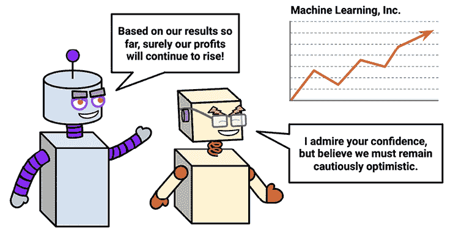

图 10.1：即使训练数据相同，学习者的预测信心也可能不同

研究这些内部预测概率为评估模型性能提供了有用的数据。如果两个模型犯同样的错误次数，但其中一个更能准确评估其不确定性，那么它就是一个更智能的模型。理想的情况是找到一个在做出正确预测时非常自信，但在面对怀疑时又很谨慎的学习者。信心与谨慎之间的平衡是模型评估的关键部分。

获取内部预测概率的函数调用在 R 包之间有所不同。对于大多数分类器，`predict()`函数允许一个额外的参数来指定所需的预测类型。要获取单个预测类别，例如垃圾邮件或正常邮件，通常设置`type = "class"`参数。要获取预测概率，`type`参数应根据所使用的分类器设置为`"prob"`、`"posterior"`、`"raw"`或`"probability"`之一。

本书介绍的所有分类器都可以提供预测概率。每个模型的`type`参数的正确设置都包含在每个模型的语法框中。

例如，要输出在*第五章*中构建的 C5.0 分类器的预测概率，请使用`predict()`函数并设置`type = "prob"`，如下所示：

```py
> predicted_prob <- predict(credit_model, credit_test, type = "prob") 
```

要输出在*第四章*中开发的短信垃圾邮件分类模型的朴素贝叶斯预测概率，请使用`predict()`函数并设置`type = "raw"`，如下所示：

```py
> sms_test_prob <- predict(sms_classifier, sms_test, type = "raw") 
```

在大多数情况下，`predict()`函数为每个结果类别返回一个概率。例如，在像短信分类器这样的双结局模型中，预测概率可能存储在一个矩阵或数据框中，如下所示：

```py
> head(sms_test_prob) 
```

```py
 ham         spam
[1,] 9.999995e-01 4.565938e-07
[2,] 9.999995e-01 4.540489e-07
[3,] 9.998418e-01 1.582360e-04
[4,] 9.999578e-01 4.223125e-05
[5,] 4.816137e-10 1.000000e+00
[6,] 9.997970e-01 2.030033e-04 
```

输出的每一行显示了分类器对垃圾邮件和正常邮件的预测概率。根据概率规则，每行的概率之和为 1，因为这些是相互排斥且穷尽的结局。为了方便起见，在评估过程中，构建一个收集预测类别、实际类别以及感兴趣类别级别的预测概率的数据框可能会有所帮助。

本章 GitHub 仓库中可用的`sms_results.csv`文件是一个符合这种格式的数据框的示例，它是由*第四章*中构建的短信分类器的预测构建的。为了简洁起见，省略了构建此评估数据集所需的步骤，因此要跟随这里的示例，只需下载文件并将其使用以下命令加载到数据框中：

```py
> sms_results <- read.csv("sms_results.csv", stringsAsFactors = TRUE) 
```

生成的`sms_results`数据框很简单。它包含四个包含 1,390 个值的向量。一列包含表示实际短信消息类型（垃圾邮件或正常邮件）的值，另一列表示朴素贝叶斯模型预测的消息类型，第三和第四列分别表示消息是垃圾邮件或正常邮件的概率：

```py
> head(sms_results) 
```

```py
 actual_type predict_type prob_spam prob_ham
1         ham          ham   0.00000  1.00000
2         ham          ham   0.00000  1.00000
3         ham          ham   0.00016  0.99984
4         ham          ham   0.00004  0.99996
5        spam         spam   1.00000  0.00000
6         ham          ham   0.00020  0.99980 
```

对于这六个测试案例，预测值和实际短信消息类型一致；模型正确预测了它们的状态。此外，预测概率表明模型对这些预测非常有信心，因为它们都接近或正好是 0 或 1。

当预测值和实际值与 0 和 1 的距离更远时会发生什么？使用`subset()`函数，我们可以识别出这些记录中的一小部分。以下输出显示了模型估计垃圾邮件概率在 40%到 60%之间的测试案例：

```py
> head(subset(sms_results, prob_spam > 0.40 & prob_spam < 0.60)) 
```

```py
 actual_type predict_type prob_spam prob_ham
377         spam          ham   0.47536  0.52464
717          ham         spam   0.56188  0.43812
1311         ham         spam   0.57917  0.42083 
```

根据模型自己的估计，这些是正确预测几乎等同于抛硬币的情况。然而，所有三个预测都是错误的——一个不幸的结果。让我们看看更多模型预测错误的情况：

```py
> head(subset(sms_results, actual_type != predict_type)) 
```

```py
 actual_type predict_type prob_spam prob_ham
53         spam          ham   0.00071  0.99929
59         spam          ham   0.00156  0.99844
73         spam          ham   0.01708  0.98292
76         spam          ham   0.00851  0.99149
184        spam          ham   0.01243  0.98757
332        spam          ham   0.00003  0.99997 
```

这些案例说明了重要的事实，即一个模型可以非常自信，但仍然可能非常错误。所有六个测试案例都是垃圾邮件，分类器认为它们至少有 98%的概率是正常邮件。

尽管存在这样的错误，模型仍然有用吗？我们可以通过将各种错误度量应用于评估数据来回答这个问题。实际上，许多这样的度量都是基于我们在前几章中广泛使用的工具。

## 混淆矩阵的更详细分析

**混淆矩阵**是一个表格，根据预测值是否与实际值匹配来分类预测。表格的一个维度表示预测值的可能类别，而另一个维度表示实际值的相同类别。尽管我们到目前为止主要使用的是 2x2 的混淆矩阵，但可以为预测任何数量类别值的模型创建矩阵。以下图显示了熟悉的二类二元模型的混淆矩阵，以及三类的 3x3 混淆矩阵。

当预测值与实际值相同时，这是一种正确的分类。正确的预测位于混淆矩阵的对角线上（用**O**表示）。对角线外的矩阵单元格（用**X**表示）表示预测值与实际值不一致的情况。这些都是错误的预测。分类模型的性能度量基于这些表中位于对角线和偏离对角线上的预测数量：

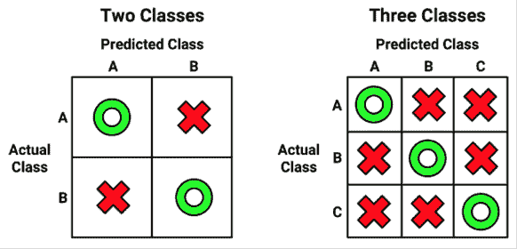

图 10.2：混淆矩阵统计预测类别与实际值一致或不一致的情况

最常见的性能度量考虑模型区分一个类别与其他所有类别的能力。目标类别被称为**正类**，而所有其他类别被称为**负类**。

使用正负术语并不旨在暗示任何价值判断（即，好与坏），也不一定意味着结果的存在或不存在（例如，存在出生缺陷或不存在）。正结果的选择甚至可以是任意的，例如在模型预测晴朗与雨天、狗与猫等类别的情况下。

正类和负类预测之间的关系可以用一个 2x2 的混淆矩阵来表示，该矩阵列出了预测是否属于以下四个类别之一：

+   **真阳性**（**TP**）：正确地被分类为目标类

+   **真阴性**（**TN**）：正确地被分类为非目标类

+   **假阳性**（**FP**）：错误地被分类为目标类

+   **假阴性**（**FN**）：错误地被分类为非目标类

对于垃圾邮件分类器，正类是垃圾邮件，因为这是我们希望检测的结果。然后我们可以想象混淆矩阵如图*图 10.3*所示：

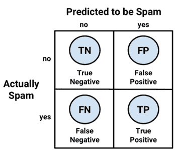

图 10.3：区分正类和负类使混淆矩阵更加详细

以这种方式展示的混淆矩阵是许多最重要的模型性能度量指标的基础。在下一节中，我们将使用这个矩阵来更好地理解准确率的确切含义。

## 使用混淆矩阵来衡量性能

使用 2x2 混淆矩阵，我们可以将**预测准确率**（有时称为**成功率**）的定义形式化如下：

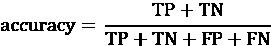

在这个公式中，术语*TP*、*TN*、*FP*和*FN*分别指模型预测落在这些类别中的次数。因此，准确率是一个比例，表示真实正例和真实负例的数量除以预测总数。

**错误率**，即错误分类的样本比例，被定义为：

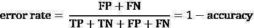

注意，错误率可以计算为 1 减去准确率。直观上，这是有道理的；一个正确率 95%的模型在 5%的时间内是错误的。

将分类器的预测整理成混淆矩阵的一个简单方法是使用 R 的`table()`函数。创建 SMS 数据混淆矩阵的命令如下所示。该表中的计数可以用来计算准确率和其他统计量：

```py
> table(sms_results$actual_type, sms_results$predict_type) 
```

```py
 ham spam
  ham  1203    4
  spam   31  152 
```

如果你想要创建一个具有更多信息的混淆矩阵，`gmodels`包中的`CrossTable()`函数提供了一个可定制的解决方案。如果你还记得，我们第一次使用这个函数是在*第二章*，*管理和理解数据*。如果你当时没有安装这个包，你需要使用`install.packages("gmodels")`命令来安装。

默认情况下，`CrossTable()`的输出包括每个单元格中的比例，这些比例表示单元格计数占表格行、列和总计数百分比。输出还包括行和列总计。如下面的代码所示，语法与`table()`函数类似：

```py
> library(gmodels)
> CrossTable(sms_results$actual_type, sms_results$predict_type) 
```

结果是一个包含大量额外详细信息的混淆矩阵：

```py
 Cell Contents
|-------------------------|
|                       N |
| Chi-square contribution |
|           N / Row Total |
|           N / Col Total |
|         N / Table Total |
|-------------------------|

Total Observations in Table:  1390 

                        | sms_results$predict_type 
sms_results$actual_type |       ham |      spam | Row Total | 
------------------------|-----------|-----------|-----------|
                    ham |      1203 |         4 |      1207 | 
                        |    16.128 |   127.580 |           | 
                        |     0.997 |     0.003 |     0.868 | 
                        |     0.975 |     0.026 |           | 
                        |     0.865 |     0.003 |           | 
------------------------|-----------|-----------|-----------|
                   spam |        31 |       152 |       183 | 
                        |   106.377 |   841.470 |           | 
                        |     0.169 |     0.831 |     0.132 | 
                        |     0.025 |     0.974 |           | 
                        |     0.022 |     0.109 |           | 
------------------------|-----------|-----------|-----------|
           Column Total |      1234 |       156 |      1390 | 
                        |     0.888 |     0.112 |           | 
------------------------|-----------|-----------|-----------| 
```

我们在几个前面的章节中使用了`CrossTable()`，所以到现在你应该熟悉它的输出了。如果你忘记了如何解释输出，只需参考键（标记为“单元格内容”），它提供了表格单元格中每个数字的定义。

我们可以使用混淆矩阵来获取准确率和错误率。由于准确率是（TP + TN）/（TP + TN + FP + FN），我们可以按以下方式计算：

```py
> (152 + 1203) / (152 + 1203 + 4 + 31) 
```

```py
[1] 0.9748201 
```

我们还可以计算错误率（FP + FN）/（TP + TN + FP + FN）如下：

```py
> (4 + 31) / (152 + 1203 + 4 + 31) 
```

```py
[1] 0.02517986 
```

这与 1 减去准确率相同：

```py
> 1 – 0.9748201 
```

```py
[1] 0.0251799 
```

虽然这些计算可能看起来很简单，但重要的是要练习思考混淆矩阵的各个组成部分是如何相互关联的。在下一节中，你将看到这些相同的部分可以以不同的方式组合，以创建各种额外的性能指标。

## 不仅仅是准确性 – 其他性能指标

无数性能指标已经被开发并用于各种学科中，如医学、信息检索、营销和信号检测理论等特定目的。要涵盖所有这些指标可能需要数百页，这使得在这里进行全面的描述变得不可行。相反，我们将仅考虑机器学习文献中最有用和最常引用的一些指标。

Max Kuhn 的`caret`包包括计算许多此类性能指标的功能。这个包提供了准备、训练、评估和可视化机器学习模型和数据工具；"caret"这个名字是“分类和回归训练”的缩写。由于它对调整模型也很有价值，除了在这里的使用外，我们还将广泛使用`caret`包在*第十四章*，*构建更好的学习者*。在继续之前，你需要使用`install.packages("caret")`命令来安装这个包。

关于`caret`的更多信息，请参阅*Kuhn, M, 使用 caret 包在 R 中构建预测模型，统计软件杂志，2008，第 28 卷*或包的非常详尽的文档页面[`topepo.github.io/caret/index.html`](http://topepo.github.io/caret/index.html)

`caret` 包添加了创建混淆矩阵的另一个函数。如下所示，语法与 `table()` 类似，但略有不同。因为 `caret` 计算反映分类正类能力的模型性能度量，所以应指定 `positive` 参数。在这种情况下，由于 SMS 分类器旨在检测垃圾邮件，我们将设置 `positive = "spam"` 如下：

```py
> library(caret)
> confusionMatrix(sms_results$predict_type,
    sms_results$actual_type, positive = "spam") 
```

这会导致以下输出：

```py
Confusion Matrix and Statistics
          Reference
Prediction  ham spam
      ham  1203   31
      spam    4  152

               Accuracy : 0.9748          
                 95% CI : (0.9652, 0.9824)
    No Information Rate : 0.8683          
    P-Value [Acc > NIR] : < 2.2e-16       

                  Kappa : 0.8825          

 Mcnemar’s Test P-Value : 1.109e-05       

            Sensitivity : 0.8306          
            Specificity : 0.9967          
         Pos Pred Value : 0.9744          
         Neg Pred Value : 0.9749          
             Prevalence : 0.1317          
         Detection Rate : 0.1094          
   Detection Prevalence : 0.1122          
      Balanced Accuracy : 0.9136          

       ‘Positive’ Class : spam 
```

输出顶部是一个类似于 `table()` 函数生成的混淆矩阵，但已转置。输出还包括一组性能度量。其中一些，如准确度，是熟悉的，而许多其他则是新的。让我们看看一些最重要的指标。

### 卡方统计量

**卡方统计量**（在之前的输出中标记为 `Kappa`）通过考虑仅凭偶然正确预测的可能性来调整准确性。这对于具有严重类别不平衡的数据集尤为重要，因为分类器可以通过始终猜测最频繁的类别来获得高准确率。卡方统计量只会奖励那些比这种简单策略更频繁正确分类的分类器。

定义卡方统计量的方法不止一种。这里描述的最常见的方法使用 **Cohen 的卡方系数**，如论文 *《名义量度的协议系数，Cohen, J, 教育与心理测量，1960，第 20 卷，第 37-46 页》* 所述。

卡方值通常在 0 到最大值 1 之间，更高的值反映了模型预测与真实值之间更强的协议。如果预测始终错误，则可能观察到小于 0 的值——也就是说，预测与实际值不一致或错误率高于随机猜测的预期。这种情况在机器学习模型中很少发生，通常反映编码问题，可以通过简单地反转预测来修复。

根据模型的使用方式，卡方统计量的解释可能会有所不同。以下是一个常见的解释示例：

+   差一致性 = 小于 0.2

+   公平一致性 = 0.2 至 0.4

+   中等一致性 = 0.4 至 0.6

+   良好一致性 = 0.6 至 0.8

+   非常好一致性 = 0.8 至 1.0

重要的是要注意，这些类别是主观的。虽然“良好一致性”可能足以预测某人的最爱冰淇淋口味，但如果目标是识别出生缺陷，“非常好一致性”可能就不够了。

关于前述量表更详细的信息，请参阅 *《分类数据的观察者一致性测量，Landis, JR, Koch, GG. 生物统计学，1997，第 33 卷，第 159-174 页》*。

以下是为计算 kappa 统计量提供的公式。在这个公式中，Pr(*a*) 指的是实际协议的比例，而 Pr(*e*) 指的是在假设它们是随机选择的情况下，分类器和真实值之间预期协议的比例：

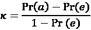

这些比例一旦你知道在哪里寻找，就可以从混淆矩阵中获得。让我们考虑使用 `CrossTable()` 函数创建的 SMS 分类模型的混淆矩阵，这里为了方便起见重复列出：

```py
 | sms_results$predict_type 
sms_results$actual_type |       ham |      spam | Row Total | 
------------------------|-----------|-----------|-----------|
                    ham |      1203 |         4 |      1207 | 
                        |    16.128 |   127.580 |           | 
                        |     0.997 |     0.003 |     0.868 | 
                        |     0.975 |     0.026 |           | 
                        |     0.865 |     0.003 |           | 
------------------------|-----------|-----------|-----------|
                   spam |        31 |       152 |       183 | 
                        |   106.377 |   841.470 |           | 
                        |     0.169 |     0.831 |     0.132 | 
                        |     0.025 |     0.974 |           | 
                        |     0.022 |     0.109 |           | 
------------------------|-----------|-----------|-----------|
           Column Total |      1234 |       156 |      1390 | 
                        |     0.888 |     0.112 |           | 
------------------------|-----------|-----------|-----------| 
```

记住，每个单元格的底部值表示所有实例落入该单元格的比例。因此，为了计算观察到的协议比例 Pr(*a*)，我们只需将预测类型和实际短信类型达成一致的实例比例相加。

因此，我们可以计算 Pr(*a*) 如下：

```py
> pr_a <- 0.865 + 0.109
> pr_a 
```

```py
[1] 0.974 
```

对于这个分类器，观察值和实际值有 97.4% 的时间达成一致——你会注意到这与准确率相同。kappa 统计量调整了相对于预期一致性 Pr(*e*) 的准确率，即仅凭偶然，在假设两者都是根据观察比例随机选择的情况下，预测值和实际值匹配的概率。 

为了找到这些观察到的比例，我们可以使用我们在 *第四章* 中学到的概率规则。假设两个事件是独立的（意味着一个不会影响另一个），概率规则指出，两个事件同时发生的概率等于各自发生的概率的乘积。例如，我们知道选择非垃圾邮件的概率是：

Pr(*实际类型是非垃圾邮件*) * Pr(*预测类型是非垃圾邮件*)

选择垃圾邮件的概率是：

Pr(*实际类型是垃圾邮件*) * Pr(*预测类型是垃圾邮件*)

预测或实际类型是垃圾邮件或非垃圾邮件的概率可以从行或列总数中获得。例如，Pr(*实际类型是非垃圾邮件*) = 0.868 和 Pr(*预测类型是非垃圾邮件*) = 0.888。

Pr(*e*) 可以通过预测值和实际值都认为消息是垃圾邮件或非垃圾邮件的概率之和来计算。回想一下，对于互斥事件（不能同时发生的事件），任一事件发生的概率等于其概率之和。因此，为了获得最终的 Pr(*e*)，我们只需将两个乘积相加，如下所示：

```py
> pr_e <- 0.868 * 0.888 + 0.132 * 0.112
> pr_e 
```

```py
[1] 0.785568 
```

由于 Pr(*e*) 是 0.786，仅凭偶然，我们预计观察值和实际值将有大约 78.6% 的时间达成一致。

这意味着我们现在拥有了完成 kappa 公式的所有信息。将 Pr(*a*) 和 Pr(*e*) 值代入 kappa 公式，我们得到：

```py
> k <- (pr_a - pr_e) / (1 - pr_e) 
> k 
```

```py
[1] 0.8787494 
```

kappa 大约是 0.88，这与之前 `caret` 的 `confusionMatrix()` 输出相符（小的差异是由于四舍五入）。使用建议的解释，我们注意到分类器的预测值和实际值之间有非常好的协议。

有几个 R 函数可以自动计算 kappa。**可视化分类数据**（`VCD`）包中的`Kappa()`函数（请注意大写的“K”），使用预测值和实际值的混淆矩阵。通过输入`install.packages("vcd")`安装包后，可以使用以下命令获取 kappa：

```py
> library(vcd)
> Kappa(table(sms_results$actual_type, sms_results$predict_type)) 
```

```py
 value     ASE     z Pr(>|z|)
Unweighted 0.8825 0.01949 45.27        0
Weighted   0.8825 0.01949 45.27        0 
```

我们对无权重的 kappa 值感兴趣。0.88 的值与我们手动计算的结果相符。

当存在不同程度的协议时，使用加权 kappa。例如，使用冷、凉爽、温暖和热的刻度，温暖与热的值比与冷的值更一致。在两个结果事件的情况下，如垃圾邮件和正常邮件，加权 kappa 和未加权 kappa 统计量将是相同的。

**Interrater Reliability**（`irr`）包中的`kappa2()`函数可以用来从数据框中存储的预测值和实际值的向量中计算 kappa。在通过`install.packages("irr")`安装包之后，可以使用以下命令获取 kappa：

```py
> library(irr)
> kappa2(sms_results[1:2]) 
```

```py
Cohen's Kappa for 2 Raters (Weights: unweighted)
 Subjects = 1390 
   Raters = 2 
    Kappa = 0.883 
        z = 33 
  p-value = 0 
```

`Kappa()`和`kappa2()`函数报告相同的 kappa 统计量，因此使用您更舒适的选项。

请注意不要使用内置的`kappa()`函数。它与之前报告的 kappa 统计量完全无关！

### 矩阵相关系数

尽管准确性和 kappa 多年来一直是性能的流行指标，但第三个选项迅速成为机器学习领域的实际标准。与先前的指标一样，**矩阵相关系数**（**MCC**）是一个单一统计量，旨在反映分类模型的总体性能。此外，MCC 与 kappa 类似，即使在数据集严重不平衡的情况下（在这种情况下，传统的准确度度量可能会非常误导），它也是有用的。

由于其易于解释，以及越来越多的证据表明它在比 kappa 更广泛的情境下表现更好，MCC 越来越受欢迎。最近的经验研究表明，MCC 可能是描述二元分类模型现实世界性能的最佳单一指标。其他研究已经确定了可能导致 kappa 统计量提供误导或不正确模型性能描述的潜在情境。在这些情况下，当 MCC 和 kappa 不一致时，MCC 指标往往能更合理地评估模型的真正能力。

关于马修斯相关系数与 k 值相对优势的更多信息，请参阅 *The Matthews correlation coefficient (MCC) is more informative than Cohen’s kappa and brier score in binary classification assessment, Chicco D, Warrens MJ, Jurman G, IEEE Access, 2021, Vol. 9, pp. 78368-78381*。或者，参考 *Why Cohen’s Kappa should be avoided as performance measure in classification, Delgado R, Tibau XA, PLoS One, 2019, Vol. 14(9):e0222916*。

MCC 的值解释与皮尔逊相关系数相同，该系数在 *第六章*，*预测数值数据 – 回归方法* 中介绍。这个范围从 -1 到 +1，分别表示完全不准确和完全准确的预测。值为 0 表示模型的表现不优于随机猜测。由于大多数 MCC 分数都位于 0 和 1 之间的某个值域内，因此“良好”分数的判断具有一定的主观性。与皮尔逊相关系数使用的刻度类似，一种可能的解释如下：

+   完全错误 = -1.0

+   强度错误 = -0.5 到 -1.0

+   中度错误 = -0.3 到 -0.5

+   弱度错误 = -0.1 到 0.3

+   随机正确 = -0.1 到 0.1

+   轻度正确 = 0.1 到 0.3

+   中度正确 = 0.3 到 0.5

+   强度正确 = 0.5 到 1.0

+   完全正确 = 1.0

注意，表现最差的模型位于刻度中间。换句话说，位于刻度负侧（从完全错误到轻度错误）的模型仍然比随机预测的模型表现更好。例如，即使强度错误的模型的准确度很差，预测结果也可以简单地反转以获得正确的结果。

与所有此类刻度一样，这些刻度只能作为粗略的指南。此外，像 MCC 这样的度量标准的关键好处不是理解模型在孤立状态下的性能，而是促进跨多个模型的性能比较。

对于二分类器的混淆矩阵，MCC 可以通过以下公式计算：

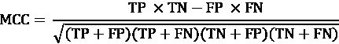

使用 SMS 垃圾邮件分类模型的混淆矩阵，我们得到以下值：

+   TN = 1203

+   FP = 4

+   FN = 31

+   TP = 152

然后，可以在 R 中手动计算 MCC，如下所示：

```py
> (152 * 1203 - 4 * 31) /
    sqrt((152 + 4) * (152 + 31) * (1203 + 4) * (1203 + 31)) 
```

```py
[1] 0.8861669 
```

Ben Gorman 开发的 `mltools` 包提供了一个 `mcc()` 函数，该函数可以使用预测值和实际值的向量执行 MCC 计算。安装该包后，以下 R 代码产生的结果与手动计算的结果相同：

```py
> library(mltools)
> mcc(sms_results$actual_type, sms_results$predict_type) 
```

```py
[1] 0.8861669 
```

或者，对于将正类编码为 1 且将负类编码为 0 的二分类器，MCC 与预测值和实际值之间的皮尔逊相关系数相同。我们可以使用 R 中的 `cor()` 函数来演示这一点，在将分类值（`"spam"` 或 `"ham"`）转换为二进制值（`1` 或 `0`）后，如下所示：

```py
> cor(ifelse(sms_results$actual_type == "spam", 1, 0),
      ifelse(sms_results$predict_type == "spam", 1, 0)) 
```

```py
[1] 0.8861669 
```

这样一个显然的分类性能指标竟然隐藏在显而易见的地方，作为一个简单的对 19 世纪末引入的皮尔逊相关性的改编，这使得 MCC（Matthews Correlation Coefficient）仅在最近几十年才变得流行！生物化学家布莱恩·W·马修斯在 1975 年负责推广这个指标用于双分类问题，因此他因这一特定应用而获得命名荣誉。然而，似乎很可能是这个指标已经被广泛使用，即使它直到很久以后才引起了很多关注。如今，它在工业界、学术研究和甚至作为机器学习竞赛的基准中得到应用。可能没有单一的指标能更好地捕捉二元分类模型的总体性能。然而，正如你很快就会看到的，通过组合多个指标可以获得对模型性能的更深入理解。

虽然 MCC 在这里是为二元分类定义的，但它是否是多类结果的最佳指标尚不清楚。关于这一点和其他替代方案的讨论，请参阅*“多类预测中 MCC 和 CEN 误差测量的比较，Jurman G，Riccadonna S，Furlanello C，2012，PLOS One 7(8): e41882”*。

### 灵敏度和特异性

寻找一个有用的分类器通常需要在过于保守的预测和过于激进的预测之间取得平衡。例如，一个电子邮件过滤器可以通过激进地过滤几乎所有的正常邮件来保证消除每一封垃圾邮件。另一方面，为了保证没有正常邮件被意外过滤，可能需要我们允许通过过滤器的不合理数量的垃圾邮件。一对性能指标捕捉了这种权衡：灵敏度和特异性。

模型的**灵敏度**（也称为**真正率**）衡量的是正确分类的正面样本占所有正面样本的比例。因此，正如以下公式所示，它是通过将真正例的数量除以所有正面样本的总数来计算的，包括那些正确分类的（真正例）和那些错误分类的（假阴性）：

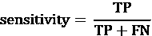

模型的**特异性**（也称为**真正率**）衡量的是正确分类的负面样本占所有负面样本的比例。与灵敏度一样，这是通过将真正例的数量除以所有负面样本的总数来计算的——包括真正例和假阳性。

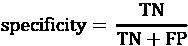

对于短信分类器的混淆矩阵，我们可以很容易地手动计算这些指标。假设垃圾邮件是一个正面类别，我们可以确认`confusionMatrix()`输出中的数字是正确的。例如，灵敏度的计算如下：

```py
> sens <- 152 / (152 + 31)
> sens 
```

```py
[1] 0.8306011 
```

同样，对于特异性，我们可以计算：

```py
> spec <- 1203 / (1203 + 4)
> spec 
```

```py
[1] 0.996686 
```

`caret`包提供了从预测值和实际值向量直接计算敏感性和特异性的函数。请确保适当地指定`positive`或`negative`参数，如下所示：

```py
> library(caret)
> sensitivity(sms_results$predict_type, sms_results$actual_type,
              positive = "spam") 
```

```py
[1] 0.8306011 
```

```py
> specificity(sms_results$predict_type, sms_results$actual_type,
              negative = "ham") 
```

```py
[1] 0.996686 
```

敏感性和特异性范围从 0 到 1，接近 1 的值更受欢迎。当然，找到两者之间的适当平衡是很重要的——这是一个通常非常具体于上下文的任务。

例如，在这种情况下，0.831 的敏感性意味着 83.1%的垃圾邮件被正确分类。同样，0.997 的特异性意味着 99.7%的非垃圾邮件被正确分类，或者换句话说，0.3%的有效消息被错误地标记为垃圾邮件。拒绝 0.3%的有效短信消息可能是不被接受的，或者考虑到垃圾邮件数量的减少，这可能是合理的权衡。

敏感性和特异性提供了思考此类权衡的工具。通常，会调整模型并测试不同的模型，直到找到一个满足所需敏感性和特异性阈值的模型。本章后面讨论的可视化也可以帮助理解敏感性和特异性之间的平衡。

### 精确度和召回率

与敏感性和特异性密切相关的是另外两个与分类中做出的妥协相关的性能指标：精确度和召回率。主要在信息检索的背景下使用，这些统计数据旨在表明模型的结果有多有趣和相关性，或者预测是否被无意义的噪声稀释。

**精确度**（也称为**阳性预测值**）定义为真正阳性的预测比例；换句话说，当模型预测阳性类别时，它有多正确？一个精确的模型只会预测那些非常可能是阳性的情况。它将非常可靠。

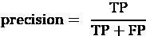

考虑一下，如果模型非常不精确会发生什么。随着时间的推移，结果不太可能被信任。在信息检索的背景下，这类似于像 Google 这样的搜索引擎返回不相关结果。最终，用户可能会转向像 Bing 这样的竞争对手。在短信垃圾邮件过滤器的例子中，高精确度意味着模型能够仔细地只针对垃圾邮件，同时避免在正常邮件中出现误报。

另一方面，**召回率**是衡量结果完整性的一个指标。如下公式所示，这定义为真正阳性数除以总阳性数。你可能已经认识到这与敏感性相同；然而，解释略有不同。

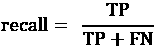

具有高召回率的模型能够捕获大量正例，这意味着它具有广泛的覆盖面。例如，具有高召回率的搜索引擎会返回大量与搜索查询相关的文档。同样，如果大多数垃圾邮件消息被正确识别，短信垃圾邮件过滤器也具有高召回率。

我们可以从混淆矩阵中计算出精确度和召回率。再次假设垃圾邮件是一个正类，精确度是：

```py
> prec <- 152 / (152 + 4)
> prec 
```

```py
[1] 0.974359 
```

召回率是：

```py
> rec <- 152 / (152 + 31)
> rec 
```

```py
[1] 0.8306011 
```

可以使用`caret`包从预测和实际类别的向量中计算这些度量之一。精确度使用`posPredValue()`函数：

```py
> library(caret)
> posPredValue(sms_results$predict_type, sms_results$actual_type,
               positive = "spam") 
```

```py
[1] 0.974359 
```

召回率使用我们之前使用的`sensitivity()`函数：

```py
> sensitivity(sms_results$predict_type, sms_results$actual_type,
              positive = "spam") 
```

```py
[1] 0.8306011 
```

就像敏感性和特异性之间的权衡一样，对于大多数现实世界的问题，很难构建一个既具有高精确度又具有高召回率的模型。如果你只针对容易分类的例子（即低垂的果实），那么很容易做到精确。同样，一个模型通过撒一个非常宽的网，意味着模型在识别正例时过于激进，也容易具有高召回率。相比之下，同时具有高精确度和召回率是非常具有挑战性的。因此，为了找到满足你项目需求的精确度和召回率的组合，测试各种模型是非常重要的。

### F 度量

将精确度和召回率结合成一个单一数字的模型性能度量称为**F 度量**（有时也称为**F**[1] **分数**或**F 分数**）。F 度量通过**调和平均数**结合精确度和召回率，这是一种用于变化率的平均数类型。由于精确度和召回率都表示为 0 到 1 之间的比例，可以解释为变化率，因此使用调和平均数而不是更常见的算术平均数。以下为 F 度量的公式：

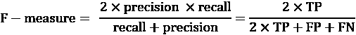

要计算 F 度量，使用之前计算出的精确度和召回率值：

```py
> f <- (2 * prec * rec) / (prec + rec) 
> f 
```

```py
[1] 0.8967552 
```

这与使用混淆矩阵中的计数完全相同：

```py
> f <- (2 * 152) / (2 * 152 + 4 + 31)
> f 
```

```py
[1] 0.8967552 
```

由于 F 度量将模型性能描述为一个单一数字，它提供了一个方便的、定量的指标，可以直接比较多个模型。确实，F 度量曾经几乎成为衡量模型性能的黄金标准，但今天，它似乎比以前使用得少得多。一个可能的解释是，它假设精确度和召回度应该被赋予相同的权重，这个假设并不总是有效的，这取决于现实世界中假阳性和假阴性的实际成本。当然，可以使用不同的精确度和召回度权重来计算 F 分数，但选择权重可能最坏的情况是随意的。尽管如此，也许这个指标不再受欢迎的更重要原因是采用了方法，这些方法可以直观地描绘模型在不同数据子集上的性能，如下一节所述。

## 使用 ROC 曲线可视化性能权衡

可视化有助于更详细地理解机器学习算法的性能。当诸如敏感度、特异性、精确度和召回率等统计量试图将模型性能简化为一个单一数字时，可视化则描绘了学习者在广泛条件下的表现。

由于学习算法有不同的偏差，两个具有相似准确率的模型可能在达到准确率的方式上存在巨大差异。一些模型可能在某些预测上挣扎，而其他模型则轻松完成，同时轻松处理其他模型难以正确处理的案例。可视化提供了一种方法，通过在单个图表中并排比较学习器来理解这些权衡。

**接收者操作特征**（**ROC**）曲线通常用于检查在避免假阳性同时检测真阳性的权衡。正如你可能从其名称中猜测到的，ROC 曲线是由通信领域的工程师开发的。在第二次世界大战期间，雷达和无线电操作员使用 ROC 曲线来衡量接收器区分真实信号和虚假警报的能力。同样的技术今天对于可视化机器学习模型的功效也很有用。

关于 ROC 曲线的更多阅读，请参阅*《ROC 分析简介》，Fawcett T，Pattern Recognition Letters，2006 年，第 27 卷，第 861-874 页*。

典型 ROC 图的特征在*图 10.4*中展示。ROC 曲线使用垂直轴上的真阳性比例和水平轴上的假阳性比例来绘制。因为这些值分别等同于敏感度和（1 – 特异性），所以该图也被称为**敏感度/特异性图**。

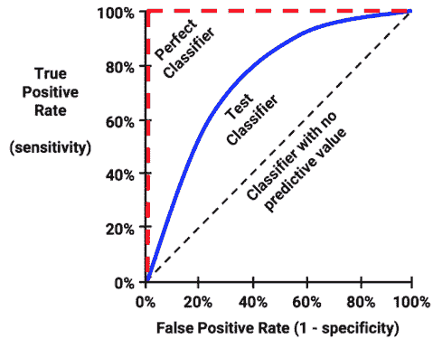

图 10.4：ROC 曲线描绘了分类器形状相对于完美和无用分类器

组成 ROC 曲线的点表示在变化的假阳性阈值下的真正例率。为了说明这个概念，前一个图表中对比了三个假设的分类器。首先，*完美分类器*的曲线通过 100%真正例率和 0%假阳性率的点。它能够在错误地分类任何负例之前正确地识别所有真正例。接下来，从图的下左角到上右角的斜线代表一个*无预测价值的分类器*。这种分类器以相同的速率检测真正例和假阳性，这意味着分类器无法区分两者。这是其他分类器可以评判的基准。接近这条线的 ROC 曲线表示模型不太有用。最后，大多数现实世界的分类器都像*测试分类器*一样，它们位于完美和无用之间的区域。

理解 ROC 曲线构建的最佳方式是亲手绘制一个。*图 10.5*中表格中的数值表示了一个假设的垃圾邮件模型在包含 20 个示例的测试集上的预测结果，其中 6 个是正类（垃圾邮件），14 个是负类（正常邮件）。

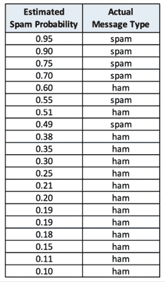

图 10.5：为了构建 ROC 曲线，将正类的估计概率值按降序排序，然后与实际类别值进行比较

要创建曲线，需要按照模型对正类估计概率的降序对分类器的预测进行排序，最大的值排在前面，如表中所示。然后，从图表的原点开始，每个预测对真正例率和假阳性率的影响导致曲线垂直于每个正例进行追踪，水平于每个负例进行追踪。这个过程可以在一张坐标纸上手工完成，如图*图 10.6*所示：

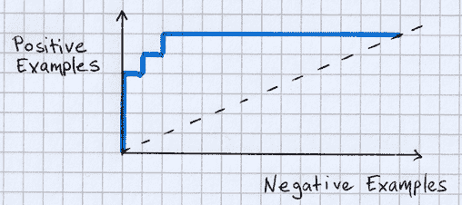

图 10.6：可以在坐标纸上通过绘制正例数量与负例数量的对比来手工绘制 ROC 曲线

注意，此时 ROC 曲线并不完整，因为测试集中负例的数量是正例的两倍以上，导致坐标轴倾斜。一个简单的解决方案是将图表按比例缩放，使得两个坐标轴的大小相等，如图*图 10.7*所示：

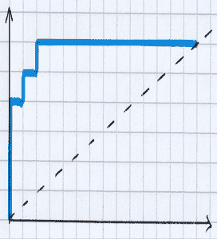

图 10.7：调整图表的坐标轴比例，可以创建一个无论初始正负例平衡如何都成比例的比较

如果我们想象现在 *x* 轴和 *y* 轴的范围都是从 0 到 1，我们可以将每个轴解释为百分比。*y* 轴表示正例的数量，最初的范围是从 0 到 6；将其缩小到 0 到 1 的比例后，每个增量变为 1/6。在这个比例上，我们可以将 ROC 曲线的垂直坐标视为真阳性数除以总正例数，即真阳性率，或灵敏度。同样，*x* 轴衡量的是负例的数量；通过除以总负例数（本例中为 14），我们得到真阴性率，或特异性。

*图 10.8* 中的表格描述了假设测试集中所有 20 个示例的计算：


图 10.8：ROC 曲线追踪模型真阳性率与假阳性率随示例集规模逐渐增大而发生的变化

ROC 曲线的一个重要特性是它们不受类别不平衡问题的影响，其中一个结果（通常是正类）比另一个结果要罕见得多。许多性能指标，如准确率，对于不平衡数据可能会产生误导。ROC 曲线并非如此，因为图表的两个维度完全基于正负值内的比率，因此正负之间的比率不会影响结果。由于许多最重要的机器学习任务都涉及严重不平衡的结果，ROC 曲线是理解模型整体质量的一个非常有用的工具。

### 比较 ROC 曲线

如果 ROC 曲线有助于评估单个模型，那么它们也用于跨模型比较也就不足为奇了。直观上，我们知道靠近图表区域右上角的曲线更好。在实践中，这种比较往往比这更具有挑战性，因为曲线之间的差异通常是微妙的而不是明显的，而且解释是细微的、具体的，并且与模型的使用方式有关。

要理解细微差别，让我们首先考虑是什么原因导致两个模型在 ROC 图上绘制出不同的曲线。从原点开始，曲线长度随着预测为正的测试集示例数量的增加而延长。因为 *y* 轴代表真阳性率，而 *x* 轴代表假阳性率，更陡峭的上升轨迹是一个隐含的比率，意味着模型在识别正例时犯的错误更少。这如图 10.9 所示，它描绘了两个虚构模型的 ROC 曲线的起点。对于相同数量的预测——由从原点发出的向量的长度相等表示——第一个模型具有更高的真阳性率和更低的假阳性率，这意味着它是两个模型中表现更好的一个：

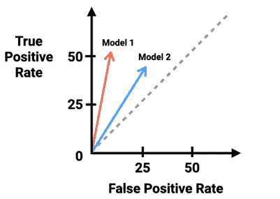

图 10.9：对于相同数量的预测，模型 1 优于模型 2，因为它具有更高的真正阳性率

假设我们继续追踪这两个模型的 ROC 曲线，评估模型在整个数据集上的预测。在这种情况下，也许第一个模型在曲线的所有点上继续优于第二个模型，如*图 10.10*所示。

在曲线的所有点上，第一个模型具有更高的真正阳性率和更低的假阳性率，这意味着它在整个数据集上是更好的表现者：

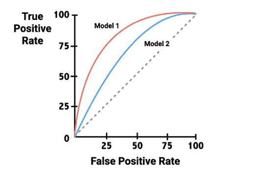

图 10.10：模型 1 在所有曲线点上始终优于模型 2，具有更高的真正阳性和更低的假阳性率

尽管在先前的例子中第二个模型明显劣于第一个模型，但选择更好的表现者并不总是那么容易。*图 10.11*展示了相交的 ROC 曲线，这表明没有哪个模型是所有应用的最好表现者：

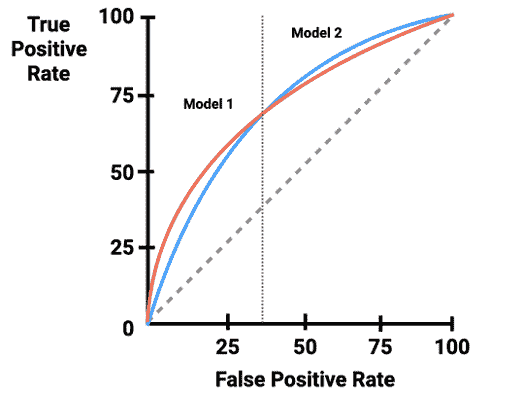

图 10.11：对于数据的不同子集，模型 1 和模型 2 都是更好的表现者

两个 ROC 曲线的交点将图表分为两个区域：一个区域中第一个模型具有更高的真正阳性率，另一个区域中则相反。那么，我们如何知道哪个模型对于任何特定的用例是“最佳”的呢？

为了回答这个问题，当比较两条曲线时，了解两个模型都在尝试按照每个示例属于正类概率从高到低的顺序对数据集进行排序是有帮助的。那些能够更好地以这种方式排序数据集的模型将具有更靠近图表左上角的 ROC 曲线。

*图 10.11*中的第一个模型之所以能迅速领先，是因为它能够将更多的正例排序到数据集的前端，但在此初始激增之后，第二个模型能够逐渐赶上，并在数据集剩余部分中缓慢而稳定地将正例排序在负例之前，从而超越了其他模型。尽管第二个模型可能在整个数据集上具有更好的整体性能，但我们更倾向于选择早期表现更好的模型——那些在数据集中“低垂的果实”上表现更好的模型。选择这些模型的理由是，许多现实世界的模型仅用于对数据子集采取行动。

例如，考虑一个用于识别最有可能对直接邮件广告活动做出反应的客户的模型。如果我们能够向所有潜在客户发送邮件，那么模型就是不必要的。但由于我们没有足够的预算向每个地址发送广告，因此模型被用来估计收件人在查看广告后购买产品的概率。一个能够更好地将真正最有可能购买的产品放在列表前面的模型将会有一个更陡峭的 ROC 曲线早期斜率，并将缩小获取购买者所需的营销预算。在*图 10.11*中，第一个模型更适合这项任务。

与这种方法相反，另一个考虑因素是各种类型错误的相对成本；在现实世界中，假阳性和假阴性通常有不同的影响。如果我们知道垃圾邮件过滤器或癌症筛查需要针对特定的真正阳性率，例如 90%或 99%，我们将倾向于选择在期望水平上具有较低假阳性率的模型。尽管由于高假阳性率，这两个模型都不会很好，但*图 10.11*表明，第二个模型对于这些应用来说稍微更可取。

如这些示例所示，ROC 曲线允许比较模型性能，同时也考虑了模型的使用方式。这种灵活性比简单的数值指标如准确度或 kappa 更受欢迎，但可能也希望通过一个单一的指标来量化 ROC 曲线，以便可以进行定量比较，就像这些统计数据一样。下一节将介绍这种类型的度量。

### ROC 曲线下的面积

比较 ROC 曲线可能具有一定的主观性和情境特异性，因此将性能简化为单一数值的指标总是有需求的，以便简化并使比较具有客观性。虽然可能难以说清楚什么是一个“好的”ROC 曲线，但一般来说，我们知道 ROC 曲线越接近图表的右上角，它在识别正值方面的能力就越好。这可以通过一个称为**ROC 曲线下面积**（**AUC**）的统计量来衡量。AUC 将 ROC 图视为一个二维正方形，并测量 ROC 曲线下的总面积。AUC 的范围从 0.5（对于没有预测价值的分类器）到 1.0（对于完美的分类器）。解释 AUC 分数的惯例使用了一个类似于学术成绩等级的系统：

+   **A**：杰出 = 0.9 到 1.0

+   **B**：优秀/良好 = 0.8 到 0.9

+   **C**：可接受/公平 = 0.7 到 0.8

+   **D**：差 = 0.6 到 0.7

+   **E**：无区分度 = 0.5 到 0.6

与大多数此类量表一样，某些任务可能比其他任务更适合这些级别；类别之间的边界自然是有些模糊的。

ROC 曲线低于对角线的情况虽然罕见但可能发生，这会导致 AUC 小于 0.50。这意味着分类器的性能不如随机。通常，这是由于编码错误造成的，因为一个始终做出错误预测的模型显然已经从数据中学习到了一些有用的信息——它只是错误地应用了预测。要解决这个问题，请确认正例的编码是否正确，或者简单地反转预测，使得当模型预测负类时，选择正类代替。

当 AUC 的使用开始变得普遍时，有些人将其视为模型性能的最终衡量标准，尽管不幸的是，在所有情况下这并不成立。一般来说，更高的 AUC 值反映了分类器在将随机正例排序高于随机负例方面表现更好。然而，*图 10.12*说明了重要的事实：两条 ROC 曲线可能形状非常不同，但 AUC 却相同：

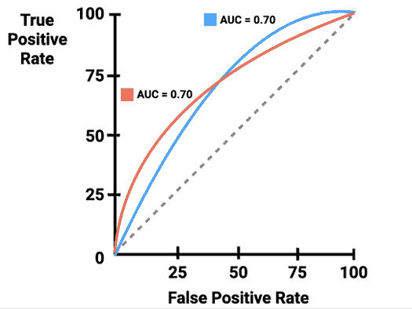

图 10.12：尽管 AUC 相同，ROC 曲线可能具有不同的性能

由于 AUC 是 ROC 曲线的简化，仅凭 AUC 本身不足以识别适用于所有用例的“最佳”模型。最安全的做法是将 AUC 与对 ROC 曲线的定性检查结合起来，正如本章前面所述。如果两个模型的 AUC 相同或相似，通常更倾向于选择早期表现更好的模型。此外，即使一个模型的整体 AUC 更好，对于仅将使用最自信预测子集的应用，具有更高初始真正阳性率的模型可能更受欢迎。

### 在 R 中创建 ROC 曲线和计算 AUC

`pROC`包提供了一套易于使用的函数，用于创建 ROC 曲线和计算 AUC。`pROC`网站（[`web.expasy.org/pROC/`](https://web.expasy.org/pROC/））列出了完整的功能列表，以及几个可视化功能的示例。在继续之前，请确保您已使用`install.packages("pROC")`命令安装了该包。

关于`pROC`包的更多信息，请参阅*pROC：用于 R 和 S+的开源包，用于分析和比较 ROC 曲线，Robin, X, Turck, N, Hainard, A, Tiberti, N, Lisacek, F, Sanchez, JC, 和 Mueller M, BMC Bioinformatics, 2011, 第 12-77 页*。

要使用`pROC`创建可视化，需要两个数据向量。第一个必须包含正类估计概率，第二个必须包含预测类别值。

对于 SMS 分类器，我们将按照以下方式将估计的垃圾邮件概率和实际类别标签提供给`roc()`函数：

```py
> library(pROC)
> sms_roc <- roc(sms_results$prob_spam, sms_results$actual_type) 
```

使用`sms_roc`对象，我们可以通过 R 的`plot()`函数来可视化 ROC 曲线。如下所示，许多用于调整图形的标准参数都可以使用，例如`main`（用于添加标题）、`col`（用于更改线条颜色）和`lwd`（用于调整线条宽度）。`grid`参数在图形上添加了浅色的网格线，有助于提高可读性，而`legacy.axes`参数指示`pROC`将*x*轴标记为 1 – 特异性，这是一个流行的约定，因为它等同于假阳性率：

```py
> plot(sms_roc, main = "ROC curve for SMS spam filter",
         Col = "blue", lwd = 2, grid = TRUE, legacy.axes = TRUE) 
```

结果是一个 Naive Bayes 分类器的 ROC 曲线和一个表示无预测价值的基线分类器的对角参考线：

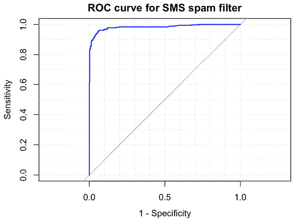

图 10.13：Naive Bayes SMS 分类器的 ROC 曲线

定性来看，我们可以看到这条 ROC 曲线似乎占据了图表的右上角空间，这表明它比代表无用分类器的虚线更接近完美分类器。

为了将此模型的性能与其他在同一数据集上预测的其他模型进行比较，我们可以在同一图表上添加额外的 ROC 曲线。假设我们已经在 SMS 数据上使用第三章中描述的`knn()`函数训练了一个 k-NN 模型。使用此模型，我们计算了测试集中每个记录的垃圾邮件预测概率，并将其保存到 CSV 文件中，我们可以在这里加载它。加载文件后，我们将像之前一样应用`roc()`函数来计算 ROC 曲线，然后使用`plot()`函数并设置参数`add = TRUE`将曲线添加到之前的图表中：

```py
> sms_results_knn <- read.csv("sms_results_knn.csv")
> sms_roc_knn <- roc(sms_results$actual_type,
                       sms_results_knn$p_spam)
> plot(sms_roc_knn, col = "red", lwd = 2, add = TRUE) 
```

结果可视化中还有一个第二曲线，描述了 k-NN 模型在相同的测试集上对 Naive Bayes 模型进行预测的性能。k-NN 的曲线始终较低，表明它比 Naive Bayes 方法是一个持续较差的模型：

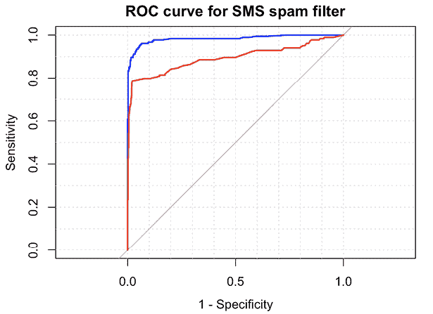

图 10.14：比较 Naive Bayes（最上面的曲线）和 k-NN（底部曲线）在 SMS 测试集上的性能的 ROC 曲线

为了定量地确认这一点，我们可以使用`pROC`包来计算 AUC。为此，我们只需将包的`auc()`函数应用于每个模型的`sms_roc`对象，如下所示：

```py
> auc(sms_roc) 
```

```py
Area under the curve: 0.9836 
```

```py
> auc(sms_roc_knn) 
```

```py
Area under the curve: 0.8942 
```

Naive Bayes SMS 分类器的 AUC 为 0.98，这非常高，并且比 k-NN 分类器的 AUC 0.89 要好得多。但我们是怎样知道模型在另一个数据集上表现同样好的可能性，或者这种差异是否大于仅由偶然性预期的？为了回答这些问题，我们需要更好地理解我们可以将模型的预测外推多远超出测试数据。这些方法将在接下来的章节中描述。

这一点之前已经提到过，但值得再次强调：仅凭 AUC 值往往不足以确定一个“最佳”模型。在这个例子中，AUC 值确实能够识别出更好的模型，因为 ROC 曲线没有交叉——朴素贝叶斯模型在 ROC 曲线的所有点上都具有更好的真正阳性率。当 ROC 曲线*确实*交叉时，“最佳”模型将取决于模型的使用方式。此外，还可以使用第十四章中介绍的*构建更好的学习器*技术，将具有交叉 ROC 曲线的学习者组合成更强大的模型。

# 估计未来性能

一些 R 机器学习包在模型构建过程中会展示混淆矩阵和性能指标。这些统计数据的目的是为了提供对模型**重新替换误差**的洞察，这种误差发生在尽管模型是在这些数据上训练的，但训练样本的目标值被错误预测的情况下。这可以用作粗略的诊断工具，以识别明显表现不佳的模型。一个在训练数据上表现不佳的模型不太可能在未来的数据上表现良好。

反过来则不成立。换句话说，一个在训练数据上表现良好的模型不能假设它在未来的数据集上也会表现良好。例如，一个使用死记硬背来完美分类每个训练实例且零重新替换误差的模型将无法将其预测推广到它以前从未见过的数据。因此，训练数据上的错误率可以假设是对模型未来性能的乐观估计。

与依赖于重新替换误差相比，更好的做法是评估模型在尚未见过的数据上的性能。我们在前面的章节中已经使用过这种方法，当时我们将可用的数据分成训练集和测试集。然而，在某些情况下，创建训练集和测试集并不总是理想的。例如，在你只有一小部分数据的情况下，你可能不想进一步减少样本量。

幸运的是，你很快就会了解到，还有其他方法可以估计模型在未见数据上的性能。我们用来计算性能指标的`caret`包也提供了估计未来性能的函数。如果你正在跟随 R 代码示例，并且尚未安装`caret`包，请先安装。你还需要使用`library(caret)`命令将包加载到 R 会话中。

## 保留法

我们在前面章节中使用的数据划分为训练集和测试集的过程被称为**保留法**。如图 10.15 所示，**训练集**用于生成模型，然后该模型应用于**测试集**以生成用于评估的预测。通常，大约三分之一的用于测试，三分之二用于训练，但这个比例可能会根据可用数据的数量或学习任务的复杂性而变化。为了确保训练集和测试集没有系统性差异，它们的示例被随机分为两组。

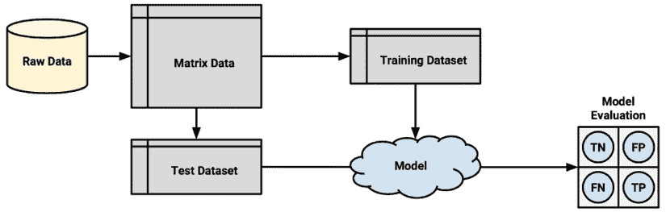

图 10.15：最简单的保留法将数据分为训练集和测试集

为了使保留法得到对未来性能的真正准确估计，在任何时候都不应允许测试集上的性能影响建模过程。正如斯坦福大学教授、著名机器学习专家 Trevor Hastie 所说：“*理想情况下，测试集应该被保存在一个‘保险库’中，只有在数据分析结束时才取出*。”换句话说，测试数据除了其唯一目的之外，不应被触及，即评估一个单一、最终的模型。

更多信息，请参阅*《统计学习元素》（第 2 版），Hastie，Tibshirani 和 Friedman（2009），第 222 页*。

很容易在不经意间违反这个规则，在选择多个模型之一或根据重复测试的结果更改单个模型时窥视这个比喻性的“保险库”。例如，假设我们在训练数据上构建了几个模型，并在测试数据上选择了准确率最高的模型。在这种情况下，因为我们已经使用了测试集来挑选最佳结果，所以测试性能并不是对未来未见数据性能的无偏度量

留心观察的读者会发现，在前几章中使用了保留测试数据来评估模型并提高模型性能。这样做是为了说明目的，但实际上违反了之前陈述的规则。因此，所显示的模型性能统计数据并不是对未来未见数据的真正无偏估计。

。

为了避免这个问题，最好将原始数据划分为除了训练集和测试集之外，还有一个**验证集**。验证集可以用于迭代和细化选定的模型或模型，而将测试集仅用于最终步骤，以报告对未来预测的估计错误率。典型的划分比例是训练集 50%，测试集 25%，验证集 25%。

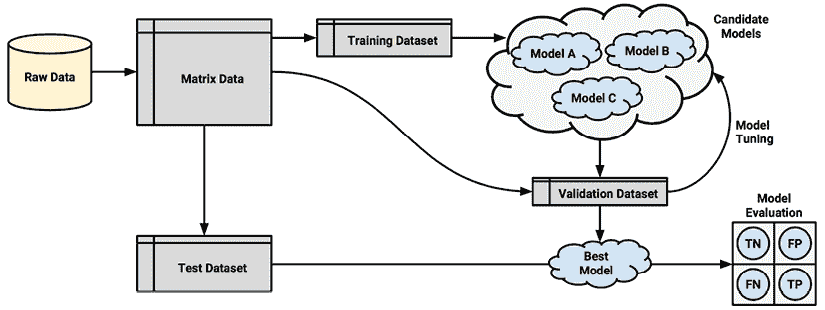

图 10.16：验证集可以从训练集中保留出来，以选择多个候选模型

使用随机数生成器将记录分配到分区是一种创建保留样本的简单方法。这种技术首次在**第五章**，**分而治之 – 使用决策树和规则进行分类**中使用，用于创建训练和测试数据集。

如果你想要跟随以下示例，请从 Packt Publishing 的网站上下载`credit.csv`数据集，并使用`credit <- read.csv("credit.csv", stringsAsFactors = TRUE)`命令将其加载到数据框中。

假设我们有一个名为`credit`的数据框，包含 1,000 行数据。我们可以将其划分为三个分区，如下所示。首先，我们使用`runif()`函数创建一个从 1 到 1,000 的随机排序行 ID 向量，该函数默认在 0 和 1 之间生成指定数量的随机值。`runif()`函数的名字来源于随机均匀分布，这在**第二章**，**管理和理解数据**中讨论过。

然后，`order()`函数返回一个指示 1,000 个随机数排名顺序的向量。例如，`order(c(0.5, 0.25, 0.75, 0.1))`返回序列`4 2 1 3`，因为最小的数字（0.1）出现在第四位，第二小的（0.25）出现在第二位，以此类推：

```py
> random_ids <- order(runif(1000)) 
```

接下来，使用随机 ID 将信用数据框划分为包含训练、验证和测试数据集的 500、250 和 250 条记录：

```py
> credit_train <- credit[random_ids[1:500], ]
> credit_validate <- credit[random_ids[501:750], ]
> credit_test <- credit[random_ids[751:1000], ] 
```

保留样本的一个问题是，每个分区可能包含某些类别的较大或较小的比例。在某个（或多个）类别在数据集中占非常小比例的情况下，这可能导致该类别被排除在训练数据集之外——这是一个重大问题，因为模型无法学习这个类别。

为了减少这种情况发生的可能性，可以使用一种称为**分层随机抽样**的技术。尽管随机样本通常应该包含与完整数据集大致相同的每个类别值的比例，但分层随机抽样保证随机分区几乎与完整数据集具有相同的每个类别的比例，即使某些类别很小。

`caret`包提供了一个`createDataPartition()`函数，它根据分层保留样本创建分区。以下命令显示了为`credit`数据集创建训练和测试数据集分层样本的步骤。要使用此函数，必须指定一个类别值向量（在这里，`default`表示一笔贷款是否违约），以及一个参数`p`，它指定要包含在分区中的实例比例。`list = FALSE`参数防止结果被存储为列表对象——这是更复杂采样技术所需的，但在这里是不必要的：

```py
> in_train <- createDataPartition(credit$default, p = 0.75, list = FALSE)
> credit_train <- credit[in_train, ]
> credit_test <- credit[-in_train, ] 
```

`in_train`向量指示包含在训练样本中的行号。我们可以使用这些行号来选择`credit_train`数据框中的示例。同样，通过使用负号，我们可以使用`in_train`向量中未找到的行号来为`credit_test`数据集。

虽然分层抽样将类别均匀分布，但它并不能保证其他类型的代表性。一些样本可能包含过多或过少的困难案例、易于预测的案例或异常值。这对于较小的数据集尤其如此，因为可能没有足够多的此类案例来分配到训练集和测试集中。

除了可能存在偏差的样本外，保留法还存在另一个问题，即必须保留大量数据用于测试和验证模型。由于在测量其性能之前，这些数据不能用于训练模型，因此性能估计可能过于保守。

由于在较大数据集上训练的模型通常表现更好，一个常见的做法是在选择并评估最终模型后，在全部数据集（即训练、测试和验证）上重新训练模型。

一种称为**重复保留法**的技术有时被用来减轻随机组成训练数据集的问题。重复保留法是保留法的一个特例，它使用几个随机保留样本的平均结果来评估模型性能。由于使用了多个保留样本，因此模型训练或测试在非代表性数据上的可能性较小。我们将在下一节中进一步阐述这一想法。

## 交叉验证

重复保留法是称为**k 折交叉验证**（**k-fold CV**）的技术基础，它已成为估计模型性能的行业标准。k 折交叉验证不是采取重复的随机样本，这些样本可能会多次使用相同的记录，而是将数据随机分为*k*个独立的随机分区，称为**折**。

虽然*k*可以设置为任何数字，但到目前为止最常用的惯例是使用 10 折交叉验证。为什么是 10 折？原因是经验证据表明，使用更多折数的好处很小。对于每个 10 折（每个包含总数据的 10%），在剩余的 90%数据上构建一个机器学习模型。然后使用该折的 10%样本进行模型评估。经过 10 次训练和评估模型的过程（使用 10 种不同的训练/测试组合）后，报告所有折的平均性能。

k 折交叉验证的一个极端情况是**留一法**，它使用数据的一个示例作为每个折进行 k 折交叉验证。这确保了用于训练模型的数据量最大。尽管这可能看起来很有用，但由于计算成本极高，因此在实践中很少使用。

可以使用`caret`包中的`createFolds()`函数创建 CV 数据集。类似于分层随机留出采样，此函数将尝试在每个折叠中保持与原始数据集相同的类别平衡。以下命令用于创建 10 个折叠，使用`set.seed(123)`确保结果可重复：

```py
> set.seed(123)
> folds <- createFolds(credit$default, k = 10) 
```

`createFolds()`函数的结果是一个包含每个请求的`k = 10`个折叠的行号的向量列表。我们可以使用`str()`来查看其内容：

```py
> str(folds) 
```

```py
List of 10
 $ Fold01: int [1:100] 14 23 32 42 51 56 65 66 77 95 ...
 $ Fold02: int [1:100] 21 36 52 55 96 115 123 129 162 169 ...
 $ Fold03: int [1:100] 3 22 30 34 37 39 43 58 70 85 ...
 $ Fold04: int [1:100] 12 15 17 18 19 31 40 45 47 57 ...
 $ Fold05: int [1:100] 1 5 7 20 26 35 46 54 106 109 ...
 $ Fold06: int [1:100] 6 27 29 48 68 69 72 73 74 75 ...
 $ Fold07: int [1:100] 10 38 49 60 61 63 88 94 104 108 ...
 $ Fold08: int [1:100] 8 11 24 53 71 76 89 90 91 101 ...
 $ Fold09: int [1:100] 2 4 9 13 16 25 28 44 62 64 ...
 $ Fold10: int [1:100] 33 41 50 67 81 82 100 105 107 118 ... 
```

在这里，我们看到第一个折叠被命名为`Fold01`，并存储了 100 个整数，表示第一个折叠中`credit`数据框的 100 行。为了创建用于构建和评估模型的训练和测试数据集，需要额外的步骤。以下命令显示了如何为第一个折叠创建数据。我们将选定的 10%分配给测试数据集，并使用负号将剩余的 90%分配给训练数据集：

```py
> credit01_test <- credit[folds$Fold01, ]
> credit01_train <- credit[-folds$Fold01, ] 
```

要执行完整的 10 折交叉验证，这个步骤需要重复 10 次，每次都构建一个模型并计算模型性能。最后，将性能度量平均以获得整体性能。幸运的是，我们可以通过应用我们之前学到的几种技术来自动化这项任务。

为了演示这个过程，我们将使用 10 折交叉验证来估计信用数据 C5.0 决策树模型的 kappa 统计量。首先，我们需要加载一些 R 包：`caret`（用于创建折叠）、`C50`（用于构建决策树）和`irr`（用于计算 kappa）。后两个包是为了演示目的选择的；如果你愿意，你可以使用不同的模型或不同的性能度量，但步骤序列保持不变：

```py
> library(caret)
> library(C50)
> library(irr) 
```

接下来，我们将创建一个包含 10 个折叠的列表，就像之前做的那样。同样，这里使用`set.seed()`函数是为了确保如果再次运行相同的代码，结果是一致的：

```py
> set.seed(123)
> folds <- createFolds(credit$default, k = 10) 
```

最后，我们将使用`lapply()`函数对折叠列表应用一系列相同的步骤。如以下代码所示，因为没有现成的函数能完全满足我们的需求，我们必须定义自己的函数并将其传递给`lapply()`。我们的自定义函数将`credit`数据框分为训练数据和测试数据，使用训练数据上的`C5.0()`函数构建决策树，从测试数据生成一组预测，并使用`kappa2()`函数比较预测值和实际值：

```py
> cv_results <- lapply(folds, function(x) {
    credit_train <- credit[-x, ]
    credit_test <- credit[x, ]
    credit_model <- C5.0(default ~ ., data = credit_train)
    credit_pred <- predict(credit_model, credit_test)
    credit_actual <- credit_test$default
    kappa <- kappa2(data.frame(credit_actual, credit_pred))$value
    return(kappa)
  }) 
```

最终得到的 kappa 统计量被编译成一个列表，存储在`cv_results`对象中，我们可以使用`str()`来检查它：

```py
> str(cv_results) 
```

```py
List of 10
 $ Fold01: num 0.381
 $ Fold02: num 0.525
 $ Fold03: num 0.247
 $ Fold04: num 0.316
 $ Fold05: num 0.387
 $ Fold06: num 0.368
 $ Fold07: num 0.122
 $ Fold08: num 0.141
 $ Fold09: num 0.0691
 $ Fold10: num 0.381 
```

10 折交叉验证过程只剩下一步：我们必须计算这 10 个值的平均值。虽然你可能会想输入`mean(cv_results)`，因为`cv_results`不是一个数值向量，所以结果会出错。相反，使用`unlist()`函数，它可以消除列表结构并将`cv_results`简化为一个数值向量。从那里，我们可以计算出预期的平均 kappa 值：

```py
> mean(unlist(cv_results)) 
```

```py
[1] 0.2939567 
```

这个 kappa 统计量相对较低，对应于解释尺度上的“公平”，这表明信用评分模型仅略优于随机机会。在*第十四章*，“构建更好的学习者”中，我们将检查基于 10 折交叉验证的自动化方法，这些方法可以帮助我们提高该模型的表现。

由于 CV 从多个测试集中提供性能估计，我们还可以计算估计的变异性。例如，10 次迭代的方差可以计算如下：

```py
> sd(unlist(cv_results)) 
```

```py
[1] 0.1448565 
```

在找到性能指标的平均值和标准差后，可以计算置信区间或确定两个模型在性能上是否有**统计显著**的差异，这意味着差异很可能是真实的，而不是由于随机变化。

不幸的是，最近的研究表明 CV 违反了此类统计测试的假设，尤其是数据需要来自独立随机样本的需要，而 CV 的折叠由于定义上的原因相互关联，这显然是不成立的。

关于从 10 折交叉验证中获得的性能估计局限性的讨论，请参阅*Bates S, Hastie T, and Tibshirani R, 2022, https://arxiv.org/abs/2104.00673*中的“交叉验证：它估计了什么以及它做得如何？”。

CV 的更复杂变体已被开发出来，以提高模型性能估计的鲁棒性。其中一种技术是**重复 k 折交叉验证**，它涉及反复应用 k 折交叉验证并平均结果。一种常见的策略是进行 10 折交叉验证 10 次。尽管计算量较大，但这种方法提供的性能估计比标准的 10 折交叉验证更加鲁棒，因为性能是在许多更多次试验中平均得出的。然而，它也违反了统计假设，因此对结果进行的统计测试可能略有偏差。

目前估计模型性能的黄金标准可能是**嵌套交叉验证**，它实际上是在另一个 k 折交叉验证过程中执行 k 折交叉验证。这项技术在本章 11 的《用机器学习取得成功》中有所描述，它不仅计算成本极高，而且实施和解释起来也更具挑战性。嵌套 k 折交叉验证的优点是，它产生了与标准 k 折交叉验证相比真正有效的模型性能比较，因为标准 k 折交叉验证由于违反了统计假设而存在偏差。另一方面，这个问题引起的偏差对于非常大的数据集似乎不太重要，因此使用从更简单的 CV 方法中得出的置信区间或显著性测试来帮助识别“最佳”模型仍然是合理且常见的做法。

## 自举采样

相比于 k 折交叉验证（k-fold CV）来说，一个稍微不那么流行但非常重要的替代方法是称为**自举采样**、**自举**或简称为**bootstrapping**。一般来说，这些指的是使用数据的随机样本来估计更大集属性的统计方法。当这个原理应用于机器学习模型性能时，它意味着创建几个随机选择的训练和测试数据集，然后使用这些数据集来估计性能统计量。然后，从各种随机数据集中得出的结果被平均，以获得对未来性能的最终估计。

那么，是什么使得这个程序与 k 折交叉验证（k-fold CV）不同呢？CV 将数据分成单独的分区，其中每个示例只能出现一次，而自举允许通过**有放回抽样**的过程多次选择示例。这意味着从原始的 *n* 个示例数据集中，自举过程将创建一个或多个新的训练数据集，这些数据集也包含 *n* 个示例，其中一些是重复的。

然后从未被选为相应训练数据集的示例集中构建相应的测试数据集。

在自举数据集中，任何给定实例被排除在训练数据集之外的几率是 36.8%。我们可以通过认识到每个示例在每次向训练数据集添加 *n* 行时都有 1/*n* 的机会被采样来数学上证明这一点。因此，要进入测试集，一个示例必须**没有**被选择 *n* 次。由于被选择的机会是 1/*n*，因此未被选择的机会是 1 - 1/*n*，未被选择 *n* 次的概率如下：

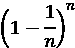

使用这个公式，如果自举的数据集包含 1,000 行，随机记录未被选中的概率是：

```py
> (1 - (1/1000))¹⁰⁰⁰ 
```

```py
[1] 0.3676954 
```

类似地，对于一个有 100,000 行的数据集：

```py
> (1 - (1/100000))¹⁰⁰⁰⁰⁰ 
```

```py
[1] 0.3678776 
```

当 *n* 趋近于无穷大时，公式简化为 1/*e*，如下所示：

```py
> 1 / exp(1) 
```

```py
[1] 0.3678794 
```

由于未被选中的概率为 36.8%，任何实例被选入训练数据集的概率为 100% - 36.8% = 63.2%。换句话说，训练数据仅代表可用示例的 63.2%，其中一些是重复的。与使用 90%示例进行训练的 10 折交叉验证相比，自举样本对整个数据集的代表性较低。

由于仅用 63.2%的训练数据进行训练的模型可能比在更大的训练集上训练的模型表现更差，因此自举的性能估计可能比模型稍后训练在完整数据集上获得的估计要低得多。

一种称为**0.632 自举**的特殊自举情况，通过将最终性能指标视为训练数据（过于乐观）和测试数据（过于悲观）性能的函数来解决这个问题。然后，最终错误率估计如下：


与交叉验证相比，自举采样的一项优势是它通常在非常小的数据集上表现更好。此外，自举采样在性能测量之外还有应用。特别是，在*第十四章* *构建更好的学习者*中，你将了解如何使用自举采样的原则来提高模型性能。

# 摘要

本章介绍了评估机器学习分类模型性能的几种最常见指标和技术。尽管准确率提供了一种简单的方法来检查模型正确性的频率，但在罕见事件的情况下，这可能会产生误导，因为这类事件在现实生活中的重要性可能与它们在数据中出现的频率成反比。

一些基于混淆矩阵的指标更好地捕捉了模型性能以及各种类型错误成本的平衡。Kappa 统计量和 Matthews 相关系数是两种更复杂的性能指标，即使在严重不平衡的数据集上也能很好地工作。此外，仔细检查敏感性和特异性，或精确率和召回率之间的权衡，可以成为思考现实世界中错误影响的有用工具。ROC 曲线等可视化也有助于此目的。

值得注意的是，有时衡量模型性能的最佳方法就是考虑它如何满足，或未能满足，其他目标。例如，你可能需要用简单语言解释模型的逻辑，这将排除一些模型。此外，即使模型表现非常好，但如果模型运行速度过慢或难以扩展到生产环境，那么它将完全无用。

展望接下来的章节，对性能进行**测量**的明显扩展是找到**提高**性能的方法。随着你继续阅读本书，你将应用本章中的许多原则，同时加强你的机器学习能力并增加更多高级技能。在接下来的页面中，CV 技术、ROC 曲线、自助法和 `caret` 包将定期出现，因为我们将在已有的工作基础上，通过系统地迭代、精炼和组合学习算法来研究如何制作更智能的模型。

# 加入我们书籍的 Discord 空间

加入我们的 Discord 社区，与志同道合的人相聚，并和超过 4000 人在以下地点一起学习：

[`packt.link/r`](https://packt.link/r)


