# 第十二章：高级数据准备

80%的时间投资在现实世界的机器学习项目中用于数据准备这一普遍真理被广泛引用，以至于它通常被无异议地接受。本书的早期章节通过不附加任何条件地将这一说法作为事实陈述来帮助延续这一陈词滥调，尽管这确实是一种常见的经验和感知，但它也是一种过度简化，正如从统计数据中概括时通常发生的那样。实际上，数据准备并没有统一的单一经验。然而，确实是真的，数据准备工作几乎总是比预期的要花费更多的努力。

很少有情况会提供单个 CSV 格式的文本文件，可以很容易地被 R 读取并使用几行 R 代码进行处理，就像前几章所描述的那样。相反，必要的数据元素通常分布在数据库中，然后必须收集、过滤、重新格式化并组合，才能使用机器学习来使用特征。这甚至在没有考虑从利益相关者那里获取数据所需的时间以及探索和理解数据之前，就可能需要大量的努力。

本章旨在为你（有意为之！）准备你在现实世界中将要准备的大型且更复杂的数据集。你将学习：

+   为什么数据准备对于构建更好的模型至关重要

+   将数据转换为更有用的预测因子的技巧和窍门

+   用于高效准备数据的专用 R 包

不同的团队和不同的项目需要他们的数据科学家投入不同数量的时间来准备机器学习过程中的数据，因此，80%的统计数据可能高估或低估了任何特定项目或单个贡献者所需的努力。

然而，无论是由你还是别人执行这项工作，你很快就会发现一个不可否认的事实，那就是高级数据准备是构建强大的机器学习项目过程中的一个必要步骤。

# 执行特征工程

时间、努力和想象力是**特征工程**过程的核心，该过程涉及将专业知识应用于创建用于预测的新特征。简单来说，它可能被描述为使数据更有用的艺术。更复杂地说，它涉及领域专业知识和数据转换的结合。一个人不仅需要知道对于机器学习项目哪些数据是有用的，还需要知道如何合并、编码和清理数据以满足算法的期望。

特征工程与数据探索密切相关，如*第十一章*，*在机器学习中取得成功*中所述。两者都涉及通过生成和测试假设来质询数据。探索和头脑风暴可能导致关于哪些特征对预测有用的见解，而特征工程的行为可能导致需要探索的新问题。

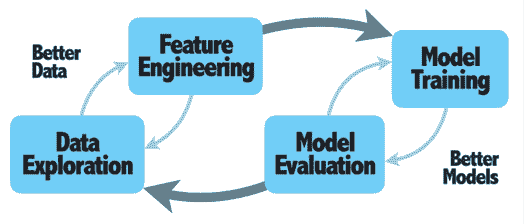

图 12.1：特征工程是帮助模型和数据协同工作的循环的一部分

特征工程是循环中的循环的一部分，其中投入努力以帮助模型和数据更好地协同工作。一轮数据探索和特征工程导致数据改进，进而导致训练更好模型的迭代，然后又指导另一轮潜在的数据改进。这些潜在改进不仅包括解决简单数据问题并允许算法在 R 中运行所需的最低限度的清理和准备任务，还包括使算法更有效地学习的步骤。这些可能包括：

+   执行复杂的数据转换，帮助算法更快地学习或学习数据的简化表示

+   创建易于解释或更好地表示潜在理论概念的特性

+   利用非结构化数据或将额外特征合并到主要来源上

所有这三者都需要深入的思考和创造力，并且是即兴的和领域特定的，而不是公式化的。话虽如此，计算机和从业者可以通过互补的优势来共享这项工作。计算机在创造力和即兴能力方面的不足，可能可以通过计算能力、蛮力和坚定不移的毅力来弥补。

## 人类和机器的作用

特征工程可以看作是人类和机器在学习过程阶段抽象阶段的合作。回想一下在*第一章*，*介绍机器学习*中，抽象步骤被定义为将存储的数据转换为更广泛的概念和表示。换句话说，在抽象过程中，原始数据元素之间建立了联系，这些联系将代表学习目标的重要概念。这些关系通常由一个模型定义，该模型将学习到的概念与感兴趣的输出联系起来。在特征工程过程中，人类温和地引导或推动抽象过程向特定方向前进，目标是产生性能更好的模型。

想象一下这种情况：回忆一下你过去试图学习一个困难概念的时刻——可能甚至就在阅读这本教科书的时候！阅读以及后来重读文本证明对理解概念没有帮助，沮丧的你联系了一个朋友或同事寻求帮助。也许这个朋友会用不同的方式解释这个概念，使用类比或例子帮助你将概念与你先前经验联系起来，在这个过程中，它引导你进入一个顿悟的时刻：“我找到了！”所有东西突然变得清晰，你 wonder how you couldn’t understand the concept in the first place. Such is the power of abstractions, which can be transferred from one learner to another to aid the learning process. The process of feature engineering allows the human to transfer their intuitive knowledge or subject-matter expertise to the machine through intentionally and purposefully designed input data.

考虑到抽象是学习过程的基础，可以说机器学习本质上就是特征工程。著名的计算机科学家和人工智能先驱 Andrew Ng 说，“*提出特征是困难的，耗时且需要专业知识。应用机器学习基本上就是特征工程*。”计算机科学教授和机器学习书籍 *The Master Algorithm* 的作者 Pedro Domingos 说，“*一些机器学习项目成功了，而一些失败了。是什么造成了这种差异？最关键的因素无疑是使用的特征*。”

Andrew Ng 的名言出现在一个名为 *Machine Learning and AI via Brain simulations* 的讲座中，该讲座可通过网络搜索在线获取。除了 Pedro Domingos 的书籍 *The Master Algorithm*（2015）外，还可以参考他在 *Communications of the ACM*（2012）上发表的优秀论文“关于机器学习的几个有用的事情要知道”。[`doi.org/10.1145/2347736.2347755`](https://doi.org/10.1145/2347736.2347755)。

功能工程做得好的话，可以将较弱的学习者转变为更强的学习者。许多机器学习和人工智能问题可以通过简单的线性回归方法解决，假设数据已经被充分清理。即使是非常复杂的机器学习方法，在足够的特征工程下也可以在标准线性回归中复制。线性回归可以适应模型非线性模式，使用样条和二次项，并且可以接近甚至最复杂的神经网络的表现，前提是有足够数量的新特征已经被精心设计为原始输入数据的交互或转换。

简单的学习算法可以适应更复杂问题的想法并不仅限于回归。例如，决策树可以通过输入数据的旋转来绕过它们的轴平行决策边界，而基于超平面的支持向量机可以通过选择合适的核技巧来模拟复杂的非线性模式。只要付出足够的努力，并且对输入数据和学习问题有足够的理解，一个像 k-NN 这样简单的方法也可以用来模拟回归，甚至可能是更复杂的方法，但这里有一个问题。为什么要在使用一个更复杂的算法也能表现同样好或更好的情况下，投入大量时间进行特征工程，而该算法还能自动为我们进行特征工程？

事实上，可能最好是将数据的潜在模式复杂性与能够轻松处理这些模式的学习算法相匹配。当计算机可以自动完成时，手动进行特征工程不仅是一种浪费，而且容易出错，并可能错过重要的模式。像决策树和具有足够多隐藏节点的神经网络这样的算法，尤其是深度学习神经网络，特别擅长进行它们自己的形式特征工程，这可能会比手工操作更加严格和彻底。不幸的是，这并不意味着我们可以盲目地将这些相同的方法应用到每个任务中——毕竟，在机器学习中没有免费的午餐！

将相同的算法应用到每个问题上，似乎表明存在一种适用于所有特征工程的通用方法，但我们知道这既是艺术也是科学。因此，如果所有从业者都将相同的方法应用到所有任务中，他们将无法知道是否可能获得更好的性能。也许稍微不同的特征工程方法可能会产生一个更准确地预测客户流失或癌症的模型，这将导致更大的利润或更多生命的挽救。这在现实世界中显然是一个问题，即使是一点点性能的提升也可能意味着在竞争中占据实质性的优势。

在高风险的竞赛环境中，例如 Kaggle 上的机器学习竞赛，每个团队都能访问到相同的机器学习算法，并且能够迅速地将它们中的每一个应用到识别哪个表现最佳。因此，在阅读 Kaggle 冠军的访谈时出现一个主题并不令人惊讶：他们通常会在特征工程上投入大量的努力。2012-2013 年 Kaggle 上评分最高的数据科学家 Xavier Conort 在一次访谈中说：

> “我们使用的算法对于 Kagglers 来说非常标准……我们的大部分努力都花在了特征工程上……我们也非常小心地丢弃了可能让我们面临过拟合风险的特性。”

由于特征工程是机器学习少数专有方面之一，因此它是团队之间区分度的一个少数点。换句话说，那些在特征工程方面做得好的团队往往能超越竞争对手。

要阅读与 Xavier Conort 的完整访谈，该访谈最初发布在 Kaggle 的“No Free Hunch”博客上，请访问[`web.archive.org/web/20190609154949/http://blog.kaggle.com/2013/04/10/qa-with-xavier-conort/`](https://web.archive.org/web/20190609154949/http://blog.kaggle.com/2013/04/10/qa-with-xavier-conort/)。其他 Kaggle 冠军的访谈可在[`medium.com/kaggle-blog/tagged/kaggle-competition`](https://medium.com/kaggle-blog/tagged/kaggle-competition)找到。

根据 Conort 的声明，人们可能会轻易地认为，在特征工程上的投资需求意味着需要更大的人力和学科专业知识的应用，但事实并非总是如此。Kaggle 上表现优异的“DataRobot”团队的一员 Jeremy Achin 评论了人类专业知识出人意料地有限的效用。在谈到他的团队在特征工程上花费的时间时，他在一次采访中说：

> “最令人惊讶的是，几乎所有试图使用学科知识或从数据可视化中得出的洞察来指导的尝试，都导致了结果的大幅下降。我们实际上安排了一位非常出色的生物化学家进行了 2 小时的板书讲座，并基于我们所学提出了一些想法，但它们都没有奏效。”

Jeremy Achin 与 Xavier Conort 以及其他几位知名 Kaggle 大师一起，将他们在 Kaggle 竞赛中的成功转化为了一家名为 DataRobot 的人工智能公司，该公司现在价值数十亿美元。他们的软件能自动执行机器学习过程，这表明从他们的 Kaggle 工作中学到的关键教训是，计算机在机器学习过程中的许多步骤上可以像人类一样做得很好，甚至更好。

要阅读与 Jeremy Achin 的完整访谈，该访谈最初发布在 Kaggle 的“No Free Hunch”博客上，请访问[`web.archive.org/web/20190914030000/http://blog.kaggle.com/2012/11/04/team-datarobot-merck-2nd-place-interview/`](https://web.archive.org/web/20190914030000/http://blog.kaggle.com/2012/11/04/team-datarobot-merck-2nd-place-interview/)。DataRobot 公司可以在[`www.datarobot.com`](https://www.datarobot.com)上找到。

当然，在利用专业知识逐步构建模型和将所有内容都投入机器以观其效之间需要保持平衡。尽管今天特征工程在很大程度上仍然是一个手动过程，但该领域的未来似乎正朝着散弹式的“观其效”方法发展，因为**自动化特征工程**是一个快速增长的研究领域。自动化特征工程工具的基础是这样一个观点：计算机可以通过测试比人类有更多时间尝试的更多特征组合来弥补其缺乏创造力和领域知识。自动化特征工程用狭窄但受指导的人类思维交换了广泛而系统的计算机思维，其潜在优势是找到更优的解决方案，潜在的劣势包括可解释性降低和过拟合的可能性增加。

在过于兴奋于自动化的潜力之前，值得注意的是，尽管这些工具可能允许人类将特征工程中某些“思考”的部分外包出去，但仍然需要在任务的“编码”部分投入努力。也就是说，曾经用于逐个手动编码特征的时间现在被用于编写系统性地寻找或构建有用特征的函数。

正在开发中的一些有希望的算法，如基于 Python 的`Featuretools`包（以及相应的 R 包`featuretoolsR`，它与 Python 代码交互），可以帮助自动化特征构建过程，但这类工具的使用尚未普及。此外，这些方法需要数据和计算时间，这两者可能是许多机器学习项目的限制因素。

想了解更多关于 Featuretools 的信息，请访问：[`www.featuretools.com`](https://www.featuretools.com)。

## 大数据和深度学习的影响

无论特征工程是由人类还是由自动化机器方法执行，都会不可避免地达到一个点，即额外的投入努力几乎不会提高学习算法的性能。应用更复杂的学习算法也可能在一定程度上提高模型性能，但这种提升也是递减的，因为可应用的方法数量有限，它们的性能差异通常相对较小。因此，如果确实需要额外的性能提升，我们只剩下最后一个选择：通过添加额外的特征或示例来增加训练数据集的大小。此外，由于添加额外的列需要修订过去业务过程中生成的数据，在许多情况下，收集更多行数据是两个选择中较容易的一个。

在实践中，通过包含更多行数据所能实现的性能提升相对有限。本书中描述的大多数算法很快就会达到顶峰，在包含一百万行数据的集合上与包含几千行数据的集合相比，性能提升很小。如果你已经在你感兴趣的领域将机器学习方法应用于实际项目，你可能已经亲身体验到这一点。一旦数据集足够大——对于许多实际应用来说，通常只是几千行——额外的例子只会带来更多问题，比如计算时间延长和内存不足。如果更多的数据导致更多问题，那么自然而然地，人们会问，为什么所谓的“大数据时代”会有如此多的炒作？

要回答这个问题，我们首先必须对各种大小的数据集进行哲学上的区分。为了明确，“大数据”不仅仅意味着数据库或文件系统中行数或存储消耗量很大。实际上，它包括这两者以及更多，因为大小只是可能表明大数据存在的四个要素之一。

这些就是所谓的**大数据的四个 V**：

+   **数量**：数据的实际大小，无论是行数更多、列数更多还是存储更多

+   **速度**：数据积累的速度，这不仅影响数量，还影响数据处理复杂性

+   **多样性**：不同系统间数据类型或定义的差异，尤其是文本、图像和音频数据等非结构化来源的增加

+   **真实性**：输入数据的可信度和跨来源匹配数据的能力

从上到下阅读这个列表，元素变得不那么直观，但在遇到时却更具挑战性。前两个元素，数量和速度，是所谓的**中等数据**空间的基础。虽然这并不是说处理高数量、高速度的数据没有挑战，但这些挑战通常可以通过扩大我们正在做的事情来解决。例如，可能可以使用具有更多内存的更快计算机或应用更计算高效的算法。数据多样性的增加和真实性的降低需要完全不同的方法来在机器学习项目中使用，尤其是在高速和高数量规模上。以下表格列出了小、中、大数据空间之间的一些区别：

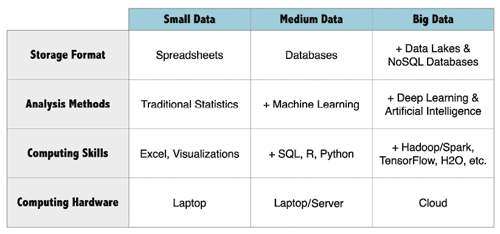

图 12.2：大多数机器学习项目处于“中等数据”规模，而要利用“大数据”则需要额外的技能和工具

从小数据过渡到中等数据，再从中等数据过渡到大数据，需要指数级投资。随着数据集规模和复杂性的增加，所需的基础设施变得更加复杂，增加了越来越多的专用数据库、计算硬件和分析工具，其中一些将在第十五章“利用大数据”中介绍。这些工具正在迅速变化，这需要不断的培训和技能提升。随着数据规模的增加，时间成为一个更重要的约束；项目更加复杂，涉及更多的移动部件，需要更多的迭代和改进周期，而且工作完成的时间更长——实际上是这样！在一个中等规模的数据集上运行只需几分钟的机器学习算法，在一个大得多得数据集上可能需要几个小时或几天，即使有云计算能力的帮助。

由于大数据的高风险，这类项目的人员配置和资源投入通常存在一个数量级的差异——这被认为是“业务成本”的一部分。可能会有几十个数据科学家，以及相应数量的 IT 专业人员来支持所需的基础设施和数据处理流程。典型的大数据解决方案需要多种工具和技术协同工作。这为**数据架构师**提供了规划和构建各种计算资源的机会，并监控其安全性、性能和云托管成本。同样，数据科学家通常与相等或更多的**数据工程师**相匹配，他们负责在数据源之间传输数据，并执行最复杂的编程工作。他们在处理大数据集方面的努力使得数据科学家能够专注于分析和机器学习模型构建。

从今天从事最大和最具挑战性的机器学习项目的人员的角度来看，包括本书中涵盖的几乎所有示例在内的大多数日常项目，都完全属于所谓的**小数据范畴**。在这个范式下，数据集在行数或存储容量方面可以增长到“大”规模，但它们永远不会真正成为“大数据”。计算机科学和机器学习专家安德鲁·吴（Andrew Ng）指出，在小数据领域，人类的作用仍然具有影响力；人类可以通过手动设计特征或选择最有效的学习算法来极大地影响项目的性能。然而，当数据集规模从“大”增长到“巨大”并进入**大数据范畴**时，一类不同的算法突破了性能瓶颈，超越了手动调整的小幅提升。

*图 12.3*，改编自吴的工作，说明了这一现象：

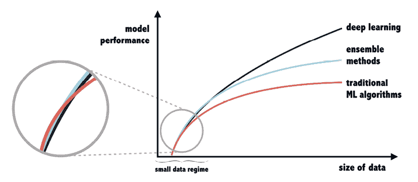

图 12.3：在小数据规模下，传统机器学习算法与更复杂的方法具有竞争力，甚至可能表现更好，而随着数据规模的增加，这些方法的表现会更好。

在小数据规模范围内，没有任何单个算法或算法类别比其他算法可预测地表现更好。在这里，包括领域专业知识的手工编码特征在内的巧妙特征工程可能允许简单的算法超越更复杂的方法或深度学习神经网络。

当数据规模增加到中等数据规模时，集成方法（在第十四章“构建更好的学习者”中描述）往往比使用传统机器学习算法的精心手工制作的模型表现更好。对于大数据环境中发现的最大数据集，只有深度学习神经网络（在第七章“黑盒方法——神经网络和支持向量机”中介绍，将在第十五章“利用大数据”中更详细地介绍）似乎能够达到极致的性能，因为它们从额外数据中学习的能力几乎从未达到平台期。这难道意味着“没有免费的午餐”定理是错误的，并且真的存在一个可以统治所有算法的学习算法吗？

在小数据和大数据环境下不同学习算法性能的可视化，可以在 Andrew Ng 用自己的话描述中找到。要找到这些，只需在 YouTube 上搜索“应用深度学习的螺丝和螺母”（视频 3 分钟处出现）或“人工智能是新的电力”（视频 20 分钟处出现）。

要理解为什么某些算法在大数据环境下比其他算法表现更好，以及“没有免费的午餐”原则为何仍然适用，我们首先必须考虑数据的大小和复杂性、模型学习复杂模式的能力以及过拟合的风险之间的关系。让我们从一个案例开始，在这个案例中，数据的大小和复杂性保持不变，但我们增加学习算法的复杂性，使其更接近训练数据中观察到的模式。例如，我们可能将决策树扩展到过大的规模，增加回归模型中的预测变量数量，或者在神经网络中添加隐藏节点。这种关系与偏差-方差权衡的概念紧密相关；通过增加模型复杂性，我们允许模型更紧密地符合训练数据，因此减少其固有的偏差并增加其方差。

*图 12.4*展示了随着模型复杂性增加时出现的典型模式。最初，当模型对训练数据集欠拟合时，模型复杂性的增加会导致模型错误减少和模型性能提高。然而，存在一个点，在这个点上，模型复杂性的增加会导致训练数据集过拟合。超过这个点，尽管模型在训练数据集上的错误率继续降低，但测试集错误率增加，因为模型泛化到训练数据之外的能力受到严重影响。再次强调，这假设数据集支持模型增加复杂性的能力有限。

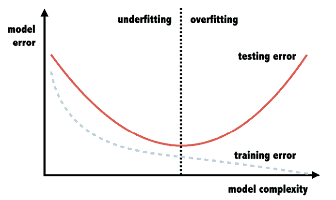

图 12.4：对于许多训练数据集，增加学习算法的复杂性可能会带来过拟合和测试集错误增加的风险

如果我们可以增加训练数据集的大小和范围，大数据环境可能会解锁机器学习性能的第二层次，但前提是学习算法同样能够增加其复杂性以利用额外的数据。许多传统算法，如本书中迄今为止所涵盖的，无法实现这样的进化飞跃——至少不是没有一些额外帮助。

传统机器学习算法与能够实现这一飞跃的算法之间的缺失环节，与算法试图学习的数据的参数数量有关。回想一下，在*第十一章*中，*成功运用机器学习*，参数被描述为学习者内部值，代表其对数据的抽象。传统上，由于各种原因，包括上面所示的偏差-方差权衡，以及认为应该优先考虑简单、更节俭的模型而不是更复杂的模型，因此更倾向于选择参数较少的模型。人们认为，参数数量过高会增加数据集简单地记住训练数据，从而导致严重的过拟合。

有趣的是，这在某种程度上是正确的，但仅限于此，如图 12.5 所示。随着模型复杂性的增加——即参数数量——测试集错误遵循与之前相同的 U 形模式。然而，一旦复杂性和参数化达到**插值阈值**，或者说有足够的参数来记住并准确分类几乎所有的训练集示例，就会出现新的模式。在这个阈值，泛化误差达到最大，因为模型已经极大地过拟合了训练数据。然而，随着模型复杂性的进一步增加，测试集错误再次开始下降。在足够额外的复杂性下，一个严重过拟合的模型甚至可能超越一个调优良好的传统模型的表现，至少根据我们现有的“过拟合”概念来看。

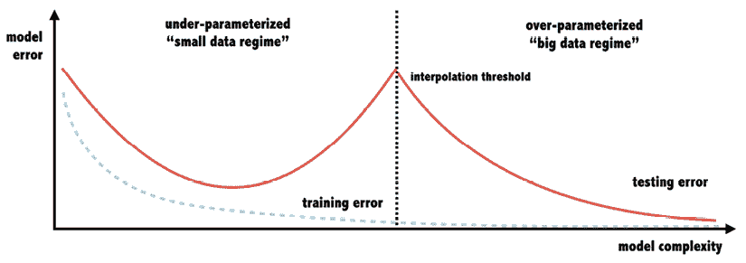

图 12.5：一些算法能够在看似过度拟合训练数据后，仍然能够利用大数据进行很好的泛化

关于此处所绘“双下降”曲线的明显矛盾，更多信息请参阅这篇开创性的论文：*《调和现代机器学习实践与经典偏差-方差权衡，Belkin M, Hsu D, Ma S, 和 Mandal S, 2019, 美国国家科学院院刊，第 116 卷第 32 期，第 15,849-15,854 页》*。

解释这一意外结果的机制与模型中发生的一种有趣甚至可能是神奇的变化有关，这种变化发生在能够进行额外参数化的模型中，而这种参数化超出了插值阈值。一旦学习者拥有足够的参数来插值（足够地符合）训练数据，额外的参数就会导致**过参数化**的状态，在这种状态下，额外的复杂性使得能够达到更高的思维和抽象水平。本质上，一个过参数化的学习者能够学习更高阶的概念；在实践中，这意味着它能够学习如何工程化特征或学习如何学习。模型复杂性的显著跳跃，超出插值阈值，可能会在算法处理问题的方式上带来显著的飞跃，但当然，并非每个算法都具备这种飞跃的能力。

深度神经网络，可以通过添加层中排列的隐藏节点无限且轻易地增加额外的复杂性，是消耗大数据的理想候选者。正如你将在第十五章*利用大数据*中了解到的那样，一个巧妙设计的神经网络可以从非结构化数据，如图像、文本或音频中，构建自己的特征。同样，它被指定为通用函数逼近器意味着它可以识别出最佳函数形式来模拟数据中识别出的任何模式。因此，我们必须再次回顾早期的问题，即这种做法如何不违反“没有免费的午餐”的原则。似乎对于足够大的数据集，深度学习神经网络是唯一最佳的方法。

将一些实际问题暂且放在一边——特别是，大多数现实世界项目位于小数据领域的事实，以及深度神经网络计算成本高且难以训练的事实——深度学习不违反“没有免费的午餐”原则的一个关键原因是，一旦神经网络变得很大并且过度参数化，并且假设它能够访问足够大且复杂的训练数据集，它就不再是一个单一的学习**算法**，而变成了一个通用的学习**过程**。如果这听起来像是一个没有区别的区别，也许一个比喻会有所帮助：深度学习的过程不是提供免费的午餐，而是为算法提供如何自己制作午餐的机会。鉴于真正大数据的有限可用性和深度学习在大多数商业任务中的有限适用性，为了产生最强大的模型，机器学习从业者仍然需要在特征工程过程中提供帮助。

# 实践中的特征工程

根据项目或情况的不同，特征工程的实际做法可能会有很大差异。一些大型、技术导向的公司为每位数据科学家配备一名或多名数据工程师，这使得机器学习从业者可以减少对数据准备的关注，更多地专注于模型构建和迭代。某些项目可能依赖于非常小或非常大的数据量，这可能会排除或需要使用深度学习方法或自动特征工程技术。即使是那些初始特征工程工作量较小的项目，也可能遭受所谓的“最后一公里问题”，这描述了在分销的“最后一公里”中，成本和复杂度与需要走过的短距离不成比例地高。将这一概念与特征工程联系起来意味着，即使大部分工作由其他团队或自动化完成，准备模型数据最终步骤所需的努力可能仍然相当可观。

很可能，今天的大多数现实世界机器学习项目都需要大量的特征工程。大多数公司尚未达到组织层面的分析成熟度，这允许数据科学家专注于模型构建。许多公司和项目可能永远不会达到这一水平，因为它们的规模较小或范围有限。对于许多中小型公司和中小型项目，数据科学家必须从项目的开始到结束负责所有方面。因此，数据科学家有必要了解特征工程师的角色，并准备在需要时执行这一角色。

如前所述，特征工程更多的是艺术而非科学，它需要的想象力与编程技能一样多。简而言之，特征工程的主要目标可能可以描述为：

+   补充现有数据，利用额外的外部信息来源

+   将数据转换为符合机器学习算法的要求，并协助模型进行学习

+   在最小化有用信息损失的同时消除噪声——相反，最大化利用可用信息

在实践特征工程时，要记住的一个总体格言是“要聪明”。一个人应该努力成为一个聪明、节俭的数据挖掘者，并尝试思考你可能在每个特征中找到的微妙见解，系统地工作，避免让任何数据浪费。应用这一规则既是创造力的提醒，也有助于激发构建最强性能学习者的竞争精神。

尽管每个项目都需要你以独特的方式应用这些技能，但经验将揭示在许多类型的项目中出现的某些模式。以下各节，提供了七个关于特征工程艺术的“提示”，并非旨在详尽无遗，而是提供一些灵感，以激发如何创造性地思考使数据更有用。

市场上关于特征工程的书籍一直很少，直到最近，才出版了一些。关于这个主题的两本早期书籍是 Packt Publishing 的《Feature Engineering Made Easy》（Ozdemir & Susara，2018）和 O’Reilly 的《Feature Engineering for Machine Learning》（Zheng & Casari，2018）。《Feature Engineering and Selection》（Kuhn & Johnson，2019）也是一本杰出的书籍，甚至还有一个免费版本，可在网上找到：[`www.feat.engineering`](http://www.feat.engineering)。

## 提示 1：头脑风暴新特征

新机器学习项目主题的选择通常是由未满足的需求驱动的。它可能是由追求更多利润、拯救生命或简单的好奇心驱动的，但无论如何，主题几乎肯定不是随机选择的。相反，它与公司核心问题或好奇者珍视的主题相关，这都表明对这项工作的根本兴趣。追求这个项目的公司或个人可能已经对该主题及其对感兴趣结果有重要贡献的因素有深入了解。有了这种领域经验和专业知识，委托项目的公司、团队或个人可能对任务有专有的见解，他们可以独自带来。

为了利用这些见解，在机器学习项目的开始阶段，在特征工程之前，进行一次头脑风暴会议可能会有所帮助，在这个会议上，利益相关者聚集在一起，就与感兴趣的结果相关的潜在因素提出想法。在这个过程中，重要的是避免将自己限制在现有数据集中容易获得的内容。相反，考虑因果关系的更抽象层次，想象可以拉动以影响结果的正向或负向方向的各个隐喻性“杠杆”。尽可能彻底，并在这次会议中耗尽所有想法。如果你可以在模型中 literally 任何你想要的东西，什么最有用？

头脑风暴会议的成果可能是一个**心智图**，这是一种围绕中心主题绘制想法的方法。将感兴趣的结果置于心智图的中心，各种潜在预测因子从中心主题辐射出来，如下面一个心智图会议设计预测心脏病死亡率的示例所示。

心智图图可能使用层次结构来链接相关的概念或分组在类似数据源中相关的因素：

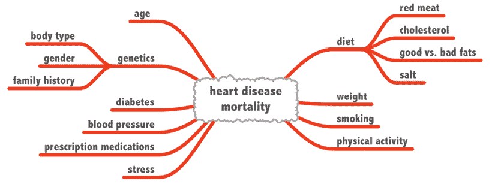

图 12.6：心智图有助于想象导致结果的各个因素

在构建心智图的过程中，你可能会发现一些期望的特征在现有数据源中不可用。也许头脑风暴小组可以帮助识别这些数据元素的替代来源，或者找到愿意帮助收集它们的人。或者，可能有可能开发一个**代理度量**，通过不同的方法有效地衡量相同的概念。例如，可能无法直接测量某人的饮食，但可能可以通过计算他们关注的快餐店数量来使用他们的社交媒体活动作为代理。这并不完美，但总比没有好。

心智图会议还可以帮助揭示特征之间的潜在相互作用，在这些相互作用中，两个或更多因素对结果的影响不成比例；整体效应可能大于（或小于）其各部分之和。在心脏病例中，有人可能会假设压力和肥胖的联合效应比它们各自效应的总和更有可能引起心脏病。决策树和神经网络等算法可以自动找到这些相互作用效应，但许多其他算法不能，而且在任何情况下，如果这些组合在数据中明确编码，可能有助于学习过程，或者导致一个更简单、更可解释的模型。

## 提示 2：在文本中寻找隐藏的见解

文本数据是隐藏数据最丰富的来源之一，因此也是特征工程最有成效的领域之一。机器学习算法通常不太擅长实现文本数据的全部价值，因为它们缺乏人类在一生语言使用中获得的语义意义的外部知识。

当然，给定大量的文本数据，计算机可能能够学习到相同的东西，但这对于许多项目来说并不可行，并且会极大地增加项目的复杂性。此外，文本数据不能直接使用，因为它受到维度灾难的困扰；每一块文本都是独特的，因此它作为一种指纹将文本与结果联系起来。如果在学习过程中使用，算法可能会严重过拟合或完全忽略文本数据。

维度灾难普遍适用于非结构化的“大数据”，因为图像和音频数据同样难以直接在机器学习模型中使用。第十五章“利用大数据”介绍了允许这些类型的数据源与传统机器学习方法一起使用的一些方法。

负责为学习算法构建特征的负责人可以通过编码从文本解释中得出的降维特征来为文本数据增加洞察力。在选择少量类别时，隐含的意义被明确化。例如，在客户流失分析中，假设一家公司可以访问其客户的公共 Twitter 时间线。每位客户的推文都是独特的，但人类可能能够将它们编码为三个类别：正面、负面和中性。这是一种简单的**情感分析**形式，它分析语言的情感。计算机软件，包括一些 R 包，可能能够通过使用旨在理解简单语义的模型或规则来自动化这一过程。除了情感分析之外，还可能根据主题对文本数据进行分类；在流失的例子中，也许提到客户服务的推文的客户比提到价格的客户更有可能转向另一家公司。

有许多 R 包可以进行情感分析，其中一些需要订阅付费服务。为了快速轻松地开始，请查看名为`SentimentAnalysis`和`RSentiment`的包，以及`Syuzhet`包。所有这些都可以用几行 R 代码将句子分类为正面或负面。对于更深入的文本挖掘和情感分析，请参阅 2017 年出版的书籍《使用 R 进行文本挖掘：整洁方法，Silge J 和 Robinson D》，可在网上找到[`www.tidytextmining.com`](https://www.tidytextmining.com)。此外，还可以参考 2017 年出版的《使用 R 进行实践文本挖掘，Kwartler T》。

除了编码文本的明显意义之外，特征工程中的一项微妙艺术在于寻找隐藏在文本数据中的隐蔽洞察。特别是，文本中可能包含与文本的直接解释无关的有用信息，但它可能偶然或意外地出现在文本中，就像扑克游戏中的“提示”——一种揭示玩家秘密意图的微小表情。

隐藏的文本数据可能有助于揭示一个人的身份特征，如年龄、性别、职业级别、位置、财富或社会经济地位。以下是一些例子：

+   名称和称呼，如先生和夫人，或 Jr.和 Sr.，传统和现代名称，男性或女性名称，或与财富相关的名称

+   职位名称和类别，如 CEO、总裁、助理、高级或总监

+   地理和空间代码，如邮政编码、建筑楼层号、国内外地区、一等舱票、邮政信箱等

+   语言标记，如俚语或其他可能揭示身份相关方面的表达

要开始寻找这些类型的隐藏洞察，在系统地审查文本数据时，要牢记感兴趣的结果。尽可能多地阅读文本，同时思考文本可能以任何方式揭示可能影响结果微妙线索的方法。当出现模式时，基于洞察构建一个特征。例如，如果文本数据通常包括职位名称，可以创建规则将工作分类为职业级别，如初级、中级和高级。然后可以使用这些职业级别来预测结果，如贷款违约或流失可能性。

## 提示 3：转换数值范围

某些学习算法比其他算法更有能力从数值数据中学习。在所有可以利用数值数据的算法中，一些算法在学习数值值范围内的重要切割点方面表现更好，或者更擅长处理严重倾斜的数据。即使是像决策树这样的方法，虽然确实擅长使用数值特征，但也倾向于在数值数据上过度拟合，因此可能从将数值范围减少到更少的潜在切割点的转换中受益。其他方法，如回归和神经网络，可能从数值数据的非线性转换中受益，例如对数缩放、归一化和阶梯函数。

许多这些方法已在之前的章节中介绍并应用。例如，在*第四章*，*概率学习 – 使用朴素贝叶斯进行分类*中，我们考虑了离散化（也称为“分箱”或“桶化”）技术，作为将数值数据转换为分类数据的一种手段，以便朴素贝叶斯算法可以使用。这种技术对于可以原生处理数值数据的学习者来说有时也很有用，因为它可以帮助明确决策边界。

以下图示展示了使用数值年龄预测器预测心脏病的一个假设模型的过程。在左侧，我们看到随着数值年龄的增加，颜色变得越来越深，这表明随着年龄的增长，心脏病的发病率也在增加。尽管这个趋势看似明显，但决策树模型可能难以确定合适的分割点，它可能随意分割，或者选择多个小的分割点；这两种情况都可能导致对训练数据的过度拟合。与其让模型自行选择，不如使用**先验**知识为“年轻”和“老年”患者创建预定义的群体。虽然这会失去一些真实潜在梯度的细微差别，但它可能通过将决策树的“高方差”方法替换为理论驱动的离散化“高偏差”方法，帮助模型更好地泛化到未来的数据。

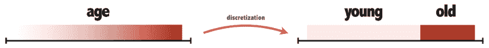

图 12.7：离散化和其他数值变换可以帮助学习者更容易地识别模式

通常，对于包含数值特征的数据集，系统地探索每个特征可能值得考虑，同时也要考虑学习算法对数值数据的方法，以确定是否需要进行转换。将您可能拥有的任何领域或主题专业知识应用于创建最终特征版本中的桶、桶、步长点或非线性变换。尽管许多算法能够处理数值数据而无需重新编码或转换，但额外的人类智慧可能有助于引导模型达到更好的整体拟合。

## 提示 4：观察邻居的行为

在特征工程过程中揭示隐藏洞察力的一种不太为人所知的方法是应用常识“物以类聚”。我们在**第三章**中应用了这一原则，即使用最近邻进行分类的**懒惰学习**，但这也是识别有用预测因子的一种有用心态。这个想法基于这样一个事实，即数据集中可能存在显式或隐式的分组，通过检查一个示例与其邻近或分组中的其他示例的关系，可能会发现一些洞察力。

在现实世界中数据中经常发现的显式分组的一个例子是家庭。许多数据集不仅包括基于个人的行，还包括家庭标识符，这允许您将行链接到家庭组中，从而根据组的组成创建新的特征。

例如，知道某人在一个家庭中可能表明婚姻状况以及子女或依赖人数，即使这些特征没有包含在原始的个人层级数据集中。简单地计数或聚合一些群体的特征可以产生非常有用的预测因子。

从这里，也可以在组内的记录之间共享信息。例如，知道一位配偶的收入是有帮助的，但知道两位配偶可以更好地表明可用的总收入。组内差异的度量也可能是有启发性的。如果伴侣在某些属性上匹配或不同意，家庭的一些方面可能会提供额外的效果；例如，如果两位伴侣都表示对某家电话公司满意，他们可能比只有一位成员满意的户主更加忠诚。

这些原则也适用于不那么明显但仍很明确的分组，例如邮政编码或地理区域。通过收集属于该组的行，可以计数、求和、计算平均值、取最大值或最小值，或者检查组内的多样性以构建新的、可能有用的预测因子。在更多或更少的共识或多样性方面的组可能对某些结果更稳健或更不稳健。

识别隐含的分组也可能有价值——也就是说，这种分组在数据集中没有直接编码。例如，在第九章 *寻找数据组 - 使用 k-means 进行聚类* 中描述的聚类方法是一种潜在的寻找这些类型分组的方法，并且这些结果簇可以直接用作模型中的预测因子。例如，在一个客户流失项目中，使用簇作为模型的特征可能会揭示某些簇比其他簇更有可能流失。这可能意味着流失与簇的潜在人口统计特征有关，或者流失在簇成员之间有一定的传染性。

换句话说，如果物以类聚，那么从类似邻居的经验中借用领先指标是有意义的——他们可能对某些外部因素有类似的反应，或者可能直接相互影响。表现出罕见或独特特征的隐含组本身可能很有趣；也许其中一些是趋势领导者或“煤矿中的金丝雀”——比其他群体更早对变化做出反应的趋势领导者。观察他们的行为并将这些群体明确编码到模型中可能会提高模型的预测能力。

如果你确实使用了邻居（或下一节中描述的相关行）的信息，请注意数据泄露的问题，这在第十一章 *用机器学习取得成功* 中已有描述。确保只使用在模型部署时将可用的信息来构建特征。例如，如果只有一位家庭成员完成贷款申请，而另一位配偶的数据是在贷款批准后添加的，那么在信用评分模型中使用两位配偶的数据是不明智的。

## 提示 5：利用相关行

在前一部分中提到的“跟随领导者”行为的实践，考虑到时间序列数据集中相关行，在时间不同点重复测量同一属性，可以特别强大。包含重复测量的数据提供了许多构建有用预测因子的额外机会。而前一部分考虑了在分析单位“跨”分组相关数据，当前部分考虑了在分析单位“内”分组相关观察的价值。本质上，通过重复观察相同的分析单位，我们可以检查它们的历史趋势并更好地预测未来。

回顾假设的流失率示例，假设我们能够访问过去 24 个月来自在线视频流媒体服务订阅者的数据。观察的单位是客户-月（每位客户每月一行），而我们的分析单位是客户。我们的目标是预测哪些客户最有可能流失，以便我们可能进行干预。为了构建机器学习的数据集，我们必须收集观察单位并将它们聚合为每位客户一行。这正是特征工程特别需要的地方。在将历史数据“汇总”为分析的单行过程中，我们可以构建检查趋势和忠诚度的特征，提出如下问题：

+   客户的平均月度活动是否高于或低于他们的同龄人？

+   客户随时间推移的月度活动是什么？它是上升、下降还是稳定的？

+   他们的活动频率如何？他们是忠诚的吗？他们的忠诚度在月份间是否稳定？

+   客户的行为一致性如何？行为是否每月都有很大变化？

如果你熟悉基本的微积分，反思一阶和二阶导数的概念可能会有所帮助，因为它们都可以作为时间序列模型中的有用特征。这里的一阶导数指的是行为的速度——即单位时间内的行为计数。例如，我们可能计算每月在流媒体服务上花费的美元数，或者每月流过的电视节目和电影的数量。这些单独就是有用的预测因子，但在二阶导数的背景下，它们可以变得更加有用。二阶导数是行为的加速度（或减速度），即速度随时间的变化，如每月支出的变化或每月流过的节目数量的变化。高消费和高使用率的客户可能不太可能流失，但来自这些客户的快速减速度（即使用或支出的大幅减少）可能表明即将流失。

除了速度和加速度之外，还可以构建一致性、可靠性和变异性的度量，以进一步增强预测能力。一种突然改变的行为可能比类似变化但波动剧烈的行为更令人担忧。计算最近几个月有购买、支出或行为达到给定阈值的比例，可以提供一个简单的忠诚度指标，但使用方差等更复杂的度量也是可能的。

## 提示 6：分解时间序列

上文所述的重复测量时间序列数据，每个分析单位有多个相关行，被称为**长格式**。这与大多数基于 R 的机器学习方法所需的数据类型形成对比。除非学习算法被设计成能够理解重复测量数据的关联行，否则它将需要以**宽格式**指定时间序列数据，即将数据的重复行转换为重复的列。例如，如果一个体重测量值每月记录 3 个月，针对 1,000 名患者，长格式数据集将包含 3 * 1,000 = 3,000 行和 3 列（患者标识符、月份和体重）。如图 12.8 所示，同样的数据集在宽格式下将只有 1,000 行但 4 列：1 列用于患者标识符，3 列用于每月的体重读数：

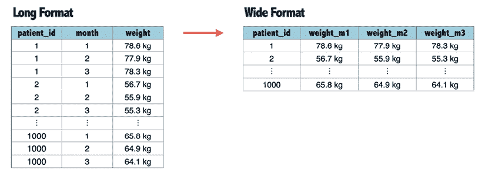

图 12.8：大多数机器学习模型都需要将长格式时间序列数据转换为宽格式

要构建一个宽格式数据集，首先必须确定多少历史数据对预测是有用的。所需的历史数据越多，就需要在宽数据集中添加更多的列。例如，如果我们想要预测客户未来一个月的能源使用情况，我们可能会决定使用他们前 12 个月的能源使用数据作为预测因子，以便覆盖整个一年的季节性变化。因此，为了构建预测 2023 年 6 月能源使用的模型，我们可能会创建 12 个预测因子列，分别测量 2023 年 5 月、4 月、3 月的能源使用情况，以及 6 月之前每个月的能源使用情况。第 13 列将是目标或因变量，记录 2023 年 6 月的实际能源使用情况。请注意，基于此数据集训练的模型将学会根据 2022 年 6 月至 2023 年 5 月的数据来预测 2023 年 6 月的能源使用情况，但它无法预测其他未来的月份，因为目标和预测因子与特定的月份相关联。

相反，更好的方法是构建**滞后变量**，这些变量相对于目标月份进行计算。滞后变量基本上是延迟一段时间以传递到数据集中更晚、更近的行的度量。使用滞后变量的模型可以在有更多月份数据可用时按滚动、每月重新训练。而不是有像`energy_june2023`和`energy_may2023`这样的列名，生成的数据集将具有表示测量相对性质的名称，如`energy_lag0`、`energy_lag1`和`energy_lag2`，这表示当前月份、上个月和两个月前的能源消耗。此模型将始终应用于最新数据以预测即将到来的时间段。

*图 12.9* 展示了这种方法。每个月，模型都会在过去的 13 个月数据上训练；最近的一个月被用作目标或因变量（表示为 DV），而早先的 12 个月则用作滞后预测变量。然后，模型可以用来预测尚未观察到的未来月份。第一个月之后的每个月都会将滚动窗口向前移动 1 个月，这样超过 13 个月的数据就不会在模型中使用。使用这种方式构建的数据训练的模型不会学习特定日历月份之间的关系，正如非滞后变量那样；相反，它学习的是先前行为与未来行为之间的关系，而不考虑日历月份。

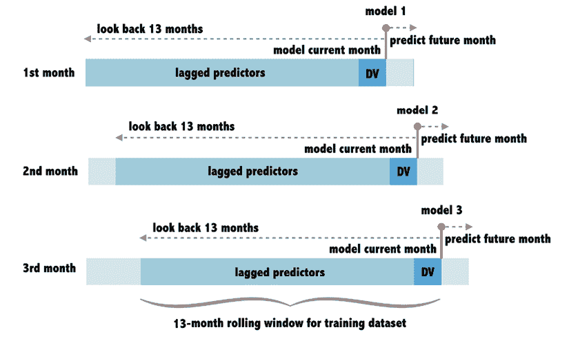

图 12.9：构建滞后预测变量是建模时间序列数据的一种方法

然而，这种方法的一个问题是，它忽略了日历时间，而某些日历月份可能对目标变量有重要影响。例如，能源消耗在冬季和夏季可能比春季和秋季高，因此，模型不仅要知道过去和未来的行为之间的关系，还要了解季节效应或其他比局部模式更广泛的模式，这些模式与分析单位相关。

可以想象，要预测的目标值由三个来源的变异性组成，我们希望将其分解为模型的特征：

1.  有局部或内部变异性，这是基于分析单位的独特属性。在预测能源需求的例子中，局部变异性可能与家庭的大小和结构、居民的能源需求、房屋的位置等因素有关。

1.  可能存在更广泛的全球趋势，如燃料价格或天气模式，这些都会影响大多数家庭的能源消耗。

1.  可能存在季节性影响，独立于本地和全球影响，可以解释目标的变化。这不仅仅限于之前提到的年度天气模式，任何周期性或可预测的模式都可以被认为是季节性影响。

与能源预测项目相关的某些具体例子可能包括对以下方面的需求更高或更低：

+   一周中的不同日子，尤其是工作日与周末

+   宗教或政府假日

+   传统学校或商务假期期间

+   像体育赛事、音乐会和选举这样的大规模集会

如果可以将本地、全球和季节性特征作为预测因子纳入训练数据集中，模型就可以学习它们对结果的影响。接下来的挑战有两个方面：需要专业知识或数据探索来识别重要的季节性因素，并且必须有足够的训练数据，以便在每个包含的季节中观察到目标。后者意味着训练数据应该由超过一个月的时间横截面组成；如果没有这一点，学习算法显然将无法发现季节与目标之间的关联！

虽然看起来我们应该回归到原始的长格式数据，但实际上并非如此。实际上，包含每月滞后变量的宽数据可以堆叠在一个单一统一的数据集中，每个分析单位有多行。每一行表示在特定时间点的个人，目标变量衡量该时刻的结果，以及一组作为目标之前时间段滞后变量的宽列。还可以添加额外的列来进一步拓宽矩阵并分解时间变化的各个组成部分，例如季节、星期几和假日的指标；这些列将指示给定的行是否属于这些感兴趣的时期之一。

下一个图表展示了使用这种方法的一个假设数据集。每个家庭（由`household_id`列表示）可以重复出现，具有不同的目标值（`energy_use`）和预测因子值（`season`、`holiday_month`、`energy_lag1`等）。请注意，数据集的前几行中缺失了滞后变量（如`NA`值所示），这意味着这些行不能用于训练或预测。然而，剩余的行可以使用任何能够进行数值预测的机器学习方法，并且训练好的模型将能够根据当前月份的数据行预测下个月的能源使用。

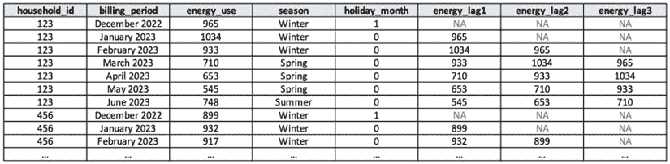

图 12.10：包括历史数据的数据集可能包括季节性效应和滞后预测因子

在匆忙进行时间序列数据建模之前，理解这里描述的数据准备方法的一个重要注意事项至关重要：由于来自同一分析单元的重复观察的行彼此相关，将它们包含在训练数据中违反了回归等方法的独立观察假设。尽管基于此类数据构建的模型可能仍然有用，但其他正式时间序列建模方法可能更合适，最好将这里描述的方法视为使用之前介绍的机器学习方法的替代方案来进行预测。线性混合模型和循环神经网络是两种可以原生处理此类数据的潜在方法，尽管这两种方法都不在本书的范围之内。

R 中的`lme4`包用于构建混合模型，但如果不了解这些类型模型的统计基础就贸然进入，那将是不明智的；与传统的回归建模相比，它们在复杂性上有了显著的提升。《使用 R 进行线性混合效应模型》（Gałecki & Burzykowski，2013）一书提供了构建此类模型所需的理论背景。然而，对于构建循环神经网络，R 可能不是完成这项工作的最佳工具，因为存在专门为此目的而设计的工具。不过，`rnn`包可以构建简单的循环神经网络模型用于时间序列预测。

## 提示 7：附加外部数据

与本书中的教学示例不同，当机器学习项目在现实世界中开始时，数据集不能简单地从互联网上下载，其中包含预先构建的特征和描述感兴趣主题的示例。遗憾的是，许多极具趣味的项目因为这一简单原因在开始之前就被扼杀。希望预测客户流失的企业意识到他们没有可用于构建模型的历史数据；希望优化贫困地区食品分配的学生受限于这些地区稀缺的数据量；以及无数可能增加利润或改善世界的项目在开始之前就被阻碍。原本围绕机器学习项目的兴奋很快因为数据不足而消散。

不应以失望告终，而应将这种能量转化为从头开始创建必要数据的努力。这可能意味着打电话给同事或发送一系列电子邮件以联系那些可以提供访问包含相关数据片段的数据库的人。这也可能需要你亲自动手，因为毕竟我们生活在这个所谓的“大数据时代”，数据不仅丰富，而且易于记录，得益于电子传感器和自动数据录入工具。

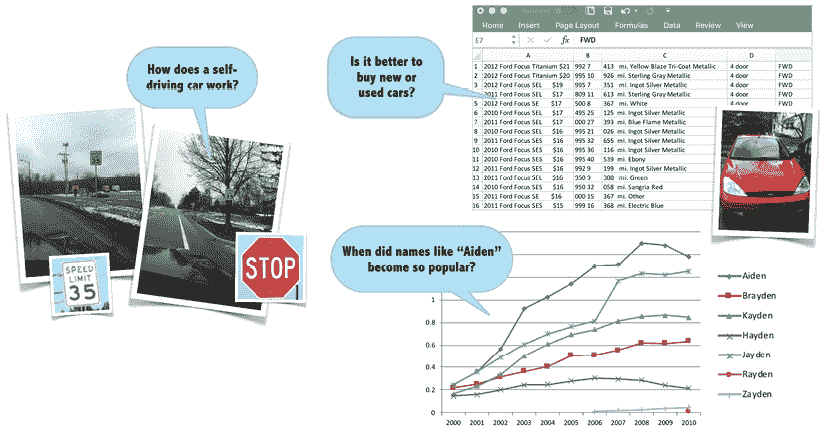

图 12.11：很少的努力就足以生成对机器学习有用的数据集

在最坏的情况下，投入时间、精力和想象力可以从无到有地构建有用的数据集。通常，这比人们想象的要容易。前面的图示说明了几个我创建数据集以满足自己好奇心的情况。

对自动驾驶汽车着迷，我在我的社区周围开车并拍摄路标照片，以构建一个停车标志分类算法。为了预测二手车价格，我从二手车网站上复制粘贴了数百个列表。而且，为了确切了解为什么与“Aiden”押韵的名字在美国变得如此流行，我从社会保障婴儿名字数据库中收集了几十年的数据。这些项目中的任何一个都不需要超过几个小时的努力，但通过将朋友、同事或互联网论坛作为众包努力的一种形式，甚至支付数据录入助手，可以并行化任务并帮助我的数据库更大或更快地增长。像 Amazon Mechanical Turk ([`www.mturk.com`](https://www.mturk.com))这样的付费服务提供了一种经济实惠的方式，用于分配大量且繁琐的数据录入或收集任务。

为了进一步丰富现有的数据集，通常有从外部来源附加额外特征的可能性。这尤其适用于感兴趣的原始数据集包括地理标识符，如邮政编码，因为许多公开可用的数据库测量这些地区的属性。当然，邮政编码级别的数据集不会揭示特定个人的确切特征；然而，它可能提供有关该地区平均个人是否更富有、更健康、更年轻或更有可能拥有孩子的见解，以及其他许多可能有助于提高预测模型质量的因素。这些类型的数据可以在许多政府机构网站上轻松找到，并且免费下载；只需将它们合并到主数据集，以添加可能的预测因子。

最后，许多社交媒体公司和数据聚合服务，如 Facebook、Zillow 和 LinkedIn，提供对其数据有限部分的免费访问。例如，Zillow 提供邮政编码地区的房屋价值估算。在某些情况下，这些公司或其他供应商可能会出售对这些数据集的访问权限，这可以是一种强大的增强预测模型的方法。除了这些收购的财务成本外，它们通常在 **记录链接** 方面也提出了重大挑战，这涉及到在没有任何共同唯一标识符的跨数据集中匹配实体。解决此问题需要构建一个 **映射表**，它将一个来源中的每一行映射到另一个来源中相应的行。例如，映射可能将主数据集中通过客户识别号识别的个人与外部社交媒体数据集中唯一的网站 URL 链接起来。尽管存在像 `RecordLinkage` 这样的 R 包可以帮助在来源之间执行此类匹配，但这些包依赖于启发式方法，可能不如人类智能表现得好，并且需要大量的计算成本，尤其是在大型数据库中。总的来说，从人力资源和计算成本的角度来看，可以安全地假设记录链接通常成本高昂。

在考虑是否获取外部数据时，务必研究数据源的使用条款，以及您所在地区关于使用此类数据源的法律和组织规则。一些司法管辖区比其他地区更为严格，许多规则随着时间的推移也在变得更加严格，因此了解与外部数据相关的合法性和责任至关重要。

由于高级数据准备涉及的工作量，R 本身也在不断进化以跟上新的需求。历史上，R 以处理非常大的和复杂的数据集而闻名，但随着时间的推移，已经开发出新的包来解决这些不足，并使执行本章中迄今为止描述的操作变得更加容易。在本章的剩余部分，您将了解这些包，它们使 R 语法现代化，以应对现实世界的数据挑战。

# 探索 R 的 tidyverse

一种新的方法迅速成为在 R 中处理数据的占主导地位的模式。由 Hadley Wickham（许多推动 R 初始流行潮的包背后的思想）倡导，这一新趋势现在得到了 Posit（原名 RStudio）的一个更大团队的支撑。该公司的用户友好的 RStudio 桌面应用程序很好地整合到了这个新生态系统中，称为 **tidyverse**，因为它提供了一系列致力于整洁数据的包。整个 tidyverse 包集可以通过 `install.packages("tidyverse")` 命令安装。

在线有越来越多的资源可以帮助你了解 tidyverse，从其主页[`www.tidyverse.org`](https://www.tidyverse.org)开始。在这里，你可以了解包含在该套件中的各种包，其中一些将在本章中描述。此外，Hadley Wickham 和 Garrett Grolemund 合著的《R for Data Science》一书可在[`r4ds.hadley.nz`](https://r4ds.hadley.nz)免费在线阅读，并展示了 tidyverse 自诩的“有见地”的方法如何简化数据科学项目。

我经常被问到 R 与 Python 在数据科学和机器学习方面的比较问题。RStudio 和 tidyverse 可能是 R 最大的资产和区别点。可以说，没有比开始数据科学之旅更容易的方法了。一旦你学会了“tidy”的数据分析方法，你很可能会希望 tidyverse 的功能无处不在！

## 使用 tibbles 制作整洁的表格结构

虽然数据框是基础 R 宇宙的中心，但 tidyverse 的核心数据结构位于`tibble`包中（[`tibble.tidyverse.org`](https://tibble.tidyverse.org)），其名称是对“table”一词的双关语，同时也是对《星际迷航》传说中著名的“tribble”的致敬。一个**tibble**几乎与数据框完全相同，但为了方便和简洁，还包括了额外的现代功能。tibbles 几乎可以在数据框可以使用的任何地方使用。有关 tibbles 的详细信息，可以在 R 中输入命令`vignette("tibble")`来获取。

大多数时候，使用 tibbles 将是透明和无缝的，因为 tibbles 可以在大多数 R 包中充当数据框。然而，在极少数需要将 tibble 转换为数据框的情况下，请使用`as.data.frame()`函数。要反向操作并将数据框转换为 tibble，请使用`as_tibble()`函数。在这里，我们将首先从上一章中首次介绍的 Titanic 数据集中创建一个 tibble：

```py
> library(tibble) # not necessary if tidyverse is already loaded
> titanic_csv <- read.csv("titanic_train.csv")
> titanic_tbl <- as_tibble(titanic_csv) 
```

输入这个对象的名称展示了 tibble 比标准数据框具有更简洁和更丰富的输出：

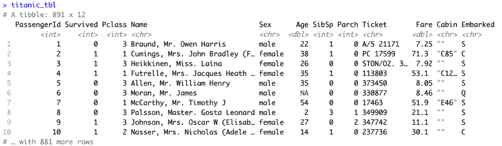

图 12.12：显示 tibble 对象的结果比标准数据框更具有信息量

重要的是要注意 tibbles 和数据框之间的区别，因为 tidyverse 将为许多操作自动创建一个 tibble 对象。总的来说，你可能会发现 tibbles 比数据框更快、更容易处理。它们通常对数据的假设更智能，这意味着你将花费更少的时间重做 R 的工作——比如将字符串重新编码为因子或反之亦然。

事实上，tibbles 和数据框之间一个简单的区别是，tibble 从不假设 `stringsAsFactors = TRUE`，这是 R 版本 4.0 之前在基础 R 中的默认行为。正如前几章所述，R 的 `stringsAsFactors` 设置有时会导致混淆或编程错误，因为字符列默认自动转换为因子。tibbles 和数据框之间的另一个区别是，只要名称被反引号（`` ` ``）包围，tibble 就可以使用非标准列名，如 `` `my var` ``，这违反了基础 R 的对象命名规则。其他 tibbles 的好处可以通过后续章节中描述的互补 tidyverse 包来解锁。

## 使用 readr 和 readxl 更快地读取矩形文件

几乎到目前为止的每一章都使用了 `read.csv()` 函数将数据加载到 R 数据框中。虽然我们可以将这些数据框转换为 tibbles，但有一条更快、更直接的方法将数据导入 tibble 格式。tidyverse 包含了用于加载表格数据的 `readr` 包（[`readr.tidyverse.org`](https://readr.tidyverse.org)）。这在本节 *R for Data Science* 的数据导入章节中有描述（[`r4ds.hadley.nz/data-import.html`](https://r4ds.hadley.nz/data-import.html)），但基本功能很简单。

`readr` 包提供了一个 `read_csv()` 函数，它从 CSV 文件加载数据，类似于基础 R 的 `read.csv()` 函数。除了它们函数名之间的细微差别之外，tidyverse 的版本要快得多——不仅仅是因为它自动将数据转换为 tibble。根据包作者的说明，它在读取数据方面大约快 10 倍。它还对要加载的列的格式更智能。例如，它具有处理带货币字符的数字、解析日期列的能力，并且在国际数据方面处理得更好。

要从 CSV 文件创建 tibble，只需使用以下 `read_csv()` 函数：

```py
> library(readr) # not necessary if tidyverse is already loaded
> titanic_train <- read_csv("titanic_train.csv") 
```

这将使用默认的解析设置，尝试为每一列推断正确的数据类型（即字符或数值）。在完成文件读取后，列规范将在 R 输出中显示。可以通过向 `read_csv()` 函数传递一个 `col()` 函数调用来提供正确的列规范，从而覆盖推断的数据类型。有关语法的更多信息，请使用 `vignette("readr")` 命令查看文档。

`readxl` 包（[`readxl.tidyverse.org`](https://readxl.tidyverse.org)）提供了一种直接从 Microsoft Excel 电子表格格式读取数据的方法。要从 XLSX 文件创建 tibble，只需使用以下 `read_excel()` 函数：

```py
> library(readxl)
> titanic_train <- read_excel("titanic_train.xlsx") 
```

或者，如第二章中首次介绍的那样，*管理和理解数据*，RStudio 桌面应用程序可以为您编写数据导入代码。在界面的右上角，在**环境**选项卡下，有一个**导入数据集**按钮。此菜单显示一系列数据导入选项，包括 CSV 文件等纯文本格式（使用基础 R 或 `readr` 包），以及由其他统计计算软件工具创建的 Excel、SPSS、SAS 和 Stata 格式。使用**从文本（readr）**选项显示以下图形界面，允许轻松定制导入过程：

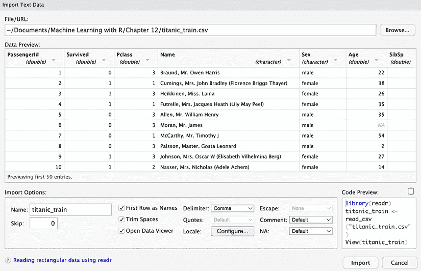

图 12.13：RStudio 的导入数据集功能自动编写 R 代码，以便轻松导入各种数据格式

界面显示数据的预览，随着导入参数的定制而更新。默认列数据类型可以通过点击列标题中的下拉菜单进行定制，右下角的代码预览将相应更新。

点击**导入**按钮将立即执行代码，但更好的做法是将代码复制并粘贴到您的 R 源代码文件中，以便将来可以轻松再次运行导入过程。

## 使用 dplyr 准备和管道数据

`dplyr`包([`dplyr.tidyverse.org`](https://dplyr.tidyverse.org))为 tidyverse 提供了基础设施，因为它包括允许数据转换和操作的基本功能。它还提供了一种简单的方法来开始使用 R 中的大型数据集。尽管有其他包具有更高的原始速度或能够处理更大的数据集，但 dplyr 仍然非常强大，如果您在基础 R 中遇到速度或内存限制时，它是一个很好的第一步。

当与 tibble 对象一起使用时，dplyr 解锁了一些令人印象深刻的功能：

+   由于 dplyr 专注于数据框而不是向量，因此引入了新的运算符，允许以更少的代码执行常见的数据处理转换，同时保持高度可读性。

+   该包对数据框做出了合理的假设，从而优化了您的努力以及内存使用。如果可能的话，它通过指向原始值而不是创建副本来避免复制数据。

+   代码的关键部分是用 C++编写的，据作者称，这使许多操作的性能比基础 R 提高了 20 倍到 1,000 倍。

+   R 数据框受可用内存的限制。使用 dplyr，tibbles 可以透明地链接到基于磁盘的数据库，其容量超过内存可以存储的内容。

在克服了初始的学习曲线之后，dplyr 的数据处理语法变得自然而然。语法中有五个关键动词，执行了数据表中最常见的许多转换。从 tibble 开始，可以选择：

+   通过列的值`filter()`筛选数据行

+   通过名称`select()`选择数据列

+   `arrange()`通过排序值来排序数据行

+   `mutate()`通过变换值将列转换为新列

+   `summarize()`通过聚合值来汇总数据行

这五个 dplyr 动词通过**管道操作符**串联起来，该操作符从 R 4.1 或更高版本开始原生支持。管道操作符由`|>`符号表示，其形状略似一个指向右方的箭头，通过“管道”将数据从一个函数移动到另一个函数。使用管道操作符可以创建强大的函数链，以顺序处理数据集。

在 R 4.1.0 更新之前的版本中，管道操作符由`%>%`字符序列表示，并需要`magrittr`包。新旧管道功能之间的差异相对较小，但作为原生操作符，新的管道可能具有轻微的速度优势。为了快速输入管道操作符，RStudio 桌面 IDE 中，*ctrl* + *shift* + *m*快捷键可以插入字符序列。请注意，为了使此快捷键生成更新的管道，您可能需要将 RStudio“**代码**”标题下的“**全局选项**”菜单中的设置更改为“**使用原生管道操作符**，**|>**”。

在使用`library(dplyr)`命令加载包之后，数据转换从将 tibble 通过管道操作符传入包中的一个动词开始。例如，有人可能`filter()`泰坦尼克号数据集的行，以限制行只包含女性：

```py
> titanic_train |> filter(Sex == "female") 
```

类似地，有人可能只`select()`名称、性别和年龄列：

```py
> titanic_train |> select(Name, Sex, Age) 
```

dplyr 开始发光之处在于其能够通过管道操作符串联一系列动词。例如，我们可以结合前两个动词，使用`arrange()`动词按字母顺序排序，并将输出保存到 tibble 中，如下所示：

```py
> titanic_women <- titanic_train |>
    filter(Sex == "female") |>
    select(Name, Sex, Age) |>
    arrange(Name) 
```

尽管这目前可能看起来并不像是一个重大的发现，但当与`mutate()`动词结合使用时，我们可以使用比基础 R 语言更简单、更易读的代码执行复杂的数据转换。我们将在稍后看到几个`mutate()`的例子，但现阶段，重要的是要记住它用于在 tibble 中创建新列。例如，我们可能创建一个表示乘客是否至少 65 岁的二进制`elderly`特征。

这使用了 dplyr 包的`if_else()`函数，如果乘客是老年人，则分配值为`1`，否则为`0`：

```py
> titanic_train |>
    mutate(elderly = if_else(Age >= 65, 1, 0)) 
```

通过逗号分隔语句，可以在单个`mutate()`语句中创建多个列。这里展示了如何创建一个额外的`child`特征，表示乘客是否小于 18 岁：

```py
> titanic_train |>
    mutate(
      elderly = if_else(Age >= 65, 1, 0),
      child = if_else(Age < 18, 1, 0)
    ) 
```

剩余的`dplyr`动词`summarize()`允许我们通过分组`tibble`中的行来创建汇总或汇总度量。例如，假设我们想要计算按年龄或性别计算的存活率。我们将从性别开始，因为它比另一个案例更容易。我们只需将数据通过`group_by(Sex)`函数管道化以创建男性和女性组，然后跟随一个`summarize()`语句来创建一个`survival_rate`特征，该特征计算按组的平均存活率：

```py
> titanic_train |>
    group_by(Sex) |>
    summarize(survival_rate = mean(Survived)) 
```

```py
# A tibble: 2 x 2
  Sex    survival_rate
  <chr>          <dbl>
1 female         0.742
2 male           0.189 
```

如输出所示，女性比男性更有可能存活。

要按年龄计算存活率，由于缺少年龄值，事情稍微复杂一些。我们需要过滤掉这些行，并使用`group_by()`函数来比较儿童（18 岁以下）和成人，如下所示：

```py
> titanic_train |>
    filter(!is.na(Age)) |>
    mutate(child = if_else(Age < 18, 1, 0)) |>
    group_by(child) |>
    summarize(survival_rate = mean(Survived)) 
```

```py
# A tibble: 2 x 2
  child survival_rate
  <dbl>         <dbl>
1     0         0.381
2     1         0.540 
```

结果表明，儿童比成人有大约 40%的存活率。当与男性和女性的比较结合起来时，这为假设的“妇女和儿童优先”的撤离沉船政策提供了强有力的证据。

由于可以使用 R 的基础方法（包括前几章中描述的`ave()`和`aggregate()`函数）计算按组汇总的统计量，因此值得注意的是`summarize()`命令也具有更多功能。特别是，人们可能使用它来完成本章前面描述的特征工程提示，例如观察邻居的行为、利用相关行和时间序列分解。这三种情况都涉及`group_by()`选项，如家庭、邮政编码或时间单位。使用`dplyr`对这些数据准备操作进行聚合比在基础 R 中尝试这样做要容易得多。

为了将我们迄今为止学到的知识结合起来，并使用管道提供一个更多示例，让我们构建泰坦尼克号数据集的决策树模型。我们将`filter()`缺失的年龄值，使用`mutate()`创建一个新的`AgeGroup`特征，并`select()`决策树模型感兴趣的列。结果数据集通过管道传递到`rpart()`决策树算法，这展示了将数据传递到 tidyverse 之外的函数的能力：

```py
> library(rpart)
> m_titanic <- titanic_train |>
    filter(!is.na(Age)) |>
    mutate(AgeGroup = if_else(Age < 18, "Child", "Adult")) |>
    select(Survived, Pclass, Sex, AgeGroup) |>
    rpart(formula = Survived ~ ., data = _) 
```

注意，这一系列步骤几乎就像伪代码。还值得注意的是`rpart()`函数调用中的参数。`formula = Survived ~ .`参数使用 R 的公式接口将存活率建模为所有预测器的函数；这里的点代表数据集中未明确列出的其他特征。`data = _`参数使用下划线（_）作为占位符来表示通过管道传递给`rpart()`的数据。下划线可以以这种方式使用，以指示数据应传递到的函数参数。

对于 dplyr 的内置函数来说，这通常是不必要的，因为它们默认将管道数据作为第一个参数查找，但 tidyverse 之外的函数可能需要以这种方式将管道目标特定函数参数。

重要的是要注意，下划线占位符字符是 R 版本 4.2 中引入的，在之前的版本中不会工作！在旧代码中使用`magrittr`包时，点字符（.）被用作占位符。

为了娱乐，我们可以可视化生成的决策树，该树显示妇女和儿童比成年人、男性和第三乘客舱的人更有可能生存：

```py
> library(rpart.plot)
> rpart.plot(m_titanic) 
```

这会产生以下决策树图：

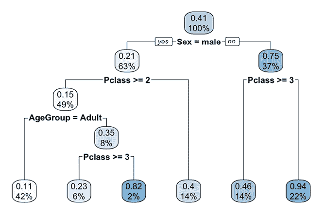

图 12.14：使用一系列管道构建的预测泰坦尼克号生还的决策树

这些只是几个简单的例子，说明了 dplyr 命令序列如何使复杂的数据操作任务变得简单。实际上，由于 dplyr 代码的效率更高，这些步骤通常比 R 基础命令执行得更快！提供完整的 dplyr 教程超出了本书的范围，但网上有许多学习资源，包括`https://r4ds.hadley.nz/transform.html`上的*R for Data Science*章节。

## 使用 stringr 转换文本

`stringr`包（`https://stringr.tidyverse.org`）添加了分析并转换字符字符串的功能。当然，基础 R 也可以这样做，但函数在处理向量时的表现不一致，而且相对较慢；`stringr`以更适合 tidyverse 工作流程的形式实现了这些函数。《R for Data Science》这个免费资源有一个教程，介绍了该包的全部功能，可在[`r4ds.hadley.nz/strings.html`](https://r4ds.hadley.nz/strings.html)找到，但在这里，我们将检查与特征工程最相关的方面。如果您想跟上来，请确保在继续之前加载 Titanic 数据集并安装并加载`stringr`包。

在本章前面，关于特征工程的第二个提示是“在文本中找到隐藏的见解。”`stringr`包可以通过提供切片字符串和检测文本中模式的函数来帮助这一努力。所有`stringr`函数都以前缀`str_`开头，以下是一些相关示例：

+   `str_detect()`确定一个搜索词是否在字符串中找到

+   `str_sub()`通过位置切片字符串并返回子字符串

+   `str_extract()`搜索字符串并返回匹配的模式

+   `str_replace()`将字符串中的字符替换为其他内容

虽然这些函数看起来相当相似，但它们用于完全不同的目的。为了演示这些目的，我们将首先检查`Cabin`特征，以确定某些`泰坦尼克号`上的房间是否与更高的生存率相关。我们不能直接使用这个特征，因为每个舱位代码都是唯一的。

然而，由于代码的形式类似于`A10`、`B101`或`E67`，也许字母前缀表示船上的一个位置，也许在这些位置的一些乘客可能更有能力逃离灾难。我们将使用`str_sub()`函数来提取从位置 1 开始和结束的 1 个字符子串，并将其保存为`CabinCode`特征，如下所示：

```py
> titanic_train <- titanic_train |>
    mutate(CabinCode = str_sub(Cabin, start = 1, end = 1)) 
```

为了确认舱位代码是有意义的，我们可以使用`table()`函数来查看它和乘客等级之间的清晰关系。`useNA`参数设置为`"ifany"`以显示由一些乘客缺失舱位代码而引起的`NA`值：

```py
> table(titanic_train$Pclass, titanic_train$CabinCode,
       useNA = "ifany") 
```

```py
 A   B   C   D   E   F   G   T <NA>
  1  15  47  59  29  25   0   0   1   40
  2   0   0   0   4   4   8   0   0  168
  3   0   0   0   0   3   5   4   0  479 
```

`NA`值似乎在较低票价的等级中更为常见，因此似乎合理的推测是较便宜的票价可能没有收到舱位代码。

我们也可以通过将文件管道输入到`ggplot()`函数中来绘制按舱位代码划分的生存概率图：

```py
> library(ggplot2)
> titanic_train |> ggplot() +
    geom_bar(aes(x = CabinCode, y = Survived),
               stat = "summary", fun = "mean") +
    ggtitle("Titanic Survival Rate by Cabin Code") 
```

结果图显示，即使在头等舱类型（代码 A、B 和 C）中，生存率也存在差异；此外，没有舱位代码的乘客最不可能生存：

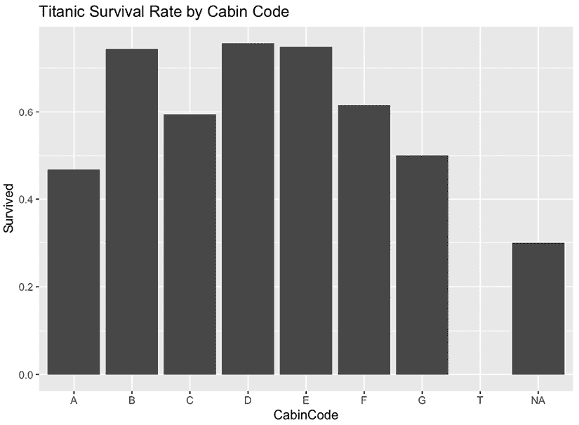

图 12.15：舱位代码特征似乎与生存相关，即使在头等舱（A、B 和 C）中也是如此

在没有首先处理`Cabin`文本数据的情况下，学习算法将无法使用该特征，因为代码对每个舱位都是唯一的。然而，通过应用简单的文本转换，我们已经将舱位代码解码为可以用来提高模型生存预测的东西。

在这个成功的基础上，让我们检查另一个潜在的数据来源：`Name`列。有人可能会认为这在一个模型中是不可用的，因为名字是每行的唯一标识符，在这个数据上训练模型不可避免地会导致过拟合。尽管这是真的，但名字中隐藏着有用的信息。查看前几行揭示了一些可能有用的文本字符串：

```py
> head(titanic_train$Name) 
```

```py
[1] "Braund, Mr. Owen Harris"                            
[2] "Cumings, Mrs. John Bradley (Florence Briggs Thayer)"
[3] "Heikkinen, Miss. Laina"                             
[4] "Futrelle, Mrs. Jacques Heath (Lily May Peel)"       
[5] "Allen, Mr. William Henry"                           
[6] "Moran, Mr. James" 
```

首先，问候语（先生、夫人、小姐）可能有助于预测。问题是这些头衔位于姓名字符串的不同位置，所以我们不能简单地使用`str_sub()`函数来提取它们。这项工作的正确工具是`str_extract()`，它用于从较长的字符串中匹配和提取较短的模式。使用这个函数的技巧在于知道如何表达一个文本模式，而不是单独地输入每个可能的问候语。

用于表达文本搜索模式的简写称为**正则表达式**，或简称**regex**。了解如何创建正则表达式是一项极其有用的技能，因为它们被用于许多文本编辑器的高级查找和替换功能，此外，在 R 中的特征工程中也很有用。我们将创建一个简单的正则表达式来从姓名字符串中提取称呼。

使用正则表达式的第一步是确定所有目标字符串中的共同元素。在泰坦尼克号姓名的情况下，看起来每个称呼都由一个逗号和一个空格开头，然后是一系列字母，最后以句号结束。这可以编码为以下正则表达式字符串：

```py
", [A-z]+\\." 
```

这看起来似乎是胡言乱语，但可以理解为尝试逐个字符匹配模式的序列。匹配过程从预期的逗号和空格开始。接下来，方括号告诉搜索函数在括号内寻找任何字符。例如，`[AB]`会搜索`A`或`B`，而`[ABC]`会搜索`A`、`B`或`C`。在我们的用法中，破折号用于搜索`A`和`z`之间的任何字符。请注意，大小写很重要——即`[A-Z]`与`[A-z]`不同。前者将搜索包含大写字母的 26 个字符，而后者将搜索包括大小写字母在内的 52 个字符。请记住，`[A-z]`只匹配单个字符。

要使表达式匹配更多字符，我们可以在括号后跟一个`+`符号来告诉算法继续匹配字符，直到它遇到括号内的内容为止。然后，它检查正则表达式的剩余部分是否匹配。

剩下的部分是`\\.`序列，这是代表我们搜索模式末尾的单个句点字符的三个字符。因为点是一个特殊术语，代表任意字符，我们必须通过在前面加上斜杠来转义点。不幸的是，斜杠在 R 中也是一个特殊字符，因此我们必须通过在前面加上另一个斜杠来转义它。

正则表达式可能难以学习，但付出努力是值得的。您可以在[`www.regular-expressions.info`](https://www.regular-expressions.info)深入了解它们是如何工作的。或者，有许多文本编辑器和网络应用程序可以实时演示匹配。这些工具对于理解如何开发正则表达式搜索模式和诊断错误非常有帮助。其中最好的工具之一可以在[`regexr.com`](https://regexr.com)找到。

我们可以通过将`mutate()`函数与`str_extract()`结合来将这个表达式应用于泰坦尼克号姓名数据，如下所示：

```py
> titanic_train <- titanic_train |>
    mutate(Title = str_extract(Name, ", [A-z]+\\.")) 
```

看一下前几个例子，这些似乎需要稍微清理一下：

```py
> head(titanic_train$Title) 
```

```py
[1] ", Mr."   ", Mrs."  ", Miss." ", Mrs."  ", Mr."   ", Mr." 
```

让我们使用 `str_replace()` 函数消除这些标题中的标点和空白空间。我们首先构建一个正则表达式来匹配标点和空格。一种方法是通过使用 `"[, \\.]"` 搜索字符串来匹配逗号、空白和句号。像这里所示的那样与 `str_replace()` 结合使用，`Title` 中的任何逗号、空白和句号字符都将被替换为空字符串（null）：

```py
> titanic_train <- titanic_train |>
    mutate(Title = str_replace_all(Title, "[, \\.]", "")) 
```

注意，由于需要替换多个字符，使用了 `str_replace_all()` 替换函数的变体；基本的 `str_replace()` 只会替换匹配字符的第一个实例。`stringr` 的许多函数都有“all”变体用于此用途。让我们看看我们努力的成果：

```py
> table(titanic_train$Title) 
```

```py
 Capt      Col      Don       Dr Jonkheer     Lady 
       1        2        1        7        1        1 
   Major   Master     Miss     Mlle      Mme       Mr 
       2       40      182        2        1      517 
     Mrs       Ms      Rev      Sir 
     125        1        6        1 
```

由于一些标题和问候语的计数较少，将它们分组在一起可能是有意义的。为此，我们可以使用 dplyr 的 `recode()` 函数来更改类别。我们将保持几个高计数级别不变，而将其他部分组合成 `Miss` 的变体和一个总括的桶，使用 `.missing` 和 `.default` 值将 `Other` 标签分配给 `NA` 值和其他尚未编码的内容：

```py
> titanic_train <- titanic_train |>
    mutate(TitleGroup = recode(Title,
      "Mr" = "Mr", "Mrs" = "Mrs", "Master" = "Master",
      "Miss" = "Miss",
      "Ms" = "Miss", "Mlle" = "Miss", "Mme" = "Miss",
      .missing = "Other",
      .default = "Other"
      )
    ) 
```

检查我们的工作，我们看到我们的清理工作按计划进行：

```py
> table(titanic_train$TitleGroup) 
```

```py
Master   Miss     Mr    Mrs  Other 
    40    186    517    125     23 
```

我们还可以通过查看按标题划分的生存率图来验证标题是否有意义：

```py
> titanic_train |> ggplot() +
    geom_bar(aes(x = TitleGroup, y = Survived),
             stat = "summary", fun = "mean") +
    ggtitle("Titanic Survival Rate by Salutation") 
```

这产生了以下条形图：

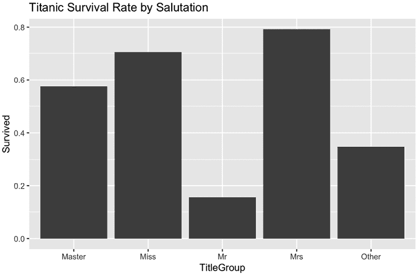

图 12.16：构建的问候语捕捉了年龄和性别对生存可能性的影响

创建 `CabinCode` 和 `TitleGroup` 特征是发现文本数据中隐藏信息的特征工程技术的例证。这些新特征可能会提供比泰坦尼克号数据集中基础特征更多的信息，学习算法可以使用这些信息来提高性能。一点创意加上 `stringr` 和正则表达式知识可能提供超越竞争所需的边缘。

## 使用 lubridate 清理日期

`lubridate` 包（[`lubridate.tidyverse.org`](https://lubridate.tidyverse.org)）是处理日期和时间数据的 重要工具。它可能不是每个分析都必须的，但一旦需要，它就能节省很多麻烦。由于闰年和时区等不可预见的细微差别，看似简单的任务会迅速变成冒险，这就像询问那些从事生日计算、账单周期或类似日期敏感任务的人一样。

与其他 tidyverse 包一样，*R for Data Science* 资源在 `https://r4ds.hadley.nz/datetimes.html` 提供了深入浅出的 lubridate 教程，但在这里我们将简要介绍其三个最重要的特征工程优势：

+   确保日期和时间数据正确加载到 R 中，同时考虑到日期和时间表达的区域差异

+   准确计算日期和时间之间的差异，同时考虑时区和闰年

+   考虑到在现实世界中人们对时间增量理解的不同，例如，人们在生日时“长了一岁”

将日期读入 R 是挑战之一，因为日期以许多不同的格式呈现。例如，*使用 R 进行机器学习* 第一版的出版日期可以表示为：

+   October 25, 2013（在美国常见的长写格式）

+   10/25/13（在美国常见的简写格式）

+   25 October 2013（在欧洲常见的长写格式）

+   25.10.13（在欧洲常见的简写格式）

+   2013-10-25（国际标准）

给定这些不同的格式，lubridate 无法在没有帮助的情况下确定正确的格式，因为月份、天数和年份都可以在 1 到 12 的范围内。因此，我们提供正确的日期构造函数——`mdy()`、`dmy()` 或 `ymd()`，具体取决于输入数据中月份（`m`）、天数（`d`）和年份（`y`）组件的顺序。根据日期组件的顺序，这些函数将自动解析长写和简写变体，并处理前导零和两位或四位数的年份。为了演示这一点，之前表示的日期可以使用适当的 lubridate 函数处理，如下所示：

```py
> mdy(c("October 25, 2013", "10/25/2013")) 
```

```py
[1] "2013-10-25" "2013-10-25" 
```

```py
> dmy(c("25 October 2013", "25.10.13")) 
```

```py
[1] "2013-10-25" "2013-10-25" 
```

```py
> ymd("2013-10-25") 
```

```py
[1] "2013-10-25" 
```

注意，在每种情况下，生成的 `Date` 对象都是完全相同的。让我们为这本书的前三个版本创建类似的对象：

```py
> MLwR_1stEd <- mdy("October 25, 2013")
> MLwR_2ndEd <- mdy("July 31, 2015")
> MLwR_3rdEd <- mdy("April 15, 2019") 
```

我们可以通过简单的数学计算两个日期之间的差异：

```py
> MLwR_2ndEd - MLwR_1stEd 
```

```py
Time difference of 644 days 
```

```py
> MLwR_3rdEd - MLwR_2ndEd 
```

```py
Time difference of 1354 days 
```

注意，默认情况下，两个日期之间的差异以天为单位返回。如果我们希望得到以年为单位的结果呢？遗憾的是，因为这些差异是一个特殊的 lubridate `difftime` 对象，我们不能简单地通过 365 天来除以这些数字进行明显的计算。一个选择是将它们转换为**持续时间**，这是 lubridate 计算日期差异的方法之一，特别是跟踪物理时间的流逝——想象它就像一个秒表。`as.duration()` 函数执行所需的转换：

```py
 > as.duration(MLwR_2ndEd - MLwR_1stEd) 
```

```py
[1] "55641600s (~1.76 years)" 
```

```py
> as.duration(MLwR_3rdEd - MLwR_2ndEd) 
```

```py
[1] "116985600s (~3.71 years)" 
```

我们可以看到，*使用 R 进行机器学习* 第二版和第三版之间的差距几乎是第一版和第二版之间差距的两倍。我们还可以看到，持续时间似乎默认为秒，同时也提供了大约的年数。要仅获取年数，我们可以将持续时间除以 lubridate 提供的 `dyears()` 函数表示的 1 年持续时间：

```py
> dyears() 
```

```py
[1] "31557600s (~1 years)" 
```

```py
> as.duration(MLwR_2ndEd - MLwR_1stEd) / dyears() 
```

```py
[1] 1.763176 
```

```py
> as.duration(MLwR_3rdEd - MLwR_2ndEd) / dyears() 
```

```py
[1] 3.70705 
```

你可能会觉得 `time_length()` 函数更方便或更容易记住，它可以执行相同的计算：

```py
> time_length(MLwR_2ndEd - MLwR_1stEd, unit = "years") 
```

```py
[1] 1.763176 
```

```py
> time_length(MLwR_3rdEd - MLwR_2ndEd, unit = "years") 
```

```py
[1] 3.70705 
```

`unit` 参数可以设置为天、月和年等单位，具体取决于所需的结果。然而，请注意，这些持续时间精确到秒，就像秒表一样，但这并不总是人们考虑日期的方式。

尤其是在生日和周年纪念日，人们倾向于用日历时间来思考——也就是说，日历达到特定里程碑的次数。在 lubridate 中，这种方法被称为**间隔**，这暗示了基于时间线或日历的日期差异视图，而不是之前讨论的基于秒表的持续时间方法。

让我们想象一下，我们想要计算美国的年龄，从字面上说，美国是在 1776 年 7 月 4 日诞生的。这意味着在 2023 年 7 月 3 日，这个国家将满 246 岁生日，而在 2023 年 7 月 5 日，它将满 247 岁。使用持续时间，我们得到的答案并不完全正确：

```py
> USA_DOB <- mdy("July 4, 1776") # USA's Date of Birth
> time_length(mdy("July 3 2023") - USA_DOB, unit = "years") 
```

```py
[1] 246.9897 
```

```py
> time_length(mdy("July 5 2023") - USA_DOB, unit = "years") 
```

```py
[1] 246.9952 
```

这个问题与持续时间由于日历不规则性（如闰年和时区变化）而偏离日历时间的事实有关。通过显式地将日期差转换为`interval()`函数中的间隔，然后除以`years()`函数，我们就能更接近正确答案：

```py
> interval(USA_DOB, mdy("July 3 2023")) / years() 
```

```py
[1] 246.9973 
```

```py
> interval(USA_DOB, mdy("July 5 2023")) / years() 
```

```py
[1] 247 
```

在继续之前，请务必注意`interval()`函数使用的是`start, end`语法，这与使用`end - start`的日期差不同。此外，请注意`years()`函数返回的是一个 lubridate **周期**，这是理解日期和时间差异的另一种方式。周期总是相对于日历上的位置而言的，这意味着在时区变化期间，1 小时的周期可能相当于 2 小时的持续时间，而 1 年的周期可能包括 365 天或 366 天，这取决于日历年——这些都是本节开头段落中提到的处理日期时可能遇到的具有挑战性的细微差别！

为了创建我们最终的年龄计算，我们将使用`%--%`间隔构造操作符作为缩写，并使用整数除法操作符`%/%`来返回年龄的整数部分。这些返回预期的年龄值：

```py
> USA_DOB %--% mdy("July 3 2023") %/% years() 
```

```py
[1] 246 
```

```py
> USA_DOB %--% mdy("July 5 2023") %/% years() 
```

```py
[1] 247 
```

将这项工作推广，我们可以创建一个函数来计算给定出生日期的基于日历的年龄：

```py
> age <- function(birthdate) {
    birthdate %--% today() %/% years()
  } 
```

为了证明它的工作，我们将检查几位著名科技亿万富翁的年龄：

```py
> age(mdy("February 24, 1955")) # Jeff Bezos 
```

```py
[1] 59 
```

```py
> age(mdy("June 28, 1971")) # Elon Musk 
```

```py
[1] 51 
```

```py
> age(mdy("Oct 28, 1955")) # Bill Gates 
```

```py
[1] 67 
```

如果你正在 R 中跟随，请注意你的结果可能会根据你运行代码的时间而变化——不幸的是，我们每天都在变老！

# 摘要

本章展示了数据准备的重要性。因为用于构建机器学习模型的工具和算法在各个项目中都是相同的，所以数据准备是开启模型性能最高水平的钥匙。这允许人类智能和创造力的某些方面对机器的学习过程产生重大影响，尽管聪明的实践者通过开发利用计算机无休止地搜索数据中有用见解的自动化数据工程管道，与机器的优势相结合。这些管道在所谓的“大数据环境”中尤为重要，在这种环境中，像深度学习这样的数据饥渴方法必须提供大量数据以避免过拟合。

在传统的中小数据环境中，手动特征工程仍然占据主导地位。通过直觉和专业知识，可以引导模型找到训练数据集中最有用的信号。由于这更多的是艺术而非科学，技巧和窍门是在工作中学习到的，或者是从一个数据科学家那里二手传到另一个数据科学家那里。本章提供了七个提示，以帮助你在特征工程的旅程中找到方向，但真正精通特征工程的方法只有通过实践。 

类似于 tidyverse 套件的 R 包等工具，使得在过去几年中获取执行特征工程任务所需的经验要容易得多。本章展示了如何使用 tidyverse 包将数据转化为更有用的预测因子，以及如何从文本数据中提取隐藏的信息，将看似无用的特征转化为重要的预测因子。tidyverse 包在处理大型和不断增长的数据库方面比基础 R 函数更强大，并且随着数据集的大小和复杂性的增加，它们使 R 的使用变得更加愉快。

本章中培养的技能将为后续工作提供基础。在下一章中，你将向你的工具箱中添加新的 tidyverse 包，并看到更多关于它如何集成到机器学习工作流程中的例子。当你探索那些开始时相对较小的挑战但若被推向极端会迅速演变成巨大问题的数据问题时，你将继续看到数据准备技能的重要性。

# 加入我们书籍的 Discord 空间

加入我们的 Discord 社区，与志同道合的人见面，并在以下地点与超过 4000 人一起学习：

[`packt.link/r`](https://packt.link/r)


