# 第八章：集成学习

在本章中，我们将涵盖以下主题：

+   使用 Bagging 方法分类数据

+   使用 Bagging 方法进行交叉验证

+   使用 Boosting 方法分类数据

+   使用 Boosting 方法进行交叉验证

+   使用梯度提升分类数据

+   计算分类器的边缘

+   计算集成方法的误差演变

+   使用随机森林分类数据

+   估计不同分类器的预测误差

# 简介

集成学习是一种将不同学习器产生的结果组合成一种格式的方法，目的是产生更好的分类结果和回归结果。在前面的章节中，我们讨论了几种分类方法。这些方法采取不同的方法，但它们都有相同的目标，即找到最优的分类模型。然而，单个分类器可能是不完美的，它可能在某些类别中错误地分类数据。由于并非所有分类器都是不完美的，因此更好的方法是通过对结果进行平均投票。换句话说，如果我们对每个分类器相同的输入的预测结果进行平均，我们可能创建一个比使用单个方法更好的模型。

在集成学习中，Bagging、Boosting 和随机森林是三种最常用的方法：

+   Bagging 是一种投票方法，它首先使用 Bootstrap 生成不同的训练集，然后使用该训练集来制作不同的基础学习器。Bagging 方法采用基础学习器的组合来做出更好的预测。

+   Boosting 与 Bagging 方法类似。然而，使 Boosting 与众不同的地方在于它首先按顺序构建基础学习器，其中每个后续学习器都是为了构建前一个学习器的预测残差。通过创建互补学习者的手段，它使用先前学习者的错误来训练下一个基础学习器。

+   随机森林使用来自许多分类树的投票结果。这个想法很简单；单个分类树将使用单个输入向量获得单个分类结果。然而，随机森林生长了许多分类树，从单个输入中获得多个结果。因此，随机森林将使用所有决策树中的多数投票来分类数据或使用平均输出进行回归。

在下面的菜谱中，我们将讨论如何使用 Bagging 和 Boosting 来分类数据。然后我们可以进行交叉验证来估计每个分类器的错误率。除此之外，我们还将介绍使用边缘来衡量模型确定性的方法。接下来，我们将介绍类似于 Bagging 和 Boosting 方法的随机森林，并介绍如何训练模型来分类数据以及如何使用边缘来估计模型确定性。最后，我们将演示如何估计每个分类器的错误率，并使用错误率来比较不同分类器的性能。

# 使用 bagging 方法对数据进行分类

`adabag`包实现了提升和 bagging 方法。对于 bagging 方法，该包实现了 Breiman 的 Bagging 算法，该算法首先生成多个分类器的多个版本，然后获得一个聚合分类器。在这个菜谱中，我们将说明如何使用`adabag`中的 bagging 方法来使用电信`churn`数据集生成分类模型。

## 准备工作

在这个菜谱中，我们继续使用电信`churn`数据集作为 bagging 方法的输入数据源。对于那些尚未准备数据集的人，请参阅第五章, *分类（I） – 树、懒惰和概率分类*，获取详细信息。

## 如何操作...

执行以下步骤以生成电信`churn`数据集的分类模型：

1.  首先，你需要安装并加载`adabag`包（安装`adabag`可能需要一段时间）：

    ```py
    > install.packages("adabag")
    > library(adabag)

    ```

1.  接下来，你可以使用`bagging`函数来训练一个训练数据集（训练过程中结果可能会有所不同）：

    ```py
    > set.seed(2)
    > churn.bagging = bagging(churn ~ ., data=trainset, mfinal=10)

    ```

1.  从 bagging 结果中获取变量重要性：

    ```py
    > churn.bagging$importance
     international_plan number_customer_service_calls 
     10.4948380                    16.4260510 
     number_vmail_messages               total_day_calls 
     0.5319143                     0.3774190 
     total_day_charge             total_day_minutes 
     0.0000000                    28.7545042 
     total_eve_calls              total_eve_charge 
     0.1463585                     0.0000000 
     total_eve_minutes              total_intl_calls 
     14.2366754                     8.7733895 
     total_intl_charge            total_intl_minutes 
     0.0000000                     9.7838256 
     total_night_calls            total_night_charge 
     0.4349952                     0.0000000 
     total_night_minutes               voice_mail_plan 
     2.3379622                     7.7020671 

    ```

1.  在生成分类模型后，你可以使用测试数据集的预测结果：

    ```py
    > churn.predbagging= predict.bagging(churn.bagging, newdata=testset)

    ```

1.  从预测结果中，你可以获得一个分类表：

    ```py
    > churn.predbagging$confusion
     Observed Class
    Predicted Class yes  no
     no   35 866
     yes 106  11

    ```

1.  最后，你可以检索 bagging 结果的平均误差：

    ```py
    > churn.predbagging$error
    [1] 0.0451866

    ```

## 如何工作...

Bagging 来源于 Bootstrap aggregating（自助聚合）的名字，这是一种稳定、准确且易于实现的数据分类和回归模型。Bagging 的定义如下：给定一个大小为*n*的训练数据集，bagging 执行 Bootstrap 抽样并生成*m*个新的训练集，*Di*，每个大小为*n*。最后，我们可以将*m*个 Bootstrap 样本拟合到*m*个模型中，并通过平均输出（对于回归）或投票（对于分类）来组合结果：

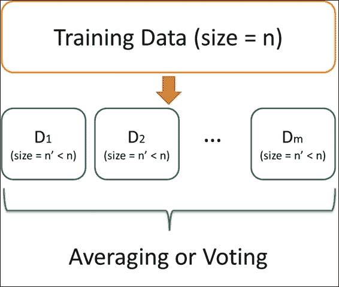

bagging 方法的示意图

使用 bagging 的优点是它是一种强大的学习方法，易于理解和实现。然而，这种技术的缺点是结果难以分析。

在这个菜谱中，我们使用`adabag`中的提升方法对电信客户流失数据进行分类。类似于前面章节中讨论的其他分类方法，你可以使用公式和训练数据集来训练一个提升分类器。此外，你可以在`mfinal`参数中将迭代次数设置为 10。一旦构建了分类模型，你可以检查每个属性的重要性。按重要性对属性进行排序显示，客户服务电话的数量在分类模型中起着至关重要的作用。

接下来，使用拟合好的模型，您可以应用`predict.bagging`函数来预测测试数据集的标签。因此，您可以使用测试数据集的标签和预测结果来生成分类表并获取平均误差，在这个例子中为 0.045。

## 还有更多...

除了`adabag`，`ipred`包还提供了一个用于分类树的袋装方法。在这里，我们演示如何使用`ipred`包的袋装方法来训练一个分类模型：

1.  首先，您需要安装并加载`ipred`包：

    ```py
    > install.packages("ipred")
    > library(ipred)

    ```

1.  然后，您可以使用`bagging`方法来拟合分类方法：

    ```py
    > churn.bagging = bagging(churn ~ ., data = trainset, coob = T)
    > churn.bagging

    Bagging classification trees with 25 bootstrap replications 

    Call: bagging.data.frame(formula = churn ~ ., data = trainset, coob = T)

    Out-of-bag estimate of misclassification error:  0.0605 

    ```

1.  获取错误分类的出袋估计：

    ```py
    > mean(predict(churn.bagging) != trainset$churn)
    [1] 0.06047516

    ```

1.  然后，您可以使用`predict`函数来获取测试数据集的预测标签：

    ```py
    > churn.prediction = predict(churn.bagging, newdata=testset, type="class")

    ```

1.  从测试数据集的标签和预测结果中获取分类表：

    ```py
    > prediction.table = table(churn.prediction, testset$churn)

    churn.prediction yes  no
     no   31 869
     yes 110   8

    ```

# 使用袋装方法进行交叉验证

为了评估分类器的预测能力，您可以运行交叉验证方法来测试分类模型的鲁棒性。在这个菜谱中，我们将介绍如何使用`bagging.cv`来执行带有袋装方法的交叉验证。

## 准备工作

在这个菜谱中，我们继续使用 telecom `churn`数据集作为输入数据源，使用袋装方法进行 k 折交叉验证。

## 如何做...

通过使用袋装方法进行交叉验证来执行以下步骤以检索最小估计误差：

1.  首先，我们使用`bagging.cv`在训练数据集上进行 10 次迭代的 10 折分类：

    ```py
    > churn.baggingcv = bagging.cv(churn ~ ., v=10, data=trainset, mfinal=10)

    ```

1.  然后，您可以从交叉验证结果中获取混淆矩阵：

    ```py
    > churn.baggingcv$confusion
     Observed Class
    Predicted Class  yes   no
     no   100 1938
     yes  242   35

    ```

1.  最后，您可以从交叉验证结果中检索最小估计误差：

    ```py
    > churn.baggingcv$error
    [1] 0.05831533

    ```

## 工作原理...

`adabag`包提供了一个函数来执行带有袋装或提升方法的 k 折验证。在这个例子中，我们使用`bagging.cv`来使用袋装方法进行 k 折交叉验证。我们首先通过指定`v=10`和`mfinal=10`进行 10 次迭代的 10 折交叉验证。请注意，由于迭代次数较多，这相当耗时。交叉验证过程完成后，我们可以从交叉验证结果中获得混淆矩阵和平均误差（在这种情况下为 0.058）。

## 参见

+   对于那些想要调整`bagging.cv`参数的人来说，请使用`help`函数查看`bagging.cv`文档：

    ```py
    > help(bagging.cv)

    ```

# 使用提升方法进行数据分类

与袋装法类似，提升法从简单或弱分类器开始，通过重新加权误分类样本逐渐改进它。因此，新的分类器可以从前一个分类器中学习。`adabag`包提供了**AdaBoost.M1**和**SAMME**算法的实现。因此，可以使用`adabag`中的提升方法进行集成学习。在本菜谱中，我们将使用`adabag`中的提升方法对电信`churn`数据集进行分类。

## 准备工作

在本菜谱中，我们将继续使用电信`churn`数据集作为输入数据源，使用提升法进行分类。此外，在开始菜谱之前，您需要将`adabag`包加载到 R 中。

## 如何操作...

执行以下步骤，使用提升法对电信`churn`数据集进行分类：

1.  您可以使用`adabag`包中的提升函数来训练分类模型：

    ```py
    > set.seed(2)
    > churn.boost = boosting(churn ~.,data=trainset,mfinal=10, coeflearn="Freund", boos=FALSE , control=rpart.control(maxdepth=3))

    ```

1.  然后，您可以根据提升模型和测试数据集进行预测：

    ```py
    > churn.boost.pred = predict.boosting(churn.boost,newdata=testset)

    ```

1.  接下来，您可以从预测结果中检索分类表：

    ```py
    > churn.boost.pred$confusion
     Observed Class
    Predicted Class yes  no
     no   41 858
     yes 100  19

    ```

1.  最后，您可以从预测结果中获得平均误差：

    ```py
    > churn.boost.pred$error
    [1] 0.0589391

    ```

## 它是如何工作的...

提升法的思想是将弱学习器（例如单个决策树）提升为强学习器。假设我们的训练数据集中有*n*个点，我们可以为每个点分配一个权重，*Wi*（0 <= i < n）。然后，在迭代学习过程中（我们假设迭代次数为*m*），我们可以根据每次迭代的分类结果重新加权每个点。如果点被正确分类，我们应该减少权重。否则，我们增加该点的权重。当迭代过程完成后，我们可以获得*m*个拟合模型，*fi*（0 <= i < n）。最后，我们可以通过每个树的预测的加权平均获得最终预测，其中权重 b 基于每个树的质量：

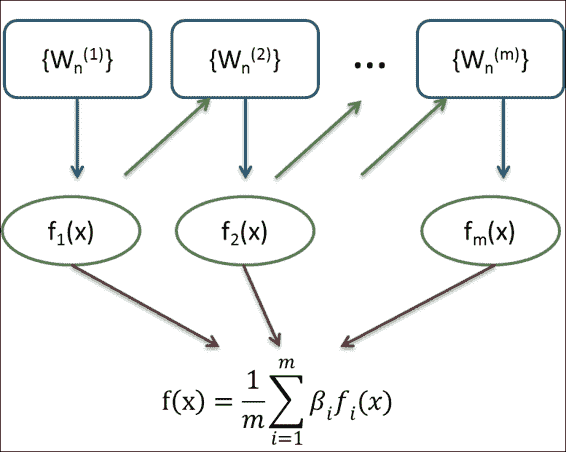

提升法的示意图

无论是袋装法（bagging）还是提升法（boosting），它们都是集成方法，将每个单个学习器的预测能力结合成一个强大的学习器。袋装法和提升法之间的区别在于，袋装法结合了独立的模型，而提升法通过迭代过程，通过后续模型预测先前模型的错误来减少错误。

在这个菜谱中，我们展示了如何在提升方法内拟合分类模型。类似于袋装法，必须指定用于训练分类模型的公式和训练数据集。此外，还可以指定参数，例如迭代次数（`mfinal`）、权重更新系数（`coeflearn`）、每个观测值的权重（`boos`）以及`rpart`（单个决策树）的控制。在这个菜谱中，我们将迭代次数设置为 10，使用`Freund`（Adaboost.M1 算法实现的方法）作为`coeflearn`，将`boos`设置为 false，并将`rpart`配置的最大深度设置为`3`。

我们使用提升方法拟合分类模型，并将其保存在`churn.boost`中。然后，我们可以使用`prediction`函数获取预测标签。此外，我们可以使用`table`函数根据预测标签和测试数据集标签检索分类表。最后，我们可以获取预测结果的平均误差。

## 更多...

除了在`adabag`包中使用提升函数外，还可以使用`caret`包通过提升方法进行分类：

1.  首先，加载`mboost`和`pROC`包：

    ```py
    > library(mboost)
    > install.packages("pROC")
    > library(pROC)

    ```

1.  然后，我们可以使用`trainControl`函数设置训练控制，并使用`train`函数使用 adaboost 训练分类模型：

    ```py
    > set.seed(2)
    > ctrl = trainControl(method = "repeatedcv", repeats = 1, classProbs = TRUE, summaryFunction = twoClassSummary)
    > ada.train = train(churn ~ ., data = trainset, method = "ada", metric = "ROC", trControl = ctrl)

    ```

1.  使用`summary`函数获取分类模型的详细信息：

    ```py
    > ada.train$result
     nu maxdepth iter       ROC      Sens        Spec      ROCSD     SensSD      SpecSD
    1 0.1        1   50 0.8571988 0.9152941 0.012662155 0.03448418 0.04430519 0.007251045
    4 0.1        2   50 0.8905514 0.7138655 0.006083679 0.03538445 0.10089887 0.006236741
    7 0.1        3   50 0.9056456 0.4036134 0.007093780 0.03934631 0.09406015 0.006407402
    2 0.1        1  100 0.8550789 0.8918487 0.015705276 0.03434382 0.06190546 0.006503191
    5 0.1        2  100 0.8907720 0.6609244 0.009626724 0.03788941 0.11403364 0.006940001
    8 0.1        3  100 0.9077750 0.3832773 0.005576065 0.03601187 0.09630026 0.003738978
    3 0.1        1  150 0.8571743 0.8714286 0.016720505 0.03481526 0.06198773 0.006767313
    6 0.1        2  150 0.8929524 0.6171429 0.011654617 0.03638272 0.11383803 0.006777465
    9 0.1        3  150 0.9093921 0.3743697 0.007093780 0.03258220 0.09504202 0.005446136

    ```

1.  使用`plot`函数在不同迭代中绘制 ROC 曲线：

    ```py
    > plot(ada.train)

    ```

    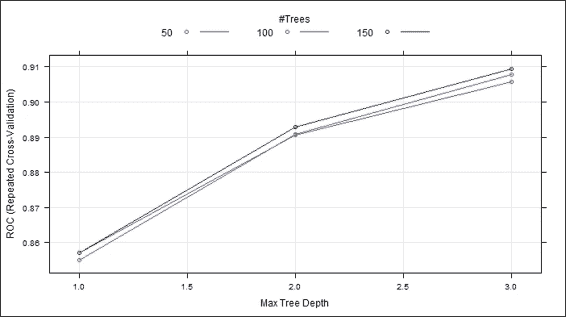

    重复交叉验证图

1.  最后，我们可以使用`predict`函数进行预测，并查看分类表：

    ```py
    > ada.predict = predict(ada.train, testset, "prob")
    > ada.predict.result = ifelse(ada.predict[1] > 0.5, "yes", "no")

    > table(testset$churn, ada.predict.result)
     ada.predict.result
     no yes
     yes  40 101
     no  872   5

    ```

# 使用提升方法进行交叉验证

类似于`bagging`函数，`adabag`为提升方法提供了一个交叉验证函数，名为`boosting.cv`。在这个菜谱中，我们将演示如何使用`adabag`包中的`boosting.cv`进行交叉验证。

## 准备工作

在这个菜谱中，我们继续使用电信`churn`数据集作为输入数据源，使用`boosting`方法进行 k 折交叉验证。

## 如何做...

通过使用`boosting`方法进行交叉验证，执行以下步骤以检索最小估计误差：

1.  首先，你可以使用`boosting.cv`对训练数据集进行交叉验证：

    ```py
    > churn.boostcv = boosting.cv(churn ~ ., v=10, data=trainset, mfinal=5,control=rpart.control(cp=0.01))

    ```

1.  然后，你可以从提升结果中获得混淆矩阵：

    ```py
    > churn.boostcv$confusion
     Observed Class
    Predicted Class  yes   no
     no   119 1940
     yes  223   33

    ```

1.  最后，你可以检索提升方法的平均误差：

    ```py
    > churn.boostcv$error
    [1] 0.06565875

    ```

## 它是如何工作的...

类似于`bagging.cv`，我们可以使用`boosting.cv`在提升方法中进行交叉验证。如果将`v`设置为`10`，将`mfinal`设置为`5`，则提升方法将执行 10 次交叉验证，每次迭代 5 次。此外，还可以在参数内设置`rpart`拟合的控制。在这个例子中，我们可以将复杂性参数设置为 0.01。一旦训练完成，将获得提升结果的混淆矩阵和平均误差。

## 参见

+   对于需要更多关于调整`boosting.cv`参数信息的人，请使用`help`函数查看`boosting.cv`文档：

    ```py
    > help(boosting.cv)

    ```

# 使用梯度提升法分类数据

梯度提升集成弱学习器并创建一个与损失函数的负梯度最大相关的新基学习器。可以将此方法应用于回归或分类问题，并且在不同数据集上表现良好。在本菜谱中，我们将介绍如何使用`gbm`对电信`churn`数据集进行分类。

## 准备工作

在这个菜谱中，我们继续使用电信`churn`数据集作为`bagging`方法的输入数据源。对于那些尚未准备数据集的人，请参阅第五章，*分类（I）-树、懒惰和概率性*，以获取详细信息。

## 如何做

执行以下步骤以使用梯度提升法计算和分类数据：

1.  首先，安装并加载`gbm`包：

    ```py
    > install.packages("gbm")
    > library(gbm)

    ```

1.  `gbm`函数只使用从`0`到`1`的响应；因此，你应该将是/否响应转换为数值响应（0/1）：

    ```py
    > trainset$churn = ifelse(trainset$churn == "yes", 1, 0)

    ```

1.  接下来，你可以使用`gbm`函数来训练一个训练数据集：

    ```py
    > set.seed(2)
    > churn.gbm = gbm(formula = churn ~ .,distribution = "bernoulli",data = trainset,n.trees = 1000,interaction.depth = 7,shrinkage = 0.01, cv.folds=3)

    ```

1.  然后，你可以从拟合模型中获取摘要信息：

    ```py
    > summary(churn.gbm)
     var    rel.inf
    total_day_minutes          total_day_minutes 28.1217147
    total_eve_minutes                total_eve_minutes 16.8097151
    number_customer_service_calls number_customer_service_calls 12.7894464
    total_intl_minutes             total_intl_minutes  9.4515822
    total_intl_calls                   total_intl_calls  8.1379826
    international_plan               international_plan  8.0703900
    total_night_minutes             total_night_minutes  4.0805153
    number_vmail_messages         number_vmail_messages  3.9173515
    voice_mail_plan                  voice_mail_plan  2.5501480
    total_night_calls              total_night_calls  2.1357970
    total_day_calls                     total_day_calls  1.7367888
    total_eve_calls                     total_eve_calls  1.4398047
    total_eve_charge                 total_eve_charge  0.5457486
    total_night_charge              total_night_charge  0.2130152
    total_day_charge                total_day_charge  0.0000000
    total_intl_charge                 total_intl_charge  0.0000000

    ```

    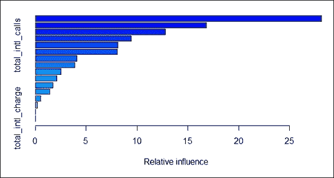

    拟合模型的相对影响图

1.  你可以使用交叉验证获得最佳迭代次数：

    ```py
    > churn.iter = gbm.perf(churn.gbm,method="cv")

    ```

    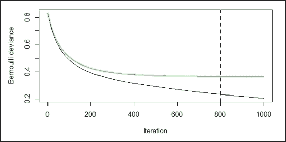

    性能测量图

1.  然后，你可以检索伯努利损失函数返回的对数中的奇数值：

    ```py
    > churn.predict = predict(churn.gbm, testset, n.trees = churn.iter)
    > str(churn.predict)
     num [1:1018] -3.31 -2.91 -3.16 -3.47 -3.48 ...

    ```

1.  接下来，你可以绘制 ROC 曲线并获取具有最大准确性的最佳截止值：

    ```py
    > churn.roc = roc(testset$churn, churn.predict)
    > plot(churn.roc)
    Call:
    roc.default(response = testset$churn, predictor = churn.predict)
    Data: churn.predict in 141 controls (testset$churn yes) > 877 cases (testset$churn no).
    Area under the curve: 0.9393

    ```

    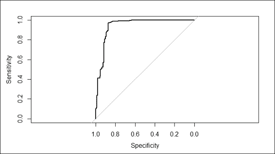

    拟合模型的 ROC 曲线

1.  你可以使用`coords`函数检索最佳截止值并使用此截止值来获取预测标签：

    ```py
    > coords(churn.roc, "best")
     threshold specificity sensitivity 
     -0.9495258   0.8723404   0.9703535 
    > churn.predict.class = ifelse(churn.predict > coords(churn.roc, "best")["threshold"], "yes", "no")

    ```

1.  最后，你可以从预测结果中获得分类表：

    ```py
    > table( testset$churn,churn.predict.class)
     churn.predict.class
     no yes
     yes  18 123
     no  851  26

    ```

## 它是如何工作的...

梯度提升算法涉及的过程，首先计算每个分区的残差偏差，然后确定每个阶段的最佳数据分区。接下来，连续的模型将拟合前一阶段的残差并构建一个新的模型以减少残差方差（一个误差）。残差方差的减少遵循功能梯度下降技术，通过沿着其导数下降来最小化残差方差，如下所示：

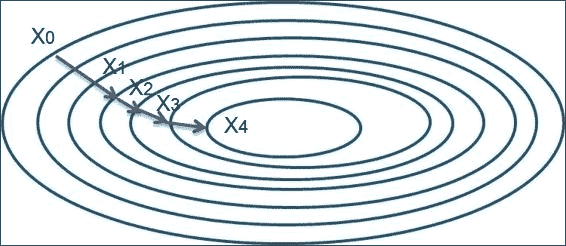

梯度下降法

在这个菜谱中，我们使用`gbm`中的梯度提升方法对电信客户流失数据集进行分类。为了开始分类，我们首先安装并加载`gbm`包。然后，我们使用`gbm`函数来训练分类模型。在这里，由于我们的预测目标是`churn`属性，这是一个二元结果，因此我们在`distribution`参数中将分布设置为`bernoulli`。此外，我们在`n.tree`参数中将 1000 棵树设置为拟合，在`interaction.depth`中将变量交互的最大深度设置为`7`，在`shrinkage`中将步长减少的学习率设置为 0.01，在`cv.folds`中将交叉验证的次数设置为`3`。模型拟合后，我们可以使用`summary`函数从表中获取每个变量的相对影响信息，并从图表中获取。相对影响显示了每个变量在平方误差和中的减少量。在这里，我们可以找到`total_day_minutes`是减少损失函数的最有影响力的一个变量。

接下来，我们使用`gbm.perf`函数找到最佳迭代次数。在这里，我们通过指定`method`参数为`cv`来进行交叉验证，以估计最佳迭代次数。该函数进一步生成两个图表，其中黑色线条表示训练误差，绿色线条表示验证误差。这里的误差测量是一个`bernoulli`分布，我们已经在训练阶段定义了它。图表上的蓝色虚线显示了最佳迭代的位置。

然后，我们使用`predict`函数从伯努利损失函数返回的每个测试案例中获取对数概率值。为了获得最佳的预测结果，可以将`n.trees`参数设置为最佳迭代次数。然而，由于返回值是对数概率值的奇数，我们仍然需要确定最佳的截止点来确定标签。因此，我们使用`roc`函数生成 ROC 曲线，并获取具有最大准确率的截止点。

最后，我们可以使用`coords`函数检索最佳截止阈值，并使用`ifelse`函数从对数概率值中确定类别标签。现在，我们可以使用`table`函数生成分类表，以查看分类模型的准确性。

## 还有更多...

除了在`gbm`包中使用提升函数外，还可以使用`mboost`包通过梯度提升方法进行分类：

1.  首先，安装并加载`mboost`包：

    ```py
    > install.packages("mboost")
    > library(mboost)

    ```

1.  `mboost`函数仅使用数值响应；因此，应将是/否响应转换为数值响应（0/1）：

    ```py
    > trainset$churn = ifelse(trainset$churn == "yes", 1, 0)

    ```

1.  此外，还应删除非数值属性，例如`voice_mail_plan`和`international_plan`：

    ```py
    > trainset$voice_mail_plan = NULL
    > trainset$international_plan = NULL

    ```

1.  然后，我们可以使用`mboost`来训练分类模型：

    ```py
    > churn.mboost = mboost(churn ~ ., data=trainset,  control = boost_control(mstop = 10))

    ```

1.  使用`summary`函数获取分类模型的详细信息：

    ```py
    > summary(churn.mboost)

     Model-based Boosting

    Call:
    mboost(formula = churn ~ ., data = trainset, control = boost_control(mstop = 10))

     Squared Error (Regression) 

    Loss function: (y - f)² 

    Number of boosting iterations: mstop = 10 
    Step size:  0.1 
    Offset:  1.147732 
    Number of baselearners:  14 

    Selection frequencies:
     bbs(total_day_minutes) bbs(number_customer_service_calls) 
     0.6                                0.4 

    ```

1.  最后，使用`plot`函数绘制每个属性的局部贡献图：

    ```py
    > par(mfrow=c(1,2))
    > plot(churn.mboost)

    ```

    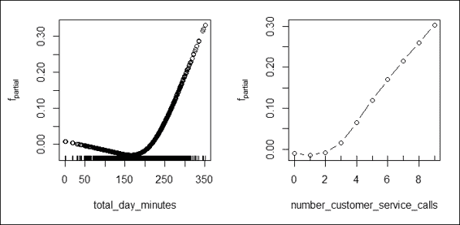

    重要属性的局部贡献图

# 计算分类器的边缘

边缘是分类确定性的度量。此方法计算正确类别的支持与错误类别的最大支持之间的差异。在本配方中，我们将演示如何计算生成的分类器的边缘。

## 准备工作

您需要完成前面的配方，将拟合的 bagging 模型存储在变量 `churn.bagging` 和 `churn.predbagging` 中。同时，将拟合的提升分类器放入 `churn.boost` 和 `churn.boost.pred` 中。

## 如何操作...

执行以下步骤以计算每个集成学习者的边缘：

1.  首先，使用 `margins` 函数计算提升分类器的边缘：

    ```py
    > boost.margins = margins(churn.boost, trainset)
    > boost.pred.margins = margins(churn.boost.pred, testset)

    ```

1.  然后，您可以使用 `plot` 函数绘制提升分类器的边缘累积分布图：

    ```py
    > plot(sort(boost.margins[[1]]), (1:length(boost.margins[[1]]))/length(boost.margins[[1]]), type="l",xlim=c(-1,1),main="Boosting: Margin cumulative distribution graph", xlab="margin", ylab="% observations", col = "blue")
    > lines(sort(boost.pred.margins[[1]]), (1:length(boost.pred.margins[[1]]))/length(boost.pred.margins[[1]]), type="l", col = "green")
    > abline(v=0, col="red",lty=2)

    ```

    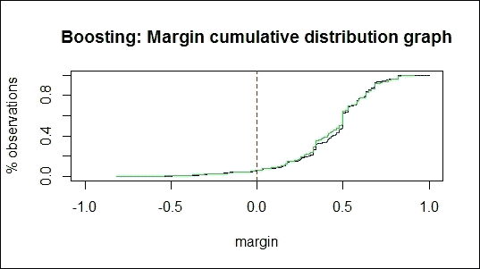

    使用提升方法的边缘累积分布图

1.  然后，您可以计算负边缘匹配训练错误的百分比和负边缘匹配测试错误的百分比：

    ```py
    > boosting.training.margin = table(boost.margins[[1]] > 0)
    > boosting.negative.training = as.numeric(boosting.training.margin[1]/boosting.training.margin[2])
    > boosting.negative.training
     [1] 0.06387868

    > boosting.testing.margin = table(boost.pred.margins[[1]] > 0)
    > boosting.negative.testing = as.numeric(boosting.testing.margin[1]/boosting.testing.margin[2])
    > boosting.negative.testing
    [1] 0.06263048

    ```

1.  此外，您还可以计算 bagging 分类器的边缘。您可能会看到显示 "`no non-missing argument to min`" 的警告信息。该信息仅表示 min/max 函数应用于长度为 0 的参数的数值：

    ```py
    > bagging.margins = margins(churn.bagging, trainset)
    > bagging.pred.margins = margins(churn.predbagging, testset)

    ```

1.  然后，您可以使用 `plot` 函数绘制 bagging 分类器的边缘累积分布图：

    ```py
    > plot(sort(bagging.margins[[1]]), (1:length(bagging.margins[[1]]))/length(bagging.margins[[1]]), type="l",xlim=c(-1,1),main="Bagging: Margin cumulative distribution graph", xlab="margin", ylab="% observations", col = "blue")

    > lines(sort(bagging.pred.margins[[1]]), (1:length(bagging.pred.margins[[1]]))/length(bagging.pred.margins[[1]]), type="l", col = "green")
    > abline(v=0, col="red",lty=2)

    ```

    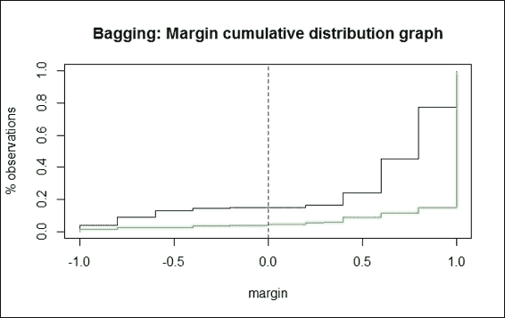

    bagging 方法的边缘累积分布图

1.  最后，然后您可以计算负边缘匹配训练错误的百分比和负边缘匹配测试错误的百分比：

    ```py
    > bagging.training.margin = table(bagging.margins[[1]] > 0)
    > bagging.negative.training = as.numeric(bagging.training.margin[1]/bagging.training.margin[2])
    > bagging.negative.training
    [1] 0.1733401

    > bagging.testing.margin = table(bagging.pred.margins[[1]] > 0)
    > bagging.negative.testing = as.numeric(bagging.testing.margin[1]/bagging.testing.margin[2])
    > bagging.negative.testing
    [1] 0.04303279

    ```

## 工作原理...

边缘是分类确定性的度量；它是通过正确类别的支持与错误类别的最大支持来计算的。边缘的公式可以表示为：

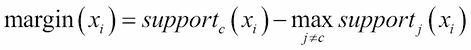

在这里，xi 样本的边缘等于正确分类样本的支持（*c* 表示正确类别）减去被分类到类别 *j* 的样本的最大支持（其中 *j≠c* 且 *j=1…k*）。因此，正确分类的示例将具有正边缘，错误分类的示例将具有负边缘。如果边缘值接近 1，则表示正确分类的示例具有高度的置信度。另一方面，不确定分类的示例将具有较小的边缘。

`margins`函数计算 AdaBoost.M1、AdaBoost-SAMME 或袋装分类器的边缘，并返回一个边缘向量。为了可视化边缘分布，可以使用边缘累积分布图。在这些图中，x 轴表示边缘，y 轴表示边缘小于或等于 x 轴边缘值的观测值的百分比。如果每个观测值都被正确分类，则图表将在边缘等于 1 的位置显示一条垂直线（其中边缘=1）。

对于提升分类器的边缘累积分布图，我们可以看到图上有两条线，其中绿色线表示测试数据集的边缘，蓝色线表示训练集的边缘。图显示大约 6.39%的负边缘与训练错误匹配，6.26%的负边缘与测试错误匹配。另一方面，我们可以在袋装分类器的边缘累积分布图中找到，17.33%的负边缘与训练错误匹配，4.3%的负边缘与测试错误匹配。通常，匹配训练错误的负边缘百分比应该接近匹配测试错误的负边缘百分比。因此，我们应该检查为什么匹配训练错误的负边缘百分比远高于匹配测试错误的负边缘百分比。

## 参考内容

+   如果您对边缘分布图有更多细节感兴趣，请参阅以下来源：*Kuncheva LI (2004)*, *Combining Pattern Classifiers: Methods and Algorithms*, *John Wiley & Sons*。

# 计算集成方法的错误演化

`adabag`包提供了一个`errorevol`函数，用户可以根据迭代次数估计集成方法错误。在这个配方中，我们将演示如何使用`errorevol`来展示每个集成分类器错误的演化。

## 准备工作

您需要完成上一个配方，将拟合的袋装模型存储在变量`churn.bagging`中。同时，将拟合的提升分类器放入`churn.boost`。

## 如何做...

执行以下步骤来计算每个集成学习者的错误演化：

1.  首先，使用`errorevol`函数来计算提升分类器的错误演化：

    ```py
    > boosting.evol.train = errorevol(churn.boost, trainset)
    > boosting.evol.test = errorevol(churn.boost, testset)
    > plot(boosting.evol.test$error, type = "l", ylim = c(0, 1),
    +       main = "Boosting error versus number of trees", xlab = "Iterations",
    +       ylab = "Error", col = "red", lwd = 2)
    > lines(boosting.evol.train$error, cex = .5, col = "blue", lty = 2, lwd = 2)
    > legend("topright", c("test", "train"), col = c("red", "blue"), lty = 1:2, lwd = 2)

    ```

    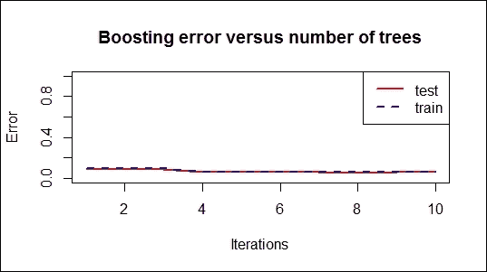

    提升错误与树的数量对比

1.  接下来，使用`errorevol`函数来计算袋装分类器的错误演化：

    ```py
    > bagging.evol.train = errorevol(churn.bagging, trainset)
    > bagging.evol.test = errorevol(churn.bagging, testset)
    > plot(bagging.evol.test$error, type = "l", ylim = c(0, 1),
    +       main = "Bagging error versus number of trees", xlab = "Iterations",
    +       ylab = "Error", col = "red", lwd = 2)
    > lines(bagging.evol.train$error, cex = .5, col = "blue", lty = 2, lwd = 2)
    > legend("topright", c("test", "train"), col = c("red", "blue"), lty = 1:2, lwd = 2)

    ```

    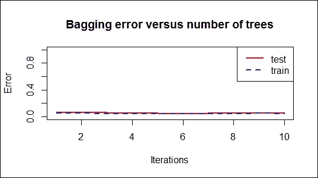

    袋装错误与树的数量对比

## 它是如何工作的...

`errorest`函数计算 AdaBoost.M1、AdaBoost-SAMME 或袋装分类器的错误演化，并返回一个错误演化的向量。在这个配方中，我们使用提升和袋装模型生成错误演化向量，并绘制错误与树的数量对比图。

生成的图表揭示了每次迭代的错误率。错误率的变化趋势可以帮助衡量错误减少的速度，同时迭代次数增加。此外，图表可能显示模型是否过拟合。

## 相关内容

+   如果集成模型过拟合，你可以使用`predict.bagging`和`predict.boosting`函数来修剪集成模型。更多信息，请使用帮助函数参考`predict.bagging`和`predict.boosting`：

    ```py
    > help(predict.bagging)
    > help(predict.boosting)

    ```

# 使用随机森林进行数据分类

随机森林是另一种有用的集成学习方法，在训练过程中会生成多个决策树。每个决策树将输出其对应的输入预测结果。森林将使用投票机制来选择得票最多的类别作为预测结果。在本教程中，我们将说明如何使用`randomForest`包进行数据分类。

## 准备工作

在本教程中，我们将继续使用电信`churn`数据集作为输入数据源，使用随机森林方法进行分类。

## 如何操作...

执行以下步骤以使用随机森林进行数据分类：

1.  首先，你必须安装并加载`randomForest`包；

    ```py
    > install.packages("randomForest")
    > library(randomForest)

    ```

1.  然后，你可以使用训练集拟合随机森林分类器：

    ```py
    > churn.rf = randomForest(churn ~ ., data = trainset, importance = T)
    > churn.rf

    Call:
     randomForest(formula = churn ~ ., data = trainset, importance = T) 
     Type of random forest: classification
     Number of trees: 500
    No. of variables tried at each split: 4

     OOB estimate of  error rate: 4.88%
    Confusion matrix:
     yes   no class.error
    yes 247   95 0.277777778
    no   18 1955 0.009123163

    ```

1.  接下来，根据拟合模型和测试数据集进行预测：

    ```py
    > churn.prediction = predict(churn.rf, testset)

    ```

1.  与其他分类方法类似，你可以获得分类表：

    ```py
    > table(churn.prediction, testset$churn)

    churn.prediction yes  no
     yes 110   7
     no   31 870

    ```

1.  你可以使用`plot`函数绘制森林对象的均方误差：

    ```py
    > plot(churn.rf)

    ```

    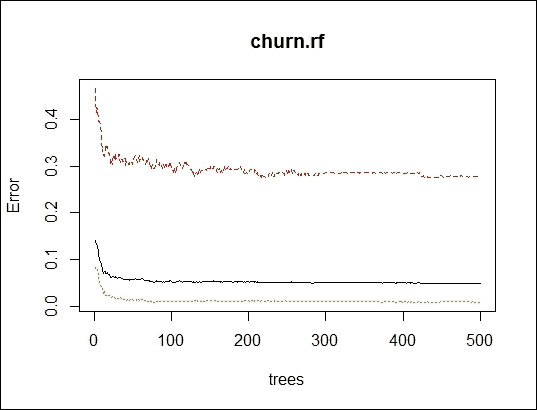

    随机森林的均方误差

1.  然后，你可以检查拟合分类器中每个属性的重要性：

    ```py
    > importance(churn.rf)
     yes         no
    international_plan            66.55206691 56.5100647
    voice_mail_plan               19.98337191 15.2354970
    number_vmail_messages         21.02976166 14.0707195
    total_day_minutes             28.05190188 27.7570444

    ```

1.  接下来，你可以使用`varImpPlot`函数获取变量重要性的绘图：

    ```py
    > varImpPlot(churn.rf)

    ```

    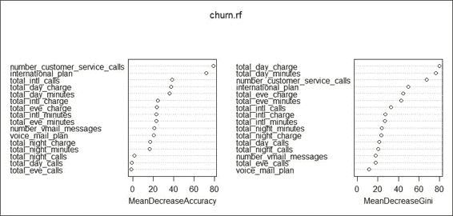

    变量重要性的可视化

1.  你还可以使用`margin`函数来计算边缘并绘制边缘累积分布图：

    ```py
    > margins.rf=margin(churn.rf,trainset)
    > plot(margins.rf)

    ```

    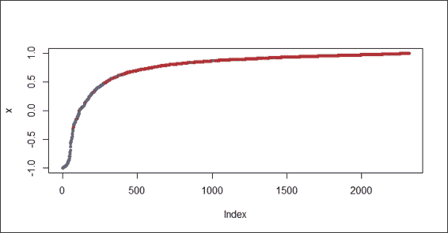

    随机森林方法的边缘累积分布图

1.  此外，你可以使用直方图来可视化随机森林的边缘分布：

    ```py
    > hist(margins.rf,main="Margins of Random Forest for churn dataset")

    ```

    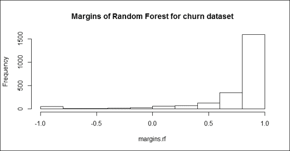

    边缘分布的直方图

1.  你还可以使用`boxplot`通过类别可视化随机森林的边缘：

    ```py
    > boxplot(margins.rf~trainset$churn, main="Margins of Random Forest for churn dataset by class")

    ```

    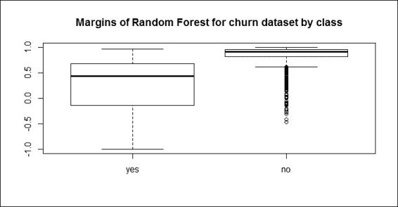

    随机森林的类别边缘

## 工作原理...

随机森林的目的是将弱学习器（例如单个决策树）集成到强学习器中。开发随机森林的过程与袋装法非常相似，假设我们有一个包含*N*个样本和*M*个特征的训练集。这个过程首先进行自助采样，随机抽取*N*个案例，作为每个单个决策树的训练数据集。接下来，在每个节点中，过程首先随机选择*m*个变量（其中*m << M*），然后找到在 m 个变量中提供最佳分割的预测变量。接下来，过程在不剪枝的情况下生长完整的树。最后，我们可以从每棵树中获得示例的预测结果。因此，我们可以通过对输出取平均或加权平均（对于回归）或取多数投票（对于分类）来获得预测结果：


随机森林使用两个参数：**ntree**（树的数量）和**mtry**（用于找到最佳特征的特性数量），而袋装法只使用 ntree 作为参数。因此，如果我们设置 mtry 等于训练数据集中的特性数量，那么随机森林就等同于袋装法。

随机森林的主要优点是它易于计算，可以高效地处理数据，并且对缺失或不平衡数据具有容错性。随机森林的主要缺点是它不能预测超出训练数据集范围的值。此外，它容易对噪声数据进行过拟合。

在这个菜谱中，我们使用来自`randomForest`包的随机森林方法来拟合分类模型。首先，我们在 R 会话中安装并加载`randomForest`。然后，我们使用随机森林方法训练分类模型。我们设置`importance = T`，这将确保评估预测变量的重要性。

与袋装法和提升法类似，一旦模型拟合完成，就可以在测试数据集上使用拟合的模型进行预测，并且还可以获得分类表。

为了评估每个属性的重要性，`randomForest`包提供了重要性和`varImpPlot`函数，既可以列出拟合模型中每个属性的重要性，也可以使用平均降低准确度或平均降低`gini`来可视化重要性。

与包含计算袋装法和提升法边缘方法的`adabag`类似，`randomForest`提供了`margin`函数来计算森林对象的边缘。使用`plot`、`hist`和`boxplot`函数，你可以从不同方面可视化正确分类观察值的比例。

## 还有更多...

除了`randomForest`包之外，`party`包还提供了一个随机森林的实现。在以下步骤中，我们将展示如何在`party`包中使用`cforest`函数来进行分类：

1.  首先，安装并加载`party`包：

    ```py
    > install.packages("party")
    > library(party)

    ```

1.  然后，你可以使用`cforest`函数来拟合分类模型：

    ```py
    > churn.cforest = cforest(churn ~ ., data = trainset, controls=cforest_unbiased(ntree=1000, mtry=5))
    > churn.cforest

     Random Forest using Conditional Inference Trees

    Number of trees:  1000 

    Response:  churn 
    Inputs:  international_plan, voice_mail_plan, number_vmail_messages, total_day_minutes, total_day_calls, total_day_charge, total_eve_minutes, total_eve_calls, total_eve_charge, total_night_minutes, total_night_calls, total_night_charge, total_intl_minutes, total_intl_calls, total_intl_charge, number_customer_service_calls 
    Number of observations:  2315 

    ```

1.  你可以根据构建的模型和测试数据集进行预测：

    ```py
    > churn.cforest.prediction = predict(churn.cforest, testset, OOB=TRUE, type = "response")

    ```

1.  最后，从预测标签和测试数据集的标签中获取分类表：

    ```py
    > table(churn.cforest.prediction, testset$churn)

    churn.cforest.prediction yes  no
     yes  91   3
     no   50 874

    ```

# 估计不同分类器的预测误差

在本章开头，我们讨论了为什么使用集成学习以及它如何与仅使用单个分类器相比提高预测性能。我们现在通过比较每种方法的性能来验证集成模型是否比单个决策树表现更好。为了比较不同的分类器，我们可以对每种分类方法进行 10 折交叉验证，使用`ipred`包中的`erroreset`来估计测试误差。

## 准备工作

在这个菜谱中，我们将继续使用电信`churn`数据集作为输入数据源来估计不同分类器的预测误差。

## 如何操作...

执行以下步骤来估计每种分类方法的预测误差：

1.  你可以估计袋装模型的错误率：

    ```py
    > churn.bagging= errorest(churn ~ ., data = trainset, model = bagging)
    > churn.bagging

    Call:
    errorest.data.frame(formula = churn ~ ., data = trainset, model = bagging)

     10-fold cross-validation estimator of misclassification error 

    Misclassification error:  0.0583 

    ```

1.  然后，你可以估计提升方法的错误率：

    ```py
    > install.packages("ada")
    > library(ada)
    > churn.boosting= errorest(churn ~ ., data = trainset, model = ada)
    > churn.boosting

    Call:
    errorest.data.frame(formula = churn ~ ., data = trainset, model = ada)

     10-fold cross-validation estimator of misclassification error 

    Misclassification error:  0.0475 

    ```

1.  接下来，估计随机森林模型的错误率：

    ```py
    > churn.rf= errorest(churn ~ ., data = trainset, model = randomForest)
    > churn.rf

    Call:
    errorest.data.frame(formula = churn ~ ., data = trainset, model = randomForest)

     10-fold cross-validation estimator of misclassification error 

    Misclassification error:  0.051 

    ```

1.  最后，使用`churn.predict`创建一个预测函数，然后使用该函数估计单个决策树的错误率：

    ```py
    > churn.predict = function(object, newdata) {predict(object, newdata = newdata, type = "class")}
    > churn.tree= errorest(churn ~ ., data = trainset, model = rpart,predict = churn.predict)
    > churn.tree

    Call:
    errorest.data.frame(formula = churn ~ ., data = trainset, model = rpart, 
     predict = churn.predict)

     10-fold cross-validation estimator of misclassification error 

    Misclassification error:  0.0674 

    ```

## 工作原理...

在这个菜谱中，我们使用`ipred`包中的`errorest`函数来估计四种不同分类器的错误率。我们比较了提升、袋装和随机森林方法，以及单个决策树分类器。`errorest`函数对每个分类器进行 10 折交叉验证，并计算误分类误差。四个选择模型的估计结果显示，提升方法具有最低的错误率（0.0475）。随机森林方法具有第二低的错误率（0.051），而袋装方法的错误率为 0.0583。单个决策树分类器`rpart`在四种方法中表现最差，错误率等于 0.0674。这些结果表明，提升、袋装和随机森林这三种集成学习方法都优于单个决策树分类器。

## 相关内容

+   在这个菜谱中，我们提到了`ada`包，它包含一个执行随机提升的方法。对那些对这个包感兴趣的人，请参阅：*Friedman 等（2000）的《加性逻辑回归：提升的统计视角》*。
