# 第十章. 关联分析和序列挖掘

在本章中，我们将涵盖以下主题：

+   将数据转换为交易

+   显示交易和关联

+   使用 Apriori 规则挖掘关联

+   剪枝冗余规则

+   可视化关联规则

+   使用 Eclat 算法挖掘频繁项集

+   创建具有时间信息的交易

+   使用 cSPADE 挖掘频繁顺序模式

# 简介

企业从日常运营中积累大量交易数据（例如，来自零售商的销售订单、发票和运输文件），发现数据中的隐藏关系可能很有用，例如，“哪些产品经常一起购买？”或“购买手机后的后续购买是什么？”为了回答这两个问题，我们需要在事务数据集上执行关联分析和频繁顺序模式挖掘。

关联分析是一种在事务数据集中寻找有趣关系的方法。一个著名的关于产品的关联是*购买尿布的客户也会购买啤酒*。虽然这种关联听起来可能有些不寻常，但如果零售商能够利用这类信息或规则向客户交叉销售产品，那么他们提高销售额的可能性很高。

关联分析用于寻找**项集**之间的相关性，但如果你想知道频繁购买的项目顺序，该怎么办？为了实现这一点，你可以采用频繁顺序模式挖掘，从具有时间信息的事务数据集中找到频繁子序列。然后，你可以使用挖掘出的频繁子序列来预测客户购物顺序、网页点击流、生物序列以及其他应用中的使用情况。

在本章中，我们将涵盖创建和检查事务数据集的配方，使用 Apriori 算法执行关联分析，以各种图形格式可视化关联，以及使用 Eclat 算法查找频繁项集。最后，我们将创建具有时间信息的交易，并使用 cSPADE 算法发现频繁顺序模式。

# 将数据转换为交易

在创建挖掘关联规则之前，您需要将数据转换为交易。在下面的配方中，我们将介绍如何将列表、矩阵或数据框转换为交易。

## 准备工作

在这个配方中，我们将在一个列表、矩阵或数据框中生成三个不同的数据集。然后，我们可以将生成的数据集转换为交易。

## 如何操作...

执行以下步骤将不同格式的数据转换为交易：

1.  首先，您必须安装并加载`arule`包：

    ```py
    > install.packages("arules")
    > library(arules)

    ```

1.  您可以创建一个包含三个向量的购买记录列表：

    ```py
    > tr_list = list(c("Apple", "Bread", "Cake"),
    +                c("Apple", "Bread", "Milk"),
    +                c("Bread", "Cake", "Milk"))
    > names(tr_list) = paste("Tr",c(1:3), sep = "")

    ```

1.  接下来，您可以使用`as`函数将数据框转换为交易：

    ```py
    > trans = as(tr_list, "transactions")
    > trans
    transactions in sparse format with
     3 transactions (rows) and
     4 items (columns)

    ```

1.  您还可以将矩阵格式的数据转换为交易：

    ```py
    > tr_matrix = matrix(
    +   c(1,1,1,0,
    +     1,1,0,1,
    +     0,1,1,1), ncol = 4)
    > dimnames(tr_matrix) =  list(
    +   paste("Tr",c(1:3), sep = ""),
    +   c("Apple","Bread","Cake", "Milk")
    +   )
    > trans2 =  as(tr_matrix, "transactions")
    > trans2
    transactions in sparse format with
     3 transactions (rows) and
     4 items (columns)

    ```

1.  最后，你可以将数据框格式的数据集转换为事务：

    ```py
    > Tr_df = data.frame(
    +   TrID= as.factor(c(1,2,1,1,2,3,2,3,2,3)),
    +   Item = as.factor(c("Apple","Milk","Cake","Bread",
    +                      "Cake","Milk","Apple","Cake",
    +                      "Bread","Bread")) 
    + )
    > trans3 = as(split(Tr_df[,"Item"], Tr_df[,"TrID"]), "transactions")
    > trans3
    transactions in sparse format with
     3 transactions (rows) and
     4 items (columns)

    ```

## 它是如何工作的...

在挖掘频繁项集或使用关联规则之前，通过事务类别准备数据集非常重要。在本菜谱中，我们演示如何将数据集从列表、矩阵和数据框格式转换为事务。在第一步中，我们生成一个包含三个购买记录向量的列表格式的数据集。然后，在为每个交易分配交易 ID 之后，我们使用 `as` 函数将数据转换为事务。

接下来，我们将演示如何将矩阵格式中的数据转换为事务。为了表示项目的购买情况，应使用二元发生矩阵来记录每个交易相对于不同购买项目的购买行为。同样，我们可以使用 `as` 函数将数据集从矩阵格式转换为事务。

最后，我们将展示如何将数据集从数据框格式转换为事务。数据框包含两个因子类型的向量：一个是名为 `TrID` 的交易 ID，另一个显示不同交易中的购买项目（命名为 `Item`）。此外，可以使用 `as` 函数将数据框格式的数据转换为事务。

## 参考内容

+   `transactions` 类用于表示规则或频繁模式挖掘的事务数据。它是 `itemMatrix` 类的扩展。如果您对如何使用这两个不同的类来表示事务数据感兴趣，请使用 `help` 函数参考以下文档：

    ```py
    > help(transactions)
    > help(itemMatrix)

    ```

# 显示事务和关联

`arule` 包使用其自己的 `transactions` 类来存储事务数据。因此，我们必须使用 `arule` 提供的通用函数来显示事务和关联规则。在本菜谱中，我们将展示如何通过 `arule` 包中的各种函数显示事务和关联规则。

## 准备工作

确保您已通过生成事务并将这些存储在变量 `trans` 中完成前面的菜谱。

## 如何做到这一点...

执行以下步骤以显示事务和关联：

1.  首先，您可以获取事务数据的 LIST 表示：

    ```py
    > LIST(trans)
    $Tr1
    [1] "Apple" "Bread" "Cake" 

    $Tr2
    [1] "Apple" "Bread" "Milk" 

    $Tr3
    [1] "Bread" "Cake"  "Milk"

    ```

1.  接下来，您可以使用 `summary` 函数显示事务的统计和详细摘要：

    ```py
    > summary(trans)
    transactions as itemMatrix in sparse format with
     3 rows (elements/itemsets/transactions) and
     4 columns (items) and a density of 0.75 

    most frequent items:
     Bread   Apple    Cake    Milk (Other) 
     3       2       2       2       0 

    element (itemset/transaction) length distribution:
    sizes
    3 
    3 

     Min. 1st Qu.  Median    Mean 3rd Qu.    Max. 
     3       3       3       3       3       3 

    includes extended item information - examples:
     labels
    1  Apple
    2  Bread
    3   Cake

    includes extended transaction information - examples:
     transactionID
    1           Tr1
    2           Tr2
    3           Tr3

    ```

1.  然后，您可以使用 `inspect` 函数显示事务：

    ```py
    > inspect(trans)
     items   transactionID
    1 {Apple, 
     Bread, 
     Cake}            Tr1
    2 {Apple, 
     Bread, 
     Milk}            Tr2
    3 {Bread, 
     Cake, 
     Milk}            Tr3

    ```

1.  此外，您还可以根据大小筛选事务：

    ```py
    > filter_trains = trans[size(trans) >=3]
    > inspect(filter_trains)
     items   transactionID
    1 {Apple, 
     Bread, 
     Cake}            Tr1
    2 {Apple, 
     Bread, 
     Milk}            Tr2
    3 {Bread, 
     Cake, 
     Milk}            Tr3

    ```

1.  此外，您还可以使用图像函数来直观检查事务：

    ```py
    > image(trans)

    ```

    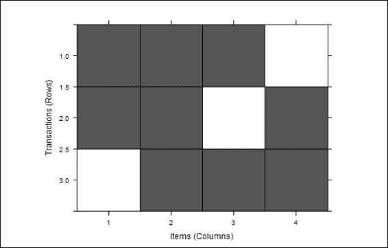

    事务的可视检查

1.  为了直观地显示频率/支持条形图，可以使用 `itemFrequenctPlot`：

    ```py
    > itemFrequencyPlot (trans)

    ```

    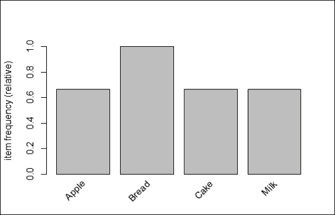

    事务项目频率条形图

## 它是如何工作的...

由于事务数据是挖掘关联和频繁模式的基石，我们必须学习如何显示关联以获得洞察力并确定关联是如何构建的。`arules`包提供了各种方法来检查事务。首先，我们使用`LIST`函数获取事务数据的列表表示。然后，我们可以使用`summary`函数获取信息，例如基本描述、最频繁的项以及事务长度分布。

接下来，我们使用`inspect`函数显示事务。除了显示所有事务外，您还可以首先通过大小过滤事务，然后使用`inspect`函数显示关联。此外，我们可以使用`image`函数对事务进行视觉检查。最后，我们说明如何使用频率/支持条形图显示每个项目的相对频率。

## 相关内容

+   除了使用`itemFrequencyPlot`显示频率/条形图外，您还可以使用`itemFrequency`函数显示支持分布。有关更多详细信息，请使用`help`函数查看以下文档：

    ```py
    > help(itemFrequency)

    ```

# 使用 Apriori 规则挖掘关联

关联挖掘是一种技术，可以挖掘出隐藏在事务数据集中的有趣关系。这种方法首先找到所有频繁项集，然后从频繁项集中生成强关联规则。Apriori 是最著名的关联挖掘算法，它首先识别频繁的个体项，然后执行广度优先搜索策略，将个体项扩展到更大的项集，直到无法找到更大的频繁项集。在本食谱中，我们将介绍如何使用 Apriori 规则进行关联分析。

## 准备工作

在本食谱中，我们将使用内置的事务数据集`Groceries`，演示如何在`arules`包中使用 Apriori 算法进行关联分析。请确保首先安装并加载`arules`包。

## 如何操作...

执行以下步骤以分析关联规则：

1.  首先，您需要加载数据集`Groceries`：

    ```py
    > data(Groceries)

    ```

1.  您可以检查`Groceries`数据集的摘要：

    ```py
    > summary(Groceries)

    ```

1.  接下来，您可以使用`itemFrequencyPlot`检查项集的相对频率：

    ```py
    > itemFrequencyPlot(Groceries, support = 0.1, cex.names=0.8, topN=5)

    ```

    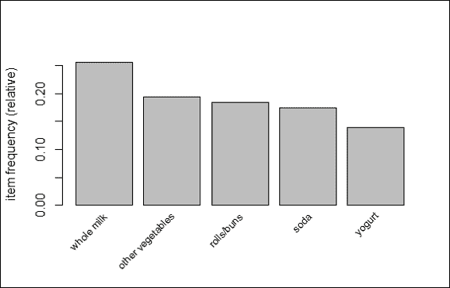

    食物事务的前五项频率条形图

1.  使用`apriori`发现支持率超过 0.001 且置信度超过 0.5 的规则：

    ```py
    > rules = apriori(Groceries, parameter = list(supp = 0.001, conf = 0.5, target= "rules"))
    > summary(rules)
    set of 5668 rules

    rule length distribution (lhs + rhs):sizes
     2    3    4    5    6 
     11 1461 3211  939   46 

     Min. 1st Qu.  Median    Mean 3rd Qu.    Max. 
     2.00    3.00    4.00    3.92    4.00    6.00 

    summary of quality measures:
     support           confidence          lift 
     Min.   :0.001017   Min.   :0.5000   Min.   : 1.957 
     1st Qu.:0.001118   1st Qu.:0.5455   1st Qu.: 2.464 
     Median :0.001322   Median :0.6000   Median : 2.899 
     Mean   :0.001668   Mean   :0.6250   Mean   : 3.262 
     3rd Qu.:0.001729   3rd Qu.:0.6842   3rd Qu.: 3.691 
     Max.   :0.022267   Max.   :1.0000   Max.   :18.996 

    mining info:
     data ntransactions support confidence
     Groceries          9835   0.001        0.5

    ```

1.  然后，我们可以检查前几条规则：

    ```py
    > inspect(head(rules))
     lhs                    rhs              support confidence     lift
    1 {honey}             => {whole milk} 0.001118454  0.7333333 2.870009
    2 {tidbits}           => {rolls/buns} 0.001220132  0.5217391 2.836542
    3 {cocoa drinks}      => {whole milk} 0.001321810  0.5909091 2.312611
    4 {pudding powder}    => {whole milk} 0.001321810  0.5652174 2.212062
    5 {cooking chocolate} => {whole milk} 0.001321810  0.5200000 2.035097
    6 {cereals}           => {whole milk} 0.003660397  0.6428571 2.515917

    ```

1.  您可以根据置信度对规则进行排序并检查前几条规则：

    ```py
    > rules=sort(rules, by="confidence", decreasing=TRUE)
    > inspect(head(rules))
     lhs                     rhs                    support confidence     lift
    1 {rice, 
     sugar}              => {whole milk}       0.001220132          1 3.913649
    2 {canned fish, 
     hygiene articles}   => {whole milk}       0.001118454          1 3.913649
    3 {root vegetables, 
     butter, 
     rice}               => {whole milk}       0.001016777          1 3.913649
    4 {root vegetables, 
     whipped/sour cream, 
     flour}              => {whole milk}       0.001728521          1 3.913649
    5 {butter, 
     soft cheese, 
     domestic eggs}      => {whole milk}       0.001016777          1 3.913649
    6 {citrus fruit, 
     root vegetables, 
     soft cheese}        => {other vegetables} 0.001016777          1 5.168156

    ```

## 工作原理...

关联挖掘的目的是从事务数据库中挖掘项目之间的关联。通常，关联挖掘的过程是通过查找支持度大于最小支持度的项集来进行的。接下来，过程使用频繁项集生成具有大于最小置信度的强规则（例如，`milk => bread`；购买牛奶的客户很可能也会购买面包）。根据定义，关联规则可以表示为 *X=>Y* 的形式，其中 X 和 Y 是不相交的项集。我们可以衡量两个术语之间的关联强度：支持度和置信度。支持度表示规则在数据集中适用的百分比，而置信度表示 X 和 Y 同时出现在同一交易中的概率：

+   支持度 = 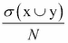

+   置信度 = 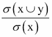

在这里，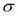 指的是特定项集的频率；*N* 表示人口数量。

由于支持度和置信度是衡量规则强度的指标，你仍然可能会获得许多具有高支持度和置信度的冗余规则。因此，我们可以使用第三个度量，即提升度，来评估规则的质量（排名）。根据定义，提升度表明规则相对于 X 和 Y 的随机共现的强度，因此我们可以以下形式制定提升度：

升力 = 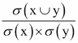

Apriori 是挖掘关联规则最著名的算法，它执行一种按层级的广度优先算法来计数候选项集。Apriori 的过程从按层级查找频繁项集（具有最小支持度的项集集合）开始。例如，过程从查找频繁的 1-项集开始。然后，过程继续使用频繁的 1-项集来查找频繁的 2-项集。过程迭代地从频繁的 k-项集中发现新的频繁 k+1-项集，直到没有找到频繁项集。

最后，过程利用频繁项集生成关联规则：

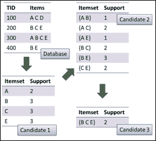

Apriori 算法示意图（其中支持度 = 2）

在这个菜谱中，我们使用 Apriori 算法在事务中查找关联规则。我们使用内置的 `Groceries` 数据集，它包含来自典型杂货店的现实世界一个月的销售额交易数据。然后，我们使用 `summary` 函数来获取 `Groceries` 数据集的摘要统计信息。摘要统计显示，数据集包含 9,835 笔交易，分为 169 个类别。此外，摘要还显示了数据集中的信息，例如最频繁的项、项集分布以及数据集中的示例扩展项信息。然后，我们可以使用 `itemFrequencyPlot` 来可视化支持率超过 0.1 的五个最频繁项。

接下来，我们应用 Apriori 算法来搜索支持度超过 0.001 且置信度超过 0.5 的规则。然后，我们使用 `summary` 函数来检查生成规则的详细信息。从输出摘要中，我们发现 Apriori 算法生成了 5,668 条支持度超过 0.001 且置信度超过 0.5 的规则。进一步，我们可以找到规则长度分布、质量度量摘要和挖掘信息。在质量度量摘要中，我们发现三个度量（支持度、置信度和提升度）的描述性统计。支持度是包含特定项集的交易比例。置信度是规则的正确百分比。提升度是响应目标关联规则除以平均响应。

要探索一些生成的规则，我们可以使用 `inspect` 函数来查看 5,668 条生成规则中的前六条规则。最后，我们可以根据置信度对规则进行排序，并列出置信度最高的规则。因此，我们发现与 `whole milk` 相关的 `rich sugar` 是置信度最高的规则，其支持度为 0.001220132，置信度为 1，提升度为 3.913649。

## 参考以下内容

对于对使用 `Groceries` 数据集的研究结果感兴趣的人，以及支持度、置信度和提升度测量是如何定义的，您可以参考以下论文：

+   Michael Hahsler，Kurt Hornik 和 Thomas Reutterer（2006）*概率数据建模对挖掘关联规则的影响*。*在 M. Spiliopoulou，R. Kruse，C. Borgelt，A* 中

+   Nuernberger 和 W. Gaul 编著，*从数据和信息分析到知识工程，分类研究，数据分析与知识组织，第 598-605 页*。*Springer-Verlag*

此外，除了使用 `summary` 和 `inspect` 函数来检查关联规则外，您还可以使用 `interestMeasure` 获取额外的兴趣度量：

```py
> head(interestMeasure(rules, c("support", "chiSquare", "confidence", "conviction","cosine", "coverage", "leverage", "lift","oddsRatio"), Groceries))

```

# 剪枝冗余规则

在生成的规则中，我们有时会发现重复或冗余的规则（例如，一条规则是另一条规则的超级规则或子集）。在这个菜谱中，我们将向您展示如何剪枝（或删除）重复或冗余的规则。

## 准备工作

在这个菜谱中，您必须通过生成规则并存储在变量 `rules` 中来完成前面的菜谱。

## 如何做...

执行以下步骤以剪枝冗余规则：

1.  首先，按照以下步骤查找冗余规则：

    ```py
    > rules.sorted = sort(rules, by="lift")
    > subset.matrix = is.subset(rules.sorted, rules.sorted)
    > subset.matrix[lower.tri(subset.matrix, diag=T)] = NA
    > redundant = colSums(subset.matrix, na.rm=T) >= 1

    ```

1.  然后，您可以移除冗余规则：

    ```py
    > rules.pruned = rules.sorted[!redundant]
    > inspect(head(rules.pruned))
     lhs                        rhs                  support confidence     lift
    1 {Instant food products, 
     soda}                  => {hamburger meat} 0.001220132  0.6315789 18.99565
    2 {soda, 
     popcorn}               => {salty snack}    0.001220132  0.6315789 16.69779
    3 {flour, 
     baking powder}         => {sugar}          0.001016777  0.5555556 16.40807
    4 {ham, 
     processed cheese}      => {white bread}    0.001931876  0.6333333 15.04549
    5 {whole milk, 
     Instant food products} => {hamburger meat} 0.001525165  0.5000000 15.03823
    6 {other vegetables, 
     curd, 
     yogurt, 
     whipped/sour cream}    => {cream cheese }  0.001016777  0.5882353 14.83409

    ```

## 它是如何工作的...

关联挖掘的两个主要约束是在支持度和置信度之间进行选择。例如，如果你使用高的支持度阈值，你可能会移除稀有的项目规则，而不考虑这些规则是否具有高的置信度值。另一方面，如果你选择使用低的支持度阈值，关联挖掘可能会产生大量的冗余关联规则，这使得这些规则难以利用和分析。因此，我们需要剪枝冗余规则，以便从这些生成的规则中找到有意义的信息。

在这个菜谱中，我们演示了如何剪枝冗余规则。首先，我们搜索冗余规则。我们根据提升度对规则进行排序，然后使用`is.subset`函数找到排序规则的子集，这将生成一个`itemMatrix`对象。然后，我们可以将矩阵的下三角设置为 NA。最后，我们计算生成的矩阵的`colSums`，其中`colSums >=1`表示该特定规则是冗余的。

在我们找到冗余规则后，我们可以从排序规则中剪除这些规则。最后，我们可以使用`inspect`函数检查剪枝规则。

## 参见

+   为了找到规则的子集或超集，你可以在关联规则上使用`is.superset`和`is.subset`函数。这两种方法可能会生成一个`itemMatrix`对象来显示哪个规则是其他规则的子集或超集。你可以参考`help`函数获取更多信息：

    ```py
    > help(is.superset)
    > help(is.subset)

    ```

# 关联规则的可视化

除了以文本形式列出规则外，你还可以可视化关联规则，这有助于找到项目集之间的关系。在下面的菜谱中，我们将介绍如何使用`aruleViz`包来可视化关联规则。

## 准备工作

在这个菜谱中，我们将继续使用`Groceries`数据集。你需要完成上一个菜谱，生成剪枝规则`rules.pruned`。

## 如何操作...

执行以下步骤以可视化关联规则：

1.  首先，你需要安装并加载`arulesViz`包：

    ```py
    > install.packages("arulesViz")
    > library(arulesViz)

    ```

1.  然后，你可以从剪枝规则中制作散点图：

    ```py
    > plot(rules.pruned)

    ```

    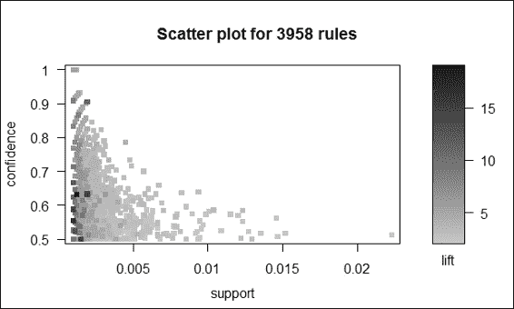

    剪枝关联规则的散点图

1.  此外，为了防止重叠，你可以在散点图中添加抖动：

    ```py
    > plot(rules.pruned, shading="order", control=list(jitter=6))

    ```

    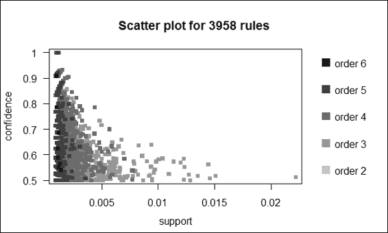

    关联规则剪枝散点图带有抖动

1.  然后，我们使用 Apriori 算法在左侧使用`soda`生成新规则：

    ```py
    > soda_rule=apriori(data=Groceries, parameter=list(supp=0.001,conf = 0.1, minlen=2), appearance = list(default="rhs",lhs="soda"))

    ```

1.  接下来，你可以在图形图中绘制`soda_rule`：

    ```py
    > plot(sort(soda_rule, by="lift"), method="graph", control=list(type="items"))

    ```

    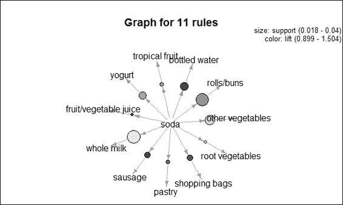

    关联规则的图形图

1.  此外，关联规则还可以在气球图中可视化：

    ```py
    > plot(soda_rule, method="grouped")

    ```

    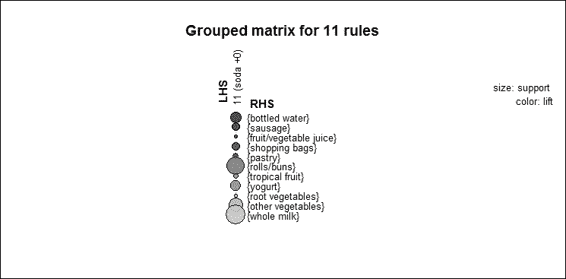

    关联规则的气球图

## 工作原理...

除了以文本形式呈现关联规则之外，还可以使用`arulesViz`来可视化关联规则。`arulesViz`是`arules`的扩展包，它提供了许多可视化技术来探索关联规则。要开始使用`arulesViz`，首先安装并加载`arulesViz`包。然后我们使用前一个菜谱中生成的剪枝规则制作散点图。根据步骤 2 中的图，我们发现规则在散点图中显示为点，x 轴表示支持度，y 轴表示置信度。颜色的深浅显示了规则的提升度；颜色越深，提升度越高。接下来，为了防止点重叠，我们可以在控制列表中包含 jitter 作为参数。添加了 jitter 的图在步骤 3 中的图中提供。

除了在散点图中绘制规则之外，`arulesViz`还允许您在图中和分组矩阵中绘制规则。我们不是在单个图中打印所有规则，而是选择使用`soda`在左侧生成新规则。然后我们使用提升排序规则，并在步骤 4 中的图中可视化规则。从图中可以看出，左侧的`soda`到右侧的`全脂牛奶`的规则具有最大的支持度，因为节点的大小最大。此外，该规则显示左侧的`soda`到右侧的`瓶装水`具有最大的提升度，因为圆圈的颜色最深。然后我们可以使用左侧带有`soda`的相同数据生成一个分组矩阵，这是一个在步骤 5 中的图中显示的气球图，左侧规则作为列标签，右侧作为行标签。类似于步骤 4 中的图中的图，步骤 5 中的图中的气球大小显示了规则的支持度，气球的颜色显示了规则的提升度。

## 另请参阅

+   在这个菜谱中，我们介绍了三种可视化方法来绘制关联规则。然而，`arulesViz`也提供了绘制平行坐标图、双层图、马赛克图和其他相关图表的功能。对于那些对如何实现这些图表感兴趣的人，您可以参考：Hahsler, M. 和 Chelluboina, S. (2011). *可视化关联规则：R 扩展包 arulesViz 的介绍。R 项目模块*。

+   除了生成静态图之外，您可以通过以下步骤通过将交互设置为 TRUE 来生成交互式图：

    ```py
    > plot(rules.pruned,interactive=TRUE)

    ```

    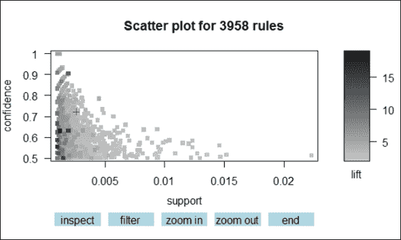

    交互式散点图

# 使用 Eclat 挖掘频繁项集

除了 Apriori 算法外，您还可以使用 Eclat 算法来生成频繁项集。由于 Apriori 算法执行广度优先搜索以扫描整个数据库，支持度计数相当耗时。如果数据库可以放入内存中，您可以使用 Eclat 算法，它执行深度优先搜索来计数支持度。因此，Eclat 算法比 Apriori 算法运行得更快。在这个食谱中，我们将介绍如何使用 Eclat 算法生成频繁项集。

## 准备工作

在这个食谱中，我们将继续使用数据集`Groceries`作为我们的输入数据源。

## 如何操作...

执行以下步骤以使用 Eclat 算法生成频繁项集：

1.  与 Apriori 方法类似，我们可以使用`eclat`函数来生成频繁项集：

    ```py
    > frequentsets=eclat(Groceries,parameter=list(support=0.05,maxlen=10))

    ```

1.  然后，我们可以从生成的频繁项集中获取汇总信息：

    ```py
    > summary(frequentsets)
    set of 31 itemsets

    most frequent items:
     whole milk other vegetables           yogurt 
     4                2                2 
     rolls/buns      frankfurter          (Other) 
     2                1               23 

    element (itemset/transaction) length distribution:sizes
     1  2 
    28  3 

     Min. 1st Qu.  Median    Mean 3rd Qu.    Max. 
     1.000   1.000   1.000   1.097   1.000   2.000 

    summary of quality measures:
     support 
     Min.   :0.05236 
     1st Qu.:0.05831 
     Median :0.07565 
     Mean   :0.09212 
     3rd Qu.:0.10173 
     Max.   :0.25552 

    includes transaction ID lists: FALSE 

    mining info:
     data ntransactions support
     Groceries          9835    0.05

    ```

1.  最后，我们可以检查前十个支持度最高的频繁项集：

    ```py
    > inspect(sort(frequentsets,by="support")[1:10])
     items                 support
    1  {whole milk}       0.25551601
    2  {other vegetables} 0.19349263
    3  {rolls/buns}       0.18393493
    4  {soda}             0.17437722
    5  {yogurt}           0.13950178
    6  {bottled water}    0.11052364
    7  {root vegetables}  0.10899847
    8  {tropical fruit}   0.10493137
    9  {shopping bags}    0.09852567
    10 {sausage}          0.09395018

    ```

## 工作原理...

在这个食谱中，我们介绍另一个算法，Eclat，用于执行频繁项集生成。尽管 Apriori 是一种简单易懂的关联挖掘方法，但该算法的缺点是生成巨大的候选集，在支持度计数方面效率低下，因为它需要多次扫描数据库。相比之下，Eclat 使用等价类、深度优先搜索和集合交集，这大大提高了支持度计数的速度。

在 Apriori 算法中，算法使用水平数据布局来存储事务。另一方面，Eclat 使用垂直数据布局来存储每个项目的交易 ID 列表（`tid`）。然后，Eclat 通过交集两个 k-item 集的 tid 列表来确定任何 k+1-item 集的支持度。最后，Eclat 利用频繁项集来生成关联规则：

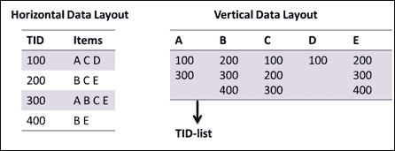

Eclat 算法的说明

与使用 Apriori 算法的食谱类似，我们可以使用`eclat`函数来生成具有给定支持度（本例中假设支持度为 2）和最大长度的频繁项集。

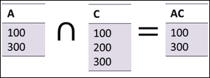

生成频繁项集

然后，我们可以使用`summary`函数来获取汇总统计信息，包括：最频繁的项目、项集长度分布、质量度量摘要和挖掘信息。最后，我们可以按支持度对频繁项集进行排序，并检查前十个支持度最高的频繁项集。

## 相关内容

+   除了 Apriori 和 Eclat，另一个流行的关联挖掘算法是**FP-Growth**。与 Eclat 类似，它也采用深度优先搜索来计数支持度。然而，目前没有可以从 CRAN 下载的 R 包包含此算法。但是，如果您对在事务数据集中应用 FP-growth 算法感兴趣，您可以参考 Christian Borgelt 的页面[`www.borgelt.net/fpgrowth.html`](http://www.borgelt.net/fpgrowth.html)以获取更多信息。

# 创建带有时间信息的交易

除了在事务数据库中挖掘有趣的关联之外，我们还可以使用带有时间信息的交易挖掘有趣的序列模式。在下面的菜谱中，我们展示了如何创建带有时间信息的交易。

## 准备工作

在这个菜谱中，我们将生成带有时间信息的交易。我们可以使用生成的交易作为频繁序列模式挖掘的输入源。

## 如何操作...

执行以下步骤以创建带有时间信息的交易：

1.  首先，你需要安装并加载包`arulesSequences`：

    ```py
    > install.packages("arulesSequences")
    > library(arulesSequences)

    ```

1.  你可以先创建一个包含购买记录的列表：

    ```py
    > tmp_data=list(c("A"),
    +                c("A","B","C"),
    +                c("A","C"),
    +                c("D"),
    +                c("C","F"),
    +                c("A","D"),
    +                c("C"),
    +                c("B","C"),
    +                c("A","E"),
    +                c("E","F"),
    +                c("A","B"),
    +                c("D","F"),
    +                c("C"),
    +                c("B"),
    +                c("E"),
    +                c("G"),
    +                c("A","F"),
    +                c("C"),
    +                c("B"),
    +                c("C"))

    ```

1.  然后，你可以将列表转换为交易并添加时间信息：

    ```py
    >names(tmp_data) = paste("Tr",c(1:20), sep = "")
    >trans =  as(tmp_data,"transactions")
    >transactionInfo(trans)$sequenceID=c(1,1,1,1,1,2,2,2,2,3,3,3,3,3,4,4,4,4,4,4)
    >transactionInfo(trans)$eventID=c(10,20,30,40,50,10,20,30,40,10,20,30,40,50,10,20,30,40,50,60)
    > trans
    transactions in sparse format with
     20 transactions (rows) and
     7 items (columns)

    ```

1.  接下来，你可以使用`inspect`函数来检查交易：

    ```py
    > inspect(head(trans))
     items transactionID sequenceID eventID
    1 {A}             Tr1          1      10
    2 {A, 
     B, 
     C}             Tr2          1      20
    3 {A, 
     C}             Tr3          1      30
    4 {D}             Tr4          1      40
    5 {C, 
     F}             Tr5          1      50
    6 {A, 
     D}             Tr6          2      10

    ```

1.  然后，你可以获取带有时间信息的交易的摘要信息：

    ```py
    > summary(trans)
    transactions as itemMatrix in sparse format with
     20 rows (elements/itemsets/transactions) and
     7 columns (items) and a density of 0.2214286 

    most frequent items:
     C       A       B       F       D (Other) 
     8       7       5       4       3       4 

    element (itemset/transaction) length distribution:
    sizes
     1  2  3 
    10  9  1 

     Min. 1st Qu.  Median    Mean 3rd Qu.    Max. 
     1.00    1.00    1.50    1.55    2.00    3.00 

    includes extended item information - examples:
     labels
    1      A
    2      B
    3      C

    includes extended transaction information - examples:
     transactionID sequenceID eventID
    1           Tr1          1      10
    2           Tr2          1      20
    3           Tr3          1      30

    ```

1.  你也可以以篮子格式读取事务数据：

    ```py
    > zaki=read_baskets(con = system.file("misc", "zaki.txt", package = "arulesSequences"), info = c("sequenceID","eventID","SIZE"))
    > as(zaki, "data.frame")
     transactionID.sequenceID transactionID.eventID transactionID.SIZE     items
    1                         1                    10                  2     {C,D}
    2                         1                    15                  3   {A,B,C}
    3                         1                    20                  3   {A,B,F}
    4                         1                    25                  4 {A,C,D,F}
    5                         2                    15                  3   {A,B,F}
    6                         2                    20                  1       {E}
    7                         3                    10                  3   {A,B,F}
    8                         4                    10                  3   {D,G,H}
    9                         4                    20                  2     {B,F}
    10                        4                    25                  3   {A,G,H}

    ```

## 工作原理...

在挖掘频繁序列模式之前，你必须创建带有时间信息的事务。在这个菜谱中，我们介绍了两种获取带有时间信息的事务的方法。在第一种方法中，我们创建一个事务列表，并为每个事务分配一个事务 ID。我们使用`as`函数将列表数据转换为事务数据集。然后我们添加`eventID`和`sequenceID`作为时间信息；`sequenceID`是事件所属的序列，`eventID`表示事件发生的时间。在生成带有时间信息的交易后，可以使用这个数据集进行频繁序列模式挖掘。

除了创建自己的带有时间信息的交易之外，如果你已经有一个存储在文本文件中的数据，你可以使用`arulesSequences`中的`read_basket`函数将事务数据读取到篮子格式。我们还可以读取事务数据集以进行进一步的频繁序列模式挖掘。

## 相关内容

+   `arulesSequences`函数提供了两个额外的数据结构，`sequences`和`timedsequences`，用于表示纯序列数据和带时间信息的序列数据。对于对这些两个集合感兴趣的人，请使用帮助函数查看以下文档：

    ```py
    > help("sequences-class")
    > help("timedsequences-class")

    ```

# 使用 cSPADE 挖掘频繁序列模式

与仅发现项集之间关系的关联挖掘不同，我们可能对探索在一系列项集按顺序发生的事务中共享的模式感兴趣。

最著名的频繁序列模式挖掘算法之一是**使用等价类的序列模式发现**（**SPADE**）算法，该算法利用垂直数据库的特性在 ID 列表上执行高效格搜索，并允许我们对挖掘的序列施加约束。在本食谱中，我们将演示如何使用 cSPADE 来挖掘频繁序列模式。

## 准备工作

在本食谱中，您必须通过生成带有时间信息的交易并存储在变量`trans`中来完成前面的食谱。

## 如何操作...

执行以下步骤以挖掘频繁序列模式：

1.  首先，您可以使用`cspade`函数生成频繁序列模式：

    ```py
    > s_result=cspade(trans,parameter = list(support = 0.75),control = list(verbose = TRUE))

    ```

1.  然后，您可以检查频繁序列模式的摘要：

    ```py
    > summary(s_result)
    set of 14 sequences with

    most frequent items:
     C       A       B       D       E (Other) 
     8       5       5       2       1       1 

    most frequent elements:
     {C}     {A}     {B}     {D}     {E} (Other) 
     8       5       5       2       1       1 

    element (sequence) size distribution:
    sizes
    1 2 3 
    6 6 2 

    sequence length distribution:
    lengths
    1 2 3 
    6 6 2 

    summary of quality measures:
     support 
     Min.   :0.7500 
     1st Qu.:0.7500 
     Median :0.7500 
     Mean   :0.8393 
     3rd Qu.:1.0000 
     Max.   :1.0000 

    includes transaction ID lists: FALSE 

    mining info:
     data ntransactions nsequences support
     trans            20          4    0.75

    ```

1.  将生成的序列格式数据转换回数据框：

    ```py
    > as(s_result, "data.frame")
     sequence support
    1          <{A}>    1.00
    2          <{B}>    1.00
    3          <{C}>    1.00
    4          <{D}>    0.75
    5          <{E}>    0.75
    6          <{F}>    0.75
    7      <{A},{C}>    1.00
    8      <{B},{C}>    0.75
    9      <{C},{C}>    0.75
    10     <{D},{C}>    0.75
    11 <{A},{C},{C}>    0.75
    12     <{A},{B}>    1.00
    13     <{C},{B}>    0.75
    14 <{A},{C},{B}>    0.75

    ```

## 它是如何工作的...

序列模式挖掘的目标是在事务中发现序列关系或模式。您可以使用模式挖掘结果来预测未来事件，或向用户推荐项目。

序列模式挖掘的一种流行方法是 SPADE。SPADE 使用垂直数据布局来存储 ID 列表。在这些列表中，数据库中的每个输入序列被称为 SID，给定输入序列中的每个事件被称为 EID。SPADE 的过程是通过按层次生成 Apriori 候选来进行的。具体来说，SPADE 通过从 ID 列表的交集生成(n-1)-序列来生成后续的 n-序列。如果序列的数量大于**最小支持度**（**minsup**），我们可以认为序列足够频繁。算法停止，直到无法找到更多频繁序列为止：

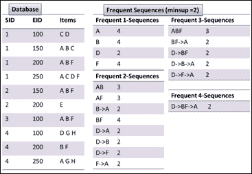

SPADE 算法的说明

在本食谱中，我们说明了如何使用频繁序列模式挖掘算法 cSPADE 来挖掘频繁序列模式。首先，由于我们已经将带有时间信息的交易加载到变量`trans`中，我们可以使用`cspade`函数，支持度超过 0.75，以`sequences`格式生成频繁序列模式。然后我们可以获取总结信息，例如最频繁的项目、序列大小分布、质量度量摘要和挖掘信息。最后，我们可以将生成的`sequence`信息转换回数据框格式，这样我们就可以检查支持度超过 0.75 的频繁序列模式的序列和支持度。

## 参考内容

+   如果您对 SPADE 算法的概念和设计感兴趣，您可以参考原始发表的论文：M. J. Zaki. (2001). *SPADE: An Efficient Algorithm for Mining Frequent Sequences. Machine Learning Journal*, 42, 31–60。
