# 第十一章. 降维

在本章中，我们将涵盖以下主题：

+   使用 FSelector 进行特征选择

+   使用 PCA 进行降维

+   使用 scree 测试确定主成分的数量

+   使用 Kaiser 方法确定主成分的数量

+   使用双图可视化多元数据

+   使用 MDS 进行降维

+   使用奇异值分解（SVD）降维

+   使用 SVD 压缩图像

+   使用 ISOMAP 进行非线性降维

+   使用局部线性嵌入进行非线性降维

# 简介

大多数数据集都包含高度冗余的特征（如属性或变量）。为了去除无关和冗余的数据，以降低计算成本并避免过拟合，你可以将特征减少到较小的子集，而不会造成信息损失。减少特征的数学过程称为降维。

特征的减少可以提高数据处理效率。因此，降维在模式识别、文本检索和机器学习等领域得到广泛应用。降维可以分为两个部分：特征提取和特征选择。特征提取是一种使用低维空间来表示高维空间中数据的技巧。特征选择用于找到原始变量的子集。

特征选择的目的是选择一组相关特征来构建模型。特征选择的技术可以分为特征排名和特征选择。特征排名根据一定标准对特征进行排名，然后选择超过定义阈值的特征。另一方面，特征选择从特征子集空间中搜索最优子集。

在特征提取中，问题可以分为线性或非线性。线性方法搜索一个最佳解释数据分布变化的仿射空间。相比之下，非线性方法对于分布在高度非线性曲面上数据的处理是一个更好的选择。在此，我们列出一些常见的线性和非线性方法。

这里有一些常见的线性方法：

+   **PCA**：主成分分析将数据映射到低维空间，使得低维表示中的数据方差最大化。

+   **MDS**：多维尺度分析是一种方法，它允许你可视化对象之间的接近程度（模式邻近性），并且可以使用低维空间表示你的数据。如果 MDS 中使用的距离测量等于数据的协方差，则 PCA 可以被视为 MDS 的最简单形式。

+   **SVD**：奇异值分解从线性代数的角度移除了线性相关的冗余特征。PCA 也可以被视为 SVD 的特例。

这里有一些常见的非线性方法：

+   **ISOMAP**：ISOMAP 可以看作是多维尺度分析（MDS）的扩展，它使用测地距离的距离度量。在此方法中，测地距离是通过绘制最短路径距离来计算的。

+   **LLE**：局部线性嵌入（Locally linear embedding）执行局部 PCA 和全局特征分解。LLE 是一种局部方法，它涉及为每个类特征类别选择特征。相比之下，ISOMAP 是一种全局方法，它涉及为所有特征选择特征。

在本章中，我们将首先讨论如何进行特征排名和选择。接下来，我们将聚焦于特征提取的主题，并涵盖使用线性和非线性方法进行降维的食谱。对于线性方法，我们将介绍如何执行主成分分析（PCA），确定主成分的数量及其可视化。然后，我们将继续介绍多维尺度分析（MDS）和奇异值分解（SVD）。此外，我们将介绍 SVD 在图像压缩中的应用。对于非线性方法，我们将介绍如何使用 ISOMAP 和 LLE 进行降维。

# 使用 FSelector 进行特征选择

`FSelector`包提供了两种从原始特征集中选择最具影响力的特征的方法。首先，根据某些标准对特征进行排名，并选择那些高于定义阈值的特征。其次，从一个特征子集的空间中搜索最佳特征子集。在本食谱中，我们将介绍如何使用`FSelector`包进行特征选择。

## 准备工作

在这个食谱中，我们将继续使用电信`churn`数据集作为输入数据源来训练支持向量机。对于那些尚未准备数据集的人，请参阅第五章, *分类（I） – 树、懒惰和概率*，以获取详细信息。

## 如何操作...

执行以下步骤以在`churn`数据集上执行特征选择：

1.  首先，安装并加载包，`FSelector`：

    ```py
    > install.packages("FSelector")
    > library(FSelector)

    ```

1.  然后，我们可以使用`random.forest.importance`计算每个属性的权重，我们将重要性类型设置为 1：

    ```py
    > weights = random.forest.importance(churn~., trainset, importance.type = 1)
    > print(weights)
     attr_importance
    international_plan                 96.3255882
    voice_mail_plan                    24.8921239
    number_vmail_messages              31.5420332
    total_day_minutes                  51.9365357
    total_day_calls                    -0.1766420
    total_day_charge                   53.7930096
    total_eve_minutes                  33.2006078
    total_eve_calls                    -2.2270323
    total_eve_charge                   32.4317375
    total_night_minutes                22.0888120
    total_night_calls                   0.3407087
    total_night_charge                 21.6368855
    total_intl_minutes                 32.4984413
    total_intl_calls                   51.1154046
    total_intl_charge                  32.4855194
    number_customer_service_calls     114.2566676

    ```

1.  接下来，我们可以使用`cutoff`函数获取前五个权重的属性：

    ```py
    > subset = cutoff.k(weights, 5)
    > f = as.simple.formula(subset, "Class")
    > print(f)
    Class ~ number_customer_service_calls + international_plan + 
     total_day_charge + total_day_minutes + total_intl_calls
    <environment: 0x00000000269a28e8>

    ```

1.  接下来，我们可以创建一个评估器来选择特征子集：

    ```py
    > evaluator = function(subset) {
    +   k = 5 
    +   set.seed(2)
    +   ind = sample(5, nrow(trainset), replace = TRUE)
    +   results = sapply(1:k, function(i) {
    +     train = trainset[ind ==i,]
    +     test  = trainset[ind !=i,]
    +     tree  = rpart(as.simple.formula(subset, "churn"), trainset)
    +     error.rate = sum(test$churn != predict(tree, test, type="class")) / nrow(test)
    +     return(1 - error.rate)
    +   })
    +   return(mean(results))
    + }

    ```

1.  最后，我们可以使用爬山搜索找到最佳特征子集：

    ```py
    > attr.subset = hill.climbing.search(names(trainset)[!names(trainset) %in% "churn"], evaluator)
    > f = as.simple.formula(attr.subset, "churn")
    > print(f)
    churn ~ international_plan + voice_mail_plan + number_vmail_messages + 
     total_day_minutes + total_day_calls + total_eve_minutes + 
     total_eve_charge + total_intl_minutes + total_intl_calls + 
     total_intl_charge + number_customer_service_calls
    <environment: 0x000000002224d3d0>

    ```

## 工作原理...

在这个示例中，我们展示了如何使用`FSelector`包来选择最有影响力的特征。我们首先演示了如何使用特征排名方法。在特征排名方法中，算法首先使用一个权重函数为每个特征生成权重。在这里，我们使用随机森林算法，以平均准确度下降（其中`importance.type = 1`）作为重要性度量来获取每个属性的权重。除了随机森林算法之外，您还可以从`FSelector`包中选择其他特征排名算法（例如，`chi.squared`，`information.gain`）。然后，该过程按权重对属性进行排序。最后，我们可以使用`cutoff`函数从排序的特征列表中获得前五个特征。在这种情况下，`number_customer_service_calls`，`international_plan`，`total_day_charge`，`total_day_minutes`和`total_intl_calls`是五个最重要的特征。

接下来，我们将说明如何搜索最佳特征子集。首先，我们需要创建一个五折交叉验证函数来评估特征子集的重要性。然后，我们使用爬山搜索算法从原始特征集中找到最佳特征子集。除了爬山法之外，您还可以从`FSelector`包中选择其他特征选择算法（例如，`forward.search`）。最后，我们可以发现`international_plan + voice_mail_plan + number_vmail_messages + total_day_minutes + total_day_calls + total_eve_minutes + total_eve_charge + total_intl_minutes + total_intl_calls + total_intl_charge + number_customer_service_calls`是最佳特征子集。

## 参考内容

+   您也可以使用`caret`包来进行特征选择。正如我们在模型评估章节中讨论了相关食谱，您可以参考第七章，*模型评估*，以获取更详细的信息。

+   对于特征排名和最佳特征选择，您可以探索`FSelector`包以获取更多相关函数：

    ```py
    > help(package="FSelector")

    ```

# 使用 PCA 进行降维

**主成分分析**（**PCA**）是处理降维问题中最广泛使用的线性方法。当数据包含许多特征，并且这些特征之间存在冗余（相关性）时，它非常有用。为了去除冗余特征，PCA 通过将特征减少到更少的、解释原始特征大部分方差的主成分，将高维数据映射到低维。在这个示例中，我们将介绍如何使用 PCA 方法进行降维。

## 准备工作

在这个示例中，我们将使用`swiss`数据集作为我们的目标来执行 PCA。`swiss`数据集包括来自瑞士 47 个法语省份大约 1888 年的标准化生育指标和社会经济指标。

## 如何操作...

执行以下步骤以对`swiss`数据集进行主成分分析：

1.  首先，加载`swiss`数据集：

    ```py
    > data(swiss)

    ```

1.  排除`swiss`数据的第一列：

    ```py
    > swiss = swiss[,-1]

    ```

1.  然后，你可以对`swiss`数据进行主成分分析：

    ```py
    > swiss.pca = prcomp(swiss,
    + center = TRUE,
    + scale  = TRUE)
    > swiss.pca
    Standard deviations:
    [1] 1.6228065 1.0354873 0.9033447 0.5592765 0.4067472

    Rotation:
     PC1         PC2          PC3        PC4         PC5
    Agriculture      0.52396452 -0.25834215  0.003003672 -0.8090741  0.06411415
    Examination  -0.57185792 -0.01145981 -0.039840522 -0.4224580 -0.70198942
    Education       -0.49150243  0.19028476  0.539337412 -0.3321615  0.56656945
    Catholic            0.38530580  0.36956307  0.725888143 0.1007965 -0.42176895
    Infant.Mortality 0.09167606 0.87197641 -0.424976789 -0.2154928 0.06488642

    ```

1.  从 PCA 结果中获取摘要：

    ```py
    > summary(swiss.pca)
    Importance of components:
     PC1    PC2    PC3     PC4     PC5
    Standard deviation     1.6228 1.0355 0.9033 0.55928 0.40675
    Proportion of Variance 0.5267 0.2145 0.1632 0.06256 0.03309
    Cumulative Proportion  0.5267 0.7411 0.9043 0.96691 1.00000

    ```

1.  最后，你可以使用`predict`函数输出数据第一行的主成分值：

    ```py
    > predict(swiss.pca, newdata=head(swiss, 1))
     PC1       PC2        PC3      PC4       PC5
    Courtelary -0.9390479 0.8047122 -0.8118681 1.000307 0.4618643

    ```

## 它是如何工作的...

由于特征选择方法可能会移除一些相关但具有信息量的特征，你必须考虑使用特征提取方法将这些相关特征组合成一个单一的特征。PCA 是特征提取方法之一，它通过正交变换将可能相关的变量转换为主成分。此外，你可以使用这些主成分来识别方差的方向。

PCA 的过程通过以下步骤进行：首先，找到均值向量，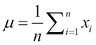，其中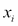表示数据点，*n*表示点的数量。其次，通过方程计算协方差矩阵，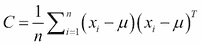。第三，计算特征向量，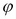，以及相应的特征值。在第四步，我们按顺序选择前*k*个特征向量。在第五步，我们构建一个*d x k*维的特征向量矩阵，U。在这里，*d*是原始维度的数量，*k*是特征向量的数量。最后，我们可以在方程中变换数据样本到新的子空间，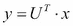。

在以下图中，说明了我们可以使用两个主成分，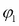和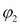，将数据点从二维空间转换到新的二维子空间：

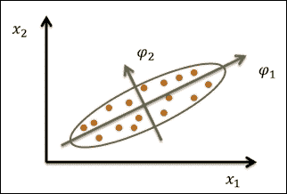

PCA 的一个示例说明

在这个菜谱中，我们使用`stats`包中的`prcomp`函数对`swiss`数据集进行 PCA。首先，我们移除标准化的生育率指标，并将剩余的预测变量作为输入传递给函数`prcomp`。此外，我们将`swiss`作为输入数据集；变量应通过指定`center=TRUE`移至零中心；通过选项`scale=TRUE`将变量缩放到单位方差，并将输出存储在变量`swiss.pca`中。

然后，当我们打印出存储在 `swiss.pca` 中的值时，我们可以找到主成分的标准差和旋转。标准差表示协方差/相关矩阵的特征值的平方根。另一方面，主成分的旋转显示了输入特征的线性组合的系数。例如，PC1 等于 *Agriculture * 0.524 + Examination * -0.572 + Education * -0.492 + Catholic* 0.385 + Infant.Mortality * 0.092*。在这里，我们可以发现属性 *Agriculture* 对 PC1 的贡献最大，因为它具有最高的系数。

此外，我们可以使用 `summary` 函数获取成分的重要性。第一行显示每个主成分的标准差，第二行显示每个成分解释的方差比例，第三行显示解释的方差累积比例。最后，你可以使用 `predict` 函数从输入特征中获取主成分。在这里，我们输入数据集的第一行，并检索五个主成分。

## 还有更多...

另一个主成分分析函数是 `princomp`。在这个函数中，计算是通过在相关或协方差矩阵上使用特征值而不是 `prcomp` 函数中使用的单一值分解来进行的。在一般实践中，使用 `prcomp` 是首选的；然而，我们在这里介绍了如何使用 `princomp`：

1.  首先，使用 `princomp` 执行主成分分析（PCA）：

    ```py
    > swiss.princomp = princomp(swiss,
    + center = TRUE,
    + scale  = TRUE)
    > swiss.princomp
    Call:
    princomp(x = swiss, center = TRUE, scale = TRUE)

    Standard deviations:
     Comp.1    Comp.2    Comp.3    Comp.4    Comp.5 
    42.896335 21.201887  7.587978  3.687888  2.721105 

     5 variables and 47 observations.

    ```

1.  然后，你可以获取摘要信息：

    ```py
    > summary(swiss.princomp)
    Importance of components:
     Comp.1     Comp.2     Comp.3      Comp.4      Comp.5
    Standard deviation     42.8963346 21.2018868 7.58797830 3.687888330 2.721104713
    Proportion of Variance  0.7770024  0.1898152 0.02431275 0.005742983 0.003126601
    Cumulative Proportion   0.7770024  0.9668177 0.99113042 0.996873399 1.000000000

    ```

1.  你可以使用 `predict` 函数从输入特征中获取主成分：

    ```py
    > predict(swiss.princomp, swiss[1,])
     Comp.1    Comp.2   Comp.3   Comp.4   Comp.5
    Courtelary -38.95923 -20.40504 12.45808 4.713234 -1.46634

    ```

除了 `stats` 包中的 `prcomp` 和 `princomp` 函数外，你还可以使用 `psych` 包中的 `principal` 函数：

1.  首先，安装并加载 `psych` 包：

    ```py
    > install.packages("psych")
    > install.packages("GPArotation")
    > library(psych)

    ```

1.  然后，你可以使用 `principal` 函数检索主成分：

    ```py
    > swiss.principal = principal(swiss, nfactors=5, rotate="none")
    > swiss.principal
    Principal Components Analysis
    Call: principal(r = swiss, nfactors = 5, rotate = "none")
    Standardized loadings (pattern matrix) based upon correlation matrix
     PC1   PC2   PC3   PC4   PC5 h2       u2
    Agriculture      -0.85 -0.27  0.00  0.45 -0.03  1 -6.7e-16
    Examination       0.93 -0.01 -0.04  0.24  0.29  1  4.4e-16
    Education         0.80  0.20  0.49  0.19 -0.23  1  2.2e-16
    Catholic         -0.63  0.38  0.66 -0.06  0.17  1 -2.2e-16
    Infant.Mortality -0.15  0.90 -0.38  0.12 -0.03  1 -8.9e-16

     PC1  PC2  PC3  PC4  PC5
    SS loadings           2.63 1.07 0.82 0.31 0.17
    Proportion Var        0.53 0.21 0.16 0.06 0.03
    Cumulative Var        0.53 0.74 0.90 0.97 1.00
    Proportion Explained  0.53 0.21 0.16 0.06 0.03
    Cumulative Proportion 0.53 0.74 0.90 0.97 1.00

    Test of the hypothesis that 5 components are sufficient.

    The degrees of freedom for the null model are 10 and the objective function was 2.13
    The degrees of freedom for the model are -5  and the objective function was  0 
    The total number of observations was  47  with MLE Chi Square =  0  with prob <  NA 

    Fit based upon off diagonal values = 1

    ```

# 使用斯皮尔曼测试确定主成分的数量

由于我们只需要保留解释原始特征大部分方差的主成分，我们可以使用凯撒方法、斯皮尔曼测试或解释的方差百分比作为选择标准。斯皮尔曼测试的主要目的是将成分分析结果以斯皮尔曼图的形式绘制出来，并找到斜率（肘部）发生明显变化的位置。在这个菜谱中，我们将演示如何使用斯皮尔曼图确定主成分的数量。

## 准备工作

确保你已经完成了前面的菜谱，通过生成主成分对象并将其保存在变量 `swiss.pca` 中。

## 如何操作...

执行以下步骤以使用斯皮尔曼图确定主成分的数量：

1.  首先，你可以使用 `screeplot` 生成条形图：

    ```py
    > screeplot(swiss.pca, type="barplot")

    ```

    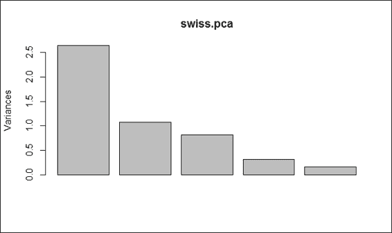

    以条形图形式展示的斯皮尔曼图

1.  你也可以使用 `screeplot` 生成线形图：

    ```py
    > screeplot(swiss.pca, type="line")

    ```

    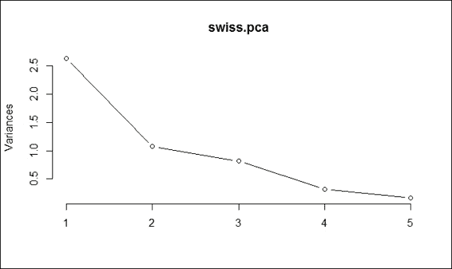

    以线形图形式展示的斯皮尔曼图

## 工作原理...

在本菜谱中，我们展示了如何使用碎石图来确定主成分的数量。在碎石图中，有两种类型的图形，即柱状图和线形图。正如生成的碎石图所揭示的，斜率（所谓的拐点或膝部）的明显变化发生在第 2 个成分处。因此，我们应该保留第 1 个成分，在第 2 个成分之前，该成分处于陡峭的曲线，这是平坦线趋势开始的地方。然而，由于这种方法可能存在歧义，您可以使用其他方法（如凯撒方法）来确定成分的数量。

## 更多内容...

默认情况下，如果您在生成的主成分对象上使用`plot`函数，您也可以检索碎石图。有关`screeplot`的更多详细信息，请参阅以下文档：

```py
> help(screeplot)

```

您还可以使用`nfactors`进行并行分析和 Cattell 碎石测试的非图形解决方案：

```py
> install.packages("nFactors")
> library(nFactors)
> ev = eigen(cor(swiss))
> ap = parallel(subject=nrow(swiss),var=ncol(swiss),rep=100,cent=.05)
> nS = nScree(x=ev$values, aparallel=ap$eigen$qevpea)
> plotnScree(nS)

```

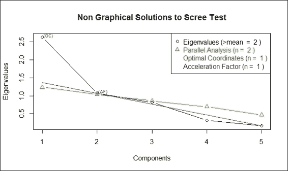

碎石测试的非图形解决方案

# 使用凯撒方法确定主成分的数量

除了碎石测试外，您还可以使用凯撒方法来确定主成分的数量。在此方法中，选择标准是保留大于`1`的特征值。在本菜谱中，我们将展示如何使用凯撒方法确定主成分的数量。

## 准备工作

确保您已经完成了前面的菜谱，通过生成主成分对象并将其保存在变量`swiss.pca`中。

## 如何操作...

按照以下步骤使用凯撒方法确定主成分的数量：

1.  首先，您可以从`swiss.pca`中获取标准差：

    ```py
    > swiss.pca$sdev 
    [1] 1.6228065 1.0354873 0.9033447 0.5592765 0.4067472

    ```

1.  接着，您可以从`swiss.pca`中获取方差：

    ```py
    > swiss.pca$sdev ^ 2
    [1] 2.6335008 1.0722340 0.8160316 0.3127902 0.1654433

    ```

1.  选择方差大于 1 的成分：

    ```py
    > which(swiss.pca$sdev ^ 2> 1)
    [1] 1 2

    ```

1.  您还可以使用碎石图来选择方差大于 1 的成分：

    ```py
    > screeplot(swiss.pca, type="line")
    > abline(h=1, col="red", lty= 3)

    ```

    

    选择方差大于 1 的成分

## 工作原理...

您还可以使用凯撒方法来确定成分的数量。由于计算出的主成分对象包含每个成分的标准差，我们可以将方差计算为标准差，即方差的平方根。从计算出的方差中，我们发现第 1 个和第 2 个成分的方差都大于 1。因此，我们可以确定主成分的数量为 2（第 1 个和第 2 个成分）。此外，我们可以在碎石图上画一条红线（如图所示）来表示在这种情况下我们需要保留第 1 个和第 2 个成分。

## 参考资料也

为了确定要保留哪些主成分，请参考以下内容：

+   Ledesma, R. D. 和 Valero-Mora, P. (2007). *在 EFA 中确定要保留的因素数量：一个用于执行并行分析的易于使用的计算机程序*. *实用评估、研究和评估*, 12(2), 1-11.

# 使用双图可视化多元数据

为了找出数据变量如何映射到主成分上，您可以使用`biplot`，它将数据以及原始特征在第一两个成分上的投影绘制出来。在这个菜谱中，我们将演示如何使用`biplot`在同一张图上绘制变量和数据。

## 准备工作

确保您已经完成了之前的菜谱，通过生成主成分对象并将其保存在变量`swiss.pca`中。

## 如何操作...

执行以下步骤以创建 biplot：

1.  您可以使用成分 1 和 2 创建散点图：

    ```py
    >  plot(swiss.pca$x[,1], swiss.pca$x[,2], xlim=c(-4,4))
    > text(swiss.pca$x[,1], swiss.pca$x[,2], rownames(swiss.pca$x), cex=0.7, pos=4, col="red")

    ```

    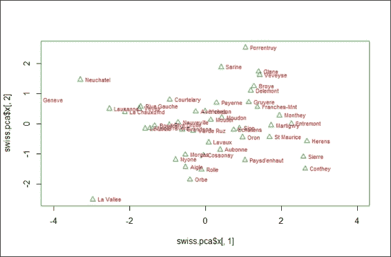

    PCA 结果的前两个成分的散点图

1.  如果您想在图上添加特征，您可以使用生成的主成分对象创建 biplot：

    ```py
    > biplot(swiss.pca)

    ```

    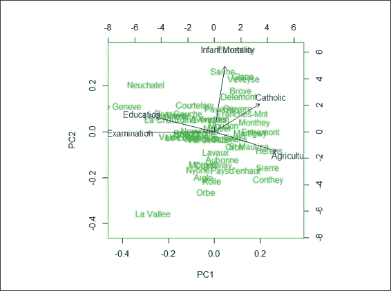

    使用 PCA 结果的 biplot

## 工作原理...

在这个菜谱中，我们演示了如何使用`biplot`绘制数据和原始特征在第一两个成分上的投影。在第一步中，我们演示了实际上我们可以使用前两个成分来创建散点图。此外，如果您想在同一张图上添加变量，您可以使用`biplot`。在`biplot`中，您可以看到在农业变量中指标较高的省份，在教育变量中指标较低的省份，以及在 PC1 中得分较高的考试变量。另一方面，婴儿死亡率指标较高且农业指标较低的省份在 PC2 中得分较高。

## 还有更多...

除了`stats`包中的`biplot`，您还可以使用`ggbiplot`。但是，您可能无法从 CRAN 找到这个包；您必须首先安装`devtools`，然后从 GitHub 安装`ggbiplot`：

```py
> install.packages("devtools")

> library(ggbiplot)
> g = ggbiplot(swiss.pca, obs.scale = 1, var.scale = 1, 
+ ellipse = TRUE, 
+ circle = TRUE)
> print(g)

```

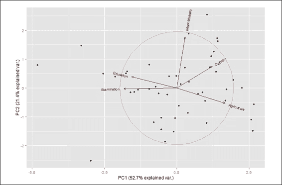

使用 PCA 结果的 ggbiplot

# 使用 MDS 进行降维

**多维尺度分析**（**MDS**）是一种创建多个对象相似性或差异性（距离）的视觉表示的技术。*多*前缀表示可以在一维、二维或更多维度中创建一个表示图。然而，我们最常使用 MDS 来展示一维或二维数据点之间的距离。

在 MDS 中，您可以使用度量或非度量解决方案。两种解决方案之间的主要区别在于，度量解决方案试图重现原始度量，而非度量解决方案假设距离的排名是已知的。在这个菜谱中，我们将说明如何在`swiss`数据集上执行 MDS。

## 准备工作

在这个菜谱中，我们将继续使用`swiss`数据集作为我们的输入数据源。

## 如何操作...

执行以下步骤以使用度量方法执行多维尺度分析：

1.  首先，您可以使用最多两个维度执行度量 MDS：

    ```py
    > swiss.dist =dist(swiss)
    > swiss.mds = cmdscale(swiss.dist, k=2)

    ```

1.  然后，您可以将`swiss`数据绘制在二维散点图中：

    ```py
    > plot(swiss.mds[,1], swiss.mds[,2], type = "n", main = "cmdscale (stats)")
    > text(swiss.mds[,1], swiss.mds[,2], rownames(swiss), cex = 0.9, xpd = TRUE)

    ```

    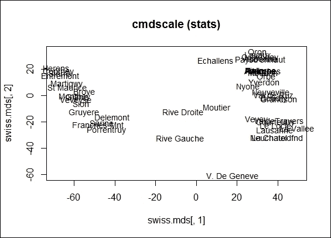

    从 cmdscale 对象得到的二维散点图

1.  此外，您可以使用`isoMDS`执行非度量 MDS：

    ```py
    > library(MASS)
    > swiss.nmmds = isoMDS(swiss.dist, k=2)
    initial  value 2.979731 
    iter   5 value 2.431486
    iter  10 value 2.343353
    final  value 2.338839 
    converged

    ```

1.  你也可以在二维散点图上绘制数据点：

    ```py
    > plot(swiss.nmmds$points, type = "n", main = "isoMDS (MASS)")
    > text(swiss.nmmds$points, rownames(swiss), cex = 0.9, xpd = TRUE)

    ```

    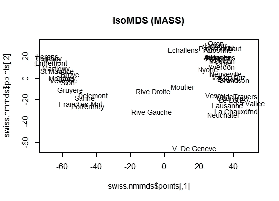

    从 isoMDS 对象生成的二维散点图

1.  你还可以在二维散点图上绘制数据点：

    ```py
    > swiss.sh = Shepard(swiss.dist, swiss.mds)
    > plot(swiss.sh, pch = ".")
    > lines(swiss.sh$x, swiss.sh$yf, type = "S")

    ```

    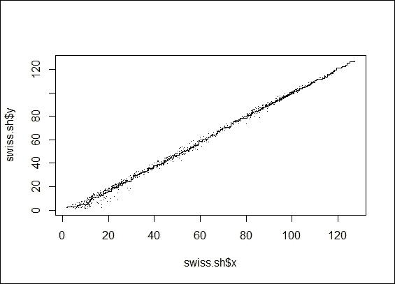

    从 isoMDS 对象生成的谢泼德图

## 如何工作...

MDS 通过提供一组对象之间相似性的视觉表示来揭示数据的结构。更详细地说，MDS 将一个对象放置在 n 维空间中，其中点对之间的距离对应于对象对之间的相似性。通常，维空间是二维欧几里得空间，但它可能是非欧几里得空间，并且具有超过两个维度。根据输入矩阵的意义，MDS 可以主要分为两种类型：度量 MDS，其中输入矩阵基于度量，非度量 MDS，其中输入矩阵基于非度量。

度量 MDS 也称为主坐标分析，它首先将距离转换为相似性。在最简单的情况下，该过程通过在相似性上执行主成分分析，将原始数据点线性投影到子空间。另一方面，该过程也可以通过最小化应力值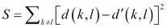对相似性进行非线性投影，其中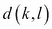是两点之间的距离测量，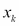和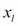，而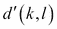是两个投影点的相似性度量，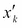和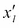。因此，我们可以在欧几里得空间中表示对象之间的关系。

与使用基于度量的输入矩阵的度量 MDS 相比，当数据在序数级别测量时，使用基于非度量的 MDS。由于只有向量之间距离的秩序是有意义的，非度量 MDS 在原始距离上应用单调递增函数 f，并将距离投影到新的值，以保留秩序。归一化方程可以表示为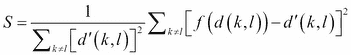。

在这个菜谱中，我们展示了如何在`swiss`数据集上执行度量和非度量 MDS。要执行度量 MDS，我们首先需要从`swiss`数据中获得距离度量。在这个步骤中，你可以将距离度量替换为任何度量，只要它产生数据点的相似性/不相似性度量。你可以使用`cmdscale`来执行度量多维度缩放。在这里，我们指定`k = 2`，因此生成的最大维度等于`2`。你还可以在二维散点图上直观地表示数据点的距离。

接下来，你可以使用`isoMDS`执行非度量 MDS。在非度量 MDS 中，我们不匹配距离，而只是按顺序排列它们。我们还将`swiss`设置为输入数据集，最大维度为两个。与度量 MDS 示例类似，我们可以在二维散点图上绘制数据点之间的距离。然后，我们使用谢泼德图，它显示了投影距离与距离矩阵中的距离匹配得有多好。根据步骤 4 中的图，投影距离在距离矩阵中匹配得很好。

## 还有更多...

另一种可视化方法是将以图形的形式表示 MDS 对象。以下是一个示例代码：

```py
> library(igraph)
> swiss.sample = swiss[1:10,]

> g = graph.full(nrow(swiss.sample))
> V(g)$label = rownames(swiss.sample)
> layout = layout.mds(g, dist = as.matrix(dist(swiss.sample)))
> plot(g, layout = layout, vertex.size = 3)

```

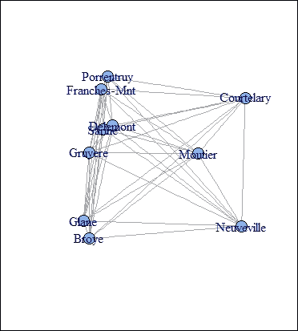

MDS 对象的图形表示

你还可以比较 MDS 和 PCA 生成的结果之间的差异。你可以通过在同一散点图上绘制投影维度来比较它们的差异。如果你在 MDS 中使用欧几里得距离，则投影维度与从 PCA 投影的维度完全相同：

```py
> swiss.dist = dist(swiss)
> swiss.mds = cmdscale(swiss.dist, k=2)
> plot(swiss.mds[,1], swiss.mds[,2], type="n")
> text(swiss.mds[,1], swiss.mds[,2], rownames(swiss), cex = 0.9, xpd = TRUE)
> swiss.pca = prcomp(swiss)
> text(-swiss.pca$x[,1],-swiss.pca$x[,2], rownames(swiss), 
+      ,col="blue", adj = c(0.2,-0.5),cex = 0.9, xpd = TRUE)

```

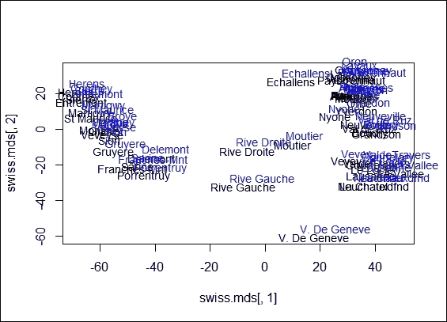

MDS 与 PCA 的比较

# 使用 SVD 降维

**奇异值分解**（**SVD**）是一种矩阵分解（分解）类型，可以将矩阵分解为两个正交矩阵和对角矩阵。你可以使用这三个矩阵将原始矩阵乘回。从线性代数的角度来看，SVD 可以减少线性相关的冗余数据。因此，它可以应用于特征选择、图像处理、聚类以及许多其他领域。在这个菜谱中，我们将说明如何使用 SVD 进行降维。

## 准备工作

在这个菜谱中，我们将继续使用数据集`swiss`作为我们的输入数据源。

## 如何操作...

执行以下步骤以使用 SVD 进行降维：

1.  首先，你可以在`swiss`数据集上执行`svd`：

    ```py
    > swiss.svd = svd(swiss)

    ```

1.  然后，你可以根据 SVD 列绘制解释的方差百分比和累积解释的方差百分比：

    ```py
    > plot(swiss.svd$d²/sum(swiss.svd$d²), type="l", xlab=" Singular vector", ylab = "Variance explained")

    ```

    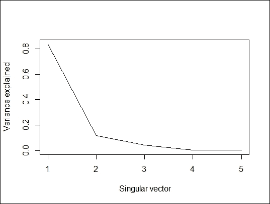

    解释的方差百分比

    ```py
    > plot(cumsum(swiss.svd$d²/sum(swiss.svd$d²)), type="l", xlab="Singular vector", ylab = "Cumulative percent of variance explained")

    ```

    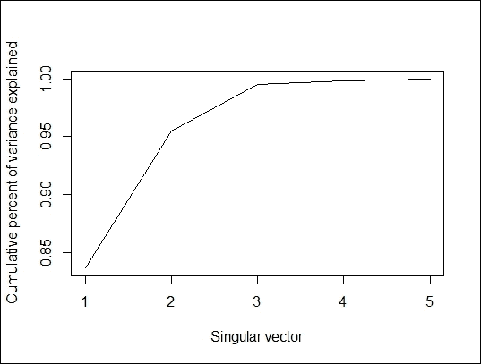

    累积方差百分比

1.  接下来，你可以使用仅一个奇异向量来重建数据：

    ```py
    > swiss.recon = swiss.svd$u[,1] %*% diag(swiss.svd$d[1], length(1), length(1)) %*% t(swiss.svd$v[,1])

    ```

1.  最后，你可以在图像中比较原始数据集与构建的数据集：

    ```py
    > par(mfrow=c(1,2))
    > image(as.matrix(swiss), main="swiss data Image")
    > image(swiss.recon,  main="Reconstructed Image")

    ```

    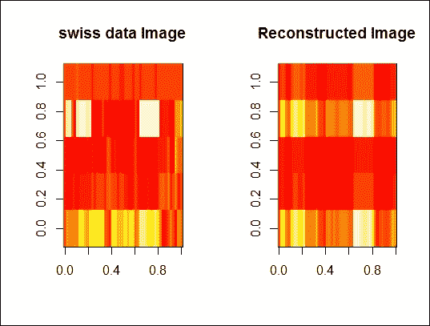

    原始数据集与重建数据集之间的比较

## 如何工作...

SVD 是实数或复数矩阵的分解。具体来说，m x n 矩阵 A 的 SVD 是将 A 分解为三个矩阵的乘积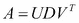。在这里，U 是一个 m x m 的正交矩阵，D 包含奇异值，是一个 m x n 的对角矩阵，V^T 是一个 n x n 的正交矩阵。

在这个食谱中，我们展示了如何使用 SVD 进行降维。首先，你可以在`swiss`数据集上应用`svd`函数以获得分解矩阵。然后你可以生成两个图表：一个显示了根据奇异向量解释的方差，另一个显示了根据奇异向量解释的累积方差。

前面的图表明第一个奇异向量可以解释 80%的方差。我们现在想比较原始数据集和仅使用一个奇异向量重建的数据集之间的差异。因此，我们使用单个奇异向量重建数据，并使用`image`函数将原始和重建的数据集并排展示，以查看它们之间的差异。下一个图显示这两个图像非常相似。

## 参考阅读

+   如我们之前提到的，PCA 可以被视为 SVD 的一个特例。在这里，我们从 SVD 生成的`swiss`数据的正交向量，并从`prcomp`获得旋转。我们可以看到这两个生成的矩阵是相同的：

    ```py
    > svd.m = svd(scale(swiss))
    > svd.m$v
     [,1]        [,2]         [,3]       [,4]        [,5]
    [1,]  0.52396452 -0.25834215  0.003003672 -0.8090741  0.06411415
    [2,] -0.57185792 -0.01145981 -0.039840522 -0.4224580 -0.70198942
    [3,] -0.49150243  0.19028476  0.539337412 -0.3321615  0.56656945
    [4,]  0.38530580  0.36956307  0.725888143  0.1007965 -0.42176895
    [5,]  0.09167606  0.87197641 -0.424976789 -0.2154928  0.06488642
    > pca.m = prcomp(swiss,scale=TRUE)
    > pca.m$rotation
     PC1         PC2          PC3        PC4         PC5
    Agriculture      0.52396452 -0.25834215  0.003003672 -0.8090741  0.06411415
    Examination  -0.57185792 -0.01145981 -0.039840522 -0.4224580 -0.70198942
    Education       -0.49150243  0.19028476  0.539337412 -0.3321615  0.56656945
    Catholic          0.38530580  0.36956307  0.725888143  0.1007965 -0.42176895
    Infant.Mortality 0.09167606 0.87197641 -0.424976789 -0.2154928 0.06488642

    ```

# 使用 SVD 压缩图像

在上一个食谱中，我们展示了如何使用 SVD 分解矩阵，然后通过乘以分解矩阵来重建数据集。此外，矩阵分解的应用可以应用于图像压缩。在这个食谱中，我们将展示如何对经典图像处理材料 Lenna 执行 SVD。

## 准备工作

在这个食谱中，你应该事先下载 Lenna 的图像（参考[`www.ece.rice.edu/~wakin/images/lena512.bmp`](http://www.ece.rice.edu/~wakin/images/lena512.bmp)），或者你可以准备你自己的图像来查看图像压缩是如何工作的。

## 如何操作...

执行以下步骤以使用 SVD 压缩图像：

1.  首先，安装并加载`bmp`：

    ```py
    > install.packages("bmp")
    > library(bmp)

    ```

1.  你可以使用`read.bmp`函数将 Lenna 的图像读取为一个数值矩阵。当读取器下载图像时，默认名称是`lena512.bmp`：

    ```py
    > lenna = read.bmp("lena512.bmp")

    ```

1.  旋转并绘制图像：

    ```py
    > lenna = t(lenna)[,nrow(lenna):1]
    > image(lenna) 

    ```

    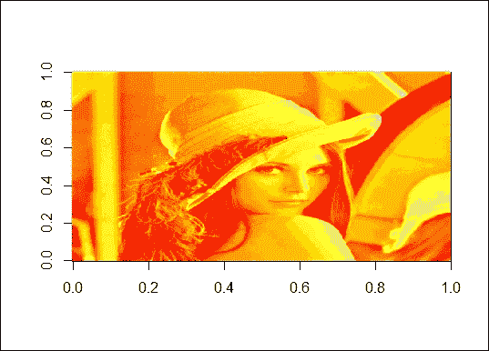

    Lenna 的图片

1.  接下来，你可以对读取的数值矩阵执行 SVD 并绘制解释方差的百分比：

    ```py
    > lenna.svd = svd(scale(lenna))
    > plot(lenna.svd$d²/sum(lenna.svd$d²), type="l", xlab=" Singular vector", ylab = "Variance explained")

    ```

    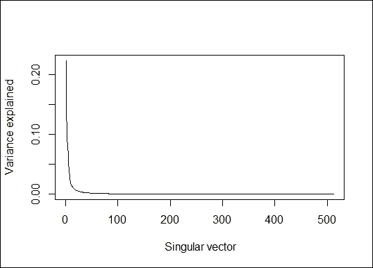

    解释方差的百分比

1.  接下来，你可以获得重建图像所需的维度数：

    ```py
    > length(lenna.svd$d)
    [1] 512

    ```

1.  获得奇异向量可以解释超过 90%方差的点：

    ```py
    > min(which(cumsum(lenna.svd$d²/sum(lenna.svd$d²))> 0.9))
    [1] 18

    ```

1.  你也可以将代码封装成一个函数，`lenna_compression`，然后你可以使用这个函数来绘制压缩后的 Lenna：

    ```py
    > lenna_compression = function(dim){
    +     u=as.matrix(lenna.svd$u[, 1:dim])
    +     v=as.matrix(lenna.svd$v[, 1:dim])
    +     d=as.matrix(diag(lenna.svd$d)[1:dim, 1:dim])
    +     image(u%*%d%*%t(v))
    + }

    ```

1.  此外，你可以使用 18 个向量来重建图像：

    ```py
    > lenna_compression(18)

    ```

    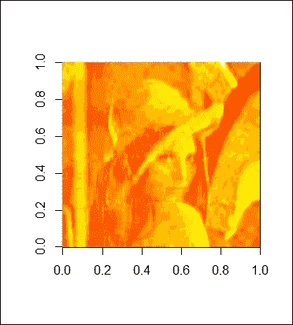

    由 18 个组件重建的图像

1.  你可以获得奇异向量可以解释超过 99%方差的点；

    ```py
    > min(which(cumsum(lenna.svd$d²/sum(lenna.svd$d²))> 0.99))
    [1] 92
    > lenna_compression(92)

    ```

    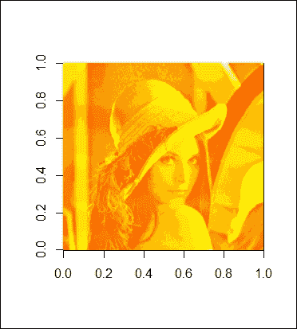

    由 92 个组件重建的图像

## 它是如何工作的...

在本菜谱中，我们展示了如何使用 SVD 压缩图像。在第一步中，我们使用`bmp`包将图像 Lenna 加载到 R 会话中。然后，由于读取的图像已旋转，我们可以将图像旋转回来并使用`plot`函数在 R 中绘制 Lenna（如图 3 步中的图所示）。接下来，我们对图像矩阵进行 SVD 分解，然后绘制与奇异向量数量相关的方差解释百分比。

此外，我们发现可以使用 18 个成分解释 90%的方差，因此我们使用这 18 个成分来重建 Lenna。因此，我们创建了一个名为`lenna_compression`的函数，其目的是通过矩阵乘法重建图像。结果，我们将 18 作为函数的输入，返回一个相当模糊的 Lenna 图像（如图 8 步中的图所示）。然而，我们至少可以看到图像的轮廓。为了获得更清晰的图像，我们发现可以使用 92 个成分解释 99%的方差。因此，我们将函数`lenna_compression`的输入设置为 92。第 9 步中的图显示，这比仅使用 18 个成分构建的图像更清晰。

## 参见

+   Lenna 图片是压缩算法最广泛使用的标准测试图像之一。有关 Lenna 图片的更多详细信息，请参阅[`www.cs.cmu.edu/~chuck/lennapg/`](http://www.cs.cmu.edu/~chuck/lennapg/)。

# 使用 ISOMAP 进行非线性降维

ISOMAP 是流形学习的一种方法，它将线性框架推广到非线性数据结构。与 MDS 类似，ISOMAP 创建了一系列对象相似性或差异性（距离）的视觉表示。然而，由于数据以非线性格式结构化，MDS 的欧几里得距离度量在 ISOMAP 中被数据流形的地形距离所取代。在本菜谱中，我们将说明如何使用 ISOMAP 进行非线性降维。

## 准备工作

在本菜谱中，我们将使用来自`RnavGraphImageData`的`digits`数据作为我们的输入源。

## 如何操作...

执行以下步骤以使用 ISOMAP 进行非线性降维：

1.  首先，安装并加载`RnavGraphImageData`和`vegan`包：

    ```py
    > install.packages("RnavGraphImageData")
    > install.packages("vegan")
    > library(RnavGraphImageData)
    > library(vegan)

    ```

1.  然后，你可以加载数据集`digits`：

    ```py
    > data(digits)

    ```

1.  旋转并绘制图像：

    ```py
    > sample.digit = matrix(digits[,3000],ncol = 16, byrow=FALSE)
    > image(t(sample.digit)[,nrow(sample.digit):1])

    ```

    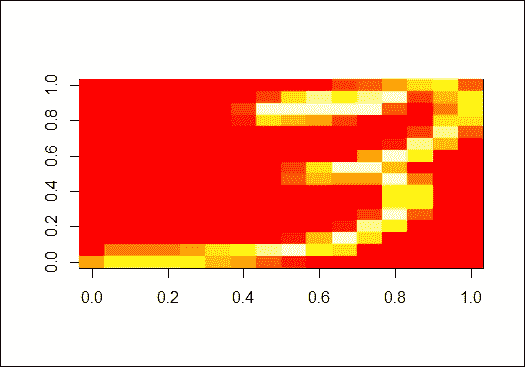

    来自数字数据集的一个示例图像

1.  接下来，你可以从总体中随机抽取 300 个数字：

    ```py
    > set.seed(2)
    > digit.idx = sample(1:ncol(digits),size = 600)
    > digit.select = digits[,digit.idx]

    ```

1.  将选定的数字数据转置，然后使用`vegdist`计算对象之间的差异：

    ```py
    > digits.Transpose = t(digit.select)
    > digit.dist = vegdist(digits.Transpose, method="euclidean")

    ```

1.  接下来，你可以使用`isomap`进行降维：

    ```py
    > digit.isomap = isomap(digit.dist,k = 8, ndim=6, fragmentedOK = TRUE)
    > plot(digit.isomap)

    ```

    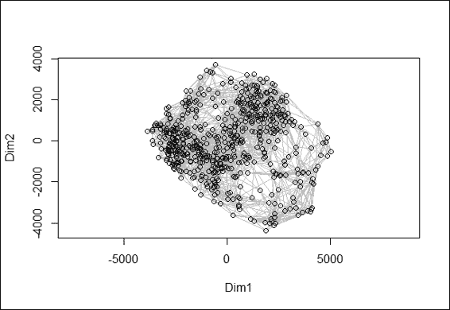

    ISOMAP 对象的一个二维散点图

1.  最后，你可以将散点图与红色标记的最小生成树叠加；

    ```py
    > digit.st = spantree(digit.dist)
    > digit.plot = plot(digit.isomap, main="isomap k=8")
    > lines(digit.st, digit.plot, col="red")

    ```

    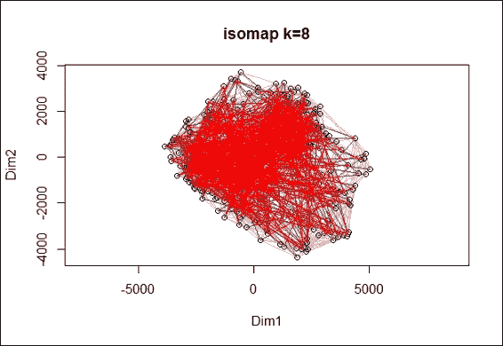

    二维散点图与最小生成树的叠加

## 它是如何工作的...

ISOMAP 是一种非线性降维方法，也是等距映射方法的代表。ISOMAP 可以被视为度量 MDS 的扩展，其中数据点之间的成对欧几里得距离被由邻域图诱导的测地距离所取代。

ISOMAP 算法的描述分为四个步骤。首先，确定每个点的邻居。其次，构建一个邻域图。第三，计算两个节点之间的最短距离路径。最后，通过执行 MDS 找到数据的一个低维嵌入。

在这个菜谱中，我们展示了如何使用 ISOMAP 进行非线性降维。首先，我们从 `RnavGraphImageData` 加载数字数据。然后，在我们选择一个数字并绘制其旋转图像后，我们可以看到一个手写数字的图像（第 3 步中的图中的数字 3）。

接下来，我们随机抽取 300 个数字作为我们的输入数据给 ISOMAP。然后我们将数据集转置以计算每个图像对象之间的距离。一旦数据准备就绪，我们计算每个对象之间的距离并进行降维。在这里，我们使用 `vegdist` 通过欧几里得度量计算每个对象之间的不相似性。然后我们使用 ISOMAP 对 `digits` 数据进行非线性降维，维度设置为 `6`，保留一个点的最短不相似性数量为 `8`，并确保通过指定 `fragmentedOK` 为 `TRUE` 来分析最大的连通组。

最后，我们可以使用生成的 ISOMAP 对象制作一个二维散点图（第 6 步中的图），并在散点图上用红色线条叠加最小生成树（第 7 步中的图）。

## 还有更多...

你还可以使用 `RnavGraph` 包通过图形作为导航基础设施来可视化高维数据（在这个例子中是数字）。有关更多信息，请参阅 [`www.icesi.edu.co/CRAN/web/packages/RnavGraph/vignettes/RnavGraph.pdf`](http://www.icesi.edu.co/CRAN/web/packages/RnavGraph/vignettes/RnavGraph.pdf)。

这里是关于如何使用 `RnavGraph` 在图中可视化高维数据的描述：

1.  首先，安装并加载 `RnavGraph` 和 `graph` 包：

    ```py
    > install.packages("RnavGraph")
    > source("http://bioconductor.org/biocLite.R")
    > biocLite("graph")
    > library(RnavGraph)

    ```

1.  然后，你可以从 `digit` 数据创建一个 `NG_data` 对象：

    ```py
    > digit.group = rep(c(1:9,0), each = 1100)
    > digit.ng_data = ng_data(name = "ISO_digits",
    + data = data.frame(digit.isomap$points),
    + shortnames = paste('i',1:6, sep = ''),
    + group = digit.group[digit.idx],
    + labels = as.character(digits.group[digit.idx]))

    ```

1.  从 `NG_data` 创建一个 `NG_graph` 对象：

    ```py
    >  V = shortnames(digit.ng_data)
    >  G = completegraph(V)
    >  LG =linegraph(G)
    >  LGnot = complement(LG)
    >  ng.LG = ng_graph(name = "3D Transition", graph = LG)
    > ng.LGnot = ng_graph(name = "4D Transition", graph = LGnot)

    ```

1.  最后，你可以在 `tk2d` 绘图中可视化图形：

    ```py
    > ng.i.digits = ng_image_array_gray('USPS Handwritten Digits',
    + digit.select,16,16,invert = TRUE,
    + img_in_row = FALSE)
    > vizDigits1 = ng_2d(data = digit.ng_data, graph = ng.LG, images = ng.i.digits)
    > vizDigits2 = ng_2d(data = digit.ng_data, graph = ng.LGnot, images = ng.i.digits)
    > nav = navGraph(data = digit.ng_data, graph = list(ng.LG, ng.LGnot), viz = list(vizDigits1, vizDigits2))

    ```

    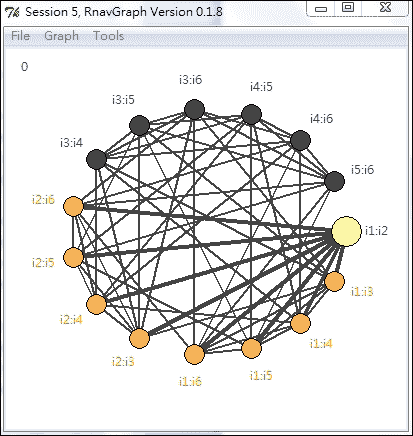

    一个三维转换图

1.  还可以查看一个四维转换图：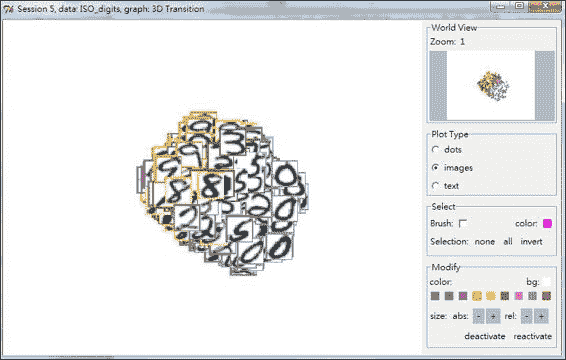

    一个四维转换图

# 使用局部线性嵌入进行非线性降维

**局部线性嵌入**（**LLE**）是 PCA 的扩展，它将嵌入在高维空间中的流形上的数据降低到低维空间。与 ISOMAP 不同，ISOMAP 是一种用于非线性降维的全局方法，LLE 是一种局部方法，它使用 k 近邻的线性组合来保留数据的局部属性。在本菜谱中，我们将简要介绍如何在 s 曲线数据上使用 LLE。

## 准备工作

在本菜谱中，我们将使用 `lle` 包中的 `lle_scurve_data` 中的数字数据作为我们的输入源。

## 如何操作...

执行以下步骤以使用 LLE 进行非线性降维：

1.  首先，您需要安装并加载包，`lle`：

    ```py
    > install.packages("lle")
    > library(lle)

    ```

1.  您可以从 `lle` 中加载 `ll_scurve_data`：

    ```py
    > data( lle_scurve_data )

    ```

1.  然后，对 `lle_scurve_data` 执行 `lle`：

    ```py
    > X = lle_scurve_data
    > results = lle( X=X , m=2, k=12,  id=TRUE)
    finding neighbours
    calculating weights
    intrinsic dim: mean=2.47875, mode=2
    computing coordinates

    ```

1.  使用 `str` 和 `plot` 函数检查结果：

    ```py
    > str( results )
    List of 4
     $ Y     : num [1:800, 1:2] -1.586 -0.415 0.896 0.513 1.477 ...
     $ X     : num [1:800, 1:3] 0.955 -0.66 -0.983 0.954 0.958 ...
     $ choise: NULL
     $ id    : num [1:800] 3 3 2 3 2 2 2 3 3 3 ...
    >plot( results$Y, main="embedded data", xlab=expression(y[1]), ylab=expression(y[2]) )

    ```

    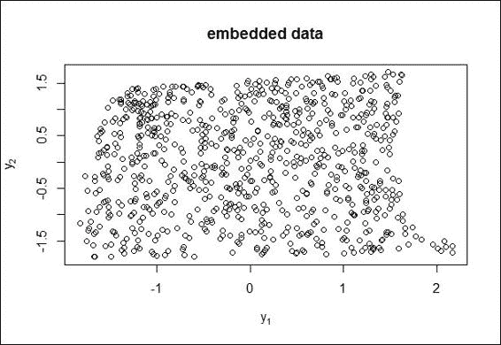

    嵌入数据的 2-D 散点图

1.  最后，您可以使用 `plot_lle` 来绘制 LLE 结果：

    ```py
    > plot_lle( results$Y, X, FALSE, col="red", inter=TRUE )

    ```

    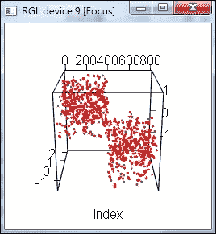

    LLE 结果的 LLE 图

## 如何工作...

LLE 是一种非线性降维方法，它计算高维数据的低维、邻域保留嵌入。LLE 的算法可以按以下步骤说明：首先，LLE 计算每个数据点的 k 个邻居，。其次，它为每个点计算一组权重，这些权重最小化了残差误差之和，可以从其邻居中最佳地重建每个数据点。残差误差之和可以描述为 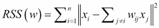，其中 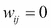 如果 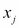 不是  的 k 个最近邻之一，并且对于每个 i，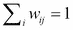。最后，找到由权重 W 最佳重建的向量 Y。成本函数可以表示为 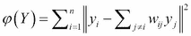，约束条件为 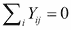，和 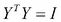。

在本菜谱中，我们展示了如何使用 LLE 进行非线性降维。首先，我们从 `lle` 中加载 `lle_scurve_data`。然后，我们使用两个维度和 12 个邻居执行 `lle`，并通过指定 `id = TRUE` 列出每个数据点的维度。LLE 有三个步骤，包括：为数据中的每个点构建邻域，找到在该邻域中线性逼近数据的权重，以及找到低维坐标。

接下来，我们可以使用 `str` 和 `plot` 函数来检查数据。`str` 函数返回 X、Y、choice 和 ID。在这里，X 代表输入数据，Y 表示嵌入数据，choice 表示保留数据的索引向量，而子集选择和 ID 显示每个数据输入的维度。`plot` 函数返回嵌入数据的散点图。最后，我们使用 `plot_lle` 来绘制结果。在这里，我们通过将交互模式设置为 `TRUE` 来启用交互模式。

## 参见

+   另一个用于非线性降维的有用软件包是 `RDRToolbox`，这是一个包含 ISOMAP 和 LLE 的非线性降维软件包。您可以使用以下命令安装 `RDRToolbox`：

    ```py
    > source("http://bioconductor.org/biocLite.R")
    > biocLite("RDRToolbox")
    > library(RDRToolbox)

    ```
