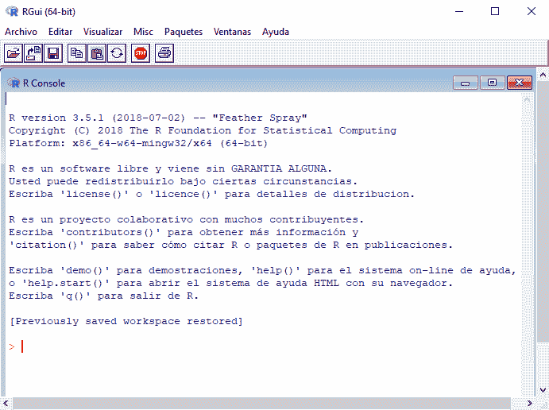
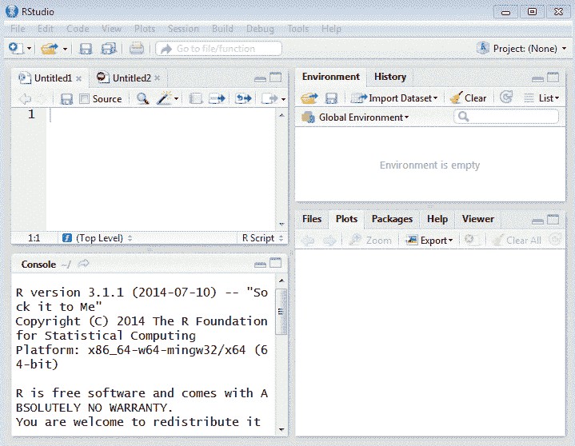
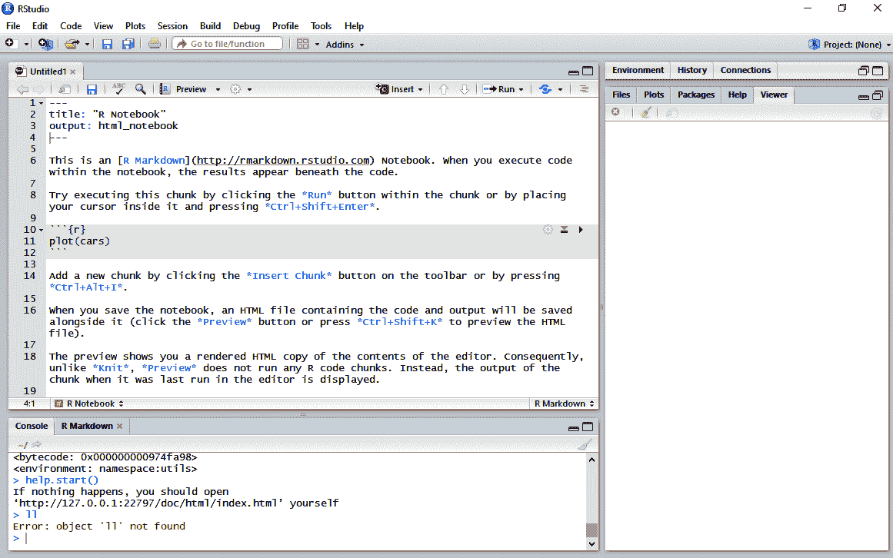
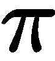

# 第一章：机器学习 R 基础

您可能已经习惯了在新闻中听到诸如大数据、机器学习和人工智能等词汇。每天出现的新应用这些术语的数量令人惊讶。例如，亚马逊、Netflix 使用的推荐系统、搜索引擎、股市分析，甚至语音识别等，只是其中的一小部分。每年都会出现不同的新算法和新技术，其中许多基于先前的方法或结合了不同的现有算法。同时，越来越多的教程和课程专注于教授这些内容。

许多课程存在一些共同限制，如解决*玩具*问题或全部关注算法。这些限制可能导致您对数据建模方法产生错误的理解。因此，建模过程在业务和数据理解、数据准备等步骤之前就非常重要。如果没有这些前期步骤，未来模型应用时可能存在缺陷。此外，模型开发在找到合适的算法后并未结束。模型性能评估、可解释性和模型的部署也非常相关，并且是建模过程的最终成果。

在这本书中，我们将学习如何开发不同的预测模型。本书中包含的应用或示例基于金融领域，并尝试构建一个理论框架，帮助您理解金融危机的原因，这对世界各地的国家产生了巨大影响。

本书使用的所有算法和技术都将使用 R 语言实现。如今，R 是数据科学的主要语言之一。关于哪种语言更好的争论非常激烈，R 或 Python。这两种语言都有许多优点和一些缺点。

根据我的经验，R 在金融数据分析方面更加强大。我发现了很多专注于这个领域的 R 库，但在 Python 中并不多见。尽管如此，信用风险和金融信息与时间序列的处理密切相关，至少在我看来，Python 在这方面表现更好。循环或**长短期记忆**（**LSTM**）网络在 Python 中的实现也更为出色。然而，R 提供了更强大的数据可视化和交互式风格的库。建议您根据项目需要交替使用 R 和 Python。Packt 提供了许多关于 Python 机器学习的优质资源，其中一些列在这里供您方便查阅：

+   *《Python 机器学习——第二版》，* [`www.packtpub.com/big-data-and-business-intelligence/python-machine-learning-second-edition`](https://www.packtpub.com/big-data-and-business-intelligence/python-machine-learning-second-edition)

+   《动手实践数据科学和 Python 机器学习》，[`www.packtpub.com/big-data-and-business-intelligence/hands-data-science-and-python-machine-learning`](https://www.packtpub.com/big-data-and-business-intelligence/hands-data-science-and-python-machine-learning)

+   《Python 机器学习实例》，[`www.packtpub.com/big-data-and-business-intelligence/python-machine-learning-example`](https://www.packtpub.com/big-data-and-business-intelligence/python-machine-learning-example)

在本章中，让我们重温你对机器学习的知识，并使用 R 开始编码。

本章将涵盖以下主题：

+   R 和 RStudio 安装

+   一些基本命令

+   R 中的对象、特殊情况和基本运算符

+   控制代码流程

+   R 包的所有内容

+   进一步的步骤

# R 和 RStudio 安装

让我们先从安装 R 开始。它是完全免费的，可以从[`cloud.r-project.org/`](https://cloud.r-project.org/)下载。安装 R 是一个简单的任务。

让我们看看在 Windows PC 上安装 R 的步骤。对于在其他操作系统上安装，步骤简单，可在同一[`cloud.r-project.org/`](https://cloud.r-project.org/)链接找到。

让我们从在 Windows 系统上安装 R 开始：

1.  访问[`cloud.r-project.org/`](https://cloud.r-project.org/)。

1.  查找“下载并安装 R”，并选择你的操作系统。我们正在为 Windows 安装，所以选择 Windows 链接。

1.  前往子目录并点击 base。

1.  你将被重定向到一个显示下载 R *X*.*X*.*X* for Windows 的页面。在撰写本书时，你需要点击下载 R 3.5.2 for Windows 的版本。

1.  保存并运行.exe 文件。

1.  你现在可以选择安装 R 的设置语言。

1.  将会打开一个设置向导，你可以继续点击“下一步”，直到到达“选择目标位置”。

1.  选择你首选的位置并点击“下一步”。

1.  点击“下一步”按钮几次，直到 R 开始安装。

1.  安装完成后，R 将通过消息“完成 R for Windows 3.5.2 设置向导”通知你。你现在可以点击“完成”。

1.  你可以在桌面上找到 R 的快捷方式，双击它以启动 R。

1.  就像任何其他应用程序一样，如果你在桌面上找不到 R，你可以点击开始按钮，所有程序，然后查找 R 并启动它。

1.  你将看到一个类似于以下截图的屏幕：



这是 R 命令提示符，等待输入。

# 关于 R 的注意事项

在输入命令之前，你必须知道 R 是一个区分大小写的和解释型语言。

你可以选择手动输入命令或根据你的意愿从源文件运行一组命令。R 提供了许多内置函数，为用户提供大部分功能。作为用户，你甚至可以创建用户自定义函数。

您甚至可以创建和操作对象。您可能知道，对象是可以分配值的任何东西。交互式会话要求在执行过程中所有对象都必须存在于内存中，而函数可以放在具有当前程序引用的包中，并且可以在需要时访问。

# 使用 RStudio

除了使用 R，还建议使用 RStudio。RStudio 是一个 **集成开发环境**（**IDE**），就像任何其他 IDE 一样，可以增强您与 R 的交互。

RStudio 提供了一个非常组织良好的界面，可以同时清楚地表示图表、数据表、R 代码和输出。

此外，R 提供了类似导入向导的功能，可以在不编写代码的情况下导入和导出不同格式的文件。

在看到标准的 R GUI 界面后，您会发现它与 RStudio 非常相似，但区别在于与 R GUI 相比，RStudio 非常直观且用户友好。您可以从菜单中选择许多选项，甚至可以根据您的需求自定义 GUI。桌面版 RStudio 可在 [`www.rstudio.com/products/rstudio/download/#download`](https://www.rstudio.com/products/rstudio/download/#download) 下载。

# RStudio 安装

安装步骤与 R 的安装非常相似，因此没有必要描述详细的步骤。

第一次打开 RStudio，您将看到三个不同的窗口。您可以通过转到文件，新建文件，并选择 R 脚本来启用第四个窗口：



在左上角的窗口中，可以编写脚本，然后保存并执行。接下来的左侧窗口代表控制台，其中可以直接执行 R 代码。

右上方的窗口允许可视化工作空间中定义的变量和对象。此外，还可以查看之前执行过的命令历史。最后，右下方的窗口显示工作目录。

# 一些基本命令

这里有一份有用的命令列表，用于开始使用 R 和 RStudio：

+   `help.start()`: 启动 R 文档的 HTML 版本

+   `help(command)`/`??command`/`help.search(command)`: 显示与特定命令相关的帮助

+   `demo()`: 一个用户友好的界面，运行一些 R 脚本的演示

+   `library(help=package)`: 列出包中的函数和数据集

+   `getwd()`: 打印当前活动的工作目录

+   `ls()`: 列出当前会话中使用的对象

+   `setwd(mydirectory)`: 将工作目录更改为 `mydirectory`

+   `options()`: 显示当前选项中的设置

+   `options(digits=5)`: 您可以打印指定的数字作为输出

+   `history()`: 显示直到限制为 25 的之前的命令

+   `history(max.show=Inf)`: 不论限制如何，显示所有命令

+   `savehistory(file=“myfile”)`: 保存历史记录（默认文件是 `.Rhistory` 文件）

+   `loadhistory(file=“myfile”)`: 回忆你的命令历史

+   `save.image()`: 保存当前工作空间到特定工作目录下的 `.RData` 文件

+   `save(object list,file=“myfile.RData”)`: 将对象保存到指定文件

+   `load(“myfile.RData”)`: 从指定文件加载特定对象

+   `q()`: 这将退出 R，并提示保存当前工作空间

+   `library(package)`: 加载特定于项目的库

+   `install.package(package)`: 从类似 CRAN 的存储库或甚至从本地文件下载并安装包

+   `rm(object1, object2…)`: 删除对象

在 RStudio 中执行命令时，应在控制台中编写，然后必须按 *Enter*。

在 RStudio 中，可以通过结合代码行和纯文本来创建交互式文档。R 笔记本将有助于直接与 R 交互，因此当我们使用它时，可以生成具有出版质量的文档作为输出。

要在 RStudio 中创建新笔记本，请转到文件，新建文件，R 笔记本。默认笔记本将打开，如下截图所示：



这个笔记本是一个具有 `.rmd` 扩展名的纯文本文件。一个文件包含三种类型的内容：

+   （可选）由 --- 行包围的 YAML 标头

+   R 代码块由 ```pyr
*   Text mixed with simple text formatting

R code chunks allow for the execution of code and display the results in the same notebook. To execute a chunk, click the run button within the chunk or place the cursor inside it and press *Ctrl* + *Shift* + *Enter*. If you wish to insert a chunk button on the toolbar, press *Ctrl* + *Alt* + *I*.

While saving the current notebook, a code and output file in HTML format will be generated and will be saved with the notebook. To see what the HTML file looks like, you can either click the Preview button or you can use the shortcut *Ctrl* + *Shift* + *K*. You can find and download all the code of this book as a R Notebook, where you can execute all the code without writing it directly.

# Objects, special cases, and basic operators in R

By now, you will have figured out that R is an object-oriented language. All our variables, data, and functions will be stored in the active memory of the computer as **objects**. These objects can be modified using different operators or functions. An object in R has two attributes, namely, mode and length.

Mode includes the basic type of elements and has four options:

*   **Numeric**: These are decimal numbers
*   **Character**: Represents sequences of string values
*   **Complex**: Combination of real and imaginary numbers, for example, *x+ai*
*   **Logical**: Either true (`1`) or false (`0`)

Length means the number of elements in an object.

In most cases, we need not care whether or not the elements of a numerical object are integers, reals, or even complexes. Calculations will be carried out internally as numbers of double precision, real, or complex, depending on the case. To work with complex numbers, we must indicate explicitly the complex part.

In case an element or value is unavailable, we assign `NA`, a special value. Usually, operations with `NA` elements result in `NA` unless we are using some functions that can treat missing values in some way or omit them. Sometimes, calculations can lead to answers with a positive or negative infinite value (represented by R as `Inf` or `-Inf`, respectively). On the other hand, certain calculations lead to expressions that are not numbers represented by R as **NaN** (short for **not a number**).

# Working with objects

You can create an object using the `<-` operator:

``` 包围

n<-10

n

## [1] 10

```py

In the preceding code, an object called `n` is created. A value of `10` has been assigned to this object. The assignment can also be made using the `assign()` function, although this isn't very common.

Once the object has been created, it is possible to perform operations on it, like in any other programming language:

```

n+5

## [1] 15

```py

These are some examples of basic operations.

Let's create our variables:

```

x<-4

y<-3

```py

Now, we can carry out some basic operations:

*   Sum of variables:

```

x + y

## [1] 7

```py

*   Subtraction of variables:

```

x - y

## [1] 1

```py

*   Multiplication of variables:

```

x * y

## [1] 12

```py

*   Division of variables:

```

x / y

## [1] 1.333333

```py

*   Power of variables:

```

x ** y

## [1] 64

```py

Likewise in R, there are defined constants that are widely used, such as the following ones:

*   The `pi` () number :

```

x * pi

## [1] 12.56637

```py

*   Exponential function:

```

exp(y)

## [1] 20.08554

```py

There are also functions for working with numbers, such as the following:

*   Sign (positive or negative of a number):

```

sign(y)

## [1] 1

```py

*   Finding the maximum value:

```

max(x,y)

## [1] 4

```py

*   Finding the minimum value:

```

min(x,y)

## [1] 3

```py

*   Factorial of a number:

```

factorial(y)

## [1] 6

```py

*   Square root function:

```

sqrt(y)

## [1] 1.732051

```py

It is also possible to assign the result of previous operations to another object. For example, the sum of variables `x` and `y` is assigned to an object named `z`:

```

z <- x + y

z

## [1] 7

```py

As shown previously, these functions apply if the variables are numbers, but there are also other operators to work with strings:

```

x > y

## [1] TRUE

x + y != 8

## [1] TRUE

```py

The main logical operators are summarized in the following table:

| **Operator** | **Description** |
| < | Less than |
| <= | Less than or equal to |
| > | Greater than |
| >= | Greater than or equal to |
| == | Equal to |
| != | Not equal to |
| !x | Not *x* |
| x | *y* |
| x & y | *x* and *y* |
| isTRUE(x) | Test if *x* is TRUE |

# Working with vectors

A **vector** is one of the basic data structures in R. It contains only similar elements, like strings and numbers, and it can have data types such as logical, double, integer, complex, character, or raw. Let's see how vectors work.

Let's create some vectors by using `c()`:

```

a<-c(1,3,5,8)

a

## [1] 1 3 5 8

```py

On mixing different objects with vector elements, there is a transformation of the elements so that they belong to the same class:

```

y <- c(1,3)

class(y)

## [1] "numeric"

```py

When we apply commands and functions to a vector variable, they are also applied to every element in the vector:

```

y <- c(1,5,1)

y + 3

## [1] 4 8 4

```py

You can use the `:` operator if you wish to create a vector of consecutive numbers:

```

c(1:10)

## [1]  1  2  3  4  5  6  7  8  9 10

```py

Do you need to create more complex vectors? Then use the `seq()` function. You can create vectors as complex as number of points in an interval or even to find out the step size that we might need in machine learning:

```

seq(1, 5, by=0.1)

## [1] 1.0 1.1 1.2 1.3 1.4 1.5 1.6 1.7 1.8 1.9 2.0 2.1 2.2 2.3 2.4 2.5 2.6

## [18] 2.7 2.8 2.9 3.0 3.1 3.2 3.3 3.4 3.5 3.6 3.7 3.8 3.9 4.0 4.1 4.2 4.3

## [35] 4.4 4.5 4.6 4.7 4.8 4.9 5.0

seq(1, 5, length.out=22)

## [1] 1.000000 1.190476 1.380952 1.571429 1.761905 1.952381 2.142857

## [8] 2.333333 2.523810 2.714286 2.904762 3.095238 3.285714 3.476190

## [15] 3.666667 3.857143 4.047619 4.238095 4.428571 4.619048 4.809524

## [22] 5.000000

```py

The `rep()` function is used to repeat the value of *x*, *n* number of times:

```

rep(3,20)

## [1] 3 3 3 3 3 3 3 3 3 3 3 3 3 3 3 3 3 3 3 3

```py

# Vector indexing

Elements of a vector can be arranged in several haphazard ways, which can make it difficult to access them when needed. Hence, indexing makes it easier to access the elements.

You can have any type of index vectors, from logical, integer, and character.

Vector of integers starting from 1 can be used to specify elements in a vector, and it is also possible to use negative values.

Let's see some examples of indexing:

*   Returns the *n*th element of *x*:

```

x <- c(9,8,1,5)

```py

*   Returns all *x* values except the *n*th element:

```

x[-3]

## [1] 9 8 5

```py

*   Returns values between *a* and *b*:

```

x[1:2]

## [1] 9 8

```py

*   Returns items that are greater than *a* and less than *b*:

```

x[x>0 & x<4]

## [1] 1

```py

Moreover, you can even use a logical vector. In this case, either `TRUE` or `FALSE` will be returned if an element is present at that position:

```

x[c(TRUE, FALSE, FALSE, TRUE)]

## [1] 9 5

```py

# Functions on vectors

In addition to the functions and operators that we've seen for numerical values, there are some specific functions for vectors, such as the following:

*   Sum of the elements present in a vector:

```

sum(x)

## [1] 23

```py

*   Product of elements in a vector:

```

prod(x)

## [1] 360

```py

*   Length of a vector:

```

length(x)

## [1] 4

```py

*   Modifying a vector using the `<-` operator:

```

x

## [1] 9 8 1 5

x[1]<-22

x

## [1] 22 8 1 5

```py

# Factor

A vector of strings of a character is known as a **factor**. It is used to represent categorical data, and may also include the different levels of the categorical variable. Factors are created with the `factor` command:

```

r<-c(1,4,7,9,8,1)

r<-factor(r)

r

## [1] 1 4 7 9 8 1

## Levels: 1 4 7 8 9

```py

# Factor levels

**Levels** are possible values that a variable can take. Suppose the original value of 1 is repeated; it will appear only once in the levels.

Factors can either be numeric or character variables, but levels of a factor can only be characters.

Let's run the `level` command:

```

levels(r)

## [1] "1" "4" "7" "8" "9"

```py

As you can see, `1`, `4`, `7`, `8`, and `9` are the possible levels that the level `r` can have.

The `exclude` parameter allows you to exclude levels of a custom factor:

```

factor(r, exclude=4)

## [1] 1    <NA> 7    9    8    1

## Levels: 1 7 8 9

```py

Finally, let's find out if our factor values are ordered or unordered:

```

a<- c(1,2,7,7,1,2,2,7,1,7)

a<- factor(a, levels=c(1,2,7), ordered=TRUE)

a

## [1] 1 2 7 7 1 2 2 7 1 7

## Levels: 1 < 2 < 7

```py

# Strings

Any value that is written in single or double quotes will be considered a **string**:

```

c<-"This is our first string"

c

## [1] "This is our first string"

class(c)

## [1] "character"

```py

When I say single quotes are allowed, please know that even if you specify the string in single quotes, R will always store them as double quotes.

# String functions

Let's see how we can transform or convert strings using R.

The most relevant string examples are as follows:

*   To know the number of characters in a string:

```

nchar(c)

## [1] 24

```py

*   To return the substring of *x*, originating at a particular character in *x*:

```

substring(c,4)

## [1] "s is our first string"

```py

*   To return the substring of *x* originating at one character located at *n* and ending at another character located at a place, *m*:

```

substring(c,1,4)

## [1] "This"

```py

*   To divide the string *x* into a list of sub chains using the delimiter as a separator:

```

strsplit(c, " ")

## [[1]]

## [1] "This"   "is"     "our"    "first"  "string"

```py

*   To check if the given pattern is in the string, and in that case returns true (or `1`):

```

grep("our", c)

## [1] 1

grep("book", c)

## integer(0)

```py

*   To look for the first occurrence of a pattern in a string:

```

regexpr("our", c)

## [1] 9

## attr(,"match.length")

## [1] 3

## attr(,"index.type")

## [1] "chars"

## attr(,"useBytes")

## [1] TRUE

```py

*   To convert the string into lowercase:

```

tolower(c)

## [1] "这是我们第一条字符串"

```py

*   To convert the string into capital letters:

```

toupper(c)

## [1] "THIS IS OUR FIRST STRING"

```py

*   To replace the first occurrence of the pattern by the given value with a string:

```

sub("our", "my", c)

## [1] "这是我们第一条字符串"

```py

*   To replace the occurrences of the pattern with the given value with a string:

```

gsub("our", "my", c)

## [1] "This is my first string"

```py

*   To return the string as elements of the given array, separated by the given separator using `paste(string,array, sep=“Separator”)`:

```

paste(c,"My book",sep=" : ")

## [1] "这是我们第一条字符串：我的书"

```py

# Matrices

You might know that a standard matrix has a two-dimensional, rectangular layout. Matrices in R are no different than a standard matrix.

# Representing matrices

To represent a matrix of *n* elements with *r* rows and *c* columns, the `matrix` command is used:

```

m<-matrix(c(1,2,3,4,5,6), nrow=2, ncol=3)

m

## [,1] [,2] [,3]

## [1,]    1    3    5

## [2,]    2    4    6

```py

# Creating matrices

A matrix can be created by rows instead of by columns, which is done by using the `byrow` parameter, as follows:

```

m<-matrix(c(1,2,3,4,5,6), nrow=2, ncol=3,byrow=TRUE)

m

## [,1] [,2] [,3]

## [1,]    1    2    3

## [2,]    4    5    6

```py

With the `dimnames` parameter, column names can be added to the matrix:

```

m<-matrix(c(1,2,3,4,5,6), nrow=2, ncol=3,byrow=TRUE,dimnames=list(c('Obs1', 'Obs2'), c('col1', 'Col2','Col3')))

m

## col1 Col2 Col3

## Obs1    1    2    3

## Obs2    4    5    6

```py

There are three more alternatives to creating matrices:

```

rbind(1:3,4:6,10:12)

## [,1] [,2] [,3]

## [1,]    1    2    3

## [2,]    4    5    6

## [3,]   10   11   12

cbind(1:3,4:6,10:12)

## [,1] [,2] [,3]

## [1,]    1    4   10

## [2,]    2    5   11

## [3,]    3    6   12

m<-array(c(1,2,3,4,5,6), dim=c(2,3))

m

## [,1] [,2] [,3]

## [1,]    1    3    5

## [2,]    2    4    6

```py

# Accessing elements in a matrix

You can access the elements in a matrix in a similar way to how you accessed elements of a vector using indexing. However, the elements here would be the index number of rows and columns.

Here a some examples of accessing elements:

*   If you want to access the element at a second column and first row:

```

m<-array(c(1,2,3,4,5,6), dim=c(2,3))

m

## [,1] [,2] [,3]

## [1,] 1 3 5

## [2,] 2 4 6

m[1,2]

## [1] 3

```py

*   Similarly, accessing the element at the second column and second row:

```

m[2,2]

## [1] 4

```py

*   Accessing the elements in only the second row:

```

m[2,]

## [1] 2 4 6

```py

*   Accessing only the first column:

```

m[,1]

## [1] 1 2

```py

# Matrix functions

Furthermore, there are specific functions for matrices:

*   The following function extracts the diagonal as a vector:

```

m<-matrix(c(1,2,3,4,5,6,7,8,9), nrow=3, ncol=3)

m

## [,1] [,2] [,3]

## [1,]    1    4    7

## [2,]    2    5    8

## [3,]    3    6    9

diag(m)

## [1] 1 5 9

```py

*   Returns the dimensions of a matrix:

```

dim(m)

## [1] 3 3

```py

*   Returns the sum of columns of a matrix:

```

colSums(m)

## [1]  6 15 24

```py

*   Returns the sum of rows of a matrix:

```

rowSums(m)

## [1] 12 15 18

```py

*   The transpose of a matrix can be obtained using the following code:

```

t(m)

## [,1] [,2] [,3]

## [1,]    1    2    3

## [2,]    4    5    6

## [3,]    7    8    9

```py

*   Returns the determinant of a matrix:

```

det(m)

## [1] 0

```py

*   The auto-values and auto-vectors of a matrix are obtained using the following code:

```

eigen(m)

## eigen() decomposition

## $values

## [1]  1.611684e+01 -1.116844e+00 -5.700691e-16

##

## $vectors

## [,1]       [,2]       [,3]

## [1,] -0.4645473 -0.8829060  0.4082483

## [2,] -0.5707955 -0.2395204 -0.8164966

## [3,] -0.6770438  0.4038651  0.4082483

```py

# Lists

If objects are arranged in an orderly manner, which makes them components, they are known as **lists**.

# Creating lists

We can create a list using `list()` or by concatenating other lists:

```

x<- list(1:4,"book",TRUE, 1+4i)

x

## [[1]]

## [1] 1 2 3 4

##

## [[2]]

## [1] "book"

##

## [[3]]

## [1] TRUE

##

## [[4]]

## [1] 1+4i

```py

Components will always be referred to by their referring numbers as they are ordered and numbered.

# Accessing components and elements in a list

To access each component in a list, a double bracket should be used:

```

x[[1]]

## [1] 1 2 3 4

```py

However, it is possible to access each element of a list as well:

```

x[[1]][2:4]

## [1] 2 3 4

```py

# Data frames

Data frames are special lists that can also store tabular values. However, there is a constraint on the length of elements in the lists: they all have to be of a similar length. You can consider every element in the list as columns, and their lengths can be considered as rows.

Just like lists, a data frame can have objects belonging to different classes in a column; this was not allowed in matrices.

Let's quickly create a data frame using the `data.frame()` function:

```

a <- c(1, 3, 5)

b <- c("red", "yellow", "blue")

c <- c(TRUE, FALSE, TRUE)

df <- data.frame(a, b, c)

df

## a      b     c

## 1    red  TRUE

## 3 yellow FALSE

## 5   blue  TRUE

```py

You can see the headers of a table as `a`, `b`, and `c`; they are the column names. Every line of the table represents a row, starting with the name of each row.

# Accessing elements in data frames

It is possible to access each cell in the table.

To do this, you should specify the coordinates of the desired cell. Coordinates begin within the position of the row and end with the position of the column:

```

df[2,1]

## [1] 3

```py

We can even use the row and column names instead of numeric values:

```

df[,"a"]

## [1] 1 3 5

```py

Some packages contain datasets that can be loaded to the workspace, for example, the `iris` dataset:

```

data(iris)

```py

# Functions of data frames

Some functions can be used on data frames:

*   To find out the number of columns in a data frame:

```

ncol(iris)

## [1] 5

```py

*   To obtain the number of rows:

```

nrow(iris)

## [1] 150

```py

*   To print the first `10` rows of data:

```

head(iris,10)

## Sepal.Length Sepal.Width Petal.Length Petal.Width Species

## 1           5.1         3.5          1.4         0.2  setosa

## 2           4.9         3.0          1.4         0.2  setosa

## 3           4.7         3.2          1.3         0.2  setosa

## 4           4.6         3.1          1.5         0.2  setosa

## 5           5.0         3.6          1.4         0.2  setosa

## 6           5.4         3.9          1.7         0.4  setosa

## 7           4.6         3.4          1.4         0.3  setosa

## 8           5.0         3.4          1.5         0.2  setosa

## 9           4.4         2.9          1.4         0.2  setosa

## 10          4.9         3.1          1.5         0.1  setosa

```py

*   Print the last `5` rows of the `iris` dataset:

```

tail(iris,5)

## Sepal.Length Sepal.Width Petal.Length Petal.Width   Species

## 146          6.7         3.0          5.2         2.3 virginica

## 147          6.3         2.5          5.0         1.9 virginica

## 148          6.5         3.0          5.2         2.0 virginica

## 149          6.2         3.4          5.4         2.3 virginica

## 150          5.9         3.0          5.1         1.8 virginica

```py

*   Finally, general information of the entire dataset is obtained using `str()`:

```

str(iris)

## 'data.frame':    150 obs. of  5 variables:

## $ 花萼长度: num  5.1 4.9 4.7 4.6 5 5.4 4.6 5 4.4 4.9 ...

## $ 花萼宽度 : num  3.5 3 3.2 3.1 3.6 3.9 3.4 3.4 2.9 3.1 ...

## $ 花瓣长度: num  1.4 1.4 1.3 1.5 1.4 1.7 1.4 1.5 1.4 1.5 ...

## $ 花瓣宽度: num  0.2 0.2 0.2 0.2 0.2 0.4 0.3 0.2 0.2 0.1 ...

## $ 物种     : 因子 w/ 3 levels "setosa","versicolor",..: 1 1 1 1 1 1 1 1 1 1 ...

```py

Although there are a lot of operations to work with data frames, such as merging, combining, or slicing, we won't go any deeper for now. We will be using data frames in further chapters, and shall cover more operations later.

# Importing or exporting data

In R, there are several functions for reading and writing data from many sources and formats. Importing data into R is quite simple.

The most common files to import into R are Excel or text files. Nevertheless, in R, it is also possible to read files in SPSS, SYSTAT, or SAS formats, among others.

In the case of Stata and SYSTAT files, I would recommend the use of the `foreign` package.

Let's install and load the `foreign` package:

```

安装包("foreign")

载入库(foreign)

```py

We can use the `Hmisc` package for SPSS, and SAS for ease and functionality:

```

安装包("Hmisc")

载入库(Hmisc)

```py

Let's see some examples of importing data:

*   Import a comma delimited text file. The first rows will have the variable names, and the comma is used as a separator:

```

mydata<-read.table("c:/mydata.csv", header=TRUE,sep=",", row.names="id")

```py

*   To read an Excel file, you can either simply export it to a comma delimited file and then import it or use the `xlsx` package. Make sure that the first row comprises column names that are nothing but variables.
*   Let's read an Excel worksheet from a workbook, `myexcel.xlsx`:

```

载入库(xlsx)

mydata<-read.xlsx("c:/myexcel.xlsx", 1)

```py

*   Now, we will read a concrete Excel sheet in an Excel file:

```

mydata<-read.xlsx("c:/myexcel.xlsx", sheetName= "mysheet")

```py

*   Reading from the `systat` format:

```

载入库(foreign)

mydata<-read.systat("c:/mydata.dta")

```py

*   Reading from the SPSS format:
    1.  First, the file should be saved from SPSS in a transport format:

```

getfile=’c:/mydata.sav’ exportoutfile=’c:/mydata.por’

```py

*   2.  Then, the file can be imported into R with the `Hmisc` package:

```

载入库(Hmisc)

mydata<-spss.get("c:/mydata.por", use.value.labels=TRUE)

```py

*   To import a file from SAS, again, the dataset should be converted in SAS:

```

libname out xport ‘c:/mydata.xpt’; data out.mydata; set sasuser.mydata; run;

载入库(Hmisc)

mydata<-sasxport.get("c:/mydata.xpt")

```py

*   Reading from the Stata format:

```

载入库(foreign)

mydata<-read.dta("c:/mydata.dta")

```py

Hence, we have seen how easy it is to read data from different file formats. Let's see how simple exporting data is.

There are analogous functions to export data from R to other formats. For SAS, SPSS, and Stata, the `foreign` package can be used. For Excel, you will need the `xlsx` package.

Here are a few exporting examples:

*   We can export data to a tab delimited text file like this:

```

write.table(mydata, "c:/mydata.txt", sep="\t")

```py

*   We can export to an Excel spreadsheet like this:

```

载入库(xlsx)

write.xlsx(mydata, "c:/mydata.xlsx")

```py

*   We can export to SPSS like this:

```

载入库(foreign)

write.foreign(mydata, "c:/mydata.txt", "c:/mydata.sps",   package="SPSS")

```py

*   We can export to SAS like this:

```

载入库(foreign)

write.foreign(mydata, "c:/mydata.txt", "c:/mydata.sas",   package="SAS")

```py

*   We can export to Stata like this:

```

载入库(foreign)

write.dta(mydata, "c:/mydata.dta")

```py

# Working with functions

Functions are the core of R, and they are useful to structure and modularize code. We have already seen some functions in the preceding section. These functions can be considered built-in functions that are available on the basis of R or where we install some packages.

On the other hand, we can define and create our own functions based on different operations and computations we want to perform on the data. We will create functions in R using the `function()` directive, and these functions will be stored as objects in R.

Here is what the structure of a function in R looks like:

```

myfunction <- function(arg1, arg2, … )

{

statements

返回(object)

}

```py

The objects specified under a function as local to that function and the resulting objects can have any data type. We can even pass these functions as arguments for other functions.

Functions in R support nesting, which means that we can define a function within a function and the code will work just fine.

The resulting value of a function is known as the last expression evaluated on execution.

Once a function is defined, we can use that function using its name and passing the required arguments.

Let's create a function named `squaredNum`, which calculates the square value of a number:

```

squaredNum<-function(number)

{

a<-number²

return(a)

}

```py

Now, we can calculate the square of any number using the function that we just created:

```

squaredNum(425)

## [1] 180625

```py

As we move on in this book, we will see how important such user-defined functions are.

# Controlling code flow

R has a set of control structures that organize the flow of execution of a program, depending on the conditions of the environment. Here are the most important ones:

*   `If`/`else`: This can test a condition and execute it accordingly
*   `for`: Executes a loop that repeats for a certain number of times, as defined in the code
*   `while`: This evaluates a condition and executes only until the condition is true
*   `repeat`: Executes a loop an infinite number of times
*   `break`: Used to interrupt the execution of a loop
*   `next`: Used to jump through similar iterations to decrease the number of iterations and time taken to get the output from the loop
*   `return`: Abandons a function

The structure of `if else` is as `if (test_expression) { statement }`.

Here, if the `test_expression` returns true, the `statement` will execute; otherwise, it won't.

An additional `else` condition can be added like `if (test_expression) { statement1 } else { statement2 }`.

In this case, the `else` condition is executed only if `test_expression` returns false.

Let's see how this works. We will evaluate an `if` expression like so:

```

x<-4

y<-3

if (x >3) {

y <- 10

} else {

y<- 0

}

```py

Since `x` takes a value higher than `3`, then the `y` value should be modified to take a value of `10`:

```

打印(y)

## [1] 10

```py

If there are more than two `if` statements, the `else` expression is transformed into `else if` like this `if ( test_expression1) { statement1 } else if ( test_expression2) { statement2 } else if ( test_expression3) { statement3 } else { statement4 }`.

The `for` command takes an iterator variable and assigns its successive values of a sequence or vector. It is usually used to iterate on the elements of an object, such as vector lists.

An easy example is as follows, where the `i` variable takes different values from `1` to `10` and prints them. Then, the loop finishes:

```

for (i in 1:10){

打印(i)

}

## [1] 1

## [1] 2

## [1] 3

## [1] 4

## [1] 5

## [1] 6

## [1] 7

## [1] 8

## [1] 9

## [1] 10

```py

Additionally, loops can be nested in the same code:

```

x<- matrix(1:6,2,3)

for (i in seq_len(nrow(x))){

for (j in seq_len(ncol(x))){

    打印(x[i,j])}

}

## [1] 1

## [1] 3

## [1] 5

## [1] 2

## [1] 4

## [1] 6

```py

The `while` command is used to create loops until a specific condition is met. Let's look at an example:

```

x <- 1

while (x >= 1 & x < 20){

打印(x)

x = x+1

}

## [1] 1

## [1] 2

## [1] 3

## [1] 4

## [1] 5

## [1] 6

## [1] 7

## [1] 8

## [1] 9

## [1] 10

## [1] 11

## [1] 12

## [1] 13

## [1] 14

## [1] 15

## [1] 16

## [1] 17

## [1] 18

## [1] 19

```py

Here, values of `x` are printed, while `x` takes higher values than `1` and less than `20`. While loops start by testing the value of a condition, if true, the body of the loop is executed. After it has been executed, it will test the condition again, and keep on testing it until the result is false.

The `repeat` and `break` commands are related. The `repeat` command starts an infinite loop, so the only way out of it is through the `break` instruction:

```

x <- 1

repeat{

打印(x)

x = x+1

if (x == 6){

    break

    }

}

## [1] 1

## [1] 2

## [1] 3

## [1] 4

## [1] 5

```py

We can use the `break` statement inside for and while loops to stop the iterations of the loop and control the flow.

Finally, the `next` command can be used to skip some iterations without getting them terminated. When the R parser reads `next`, it terminates the current iteration and moves on to another new iteration.

Let's look at an example of `next`, where 20 iterations are skipped:

```

for (i in 1:15){

    if (i <= 5){

    next

    } else { 打印(i)

} }

## [1] 6

## [1] 7

## [1] 8

## [1] 9

## [1] 10

## [1] 11

## [1] 12

## [1] 13

## [1] 14

## [1] 15

```py

Before we start the next chapters of this book, it is recommended to practice these codes. Take your time and think about the code and how to use it. In the upcoming chapters, you will see a lot of code and new functions. Don't be concerned if you don't understand all of them. It is more important to have an understanding of the entire process to develop a predictive model and all the things you can do with R.

I have tried to make all of the code accessible, and it is possible to replicate all the tables and results provided in this book. Just enjoy understanding the process and reuse all the code you need in your own applications.

# All about R packages

Packages in R are a collection of functions and datasets that are developed by the community.

# Installing packages

Although R contains several functions in its basic installation, we will need to install additional packages to add new R functionalities. For example, with R it is possible to visualize data using the `plot` function. Nevertheless, we could install the `ggplot2` package to obtain more pretty plots.

A package mainly includes R code (not always just R code), documentation with explanations about the package and functions inside it, examples, and even datasets.

Packages are placed on different repositories where you can install them.

Two of the most popular repositories for R packages are as follows:

*   **CRAN**: The official repository, maintained by the R community around the world. All of the packages that are published on this repository should meet quality standards.
*   **GitHub**: This repository is not specific for R packages, but many of the packages have open source projects located in them. Unlike CRAN, there is no review process when a package is published.

To install a package from CRAN, use the `install.packages()` command. For example, the `ggplot2` package can be installed using the following command:

```

安装包("ggplot2")

```py

To install packages from repositories other than CRAN, I would recommend using the `devtools` package:

```

安装包("devtools")

```py

This package simplifies the process of installing packages from different repositories. With this package, some functions are available, depending on the repository you want to download a package from.

For example, use `install_cran` to download a package from CRAN or `install_github()` to download it from GitHub.

After the package has been downloaded and installed, we'll load it into our current R session using the `library` function. It is important to load packages so that we can use these new functions in our R session:

```

载入库(ggplot2)

```

`require`函数可用于加载包。`require`和`library`之间的唯一区别是，如果找不到特定的包，`library`将显示错误，但`require`将继续执行代码而不会显示任何错误。

# 必要的包

要运行本书中展示的所有代码，您需要安装我们提到的某些包。具体来说，您需要安装以下包（按字母顺序排序）：

+   `Amelia`: 用于缺失数据可视化和插补的包。

+   `Boruta`: 实现用于寻找相关变量的特征选择算法。

+   `caret`: 这个包（简称 **classification and regression training**）实现了几个机器学习算法，用于构建预测模型。

+   `caTools`: 包含几个基本实用函数，包括预测指标或分割样本的函数。

+   `choroplethr`/`choroplethrMaps`: 在 R 中创建地图。

+   `corrplot`: 计算变量之间的相关性并以图形方式显示。

+   `DataExplorer`: 包含数据探索过程中的不同函数。

+   `dplyr`: 数据操作包。

+   `fBasics`: 包含探索性数据分析的技术。

+   `funModeling`: 用于数据清洗、重要性变量分析和模型性能的函数。

+   `ggfortify`: 用于统计分析数据可视化工具的函数。

+   `ggplot2`: 用于声明性创建图形的系统。

+   `glmnet`: 面向 Lasso 和弹性网络正则化回归模型的包。

+   `googleVis`: R 对 Google 图表的接口。

+   `h2o`: 包含快速和可扩展算法的包，包括梯度提升、随机森林和深度学习。

+   `h2oEnsemble`: 提供从通过 `h2o` 包可访问的基学习算法创建集成功能。

+   `Hmisc`: 包含许多对数据分析和导入不同格式的文件有用的函数。

+   `kohonen`: 促进自组织图的创建和可视化。

+   `lattice`: 一个用于创建强大图形的包。

+   `lubridate`: 包含用于以简单方式处理日期的函数。

+   `MASS`: 包含几个统计函数。

+   `plotrix`: 包含许多绘图、标签、坐标轴和颜色缩放函数。

+   `plyr`: 包含可以分割、应用和组合数据的工具。

+   `randomForest`: 用于分类和回归的随机森林算法。

+   `rattle`: 这提供了一个用于不同 R 包的 GUI，可以帮助数据挖掘。

+   `readr`: 提供了一种快速且友好的方式来读取 `.csv`、`.tsv` 或 `.fwf` 文件。

+   `readtext`: 导入和处理纯文本和格式化文本文件的函数。

+   `recipes`: 用于数据操作和分析的有用包。

+   `rpart`: 实现分类和回归树。

+   `rpart.plot`: 使用 `rpart` 包创建树的最简单方法。

+   `Rtsne`: **t 分布随机邻域嵌入**（**t-SNE**）的实现。

+   `RWeka`: RWeka 包含许多数据挖掘算法，以及可以预处理和分类数据的工具。它提供了一个易于使用的接口来执行回归、聚类、关联和可视化等操作。

+   `rworldmap`: 使能国家级别和网格用户数据集的映射。

+   `scales`：这提供了一些方法，可以自动检测断点、确定坐标轴和图例的标签。它完成了映射的工作。

+   `smbinning`：一组用于构建评分模型的函数。

+   `SnowballC`：可以轻松实现非常著名的波特词干算法，该算法将单词折叠成根节点并比较词汇。

+   `sqldf`：使用 SQL 操作 R 数据框的函数。

+   `tibbletime`：用于处理时间序列的有用函数。

+   `tidyquant`：一个专注于以最简单的方式检索、操作和缩放金融数据分析的包。

+   `tidyr`：包括数据框操作的功能。

+   `tidyverse`：这是一个包含用于操作数据、探索和可视化的包的包。

+   `tm`：R 中的文本挖掘包。

+   `VIM`：使用此包，可以可视化缺失的包。

+   `wbstats`：此包让您能够访问世界银行 API 中的数据和统计数据。

+   `WDI`：搜索、提取和格式化来自世界银行**世界发展指标**（**WDI**）的数据。

+   `wordcloud`：此包提供了强大的功能，可以帮助您创建漂亮的词云。它还可以帮助可视化两份文档之间的差异和相似性。

一旦安装了这些包，我们就可以开始使用以下章节中包含的所有代码。

# 进一步的步骤

我们将使用美国破产问题陈述来帮助您深入了解机器学习过程，并为您提供处理和解决现实世界问题的实际经验。所有以下章节都将详细描述每个步骤。

以下章节的目标是描述基于机器学习技术开发模型的所有步骤和替代方案。

我们将看到几个步骤，从信息的提取和新生变量的生成，到模型的验证。正如我们将看到的，在开发的每个步骤中，都有一些替代方案或多个步骤是可能的。在大多数情况下，最佳替代方案将是给出更好预测模型的方案，但有时由于模型未来使用或我们想要解决的问题类型所施加的限制，可能会选择其他替代方案。

# 金融危机背景

在这本书中，我们将解决与金融危机相关的两个不同问题：美国银行的破产和欧洲国家偿债能力的评估。为什么我选择了这样具体的问题来写这本书？首先，是因为我对金融危机的关注，以及我试图避免未来危机的目标。另一方面，这是一个有趣的问题，因为可用的数据量很大，这使得它非常适合理解机器学习技术。

本书的大部分章节将涵盖开发预测模型以检测银行失败的情况。为了解决这个问题，我们将使用一个大型数据集，该数据集收集了处理不同算法时可能遇到的一些更典型的问题。例如，大量的观测值和变量以及不平衡的样本意味着分类模型中的一个类别比另一个大得多。

在接下来的章节中，我们将看到的一些步骤如下：

+   数据收集

+   特征生成

+   描述性分析

+   缺失信息的处理

+   单变量分析

+   多变量分析

+   模型选择

最后一章将专注于开发检测欧洲国家经济失衡的模型，同时涵盖一些基本的文本挖掘和聚类技术。

尽管这本书是技术性的，但每个大数据和机器学习解决方案最重要的方面之一是理解我们需要解决的问题。

到本书结束时，你会发现仅仅了解算法是不够的来开发模型。在跳入运行算法之前，你需要遵循许多重要的步骤。如果你注意这些初步步骤，你更有可能获得好的结果。

在这个意义上，并且因为我热衷于经济理论，你可以在存放本书代码的仓库中找到关于我们将要在这本书中解决的问题原因的总结，从经济角度来分析。具体来说，描述了金融危机的原因以及其传染和转变为主权危机的过程。

# 总结

在这一开篇章节中，我们确立了本书的目的。现在你对 R 及其概念有了基本的了解，我们将继续开发两个主要预测模型。我们将涵盖所有必要的步骤：数据收集、数据分析以及特征选择，并以实用的方式描述不同的算法。

在下一章中，我们将开始解决编程问题并收集开始模型开发所需的数据。
