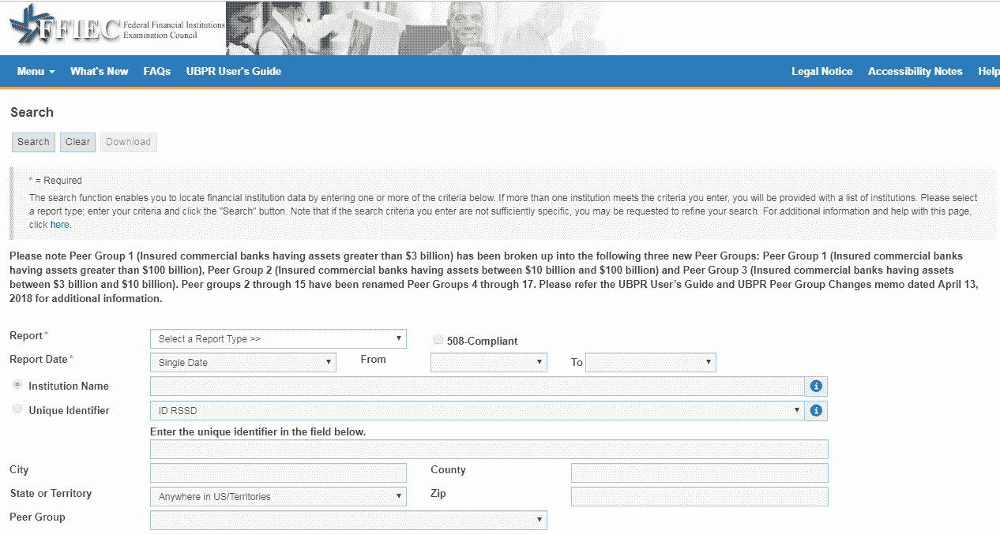
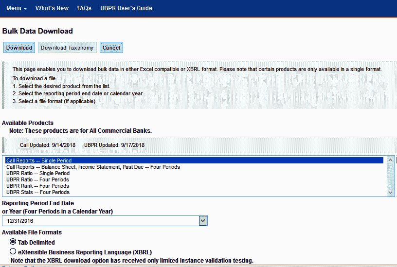
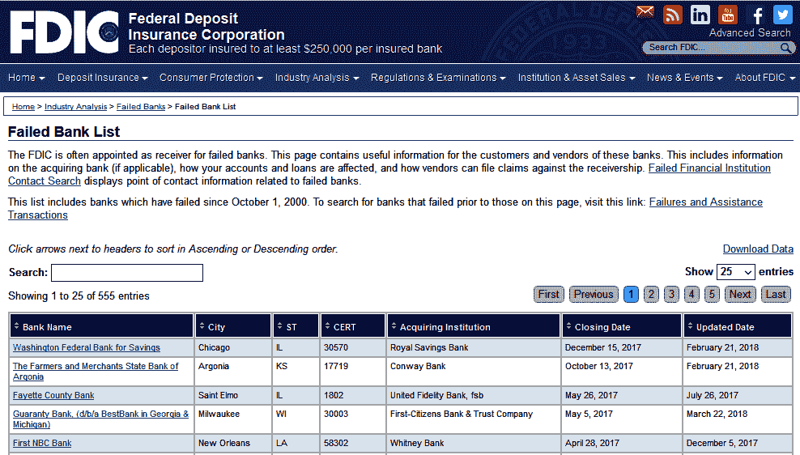
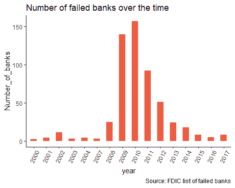
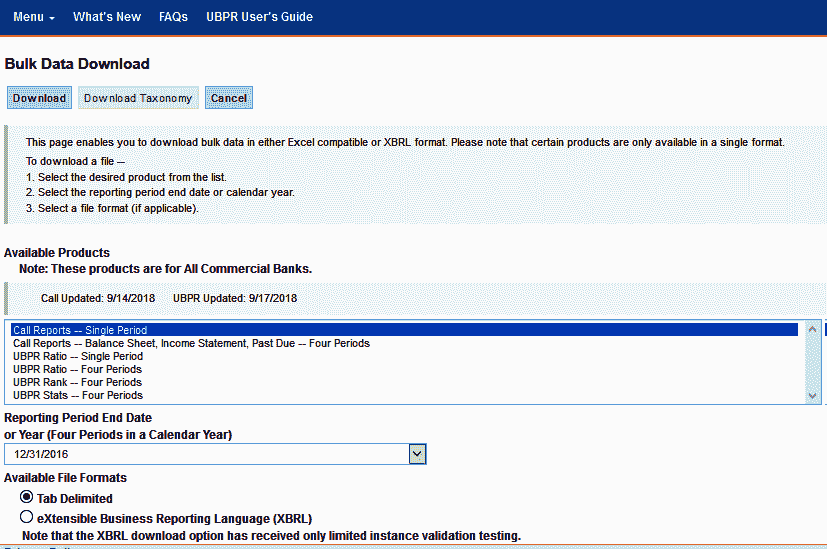

# 第二章：预测银行失败 - 数据收集

在每个模型开发中，我们需要获取足够的数据来构建模型。非常常见的是阅读“垃圾输入，垃圾输出”这个表达，这与如果你用糟糕的数据开发模型，结果模型也会很糟糕的事实相关。

尤其是在机器学习应用中，我们期望拥有大量数据，尽管在许多情况下并非如此。无论可用信息的数量如何，数据的质量是最重要的问题。

此外，作为一个开发者，拥有结构化数据非常重要，因为它可以立即进行操作。然而，数据通常以非结构化形式存在，这意味着处理和准备用于开发需要花费大量时间。许多人认为机器学习应用仅基于使用新的算法或技术，而实际上这个过程比这更复杂，需要更多时间来理解你所拥有的数据，以获得所有观察的最大价值。通过本书中我们将讨论的实际情况，我们将观察到数据收集、清洗和准备是一些最重要且耗时的工作。

在本章中，我们将探讨如何为我们的问题陈述收集数据：

+   收集财务数据

+   收集目标变量

+   数据结构化

# 收集财务数据

我们将从**联邦存款保险公司**（**FDIC**）网站（[`www.fdic.gov/`](https://www.fdic.gov/)）获取我们的数据。FDIC 是一个由美国国会领导的独立机构，其目标是维护人民的信心和金融系统的稳定。

# 为什么选择 FDIC？

FDIC 为美国商业银行和储蓄机构的存款人提供存款保险。因此，如果一家美国银行倒闭并关闭，FDIC 保证存款人不会损失他们的储蓄。最高可保证 25 万美元。

FDIC 还检查和监督某些金融机构。这些机构有义务定期报告与以下相关的财务报表的详细信息：

+   资本水平

+   清偿能力

+   资产的质量、类型、流动性和多元化

+   贷款和投资集中度

+   收益

+   流动性

银行的信息在 FDIC 网站上公开可用，我们可以下载用于我们的目的。我们会发现信息已经以所谓的**统一银行绩效报告**（**UBPR**）的形式结构化，它包括从财务报表中结合不同账户的几个比率。

例如，如果您想获取特定银行的 UBPR，或者只是想查看任何其他 UBPR 报告，您可以在[`cdr.ffiec.gov/public/ManageFacsimiles.aspx`](https://cdr.ffiec.gov/public/ManageFacsimiles.aspx)选择统一银行绩效报告（UBPR）：



报告下拉菜单允许选择 UBPR。我们可以通过名称或其他选项（如 FDIC 证书号码）搜索单个银行。此外，通过访问此链接[`cdr.ffiec.gov/public/PWS/DownloadBulkData.aspx`](https://cdr.ffiec.gov/public/PWS/DownloadBulkData.aspx)，可以同时下载所有可用银行的详细信息。

例如，以下截图显示了如何以文本格式下载 2016 年财务比率的批量数据：



您应仅选择“UBPR 比率 - 单期”选项，然后选择所需的日期（12/31/2016），最后设置输出格式，例如，制表符分隔。

在这个练习中，我们需要下载许多文件，从 2002 年到 2016 年每年一个。如果您不想下载数据，则没有必要下载。在代码中应用相关步骤后，R 工作空间将被保存，并且这个备份可供读者使用，无需花费时间运行代码或下载信息。

在我学习任何编程语言的经验中，当其他学习者进步时，花费时间在代码中寻找错误是非常令人沮丧的。因此，这些工作空间允许读者永远不会因为特定代码行的问题或甚至在我们的计算机上无法正常工作的具体包而感到沮丧。

在这种情况下，信息以文本分隔文件的形式下载，这使得以后上传到 R 中变得更加容易。对于每一年的每个 ZIP 文件都包含几个文本文件。这些文本文件包含关于银行特定领域的季度相关信息。2002 年到 2016 年所有 ZIP 文件的总大小达到 800MB。

# 列出文件

我们应该在电脑中为每年的文件创建一个文件夹，其中每个 ZIP 文件都需要解压缩。

一旦创建了文件夹，我们就可以在 R 中编写以下代码来列出我们创建的所有文件夹：

```py
myfiles <- list.files(path = "../MachineLearning/Banks_model/Data", pattern = "20",  full.names = TRUE)

 print(myfiles)
##  [1] "../MachineLearning/Banks_model/Data/2002"
##  [2] "../MachineLearning/Banks_model/Data/2003"
##  [3] "../MachineLearning/Banks_model/Data/2004"
##  [4] "../MachineLearning/Banks_model/Data/2005"
##  [5] "../MachineLearning/Banks_model/Data/2006"
##  [6] "../MachineLearning/Banks_model/Data/2007"
##  [7] "../MachineLearning/Banks_model/Data/2008"
##  [8] "../MachineLearning/Banks_model/Data/2009"
##  [9] "../MachineLearning/Banks_model/Data/2010"
## [10] "../MachineLearning/Banks_model/Data/2011"
## [11] "../MachineLearning/Banks_model/Data/2012"
## [12] "../MachineLearning/Banks_model/Data/2013"
## [13] "../MachineLearning/Banks_model/Data/2014"
## [14] "../MachineLearning/Banks_model/Data/2015"
## [15] "../MachineLearning/Banks_model/Data/2016"
```

`pattern`选项允许我们搜索所有名称中包含`20`的文件夹，遍历我们之前创建的所有文件夹。

# 查找文件

让我们读取`myfiles`列表中每个文件夹包含的所有`.txt`文件。一旦为每个年份读取了`.txt`文件，它们就会合并成一个单一的表格。这个过程需要几分钟才能完成（在我的情况下，几乎需要 30 分钟）。

```py
library(readr)

 t <- proc.time()

 for (i in 1:length(myfiles)){

 tables<-list()
 myfiles <- list.files(path = "../MachineLearning/Banks_model/Data", pattern = "20",  full.names = TRUE)

 filelist <- list.files(path = myfiles[i], pattern = "*",  full.names = TRUE)
 filelist<-filelist[1:(length(filelist)-1)]

 for (h in 1:length(filelist)){

 aux = as.data.frame(read_delim(filelist[h],  "\t", escape_double = FALSE, col_names = FALSE, trim_ws = TRUE, skip = 2))

 variables<-colnames(as.data.frame(read_delim(filelist[h],  "\t", escape_double = FALSE, col_names = TRUE, trim_ws = TRUE, skip = 0)))

 colnames(aux)<-variables

 dataset_name<-paste("aux",h,sep='')
 tables[[h]]<-assign(dataset_name,aux)

 }

 final_data_name<-paste("year",i+2001,sep='')
 union <- Reduce(function(x, y) merge(x, y, all=T,
     by=c("ID RSSD","Reporting Period")), tables, accumulate=F)

 assign(final_data_name,union)
 rm(list=ls()[! ls() %in% c(ls(pattern="year*"),"tables","t")])
 }

 proc.time() - t
```

因此，它首先列出我们创建的所有文件夹。然后，它列出每个文件夹中的所有`.txt`文件并将它们读入 R。单个`.txt`文件提供不同的数据框，然后合并成一个单一的表格。代码的结果是创建了 16 个不同的表格，每个表格包含一个特定年份的信息。

# 合并结果

现在我们使用`rbind`函数合并年度表格。这是可能的，因为所有表格包含的确切列数相同：

```py
rm(tables)
 database<-rbind(year2002,year2003,year2004,year2005,year2006,year2007,year2008,year2009,year2010,year2011,year2012,year2013,year2014,year2015,year2016)
```

# 删除表格

使用 `rm()` 命令，我们可以删除工作空间中除 `database` 之外的所有表格：

```py
rm(list=ls()[! ls() %in% c(ls(pattern="database"))])
```

# 了解你的观测值

数据库包含总共 `420404` 个观测值和 `1571` 列：

```py
print("Number of observations:")
## [1] "Number of observations:"
print(nrow(database))
## [1] 420404
print("Number of columns/variables:")
## [1] "Number of columns/variables:"
ncol(database)
## [1] 1571
```

让我们看看数据集现在看起来像什么，或者至少，前几个观测值和列：

```py
head(database[,1:5])
 ##   ID RSSD       Reporting Period UBPR1795 UBPR3123.x UBPR4635
 ## 1 1000052 12/31/2002 11:59:59 PM      958       1264      996
 ## 2 1000100 12/31/2002 11:59:59 PM      -26       2250       33
 ## 3 1000276 12/31/2002 11:59:59 PM       46        719       86
 ## 4 1000409 12/31/2002 11:59:59 PM    13926      57059    19212
 ## 5 1000511 12/31/2002 11:59:59 PM       37        514       86
 ## 6 1000557 12/31/2002 11:59:59 PM        0        120       16
```

如您所见，第一列是每个银行的标识符。在第二列中，提供了财务信息的参考日期。其余的列使用 `UBPR` 前缀和数字编码。这种情况在实际情况中非常常见，因为有很多变量可用，但它们的含义是未知的。这种情况可能非常有问题，因为我们并不确切知道某些变量是否考虑了目标变量，或者变量是否将在模型实施时可用。

在我们的情况下，这个问题实际上并不是一个问题，因为你可以找到一个包含变量含义的字典，位于[`cdr.ffiec.gov/CDRDownload/CDR/UserGuide/v96/FFIEC%20UBPR%20Complete%20User%20Guide_2019-01-11.Zip`](https://cdr.ffiec.gov/CDRDownload/CDR/UserGuide/v96/FFIEC%20UBPR%20Complete%20User%20Guide_2019-01-11.Zip)。

例如，第一个变量 `UBPR1795` 的含义是净信贷损失，衡量由于未偿还而产生的损失，导致银行贷款的总金额。

# 处理重复项

当我们将不同的文本文件合并成每年一个表格时，一些列被重复了，因为它们同时包含在多个文本文件中。例如，所有包含在名为 `Summary ratios` 的文本文件中的比率都将复制到其他文本文件中。在这些情况下，R 为变量分配 `.x` 或 `.y` 后缀。

在以下代码中，我们删除了具有 `.x` 后缀的变量，因为它们在数据库中是重复的：

```py
database[,grep(".x",colnames(database))]<-NULL
```

`grep` 函数在列名中搜索 `.x` 模式。如果检测到列中有此模式，则该列将被删除。此外，列名中的 `.y` 后缀也将被移除：

```py
var_names<-names(database)

 var_names<-gsub(".y","",var_names)

 colnames(database)<-var_names

 rm(var_names)
```

最后，导入过程还创建了一些错误和不准确变量。这些列的名称以 `X` 开头。这些变量也将被删除，如下所示：

```py
database[,grep("X",colnames(database))]<-NULL
```

让我们将工作空间保存到以下步骤：

```py
save.image("Data1.RData")
```

# 操作我们的问题

数据库包含一个表示每个银行财务报表日期的列（称为 `Reporting Period` 字段）。每个银行可以在数据集中出现多次，从 2002 年 12 月到 2016 年 12 月，每季度一次。

然而，这个字段在 R 中不被识别为日期格式：

```py
class(database$'Reporting Period')
## [1] "character"
```

让我们将此字段转换为日期格式：

1.  首先，从 `Reporting Period` 列中提取左侧部分。前 10 个字符被提取到一个名为 `Date` 的新变量中：

```py
database$Date<-substr(database$'Reporting Period',1,10)
```

1.  让我们使用 `as.Date` 命令将这个新列转换为日期格式：

```py
database$Date<-as.Date(database$Date,"%m/%d/%Y")
```

1.  最后，删除 `Reporting Period` 字段，因为它不再相关：

```py
database$'Reporting Period'<-NULL
```

我们有关于 2002 年至 2016 年所有季度的信息，但我们只对年末提供的财务信息感兴趣。

让我们过滤数据集，以考虑每年 12 月的信息：

```py
database<-database[as.numeric(format(database$Date, "%m"))==12,]
```

在上一行代码之后，我们的数据库包含`110239`个观测值：

```py
print("Observations in the filtered dataset:")
## [1] "Observations in the filtered dataset:"
nrow(database)
## [1] 110239
```

此外，它包含`1494`个变量，如下面的代码块所示：

```py
print("Columns in the filtered dataset:")
## [1] "Columns in the filtered dataset:"
ncol(database)
## [1] 1494
```

到目前为止，让我们保存工作区的一个备份：

```py
save.image("Data2.RData")
```

您现在可以查看数据集中的所有变量：

```py
database_names<-data.frame(colnames(database))
```

由于变量数量相当高，建议将变量的名称保存到 Excel 文件中：

```py
write.csv(database_names,file="database_names.csv")
rm(database_names)
```

如您所见，数据集中有一些变量的名称是一种代码。我们还知道，可以在 FDIC 网站上找到每个变量的含义。这种情况真的很常见，尤其是在信用风险应用中，信息提供了关于账户变动或交易详情。

以某种方式理解变量的含义，或者至少了解它们是如何生成的，这是很重要的。如果不这样做，我们可以包括一些与目标变量非常接近的变量作为预测变量，甚至包括在模型实施时不可用的变量。然而，我们知道数据集中没有明显的目标。因此，让我们收集我们问题的目标变量。

# 收集目标变量

我们需要确定一家银行是否在过去失败过——这将是我们目标。此信息也可在 FDIC 网站上找到，网址为[`www.fdic.gov/bank/individual/failed/banklist.html`](https://www.fdic.gov/bank/individual/failed/banklist.html)。

网站包括自 2000 年 10 月以来失败的银行，这涵盖了我们的整个数据集：



让我们看看实现这一目标的步骤：

1.  将此信息下载到`.csv`文件中：

```py
download.file("https://www.fdic.gov/bank/individual/failed/banklist.csv", "failed_banks.csv",method="auto", quiet=FALSE, mode = "wb", cacheOK = TRUE)
```

即使这个列表定期更新，因为历史信息不会改变，但结果仍然是可复制的。无论如何，用于开发的文件也包含在这本书的数据存储库中。

1.  现在，将下载的文件上传到 R 中，如下所示：

```py
failed_banks<-read.csv("failed_banks.csv", header=TRUE)
```

1.  使用以下命令查看所有变量以及失败银行列表中包含的数据的一些详细信息：

```py
str(failed_banks) 
```

1.  让我们打印前十行，如下所示：

```py
head(failed_banks,n=10)# First 10 rows of dataset
 ##                                                Bank.Name
 ## 1                    Washington Federal Bank for Savings
 ## 2        The Farmers and Merchants State Bank of Argonia
 ## 3                                    Fayette County Bank
 ## 4  Guaranty Bank, (d/b/a BestBank in Georgia & Michigan)
 ## 5                                         First NBC Bank
 ## 6                                          Proficio Bank
 ## 7                          Seaway Bank and Trust Company
 ## 8                                 Harvest Community Bank
 ## 9                                            Allied Bank
 ## 10                          The Woodbury Banking Company
 ##                  City ST  CERT               Acquiring.Institution
 ## 1             Chicago IL 30570                  Royal Savings Bank
 ## 2             Argonia KS 17719                         Conway Bank
 ## 3          Saint Elmo IL  1802           United Fidelity Bank, fsb
 ## 4           Milwaukee WI 30003 First-Citizens Bank & Trust Company
 ## 5         New Orleans LA 58302                        Whitney Bank
 ## 6  Cottonwood Heights UT 35495                   Cache Valley Bank
 ## 7             Chicago IL 19328                 State Bank of Texas
 ## 8          Pennsville NJ 34951 First-Citizens Bank & Trust Company
 ## 9            Mulberry AR    91                        Today's Bank
 ## 10           Woodbury GA 11297                         United Bank
 ##    Closing.Date Updated.Date
 ## 1     15-Dec-17    21-Feb-18
 ## 2     13-Oct-17    21-Feb-18
 ## 3     26-May-17    26-Jul-17
 ## 4      5-May-17    22-Mar-18
 ## 5     28-Apr-17     5-Dec-17
 ## 6      3-Mar-17     7-Mar-18
 ## 7     27-Jan-17    18-May-17
 ## 8     13-Jan-17    18-May-17
 ## 9     23-Sep-16    25-Sep-17
 ## 10    19-Aug-16    13-Dec-18
```

文件包含以下相关信息：

+   失败银行的数目

+   这些银行所在的状态

+   他们失败的时间

+   收购机构

绘制失败随时间演变的趋势将非常有趣。为此，让我们检查`Closing.Date`列是否被识别为日期：

```py
class(failed_banks$Closing.Date)
 ## [1] "factor"
```

这列不是日期。让我们使用类似于`as.Date`的另一个命令，通过`lubridate`库将其转换为日期：

```py
library(lubridate)
failed_banks$Closing.Date <- dmy(failed_banks$Closing.Date)
class(failed_banks$Closing.Date)
 ## [1] "Date"
```

# 数据结构化

在获取了我们的目标变量并了解了我们的数据集之后，我们现在可以继续根据我们的目标进行实际的数据收集。在这里，我们将尝试根据*收集目标变量*部分中描述的不同年份获取银行的资料。

要做到这一点，我们创建一个新的变量，只提取银行破产时的年份，然后按年份计算银行的数目：

```py
failed_banks$year<-as.numeric(format(failed_banks$Closing.Date, "%Y"))

 Failed_by_Year<-as.data.frame(table(failed_banks$year))
 colnames(Failed_by_Year)<-c("year","Number_of_banks")

 print(Failed_by_Year)
 ##    year Number_of_banks
 ## 1  2000               2
 ## 2  2001               4
 ## 3  2002              11
 ## 4  2003               3
 ## 5  2004               4
 ## 6  2007               3
 ## 7  2008              25
 ## 8  2009             140
 ## 9  2010             157
 ## 10 2011              92
 ## 11 2012              51
 ## 12 2013              24
 ## 13 2014              18
 ## 14 2015               8
 ## 15 2016               5
 ## 16 2017               8
```

让我们以图形方式查看我们的数据：

```py
library(ggplot2)

 theme_set(theme_classic())

 # Plot
 g <- ggplot(Failed_by_Year, aes(year, Number_of_banks))
 g + geom_bar(stat="identity", width = 0.5, fill="tomato2") +
       labs(title="Number of failed banks over time",
       caption="Source: FDIC list of failed banks")+
       theme(axis.text.x = element_text(angle=65, vjust=0.6))
```

上述代码给出了以下输出：



如前图所示，在 2001 年和 2002 年的互联网泡沫危机期间以及从 2008 年开始的金融危机期间，破产银行的数目有所增加。

现在我们需要将破产银行的列表与我们的数据库合并。在破产银行数据集中，有一个包含每个银行 ID 的列，具体是`证书号码`列。这是 FDIC 分配的一个数字，用于唯一标识机构和保险证书。

然而，在包含财务信息的其他数据库中，ID 号码被称为 RSSD ID，这是不同的。这个数字是由联邦储备系统分配给机构的唯一标识符。

那么，我们如何将这两个数据集连接起来呢？我们需要在两个标识符之间建立一个映射。这个映射也可以在 FDIC 网站上找到，再次是在我们之前下载所有财务报表批量数据的同一部分。记住，网站可以通过[`cdr.ffiec.gov/public/pws/downloadbulkdata.aspx`](https://cdr.ffiec.gov/public/pws/downloadbulkdata.aspx)访问。

在这个网站上，我们需要在相关期间（2002-2016）下载呼叫报告——单期文件：



在最近下载的每个文件中，我们都可以找到一个名为`FFIEC CDR Call Bulk POR mmddyyyy.txt`的文件。

这个文件包含了关于每家银行的全部信息。首先，我们使用它们为破产银行列表中的每家银行分配一个`ID RSSD`号码。然后，我们可以使用`ID RSSD`字段将财务比率与破产银行列表连接起来。

下载完文件后，使用`list.files`函数列出您系统中的所有可用文件。

我们需要找到所有名称中包含`FFIEC CDR Call Bulk POR`的文件：

```py
myfiles <- list.files(path = "../MachineLearning/Banks_model/Data/IDS", pattern = "FFIEC CDR Call Bulk POR",  full.names = TRUE)
```

现在，我们将所有文件读入 R 中，并将它们合并到一个名为`IDs`的数据框中：

此外，还创建了一个名为`year`的新列。这个列反映了对应信息的年份。我们需要存储`IDs`和日期，因为标识符可能会随时间变化。例如，当两家银行合并时，其中一家银行将在数据集中消失，而另一家可以保持相同的号码或获得一个新的号码。

您可以创建一个名为`IDs`的新空框架，如下所示：

```py
IDs<-matrix("NA",0,4)
 colnames(IDs)<-c("ID RSSD","CERT","Name","id_year")
 IDs<-as.data.frame(IDs)
```

然后，我们迭代地读取所有文本文件，并将它们合并到这个`IDs`数据框中：

```py
for (i in 1:length(myfiles))

 { 
 aux <- read.delim(myfiles[i])
 aux$year<-as.numeric(2000+i)
 aux<-aux[,c(1,2,6,ncol(aux))]
 colnames(aux)<-c("ID RSSD","CERT","Name","id_year")
 IDs<-rbind(IDs,aux)
 }
```

让我们按照以下方式打印出结果表：

```py
head(IDs)
 ##   ID RSSD  CERT                             Name id_year
 ## 1      37 10057           BANK OF HANCOCK COUNTY    2001
 ## 2     242  3850 FIRST COMMUNITY BANK XENIA-FLORA    2001
 ## 3     279 28868      MINEOLA COMMUNITY BANK, SSB    2001
 ## 4     354 14083                 BISON STATE BANK    2001
 ## 5     439 16498                     PEOPLES BANK    2001
 ## 6     457 10202                 LOWRY STATE BANK    2001
```

现在，一个包含`ID RSSD`框架和每个银行随时间变化的`Certificate number`列的主表已经可用。

你可以按照以下方式删除无关信息：

```py
rm(list=setdiff(ls(), c("database","failed_banks","IDs")))
```

接下来，我们将使用证书日期将`failed banks`名单和`IDs`数据集合并，但在合并之前，我们需要将两个数据集中的证书号码转换为数值格式：

```py
failed_banks$CERT<-as.numeric(failed_banks$CERT)

 IDs$CERT<-as.numeric(IDs$CERT)
```

如果我们尝试将失败银行名单与`IDs`数据集合并，我们会发现一个问题。在`failed banks`名单中有一个表示银行破产年份的列，如果我们使用年份列将两个表连接起来，则不会在`IDs`表中找到这个列。

由于`IDs`快照对应于每年的 12 月，因此一家失败的银行不可能在这一特定年份的年底就已经存在。

为了正确合并两个数据集，在`failed banks`数据集中创建一个新的变量（`id_year`），从`year`列中减去一年：

```py
failed_banks$id_year<-failed_banks$year-1
```

现在失败的银行已经使用`merge`函数与`IDs`信息连接起来。使用这个函数很简单；你只需要指定两个表以及用于连接的列名：

```py
failed_banks<-merge(failed_banks,IDs,by.x=c("CERT","id_year"),all.x=TRUE)
failed_banks<-failed_banks[,c("CERT","ID RSSD","Closing.Date")]
head(failed_banks)
 ##   CERT ID RSSD Closing.Date
 ## 1   91   28349   2016-09-23
 ## 2  151  270335   2011-02-18
 ## 3  182  454434   2010-09-17
 ## 4  416    3953   2012-06-08
 ## 5  513  124773   2011-05-20
 ## 6  916  215130   2014-10-24
```

工作空间的新备份操作如下：

```py
save.image("Data3.RData")
```

现在，可以将包含财务报表的数据库与失败银行名单合并，然后创建目标变量。我们将使用`ID RSSD`标识符将两个表连接起来：

```py
database<-merge(database,failed_banks,by=c("ID RSSD"),all.x = TRUE)
## Warning in merge.data.frame(database, failed_banks, by = c("ID RSSD"),
 ## all.x = TRUE): column name 'UBPR4340' is duplicated in the result
```

数据库中增加了两个新列：`CERT`和`Closing.Date`。前面的代码提醒我们之前未检测到的重复列。因此，我们应该删除其中一个重复的列。使用`grep`函数，我们将获得包含`UBPR4340`变量的列数：

```py
grep("UBPR4340",colnames(database))
## [1]  852 1454
```

删除出现重复变量的第二列：

```py
database[,1454]<-NULL
```

当这两个新变量（`CERT`和`Closing.Date`）中的任何一个发现缺失值时，这表明这家银行在美国金融体系中仍在运营。另一方面，如果一家银行在这些变量中包含信息，则表明这家银行已经破产。我们可以看到数据库中有多少失败的观测值：

```py
nrow(database[!is.na(database$Closing.Date),c('ID RSSD','Date','Closing.Date')])
## [1] 3705
```

数据集中有`3.705`个与失败银行对应的观测值。正如你所看到的，失败观测值的数量占总观测值的一小部分。

失败的观测值不代表独特的失败银行。这意味着一家失败的银行在最终破产之前的一段时间内有不同的财务报表。例如，对于以下代码块中提到的银行，有不同年份的财务信息可用。根据我们的数据库，这家银行在 2010 年破产：

```py
failed_data<-database[!is.na(database$Closing.Date),c('ID RSSD','Date','Closing.Date')]
 head(failed_data)
 ##     ID RSSD       Date Closing.Date
 ## 259    2451 2003-12-31   2010-07-23
 ## 260    2451 2007-12-31   2010-07-23
 ## 261    2451 2008-12-31   2010-07-23
 ## 262    2451 2005-12-31   2010-07-23
 ## 263    2451 2004-12-31   2010-07-23
 ## 264    2451 2009-12-31   2010-07-23
```

我们应该评估我们预测模型的时间范围。信息日期和关闭日期之间的差异越大，我们模型的预期预测能力就越低。解释相当简单；从五年前的当前信息预测银行的失败比从一两年前的信息预测更困难。

让我们计算一下资产负债表日期之间的差异：

```py
database$Diff<-as.numeric((database$Closing.Date-database$Date)/365)
```

我们的目标变量会是什么？我们想要预测什么？好吧，我们可以开发一个模型来预测在当前财务信息之后的六个月、一年甚至五年内的破产情况。

目标变量的定义应根据模型的目的进行，同时也要考虑到样本中失败银行或*不良*银行的数目。

标准期限根据投资组合、模型的目的以及*不良*银行或少数群体的样本而有所不同，这个样本应该足够大，以便开发一个稳健的模型。

时间跨度的定义非常重要，它决定了我们模型的目标及其未来的用途。

例如，我们可以将数据集中在财务报表后不到一年就失败的银行归类为*不良*银行：

```py
database$Default0<-ifelse(database$Diff>=1 | is.na(database$Diff),0,1)
```

根据这个定义，*不良*银行的数目将如下：

```py
table(database$Default0)
##
 ##      0      1
 ## 109763    476
```

数据集中只有`476`家银行在观察到财务信息后不到一年就失败了。

例如，以下银行在观察到财务信息后仅半年就失败了：

```py
head(database[database$Default0==1,c('ID RSSD','Date','Closing.Date','Diff')],1)
 ##     ID RSSD       Date Closing.Date      Diff
 ## 264    2451 2009-12-31   2010-07-23 0.5589041
database$Default0<-NULL
```

在这一点上，对工作空间进行了一次新的备份：

```py
save.image("Data4.RData")
```

在这个问题中，我们看到了大多数银行都是**有偿付能力的**，这些银行在样本中多次重复出现，尽管财务报表不同。

然而，保留样本中的所有良好银行并增加*不良*银行的重要性并不相关。有一些技术可以处理这个问题。

其中一个方法是为每个良好和不良观察值分配不同的权重，以便两个类别可以更加平衡。这种方法虽然有用，但会使机器学习算法的执行变得耗时得多，因为我们将会使用整个数据集，在我们的案例中，这超过了 10 万个观察值。

类别非常不平衡，正如我们在这个问题中发现的那样，可能会以负面方式影响模型拟合。为了保留所有观察值，数据子采样是非常常见的。通常执行三种主要技术：

+   **欠采样**：这可能是最简单的策略。它包括随机减少多数类到与少数类相同的大小。通过欠采样，不平衡问题得到了解决，但通常情况下，我们会减少数据集，特别是在少数类非常稀缺的情况下。如果这种情况发生，模型结果很可能会很糟糕。

+   **过采样**：通过多次随机选择少数类来达到多数类的相同大小。最常见的方法是多次复制少数观测。在问题解决方案的这个阶段，我们还没有选择用于训练或测试未来算法的数据，过采样可能会出现问题。我们将在训练集和验证集中重复未来可能发现的少数类示例，从而导致过拟合和误导性结果。

+   **其他技术**：如**合成少数过采样技术**（**SMOTE**）和**随机过采样示例**（**ROSE**）等技术减少多数类，并在少数类中创建人工新观测。

在这种情况下，我们将采用一种混合方法。

为了使以下步骤更容易，我们将重命名包含每个银行标识符的第一列：

```py
colnames(database)[1]<-"ID_RSSD"
```

现在我们将以不同的方式处理失败和非失败的银行。让我们从只包含失败银行的数据库部分开始：

```py
database_Failed<-database[!is.na(database$Diff),]
```

有`3705`个观测包含失败银行的信息：

```py
nrow(database_Failed)
## [1] 3705
```

这个样本看起来是这样的：

```py
head(database_Failed[,c("ID_RSSD","Date","Diff")])

 ##     ID_RSSD       Date      Diff
 ## 259    2451 2003-12-31 6.5643836
 ## 260    2451 2007-12-31 2.5616438
 ## 261    2451 2008-12-31 1.5589041
 ## 262    2451 2005-12-31 4.5616438
 ## 263    2451 2004-12-31 5.5616438
 ## 264    2451 2009-12-31 0.5589041
```

如显示的那样，在失败银行的列表中，我们有几个年份的相同银行的财务信息。每个银行距离破产日期最近的财务信息将被最终选中。

为了做到这一点，我们创建一个辅助表。这个表将包含银行观测到失败日期的最小距离。为此，我们现在将使用一个有用的包，`sqldf`。这个包允许我们像使用 SQL 语言一样编写查询：

```py
aux<-database_Failed[,c('ID_RSSD','Diff')]

library(sqldf)
aux<-sqldf("SELECT ID_RSSD,
       min(Diff) as min_diff,
       max(Diff) as max_diff
       from aux group by ID_RSSD")

 head(aux)

 ##   ID_RSSD  min_diff max_diff
 ## 1    2451 0.5589041 7.564384
 ## 2    3953 0.4383562 9.443836
 ## 3   15536 0.8301370 6.835616
 ## 4   16337 0.7506849 7.756164
 ## 5   20370 0.4027397 8.408219
 ## 6   20866 0.5589041 7.564384
```

现在，我们的包含失败银行的样本与这个辅助表合并在一起：

```py
database_Failed<-merge(database_Failed,aux,by=c("ID_RSSD"))
```

然后，我们只选择财务报表日期与截止日期之间的差异与`min_diff`列相同的观测：

```py
database_Failed<-database_Failed[database_Failed$Diff==database_Failed$min_diff,]
```

按以下方式删除最近创建的列：

```py
database_Failed$min_diff<-NULL
database_Failed$max_diff<-NULL
```

现在，我们想要减少非失败银行的数目。为此，我们随机选择每个银行的财务报表的一年：

使用以下代码提取非失败银行的观测总数：

```py
database_NonFailed<-database[is.na(database$Diff),]
```

为了随机选择财务报表，我们应该遵循以下步骤：

1.  首先，建立一个`种子`。在生成随机数时，需要一个种子来获得可重复的结果。使用相同的`种子`将允许你获得与本书中描述的相同的结果：

```py
set.seed(10)
```

1.  生成随机数；我们生成的随机数数量与非失败银行数据集中的行数相同：

```py
Random<-runif(nrow(database_NonFailed))
```

1.  将随机数作为新列添加到数据库中：

```py
database_NonFailed<-cbind(database_NonFailed,Random)
```

1.  计算每个银行的随机数最大值，并创建一个新的名为`max`的数据框：

```py
max<-aggregate(database_NonFailed$Random, by = list(database_NonFailed$ID_RSSD), max)

 colnames(max)<-c("ID_RSSD","max")
```

1.  将非失败银行的数据框与`max`数据框连接。然后，只选择随机数与每个银行最大值相同的观测：

```py
database_NonFailed<-merge(database_NonFailed,max,all.x=TRUE)
 database_NonFailed<-    database_NonFailed[database_NonFailed$max==database_NonFailed$Random,]
```

1.  按以下方式删除无关的列：

```py
database_NonFailed$max<-NULL
database_NonFailed$Random<-NULL
```

使用 `dim` 函数，我们可以获得非失败银行的观测数。您可以看到，*良好*银行的数目已经显著减少：

```py
dim(database_NonFailed)

## [1] 9654 1496
```

只有 `9654` 个观测值和 `1496` 个变量。

因此，我们最终可以通过结合之前的数据框来构建我们的数据集以开发我们的模型：

```py
Model_database<-rbind(database_NonFailed,database_Failed)
```

目标变量现在也可以定义了：

```py
Model_database$Default<-ifelse(is.na(Model_database$Diff),0,1)
```

工作空间中加载的其他对象可以按照以下方式删除：

```py
rm(list=setdiff(ls(), c("Model_database")))
```

通常可以使用当前变量来定义新特征，然后将其包含在开发中。这些新变量通常被称为**派生变量**。因此，我们可以将派生变量定义为从一个或多个基础变量计算出的新变量。

一个非常直观的例子是从包含不同客户信息的数据库中计算一个名为 `age` 的变量。这个变量可以计算为该客户存储在系统中的日期与他们的出生日期之间的差异。

新变量应添加有用且非冗余的信息，这将有助于后续的学习，并有助于泛化步骤。

特征生成不应与特征提取混淆。特征提取与降维相关，因为它将原始特征进行转换并从潜在的原生和派生特征池中选择一个子集，这些特征可以用于我们的模型。

然而，在我们处理的问题中，构建额外的变量并不是非常相关。我们有一个非常大的数据集，测量了金融机构分析中的所有相关方面。

此外，在本部分开发中，那些在数据提取或处理阶段被包含，但对模型开发没有作用的变量必须被删除。

因此，以下变量将被删除：

```py
Model_database$CERT<-NULL

 Model_database$Closing.Date<-NULL

 Model_database$Diff<-NULL
```

所有这些步骤都是构建我们的数据库所需要的。您可以看到我们在收集数据、目标变量以及尝试组织本章中的所有数据上花费了多少时间。在下一章中，我们将开始分析我们所获得的数据。在继续之前，您可以进行最后的备份，如下所示：

```py
save.image("Data5.RData")
```

# 摘要

在本章中，我们开始收集开发预测银行失败的模型所需的数据。在这种情况下，我们下载了大量数据，并对它进行了结构化。此外，我们创建了我们的目标变量。在本章结束时，您应该已经了解到数据收集是模型开发的第一步，也是最重要的一步。当您处理自己的问题时，请花时间理解问题，然后考虑您需要什么样的数据以及如何获取它。在下一章中，我们将对所获得的数据进行描述性分析。
