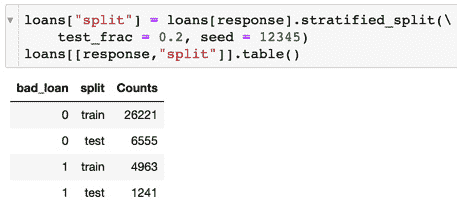
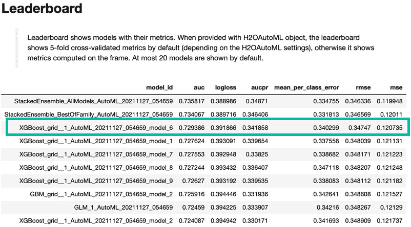
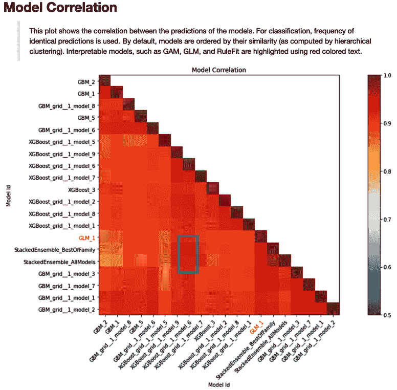
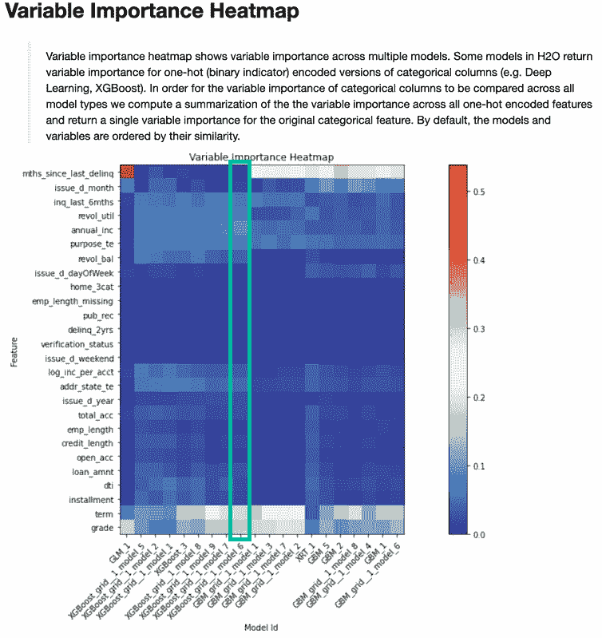
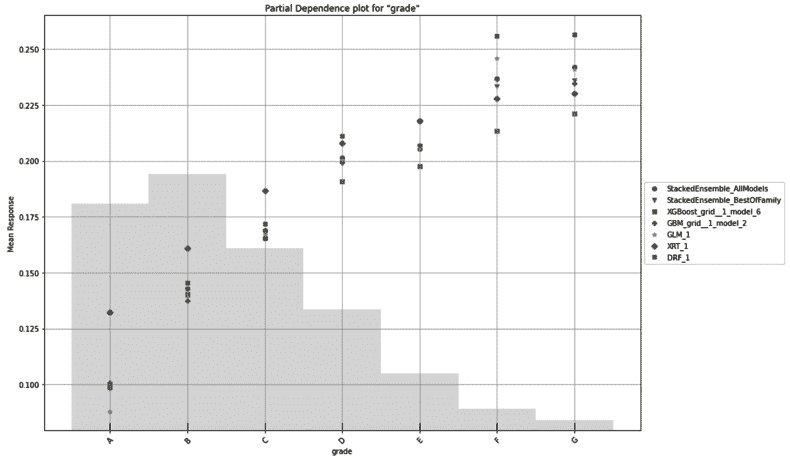
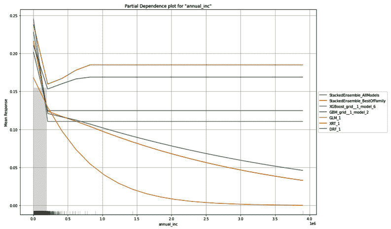
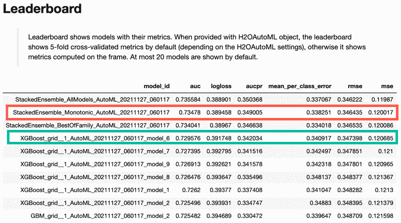
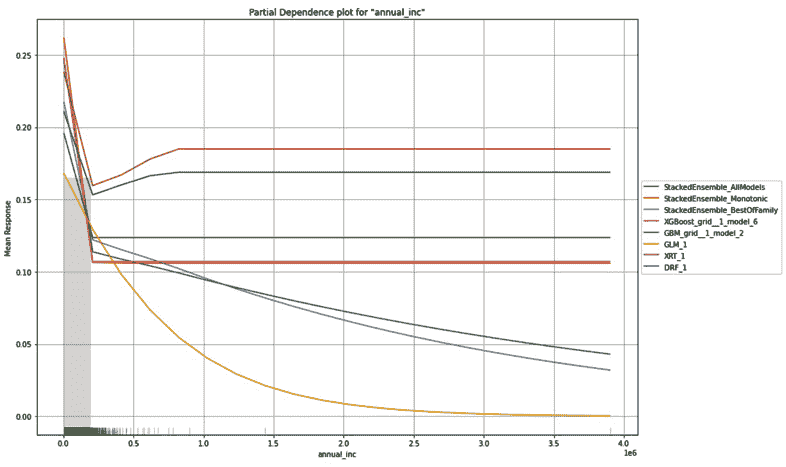

# 第八章：整合一切

在本章中，我们将回顾我们在*第三章*和*基本工作流程 – 数据到可部署模型*中首次介绍的*Lending Club 贷款申请*数据。这次，我们以大多数数据科学项目的方式开始，即从一个原始数据文件和一个一般目标或问题开始。在这个过程中，我们将细化数据和问题陈述，使其与业务相关，并且可以用可用数据回答。数据科学家很少从建模准备好的数据开始；因此，本章的处理更准确地反映了企业中数据科学家的工作。然后我们将对数据进行建模，评估各种候选模型，并根据需要更新它们，直到我们得到一个最终模型。我们将评估最终模型并说明模型部署所需的准备步骤。这加强了我们从*第五章*到*第七章*中介绍的内容。

到本章结束时，您将能够处理一个具有原始数据源的未结构化问题，并创建一个可部署的模型来回答一个精细的预测问题。为了完整性，我们将包括完成每个步骤（数据准备、特征工程、模型构建和评估）所需的全部代码。一般来说，任何在*第五章*到*第七章*中已经介绍过的代码都将保留注释。

本章分为四个部分，每个部分都有单独的步骤。部分列表如下：

+   数据整理

+   特征工程

+   模型构建和评估

+   模型管道部署准备

# 技术要求

如果您在此阶段尚未设置您的 H2O 环境，请参阅*附录* *– 启动 H2O 集群的替代方法*。

# 数据整理

经常有人说，数据科学家的工作中有 80-90%是处理数据。至少，您应该了解数据的粒度（即行代表什么）以及了解数据集中每一列的含义。面对原始数据源时，需要多个步骤来清理、组织和转换您的数据，使其成为建模准备好的数据集格式。

在*第三章*、*第五章*和*第七章*中使用的*Lending Club*示例数据集是从我们在这里开始的原始数据文件中派生出来的。在本节中，我们将说明以下步骤：

1.  导入原始数据并确定要保留的列。

1.  定义问题，并创建响应变量。

1.  将字符串中的隐含数值数据转换为数值。

1.  清理任何混乱的分类列。

让我们从第一步开始：导入数据。

## 导入原始数据

我们使用以下代码导入原始数据文件：

```py
input_csv = "rawloans.csv"
```

```py
loans = h2o.import_file(input_csv,
```

```py
             col_types = {"int_rate": "string",
```

```py
                          "revol_util": "string",
```

```py
                          "emp_length": "string",
```

```py
                          "verification_status": "string"})
```

在`h2o.import_file`代码中的字典指定了四个输入变量的输入列类型为`string`：`int_rate`、`revol_util`、`emp_length`和`verification_status`。明确指定列类型可以确保列以建模者期望的方式读取。如果没有此代码，这些字符串变量可能被读取为具有多个级别的分类列。

数据集的维度是通过以下命令获得的：

```py
loans.dim
```

这返回了 42,536 行（对应 42,536 个客户信用申请）和 52 列。接下来，我们指定我们希望保留用于分析的 22 列：

```py
keep = ['addr_state', 'annual_inc', 'delinq_2yrs',
```

```py
        'dti', 'earliest_cr_line', 'emp_length', 'grade',
```

```py
        'home_ownership', 'inq_last_6mths', 'installment',
```

```py
        'issue_d', 'loan_amnt', 'loan_status',
```

```py
        'mths_since_last_delinq', 'open_acc', 'pub_rec',
```

```py
        'purpose', 'revol_bal', 'revol_util', 'term',
```

```py
        'total_acc', 'verification_status']
```

我们想使用`drop`方法删除剩余的列：

```py
remove = list(set(loans.columns) - set(keep))
```

```py
loans = loans.drop(remove)
```

但是，我们删除的 30 列包含了一些内容，例如贷款目的的文本描述、地址或邮编等额外客户信息、几乎完全缺失信息的列或其他数据质量问题等。从原始数据源中选择适当的列是数据科学家需要花费大量时间和精力的重要任务。

我们保留的列是我们认为最有可能是预测性的列。每个列的解释如下：

+   `addr_state`: 这是借款人居住的美国州。

+   `annual_inc`: 这是借款人自行报告的年收入。

+   `delinq_2yrs`: 这是借款人在过去两年内超过 30 天未付款的次数。

+   `dti`: 这是债务收入比（当前债务除以收入）。

+   `earliest_cr_line`: 这是最早信用额度的日期（通常，较长的信用历史与更好的信用风险相关）。

+   `emp_length`: 这是就业年限。

+   `grade`: 这是贷款人根据 A 到 G 的风险评级分配给贷款的评级。

+   `home_ownership`: 借款人拥有房产还是租房？

+   `inq_last_6mths`: 这是过去 6 个月内的信用查询次数。

+   `installment`: 这是借款人每月应还的金额。

+   `issue_d`: 这是贷款发放的日期。

+   `loan_amnt`: 这是借给借款人的总金额。

+   `loan_status`: 这是一个类别。

+   `mths_since_last_delinq`: 这是自上次违约以来月份的数量。

+   `open_acc`: 这是开放的信用额度数量。

+   `pub_rec`: 这是负面公共记录（破产、税收留置权和判决）的数量。

+   `purpose`: 这是借款人声明的贷款目的。

+   `revol_bal`: 这是循环余额（即在账单周期结束时信用卡上的欠款金额）。

+   `revol_util`: 这是循环利用率（即使用的信用额度除以借款人可用的总信用额度）。

+   `term`: 这是贷款在月份中的付款次数（要么是 36 个月，要么是 60 个月）。

+   `total_acct`: 这是借款人的总信用额度数量。

+   `verification_status`：这告诉我们收入是否经过验证。

假设我们的数据列已经被正确选择，我们可以继续下一步：创建响应变量。

## 定义问题和创建响应变量

响应变量的创建取决于问题定义。本用例的目标是预测哪些客户会违约。预测贷款违约的模型需要一个区分良好和不良贷款的响应变量。让我们首先使用以下代码调查`loan_status`变量：

```py
loans["loan_status"].table().head(20)
```

这将生成一个表格，其中存储了我们数据中贷款状态的所有可能值：

![图 8.1 – 从原始 Lending Club 贷款违约数据集中提取的贷款状态类别]

![img/B16721_08_001.jpg]

图 8.1 – 从原始 Lending Club 贷款违约数据集中提取的贷款状态类别

如*图 8.1*所示，`loan_status`变量相对复杂，包含 11 个类别，有些是重复的或重叠的。例如，`Charged Off`表示有 5,435 笔贷款是坏账。`Default`包含另外 7 笔。`Fully Paid`表明有 30,843 笔贷款是好的。一些贷款，例如由`Current`或`Late`类别指示的贷款，仍然是持续的，因此尚未是好或坏。

提供了多个不符合信贷政策的贷款。为什么允许这种情况尚不清楚，值得与数据源核实。信贷政策是否改变，使得这些贷款属于更早的批次？这些是正式的覆盖还是意外的？无论情况如何，这些类别都暗示了一个可能需要我们关注的潜在不同群体。我们应该完全删除这些贷款，将问题忽略并合并到相应的类别中，还是创建一个`符合信贷政策`的指标变量并直接对它们进行建模？对数据的更好理解将允许数据科学家做出明智的决定。

最后，我们需要一个基于已偿还或违约的贷款群体的二元响应变量。首先，过滤掉任何持续贷款。

### 移除持续贷款

我们需要构建一个只包含已违约或已全额偿还的贷款的模型。持续贷款的`loan_status`有如`Current`或`In Grace Period`等状态。以下代码捕获了那些状态指示持续贷款的行：

```py
ongoing_status = [
```

```py
    "Current",
```

```py
    "In Grace Period",
```

```py
    "Late (16-30 days)",
```

```py
    "Late (31-120 days)",
```

```py
    "Does not meet the credit policy.  Status:Current",
```

```py
    "Does not meet the credit policy.  Status:In Grace Period"
```

```py
]
```

我们使用以下代码来移除这些持续贷款并显示剩余贷款的状态：

```py
loans = loans[~loans["loan_status"].isin(ongoing_status)]
```

```py
loans["loan_status"].table()
```

结果状态类别显示在*图 8.2*中：

![图 8.2 – 过滤后的持续贷款的贷款状态类别]

![img/B16721_08_002.jpg]

图 8.2 – 过滤后的持续贷款的贷款状态类别

注意，在*图 8.2*中，现在需要将五个贷款状态类别总结成一个二元响应变量。这将在下一步中详细说明。

### 定义二元响应变量

我们首先创建一个`fully_paid`列表来总结贷款状态类别：

```py
fully_paid = [
```

```py
    "Fully Paid",
```

```py
    "Does not meet the credit policy.  Status:Fully Paid"
```

```py
]
```

接下来，让我们创建一个二进制响应列，`bad_loan`，作为任何未完全偿还的贷款的指示符：

```py
response = "bad_loan"
```

```py
loans[response] = ~(loans["loan_status"].isin(fully_paid))
```

```py
loans[response] = loans[response].asfactor()
```

最后，移除原始贷款状态列：

```py
loans = loans.drop("loan_status")
```

我们移除了原始的贷款状态列，因为构建我们的预测模型所需的信息现在包含在`bad_loan`响应变量中。

接下来，我们将字符串数据转换为数值。

## 将字符串中的隐含数值数据转换为数值

数据可能以各种方式变得混乱。在上一个步骤中，我们看到了变量有时可能包含冗余类别，这些类别可能从汇总中受益。数据值显示和存储的格式也可能引起问题。因此，我们自然解释为数字的 28%，通常是由计算机以字符字符串的形式输入的。将隐含的数值数据转换为实际数值数据是一个非常典型的数据质量任务。

考虑`revol_util`和`emp_length`列：

```py
loans[["revol_util", "emp_length"]].head()
```

输出显示在下图中：

![图 8.3 – 存储为字符串并需要转换为数值的变量]

![图片 B16721_08_003.jpg]

图 8.3 – 存储为字符串并需要转换为数值的变量

如*图 8.3*所示，`revol_util`变量本质上是数值型的，但有一个尾随的百分号。在这种情况下，解决方案很简单：移除**%**符号并将字符串转换为数值。这可以通过以下代码完成：

```py
x = "revol_util"
```

```py
loans[x] = loans[x].gsub(pattern="%", replacement="")
```

```py
loans[x] = loans[x].trim()
```

```py
loans[x] = loans[x].asnumeric()
```

`gsub`方法将`%`替换为空格。`trim`方法移除字符串中的任何空白字符。`asnumeric`方法将字符串值转换为数字。

`emp_length`列稍微复杂一些。首先，我们需要移除`year`或`years`术语。此外，我们必须处理`<`和`+`符号。如果我们定义`< 1`为`0`和`10+`为`10`，那么`emp_length`也可以转换为数值。这可以通过以下代码完成：

```py
x = "emp_length"
```

```py
loans[x] = loans[x].gsub(pattern="([ ]*+[a-zA-Z].*)|(n/a)", 
```

```py
                         replacement="") 
```

```py
loans[x] = loans[x].trim()
```

```py
loans[x] = loans[x].gsub(pattern="< 1", replacement="0")
```

```py
loans[x] = loans[x].gsub(pattern="10\\+", replacement="10") 
```

```py
loans[x] = loans[x].asnumeric()
```

接下来，我们将通过清理任何混乱的分类列来完成我们的数据整理步骤。

## 清理混乱的分类列

准备特征工程和建模的最后一步是明确通常混乱的分类列中的选项或级别。这个标准化任务通过`verification_status`变量来说明。使用以下代码查找`verification_status`的级别：

```py
loans["verification_status"].head()
```

结果显示在*图 8.4*中：

![图 8.4 – 原始数据中的验证状态类别]

![图片 B16721_08_004.jpg]

图 8.4 – 原始数据中的验证状态类别

因为*图 8.4*中有多个值表示已验证（`VERIFIED - income`和`VERIFIED - income source`），我们只需将它们替换为`verified`。以下代码使用`sub`方法进行简单替换：

```py
x = "verification_status"
```

```py
loans[x] = loans[x].sub(pattern = "VERIFIED - income source",
```

```py
                        replacement = "verified")
```

```py
loans[x] = loans[x].sub(pattern = "VERIFIED - income",
```

```py
                        replacement = "verified")
```

```py
loans[x] = loans[x].asfactor()
```

在完成所有数据整理步骤后，我们将继续进行特征工程。

# 特征工程

在 *第五章*，*高级模型构建 – 第一部分* 中，我们介绍了一些特征工程概念，并详细讨论了目标编码。在本节中，我们将更深入地探讨特征工程。我们可以这样组织特征工程：

+   代数变换

+   从日期中构建的特征

+   通过合并类别简化分类变量

+   缺失值指示函数

+   目标编码分类列

这些变换的顺序并不重要，除了最后一个。目标编码是唯一需要将数据分为训练集和测试集的变换。通过将其留到最后，我们可以一次性将其他变换应用于整个数据集，而不是分别应用于训练集和测试集。此外，我们在 H2O-3 中引入了分层抽样来分割数据。这对我们当前的使用案例影响很小，但在数据高度不平衡的情况下，例如在欺诈建模中，这很重要。

在以下章节中，我们将为了完整性包括所有我们的特征工程代码。之前引入的代码将仅被引用，而新的特征工程任务将值得讨论。让我们从代数变换开始。

## 代数变换

最直接的特征工程形式是对原始数据列进行简单的变换：对数、平方、平方根、列之间的差异、列之间的比率等等。通常，这些变换的灵感来自于底层理论或基于主题领域专业知识。

在 *第五章*，*高级模型构建 – 第一部分* 中定义的 `credit_length` 变量就是这样一种变换。回想一下，这是通过以下代码创建的：

```py
loans["credit_length"] = loans["issue_d"].year() - \
```

```py
    loans["earliest_cr_line"].year()
```

这个变量的合理性基于一个业务观察：信用历史较长的客户往往违约风险较低。此外，我们删除了 `earliest_cr_line` 变量，因为它不再需要：

```py
loans = loans.drop(["earliest_cr_line"])
```

另一个我们可以尝试的简单特征是 *(年收入)/(信用额度数量)*，取对数以实现分布和数值的稳定性。让我们称它为 `log_inc_per_acct`。这个比率具有直观的意义：收入更高的应该能够支持更多的信用额度。这与债务收入比在意图上相似，但捕捉到略微不同的信息。我们可以这样编码：

```py
x = "log_inc_per_acct"
```

```py
loans[x] = loans['annual_inc'].log() - \
```

```py
    loans['total_acc'].log()
```

接下来，我们将考虑第二个特征工程任务：从日期中编码信息。

## 从日期中构建的特征

如*第五章*中所述，*高级模型构建 – 第一部分*，日期值中包含大量潜在预测信息。在我们之前创建的`issue_d_year`和`issue_d_month`特征基础上，我们添加了`issue_d_dayOfWeek`和`issue_d_weekend`作为新的因素。执行此操作的代码如下：

```py
x = "issue_d"
```

```py
loans[x + "_year"] = loans[x].year()
```

```py
loans[x + "_month"] = loans[x].month().asfactor()
```

```py
loans[x + "_dayOfWeek"] = loans[x].dayOfWeek().asfactor()
```

```py
weekend = ["Sat", "Sun"]
```

```py
loans[x + "_weekend"] = loans[x + "_dayOfWeek"].isin(weekend)
```

```py
loans[x + "_weekend"] = loans[x + "_weekend"].asfactor()
```

最后，我们删除原始日期变量：

```py
loans = loans.drop(x)
```

接下来，我们将讨论如何在特征工程阶段简化分类变量。

## 通过合并类别简化分类变量

在数据整理阶段，我们对`verification_status`列的混乱分类级别进行了清理，删除了冗余或重叠的级别定义，并使类别相互排斥。另一方面，在特征工程阶段，类别级别已经是非重叠且仔细定义的。数据值本身，例如某些类别的计数较小，可能表明一些工程方法来改进预测建模。

使用以下代码总结`home_ownership`分类变量：

```py
x = "home_ownership"
```

```py
loans[x].table()
```

表格结果如下所示：

![图 8.5 – 原始 homeownership 变量的级别

![img/B16721_08_005.jpg]

图 8.5 – 原始 homeownership 变量的级别

在*图 8.5*中，尽管在 home ownership 中有五个记录的类别，但最大的三个类别有数千个观测值：`MORTGAGE`、`OWN`和`RENT`。其余两个，`NONE`和`OTHER`，非常罕见（分别为 8 和 135），因此我们将它们与`OWN`合并，以创建一个扩展的`OTHER`类别。

合并数据类别

根据我们想要进行的推断或对问题的理解，将`NONE`和`OTHER`合并到`RENT`或`MORTGAGE`类别中可能更有意义。

合并分类级别的过程如下所示：

```py
loans[x].levels()
```

这通过用`OTHER`替换`NONE`和`OWN`级别描述，并将其分配给一个新的变量`home_3cat`来实现，如下面的代码所示：

```py
lvls = ["MORTGAGE", "OTHER", "OTHER", "OTHER", "RENT"]
```

```py
loans["home_3cat"] = \
```

```py
    loans[x].set_levels(lvls).ascharacter().asfactor()
```

然后，我们删除原始的`home_ownership`列：

```py
loans = loans.drop(x)
```

接下来，我们将探讨如何创建有用的缺失数据指示函数。

## 缺失值指示函数

当数据不是随机缺失时，缺失模式的模式可能是一个预测信息的来源。换句话说，有时，一个值缺失的事实与实际值本身一样重要，甚至更重要。特别是在缺失值大量存在的情况下，创建一个缺失值指示函数可能很有帮助。

就业长度`emp_length`最有趣的特征是客户的值是否缺失。简单的交叉表显示，对于缺失`emp_length`值的客户，不良贷款的比例为 26.3%，而对于非缺失值，比例为 18.0%。这种违约率差异表明使用缺失值指示函数作为预测因子是有用的。

为`emp_length`变量创建缺失指示函数的代码很简单：

```py
loans["emp_length_missing"] = loans["emp_length"] == None
```

在这里，新的`emp_length_missing`列包含指示函数。与之前我们构建的其他特征不同，原始的`emp_length`列不需要作为可能的预测因子而被删除。

接下来，我们将转向对分类列进行目标编码。

## 对分类列进行目标编码

在*第五章*，*高级模型构建 – 第一部分*中，我们详细介绍了 H2O-3 中的目标编码。作为目标编码的先决条件，请记住需要一个训练集和测试集。我们使用与以下类似的代码使用`split_frame`方法分割数据：

```py
train, test = loans.split_frame(ratios = [0.8], seed = 12345)
```

`split_frame`方法创建一个完全随机的样本分割。这种方法对所有回归模型都是必需的，并且对于相对平衡的分类问题效果良好。然而，当二分类高度不平衡时，应使用分层抽样。

### 对二分类数据分割进行分层抽样

对二分类进行分层抽样是通过分别抽样好的贷款和坏的贷款来实现的。换句话说，请记住，我们 Lending Club 数据集中的 16%的贷款是坏的。我们希望将数据分割成 80%的训练集和 20%的测试集。如果我们分别抽样 20%的坏贷款和 20%的好贷款然后合并它们，我们将得到一个测试集，它保留了 16%的坏贷款百分比。将剩余的数据合并在一起，我们的训练数据中将有 16%的坏贷款百分比。因此，分层抽样保留了原始类别比率。

我们在响应列上使用`stratified_split`方法创建一个名为`split`的新变量，它包含`train`和`test`值，如下面的代码所示：

```py
loans["split"] = loans[response].stratified_split(\
```

```py
    test_frac = 0.2, seed = 12345)
```

```py
loans[[response,"split"]].table()
```

分层分割的结果如下所示：



图 8.6 – 贷款数据分层分割为训练集和测试集

我们使用`split`列创建一个布尔掩码，以推导出`train`和`test`数据集，如下面的代码所示：

```py
mask = loans["split"] == "train"
```

```py
train = loans[mask, :].drop("split")
```

```py
test = loans[~mask, :].drop("split")
```

注意，在创建这两个数据集之后，我们删除了`split`列。现在我们准备使用这些训练集和测试集进行目标编码。

### 对 Lending Club 数据进行目标编码

以下用于对`purpose`和`addr_state`变量进行目标编码的代码与*第五章*中的代码类似，即*高级模型构建 – 第一部分*，我们在此处未进行讨论：

```py
from h2o.estimators import H2OTargetEncoderEstimator
```

```py
encoded_columns = ["purpose", "addr_state"]
```

```py
train["fold"] = train.kfold_column(n_folds = 5, seed = 25)
```

```py
te = H2OTargetEncoderEstimator(
```

```py
    data_leakage_handling = "k_fold",
```

```py
    fold_column = "fold",
```

```py
    noise = 0.05,
```

```py
    blending = True,
```

```py
    inflection_point = 10,
```

```py
    smoothing = 20)
```

```py
te.train(x = encoded_columns,
```

```py
         y = response,
```

```py
         training_frame = train)
```

```py
train_te = te.transform(frame = train)
```

```py
test_te = te.transform(frame = test, noise = 0.0)
```

接下来，我们重新定义`train`和`test`数据集，从目标编码的`train_te`和`test_te`分割中删除编码列。同时，我们也从`train_te`数据集中删除`fold`列（注意它不存在于`test_te`数据集中）。代码如下：

```py
train = train_te.drop(encoded_columns).drop("fold")
```

```py
test = test_te.drop(encoded_columns)
```

使用我们更新的`train`和`test`数据集，我们准备着手进行模型构建和评估过程。

# 模型构建和评估

我们的模型构建方法从 AutoML 开始。将全局可解释性应用于 AutoML 排行榜要么选择一个候选模型，要么提供反馈到新一轮修改后的 AutoML 模型中的见解。如果模型或可解释性有改进，这个过程可以重复。如果选择的是单个模型而不是堆叠集成，我们可以展示如何通过额外的随机网格搜索产生更好的模型。然后，评估最终的候选模型。

在 H2O-3 中，这种方法的美妙之处在于模型构建的重活由 AutoML 自动完成。迭代这个过程很简单，改进周期可以根据需要重复，直到我们得到一个令人满意的最终模型。

我们将建模步骤组织如下：

1.  使用 AutoML 进行模型搜索和优化。

1.  使用 AutoML 排行榜模型研究全局可解释性。

1.  从 AutoML 候选模型中选择一个模型，可选的附加网格搜索。

1.  最终模型评估。

## 使用 AutoML 进行模型搜索和优化

在*第五章*中，*高级模型构建 – 第一部分*中，对使用 H2O-3 AutoML 的模型构建过程进行了详细介绍。在这里，我们将遵循几乎相同的过程来创建由 AutoML 拟合的模型排行榜。为了清晰起见，我们在从`predictors`集中移除`bad_loan`响应变量之前重新定义了我们的`response`列和`predictors`：

```py
response = "bad_loan"
```

```py
predictors = train.columns
```

```py
predictors.remove(response)
```

我们的 AutoML 参数仅排除深度学习模型，允许过程运行长达 30 分钟，如下代码片段所示：

```py
from h2o.automl import H2OAutoML
```

```py
aml = H2OAutoML(max_runtime_secs = 1800,
```

```py
                exclude_algos = ['DeepLearning'],
```

```py
                seed = 12345)
```

```py
aml.train(x = predictors, 
```

```py
          y = response, 
```

```py
          training_frame = train)
```

如*第五章*中所示，*高级模型构建 – 第一部分*，我们可以访问 H2O Flow 以更详细地监控模型构建过程。一旦对`aml`对象的训练完成，我们就开始调查生成的模型的全局可解释性。

## 使用 AutoML 模型研究全局可解释性

在*第七章*中，*理解机器学习模型*，我们概述了使用全局可解释性来分析 AutoML 生成的一系列模型。在这里，我们将通过调用带有`test`数据分割的`explain`方法遵循相同的程序：

```py
aml.explain(test)
```

生成的 AutoML 排行榜如下截图所示：



图 8.7 – AutoML 排行榜的前 10 个模型

在*图 8.7*中，堆叠集成`AllModels`和`BestOfFamily`模型占据了排行榜的前两位。最佳单个模型由一个绿色方框包围，并标记为`model_6`来自`XGBoost_grid__1`。我们将进一步研究这个模型，作为可能的候选模型。

*图 8.8*中的**模型相关性**图显示了。绿色框表示我们的候选 XGBoost 模型与两个堆叠集成之间的相关性。它证实了候选模型与集成之间具有最高的相关性：



图 8.8 – AutoML 排行榜模型的模型相关性图

*图 8.9*中的**变量重要性热图**图表告诉我们更多关于单个特征稳定性的信息，而不是关于模型之间的关系。1、2、3 和 7 的 GBM 网格模型聚集在一起，6、7 和 9 的 XGBoost 网格模型在变量在这些模型中的重要性方面看起来非常相似：



图 8.9 – AutoML 模型的变量重要性热图

多个模型`等级`，一个具有从 A 到 G 的值且似乎随着违约风险增加的特征。换句话说，A 的平均响应低于 B，B 本身又低于 C，以此类推。这种诊断似乎证实了商业评级实践：



图 8.10 – 等级多个模型的 PDP

在*图 8.11*中，年度收入的 PDP（预测性诊断图）充当诊断工具。直观上，年度收入的增加应该对应不良贷款率的降低。我们可以通过向我们的模型构建代码中添加单调性约束来正式强制（而不是仅仅希望）年度收入和违约率之间保持单调递减关系：



图 8.11 – 年度收入多个模型的 PDP

单调性约束可以应用于 H2O-3 中的 GBM、XGBoost 和 AutoML 模型中的一个或多个数值变量。为此，提供一个`monotone_constraints`参数，该参数是一个包含变量名称和单调性方向的字典：`1`表示单调递增关系，`-1`表示单调递减。以下代码显示了如何添加单调递减的`annual_inc`约束：

```py
maml = H2OAutoML(
```

```py
         max_runtime_secs = 1800,
```

```py
         exclude_algos = ['DeepLearning'],
```

```py
         monotone_constraints = {"annual_inc": -1}, 
```

```py
         seed = 12345)
```

单调递增和递减约束

形式上，单调递增约束是一个单调非递减约束，意味着函数必须要么是递增的，要么是平的。同样，单调递减约束更准确地称为单调非递增约束。

将约束模型拟合的过程与通常一样：

```py
maml.train(x = predictors, 
```

```py
           y = response, 
```

```py
           training_frame = train)
```

这里是`explain`方法：

```py
maml.explain(test)
```

这产生了以下截图所示的排行榜：



图 8.12 – 带有单调约束的 AutoML 排行榜

更新后的 AutoML 排行榜的前 10 个模型在 *图 8.12* 中显示。注意，已经添加了一个新模型，单调堆叠集成（用红色框出）。这个堆叠集成只使用单调的模型作为组成部分。在我们的案例中，这意味着任何由 AutoML 调整的 DRF 和 XRT 随机森林模型将被排除。此外，注意 XGBoost 模型 6 的单调版本再次成为领先的单一模型，用绿色框出。

*图 8.13* 展示了年收入的单调多模型 PDP：



图 8.13 – 年收入的多模型 PDP

注意，*图 8.13* 中包含的模型中只有两个不是单调的：DRF 和 XRT 模型。它们都是没有单调选项的随机森林版本。这个图证实了年收入上的单调约束按预期工作。（注意，*图 8.11* 中的 PDP 非常相似。那里的模型可能表现出单调性，但并未强制执行。）

接下来，我们将考虑如何从 AutoML 排行榜中选择一个模型。

## 从 AutoML 候选模型中选择模型

一旦 AutoML 创建了一类模型，数据科学家就需要决定哪个模型可以投入生产。如果只有纯预测准确率是唯一要求，那么选择相当简单：选择排行榜上的顶级模型（通常，这是 **所有模型** 堆叠集成）。在需要单调约束的情况下，单调堆叠集成通常是预测性最强的。

如果业务或监管约束只允许部署单个模型，那么我们可以根据预测性能和其他考虑因素（如建模类型）的组合来选择一个模型。让我们选择 XGBoost 模型 6 作为我们的候选模型：

```py
candidate = h2o.get_model(maml.leaderboard[3, 'model_id'])
```

H2O-3 AutoML 在构建和调整多个建模类型的模型方面做得非常出色。对于单个模型，有时通过额外的随机网格搜索可以获得性能提升。我们将在下一节中探讨这一点。

### 随机网格搜索以改进所选模型（可选）

我们将候选模型的参数作为随机网格搜索的起点。想法是在候选模型附近搜索表现略好的模型，需要注意的是，找到的任何改进可能都是微小的。堆叠集成模型为我们设定了单个模型可以表现多好的上限。数据科学家必须判断候选模型性能与堆叠集成性能之间的差异是否值得额外努力去寻找可能更好的模型。

我们可以使用以下代码列出模型参数：

```py
candidate.actual_params
```

首先导入 `H2OGridSearch` 和候选模型估计器；在我们的案例中，那就是 `H2OXGBoostEstimator`：

```py
from h2o.grid.grid_search import H2OGridSearch
```

```py
from h2o.estimators import H2OXGBoostEstimator
```

超参数是通过观察候选模型的实际参数并在这些值的邻域内搜索来选择的。例如，候选模型的采样率报告为 80%，在我们的超参数调整中，我们选择了一个介于 60%和 100%之间的范围。同样，60%的列采样率导致我们在网格搜索中实施了一个介于 40%和 80%之间的范围。超参数调整的代码如下：

```py
hyperparams_tune = {
```

```py
    'max_depth' : list(range(2, 6, 1)),
```

```py
    'sample_rate' : [x/100\. for x in range(60,101)],
```

```py
    'col_sample_rate' : [x/100\. for x in range(40,80)],
```

```py
    'col_sample_rate_per_tree': [x/100\. for x in
```

```py
         range(80,101)],
```

```py
    'learn_rate' : [x/100\. for x in range(5,31)]
```

```py
}
```

我们将随机网格搜索的总运行时间限制为 30 分钟，如下所示：

```py
search_criteria_tune = {
```

```py
    'strategy' : "RandomDiscrete",
```

```py
    'max_runtime_secs' : 1800,
```

```py
    'stopping_rounds' : 5,
```

```py
    'stopping_metric' : "AUC",
```

```py
    'stopping_tolerance': 5e-4
```

```py
}
```

我们将单调约束添加到模型中，并定义我们的网格搜索：

```py
monotone_xgb_grid = H2OXGBoostEstimator(
```

```py
    ntrees = 90,
```

```py
    nfolds = 5,
```

```py
    score_tree_interval = 10,
```

```py
    monotone_constraints = {"annual_inc": -1},
```

```py
    seed = 25)
```

```py
monotone_grid = H2OGridSearch(
```

```py
    monotone_xgb_grid,
```

```py
    hyper_params = hyperparams_tune,
```

```py
    grid_id = 'monotone_grid',
```

```py
    search_criteria = search_criteria_tune)
```

然后，我们训练模型：

```py
monotone_grid.train(
```

```py
    x = predictors,
```

```py
    y = response,
```

```py
    training_frame = train)
```

在经过这么长时间的训练后，我们提取了前两个模型来与我们的初始候选模型进行比较。请注意，我们按`logloss`排序：

```py
monotone_sorted = monotone_grid.get_grid(sort_by = 'logloss',
```

```py
                                         decreasing = False)
```

```py
best1 = monotone_sorted.models[0]
```

```py
best2 = monotone_sorted.models[1]
```

确定这些模型在测试数据分割上的性能：

```py
candidate.model_performance(test).logloss()
```

```py
best1.model_performance(test).logloss()
```

```py
best2.model_performance(test).logloss()
```

在测试样本上，`candidate`模型的 logloss 为 0.3951，`best1`为 0.3945，而`best2`为 0.3937。仅根据这一标准，`best2`模型是我们的更新后的候选模型。下一步是对这个最终模型进行评估。

## 最终模型评估

在选择`best2`作为我们的最终候选模型后，接下来，我们使用`explain`方法评估这个单独的模型：

```py
final = best2
```

```py
final.explain(test)
```

我们将结合*图 8.14*中的变量重要性图和单个 PDP 来了解输入变量对模型的影响：

![img/B16721_08_014.jpg]

![img/B16721_08_014.jpg]

图 8.14 – 最终模型的变量重要性

在最终模型中，`term`变量是最重要的变量。查看*图 8.15*中`term`的 PDP 可以解释原因。

![图 8.15 – 术语的 PDP

![img/B16721_08_015.jpg]

图 8.15 – 术语的 PDP

36 个月的贷款违约率约为 12%，而 60 个月的贷款违约率则跳升至超过 25%。请注意，因为这是一个 XGBoost 模型，`term`被参数化为`term 36 months`。

下一个重要变量是`grade A`。这是分类变量`grade`的一个指示函数。查看*图 8.16*中`grade`的 PDP，我们发现只有 A 级别的贷款有 10%的违约率，而下一个最低风险等级 B 的违约率大约增加了 5%：

![图 8.16 – 等级的 PDP

![img/B16721_08_016.jpg]

图 8.16 – 等级的 PDP

下两个变量是数值型，重要性大致相当：过去 6 个月的信用查询（`inq_last_6mths`）和年收入。它们的 PDP 分别显示在*图 8.17*和*图 8.18*中。信用查询的 PDP 似乎是单调的，除了右尾部分。这可能是由于这个高查询数量区域的数据稀薄。我们可能需要像在*图 8.18*中对年收入所做的那样，为这个变量添加单调约束：

![图 8.17 – 最后 6 个月的查询次数的 PDP

![img/B16721_08_017.jpg]

![图 8.17 – 最后 6 个月内的查询次数 PDP]

![图 8.18 – 单调年度收入的 PDP]

![图片 B16721_08_018.jpg]

![图 8.18 – 单调年度收入的 PDP]

*图 8.19*显示了循环信用利用率的 PDP。与早期的数值图不同，`revol_util`变量并不明显是单调的。一般来说，利用率越高，违约率就越高。然而，在零利用率时，违约率相对较高。有时，这种效应是由不同人群的混合引起的。例如，这可能是由没有信用额度但没有任何余额的客户（通常风险较好）与完全没有信用额度的客户（通常风险较差）的组合。在不重新参数化的情况下，`revol_util`不应该被限制为单调：

![图 8.19 – 循环利用率的 PDP]

![图片 B16721_08_019.jpg]

![图 8.19 – 循环利用率的 PDP]

最后，*图 8.20*显示了最终模型的 SHAP 摘要。从 SHAP 值的角度来看，相对重要性与我们特征重要性和 PDP 视图略有不同：

![图 8.20 – 最终模型的 SHAP 摘要图]

![图片 B16721_08_020.jpg]

![图 8.20 – 最终模型的 SHAP 摘要图]

这只是一个最终模型审查或白皮书的预览。其中一些内容可能长达多页。

# 模型管道部署准备

将模型作为 MOJO 导出以进行最终模型部署是微不足道的，例如，考虑以下内容：

```py
final.download_MOJO("final_MOJO.zip")
```

在*第九章*中详细介绍了通过多个配方在多种架构中部署 MOJO，*生产评分和 H2O MOJO*。一般来说，必须分配大量努力以将数据用于模型评分。关键是生产中使用的必须具有与建模中使用的训练数据相同的模式。在我们的案例中，这意味着所有数据整理和特征工程任务必须在生产评分之前进行生产化。换句话说，这个过程很简单：

1.  将原始数据转换为训练数据格式。

1.  使用 MOJO 在转换后的数据上评分模型。

在模型交付之前与您的 DevOps 或等效生产团队合作是一项最佳实践，以便了解部署所需的数据要求。这包括指定角色和责任，例如谁负责生成数据转换代码，代码如何进行测试，谁负责实施，等等。通常，对于数据科学领导者来说，MOJO 的交付并不是努力的终点。我们将在*第九章*中更详细地讨论这一伙伴关系的重要性，*生产评分和 H2O MOJO*。

# 摘要

在本章中，我们回顾了整个数据科学模型构建过程。我们从原始数据和一个定义得相当模糊的使用案例开始。对数据的进一步检查使我们能够将问题陈述细化到一个与业务相关且可以使用现有数据进行解决的问题。我们进行了广泛的特征工程，希望某些特征可能是我们模型中的重要预测因子。我们引入了一种高效且强大的模型构建方法，使用 H2O AutoML 通过多种算法构建了一系列不同的模型。选择其中之一后，我们展示了如何通过网格搜索进行额外的超参数调整来进一步细化模型。在整个模型构建过程中，我们使用了在*第七章*“理解机器学习模型”中引入的诊断和模型解释来评估我们的机器学习模型。在得到一个合适的模型后，我们展示了在 H2O 中构建的模型管道的企业部署所需的简单步骤。

下一章介绍了如何使用 H2O MOJO 进行评分，将这些模型部署到生产过程中的步骤。
