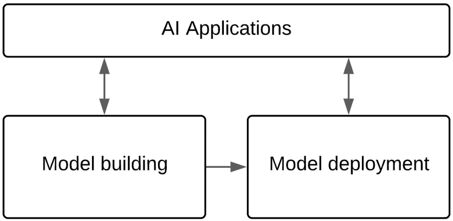
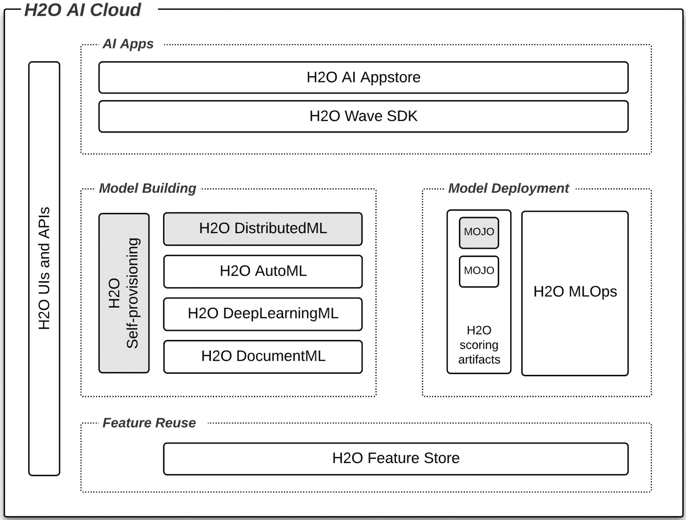
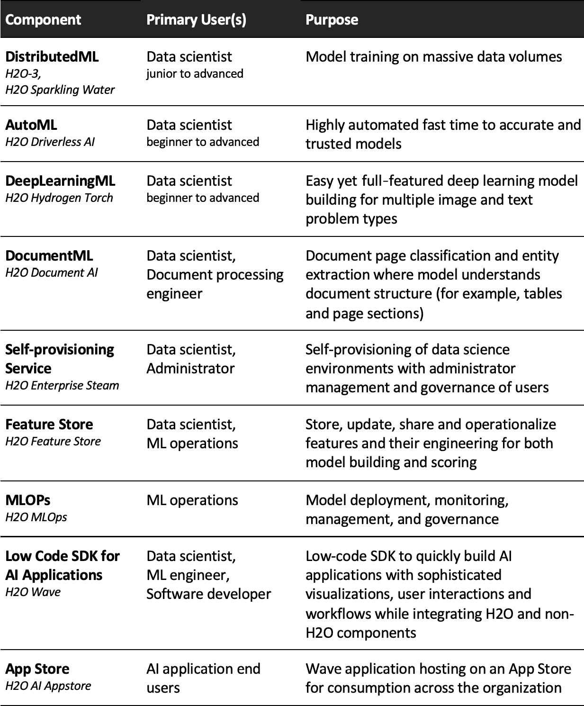

# 第十三章：介绍 H2O AI Cloud

在本书的前几节中，我们详细探讨了如何使用 H2O 技术在大数据量上构建准确和可靠的**机器学习**（**ML**）模型，以及如何部署这些模型在多样化的企业系统中进行评分。在这个过程中，我们熟悉了 H2O Core（H2O-3 和 H2O Sparkling Water）的技术及其分布式内存架构，以水平可扩展的方式执行模型构建步骤，使用熟悉的 IDE 和语言。我们了解了 H2O Enterprise Steam 作为数据科学家轻松配置 H2O 环境和管理员管理用户的工具。我们学习了 H2O MOJO 的技术性质，即从构建的模型生成和导出的即用型评分工件，以及我们学习了在多样化的目标系统上评分 MOJO 的多种模式，无论是实时、批量还是流式。我们还学习了企业利益相关者如何以规模技术的方式看待和交互 H2O。

在本章中，我们将通过学习 H2O 提供的一个更大的端到端机器学习平台，即 H2O AI Cloud 来扩展我们的知识。该平台包括多个专业的模型构建引擎、一个 MLOps 平台用于部署和监控模型、一个特征存储库用于共享模型构建和评分的特征，以及通常在机器学习平台背景下不会考虑的技术层——一个低代码 SDK，可以轻松地在平台的其他部分之上构建 AI 应用程序，以及一个应用商店来托管它们。

重要的是，我们将看到我们迄今为止所学的技术和技能实际上是更大范围的 H2O AI Cloud 的一个子集。

在本章中，我们将涵盖以下主要主题：

+   H2O AI Cloud 概述

+   H2O AI Cloud 组件分解

+   H2O AI Cloud 架构

# 技术要求

您可以通过访问[`h2o.ai/freetrial`](https://h2o.ai/freetrial)注册 90 天的 H2O AI Cloud 试用。这将允许您使用平台组件与您自己的数据或与 H2O 提供的试用数据进行交互。

我们将看到 H2O AI Cloud 的一部分是数据科学家使用一个名为 H2O Wave 的开源低代码 SDK 构建 AI 应用程序的能力。您可以通过访问以下链接在本地机器上开始构建自己的 H2O Wave AI 应用程序：[`wave.h2o.ai/docs/installation`](https://wave.h2o.ai/docs/installation)。

# H2O AI Cloud 概述

H2O AI 云是一个端到端的机器学习平台，旨在使团队能够无缝地通过构建模型、信任模型以及部署、监控和管理模型进行工作。此外，H2O AI 云还包括一个 AI 应用程序开发和托管层，允许各种角色与机器学习生命周期中的所有步骤进行交互——从表达复杂可视化的应用程序到用户交互和工作流程。应用程序软件开发工具包允许数据科学家和机器学习工程师（以及传统软件开发人员）以专门构建的方式快速原型设计、最终确定并发布 AI 应用程序。例如，可以为商业用户构建应用程序，让他们查看客户流失预测仪表板，并基于原因代码进行数据分析，然后对高流失风险候选人做出响应。另一方面，数据科学家可以使用 AI 应用程序交互式验证模型预测与后续地面真实情况，并跟踪相关分析。此外，数据科学家和机器学习工程师可以使用 AI 应用程序通过编排数据漂移警报与模型重新训练和重新部署，同时跟踪分析和审计来自动化重新训练流程。

下图展示了带有 AI 应用程序层的简化机器学习生命周期，H2O AI 云围绕这些层进行组织：

图 13.1 – 带有 AI 应用程序层的简化机器学习生命周期

H2O 围绕这个表示构建了一个模块化、灵活且功能齐全的端到端机器学习平台。以下图解了映射到这个生命周期的 H2O AI 云组件：

图 13.2 – H2O 混合云端到端机器学习平台（灰色显示的 H2O 规模组件）

在深入探讨每个组件及其功能之前，让我们首先获得一个高级别的理解：

+   **模型构建**：有四个独立且专业的模型构建引擎，以及一个数据科学家自助提供环境和管理员管理和治理用户的工具。每个模型构建引擎为构建的模型生成一个可部署的评分工件。

+   **模型部署**：使用 MLOps 组件来部署、监控、管理和治理模型。

+   **特征存储**：特征存储可用于在模型构建期间跨团队以及在评分期间跨模型重用特征。

+   **AI 应用程序**：提供了一个低代码软件开发工具包，用于快速构建、原型设计和发布 AI 应用程序。该 SDK 包含小部件和模板，用于构建复杂和交互式可视化和工作流程。数据科学家和机器学习工程师以熟悉的基于代码的方式构建应用程序，主要关注组织和向模板和小部件提供数据，同时忽略网络应用程序的复杂性。

+   **AI 应用商店**：AI 应用是在本地开发的，然后发布到 AI 应用商店组件，供商业、数据科学和其他企业利益相关者消费。例如，医疗保健中的临床医生可能使用一个应用程序来防止患者过早出院，而商业分析师则使用应用程序的另一个部分来了解这种情况预测发生的频率以及原因。

+   **组件的 UI 和 API 访问**：用户可以通过 UI 和 API 与 H2O AI 组件进行交互。组件 API 允许以编程和自动化的方式与平台交互，并以独特的方式将组件拼接在一起。

在下一节中，我们将更全面地了解每个 H2O AI 云组件。在这样做之前，让我们通过一个表格概述来介绍这些组件，以便我们找到方向：

图 13.3 – 总结 H2O AI 云组件的表格

最后，我们需要将 H2O AI 云组件与本书的重点联系起来，我们将在以下注释中这样做。

本书重点与 H2O AI 云的关系

本书重点是*使用 H2O 进行大规模机器学习*，这也可以被称为*大规模 H2O*。我们专注于在大型数据集上构建机器学习模型并将模型部署到各种企业评分环境中。

从组件的角度来看，重点是 H2O Core（H2O-3 和 H2O Sparkling Water）、H2O 企业版和 H2O MOJO。这些组件可以部署为（a）与 H2O AI 云分开，或（b）作为 H2O AI 云的成员，如图*图 13.2*所示。参见*第十二章*，*企业架构和安全视图*，以了解这一点的详细阐述。

现在我们已经了解了 H2O AI 云的基本原理、其组件以及它们与本书重点的关系，让我们通过进一步阐述每个组件来扩展我们的视野和机器学习能力。

# H2O AI 云组件分解

让我们深入了解每个组件。

## 分布式机器学习（H2O-3 和 H2O Sparkling Water）

分布式机器学习（DistributedML）一直是本书模型构建的重点，在该上下文中被称为 H2O Core，以代表 H2O-3 或 Sparkling Water。从根本上讲，您使用 H2O Core 在大型数据集上构建模型。

为了本章的目的，主要特性和能力将在接下来的子节中介绍。更多详情，请参阅*第二章*，*平台组件和关键概念*，以回顾支持大规模模型构建的分布式内存架构。参见*第四章*，*大规模 H2O 模型构建 – 能力阐述*，以更详细地了解其主要能力。

### 关键特性和能力

H2O Core（H2O-3 和 Sparkling Water）的关键功能和能力如下：

+   **大规模数据量的模型构建**：H2O Core 具有将数据分区和分布到多个服务器内存中的架构。模型构建计算是在此架构上并行进行的，从而满足大规模数据集的扩展需求。数据集越大，架构的水平扩展性就越高。

+   **熟悉的数据科学体验**：数据科学家使用熟悉的环境和语言（例如，在 Jupyter 笔记本中的 Python）构建 H2O 模型，以表达 H2O 模型构建 API。API 隐藏了 H2O 可扩展架构的复杂性，对数据科学家来说，这种体验本质上是对数据框编写代码。

+   **灵活的数据摄取**：H2O Core 具有连接器，可以访问不同的数据源和数据格式。数据直接从源传输到 H2O Core 分布式内存。

+   **可扩展的数据操作**：数据在分布式架构中进行操作，因此是按比例进行的。H2O API 使数据操作步骤简洁。Sparkling Water 特别允许使用 Spark API（例如 Spark SQL）进行数据操作，并在相同的编码工作流程中将 Spark DataFrames 转换为 H2OFrames。

+   **最先进的算法**：H2O Core 实现了针对监督和非监督问题的最先进机器学习算法，包括例如 XGBoost，一种**梯度提升机**（**GBM**），**广义线性模型**（**GLM**），以及**Cox 比例风险**（**CoxPH**）等，仅举几例。这些算法在分布式架构上运行，以扩展到大规模数据集。

+   **AutoML**：H2O 可以使用探索算法和超参数空间的 AutoML 框架来构建模型，从而构建最佳模型的排行榜。AutoML 框架可以通过众多设置进行控制。

+   **可解释性和自动文档**：H2O Core 实现了广泛的可解释性功能，并可以生成自动文档，全面描述模型构建并解释生成的模型。

+   **MOJO**：在 H2O Core 上构建的模型生成一个称为 MOJO 的即用型低延迟评分工件，可以灵活部署到各种目标环境中。这在*第九章*中进行了详细讨论，*生产评分和 H2O MOJO*。

让我们继续了解 H2O AI Cloud 的下一个模型构建引擎。

## H2O AutoML（H2O Driverless AI）

H2O Driverless AI 是一个高度自动化的 AutoML 工具，部分由 Kaggle 大师级数据科学家构建，旨在结合数据科学最佳实践和 AI 启发式方法，在短时间内找到高度准确模型。其关键功能包括丰富的可解释性功能、一种遗传算法来迭代最佳模型，以及详尽的特征工程和选择，以推导和使用新特征。让我们调查这些关键功能和能力。

### 关键特性和功能

H2O Driverless AI 的关键特性和功能如下：

+   **问题类型**：H2O Driverless AI 构建了**监督学习**和**无监督学习**模型：

    +   **监督学习**：对于表格数据的监督学习，H2O Driverless AI 解决回归、二分类和多分类分类以及时间序列预测问题。对于图像的监督学习，Driverless AI 解决图像分类问题，对于**自然语言处理**（**NLP**），它解决文本分类和上下文标记问题。

    +   **无监督学习**：对于无监督学习，Driverless AI 解决异常检测、聚类和降维问题。

+   **GPU 支持**：Driverless AI 可以利用 GPU 来处理图像和 NLP 问题，这些算法运行 TensorFlow 和 PyTorch。

+   **遗传算法**：Driverless AI 使用专有的遗传算法在数十个模型之间迭代，每个模型的算法（例如，XGBoost、广义线性模型和 LightGBM）不同，其探索超参数空间的方式不同，其探索特征工程空间的方式也不同。最佳模型被提升到下一轮迭代，并在每一轮迭代中引入新的模型变体。这会一直持续到它无法根据用户设置的设置找到更好的模型为止。

+   **特征工程**：在遗传算法过程中，Driverless AI 以详尽的方式应用数十个转换器，从原始数据集中的特征中构建新的特征，并确定哪些特征应包含在最终模型中。这些转换器被分类如下：

    +   **数值**：这些是在两个或多个原始特征之间的数学运算 – 例如，减去两个特征或对数据集中的多个特征进行聚类，并测量每个观察值到特定聚类的距离。

    +   **分类**：这些是将类别标签转换为数字的转换 – 例如，对每个类别的目标变量的平均值或频率进行计算，并将其分配给每个观察值所代表的类别。

    +   **时间和日期**：这些是将时间和日期字段转换为替代时间日期表示的转换 – 例如，将日期转换为星期几。

    +   **时间序列**：这些转换推导出对时间序列问题有用的新特征 – 例如，使用特征值的滞后时间。

    +   **文本**：这些转换将字符串转换为替代表示 – 例如，使用预训练的**双向编码器表示从转换器**（**BERT**）模型生成新的语言表示。

+   **自带配方**：除了访问广泛的专家设置外，数据科学家可以通过导入自己的代码来控制自动化的机器学习过程，这些代码 H2O 称为配方。这些自定义配方可以采取以下形式 - *scorer*（用于在遗传算法中优化模型的您自己的性能指标）、*特征工程*（您自己设计的特点）或 *算法*（您选择的机器学习算法，以补充熟悉的 Driverless AI 即插即用算法）。

+   **可解释性（可解释性）**：用户可以使用各种全面的功能来与可解释性技术交互，以解释生成的模型。这些技术可以在 *全局*（整个模型）或 *局部*（单个记录）级别应用。这些技术包括 *代理* 和 *实际模型* 技术，包括 K-Lime 和 Shapley，决策树，差异影响分析，敏感性分析和部分依赖图。还有针对时间序列和 NLP 问题的特定解释器。

+   **自动文档**：遗传算法生成的每个最终模型都创建大量标准化的自动文档（通常超过 60 页），详细描述实验概述、数据概述、方法、验证策略、模型调优、特征转换和演变、最终模型和可解释性。文档以段落、表格和图形形式呈现。

+   **MOJO**：遗传算法生成的每个最终模型都创建一个可部署且低延迟的 MOJO，可以灵活部署到各种目标环境中。这与在第 *第九章* 中讨论的类似技术相同，*生产评分和 H2O MOJO*，用于 H2O 规模（H2O-3 和 Sparkling Water）。

    重要提示

    Driverless AI 的 MOJO 在自动化模型构建过程中执行特征工程。

现在让我们继续介绍 DeepLearningML 引擎。

## DeepLearningML（H2O 氢火炬）

H2O 氢火炬是一个基于 UI 的深度学习引擎，它赋予所有技能水平的科学家（以及在某些用例中可能的分析师）轻松构建最先进的计算机视觉和 NLP 模型的能力。其关键特性和功能如下。

### 关键特性和功能

H2O 氢火炬的功能和特性如下：

+   **问题类型**：目前，氢火炬解决六个 **计算机视觉**（**CV**）和五个 NLP 问题类型，简要描述如下：

    +   **图像分类（CV）**：图像被分类为一组或多组类别 - 例如，图像被分类为汽车与卡车。

    +   **图像回归（CV）**：从图像预测一个连续值 - 例如，从自动驾驶汽车图像中预测的转向角度是从中心线正 20 度。

    +   **目标检测（CV）**：从图像中分类一个（或多个）对象，并识别其位置坐标作为边界框——例如，识别多个汽车，每个汽车周围都有一个矩形定义。

    +   **语义分割（CV）**：对象（或多个对象）不仅被分类，而且其精确形状也被定义，形状由像素位置确定——例如，一个人的精确轮廓或图像中所有人的轮廓。

    +   **实例分割（CV）**：这与语义分割相同，但在实例分割中，当识别出同一类别的多个对象时，它们被单独处理，而在语义分割中，它们被视为一个对象。

    +   **图像度量学习（CV）**：预测图像之间的相似性——例如，对于零售产品的图片，它会找到新图片是同一产品的可能性。

    +   **文本分类（NLP）**：将文本（文档、页面和片段）分类到一类——例如，对文本的情感或意图进行分类。

    +   **文本回归（NLP）**：从文本中预测一个连续值——例如，从简历中预测一个人的薪水。

    +   **文本序列到序列（NLP）**：将一个上下文中的文本序列转换为另一个上下文中的文本序列——例如，将文档转换为摘要。

    +   **文本标记分类（NLP）**：将文本中的每个词分类到标签——例如，识别联合国为组织（**命名实体识别**（NER）的例子）或识别一个词为名词或动词（**词性标注**（POS）的例子）。

    +   **文本度量学习（NLP）**：预测两组文本之间的相似性——例如，识别重复信息或相似文档。

+   **构建深度学习模型的便捷性**：Hydrogen Torch 是一种无代码方法，用于构建深度学习模型。用户与一个具有广泛的超参数调整控制和丰富界面的 UI 进行交互，以快速迭代、理解和评估模型结果。模型可以导出部署到 Python 或 H2O MLOps 环境。

+   **用户技能集模式**：Hydrogen Torch 训练用户界面通过显示较少或更多的模型构建设置来适应用户的技能水平，根据用户是新手、熟练、专家还是大师。

现在，让我们继续介绍一个专注于文档的模型构建引擎。

## DocumentML（H2O 文档 AI）

文档通常是企业应用机器学习技术以自动化处理步骤、从而节省大量时间和金钱的巨大未开发数据源。H2O 的文档 AI 引擎从文档中学习以实现这一自动化。

文档 AI 超越了简单的**光学字符识别**（**OCR**）和 NLP，通过学习识别文档的信息结构，如表格、表单、标志和部分。文档 AI 模型经过训练，使用这些能力从文档中提取文本实体。因此，文档可以处理以提取特定信息，例如医疗实验室结果、财务报表、贷款申请等。然后，这些输出可以驱动来自这些文档的分析和工作流程，随着文档处理量的增加，这些文档的价值也越来越大。文档 AI 还可以对整个文档进行分类，以进一步自动化文档处理流程。

### 关键功能和能力

让我们进一步分解这些功能：

+   **文档摄取**：摄取诸如 PDF、图像、Word、HTML、CSV 文件、文本文件、电子邮件等文档。

+   **预处理**：文档 AI 使用 OCR 和 NLP 能力执行多个预处理步骤，例如处理嵌入式文本（例如，PDF 元数据）和标志，以及定位、去倾斜和裁剪页面。

+   **应用文档标签**：用户通过 UI 访问界面以将标签应用于文档文本。模型将训练以识别这些标记实体。例如，在一份医疗实验室文档中，用户将标签应用于患者姓名、实验室名称、实验室地址、测试名称、测试结果值、测试结果单位、测试结果正常范围等。

+   **训练模型**：文档 AI 针对标记文档集进行训练。它学会在文档结构的更大背景下将文本与标签关联起来——例如，实验室结果是从表格的行中报告的。请注意，模型是在已知的文档集上训练的，之后将能够从他们以前从未见过的文档中提取信息。例如，每个实验室都产生自己的报告（自己的设计、表格的样式、页数、文档中患者姓名的位置等）。即使模型是在一小套实验室报告（通常是大约 100 份）上训练的，它也可以从它没有训练过的实验室发送的文档中提取信息。

+   **后处理**：文档 AI 允许用户自定义和标准化输出结果的方式。例如，用户可以定义一个具有标准化的日期输出格式的输出 JSON 结构。

+   **模型部署**：模型可以导出并部署到 H2O MLOps 或您选择的 Python 环境中。

现在我们已经探索了 H2O AI Cloud 上的四个专业模型构建引擎，让我们看看这些引擎的功能如何共享和实施。

## 自助服务（H2O 企业版 Steam）

H2O 企业级蒸汽允许用户自行配置模型构建环境，管理员则可以管理用户及其资源消耗。与 H2O 核心及其生成的评分工件 MOJO 一样，企业级蒸汽被视为 H2O ML 扩展的关键组件，并在*第二章*，*平台组件和关键概念*中介绍，然后在*第十一章*，*管理员和操作视图*中进行了详细探讨。

注意，在这种情况下，企业级蒸汽仅用于自行配置和管理 H2O 核心环境，但在 H2O AI 云的上下文中，它用于管理所有 H2O 模型构建引擎。让我们回顾其关键能力。

### 关键功能和能力

H2O 企业级蒸汽的关键能力简要列出如下：

+   **轻松自行配置 H2O 模型构建环境**：数据科学家可以从企业级蒸汽 UI 或 API 定义、启动和管理他们的 H2O 模型构建环境。请注意，目前这适用于 DistributedML（H2O 核心）和 AutoML（Driverless AI）环境。Hydrogen Torch 和 Document AI 环境目前作为应用程序启动，但它们计划整合到企业级蒸汽的自配置框架中。

+   **管理员对用户的管理和治理**：管理员管理用户，并定义他们在配置环境时可以使用的资源量（CPU 和内存），包括这些环境在关闭之前闲置了多长时间。

让我们继续到特征存储组件。

## 特征存储库（H2O AI 特征存储库）

H2O AI 特征存储库是一个系统，用于在模型构建和实时评分环境中组织、管理、共享和操作化预测性 ML 特征。这为数据科学家节省了大量时间来发现特征，并且对于数据科学家和 ML 工程师将原始数据转换为这些特征也节省了时间。让我们进一步探讨其能力。

### 关键功能和能力

这里是 H2O AI 特征存储库的一些关键功能：

+   **灵活的特征发布和搜索工作流程**：数据科学家和工程师使用预构建的集成到 Snowflake、Databricks、H2O Sparkling Water 和其他技术中的特征管道。生成的特征输出到 H2O AI 特征存储库，与特征相关的 40 多个元数据属性。这种对特征及其属性的编目允许其他数据科学家搜索相关特征，并且特征存储库内置的 AI 可以推荐特征。

+   **可扩展和及时的特征消费**：特征存储库中的每个特征都有一个定义的持续时间，直到它被刷新。特征可以离线存储以进行训练和批量评分，或在线存储以进行低延迟实时评分。

+   **自动特征漂移和偏差检测**：特征会自动检查数据漂移，并在检测到漂移时提醒用户。这可能在决定使用更近期的数据进行模型重新训练时至关重要。特征也会自动检查偏差，并在检测到偏差时提醒用户。这可能在重新训练模型以消除偏差时至关重要。

+   **访问管理和治理**：H2O AI Feature Store 与企业身份提供者集成，以验证用户身份并授权对特征的访问。特征及其元数据进行了版本控制，以符合监管要求，并可以对基准数据进行回测。

H2O AI Cloud 拥有一个功能齐全的模型操作组件。让我们接下来了解更多关于它的信息。

## MLOps（H2O MLOps）

H2O MLOps 是一个用于部署、管理、监控和治理模型的平台。这些可以是来自任何 H2O 模型构建引擎（DistributedML、AutoML、DeepLearningML 或 DocumentML）的模型，或者来自非 H2O 软件（例如 scikit-learn 或 MLflow）的模型。请注意，H2O MLOps 工作流程可以使用 UI 或 API 完成，后者对于集成到**持续集成和持续部署（CI/CD）**工作流程至关重要。主要功能如下所述。

### 关键特性和功能

这里是 H2O MLOps 的关键特性：

+   **模型部署**：轻松部署 H2O 和非 H2O 模型。评分作为 REST 端点提供，适用于实时和批量评分。模型可以部署为单个模型（简单部署）、冠军/挑战者（比较新模型与当前模型，其中只有当前模型是活跃的）或 A/B 测试（多个活跃模型和实时数据在配置的比例中路由）。模型部署到定义的环境，通常是开发和生产环境，但你可以添加更多。

+   **模型监控**：监控模型的健康状况、评分延迟、数据漂移、公平性（偏差）降级和性能降级。警报在监控仪表板上显示，并发送到配置的收件人。警报可用于触发模型重新训练和部署。

+   **模型管理**：模型可以进行比较和评估，提升到注册表中，然后部署。模型与广泛的元数据相关联，允许对模型构建细节进行可追溯性，并与其他模型进行评估。注册表中的模型（以及随后的部署）是版本化的。已部署的模型可以回滚到以前的版本。

+   **模型治理**：通过模型管理实现的版本控制和可追溯性创建了一个模型历史记录的谱系。用户具有基于角色的访问权限，并且对操作进行审计。管理员有一个专门的仪表板，可以提供对所有用户、模型和审计日志的可见性。这些功能结合在一起，在整体治理过程中最大限度地减少模型风险并促进合规性。

我们从识别一个集成了 H2O AI Cloud 平台其他部分的 应用层开始本章。让我们更深入地了解这一点。

## AI 应用程序的低代码 SDK（H2O Wave）

H2O Wave 是一个开源且低代码的 Python SDK，用于构建具有复杂可视化的实时 AI 应用程序。通过将网络应用程序编码的复杂性抽象化，从应用程序开发者那里移除，同时将高级 UI 组件作为模板、主题和小部件公开，实现了低代码。数据科学家和机器学习工程师被视为开发者（以及软件开发者本身）。

H2O 数据科学家构建了 H2O Wave 应用程序的示例，作为功能演示。这些可以在 H2O AI Cloud 90 天评估网站上找到[`h2o.ai/freetrial`](https://h2o.ai/freetrial)。更多示例可以在 H2O 公共 GitHub 存储库[`github.com/h2oai/wave-apps`](https://github.com/h2oai/wave-apps)找到。

我该如何尝试构建 Wave 应用程序？

有关下载 Wave 服务器和 SDK 以构建您自己的应用程序的说明，请参阅[`wave.h2o.ai/docs/installation`](https://wave.h2o.ai/docs/installation)。

### 关键特性和功能

以下为 H2O Wave 的关键特性和功能：

+   **低代码 SDK**：数据科学家和机器学习工程师专注于指定模板和小部件，并将数据输入其中以创建复杂的可视化、仪表板和工作流程。将网络应用程序代码的复杂性从开发者那里抽象出来。

+   **广泛的本地数据连接器**：您可以通过 SDK 访问超过 160 个数据源和接收器的连接器。

+   **本地 H2O API**：SDK 包括 H2O API，这些 API 集成了其他 H2O AI Cloud 组件。这使得数据科学家和机器学习工程师可以将机器生命周期的一些方面作为应用程序可视化和工作流程的后端进行集成。

+   **使用任何 Python 包**：应用程序作为容器隔离，因此允许应用程序使用任何 Python 包 – 例如，NumPy 和 pandas 用于数据处理，Bokeh 和 Matplotlib 用于数据可视化，仅举几个例子。

+   **集成非 H2O 技术**：当您的应用程序中的 Python 包代表公共 API，如 Twitter API、AWS 服务 API 或您自己的私有 Python API 时，Wave 应用程序可以将非 H2O 技术集成到其可视化和工作流程中。因此，Wave 应用程序可以作为跨越多种技术的单一玻璃窗构建。

+   **发布到 H2O 应用商店**：Wave 应用程序在本地开发后，发布到 H2O AI Cloud 应用商店供企业使用。

现在我们来看看 H2O 应用商店。

## 应用商店（H2O AI 应用商店）

H2O AI 应用商店在您的 H2O AI 云实例中托管您的 H2O Wave 应用程序。H2O Wave 应用程序以可搜索和基于角色的方式托管。登录到应用商店的用户只能看到他们有权使用的应用程序，并且可以通过自定义分类或搜索来找到它们。Wave 应用程序开发者向应用商店发布，管理员管理应用商店。

因此，应用程序消费者通过应用商店访问和使用 Wave 应用程序，尽管数据科学家和 ML 工程师开发者可以在发布到应用商店之前在本地与消费者进行原型设计。

现在我们来对 H2O AI 云架构有一个高层次的理解。

# H2O AI 云架构

我们不会深入探讨 H2O AI 云架构，但将回顾三个重要的架构点：

+   **组件模块化和开放**：平台的模块化架构允许企业或组使用他们需要的组件，并隐藏和忽略他们不需要的组件。H2O AI 云也是开放的——其组件可以与更大的企业生态系统共存并交互，包括非 H2O AI/ML 组件。例如，MLOps 组件可以托管非 H2O 模型，如 scikit-learn 模型，AI 应用程序 Wave SDK 可以将其自己的 API 与非 H2O API 集成。

+   **云原生架构**：H2O AI 云建立在现代 Kubernetes 架构之上，实现了云服务器之间的高效资源消耗。此外，AI 云上的 H2O 工作负载是短暂的——需要时启动，不使用时关闭，再次启动时保留状态。H2O AI 云还利用云服务提供商的管理服务——例如，使用云管理的 Kubernetes 服务，并在管理 PostgreSQL 数据库中维护状态。

+   **灵活部署**：H2O AI 云可以在企业的云中、本地或混合环境中部署。或者，它也可以作为托管服务消费，其中 H2O 在 H2O 的云环境中托管和管理企业的 H2O AI 云平台。

这些架构点与每个组件的能力相结合，意味着企业可以将 H2O AI 云适应其特定的环境、用例需求以及其 AI 转型旅程的阶段。

让我们总结一下本章所学的内容。

# 摘要

在本章中，我们将视野扩展到*H2O ML at scale*之外，这是本书迄今为止的重点。我们通过引入 H2O 的端到端机器学习平台 H2O AI Cloud 来实现这一点。该平台在机器学习生命周期的模型构建和模型部署步骤中具有一系列广泛的组件，并引入了这一流程中较少考虑的一层——易于构建的 AI 应用程序和为它们服务的应用商店。我们了解到，H2O AI Cloud 有四个用于构建机器学习模型的专用引擎——DistributedML、AutoML、DeepLearningML 和 DocumentML。我们还了解到，MLOps 围绕部署、监控、管理和治理评分模型具有完整的功能集。我们还了解到，特征存储可用于集中和重用模型构建和模型评分的特征。

重要的是，我们了解到本书的重点，即在大型数据集上构建机器学习模型并将其部署到企业系统进行评分（我们称之为 H2O at scale），实际上使用的是 H2O AI Cloud 更大平台的一个子集的技术（H2O Core、H2O Enterprise Steam 和 H2O MOJO）。

我们指出，H2O at scale 技术可以独立于 H2O AI Cloud 部署，或者作为更大平台的一部分。在下一章中，我们将看到 H2O at scale 作为 H2O AI Cloud 的成员所承担的额外功能。
