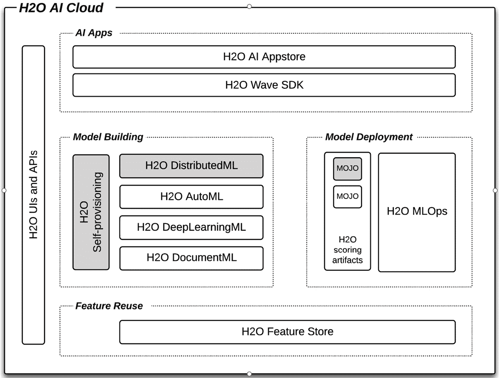
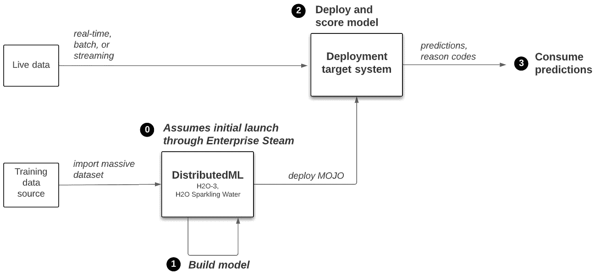
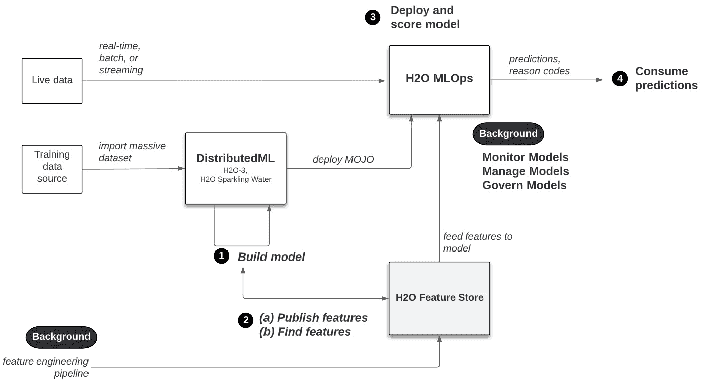
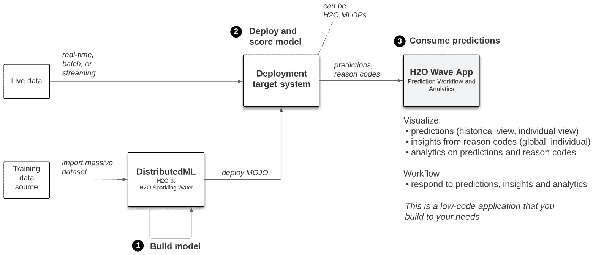
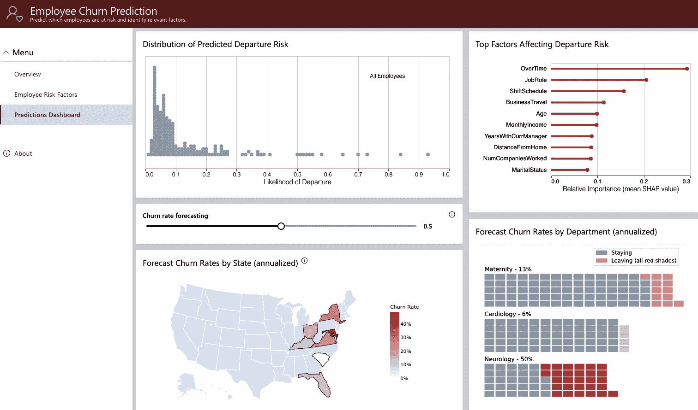

# 第十四章：在更大平台环境下的 H2O 规模化

在上一章中，我们通过介绍 H2O AI 云，一个由多个模型构建引擎、模型部署、监控和管理平台 MLOps、用于重用和操作模型特征的特性存储以及构建在上述组件之上并在企业应用商店中托管的人工智能应用的低代码软件开发工具包（SDK）组成的**端到端**机器学习（ML）平台，扩展了我们对 H2O ML 技术的视野。本书的重点是我们所说的**H2O 规模化**，即使用 H2O Core（H2O-3 和 Sparkling Water）在大量数据集上构建准确和可信的模型，使用 H2O Enterprise Steam 来管理 H2O Core 用户及其环境，以及使用 H2O MOJO 轻松灵活地将模型部署到各种目标环境中。我们了解到，这些 H2O 规模化的组件是 H2O AI 云平台的原生部分，尽管它们可以独立于它部署。

在本章中，我们将探讨 H2O 规模化作为 H2O AI 云平台的一员如何获得更大的能力。更具体地说，我们将涵盖以下主题：

+   快速回顾 H2O AI 云

+   探索 H2O 规模化的基线参考解决方案

+   探索 H2O 规模化的新可能性

+   作为企业 AI 集成织物的参考 H2O Wave 应用

# 技术要求

此链接将帮助您开始开发 H2O Wave 应用：[`wave.h2o.ai/docs/installation`](https://wave.h2o.ai/docs/installation)。H2O Wave 是开源的，可以在您的本地机器上开发。为了全面熟悉 H2O AI 云平台，您可以在[`h2o.ai/freetrial`](https://h2o.ai/freetrial)注册 90 天的 H2O AI 云试用。

# 快速回顾 H2O AI 云

本章的目标是探讨 H2O 规模化，本书的重点，作为 H2O AI 云平台的一部分时，如何获得新的功能。让我们首先快速回顾 H2O AI 云，通过重新审视我们在上一章中遇到的以下图表：

图 14.1 – H2O AI 云平台组件

简要总结一下，我们看到 H2O AI 云有四个专门的模型构建引擎。H2O Core（H2O-3，H2O Sparkling Water）代表 H2O DistributedML，用于在大量数据集上水平扩展模型构建。在这个背景下，H2O Enterprise Steam 代表一个更通用的工具，用于管理和提供模型构建引擎。

我们看到，从 H2O Core 模型构建导出的 H2O MOJO 可以直接部署到 H2O MLOps 模型部署、监控和管理平台（尽管，如*第十章*，*H2O 模型部署模式*中所示，MOJO 也可以公开部署到其他目标）。请注意，H2O 的专用**自动化机器学习**（**AutoML**）引擎 Driverless AI 也生成 MOJO，并可以按照*第十章*，*H2O 模型部署模式*中所示的方式进行部署。我们还看到，H2O AI 特征存储可用于在模型构建和模型部署环境中共享和操作特征。

最后，我们看到 H2O Wave SDK 可用于在 H2O AI Cloud 平台的其他组件之上构建 AI 应用，并将其作为平台的一部分发布到 H2O App Store。

现在让我们开始将这些组件组合成各种 H2O-at-scale 解决方案。

# 探索 H2O 在规模上的基线参考解决方案

因此，现在让我们探索 H2O-at-scale 组件如何从参与 H2O AI Cloud 平台中受益。为此，让我们首先从 H2O AI Cloud 之外的 H2O at scale 的基线解决方案开始。基线解决方案如下所示。我们将使用这个基线来比较 H2O at scale 与 AI Cloud 组件集成的解决方案：

图 14.2 – H2O 在规模上的基线解决方案

重要提示

对于本章中的所有解决方案，假设数据科学家使用 H2O Enterprise Steam 启动了 H2O-3 或 H2O Sparkling Water 环境。请参阅*第三章*，*基本工作流程 – 从数据到可部署模型*，以了解这一步骤的概述。

其解决方案流程的快速概述如下：

1.  数据科学家导入一个大型数据集，并使用它来构建大规模的 ML 模型。请参阅*第二部分*，*使用 H2O 在大型数据量上构建最先进的模型*，以深入了解这一主题。

1.  运作组将模型工件（称为 H2O MOJO）部署到评分环境中。请参阅*第十章*，*H2O 模型部署模式*，以探索 H2O 模型部署的各种目标系统。

1.  预测被业务环境中的软件或工具消费并采取行动。（在这里，我们假设部署的模型是一个**监督学习**模型，尽管它可能是一个未监督模型，生成了不是预测的输出；例如，输入的聚类成员资格）。

让我们使用这个基线解决方案来开始添加 H2O AI Cloud 组件，从而了解 H2O 在规模上的能力如何通过加入这个更大的平台而获得额外的功能。

# 探索 H2O 在规模上的新可能性

现在，让我们逐步了解如何将 H2O（本书的重点）与其他 H2O AI Cloud 平台集成，从而实现更大的能力和价值。

## 利用 H2O Driverless AI 进行原型化和特征发现

H2O 的 AutoML Driverless AI 组件是一个高度自动化的模型构建工具，它使用（包括其他功能）遗传算法、AI 启发式方法和详尽的自动化**特征工程**来构建准确且可解释的模型——通常在几小时内完成——然后部署到生产系统。然而，Driverless AI 无法扩展到在 H2O-3 和 Sparkling Water 处理的数百 GB 到 TB 大小的数据集上进行训练。

然而，对于数据科学家来说，将这些大规模数据集的采样数据输入到 Driverless AI，然后使用 AutoML 工具（a）快速原型化模型以获得早期理解，以及（b）发现有助于准确模型的自动工程特征，但通过纯手动和领域知识手段难以找到，这非常有用。在此工作流程中，Driverless AI 产生的知识随后用作起点，使用 H2O-3 或 Sparkling Water 在原始未采样的数据上构建大规模模型。

这在以下图表中显示，然后进行总结：

![图 14.3 – 利用 H2O Driverless AI 进行原型化和特征发现]

![图片 B16721_14_003.jpg]

图 14.3 – 利用 H2O Driverless AI 进行原型化和特征发现

这里提供了利用 Driverless AI 快速原型化和发现用于大规模模型构建的特征的工作流程步骤：

1.  将大量数据集导入到 H2O-at-scale 环境固有的分布式内存架构中。使用 H2O-3 的`split_frame`方法（此处为 Python）对导入的数据进行采样，形成一个较小的子集（通常为 10 到 100 GB），并定义一个合适的比例作为输入参数以实现所需的样本大小。将输出写入 Driverless AI 可以访问的临时存储位置。

1.  将采样数据集导入 Driverless AI。使用默认设置快速原型化一个准确的模型。根据您的领域和数据科学经验使用不同的设置继续原型化。探索模型的可解释性技术。探索对模型贡献最大的工程特征。使用**自动化模型文档**（**AutoDoc**）深入了解模型，并将工程特征的名称转换为它们背后的数学和逻辑表示。

1.  使用*步骤 2*中的知识来指导您在 H2O-3 或 Sparkling Water 上对完整的大量数据集进行模型构建。

在*第十三章*“介绍 H2O AI Cloud”中概述了 Driverless AI。以下截图显示了一个实验迭代以获得最终准确模型：

![图 14.4 – Driverless AI 找到一个准确模型]

![图片 B16721_14_004.jpg]

图 14.4 – 无人驾驶 AI 找到一个准确的模型

注意图 14.4 的左下角面板，它显示了遗传算法在模型间迭代的进度。每个方块是一个单独构建的 ML 模型。这些模型中每一个都使用自动选择的算法之一（例如，XGBoost；**轻梯度提升模型**（**LightGBM**）；**广义线性模型**（**GLM**）），这些算法探索了极其广泛的超参数空间（例如，学习率、树深度、树的数量等组合）。

重要的是，遗传算法构建的每个模型也探索了从原始导入的数据集中工程化出的极其广泛的特征空间。实验将在最终的最佳模型结束时停止，通常是一个先前顶级模型的堆叠集成。用户可以在短时间内运行许多实验，目的是通过改变许多高级和低级设置并评估结果来探索。

从这些快速探索中获得的知识，包括对最终模型重要的特征工程，可以用作使用 H2O-3 或 Sparkling Water 构建大规模模型的起点。

注意，对于较小的数据集，无人驾驶 AI 在短时间内发现高度预测性模型非常有效。然而，对于扩展到大量数据集或采用更受控的基于代码的方法来构建模型，则需要 H2O-3 和 Sparkling Water。正如这里所示，对于基于代码的方法，首先使用无人驾驶 AI 原型化一个问题，然后利用产生的洞察力和工程化特征作为基于代码方法的指南，这是很有价值的。

无人驾驶 AI（AutoML）与 H2O-3（分布式 ML）对比：何时使用哪一个？

无人驾驶 AI 是 H2O AI 云的一个高度自动化的基于**用户界面**（**UI**）或基于**应用程序编程接口**（**API**）的 AutoML 组件，旨在快速找到准确且值得信赖的模型用于生产评分。当你想要一个高度自动化的方法（具有广泛的用户控制）来构建模型，并且数据集大小小于 100 GB 时（尽管更重的服务器实例可以处理更大的数据集）请使用它。

当你的数据集大于 100 GB（甚至达到 TB 级别）或当你想要对模型构建过程有更多控制时，请使用 H2O-3 或 Sparkling Water。请注意，H2O-3 和 Sparkling Water 具有 AutoML 功能，如*第五章*中所述，*高级模型构建 – 第一部分*，但无人驾驶 AI 中的功能更为复杂、广泛和自动化。

使用无人驾驶 AI 原型化一个问题，并将产生的洞察力和工程化特征的发现用于指导你在 H2O-3 或 Sparkling Water 上的模型构建。

我们已经看到了第一个例子，通过与 H2O AI 云平台的一个组件交互，H2O-at-scale 模型构建获得了能力。现在让我们看看下一个例子。

## 集成 H2O MLOps 以进行模型监控、管理和治理

使用 H2O-3 和 Sparkling Water 构建的模型会生成自己的低延迟评分工件，称为 H2O MOJO。正如我们在*第十章*，“*H2O 模型部署模式”中所示，这种评分工件可以部署到各种生产系统，从 **REpresentational State Transfer** (**REST**) 服务器上的实时评分到数据库上的批量评分，以及从流队列中的评分（仅举几例）。我们还展示了在该章节中，将数据部署到 REST 服务器为将评分预测集成到常见的 **商业智能** (**BI**) 工具（如 Microsoft Excel 或 Tableau）提供了一个有用的集成模式。

H2O AI Cloud 的 H2O MLOps 组件是部署 H2O-3 或 Sparkling Water 模型（或 Driverless AI 模型和非 H2O 模型，例如 scikit-learn 模型）的一个很好的选择。集成非常简单，如下面的图所示：

![Figure 14.5 – Deployment of H2O-at-scale models to the H2O MLOps platform

![img/B16721_14_005.jpg]

图 14.5 – 将 H2O-at-scale 模型部署到 H2O MLOps 平台

集成这些模型的步骤非常简单，如下所述：

1.  使用 H2O-3 或 Sparkling Water 构建您的模型，并导出 MOJO 以进行部署。

1.  从 H2O MLOps，您可以从 UI 或 MLOps API 中部署预制的 MOJO。回想一下*第十三章*，“*介绍 H2O AI Cloud”，那里有许多部署选项，包括实时与批量、单个模型与冠军/挑战者，或 A/B 测试。

1.  模型现在可以从一个独特的 REST 端点进行评分。带有可选原因代码的预测准备就绪，可供您的系统消费，无论该系统是 Web 应用程序、BI 工具等。

在此流程期间和之后的所有模型中，MLOps 执行与监控、管理和治理模型相关的重要任务。例如，以下截图显示了 H2O MLOps 的数据漂移监控屏幕：

![Figure 14.6 – Model-monitoring screen for H2O MLOps

![img/B16721_14_006.jpg]

图 14.6 – H2O MLOps 的模型监控屏幕

监控数据漂移的目的是检测实时评分数据中特征值的分布是否与构建模型时所用的训练数据中的分布存在差异。数据漂移的存在表明或暗示模型应该使用更近期的数据进行重新训练，然后重新部署以与当前的评分数据对齐。

在*图 14.6*的左下角面板中，所有模型特征的数据漂移以两个维度表示：垂直轴上的漂移和水平轴上的特征重要性。这种视图允许将漂移分为漂移重要性的四个象限，其中高漂移和高特征重要性是最重要的漂移。有多个设置可以定义漂移统计量、测量的时间框架和其他查看漂移的方面。还有一个工作流程来配置漂移的自动警报消息。这些可以用于数据科学家手动决定是否重新训练模型，或者通过 H2O API 完全自动地重新训练和部署模型。

漂移检测只是 H2O MLOps 功能之一。有关 H2O MLOps 模型部署、监控、管理和治理功能的完整描述，请参阅 H2O 文档[`docs.h2o.ai/mlops/`](https://docs.h2o.ai/mlops/)。

现在我们来看一下 H2O-3 和 Sparkling Water 如何集成到 H2O AI 特征存储中。

## 利用 H2O AI 特征存储进行特征操作化和复用

企业通常通过在组织内部集中和共享环境或资产来实现规模经济。H2O AI 特征存储通过集中模型特征及其通过工程管道进行操作化的实现，在整个组织内进行复用，从而实现规模经济。

通过特征存储的复用发生在模型构建和模型评分的上下文中。例如，假设在整个组织中的一个有价值特征是资产价格相对于前一天的百分比变化。然而，想象一下，资产价格以每日价格存储，并且资产价格存储在多个源系统中。特征存储处理从源系统中检索特征，从原始数据（即特征工程管道）计算新值，并将结果（即工程化特征）缓存以供模型训练和模型评分共享。模型构建使用离线模式——即批量历史数据——并使用在线模式进行模型评分——即最近的数据。这在下图中显示：

图 14.7 – H2O AI 特征存储与 H2O-3 或 Sparkling Water 的集成

下面是*图 14.7*中的工作流程总结：

1.  数据科学家构建一个模型。

1.  在模型构建阶段，数据科学家可能以两种不同的方式与特征存储进行交互，如下所述：

    +   数据科学家可能将特征发布到特征存储库，并包括相关的元数据以帮助他人进行搜索和操作。机器学习工程师将特征从数据源（源）的操作工程化，以向特征存储库中的特征值提供数据。每个特征都配置了在更新之前存活的时间——例如，每分钟、每天或每月更新一次。

    +   在模型构建期间，数据科学家可以在特征存储库中搜索特征。他们使用特征存储库 API 将特征及其值导入由 H2O-3 或 Sparkling Water 加载的培训数据（更具体地说，导入内存中的 H2OFrame，它与 DataFrame 类似）。

1.  模型部署到 H2O MLOps，该系统配置为从特征存储库中消耗特征。特征在其配置的间隔内更新。

1.  消耗预测和（可选）原因代码。

我们的工作流程以预测被消耗结束。现在让我们展示 H2O Wave SDK 如何被数据科学家和机器学习工程师快速构建具有复杂可视化和工作流程的 AI 应用，这些工作流程围绕模型预测。

## 从 Wave AI 应用中在业务环境中消耗预测

机器学习模型只有在它们的输出被用于执行工作流程的个人或自动化系统消费时才能获得价值。这些工作流程可以基于单个预测及其背后的原因代码，或者从它们中获得的洞察和智能。例如，客户服务代表识别出有高概率离开业务的客户，并主动与他们联系，提供改进或激励措施以保持业务，基于模型对其可能流失的预测的原因。或者，分析师探索过去 6 个月内做出的多个流失预测交互式仪表板，以了解流失的原因，并确定业务可以在哪些方面改进以防止流失。

如我们在*第十三章*中学习的，*介绍 H2O AI Cloud*，H2O Wave 是一个低代码 SDK，数据科学家和机器学习工程师使用它来轻松构建 AI 应用并将它们发布到企业或外部使用的 App Store。我们所说的 AI 应用是什么意思？这里的 AI 应用是一个展示机器学习生命周期一个或多个阶段的富可视化、用户交互和工作流程序列的 Web 应用。H2O Wave SDK 通过将 UI 元素（仪表板模板、对话框和小部件）作为基于属性的 Python 代码暴露出来，同时抽象出构建 Web 应用的复杂性，使得这些应用易于构建。

在我们的示例中，Wave 应用被特定地用于由业务角色消耗预测，如下面的图所示。请注意，我们的下一个示例将是一个由数据科学家使用的 Wave 应用，用于管理模型重新训练，而不是消耗预测：

图 14.8 – Wave AI 应用中的预测消费

*图 14.8*中的 ML 工作流程是熟悉的，但 Wave 应用消耗预测。Wave 的低代码 SDK 支持多种集成协议，因此允许从 REST 端点实时消耗预测和原因代码，或者从文件上传或数据仓库连接批量消耗，例如。如图所示，从业务角度来看，消耗预测的 Wave 应用可以执行以下操作：

+   从历史和个体预测视图可视化预测

+   从全局（模型级）和个体（单个模型评分）视图，可视化来自底层预测原因代码的洞察

+   对预测和洞察进行 BI 分析

+   执行人类在循环中的工作流程，以对可视化和分析采取行动

让我们来看一个具体的例子。下面的截图显示了 Wave 应用消耗并显示员工流失预测可视化的一页——换句话说，就是员工离职的预测可能性：

图 14.9 – 一个可视化员工流失的 Wave 应用

本页显示了最新一批员工流失预测的视图。左上角的面板显示了这些预测的概率分布。我们可以看到，大多数被模型评分的员工离职概率较低，尽管有较高概率的员工的长尾。右上角的面板提供了关于员工离职原因的洞察：它显示了 Shapley 值或特征贡献（原因代码）对预测的影响。我们看到，加班、工作角色和班次安排是导致模型预测流失的前三大因素。底部面板显示了可视化，有助于更好地理解这些预测：左面板显示了流失可能性的地理分布，右面板显示了按工作角色的分解。地图上方的细面板允许用户交互，其中滑块定义了将员工分类为流失或非流失的概率阈值：底部两个面板相应刷新。

Wave 应用的上一张截图展示了批量级别的预测可视化——即在一个时间段内所有员工的评分。该应用还有一个页面，可以显示个体级别的预测可视化。当用户点击某个个体员工（显示相关的流失概率和其他员工数据）时，会显示 Shapley 值，显示对那个个体流失可能性贡献最大的特征。例如，某个个体可能显示月收入是预测的主要贡献因素，而加班实际上有助于该个体*不*流失。这个洞察表明，员工可能因为收入不足而试图赚更多钱，从而离开公司。这允许员工的经理评估加薪，以确保他们留在组织中。

*图 14.9*中的 UI 显示了将预测置于业务背景中的情况，个人可以据此采取行动。请记住，H2O Wave 非常易于扩展，可以将其喜欢的 Python 包（包括 Python API）纳入非 H2O 组件。此外，请记住，这里展示的示例 Wave 应用旨在作为一个能力演示器：它不是一个现成的点解决方案来管理员工流失，而是一个数据科学家和 ML 工程师如何使用 Wave SDK 轻松构建 AI 应用的示例。

H2O Wave SDK 非常易于扩展

*图 14.9*中的 UI 相对简单，但仍然有效地将预测置于业务和数据分析的背景中。H2O Wave SDK 非常易于扩展，因此允许在基于其构建的应用中包含更复杂的层次结构。

例如，你可以实现 HTML**层叠样式表**（**CSS**）来给**用户体验**（**UX**）带来更现代或公司特定的外观。由于 Wave 应用是容器化和相互隔离的，你可以安装任何 Python 包并在应用中使用它。例如，你可以实现**Bokeh**进行强大的交互式可视化或**pandas**进行数据处理，或者供应商或自建的 Python API 来与你的技术生态系统的一部分进行交互。

注意，H2O Wave 的主要目的是让你使用其 SDK 构建自己的 AI 应用，并使其针对你的需求量身定制。应用是在本地开发的，可以快速为预期用户进行原型设计，然后最终完成、润色并发布到 H2O App Store，供企业基于角色的消费。然而，H2O 将提供示例应用给你作为代码加速器。

你可以通过注册 H2O AI Cloud 的 90 天免费试用版来探索实时 Wave 应用，[`h2o.ai/freetrial/`](https://h2o.ai/freetrial/)。你还可以通过访问[`wave.h2o.ai/`](https://wave.h2o.ai/)来探索和使用开源的 H2O Wave SDK。

我们刚刚探讨了如何构建 Wave 应用程序以作为业务分析和决策工作流程的一部分来消耗预测。业务用户不一定是唯一的 Wave 应用程序用户。现在让我们看看一个由数据科学家使用并构建的 Wave 应用程序，用于驱动 ML 生命周期的模型构建和模型部署阶段。

## 在 Wave AI 应用程序中集成自动重新训练管道

H2O Wave SDK 包括对其他 H2O AI Cloud 组件的原生 API。这使得数据科学家能够构建 Wave 应用程序以完成数据科学工作流程（与在业务用户环境中构建应用程序相比，如前一个示例所示）。

数据科学中的一个常见需求，例如，是识别已部署模型中的数据漂移，然后使用最近的数据重新训练模型，并重新部署更新后的模型。以下图表显示了如何使用 Wave 应用程序作为自动化编排器和跟踪重新训练历史以及围绕历史进行分析的 UI 来完成此操作。这是一个应用程序想法，可以有不同的定义，但一般想法应该是有帮助的。

在这里，您可以查看整个 ML 工作流程的概述：

![图 14.10 – 自动模型重新训练的 Wave 应用程序]

![img/B16721_14_010.jpg]

图 14.10 – 自动模型重新训练的 Wave 应用程序

工作流程总结如下：

1.  模型在 H2O-3 或 Sparkling Water（或其他 H2O 模型构建引擎，如 Driverless AI）中构建和评估。

1.  该模型已部署到 H2O MLOps，并消耗了预测结果。MLOps 已配置为检测模型上的数据漂移。

1.  在某个时间点，模型的漂移超过了配置的阈值，并向您构建的模型重新训练 Wave 应用程序发送警报。

1.  模型重新训练 Wave 应用程序触发在 H2O 模型构建引擎（在我们的案例中，H2O-3 或 Sparkling Water）上重新训练模型。Wave 应用程序将重新训练的模型作为挑战者部署到 H2O MLOps（使用 MLOps API），经过一段时间后，Wave 应用程序评估新重新训练的挑战者与现有冠军模型的性能。如果前者优于后者，挑战者将被提升以取代冠军。从这个点开始，周期（*步骤 3 和 4*）继续进行。

模型重新训练 Wave 应用程序可以提供关于模型重新训练的报告、可视化和分析。例如，可能有一个包括重新训练时间、漂移测量、当前状态（例如，训练进行中、模型已部署、处于挑战者状态或冠军状态）等的重新训练历史记录表。可以提供提供更多数据漂移和模型重新训练及部署管道洞察力的可视化。作为替代，可以通过人工流程代替自动化，其中管道中的步骤根据数据科学家的评估手动完成。

H2O Wave 作为应用构建框架的目标是让您能够轻松地根据自己的规格构建应用，并将您生态系统中的其他组件集成到应用中。因此，您可能对模型重新训练应用的想法与这里展示的不同。H2O Wave SDK 允许您构建您所设想的应用。

在我们的示例模型重新训练应用中，我们将多个 H2O 组件集成到 Wave 应用工作流程中，包括可视化和分析。在下一节中，我们将扩展集成到您生态系统中的非 H2O 组件，从而展示一个强大的框架，用于构建作为您 AI 生态系统单一视窗的 Wave 应用。

# 作为企业 AI 集成织物的参考 H2O Wave 应用

低代码 Wave SDK 允许数据科学家、机器学习工程师和软件开发者构建将一个或多个参与机器学习生命周期的 H2O 组件集成到单个应用中的应用。因此，H2O Wave 是一个强大的集成故事。

然而，有两个 Wave 设计事实需要重新审视，因为它们使这个集成故事更加强大。首先，Wave 应用在容器中部署，因此与其他 Wave 应用隔离。其次，开发者可以将公开可用的或专有 Python 包和 API 安装并集成到应用中。这意味着 H2O Wave 应用可以将 H2O 和非 H2O 组件集成到单个应用中。这可以重新表述如下：H2O 应用可以作为整个 AI 相关企业生态系统的单一视窗构建。以下图表展示了这一点：

![图 14.11 – H2O Wave AI 应用作为企业生态系统的一层]

![img/B16721_14_011.jpg]

图 14.11 – H2O Wave AI 应用作为企业生态系统的一层

数据科学家、工程师和软件开发者可以构建 Wave 应用，将 H2O AI Cloud 的端到端机器学习平台与企业生态系统及其底层云服务中的 AI 相关和非 AI 相关组件结合起来。这些多样化的应用托管在 H2O 应用商店中，具有基于角色的访问权限，因此可供多样化的企业利益相关者消费者使用。让我们通过以下图表进一步分解这一点。

![图 14.12 – 参考 H2O Wave AI 应用在企业生态系统中的分层]

![img/B16721_14_012.jpg]

![图 14.12 – 参考 H2O Wave AI 应用在企业生态系统中的分层]

这是一个参考的 H2O Wave AI 应用，展示了其作为 UI 集成层在整个 AI 相关生态系统中的全部潜力。目标是展示这方面的全部功能，并激发您的想象力，将这个通用参考实例化到符合您特定 AI 需求的具体应用中。

让我们按照以下方式回顾这些功能：

+   **低代码 Python SDK**: Wave 的低代码 Python SDK 允许数据科学家、ML 工程师和软件开发人员以熟悉的 Python 风格开发 AI 应用程序，专注于在控件和模板中填充数据，并忽略 Web 应用程序的复杂性。如果需要，SDK 可以通过 CSS 样式表进行扩展，以实现特定的外观和感觉。

+   **数据连接器**: Wave SDK 拥有超过 140 个连接器，可以连接到各种数据源和目标，这使得将 Wave 应用程序集成到您的数据生态系统中变得非常容易。

+   **H2O AI Cloud API**: Wave SDK 为 H2O AI Cloud 平台的所有组件提供了 API：四个模型构建引擎及其配置工具，以及 MLOps 和特征存储组件。这些集成提供了强大的方式，从应用程序的角度与 ML 生命周期的各个方面进行交互。我们已经在之前讨论的评分消费和模型重训练 Wave 应用程序中快速浏览了这些可能性。

+   **已安装的 Python 包**: Wave SDK 可以扩展到您想要安装的任何 Python 包。这允许您，例如，使用更专业的绘图或交互式可视化功能扩展本地的 Wave UI 组件，或者使用熟悉的包来操作数据。

+   **已安装的 Python API**: 您还可以安装作为您企业生态系统其他部分 API 的 Python 库，无论是您自己的组件、非 H2O 供应商组件，还是应用程序和本地云服务。这是一种非常强大的方式，可以通过连接到 H2O AI Cloud 组件的 API 来编排整个企业生态系统中驱动的 ML 工作流程。

正如刚刚概述的能力和集成，为 Wave 应用程序提供了几乎无限的方式来实现企业-AI 分析和工作流程。例如，您可以将模型部署和监控集成到现有的多步骤治理流程工作流程中。您可以构建 UI 工作流程，用户可以在数据目录中搜索授权的数据源，选择数据源，然后启动并访问带有数据源加载的 H2O 模型构建环境。这些只是两个例子，以激发您的思维。如图 14.11 所示，您可以根据自己的特定和创造性的方式将许多组件结合起来，以扩展 ML 的功能，使其超越模型构建和评分，并扩展到工作流程和多方商业价值的更大背景中。

# 摘要

在本章中，我们探讨了 H2O-at-scale 技术（H2O-3、H2O Sparkling Water、H2O Enterprise Steam 和 H2O MOJO）如何通过参与更大的 H2O AI Cloud 端到端机器学习 ML 平台来扩展其功能。例如，我们看到了 H2O-3 和 Sparkling Water 如何从初始快速原型设计和自动化特征发现中获益。同样，我们也看到了 H2O-3 和 Sparkling Water 模型如何轻松部署到 H2O MLOps 平台，在那里它们从其模型评分、监控和管理能力中获得价值。我们还看到了 H2O AI Feature Store 如何将特征操作化为共享，无论是在 H2O-3 或 Sparkling Water 中构建模型，还是在 H2O MLOps 上进行模型评分。

我们开始探索 H2O 开源低代码 Wave SDK 的力量，以及数据科学家、机器学习工程师和软件开发人员如何利用它轻松地在 H2O 组件和整个机器学习生命周期中创建可视化、分析和工作流程。这些应用发布到 H2O 平台的 App Store 组件中，在那里它们被企业利益相关者、外部合作伙伴或企业的客户所使用。我们探索的一个 Wave 应用示例是一个员工流失应用，用于消费、理解和响应关于个人离职可能性的预测。另一个是模型重新训练应用，数据科学家通过利用 Wave 应用底层与 H2O-3 和 H2O MLOps 的 SDK 集成来管理和跟踪自动化的模型重新训练工作负载。

最后，我们介绍了一个参考 Wave AI 应用，用于构建跨越 H2O 和非 H2O 企业-AI 生态系统的应用，从而形成一个企业-AI 集成框架。

因此，我们通过使用 H2O 进行大规模机器学习并将其置于 H2O 更大的端到端机器学习 ML 平台 H2O AI Cloud 的背景下，完成了这本书。通过将成熟的、经过验证的 H2O at scale 技术与新的、快速创新的 H2O AI Cloud 平台相结合，H2O.ai 正在继续证明自己在定义和创造新的机器学习可能性以及为企业创造价值方面是一个前沿的参与者。
