# 第六章：用于推荐系统的 Scala

在本章中，我们将学习开发推荐系统的不同方法。然后我们将学习如何开发一个书籍推荐系统。技术上，它将是一个基于**交替最小二乘法**（**ALS**）和矩阵分解算法的模型推荐引擎。我们将使用基于 Spark MLlib 的这些算法的 Scala 实现。简而言之，我们将在本章中学习以下主题：

+   推荐系统概述

+   基于相似度的推荐系统

+   基于内容的推荐系统

+   协同方法

+   混合推荐系统

+   开发基于模型的书籍推荐系统

# 技术要求

确保 Scala 2.11.x 和 Java 1.8.x 已安装并配置在您的机器上。

本章的代码文件可以在 GitHub 上找到：

[`github.com/PacktPublishing/Machine-Learning-with-Scala-Quick-Start-Guide/tree/master/Chapter06`](https://github.com/PacktPublishing/Machine-Learning-with-Scala-Quick-Start-Guide/tree/master/Chapter06)

查看以下视频以查看代码的实际应用：

[`bit.ly/2UQTFHs`](http://bit.ly/2UQTFHs)

# 推荐系统概述

推荐系统是一种信息过滤方法，它预测用户对项目的评分。然后，预测评分高的项目将被推荐给用户。推荐系统现在在推荐电影、音乐、新闻、书籍、研究文章、产品、视频、书籍、新闻、Facebook 朋友、餐厅、路线、搜索查询、社交标签、产品、合作伙伴、笑话、餐厅、服装、金融服务、Twitter 页面、Android/iOS 应用、酒店、人寿保险，甚至在在线约会网站上被或多或少地使用。

# 推荐系统的类型

开发推荐引擎有几种方法，通常会产生一个推荐列表，如以下图中所示的基于相似度、基于内容、协同和混合推荐系统：

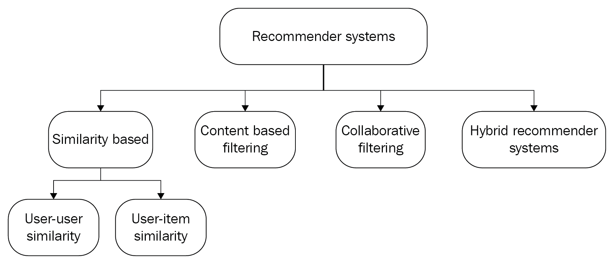

我们将讨论基于相似度、基于内容、协同和混合推荐系统。然后基于它们的优缺点，我们将通过一个实际示例展示如何开发一个书籍推荐系统。

# 基于相似度的推荐系统

基于相似度的两种主要方法：**用户-用户相似度**和**用户-项目相似度**。这些方法可以用来构建推荐系统。要使用用户-用户项目相似度方法，首先构建一个用户-用户相似度矩阵。然后它会选择那些被相似用户喜欢的项目，最后为特定用户推荐项目。

假设我们想要开发一个图书推荐系统：自然地，会有许多图书用户（读者）和一系列图书。为了简洁起见，让我们选择以下与机器学习相关的图书作为读者的代表：


然后，基于用户-用户相似度的推荐系统将根据某些相似度度量技术使用相似度度量来推荐图书。例如，余弦相似度的计算如下：

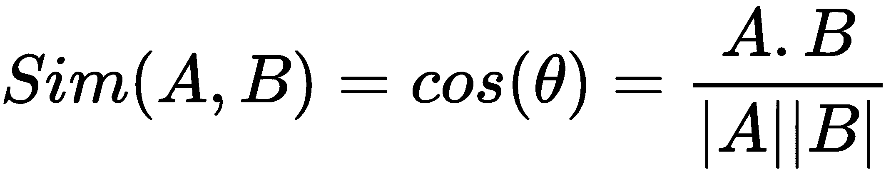

在前面的方程中，*A* 和 *B* 代表两个用户。如果相似度阈值大于或等于定义的阈值，用户 *A* 和 *B* 很可能具有相似偏好：

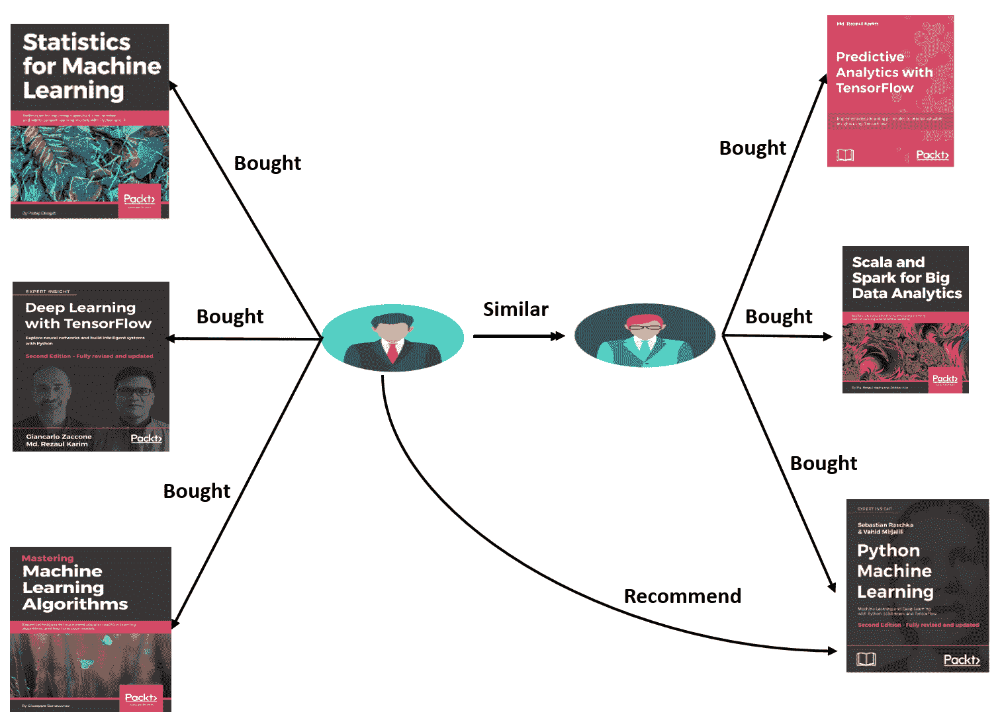

然而，基于用户-用户相似度的推荐系统并不稳健。有以下几个原因：

+   用户偏好和口味通常会随时间变化

+   由于需要从非常稀疏的矩阵计算中计算许多案例的相似度，因此它们在计算上非常昂贵

亚马逊和 YouTube 拥有数百万的订阅用户，因此你创建的任何用户-用户效用矩阵都将是一个非常稀疏的矩阵。一种解决方案是使用项目-项目相似度，这也会计算出一个项目-项目效用矩阵，找到相似的项目，最后推荐相似的项目，就像以下图示：

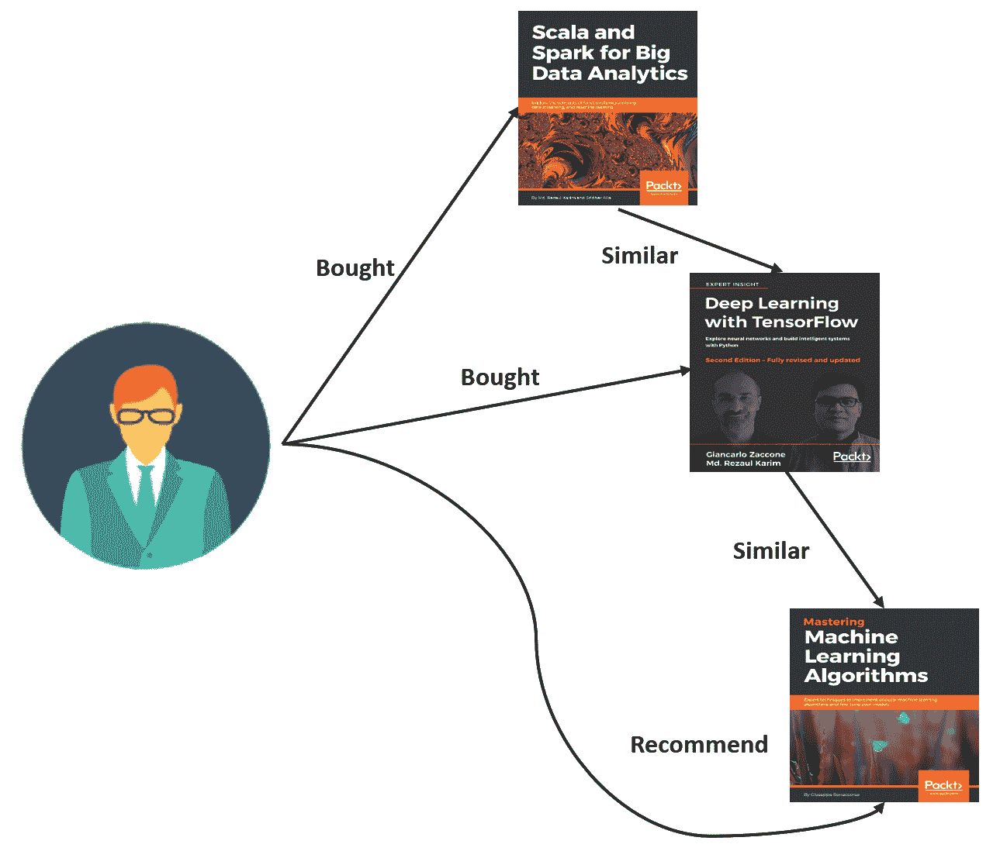

这种方法与用户-用户相似度方法相比有一个优点，即通常在初始阶段之后，给定项目的评分不会发生很大的变化。以《百页机器学习书》为例，尽管它只发布了几个月，但在亚马逊上已经获得了非常好的评分。因此，即使在未来几个月内，有几个人给出了较低的评分，其评分在初始阶段之后也不会有太大变化。

有趣的是，这也是一个假设，即评分在一段时间内不会发生很大的变化。然而，这个假设在用户数量远多于项目数量的情况下非常有效。

# 基于内容的过滤方法

基于内容的过滤方法基于经典的机器学习技术，如分类或回归。这类系统学习如何表示一个项目（图书）*I[j]* 和一个用户 *U[i]*。然后，在将它们组合为特征向量之前，为 *I[j]* 和 *U[i]* 创建单独的特征矩阵。然后，将特征向量输入到训练的分类或回归模型中。这样，ML 模型生成标签 *L[ij]*，这有趣的是用户 *U[i]* 对项目 *I[j]* 给出的相应评分：

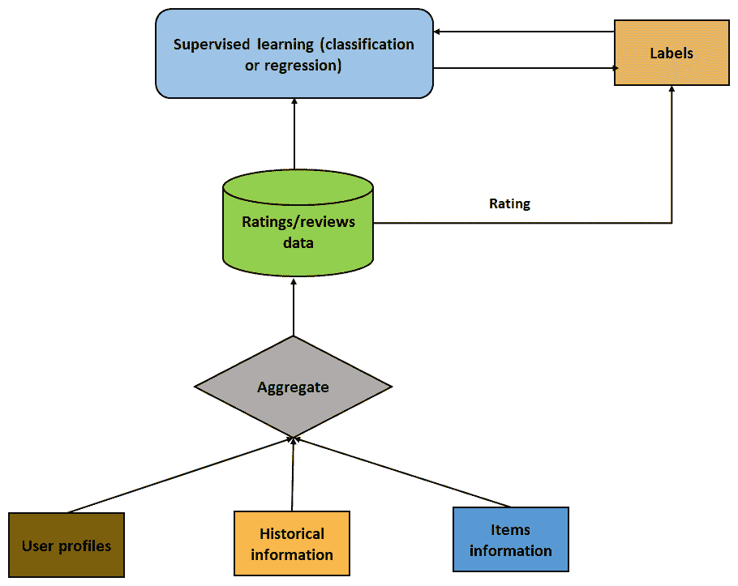

一个一般的警告是，应该创建特征，以便它们对评分（**标签**）有直接影响。这意味着特征应该尽可能依赖，以避免相关性。

# 协同过滤方法

协同过滤的想法是，当我们有很多喜欢某些物品的用户时，这些物品可以推荐给尚未看到它们的用户。假设我们有四位读者和四本书，如下面的图所示：

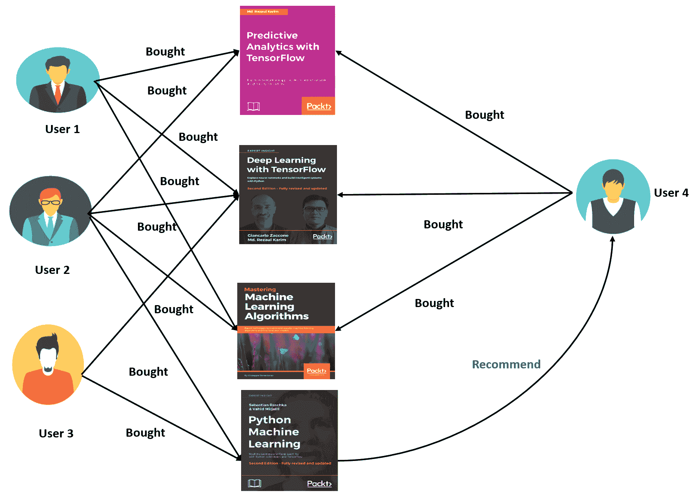

此外，想象所有这些用户都购买了物品 1（即**使用 TensorFlow 进行预测分析**）和物品 2（即**使用 TensorFlow 进行深度学习**）。现在，假设**用户 4**阅读了物品 1、2 和 3，而**用户 1**和**用户 2**购买了物品 3（即**精通机器学习算法**）。然而，由于**用户 4**尚未看到物品 4（即**Python 机器学习**），**用户 3**可以向他推荐它。

因此，基本假设是，之前推荐过物品的用户倾向于在将来也给出推荐。如果这个假设不再成立，那么就无法构建协同过滤推荐系统。这可能是协同过滤方法遭受冷启动、可扩展性和稀疏性问题的主要原因。

**冷启动**：协同过滤方法可能会陷入困境，无法进行推荐，尤其是在用户-物品矩阵中缺少大量用户数据时。

# 效用矩阵

假设我们有一组用户，他们偏好一组书籍。用户对书籍的偏好越高，评分就越高，介于 1 到 10 之间。让我们尝试使用矩阵来理解这个问题，其中行代表用户，列代表书籍：

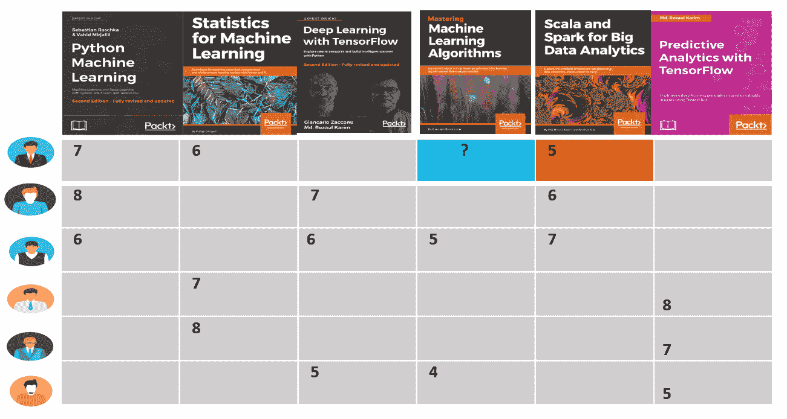

假设评分范围从 1 到 10，10 是最高偏好级别。那么，在先前的表中，用户（第 1 行）对第一本书（第 1 列）给出了**7**的评分，对第二本书评分为**6**。还有许多空单元格，表示用户没有对那些书籍进行任何评分。

这个矩阵通常被称为用户-物品或效用矩阵，其中每一行代表一个用户，每一列代表一个物品（书籍），而单元格代表用户对该物品给出的相应评分。

在实践中，效用矩阵非常稀疏，因为大量单元格是空的。原因是物品数量众多，单个用户几乎不可能对所有物品进行评分。即使一个用户对 10%的物品进行了评分，这个矩阵的其他 90%的单元格仍然为空。这些空单元格通常用 NaN 表示，即不是一个数字，尽管在我们的效用矩阵示例中我们使用了**？**。这种稀疏性通常会创建计算复杂性。让我给你举个例子。

假设有 100 万用户（*n*）和 10,000 个项目（电影，*m*），这是*10,000,000 * 10,000*或*10¹¹*，一个非常大的数字。现在，即使一个用户评了 10 本书，这也意味着总的评分数量将是*10 * 1 百万 = 10⁷*。这个矩阵的稀疏度可以计算如下：

*S[m ]= 空单元格数 / 总单元格数 = (10^(10 )- 10⁷)/10¹⁰ = 0.9999*

这意味着 99.99%的单元格仍然为空。

# 基于模型的书籍推荐系统

在本节中，我们将展示如何使用 Spark MLlib 库开发一个基于模型的书籍推荐系统。书籍及其对应的评分是从以下链接下载的：[`www2.informatik.uni-freiburg.de/~cziegler/BX/`](http://www2.informatik.uni-freiburg.de/~cziegler/BX/)。这里有三个 CSV 文件：

+   `BX-Users.csv`: 包含用户的统计数据，每个用户都指定了用户 ID（`User-ID`）。

+   `BX-Books.csv`: 包含书籍相关信息，如`Book-Title`、`Book-Author`、`Year-Of-Publication`和`Publisher`。每本书都有一个 ISBN 标识。此外，还提供了`Image-URL-S`、`Image-URL-M`和`Image-URL-L`。

+   `BX-Book-Ratings.csv`: 包含由`Book-Rating`列指定的评分。评分在`1`到`10`的范围内（数值越高表示越高的评价），或者隐式表达为`0`。

在我们进入编码部分之前，我们需要了解一些关于矩阵分解技术，如**奇异值分解**（**SVD**）的更多信息。SVD 可以将项目和用户条目转换到相同的潜在空间，这代表了用户和项目之间的交互。矩阵分解背后的原理是潜在特征表示用户如何评分项目。

# 矩阵分解

因此，给定用户和项目的描述，这里的任务是预测用户将如何评分那些尚未评分的项目。更正式地说，如果用户*U[i]*喜欢项目*V[1]*、*V[5]*和*V[7]*，那么任务就是向用户*U[i]*推荐他们可能也会喜欢的项目*V[j]*，如图所示：

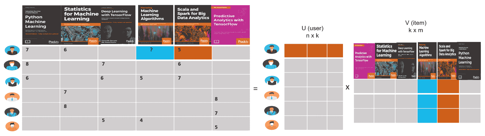

一旦我们有了这样的应用，我们的想法是每次我们收到新的数据时，我们将其更新到训练数据集，然后更新通过 ALS 训练获得的模型，其中使用了协同过滤方法。为了处理用户-书籍效用矩阵，使用了一个低秩矩阵分解算法：

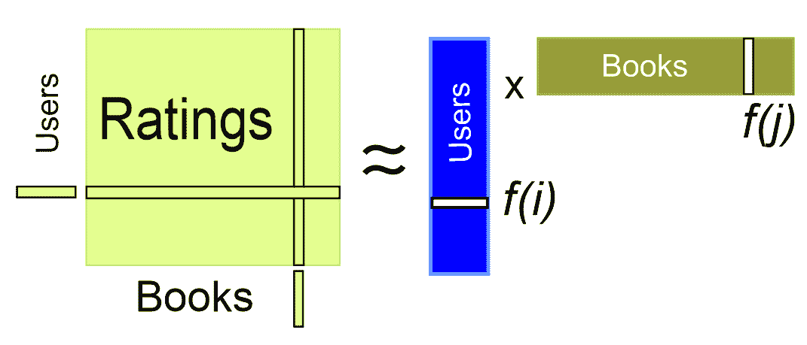

由于并非所有书籍都被所有用户评分，这个矩阵中的并非所有条目都是已知的。前面章节中讨论的协同过滤方法在这里作为救星出现。嗯，使用协同过滤，我们可以解决一个优化问题，通过分解**用户因素（V**）和**书籍因素（V**）来近似评分矩阵，如下所示：


这两个矩阵被选择，使得用户-书籍对（在已知评分的情况下）的错误最小化。ALS 算法首先用随机值（在我们的案例中是 1 到 10 之间）填充用户矩阵，然后优化这些值以使错误最小化。然后 ALS 将书籍矩阵保持固定，并使用以下数学方程优化用户矩阵的值：

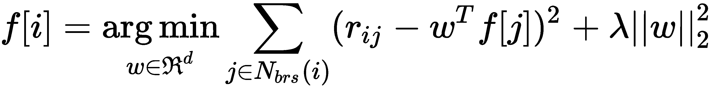

Spark MLlib 支持基于模型的协同过滤方法。在这种方法中，用户和物品由一组小的潜在因素来描述，以预测用户-物品效用矩阵中缺失的条目。如前所述，ALS 算法可以通过迭代方式学习这些潜在因素。ALS 算法接受六个参数，即`numBlocks`、`rank`、`iterations`、`lambda`、`implicitPrefs`和`alpha`。`numBlocks`是并行计算所需的块数。`rank`参数是潜在因素的数量。`iterations`参数是 ALS 收敛所需的迭代次数。`lambda`参数表示正则化参数。`implicitPrefs`参数表示我们希望使用其他用户的显式反馈，最后，`alpha`是偏好观察的基线置信度。

# 探索性分析

在本小节中，我们将对评分、书籍和相关统计进行一些探索性分析。这种分析将帮助我们更好地理解数据：

```py
val ratigsFile = "data/BX-Book-Ratings.csv"
var ratingDF = spark.read.format("com.databricks.spark.csv")
      .option("delimiter", ";")
      .option("header", true)
      .load(ratigsFile)
```

以下代码片段显示了来自`BX-Books.csv`文件的书籍 DataFrame：

```py
/* Explore and query on books         */
val booksFile = "data/BX-Books.csv"
var bookDF = spark.read.format("com.databricks.spark.csv")
            .option("header", "true")
            .option("delimiter", ";")
            .load(booksFile)    
bookDF = bookDF.select(bookDF.col("ISBN"), 
                       bookDF.col("Book-Title"), 
                       bookDF.col("Book-Author"), 
                       bookDF.col("Year-Of-Publication"))

bookDF = bookDF.withColumnRenamed("Book-Title", "Title")
                .withColumnRenamed("Book-Author", "Author")
                .withColumnRenamed("Year-Of-Publication", "Year")

bookDF.show(10)
```

以下为输出结果：

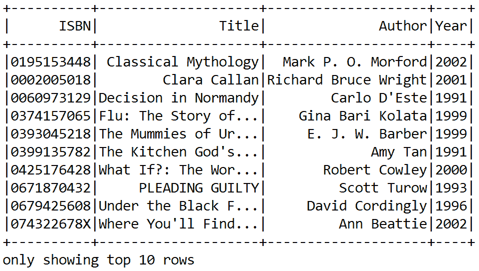

让我们看看有多少独特的书籍：

```py
val numDistinctBook = bookDF.select(bookDF.col("ISBN")).distinct().count()
println("Got " + numDistinctBook + " books") 
```

以下为输出结果：

```py
Got 271,379 books
```

这些信息对于后续案例将非常有价值，这样我们就可以知道在评分数据集中有多少书籍缺少评分。为了注册这两个数据集，我们可以使用以下代码：

```py
ratingsDF.createOrReplaceTempView("ratings")
moviesDF.createOrReplaceTempView("books")
```

这将通过创建一个临时视图作为内存中的表来加快内存查询速度。让我们检查与评分相关的统计信息。只需使用以下代码行：

```py
/* Explore and query ratings for books         */
val numRatings = ratingDF.count()
val numUsers = ratingDF.select(ratingDF.col("UserID")).distinct().count()
val numBooks = ratingDF.select(ratingDF.col("ISBN")).distinct().count()
println("Got " + numRatings + " ratings from " + numUsers + " users on " + numBooks + " books")
```

您应该找到“从 105283 个用户对 340556 本书进行了 1149780 次评分”。现在，让我们获取最大和最小评分，以及评分书籍的用户数量：

```py
// Get the max, min ratings along with the count of users who have rated a book.    
val statDF = spark.sql("select books.Title, bookrates.maxRating, bookrates.minRating, bookrates.readerID "
      + "from(SELECT ratings.ISBN,max(ratings.Rating) as maxRating,"
      + "min(ratings.Rating) as minRating,count(distinct UserID) as readerID "
      + "FROM ratings group by ratings.ISBN) bookrates "
      + "join books on bookrates.ISBN=books.ISBN " + "order by bookrates.readerID desc")

    statDF.show(10)
```

前面的代码应该生成最大和最小评分，以及评分书籍的用户数量：

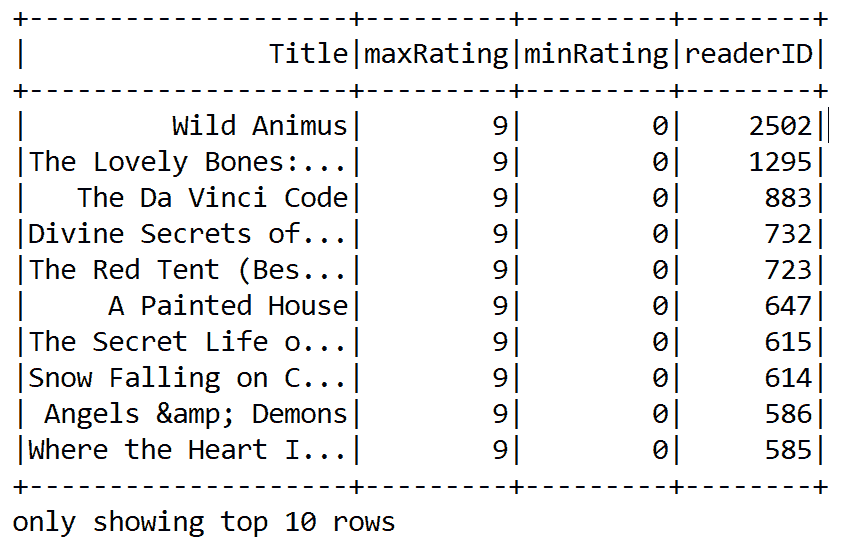

现在，为了获得更深入的洞察，我们需要更多地了解用户及其评分，这可以通过找到最活跃的十个用户以及他们为书籍评分的次数来实现：

```py
// Show the top 10 most-active users and how many times they rated a book
val mostActiveReaders = spark.sql("SELECT ratings.UserID, count(*) as CT from ratings "
      + "group by ratings.UserID order by CT desc limit 10")
mostActiveReaders.show()
```

前面的代码行应该显示最活跃的十个用户以及他们为书籍评分的次数：

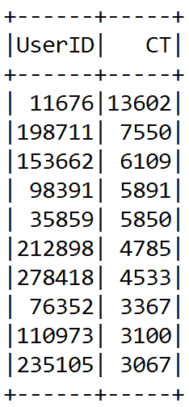

现在，让我们查看一个特定的用户，并找到那些用户`130554`评分高于`5`的书籍：

```py
// Find the movies that user 130554 rated higher than 5
val ratingBySpecificReader = spark.sql(
      "SELECT ratings.UserID, ratings.ISBN,"
        + "ratings.Rating, books.Title FROM ratings JOIN books "
        + "ON books.ISBN=ratings.ISBN "
        + "WHERE ratings.UserID=130554 and ratings.Rating > 5")

ratingBySpecificReader.show(false)
```

如描述，上述代码行应显示用户 130554 评分超过 5 分的所有电影名称：

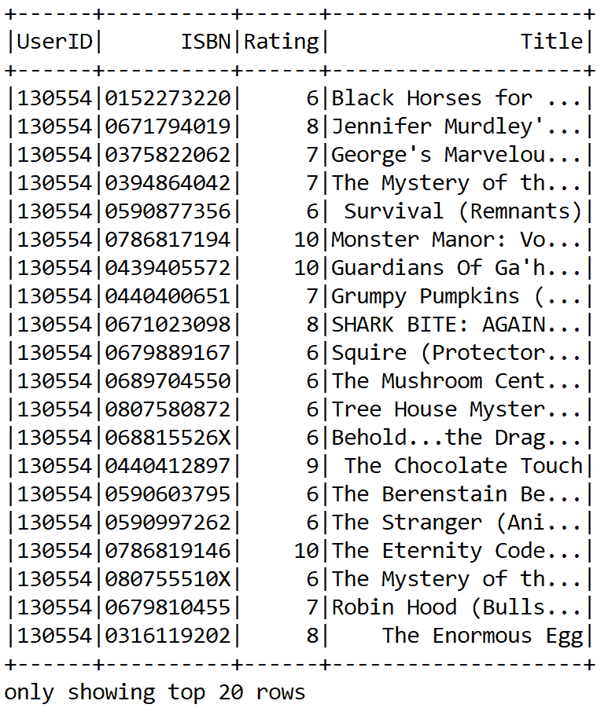

# 准备训练和测试评分数据

以下代码将评分 RDD 分割为训练数据 RDD（60%）和测试数据 RDD（40%）。第二个参数（即`1357L`）是*种子*，通常用于可重复性目的：

```py
val splits = ratingDF.randomSplit(Array(0.60, 0.40), 1357L)
val (trainingData, testData) = (splits(0), splits(1))

trainingData.cache
testData.cache

val numTrainingSample = trainingData.count()
val numTestSample = testData.count()
println("Training: " + numTrainingSample + " test: " + numTestSample) 
```

你会看到训练 DataFrame 中有 689,144 个评分，测试 DataFrame 中有 345,774 个评分。ALS 算法需要训练的评分 RDD。以下代码展示了如何使用 API 构建推荐模型：

```py
val trainRatingsRDD = trainingData.rdd.map(row => {
      val userID = row.getString(0)
      val ISBN = row.getInt(1)
      val ratings = row.getString(2)
      Rating(userID.toInt, ISBN, ratings.toDouble)
    })
```

`trainRatingsRDD`是一个包含`UserID`、`ISBN`以及对应评分的 RDD，这些评分来自我们在前一步准备的训练数据集。同样，我们还从测试 DataFrame 中准备了一个另一个 RDD：

```py
val testRatingsRDD = testData.rdd.map(row => {
      val userID = row.getString(0)
      val ISBN = row.getInt(1)
      val ratings = row.getString(2)
      Rating(userID.toInt, ISBN, ratings.toDouble)
    })
```

基于上述`trainRatingsRDD`，我们通过添加最大迭代次数、块的数量、alpha、rank、lambda、seed 和隐式偏好来构建一个 ALS 用户模型。这种方法通常用于分析和预测特定用户的缺失评分：

```py
val model : MatrixFactorizationModel = new ALS()
      .setIterations(10)
      .setBlocks(-1)
      .setAlpha(1.0)
      .setLambda(0.01)
      .setRank(25)
      .setSeed(1234579L)
      .setImplicitPrefs(false) // We want explicit feedback
      .run(trainRatingsRDD)
```

最后，我们迭代模型进行学习`10`次。在这个设置下，我们得到了良好的预测准确度。建议读者应用超参数调整以找到这些参数的最佳值。为了评估模型的质量，我们计算**均方根误差**（**RMSE**）。以下代码计算了使用训练集开发的模型的 RMSE 值：

```py
var rmseTest = computeRmse(model, testRatingsRDD, true)
println("Test RMSE: = " + rmseTest) //Less is better
```

对于上述设置，我们得到以下输出：

```py
Test RMSE: = 1.6867585251053991 
```

前述方法计算 RMSE 来评估模型。RMSE 越低，模型及其预测能力越好，如下所示：

```py
//Compute the RMSE to evaluate the model. Less the RMSE better the model and it's prediction capability. 
def computeRmse(model: MatrixFactorizationModel, ratingRDD: RDD[Rating], implicitPrefs: Boolean): Double =         {
    val predRatingRDD: RDD[Rating] = model.predict(ratingRDD.map(entry => (entry.user, entry.product)))
    val predictionsAndRatings = predRatingRDD.map {entry => ((entry.user, entry.product), entry.rating)}
                                .join(ratingRDD
                                .map(entry => ((entry.user, entry.product), entry.rating)))
                                .values    
    math.sqrt(predictionsAndRatings.map(x => (x._1 - x._2) * (x._1 - x._2)).mean()) // return MSE
          }
```

最后，让我们为特定用户做一些电影推荐。让我们获取用户`276747`的前十本书的预测：

```py
println("Recommendations: (ISBN, Rating)")
println("----------------------------------")
val recommendationsUser = model.recommendProducts(276747, 10)
recommendationsUser.map(rating => (rating.product, rating.rating)).foreach(println)
println("----------------------------------")
```

我们得到以下输出：

```py
Recommendations: (ISBN => Rating)
 (1051401851,15.127044702142243)
 (2056910662,15.11531283195148)
 (1013412890,14.75898119158678)
 (603241602,14.53024153450836)
 (1868529062,14.180262929540024)
 (746990712,14.121654522195225)
 (1630827789,13.741728003481194)
 (1179316963,13.571754513473993)
 (505970947,13.506755847456258)
 (632523982,13.46591014905454)
 ----------------------------------
```

我们相信前述模型的表现可以进一步提高。然而，据我们所知，MLlib 基于的 ALS 算法没有可用的模型调整功能。

想要了解更多关于调整基于 ML 的 ALS 模型的信息的读者应参考[`spark.apache.org/docs/preview/ml-collaborative-filtering.html`](https://spark.apache.org/docs/preview/ml-collaborative-filtering.html)

# 添加新的用户评分和进行新的预测

我们可以创建一个新用户 ID、书的 ISBN 和上一步预测的评分的序列：

```py
val new_user_ID = 300000 // new user ID randomly chosen

//The format of each line is (UserID, ISBN, Rating)
val new_user_ratings = Seq(
      (new_user_ID, 817930596, 15.127044702142243),
      (new_user_ID, 1149373895, 15.11531283195148),
      (new_user_ID, 1885291767, 14.75898119158678),
      (new_user_ID, 459716613, 14.53024153450836),
      (new_user_ID, 3362860, 14.180262929540024),
      (new_user_ID, 1178102612, 14.121654522195225),
      (new_user_ID, 158895996, 13.741728003481194),
      (new_user_ID, 1007741925, 13.571754513473993),
      (new_user_ID, 1033268461, 13.506755847456258),
      (new_user_ID, 651677816, 13.46591014905454))

val new_user_ratings_RDD = spark.sparkContext.parallelize(new_user_ratings)
val new_user_ratings_DF = spark.createDataFrame(new_user_ratings_RDD).toDF("UserID", "ISBN", "Rating")

val newRatingsRDD = new_user_ratings_DF.rdd.map(row => {
      val userId = row.getInt(0)
      val movieId = row.getInt(1)
      val ratings = row.getDouble(2)
      Rating(userId, movieId, ratings)
    }) 
```

现在我们将它们添加到我们将用于训练推荐模型的原始数据中。我们使用 Spark 的`union()`转换来完成这个操作：

```py
val complete_data_with_new_ratings_RDD = trainRatingsRDD.union(newRatingsRDD)
```

最后，我们使用之前（在小数据集使用时）选定的所有参数来训练 ALS 模型：

```py
val newModel : MatrixFactorizationModel = new ALS()
      .setIterations(10)
      .setBlocks(-1)
      .setAlpha(1.0)
      .setLambda(0.01)
      .setRank(25)
      .setSeed(123457L)
      .setImplicitPrefs(false)
      .run(complete_data_with_new_ratings_RDD)
```

每当用户添加新的评分时，我们都需要重复这个过程。理想情况下，我们将批量处理，而不是为每个用户系统中每个单独的评分进行处理。然后我们可以再次为其他用户，例如之前缺少评分的`276724`，提供推荐：

```py
// Making Predictions. Get the top 10 book predictions for user 276724
//Book recommendation for a specific user. Get the top 10 book predictions for reader 276747
println("Recommendations: (ISBN, Rating)")
println("----------------------------------")
val newPredictions = newModel.recommendProducts(276747, 10)
newPredictions.map(rating => (rating.product, rating.rating)).foreach(println)
println("----------------------------------")
```

以下为输出结果：

```py
Recommendations: (ISBN, Rating)
 ----------------------------------
 (1901261462,15.48152758068679)
 (1992983531,14.306018295431224)
 (1438448913,14.05457411015043)
 (2022242154,13.516608439192192)
 (817930596,13.487733919030019)
 (1079754533,12.991618591680165)
 (611897245,12.716161072778828)
 (11041460,12.44511878072316)
 (651596038,12.13345082904184)
 (1955775932,11.7254312955358)
 ----------------------------------
```

最后，我们计算 RMSE：

```py
var newrmseTest = computeRmse(newModel, testRDD, true)
println("Test RMSE: = " + newrmseTest) //Less is better
```

以下为输出结果：

```py
Test RMSE: = 4.892434600794704
```

# 摘要

在本章中，我们学习了推荐系统的不同方法，例如基于相似度、基于内容、协同过滤和混合。此外，我们还讨论了这些方法的缺点。然后我们实现了一个端到端的书籍推荐系统，这是一个基于 Spark 的模型推荐系统。我们还看到了如何高效地处理效用矩阵，通过在 ALS 和矩阵分解之间进行交互操作。

在下一章中，我们将解释**深度学习**（**DL**）的一些基本概念，它是机器学习（ML）的一个新兴分支。我们将简要讨论一些最著名和最广泛使用的神经网络架构。然后，我们将探讨深度学习框架和库的各种特性。

然后，我们将了解如何准备编程环境，在开始使用一些开源深度学习库（如**Deeplearning4j**（**DL4J**））进行编码之前。最后，我们将使用两种神经网络架构，即**多层感知器**（**MLP**）和**长短期记忆**（**LSTM**），来解决一个现实生活中的问题。
