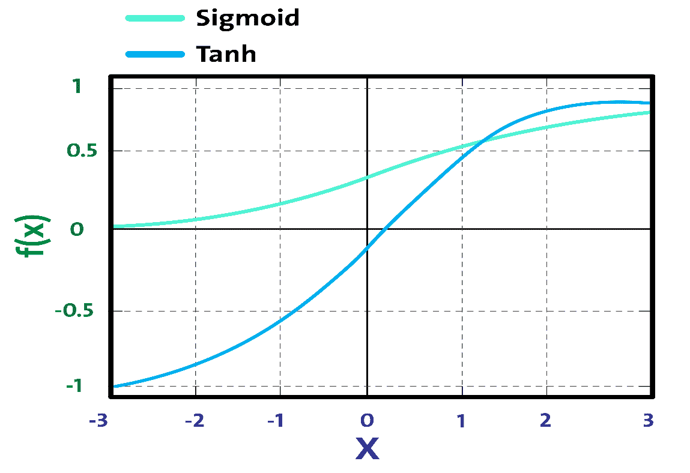

# 第七章：使用 Scala 进行回归分析简介

在 第二章 “使用 Scala 进行回归分析” 到 第六章 “使用 Scala 进行推荐系统” 中，我们通过实际案例学习了线性经典 **机器学习**（**ML**）算法。在本章中，我们将解释一些 **深度学习**（**DL**）的基本概念。我们将从深度学习开始，这是机器学习的一个新兴分支。我们将简要讨论一些最著名和最广泛使用的神经网络架构和深度学习框架和库。

最后，我们将使用来自 **The Cancer Genome Atlas**（**TCGA**）的非常高维数据集的 **长短期记忆**（**LSTM**）架构进行癌症类型分类。本章将涵盖以下主题：

+   深度学习与机器学习

+   深度学习与神经网络

+   深度神经网络架构

+   深度学习框架

+   开始学习

# 技术要求

确保您的机器上已安装并配置了 Scala 2.11.x 和 Java 1.8.x。

本章的代码文件可以在 GitHub 上找到：

[`github.com/PacktPublishing/Machine-Learning-with-Scala-Quick-Start-Guide/tree/master/Chapter07`](https://github.com/PacktPublishing/Machine-Learning-with-Scala-Quick-Start-Guide/tree/master/Chapter07)

查看以下视频，了解代码的实际应用：

[`bit.ly/2vwrxzb`](http://bit.ly/2vwrxzb)

# 深度学习与机器学习

在小规模数据分析中使用的一些简单机器学习方法不再有效，因为随着大型和高维数据集的增加，机器学习方法的有效性会降低。于是出现了深度学习——一种基于一组试图在数据中模拟高级抽象的算法的机器学习分支。Ian Goodfellow 等人（《深度学习》，麻省理工学院出版社，2016 年）将深度学习定义为如下：

“深度学习是一种特殊的机器学习方法，通过学习将世界表示为嵌套的概念层次结构，每个概念都是相对于更简单的概念定义的，并且更抽象的表示是通过更不抽象的表示来计算的，从而实现了强大的功能和灵活性。”

与机器学习模型类似，深度学习模型也接受一个输入 *X*，并从中学习高级抽象或模式以预测输出 *Y*。例如，基于过去一周的股票价格，深度学习模型可以预测下一天的股票价格。在训练此类历史股票数据时，深度学习模型试图最小化预测值与实际值之间的差异。这样，深度学习模型试图推广到它之前未见过的新输入，并在测试数据上做出预测。

现在，你可能想知道，如果 ML 模型可以完成同样的任务，为什么我们还需要 DL？嗯，DL 模型在大数据量下往往表现良好，而旧的 ML 模型在某个点之后就会停止改进。DL 的核心概念灵感来源于大脑的结构和功能，被称为**人工神经网络**（**ANNs**）。作为 DL 的核心，ANNs 帮助您学习输入和输出集合之间的关联，以便做出更稳健和准确的预测。然而，DL 不仅限于 ANNs；已经有许多理论进步、软件堆栈和硬件改进，使 DL 普及。让我们看一个例子；假设我们想要开发一个预测分析模型，例如动物识别器，我们的系统必须解决两个问题：

+   要分类图像是否代表猫或狗

+   要对猫和狗的图像进行聚类

如果我们使用典型的机器学习（ML）方法来解决第一个问题，我们必须定义面部特征（耳朵、眼睛、胡须等）并编写一个方法来识别在分类特定动物时哪些特征（通常是非线性）更重要。

然而，与此同时，我们无法解决第二个问题，因为用于聚类图像的经典 ML 算法（如 k-means）无法处理非线性特征。看看以下流程图，它显示了如果我们想要分类给定的图像是否为猫时我们将遵循的流程：


DL 算法将这两个问题进一步推进，在确定哪些特征对分类或聚类最为重要后，最重要的特征将被自动提取。相比之下，当使用经典 ML 算法时，我们必须手动提供特征。

深度学习（DL）算法会采取更复杂的步骤。例如，首先，它会识别在聚类猫或狗时最相关的边缘。然后，它会尝试以分层的方式找到各种形状和边缘的组合。这一步被称为**提取、转换和加载**（**ETL**）。然后，经过几次迭代后，将进行复杂概念和特征的分层识别。然后，基于识别出的特征，DL 算法将决定哪些特征对分类动物最为重要。这一步被称为特征提取。最后，它会提取标签列并使用**自动编码器**（**AEs**）进行无监督训练，以提取要重新分配给 k-means 进行聚类的潜在特征。然后，**聚类分配硬化损失**（**CAH 损失**）和重建损失将共同优化以实现最佳的聚类分配。

然而，在实践中，深度学习算法使用的是原始图像表示，它并不像我们看待图像那样看待图像，因为它只知道每个像素的位置及其颜色。图像被划分为各种分析层。在较低层次，软件分析，例如，几个像素的网格，任务是检测某种颜色或各种细微差别。如果它发现某些东西，它会通知下一层，此时该层检查给定的颜色是否属于更大的形状，例如一条线。

这个过程一直持续到算法理解以下图中所示的内容：


虽然**狗与猫**是一个非常简单的分类器的例子，但现在能够执行这些类型任务的软件已经非常普遍，例如在识别面部或搜索谷歌图片的系统中发现。这类软件基于深度学习算法。相反，使用线性机器学习算法，我们无法构建这样的应用程序，因为这些算法无法处理非线性图像特征。

此外，使用机器学习方法，我们通常只处理几个超参数。然而，当引入神经网络时，事情变得过于复杂。在每个层中，都有数百万甚至数十亿个超参数需要调整——如此之多，以至于代价函数变得非凸。另一个原因是，在隐藏层中使用的激活函数是非线性的，因此代价是非凸的。

# 深度学习与 ANNs（人工神经网络）

受人类大脑工作方式启发的 ANNs（人工神经网络）是深度学习的核心和真正实现。今天围绕深度学习的革命如果没有 ANNs（人工神经网络）是不可能发生的。因此，为了理解深度学习，我们需要了解神经网络是如何工作的。

# ANNs（人工神经网络）与人类大脑

ANNs（人工神经网络）代表了人类神经系统的一个方面，以及神经系统由许多通过轴突相互通信的神经元组成。感受器接收来自内部或外部世界的刺激。然后，它们将此信息传递给生物神经元以进行进一步处理。

除了另一个被称为轴突的长延伸之外，还有许多树突。在其末端，有微小的结构称为突触末端，用于将一个神经元连接到其他神经元的树突。生物神经元从其他神经元接收称为信号的短暂电脉冲，作为回应，它们触发自己的信号。

因此，我们可以总结说，神经元由细胞体（也称为胞体）、一个或多个用于接收来自其他神经元信号的树突，以及一个用于执行神经元产生的信号的轴突组成。当神经元向其他神经元发送信号时，它处于活跃状态。然而，当它从其他神经元接收信号时，它处于非活跃状态。在空闲状态下，神经元积累所有接收到的信号，直到达到一定的激活阈值。这一切激励研究人员测试人工神经网络（ANNs）。

# 人工神经网络简史

人工神经网络和深度学习最显著的进步可以用以下时间线来描述。我们已经看到，人工神经元和感知器分别在 1943 年和 1958 年为基础。然后，1969 年，明斯基（Minsky）等人将 XOR 表述为线性不可分问题，但后来在 1974 年，韦伯斯（Werbos）等人证明了用于训练感知器的反向传播算法。

然而，最显著的进步发生在 20 世纪 80 年代，当时约翰·霍普菲尔德（John Hopfield）等人于 1982 年提出了霍普菲尔德网络。然后，神经网络和深度学习的奠基人之一辛顿及其团队于 1985 年提出了玻尔兹曼机。然而，可能最显著的进步发生在 1986 年，当时辛顿等人成功训练了多层感知器（MLP），乔丹等人提出了 RNNs。同年，斯莫伦斯基（Smolensky）等人还提出了改进的玻尔兹曼机，称为**受限玻尔兹曼机**（**RBM**）。

然而，在 20 世纪 90 年代，最显著的一年是 1997 年，当时勒克伦（Lecun）等人于 1990 年提出了 LeNet，乔丹（Jordan）等人于 1997 年提出了循环神经网络（RNN）。同年，舒斯特（Schuster）等人提出了改进的 LSTM 和原始 RNN 的改进版本，称为双向 RNN。以下时间线简要概述了不同神经网络架构的历史：


尽管计算取得了显著进步，但从 1997 年到 2005 年，我们并没有经历太多的进步，直到辛顿在 2006 年再次取得突破，当时他和他的团队通过堆叠多个 RBM 提出了**深度信念网络**（**DBN**）。然后，在 2012 年，辛顿发明了 dropout，这显著提高了深度神经网络的正则化和过拟合。

之后，伊恩·古德费洛（Ian Goodfellow）等人引入了生成对抗网络（GANs），这在图像识别领域是一个重要的里程碑。2017 年，辛顿（Hinton）提出了 CapsNet 以克服常规卷积神经网络（CNNs）的局限性，这至今为止是最重要的里程碑之一。

# 人工神经网络是如何学习的？

基于生物神经元的理念，人工神经网络（ANNs）的术语和概念应运而生。与生物神经元相似，人工神经元由以下部分组成：

+   一个或多个汇聚来自神经元信号的输入连接

+   一个或多个输出连接，用于将信号传递到其他神经元

+   激活函数，它决定了输出信号的数值

除了神经元的当前状态外，还考虑了突触权重，这影响了网络内的连接。每个权重都有一个由 *W[ij]* 表示的数值，它是连接神经元 *i* 和神经元 *j* 的突触权重。现在，对于每个神经元 *i*，可以定义一个输入向量 *x[i] = (x[1], x[2],…x[n])* 和一个权重向量 *w[i] = (w[i1], w[i2],…w[in])*。现在，根据神经元的定位，权重和输出函数决定了单个神经元的行为。然后，在正向传播过程中，隐藏层中的每个单元都会接收到以下信号：


尽管如此，在权重中，还有一种特殊的权重类型，称为偏置单元，*b*。技术上讲，偏置单元不连接到任何前一层，因此它们没有真正的活动。但仍然，偏置 *b* 的值允许神经网络将激活函数向左或向右移动。考虑偏置单元后，修改后的网络输出如下所示：


前面的方程表示每个隐藏单元都得到输入的总和，乘以相应的权重——这被称为 **求和节点**。然后，**求和节点**中的结果输出通过激活函数，如图所示进行压缩：


人工神经元模型的工作原理

然而，一个实际的神经网络架构是由输入、隐藏和输出层组成的，这些层由 *nodes* 构成网络结构，但仍遵循前面图表中所示的人工神经元模型的工作原理。输入层只接受数值数据，例如实数特征、具有像素值的图像等：


一个具有一个输入层、三个隐藏层和一个输出层的神经网络

在这里，隐藏层执行大部分计算以学习模式，网络通过使用称为损失函数的特殊数学函数来评估其预测与实际输出的准确性。它可能很复杂，也可能非常简单，可以定义为以下：


在前面的方程中， 表示网络做出的预测，而 *Y* 代表实际或预期的输出。最后，当错误不再减少时，神经网络收敛并通过输出层进行预测。

# 训练神经网络

神经网络的训练过程被配置为一个迭代优化权重的过程。权重在每个时代更新。一旦开始训练，目标是通过最小化损失函数来生成预测。然后，网络的性能在测试集上评估。我们已经了解了人工神经元的基本概念。然而，仅生成一些人工信号是不够学习复杂任务的。因此，常用的监督学习算法是反向传播算法，它被广泛用于训练复杂的 ANN。

最终，训练这样的神经网络也是一个优化问题，我们通过迭代调整网络权重和偏差，使用通过**梯度下降**（**GD**）的反向传播来最小化误差。这种方法迫使网络反向遍历所有层，以更新节点间的权重和偏差，方向与损失函数相反。

然而，使用梯度下降法（GD）的过程并不能保证达到全局最小值。隐藏单元的存在和输出函数的非线性意味着误差的行为非常复杂，并且有许多局部最小值。这个反向传播步骤通常要执行成千上万次，使用许多训练批次，直到模型参数收敛到最小化成本函数的值。当验证集上的误差开始增加时，训练过程结束，因为这可能标志着过拟合阶段的开始。

使用 GD 的缺点是它收敛得太慢，这使得它无法满足处理大规模训练数据的需求。因此，提出了一个更快的 GD，称为**随机梯度下降**（**SDG**），它也是 DNN 训练中广泛使用的优化器。在 SGD 中，我们使用训练集中的单个训练样本在每个迭代中更新网络参数，这是对真实成本梯度的随机近似。

现在还有其他一些高级优化器，如 Adam、RMSProp、ADAGrad、Momentum 等。它们中的每一个都是 SGD 的直接或间接优化版本。

# 权重和偏差初始化

现在，这里有一个棘手的问题：我们如何初始化权重？好吧，如果我们把所有权重初始化为相同的值（例如，0 或 1），每个隐藏神经元将接收到完全相同的信号。让我们来分析一下：

+   如果所有权重都初始化为 1，那么每个单元接收到的信号等于输入的总和

+   如果所有权重都是 0，这甚至更糟糕，那么隐藏层中的每个神经元都将接收到零信号

对于网络权重初始化，广泛使用 Xavier 初始化。它与随机初始化类似，但通常效果更好，因为它可以默认根据输入和输出神经元的总数来确定初始化速率。

你可能想知道在训练常规深度神经网络（DNN）时是否可以去掉随机初始化。好吧，最近，一些研究人员一直在讨论随机正交矩阵初始化，这种初始化对于训练 DNN 来说比任何随机初始化都好。当涉及到初始化偏差时，我们可以将它们初始化为零。

但是将偏差设置为一个小常数值，例如所有偏差的 0.01，确保所有**修正线性单元**（**ReLUs**）都能传播一些梯度。然而，它既没有表现出良好的性能，也没有显示出一致的改进。因此，建议坚持使用零。

# 激活函数

为了使神经网络能够学习复杂的决策边界，我们对其某些层应用非线性激活函数。常用的函数包括 Tanh、ReLU、softmax 及其变体。从技术上讲，每个神经元接收一个信号，该信号是突触权重和连接为输入的神经元的激活值的加权和。为此目的最广泛使用的函数之一是所谓的 sigmoid 逻辑函数，其定义如下：


这个函数的定义域包括所有实数，而陪域是（0, 1）。这意味着从神经元（根据其激活状态的计算）获得的任何输出值都将始终介于零和一之间。以下图中表示的**Sigmoid**函数提供了对神经元饱和率的解释，从非激活状态（等于**0**）到完全饱和，这发生在预定的最大值（等于**1**）：



Sigmoid 与 Tanh 激活函数

另一方面，双曲正切，或**Tanh**，是另一种激活函数形式。**Tanh**将一个介于**-1**和**1**之间的实数值拉平。前面的图表显示了**Tanh**和**Sigmoid**激活函数之间的差异。特别是，从数学上讲，*tanh*激活函数可以表示如下：


通常，在**前馈神经网络**（**FFNN**）的最后一层，应用 softmax 函数作为决策边界。这是一个常见的情况，尤其是在解决分类问题时。在多类分类问题中，softmax 函数用于对可能的类别进行概率分布。

对于回归问题，我们不需要使用任何激活函数，因为网络生成的是连续值——即概率。然而，我注意到现在有些人使用 IDENTITY 激活函数来解决回归问题。

总结来说，选择合适的激活函数和网络权重初始化是使网络发挥最佳性能并有助于获得良好训练的两个问题。既然我们已经了解了神经网络简短的历史，那么让我们在下一节深入探讨不同的架构，这将给我们一个关于它们用法的想法。

# 神经网络架构

我们可以将深度学习架构分为四组：

+   **深度神经网络**（**DNNs**）

+   **卷积神经网络**（**CNNs**）

+   **循环神经网络**（**RNNs**）

+   **涌现架构**（**EAs**）

然而，DNNs、CNNs 和 RNNs 有许多改进的变体。尽管大多数变体都是为了解决特定领域的研究问题而提出或开发的，但它们的基本工作原理仍然遵循原始的 DNN、CNN 和 RNN 架构。以下小节将简要介绍这些架构。

# DNNs

DNNs 是具有复杂和更深架构的神经网络，每一层都有大量神经元，并且它们之间有许多连接。尽管 DNN 指的是一个非常深的网络，但为了简单起见，我们将 MLP、**堆叠自编码器**（**SAE**）和**深度信念网络**（**DBNs**）视为 DNN 架构。这些架构大多作为 FFNN 工作，意味着信息从输入层传播到输出层。

多个感知器堆叠在一起形成 MLP，其中层以有向图的形式连接。本质上，MLP 是最简单的 FFNN 之一，因为它有三层：输入层、隐藏层和输出层。这样，信号以单向传播，从输入层到隐藏层再到输出层，如下面的图所示：


自编码器和 RBM 是 SAE 和 DBN 的基本构建块。与以监督方式训练的 FFNN MLP 不同，SAE 和 DBN 都是在两个阶段进行训练的：无监督预训练和监督微调。在无监督预训练中，层按顺序堆叠并以分层方式使用未标记的数据进行训练。在监督微调中，堆叠一个输出分类器层，并通过使用标记数据进行重新训练来优化整个神经网络。

MLP 的一个问题是它经常过拟合数据，因此泛化能力不好。为了克服这个问题，Hinton 等人提出了 DBN。它使用一种贪婪的、层级的、预训练算法。DBN 由一个可见层和多个隐藏单元层组成。DBN 的构建块是 RBM，如下面的图所示，其中几个 RBM 一个接一个地堆叠：


最上面的两层之间有未定向、对称的连接，但底层有从前一层的有向连接。尽管 DBNs 取得了许多成功，但现在它们正被 AEs 所取代。

# 自编码器

AEs 也是从输入数据自动学习的特殊类型的神经网络。AE 由两个组件组成：编码器和解码器。编码器将输入压缩成潜在空间表示。然后，解码器部分试图从这个表示中重建原始输入数据：

+   **编码器**：使用称为 *h=f(x)* 的函数将输入编码或压缩成潜在空间表示。

+   **解码器**：使用称为 *r=g(h)* 的函数从潜在空间表示解码或重建输入。

因此，一个 AE 可以通过一个函数来描述 *g(f(x)) = o*，其中我们希望 *0* 尽可能接近原始输入 *x*。以下图显示了 AE 通常的工作方式：


AEs 在数据去噪和降维以用于数据可视化方面非常有用。AEs 比 PCA 更有效地学习数据投影，称为表示。

# CNNs

CNNs 取得了很大的成就，并在计算机视觉（例如，图像识别）中得到广泛应用。在 CNN 网络中，连接方案与 MLP 或 DBN 相比有显著不同。一些卷积层以级联方式连接。每一层都由一个 ReLU 层、一个池化层和额外的卷积层（+ReLU）以及另一个池化层支持，然后是一个全连接层和一个 softmax 层。以下图是用于面部识别的 CNN 架构示意图，它以面部图像为输入，预测情绪，如愤怒、厌恶、恐惧、快乐、悲伤等。


用于面部识别的 CNN 的示意图架构

重要的是，DNNs 对像素的排列没有先验知识，因为它们不知道附近的像素是接近的。CNNs 通过在图像的小区域使用特征图来利用这种先验知识，而高层将低级特征组合成更高级的特征。

这与大多数自然图像都很好，使 CNNs 在 DNNs 中取得了决定性的领先优势。每个卷积层的输出是一组对象，称为特征图，由单个核滤波器生成。然后，特征图可以用来定义下一层的新输入。CNN 网络中的每个神经元都产生一个输出，随后是一个激活阈值，该阈值与输入成正比，没有界限。

# RNNs

在 RNNs 中，单元之间的连接形成一个有向循环。RNN 架构最初由 Hochreiter 和 Schmidhuber 在 1997 年构思。RNN 架构具有标准的 MLP，并增加了循环，以便它们可以利用 MLP 强大的非线性映射能力。它们也具有某种形式的记忆。以下图显示了一个非常基本的 RNN，它有一个输入层、两个循环层和一个输出层：


然而，这个基本的 RNN 受梯度消失和爆炸问题的影响，无法建模长期依赖。这些架构包括 LSTM、**门控循环单元**（**GRUs**）、双向-LSTM 和其他变体。因此，LSTM 和 GRU 可以克服常规 RNN 的缺点：梯度消失/爆炸问题和长期短期依赖。

# 生成对抗网络（GANs）

Ian Goodfellow 等人在一篇名为《生成对抗网络》（见更多内容[https:/​/​arxiv.​org/​abs/​1406.​2661v1](https://arxiv.org/pdf/1406.2661v1.pdf)）的论文中介绍了 GANs。以下图表简要展示了 GAN 的工作原理：


GAN 的工作原理

GANs 是由两个网络组成的深度神经网络架构，一个生成器和一个判别器，它们相互对抗（因此得名，*对抗*）：

+   **生成器**试图从一个特定的概率分布中生成数据样本，并且与实际对象非常相似

+   **判别器**将判断其输入是否来自原始训练集或生成器部分

许多深度学习实践者认为，GANs 是其中最重要的进步之一，因为 GANs 可以用来模拟任何数据分布，并且基于数据分布，GANs 可以学会创建机器人艺术家图像、超分辨率图像、文本到图像合成、音乐、语音等。

例如，由于对抗训练的概念，Facebook 的人工智能研究总监 Yann LeCun 将 GAN 称为过去 10 年机器学习中最有趣的想法。

# 胶囊网络

在 CNN 中，每一层通过缓慢的接受场或最大池化操作以更细粒度的水平理解图像。如果图像有旋转、倾斜或非常不同的形状或方向，CNN 无法提取此类空间信息，在图像处理任务中表现出非常差的性能。即使 CNN 中的池化操作也无法在很大程度上帮助对抗这种位置不变性。CNN 中的这个问题促使我们通过 Geoffrey Hinton 等人撰写的题为《胶囊之间的动态路由》（见更多内容[https:/​/​arxiv.​org/​abs/​1710.​09829](https://arxiv.org/pdf/1710.09829.pdf)）的论文，最近在 CapsNet 方面取得了进展：

“胶囊是一组神经元，其活动向量表示特定类型实体（如对象或对象部分）的实例化参数。”

与我们不断添加层的常规 DNN 不同，在 CapsNets 中，想法是在单个层内添加更多层。这样，CapsNet 是一个嵌套的神经网络层集。在 CapsNet 中，胶囊的向量输入和输出通过路由算法计算，该算法迭代地传输信息和处理**自洽场**（**SCF**）过程，这在物理学中应用：


上述图表显示了简单三层 CapsNet 的示意图。**DigiCaps**层中每个胶囊的活动向量长度表示每个类实例的存在，这被用来计算损失。

现在我们已经了解了神经网络的工作原理和不同的神经网络架构，动手实现一些内容将会很棒。然而，在那之前，让我们看看一些流行的深度学习库和框架，它们提供了这些网络架构的实现。

# 深度学习框架

有几个流行的深度学习框架。每个框架都有其优缺点。其中一些是基于桌面的，而另一些是基于云的平台，您可以在这些平台上部署/运行您的深度学习应用。然而，大多数开源许可证下发布的库在人们使用图形处理器时都有帮助，这最终有助于加快学习过程。

这些框架和库包括 TensorFlow、PyTorch、Keras、Deeplearning4j、H2O 以及**微软认知工具包**（**CNTK**）。甚至就在几年前，其他实现如 Theano、Caffee 和 Neon 也被广泛使用。然而，这些现在都已过时。由于我们将专注于 Scala 的学习，基于 JVM 的深度学习库如 Deeplearning4j 可以是一个合理的选择。**Deeplearning4j**（**DL4J**）是第一个为 Java 和 Scala 构建的商业级、开源、分布式深度学习库。这也提供了对 Hadoop 和 Spark 的集成支持。DL4J 是为在分布式 GPU 和 CPU 上用于商业环境而构建的。DL4J 旨在成为前沿和即插即用，具有比配置更多的惯例，这允许非研究人员快速原型设计。以下图表显示了去年的 Google 趋势，说明了 TensorFlow 有多受欢迎：


不同深度学习框架的趋势——TensorFlow 和 Keras 占据主导地位；然而，Theano 正在失去其受欢迎程度；另一方面，Deeplearning4j 在 JVM 上崭露头角

它的众多库可以与 DL4J 集成，无论您是在 Java 还是 Scala 中开发机器学习应用，都将使您的 JVM 体验更加容易。类似于 JVM 的 NumPy，ND4J 提供了线性代数的基本操作（矩阵创建、加法和乘法）。然而，ND4S 是一个用于线性代数和矩阵操作的科学研究库。它还为基于 JVM 的语言提供了多维数组。

除了上述库之外，还有一些最近在云上进行的深度学习倡议。想法是将深度学习能力带给拥有数以亿计数据点和高维数据的大数据。例如，**亚马逊网络服务**（**AWS**）、微软 Azure、谷歌云平台以及**NVIDIA GPU 云**（**NGC**）都提供了其公共云本地的机器和深度学习服务。

2017 年 10 月，AWS 为**Amazon Elastic Compute Cloud**（**Amazon EC2**）P3 实例发布了**深度学习 AMI**（**DLAMIs**）。这些 AMI 预先安装了深度学习框架，如 TensorFlow、Gluon 和 Apache MXNet，这些框架针对 Amazon EC2 P3 实例中的 NVIDIA Volta V100 GPU 进行了优化。该深度学习服务目前提供三种类型的 AMI：Conda AMI、Base AMI 和带源代码的 AMI。

CNTK 是 Azure 的开源深度学习服务。类似于 AWS 的提供，它专注于可以帮助开发者构建和部署深度学习应用程序的工具。工具包安装在 Python 2.7 的根环境中。Azure 还提供了一个模型库，其中包括代码示例等资源，以帮助企业开始使用该服务。

另一方面，NGC 通过 GPU 加速容器（见[`www.nvidia.com/en-us/data-center/gpu-cloud-computing/`](https://www.nvidia.com/en-us/data-center/gpu-cloud-computing/)）为 AI 科学家和研究人员提供支持。NGC 具有容器化的深度学习框架，如 TensorFlow、PyTorch、MXNet 等，这些框架由 NVIDIA 经过调整、测试和认证，可在参与云服务提供商的最新 NVIDIA GPU 上运行。尽管如此，通过它们各自的市场，也有第三方服务可用。

现在你已经了解了神经网络架构的工作原理，并且对可用于实现深度学习解决方案的 DL 框架有了简要的了解，让我们继续到下一部分进行一些动手学习。

# 开始学习

大规模癌症基因组数据通常以多平台和异构形式出现。这些数据集在生物信息学方法和计算算法方面提出了巨大的挑战。许多研究人员提出了利用这些数据来克服几个挑战的方法，使用经典机器学习算法作为主要主题或癌症诊断和预后支持的元素。

# 数据集描述

基因组数据涵盖了与生物体 DNA 相关的所有数据。尽管在本论文中我们也会使用其他类型的数据，例如转录组数据（RNA 和 miRNA），为了方便起见，所有数据都将被称为基因组数据。由于**人类基因组计划**（**HGP**）（1984-2000）在测序人类 DNA 全序列方面的成功，近年来人类遗传学研究取得了巨大的突破。现在，让我们看看一个可以用于我们目的的真实数据集是什么样的。我们将使用*基因表达癌症 RNA-Seq*数据集，该数据集可以从 UCI ML 存储库下载（更多信息请见[`archive.ics.uci.edu/ml/datasets/gene+expression+cancer+RNA-Seq`](https://archive.ics.uci.edu/ml/datasets/gene+expression+cancer+RNA-Seq)）。

这个数据集是以下论文中报告的另一个数据集的随机子集：Weinstein, John N.，*et al*. *The cancer genome atlas pan-cancer analysis project.* Nature Genetics 45.10 (2013): 1113-1120。该项目的名称是全癌症分析项目。它汇集了来自数千名患者的数据，这些患者的主要肿瘤发生在身体的不同部位。它涵盖了 12 种肿瘤类型，包括以下内容：

+   **多形性胶质母细胞瘤** (**GBM**)

+   **淋巴细胞性急性髓系白血病** (**AML**)

+   **头颈鳞状细胞癌** (**HNSC**)

+   **肺腺癌** (**LUAD**)

+   **肺鳞状细胞癌** (**LUSC**)

+   **乳腺癌** (**BRCA**)

+   **肾脏肾细胞癌** (**KIRC**)

+   **卵巢癌** (**OV**)

+   **膀胱癌** (**BLCA**)

+   **结肠腺癌** (**COAD**)

+   **子宫颈和子宫内膜癌** (**UCEC**)

+   **直肠腺癌** (**READ**)

这组数据是 RNA-Seq (HiSeq) PANCAN 数据集的一部分。它是来自不同类型肿瘤（BRCA、KIRC、COAD、LUAD 和 PRAD）患者的基因表达的随机提取。

这个数据集是从 801 名癌症患者中随机收集的，每位患者有 20,531 个属性。样本（`instances`）按行存储。每个样本的变量（`attributes`）是 Illumina HiSeq 平台测量的 RNA-Seq 基因表达水平。每个属性提供了一个虚拟名称（`gene_XX`）。属性按与原始提交一致的顺序排列。例如，`gene_1`在`sample_0`上是显著且差异表达的，其值为`2.01720929003`。

当你下载数据集时，你会看到有两个 CSV 文件：

+   `data.csv`：包含每个样本的基因表达数据

+   `labels.csv`：与每个样本关联的标签

让我们看看处理过的数据集。请注意，考虑到以下截图中的高维性，我们只会查看一些选定的特征，其中第一列代表样本 ID（即匿名患者 ID）。其余的列表示患者肿瘤样本中特定基因表达的发生情况：


现在，请查看下表中标签。在这里，`id`列包含样本 ID，而`Class`列表示癌症标签：


现在，你可以想象我为什么选择这个数据集了。尽管我们不会有太多的样本，但数据集仍然是高度多维的。此外，这种高度多维的数据集非常适合应用深度学习算法。因此，如果给出了特征和标签，我们能否根据特征和真实情况对这些样本进行分类？为什么不呢？我们将尝试使用 DL4J 库来解决这个问题。首先，我们必须配置我们的编程环境，以便我们可以编写我们的代码。

# 准备编程环境

在本节中，我们将讨论在开始编码之前如何配置 DL4J、ND4s、Spark 和 ND4J。以下是在使用 DL4J 时你必须考虑的先决条件：

+   Java 1.8+ (仅 64 位)

+   Apache Maven 用于自动构建和依赖关系管理器

+   IntelliJ IDEA 或 Eclipse IDE

+   Git 用于版本控制和 CI/CD

以下库可以与 DJ4J 集成，以增强你在开发机器学习应用程序时的 JVM 体验：

+   **DL4J**：核心神经网络框架，包含许多深度学习架构和底层功能。

+   **ND4J**：可以被认为是 JVM 的 NumPy。它包含一些线性代数的基本操作。例如矩阵创建、加法和乘法。

+   **DataVec**：这个库在执行特征工程的同时允许 ETL 操作。

+   **JavaCPP**：这个库充当 Java 和原生 C++之间的桥梁。

+   **Arbiter**：这个库为深度学习算法提供基本的评估功能。

+   **RL4J**：JVM 的深度强化学习。

+   **ND4S**：这是一个科学计算库，它也支持基于 JVM 的语言的 n 维数组。

如果你正在你喜欢的 IDE 上使用 Maven，让我们定义项目属性，在`pom.xml`文件中提及这些版本：

```py
<properties>
     <project.build.sourceEncoding>UTF-8</project.build.sourceEncoding>
     <jdk.version>1.8</jdk.version>
     <spark.version>2.2.0</spark.version>
     <nd4j.version>1.0.0-alpha</nd4j.version>
     <dl4j.version>1.0.0-alpha</dl4j.version>
     <datavec.version>1.0.0-alpha</datavec.version>
     <arbiter.version>1.0.0-alpha</arbiter.version>
     <logback.version>1.2.3</logback.version>
</properties>
```

然后，使用`pom.xml`文件中显示的 DL4J、ND4S 和 ND4J 所需的全部依赖项。顺便说一句，DL4J 自带 Spark 2.1.0。另外，如果你的机器上没有配置本地系统 BLAS，ND4J 的性能将会降低。一旦你执行任何用 Scala 编写的简单代码，你将体验到以下警告：

```py
****************************************************************
 WARNING: COULD NOT LOAD NATIVE SYSTEM BLAS
 ND4J performance WILL be reduced
 ****************************************************************
```

然而，安装和配置 BLAS，如 OpenBLAS 或 IntelMKL，并不那么困难；你可以投入一些时间并完成它。有关更多详细信息，请参阅以下 URL：

[`nd4j.org/getstarted.html#open`](http://nd4j.org/getstarted.html#open)

干得好！我们的编程环境已准备好进行简单的深度学习应用开发。现在，是时候用一些示例代码来动手实践了。

# 预处理

由于我们没有未标记的数据，我想随机选择一些样本进行测试。还有一点需要注意，特征和标签在两个单独的文件中。因此，我们可以执行必要的预处理，然后将它们合并在一起，这样我们的预处理数据将包含特征和标签。

然后，将使用剩余的数据进行训练。最后，我们将训练和测试集保存到单独的 CSV 文件中，以便以后使用。按照以下步骤开始：

1.  首先，让我们加载样本并查看统计信息。在这里，我们使用 Spark 的`read()`方法，但也要指定必要的选项和格式：

```py
val data = spark.read.option("maxColumns", 25000).format("com.databricks.spark.csv")
      .option("header", "true") // Use first line of all files as header
      .option("inferSchema", "true") // Automatically infer data types
      .load("TCGA-PANCAN/TCGA-PANCAN-HiSeq-801x20531/data.csv");// set this path accordingly
```

1.  然后，我们将看到一些相关的统计信息，例如特征数量和样本数量：

```py
val numFeatures = data.columns.length
val numSamples = data.count()
println("Number of features: " + numFeatures)
println("Number of samples: " + numSamples)
```

因此，有来自`801`个不同患者的`801`个样本，由于它有`20532`个特征，数据集的维度非常高：

```py
Number of features: 20532
Number of samples: 801
```

1.  此外，由于`id`列仅代表患者的匿名 ID，因此我们可以简单地删除它：

```py
val numericDF = data.drop("id") // now 20531 features left
```

1.  然后，我们使用 Spark 的`read()`方法加载标签，并指定必要的选项和格式：

```py
val labels = spark.read.format("com.databricks.spark.csv")
      .option("header", "true") 
      .option("inferSchema", "true") 
      .load("TCGA-PANCAN/TCGA-PANCAN-HiSeq-801x20531/labels.csv") 
labels.show(10)
```

我们已经看到了标签 DataFrame 的样子。我们将跳过`id`列。然而，`Class`列是分类的。正如我们之前提到的，DL4J 不支持需要预测的分类标签。因此，我们必须将其转换为数值格式（更具体地说，是一个整数）；为此，我将使用 Spark 的`StringIndexer()`：

1.  首先，我们创建一个`StringIndexer()`，将索引操作应用于`Class`列，并将其重命名为`label`。此外，我们`跳过`空值条目：

```py
val indexer = new StringIndexer().setInputCol("Class")
              .setOutputCol("label")
              .setHandleInvalid("skip"); // skip null/invalid values    
```

1.  然后，我们通过调用`fit()`和`transform()`操作执行索引操作，如下所示：

```py
val indexedDF = indexer.fit(labels).transform(labels)
                       .select(col("label")
                       .cast(DataTypes.IntegerType)); // casting data types to integer
```

1.  现在，让我们看一下索引后的 DataFrame：

```py
indexedDF.show()
```

上一行代码应该将`label`列转换为数值格式：


1.  太棒了！现在，所有列（包括特征和标签）都是数值的。因此，我们可以将特征和标签合并到一个 DataFrame 中。为此，我们可以使用 Spark 的`join()`方法，如下所示：

```py
val combinedDF = numericDF.join(indexedDF)
```

1.  现在，我们可以通过随机拆分`combinedDF`来生成训练集和测试集，如下所示：

```py
val splits = combinedDF.randomSplit(Array(0.7, 0.3), 12345L) //70% for training, 30% for testing
val trainingDF = splits(0)
val testDF = splits(1)
```

1.  现在，让我们看看每个集合中的样本`count`：

```py
println(trainingDF.count())// number of samples in training set
println(testDF.count())// number of samples in test set
```

1.  训练集中应该有 561 个样本，测试集中应该有 240 个样本。最后，我们将它们保存在单独的 CSV 文件中，以供以后使用：

```py
trainingDF.coalesce(1).write
      .format("com.databricks.spark.csv")
      .option("header", "false")
      .option("delimiter", ",")
      .save("output/TCGA_train.csv")

testDF.coalesce(1).write
      .format("com.databricks.spark.csv")
      .option("header", "false")
      .option("delimiter", ",")
      .save("output/TCGA_test.csv")
```

1.  现在我们有了训练集和测试集，我们可以用训练集训练网络，并用测试集评估模型。

Spark 将在项目根目录下的`output`文件夹下生成 CSV 文件。然而，你可能会看到一个非常不同的名称。我建议你将它们分别重命名为`TCGA_train.csv`和`TCGA_test.csv`，以区分训练集和测试集。

考虑到高维性，我更愿意尝试一个更好的网络，比如 LSTM，它是 RNN 的改进版本。在这个时候，了解一些关于 LSTM 的上下文信息将有助于把握这个想法，这些信息将在以下部分提供。

# 数据集准备

在上一节中，我们准备了训练集和测试集。然而，我们需要做一些额外的工作来使它们能够被 DL4J 使用。更具体地说，DL4J 期望训练数据是数值格式，并且最后一列是`label`列。其余的数据应该是特征。

现在，我们将尝试像那样准备我们的训练集和测试集。首先，我们将找到我们保存训练集和测试集的文件：

```py
// Show data paths
val trainPath = "TCGA-PANCAN/TCGA_train.csv"
val testPath = "TCGA-PANCAN/TCGA_test.csv"
```

然后，我们将定义所需的参数，例如特征数量、类别数量和批量大小。在这里，我使用`128`作为`batchSize`，但你可以相应地调整它：

```py
// Preparing training and test set.
val labelIndex = 20531
val numClasses = 5
val batchSize = 128
```

这个数据集用于训练：

```py
val trainingDataIt: DataSetIterator = readCSVDataset(trainPath, batchSize, labelIndex, numClasses)
```

这是我们想要分类的数据：

```py
val testDataIt: DataSetIterator = readCSVDataset(testPath, batchSize, labelIndex, numClasses)
```

如前两行代码所示，`readCSVDataset()`基本上是一个包装器，它读取 CSV 格式的数据，然后`RecordReaderDataSetIterator()`方法将记录读取器转换为数据集迭代器。

# LSTM 网络构建

使用 DL4J 创建神经网络从`MultiLayerConfiguration`开始，它组织网络层及其超参数。然后，使用`NeuralNetConfiguration.Builder()`接口添加创建的层。如图所示，LSTM 网络由五个层组成：一个输入层，后面跟着三个 LSTM 层。最后一层是 RNN 层，在这种情况下也是输出层：


一个用于癌症类型预测的 LSTM 网络，它接受 20,531 个特征和固定的偏置（即 1），并生成多类输出

要创建 LSTM 层，DL4J 提供了 LSTM 类的实现。然而，在我们开始为网络创建层之前，让我们定义一些超参数，例如输入/隐藏/输出节点的数量（神经元）：

```py
// Network hyperparameters
val numInputs = labelIndex
val numOutputs = numClasses
val numHiddenNodes = 5000
```

然后，我们通过指定层来创建网络。第一、第二和第三层是 LSTM 层。最后一层是 RNN 层。对于所有的隐藏 LSTM 层，我们指定输入和输出单元的数量，并使用 ReLU 作为激活函数。然而，由于这是一个多类分类问题，我们在输出层使用`SOFTMAX`作为`激活`函数，`MCXNET`作为损失函数：

```py
//First LSTM layer
val layer_0 = new LSTM.Builder()
      .nIn(numInputs)
      .nOut(numHiddenNodes)
      .activation(Activation.RELU)
      .build()

//Second LSTM layer
val layer_1 = new LSTM.Builder()
      .nIn(numHiddenNodes)
      .nOut(numHiddenNodes)
      .activation(Activation.RELU)
      .build()

//Third LSTM layer
val layer_2 = new LSTM.Builder()
      .nIn(numHiddenNodes)
      .nOut(numHiddenNodes)
      .activation(Activation.RELU)
      .build()

//RNN output layer
val layer_3 = new RnnOutputLayer.Builder()
      .activation(Activation.SOFTMAX)
      .lossFunction(LossFunction.MCXENT)
      .nIn(numHiddenNodes)
      .nOut(numOutputs)
      .build()
```

在前面的代码块中，softmax `激活`函数给出了类别的概率分布，`MCXENT`是多类分类设置中的交叉熵损失函数。

然后，使用 DL4J，我们通过`NeuralNetConfiguration.Builder()`接口添加我们之前创建的层。首先，我们添加所有的 LSTM 层，然后是最终的 RNN 输出层：

```py
//Create network configuration and conduct network training
val LSTMconf: MultiLayerConfiguration = new NeuralNetConfiguration.Builder()
      .seed(seed) //Random number generator seed for improved repeatability. Optional.
      .optimizationAlgo(OptimizationAlgorithm.STOCHASTIC_GRADIENT_DESCENT)
      .weightInit(WeightInit.XAVIER)
      .updater(new Adam(5e-3))
      .l2(1e-5)
      .list()
          .layer(0, layer_0)
          .layer(1, layer_1)
          .layer(2, layer_2)
          .layer(3, layer_3)
      .pretrain(false).backprop(true).build()
```

在前面的代码块中，我们使用了 SGD 作为优化器，它试图优化`MCXNET`损失函数。然后，我们使用`XAVIER`初始化网络权重，`Adam`作为网络更新器与 SGD 一起工作。最后，我们使用前面的多层配置初始化一个多层网络：

```py
val model: MultiLayerNetwork = new MultiLayerNetwork(LSTMconf)
model.init()
```

此外，我们还可以检查整个网络中各层的超参数数量。通常，这种类型的网络有很多超参数。让我们打印网络中的参数数量（以及每个层的参数数量）：

```py
//print the score with every 1 iteration
model.setListeners(new ScoreIterationListener(1))

//Print the number of parameters in the network (and for each layer)
val layers = model.getLayers()
var totalNumParams = 0
var i = 0

for (i <- 0 to layers.length-1) {
      val nParams = layers(i).numParams()
      println("Number of parameters in layer " + i + ": " + nParams)
      totalNumParams = totalNumParams + nParams
}
println("Total number of network parameters: " + totalNumParams)
```

前面代码的输出如下：

```py
Number of parameters in layer 0: 510640000
Number of parameters in layer 1: 200020000
Number of parameters in layer 2: 200020000
Number of parameters in layer 3: 25005
Total number of network parameters: 910705005
```

如我之前所述，我们的网络有 9.1 亿个参数，这是一个巨大的数字。这也给调整超参数带来了巨大的挑战。

# 网络训练

首先，我们将使用前面的`MultiLayerConfiguration`创建一个`MultiLayerNetwork`。然后，我们将初始化网络并在训练集上开始训练：

```py
var j = 0
println("Train model....")
for (j <- 0 to numEpochs-1) {
   model.fit(trainingDataIt)
```

最后，我们还指定我们不需要进行任何预训练（这在 DBN 或堆叠自编码器中通常是必需的）。

# 评估模型

一旦训练完成，接下来的任务是评估模型，我们将在测试集上完成这项任务。对于评估，我们将使用`Evaluation()`方法。此方法创建一个具有五个可能类别的评估对象。

首先，让我们对每个测试样本进行迭代评估，并从训练模型中获得网络的预测。最后，`eval()`方法将预测与真实类别进行核对：

```py
println("Evaluate model....")
val eval: Evaluation = new Evaluation(5) //create an evaluation object with 5 possible classes    
while (testDataIt.hasNext()) {
      val next:DataSet = testDataIt.next()
      val output:INDArray  = model.output(next.getFeatureMatrix()) //get the networks prediction
      eval.eval(next.getLabels(), output) //check the prediction against the true class
    }
println(eval.stats())
println("****************Example finished********************")
  }
```

以下是输出：

```py
==========================Scores========================================
 # of classes:    5
 Accuracy:        0.9900
 Precision:       0.9952
 Recall:          0.9824
 F1 Score:        0.9886
 Precision, recall & F1: macro-averaged (equally weighted avg. of 5 classes)
 ========================================================================
 ****************Example finished******************
```

哇！难以置信！我们的 LSTM 网络已经准确地分类了样本。最后，让我们看看分类器是如何预测每个类别的：

```py
Actual label 0 predicted by the model as 0: 82 times
Actual label 1 predicted by the model as 0: 1 times
Actual label 1 predicted by the model as 1: 17 times
Actual label 2 predicted by the model as 2: 35 times
Actual label 3 predicted by the model as 0: 1 times
Actual label 3 predicted by the model as 3: 30 times 
```

使用 LSTM 进行癌症类型预测的预测准确率异常高，不是吗？我们的模型欠拟合了吗？我们的模型过拟合了吗？

# 使用 Deeplearning4j UI 观察训练

由于我们的准确率异常高，我们可以观察训练过程。是的，有方法可以找出它是否过度拟合，因为我们可以在 DL4J UI 上观察到训练、验证和测试损失。然而，这里我不会讨论细节。请查看[`deeplearning4j.org/docs/latest/deeplearning4j-nn-visualization`](https://deeplearning4j.org/docs/latest/deeplearning4j-nn-visualization)获取更多关于如何做到这一点的信息。

# 摘要

在本章中，我们看到了如何根据从 TCGA 中精心挑选的非常高维度的基因表达数据集对癌症患者进行基于肿瘤类型的分类。我们的 LSTM 架构成功实现了 99%的准确率，这是非常出色的。尽管如此，我们讨论了 DL4J 的许多方面，这些将在未来的章节中有所帮助。最后，我们看到了与该项目、LSTM 网络和 DL4J 超参数/网络调整相关的常见问题的答案。

这，或多或少，标志着我们使用 Scala 和不同开源框架开发 ML 项目的短暂旅程的结束。在整个章节中，我试图为您提供几个如何高效使用这些优秀技术来开发 ML 项目的示例。在撰写这本书的过程中，我不得不在心中牢记许多限制条件；例如，页数限制、API 可用性，当然还有我的专业知识。

然而，总的来说，我试图通过避免在理论上的不必要细节来使这本书变得简单，因为您可以在许多书籍、博客和网站上找到这些内容。我还会在 GitHub 仓库[`github.com/PacktPublishing/Machine-Learning-with-Scala-Quick-Start-Guide`](https://github.com/PacktPublishing/Machine-Learning-with-Scala-Quick-Start-Guide)上更新这本书的代码。您可以随意打开一个新问题或任何 pull request 来改进代码，并保持关注。

尽管如此，我会将每个章节的解决方案上传为 Zeppelin 笔记本，这样您就可以交互式地运行代码。顺便说一句，Zeppelin 是一个基于网页的笔记本，它通过 SQL 和 Scala 实现数据驱动的交互式数据分析以及协作文档。一旦您在您首选的平台配置了 Zeppelin，您就可以从 GitHub 仓库下载笔记本，将它们导入 Zeppelin，然后开始使用。更多详情，您可以查看 [`zeppelin.apache.org/`](https://zeppelin.apache.org/)。
