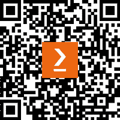

# 前言

**机器学习（ML**）和**人工智能（AI**）在过去两年中继续快速发展，在各个领域取得了重大进步和应用。AI 和 ML 系统通常处理大量敏感数据，包括个人信息。确保这些数据的安全对于防止可能导致身份盗窃、金融欺诈和其他隐私违规的泄露至关重要。除此之外，政府和监管机构正在实施更严格的数据保护和隐私法律。遵守这些法规对于合法和道德的运营至关重要。这就是为什么保护这些系统比以往任何时候都更加重要。随着网络威胁的发展，AI 和 ML 系统必须被设计成能够适应和应对新的和不断出现的网络安全挑战，确保长期弹性和可靠性。

如果你正在使用 Azure 机器学习，这本书将帮助你评估数据、模型和环境的脆弱性，并实施最佳实践来管理、保护和监控整个机器学习生命周期中的 Azure 机器学习工作负载。

本书首先概述了你需要保护的内容。这包括了解零信任策略，使用 MITRE ATLAS 框架来理解机器学习攻击，以及通过使用多个服务来帮助你遵守行业标准法规，学习如何进行道德和负责任的工作。如果你从未使用过 Azure 机器学习，你也会在开头找到一个项目来开始。从那时起，本书将重点介绍数据和所有最佳实践来保护它。这包括从开发数据管理框架到数据加密、备份和恢复的最佳实践。在此之后，本书将重点介绍围绕 Azure 机器学习工作负载的任何基础设施，从身份和访问开始，然后通过网络和计算最佳实践。最后，它提供了所有所需的信息来自动化这些流程并监控系统以防止、检测和减轻任何问题，并提供威胁建模的概述，以帮助您重新评估并保持您的 Azure 机器学习工作负载安全。

在本书结束时，你将能够实施最佳实践来评估和保护你在机器学习生命周期中的 Azure 机器学习资产。

# 本书面向的对象

如果你对 Azure 机器学习和安全感兴趣，你将学习 Azure 机器学习的基本组件、最常见的机器学习攻击，以及如何与 Azure 合作开发和实施一个策略来保护 Azure 机器学习和任何相关服务。本书是为以下人群编写的：

**机器学习开发者、管理员和数据科学家**：任何在 Azure 机器学习项目中扮演活跃角色，或计划这样做，并希望获得在保护他们的机器学习资产方面专业知识的人。

**IT 管理员和 DevOps 或安全工程师**，他们需要在 Azure 上保障和监控 Azure 机器学习工作负载。他们将从学习 Azure 机器学习的基础知识以及本书中概述的最佳实践中受益，因为本书包含了开发跨多个资源的安全策略所需的所有信息。

建议具备基本的 Azure 知识以及处理数据、构建和部署 Azure 机器学习模型的经验。

# 本书涵盖的内容

*第一章*, *评估你的算法、模型和 AI 环境的脆弱性*，概述了机器学习生命周期以及 Azure 机器学习组件和流程，这些流程涉及在 Azure 中处理机器学习。它将解释零信任模型以开发实施和评估策略。本章将涵盖本书其余部分概述的概念和实现所需的所有知识。

*第二章*, *理解最常见的机器学习攻击*，概述了 MITRE ATLAS 框架，该框架是从 MITRE ATT&CK 框架针对机器学习改编而来，本章将解释攻击的不同阶段以及针对 AI/ML 系统的可能攻击。

*第三章*, *规划合规性*，提供了如何使用微软的六个负责任 AI 原则来道德和负责任地开发 ML 模型，以及如何使用负责任 AI 工具将它们转化为负责任的发展策略的见解。最后，它总结了 Azure 机器学习行业认可的合规性标准，以及如何通过使用 Azure 服务来实施这些标准。

*第四章*, *数据保护和治理*，概述了治理、存储和保障数据的各个方面。这包括从开发数据管理框架到数据加密、备份和恢复实践的各个方面。

*第五章*, *数据隐私和负责任 AI 最佳实践*，提供了在模型训练前后识别和保护敏感信息和隐私的最佳实践。它解释了如何解释模型、识别偏差并减轻它。最后，它介绍了联邦学习和安全多方计算。 

*第六章*, *管理和保障访问*，概述了 Microsoft Entra ID 的安全方面，这是 Azure 机器学习的身份管理系统。这包括最小权限原则的介绍、基于角色的访问控制以及其他安全功能，如条件访问和特权身份管理。

*第七章*, *管理和保护您的 Azure 机器学习工作区*，提供了保护 Azure 机器学习工作区和其相关服务的最佳实践。它侧重于网络隔离、计算、容器注册表和容器安全。

*第八章*, *管理和保护 MLOps 生命周期*，概述了 MLOps 最佳实践及其在 Azure 中的实施工具。它将探讨**基础设施即代码** (**IaC**)、CI/CD 管道和 Azure 中的事件驱动工作流。

*第九章*, *日志记录、监控和威胁检测*，提供了在 Azure 中启用日志记录和配置警报的实施步骤。它介绍了 Microsoft Defender for Cloud 和 Azure Sentinel，以防止、检测和缓解任何出现的安全问题。

*第十章*, *为您的 Azure 机器学习工作负载设置安全基线*，总结了书中概述的最佳实践，并提供了更多可探索的服务，尽管这些服务与 Azure 机器学习没有直接关系，但可以用于保护 Azure 资源。它通过提供威胁模型概述以及如何制定始终保持安全的策略来结束。最后，它概述了与云服务提供商相比，我们保护资源的责任。

# 要充分利用本书

要跟随本书中的示例，您需要一个*活跃*的 Azure 订阅。了解以下概念也将有助于理解本书中展示的实现。

基本的 Microsoft Azure 知识：

+   理解核心云概念，例如云计算是什么，**基础设施即服务** (**IaaS**)、**平台即服务** (**PaaS**) 和 **软件即服务** (**SaaS**) 之间的区别，以及使用 Azure 云服务的优势。

+   熟悉 Azure 门户，这是与 Azure 服务交互的主要用户界面。这包括导航仪表板、创建和管理资源，以及了解门户中的布局和工具。

+   熟悉 Azure **命令行界面** (**CLI**) 和 PowerShell 中的基本命令，用于管理 Azure 资源。

机器学习：

理解基本机器学习概念，包括监督学习和无监督学习，以及基本算法，如线性回归、逻辑回归、决策树和 k-means 聚类。

编程技能：

在数据科学中常用编程语言的基本熟练度，如 Python 或 R，包括熟悉 Pandas、NumPy、Scikit-learn（Python）等库。

基本了解网络安全：

基本了解网络安全涉及掌握用于保护计算机系统、网络和数据免受网络攻击或未经授权访问的关键概念、实践和策略。

**如果您使用的是本书的数字版，我们建议您亲自输入代码或从书的 GitHub 仓库（下一节中有一个链接）获取代码。这样做将帮助您避免与代码的复制和粘贴相关的任何潜在错误。**

# 下载示例代码文件

您可以从 GitHub 下载本书的示例代码文件，网址为[`github.com/PacktPublishing/Machine-Learning-Security-With-Azure`](https://github.com/PacktPublishing/Machine-Learning-Security-With-Azure)。如果代码有更新，它将在 GitHub 仓库中更新。

我们还有其他来自我们丰富的图书和视频目录的代码包，可在[`github.com/PacktPublishing/`](https://github.com/PacktPublishing/)找到。查看它们吧！

# 使用的约定

本书使用了多种文本约定。

`文本中的代码`: 表示文本中的代码单词、数据库表名、文件夹名、文件名、文件扩展名、路径名、虚拟 URL、用户输入和 Twitter 昵称。以下是一个示例：“特别是使用`azureml` SDK v2，FL 功能是内置的。”

代码块设置如下：

```py
import pandas as pd
data_path = 'mockdata.csv'
mockdata = pd.read_csv(data_path)
actualdata = mockdata[['age','diabetic']].groupby(['diabetic']).mean().to_markdown()
print(actualdata)
```

任何命令行输入或输出都应如下编写：

```py
az ad sp show --id <clientId from previous result>
```

**粗体**: 表示新术语、重要单词或您在屏幕上看到的单词。例如，菜单或对话框中的单词以**粗体**显示。以下是一个示例：“通过单击组件，我们可以通过转到**运行设置**选项并选择**使用其他****计算目标**来通过**管道界面**按钮轻松更改计算目标。”

小贴士或重要提示

看起来是这样的。

# 联系我们

我们欢迎读者的反馈。

**一般反馈**: 如果您对本书的任何方面有疑问，请通过[`customercare@packtpub.com`](http://customercare@packtpub.com)给我们发邮件，并在邮件主题中提及书名。

**勘误**: 尽管我们已经尽一切努力确保内容的准确性，但错误仍然可能发生。如果您在这本书中发现了错误，我们将不胜感激，如果您能向我们报告这一点。请访问[`www.packtpub.com/support/errata`](http://www.packtpub.com/support/errata)并填写表格。

**盗版**: 如果您在互联网上以任何形式遇到我们作品的非法副本，如果您能提供位置地址或网站名称，我们将不胜感激。请通过[`copyright@packt.com`](http://copyright@packt.com)与我们联系，并提供材料的链接。

**如果您想成为一名作者**: 如果您在某个领域有专业知识，并且您有兴趣撰写或为本书做出贡献，请访问[`authors.packtpub.com`](http://authors.packtpub.com)。

# 分享您的想法

一旦您阅读了《使用 Azure 的机器学习安全》，我们非常乐意听到您的想法！[请点击此处直接进入此书的亚马逊评论页面并分享您的反馈](https://packt.link/r/1-805-12048-4)。

您的评论对我们和科技社区非常重要，并将帮助我们确保我们提供高质量的内容。

# 下载此书的免费 PDF 副本

感谢您购买此书！

您喜欢在路上阅读，但无法携带您的印刷书籍到处走？

你的电子书购买是否与您选择的设备不兼容？

别担心，现在每购买一本 Packt 书籍，你都可以免费获得该书的 DRM 免费 PDF 版本。

在任何地方、任何设备上阅读。直接从您最喜欢的技术书籍中搜索、复制和粘贴代码到您的应用程序中。

优惠远不止于此，您还可以获得独家折扣、时事通讯和丰富的免费内容，每天直接发送到您的邮箱。

按照以下简单步骤获取好处：

1.  扫描二维码或访问以下链接



[`packt.link/free-ebook/9781805120483`](https://packt.link/free-ebook/9781805120483)

1.  提交您的购买证明

1.  就这些！我们将直接将您的免费 PDF 和其他优惠发送到您的邮箱。

# 第一部分：规划 Azure 机器学习安全

这一部分主要关于制定一个保护您资源的计划。安全性是组织特定的，因此您将了解专为保护任何 IT 系统实现设计的零信任安全方法。您将学习如何利用 MITRE ATLAS 知识库来理解机器学习攻击。最后，您还将学习如何道德和负责任地开发 AI 系统，以及如何使用 Azure 服务来确保合规性。

这一部分包含以下章节：

+   *第一章*，*评估您的算法、模型和 AI 环境的脆弱性*

+   *第二章*，*理解最常见的机器学习攻击*

+   *第三章*，*规划合规性*
