# 第五章：数据隐私和负责任 AI 最佳实践

在上一章中，我们讨论了如何为我们组织构建数据治理计划以及如何识别敏感数据类型。我们的工作并没有停止在那里。尽管在某些情况下我们可以安全地排除敏感信息，但在其他时候我们却不能。因此，我们解决问题的**机器学习**（**ML**）模型可能需要包含个人数据。有时这些数据可能是相关且有用的，或者它们可能产生意外的相关性，导致模型偏差。这就是本章我们将要解决的问题。

我们将讨论如何识别敏感信息，以及如果这些信息与模型训练过程无关，如何使用差分隐私等技巧来减轻其影响。我们将探讨如何保护个人信息，即使是从汇总数据或模型结果中。为了帮助我们做到这一点，我们将了解如何使用 SmartNoise **软件开发** **套件**（**SDK**）。

我们还将讨论公平性以及你如何识别模型预测中的偏差。在这里，我们将应用我们共同学习的负责任 AI 原则，以及 Fairlearn 库和负责任 AI 仪表板。与偏差相伴而来的是模型可解释性。我们将一起分析如何通过生成特征重要性值来计算哪些特征会影响你模型的全球或个体预测。

最后，我们将总结解释**联邦学习**（**FL**）和安全多方计算，以保护跨组织机器学习场景中的敏感数据。

在本章中，我们将讨论以下主要主题：

+   发现和保护敏感数据

+   介绍差分隐私

+   缓解公平性问题

+   与模型可解释性合作

+   探索联邦学习和安全多方计算

到本章结束时，你将能够保护你的数据免受偏差和隐私问题的侵害，同时不会影响预测的质量。

# 技术要求

本章的代码存储在本存储库的`ch5`文件夹中：

[`github.com/PacktPublishing/Machine-Learning-Model-Security-in-Azure/`](https://github.com/PacktPublishing/Machine-Learning-Model-Security-in-Azure/)

## 使用 Python 进行工作

要使用这些库，你需要熟悉 Python。在这本书中，我们将使用 Azure Machine Learning 环境中的笔记本来运行示例，但如果你更喜欢使用自己的开发环境和工具，那也是可以的。

开始使用 Python

如果你是 Python 和 ML 的新手？请查看这个学习路径，了解 Python 的基础知识：[`learn.microsoft.com/en-us/training/paths/beginner-python/`](https://learn.microsoft.com/en-us/training/paths/beginner-python/)。

## 在 Azure Machine Learning 中运行笔记本

在 Azure Machine Learning 中运行笔记本的过程非常简单。您需要做的只是导入或创建界面中的工作簿，附加计算目标，然后运行单元格。让我们一起来查看步骤：

1.  前往**笔记本**部分并上传或创建您的文件：

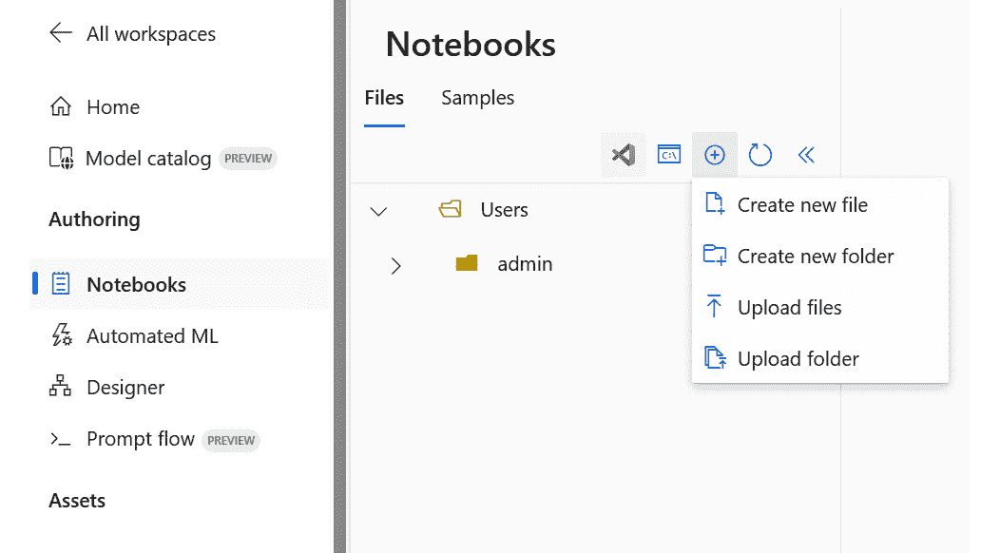

图 5.1 – Azure 机器学习笔记本

1.  打开笔记本文件，并从**计算**下拉菜单中附加一个正在运行的计算目标：

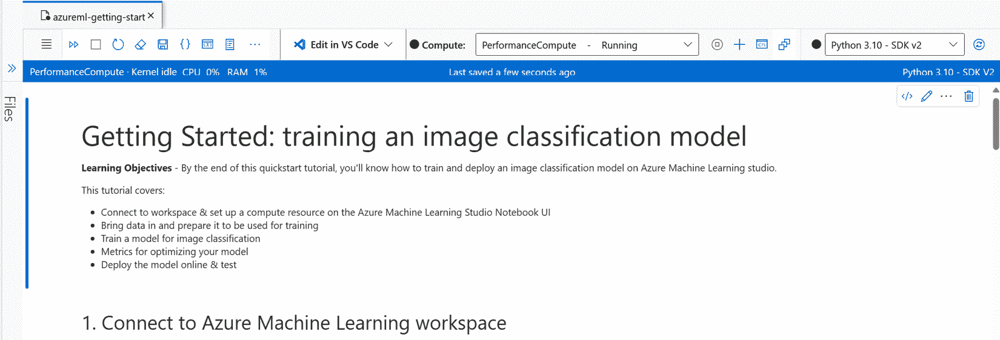

图 5.2 – 将计算目标附加到笔记本

1.  按照常规运行笔记本中的单元格。

## 安装 SmartNoise SDK

SmartNoise SDK ([`smartnoise.org/`](https://smartnoise.org/)) 是一个差分隐私工具包，您可以在机器学习或分析中使用它。在这里，我们将看到如何安装库以便在本书的后续部分使用它。

要安装 SmartNoise SQL，请运行以下命令：

```py
pip install smartnoise-sql
```

要安装 SmartNoise Synthesizers，请运行此命令：

```py
pip install smartnoise-synth
```

SmartNoise 文档

在这里可以找到完整的文档：[`docs.smartnoise.org/`](https://docs.smartnoise.org/).

## 安装 Fairlearn

Fairlearn 可以通过以下命令从 PyPI 使用 pip 安装：

```py
pip install fairlearn
```

Fairlearn 文档

在这里可以找到完整的文档：[`fairlearn.org/`](https://fairlearn.org/).

# 发现和保护敏感数据

虽然良好的治理和与多个数据处理工具合作可以帮助我们在敏感数据发现、分类和配置文件方面取得进展，但很多时候，我们机器学习实验中使用的数据来自外部来源，或者我们可能只是在为我们的组织开发。在这种情况下，我们需要了解什么是敏感数据，以及如果需要使用 Azure Machine Learning，如何快速清理。

## 识别敏感数据

敏感数据是指任何如果泄露可能会造成伤害、隐私泄露或导致身份盗窃、经济损失或其他对个人或组织的不利后果的信息。由于其性质和披露相关的潜在风险，此类数据需要特殊保护。

敏感数据有许多类别，其中许多将在下面概述，包括我们需要注意的示例：

+   **个人可识别信息**（**PII**）：可以用来识别个人的信息，例如全名、出生日期、社会保险号码、驾照号码、护照号码等。

+   **财务信息**：信用卡号码、银行账户详情、财务交易记录等。

+   **健康信息**：医疗记录、健康保险信息、心理健康记录以及其他与健康相关的数据。

+   **密码和认证数据**：用户名、密码、安全问题或用于访问系统或账户的任何其他凭证。

+   **生物识别数据**：指纹、视网膜扫描、面部识别数据和其他生物识别标识符

+   **机密商业信息**：商业机密、**知识产权**（IP）、财务报告、客户名单、专有算法等等

+   **政府机密信息**：政府出于国家安全原因进行分类的信息

+   **个人通讯**：私人消息、电子邮件和其他个人期望保密的通讯

+   **社会和人口信息**：种族、民族、宗教、性取向和其他敏感的人口数据

+   **地理位置数据**：个人或资产的精确位置数据

我们可以排除一些数据，使其不进入我们的机器学习过程。例如，如果我们正在训练一个预测糖尿病的模型，我们不需要患者数据，只需要症状数据。在这种情况下，我们可以通过使用下一节中将要探讨的技术，安全地从数据集中排除这些信息。但如果我们正在训练一个用于识别面部的模型，我们需要实际的生物识别数据。

让我们看看一些帮助我们清理敏感数据的技术，以便它不会被机器学习模型所知。

## 探索数据匿名化

数据匿名化是一个从数据集中移除或模糊化 PII（个人身份信息）的过程，以保护个人的隐私，同时仍然保持数据在分析和研究目的上的整体有用性。目标是确保数据不能追溯到特定的个人。

这里有一些在数据匿名化中常用的技术：

+   **移除直接标识符**：最直接的方法是从数据集中移除直接标识符，如姓名、社会保障号码、电话号码、电子邮件地址等。我们可以使用一个唯一的识别号来标识每条记录以保持唯一性或相关性，但任何可以识别个人的信息都将被完全移除。

+   **化名化**：将敏感数据替换为化名或随机生成的标识符的过程称为化名化。目标是模糊化数据集中个人或实体的原始身份，同时允许使用化名化数据继续进行数据处理和分析。与完全匿名化不同，化名化保留了原始数据的结构和格式，使其在某些目的上仍然有用，同时保护隐私。这样，原始数据仍然存在于数据集中，但与特定个人的联系已被切断。

最佳实践 - 将化名化与其他技术相结合

化名化是一种非常好的增强隐私的技术，但并不保证。如果额外的信息或外部数据集可以与化名化数据相结合，个体的识别仍然可能发生。因此，将化名化与其他安全措施相结合以有效保护敏感数据是很好的。

+   **数据掩码或标记化**：这种技术与匿名化非常相似，但不是加密或替换敏感数据，而是用随机生成的标记或符号替换数据值。例如，如果存在信用卡号码，所有数字除了最后四位将被星号符号替换。数据掩码或标记化可能导致对机器学习过程无用的数据。因此，你可能希望完全删除数据。

+   **泛化或聚合**：这涉及到将数据分组到更广泛的类别中，以减少细节水平，同时仍然保留整体模式和趋势。这种技术在数据匿名化中常用于保护个人隐私。泛化或聚合的目标是在数据效用和隐私之间取得平衡。虽然它降低了直接识别个人的风险，但仍然为分析和研究提供了有价值的见解。然而，重要的是要仔细考虑泛化的程度，以避免潜在的重新识别风险，尤其是在与其他可用信息结合使用时。以下是一些泛化或聚合的例子：

    +   **年龄范围**：而不是使用确切的年龄，数据可以泛化到如 *18-24*、*25-34*、*35-44* 等年龄范围。这样保持了关于年龄组的信息，而不透露确切的年龄。

    +   **地理聚合**：而不是使用精确的地址，数据可以在城市、州或国家级别进行聚合。例如，*纽约* 可以代表城市内各个社区的数据。

    +   **收入区间**：而不是确切的收入值，数据可以分组到如 *低收入*、*中等收入* 和 *高收入* 等收入区间。

    +   **时间间隔**：时间数据可以聚合到如天、周或月的时间间隔中，而不是使用确切的日期和时间戳。例如，*Q1 2023* 可以代表从 *一月* 到 *三月* 的数据。

    +   **教育水平**：而不是具体的学位，数据可以根据如 *高中文凭*、*学士学位*、*硕士学位* 等教育水平类别进行分组。

    +   **产品类别**：销售数据可以在产品类别级别进行聚合，而不是列出单个产品；例如，*电子产品*、*服装* 和 *家具*。

    +   **客户细分**：数据可以根据客户行为或特征进行分组，例如 *常客购物者*、*新客户* 或 *高消费客户*。

    +   **交易金额范围**：金融数据可以分组到如 *$0-$50*、*$50-$100* 等范围，而不是精确的交易金额。

    +   **健康状况**：医疗数据可以聚合到更广泛的健康状况类别中，而不是指定个体诊断；例如，*心血管*、*呼吸系统* 和 *神经系统*。

    +   **Web 浏览模式**：基于网站类别（例如，新闻、娱乐、购物）而不是记录每个访问的网站，可以对互联网浏览数据进行汇总。

删除、合并或屏蔽敏感信息不是唯一的选择。当我们需要使用敏感数据来训练模型时，还有其他技术可以保护数据或以保护任何敏感信息的方式操纵数据，同时不会限制我们模型的可能性。

让我们探讨如何在不从数据集中删除数据的情况下保护个体数据的隐私。

# 介绍差分隐私

差分隐私是一个旨在保护单个数据贡献者隐私的同时，仍然允许进行有用统计分析的概念。差分隐私背后的基本思想是在数据中添加噪声或随机扰动，使得数据集的统计属性保持不变，但识别数据集中个体信息变得更加困难。

差分隐私中的隐私保护级别由一个称为 epsilon（ε）的参数控制。epsilon 值越小，表示隐私保护级别越高，但也可能导致数据效用（数据用于分析的有用性）降低。在隐私和效用之间取得平衡是实现差分隐私的关键挑战：

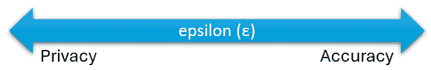

图 5.3 – Epsilon（Ɛ）值与隐私和准确性的关系

我们可以使用 SmartNoise SDK 来向数据添加噪声。SmartNoise 是一个开源 SDK，旨在在各种数据分析和工作流程中实现差分隐私。它由 OpenDP 开发，旨在使数据分析师、研究人员和数据科学家更容易将差分隐私技术应用于他们的数据，而无需深入了解底层数学复杂性。

SmartNoise SDK 提供了一套工具和实用程序，可以集成到现有的数据分析和工作流程中，以确保隐私保护的计算。它提供了一个抽象层，用于向计算添加差分隐私，允许数据分析师轻松指定隐私参数（如 epsilon），并应用隐私保护机制，而无需直接处理差分隐私算法的复杂性。

您可以使用不同的组件，以下是文档中的官方推荐：

+   当使用 Jupyter 笔记本和可重复研究或需要精细控制处理和隐私时，直接使用**OpenDP**。

+   如果您正在处理大型数据集或存储在 SQL 数据库或 Spark 中的表格数据的数据立方体，请使用**SmartNoise SQL**。

+   如果您仍在研究过程中，并希望看到与其他合作者合作的结果，请使用**SmartNoise Synthesizers**。

在这里，我们将通过使用 SmartNoise SQL 来举一个例子：

1.  首先，你需要通过运行以下命令安装 SmartNoise SQL：

    ```py
    diabetic column that declares if the person is diabetic or not and an age column:

    ```

    import pandas as pd

    data_path = 'mockdata.csv'

    mockdata = pd.read_csv(data_path)

    actualdata = mockdata[['age','diabetic']].groupby(\

    ['diabetic']).mean().to_markdown()

    print(actualdata)

    ```py

    By running this cell, we get the true average age for diabetics and non-diabetics.
    ```

1.  让我们看看当我们向数据添加噪声时会发生什么。首先，我们需要声明 epsilon 变量。我们将执行此代码多次，首先使用低 epsilon 值以获得更高的隐私性（`0.05`），然后使用高 epsilon 值以提高准确率（`0.90`），并比较结果：

    ```py
    import snsql
    from snsql import Privacy
    import pandas as pd
    privacy = Privacy(epsilon=0.05, delta=0.01)
    csv_path = 'mockdata.csv'
    meta_path = 'mockdata.yaml'
    mockdata = pd.read_csv(csv_path)
    reader = snsql.from_df(mockdata, privacy=privacy, \
        metadata=meta_path)
    result = reader.execute('SELECT diabetic, AVG(age) \
        AS age FROM mockdata.table GROUP BY diabetic')
    print(result)
    ```

我们可以在下表中看到前面代码多次执行的比较，非糖尿病和糖尿病患者的平均年龄几乎相同（大约 47 岁），但当我们使用具有不同 epsilon 值的 SmartNoise SDK 库时，结果开始从 1%到 15%不等，具体取决于使用的 epsilon 值。这个百分比可能看起来很高；然而，我们决定隐私和准确率之间的平衡。库唯一保证的是保持统计一致性：

|  | **实际平均** **年龄** | **执行 1** **平均年龄** | **执行 2** **平均年龄** | **执行 3** **平均年龄** | **执行 4** **平均年龄** |
| --- | --- | --- | --- | --- | --- |
| Epsilon 值 | N/A | 0.05 | 0.05 | 0.90 | 0.80 |
| 非糖尿病患者 | 47.4101 | 54.2823275862069 | 53.209829867674856 | 47.72727272727273 | 47.38953488372093 |
| 糖尿病患者 | 47.4741 | 42.19132149901381 | 44.00204081632653 | 47.36438923395445 | 47.616977225672876 |

表 5.1 – 数据集结果

你可以在之前在*技术要求*部分提到的书籍仓库中看到如何运行这个笔记本。这样，我们可以在不损害模型结果的情况下保护数据的隐私。然而，当我们试图保护的数据实际上影响了预测，导致负面影响时，会发生什么呢？

让我们看看我们如何确保我们的数据是私密的，并且模型也为不同的敏感群体提供公平的结果。

# 缓解公平性

在机器学习模型中缓解公平性是确保模型不会对某些个体群体表现出偏见或歧视的必要步骤。尽管我们可以从数据集中移除 PII，但预测可能会根据种族、性别、年龄或宗教等特征偏向不同的群体。如果训练数据不具有多样性，也不能代表你希望服务的群体，那么如果数据不能充分代表所有群体，偏见就可能渗入模型。

首先，我们需要学会识别模型中的偏见。通过分析模型的指标，这很容易做到。假设你怀疑你的贷款批准模型倾向于让年龄超过一定的人获得贷款申请批准。你可以从查看以下完整数据集的指标开始：

|  | **选择率** | **准确率** | **召回率** | **精确率** |
| --- | --- | --- | --- | --- |
| 完整数据集 | 0.337 | 0.8895 | 0.8385650224215246 | 0.8323442136498517 |

表 5.2 – 数据集指标

现在，按年龄组计算相同的指标。我们可以通过使用 Fairlearn 等库来完成这项工作。分割后的结果如下：

|  | **选择率** | **准确率** | **召回率** | **精确率** |
| --- | --- | --- | --- | --- |
| 30 岁或以下 | 0.299282 | 0.890668 | 0.818519 | 0.815498 |
| 年龄超过 30 岁 | 0.698413 | 0.878307 | 0.922481 | 0.901515 |

表 5.3 – 每个年龄组的指标

指标解释

指标是特定于模型类型的。前面的指标是针对分类模型的。您可以在以下位置找到不同模型的指标列表和解释图表：[`learn.microsoft.com/en-us/azure/machine-learning/how-to-understand-automated-ml?view=azureml-api-2`](https://learn.microsoft.com/en-us/azure/machine-learning/how-to-understand-automated-ml?view=azureml-api-2).

从这些指标中，您应该能够辨别出，预测获得贷款批准的老年人数比例较大。两组的准确率应该大致相等，但更仔细地检查精确率和召回率表明，模型对每个年龄组的预测能力存在一些差异。

在这个场景中，考虑**召回率**。这个指标表示模型正确识别出的正例所占的比例。换句话说，对于所有应该获得贷款批准并且实际上确实获得批准的个人，模型找到了多少？模型似乎在老年年龄组中做得更好。

那么，我们现在该怎么做？我们是否尝试纠正数据和模型以在两组之间进行平等预测？简短的答案是*还不行*。我们需要首先考虑上下文，并评估模型表现出这种行为的理由，以及这是否合理。记住，指标只是指标，解释它们的责任在我们。也许我们的模型偏好老年年龄组，因为他们更经济稳定。在我们做出决定之前，我们需要进行更多的调查，因为这种识别出的偏差可能是合理的。假设我们有一个偏好浅色皮肤人群的肤色识别应用程序，那么这将是一个明显的偏差，需要纠正。上下文和模型的目的将定义我们的下一步行动。

## Fairlearn

Fairlearn 是一个开源项目，旨在帮助机器学习工程师和数据科学家提高人工智能系统的公平性。它可以通过提供可以比较不同组和整体人群的公平性相关指标来协助。为了计算这些指标并进行调查，Fairlearn SDK 非常有帮助。它将每个敏感组的指标分解开来，然后您可以使用公平性仪表板来完成您的评估，因为直观地查看数据总是有帮助的。

Fairlearn SDK 和 Azure Machine Learning

在撰写本文时，此功能处于预览阶段，因此您可以在 Azure Machine Learning 环境中看到局限性和应用：[`learn.microsoft.com/en-us/azure/machine-learning/how-to-machine-learning-fairness-aml?view=azureml-api-1`](https://learn.microsoft.com/en-us/azure/machine-learning/how-to-machine-learning-fairness-aml?view=azureml-api-1)。Fairlearn 项目的文档可以在这里找到：[`fairlearn.org/`](https://fairlearn.org/)。

在这里，您可以看到一个使用可视化仪表板的工作流程示例。您可以在笔记本中生成 UI，看起来像这样：

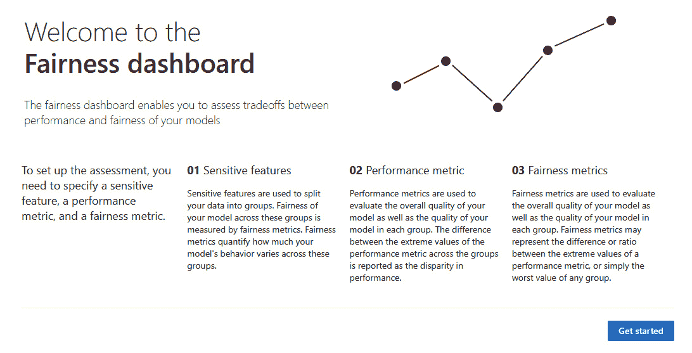

图 5.4 – 公平性仪表板主页面

您还可以将模型注册到您的空间，并将仪表板数据上传以进行评估，如下面的截图所示。在向导的帮助下，这个过程会容易得多：

1.  第一步是选择敏感特征；例如，**年龄**列：

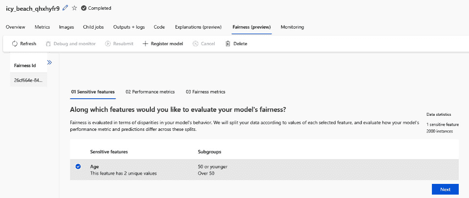

图 5.5 – 步骤 1：选择您的敏感特征

1.  第二步是选择一个指标来评估，以便检查任何可能的偏差。根据模型算法，您可能在这里获得不同的指标以供选择：

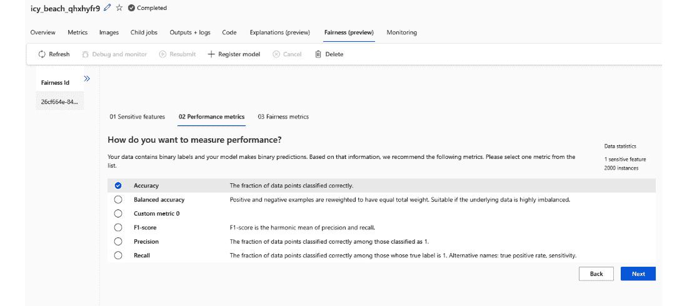

图 5.6 – 步骤 2：选择主要指标以衡量性能

1.  在第三和最后一步，您设置要衡量公平性的对等约束；例如，人口统计学对等或选择率：

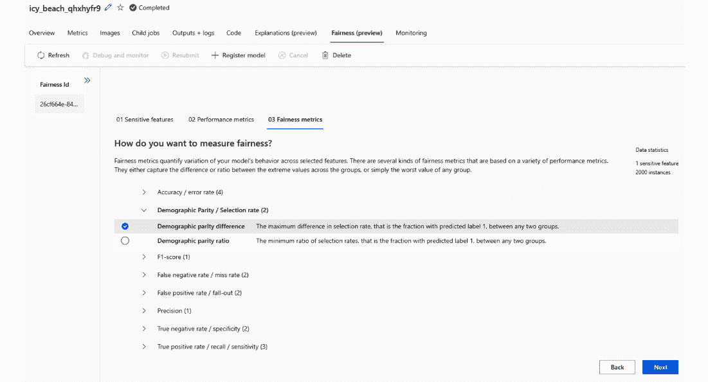

图 5.7 – 步骤 3：选择您想要如何衡量公平性

服务基于参数运行分析，并返回我们可以用来确定模型是否基于敏感特征偏向一个或多个群体的结果：

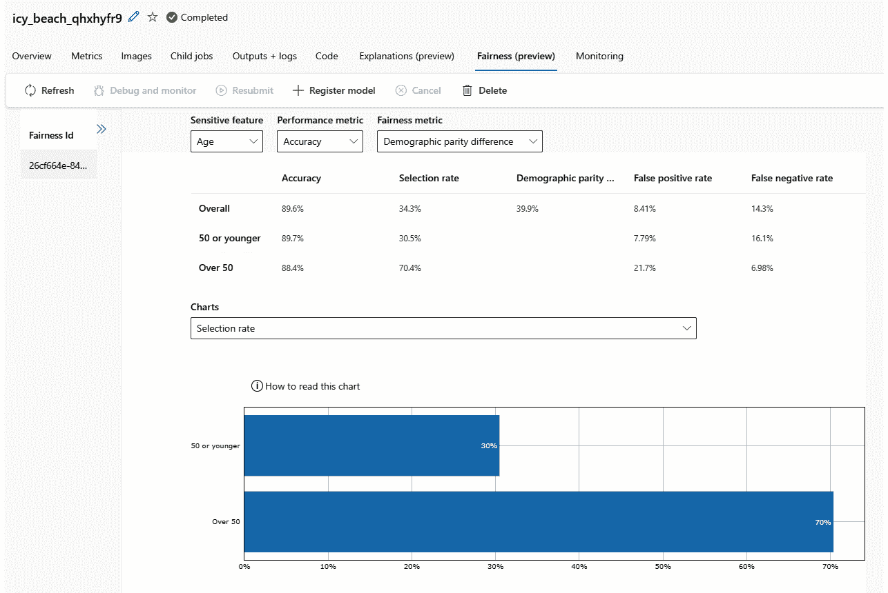

图 5.8 – 查看结果

注意

在撰写本文时，与 Fairlearn 开源包的集成仅支持 `azureml v1` Python SDK。

总是记住，完全的公平性可能并不总是能够实现，不同公平性目标之间可能存在权衡。我们需要确保模型在数据集中的所有敏感群体中都能良好地表现。关键是就公平性权衡做出明智的决定，并持续努力提高模型公平性。

负责任的人工智能的另一部分是解释模型如何进行预测的能力。让我们在下一节中看看一些技术。

# 与模型可解释性一起工作

机器学习中的模型可解释性指的是理解并解释特定模型如何做出预测或决策的能力。可解释的模型为我们提供了关于模型决策过程中哪些特征或变量最具影响力的清晰见解。这在决策过程需要透明和可理解的领域尤为重要，例如医疗保健、金融和法律系统。

虽然你永远无法解释 100%为什么模型做出某个预测，但你可以使用解释器来理解哪些特征影响了结果。解释器可以帮助我们提供全局解释；例如，哪些特征影响了模型的总体行为，或者局部解释，它为我们提供了关于什么影响了单个预测的信息。

让我们探索一些我们可以使用的方法来实现模型可解释性：

+   **特征重要性**（**FI**）决定了每个特征对模型预测的影响程度。以下是一些可以使用的技巧：

    +   **置换特征重要性**（**PFI**）：这种方法涉及随机打乱每个特征值，并测量对模型性能的影响。在打乱后性能下降最大的特征被认为是更重要的。

    +   **SHapley Additive exPlanations (SHAP) 值**：SHAP 值基于合作博弈论提供了一个统一的特征重要性的度量。它们在预测中为每个特征分配贡献，考虑了所有可能的特征组合。

    +   **局部可解释模型无关解释**（**LIME**）：LIME 通过扰动数据并观察对预测的影响，在特定预测周围创建局部可解释模型。它有助于解释任何模型的单个预测。

+   **部分依赖图**（**PDP**）和**个体条件期望**（**ICE**）通过不同的技术测试特征对模型的影响：

    +   PDP 绘制了在保持其他特征不变的情况下，单个特征对模型预测的平均影响。

    +   ICE 绘制了多个个体 PDP，每个实例一个，提供了关于特征如何影响不同实例的更细致的视图。

+   **基于规则的模型**：决策树和线性模型本质上是可解释的，因为它们的结构可以轻松可视化和理解。

+   **代理模型**：训练一个更简单、可解释的模型来近似更复杂模型的行为。这允许在不牺牲太多准确性的情况下更好地理解。

+   **可视化**：如热图、显著性图和激活图等可视化方法可以帮助理解模型如何处理和权衡不同的输入特征。

+   **层相关传播**（**LRP**）：LRP 是一种在 **神经网络**（**NNs**）中使用的技巧，用于理解哪些输入特征对特定输出贡献最大。

我们选择的方法取决于我们的模型及其创建时使用的风味。让我们看看 Azure Machine Learning 中模型可解释性的选项。

## 探索负责任的 AI 仪表板

要在 Azure Machine Learning 中使用可解释性，您可以使用 v1 SDK 的 Interpret-Community 包，或者建议使用更新的版本，它是新负责任的 AI 仪表板的一部分。

让我们探索可用的功能：

Azure Machine Learning 中的模型可解释性

在以下文档中了解更多关于 Azure Machine Learning 中的 Interpret-Community 包以及常见解释器的工作方式：[`learn.microsoft.com/en-us/azure/machine-learning/how-to-machine-learning-interpretability?view=azureml-api-2#supported-model-interpretability-techniques`](https://learn.microsoft.com/en-us/azure/machine-learning/how-to-machine-learning-interpretability?view=azureml-api-2#supported-model-interpretability-techniques).

1.  您可以通过访问**模型**菜单下的注册模型，选择**负责任的 AI**选项卡，然后点击**创建仪表板**按钮，在 scikit-learn 生成的 MLflow 格式模型中生成仪表板，如图所示：

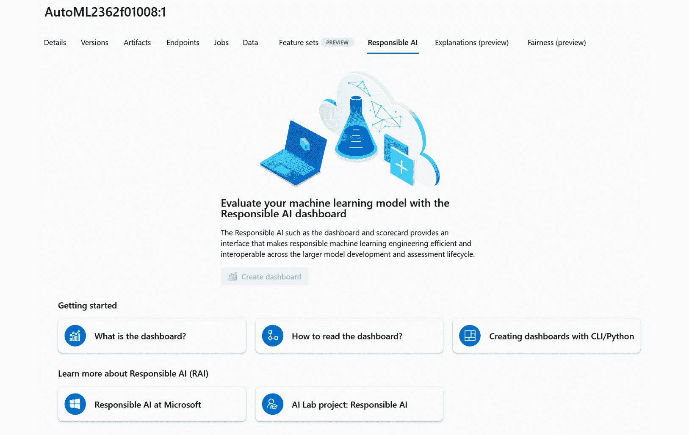

图 5.9 – 创建负责任的 AI 仪表板

MLflow 模型

MLflow 是一个开源平台，旨在通过提供一致且易于使用的框架来管理端到端的机器学习生命周期，使数据科学和机器学习团队更容易进行协作和可重复性。更多信息请在此处查看：[`mlflow.org/`](https://mlflow.org/).

1.  仪表板生成后，您可以在列表中点击它以查看更多详细信息：

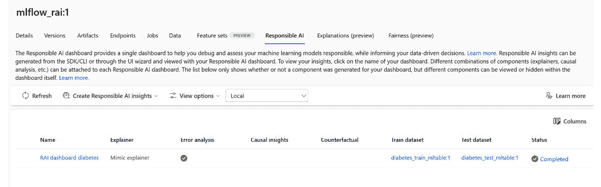

图 5.10 – 打开仪表板

1.  仪表板提供了大量信息，不仅有助于可解释性，还有关于公平性、数据分布和单个预测的指标。除了数据外，还有许多可视化工具可以帮助您分析模型，如图所示。请确保您遵守负责任的 AI 开发原则：

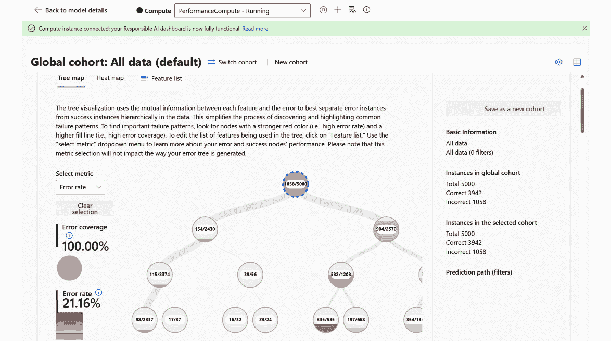

图 5.11 – 查看指标

1.  当涉及到模型可解释性时，您可以看到完整数据集和单个预测的 FIs。您可以根据需要调整类别重要性权重和图表，以更好地理解模型。

    在下一张截图中，我们可以看到样本糖尿病数据集的全局 FIs：

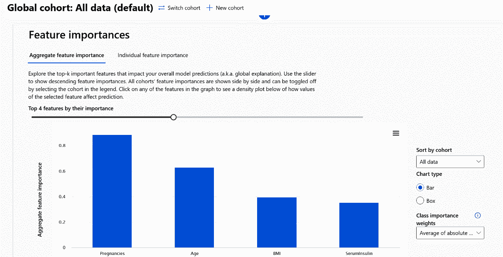

图 5.12 – 查看 FIs

模型可解释性是简单性和准确性的平衡。高度可解释的模型可能会牺牲一些预测性能，而非常复杂的模型可能难以全面解释。可解释性方法的选择取决于具体用例、受众以及模型复杂性和透明度之间的权衡。

使用 SDK 生成 AI 仪表板

要使用 SDK 通过 YAML 和 Python 构建 AI 仪表板，进一步资源请参阅此处：[`learn.microsoft.com/en-us/azure/machine-learning/how-to-responsible-ai-insights-sdk-cli?view=azureml-api-2&tabs=yaml`](https://learn.microsoft.com/en-us/azure/machine-learning/how-to-responsible-ai-insights-sdk-cli?view=azureml-api-2&tabs=yaml).

我们迄今为止看到的所有技术都集中在拥有一个数据集，该数据集在一个计算资源上训练以生成结果模型。在下一节中，我们将看到一些专注于在不同计算源之间分割模型训练和数据集的技术。

# 探索联邦学习和安全多方计算

**联邦学习**是一种机器学习方法，它使模型能够在多个设备或服务器上训练，而无需集中聚合原始数据。在传统的机器学习中，数据通常被收集并发送到中央计算服务器进行训练，这引发了隐私和安全问题，尤其是在处理敏感或个人信息时。

在联邦学习中，训练过程发生在本地设备或节点（例如智能手机、边缘设备或计算实例）上，这些设备或节点生成或存储数据。这些节点通过仅共享模型更新（梯度）而不是原始数据本身来协作。中央计算服务器将这些更新聚合起来，以创建一个改进的全局模型。这个过程是迭代重复的，每个节点都为模型改进做出贡献，同时保持其数据隐私。

联邦学习的主要优势如下：

+   **隐私**：由于原始数据保留在本地节点上，因此无需与中央服务器共享敏感信息，从而降低了数据泄露和违规的风险

+   **减少数据传输**：联邦学习减少了需要通过网络发送的数据量，这在处理大型数据集或带宽限制时可能是有益的

+   **去中心化**：模型训练过程可以分布到大量节点上，使分布式环境中的可扩展性和鲁棒性得到增强

+   **本地自适应**：节点可以在考虑其本地数据分布的同时更新全局模型，从而产生更相关且针对特定本地特征的模型

联邦学习在数据隐私和安全至关重要的场景中特别有用，例如医疗保健和金融服务，以及可以在**物联网**（**IoT**）应用中分布式处理的情况。它为我们提供了利用分布式数据源集体知识的机会，而不会损害单个用户的隐私。

让我们快速了解联邦学习及其在 Azure Machine Learning 中的应用。

## 使用 Azure 机器学习的联邦学习

在云端工作时，联邦学习可能比你想象的要容易。随着按需计算和处理能力的到来，带来了许多好处。特别是使用 `azureml` SDK v2，联邦学习功能内置其中。

最简单的方法是通过使用设计器管道进行集成。设计器具有拖放界面。随着 SDK 的新版本推出，出现了几个令人兴奋的功能。我们可以非常容易地创建自己的组件，并且管道中拖放的所有组件都可以在不同的计算目标上运行。

在下面的屏幕截图中，我们可以看到设计器中从预构建样本创建的管道。通过单击一个组件，我们可以通过转到**运行设置**选项并选择**使用其他****计算目标**来通过**管道界面**按钮轻松更改计算目标：

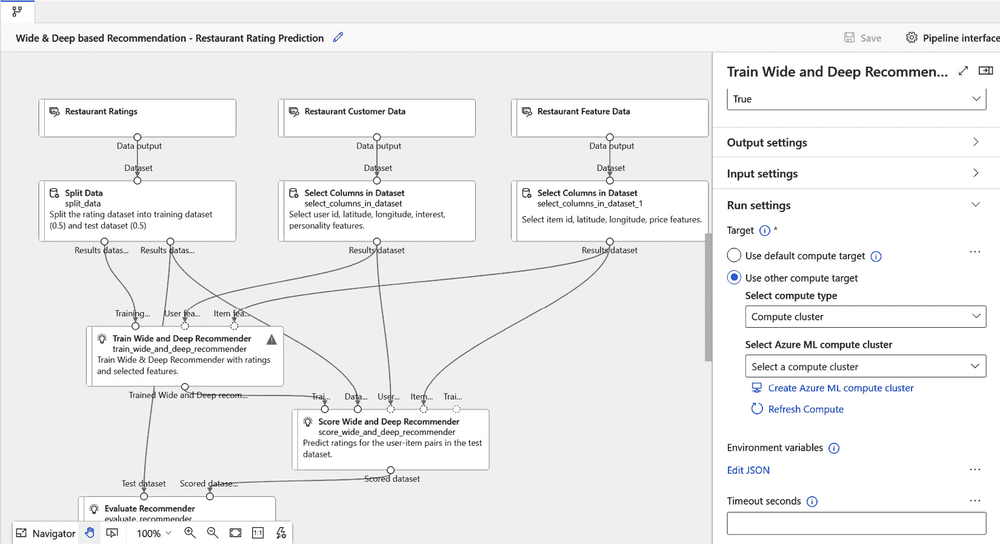

图 5.13 – 在 Azure Machine Learning 中更改计算目标

如果我们扩展功能并使用不同的数据集同时训练多个模型，我们就有了联邦学习实现和多方计算。对于计算，我们还可以利用 Azure 机密计算来使实现更加安全，但本书稍后我们将讨论如何在 Azure 机器学习中确保 Azure 计算的安全性。这也可以扩展到使用连接到相同或不同数据存储的多个工作区。

使用 Azure Machine Learning 进行联邦学习的优点在于，我们仍然可以结合并应用本章中概述的所有指标和技术，因为我们仍然在工作区内部工作。

联邦学习食谱和示例

在此处了解更多有关如何实现 Azure 机器学习的信息：[`github.com/Azure-Samples/azure-ml-federated-learning`](https://github.com/Azure-Samples/azure-ml-federated-learning)。

# 摘要

保护敏感数据是一个多方面的难题。有方法和技巧可以减轻公平性和保护隐私，以道德和负责任的方式与人工智能合作，但预测准确性和数据保护之间的平衡非常敏感。如果你根据你的数据和算法选择正确的技术组合，可能会觉得令人畏惧。

在本章中，我们学习了如何识别不同类型的敏感数据以及常见的去除或屏蔽它们的技巧。然而，并非总是能够完全消除它们，因为它们对模型训练过程是有用的。在这种情况下，有几个库可以帮助我们。我们可以使用 SmartNoise SDK 向我们的数据中引入噪声以保护隐私，与 Fairlearn SDK 合作以减轻公平性问题，并使用 Responsible AI 仪表板以及解释器来解释我们的模型。我们通过介绍 FL 的概念以及如何使用 Azure 机器学习来应用它来结束本章。

我们可以一直谈到书的结尾，但事实是，在数据处理方面，您能做的事情是有限的。在下一章中，我们将专注于处理数据访问、工作区以及每个部分所需的角色的合作。

# 进一步阅读

+   *5 分钟内运行联合学习演示*：[`github.com/Azure-Samples/azure-ml-federated-learning/blob/main/docs/quickstart.md`](https://github.com/Azure-Samples/azure-ml-federated-learning/blob/main/docs/quickstart.md)

+   *使用 Azure 机器学习、NVIDIA FLARE 和 MONAI 进行联合学习* – 建设会议：[`build.microsoft.com/en-US/sessions/5bd5120f-5239-450d-8a57-373efb43c0cf?source=sessions`](https://build.microsoft.com/en-US/sessions/5bd5120f-5239-450d-8a57-373efb43c0cf?source=sessions)

+   *使用 Azure 机器学习进行医学成像* 演示：[`github.com/Azure/medical-imaging`](https://github.com/Azure/medical-imaging)

# 第三部分：保护并监控您的 AI 环境

当涉及到云时，安全问题不仅仅是数据。在本部分中，您将学习如何保护身份和访问以及围绕您的 Azure 机器学习资源的所有云基础设施。然后，您将学习如何使用 MLOps 实践自动化这些流程，以及如何设置系统监控以检测和解决任何安全问题。

本部分包含以下章节：

+   *第六章**，管理和保护访问*

+   *第七章**，管理和保护您的 Azure 机器学习工作区*

+   *第八章**，管理和保护 MLOps 生命周期*

+   *第九章**，日志记录、监控和威胁检测*
