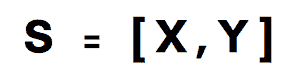
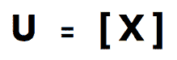
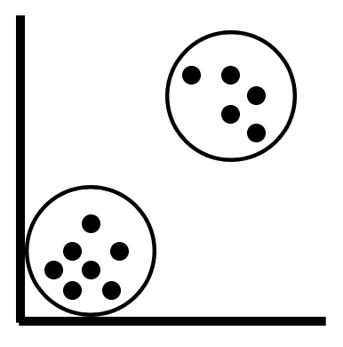

# 第一章：使用 scikit-learn 介绍机器学习

欢迎来到使用 scikit-learn 的机器学习世界。我很高兴你选择了这本书来开始或进一步提升你在广阔的机器学习领域的知识。机器学习有时可能会让人感到不知所措，这部分原因是市场上有大量可用的工具。这本书将把工具选择的过程简化为一个——scikit-learn。

如果要用一句话告诉你这本书能为你做什么，那就是——<q>*本书提供了可以实施的管道，以解决广泛的机器学习问题*。</q> 正如这句话所暗示的，你将学习如何使用一些在行业和专业竞赛中广泛使用的最流行的算法构建端到端的机器学习管道，例如 Kaggle。

然而，在本介绍性章节中，我们将讨论以下主题：

+   机器学习简要介绍

+   什么是 scikit-learn？

+   安装 scikit-learn

+   你将在本书中学习实现的 scikit-learn 算法

现在，让我们开始这段有趣的机器学习之旅，使用 scikit-learn！

# 机器学习简要介绍

机器学习已经引起了广泛关注——从埃隆·马斯克担心无监管人工智能在社会中的角色，到马克·扎克伯格持有与马斯克相反的看法。

那么，机器学习究竟是什么呢？简单来说，机器学习是一组**方法**，可以在数据中发现模式，并利用这些模式进行未来预测。机器学习在多个行业中找到了巨大的价值，从金融到医疗保健。这意味着对具备机器学习领域技能的人才有了更高的需求。

广义上讲，机器学习可以分为三种主要类型：

+   监督学习

+   无监督学习

+   强化学习

Scikit-learn 旨在解决与监督学习和无监督学习相关的问题，目前不支持强化学习。

# 监督学习

监督学习是一种机器学习形式，其中我们的数据附带一组标签或一个数字化的目标变量。这些标签/类别通常属于一个特征/属性，通常称为 **目标变量**。例如，你的数据中的每一行可能属于 *健康* 或 *不健康* 的类别。

给定一组特征，例如体重、血糖水平和年龄，我们可以使用监督机器学习算法来预测这个人是否健康。

在下面的简单数学表达式中，**S** 是监督学习算法，**X** 是输入特征集，例如体重和年龄，**Y** 是目标变量，标签为 *健康* 或 *不健康*：



虽然有监督机器学习是最常用的机器学习类型，在 scikit-learn 和行业中也有广泛应用，但大多数数据集通常没有预定义的标签。无监督学习算法首先用于将没有标签的数据聚类成不同的组，然后我们可以为这些组分配标签。此内容将在下一个章节中详细讨论。

# 无监督学习

无监督学习是一种机器学习形式，算法试图在没有结果/目标变量的数据中检测/发现模式。换句话说，我们没有带有预先存在标签的数据。因此，算法通常会使用诸如距离等度量标准，根据数据之间的接近程度将它们分组。

如前一节所讨论的，您在现实世界中遇到的大多数数据将不会带有一组预定义的标签，因此，只会有一组输入特征而没有目标属性。

在以下简单的数学表达式中，**U** 是无监督学习算法，而 **X** 是一组输入特征，如体重和年龄：



给定这些数据，我们的目标是创建可以标记为 *健康* 或 *不健康* 的组。无监督学习算法将使用诸如距离之类的度量标准来识别一组点之间的接近程度以及两个这样的组之间的距离。然后，算法将继续将这些组聚类成两个不同的组，如下图所示：



将两个组聚类在一起

# 什么是 scikit-learn？

Scikit-learn 是一个免费且开源的软件，帮助你解决有监督和无监督的机器学习问题。该软件完全用 Python 编写，并利用 Python 提供的最流行的库，主要包括 NumPy 和 SciPy。

scikit-learn 非常受欢迎的主要原因在于，世界上大多数最流行的机器学习算法，一旦你了解核心流程，就能非常快速地以即插即用的方式实现。另一个原因是，像 **逻辑回归** 和 **支持向量机** 这样的流行分类算法是用 Cython 编写的。Cython 用来提供这些算法 *类似 C 语言* 的性能，从而使得在这个过程中使用 scikit-learn 非常高效。

# 安装 scikit-learn

您可以通过两种方式在个人设备上安装 scikit-learn：

+   使用 pip 方法

+   使用 Anaconda 方法

pip 方法可以在 macOS/Linux 终端或 Windows PowerShell 中实现，而 Anaconda 方法则可以在 Anaconda 提示符中使用。

在这两种安装方法之间进行选择非常简单：

+   如果您希望所有常见的 Python 数据科学包都安装在同一个环境中，Anaconda 方法是最佳选择

+   如果您希望从头开始为 scikit-learn 构建自己的环境，pip 方法是最佳选择（适用于 Python 高级用户）

本书将使用 Python 3.6 版本展示所有代码，除非另有说明。

# Pip 方法

在安装 scikit-learn 之前，您的设备需要安装一些包。具体如下：

+   **NumPy**：版本 1.8.2 或更高

+   **SciPy**：版本 0.13.3 或更高

可以使用以下命令通过 pip 方法安装：

```py
pip3 install NumPy
pip3 install SciPy
```

接下来，我们可以使用以下代码安装 scikit-learn：

```py
pip3 install scikit-learn
```

此外，如果您已经在设备上安装了 scikit-learn 并且只想将其升级到最新版本，可以使用以下代码：

```py
pip3 install -U scikit-learn
```

本书中实现的 scikit-learn 版本是 0.19.1。

# Anaconda 方法

如果您是通过 Anaconda 分发版安装了 Python，可以通过在 Anaconda 提示符中使用以下代码安装 scikit-learn：

第一步是安装依赖项：

```py
conda install NumPy
conda install SciPy
```

接下来，我们可以使用以下代码安装 scikit-learn：

```py
conda install scikit-learn
```

此外，如果您已经使用 Anaconda 分发版安装了 scikit-learn，您可以通过在 Anaconda 提示符中使用以下代码将其升级到最新版本：

```py
conda update scikit-learn
```

在升级或卸载已通过 Anaconda 安装的 scikit-learn 时，切勿使用 pip 方法，因为这样做很可能导致升级失败或无法删除所有所需文件。请始终使用 pip 方法或 Anaconda 方法，以保持一致性。

# 额外的包

在本节中，我们将讨论我们将在本书中安装的、与 scikit-learn 无关的包。

# Pandas

要安装 Pandas，您可以使用 pip 方法或 Anaconda 方法，如下所示：

Pip 方法：

```py
pip3 install pandas
```

Anaconda 方法：

```py
conda install pandas
```

# Matplotlib

要安装 matplotlib，您可以使用 pip 方法或 Anaconda 方法，如下所示：

Pip 方法：

```py
pip3 install matplotlib
```

Anaconda 方法：

```py
conda install matplotlib
```

# 树

要安装 tree，您可以使用 pip 方法或 Anaconda 方法，如下所示：

Pip 方法：

```py
pip3 install tree
```

Anaconda 方法：

```py
conda install tree
```

# Pydotplus

要安装 pydotplus，您可以使用 pip 方法或 Anaconda 方法，如下所示：

Pip 方法：

```py
pip3 install pydotplus
```

Anaconda 方法：

```py
conda install pydotplus
```

# 图像

要安装图像，您可以使用 pip 方法或 Anaconda 方法，如下所示：

Pip 方法：

```py
pip3 install Image
```

Anaconda 方法：

```py
conda install Image
```

# 您将使用 scikit-learn 实现的算法

本书中您将学习的算法大致分为以下两类：

+   有监督学习算法

+   无监督学习算法

# 有监督学习算法

有监督学习算法可用于解决分类和回归问题。本书中，你将学习如何实现一些最受欢迎的有监督机器学习算法。受欢迎的有监督机器学习算法在工业和研究中得到了广泛应用，帮助我们解决了各个领域的广泛问题。以下是这些有监督学习算法：

+   **线性回归**：这种有监督学习算法用于预测连续的数值结果，如房价、股票价格和温度等。

+   **逻辑回归**：逻辑回归学习算法是一种流行的分类算法，尤其用于信用行业预测贷款违约。

+   **k-最近邻**：k-NN 算法是一种分类算法，用于将数据分类为两个或多个类别，广泛应用于根据价格、面积、卧室数量及其他多种特征将房屋分类为昂贵和可负担的类别。

+   **支持向量机**：SVM 算法是一种流行的分类算法，广泛用于图像和人脸识别，以及手写识别等应用。

+   **基于树的算法**：基于树的算法，如决策树、随机森林和提升树，通常用于解决分类和回归问题。

+   **朴素贝叶斯**：朴素贝叶斯分类器是一种使用概率数学模型来解决分类问题的机器学习算法。

# 无监督学习算法

无监督机器学习算法通常用于根据距离对数据点进行聚类。你将在本书中学习到的无监督学习算法如下：

+   **k-均值**：k-均值算法是一种流行的算法，通常用于根据多种特征（如消费习惯）将顾客划分为不同类别。该算法也用于根据房屋的特征（如价格和面积）将房屋进行分类。

# 总结

本章简要介绍了机器学习的基础，适合那些刚刚开始进入机器学习领域的读者。你已经了解了 scikit-learn 在机器学习中的应用，并学会了如何安装所需的软件。

最后，你简要了解了在本书学习过程中将实现的所有算法，以及它们在现实世界中的相关应用。

在下一章，你将学习如何实现第一个算法——k-最近邻算法！
