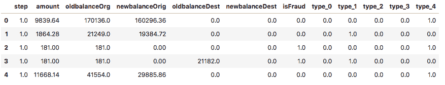
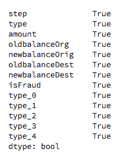
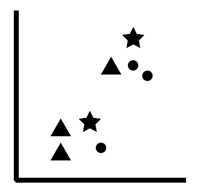
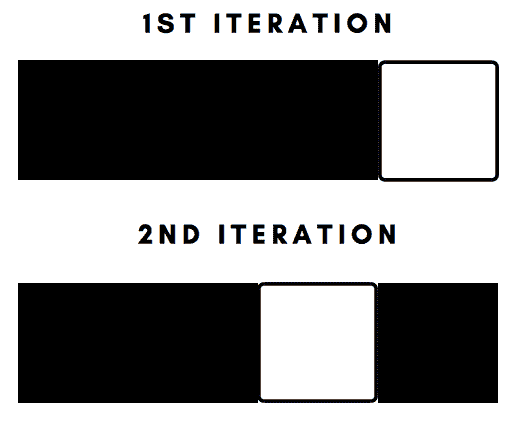
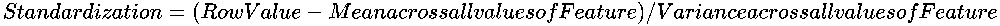

# 第二章：使用 K-近邻预测类别

**k-近邻（k-Nearest Neighbors）**（**k-NN**）算法是一种监督学习算法，用于预测类别。在本章中，你将学习以下内容：

+   为使用 scikit-learn 进行机器学习准备数据集

+   *k-NN* 算法的工作原理 *在幕后*

+   实现你的第一个 k-NN 算法来预测欺诈交易

+   微调 k-NN 算法的参数

+   为优化性能而对数据进行缩放

k-NN 算法在分类和监督学习领域有广泛的应用。该算法的一些实际应用包括预测金融行业的贷款违约和信用欺诈，以及预测医疗行业中患者是否患有癌症。

本书的设计旨在实现一个稳健的机器学习管道，适用于书中提到的每个算法，并且需要使用 Jupyter Notebook。

Jupyter Notebook 可以通过以下链接提供的安装说明安装到你的本地机器上：[`jupyter.org/install.html`](https://jupyter.org/install.html)。

或者，你也可以通过使用以下链接在浏览器中使用 Jupyter Notebook：[`jupyter.org/try`](https://jupyter.org/try)。

本书中的每一章都配有一个在 Jupyter Notebook 中实现的管道，存放在本书的官方 GitHub 仓库中，因此，强烈推荐你在本地机器上安装 Jupyter Notebook。

# 技术要求

你需要在系统中安装 Python 3.6 或更高版本、Pandas ≥ 0.23.4、Scikit-learn ≥ 0.20.0、NumPy ≥ 1.15.1 和 Matplotlib ≥ 3.0.0。

本章的代码文件可以在 GitHub 上找到：

[`github.com/PacktPublishing/Machine-Learning-with-scikit-learn-Quick-Start-Guide/blob/master/Chapter_02.ipynb`](https://github.com/PacktPublishing/Machine-Learning-with-scikit-learn-Quick-Start-Guide/blob/master/Chapter_02.ipynb)

查看以下视频，看看代码的实际应用：

[`bit.ly/2Q2DGop`](http://bit.ly/2Q2DGop)

# 为使用 scikit-learn 进行机器学习准备数据集

使用 scikit-learn 实现任何机器学习算法的第一步是数据准备。scikit-learn 提供了一些实现的限制，这些限制将在本节稍后讨论。我们将使用的数据集基于移动支付，来自全球最受欢迎的竞争性机器学习网站——Kaggle。

你可以从以下网址下载数据集：[`www.kaggle.com/ntnu-testimon/paysim1`](https://www.kaggle.com/ntnu-testimon/paysim1)。

下载后，通过在终端（macOS/Linux）或 Anaconda Prompt/PowerShell（Windows）中使用以下代码来打开一个新的 Jupyter Notebook：

```py
Jupyter Notebook
```

这个数据集的基本目标是预测一个移动交易是否为欺诈交易。为了实现这一目标，我们首先需要对数据的内容有一个简要了解。为了探索数据集，我们将使用 Python 中的`pandas`包。你可以通过在终端（macOS/Linux）或 PowerShell（Windows）中使用以下代码来安装 pandas：

```py
pip3 install pandas
```

可以通过在 Anaconda 命令提示符下使用以下代码，在 Windows 机器上安装 Pandas：

```py
conda install pandas
```

我们现在可以通过使用以下代码将数据集读取到 Jupyter Notebook 中：

```py
#Package Imports

import pandas as pd

#Reading in the dataset

df = pd.read_csv('PS_20174392719_1491204439457_log.csv')

#Viewing the first 5 rows of the dataset

df.head()
```

这会生成如下截图所示的输出：


# 删除冗余特征

从之前看到的数据集中，有一些列对于机器学习过程来说是冗余的：

+   `nameOrig`：这一列是属于每个客户的唯一标识符。由于每个标识符在数据集的每一行都是唯一的，机器学习算法将无法从该特征中辨别出任何模式。

+   `nameDest`：这一列也是每个客户的唯一标识符，因此对机器学习算法没有价值。

+   `isFlaggedFraud`：如果一个人尝试在单笔交易中转账超过 200,000，该列会标记该交易为欺诈交易。由于我们已经有一个名为`isFraud`的功能，它会将交易标记为欺诈，因此这个功能变得多余。

我们可以使用以下代码从数据集中删除这些特征：

```py
#Dropping the redundant features

df = df.drop(['nameOrig', 'nameDest', 'isFlaggedFraud'], axis = 1)
```

# 减少数据的大小

我们正在处理的数据集包含超过 600 万行数据。大多数机器学习算法在处理这么大规模的数据集时会需要很长时间。为了加快执行速度，我们将数据集的大小缩减至 20,000 行。我们可以使用以下代码来做到这一点：

```py
#Storing the fraudulent data into a dataframe

df_fraud = df[df['isFraud'] == 1]

#Storing the non-fraudulent data into a dataframe 

df_nofraud = df[df['isFraud'] == 0]

#Storing 12,000 rows of non-fraudulent data

df_nofraud = df_nofraud.head(12000)

#Joining both datasets together 

df = pd.concat([df_fraud, df_nofraud], axis = 0)
```

在前面的代码中，欺诈交易的行被存储在一个数据框中。这个数据框包含稍微超过 8,000 行数据。12,000 行非欺诈交易存储在另一个数据框中，两个数据框通过 pandas 的`concat`方法连接在一起。

这将产生一个稍微超过 20,000 行的数据框，现在我们可以相对快速地在其上执行算法。

# 编码类别变量

scikit-learn 的一个主要限制是，你不能在具有类别性质的列上实施机器学习算法。例如，我们数据集中的`type`列有五个类别：

+   `CASH-IN`

+   `CASH-OUT`

+   `DEBIT`

+   `PAYMENT`

+   `TRANSFER`

这些类别将需要被编码成 scikit-learn 可以理解的数字。为了做到这一点，我们必须实施一个两步的过程。

第一步是将每个类别转换为数字：`CASH-IN = 0`，`CASH-OUT = 1`，`DEBIT = 2`，`PAYMENT = 3`，`TRANSFER = 4`。我们可以使用以下代码来完成此操作：

```py
#Package Imports

from sklearn.preprocessing import LabelEncoder
from sklearn.preprocessing import OneHotEncoder

#Converting the type column to categorical

df['type'] = df['type'].astype('category')

#Integer Encoding the 'type' column

type_encode = LabelEncoder()

#Integer encoding the 'type' column

df['type'] = type_encode.fit_transform(df.type)
```

代码首先将`type`列转换为分类特征。然后，我们使用`LabelEncoder()`来初始化一个称为`type_encode`的整数编码器对象。最后，我们在`type`列上应用`fit_transform`方法，以将每个类别转换为一个数字。

大体上讲，有两种类型的分类变量：

+   名义

+   有序

名义分类变量没有固有的顺序。名义分类变量的一个例子是`type`列。

有序分类变量具有固有的顺序。有序分类变量的一个例子是教育水平，其中拥有硕士学位的人将比仅有本科学位的人具有更高的顺序/值。

对于有序分类变量，仅需整数编码即足够，无需进行独热编码，如前所示。由于`type`列是名义分类变量，因此我们在整数编码后必须进行独热编码。通过以下代码实现：

```py
#One hot encoding the 'type' column

type_one_hot = OneHotEncoder()

type_one_hot_encode = type_one_hot.fit_transform(df.type.values.reshape(-1,1)).toarray()

#Adding the one hot encoded variables to the dataset 

ohe_variable = pd.DataFrame(type_one_hot_encode, columns = ["type_"+str(int(i)) for i in range(type_one_hot_encode.shape[1])])

df = pd.concat([df, ohe_variable], axis=1)

#Dropping the original type variable 

df = df.drop('type', axis = 1)

#Viewing the new dataframe after one-hot-encoding 

df.head()
```

在代码中，我们首先创建一个名为`type_one_hot`的独热编码对象。然后，我们通过使用`fit_transform`方法将`type`列转换为独热编码列。

`fit_transform`方法。

我们有五个由整数 0 到 4 表示的类别。现在，每个这五个类别都将有自己的列。因此，我们创建了五列，分别称为`type_0`、`type_1`、`type_2`、`type_3`和`type_4`。这五列中的每一列都由两个值表示：`1`表示该类别存在，`0`表示该类别不存在。

此信息存储在`ohe_variable`中。由于此变量包含五列，我们将使用`pandas`的`concat`方法将其与原始数据框连接起来。

在进行独热编码后，顺序`type`列会从数据框中删除，因为此列在独热编码后已经变得多余。最终的数据框现在如下所示：



# 缺失值

另一个与 scikit-learn 的限制是它不能处理带有缺失值的数据。因此，我们必须首先检查数据集中是否有任何列中的缺失值。我们可以通过使用以下代码来实现这一点：

```py
#Checking every column for missing values

df.isnull().any()
```

这将产生以下输出：



在此我们注意到每列都有一些缺失值。

可以通过多种方式处理缺失值，例如以下方式：

+   中位数插补

+   均值插补

+   用大多数值填充它们

技术的数量非常多，具体取决于数据集的性质。处理具有缺失值特征的过程称为**特征工程**。

特征工程可以用于分类和数值列，需要一本完整的书来解释组成该主题的各种方法。

由于本书将重点介绍如何应用 scikit-learn 提供的各种机器学习算法，因此不会涉及特征工程。

因此，为了与本书的目标保持一致，我们将用零来填补所有缺失的值。

我们可以使用以下代码来实现：

```py
#Imputing the missing values with a 0

df = df.fillna(0)
```

我们现在有一个适用于 scikit-learn 机器学习的数据集。我们将使用这个数据集来进行未来章节的学习。为了方便起见，我们将把这个数据集导出为`.csv`文件，并存储在你正在使用 Jupyter 笔记本的同一目录中。

我们可以使用以下代码来实现：

```py
df.to_csv('fraud_prediction.csv')
```

这将创建一个`.csv`文件，存储在你工作的目录中，你可以使用 pandas 将其再次加载到笔记本中。

# k-NN 算法

从数学角度来看，k-NN 算法是最简单的机器学习算法之一。请参考以下图表，了解它如何工作的概览：



k-NN 算法的工作原理

前面图中的星号代表新的数据点。如果我们构建一个带有三个邻居的 k-NN 算法，那么这些星号将寻找与其最接近的三个数据点。

在左下方的情况下，星号看到了两个三角形和一个圆形。因此，算法会将星号分类为三角形，因为三角形的数量大于圆形的数量。

在右上方的情况下，星号看到了两个圆形和一个三角形。因此，算法将把星号分类为圆形，因为圆形的数量大于三角形的数量。

真实的算法以一种非常概率的方式进行，并选择具有最高概率的类别/形状。

# 使用 scikit-learn 实现 k-NN 算法

在接下来的章节中，我们将实现 k-NN 算法的第一个版本并评估其初始准确性。在使用 scikit-learn 实现机器学习算法时，通常的做法是首先实现算法而不对任何相关参数进行微调或优化，以便评估其性能。

在接下来的章节中，你将学习如何完成以下任务：

+   将数据分割为训练集和测试集

+   在数据上实现算法的第一个版本

+   使用 k-NN 分数评估模型的准确性

# 将数据分割为训练集和测试集

训练集和测试集的概念对于每个机器学习问题来说都是基础。当我们思考这个概念时，很容易理解为什么引入了这一概念。将机器学习看作是人类学习过程的直接对应；当我们学习数学概念时，我们首先学习如何解决一组附带解答的题目，以便理解解决这些问题的具体方法。然后，我们会参加学校或大学的考试，尝试解决一些我们之前未曾接触或见过的问题，以测试我们对概念的理解。

训练集是机器学习算法用来学习的数据集的一部分。测试集是机器学习算法未见过的数据集的一部分，用来评估算法的性能。

这个过程的第一步是将所有特征保存到一个变量中，将包含标签的目标变量保存到另一个变量中。

在我们的数据集中，目标变量被称为`isFraud`，包含两个标签：0 表示交易不是欺诈，1 表示交易是欺诈。特征是剩余的变量。我们可以通过以下代码将其存储到两个单独的变量中：

```py
#Creating the features 

features = df.drop('isFraud', axis = 1).values
target = df['isFraud'].values
```

在前面的代码中，`.*values*`用于将特征和目标变量中的值转换为 NumPy 数组。

接下来，我们将使用以下代码将特征和目标拆分为训练集和测试集：

```py
from sklearn.model_selection import train_test_split

X_train, X_test, y_train, y_test = train_test_split(features, target, test_size = 0.3, random_state = 42, stratify = target)
```

我们使用`sklearn.model_selection`中的`train_test_split`来执行此任务。在前面的代码中，我们有四个变量。`X_train`和`X_test`对应特征的训练集和测试集，而`y_train`和`y_test`对应目标变量的训练集和测试集。

`train_test_split()`函数接受四个参数。第一个参数是包含特征的数组，第二个参数是包含目标变量的数组。`test_size`参数用于指定将拆分并存储到测试集的数据量。由于我们指定了`0.3`，原始数据的 30%将被存储到测试集中，而 70%的原始数据将用于训练。

`train_test_split()`函数有两种主要方式将数据打乱并划分为训练集和测试集：

+   **随机抽样**：将目标标签随机分配到训练集和测试集中（在前面的例子中为`y_train`和`y_test`）。

+   **分层抽样**：确保目标标签在训练集和测试集中得到充分表示。在前面的代码中，*stratify*参数已设置为目标标签，以确保这一点。

# 模型的实现和评估

现在我们已经获得了训练集和测试集的划分，我们可以在训练集上实施 k-NN 算法，并在测试集上评估其得分。我们可以通过以下代码实现这一点：

```py
from sklearn.neighbors import KNeighborsClassifier

#Initializing the kNN classifier with 3 neighbors 

knn_classifier = KNeighborsClassifier(n_neighbors=3)

#Fitting the classifier on the training data 

knn_classifier.fit(X_train, y_train)

#Extracting the accuracy score from the test sets

knn_classifier.score(X_test, y_test)
```

在前面的代码中，我们首先用三个邻居初始化一个 k-NN 分类器。邻居数量是任意选择的，三个是一个不错的起始数。接下来，我们使用`.fit()`方法将该分类器拟合到我们的训练数据上。最后，通过在测试数据上使用`.score()`方法，我们获得一个介于 0 和 1 之间的值，表示分类器的准确性。

在我们的例子中，我们获得了`0.98`的准确率，这非常好！

有很多评估和评价分类器性能的方法，准确率不应该是唯一评估分类器性能的标准。更多的评估方法将在本章后续部分讨论。

# 微调 k-NN 算法的参数

在前一节中，我们在初始化 k-NN 分类器时任意设置了邻居数为三。然而，这真的是最优值吗？嗯，这可能是，因为我们在测试集上得到了相对较高的准确率。

我们的目标是创建一个既不对数据过拟合也不欠拟合的机器学习模型。过拟合数据意味着模型被非常具体地训练在提供的训练样本上，并且在遇到之前没有见过的数据时，无法很好地泛化。例如，我们可能已经非常具体地将模型拟合到训练数据上，而测试案例也与训练数据非常相似。因此，模型能够表现得非常好，并且产生非常高的准确率。

欠拟合是另一种极端情况，在这种情况下，模型以非常通用的方式拟合数据，在测试集中预测正确类别标签的表现不佳。这与过拟合恰好相反。

通过可视化模型在训练集和测试集中的表现，使用不同数量的邻居，可以避免这两种情况。为此，我们首先使用`GridSearchCV`算法来找到最优的邻居数量。

`GridSearchCV`创建一个空的网格，并将其填充为我们希望优化的邻居数量或任何其他机器学习参数的可能值。然后，它使用网格中的每个值测试其性能，并确定该参数的最优值。我们可以通过以下代码实现`GridSearchCV`算法来找到最优的邻居数量：

```py
import numpy as np
from sklearn.model_selection import GridSearchCV

#Initializing a grid with possible number of neighbors from 1 to 24

grid = {'n_neighbors' : np.arange(1, 25)}

#Initializing a k-NN classifier 

knn_classifier = KNeighborsClassifier()

#Using cross validation to find optimal number of neighbors 

knn = GridSearchCV(knn_classifier, grid, cv = 10)

knn.fit(X_train, y_train)

#Extracting the optimal number of neighbors 

knn.best_*params_

#Extracting the accuracy score for optimal number of neighbors

knn.best_score_* 
```

在这段代码中，我们首先初始化一个包含 1 到 24 之间值的数字数组。这个范围是任意选择的，你可以增加或减少范围。然而，增加范围意味着计算时需要更多的时间，特别是当你的数据集较大时，找到最优邻居数的过程将更加耗时。

接下来，我们初始化一个 k-NN 分类器，并使用`GridSearchCV()`函数与网格一起对分类器进行操作。我们将`cv`参数设置为 10，表示在执行时我们希望使用 10 折交叉验证。交叉验证是一种技术，其中分类器首先将数据划分为 10 个部分。前九个部分作为训练集，第十部分作为测试集。在第二次迭代中，我们使用前八个部分和第十部分作为训练集，第九部分作为测试集。这个过程会重复，直到每一部分数据都被用于测试。这种方法可以创建一个非常强大的分类器，因为我们使用了整个数据集进行训练和测试，确保没有遗漏任何数据。

交叉验证在下面的图示中进行了说明：



交叉验证实战

在前面的图示中，黑色框表示训练数据，而白色框表示测试数据。

最后，我们使用`.best_params_`来提取最佳的邻居数量。在我们的例子中，最佳邻居数量是 1，导致了`0.985`的准确率分数。这比我们最初构建的分类器有所改进，后者使用三个邻居的准确率为`0.983`。

使用交叉验证可以确保我们不会对数据进行过拟合或欠拟合，因为我们已使用整个数据集进行训练和测试。

# 为了优化性能进行缩放

k-NN 算法是一种基于距离的算法。当一个新的数据点被引入数据集，并且算法需要对该新数据点进行分类时，它会使用距离来检查与之最接近的点。

如果我们有不同范围值的特征——例如，特征一的范围是 0 到 800，而特征二的范围是 1 到 5——那么这个距离度量就不再有意义了。我们希望所有特征的值范围相同，以便距离度量在所有特征上都具有相同的标准。

其中一种方法是将每个特征的每个值减去该特征的均值，并除以该特征的方差。这称为**标准化**：



我们可以通过以下代码对数据集进行操作：

```py
from sklearn.preprocessing import StandardScaler
from sklearn.pipeline import Pipeline

#Setting up the scaling pipeline 

pipeline_order = [('scaler', StandardScaler()), ('knn', KNeighborsClassifier(n_neighbors = 1))]

pipeline = Pipeline(pipeline_order)

#Fitting the classfier to the scaled dataset 

knn_classifier_scaled = pipeline.fit(X_train, y_train)

#Extracting the score 

knn_classifier_scaled.score(X_test, y_test)
```

在这段代码中，我们指定了管道执行的顺序。我们将这个顺序存储在一个名为`pipeline_order`的变量中，指定首先使用`StandardScaler()`函数对数据进行缩放，然后构建一个具有一个邻居的 k-NN 分类器。

接下来，我们使用`Pipeline()`函数并将管道的顺序作为唯一参数传入。然后，我们将该管道拟合到训练集，并从测试集中提取准确率分数。

`Pipeline` 函数，顾名思义，用于将多个函数组合成一个管道，并按我们认为适合的顺序执行它们。这个函数帮助我们简化和自动化常见的机器学习任务。

这导致了 `0.997` 的准确率，这比 `0.985` 的得分有了显著的提高。因此，我们看到数据缩放有助于提升性能。

# 总结

本章帮助你为使用 scikit-learn 进行机器学习准备了一个数据集。你了解了在使用 scikit-learn 进行机器学习时所施加的约束，以及如何创建一个适合 scikit-learn 的完美数据集。

你还学习了 k-NN 算法的工作原理，并使用 scikit-learn 实现了该算法的一个版本，用于预测交易是否欺诈。然后，你学习了如何使用流行的 `GridSearchCV` 算法优化算法的参数。最后，你了解了如何标准化和缩放数据，以优化模型的性能。

在下一章中，你将再次学习如何使用一种新算法——逻辑回归算法，来分类欺诈交易！
