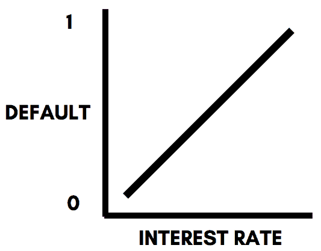
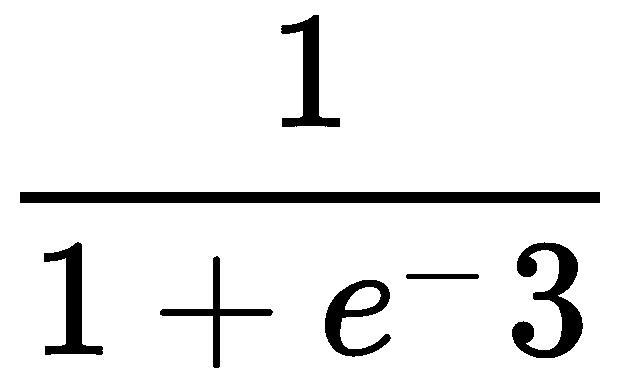
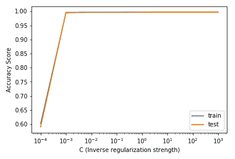
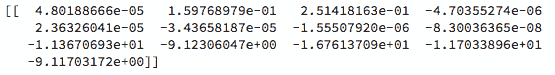
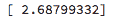
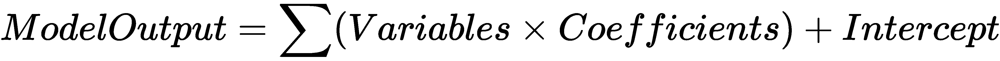

# 第三章：使用逻辑回归进行分类预测

逻辑回归算法是机器学习领域中最具可解释性的算法之一，尽管“回归”一词通常用于预测数值结果，但逻辑回归算法用于预测类别并解决分类机器学习问题。

在本章中，你将学习以下内容：

+   逻辑回归算法在数学上的工作原理

+   使用 scikit-learn 实现并评估你的第一个逻辑回归算法

+   使用`GridSearchCV`微调超参数

+   为了潜在提高准确性，对数据进行缩放

+   解读模型的结果

逻辑回归有广泛的应用，尤其在金融领域，在那里构建可解释的机器学习模型是说服投资者和监管者你的模型在直观和逻辑上都合理的关键。

# 技术要求

你需要在系统上安装 Python 3.6 或更高版本、Pandas ≥ 0.23.4、Scikit-learn ≥ 0.20.0 和 Matplotlib ≥ 3.0.0。

本章的代码文件可以在 GitHub 上找到：

[`github.com/PacktPublishing/Machine-Learning-with-scikit-learn-Quick-Start-Guide/blob/master/Chapter_03.ipynb`](https://github.com/PacktPublishing/Machine-Learning-with-scikit-learn-Quick-Start-Guide/blob/master/Chapter_03.ipynb)

查看以下视频，看看代码的实际操作：

[`bit.ly/2DaTNgQ`](http://bit.ly/2DaTNgQ)

# 从数学角度理解逻辑回归

顾名思义，逻辑回归本质上源自线性回归算法。线性回归算法将在后续章节中深入讨论。现在，让我们考虑一个假设情况：我们希望根据贷款的利率预测某一贷款是否会违约。使用线性回归，可以构建以下方程：

`违约 = (利率 × x) + c`

在上述方程中，*c* 是截距，*x* 是系数，将作为逻辑回归模型的输出。截距和系数将具有数值。为了此示例，我们假设 *c* 为 5，*x* 为 -0.2。方程现在变为：

`违约 = (利率 × -0.2) + 5`

该方程可以通过以下图示表示为二维图：



假设利率为 10%，该方程产生的违约值如下：

*违约 = (10 × -0.2) + 5*

*违约 = 3*

现在，逻辑回归模型使用`logit`函数将这个值 3 转换为一个介于 0 和 1 之间的概率：



评估前面的方程式后，我们得到答案 0.95。换句话说，使用我们刚刚构建的逻辑回归模型，我们获得了 95% 的概率，表示在利率为 10% 时，贷款违约的可能性。

在对线性方程应用 `logit` 函数后，之前的二维图表变为下图所示：

在前面的图表中，发生了以下情况：

+   当利率沿着 *x* 轴接近无穷大时，函数趋近于 1。

+   当利率沿 *x* 轴接近 0 时，函数趋近于 0。

# 使用 scikit-learn 实现逻辑回归

在本节中，您将学习如何为您的数据集实现并快速评估逻辑回归模型。我们将使用之前已经清理和准备好的数据集，目的是预测某笔交易是否为欺诈。在上一章中，我们将此数据集保存为 `fraud_detection.csv`。第一步是将该数据集加载到 Jupyter Notebook 中。这可以通过以下代码完成：

```py
import pandas as pd

# Reading in the dataset 

df = pd.read_csv('fraud_prediction.csv')
```

# 将数据分为训练集和测试集

使用 scikit-learn 构建任何机器学习模型的第一步是将数据分为训练集和测试集。这可以通过以下代码完成：

```py
from sklearn.model_selection import train_test_split

#Creating the features and target

features = df.drop('isFraud', axis = 1).values
target = df['isFraud'].values

#Creating the training and testing data

X_train, X_test, y_train, y_test = train_test_split(features, target, test_size = 0.3, random_state = 42, stratify = target)
```

下一步是实现一个基本的逻辑回归分类器并评估其准确率。这可以通过以下代码完成：

```py
from sklearn import linear_model

#Initializing an logistic regression object

logistic_regression = linear_model.LogisticRegression()

#Fitting the model to the training and test sets

logistic_regression.fit(X_train, y_train)
```

在前面的代码中，`linear_model` 包从 `sklearn` 导入，并通过调用 `LogisticRegression()` 方法来初始化逻辑回归算法。然后将该逻辑回归算法拟合到训练数据中。

为了提取准确率评分，我们对测试数据使用以下代码：

```py
#Accuracy score of the logistic regression model

logistic_regression.score(X_test, y_test)
```

该模型在测试数据上的准确率为 58.9%。这意味着基本的逻辑回归模型的表现仅略优于一个随机猜测输出的算法。

# 微调超参数

从前一部分中实现的逻辑回归模型的输出可以看出，该模型的表现略优于随机猜测。这样的模型无法为我们提供价值。为了优化模型，我们将使用上一章中介绍的 `GridSearchCV` 算法来优化逻辑回归模型的超参数。

逻辑回归模型使用的超参数被称为反向正则化强度。这是因为我们正在实现一种被称为 **l1** 回归的线性回归。关于这种线性回归的详细解释，请参考 第五章，*使用线性回归预测数值结果*。

为了优化反向正则化强度，简称 **C**，我们使用以下代码：

```py
#Building the model with L1 penality 

logistic_regression = linear_model.LogisticRegression(penalty='l1')

#Using GridSearchCV to search for the best parameter

grid = GridSearchCV(logistic_regression, {'C':[0.0001, 0.001, 0.01, 0.1, 10]})
grid.fit(X_train, y_train)

# Print out the best parameter

print("The most optimal inverse regularization strength is:", grid.best_params_)
```

这将生成如下所示的输出：


在前面的代码中，我们首先初始化了一个逻辑回归模型，并将惩罚参数设置为**l1**，这表示我们使用的是**l1**回归。然后我们初始化了一个网格，其中包含从 0.0001 到 10\的逆正则化强度的可能值。

在网格对象中初始化模型的超参数的值的个数是任意的。然而，值越多，`GridSearchCV`找到最佳超参数值的时间就越长，从而使得这一过程在计算上变得更加昂贵。

然后，将包含逆正则化强度可能值的网格对象拟合到训练数据中，并打印出最佳值，在本例中是 10\。我们现在可以通过以下代码构建一个新的逻辑回归模型，使用这个新获得的最佳超参数值：

```py
#Initializing an logistic regression object

logistic_regression = linear_model.LogisticRegression(C = 10, penalty = 'l1')

#Fitting the model to the training and test sets

logistic_regression.fit(X_train, y_train)
```

使用以下代码评估测试数据上的模型时，我们得到了 99.6%的准确率！这可算是一个相当大的提升。

```py
#Accuracy score of the logistic regression model

logistic_regression.score(X_test, y_test)
```

检查`GridSearchCV`是否给出准确结果的一种方法是绘制逆正则化强度不同值在 x 轴上的变化，并将准确率得分绘制在*y*轴上。这可以通过以下代码完成：

```py
train_errors = []
test_errors = []

C_list = [0.0001, 0.001, 0.01, 0.1, 10, 100, 1000]

# Evaluate the training and test classification errors for each value of C

for value in C_list:

 # Create LogisticRegression object and fit
 logistic_regression = linear_model.LogisticRegression(C= value, penalty = 'l1')
 logistic_regression.fit(X_train, y_train)

 # Evaluate error rates and append to lists
 train_errors.append(logistic_regression.score(X_train, y_train) )
 test_errors.append(logistic_regression.score(X_test, y_test))

# Plot results
plt.semilogx(C_list, train_errors, C_list, test_errors)
plt.legend(("train", "test"))
plt.ylabel('Accuracy Score')
plt.xlabel('C (Inverse regularization strength)')
plt.show()
```

这将产生如下面所示的图：



从前面的图中可以清楚地看到，逆正则化强度为 10 时，训练集和测试集的准确率都很高。此类图表还用于判断某个超参数值是否出现过拟合情况，即在训练集上得到较高的准确率，但在测试集上得到较低的准确率。相反，它们也可以用来检查模型是否低估了数据，通过在训练集上获得较低的准确率。

# 数据缩放

尽管模型表现极为出色，缩放数据仍然是构建逻辑回归机器学习模型中的一个有用步骤，因为它标准化了数据，使其在相同范围的值内。在缩放数据时，我们将使用上一章中用过的`StandardScaler()`函数。具体代码如下：

```py
from sklearn.preprocessing import StandardScaler
from sklearn.pipeline import Pipeline

#Setting up the scaling pipeline 

pipeline_order = [('scaler', StandardScaler()), ('logistic_reg', linear_model.LogisticRegression(C = 10, penalty = 'l1'))]

pipeline = Pipeline(pipeline_order)

#Fitting the classfier to the scaled dataset 

logistic_regression_scaled = pipeline.fit(X_train, y_train)

#Extracting the score 

logistic_regression_scaled.score(X_test, y_test)
```

前面的代码使得模型的准确率得分提高了 0.1%，考虑到模型原本已经有非常高的准确率，这已经是一个不错的提升。该代码与上一章为 k-NN 算法构建的缩放管道类似，唯一的区别是我们使用了逻辑回归模型，而不是 k-NN 模型。

# 解释逻辑回归模型

逻辑回归算法的一个关键优势是其高度可解释性。这意味着模型的结果可以解释为输入变量的函数。这使我们能够理解每个变量如何影响模型最终结果。

在第一部分中，我们了解到逻辑回归模型由每个变量的系数和一个截距组成，可以用来解释模型的工作原理。为了提取模型中每个变量的系数，我们使用以下代码：

```py
#Printing out the coefficients of each variable 

print(logistic_regression.coef_)
```

这导致了如下截图所示的输出：



系数的顺序与输入模型的数据集中变量的顺序相同。为了从模型中提取截距，我们使用以下代码：

```py
#Printing out the intercept of the model

print(logistic_regression.intercept_)
```

这导致了如下截图所示的输出：



现在我们已经获得了每个变量的系数以及截距，我们可以构建以下形式的方程：



# 摘要

在本章中，您已经了解了逻辑回归模型在数学层面上的工作原理。尽管简单，但该模型在可解释性方面表现出色，这在金融行业中非常有益。

您还学会了如何使用 scikit-learn 构建和评估逻辑回归算法，并使用`GridSearchCV`算法进行超参数优化。此外，您还学会了通过绘制不同超参数数值的准确度得分来验证`GridSearchCV`算法提供给您的结果是否准确。

最后，您对数据进行了缩放以使其标准化，并学会了如何在数学层面解释您的模型。

在下一章中，您将学习如何使用 scikit-learn 实现基于树的算法，如决策树、随机森林和梯度提升树。
