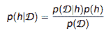
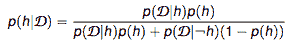
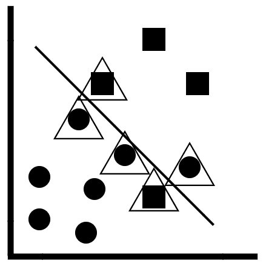
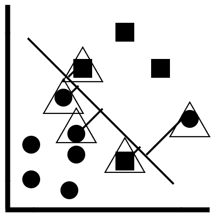
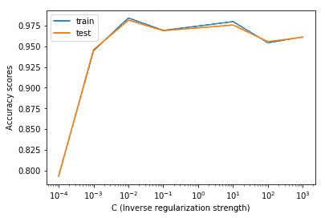

# 第四章：使用朴素贝叶斯和支持向量机预测类别

在本章中，你将学习两种流行的分类机器学习算法：朴素贝叶斯算法和线性支持向量机。朴素贝叶斯算法是一个概率模型，用于预测类别和分类，而线性支持向量机则使用线性决策边界来预测类别和分类。

在本章中，你将学习以下内容：

+   解释朴素贝叶斯算法背后的理论概念，使用数学术语

+   使用 scikit-learn 实现朴素贝叶斯算法

+   线性支持向量机算法的工作原理

+   图形化优化线性支持向量机的超参数

# 技术要求

你需要在系统上安装 Python 3.6 或更高版本、Pandas ≥ 0.23.4、Scikit-learn ≥ 0.20.0 和 Matplotlib ≥ 3.0.0。

本章的代码文件可以在 GitHub 上找到：

[`github.com/PacktPublishing/Machine-Learning-with-scikit-learn-Quick-Start-Guide/blob/master/Chapter_04.ipynb`](https://github.com/PacktPublishing/Machine-Learning-with-scikit-learn-Quick-Start-Guide/blob/master/Chapter_04.ipynb)

查看以下视频，看看代码如何运行：

[`bit.ly/2COBMUj`](http://bit.ly/2COBMUj)

# 朴素贝叶斯算法

朴素贝叶斯算法利用贝叶斯定理来进行分类。算法之所以被称为**朴素**，是因为它假设所有特征之间是相互独立的。但实际上这是不可能的，因为数据集中的每个属性/特征在某种程度上与其他属性相关。

尽管朴素贝叶斯算法是“朴素”的，但它在实际应用中表现良好。贝叶斯定理的公式如下：



贝叶斯定理公式

我们可以将前述算法分解为以下几个组成部分：

+   **p(h|D)**：这是在给定数据集的前提下，假设发生的概率。举个例子，这可以是一个欺诈交易发生的概率，前提是我们有一个包含欺诈和非欺诈交易的数据集。

+   **p(D|h)**：这是在假设的前提下，数据存在的概率。举个例子，这可以是拥有一个包含欺诈交易的数据集的概率。

+   **p(h)**：这是假设发生的概率。举个例子，这可以是一个声明，表示在移动行业中，欺诈交易发生的平均概率为 2%。

+   **p(D)**：这是在不知道任何假设的情况下，数据存在的概率。举个例子，这可以是一个数据集存在的概率，而我们并不知道具体要做什么（例如，预测欺诈性移动交易）。

在上述公式中，*p(D)*可以用*p(h)*和*p(D|h)*来重新写为如下形式：



让我们来看看如何在移动交易示例中使用预测类别的方法来实现这一点：

| **p(D&#124;h)** | **p(h)** | **p(D&#124;-h)** | **(1 - p(h))** |
| --- | --- | --- | --- |
| 0.8 | 0.08 | 0.02 | 0.92 |

将上述表格中的值代入贝叶斯定理公式，得到结果为 0.77。这意味着，使用之前给定的数据，分类器预测交易为欺诈的概率为 77%。

# 在 scikit-learn 中实现朴素贝叶斯算法

现在你已经了解了朴素贝叶斯算法如何生成预测，我们将使用 scikit-learn 实现相同的分类器，以预测某一交易是否为欺诈。

第一步骤是导入数据，创建特征数组和目标数组，并将数据划分为训练集和测试集。

我们可以使用以下代码来实现：

```py
import pandas as pd
from sklearn.model_selection import train_test_split

df = pd.read_csv('fraud_prediction.csv')

df = df.drop(['Unnamed: 0'], axis = 1)

#Creating the features 

features = df.drop('isFraud', axis = 1).values
target = df['isFraud'].values

X_train, X_test, y_train, y_test = train_test_split(features, target, test_size = 0.3, random_state = 42, stratify = target)
```

下一步是构建朴素贝叶斯分类器。我们可以使用以下代码来实现：

```py
from sklearn.naive_bayes import GaussianNB

#Initializing an NB classifier

nb_classifier = GaussianNB()

#Fitting the classifier into the training data

nb_classifier.fit(X_train, y_train)

#Extracting the accuracy score from the NB classifier

nb_classifier.score(X_test, y_test)
```

在上述代码中，以下内容适用：

1.  首先，我们从 scikit-learn 导入`GaussianNB`模块

1.  接下来，我们初始化一个朴素贝叶斯分类器，并将其存储在变量`nb_classifier`中

1.  然后，我们将分类器拟合到训练数据，并在测试数据上评估其准确性。

朴素贝叶斯分类器只有一个超参数，即假设的先验概率，*p(h)*。**然而，请牢记以下几点：

+   在大多数问题中，先验概率是不可用的。

+   即使如此，通常会将值固定为一个统计事实，因此不会进行超参数优化。

# 支持向量机

在本节中，您将学习**支持向量机（SVMs）**，或者更具体地说，**线性支持向量机**。为了理解支持向量机，您需要知道什么是支持向量。它们在下图中得到了说明：



支持向量的概念

在上述图表中，以下内容适用：

+   线性支持向量机是一种线性分类器。构建一个线性决策边界，边界一侧的观测点（圆形）属于一个类别，而另一侧的观测点（方形）属于另一个类别。

+   支持向量是那些上面有三角形标记的观测点。

+   这些是非常接近线性决策边界的观测点，或者被错误分类的观测点。

+   我们可以通过定义观测点距离决策边界的接近程度，来确定哪些观测点将成为支持向量。

+   这一点由名为**逆正则化强度**的超参数控制。**

为了理解线性支持向量机的工作原理，请考虑以下图示：



最大边距的概念

在前面的图示中，适用以下内容：

+   支持向量和线性决策边界之间的线称为**边距**。

+   支持向量机的目标是最大化这个边界，以便正确地分类一个新的数据点。

+   逆正则化强度的低值确保该边界尽可能大。

# 在 scikit-learn 中实现线性支持向量机算法

在本节中，您将学习如何在 scikit-learn 中实现线性支持向量机。第一步是导入数据并将其拆分为训练集和测试集。我们可以通过以下代码实现：

```py
import pandas as pd
from sklearn.model_selection import train_test_split

df = pd.read_csv('fraud_prediction.csv')

df = df.drop(['Unnamed: 0'], axis = 1)

#Creating the features 

features = df.drop('isFraud', axis = 1).values
target = df['isFraud'].values

X_train, X_test, y_train, y_test = train_test_split(features, target, test_size = 0.3, random_state = 42, stratify = target)

```

下一步是构建线性支持向量机分类器。我们可以通过以下代码实现：

```py
from sklearn.svm import LinearSVC

#Initializing a SVM model 

svm = LinearSVC(random_state = 50)

#Fitting the model to the training data

svm.fit(X_train, y_train)

#Extracting the accuracy score from the training data

svm.score(X_test, y_test)
```

在前面的代码中，适用以下内容：

1.  首先，我们从 scikit-learn 导入`LinearSVC`模块。

1.  接下来，我们初始化一个线性支持向量机对象，设置随机状态为 50，这样模型每次都会生成相同的结果。

1.  最后，我们将模型拟合到训练数据，并评估其在测试数据上的准确度。

现在我们已经构建了模型，可以找到并优化超参数的最理想值。

# 线性支持向量机的超参数优化

在本节中，您将学习如何优化线性支持向量机的超参数。特别地，有一个超参数值得关注：**逆正则化强度**。

我们将探索如何通过图形化和算法两种方式来优化这个超参数。

# 图形化超参数优化

为了优化逆正则化强度，我们将绘制训练集和测试集的准确度得分，使用以下代码：

```py
import matplotlib.pyplot as plt 
from sklearn.svm import LinearSVC

training_scores = []
testing_scores = []

param_list = [0.0001, 0.001, 0.01, 0.1, 10, 100, 1000]

# Evaluate the training and test classification errors for each value of the parameter

for param in param_list:

    # Create SVM object and fit

    svm = LinearSVC(C = param, random_state = 42)
    svm.fit(X_train, y_train)

    # Evaluate the accuracy scores and append to lists

    training_scores.append(svm.score(X_train, y_train) )
    testing_scores.append(svm.score(X_test, y_test) )

# Plot results

plt.semilogx(param_list, training_scores, param_list, testing_scores)
plt.legend(("train", "test"))
plt.ylabel('Accuracy scores')
plt.xlabel('C (Inverse regularization strength)')
plt.show()

```

在前面的代码中，适用以下内容：

1.  首先，我们初始化两个空列表，用于存储训练集和测试集的准确度得分。

1.  下一步是创建超参数的值列表，在本例中，超参数是逆正则化强度。

1.  然后，我们遍历超参数列表中的每个值，使用每个逆正则化强度值构建线性支持向量机分类器。

1.  然后，训练集和测试集的准确度得分将被追加到空列表中。

1.  使用`matplotlib`，我们将逆正则化强度（沿*X*轴）与训练集和测试集的准确度得分（沿*Y*轴）绘制成图。

这将生成如下图所示的图表：



图形化超参数优化

在前面的图示中，适用以下内容：

+   我们可以观察到，对于逆正则化强度为 10^(-2)时，训练集和测试集的准确度得分最高。

+   重要的是选择一个在训练集和测试集上都具有较高准确度的值，而不仅仅是其中一个数据集

+   这将帮助你避免过拟合和欠拟合

# 使用 `GridSearchCV` 进行超参数优化

在本节中，你将学习如何使用 `GridSearchCV` 算法优化反正则化强度。我们可以使用以下代码来完成这一操作：

```py
from sklearn.model_selection import GridSearchCV

#Building the model 

svm = LinearSVC(random_state = 50)

#Using GridSearchCV to search for the best parameter

grid = GridSearchCV(svm, {'C':[0.00001, 0.0001, 0.001, 0.01, 0.1, 10]})
grid.fit(X_train, y_train)

# Print out the best parameter

print("The best value of the inverse regularization strength is:", grid.best_params_)
```

在前面的代码中，以下内容适用：

1.  首先，我们从 scikit-learn 导入 `GridSearchCV` 模块

1.  下一步是初始化一个线性支持向量机模型，随机状态设为 50，以确保每次构建模型时得到相同的结果

1.  我们接着初始化一个可能的超参数值网格，用于反正则化强度

1.  最后，我们将超参数值网格拟合到训练集上，从而构建多个线性 SVM 模型，使用不同的反正则化强度值

1.  `GridSearchCV` 算法接着评估模型，选择产生最少泛化误差的模型，并返回超参数的最优值

将超参数优化的图形方法结果与 `GridSearchCV` 的结果进行比较是一个好习惯，这样可以验证你的结果。

# 缩放数据以提高性能

在本节中，你将学习如何通过缩放和标准化数据来提高线性支持向量机的整体性能。缩放的概念与前几章相同，这里不会再讨论。为了缩放数据，我们使用以下代码：

```py
from sklearn.preprocessing import StandardScaler
from sklearn.pipeline import Pipeline

#Setting up the scaling pipeline 

order = [('scaler', StandardScaler()), ('SVM', LinearSVC(C = 0.1, random_state = 50))]

pipeline = Pipeline(order)

#Fitting the classfier to the scaled dataset 

svm_scaled = pipeline.fit(X_train, y_train)

#Extracting the score 

svm_scaled.score(X_test, y_test)
```

在前面的代码中，以下内容适用：

1.  首先，我们从 scikit-learn 导入 `StandardScaler` 和 `Pipeline` 模块，以便构建一个缩放管道

1.  我们接着设置管道的顺序，指定首先使用 `StandardScaler()` 函数来缩放数据，并在该缩放数据上构建线性支持向量机

1.  `Pipeline()` 函数用于设置管道的顺序，建立管道

1.  然后我们将这个管道拟合到训练数据上，并从测试数据中提取缩放后的准确度得分

# 总结

本章向你介绍了两种基本的监督式机器学习算法：朴素贝叶斯算法和线性支持向量机。更具体地说，你学习了以下内容：

+   贝叶斯定理如何用于生成概率，以指示数据点是否属于某个特定类别或类别

+   在 scikit-learn 中实现朴素贝叶斯分类器

+   线性支持向量机的工作原理

+   在 scikit-learn 中实现线性支持向量机

+   使用图形方法和 `GridSearchCV` 算法优化反正则化强度

+   如何缩放数据以潜在地提高性能

在下一章中，你将学习另一种有监督的机器学习算法，它用于预测数值，而不是类别和分类：线性回归！
