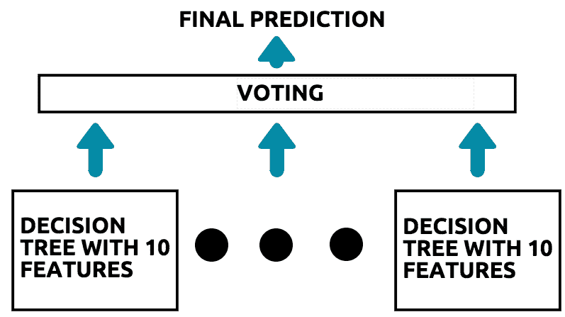

# 第六章：基于树的分类与回归

基于树的算法因其可解释性和声音预测而非常流行，在在线平台如 Kaggle 上赢得了许多机器学习竞赛。此外，它们在解决问题的简单和复杂用例中也有许多应用。

构建树是几乎所有行业中用于决策制定的方法。树可用于解决基于分类和回归的问题，并有几个用例使其成为首选解决方案！

本章节主要分为以下两个部分：

+   分类树

+   回归树

每个部分将涵盖不同类型基于树的算法的基本理论，以及它们在 scikit-learn 中的实现。通过本章结束时，您将学会如何将多个算法聚合到一个**集成**中，并让它们投票决定最佳预测结果。

# 技术要求

您需要在系统上安装 Python 3.6 或更高版本，Pandas ≥ 0.23.4，Scikit-learn ≥ 0.20.0 和 Matplotlib ≥ 3.0.0。

本章的代码文件可在 GitHub 上找到：

[`github.com/PacktPublishing/Machine-Learning-with-scikit-learn-Quick-Start-Guide/blob/master/Chapter_06.ipynb`](https://github.com/PacktPublishing/Machine-Learning-with-scikit-learn-Quick-Start-Guide/blob/master/Chapter_06.ipynb)[.](https://github.com/PacktPublishing/Machine-Learning-with-scikit-learn-Quick-Start-Guide/blob/master/Chapter_06.ipynb)

观看以下视频，了解代码的实际操作：

[`bit.ly/2SrPP7R`](http://bit.ly/2SrPP7R)

# 分类树

分类树用于预测类别或类别。这类似于您在本书中之前学习过的分类算法，如 k 最近邻算法或逻辑回归。

广义上讲，有三种基于树的算法用于解决分类问题：

+   决策树分类器

+   随机森林分类器

+   AdaBoost 分类器

在本节中，您将学习每种基于树的算法如何工作，以便将数据行分类为特定的类别或类别。

# 决策树分类器

决策树是最简单的基于树的算法，也是其他两种算法的基础。让我们考虑以下简单的决策树：


简单的决策树

简而言之，决策树是一组帮助我们将观察结果分类为不同组的规则。在前面的图表中，规则可以写成如下形式：

```py
If (value of feature is less than 50); then (put the triangles in the left-hand box and put the circles in the right-hand box).
```

先前的决策树完美地将观察结果划分为两个不同的组。这是理想决策树的特征。顶部的第一个框被称为**根**，在决定如何分组观察结果时是树的最重要特征。

根节点下的框被称为**子节点**。在前面的树中，**子节点**也是**叶节点**。**叶节点**是最后一组框，通常位于树的最底部。如你所料，决策树实际上是一个常规的树形结构，只不过是倒置的。

# 选择最佳特征

决策树如何决定哪个特征最好？最佳特征是提供最佳划分的特征，它将树划分为两个或更多不同的组，具体取决于数据中包含的类别或类的数量。让我们看以下图示：


展示良好划分的决策树

在前面的图示中，发生了以下情况：

1.  该树将根节点中的数据划分为两个不同的组。

1.  在左侧组中，我们看到有两个三角形和一个圆形。

1.  在右侧组中，我们看到有两个圆形和一个三角形。

1.  由于树将每个类的大多数元素分配到一个组中，我们可以说，在将数据划分成不同组方面，树做得很好。

让我们看另一个例子——这次是一个划分不好的例子。考虑下面的图示：


展示坏划分的决策树

在前面的图示中，发生了以下情况：

1.  该树将根节点中的数据划分成四个不同的组。从本身来看，这是不好的，因为显然只有两种类别（三角形和圆形）。

1.  此外，每个组都有一个三角形和一个圆形。

1.  在这四个组中没有任何一个组有明显的主要类别或类别。每个组中有 50%的某个类别；因此，除非树依赖于更多特征，否则无法得出最终决策，这样会增加树的复杂性。

# 基尼系数

决策树用来判断根节点的度量被称为*基尼系数*。基尼系数的值越高，说明这个特征在将数据划分为不同组方面的效果越好。为了学习如何计算特征的基尼系数，我们来看一下以下图示：


计算基尼系数

在前面的图示中，发生了以下情况：

1.  该特征将数据划分成两个组。

1.  在左侧组中，我们有两个三角形和一个圆形。

1.  因此，左侧组的基尼系数为（2 个三角形/3 个总数据点）² + （1 个圆形/3 个总数据点）²。

1.  计算此值的方法如下： 0.55。

1.  基尼系数为 0.55 表示该树的根节点以这样的方式划分数据：每个组都有一个主要类别。

1.  一个完美的根特征的基尼系数为 1。这意味着每个组只有一个类/类别。

1.  一个不好的根特征的基尼系数为 0.5，这意味着组内没有明显的类或类别。

实际上，决策树是以递归方式构建的，树会选择一个随机属性作为根节点，然后计算该属性的基尼系数。它会一直这样做，直到找到能够最好地将数据在节点中划分为具有不同类别和类别的属性。

# 在 scikit-learn 中实现决策树分类器

在本节中，您将学习如何在 scikit-learn 中实现决策树分类器。我们将使用相同的欺诈检测数据集。第一步是将数据集加载到 Jupyter Notebook 中。我们可以使用以下代码来实现：

```py
import pandas as pd

df = pd.read_csv('fraud_prediction.csv')
```

下一步是将数据拆分为训练集和测试集。我们可以使用以下代码实现：

```py
#Creating the features 

features = df.drop('isFraud', axis = 1).values
target = df['isFraud'].values

X_train, X_test, y_train, y_test = train_test_split(features, target, test_size = 0.3, random_state = 42, stratify = target)
```

我们现在可以通过以下代码，在训练数据上构建初始决策树分类器，并在测试数据上测试其准确性：

```py
from sklearn.tree import DecisionTreeClassifier

dt = DecisionTreeClassifier(criterion = 'gini', random_state = 50)

#Fitting on the training data

dt.fit(X_train, y_train)

#Testing accuracy on the test data

dt.score(X_test, y_test)
```

在前面的代码中，我们执行以下操作：

1.  首先，我们从 scikit-learn 导入`DecisionTreeClassifier`。

1.  然后，我们用两个参数初始化`DecisionTreeClassifier`对象。第一个是`criterion`，它是树递归选择最重要特征的度量方式，在本例中是基尼系数。第二个是`random_state`，设置为 50，以便每次运行时，模型都会产生相同的结果。

1.  最后，我们在训练数据上拟合模型，并在测试数据上评估其准确性。

# 决策树的超参数调优

决策树有大量的超参数，需要微调才能得到最优模型，从而尽可能减少泛化误差。在本节中，我们将重点讨论两个特定的超参数：

+   **最大深度：** 这是决策树可以生长的最大子节点数，直到树被截断。例如，如果将其设置为 3，则树将使用三个子节点，并在无法再生长时截断树。

+   **最小叶子样本数：** 这是在叶节点中需要存在的最小样本数或数据点。叶节点是树的最后一个节点。如果这个参数设置为 0.04，它告诉树必须生长到最后一个节点，其中包含数据总样本的 4%。

为了优化理想的超参数并提取最佳的决策树，我们使用 scikit-learn 中的`GridSearchCV`模块。我们可以使用以下代码进行设置：

```py
from sklearn.model_selection import GridSearchCV

#Creating a grid of different hyperparameters

grid_params = {
    'max_depth': [1,2,3,4,5,6],
    'min_samples_leaf': [0.02,0.04, 0.06, 0.08]
}

#Building a 10 fold Cross Validated GridSearchCV object

grid_object = GridSearchCV(estimator = dt, param_grid = grid_params, scoring = 'accuracy', cv = 10, n_jobs = -1)
```

在前面的代码中，我们执行以下操作：

1.  我们首先从 scikit-learn 导入`GridSearchCV`模块。

1.  接下来，我们创建一个包含超参数可能值的字典，并将其存储为`grid_params`。

1.  最后，我们创建一个`GridSearchCV`对象，使用决策树分类器作为估算器；即包含超参数值的字典。

1.  我们将`scoring`参数设置为`accuracy`，因为我们希望提取`GridSearchCV`找到的最佳模型的准确度。

然后，我们使用以下代码将此网格对象拟合到训练数据上：

```py
#Fitting the grid to the training data

grid_object.fit(X_train, y_train)
```

然后，我们可以使用以下代码提取最佳参数集：

```py
#Extracting the best parameters

grid_object.best_params_
```

上述代码的输出表明，最大深度为 1，叶节点的最小样本数为 0.02 是此数据的最佳参数。我们可以使用这些最优参数，并使用以下代码构建一个新的决策树：

```py
#Extracting the best parameters

grid_object.best_params_
```

# 可视化决策树

构建并实现决策树来解决问题的一个最佳方面是，它可以通过决策树图进行轻松解释，展示你构建的算法如何工作。为了可视化一个简单的决策树，应用于欺诈检测数据集，我们使用以下代码：

```py
#Package requirements 

import pandas as pd
from sklearn.tree import DecisionTreeClassifier
from sklearn.externals.six import StringIO 
from IPython.display import Image 
from sklearn.tree import export_graphviz
import pydotplus
from sklearn import tree
```

我们首先导入所需的包。这里的新包如下：

+   `StringIO`

+   `Image`

+   `export_graphviz`

+   `pydotplus`

+   `tree`

包的安装在第一章中进行了说明，*《引入机器学习与 scikit-learn》*。

接着，我们读取数据集并初始化一个决策树分类器，如下代码所示：

```py
#Reading in the data

df = pd.read_csv('fraud_prediction.csv')
df = df.drop(['Unnamed: 0'], axis = 1)

#Creating the features 

features = df.drop('isFraud', axis = 1).values
target = df['isFraud'].values

#Initializing the DT classifier

dt = DecisionTreeClassifier(criterion = 'gini', random_state = 50, max_depth= 5)
```

接下来，我们将树拟合到特征和目标上，然后分别提取特征名称：

```py
#Fitting the classifier on the data

dt.fit(features, target)

#Extracting the feature names

feature_names = df.drop('isFraud', axis = 1)
```

然后，我们可以使用以下代码可视化决策树：

```py
#Creating the tree visualization

data = tree.export_graphviz(dt, out_file=None, feature_names= feature_names.columns.values, proportion= True)

graph = pydotplus.graph_from_dot_data(data) 

# Show graph
Image(graph.create_png())
```

在上面的代码中，我们执行了以下操作：

1.  我们使用`tree.export_graphviz()`函数构建决策树对象，并将其存储在一个名为`data`的变量中。

1.  该函数使用了几个参数：`dt`是你构建的决策树；`out_file`设置为`None`，因为我们不想将树的可视化结果保存到 Jupyter Notebook 以外的任何文件中；`feature_names`是我们之前定义的特征名称；`proportion`设置为`True`（稍后会详细解释）。

1.  接下来，我们构建包含树中数据的图形，以便通过使用`pydotplus.graph_from_dot_data()`函数将决策树图可视化，这个函数作用于包含决策树数据的`data`变量。

1.  最后，我们通过`Image()`函数可视化决策树，将决策树图传递给它。

这将得到一个类似于下图所示的决策树：


结果决策树

这棵树一开始可能看起来比较复杂，但其实并不是！为了理解这棵树，我们先考虑根节点和前两个子节点。这在下面的图示中进行了说明：


决策树的片段

在上面的图示中，请注意以下几点：

+   在根节点中，树已识别出“step”特征为具有最高 Gini 值的特征。

+   根节点通过这样的方式进行分裂：71%的数据（即 0.71）进入非欺诈交易类别，而 29%的数据（即 0.29）进入欺诈交易类别。

+   如果步骤大于或等于 7.5（右侧），则所有交易都被分类为欺诈交易。

+   如果步骤小于或等于 7.5（左侧），则 99.6%的交易（即 0.996）被分类为非欺诈交易，而 0.4%的交易（即 0.004）被分类为欺诈交易。

+   如果金额大于或等于 4,618,196.0，则所有交易都被分类为欺诈交易。

+   如果金额小于或等于 4,618,196.0，则 99.6%的交易（即 0.996）被分类为非欺诈交易，而 0.4%的交易（即 0.004）被分类为欺诈交易。

请注意，决策树实际上仅仅是一组“如果-那么”规则，这些规则是以嵌套的方式构建的。

# 随机森林分类器

现在你已经从最基础的层面理解了决策树的核心原理，接下来我们将探索什么是随机森林。随机森林是一种*集成*学习方法。集成学习方法是通过多个机器学习模型共同做出决策的方式。

让我们考虑以下图示：


集成学习的概念

随机森林算法的操作流程如下：

1.  假设你最初有一个包含 100 个特征的数据集。

1.  从这里开始，我们将首先构建一个包含 10 个特征的决策树。这些特征是随机选择的。

1.  现在，使用剩余的 90 个特征中的随机选择，我们构建下一个决策树，同样使用 10 个特征。

1.  这个过程会继续，直到没有更多特征可以用来构建决策树。

1.  到目前为止，我们已经有了 10 棵决策树，每棵树有 10 个特征。

1.  每棵决策树被称为随机森林的**基础估计器**。

1.  因此，我们有一片树林，每棵树都是使用一组随机选择的 10 个特征构建的。

算法的下一步是做出预测。为了更好地理解随机森林算法如何进行预测，考虑以下图示：


在随机森林中进行预测的过程

在前面的图示中，发生了以下情况：

1.  假设随机森林中有 10 棵决策树。

1.  每棵决策树对进入的数据做出单一的预测。

1.  如果六棵树预测类别 A，四棵树预测类别 B，那么随机森林算法的最终预测结果是类别 A，因为它获得了多数票。

1.  基于多个模型的输出进行投票预测的过程被称为集成学习。

现在你已经了解了算法的内部工作原理，我们可以使用 scikit-learn 来实现它！

# 在 scikit-learn 中实现随机森林分类器

在这一部分中，我们将在 scikit-learn 中实现随机森林分类器。第一步是读取数据，并将其拆分为训练集和测试集。我们可以使用以下代码来完成：

```py
import pandas as pd

#Reading in the dataset

df = pd.read_csv('fraud_prediction.csv')

#Dropping the index

df = df.drop(['Unnamed: 0'], axis = 1)

#Creating the features 

features = df.drop('isFraud', axis = 1).values
target = df['isFraud'].values

X_train, X_test, y_train, y_test = train_test_split(features, target, test_size = 0.3, random_state = 42, stratify = target)
```

下一步是构建随机森林分类器。我们可以使用以下代码来实现：

```py
from sklearn.ensemble import RandomForestClassifier

#Initiliazing an Random Forest Classifier with default parameters

rf_classifier = RandomForestClassifier(random_state = 50)

#Fitting the classifier on the training data

rf_classifier.fit(X_train, y_train)

#Extracting the scores

rf_classifier.score(X_test, y_test)
```

在上面的代码块中，我们执行以下操作：

1.  我们首先从 scikit-learn 导入`RandomForestClassifier`。

1.  接下来，我们初始化一个随机森林分类器模型。

1.  然后，我们将该模型拟合到训练数据，并在测试数据上评估其准确性。

# 随机森林算法的超参数调优

在这一部分中，我们将学习如何优化随机森林算法的超参数。由于随机森林本质上是基于多个决策树，因此它的超参数与决策树非常相似。为了优化超参数，我们使用以下代码：

```py
from sklearn.model_selection import GridSearchCV

#Creating a grid of different hyperparameters

grid_params = {
 'n_estimators': [100,200, 300,400,5000],
 'max_depth': [1,2,4,6,8],
 'min_samples_leaf': [0.05, 0.1, 0.2]
}

#Building a 3 fold Cross-Validated GridSearchCV object

grid_object = GridSearchCV(estimator = rf_classifier, param_grid = grid_params, scoring = 'accuracy', cv = 3, n_jobs = -1)

#Fitting the grid to the training data

grid_object.fit(X_train, y_train)

#Extracting the best parameters

grid_object.best*params* #Extracting the best model

rf_best = grid_object.best*estimator_* 
```

在上面的代码块中，我们执行以下操作：

1.  我们首先导入`GridSearchCV`包。

1.  我们初始化一个包含超参数值的字典。`max_depth`和`min_samples_leaf`的值类似于决策树的超参数。

1.  然而，`n_estimators`是一个新参数，表示在做最终预测时，随机森林算法考虑的树的总数。

1.  然后，我们构建并拟合`gridsearch`对象到训练数据，并提取出最佳参数。

1.  然后，使用这些最佳超参数提取出最优模型。

# AdaBoost 分类器

在这一部分中，你将了解 AdaBoost 分类器的内部工作原理，以及提升（boosting）概念如何帮助你获得更好的结果。提升是一种集成机器学习方法，其中一个机器学习模型通过学习之前构建的模型的错误，从而提高最终预测的准确性。

AdaBoost 代表自适应提升，它是一种提升算法，重点关注初始预测模型出错的数据行。这样，下一模型就不会犯同样的错误。

AdaBoost 算法工作的过程在下图中进行了说明：


AdaBoost 算法概述

在上述 AdaBoost 算法的示意图中，发生了以下情况：

1.  第一个决策树被构建，并输出一组预测结果。

1.  第一个决策树预测错误的样本会被赋予一个权重`w`。这意味着，如果权重设置为 2，那么该样本的两个实例会被加入数据集中。

1.  这使得决策树 2 能够以更快的速度学习，因为我们有更多的样本数据，这些样本在之前的预测中出现了错误。

1.  这个过程会一直重复，直到所有树都构建完成。

1.  最后，收集所有树的预测结果，并启动加权投票以确定最终预测。

# 在 scikit-learn 中实现 AdaBoost 分类器

在本节中，我们将学习如何在 scikit-learn 中实现 AdaBoost 分类器，以预测一个交易是否为欺诈交易。像往常一样，第一步是导入数据并将其拆分为训练集和测试集。

这可以通过以下代码完成：

```py
#Reading in the dataset

df = pd.read_csv('fraud_prediction.csv')

#Dropping the index

df = df.drop(['Unnamed: 0'], axis = 1)

#Creating the features 

features = df.drop('isFraud', axis = 1).values
target = df['isFraud'].values

X_train, X_test, y_train, y_test = train_test_split(features, target, test_size = 0.3, random_state = 42, stratify = target)
```

下一步是构建 AdaBoost 分类器。我们可以使用以下代码实现：

```py
from sklearn.ensemble import AdaBoostClassifier

#Initialize a tree (Decision Tree with max depth = 1)

tree = DecisionTreeClassifier(max_depth=1, random_state = 42)

#Initialize an AdaBoost classifier with the tree as the base estimator

ada_boost = AdaBoostClassifier(base_estimator = tree, n_estimators=100)

#Fitting the AdaBoost classifier to the training set

ada_boost.fit(X_train, y_train)

#Extracting the accuracy scores from the classifier

ada_boost.score(X_test, y_test)
```

在前面的代码块中，我们执行了以下操作：

1.  我们首先从 scikit-learn 导入 `AdaBoostClassifier` 包。

1.  接下来，我们初始化一个决策树，作为我们 AdaBoost 分类器的基础。

1.  然后我们构建 AdaBoost 分类器，基学习器为决策树，并指定总共需要 100 棵决策树。

1.  最后，我们将分类器拟合到训练数据中，并从测试数据中提取准确率评分。

# AdaBoost 分类器的超参数调优

在本节中，我们将学习如何调整 AdaBoost 分类器的超参数。AdaBoost 分类器只有一个需要关注的参数——基学习器的数量，或决策树的数量。

我们可以使用以下代码优化 AdaBoost 分类器的超参数：

```py
from sklearn.model_selection import GridSearchCV

#Creating a grid of hyperparameters

grid_params = {
    'n_estimators': [100,200,300]
}

#Building a 3 fold CV GridSearchCV object

grid_object = GridSearchCV(estimator = ada_boost, param_grid = grid_params, scoring = 'accuracy', cv = 3, n_jobs = -1)

#Fitting the grid to the training data

grid_object.fit(X_train, y_train)

#Extracting the best parameters

grid_object.best*params* 
#Extracting the best model
ada_best = grid_object.best_estimator_
```

在前面的代码中，我们执行了以下操作：

1.  我们首先导入 `GridSearchCV` 包。

1.  我们初始化了一个超参数值字典。在这种情况下，`n_estimators` 是决策树的数量。

1.  然后我们构建并拟合 `gridsearch` 对象到训练数据，并提取最佳参数。

1.  然后使用这些最优超参数提取最佳模型。

# 回归树

你已经学习了如何使用决策树将预测分类为属于特定的类别或类别。然而，决策树也可以用于解决与预测数值结果相关的问题。在本节中，你将学习三种基于树的算法，这些算法可以在 scikit-learn 中实现，以预测数值结果，而不是类别：

+   决策树回归器

+   随机森林回归器

+   梯度提升树

# 决策树回归器

当我们有非线性数据时，线性回归模型可能不是最佳选择。在这种情况下，选择一个能够完全捕捉数据非线性的模型是有意义的。决策树回归器可以像线性回归模型一样用于预测数值结果。

对于决策树回归器，我们使用均方误差，而不是基尼指数，来决定树的构建方式。你将在第八章中详细了解均方误差，*性能评估方法*。简而言之，均方误差用于告诉我们预测误差率。

请考虑下图所示的树：


一个用于回归的决策树示例

在考虑前面的决策树图示时，请注意以下几点：

+   我们试图预测通过树来进行的移动交易金额。

+   当树试图决定如何分割时，它会选择一个节点，使得该节点中的目标值最接近目标变量的均值。

+   你会注意到，当你沿着树的左侧，沿着`True`的分支向下走时，节点的均方误差会逐渐减小。

+   因此，节点是以递归的方式构建的，从而减少了整体的均方误差，进而获得了`True`值。

+   在前面的树中，如果原始余额小于 600,281，则金额（这里用 `value` 表示）为 80,442；如果大于 600,281，则金额为 1,988,971。

# 在 scikit-learn 中实现决策树回归器

在这一节中，你将学习如何在 scikit-learn 中实现决策树回归器。第一步是导入数据，并创建特征和目标变量。我们可以使用以下代码来完成：

```py
import pandas as pd

#Reading in the dataset

df = pd.read_csv('fraud_prediction.csv')

#Dropping the index

df = df.drop(['Unnamed: 0'], axis = 1)

#Creating the features 

features = df.drop('amount', axis = 1).values
target = df['amount'].values
```

注意，在回归的情况下，目标变量是金额，而不是`isFraud`列。

接下来，我们将数据分成训练集和测试集，并构建决策树回归器，如以下代码所示：

```py
from sklearn.model_selection import train_test_split
from sklearn.tree import DecisionTreeRegressor

#Splitting the data into training and test sets

X_train, X_test, y_train, y_test = train_test_split(features, target, test_size = 0.3, random_state = 42)

#Building the decision tree regressor 

dt_reg = DecisionTreeRegressor(max_depth = 10, min_samples_leaf = 0.2, random_state= 50)

#Fitting the tree to the training data

dt_reg.fit(X_train, y_train)
```

在前面的代码中，我们做了以下操作：

1.  我们首先导入所需的包，并将数据分成训练集和测试集。

1.  接下来，我们使用 `DecisionTreeRegressor()` 函数构建决策树回归器。

1.  我们指定了两个超参数：`max_depth`，它告诉算法树必须有多少个分支，和 `min_sample_leaf`，它告诉树每个节点必须包含的最小样本数。在这种情况下，后者被设置为 20%，即总数据的 0.2。

1.  `random_state` 设置为 50，确保每次运行代码时构建相同的树。

1.  然后我们将树拟合到训练数据上。

# 可视化决策树回归器

就像我们可视化决策树分类器一样，我们也可以可视化决策树回归器。不同的是，显示的将是目标变量的值，而不是树节点所属的类别或类别。

我们可以使用以下代码来可视化决策树回归器：

```py
#Package requirements 

from sklearn.tree import DecisionTreeClassifier
from sklearn.externals.six import StringIO 
from IPython.display import Image 
from sklearn.tree import export_graphviz
import pydotplus
from sklearn import tree

#Extracting the feature names

feature_names = df.drop('amount', axis = 1)

#Creating the tree visualization

data = tree.export_graphviz(dt_reg, out_file=None, feature_names= feature_names.columns.values, proportion= True)

graph = pydotplus.graph_from_dot_data(data) 

# Show graph
Image(graph.create_png())
```

代码与决策树分类器的实现方法完全相同，这里不会详细讨论。这样就得到了如下图所示的决策树回归器：


决策树回归器的可视化

# 随机森林回归器

随机森林回归器以决策树回归器为基本估计器，使用类似于随机森林分类器的方法进行预测，如下图所示：



在随机森林回归器中做最终预测

随机森林分类器和随机森林回归器之间唯一的区别在于，后者的基估计器是决策树回归器。

# 在 scikit-learn 中实现随机森林回归器

在本节中，您将学习如何在 scikit-learn 中实现随机森林回归器。第一步是导入数据并将其划分为训练集和测试集。可以使用以下代码来完成此操作：

```py
import pandas as pd
from sklearn.model_selection import train_test_split

#Reading in the dataset

df = pd.read_csv('fraud_prediction.csv')

#Dropping the index

df = df.drop(['Unnamed: 0'], axis = 1)

#Creating the features and target arrays

features = df.drop('amount', axis = 1).values
target = df['amount'].values

#Splitting the data into training and test sets

X_train, X_test, y_train, y_test = train_test_split(features, target, test_size = 0.3, random_state = 42)
```

下一步是构建随机森林回归器。我们可以使用以下代码来完成此操作：

```py
from sklearn.ensemble import RandomForestRegressor

#Initiliazing an Random Forest Regressor with default parameters

rf_reg = RandomForestRegressor(max_depth = 10, min_samples_leaf = 0.2, random_state = 50)

#Fitting the regressor on the training data

rf_reg.fit(X_train, y_train)
```

在前面的代码中，我们做了以下操作：

1.  我们首先从 scikit-learn 中导入 `RandomForestRegressor` 模块。

1.  然后，我们初始化一个随机森林回归器对象，命名为 `rf_reg`，为每棵决策树设置最大深度为 10，并将每棵树的数据和样本数最小值设置为总数据量的 20%。

1.  然后，我们将树拟合到训练集上。

# 梯度提升树

在本节中，您将学习如何将梯度提升树用于回归，并了解如何在 scikit-learn 中实现这一过程。

在本章前面学习的 AdaBoost 分类器中，错误分类的样本会被赋予权重。而在梯度提升树中，不使用权重，而是将残差误差作为每棵树的标签，以便进行未来的预测。以下图示展示了这一概念：


以下是前面图示中发生的过程：

1.  第一棵决策树使用您提供的数据和目标变量 **Y** 进行训练。

1.  然后，我们计算该树的残差误差。

1.  残差误差是通过预测值和实际值之间的差异来计算的。

1.  第二棵树现在已开始训练，使用残差作为目标。

1.  构建多个树的过程是迭代的，并且会持续进行，直到达到我们指定的基估计器数量。

1.  最终预测是通过将第一个树预测的目标值加上所有其他树的残差与收缩因子的乘积来完成的。

1.  收缩因子是我们控制梯度提升过程速率的一个因子。

1.  较小的收缩因子（学习率）意味着算法会学习得更快，因此需要通过更多的基估计器（即决策树）来防止过拟合。

1.  较大的收缩因子（学习率）意味着算法会学习得更慢，因此需要较少的树来减少计算时间。

# 在 scikit-learn 中实现梯度提升树

在本节中，我们将学习如何在 scikit-learn 中实现梯度提升回归器。首先，像往常一样，我们需要导入数据集，定义特征和目标数组，并将数据划分为训练集和测试集。可以使用以下代码完成此操作：

```py
import pandas as pd
from sklearn.model_selection import train_test_split

#Reading in the dataset

df = pd.read_csv('fraud_prediction.csv')

#Dropping the index

df = df.drop(['Unnamed: 0'], axis = 1)

#Creating the features 

features = df.drop('amount', axis = 1).values
target = df['amount'].values

#Splitting the data into training and test sets

X_train, X_test, y_train, y_test = train_test_split(features, target, test_size = 0.3, random_state = 42)
```

下一步是构建梯度提升回归器。这可以通过以下代码实现：

```py
from sklearn.ensemble import GradientBoostingRegressor

#Initializing an Gradient Boosted Regressor with default parameters

gb_reg = GradientBoostingRegressor(max_depth = 5, n_estimators = 100, learning_rate = 0.1, random_state = 50)

#Fitting the regressor on the training data

gb_reg.fit(X_train, y_train)
```

在前面的代码中，我们做了以下操作：

1.  我们首先从 scikit-learn 导入 `GradientBoostingRegressor`。

1.  然后，我们构建一个梯度提升回归器对象，包含三个主要参数：每棵树的最大深度、树的总数和学习率。

1.  然后，我们将回归器拟合到训练数据上。

# 集成分类器

本章探讨了集成学习的概念，介绍了随机森林、AdaBoost 和梯度提升树。然而，这一概念可以扩展到树以外的分类器。

如果我们建立了逻辑回归、随机森林和 k-近邻分类器，并希望将它们组合在一起，通过多数投票提取最终预测结果，那么我们可以使用集成分类器来实现。

通过以下图表可以更好地理解这个概念：


使用投票分类器进行集成学习来预测欺诈交易

在查看前面的图表时，请注意以下几点：

+   随机森林分类器预测某一交易为欺诈交易，而其他两个分类器预测该交易不是欺诈交易。

+   投票分类器看到三者中有两项预测为**非欺诈**，因此，输出最终预测为**非欺诈**。

# 在 scikit-learn 中实现投票分类器

在本节中，您将学习如何在 scikit-learn 中实现投票分类器。第一步是导入数据，创建特征和目标数组，并创建训练集和测试集划分。可以使用以下代码来完成：

```py
import pandas as pd
from sklearn.model_selection import train_test_split

#Reading in the dataset

df = pd.read_csv('fraud_prediction.csv')

#Dropping the index

df = df.drop(['Unnamed: 0'], axis = 1)

#Splitting the data into training and test sets

X_train, X_test, y_train, y_test = train_test_split(features, target, test_size = 0.3, random_state = 42)
```

接下来，我们将构建两个包括投票分类器的分类器：决策树分类器和随机森林分类器。这可以通过以下代码实现：

```py
from sklearn.tree import DecisionTreeClassifier
from sklearn.ensemble import RandomForestClassifier

#Initializing the DT classifier

dt = DecisionTreeClassifier(criterion = 'gini', random_state = 50)

#Fitting on the training data

dt.fit(X_train, y_train)

#Initiliazing an Random Forest Classifier with default parameters

rf_classifier = RandomForestClassifier(random_state = 50)

#Fitting the classifier on the training data

rf_classifier.fit(X_train, y_train)
```

接下来，我们将使用以下代码构建投票分类器：

```py
from sklearn.ensemble import VotingClassifier

#Creating a list of models

models = [('Decision Tree', dt), ('Random Forest', rf_classifier)]

#Initialize a voting classifier 

voting_model = VotingClassifier(estimators = models)

#Fitting the model to the training data

voting_model.fit(X_train, y_train)

#Evaluating the accuracy on the test data

voting_model.score(X_test, y_test)
```

在前面的代码中，我们做了以下操作：

1.  我们首先从 scikit-learn 导入 `VotingClassifier` 模块。

1.  接下来，我们创建一个包含所有要在投票分类器中使用的模型的列表。

1.  在分类器列表中，每个模型都以元组的形式存储，其中包括模型的名称（字符串）和模型本身。

1.  然后，我们初始化一个投票分类器，使用第二步中构建的模型列表。

1.  最后，将模型拟合到训练数据上，并从测试数据中提取准确度。

# 总结

尽管本章较长，但您已经进入了基于树的算法世界，并带着一套可以解决小规模和大规模问题的工具离开。总结一下，您已经学习了以下内容：

+   如何使用决策树进行分类和回归

+   如何使用随机森林进行分类和回归

+   如何使用 AdaBoost 进行分类

+   如何使用梯度提升树进行回归

+   投票分类器如何用于将不同的模型组合成一个单一模型

在接下来的章节中，你将学习如何处理没有目标变量或标签的数据，以及如何进行无监督机器学习来解决此类问题！
