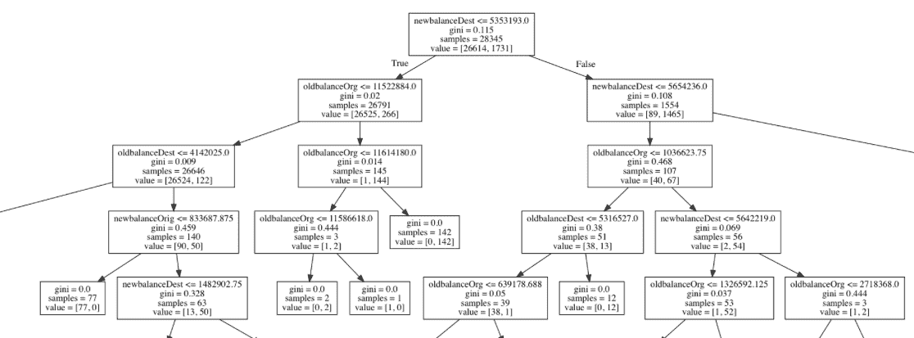

# 第七章：使用无监督机器学习进行数据聚类

您在实际应用中遇到的大部分数据都不会带有标签。如果数据没有标签，您无法应用有监督的机器学习技术。无监督机器学习通过将数据分组为聚类来解决此问题；然后我们可以基于这些聚类分配标签。

一旦数据被聚类成特定数量的组，我们就可以继续为这些组分配标签。无监督学习是您作为数据科学家需要实施的第一步，之后才能应用有监督的机器学习技术（如分类）进行有意义的预测。

无监督机器学习算法的一个常见应用是客户数据，这些数据可以在各行各业中找到。作为数据科学家，您的工作是找到可以细分的客户群体，并向其推送有针对性的产品和广告。

在本章中，您将学习以下主题：

+   k-means 算法及其内部工作原理，用于对无标签数据进行聚类

+   在 scikit-learn 中实现 k-means 算法

+   使用特征工程优化无监督机器学习

+   聚类可视化

+   从无监督学习到有监督学习

# 技术要求

您需要在系统中安装 Python 3.6 或更高版本，Pandas ≥ 0.23.4，Scikit-learn ≥ 0.20.0，NumPy ≥ 1.15.1，Matplotlib ≥ 3.0.0，Pydotplus ≥ 2.0.2，Image ≥ 3.1.2，Seaborn ≥ 0.9.0 和 SciPy ≥ 1.1.0。

本章的代码文件可以在 GitHub 上找到：

[`github.com/PacktPublishing/Machine-Learning-with-scikit-learn-Quick-Start-Guide/blob/master/Chapter_07.ipynb`](https://github.com/PacktPublishing/Machine-Learning-with-scikit-learn-Quick-Start-Guide/blob/master/Chapter_07.ipynb)[.](https://github.com/PacktPublishing/Machine-Learning-with-scikit-learn-Quick-Start-Guide/blob/master/Chapter_07.ipynb)

请观看以下视频，查看代码的实际应用：

[`bit.ly/2qeEJpI`](http://bit.ly/2qeEJpI)

# k-means 算法

在本节中，您将学习 k-means 算法的工作原理，以便将数据聚类成有逻辑意义的组。

让我们考虑一组点，如下图所示：


一组随机点

# 质心分配

算法的第一步是分配一组随机质心。假设我们要找到两个不同的聚类或组，算法可以分配两个质心，如下图所示：


由星号表示的质心

在前面的图示中，星号代表算法的质心。请注意，在这种情况下，聚类的中心完美地符合两个不同的组。这是最理想的情况。实际上，均值（或质心）是随机分配的，并且在每次迭代中，聚类的质心都会向两个组的中心靠近。

这个算法被称为 k-means 算法，因为我们试图找到一组点的均值作为质心。由于均值只能针对一组数值点计算，因此这种聚类算法只能处理数值数据。

实际上，将这些点分组为两个不同的聚类并不像看起来那么简单。该过程的可视化表示可以如下所示：


k-means 算法中分配质心的过程

在前面的图示中，随机分配质心的过程从左上角开始。随着我们向下并朝右上角移动，请注意质心如何逐渐靠近两个不同组的中心。实际上，算法没有一个最佳的终止点来停止迭代。

# 算法什么时候停止迭代？

通常，算法会寻找两个度量标准，以停止迭代过程：

+   形成的不同组（或聚类）之间的距离

+   每个点与聚类质心之间的距离

聚类形成的最佳情况是，当不同组或聚类之间的距离尽可能大，而每个点与聚类质心之间的距离尽可能小。

# 在 scikit-learn 中实现 k-means 算法

现在你已经理解了 k-means 算法的内部工作原理，我们可以继续在 scikit-learn 中实现它。我们将使用在之前章节中使用的相同的欺诈检测数据集。关键的区别是，我们将丢弃包含标签的目标特征，并识别用于检测欺诈的两个聚类。

# 创建基础 k-means 模型

为了将数据集加载到工作空间并丢弃包含标签的目标特征，我们使用以下代码：

```py
import pandas as pd
#Reading in the dataset
df = pd.read_csv('fraud_prediction.csv')
#Dropping the target feature & the index
df = df.drop(['Unnamed: 0', 'isFraud'], axis = 1)
```

接下来，我们可以实现具有两个聚类均值的 k-means 算法。选择使用两个聚类均值是任意的，因为我们知道应该有两个不同的聚类，分别对应两个标签：欺诈和非欺诈交易。我们可以通过以下代码来实现：

```py
from sklearn.cluster import KMeans
#Initializing K-means with 2 clusters
k_means = KMeans(n_clusters = 2)
#Fitting the model on the data
k_means.fit(df)
```

在之前的代码中，首先，我们从 scikit-learn 中导入`KMeans`包并初始化一个具有两个聚类的模型。然后，我们使用`.fit()`函数将该模型拟合到数据上。这将产生一组标签作为输出。我们可以使用以下代码提取这些标签：

```py
#Extracting labels 
target_labels = k_means.predict(df)
#Printing the labels
target_labels
```

上述代码生成的输出是每个移动交易的标签数组，如下所示：


标签数组

现在我们有了一组标签，我们知道每个交易属于哪个聚类。标签为 `0` 的移动交易属于一组，而标签为 `1` 的交易属于第二组。

# 最佳的聚类数量

在解释 k-means 算法如何工作的过程中，我们提到过，当算法找到最佳的聚类数量时，它会终止。然而，当使用 scikit-learn 随机选择聚类时，这种情况并不总是成立。在这种情况下，我们需要找到最佳的聚类数量。

我们可以通过一种被称为**惯性**的度量来实现这一点。惯性度量的是聚类中数据点与其质心的接近程度。显然，较低的惯性意味着组或聚类紧密地聚集在一起，这样是比较好的。

为了计算模型的惯性值，我们使用以下代码：

```py
# Inertia of present model
k_means.inertia_
```

上述代码产生了一个惯性值为 *4.99 × 10 ^ 17*，这个值相对于其他不同聚类数所产生的惯性值来说极大（后面会解释），因此不是一个好的惯性值。这表明个别数据点分布较广，并没有紧密地聚集在一起。

在大多数情况下，我们并不确切知道最佳的聚类数量，因此我们需要为不同的聚类数绘制惯性得分。我们可以通过以下代码来实现：

```py
import matplotlib.pyplot as plt
import seaborn as sns

#Initialize a list of clusters from 1 to 10 clusters 

clusters = [1,2,3,4,5,6,7,8,9,10]

#Create an empty list in order to store the inertia values 

inertia_values = []

for cluster in clusters:

    #Build a k-means model for each cluster value

    k_means = KMeans(n_clusters = cluster)

    #Fit the model to the data

    k_means.fit(df)

    # Store inertia value of each model into the empty list 

    inertia_values.append(k_means.inertia_)

# Plot the result

plt.lineplot(x = clusters, y = inertia_values)
plt.xlabel('Number of Clusters')
plt.ylabel('Inertia Value')
plt.title('Number of Clusters Vs. Inertia Values')
plt.show()
```

这将产生以下图表：


惯性作为聚类数的函数

在上面的代码中，首先，我们创建了一个包含 1 到 10 值的聚类列表。每个值表示将用于机器学习模型中的聚类数量。接着，我们创建了一个空列表，用来存储每个模型所产生的惯性值。

接下来，我们遍历聚类列表，并为列表中每个聚类值构建并评估一个 k-means 模型。每个模型现在会产生一个惯性值，该值会存储在我们在代码块开始时初始化的列表中。然后，使用 `matplotlib` 绘制一个简单的折线图，x 轴为聚类数，y 轴为相应的惯性值。

该图表告诉我们，当聚类数为 10 时，惯性值最低。然而，拥有过多的聚类也是我们需要避免的事情，因为过多的组别并不能帮助我们很好地进行泛化，而且每个组别的特征会变得非常具体。

因此，选择问题的最佳聚类数量的理想方式是，假设我们事先没有关于我们想要的组数的先验信息，找到图中的**肘部点**。

肘部点是惯性值减少速率减缓的那个点。肘部点在下图中得到了说明：


图表的肘部点

在前面的图表中，很明显肘部点对应于四个聚类。这可能意味着除了标准的“欺诈”和“非欺诈”分类外，存在四种不同类型的欺诈交易。然而，由于我们事先知道数据集有一个二元目标特征，包含两个类别，我们不会深入探讨为什么四个聚类是该数据集的理想聚类数。

# 优化的特征工程

数据集中的特征工程是一个基本概念，用于提高模型的性能。将特征调整到算法设计的最佳状态是有益的，因为它可以提高准确性，同时减少泛化误差。你将学习到的几种用于优化数据集的特征工程技术如下：

+   缩放

+   主成分分析

# 缩放

缩放是标准化数据的过程，使每个特征下的值落在某个特定范围内，如-1 到+1\. 为了缩放数据，我们用某一特征的每个值减去该特征的均值，再除以该特征的方差。为了缩放我们欺诈检测数据集中的特征，我们使用以下代码：

```py
from sklearn.preprocessing import StandardScaler

#Setting up the standard scaler 

scale_data = StandardScaler()

#Scaling the data

scale_data.fit(df)

df_scaled = scale_data.transform(df)

#Applying the K-Means algorithm on the scaled data

#Initializing K-means with 2 clusters

k_means = KMeans(n_clusters = 2)

#Fitting the model on the data

k_means.fit(df_scaled)

# Inertia of present model

k_means.inertia_
```

在前面的代码中，我们使用`StandardScalar()`函数来缩放我们的数据框，然后我们在缩放后的数据上构建了一个包含两个聚类的 k-means 模型。评估模型的惯性后，输出的值为 295,000，明显优于没有缩放时模型输出的*4.99 × 10¹⁷*。

然后，我们可以使用与之前相同的代码绘制聚类数与惯性值的图表，唯一的不同是将原始数据框替换为缩放后的数据框：

```py
#Initialize a list of clusters from 1 to 10 clusters 

clusters = [1,2,3,4,5,6,7,8,9,10]

#Create an empty list in order to store the inertia values 

inertia_values = []

for cluster in clusters:

    #Build a k-means model for each cluster value

    k_means = KMeans(n_clusters = cluster)

    #Fit the model to the data

    k_means.fit(df_scaled)

    # Store inertia value of each model into the empty list 

    inertia_values.append(k_means.inertia_)

# Plot the result

sns.lineplot(x = clusters, y = inertia_values)
plt.xlabel('Number of Clusters')
plt.ylabel('Inertia Value')
plt.title('Number of Clusters Vs. Inertia Values')
plt.show()
```

这将产生以下输出：


缩放后的聚类最佳数量

我们注意到，前面的图表并没有一个非常明显的肘部点，在这个点上惯性值的下降速率较低。然而，如果我们仔细观察，可以在 8 个聚类处找到这个点。

# 主成分分析

**主成分分析**（**PCA**）是降维的一个子集。**降维**是指减少对预测模型没有预测价值的特征的过程。我们还优化并提高了算法处理的计算效率。这是因为一个特征较少的数据集会让算法更容易更快地检测到模式。

PCA 的第一步叫做**去相关化**。相互高度相关的特征对预测模型没有价值。因此，在去相关化步骤中，PCA 将两个高度相关的特征的数据点展开，使其在轴上对齐，并且不再相关。这个过程可以如下图所示：


去相关化过程

一旦特征被去相关化，主成分（或特征）就会从数据中提取出来。这些特征具有较高的方差，并且提供了对预测模型最有价值的信息。方差较低的特征会被丢弃，因此数据集的维度数量减少。

为了使用 PCA 进行降维，我们使用以下代码：

```py
from sklearn.decomposition import PCA

#Initialize a PCA model with 5 features 

pca_model = PCA(n_components = 5)

#Fit the model to the scaled dataframe

pca_model.fit(df_scaled)

#Transform the features so that it is de-correlated

pca_transform = pca_model.transform(df_scaled)

#Check to see if there are only 5 features

pca_transform.shape
```

在前面的代码中，首先，我们从 scikit-learn 导入`PCA`方法。接下来，我们初始化一个具有五个主成分的 PCA 模型。在这里，我们指定要将数据集减少到仅包含五个最重要的特征。

然后，我们将 PCA 模型拟合到数据框并进行转换，以获得去相关的特征。检查最终特征数组的形状，我们可以看到它只有五个特征。最后，我们使用仅包含主成分特征的 k-means 模型，如下所示的代码所示：

```py
#Applying the K-Means algorithm on the scaled data

#Initializing K-means with 2 clusters

k_means = KMeans(n_clusters = 2)#Fitting the model on the data

k_means.fit(pca_transform)

# Inertia of present model

k_means.inertia_
```

评估新模型的惯性改善了其性能。我们得到了比缩放模型更低的惯性值。现在，让我们评估不同主成分或特征数量的惯性分数。为此，我们使用以下代码：

```py
#Initialize a list of principal components

components = [1,2,3,4,5,6,7,8,9,10]

#Create an empty list in order to store the inertia values 

inertia_values = []

for comp in components:

    #Initialize a PCA model

    pca_model = PCA(n_components = comp)

    #Fit the model to the dataframe

    pca_model.fit(df_scaled)

    #Transform the features so that it is de-correlated

    pca_transform = pca_model.transform(df_scaled)

    #Build a k-means model 

    k_means = KMeans(n_clusters = 2)

    #Fit the model to the data

    k_means.fit(pca_transform)

    # Store inertia value of each model into the empty list 

    inertia_values.append(k_means.inertia_)

# Plot the result

sns.lineplot(x = components, y = inertia_values)
plt.xlabel('Number of Principal Components')
plt.ylabel('Inertia Value')
plt.title('Number of Components Vs. Inertia Values')
plt.show()
```

在前面的代码中，适用以下内容：

1.  首先，我们初始化一个列表，用于存储我们想用来构建模型的不同主成分值。这些值从 1 到 10。

1.  接下来，我们初始化一个空的列表，用于存储每个模型的惯性值。

1.  使用每个主成分值，我们构建一个新的 k-means 模型，并将该模型的惯性值附加到空列表中。

1.  最后，绘制惯性值与不同主成分值之间的关系图。

该图像如下所示：


惯性值与主成分数量的关系

在前面的图中，可以清楚地看到，惯性值在一个主成分时最小。

# 聚类可视化

当数据集中的变量/维度非常多时，直观展示你的聚类是一个不容易的任务。有两种主要方法可以用来可视化聚类的分布，如下所示：

+   **t-SNE**：在二维空间中创建数据集的地图

+   **层次聚类**：使用基于树的可视化方式，称为**树状图**，来创建层次结构

在本节中，您将学习如何实现这些可视化技术，以创建引人注目的集群可视化效果。

# t-SNE

**t-SNE** 是 **t-分布随机邻域嵌入** 的缩写。t-SNE 的基本概念是将高维度映射到二维空间。简单来说，如果您的数据集具有超过两个特征，t-SNE 将非常适合显示您的整个数据集如何在计算机屏幕上可视化！

第一步是实现 k-means 算法，并创建一组我们可以合并到未标记数据集中的预测标签。我们可以通过使用以下代码来实现这一点：

```py
#Reading in the dataset

df = pd.read_csv('fraud_prediction.csv')

#Dropping the target feature & the index

df = df.drop(['Unnamed: 0', 'isFraud'], axis = 1)

#Initializing K-means with 2 clusters

k_means = KMeans(n_clusters = 2)

#Fitting the model on the data

k_means.fit(df)

#Extracting labels 

target_labels = k_means.predict(df)

#Converting the labels to a series 

target_labels = pd.Series(target_labels)

#Merging the labels to the dataset

df = pd.merge(df, pd.DataFrame(target_labels), left_index=True, right_index=True)

#Renaming the target 

df['fraud'] = df[0]
df = df.drop([0], axis = 1)
```

暂时不要担心前面代码段的工作原理，因为在本章的后续部分中，我们将详细解释如何将无监督机器学习问题转换为监督学习问题。

接下来，我们将创建一个 t-SNE 对象，并将其拟合到我们仅包含特征的数据点数组中。然后，我们同时转换这些特征，以便可以在二维空间中查看所有特征。这在以下代码段中完成：

```py
from sklearn.manifold import TSNE

#Creating the features

features = df.drop('fraud', axis = 1).values

target = df['fraud'].values

#Initialize a TSNE object

tsne_object = TSNE()

#Fit and transform the features using the TSNE object

transformed = tsne_object.fit_transform(features)
```

在前述代码中，以下内容适用：

1.  首先，我们通过使用 `TSNE()` 函数初始化 t-SNE 对象。

1.  使用 t-SNE 对象，我们使用 `fit_transform()` 方法对我们的特征数据进行拟合和转换。

接下来，我们使用以下代码创建 t-SNE 可视化：

```py
#Creating a t-SNE visualization

x_axis = transformed[:,0]

y_axis = transformed[:,1]

plt.scatter(x_axis, y_axis, c = target)

plt.show()
```

在前述代码中，以下内容适用：

1.  我们从转换特征集中提取第一和第二个特征，分别作为 x 轴和 *y* 轴。

1.  然后，我们绘制散点图，并根据先前使用 k-means 算法生成的目标标签对其进行着色。这生成以下图表：


t-SNE 可视化

在前述图中，黄色表示被分配欺诈标签的交易，而紫色表示被分配非欺诈标签的交易。（请参考图像的彩色版本。）

# 层次聚类

如最初讨论的那样，层次聚类技术使用树状图来可视化集群或群组。为了解释树状图的工作原理，我们将考虑一个具有四个特征的数据集。

# 第一步 – 将每个特征作为单独的集群

在第一步中，数据集中的每个特征被认为是其自己的集群。这在以下图表中有所说明：


每个特征作为树状图中的单个集群

每个前面图表中的特征都是一个单独的集群，现阶段如此。此算法现在搜索找到彼此最接近的两个特征，并将它们合并成一个单独的集群。

# 第二步 – 合并

在这一步骤中，算法将两个最接近的特征中的数据点合并到一个聚类中。这个过程在下面的图示中有所体现：


特征合并为单一聚类的过程

在前面的图示中，很明显算法已经选择了**特征 2**和**特征 3**，并决定这两个特征下的数据是彼此最接近的。

# 第 3 步 – 迭代

现在，算法继续迭代合并特征，直到无法再形成任何聚类。最终形成的树状图如下所示：

在前面的图示中，**特征 2**和**特征 3**被归为一个单一的聚类。然后，算法决定**特征 1**和**特征 2**与**特征 3**的聚类是最接近的。因此，这三个特征被归为一个组。最后，**特征 4**与**特征 3**聚为一组。

# 实现层次聚类

现在你已经学习了层次聚类是如何工作的，我们可以实现这个概念。为了创建一个层次聚类，我们使用以下代码：

```py
from scipy.cluster.hierarchy import linkage
from scipy.cluster.hierarchy import dendrogram
import numpy as np
import matplotlib.pyplot as plt 

#Creating an array of 4 features

array = np.array([[1,2,3,4], [5,6,7,8], [2,3,4,5], [5,6,4,3]])

feature_names = ['a', 'b', 'c', 'd']

#Creating clusters

clusters = linkage(array, method = 'complete')

#Creating a dendrogram

dendrogram(clusters, labels = feature_names, leaf_rotation = 90)

plt.show()
```

前面的代码将生成一个树状图，如下面的图示所示：


树状图

在前面的代码中，以下内容适用：

1.  首先，我们创建一个包含四列的数组。

1.  然后，我们使用`linkage`函数创建聚类。在函数中，我们将`method`参数设置为 complete，以表示我们想要整个树状图。

1.  最后，我们使用`dendrogram`函数创建带有聚类的树状图。我们将标签名称设置为之前在代码中创建的特征名称列表。

# 从无监督学习到监督学习

无监督学习的最终目标是获取一个没有标签的数据集，并为数据集的每一行分配标签，以便我们可以通过它运行监督学习算法。这使我们能够创建利用这些标签的预测。

在本节中，你将学习如何将无监督机器学习算法生成的标签转换为一个使用这些标签的决策树。

# 创建标注数据集

第一步是将无监督机器学习算法（如 k-means 算法）生成的标签转换，并将其附加到数据集中。我们可以使用以下代码来实现：

```py
#Reading in the dataset

df = pd.read_csv('fraud_prediction.csv')

#Dropping the target feature & the index

df = df.drop(['Unnamed: 0', 'isFraud'], axis = 1)
```

在前面的代码中，我们读取了欺诈检测数据集，并删除了目标列和索引列：

```py
#Initializing K-means with 2 clusters

k_means = KMeans(n_clusters = 2)

#Fitting the model on the data

k_means.fit(df)
```

接下来，在前面的代码中，我们初始化并拟合了一个具有两个聚类的 k-means 模型：

```py
#Extracting labels 

target_labels = k_means.predict(df)

#Converting the labels to a series 

target_labels = pd.Series(target_labels)

#Merging the labels to the dataset

df = pd.merge(df, pd.DataFrame(target_labels), left_index=True, right_index=True)
```

最终，我们通过使用`predict()`方法创建目标标签，并将其转换为`pandas`系列。然后我们将这个系列合并到数据框中，以便创建我们的标注数据集。

# 构建决策树

既然我们已经有了标注的数据集，我们可以创建一个决策树，将无监督学习问题转化为有监督学习问题。

为了做到这一点，我们从所有必要的包导入开始，如下所示的代码所示：

```py
from sklearn.tree import DecisionTreeClassifier
from sklearn.externals.six import StringIO
from IPython.display import Image
from sklearn.tree import export_graphviz
import pydotplus
from sklearn import tree
```

接下来，我们将目标列重命名为适当的名称（当我们合并由 k-means 算法创建的目标标签时，默认生成了 `0` 作为名称）。我们可以通过以下代码来实现：

```py
#Renaming the target 

df['fraud'] = df[0]
df = df.drop([0], axis = 1)
```

接下来，我们使用以下代码构建决策树分类算法：

```py
#Creating the features

features = df.drop('fraud', axis = 1).values

target = df['fraud'].values

#Initializing an empty DT classifier with a random state value of 42

dt_classifier = DecisionTreeClassifier(criterion = 'gini', random_state = 42)

#Fitting the classifier on the training data 

dt_classifier.fit(features, target)

```

在前面的代码中，首先，我们创建了特征和目标变量，并初始化了一个决策树分类器。然后，我们将分类器拟合到特征和目标上。

最后，我们希望可视化决策树。我们可以通过以下代码来实现：

```py
#Creating a data frame with the features only

features = df.drop('fraud', axis = 1)

dot_data = tree.export_graphviz(dt_classifier, out_file=None, feature_names= features.columns)

# Draw graph

graph = pydotplus.graph_from_dot_data(dot_data)

#Show graph 

Image(graph.create_png())
```

这导致了下图所示的决策树：



创建的决策树的一部分

# 总结

在本章中，你了解了 k-means 算法的工作原理，以便将未标记的数据点聚类到不同的群组中。接着，你学会了如何使用 scikit-learn 实现这一点，并扩展了实现中的特征工程部分。

在学习如何使用层次聚类和 t-SNE 可视化聚类之后，你又学会了如何将多维数据集映射到二维空间。最后，你学习了如何使用决策树将无监督学习问题转化为有监督学习问题。

在接下来的（也是最后一章），你将学习如何正式评估到目前为止你所构建的所有机器学习算法的性能！
