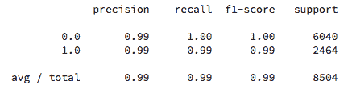
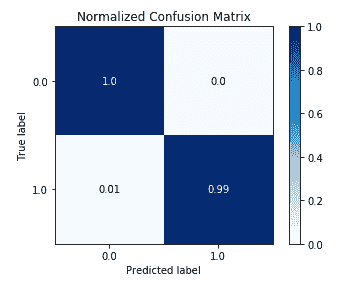

# 第八章：性能评估方法

性能评估的方法会根据你选择实现的机器学习算法类型有所不同。一般来说，针对分类、回归和无监督机器学习算法，会有不同的评估指标来衡量你的模型在特定任务上的表现。

在本章中，我们将探索不同的性能评估方法，帮助你更好地理解模型。章节将分为以下三个部分：

+   分类算法的性能评估

+   回归算法的性能评估

+   无监督算法的性能评估

# 技术要求

你需要在系统中安装 Python 3.6 或更高版本、Pandas ≥ 0.23.4、Scikit-learn ≥ 0.20.0、NumPy ≥ 1.15.1、Matplotlib ≥ 3.0.0，以及 Scikit-plot ≥ 0.3.7。

本章的代码文件可以在 GitHub 上找到：

[`github.com/PacktPublishing/Machine-Learning-with-scikit-learn-Quick-Start-Guide/blob/master/Chapter_08.ipynb`](https://github.com/PacktPublishing/Machine-Learning-with-scikit-learn-Quick-Start-Guide/blob/master/Chapter_08.ipynb)

查看以下视频，看看代码的实际效果：

[`bit.ly/2EY4nJU`](http://bit.ly/2EY4nJU)

# 为什么性能评估至关重要？

理解为什么我们首先需要评估模型的性能是非常关键的。以下是一些可能的原因，说明为什么性能评估至关重要：

+   **它防止过拟合**：过拟合发生在算法过度拟合数据，并做出仅针对一个数据集的特定预测。换句话说，模型无法将预测推广到它未接触过的数据。

+   **它防止欠拟合**：这恰恰与过拟合相反。在这种情况下，模型的性质非常通用。

+   **理解预测**：性能评估方法将帮助你更详细地了解模型是如何做出预测的，以及这些预测的性质和其他有用信息，例如模型的准确性。

# 分类算法的性能评估

为了评估分类算法的性能，我们可以考虑在本书中构建的两种分类算法：k 最近邻和逻辑回归。

第一步是将这两种算法实现到欺诈检测数据集中。我们可以通过以下代码来实现：

```py
import pandas as pd
from sklearn.model_selection import train_test_split
from sklearn.neighbors import KNeighborsClassifier
from sklearn import linear_model

#Reading in the fraud detection dataset 

df = pd.read_csv('fraud_prediction.csv')

#Creating the features 

features = df.drop('isFraud', axis = 1).values
target = df['isFraud'].values

#Splitting the data into training and test sets 

X_train, X_test, y_train, y_test = train_test_split(features, target, test_size = 0.3, random_state = 42, stratify = target)

# Building the K-NN Classifier 

knn_classifier = KNeighborsClassifier(n_neighbors=3)

knn_classifier.fit(X_train, y_train)

#Initializing an logistic regression object

logistic_regression = linear_model.LogisticRegression()

#Fitting the model to the training and test sets

logistic_regression.fit(X_train, y_train)
```

在前面的代码中，我们将欺诈检测数据集读取到笔记本中，并将数据分成特征和目标变量，和往常一样。然后，我们将数据分为训练集和测试集，并在训练数据中构建 k 最近邻和逻辑回归模型。

在本节中，您将学习如何评估单一模型的性能：k-最近邻。您还将学习如何比较和对比多个模型。因此，您将学习以下内容：

+   混淆矩阵

+   规范化混淆矩阵

+   曲线下面积（`auc` 分数）

+   累积增益曲线

+   提升曲线

+   K-S 统计量图

+   校准图

+   学习曲线

+   交叉验证箱线图

本节中的一些可视化图表将需要一个名为 `scikit-plot` 的包。`scikit-plot` 包非常有效，专门用于可视化机器学习模型的各种性能指标。它特别为使用 scikit-learn 构建的模型而设计。

为了在本地机器上安装 `scikit-plot`，可以在终端使用 `pip` 安装，命令如下：

```py
pip3 install scikit-plot
```

如果您使用的是 Anaconda 发行版来管理您的 Python 包，可以通过以下代码安装 `scikit-plot`：

```py
conda install -c conda-forge scikit-plot
```

# 混淆矩阵

直到现在，我们一直使用准确率作为唯一的模型性能衡量标准。这是可以的，因为我们有一个平衡的数据集。平衡数据集是指每个类别的标签数量几乎相等。在我们正在处理的数据集中，8,000 个标签属于欺诈交易，12,000 个标签属于非欺诈交易。

假设有这样一种情况：90%的数据是非欺诈交易，只有 10%的交易是欺诈案件。如果分类器报告的准确率为 90%，这就没有意义，因为它所看到的大部分数据是非欺诈案件，而它看到的欺诈案件非常少。所以，即使它准确地分类了 90%的案件，也意味着它所分类的大多数案件将属于非欺诈案件。这对我们没有任何价值。

**混淆矩阵**是一种性能评估技术，可以用于处理数据集不平衡的情况。我们数据集的混淆矩阵如下所示：


欺诈交易的混淆矩阵

混淆矩阵的目标是最大化真正例和真负例的数量，因为这能给出正确的预测；它还最小化假阴性和假阳性的数量，因为它们给出的是错误的预测。

根据您的问题，假阳性可能比假阴性更为问题（反之亦然），因此，构建正确分类器的目标应该是以最佳的方式解决您的问题。

为了在 scikit-learn 中实现混淆矩阵，我们使用以下代码：

```py
from sklearn.metrics import confusion_matrix

#Creating predictions on the test set 

prediction = knn_classifier.predict(X_test)

#Creating the confusion matrix 

print(confusion_matrix(y_test, prediction))
```

这将产生如下输出：


我们分类器输出的欺诈交易混淆矩阵

在前面的代码中，我们使用 `.predict()` 方法对测试训练数据生成一组预测结果，然后对目标变量的测试集和之前创建的预测结果使用 `confusion_matrix()` 函数。

前面的混淆矩阵看起来几乎完美，因为大多数情况都被分类为真正例和真反例，沿着主对角线排列。只有 46 个案例被错误分类，而且这个数字几乎相等。这意味着假阳性和假阴性的数量最小且平衡，两者之间没有明显的偏向。这是理想分类器的一个例子。

从混淆矩阵中可以推导出的另外三个度量标准是**精准率**、**召回率**和**F1 分数**。较高的精准率表示较少的非欺诈交易被误分类为欺诈交易，而较高的召回率则表示大部分欺诈交易被正确预测。

F1 分数是精准率和召回率的加权平均值。

我们可以使用以下代码计算精准率和召回率：

```py
from sklearn.metrics import classification_report

#Creating the classification report 

print(classification_report(y_test, prediction))
```

这将产生以下输出：



分类报告

在前面的代码中，我们使用 `classification_report()` 函数，传入两个参数：目标变量的测试集和我们之前为混淆矩阵创建的预测变量。

在输出中，精准率、召回率和 F1 分数都很高，因为我们已经构建了理想的机器学习模型。这些值的范围从 0 到 1，1 为最高。

# 标准化混淆矩阵

**标准化混淆矩阵**使数据科学家更容易直观地理解标签是如何被预测的。为了构建标准化混淆矩阵，我们使用以下代码：

```py
import matplotlib.pyplot as plt
import scikitplot as skplt

#Normalized confusion matrix for the K-NN model

prediction_labels = knn_classifier.predict(X_test)
skplt.metrics.plot_confusion_matrix(y_test, prediction_labels, normalize=True)
plt.show()
```

这将产生以下标准化混淆矩阵：



K-NN 模型的标准化混淆矩阵

在前面的图中，预测标签位于 *x* 轴，而真实（或实际）标签位于 *y* 轴。我们可以看到，该模型对欺诈交易的预测错误率为 0.01，即 1%，而 99%的欺诈交易预测正确。我们还可以看到，K-NN 模型对所有非欺诈交易的预测准确率达到了 100%。

现在，我们可以通过使用标准化混淆矩阵来比较逻辑回归模型的表现，如下所示：

```py
#Normalized confusion matrix for the logistic regression model

prediction_labels = logistic_regression.predict(X_test)
skplt.metrics.plot_confusion_matrix(y_test, prediction_labels, normalize=True)
plt.show()
```

这将产生以下标准化混淆矩阵：


逻辑回归模型的标准化混淆矩阵

在前面的混淆矩阵中，可以明显看出，逻辑回归模型仅正确预测了 42%的非欺诈交易。这几乎立刻表明，K-NN 模型的表现更好。

# 曲线下的面积

这个曲线在本例中是**接收者操作特征**（**ROC**）曲线。这是一个表示真实正例率与假正例率之间关系的图。我们可以通过以下方式绘制该曲线：

```py
from sklearn.metrics import roc_curve
from sklearn.metrics import roc_auc_score
import matplotlib.pyplot as plt

#Probabilities for each prediction output 

target_prob = knn_classifier.predict_proba(X_test)[:,1]

#Plotting the ROC curve 

fpr, tpr, thresholds = roc_curve(y_test, target_prob)

plt.plot([0,1], [0,1], 'k--')

plt.plot(fpr, tpr)

plt.xlabel('False Positive Rate')

plt.ylabel('True Positive Rate')

plt.title('ROC Curve')

plt.show()
```

这会生成如下曲线：


ROC 曲线

在前面的代码中，首先，我们为每个预测标签创建一组概率。例如，预测标签 1 会有一组与之相关的概率，而标签 0 则有另一组概率。利用这些概率，我们使用`roc_curve()`函数，并结合目标测试集，来生成 ROC 曲线。

上面的曲线是一个完美的 ROC 曲线示例。该曲线的真实正例率为 1.0，表示预测准确，而假正例率为 0，表示没有错误预测。

这样的曲线通常具有最大的曲线下方区域，与准确度较低的模型曲线相比。为了计算曲线下面积得分，我们使用以下代码：

```py
#Computing the auc score 

roc_auc_score(y_test, target_prob)
```

这会产生 0.99 的得分。较高的`auc`得分表示模型表现更好。

# 累积增益曲线

在构建多个机器学习模型时，了解哪个模型产生了你期望的预测类型非常重要。**累积增益曲线**可以帮助你进行模型比较，通过告诉你某个类别/类在特定模型的样本数据中占据的百分比。

简单来说，在欺诈检测数据集中，我们可能希望选择一个能够预测更多欺诈交易的模型，而不是一个无法做到这一点的模型。为了构建 k 最近邻模型的累积增益图，我们使用以下代码：

```py
import scikitplot as skplt

target_prob = knn_classifier.predict_proba(X_test)
skplt.metrics.plot_cumulative_gain(y_test, target_prob)
plt.show()
```

这会生成以下图形：


k 最近邻模型的累积增益图

在前面的代码中，以下内容适用：

+   首先，我们导入`scikit-plot`包，它用于生成前面的图。然后，我们计算目标变量的概率，在本例中，这些概率表示某个特定移动交易是否为欺诈交易的可能性，基于测试数据。

+   最后，我们在这些概率和测试数据的目标标签上使用`plot_cumulative_gain()`函数，以生成前面的图。

我们如何解读前面的图形？我们只需寻找一个点，在该点上，数据中的某个百分比包含了 100%的目标类别。下图为此示意：


100%目标类别存在的点

前图中的点对应于*x*轴上的 0.3 和*y*轴上的 1.0。这意味着 30%到 100%的数据将包含目标类 1，即欺诈交易。

这也可以这样解释：如果你使用 K 最近邻模型，70%的数据将包含 100%的欺诈交易预测。

现在，让我们计算逻辑回归模型的累积增益曲线，看看它是否有所不同。为此，我们使用以下代码：

```py
#Cumulative gains plot for the logistic regression model

target_prob = logistic_regression.predict_proba(X_test)
skplt.metrics.plot_cumulative_gain(y_test, target_prob)
plt.show()
```

这产生了以下图形：


逻辑回归模型的累积增益图

前面的图与 K-NN 模型先前生成的累积增益图相似，都是 70%的数据包含 100%的目标类。因此，使用 K-NN 模型或逻辑回归模型都会得到类似的结果。

然而，使用累积增益图来比较不同模型的表现是一个好的实践，这样可以从根本上理解模型如何进行预测。

# 提升曲线

**提升曲线**可以告诉你，通过使用机器学习模型进行预测的效果如何，相较于不使用模型的情况。为了构建 K 最近邻模型的提升曲线，我们使用以下代码：

```py
# Lift curve for the K-NN model

target_prob = knn_classifier.predict_proba(X_test)
skplt.metrics.plot_lift_curve(y_test, target_prob)
plt.show()
```

这产生了以下图形：


K-NN 模型的提升曲线

我们如何解读前面的提升曲线呢？我们需要找到曲线下滑的点。以下图为您展示了这个点：


提升曲线中的兴趣点

在前面的图中，突出显示的点是我们在任何提升曲线中都要寻找的点。这个点告诉我们，当使用 K-NN 预测模型时，0.3 或 30%的数据比完全不使用任何模型预测欺诈交易时，表现要好 3.5 倍。

现在，我们可以构建逻辑回归模型的提升曲线，以便比较两种模型的表现。我们可以通过使用以下代码来实现：

```py
#Cumulative gains plot for the logistic regression model

target_prob = logistic_regression.predict_proba(X_test)
skplt.metrics.plot_lift_curve(y_test, target_prob)
plt.show()
```

这产生了以下图形：


逻辑回归模型的提升曲线

尽管该图告诉我们 30%的数据会看到性能改善（类似于我们之前构建的 K-NN 模型来预测欺诈交易），但在预测非欺诈交易时（蓝线）存在差异。

对于少部分数据，非欺诈交易的提升曲线实际上低于基线（虚线）。这意味着在预测非欺诈交易时，逻辑回归模型在少数数据上的表现甚至不如不使用预测模型。

# K-S 统计图

**K-S 统计图**，或称**科尔莫哥洛夫-斯米尔诺夫**统计图，是一种能够告诉你模型是否在预测数据集中不同标签时产生混淆的图。为了说明在这种情况下“混淆”是什么意思，我们将通过以下代码为 K-NN 模型构建 K-S 统计图：

```py
#KS plot for the K-NN model

target_proba = knn_classifier.predict_proba(X_test)
skplt.metrics.plot_ks_statistic(y_test, target_proba)
plt.show()
```

这将产生以下图：


K-NN 模型的 K-S 统计图

在前面的图中，以下内容适用：

+   虚线表示欺诈交易（底部的黄色线）和非欺诈交易（顶部的蓝色线）预测之间的距离。这一距离为 0.985，如图所示。

+   K-S 统计得分接近 1 通常是一个很好的指标，表明模型在预测这两种不同的目标标签时没有混淆，并且在预测标签时可以清楚地区分它们。

+   在前面的图中，可以观察到 0.985 的得分为两类预测之间的差异，最大可达 70%（0.7）的数据。这个差异可以在*X*轴上看到，因为 0.7 的阈值仍然具有最大分离距离。

现在我们可以计算逻辑回归模型的 K-S 统计图，以便比较这两个模型在预测两个类别标签之间的区分能力。我们可以通过以下代码来实现：

```py
#KS plot for the logistic regression model

target_proba = logistic_regression.predict_proba(X_test)
skplt.metrics.plot_ks_statistic(y_test, target_proba)
plt.show()
```

这将产生以下图：


逻辑回归模型的 K-S 统计图

尽管两个模型的分离分数相同，都是 0.985，但分离发生的阈值却有所不同。在逻辑回归模型中，这一距离仅出现在数据的下 43%部分，因为最大分离开始的阈值为 0.57，沿着*X*轴。

这意味着 K 近邻模型对于大约 70%的总数据，其距离较大，在预测欺诈交易时要比其他模型更为准确。

# 校准图

**校准图**，顾名思义，是用来告诉你模型的校准情况。一个校准良好的模型，其预测得分应该等于正类的比例（在此例中为欺诈交易）。为了绘制校准图，我们使用以下代码：

```py
#Extracting the probabilites that the positive class will be predicted

knn_proba = knn_classifier.predict_proba(X_test)
log_proba = logistic_regression.predict_proba(X_test)

#Storing probabilities in a list

probas = [knn_proba, log_proba]

# Storing the model names in a list 

model_names = ["k_nn", "Logistic Regression"]

#Creating the calibration plot

skplt.metrics.plot_calibration_curve(y_test, probas, model_names)

plt.show()
```

这将产生以下校准图：


两个模型的校准图

在前面的代码中，以下内容适用：

1.  首先，我们计算每个模型预测正类（欺诈交易）的概率。

1.  然后，我们将这些概率和模型名称存储在一个列表中。

1.  最后，我们使用`scikit-plot`包中的`plot_calibration_curve()`函数，结合这些概率、测试标签和模型名称，来创建校准图。

这将生成前面的校准图，解释如下：

+   虚线代表完美的校准图。这是因为在每个点，平均预测值的准确度与正类的比例完全一致。

+   从图中可以看出，k 近邻模型的校准效果明显优于逻辑回归模型的校准图。

+   这是因为 k 近邻模型的校准图比逻辑回归模型的校准图更接近理想的校准图。

# 学习曲线

**学习曲线**是一个图表，用于比较随着样本/行数的增加，训练准确率和测试准确率的变化。为了构建 K 近邻模型的学习曲线，我们使用以下代码：

```py
skplt.estimators.plot_learning_curve(knn_classifier, features, target)

plt.show()
```

这将生成以下图表：


K-NN 模型的学习曲线

在前面的曲线中，以下内容适用：

1.  当样本数为 15,000 时，训练得分和测试得分才是最高的。这表明即使我们只有 15,000 个样本（而不是 17,500 个），我们仍然能够得到最好的结果。

1.  任何少于 15,000 个样本的情况都会导致测试的交叉验证得分远低于训练得分，表明模型出现过拟合。

# 交叉验证箱形图

在这张图中，我们通过使用箱形图比较多个模型的交叉验证准确率得分。为此，我们使用以下代码：

```py
from sklearn import model_selection

#List of models

models = [('k-NN', knn_classifier), ('LR', logistic_regression)]

#Initializing empty lists in order to store the results
cv_scores = []
model_name_list = []

for name, model in models:

    #5-fold cross validation
    cv_5 = model_selection.KFold(n_splits= 5, random_state= 50)
    # Evaluating the accuracy scores
    cv_score = model_selection.cross_val_score(model, X_test, y_test, cv = cv_5, scoring= 'accuracy')
    cv_scores.append(cv_score)
    model_name_list.append(name)

# Plotting the cross-validated box plot 

fig = plt.figure()
fig.suptitle('Boxplot of 5-fold cross validated scores for all the models')
ax = fig.add_subplot(111)
plt.boxplot(cv_scores)
ax.set_xticklabels(model_name_list)
plt.show()
```

这将生成以下图表：


交叉验证箱形图

在前面的代码中，以下内容适用：

1.  首先，我们将要比较的模型存储在一个列表中。

1.  然后，我们初始化两个空列表，用于存储交叉验证准确率得分和模型名称的结果，以便后续使用，以便生成箱形图。

1.  然后，我们遍历模型列表中的每个模型，使用`model_selection.KFold()`函数将数据划分为五折交叉验证集。

1.  接下来，我们通过使用`model_selection.cross_val_scores()`函数提取五折交叉验证得分，并将得分和模型名称添加到我们在代码开头初始化的列表中。

    使用`model_selection.cross_val_scores()`函数，并将得分与模型名称一起追加到我们在代码开头初始化的列表中。

1.  最后，创建了一个箱形图，展示了交叉验证得分的箱形图。

我们创建的列表由五个交叉验证得分和模型名称组成。箱线图将这五个得分应用于每个模型，计算最小值、最大值、中位数、第一个四分位数和第三个四分位数，并以箱线图的形式展示。

在前面的图中，以下内容适用：

1.  很明显，K-NN 模型的准确度最高，并且最小值与最大值之间的差异最小。

1.  另一方面，逻辑回归模型在最小值和最大值之间的差异最大，并且在其准确度得分中也存在异常值。

# 回归算法的性能评估

有三个主要指标可以用来评估你构建的回归算法的性能，具体如下：

+   **均方绝对误差** (**MAE**)

+   **均方误差** (**MSE**)

+   **均方根误差** (**RMSE**)

在本节中，您将了解这三种指标是什么，它们是如何工作的，以及如何使用 scikit-learn 实现它们。第一步是构建线性回归算法。我们可以通过使用以下代码来实现：

```py
## Building a simple linear regression model

#Reading in the dataset

df = pd.read_csv('fraud_prediction.csv')

#Define the feature and target arrays

feature = df['oldbalanceOrg'].values
target = df['amount'].values

#Initializing a linear regression model 

linear_reg = linear_model.LinearRegression()

#Reshaping the array since we only have a single feature

feature = feature.reshape(-1, 1)
target = target.reshape(-1, 1)

#Fitting the model on the data

linear_reg.fit(feature, target)

predictions = linear_reg.predict(feature)
```

# 均方绝对误差

均方绝对误差的公式如下：


MAE 公式

在前面的公式中， 代表输出的真实值（或实际值），而  代表预测的输出值。因此，通过计算每一行数据中真实值和预测值之间的差异总和，然后将其除以观测数据的总数，得到绝对误差的均值。

为了在 scikit-learn 中实现 MAE，我们使用以下代码：

```py
from sklearn import metrics

metrics.mean_absolute_error(target, predictions)
```

在前面的代码中，scikit-learn 中 `metrics` 模块的 `mean_absolute_error()` 函数用于计算 MAE。它接受两个参数：真实输出（目标值）和预测输出（预测值）。

# 均方误差

均方误差的公式如下：


MSE 公式

前面的公式与我们看到的均方绝对误差公式相似，不同之处在于，我们不是计算真实值和预测值之间的绝对差异，而是计算它们差异的平方。

为了在 scikit-learn 中实现 MSE，我们使用以下代码：

```py
metrics.mean_squared_error(target, predictions)
```

我们使用 `metrics` 模块中的 `mean_squared_error()` 函数，传入真实输出值和预测值作为参数。均方误差对于检测较大的误差更有效，因为我们对误差进行了平方，而不仅仅依赖于差异。

# 均方根误差

均方根误差的公式如下：


前面的公式与均方误差（MSE）非常相似，唯一不同的是我们对 MSE 公式进行了平方根处理。

为了在 scikit-learn 中计算 RMSE，我们使用以下代码：

```py
import numpy as np

np.sqrt(metrics.mean_squared_error(target, predictions))
```

在前面的代码中，我们使用了`mean_squared_error()`函数来计算真实输出与预测结果之间的误差，然后通过使用`numpy`包中的`np.sqrt()`函数计算该值的平方根。

相较于 MAE 和 MSE，RMSE 是评估线性回归模型时最合适的指标，因为它能够检测到较大的误差，并且以输出单位表示该值。使用这三种指标中的任何一个时，关键的结论是，这些`metrics`给出的值应该尽可能低，表明模型的误差较小。

# 无监督算法的性能评估

在本节中，你将学习如何评估无监督机器学习算法的性能，例如 k-means 算法。第一步是构建一个简单的 k-means 模型。我们可以通过使用以下代码来完成：

```py
#Reading in the dataset

df = pd.read_csv('fraud_prediction.csv')

#Dropping the target feature & the index

df = df.drop(['Unnamed: 0', 'isFraud'], axis = 1)

#Initializing K-means with 2 clusters

k_means = KMeans(n_clusters = 2)

```

现在我们已经有了一个简单的 k-means 模型，其中包含两个聚类，我们可以继续评估该模型的性能。可以使用的不同可视化性能图表如下：

+   肘部图

+   轮廓分析图

在本节中，你将学习如何创建和解释上述每一个图表。

# 肘部图

为了构建肘部图，我们使用以下代码：

```py
skplt.cluster.plot_elbow_curve(k_means, df, cluster_ranges=range(1, 20))
plt.show()
```

这会生成如下图所示的图表：


肘部图

肘部图是一个图表，表示模型考虑的聚类数在*x*轴上，而平方误差总和则在*y*轴上。

在前面的代码中，以下内容适用：

+   我们使用`plot_elbow_curve()`函数，输入 k-means 模型、数据和我们想要评估的聚类数。

+   在这种情况下，我们定义了 1 到 19 个聚类的范围。

在前面的图表中，以下内容适用：

+   很明显，肘部点，或者说平方误差总和（*y*轴）开始非常缓慢下降的点，出现在聚类数为 4 时。

+   该图表还在*y*轴（右侧）提供了一个有趣的指标，即聚类时长（以秒为单位）。这表示算法创建聚类所花费的时间，单位为秒。

# 总结

在本章中，你学会了如何评估三种不同类型的机器学习算法的性能：分类、回归和无监督学习。

对于分类算法，你学会了如何通过一系列可视化技术评估模型的性能，例如混淆矩阵、归一化混淆矩阵、曲线下面积、K-S 统计图、累计增益图、提升曲线、校准图、学习曲线和交叉验证箱线图。

对于回归算法，你学习了如何通过三种度量标准来评估模型的性能：均方误差、平均绝对误差和均方根误差。

最后，对于无监督学习算法，你学习了如何通过使用肘部法则图来评估模型的性能。

恭喜你！你已经顺利完成了使用 scikit-learn 的机器学习之旅。你已经通过了八章内容，这些内容为你提供了快速入门的途径，帮助你进入了机器学习的奇妙世界，并使用了全球最受欢迎的机器学习框架之一：scikit-learn。

在本书中，你学习了以下主题：

+   什么是机器学习（简而言之），以及机器学习的不同类型和应用

+   监督学习算法，如 K-NN、逻辑回归、朴素贝叶斯、支持向量机和线性回归

+   无监督学习算法，如 k-means 算法

+   既能执行分类任务又能进行回归的算法，如决策树、随机森林和梯度提升树

我希望你能充分利用本书所提供的知识，应用这些知识，通过机器学习作为工具，解决许多现实世界中的问题！
