# 第二章：探索机器学习商业应用案例

作为一名机器学习从业者，对我而言，深入理解不同行业对于与商业和技术领导者进行有效沟通至关重要。这并不令人惊讶，因为任何机器学习解决方案架构的最终目标都是利用科学技术解决方案解决实际商业问题。因此，机器学习解决方案架构的主要关注领域之一是广泛了解不同的商业领域、工作流程和相关数据。没有这种理解，将难以理解数据，并为商业问题设计和开发实用的机器学习解决方案。

在本章中，我们将探讨多个行业垂直领域的各种现实世界机器学习应用案例。我们将分析金融服务业和零售等行业面临的关键业务工作流程和挑战，以及机器学习技术如何帮助解决这些挑战。本章的目标不是让你成为任何特定行业或其机器学习应用和技术的专家，而是让你接触到商业环境和工作流程中的现实世界机器学习应用案例。阅读本章后，你将能够将类似的分析思维应用于自己的业务领域中的机器学习解决方案。你将获得识别和评估在您的流程、过程和目标中机器学习技术如何提供价值的视角。跨行业案例和场景旨在激发如何利用机器学习解决您独特的商业挑战的想法，并拓宽你对机器学习机会的思考。

具体来说，本章将涵盖以下内容：

+   金融服务业的机器学习应用

+   媒体和娱乐领域的机器学习应用

+   医疗保健和生命科学领域的机器学习应用

+   制造领域的机器学习应用

+   零售领域的机器学习应用

+   汽车行业的机器学习应用

如果你已经作为一名机器学习从业者拥有丰富的经验，并对您所在行业的应用案例和解决方案有深入的了解，并且你对了解其他行业不感兴趣，你可能希望跳过本章，直接进入下一章，在那里我们将介绍机器学习算法。

# 金融服务业的机器学习应用

**金融服务行业**（**FSI**）始终处于技术创新的前沿，机器学习的采用也不例外。近年来，我们看到了各种机器学习解决方案在金融服务内部不同业务功能中的应用。例如，在资本市场，机器学习被用于前台、中台和后台，以辅助投资决策、交易优化、风险管理以及交易结算处理。在保险领域，公司正在使用机器学习简化承保、防止欺诈并自动化索赔管理。而在银行业，银行正在利用它来改善客户体验、打击欺诈并促进贷款审批决策。在接下来的章节中，我们将探讨金融服务内部的不同核心业务领域以及机器学习如何应用于克服一些这些业务挑战。

## 资本市场前台

在金融领域，前台是产生收入的业务领域，包括面向客户的角色，如证券销售、交易员、投资银行家和财务顾问。前台部门提供的产品和服务包括**并购**（**M&A**）和 IPO 咨询、财富管理和交易金融资产，如股票（例如，股票）、固定收益（例如，债券）、商品（例如，石油）和货币产品。让我们考察前台区域的一些具体业务功能。

### 销售交易和研究

在销售交易中，一家公司的销售团队会监控投资新闻，例如收益报告或并购活动，以识别为机构客户提供投资机会。交易团队随后为客户执行交易，这被称为代理交易。此外，交易团队还可以为其公司执行交易，这被称为**自营交易**。由于交易团队经常处理大量证券，优化交易策略以在不过度推高价格的情况下以有利价格获得股票至关重要。

研究团队通过分析股票和固定收益资产并提供建议来支持销售和交易团队。算法交易是另一种交易类型，它使用计算机根据预定义的逻辑和市场条件自动执行交易。

下图说明了销售交易台的业务流程以及不同参与者如何互动以完成交易活动：

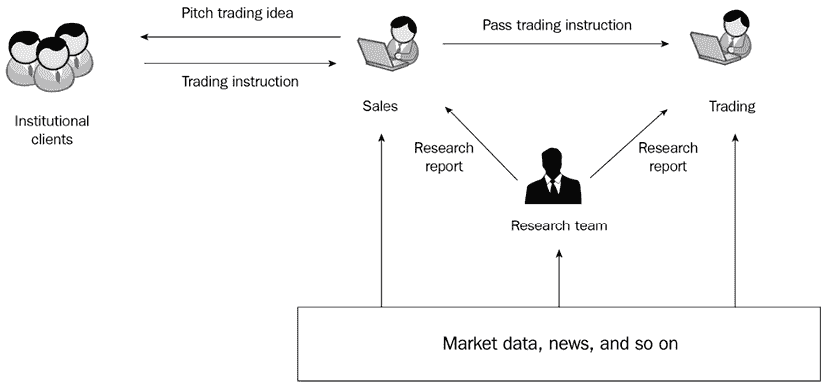

图 2.1：销售、交易和研究

在销售交易和研究领域，专业人士在日常工作中面临几个核心挑战。这些挑战围绕着生成准确的市场洞察、做出明智的投资决策以及实现最优的交易执行。以下是一些这些挑战的例子：

+   研究分析师面临紧迫的时间表以交付研究报告。

+   收集和分析大量市场信息，以制定交易策略和做出交易决策。

+   持续监控市场，以调整交易策略。

+   在不推动市场上下波动的情况下，以理想的价格实现最优交易。

销售交易和研究为机器学习提供了众多机会。通过利用**自然语言处理**（**NLP**）和日益增长的**大型语言模型**（**LLMs**），可以从各种数据源中自动提取关键实体，如人员、事件、组织和地点，例如**证券交易委员会**（**SEC**）的文件、新闻公告和收益电话会议记录。

自然语言处理（**NLP**）还可以通过分析大量新闻、研究报告和收益电话会议，发现实体之间的关系，评估市场对公司及其股票的情绪，从而为交易决策提供信息。由 LLMs 驱动的**自然语言生成**（**NLG**）可以帮助进行叙事写作和报告生成，而计算机视觉已被用于从卫星图像等替代数据源中识别市场信号，以了解如零售客流量等商业模式。在交易中，机器学习模型可以筛选大量数据，以发现模式，从而为交易策略提供信息，例如对冲交易，使用公司基本面、交易模式和指标等技术指标。在交易执行过程中，机器学习模型可以帮助估计交易成本，并确定最优交易执行策略和路径，以最小化成本并优化利润。金融服务公司产生大量时间序列数据，如不同金融工具的价格，可用于发现市场信号和估计市场趋势。因此，机器学习已被应用于金融时间序列分类、预测金融工具和经济指标等用例。

### 投资银行

当公司、政府和机构需要资金来支持业务运营和增长时，他们会聘请投资银行家提供资本筹集服务（例如，股票或债券的出售）。以下图表说明了投资银行家和投资者之间的关系。除了资本筹集外，投资银行家还参与并购咨询，协助客户从开始到结束谈判和结构化并购交易。投资银行工作人员承担许多活动，如财务建模、业务估值、提案书生成和交易文件准备，以完成和执行投资银行交易。此外，他们还负责一般关系管理和业务发展管理活动。

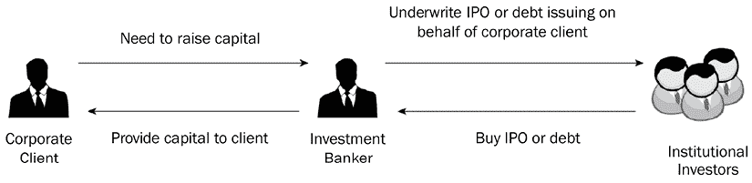

图 2.2：投资银行工作流程

投资银行工作流程在搜索和分析大量**结构化**（收益、现金流、估计）和**非结构化**数据（年报、文件、新闻和内部文件）方面提出了重大挑战。典型的初级银行家花费许多小时寻找可能包含有用信息的文件，并手动从文件中提取信息以准备提案书或进行财务建模。为了解决这个劳动密集型问题，投资银行一直在探索和采用机器学习解决方案。其中一个解决方案是使用自然语言处理（NLP）从大量 PDF 文档中自动提取结构化表格数据。具体来说，**命名实体识别**（NER）技术可以帮助从文档中自动提取实体。基于机器学习的阅读理解和问答技术可以帮助银行家使用自然人类问题快速准确地从大量文本中找到相关信息，而不是简单的文本字符串匹配。文档还可以通过机器学习技术自动标记元数据并进行分类，以改善文档管理和信息检索。此外，机器学习还可以帮助解决投资银行中的其他挑战，例如将来自不同数据源的公司标识符链接起来，以及解决公司名称的不同变体。

### 财富管理

财富管理（**WM**）业务涉及向客户提供建议，进行财富规划和结构化，以增长和保护客户的财富。与以投资咨询为重点的经纪公司不同，WM 公司还提供税务规划、财富保护和遗产规划，以满足客户更复杂的财务规划目标。WM 公司通过与客户沟通了解他们的生活目标和消费模式，为客户设计定制化的财务规划解决方案。然而，WM 公司在运营中面临各种挑战，例如：

+   WM 客户对他们的 WM 需求越来越要求全面和个性化的财务规划策略。

+   WM 客户越来越精通技术，许多人除了直接客户-顾问互动外，还要求新的互动渠道。

+   WM 顾问需要在保持相同个性化服务和规划的同时，覆盖越来越多的客户。

+   WM 顾问需要跟上市场趋势、多样化的客户需求和日益复杂的金融产品和服务组合，以满足客户需求。

WM 公司正在采用基于机器学习的解决方案，为客户提供更个性化的服务。通过分析客户的交易历史、投资组合详情、对话记录、投资偏好和人生目标，构建机器学习模型以推荐最合适的投资产品和服务。这些模型考虑客户接受提议的可能性以及如预期价值等业务指标，以建议下一步最佳行动。这使得财富管理公司能够为其客户提供定制化的财务规划解决方案。以下图表说明了**下一步最佳行动**方法的概念：

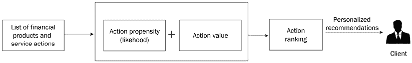

图 2.3：下一步最佳行动推荐

WM 公司也在越来越多地利用人工智能和机器学习来增强客户参与度和体验，自动化常规任务，并在客户互动期间为**财务顾问**（FAs）提供正确的知识。例如，公司正在构建虚拟助手，为客户提供个性化的答案并自动满足他们的请求。财务顾问正在配备基于人工智能的解决方案，可以将音频对话转录成文本以进行文本分析，评估客户的情绪，并提醒财务顾问潜在的客户流失。此外，正在采用智能搜索和问答技术，以便财务顾问在客户互动期间快速准确地找到相关信息。

## 资本市场后台运营

后台办公室是金融服务公司的支柱。虽然它可能不是面向客户的，但它处理着诸如交易结算、记录保存和合规监管等关键支持活动。因此，它是一个迅速采用机器学习的领域。凭借其带来的财务效益和成本节约，以及其提高合规性和内部控制的潜力，机器学习正在改变后台办公室。让我们探讨一些机器学习可以产生重大影响的业务流程。

### 净资产价值审查

提供共同基金和 ETF 的金融服务公司需要准确反映基金的值以用于交易和报告目的。他们使用**净资产价值**（NAV）计算，即实体的资产价值减去其负债，来表示基金的值。NAV 是投资者可以买卖基金的价格。每天，在市场关闭后，基金管理员必须以 100%的准确性计算 NAV 价格，这涉及五个关键步骤：

1.  股票核对

1.  反映任何公司行为

1.  对工具定价

1.  记账、计算和核对费用及利息累计，以及现金核对

1.  NAV/价格验证

下图展示了净资产价值审查流程：

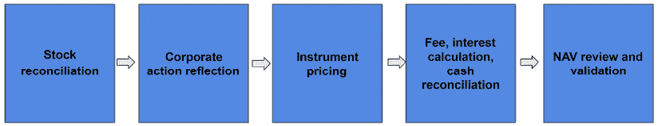

图 2.4：净资产价值审查流程

*第 5 步*是最关键的，因为如果操作不当，基金管理员可能需要承担责任，这可能导致向投资者支付赔偿金。然而，使用固定阈值标记异常的传统方法往往会导致大量误报，浪费分析师的时间。由于调查和审查过程中涉及的大量数据，包括工具价格、费用、利息、资产、现金头寸和公司行动数据，因此需要高效和准确的方法。

NAV 验证步骤的主要目标是检测定价异常，这可以被视为一个异常检测挑战。为了识别潜在的定价不规则性并将它们标记为需要进一步人工调查，金融服务公司已实施了基于机器学习的异常检测解决方案。这种方法已显示出显著减少误报并节省了大量人工审查人员的时间。

### 交易后结算失败预测

前台执行交易后，必须完成几个交易后流程以最终确定交易，例如结算和清算。在交易后结算期间，买方和卖方比较交易细节，批准交易，更新所有权记录，并安排证券和现金的转移。尽管大多数交易结算都是通过**直通处理**自动处理的，但由于各种原因，如卖方未能交付证券或买方支付失败，一些交易结算可能会失败。在这种情况下，经纪人可能需要使用他们的储备金来完成交易。为了确保库存水平设置正确，以便宝贵的资本可以用于其他地方，预测结算失败至关重要。

下图展示了买卖双方通过各自的经纪公司在一个交易所买卖证券的交易流程：

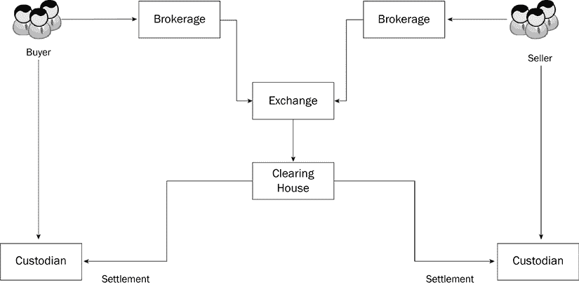

图 2.5：交易流程

交易执行后，清算所如 DTCC 将处理与买方和卖方各自的托管人之间的交易清算和结算。

经纪公司旨在通过维持适量的库存储备来优化交易率并降低资本支出成本。为了实现这一目标，利用机器学习模型在交易流程早期预测交易失败。有了这些预测，经纪人可以采取预防或纠正措施来防止或解决交易失败。

## 风险管理与欺诈

金融服务公司的中间办公室，包括投资银行和商业银行，包括风险管理和欺诈预防。由于这些领域在财务和监管方面具有重大影响，它们是金融服务中机器学习应用的主要领域之一。机器学习在欺诈预防和风险管理中有许多用例，例如检测洗钱、监控交易活动、识别信用卡交易欺诈和揭露保险索赔欺诈。在接下来的章节中，我们将更详细地探讨这些用例。

### 反洗钱

金融机构有义务通过检测有助于非法洗钱的活动来预防洗钱。**反洗钱**（**AML**）法规要求金融服务公司投入大量资源来对抗 AML 活动。传统上，基于规则的系统被用来检测 AML 活动，但它们的视野有限，只能检测到过去已知的欺诈行为。此外，在基于规则的系统中包含大量要评估的特征具有挑战性，并且难以随着新变化更新规则。基于机器学习的解决方案已在 AML 的多个领域得到应用，例如：

+   网络链接分析，揭示不同实体和司法管辖区之间复杂的社会和商业关系。

+   聚类分析，用于发现相似和不同的实体，以发现犯罪活动模式中的趋势。

+   基于深度学习的预测分析，用于识别犯罪活动。

+   自然语言处理（NLP），从大量非结构化数据源中收集尽可能多的信息。

以下图表展示了 AML 分析的流程、监管机构报告要求以及内部风险管理审计功能：

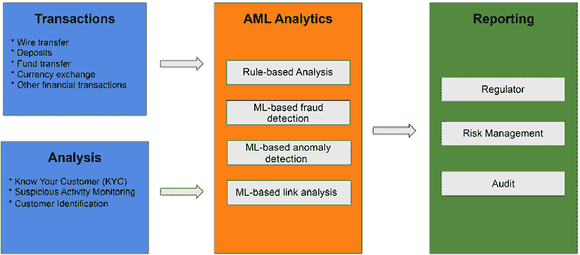

图 2.6：反洗钱检测流程

AML 平台从许多不同的来源获取数据，包括交易数据和内部分析数据，如**了解你的客户**（**KYC**）和**可疑活动**数据。这些数据经过处理并输入到不同的基于规则和机器学习的分析引擎中，以监控欺诈活动。然后，可以将发现结果发送到内部风险管理和审计，以及监管机构。

### 交易监控

金融机构的经纪人作为中介，代表客户买卖证券和其他金融工具。他们执行订单并就进入和退出金融头寸向客户提供咨询。为了防止交易员或金融机构进行市场操纵，采用**贸易监控**来识别和调查潜在的市场操纵行为。市场操纵的例子包括散布虚假和误导性信息、通过大量洗盘操纵交易量，以及通过披露非公开信息进行内幕交易。金融机构必须遵守如**市场操纵法规**（**MAR**）、**金融工具市场指令 II**（**MiFID II**）和其他内部合规性规定，以保护自身免受声誉和财务损失。由于高噪声/信号比和许多误报，执行贸易监控可能具有挑战性，这增加了案件处理和调查的成本。一种典型的滥用检测方法是构建复杂的基于规则的系统，具有不同的固定阈值用于决策。

有多种方法可以将贸易监控问题框架化为机器学习问题，包括：

+   将活动滥用检测框架化为分类问题，以取代基于规则的系统。

+   将从非结构化数据源（例如，电子邮件和聊天）中提取的数据提取信息（例如，受限股票）视为自然语言处理实体提取问题。

+   将实体关系分析（例如，市场滥用中的交易员-交易员合作）转化为基于机器学习的网络分析问题。

+   将滥用行为视为异常，并使用无监督机器学习技术进行异常检测。

许多不同的数据集可以用于构建贸易监控的机器学习模型，例如损益信息、头寸、订单簿详情、电子通信、交易员及其交易之间的链接信息、市场数据、交易历史，以及如交易对手详情、交易价格、订单类型和交易所等详细信息。

以下图表展示了金融服务公司内贸易监控管理的典型数据流和业务流程：

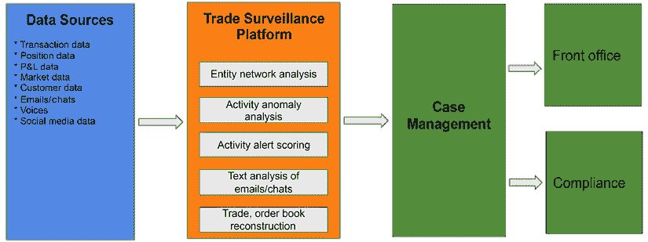

图 2.7：贸易监控流程

贸易监控系统监控许多不同的数据源，并将其发现反馈给前台和合规部门进行进一步调查和执行。

### 信用风险

银行在向企业和个人发放贷款时面临借款人无法支付所需贷款款项的风险。这导致银行在抵押贷款和信用卡贷款等活动中的本金和利息损失。为了减轻这种违约风险，银行利用信用风险建模来评估贷款风险，重点关注两个主要方面：

+   借款人违约贷款的概率。

+   对贷款人财务状况的影响。

传统的人工审核贷款申请既慢又容易出错，导致贷款处理成本高昂，以及由于错误的和缓慢的贷款审批处理而错失机会。以下图表描绘了一个典型的信用风险评估业务流程及其过程中的各种决策点：

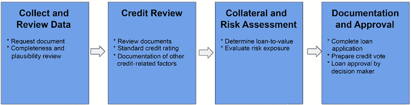

图 2.8：信用风险审批流程

为了减少与贷款相关的信用风险，许多银行广泛采用机器学习技术来更准确、更快速地预测贷款违约及其相关风险评分。信用风险管理建模过程包括从借款人收集财务信息，如收入、现金流、债务、资产和抵押品，信贷的使用以及其他信息，如贷款类型和贷款还款行为。然而，这个过程可能需要分析财务报表中的大量非结构化数据。为了应对这一挑战，基于机器学习的解决方案，如**光学字符识别**（**OCR**）和自然语言处理（NLP）信息提取和理解，已被广泛用于自动化智能文档处理。

## 保险

保险行业包括各种子行业，每个子行业提供独特的保险产品，如人寿保险、财产和意外伤害保险以及意外和健康保险。除了保险公司外，保险技术提供商也在行业中扮演着关键角色。大多数保险公司有两个主要业务流程，即保险承保和保险索赔管理。

### 保险承保

保险公司通过称为**保险承保**的过程评估为个人和资产提供保险覆盖的风险。利用精算数据和保险软件，保险公司确定他们愿意承担的风险的适当保险费率。承保过程因提供的保险产品而异。例如，财产保险承保过程中涉及到的步骤通常如下：

1.  客户通过代理人或直接向保险公司提交保险申请。

1.  保险公司的工作人员通过考虑申请人的损失和保险历史、以及精算因素来评估申请，以确定保险公司是否应该承担风险，以及风险的价格和保险费。然后，他们对政策进行额外的调整，例如保险金额和免赔额。

1.  如果申请被接受，则保险公司将颁发保险单。

在承保过程中，需要收集和审查大量数据，由承保人估计索赔的风险，并基于数据和个人经验来确定合理的保险费。然而，人类承保人在审查数据的能力上有限，可能会在决策过程中引入个人偏见。相比之下，机器学习模型可以分析大量数据，并就索赔概率和结果等风险因素做出更准确、基于数据的决策，同时比人类承保人做出更快的决策。此外，机器学习模型可以利用大量历史数据和风险因素来生成推荐的政策保险费，从而减少评估所需的时间。

### 保险索赔管理

**保险索赔管理**涉及评估保单持有人提出的索赔并提供根据保险合同规定的损失赔偿的过程。索赔过程中的具体步骤可能因保险类型而异。例如，在财产保险的情况下，通常遵循以下步骤：

1.  被保险人提交索赔，并附上支持证据，如损坏照片和警察报告（在汽车事故的情况下）。

1.  保险公司指派一名调整员来评估损坏的程度。

1.  调整员评估损坏情况，进行欺诈评估，并将索赔发送给支付批准。

在保险索赔管理过程中面临的一些主要挑战如下：

+   损坏/丢失物品清单过程和数据录入需要大量耗时的人工操作。

+   需要快速进行索赔损坏评估和调整。

+   保险欺诈。

保险公司在整个保险索赔过程中收集大量数据，例如财产详情、损坏物品的详细信息和照片、保险单、索赔历史和历史上的欺诈数据。

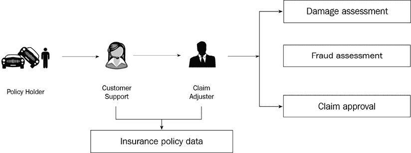

图 2.9：保险索赔管理流程

机器学习可以帮助自动化手动流程，例如从文档中提取数据和从图片中识别保险对象，这可以减少数据收集所需的手动工作量。对于损害评估，机器学习可以用来估算维修和更换的成本，从而加快索赔处理速度。此外，机器学习可以用来检测保险索赔中的异常并预测潜在的欺诈行为，这有助于在打击保险欺诈的斗争中识别需要进一步调查的案件。

# 媒体和娱乐领域的机器学习用例

媒体和娱乐（M&E）行业涵盖了各种形式的内容制作和分发，如电影、电视、流媒体内容、音乐、游戏和出版。由于流媒体和**点播**（OTT）内容交付在传统广播中的日益普及，该行业经历了重大变化。M&E 客户能够接触到不断增多的媒体内容选择，他们的消费习惯正在转变，并要求在不同设备上随时随地获得更加个性化和增强的体验。该行业也以激烈的竞争为特征，为了保持竞争力，M&E 公司需要识别新的货币化渠道、改善用户体验和提高运营效率。以下图表展示了媒体制作和分发的工作流程：

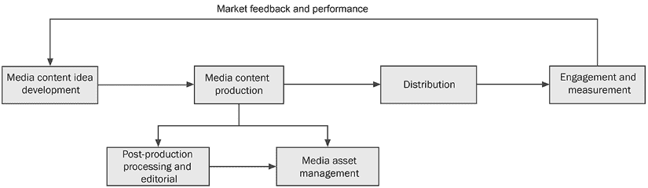

图 2.10：媒体制作和分发工作流程

近年来，我观察到媒体与娱乐（M&E）公司越来越多地在媒体生命周期的不同阶段采用机器学习，例如内容生成和内容分发，以提高效率和促进业务增长。例如，机器学习已被用于增强内容管理和搜索、开发新的内容开发、优化货币化和执行合规性与质量控制。

## 内容开发和制作

在电影制作生命周期初期的规划阶段，内容制作者需要根据预估的性能、收入和盈利能力等因素来决定下一个内容。为了辅助这一过程，电影制作者采用了基于机器学习的预测分析模型，通过分析如演员阵容、剧本、不同电影的过往表现以及目标受众等因素，来帮助预测新想法的流行度和盈利能力。这使得制作者能够迅速淘汰市场潜力有限的想法，并将精力集中在开发更有潜力和盈利性的想法上。

为了支持个性化的内容观看需求，内容制作者通常将长视频内容分割成围绕某些事件、场景或演员的小型微片段，以便它们可以单独分发或重新包装成更符合个人偏好的内容。这种基于机器学习的方法可以用来创建视频剪辑，通过检测场景、演员和事件等元素，为具有不同口味和偏好的不同目标受众创建视频。

## 内容管理和发现

拥有大量数字内容资产的媒体娱乐公司需要对其内容进行整理，以创造新的内容，从而开拓新的盈利机会。为此，这些公司需要丰富的元数据来描述数字资产，以便不同内容可以被搜索和发现。消费者也需要轻松且准确地搜索内容，以满足不同的使用需求，例如个人娱乐或研究。没有元数据标记，发现相关内容将非常具有挑战性。作为数字资产管理流程的一部分，许多公司雇佣人类来审查和标记这些内容，并添加有意义的元数据以实现内容的发现。然而，人工标记既昂贵又耗时，导致元数据不足，无法有效管理内容并实现内容发现。

计算机视觉模型可以自动为图像和视频内容标记诸如物体、类型、人物、地点或主题等项目。机器学习模型还可以解释文本内容的意义，如主题、情感、实体，有时甚至包括视频。可以使用机器学习技术将音频内容转录成文本，以便进行额外的文本分析。基于机器学习的文本摘要可以帮助您将长文本总结为内容元数据生成的一部分。以下图表说明了基于机器学习的分析解决方案可以如何融入媒体资产管理流程：

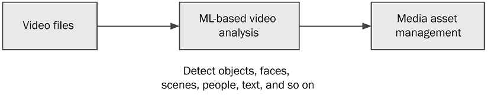

图 2.11：基于机器学习的媒体分析工作流程

基于机器学习的解决方案正越来越多地被媒体娱乐（M&E）公司采用，以简化媒体资产管理流程。总体而言，这些解决方案可以为 M&E 公司带来显著的时间和成本节约，同时提升消费者的用户体验。

## 内容分发和客户参与

现在，电影和音乐等媒体内容越来越多地通过数字**点播**（**VOD**）和不同设备上的直播进行分发，绕过了传统的媒体如 DVD 和广播，为消费者提供了各种媒体内容选择。因此，媒体公司面临着客户获取和保留的挑战。为了保持用户参与并留在他们的平台上，M&E 公司正专注于高度个性化的产品功能和内容。实现高度个性化参与的一个有效方法是通过内容推荐引擎，该引擎使用观看和参与行为数据来训练针对个人偏好和观看模式的目标 ML 模型。

这使得可以为用户推荐各种媒体内容，包括视频、音乐和游戏。

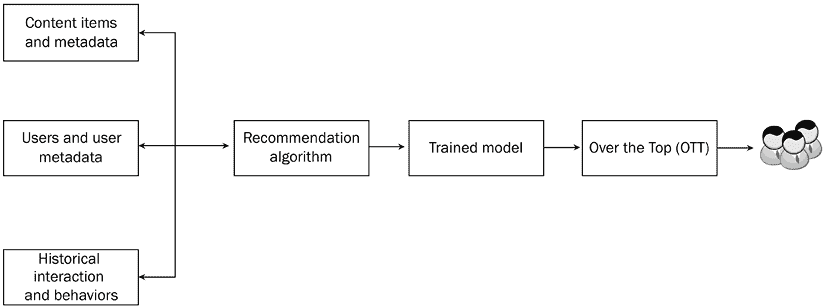

图 2.12：推荐 ML 模型训练

推荐技术已经存在多年，并且随着时间推移有了很大的改进。如今，推荐引擎可以使用多个数据输入来学习模式，包括历史交互、顺序模式和与用户和内容相关的元数据。现代推荐引擎还可以从用户的实时行为/决策中学习，并据此做出动态推荐。 

# 医疗保健和生命科学中的 ML 用例

医疗保健和生命科学行业是世界上最大和最重要的行业之一，为全球数百万人民提供服务。该行业涵盖广泛的领域，每个领域都有其独特的挑战和机遇。医疗保健和生命科学中最显著的领域之一是药物行业，包括生物技术公司、制药公司和基因药物制造商。这些公司负责开发和生产治疗各种疾病和疾病的药物，从轻微疾病到危及生命的情况。他们投入大量资金进行研发，以发现新药和疗法，通常需要大量的财务资源和多年的临床试验，才能将产品推向市场。

医疗保健和生命科学中的另一个重要领域是医疗设备行业，该行业制造从标准设备如注射器和绷带到高科技设备如 MRI 机器和手术机器人的各种产品。这些公司在创新的前沿，不断开发新技术以改善患者结果并推进医疗实践。

管理型医疗保健是医疗和生命科学行业中的另一个关键部门。这些公司提供健康保险政策，为他们的保单持有人覆盖医疗费用。该部门面临许多挑战，如不断上升的医疗保健成本和不断变化的法规，需要谨慎的管理和规划，以向保单持有人提供负担得起且有效的保障。

医疗设施，如医院、诊所和实验室，是医疗和生命科学行业中的另一个重要部门。这些设施为患者提供从常规检查到复杂手术的医疗护理和服务。它们需要大量资源来运营，如熟练的医疗人员、最先进的设备和先进的技术。

政府机构，如疾病控制与预防中心（**Centers for Disease Control and Prevention**，**CDC**）和食品药品监督管理局（**Food and Drug Administration**，**FDA**），在监管和监督医疗和生命科学行业方面发挥着关键作用。它们负责确保药物和医疗设备的安全性和有效性，监测公共卫生问题，并制定促进公共卫生和安全的政策。

近年来，医疗和生命科学行业在人工智能和机器学习的采用方面显著增加。这些技术已被用于解决行业中的复杂挑战，例如提高患者预后、降低成本以及加速药物发现和开发。随着大量健康数据的可用性，包括电子健康记录、基因组数据和医学影像，机器学习算法可以提取有意义的见解和模式，以指导临床决策、疾病诊断和治疗规划。通过这种方式，机器学习正在改变医疗和生命科学行业，使从业者和研究人员能够做出更明智的决策并改善患者预后。

## 医学影像分析

**医学影像**是创建人体视觉表示的过程和技术，用于医学分析。医学专业人员，如放射科医生和病理学家，使用医学影像协助进行医疗状况评估并开具医疗治疗方案。然而，对医学影像分析的需求不断增加导致合格的专业人员短缺。这一挑战部分通过在医学影像分析中采用机器学习得到解决。

一种基于机器学习的解决方案涉及将医学影像分析视为计算机视觉目标检测和分类问题。例如，在癌细胞检测的情况下，癌细胞组织可以在现有的医学影像中被识别并标记为计算机视觉算法的训练数据。

一旦训练完成，这些模型可以用于自动筛选大量 X 光图像，突出那些病理学家需要审查的重要图像。这种方法有可能提高医学影像分析的效率和准确性，减轻医疗专业人员的负担，并改善患者预后。以下图表展示了使用医学影像分析中的标记图像数据训练计算机视觉模型的过程：

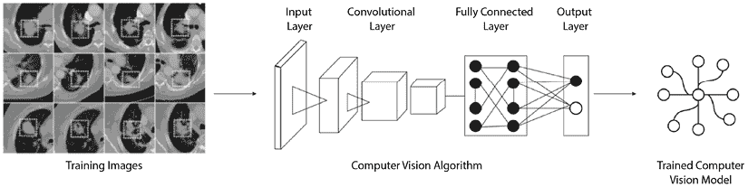

图 2.13：利用计算机视觉进行癌症检测

通过将图像数据与其他临床数据（如患者的病历、实验室检测结果和遗传数据）相结合，可以增强医学图像分析。这种数据组合可以提高医学诊断的准确性，并实现疾病的早期检测。例如，在乳腺癌的情况下，医学影像可以与其他临床数据（如年龄、家族史和激素状态）相结合，以开发更准确的乳腺癌风险预测模型。

可以将结合的数据输入到机器学习算法中，以训练一个联合模型，该模型考虑了所有可用信息，以做出更准确的预测。机器学习模型可以学习数据中各种特征（包括图像）之间的复杂模式和关系，并预测特定状况存在的可能性。

将非图像数据与医学图像结合使用，有可能更全面地了解患者的健康状况，并允许更早、更准确地诊断疾病。此外，它可以帮助医疗专业人员根据患者的具体健康状况制定更有效的治疗方案。

## 药物发现

药物发现和开发过程是医疗保健和生命科学行业的一个关键方面。第一阶段是发现和开发，涉及识别一个可以针对特定蛋白质或基因作为药物候选物的先导化合物。这个过程通常涉及分子生物学、生物化学和药理学等领域的初步研究。

一旦确定了先导化合物，它将进行临床前研究，以确定其有效性和安全性。这一阶段涉及广泛的实验室测试和动物研究，以了解药物药代动力学和药效学。最终目标是确定最有希望的药物候选物，以便进入临床开发阶段。

临床开发是下一个阶段，涉及临床试验和志愿者研究，以微调药物并优化其剂量、安全性和有效性。这一阶段分为三个阶段，每个阶段逐渐扩大并增加成本。目标是证明药物既安全又有效，适用于其预期用途。

在临床试验阶段之后，药物将接受 FDA 的审查，全面评估其是否批准或拒绝。这包括对药物的安全性、有效性和制造过程的严格评估。

最后，进行市场后监测以确保药物一旦获得批准并向公众开放后其安全性。这涉及对不良反应、副作用和其他安全问题的持续监测。

在药物发现和开发的领域，近年来机器学习已成为一种强大的工具。机器学习技术可用于各种目的，例如预测药物候选物的疗效和毒性以及识别新的药物靶点。此外，机器学习可以帮助解决药物发现中的一个关键挑战：理解蛋白质折叠。蛋白质折叠是蛋白质分子假定其功能三维形状的过程。机器学习算法可以分析蛋白质分子之间的复杂相互作用并预测其折叠模式。这可以为疾病的机制提供见解并促进针对特定蛋白质的新药发现。通过利用大型和复杂的数据集，机器学习可以加速药物开发过程，降低成本并提高新药的安全性和有效性。

机器学习已被用于优化临床试验，例如识别临床试验的潜在队列，这是药物发现过程中的一个重要步骤。通过分析大量患者数据，机器学习模型可以帮助识别最有可能从特定治疗中受益的患者群体。例如，在癌症研究中，机器学习已被用于分析患者的遗传和临床数据，以识别可能对特定药物反应更好的特定患者亚组。

机器学习模型还可以通过预测特定试验成功的可能性来帮助优化临床试验设计。例如，机器学习算法可以用来分析历史临床试验数据，以识别与成功试验相关的因素，如患者特征、剂量和治疗持续时间。然后，这些信息可以用来设计未来更有效的试验。

## 医疗数据管理

每天医疗保健行业都会生成和收集大量患者医疗保健数据，这些数据以各种格式存在，如手写笔记、保险索赔数据、记录的医疗对话和医疗图像，例如 X 光片。这些数据对于形成对患者的全面了解或支持医疗账单流程的医疗编码至关重要。然而，从这些来源中提取有价值的见解通常需要大量的手动处理，这不仅成本高昂且容易出错，通常由具有健康领域专业知识的人执行。因此，大量的患者医疗保健数据以原始形式未被利用。基于机器学习的方法已被采用来自动化这一过程并提高数据处理准确性和效率。例如，**自然语言处理**（NLP）模型可以从非结构化医疗笔记中提取信息，而计算机视觉算法可以分析医疗图像以检测和诊断疾病。这使得医疗保健组织能够从以前未开发的病人医疗保健数据中获得有价值的见解。

以下图表展示了使用机器学习从非结构化数据源中提取信息的过程，展示了数据流以及机器学习与不同医疗保健任务（如医疗编码和临床决策支持）的集成。

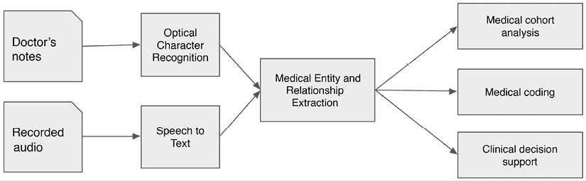

图 2.14：医疗数据管理

总体而言，在医疗保健领域采用基于机器学习（ML）的解决方案正在使医疗保健组织能够从非结构化数据源中解锁有价值的见解，这有助于改善患者结果、优化资源利用和降低成本。

# 制造业中的机器学习用例

制造业是一个庞大的行业，负责创造各种物理产品，如消费品、电子产品、汽车、家具、建筑材料等。制造业的每个子行业都需要特定的工具、资源和专业知识才能成功生产所需的产品。

制造过程通常包括几个阶段，包括产品设计、原型制作、生产和后制造服务与支持。在设计阶段，制造商致力于产品的概念化和规划。这包括定义产品的特性、材料和制造要求。在原型制作阶段，会制造少量产品以测试其功能性和性能。

一旦产品设计完成，制造和组装就会进行。这是将原材料转化为成品的过程。质量控制是制造过程中的关键环节，因为制造商需要确保每个产品都符合所需的标准和规范。最后，制造后的服务和支持包括维修和维护、客户支持和产品升级等活动。目标是为客户提供持续的价值，并确保产品持续发挥最佳性能。

下图展示了制造业中典型的业务功能和流程：

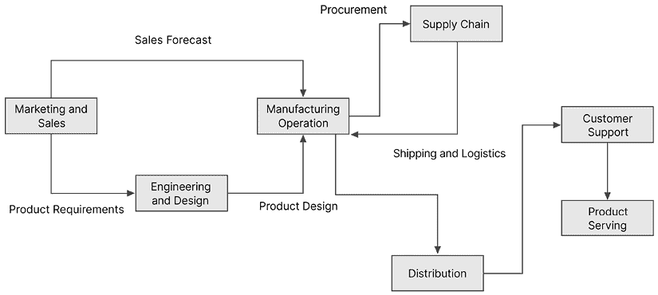

图 2.15：制造业务流程图

人工智能和机器学习已成为制造业的关键工具，推动了制造过程各个阶段的重大改进。例如，机器学习算法用于预测销售，这使公司能够就生产量和物料采购做出明智的决策。这反过来又导致更有效的库存管理、减少浪费和增加盈利能力。

此外，预测性机器维护是人工智能和机器学习做出重大贡献的另一个领域。通过使用机器学习算法，制造商可以分析来自传感器和其他来源的数据，以预测设备故障，在故障发生之前采取预防措施。这有助于避免计划外的停机时间，降低维护成本，并提高整体设备效率。

质量控制是另一个人工智能和机器学习取得显著改进的关键领域。通过分析传感器和摄像头的数据，机器学习算法可以实时识别有缺陷的产品或部件，从而允许及时干预，解决制造过程中的问题。

此外，人工智能和机器学习在自动化制造过程中的各种任务中发挥了关键作用。这包括使用机器人进行产品组装、执行质量检查和处理物料移动。这不仅提高了制造质量和产量，还有助于通过减少危险工作环境中的事故风险来确保工人安全。

最后，人工智能和机器学习还可以用于优化供应链管理，提高整体运营效率并降低成本。机器学习算法可以分析来自多个来源的数据，以识别供应链中的低效和瓶颈，使制造商能够做出基于数据的决策，从而改善生产计划、库存管理和分销。

## 工程与产品设计

产品设计是制造过程中的一个关键方面，设计师的目标是创造既实用又吸引消费者的产品。在设计阶段，设计师需要在他们的创意愿景、市场的实际需求和生产限制之间找到平衡。为了实现这一点，他们可能会创建多个新产品的概念版本，以满足不同的需求和限制。例如，在时尚行业，设计师可能会分析客户对颜色、质地和风格的偏好，以开发满足这些需求的新服装设计和图形。

制造业一直在利用生成式设计机器学习技术来协助新产品概念设计。例如，生成式 AI，一种机器学习类型，可以用于产品设计，以生成满足特定约束和要求的大量可能设计变体。通过输入设计约束，如成本、材料和生产能力，生成式 AI 可以产生数千个满足这些标准的设计选项。这种方法可以显著加快产品设计过程，并使设计师能够探索更广泛的设计可能性。

除了生成式 AI，机器学习技术在分析市场需求和评估新产品潜力方面已被证明是无价的。通过利用各种数据来源，如客户反馈、市场趋势和竞争对手分析，机器学习算法可以准确预测新产品的需求。此外，机器学习模型可以快速分析大量数据，使企业能够通过识别新的市场机会和趋势来保持竞争优势。机器学习算法还可以识别客户偏好，如颜色、质地、风格和功能，以指导产品开发过程。机器学习分析复杂数据集的能力还可以提供关于影响消费者行为和产品偏好的潜在因素的见解。这些信息可以帮助企业优化产品设计营销策略，从而提高销售额和收入。

## 制造运营 – 产品质量和产量

在制造业中，质量控制对于确保产品符合所需标准和规范至关重要。然而，仅依靠人工检查既耗时又昂贵。这就是为什么基于计算机视觉技术的采用在质量控制过程中成为了一场变革。可以使用机器学习算法训练计算机视觉模型来识别制造产品中的缺陷和瑕疵。例如，在汽车行业，计算机视觉算法可以检测到可能影响车辆性能的最轻微的表面划痕、凹痕或变形。此外，基于计算机视觉的技术可以应用于制造过程的各个阶段，如监控装配线、检测成品中的缺陷以及识别原材料的问题。在质量控制中使用 AI 驱动的系统不仅提高了效率并降低了成本，还确保了检查过程的一致性和准确性。

## 制造业运营 – 机器维护

定期维护对于工业制造设备和机械的平稳运行以及防止意外故障至关重要。然而，遵循定期维护计划的传统维护做法可能成本高昂，并且不一定总能检测到潜在问题。幸运的是，基于机器学习的预测性维护分析已成为一种解决方案，帮助制造商提前预测潜在问题并降低意外设备故障的风险。通过分析各种数据，包括由**物联网**（**IoT**）传感器收集的遥测数据，机器学习算法可以预测某台设备是否可能在特定时间窗口内出现故障。维护人员随后可以采取主动措施防止设备故障，避免昂贵的维修或更换。这种方法不仅最小化了计划外停机的风险，还降低了整体维护成本和停机时间。

# 零售业中的机器学习应用

零售业是一个直接向消费者销售消费品的市场，无论是通过实体零售店还是在线平台。零售商从批发分销商或制造商直接采购商品。多年来，零售业经历了重大变化。电子商务的增长速度超过了传统零售业务，迫使实体店适应并创新店内购物体验以保持竞争力。零售商正在探索新的方法来提升线上线下购物体验。最近的发展，如社交电商、增强现实、虚拟助手购物、智能商店和 1:1 个性化，已成为零售业的关键差异化因素。

零售业目前正在受到人工智能和机器学习技术的推动而进行转型。零售商正在利用这些技术来优化库存、预测消费者需求，并提供个性化的沉浸式购物体验。人工智能和机器学习算法可以提供个性化的产品推荐，并实现虚拟现实购物，使购物者能够虚拟试穿衣服。此外，人工智能和机器学习技术还被用于实现无收银员商店购物、防止欺诈活动和盗窃。总的来说，零售业采用人工智能和机器学习技术预计将增强购物体验，并使零售商能够满足客户不断变化的需求和期望。

## 产品搜索与发现

在线购物简化了消费者的购买过程，但当你只有一张图片而没有关于商品名称或特性的信息时，在网上搜索产品有时可能会很困难。这就是深度学习驱动的视觉搜索技术派上用场的地方。这项技术允许消费者通过简单地上传他们正在寻找的商品的图片，快速识别类似外观的产品。视觉搜索技术通过创建商品图片的数字表示，也称为编码或嵌入，并将其存储在高性能的商品索引中来实现。当购物者需要使用图片找到类似外观的商品时，新图片被编码成数字表示，并使用基于距离的效率比较方法与商品索引进行搜索。然后系统返回与目标商品最接近的商品。

使用视觉搜索技术，消费者可以轻松找到他们想要的东西，即使他们不知道正确的搜索词。这项技术在电子商务零售商中越来越受欢迎，构建基于机器学习的图像搜索能力的架构也在不断演变，以提高视觉搜索的准确性和效率。

下图展示了一个构建基于机器学习的图像搜索能力的架构：

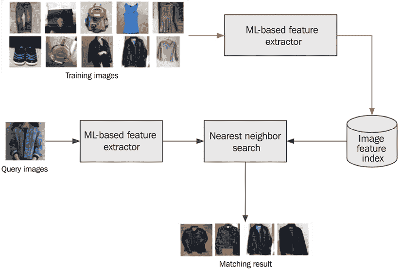

图 2.16：图像搜索架构

基于视觉搜索的推荐已经被许多大型电子商务网站如 Amazon.com 采用，以增强购物体验。

## 定向营销

零售商采用各种营销活动和广告策略，包括直接营销电子邮件或数字广告，通过基于其人口统计数据提供的激励或折扣来吸引潜在客户。此类活动的成功在很大程度上依赖于有效地定位正确的客户以实现高转化率，同时最大限度地降低广告成本和减少客户干扰。已经开发了机器学习模型来优化营销活动的有效性。这些模型使用客户数据和各种人口统计因素来识别最有可能转化的潜在客户，以及确定针对每个客户细分市场的最合适的消息和激励措施。通过利用机器学习技术，零售商可以提高其营销活动的准确性和效率，从而实现更高的投资回报率。

**细分**是理解不同客户细分市场以帮助提高营销活动有效性的一个传统方法。使用机器学习可以进行不同的细分，例如根据基本人口统计数据等数据对客户进行无监督聚类。这允许您将客户分组到几个细分市场，并为每个细分市场创建独特的营销活动。

更有效的定向营销方法是使用高度个性化的**以用户为中心的营销活动**。它们通过使用大量个人行为数据（如历史交易数据、对历史活动的响应数据以及如社交媒体数据等替代文本数据）创建准确的个人档案来工作。使用这些个人档案可以生成高度个性化的带有定制营销信息的活动，以提高转化率。以用户为中心的定向营销的机器学习方法预测不同用户的转化率，如**点击率**（**CTR**），并向转化率高的用户发送广告。这可以通过学习用户特征与转化概率之间的关系来成为一个分类或回归问题。

上下文广告是一种定向营销技术，它会在网页内容上显示相关的广告。这涉及到在内容与广告相匹配的网站上放置展示或视频广告，从而提高广告的效果。例如，一款烹饪产品的广告可能会放置在烹饪食谱网站上，以吸引高度参与的受众。机器学习可以帮助识别广告的上下文，以确保其被适当地放置。例如，计算机视觉模型可以分析视频广告以检测物体、人物和主题，提取上下文信息并将其与网站内容相匹配。通过利用上下文广告，营销人员可以增加他们的广告与目标受众产生共鸣并实现更高的点击率的几率。

生成式 AI 为零售商提供了一个强大的机会，通过动态个性化内容将他们的目标营销工作提升到新的水平。通过利用生成模型，零售商可以创建针对个别客户偏好和兴趣的定制图像和文本。例如，一家户外服装公司可以生成针对当地天气和气候的产品的定制广告。

## 情感分析

理解消费者对其品牌的认知对于零售业至关重要，因为它可以对其成功产生重大影响。随着在线平台的兴起，消费者在表达他们的体验和观点方面变得更加直言不讳，这使得零售商更容易监控其品牌声誉。

零售商正在采用各种技术，包括征求购物者的反馈和监控社交媒体渠道，以评估其客户对其品牌和产品的情感和情绪。通过有效地分析情感，零售商可以识别改进领域，如运营或产品改进，以及减轻对其品牌声誉的潜在恶意攻击。

情感分析是一个文本分类问题，涉及使用标记文本数据，如产品评论，来确定情感是正面、负面还是中性。包括基于深度学习的算法在内的机器学习算法可以用来训练模型，以检测文本中的情感。然后，这些模型可以用来自动分类新的文本数据，如社交媒体帖子或客户反馈，以帮助零售商了解对其品牌和产品的整体情感。随着生成式 AI 的最近进步，许多大型语言模型提供了预训练的情感分析功能，无需您使用标记数据训练自定义模型。

通过利用情感分析，零售商可以深入了解客户偏好，识别改进领域，并做出基于数据的决策，以改善整体客户体验。

## 产品需求预测

零售商依赖库存规划和需求预测来管理库存成本，同时最大化收入并避免缺货情况。传统的需求预测方法，如买家调查、专家意见和基于过去需求的预测，在准确性和可靠性方面存在局限性。

为了解决这些局限性，零售商正在转向统计和机器学习技术，如回归分析和深度学习。这些方法可以使用历史需求和销售数据，以及其他相关数据，如价格、节假日、特别事件和产品属性，来创建更准确和基于数据的预测。

基于深度学习的算法通过将多个数据源纳入模型，可以特别有效地生成准确的需求预测。这种方法涉及训练一个机器学习模型来识别数据中的模式和关系，以生成高度准确的预测。结果是更可靠的库存规划，有助于零售商优化库存同时最大化收入。

下图展示了使用多个数据源构建深度学习模型以生成预测模型的概念：

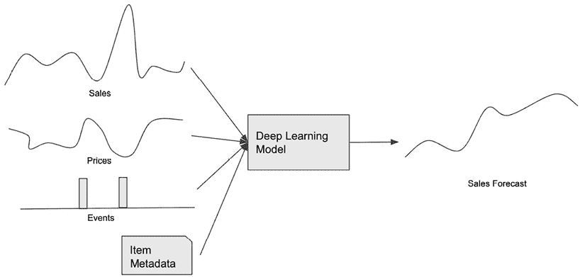

图 2.17：基于深度学习的预测模型

基于机器学习的预测模型可以生成点预测（一个数字）和概率预测（带有置信度分数的预测）。许多零售业务使用机器学习来生成基线预测，然后专业预测员根据他们的专业知识和其他因素进行审查和调整。

# 机器学习在汽车行业的应用案例

近年来，汽车行业经历了重大变革，技术在塑造其演变过程中发挥了关键作用。人工智能和机器学习已成为汽车制造商和供应商提高效率、安全性和客户体验的强大工具。从生产线到联网汽车，人工智能和机器学习正被用于自动化流程、优化运营以及启用新的服务和功能。

## 自动驾驶汽车

人工智能和机器学习在汽车行业中最显著的应用之一是自动驾驶。汽车制造商和技术公司正在利用这些技术来构建无需人工干预即可安全在道路上和高速公路上行驶的自动驾驶汽车。人工智能和机器学习算法用于处理来自传感器、摄像头和其他输入的数据，以做出实时决策和行动，例如制动或换车道。

**自动驾驶汽车**（**AV**）的系统架构包括 3 个主要阶段：1）感知与定位，2）决策与规划，3）控制，如下所示：

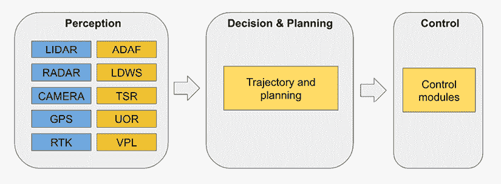图 2.18：自动驾驶汽车系统架构

### 感知与定位

感知是自动驾驶中的一个关键阶段，其中自动驾驶汽车通过各种传感器收集周围环境信息，并确定其在环境中的位置。自动驾驶汽车使用雷达、激光雷达、摄像头和**实时动态**（**RTK**）系统来捕捉周围环境的数据。然后，这些感官数据被输入到识别模块进行进一步处理。

感知阶段的一个关键组件是**自适应检测和识别框架**（ADAF），它利用机器学习算法检测和分类自动驾驶汽车附近的对象，如行人、车辆和障碍物。此外，自动驾驶汽车还集成了**车道偏离警告系统**（LDWS）、**交通标志识别**（TSR）、**未知障碍物识别**（UOR）和**车辆定位和定位**（VPL）等模块，以增强其感知能力。

感知阶段是整体自动驾驶系统的一个基本构建块。感知模块的准确性和可靠性对自动驾驶汽车感知和解释其环境的能力产生重大影响。机器学习算法、传感器技术和传感器融合技术的进步持续提高自动驾驶汽车的感知能力，使其能够在各种复杂驾驶场景中安全有效地运行。

### 决策和规划

决策和规划阶段是自动驾驶的关键方面，它根据感知阶段收集的数据来控制自动驾驶汽车的运动和行为。人工智能和机器学习技术在这一阶段发挥着至关重要的作用，可以被视为自动驾驶的大脑。通过分析来自雷达、激光雷达和摄像头等传感器的数据，决策和规划阶段使用算法来确定自动驾驶汽车应遵循的最佳路径。

人工智能/机器学习可以通过考虑各种因素，如实时地图信息、交通模式和用户输入，来帮助增强路径规划过程，从而做出明智的决策。通过预测和预测技术，自动驾驶汽车可以预测其他道路使用者的行为并相应地规划。人工智能/机器学习算法还可以通过持续监控环境、检测潜在危险并对车辆轨迹进行实时调整以避免碰撞来帮助避障。

决策和规划阶段是自动驾驶行动背后的智慧，使其能够根据实时和历史数据做出明智的选择。随着人工智能和机器学习的进步，决策算法变得越来越复杂，使自动驾驶汽车能够应对复杂场景并有效地应对动态交通状况。

### 控制

自动驾驶中的控制模块在将决策和规划阶段做出的决策转化为控制自动驾驶汽车（AV）的物理动作方面发挥着至关重要的作用。在这一模块中应用人工智能和机器学习技术来增强控制机制并优化自动驾驶汽车的性能。

在控制模块中，人工智能/机器学习可以应用于自适应控制系统。通过利用传感器数据和实时反馈，人工智能算法可以动态调整控制输入，以确保自动驾驶车辆平稳、安全地运行。机器学习模型可以从过去的驾驶经验中学习，并根据不同的驾驶条件（如不同的路面、天气条件和交通模式）优化控制动作。

此外，强化学习技术可以在控制模块中应用，以使自动驾驶车辆通过试错学习最佳控制策略。通过与环境互动并对其行动的结果获得反馈，自动驾驶车辆可以迭代地改进其控制策略，从而实现更高效、更有效的驾驶行为。

## 高级驾驶辅助系统（ADAS）

除了自动驾驶之外，人工智能和机器学习还被用于增强驾驶体验，具有如**高级驾驶辅助系统**（**ADAS**）等特性。

高级驾驶辅助系统（ADAS）利用计算机视觉、传感器融合和人工智能技术实时检测和解释周围环境。通过分析来自摄像头、雷达和其他传感器的数据，ADAS 可以识别道路上的潜在危险，包括行人、骑自行车的人和车辆。这使得系统可以向驾驶员发出警告，甚至采取自主纠正措施以减轻风险。例如，车道偏离警告系统会在驾驶员无意中偏离车道时提醒驾驶员，而自动紧急制动系统可以自主应用刹车以防止或减轻碰撞的严重程度。ADAS 技术不仅提高了安全性，还有助于减少事故并挽救生命。

# 摘要

在本章中，我们探讨了各个行业以及它们如何利用机器学习（ML）来解决商业挑战并推动增长。从金融和医疗保健到零售和汽车行业，我们看到了机器学习如何改进流程、产生洞察力并提升客户体验。本章中的例子可能激发了你的一些想法，你现在可以将这些想法带给利益相关者，以启动机器学习路线图讨论，并创造性地思考在你自己的组织中可能具有高影响力的应用。

随着我们进入下一章，我们将更深入地探讨机器学习的机制，探索机器学习背后的基本概念以及该领域最广泛使用的算法。这将为你提供一个坚实的理解基础，了解机器学习在实际中是如何应用于解决各种机器学习问题的。

# 加入我们的 Discord 社区

加入我们的 Discord 空间，与作者和其他读者进行讨论：

[`packt.link/mlsah`](https://packt.link/mlsah)

