# 第七章：开源机器学习平台

在上一章中，我们介绍了如何使用 Kubernetes 作为运行机器学习任务的基础设施，例如运行模型训练作业或构建数据科学环境，如**Jupyter Notebook**服务器。然而，为了在大规模组织中进行这些任务并提高效率，您需要构建具有支持完整数据科学生命周期能力的机器学习平台。这些能力包括可扩展的数据科学环境、模型训练服务、模型注册和模型部署能力。

在本章中，我们将讨论机器学习平台的核心理念，并探讨可用于构建机器学习平台的额外开源技术。我们将从为支持大量用户进行实验而设计的数据科学环境技术开始。随后，我们将深入研究各种模型训练、模型注册、模型部署和机器学习管道自动化的技术。

简而言之，以下主题被涵盖：

+   机器学习平台的核心理念

+   构建机器学习平台的开源技术

# 机器学习平台的核心理念

机器学习平台是一个复杂的系统，包括运行不同任务的环境和编排复杂工作流程过程。此外，机器学习平台需要满足多种角色，包括数据科学家、机器学习工程师、基础设施工程师、运维团队以及安全和合规利益相关者。要构建机器学习平台，需要几个组件共同作用。

这些组件包括：

+   **数据科学环境**：数据科学环境提供数据分析工具和机器学习工具，如 Jupyter 笔记本、数据源和存储、代码仓库和机器学习框架。数据科学家和机器学习工程师使用数据科学环境进行数据分析、运行数据科学实验以及构建和调整模型。数据科学环境还提供协作功能，允许数据科学家共享和协作代码、数据、实验和模型。

+   **模型训练环境**：模型训练环境提供专门的基础设施，以满足特定的模型训练需求。虽然数据科学家和机器学习工程师可以直接在其本地 Jupyter 环境中执行小规模的模型训练任务，但他们需要为大规模模型训练提供单独的专用基础设施。通过利用专用训练基础设施，组织可以更好地控制模型训练过程管理和模型血缘管理流程。

+   **模型注册**：训练好的模型需要在模型注册表中进行跟踪和管理。模型注册表作为集中式存储库，用于库存和管理模型，确保有效的血缘管理、版本控制、模型发现和全面的生命周期管理。当处理大量模型时，这一点尤为重要。数据科学家可以直接在他们的数据科学环境中进行实验时在注册表中注册模型。此外，模型可以作为自动化机器学习模型管道执行的一部分进行注册，从而实现模型到注册表的流畅和自动化集成。

+   **模型服务环境**：为了将训练好的机器学习模型的预测结果服务于客户端应用程序，需要在实时操作的后端 API 端点内托管模型。该基础设施还应提供对批量转换功能的支持，允许在大批量中处理预测。有几种类型的模型服务框架可供满足这些要求。

+   **机器学习管道开发**：为了有效地管理生命周期中各种机器学习组件和阶段，关键是要纳入能够使管道开发编排机器学习训练和预测工作流程的能力。这些管道在协调不同阶段，如数据准备、模型训练和评估等方面发挥着重要作用。

+   **模型监控**：强大的模型监控对于保持生产中机器学习模型的高性能至关重要。持续的监控跟踪预测准确性、数据漂移、延迟、错误和异常等指标。监控使平台操作员能够在影响用户之前检测到生产模型退化。当监控指标超过定义的阈值时，会触发调查工作流程和必要的缓解措施。有效的监控还提供性能仪表板和所有部署模型的可见性。这促进了模型的持续改进，并允许主动替换表现不佳的模型。

+   **机器学习特征管理**：在机器学习生命周期中，管理特征是一项关键能力。特征管理包括对机器学习特征的持续维护、监控和共享，以加速模型开发。这包括用于发现、血缘跟踪和特征数据治理的工具。集中式特征存储通过为组织内的团队提供高质量特征，实现了访问的民主化。它们提供了一个单一的真实来源，消除了特征工程努力的重复。

+   **持续集成**（**CI**）/**持续部署**（**CD**）和**工作流程自动化**：最后，为了在机器学习平台上简化数据处理、模型训练和模型部署流程，建立 CI/CD 实践以及工作流程自动化能力至关重要。这些实践和工具显著提高了机器学习部署的速度、一致性、可重复性和可观察性。

除了这些核心组件之外，在构建端到端机器学习平台时，还需要考虑几个其他平台架构因素。这些因素包括安全性和身份验证、版本控制和可重复性，以及数据管理和治理。通过将这些额外的架构因素整合到机器学习平台中，组织可以增强安全性，对系统操作有更清晰的了解，并执行治理政策。在接下来的章节中，我们将探讨可用于构建端到端机器学习平台的多种开源技术。

# 用于构建机器学习平台的开源技术

通过在 Kubernetes 集群中部署独立的机器学习容器来单独管理机器学习任务，在处理大量用户和工作负载时可能会变得具有挑战性。为了解决这种复杂性并实现高效扩展，许多开源技术已成为可行的解决方案。这些技术包括 Kubeflow、MLflow、Seldon Core、GitHub、Feast 和 Airflow，它们为构建数据科学环境、模型训练服务、模型推理服务和机器学习工作流程自动化提供了全面的支持。

在深入探讨技术细节之前，让我们首先探讨为什么许多组织选择开源技术来构建他们的机器学习平台。对于许多人来说，吸引力在于能够根据特定的组织需求和流程定制平台，开放标准和可互操作组件防止了供应商锁定，并允许随着时间的推移采用新技术。利用流行的开源机器学习项目还可以利用丰富的人才库，因为许多从业者已经熟练掌握了这些技术。此外，开源允许内部团队完全控制平台路线图，减少了对供应商优先级的依赖。当高效执行时，开源堆栈可以为组织节省成本，因为与软件相关的没有许可费用。

使用开源技术构建机器学习平台具有显著优势。然而，考虑潜在的缺点也同样重要。可能出现的挑战包括集成复杂性、缺乏全面支持、安全漏洞以及与商业解决方案相比可能的功能限制。此外，维护开源平台的资源密集型特性，以及团队可能面临的学习曲线，可能会影响效率和总拥有成本。对文档质量、缺乏标准化以及更新和维护的责任的担忧，进一步强调了仔细考虑的必要性。在决定采用开源方法之前，您必须权衡这些因素，并考虑其具体要求、资源和专业知识。

考虑到这些因素，让我们探讨使用开源技术设计核心机器学习平台组件。

## 实施数据科学环境

Kubeflow 是一个基于 Kubernetes 的开源机器学习平台。它提供了一套专门设计的工具和框架，旨在简化机器学习工作的部署、编排和管理。Kubeflow 提供了诸如 Jupyter 笔记本用于交互式数据探索和实验、分布式训练能力和模型服务基础设施等功能。

Kubeflow 的核心功能包括：

+   一个中央 UI 仪表板

+   用于代码编写和模型构建的 Jupyter Notebook 服务器

+   用于机器学习流程编排的 Kubeflow 管道

+   **KFServing**用于模型服务

+   用于模型训练支持的训练操作员

下图说明了 Kubeflow 如何提供数据科学环境所需的各种组件。具体来说，我们将深入探讨其对 Jupyter Notebook 服务器的支持，因为它是数据科学环境的主要构建块。

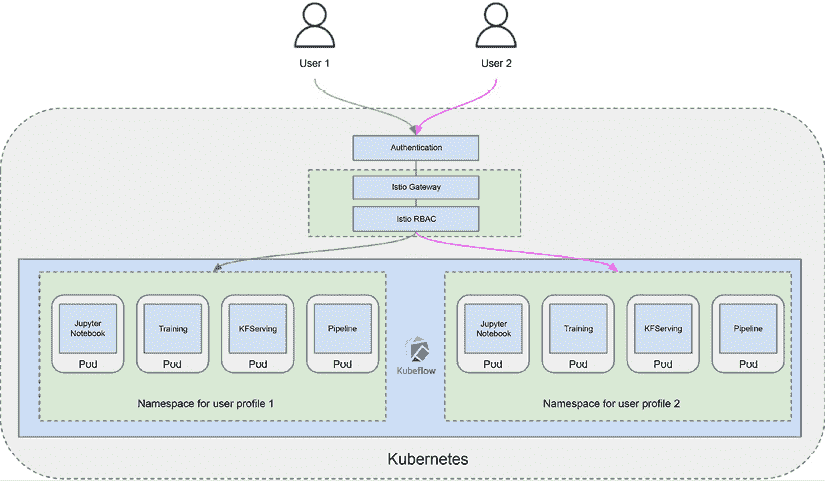

图 7.1：基于 Kubeflow 的数据科学环境

Kubeflow 提供了一个具有内置身份验证和授权支持的多个租户 Jupyter Notebook 服务器环境。让我们详细讨论这些核心组件：

+   **Jupyter Notebook**：作为数据科学家，您可以利用 Kubeflow Jupyter Notebook 服务器，该服务器提供了一个平台，用于在 Jupyter 笔记本中编写和运行**Python**代码以探索数据和构建模型。使用 Kubeflow，您可以启动多个笔记本服务器，每个服务器都与一个单独的 Kubernetes 命名空间相关联，该命名空间对应于一个团队、项目或个人用户。每个笔记本服务器在**Kubernetes** **Pod**内部运行一个容器。默认情况下，Kubeflow 笔记本服务器提供了一系列托管在公共容器镜像仓库中的笔记本容器镜像供您选择。或者，您也可以创建定制的笔记本容器镜像以满足您的特定需求。为了确保标准和一致性，Kubeflow 管理员可以为用户提供标准镜像列表。在创建笔记本服务器时，您选择运行笔记本服务器的命名空间。此外，您还需要指定笔记本服务器的容器镜像的**统一资源标识符**（**URI**）。您还可以灵活地指定资源需求，例如 CPU/GPU 的数量和内存大小。

+   **身份验证和授权**：您通过 Kubeflow UI 仪表板访问笔记本服务器，该仪表板通过 Dex **OpenID Connect**（**OIDC**）提供者提供身份验证服务。Dex 是一个使用 OIDC 为其他应用程序提供身份验证的标识服务。Dex 可以与其他身份验证服务（如**Active Directory**服务）进行联合。每个笔记本都与一个默认的 Kubernetes 服务帐户（`default-editor`）相关联，可用于授权目的（例如，授予笔记本访问 Kubernetes 集群中各种资源的权限）。Kubeflow 使用 Istio **基于角色的访问控制**（**RBAC**）来控制集群内的流量。以下**YAML**文件通过将`ml-pipeline-services`服务角色附加到它，授予与 Kubeflow 笔记本关联的`default-editor`服务帐户访问 Kubeflow 管道服务的权限：

    ```py
    apiVersion: rbac.istio.io/v1alpha1
    kind: ServiceRoleBinding
    metadata:
    name: bind-ml-pipeline-nb-admin
    namespace: kubeflow
    spec:
    roleRef:
    kind: ServiceRole
    name: ml-pipeline-services
    subjects:
    - properties:
    source.principal: cluster.local/ns/admin/sa/default-editor 
    ```

+   **多租户**：Kubeflow 提供了多用户访问共享 Kubeflow 环境的能力，同时确保资源隔离。这是通过为每个用户创建单独的命名空间并利用 Kubernetes RBAC 和 Istio RBAC 来管理这些命名空间及其相关资源的访问控制来实现的。对于团队内部的协作工作，命名空间的所有者可以直接从 Kubeflow 仪表板 UI 授予其他用户的访问权限。使用`管理贡献者`功能，命名空间所有者可以指定哪些用户被授予访问命名空间及其资源的权限。

除了上述核心组件之外，Kubeflow 还提供了一种机制，用于将用户引入以访问不同的 Kubeflow 资源。要引入新的 Kubeflow 用户，您需要创建一个新的用户配置文件，这将自动为该配置文件生成一个新的命名空间。

以下 YAML 文件，一旦使用`kubectl`应用，就会创建一个名为`test-user`的新用户配置文件，其电子邮件地址为`test-user@kubeflow.org`，同时还会创建一个名为`test-user`的新命名空间：

```py
apiVersion: kubeflow.org/v1beta1
kind: Profile
metadata:
name: test-user
spec:
owner:
kind: User
name: test-user@kubeflow.org 
```

您可以使用`kubectl get profiles`和`kubectl get namespaces`命令来验证配置文件和命名空间是否已创建。

用户创建并添加到 Kubeflow Dex 身份验证服务后，新用户可以登录到 Kubeflow 仪表板，并在新创建的命名空间下访问 Kubeflow 资源（如 Jupyter Notebook 服务器）。

在数据科学环境中使用 Kubeflow 会带来一些关键挑战，这些挑战在决定实施之前必须了解。在 Kubernetes 之上安装 Kubeflow，无论是在本地还是在 AWS 等云平台，都可能很复杂，通常需要大量的配置和调试。众多的组件使得安装变得非同寻常。Kubeflow 由许多松散耦合的组件组成，每个组件都有自己的版本。在不同版本之间协调这些多样化的组件，以无缝地作为一个集成平台工作，可能会遇到困难。Kubeflow 的文档不足。Kubeflow 文档经常指向较旧的组件版本。过时的文档使得新用户在文档和平台版本之间出现不匹配时，采用变得更加困难。尽管存在这些限制，但由于其对端到端管道的支持、对各种 ML 框架的丰富支持以及可移植性，Kubeflow 仍然是构建 ML 平台高度推荐的技术。

有了这些，我们已经了解了如何使用 Kubeflow 提供多租户 Jupyter Notebook 环境进行实验和模型构建。接下来，让我们看看如何构建模型训练环境。

## 构建模型训练环境

如前所述，在 ML 平台中，通常提供专门的模型训练服务和基础设施，以支持在 ML 管道中进行大规模和自动化的模型训练。

这个专门的培训服务应该可以从平台内的不同组件轻松访问，例如实验环境（如 Jupyter 笔记本）以及 ML 自动化管道。

在基于 Kubernetes 的环境中，根据您的训练需求，您可以选择两种主要的模型训练方法：

+   使用**Kubernetes** **作业**进行模型训练

+   使用**Kubeflow** **训练操作员**进行模型训练

让我们逐一详细地审视这些方法：

+   **使用 Kubernetes Jobs 进行模型训练**：正如我们在*第六章*，*Kubernetes 容器编排基础设施管理*中讨论的那样，Kubernetes Job 创建一个或多个容器并将它们运行到完成。这种模式非常适合运行某些类型的机器学习模型训练作业，因为机器学习作业运行一个训练循环直到完成，而不是无限期运行。例如，您可以将一个包含 Python 训练脚本和所有训练模型所需的依赖项的容器打包，并使用 Kubernetes Job 来加载容器并启动训练脚本。当脚本完成并退出时，Kubernetes Job 也会结束。以下示例 YAML 文件，如果使用`kubectl apply`命令提交，将启动一个模型训练作业：

    ```py
    apiVersion: batch/v1
    kind: Job
    metadata:
    name: train-churn-job
    spec:
    template:
    spec:
    containers:
    - name: train-container
    imagePullPolicy: Always
    image: <model training uri>
    command: ["python", "train.py"]
          restartPolicy: Never
    backoffLimit: 4 
    ```

    要查询作业状态并查看详细的训练日志，您可以分别运行`kubectl get jobs`命令和`kubectl logs <pod name>`命令。

+   **使用 Kubeflow 训练操作符进行模型训练**：Kubernetes Job 可以启动一个模型训练容器并在容器内运行训练脚本直到完成。由于 Kubernetes Job 的控制器没有关于训练作业的应用特定知识，它只能处理运行作业的通用 Pod 部署和管理，例如在 Pod 中运行容器、监控 Pod 和处理通用 Pod 故障。然而，某些模型训练作业，如集群中的分布式训练作业，需要特殊部署、监控和维护各个 Pod 之间状态化通信。这就是 Kubernetes 训练操作符模式可以应用的地方。

Kubeflow 提供了一系列预构建的训练操作符（例如**TensorFlow**、**PyTorch**和**XGBoost**操作符）用于复杂的模型训练作业。每个 Kubeflow 训练操作符都有一个**自定义资源**（**CR**）（例如，TensorFlow 作业的`TFJob CR`），它定义了训练作业的特定配置，例如训练作业中的 Pod 类型（例如，`master`、`worker`或`parameter server`），或者运行策略以清理资源以及作业应运行多长时间。CR 的控制器负责配置训练环境、监控训练作业的特定状态以及维护期望的训练作业的特定状态。例如，控制器可以设置环境变量，使训练集群规范（例如，Pod 类型和索引）对容器内运行的训练代码可用。此外，控制器还可以检查训练过程的退出代码，如果退出代码指示永久性故障，则失败训练作业。以下 YAML 文件示例模板代表使用 TensorFlow 操作符（`tf-operator`）运行训练作业的规范：

```py
apiVersion: "kubeflow.org/v1"
kind: "TFJob"
metadata:
name: "distributed-tensorflow-job"
spec:
tfReplicaSpecs:
PS:
replicas: 1
restartPolicy: Never
template:
spec:
containers:
- name: tensorflow
image: <model training image uri>
command:
Worker:
replicas: 2
restartPolicy: Never
template:
spec:
containers:
- name: tensorflow
image: <model training image uri>
command: 
```

在此示例模板中，规范将创建一个参数服务器副本（它聚合不同容器中的模型参数）和两个工作副本（它们运行模型训练循环并与参数服务器通信）。操作符将根据规范处理`TFJob`对象，将实际运行的服务和 Pods 中存储的`TFJob`对象保持与系统中的规范一致，并用期望状态替换实际状态。您可以使用`kubectl apply -f <TFJob specs template>`提交训练作业，并使用`kubectl get tfjob`命令获取`TFJob`的状态。

作为数据科学家，您可以使用`kubectl`实用工具提交 Kubernetes 训练作业或 Kubeflow 训练作业，或者从您的 Jupyter Notebook 环境中使用**Python SDK**。例如，`TFJob`对象有一个名为`kubernet.tfjob`的 Python SDK，Kubernetes 有一个名为`kubernetes.client`的客户端 SDK，用于从 Python 代码与 Kubernetes 和 Kubeflow 环境交互。您还可以使用我们将在后面的*Kubeflow 管道*部分中介绍的`Kubeflow Pipeline`组件调用训练作业。

使用 Kubernetes 作业进行机器学习训练需要安装和配置必要的机器学习软件组件，以便使用不同的框架训练不同的模型。您还需要构建日志和监控能力以监控训练进度。

采用 Kubeflow 训练操作符也带来了一系列挑战。包括 MPI 训练操作符在内的几个操作符仍处于成熟阶段，还不适合用于生产环境。虽然操作符提供了一些日志和指标，但获取跨 Pods 的广泛训练运行的全面视图仍然具有挑战性，需要集成多个仪表板。为各种具有碎片化功能和状态的机器学习框架提供单独的操作符，使得实现统一体验变得更加复杂。

运行训练操作符的学习曲线可能很高，因为它涉及到理解许多组件，例如训练 YAML 文件的开发、分布式训练作业配置和训练作业监控。

## 使用模型注册表注册模型

**模型注册表**是模型管理和治理的重要组件，它是模型训练阶段与模型部署阶段之间的关键链接，因为模型需要被适当地存储在受管理的存储库中，以便进行受控的模型部署。在机器学习平台中实现模型注册表有几种开源选项。在本节中，我们将探讨用于模型管理的 MLflow 模型注册表。

MLflow 模型注册表是领先的模型注册解决方案之一，在模型工件生命周期管理、版本支持以及 Docker、Amazon SageMaker 和 Azure ML 等部署目标方面具有强大的支持。它旨在管理机器学习生命周期的所有阶段，包括实验管理、模型管理、可复现性和模型部署。它具有以下四个主要组件：

+   **实验跟踪：** 在模型开发过程中，数据科学家会使用不同的数据集、算法和配置运行多个训练作业作为实验，以找到最佳的工作模型。跟踪这些实验的输入和输出对于确保高效进展至关重要。实验跟踪会在运行您的机器学习代码时记录参数、代码版本、指标和工件，以便稍后可视化结果。

+   **机器学习项目：** 项目将数据科学代码打包成可以在任何平台上复现运行的格式。

+   **模型：** 模型为打包和部署机器学习模型提供了一个标准单元。

+   **模型注册表：** 模型注册表在中央存储库中存储、注释、发现和管理模型。

MLflow 模型注册表组件提供了一个中央模型存储库，用于保存模型。它捕获模型细节，如模型血缘、模型版本、注释和描述，并捕获模型从预发布到生产的阶段转换（因此模型状态的状态被清楚地描述）。

要在团队环境中使用 MLflow 模型注册表，您需要设置一个带有数据库作为后端和模型工件存储的 MLflow 跟踪服务器。MLflow 提供 UI 和 API 与其核心功能进行交互，包括模型注册表。一旦模型在模型注册表中注册，您就可以通过 UI 或 API 添加、修改、更新、过渡或删除模型。

下图显示了 MLflow 跟踪服务器及其相关模型注册表的架构设置：

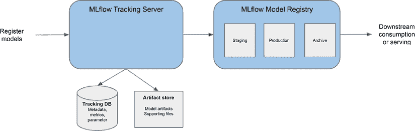

图 7.2：MLflow 跟踪服务器和模型注册表

MLflow 支持基本 HTTP 身份验证，以实现对实验和已注册模型的访问控制。MLflow 跟踪服务器也支持基本身份验证。然而，这些安全功能可能不足以满足企业需求，例如用户组管理和与第三方身份验证提供商的集成。组织通常需要实施单独的安全和身份验证控制来管理对资源的访问。

## 使用模型服务来提供模型

一旦模型被训练并保存，利用它来生成预测只需将保存的模型加载到机器学习包中并调用该包提供的适当模型预测函数即可。然而，对于大规模和复杂的模型服务需求，您需要考虑实施专门的服务器模型服务基础设施以满足这些需求。

在接下来的章节中，我们将探讨各种开源模型服务框架，这些框架可以帮助解决这些需求。

### Gunicorn 和 Flask 推理引擎

**Gunicorn** 和 **Flask** 常用于构建自定义模型服务 Web 框架。以下图显示了使用 Flask、Gunicorn 和 Nginx 作为模型服务服务的构建块的一个典型架构。


图 7.3：使用 Flask 和 Gunicorn 的模型服务架构

Flask 是一个基于 Python 的微型网络框架，用于快速构建 Web 应用。它轻量级，几乎不依赖于外部库。使用 Flask，您可以定义不同的调用路由并将处理函数关联到不同的 Web 调用（例如健康检查调用和模型调用）。为了处理模型预测请求，Flask 应用将模型加载到内存中，并在模型上调用 `predict` 函数以生成预测。Flask 内置了网络服务器，但它扩展性不佳，因为它一次只能支持一个请求。

这就是 Gunicorn 可以帮助解决可扩展性差距的地方。Gunicorn 是一个用于托管 Web 应用的网络服务器，包括 Flask 应用。它可以并行处理多个请求并有效地将流量分配给托管 Web 应用。当它收到一个 Web 请求时，它将调用托管的 Flask 应用来处理请求，例如调用函数以生成模型预测。

除了作为 Web 请求提供预测请求之外，企业推理引擎还需要处理安全的 Web 流量（例如 SSL/TLS 流量），以及当有多个 Web 服务器时的负载均衡。这正是 Nginx 可以发挥重要作用的地方。Nginx 可以作为多个 Web 服务器的负载均衡器，并且可以更有效地处理 SSL/TLS 流量的终止，这样 Web 服务器就不必处理它。

基于 Flask/Gunicorn 的模型服务架构可以是托管简单模型服务模式的好选择。但对于更复杂的模式，例如托管不同版本的模型、A/B 测试（向不同的用户群体展示模型的两个变体并比较它们的响应）或大型模型服务，这种架构将有限制。Flask/Gunicorn 架构模式还需要自定义代码（如 Flask 应用）才能工作，因为它不提供对不同机器学习模型的内置支持。

接下来，让我们探索一些专门设计的模型服务框架，并看看它们与基于 Flask 的自定义推理引擎有何不同。

### TensorFlow Serving 框架

**TensorFlow Serving** 是一个生产级、开源的模型服务框架，并提供了在 RESTFul 端点后服务 TensorFlow 模型的即用型支持。它管理模型服务的生命周期，并为单个端点后提供版本化和多个模型提供访问。此外，还内置了对金丝雀部署的支持。**金丝雀部署** 允许您将模型部署以支持部分流量。除了实时推理支持外，还有一个批量调度功能，可以批量处理多个预测请求并执行单个联合操作。使用 TensorFlow Serving，无需编写自定义代码来服务模型。

下图展示了 TensorFlow Serving 的架构：

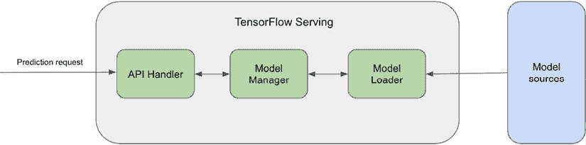

图 7.4：TensorFlow Serving 架构

让我们更详细地讨论每个架构组件：

+   *API 处理器* 为 TensorFlow Serving 提供接口。它内置了一个轻量级的 HTTP 服务器，用于服务基于 REST 的 API 请求。它还支持 **gRPC**（一种 **远程过程调用** 协议）流量。gRPC 是一种更高效、更快的网络协议；然而，它比 REST 协议更复杂。TensorFlow Serving 有一个称为 *可服务对象* 的概念，它指的是处理任务的实际对象，例如模型推理或查找表。例如，训练好的模型表示为一个 *可服务对象*，它可以包含一个或多个算法和查找表或嵌入表。API 处理器使用可服务对象来满足客户端请求。

+   *模型管理器* 负责管理可服务对象的生命周期，包括加载可服务对象、提供可服务对象服务以及卸载可服务对象。当需要可服务对象来执行任务时，模型管理器向客户端提供一个处理程序以访问可服务对象实例。模型管理器可以管理多个版本的可服务对象，允许逐步推出不同版本的模型。

+   *模型加载器* 负责从不同来源加载模型，例如 **Amazon** **S3**。当加载新模型时，模型加载器会通知模型管理器新模型的可用性，模型管理器将决定下一步应该做什么，例如卸载旧版本并加载新版本。

TensorFlow Serving 可以扩展以支持非 TensorFlow 模型。例如，在其他框架中训练的模型可以被转换为 **ONNX** 格式，并使用 TensorFlow Serving 提供服务。ONNX 是一种用于表示模型以支持不同机器学习框架之间互操作性的通用格式。

### The TorchServe serving framework

**TorchServe**是一个用于部署训练好的**PyTorch**模型的开源框架。类似于 TensorFlow Serving，TorchServe 通过其内置的 Web 服务器提供 REST API 来部署模型。它具有多模型部署、模型版本控制、服务器端请求批处理和内置监控等核心功能，能够大规模地部署生产工作负载。使用 TorchServe 部署 PyTorch 模型无需编写自定义代码。此外，TorchServe 还内置了 Web 服务器来托管模型。

下图展示了 TorchServe 框架的架构组件：

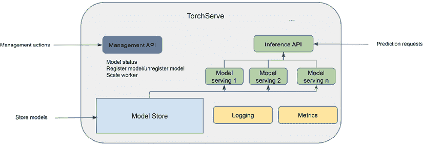

图 7.5：TorchServe 架构

**推理 API**负责处理来自客户端应用程序的预测请求，这些请求使用加载的 PyTorch 模型。它支持 REST 协议，并提供预测 API 以及其他支持 API，如健康检查和模型解释 API。推理 API 可以处理多个模型的预测请求。

模型工件被打包成一个单独的归档文件，并存储在 TorchServe 环境中的模型存储中。您可以使用名为`torch-mode-archive`的**命令行界面**（CLI）命令来打包模型。

TorchServe 后端将从模型存储中加载归档模型到不同的工作进程中。这些工作进程与推理 API 交互，处理请求并发送响应。

管理 API 负责处理管理任务，如注册和注销 PyTorch 模型、检查模型状态以及扩展工作进程。管理 API 通常由系统管理员使用。

TorchServe 还提供了内置的日志记录和指标支持。日志组件记录访问日志和处理日志。TorchServe 指标收集系统指标列表，例如 CPU/GPU 利用率以及自定义模型指标。

### KFServing 框架

TensorFlow Serving 和 TorchServe 是特定深度学习框架的独立模型部署框架。相比之下，**KFServing**是一个通用、多框架、支持不同机器学习模型的模型部署框架。KFServing 使用如 TensorFlow Serving 和 TorchServe 这样的独立模型部署框架作为后端模型服务器。它是 Kubeflow 项目的一部分，并为不同的模型格式提供了可插拔的架构：

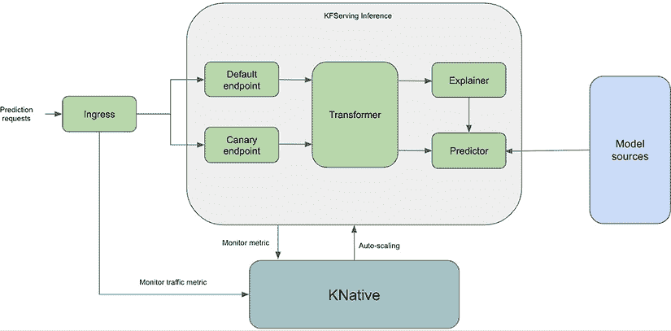

图 7.6：KFServing 组件

作为一种通用、多框架的模型服务解决方案，KFServing 为不同类型的模型提供了多个开箱即用的模型服务器（也称为预测器），包括 TensorFlow、**PyTorch**、**XGBoost**、**scikit-learn** 和 ONNX。使用 KFServing，您可以使用 REST 和 gRPC 协议来提供服务。要部署支持的模型类型，您只需定义一个指向数据存储中模型实体的 YAML 规范即可。此外，您还可以构建自己的自定义容器，在 KFServing 中提供服务。该容器需要提供模型服务实现以及一个网络服务器。以下代码展示了使用 KFServing 部署 `tensorflow` 模型的示例 YAML 规范：

```py
apiVersion: "serving.kubeflow.org/v1alpha2"
kind: "InferenceService"
metadata:
name: "model-name"
spec:
default:
predictor:
tensorflow:
storageUri: <uri to model storage such as s3> 
```

KFServing 具有一个转换组件，允许在将输入有效载荷发送到预测器之前对其进行自定义处理，并在将响应发送回调用客户端之前对预测器的响应进行转换。有时，您需要为模型预测提供解释，例如哪些特征对预测有更强的影响，我们将在后面的章节中更详细地介绍。

KFServing 设计用于生产部署，并提供了一系列生产部署功能。其自动扩展功能允许模型服务器根据请求流量量进行扩展/缩减。使用 KFServing，您可以部署默认模型服务端点和金丝雀端点，在两者之间分配流量，并指定端点后面的模型修订版。对于运营支持，KFServing 还内置了监控功能（例如，监控请求数据和请求延迟）。

### Seldon Core

**Seldon Core** 是另一个多框架模型服务框架，用于在 Kubernetes 上部署模型。与 KFServing 相比，Seldon Core 提供了更丰富的模型服务功能，例如用于 A/B 测试和模型集成的模型服务推理图。以下图显示了 Seldon Core 框架的核心组件：

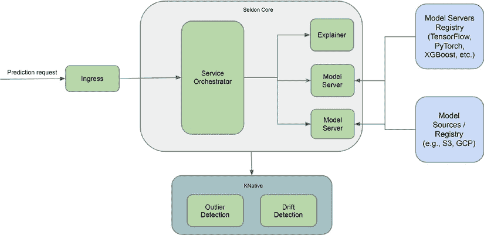

图 7.7：Seldon Core 模型服务框架架构

Seldon Core 为一些常见的机器学习库提供了打包的模型服务器，包括用于 scikit-learn 模型的 `SKLearn` 服务器、用于 XGBoost 模型的 XGBoost 服务器、用于 TensorFlow 模型的 TensorFlow Serving 以及基于 MLflow 的模型服务。您还可以为特定的模型服务需求构建自己的自定义服务容器，并使用 Seldon Core 进行托管。

以下模板展示了如何使用 Seldon Core 通过 SKLearn 服务器部署模型。您只需更改`modelUri`路径，使其指向云对象存储提供商上保存的模型，例如**Google Cloud Storage**、**Amazon S3 存储**或**Azure Blob 存储**。为了测试示例，您可以将以下`modelUri`值更改为 Seldon Core 提供的示例 - `gs://seldon-models/sklearn/iris`：

```py
apiVersion: machinelearning.seldon.io/v1alpha2
kind: SeldonDeployment
metadata:
name: sklearn
spec:
name: sklearn-model
predictors:
- graph:
children: []
      implementation: SKLEARN_SERVER
modelUri: <model uri to model artifacts on the cloud storage>
name: classifier
name: default
replicas: 1 
```

Seldon Core 还支持一种高级工作流程，称为推理图，用于服务模型。**推理图**功能允许您在单个推理管道中拥有不同模型和其他组件的图。一个推理图可以由几个组件组成：

+   用于不同预测任务的一个或多个 ML 模型

+   不同使用模式（如 A/B 测试中对不同模型的流量分割）的流量路由管理

+   用于组合多个模型结果的组件，例如模型集成组件

+   用于转换输入请求（例如执行特征工程）或输出响应（例如，以**JSON**格式返回数组格式）的组件

要在 YAML 中构建推理图规范，您需要在`seldondeployment` YAML 文件中包含以下关键组件：

+   一个预测因子列表，每个预测因子都有自己的`componentSpecs`部分，指定容器镜像等详细信息

+   描述每个`componentSpecs`部分中组件如何相互连接的图

以下示例模板展示了自定义金丝雀部署的推理图，将流量分割为模型的两个不同版本 - 一个有 75%的流量，另一个有 25%的流量：

```py
apiVersion: machinelearning.seldon.io/v1alpha2
kind: SeldonDeployment
metadata:
name: canary-deployment
spec:
name: canary-deployment
predictors:
- componentSpecs:
- spec:
containers:
- name: classifier
image: <container uri to model version 1>
graph:
children: []
      endpoint:
type: REST
name: classifier
type: MODEL
name: main
replicas: 1
traffic: 75
- componentSpecs:
- spec:
containers:
- name: classifier
image: <container uri to model version 2>
graph:
children: []
      endpoint:
type: REST
name: classifier
type: MODEL
name: canary
replicas: 1
traffic: 25 
```

一旦应用部署清单，Seldon Core 操作员负责创建用于服务 ML 模型所需的所有资源。具体来说，操作员将创建清单中定义的资源，向 Pod 添加编排器以管理推理图的编排，并使用如 Istio 等入口网关配置流量。

### Triton 推理服务器

Triton 推理服务器是一种开源软件，旨在简化 AI 推理的过程。它为从各种深度学习和 ML 框架（包括 TensorRT、TensorFlow、PyTorch、ONNX、OpenVINO、Python 等）部署 AI 模型提供了一种灵活的解决方案。Triton 与广泛的设备兼容，支持在云环境、数据中心、边缘设备和嵌入式系统中进行推理。与 Seldon Core 相比，Triton 推理服务器更注重性能。它被设计为高度可扩展和高效，是高流量应用的理想选择。以下图展示了 Triton 推理服务器的核心组件：

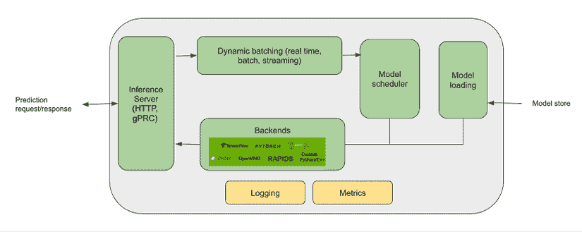

图 7.8：Triton 推理服务器架构

Triton 推理服务器架构包括多个组件，它们协同工作以实现高效和可扩展的推理。其核心是后端，代表 Triton 支持的特定深度学习或机器学习框架。每个后端处理使用其相应框架训练的模型的加载和执行。Triton 推理服务器作为中央枢纽，接收和管理推理请求。它与客户端（如 Web 应用程序或服务）通信，并协调推理过程。模型仓库作为训练模型的存储位置。它包含与支持的各个后端兼容的模型序列化版本。当客户端请求时，服务器会访问并加载模型到内存中进行推理。

Triton 支持多种推理协议，包括 HTTP/REST 和 gRPC，允许客户端与服务器通信并发出推理请求。客户端可以使用这些协议指定输入数据和期望的输出格式。为了监控和优化性能，Triton 提供了指标和监控功能。这些指标包括 GPU 利用率、服务器吞吐量、延迟以及其他相关统计数据。监控这些指标有助于管理员优化资源利用并识别潜在的瓶颈。

Triton 还提供动态批处理功能。此功能允许通过将多个推理请求分组到一起成批处理来高效处理。这种批处理机制优化了资源利用并提高了整体推理性能。

总体而言，Triton 推理服务器架构旨在促进 AI 模型在多种框架和硬件平台上的高效部署和执行。它提供灵活性、可扩展性和可扩展性，使组织能够利用其首选框架，同时确保高性能的推理能力。

## 监控生产中的模型

由于各种因素，如数据模式的变化、用户行为的转变或不可预见的情况，模型性能可能会随时间恶化。为确保部署的机器学习模型持续有效，对它们在生产中的性能和行为进行持续监控至关重要。

模型监控涉及积极跟踪和分析已部署的机器学习模型的性能。这个过程包括收集不同指标和指标的数据，将它们与预定义的阈值或基线进行比较，并识别异常或与预期行为不符的情况。模型监控的两个关键方面是数据漂移和模型漂移：

+   **数据漂移**：数据漂移指的是随时间变化的数据的统计属性发生变化的情况。这可能导致用于训练模型的数据与生产环境中遇到的数据之间产生脱节。数据漂移对机器学习模型的表现和可靠性有重大影响，因为它们可能难以适应数据中的新和演变模式。

+   **模型漂移**：模型漂移指的是由于数据中潜在模式或关系的变化而导致机器学习模型性能随时间退化的情况。当模型训练期间做出的假设在生产环境中不再成立时，就会发生模型漂移。它可能导致准确性下降、错误增加和决策不佳。

为了支持模型监控工作，市场上提供了多种开源和商业产品。这些工具提供了监控模型性能、检测数据漂移、识别模型漂移以及生成洞察力以帮助组织采取必要纠正措施的能力。一些流行的例子包括 Evidently AI、Arize AI、Seldon Core、Fiddler 和 Author AI。

## 管理机器学习特征

随着组织越来越多地采用机器学习解决方案，它们认识到在整个机器学习生命周期中标准化和共享常用数据和代码的必要性。组织寻求集中管理的关键要素之一是机器学习特征，这些特征是常用数据属性，作为机器学习模型的输入。为了实现这些特征的标准化和重用，组织通常转向特征存储。

特征存储充当存储和管理机器学习特征的集中式仓库。它提供了一个专门的平台，用于组织、验证和在不同机器学习项目和团队之间共享特征。通过在单一位置整合特征，特征存储促进了一致性并促进了数据科学家和机器学习实践者之间的协作。

由于其众多益处，特征存储的概念在机器学习社区中受到了广泛关注。首先，它通过消除为每个机器学习项目重新创建和构建特征的需求来提高生产力。相反，数据科学家可以轻松地从存储中访问预先计算和验证的特征，节省时间和精力。此外，特征存储通过确保用于机器学习模型中特征的一致性和质量来提高模型性能。通过集中管理特征，组织可以实施数据治理实践，执行特征验证，并监控特征质量，从而实现更可靠和准确的机器学习模型。

市场上可用的开源特征存储框架包括 Feast 和 Hopsworks Feature Store，为组织提供了灵活的选项来管理他们的机器学习特征。让我们以 Feast 为例，深入了解特征存储是如何工作的。

Feast 是一个开源的特征存储库，它使组织能够管理、发现并为机器学习应用提供服务。由 Tecton 开发，Feast 旨在处理大规模、实时特征数据。它支持从各种来源获取特征，包括批处理管道和 Apache Kafka 等流系统。Feast 与 TensorFlow 和 PyTorch 等流行的机器学习框架良好集成，允许无缝集成到机器学习工作流程中。凭借特征版本控制、数据验证和在线离线服务功能，Feast 为特征管理提供了一个全面的解决方案。

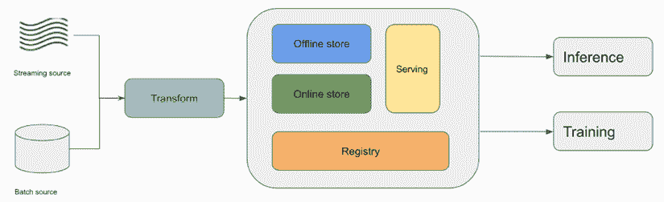

图 7.9：Feast 特征存储

Feast 架构的核心是线上线下特征存储，它作为特征数据的集中存储。特征存储库将特征数据存储在分布式存储系统中，允许进行可扩展和高效的存储和检索特征值。

Feast 采用了解耦架构，其中特征数据的摄取和特征的服务是分离的。数据摄取组件负责从各种来源提取特征数据，例如数据仓库、数据库和流平台。然后它将特征数据转换并加载到特征存储中，确保数据质量和一致性。

特征服务组件负责在训练和推理期间为机器学习模型提供低延迟的特征数据访问。特征服务组件还支持在线和离线服务模式，允许实时和批量特征服务。

为了实现高效的数据发现，Feast 采用了一个特征注册表。特征注册表允许根据不同的特征组合和时间范围快速查找和检索特征值。

Feast 还通过其 SDK 和客户端库与流行的机器学习框架，如 TensorFlow 和 PyTorch 集成。这些集成使得 Feast 能够无缝集成到机器学习管道和工作流程中，使数据科学家和机器学习工程师能够轻松访问和利用模型中的特征数据。

总体而言，Feast 特征存储架构为管理和提供机器学习特征提供了一个强大且可扩展的解决方案。通过集中管理特征数据，Feast 使组织能够提高生产力、改善模型性能并促进机器学习开发中的协作。

## 自动化机器学习管道工作流程

为了自动化我们迄今为止讨论的核心机器学习平台组件，我们需要构建能够使用这些组件编排不同步骤的管道。自动化提高了效率、生产力和一致性，同时实现了可重复性和最小化了人为错误。有几种开源技术可用于自动化机器学习工作流程，Apache Airflow 和 Kubeflow Pipelines 是其中的突出例子。

### Apache Airflow

**Apache Airflow** 是一个开源软件包，用于以编程方式创建、调度和监控多步骤工作流程。它是一个通用的工作流程编排工具，可以用于定义各种任务的流程，包括机器学习任务。首先，让我们探索一些核心的 Airflow 概念：

+   **有向无环图（DAG**）：DAG 定义了独立执行的任务，它们在管道中独立执行。执行顺序可以像图形一样可视化。

+   **任务**：任务是在 Airflow 中执行的基本单元。在执行过程中，任务之间存在依赖关系。

+   **操作符**：操作符是 DAG 组件，用于描述管道中的单个任务。操作符实现了任务执行逻辑。Airflow 提供了一系列操作符，用于常见任务，例如运行 Python 代码的 Python 操作符，或与 S3 服务交互的 Amazon S3 操作符。当实例化操作符时，会创建任务。

+   **调度**：DAG 可以按需运行或按预定的时间表运行。

+   **传感器**：传感器是一种特殊类型的操作符，旨在等待某个事件发生。然后，它们可以帮助触发下游任务的发生。

Airflow 可以在单台机器或集群上运行。此外，它还可以部署在 Kubernetes 基础设施上。以下图显示了多节点 Airflow 部署：

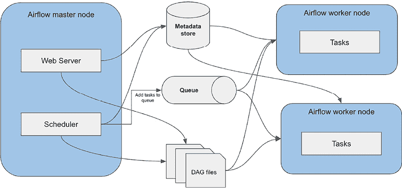

图 7.10：Apache Airflow 架构

**主节点**主要运行 **Web 服务器** 和 **调度器**。调度器负责调度 DAG 的执行。它将任务发送到队列，工作节点从队列中检索任务并运行它们。元数据存储用于存储 Airflow 集群和进程的元数据，例如任务实例详情或用户数据。

您可以使用 Python 编写 Airflow DAG。以下示例代码展示了如何使用 Python 编写一个基本的 Airflow DAG，其中包含两个按顺序排列的 Bash 操作符：

```py
from airflow import DAG
from airflow.operators.bash_operator import BashOperator
from datetime import datetime, timedelta
default_args = {
    'owner': myname,
}
dag = DAG('test', default_args=default_args, schedule_interval=timedelta(days=1))
t1 = BashOperator(
    task_id='print_date',
    bash_command='date',
    dag=dag)
t2 = BashOperator(
    task_id='sleep',
    bash_command='sleep 5',
    retries=3,
    dag=dag)
t2.set_upstream(t1) 
```

Airflow 可以连接到许多不同的来源，并为许多外部服务内置了操作符，例如 **Amazon EMR** 和 **Amazon SageMaker**。它已被许多组织广泛采用，用于在生产环境中运行大规模工作流程编排作业，例如协调 ETL 作业和机器学习数据处理作业。AWS 甚至提供了一种管理的 Airflow 服务，以帮助减少运行 Airflow 基础设施的操作开销。

Airflow 也存在一些限制。Airflow 不提供 DAG 开发的 UI 设计器，这对于没有 Python 编程技能的用户来说可能是一个挑战，因为他们需要设计工作流。与 DAG 管道缺乏版本控制也带来了管理和理解管道演变变体的一些挑战。在 Kubernetes 上运行 Airflow 可能很复杂，这也是为什么许多组织选择托管服务的原因。然而，尽管存在这些限制，但由于其企业级能力、强大的社区支持和丰富的生态系统，Airflow 仍然成为了一个高度流行的流程编排工具。

### Kubeflow Pipelines

**Kubeflow Pipelines** 是一个 Kubeflow 组件，它专为在 Kubernetes 上编写和编排端到端机器学习工作流而设计。首先，让我们回顾一下 Kubeflow Pipelines 的核心概念：

+   **管道**：管道描述了一个机器学习工作流，工作流中的所有组件，以及组件在管道中的相互关系。

+   **管道组件**：管道组件在管道中执行任务。管道组件的一个例子可以是数据处理组件或模型训练组件。

+   **实验**：实验组织了机器学习项目的不同试验运行（模型训练），以便您可以轻松检查和比较不同的运行及其结果。

+   **步骤**：管道中一个组件的执行称为步骤。

+   **运行触发器**：您可以使用运行触发器启动管道的执行。运行触发器可以是周期性触发器（例如，每 2 小时运行一次），也可以是计划触发器（例如，在特定日期和时间运行）。

+   **输出工件**：输出工件是管道组件的输出。输出工件的例子可以是模型训练指标或数据集的可视化。

Kubeflow Pipelines 作为 Kubeflow 安装的一部分被安装。它自带一个 UI，这是整体 Kubeflow 仪表板 UI 的一部分。Pipelines 服务管理管道及其运行状态，并将它们存储在元数据数据库中。有一个编排和工作流控制器来管理管道的实际执行和组件。以下图展示了 Kubeflow 管道中的核心架构组件：

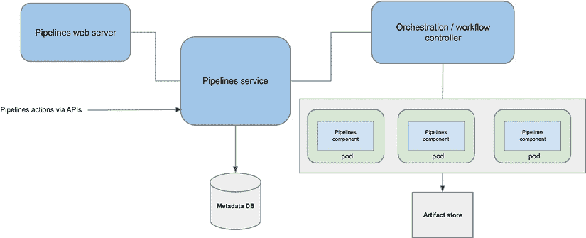

图 7.11：Kubeflow Pipelines 架构

您可以使用 Python 中的 Pipeline SDK 编写管道。要创建和运行管道，请按照以下步骤操作：

1.  使用 Kubeflow SDK 创建管道定义。管道定义指定了一组组件以及它们如何在图中连接在一起。

1.  将定义编译成由 Kubeflow Pipelines 服务执行的静态 YAML 规范。

1.  将规范注册到 Kubeflow Pipelines 服务中，并从静态定义中调用管道以运行。

1.  Kubeflow Pipelines 服务调用 API 服务器以创建运行管道的资源。

1.  编排控制器执行各种容器以完成管道运行。

需要注意的是，使用 Kubeflow Pipelines 运行管道需要具备高度的 Kubernetes 熟练度，这对于没有深厚 Kubernetes 技能的人来说可能具有挑战性。在 Python 中构建工作流程可能是一项复杂的任务，涉及为每个组件编写 Dockerfile 或 YAML 文件，以及为工作流程和执行编写 Python 脚本。Kubeflow Pipelines 主要在 Kubeflow 环境中工作，与外部工具和服务的集成非常有限。它还缺少本地的管道版本控制功能。尽管存在这些挑战，但由于其对端到端机器学习管理的支持、工作流程可视化、可移植性和可重复性，Kubeflow Pipelines 仍然被广泛采用。

现在我们已经探讨了用于构建 ML 平台的各种开源工具，让我们深入了解使用这些开源框架和组件的端到端架构。

# 设计端到端 ML 平台

在单独讨论了几种开源技术之后，现在让我们深入了解它们的集成，看看这些组件是如何结合在一起的。架构模式和技术栈的选择可能根据具体需求和需求而有所不同。以下图表展示了 ML 平台架构的概念性构建块：

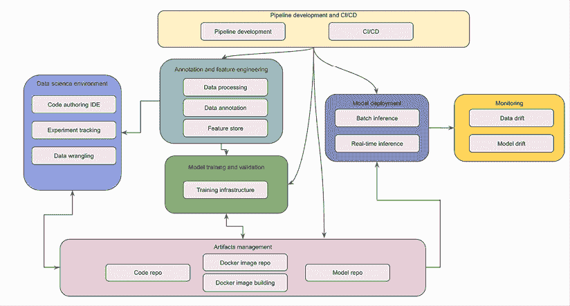

图 7.12：ML 平台架构

接下来，让我们深入了解不同的策略，以不同的开源技术组合来实现这种架构概念。

## 基于 ML 平台的策略

当使用开源技术设计 ML 平台时，一种有效的策略是利用 ML 平台框架作为基础平台，然后集成额外的开源组件以满足特定需求。这样的 ML 平台框架之一是 Kubeflow，它提供了一套强大的基础构建块，用于构建 ML 平台。通过利用 Kubeflow，您可以从其核心组件中受益，并通过集成互补的开源工具来扩展平台的功能。

这种策略通过无缝集成一系列开源 ML 组件到平台中，提供了灵活性和定制化。如果您的基础 ML 平台框架满足大部分需求，或者您可以在框架的限制内工作，您会选择这种方法。以下表格概述了关键 ML 平台组件及其相应的开源框架和工具：

| **ML 平台组件** | **开源框架** |
| --- | --- |
| 代码仓库 | GitHub |
| 实验和模型开发 | Kubeflow Jupyter Notebook |
| 实验跟踪 | MLflow 实验跟踪器 |
| 特征存储 | Feast 特征存储 |
| 数据标注 | 计算机视觉标注工具 (CVAT) |
| 训练 | Kubeflow 训练操作符 |
| 数据和模型测试 | Deepchecks |
| 模型仓库 | MLflow 模型仓库 |
| 机器学习管道开发 | Kubeflow 管道 |
| 模型推理 | Kubeflow KFServing（Seldon Core、TFServing、Triton） |
| Docker 镜像仓库 | Docker Hub |
| CI/CD | GitHub Actions |
| 漂移监控 | Deepchecks |

表 7.1：机器学习平台组件及其对应的开源框架

通过将这些框架和工具纳入架构概念图，我们可以将结果图可视化如下：

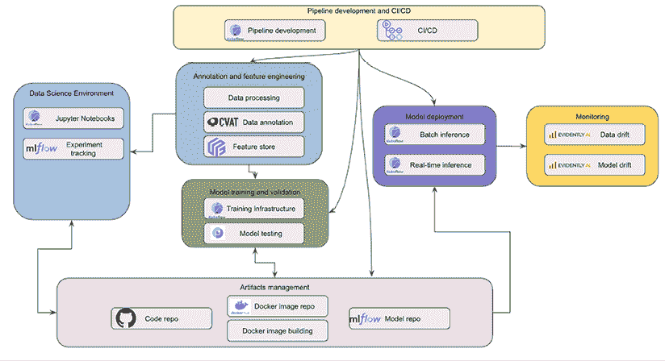

图 7.13：基于 Kubeflow 的机器学习平台

使用此架构，数据科学家利用 Kubeflow Jupyter Notebook 进行实验和构建模型。实验运行和相关细节，如数据统计、超参数和模型指标，被跟踪并保存在 MLflow 实验跟踪组件中。

常见的机器学习功能存储在 Feast 特征存储中。当需要数据标注时，数据标注员可以使用如 **计算机视觉标注工具**（**CVAT**）和 Label Studio 等开源数据标注工具来标注数据以供模型训练。数据科学家可以利用特征存储和标注数据集作为他们实验和模型构建的一部分。

GitHub 是数据科学家的代码仓库。他们将所有源代码，包括训练脚本、算法代码和数据转换脚本，保存在代码仓库中。模型训练和推理 Docker 镜像存储在 Docker Hub。可以将 Docker 镜像构建过程部署以创建用于训练和推理的新 Docker 镜像。

对于正式的模型训练，训练脚本从 GitHub 仓库拉取，训练 Docker 镜像从 Docker Hub 拉取到 Kubeflow 训练操作符以启动模型训练，包括训练数据集。可以使用 Deepchecks 进行数据验证和模型性能检查。一旦模型训练完成，模型工件以及任何元数据，如模型指标和评估图表，都存储在 MLflow 模型注册表中。

当是时候部署模型时，模型从 MLflow 模型注册表中检索并加载到 KFServing 以进行模型推理，包括模型推理 Docker 镜像和推理脚本。KFServing 提供了选择不同推理服务器（包括 Seldon Core、TFServing 和 Triton）的灵活性。

预测日志可以发送到模型监控组件以检测数据漂移和模型漂移。可以使用如 Evidently AI 等开源软件工具进行数据漂移和模型漂移检测。

为了编排各种任务，如数据处理、特征工程、模型训练和模型验证，可以开发 Kubeflow Pipelines。对于**CI/CD**（**持续集成/持续部署**），可以使用 GitHub Actions 作为触发机制来启动不同的管道。

总体而言，这种方法允许您结合基础机器学习平台框架的优势和广泛开源组件提供的灵活性。

## 基于机器学习组件的策略

另一种方法是使用单个组件而不是依赖基础机器学习平台框架来构建机器学习平台。这种策略的优势在于为平台每个方面选择最佳组件，使组织能够遵守其现有的开源标准，如管道开发或笔记本 IDE 的核心组件。以下架构模式说明了这种方法。

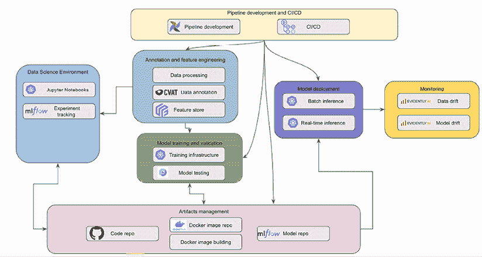

图 7.14：基于组件的架构

在这种架构模式中，利用替代技术和工具进行管道开发、笔记本环境和训练基础设施管理。此外，Kubernetes 作为基础设施管理框架。这种方法允许组织利用与其独特需求和偏好相一致的具体技术和工具。

一个值得注意的方面是使用 Airflow 作为跨多个技术学科的标准编排和管道工具，包括机器学习和数据管理。Airflow 在组织中的广泛应用使其成为统一的管道管理工具，促进不同组件和工作流程之间的无缝集成。

此外，这种架构模式强调在 Kubernetes 之上构建定制的训练和推理基础设施。通过利用 Kubernetes，组织可以获得创建定制化训练和推理环境的灵活性，以满足其特定需求。

除了提供满足机器学习平台要求的免费开源工具外，考虑将商业组件集成到开源架构中也很重要。这些商业产品可以增强机器学习平台的具体方面，并提供额外的功能。

例如，当在 AWS 上部署此架构模式时，建议探索使用 Amazon Elastic Container Registry (ECR)作为 Docker 镜像仓库。Amazon ECR 提供了一个托管和安全的解决方案，用于存储和管理容器镜像，与 AWS 其他服务无缝集成。

在监控方面，有像 Fiddler 和 Author AI 这样的商业产品可以提供高级功能和见解。这些工具可以增强机器学习平台的监控能力，提供深入分析、模型可解释性和模型行为及性能的可视化。

总体而言，这种架构模式的优点包括能够为机器学习平台的不同方面选择替代技术和工具，利用 Airflow 作为统一的管道管理工具，以及在 Kubernetes 上构建定制的训练和推理基础设施。这些选择使组织能够创建一个量身定制且优化的机器学习平台，与他们的需求精确匹配，并允许进行高度定制的训练和推理过程。

# 摘要

在本章中，您已经了解了典型机器学习平台的核心架构组件及其功能。我们探讨了各种开源技术，如 Kubeflow、MLflow、TensorFlow Serving、Seldon Core、Triton 推理服务器、Apache Airflow 和 Kubeflow 流水线。此外，我们还讨论了使用开源框架和工具设计机器学习平台的多种策略。

虽然这些开源技术为构建复杂的机器学习平台提供了强大的功能，但重要的是要认识到构建和维护这样的环境需要大量的工程努力和专业知识，尤其是在处理大规模机器学习平台时。

在下一章中，我们将深入探讨专门为促进机器学习环境开发和运营而设计的完全托管机器学习解决方案。这些托管解决方案旨在简化构建和管理机器学习平台的复杂性，提供预配置和可扩展的基础设施，以及针对机器学习工作流程的额外功能。

# 留下评论！

喜欢这本书吗？通过留下亚马逊评论来帮助像您这样的读者。扫描下面的二维码，获取您选择的免费电子书。


**限时优惠**
