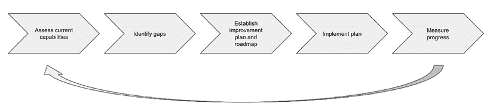

# 第十四章：规划您的机器学习旅程

利用人工智能/机器学习在客户体验提升、运营效率、更快更好的决策、风险降低以及新产品和服务等领域转型业务的过程既令人兴奋又具有挑战性，这需要周密的规划、执行和持续的管理。了解人工智能/机器学习旅程可能的样子以及关键挑战将有助于机器学习实践者和决策者在整个旅程中更好地规划。在本章中，我将探讨理解机器学习旅程的一些基本主题，例如采用的阶段和机器学习成熟度的评估。我们将探讨各种挑战，包括制定人工智能/机器学习愿景、启动人工智能/机器学习项目以及扩展用例、基础设施和治理，以满足市场不断增长的需求。

负责建立机器学习战略和扩展机器学习采用的业务和技术决策者会发现本章很有用，因为它提供了在构建组织机器学习成熟度和能力时的关键维度以及扩展组织人工智能/机器学习采用时需要考虑的因素的宝贵见解。通过遵循本章中提出的建议，决策者可以优化他们的机器学习战略并实现成功的机器学习采用之旅。具体来说，我将结合与许多组织在人工智能/机器学习旅程中合作的第一手经验来讨论以下主题：

+   机器学习采用阶段

+   理解机器学习成熟度和评估

+   人工智能/机器学习运营模式

+   解决采用挑战

# 机器学习采用阶段

组织采用和成熟人工智能/机器学习的路径可能各不相同。作为一名机器学习解决方案架构师，我已与处于人工智能/机器学习采用不同阶段以及具有不同机器学习经验水平的组织合作过。了解组织在人工智能/机器学习旅程中不同阶段的样子可以帮助决策者确定每个阶段的重要事项，识别组织可能面临的挑战，并确定需要做什么才能达到下一个水平。

基于我与各种组织合作的经验，我发现公司通常分为以下阶段。

## 探索人工智能/机器学习

处于这一阶段的公司是那些刚开始深入了解人工智能/机器学习世界的公司。他们通常没有人工智能/机器学习方面的先前经验，但他们认识到其有希望的潜力，并渴望探索其对业务的影响。

这些公司在尝试评估人工智能/机器学习对其业务的影响时通常会面临几个挑战。其中最大的挑战之一是确定合适的人工智能/机器学习项目来展示其价值。由于人工智能/机器学习有如此多的潜在应用，这些公司可能难以确定从哪里开始。他们可能在选择要解决的问题或使用的数据集方面遇到困难。

处于这一阶段的公司面临的另一个挑战是获取执行试点项目所需的企业和技术专业知识。AI/ML 是一个复杂的领域，需要高水平的技术专业知识和经验。这些公司可能需要雇佣或培训新员工，或与外部合作伙伴合作，以获得必要的知识和技能。

尽管存在这些挑战，处于这一阶段的公司有很大的机会了解 AI/ML 的潜力，并为成功的 AI/ML 整合奠定基础。通过从试点项目开始，他们可以获得宝贵的经验和洞察，了解 AI/ML 的潜力，并开始构建支持未来 AI/ML 项目的必要技能和专业知识。

我四年前或更早合作的大多数客户都属于这一类别，兴趣和主动性主要来自高级商业和技术领导者，如副总裁或工程总监，以及市场营销等业务职能的负责人。处于这一阶段的成功公司通常从解决实际业务问题的用例开始，并提供了与其他组织利益相关者产生共鸣的可衡量的利益。例如，我合作的一个组织从一项体育分析用例开始，该用例解决了一个劳动密集型任务，从而降低了成本并加快了洞察的交付。另一方面，另一个组织从一项需要重大投资回报分析流程变更的前瞻性用例开始，但它未能起飞。由于这些组织通常没有内部 ML 专业知识，成功的组织通常选择与有 ML 经验的合作伙伴合作，以获得概念验证或试点项目的启动。在这一阶段，ML 技术堆栈和基础设施效率通常不是这些组织的重点，因为主要目标是证明商业价值。

## 分离的 AI/ML

处于这一阶段的组织通常基于一些早期的成功，更广泛地在业务领域采用 AI/ML，并制定长期的战略 AI/ML 愿景。这些组织在各个部门通常具有不同程度的 AI/ML 能力，但缺乏一个统一的、企业级的 AI/ML 战略，很可能没有企业级 ML 平台。每个部门独立运营其 AI/ML 项目，使用 AI/ML 来满足特定的业务需求。部门间协作和共享有限，导致数据孤岛和 AI/ML 努力的分离。

这些组织在扩展和执行 AI/ML 计划时通常面临挑战。最大的挑战之一是缺乏专门的机器学习工程支持。数据科学家需要精通科学和工程，他们可能会面临跨越这两个领域的技术挑战。这些组织面临的另一个挑战是缺乏机器学习治理流程，导致对正在开发的模型、许多科学项目和实际生产工作负载的信心和采用率低。

随着处于这一阶段的组织继续在更多业务领域扩展他们的 AI/ML 努力，他们应该考虑建立更一致和集成的 AI/ML 努力，例如机器学习平台和技术标准化、统一开发和治理流程、组织对齐、数据和使用模型的重复使用以及知识共享。

快进到今天，我合作的多数组织都属于这一类别。许多这些组织对验证不同孤岛中这些计划的商业效益的监督有限，这导致许多项目变成了科学实验，而不是以业务成果驱动的计划。此外，缺乏对业务流程整合的专门努力导致许多项目未能进入生产阶段。为了从这一阶段向前推进，我合作的一些组织已经开始进行合理化他们的 AI/ML 努力的计划，包括组织和技术的合理化。例如，我合作的一些组织已经建立了一个新的首席数据官职能，以监督组织内的数据、分析和机器学习计划。他们开始制定一个多年度战略，以向更集成化的组织和技术堆栈迈进。许多这些组织还创建了专门的工程职能，以推动技术标准和共同的机器学习基础设施。

## 集成 AI/ML

处于这一阶段的公司认识到 AI/ML 对其业务的重要性，并已采取措施将 AI/ML 完全整合到其运营中。他们已经建立了一个清晰的组织结构，从业务和技术角度支持 AI/ML 计划。

这些公司已经投资于企业级机器学习和数据基础设施，以支持多个业务单元的实验和生产部署。他们在合理的地方整合了孤立的技术努力，并确立了机器学习治理和安全作为关键关注点。他们已经建立了特定的治理能力，例如 AI/ML 政策和程序、定义了角色和责任，并启用了治理的技术能力。

由于其对 AI/ML 的全面方法，这些组织已经看到了一系列的好处，包括成本节约、风险降低、用户体验改善和机器学习部署加快。AI/ML 已经成为他们业务运营的有机组成部分，他们继续投资和发展他们的 AI/ML 能力，以保持领先。

在我合作过的组织中，处于这一阶段的数量仍然很少，其中大部分仍在发展中。在这个阶段更为成熟的组织也为其业务和技术平台投入了 AI/ML 采用的努力。例如，许多组织已经建立了专门的专业工程团队，与不同的业务线合作，采用他们的企业机器学习平台并上线 AI/ML 工作负载。一些组织还建立了全企业范围的 AI/ML 会议/峰会，以推动内部关于用例、商业价值、最佳实践和创新的知识共享。

## 高级人工智能/机器学习

处于“高级人工智能/机器学习”阶段的公司已经将 AI/ML 作为其业务运营的关键部分，并在将 AI/ML 融入其产品和服务方面达到了高水平的专业性。他们是行业的领导者，也是 AI/ML 研究和 AI/ML 在现实世界应用中的先驱，有助于塑造更广泛行业的方向。

这些公司有能力产生由 AI/ML 驱动的颠覆性商业概念和产品，对行业产生持久影响。他们深刻理解 AI/ML，并能够利用这一知识推动创新并保持领先。

此外，这些公司拥有完善的机器学习基础设施和治理体系，使他们能够快速实验新的 AI/ML 模型，并将新产品和服务推向市场。他们还能够有效管理与 AI/ML 相关的风险，并确保其应用符合监管和伦理标准。

在这个阶段，我已经与几家组织合作过，主要是在金融服务和高科技行业。这些组织不仅采用了最先进的机器学习技术，培养了数据驱动的文化，并发展了强大的 AI/ML 产品和解决方案思维，而且还建立了 AI/ML 研究功能，以帮助推进具有潜在行业影响的 AI/ML 研究。此类研究包括金融市场模拟、AI/ML 安全和隐私。

# AI/ML 成熟度和评估

为了评估组织在不同阶段采用机器学习的准备程度，通常使用机器学习成熟度这一概念作为衡量标准。机器学习成熟度指的是组织在多个维度上成功实施机器学习的能力。在较高层次上，描述组织机器学习成熟度时可以考虑以下四个关键维度：

+   **技术成熟度**：这指的是组织在机器学习领域的专业技术能力和技能。技术成熟度可以通过所使用的机器学习算法和模型的复杂性、数据的质量和可用性、机器学习基础设施的规模和效率，以及组织将机器学习与其他系统和流程集成的能力来衡量。

+   **业务成熟度**：这指的是机器学习在组织的产品开发生命周期、业务流程和决策中的整合程度。业务成熟度可以通过机器学习用例的数量、机器学习对组织**关键绩效指标**（KPIs）的影响，以及机器学习与其他业务功能之间整合的水平来衡量。

+   **治理成熟度**：这指的是组织在负责任地使用机器学习方面的政策和实践。治理成熟度可以通过组织确保数据隐私和安全的能力、机器学习模型的可透明性和可解释性水平、遵守相关法规和标准程度、识别和缓解与机器学习采用相关的潜在风险的能力，以及测量和管理整体流程的能力来衡量。

+   **组织和人才成熟度**：人才成熟度可以通过组织招聘和留住数据科学家和机器学习工程师的能力、为机器学习人才提供的培训和开发机会，以及组织的整体创新和协作文化来衡量。这也涉及组织建立支持性的文化和流程，以促进 AI/ML 产品和能力的开发和采用。

为了评估组织在 AI/ML 每个维度的成熟度，可以开发一份问卷来确定组织是否具备所需的技能。在接下来的章节中，我们将回顾一些样本问题，旨在提供成熟度的方向性评估。请注意，这些问题并不提供每个问题的实际得分或权重，因为每个 AI/ML 能力的相对重要性可能因组织而异。这些问题的目的是帮助识别每个领域的差距，以便组织可以根据自己的需求和背景评估这些差距的重要性，并确定如何最好地解决它们。组织应根据自己的需求对这些样本问题进行定制和扩展。

## 技术成熟度

人工智能系统技术成熟度评估侧重于评估组织在几个关键子领域的能力和准备情况，这些子领域与 AI 系统的开发、部署和维护相关。这项评估在确保组织拥有支持负责任和有效实施 AI 解决方案所需的技术基础和资源方面发挥着关键作用。通过评估这些技术子领域，组织可以识别其在 AI 能力方面的优势、劣势和改进领域。

| **维度** | **评估问题** |
| --- | --- |
| 数据 | 组织是否建立了全面的数据管理框架，用于数据获取、存储、处理和保护？ |
| 组织是否建立了数据治理流程和政策，包括对数据隐私、安全和伦理的考虑？ |
| 组织是否建立了获取新数据、从现有数据生成新派生数据以及为商业用途生成合成数据的过程和能力？ |
| 组织是否建立了确保其数据质量可靠性的过程和控制，包括数据清理、归一化和验证？ |
| 组织是否建立了确保相关数据对所有利益相关者（包括数据科学家、工程师和业务用户）易于访问的过程？ |
| 组织是否建立了安全控制措施来保护其数据，包括加密、访问控制和审计跟踪？ |
| 技术基础设施和机器学习工具 | 组织是否建立了强大且可扩展的技术基础设施来支持 AI 的开发，包括对硬件、软件和网络安全的考虑？ |
| 组织是否拥有用于开发和应用 AI 产品或解决方案的工具和平台，包括数据科学和机器学习平台？ |
| 组织是否建立了将 AI 集成到现有系统和工作流程中的能力，包括对数据集成、系统集成和安全集成的考虑？ |
| 组织是否建立了自动化开发和部署工作流程的能力？ |
| 组织是否建立了监控和维护其 AI 系统和模型的过程和能力，包括对性能、准确性和安全性的考虑？ |
| 组织是否有能力扩展其 AI 系统和模型以满足不断变化的业务需求，包括对数据量、速度和多样性的考虑？ |
| 算法和模型 | 组织是否使用任何先进的机器学习技术或算法，如神经网络、生成对抗网络或强化学习来解决业务问题？ |
| 组织是否使用利用多种模态（例如，文本、图像、表格数据等）的算法来解决业务问题？ |
| 组织是否使用高级模型开发模式，如迁移学习、从基础模型进行微调或多任务学习？ |

## 商业成熟度

商业成熟度维度考察了为解决实际商业问题而实施的机器学习用例的数量和种类，以及任何已建立的业务指标来衡量机器学习的影响。在更多业务中采用人工智能/机器学习的组织可能比采用较少业务的人工智能/机器学习组织具有更高的商业成熟度。通过机器学习解决的业务问题范围也是组织在人工智能/机器学习方面的商业成熟度的另一个关键指标。例如，机器学习可以应用于各种场景，包括基本的预测分析，如销售预测和定向营销，关键决策支持，如医疗诊断，以及复杂的认知推理和战略规划，如自动驾驶。为了评估这一成熟度水平，可以提出以下一些示例问题：

| **维度** | **评估问题** |
| --- | --- |
| 人工智能/机器学习的商业采用 | 有多少不同的业务功能或领域将人工智能/机器学习整合到其工作流程中？ |
| 使用人工智能/机器学习解决的业务问题有多复杂？ |
| 是否有任何商业决策已经完全通过人工智能/机器学习自动化？ |
| 是否建立了识别人工智能/机器学习商业用例的流程？ |
| 是否建立了关于人工智能/机器学习商业案例的决策机制？ |
| 是否有机制将人工智能/机器学习整合到现有的业务流程中？ |
| 测量 | 组织是否建立了衡量不同人工智能/机器学习解决方案影响（**投资回报率**（**ROI**））的指标？ |
| 与采用人工智能/机器学习之前相比，取得了多少改进？ |
| 测量影响的机制是否定期审查并更新，以确保其有效性？ |

## 治理成熟度

政策和合规性成熟度评估旨在评估组织在三个关键领域的成熟度水平：政策和合规性、模型治理和风险管理。这些领域对于确保人工智能系统的负责任开发、部署和监控至关重要，尤其是在高风险领域。通过评估这三个领域，政策和合规性成熟度评估使组织能够对其在负责任管理人工智能系统方面的优势和劣势有一个良好的了解。它有助于识别差距和改进领域，使组织能够开发和实施与最佳实践和监管要求相一致的强大治理框架。

| **维度** | **评估问题** |
| --- | --- |
| 政策和合规性 | 组织是否建立了政策和流程，以确保遵守与人工智能和机器学习相关的法律、伦理和监管要求，包括对数据隐私、安全和偏差的考虑？ |
| 模型治理 | 组织是否建立了治理流程和框架，以管理 AI 和 ML 模型的发展、部署和持续维护，包括模型风险管理、透明度和问责制方面的考虑？ |
| 风险管理和缓解 | 组织是否建立了风险管理流程和框架，以识别、评估和管理与 AI 和 ML 相关的风险，包括声誉、安全和伦理方面的考虑？ |
| 组织是否建立了护栏和缓解机制和技术？ |

## 组织和人才成熟度

组织和人才成熟度维度评估组织是否具备适当的组织流程、结构和人才管理实践，以成功执行其 AI/ML 战略和项目。这包括评估因素，如组织对 AI/ML 倡议的协调和支持、治理框架和决策流程、AI/ML 角色的人才获取和发展策略、AI 采用的变革管理准备情况以及鼓励 AI 创新的激励机制。通过考察这一维度，组织可以识别差距并制定策略，以构建支持其 AI/ML 目标的有效组织能力、流程和人才管道。

| **维度** | **评估问题** |
| --- | --- |
| 组织 | 组织是否有一种支持并鼓励使用 AI 的文化，包括对创新和实验的关注？ |
| 该组织是否有支持人工智能开发和部署的流程和工作流程，包括项目管理、质量保证和风险管理？ |
| 组织是否建立了跨职能团队和协作框架，以支持 AI 的开发和部署？ |
| 组织是否建立了变革管理框架来管理 AI 对组织及其利益相关者的影响，包括采用、培训和沟通方面的考虑？ |
| 人才 | 组织是否制定了人才战略，以吸引、保留和发展 AI 所需的必要技能和专业知识，包括数据科学、工程、DevOps/MLOps 和商业技能？ |

您对这些问题的回答并非旨在对每个领域进行全面评估，而是突出组织为达到不同成熟度所需要发展的关键人工智能/机器学习能力。组织可以利用这些答案来帮助确定改进领域，并基于其独特情况和需求制定定制策略和详细计划，以增强其在各个领域的 AI 能力。

## 成熟度评估和改进流程

为了随着时间的推移实现 AI 成熟度，一个组织需要遵循一个结构化的过程来评估、规划、改进和衡量不同维度，这是一个迭代的过程。以下图表展示了一个示例过程：

图 14.1：AI 成熟度评估和改进

该过程从评估一个或多个维度上的当前 AI 能力开始，这取决于组织的具体需求。这通常是通过回答评估问卷中的问题来完成的，这些问题涉及从组织内参与 AI 项目的不同团队和利益相关者收集的数据点和输入。在这一步骤中需要避免的一些陷阱包括评估缺乏明确的目标、评估标准存在偏见、利益相关者参与有限、过度强调技术以及缺乏可操作的见解。

在收集信息和回答问题后，一个组织可以在不同维度上识别当前状态与期望状态之间的差距。例如，一个组织可能会识别出由于缺乏数据管理流程和技术导致的糟糕数据质量，或者由于糟糕的 AI 用例审查机制和缺乏有效的变革管理导致的 AI 采用率低等问题。在这一步骤中需要避免的一些陷阱包括识别出的差距缺乏具体性、解释存在偏见、发现缺乏优先级以及未考虑组织文化在变革中的作用。

基于 AI 采用中的发现和组织目标，一个组织可以制定具有明确里程碑的计划，以关闭对组织重要的差距。例如，如果一个组织希望更好地了解 AI 项目的投资回报率（ROI），那么它们应该定义明确的 KPIs 以及收集和衡量 AI 项目影响的机制。如果组织希望通过标准化技术和流程提高效率，那么它们应该考虑调整运营模式和项目以达到这一目标。在这一步骤中需要避免的一些陷阱包括期望不切实际、沟通不足、资源不足以及利益相关者参与不足。

计划实施是一个复杂且具有挑战性的任务，它取决于范围及其对人员、组织、技术和流程的影响。组织需要考虑务实的实施方法，以最大限度地减少这些变化可能给组织带来的负面影响。例如，如果计划要求改变运营模式，那么考虑其对人员和流程的影响并确保实施有效的变革管理计划是非常重要的。此外，根据组织需求考虑变化的范围，例如部门级、**业务线**（**LOB**）级或组织级。其他考虑因素包括选择实施的目标维度（例如，技术成熟度与组织成熟度）。在这个步骤中需要避免的一些陷阱包括范围蔓延、过于雄心勃勃的时间表、对变革的抵制、培训和支持不足以及缺乏高级领导支持。

为了了解组织是否在改进，重要的是要衡量计划和其实施的有效性。应建立具体的 KPI 来帮助衡量进度。这些 KPI 可以包括诸如人工智能工作负载部署速度、人工智能工作负载的平均投资回报率、接受人工智能/机器学习培训的人数、生产率提高和客户满意度提高等指标。在这个步骤中需要避免的一些陷阱包括缺乏明确的指标、过度强调定量指标以及缺乏行业基准。

人工智能成熟度的评估和改进是一个迭代的过程，需要持续调整过程、计划和实施，以确保在不同维度上取得成功。还有一些工具和框架可以用于评估和测量，例如 MITRE 人工智能成熟度模型和组织评估工具指南。

# 人工智能/机器学习运营模式

人工智能/机器学习运营模式在组织实现其人工智能成熟度目标方面发挥着关键作用。它可以在一系列关键维度上产生深远的影响，例如组织敏捷性、治理和标准化、资源和技术效率、领域专业知识、风险管理以及所有权和问责制。

组织在决定其人工智能项目的运营模式时，需要考虑其独特的组织需求。从高层次来看，有三种主要的运营模式可以考虑：集中式、分散式和中心辐射式。

## 集中式模式

对于刚开始机器学习之旅并寻求高效利用其稀缺机器学习人才的组织，他们可能想要考虑集中式模式，尤其是如果主要目标是统一的 AI/ML 战略、机器人才力的整合以及技术和工具的标准化。

在集中式模型中，一个单一的中心团队负责所有机器学习活动的各个方面，从数据收集到模型开发再到部署。这个团队主要由数据科学家、机器学习工程师、MLOps 工程师、软件工程师以及其他相关角色，如项目管理员组成。这个团队与不同的业务线合作，在人工智能/机器学习的各个方面从构思到生产部署。这种模型使组织能够在单一团队内整合人工智能/机器学习专业知识、基础设施和工具，促进知识共享、一致性和高效资源利用。

虽然集中式 AI/ML 运营模型提供了如专业知识整合、资源优化和一致治理等优势，但组织必须意识到潜在的瓶颈、延迟和知识差距。随着需求的增长，一个推动所有倡议的单个中心团队可能会变得不堪重负，减缓创新和部署。这个团队也可能缺乏对特定领域的深入理解，导致解决方案无法充分满足特定业务单元或功能区域的需求。因此，如果最终用户感觉与开发脱节或与需求不一致，可能会出现抵制采用的情况。此外，集中化的方法可能会限制灵活性，限制实验和快速适应不同领域的市场变化。

## 去中心化模型

如果一个组织优先考虑提供针对本地和特定领域需求的快速响应，拥有广泛的本地和领域专业知识以及自主权，那么采用去中心化的运营模式可能是一个不错的选择。这尤其适用于组织在组织内部拥有足够的机器学习资源，并且建立统一的 AI/ML 技术标准和战略不是首要任务时。

在这个模型中，不是由一个集中的团队推动所有的 AI/ML 工作，而是各个单位或团队拥有自主权和资源来开发和应用针对其特定领域或用例的 AI/ML 解决方案。这种去中心化的方法允许更大的灵活性，因为团队可以快速响应不断变化的企业需求和市场需求，而不会受到集中流程或瓶颈的限制。此外，它通过使团队能够尝试与其各自领域最相关的新的 AI/ML 技术和方法来促进创新。

在实施这种模型时，组织必须考虑潜在的挑战。随着多个团队或业务单元自主开发 AI/ML 解决方案，存在方法、方法论、工具和最佳实践不一致的风险。这种缺乏标准化可能导致兼容性问题、重复工作，以及在整个组织内整合或扩展解决方案的困难。

在去中心化的模型中，建立和执行一个一致的治理框架、政策和指南，以负责地开发和应用人工智能变得更加具有挑战性。这增加了不遵守法规、伦理原则或组织标准的风险。去中心化的团队可能会在孤立中运作，限制知识共享和组织内部思想的交叉融合。如果没有集中的协调机制，可能会出现资源分配低效的情况，一些团队资源不足，而其他团队则存在冗余或未充分利用的资源。

## 集中辐射模型

如果一个组织需要在敏捷性、创新和特定领域解决方案之间取得平衡，同时保持一致性、合规性和高效的资源分配，他们可以考虑采用集中辐射模型。这对于一个大型组织尤其有益，该组织在多个业务单元、产品线或地理区域运营。

在集中辐射模型中，由主要数据科学家、机器学习专家、人工智能平台专家以及有时风险管理专业人员组成的集中式跨职能团队充当中心。这个中心与组织中的去中心化团队（称为辐射）进行协作。中心团队提供基础资源、工具和指导，以支持组织的 AI 项目。他们的职责包括制定和维护与整体商业目标一致的组织 AI 战略和路线图，建立 AI 开发、部署和监控的标准、最佳实践和治理框架，提供培训和发展计划以增强组织内的 AI 能力，并促进辐射团队之间的协作、知识共享和最佳实践的采用。

轮辐团队，位于组织内的各个业务单元或功能区域，利用中心提供的资源、工具和指导来设计和实施针对其独特业务需求的 AI 解决方案。这些团队可能包括各种角色，包括对特定业务领域或问题空间有深入知识的领域专家，负责管理特定领域数据和 ML 模型的 ML 和数据工程师，负责将 AI 模型集成和部署到现有系统、应用程序或产品中的应用开发者，以及负责在其各自领域内识别和优先考虑 AI 用例和机会的业务利益相关者和产品负责人。他们与中心团队协作，确保与组织的 AI 战略和治理框架保持一致，开发、测试和部署 AI 模型和应用，利用中心提供的集中式 AI 平台和工具，监控其领域内部署的 AI 系统的性能和影响，并向中心团队提供特定领域的专业知识和反馈，以促进持续改进和知识共享。

轮辐模型也带来了一组自己的挑战。该模型的有效运行高度依赖于中心与轮辐团队之间强有力的沟通和协调，当管理多个业务单元和功能区域的团队时，这可能尤其具有挑战性。此外，优化这些团队之间的资源分配可能具有挑战性，因为一些团队可能面临资源短缺，而其他团队可能有过剩的资源，导致效率低下。在分散的团队中建立和执行 AI 开发和部署的治理框架和合规标准又增加了一层复杂性。成功克服这些障碍需要明确的治理结构、有效的沟通渠道、敏捷的开发流程以及在整个组织中培养协作和知识共享的文化。

总之，ML 运营模式的选择取决于多种因素，包括组织的规模和结构、组织内的专业知识水平以及具体的业务需求和目标。无论选择哪种模式，建立明确的角色和责任、稳健的流程和有效的沟通渠道对于确保 ML 解决方案和产品的成功开发和部署至关重要。

# 解决 ML 旅程挑战

到目前为止，你应该对关键 ML 成熟度维度有良好的理解，包括技术、业务、治理以及组织和人才，这对于成功采用 AI/ML 至关重要。接下来，让我们深入了解建立这些 AI 成熟度能力的关键步骤以及解决 ML 旅程中面临的一些关键挑战，从创建 AI 愿景和战略开始。

## 发展人工智能愿景和战略

为了发展人工智能愿景和战略，组织应首先定义人工智能愿景的目的和范围。愿景应解释为什么组织追求人工智能战略以及它希望实现哪些商业价值。例如，银行客户支持组织的人工智能愿景可能是通过人工智能转型业务运营并改善客户体验；制药公司可能希望利用人工智能简化药物发现过程并改善患者护理；制造商可能希望利用人工智能技术将工厂转变为智能工厂，以提高制造效率并减少停机时间。

在确定了整体愿景后，组织应对其当前状态的能力进行彻底分析，并描述期望的未来状态结果和目标。应识别当前状态与期望目标状态之间的差距；为组织制定可操作和可实现的策略，以向未来状态迈进。

战略应涵盖诸如投资哪些机器学习技术、引入哪些文化和组织变革、使用人工智能执行哪些任务和业务功能，以及构建和实施哪些人工智能技术产品和服务等方面。

接下来，组织应定义短期、中期和长期的实施策略和里程碑。这应描述人工智能愿景将如何分阶段实施，以及每个阶段的预期范围、用例和结果。

战略应包括如何通过财务和非财务指标（如客户满意度评分、运营效率提升和收入增加）的组合来衡量人工智能愿景的成功。

最后，组织应明确识别所有人工智能愿景和执行的关键利益相关者。这包括客户、合作伙伴、员工以及他们各自的角色和责任。

## 开始第一个人工智能/机器学习项目

对于没有先前人工智能/机器学习专长的组织，开始第一个人工智能/机器学习项目通常是一项具有挑战性的任务。有许多因素需要考虑，包括第一个项目及其范围、赞助商和利益相关者、必要的技能和资源、数据可用性和质量、工具和技术的选择、实施策略以及变革管理的更广泛影响。作为一名机器学习架构师，我已与许多成功启动第一个人工智能/机器学习项目的组织以及那些难以开始的组织合作过。在以下部分，我将提供我的专业经验中的真实世界例子，以说明这些挑战和最佳实践。

我曾与一家组织的工程领导团队合作，该组织旨在将其客户支持工作流程中的 AI 能力引入，以增加公司产品的交叉销售和升级销售。团队有一个想法，即使用 AI 从通话记录中提取见解，以识别客户意图并根据客户的档案和意图推荐新产品。对商业效益、运营工作流程和潜在解决方案架构进行了大量分析。虽然这个想法在概念上是有道理的，但它没有考虑到其他因素，包括下游组织和系统中的业务变化、缺乏跨职能利益相关者的支持、缺乏承诺以及与产品核心客户参与模型的不一致。因此，该项目未能获得资金，因为感知到的商业效益不足以证明投资和变革管理的必要性。

在另一个我参与的项目中，一个组织寻求使用 ML 通过预测用户点击广告印象的可能性和用户的潜在价值来最大化其广告预算的回报。

对提案进行了财务分析并撰写了商业案例，项目因此获得批准，作为试点项目向前推进。然而，执行团队拒绝使用任何外部援助，尽管团队在这个领域的数据科学经验非常有限——他们选择在工作中学习。结果，项目进展缓慢，因为团队不得不进行许多耗时耗力的实验，以验证他们遇到的任何假设和决策。尽管团队在重大延误后最终开发出了一个可工作的试点项目，但它并没有带来预期的商业提升，也没有进一步的资金分配来继续项目。

我参与的一个组织中，有几个想法旨在使用 AI 增强的分析来改善粉丝参与体验。该组织在这个主题上没有 ML 经验，但愿意与拥有 ML 能力的合作伙伴合作。团队共同分析了每个想法的技术可行性和商业效益、数据可用性和质量，以及业务工作流程和上下游系统所需的变革管理。决定选择一个在模型结果和采用方面具有高度成功可能性的想法。这个想法也与内部利益相关者产生共鸣，因为他们能够与这个想法产生共鸣。试点项目成功执行，并制定了长期愿景和计划，以扩展 AI/ML 的采用，并实施了一个人才提升计划，以培养内部人才，为未来的项目做准备。

总结来说，对于许多组织来说，开始第一个 AI/ML 项目可能是一项具有挑战性的任务，第一个试点项目的成功或失败可能会对组织内 AI/ML 采用的未来方向产生重大影响。以下是在开始你的第一个 AI/ML 试点时需要遵循的一些关键最佳实践：

+   **项目选择**：选择一个在组织背景下具有明确商业效益的项目。商业效益不一定是财务效益，但需要与内部和外部利益相关者产生共鸣，因为这些利益相关者可以是项目的强大支持者。避免高风险和复杂的项目，并确保项目有一个明确的商业赞助者。

+   **项目范围和执行**：保持范围小，只要它能证明商业效益。确保项目在人员、技能、数据、基础设施、变革管理和执行方面是可实现的。使用经验丰富的合作伙伴在需要的地方降低风险。从 POC（原型）开始，以证明技术可行性和商业价值，如果它们不明确或未定义。

+   **测量**：建立商业指标来衡量项目的增量价值。这对于确保未来投资的批准和评估项目的成功至关重要。此外，测量开发和维护项目的成本回报率，以确保持续产生效益。

总之，开始你的第一个 AI/ML 项目可能是一项艰巨的任务，第一个试点项目的成功或失败可能会显著影响你组织内 AI/ML 采用的未来方向。

## 通过 AI/ML 采用解决扩展挑战

随着组织采用 AI/ML 技术，它们通常会面临扩展挑战。这些挑战多种多样，可能包括难以定义和实施正确的用例、获取和管理必要的数据、获取和保留所需的人才和技术，以及确保 AI/ML 计划的组织设计和治理框架到位。

组织在扩展 AI/ML 时面临的最大挑战之一是确定最合适的用例来实施。有时并不总是清楚 AI/ML 可以帮助解决什么问题，或者这项技术如何集成到现有的业务流程中。因此，组织可能会投资于与其需求不完全一致的应用场景，这会导致延误、低效和低回报率。我记得曾与一家大型金融服务公司的首席数据科学家交谈，询问他在采用 AI/ML 时面临的最大挑战。令我惊讶的是，他的回答与科学或技术无关，而是找到既能为他客户也能为公司带来价值的应用场景是他最大的挑战。

组织在扩展时面临的另一个挑战是在确保获取正确数据。与传统的数据管理和分析不同，AI/ML 依赖于来自不同模态的大量数据来训练模型和做出预测，因此获取高质量、可靠的数据至关重要。这不仅仅是对数据受限的组织而言的挑战，因为即使是数据丰富的组织也面临着数据所有权、数据质量、数据安全和隐私以及数据访问的挑战。我亲眼目睹了组织在获取支持其 AI/ML 扩展努力所需的大量数据时所面临的困难，尤其是在将数据迁移到公共云时，许多企业都在那里构建他们的 AI/ML 基础设施。

使用合适技能和经验吸引并留住人才是组织在扩展 AI/ML 时面临的另一个挑战。这对那些希望建立内部 AI/ML 能力的组织来说尤其如此，因为对 AI/ML 专业人才的需求很高，而可用的人才库却很有限。

因此，组织需要投资于培训和开发计划，以帮助构建现有员工的技能或寻找其他途径来获取他们所需的人才。

最后，组织需要确保其技术和组织设计以及治理框架与 AI/ML 计划保持一致。这要求组织清楚地了解实现大规模 AI/ML 采用所需的任何要求，包括任何监管要求，以及评估当前系统、流程、政策和必要的变更，以支持 AI/ML 的集成和扩展。例如，组织可能需要投资新的基础设施和工具，实施新的安全和隐私协议，或修改其决策流程，以确保 AI/ML 的使用符合伦理和法律要求。由于大多数组织在这个领域都是新手，因此正确设置一切往往需要很长时间和多次迭代。

解决 ML 采用的各种扩展挑战是一项复杂的任务，需要组织进行重大投资，并详细规划执行。接下来，我将讨论一些解决这些挑战的建议。

### 解决 ML 用例扩展挑战

当涉及到大规模识别 ML 用例时，遵循结构化的方法并进行跨职能协作以确保成功至关重要。以下是一些识别 ML 用例的最佳实践。

#### 分析业务流程并参与利益相关者

为了有效地采用和利用 ML 技术，对组织的业务流程进行全面分析至关重要。这种分析应旨在识别任何可以通过使用 ML 解决的问题或改进领域。

分析应是一个协作努力，涉及来自组织各个部门和企业单位的利益相关者。这将有助于确保组织对所有利益相关者的需求和需求有清晰的理解，并且机器学习的使用与组织的整体目标和目标保持一致。

在分析过程中让利益相关者参与，也将有助于识别机器学习（ML）改善业务流程和结果的机会。例如，机器学习可用于自动化重复性任务，简化决策过程，并提高各种业务操作的准确性和效率。然而，要完全实现这些好处，了解不同利益相关者的具体需求以及如何利用机器学习来满足这些需求至关重要。

#### 评估常见的行业用例和解决方案

组织应了解并审查其行业正在使用的常见机器学习用例和解决方案，以识别在其组织中利用机器学习改进的潜在机会。这有助于识别已经证明有效的机会，并提供已证明的回报率（ROI）。这也有助于组织跟上其行业最新的机器学习趋势和最佳实践。

组织可以从研究和审查其行业正在使用的常见机器学习用例和解决方案开始。这可能包括案例研究、白皮书和报告，这些报告提供了关于组织在其行业中使用机器学习时所面临的成功和挑战的见解。通过研究这些例子，组织可以更好地了解机器学习的各种应用，并识别自身流程和运营中改进的机会。

#### 运行新的想法生成项目

组织可以通过运行结构化的想法生成项目来培养创新和创造力。这些项目可以采取定期活动如知识分享会、专利驱动或黑客马拉松的形式，并为员工提供一个提出与机器学习和其他相关技术相关的新颖和创新想法的平台。

例如，可以组织知识分享会，将组织内来自不同领域的专家聚集在一起，分享他们在机器学习方面的经验、学习和最佳实践。这些会议有助于促进跨职能协作，鼓励思想交流，从而推动新的和创新解决方案的开发。

破解马拉松（Hackathons）是组织中另一种流行的创意生成机制。它们为员工提供了一个在短时间内共同工作，提出新创意的平台。破解马拉松可以围绕与 ML 相关的特定主题组织，例如为特定领域开发新模型或提高现有模型的表现。破解马拉松的目标是鼓励员工进行创造性思考，并提出新的和创新的解决方案。

#### 建立 ML 用例存储库和模型中心

组织可以创建集中式存储库和中心，以存储和管理各种 ML 用例和模型。这些存储库和中心可以帮助组织更好地管理其 ML 资产，促进协作和思想共享，并鼓励现有模型和解决方案的重复使用。

ML 用例存储库可以包含组织内部实施的各种用例的目录，以及相关信息，如问题陈述、使用的数据、模型架构和性能指标。这些信息可以被组织内的其他团队用来了解不同用例采取的方法，并帮助他们为自己的项目识别潜在的解决方案。

相反，模型中心可以作为组织内部开发的多种 ML 模型的集中存储和管理位置。这些模型可以轻松被其他团队访问和重复使用，减少重新发明轮子的需要，并加快开发过程。模型中心还可以包括有关模型的信息，如性能指标、用于训练的数据和应用领域。

#### 新的商业模式和产品创新

随着组织探索新的商业模式和产品概念，考虑 ML 在为客户提供独特和有价值的产品方面发挥的作用是很重要的。

将机器学习（ML）融入新商业模式和产品的设计是一种实现方式。这可能包括使用 ML 来自动化某些流程，提高决策的准确性，并为顾客提供更加个性化和相关的体验。例如，一家电子商务公司可以利用 ML 根据客户的个人偏好和购买历史向他们推荐产品，从而提供更加个性化的购物体验。

除了将 ML 融入现有的商业模式和产品之外，组织还可以探索新的市场，并识别通过使用 ML 可以产生的新的收入来源。例如，一个组织可以利用 ML 分析客户数据，并识别出对特定客户群体有吸引力的新产品或服务。或者，一个组织可以利用 ML 自动化某些流程并降低成本，使其能够进入新市场或扩大其现有产品。

#### 评估和批准用例

为了确保 AI/ML 用例能够实现预期的商业价值，在实施前建立评估和批准用例的资格框架和流程非常重要。资格框架中可以包括的一些考量因素有：

+   **商业影响**：用例应具有有意义的商业影响，例如增加收入、降低成本、减少工作量或提高客户满意度。

+   **数据可用性**：应提供足够的高质量数据以支持用例。这包括用于模型开发的训练数据和用于模型部署的实时数据。

+   **可行性**：用例在技术上应该是可行的，需要考虑数据集成、基础设施需求和资源可用性等因素。

+   **伦理考量**：用例不应有任何负面的伦理影响，例如侵犯隐私或歧视某些群体。

+   **合规性**：用例应遵守所有相关的法规和法律规定，例如数据隐私法或行业特定法规。

+   **风险评估**：与用例相关的潜在风险，如模型偏差或预测错误，应进行评估和缓解，以确保用例安全部署。

通过遵循这些最佳实践，组织可以大规模地识别合适的 ML 用例，并确保他们的 ML 项目与业务目标一致，并具有最佳的成功机会。对于组织来说，持续监控和评估他们的 ML 项目也非常重要，以确保他们能够实现预期的结果，并且与组织的整体 AI 愿景和目标保持一致。

### 解决技术扩展挑战

当开始 AI/ML 项目时，在 ML 旅程的早期，组织可能拥有有限的技术基础设施和工具，这导致他们使用诸如 Jupyter Notebook 和 ML 库等开源工具，在个人笔记本电脑或台式机上工作，而不需要正式的 IT 支持。这些组织的数据科学家将手动安装和配置这些数据科学环境，手动收集数据，创建自己的训练数据，并在部署到生产环境之前在本地训练模型。我曾与几个面临不同挑战的组织合作，这些挑战包括数据丢失和知识产权侵犯、数据隐私违规，以及在部署前后无法验证和审计模型性能。不完善的技术基础设施也限制了这些组织在更高级的 ML 问题上的工作能力。

为了减轻这些风险和挑战，许多成熟的组织选择实施企业级机器学习平台来支持其不断增长的机器学习项目需求，并更全面地管理风险和合规性。根据其机器学习基础设施的当前状态，组织可能会面临不同的扩展挑战，并选择不同的路径来扩展其技术基础设施。接下来，我将概述扩展技术和治理框架的各种考虑因素和路径。

对于那些尚未建立标准机器学习工具和基础设施的组织，推荐的扩展路径是投资于标准机器学习基础设施和工具，并建立专门的团队来构建和管理这些基础设施和工具，并推动其采用。

根据业务需求和组织结构，机器学习基础设施和团队投资的范围可能会有所不同，以支持职能部门、业务线或整个企业的需求。通过与我合作的各种组织的工作经验，我亲眼见证了实施标准化机器学习平台以满足不断增长需求的好处。以下是一些在踏上构建机器学习平台并推动其采用的道路时需要考虑的最佳实践和注意事项。

#### 制定蓝图

制定一个清晰的机器学习平台蓝图是实现过程中的重要步骤。蓝图应概述平台的关键功能和能力、目标受众和用户，以及平台如何集成到现有的业务工作流程和系统中。

制定蓝图的第一步是确定机器学习平台的关键功能和能力。这应包括对平台能力的详细描述，例如实验、训练、托管、将要集成的数据源，以及将提供的用户界面和工具。同时，考虑管理部署后的模型、平台的可扩展性和可靠性，以及可能需要解决的安全和隐私问题也非常重要。

接下来，蓝图应概述平台的目标受众和用户。这应包括对每个用户角色和职责的详细描述，以及每个用户群体的具体需求和需求。这些信息可用于设计用户界面和工具，并确保平台满足所有用户的需求。

最后，蓝图应描述机器学习平台如何集成到现有的业务工作流程和系统中。这包括确定将使用的数据源，以及数据如何收集、处理和存储。还包括确定需要集成的系统和应用程序，以及机器学习平台将如何与这些系统交互。

#### 采用分阶段的方法

构建一个企业级机器学习平台是一个复杂且具有挑战性的项目，需要周密的规划和执行。为确保项目的成功，重要的是避免“大爆炸”方法，即一次性开发和部署平台的所有组件。相反，组织应采用分阶段的方法来构建他们的机器学习平台。

分阶段方法涉及将机器学习平台的发展和部署划分为更小、更易管理的阶段。这种方法允许组织验证其对用户需求和要求的假设，并在必要时调整项目方向。

例如，一个组织可能从构建一个提供有限功能和服务的基本机器学习平台开始，然后随着时间的推移逐渐添加额外的功能和能力。

采用分阶段方法有多个好处。首先，它允许组织在投入大量资源开发整个平台之前，验证其对用户需求和要求的假设并做出任何必要的调整。其次，它允许组织根据其业务最紧迫的需求来优先考虑其开发工作。第三，它通过允许组织在规模部署之前测试和改进平台，从而降低了成本高昂的重做风险。

#### 确保并行数据战略支持机器学习平台战略

机器学习平台高度依赖于高质量、相关数据的可用性来训练和验证模型。因此，确保有一个并行数据战略来支持机器学习平台战略至关重要。数据战略应概述数据如何被收集、存储、处理以及使其对机器学习平台及其用户可用。数据发现或访问的困难可能会减缓或阻碍机器学习项目。

#### 根据需求做出技术栈决策

当构建一个机器学习平台时，组织有多个技术选项可供选择，包括开源技术、托管机器学习平台和混合解决方案。正确的技术选项取决于组织的整体技术战略、预算和人才可用性：

+   **开源技术**：已经做出开源优先策略决策并投资于开源技术、工程专长和企业应用的组织可能会选择使用开源技术自行构建他们的机器学习平台。此选项为组织提供了在技术栈中引入创新以获得竞争优势的最高程度控制和灵活性。然而，使用开源技术构建和维护机器学习平台也可能是一个重大的成本和挑战，并需要专业的技术技能和资源。

+   **托管机器学习平台**：那些不想在机器学习基础设施上竞争且在招聘和保留工程人才方面面临挑战的组织可能会选择采用托管机器学习平台，例如 Amazon SageMaker。此选项为组织提供了一个完全托管的平台，消除了管理底层技术堆栈的需求。组织可以定制并将托管平台集成到其现有的技术堆栈中，但也可能面临灵活性和控制方面的限制。

+   **混合方法**：其他组织可能会选择采用混合方法，即使用开源或专有技术堆栈构建部分机器学习平台，并将商业解决方案集成到端到端平台中。此选项为组织提供了两全其美的选择，结合了开源技术的灵活性和控制力以及商业解决方案的易用性和可扩展性。然而，此选项也可能是最复杂和最具挑战性的，需要实施、维护，并为用户提供无缝的端到端体验。

#### 带入试点机器学习项目

将试点机器学习项目纳入构建机器学习平台的实施计划是一个重要的考虑因素。这有助于确保平台的设计和构建能够满足实际用户和真实机器学习用例的特定需求。通过引入试点项目，组织可以使用真实数据和真实用例来测试平台的功能、性能和可扩展性。这还提供了一个机会，从用户和利益相关者那里获得反馈，并在更广泛的部署之前对平台进行任何必要的调整。这种方法有助于确保机器学习平台适合其用途并满足组织的需要，这最终可能导致平台更快地被采用并获得更成功的成果。

#### 投资于采用计划

投资于采用计划对于机器学习平台的成功至关重要。构建平台只是战斗的一半；组织还需要确保他们的用户了解平台，并具备有效使用它的技能和知识。这就是为什么投资于赋能和知识共享计划很重要，这些计划旨在提高对平台及其所使用的新技术的认识和了解。

推动采用的一种方式是提供自助服务能力，例如自助服务配置，这使用户能够轻松访问平台及其资源。这有助于减少摩擦并增加用户采用率，因为用户不需要等待 IT 或其他团队的批准或协助。

另一种有效的方法是组建一个解决方案参与团队，其职责是帮助不同的业务部门（LOBs）和用户将他们的工作负载迁移到平台上。这个解决方案团队可以为用户提供支持和指导，确保顺利且成功地向新平台过渡。

总之，构建和扩展机器学习平台是一个复杂且具有挑战性的项目，需要周密的计划和执行。组织应投资于标准的机器学习基础设施和工具，建立专门的团队来构建和管理基础设施和工具，并推动其采用。他们应该为机器学习平台制定一个清晰的蓝图，采取分阶段的方法来构建它，确保有一个支持它的并行数据战略，并根据他们的需求做出技术堆栈决策。

### 解决治理扩展挑战

机器学习治理包括组织为治理机器学习模型的发展、部署和使用而建立的策略、流程和标准。其目的是确保机器学习模型的部署与组织的目标、价值观和道德标准相一致。

机器学习治理还管理着部署机器学习模型所涉及的风险，例如预测错误、歧视性结果和隐私泄露。一个精心设计的治理框架可以为组织及其利益相关者提供安心，并增加对组织 AI/ML 能力的信任。相反，缺乏治理可能导致各种问题，如隐私侵犯、模型偏差后果、模型漂移以及不遵守法规。因此，对于组织来说，在他们的 AI/ML 之旅中投资于构建和维护一个强大的治理框架是至关重要的。

然而，许多组织发现实施一个有效的机器学习治理框架具有挑战性，该框架需要在责任和伦理与创新和快速部署的需求之间取得平衡。这需要找到控制与灵活性之间的微妙平衡，建立适当的流程来规范和监控机器学习模型的部署，并考虑组织的具体需求、资源和目标。对于组织来说，定期审查和更新其治理框架也是至关重要的，因为机器学习领域持续变化和发展。

现在，让我们来看看在建立治理框架方面的一些最佳实践。

#### 明确定义目标

为机器学习治理框架设定明确和定义良好的目标是至关重要的，以确保其关注正确的问题，不会阻碍创新步伐。这些目标应与组织的整体目标和价值观保持一致，并反映组织对负责任和道德部署机器学习的优先事项。机器学习治理框架的目标示例可能包括确保符合法规和道德标准、促进决策的透明度以及保护敏感数据。

#### 明确责任和问责制

明确责任和问责制是成功机器学习治理框架的关键组成部分。这意味着框架应明确界定参与机器学习部署过程的不同团队和个人的责任。这将有助于确保框架得到适当实施，并能及时解决任何问题或担忧。

#### 解决数据隐私问题

一个精心设计的机器学习治理框架应解决数据管理和隐私问题，以确保个人数据得到保护并负责任地使用。这在医疗保健、金融和零售等行业尤为重要，这些行业收集和使用大量敏感个人数据。

该框架应包括数据收集、存储和使用方面的政策和程序，以及防止未经授权访问敏感数据的安保措施。这可能包括数据隐私政策、数据保护法规和数据管理协议，旨在确保数据以负责任和道德的方式收集、存储和使用，并符合各种法规，例如**通用数据保护条例**（**GDPR**）或**加利福尼亚隐私权法案**（**CPRA**）。

#### 实现治理自动化

治理自动化是指使用技术和自动化流程来支持和管理工作流治理框架。自动化框架的某些方面可以显著减少管理和监控机器学习模型部署过程中涉及的超额和手动操作。

例如，自动化数据收集流程可以帮助确保数据收集的准确性和一致性，无需手动数据输入或验证。自动证据验证和合规性分析还可以帮助简化合规性审查流程，减少手动审查和验证证据所需的时间和精力。

此外，自动化可以用于支持机器学习模型的持续监控和报告。例如，自动监控和报告系统可以用于跟踪和报告模型的性能和影响，并识别可能出现的任何潜在风险或问题。

为机器学习建立治理框架对于确保机器学习模型的负责任和道德部署至关重要。通过遵循指南和最佳实践，组织可以确保其机器学习模型以负责任和符合其整体目标和价值观的方式部署。这不仅有助于预防潜在的风险和问题，还能促进与客户、利益相关者和监管机构的透明度和信任。

#### 建立专门的 AI 治理职能

人工智能系统的负责任开发和部署需求，由于涉及到的复杂性和潜在风险，带来了重大的治理挑战。如果管理不当，人工智能系统可能会持续存在偏见，引发隐私担忧，并产生意想不到的后果。此外，围绕人工智能的快速变化的监管环境，如欧盟人工智能法案和新加坡人工智能治理框架模型，要求有强大的合规措施。鉴于这些复杂性和挑战，组织不应让各个职能和项目团队自行在其组织的原则和外部监管指南中导航，而应建立专门的 AI 治理团队或职能，以帮助简化治理流程，加快 AI 解决方案的交付。这个团队将负责制定和执行标准、政策和最佳实践，以确保在整个企业中人工智能的道德和负责任的使用，并支持内部职能和项目团队评估风险、实施适当的控制措施，并保持与相关法规和行业指南的合规性。

#### 解决用户入门和业务整合挑战

简单地拥有大量的机器学习模型并不能保证成功的业务整合。将机器学习模型整合到业务中需要大量的努力和投资——有时甚至比识别机器学习用例和实施机器学习模型和基础设施的初始努力还要多。这是因为将机器学习模型整合到业务流程中需要改变业务运作方式，以及投资于沟通、培训和入门。

当将机器学习模型整合到业务中时，一个关键挑战是确保组织中的每个人都理解这些变化，并保持一致。沟通至关重要，在整个过程中保持所有利益相关者的知情和参与至关重要。这包括不仅负责构建模型的技術团队，还包括将受到这些变化影响的业务利益相关者。

另一个挑战是重新设计业务工作流程以适应新的机器学习能力。这包括确定机器学习最有效的集成点，重新思考现有的业务流程，并确定利用新能力的新工作流程。例如，如果你已经开发了用于识别具有高交叉销售和升级潜力的客户的机器学习模型，你需要实施必要的业务流程变更来采取这些洞察，例如建立外联团队或机制来联系这些客户。

为了提高 AI/ML 集成的有效性，组织不仅需要实施机器学习解决方案，还需要根据这些系统提供的洞察采取行动和做出决策。例如，如果一个组织已经实施了一个自动评估用户贷款资格的信用决策系统，但仍然依赖于人类来对大多数案例做出最终决策，那么机器学习系统的价值将会降低。这阻碍了机器学习在组织中的持续采用。因此，对于组织来说，信任并利用机器学习解决方案提供的洞察，以充分发挥技术的优势至关重要。

最后，投资于培训和入职对于确保最终用户和团队能够提高对新机器学习能力和工作流程的掌握至关重要。这不仅包括为负责使用和维护模型的人员提供的技术培训，还包括为可能没有技术专长但将在日常工作中使用模型的业务利益相关者提供的培训。

# 摘要

在本章中，我们探讨了机器学习和人工智能/机器学习能力的不同阶段。你通过一系列旨在识别 AI/ML 成熟度关键发展领域的提问，了解了如何评估机器学习采用成熟度。我们还讨论了建立 AI/ML 愿景、启动 AI/ML 倡议以及在不同机器学习用例、机器学习基础设施和机器学习治理中扩展 AI/ML 采用的最佳实践。

在接下来的两章中，我们将更深入地探讨生成式 AI，探讨其对商业的影响、应用案例、技术解决方案、架构考虑因素以及利用生成式 AI 的实际应用。

# 留下评论！

喜欢这本书吗？通过留下亚马逊评论帮助像你这样的读者。扫描下面的二维码，获取你选择的免费电子书。

**限时优惠*
