# 第四章：电子商务推荐系统

在前三章中，我们介绍了很多可以用来构建各种类型分析产品的技巧和窍门。在本章中，我们将构建电子商务领域的推荐引擎。让我们回顾一下推荐系统的一些背景。然后，我们将讨论本章试图解决的问题陈述。

让我们从现实生活中的一个相关例子开始。我们几乎每天都在 YouTube 上浏览视频，对吧？假设你昨晚在 YouTube 上看到了一些关于摇滚音乐的视频。今天早上，当你打开 YouTube 时，你可能会发现有几个推荐的视频频道，它们有关于摇滚音乐的好视频。实际上，YouTube 是根据你的观看习惯改变推荐的。你想知道这个算法是如何工作的吗？让我们再举一个可能对我们本章有用的例子。我们中的大多数人都会从各种电子商务网站上购买东西。假设你正在尝试从亚马逊购买一本书。当你搜索书籍时，有一个部分会推荐同一类别的其他书籍。这个部分的标题是*购买此商品的用户还购买了*；你可能觉得这些推荐很有用，并会购买另一本书。看看下面的截图：

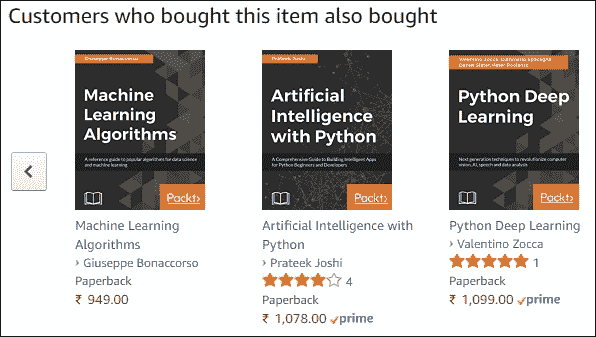

图 4.1：亚马逊上的书籍推荐

你在电子商务网站上找到的所有这些推荐都使用特定的算法，这个算法被称为推荐算法。本章全部关于如何使用不同类型的机器学习（ML）算法构建推荐系统。除了电子商务，还有许多领域已经使用了推荐系统；例如，Netflix 和 YouTube 使用推荐算法来推荐我们可能喜欢的视频，Airbnb 根据我们在他们网站上的活动提供推荐。这个列表是无穷无尽的，所以现在让我们学习如何构建推荐系统。

在本章中，我们将涵盖以下主题：

+   介绍问题陈述

+   理解数据集

+   构建基线方法：

    +   理解基本概念

    +   实施基线方法

    +   理解测试矩阵

    +   测试基线方法的结果

    +   基线方法的问题

    +   优化基线方法

+   构建修订后的方法：

    +   实施修订后的方法

    +   测试修订后的方法

    +   修订后方法的问题

    +   理解如何改进修订后的方法

+   最佳方法：

    +   理解关键概念

    +   实施最佳方法

+   概述

因此，让我们讨论问题陈述以及从推荐系统的基本概念开始。

# 介绍问题陈述

如您所知，在本章中，我们试图构建一个推荐系统。主要使用推荐系统的领域是电子商务。因此，在我们的基本推荐引擎版本中，我们将构建一个可以根据产品类别建议产品名称的算法。一旦我们了解了推荐引擎的基本概念，我们将构建一个可以像亚马逊网站一样建议书籍的推荐引擎。

我们将构建三个版本的推荐算法。基线方法简单直观，以便读者可以了解推荐算法确切能做什么。基线易于实现。在第二和第三种方法中，我们将使用机器学习算法构建书籍推荐引擎。

让我们看看构建推荐系统所使用的基本方法或方法。有两种主要方法，您可以在以下图中找到：

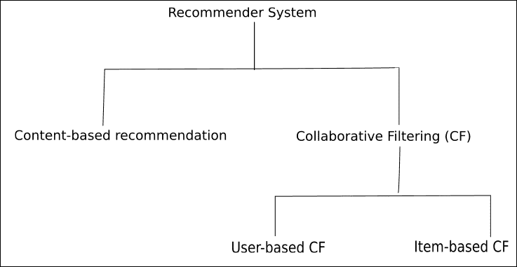

图 4.2：推荐引擎的方法

尽管还有其他方法，如基于知识的方法或混合方法，但我们将使用这两种方法。但在本章中，我们将专注于这两种给定方法。

现在我们来看看我们将要使用的数据集。

# 理解数据集

在本章中，我们使用以下两个数据集：

+   电子商务商品数据

+   Book-Crossing 数据集

## 电子商务商品数据

此数据集包含从实际库存单位（SKU）中提取的数据项。它来自户外服装品牌的产品目录。我们正在为这个户外服装品牌的产品目录构建推荐引擎。您可以通过使用此链接访问数据集：[`www.kaggle.com/cclark/product-item-data/data`](https://www.kaggle.com/cclark/product-item-data/data)。

此数据集包含 500 个数据项。数据集中有两列。

+   **ID**：此列表示数据项的索引。用通俗的话说，它是数据集的序号。

+   **描述**：此列包含有关产品的所有必要描述，我们需要使用这些数据来构建推荐引擎。

您可以参考以下图：

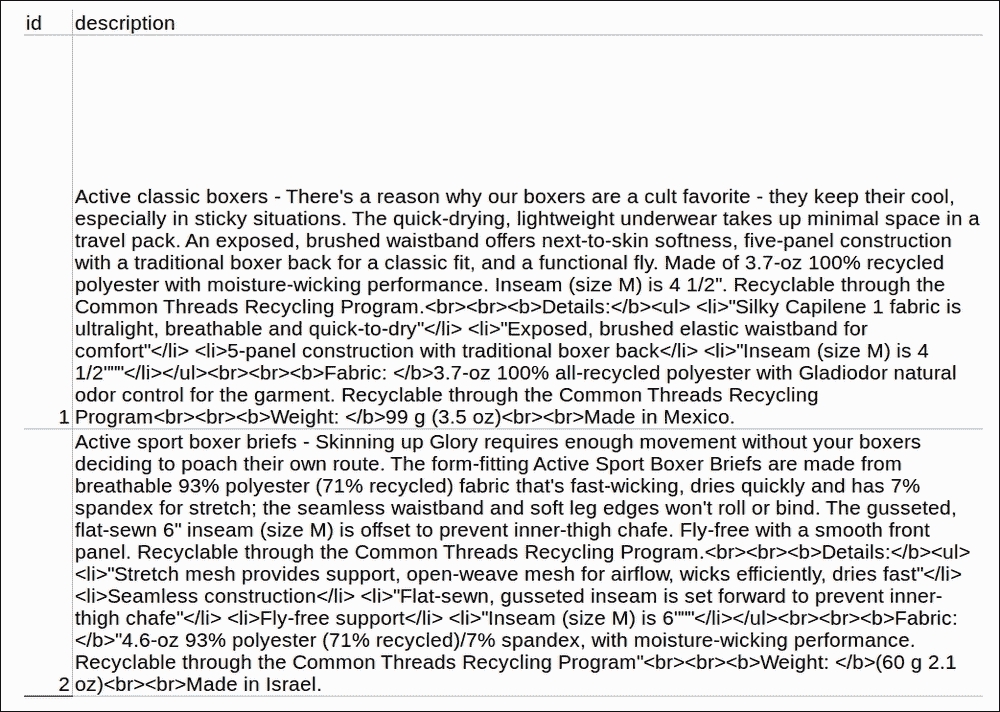

图 4.3：电子商务商品数据片段

如您所见，描述列包含文本数据，我们需要处理这个文本数据集以便构建推荐引擎。现在让我们转到下一个数据集。

## Book-Crossing 数据集

Book-Crossing 数据集被广泛用于构建推荐系统。您可以通过[`www2.informatik.uni-freiburg.de/~cziegler/BX/`](http://www2.informatik.uni-freiburg.de/~cziegler/BX/)访问它。此数据集以两种格式提供，如下所示：

+   SQL 转储

+   CSV 转储

我们使用数据集的 CSV 转储。两种格式都有三个表，具有不同的数据属性。这三个文件的名称如下：

+   `BX-Book-Ratings.csv`

+   `BX-Books.csv`

+   `BX-Users.csv`

让我们探索每个数据表中给出的数据。

### BX-Book-Ratings.csv

这个 CSV 文件包含与书籍评分相关的数据。这个表格包含以下三个数据属性：

+   **User-ID**: 这个数据属性表示唯一的用户 ID。这个列具有数值。用户 ID 的长度为六。

+   **ISBN**: ISBN 的全称是国际标准书号。这个数据属性表示书籍的唯一识别号码。

+   **Book rating**: 这个数据属性表示书籍的用户评分。书籍的评分范围从 0 到 10，0 表示不太喜欢，10.0 表示最高评价。

### BX-Books.csv

这个文件包含有关书籍的所有详细信息。该表格包含以下数据属性：

+   **ISBN**: ISBN 用于识别书籍。所有无效的 ISBN 都已删除。这个数据表只包含有效的 ISBN。

+   **Book-Title**: 这个数据属性包含书籍的名称。

+   **Book-Author**: 这个数据属性包含书籍作者的姓名。

+   **Year-Of-Publication**: 这表示书籍的出版年份，格式为 YYYY。

+   **Publisher**: 这个数据列包含出版书籍的出版社名称。

+   **Image-URL-S**: 这个数据属性包含书籍封面图片的 URL。S 表示封面图片为小尺寸。

+   **Image-URL-M**: 这个数据属性包含书籍封面图片的 URL。M 表示封面图片为中尺寸。

+   **Image-URL-L**: 这个数据属性包含书籍封面图片的 URL。L 表示封面图片为大尺寸。

现在让我们看看上一个数据表的详细信息。

### BX-Users.csv

这是 Book-Crossing 数据集的第三个数据表。这个文件包含用户信息。

这个特定的数据文件包含以下数据属性：

+   **User-ID**: 这个数据列表示用户 ID，是一个六位数的整数。

+   **Location**: 这个数据是关于用户人口统计细节的一部分。位置表示城市名称和缩写。并非所有用户的位置信息都可用，因此对于那些位置信息未找到的用户，您将找到`null`值。

+   **Age**: 这也是一个人口统计数据点。如果跟踪了用户的年龄，则它存在于数据集中；如果没有，则年龄的值为`null`。

我们已经收集了两个数据集的基本信息。我们将继续构建推荐引擎的基本版本。

# 构建基线方法

从本节开始，我们将专注于如何构建推荐引擎的基本版本（在本章的上下文中意味着推荐系统）。为了开发基线方法，我们将使用基于内容的方法。以下是我们将要讨论的主题：

+   理解基本概念

+   实施基线方法

+   理解测试矩阵

+   测试基线方法的结果

+   基线方法的问题

+   学习基于基线方法的优化技巧

不浪费任何时间，让我们看看基于内容的方法是如何被用来构建推荐引擎的。

## 理解基本概念

正如我之前所指定的，我们正在使用基于内容的方法。你可能想知道这种方法是什么，以及我是如何决定使用它的。为了找到这些问题的答案，我们首先需要理解这种方法，然后我们可以讨论为什么我选择了它。

### 理解基于内容的方法

该算法背后的直觉很简单。如果你在购买或对某一种商品感兴趣，那么你很可能也会喜欢类似的产品。让我们举一个例子。如果你在买一条牛仔裤，那么你很可能也会想买 T 恤或上衣，以及正装裤或其他类型的裤子。基本上，对产品的推荐是基于你探索过、购买过或感兴趣的内容的。当每个商品的上下文和属性可以轻松确定时，这种方法效果很好。这种类型的推荐系统用于向用户推荐视频和音频内容。

当你在 YouTube 上观看喜剧视频时，你可能会注意到有其他搞笑片段和喜剧视频的建议。这是因为根据你的观看和浏览历史，你很可能喜欢类似的内容。你可以通过以下图示来理解这个例子：

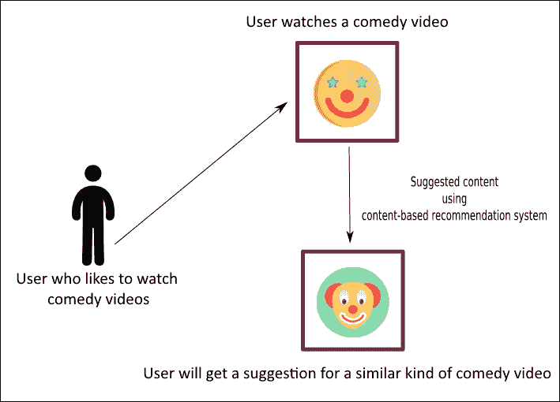

图 4.4：基于内容方法思想的图示

因此，当我们需要构建一个可以推荐与用户的购买模式或浏览模式相似的物品或产品的系统时，我们使用这种方法。选择这种方法的原因是这种类型的推荐不受其他用户选择的影响。这将为用户提供个性化的体验。推荐完全基于用户喜欢的物品及其特征。这种方法有助于电子商务公司以更少的努力提高销售额。它需要的手动工作较少，这是需要注意的一个好点。我们还可以使用电子商务平台新推出的产品。

为了实现这种方法，我们需要关注其架构部分，并查看基本概念，如 TF-IDF 和余弦相似度。我们将在下一节中探讨所有这些主题。

## 实现基线方法

在本节中，我们将设计基于内容的推荐系统架构。之后，我们将探讨如何构建一个简单的推荐系统。因此，我们将涵盖以下两个子主题：

+   推荐系统架构

+   实现基线方法的步骤

### 推荐系统架构

在本节中，我们将介绍基于内容的推荐系统的基本架构。参考以下图表，它更详细地解释了组件：

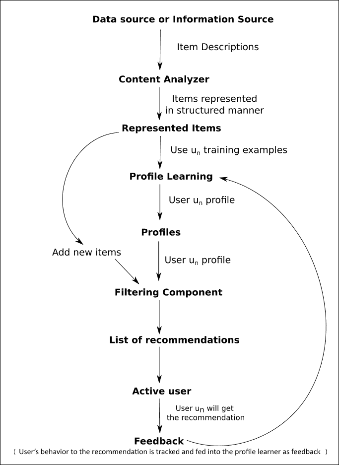

图 4.5：基于内容的推荐系统架构

如您所见，我们需要使用许多组件来构建推荐系统。我们使用数据源或信息源来存储关于项目或产品的详细信息。内容分析器将项目描述转换为特定格式，以便推荐引擎可以消费这些信息。我们拥有所有产品或与项目相关的信息。现在我们需要知道用户在电子商务平台上浏览、购买或搜索的内容。这类与用户相关的信息被用作推荐系统的训练示例。这些训练示例是配置文件学习模块的输入，该模块实际分析年龄、性别、在网站上的时间以及其他基于人口统计和用户活动信息。

这类集体信息将被传递给过滤组件。基于电子商务平台上可用的产品信息和用户活动，我们将向客户推荐项目列表。

推荐引擎的逻辑在这里变得重要。我们将把推荐信息推送给电子商务平台的活跃用户。在这里，活跃用户是指在上个月购买过产品或浏览平台频率较高的用户。我们需要跟踪用户的活动，这些活动作为我们推荐引擎的反馈。

在反馈中，我们可以跟踪用户从推荐列表中点击的项目数量。他们是否购买了推荐列表中的任何项目？这类反馈很有用，因为基于这种反馈，我们可以微调推荐引擎的逻辑。我们将反馈发送给配置文件学习器，并使用它来更新每个用户的兴趣区域，以便在将来，如果某人之前浏览过运动鞋，我们可以给他们提供更多关于运动服的建议。现在您已经了解了组件及其工作原理，让我们来看看基线方法的逐步实现。

### 实施基线方法的步骤

在本节中，我们将介绍基本推荐引擎的编码。你可以通过使用以下 GitHub 链接来参考代码：[`github.com/jalajthanaki/Basic_Ecommerce_Recomendation_System`](https://github.com/jalajthanaki/Basic_Ecommerce_Recomendation_System)

这些是我们需要遵循的步骤：

1.  加载数据集

1.  使用 TF-IDF 生成特征并构建余弦相似度矩阵

1.  生成预测

#### 加载数据集

在这里，我们使用的是电子商务商品数据集。在这个数据集中，有一个我们需要使用的商品描述。我们将使用`pandas`库来加载数据集。你可以参考以下截图：

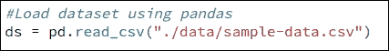

图 4.6：加载数据集的代码片段

#### 使用 TF-IDF 生成特征

我们将使用 TF-IDF 的概念，这是一种简单但有效的统计特征技术。TF-IDF 代表词频-逆文档频率。我将简要解释一下。

TF-IDF 包含两部分：词频和逆文档频率。让我们从词频开始。术语是自解释的，但我们仍然会解释这个概念。词频表示文档或数据集中每个单词出现的频率。TF 的公式如下：

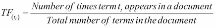

图 4.7：TF 的公式

现在我们来谈谈逆文档频率。IDF 表示单词对文档的重要性。这是因为当我们计算 TF 时，我们对每个单词给予同等的重要性。如果一个单词“the”在数据集中出现得更频繁，那么它的词频（TF）值就高，但这个单词对文档的重要性并不大。如果一个单词“the”在文档中出现了 100 次，那么这意味着它所携带的信息量并不比数据集中出现频率较低的单词多。因此，我们需要对频繁的术语进行一些降权，同时提升罕见术语的权重，这就是决定每个单词重要性的因素。我们将通过以下公式给出的方程来实现这一点：

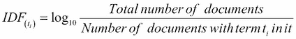

图 4.8：IDF 的公式

因此，计算 TF-IDF 的最终公式如下：

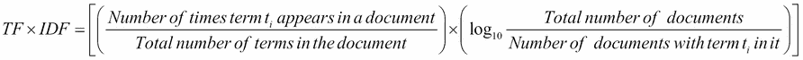

图 4.9：TF-IDF 的公式

如果你想详细了解，我建议你阅读这本书中的这个主题：第五章，*Python 自然语言处理*。为此，你可以参考以下链接：[`www.packtpub.com/big-data-and-business-intelligence/python-natural-language-processing`](https://www.packtpub.com/big-data-and-business-intelligence/python-natural-language-processing)

这个概念的实际实现相当简单。我们使用 scikit-learn 库来编写代码。您可以参考以下截图：

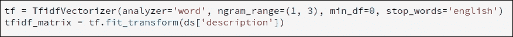

图 4.10：使用 TF-IDF 生成特征的代码片段

在这里，我们使用了`TfidfVectorizer` API 并为项目描述生成了 TF-IDF 向量。我们使用`stop_words`参数去除了英语停用词。在这里，我们提供了从 1 到 3 的`ngram_range`。现在让我们构建余弦相似度矩阵。

#### 构建余弦相似度矩阵

在本节中，我们将构建余弦相似度矩阵，这是构建基于内容的推荐引擎所需的主要步骤。这个矩阵表示一个产品的描述与其他产品描述的相似程度。在这里，我们将检查所有产品的 TF-IDF 向量的余弦相似度。我们需要找到两个 TF-IDF 向量之间的角度。这个角度表示 TF-IDF 向量之间的接近程度或距离。为此，我们需要使用以下方程来获取 TF-IDF 向量之间的点积：

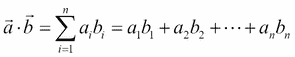

图 4.11：点积的方程

现在，借助给定的余弦方程，我们可以生成这些向量之间的角度。您可以参考以下公式中的方程：

图 4.12：向量余弦相似度和范数的方程

现在，让我们看一个基本示例，以便您能够理解其背后的基本数学原理。为此，您需要参考以下方程：

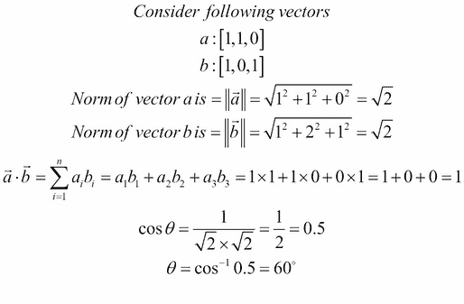

图 4.13：基本的余弦相似度示例

如前图所示，有两个向量，每个向量有三个元素。首先，我们计算了它们的范数，然后对它们进行了点积运算。之后，我们使用了余弦相似度公式，并找到了这些向量之间的角度。请注意，我们可以测量两个非零向量之间的余弦相似度。余弦角度的区间是*0,2π)*。

这个代码实现相当简单。您可以参考以下截图所示的代码片段：

![构建余弦相似度矩阵图 4.14：生成余弦相似度的代码片段在这里，我们将所有推荐存储在一个字典中，其中每个项目和其对应的推荐都已存储。我们的数据集中有 500 个项目，并且为每个项目都生成了一组可以推荐给用户的物品列表。现在，是时候生成预测了。#### 生成预测在本节中，我们将为给定的`item_id`生成推荐列表。我们需要传递从 1 到 500 的任何`item_id`。系统将获得五个不同的建议，这些建议被称为推荐项目。这些推荐项目与算法中传递的`item_id`的项目相似。您可以在以下截图中的代码片段中看到：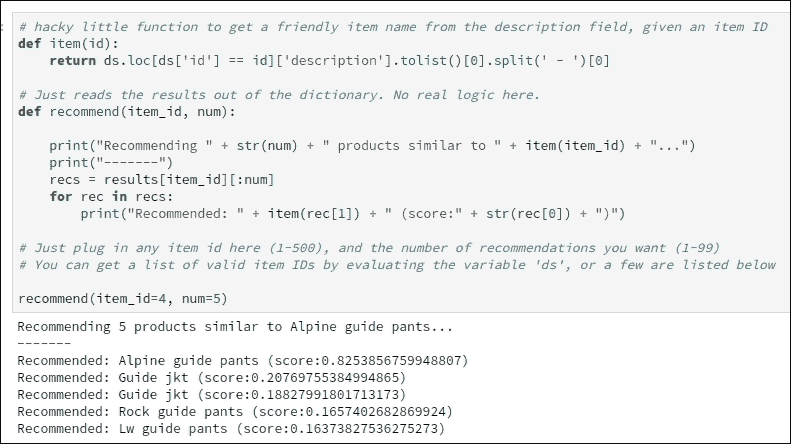

图 4.15：生成预测的代码片段

如您所见，我们从字典中检索结果。我们已打印出 cos θ的值作为我们的评分值。如果分数接近 1，则可以说这些项目更相似，用户喜欢推荐的可能性更高。如果分数更接近 0 或-1，则项目对用户来说不太吸引人。所以请注意，在这里，分数表示 cos θ的值，而不是角度本身。

现在我们来看看测试矩阵，它可以帮助我们评估这种方法以及在本章中我们将要实现的其他方法。

## 理解测试矩阵

在本节中，我们将探讨基于内容的推荐引擎的测试或演变矩阵。在这里，余弦相似度分数是我们最大的测试分数。这是因为有了这个分数的帮助，我们可以轻松地了解算法是否可以建议余弦相似度分数接近 1 或 0 的项目。

对于某些项目，我们将获得一个接近 1 的分数，而对于其他项目，我们获得的分数则接近 0。因此，我们需要关注这个余弦分数，以便了解推荐引擎表现的好坏。您可以参考以下图表：

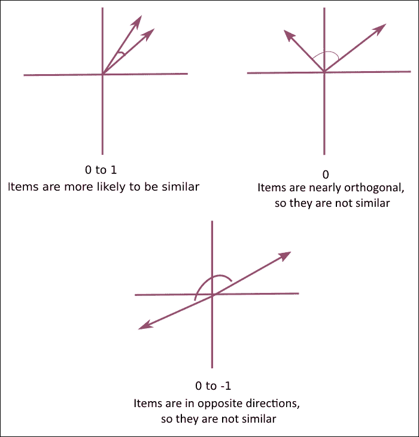

图 4.16：余弦相似度分数和角度的理解

如前图所示，我们需要使用余弦分数来测试这种方法。我们可以执行以下步骤进行测试。我们需要计算超过一定分数的项目数量，这意味着我们可以决定余弦相似度分数的阈值，并计算推荐引擎建议超过该阈值的项目数量。让我给您举一个例子。假设我们决定一个截止分数为 0.15。在这种情况下，所有余弦分数高于 0.15 的项目都被认为是良好的推荐。在这里，技巧是您需要对这个阈值进行实验，因为根据用户的活动，您可能稍后会改变它。这个参数将是我们可调整的参数。在下一节中，我们将查看测试的代码。

## 测试基线方法的结果

在本节中，我们将了解如何实现阈值逻辑。之后，我们将比较不同项目的结果。您可以参考以下截图所示的代码片段：

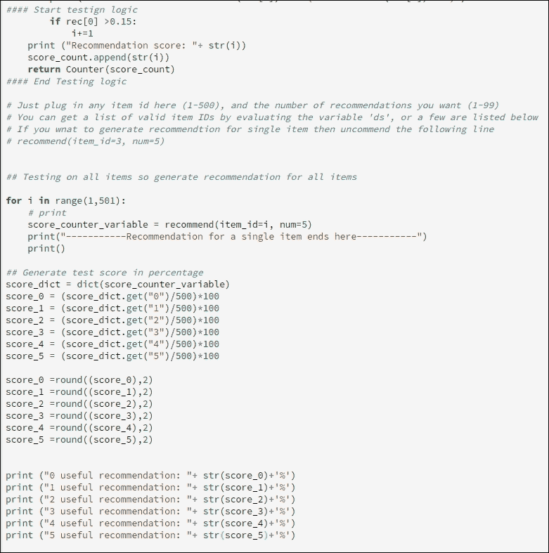

图 4.17：测试代码片段

现在，你可以看到不同`item_ids`的结果。你可以找到三个项目的结果。我随机选择了`item_id`。看一下下面的屏幕截图：

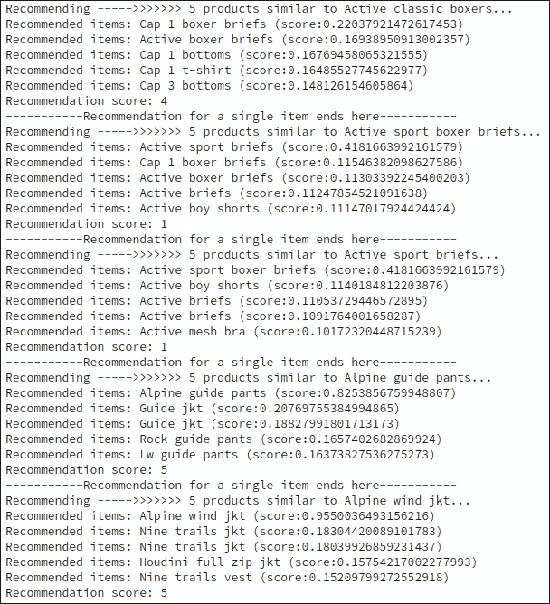

图 4.18：项目结果

看一下下面的代码片段：

图 4.19：基于有用建议的分析

如前图所示，这种方法有 69.8%的时间提供了有用的建议，有 7.2%的时间提供了四个有用的建议。在查看结果分析后，我们可以说基线方法表现良好，我们肯定可以通过其他方法来提高结果。

在下一节中，我们将讨论这种基线方法存在的问题以及我们如何解决这些问题。

## 基线方法的问题

在本节中，我们将讨论基线方法中存在的问题。我们需要了解这些问题，以便在修订方法中注意它们。这个方法的问题如下：

+   **内容分析有限**：如果我们没有足够的信息来更准确地区分项目，那么推荐引擎就不会提供有用或更精确的建议。

+   **过度专业化**：基于内容的方法基于用户资料和他们正在浏览的项目，因此如果用户反复浏览相同的内容，他们将得到相同类型的建议。用户找不到不同或新颖的项目。这是不好的，因为如果我们更频繁地提供相同的推荐，那么用户就没有惊喜元素，他们也不会有购买东西的动力。这个问题被称为过度专业化。

+   **新用户**：如果一个新用户正在探索电子商务平台，而我们对其信息非常有限，那么我们最初无法给他们提供好的推荐。这种情况是由于缺乏稳固的资料。

所有上述问题都是基于内容推荐引擎的已知问题。为了解决这些问题，我们可以尝试其他方法。有关这些的详细信息将在下一节中给出。

## 优化基线方法

在这里，我们将概述我们如何解决上一节中遇到的问题。在基线方法中，我们基本上依赖于用户资料和项目描述，但这种方法并没有取得好的效果。为了改进这一点，我们将使用两种方法。在修订的方法中，我们将使用基于校正的方法。之后，我们将尝试基于协同过滤的方法。

这种基于相关性的方法依赖于用户的活动，而不是依赖于项目的内容或描述。这有助于我们解决新用户、过度专业化和内容分析有限等问题。我们正在使用相关系数来构建推荐引擎。这是一种简单的统计技术，可以非常有帮助。对于实现来说，重要的基本概念将在我们开始构建改进方法时进行描述。

因此，让我们构建改进的方法。

# 构建改进的方法

在这次迭代中，我们将使用一个称为相关性的统计概念来构建推荐引擎。我们将研究用户的活动和选择是如何相互关联的。我们试图从用户在电子商务平台上的活动和行为中找出模式。

在这里，我们将使用 Book-Crossing 数据集。构建推荐系统的一个关键参数是书籍评分属性。我将结合实现部分解释这些概念，这样你就可以更容易地理解。

## 实现改进的方法

为了实现改进的方法，我们需要执行以下步骤。你可以在 GitHub 上的代码中参考：[`github.com/jalajthanaki/Book_recommendation_system/blob/master/correlation_based_recommendation_system.ipynb`](https://github.com/jalajthanaki/Book_recommendation_system/blob/master/correlation_based_recommendation_system.ipynb)

1.  加载数据集

1.  **书籍评分数据文件的探索性数据分析**（EDA）

1.  探索书籍数据文件

1.  用户数据文件的 EDA（探索性数据分析）

1.  实现推荐引擎的相关逻辑

### 加载数据集

作为第一步，我们将使用`pandas`库来加载我们的 Book-Crossing 数据集。正如你所知，这个数据集有三个数据文件。我们正在加载所有这些文件。你可以参考以下代码片段：

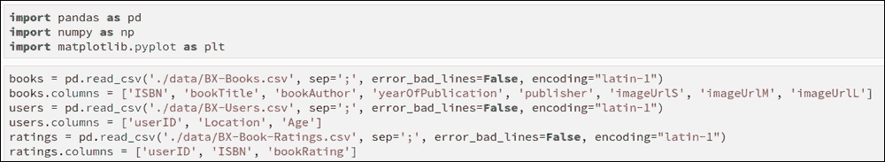

图 4.20：加载数据的代码片段

我们的数据分隔符是分号，我们使用 latin-1 作为编码。我们定义了三个`pandas`数据框。

现在让我们跳到下一步，即对所有三个数据文件进行 EDA 步骤。

### 书籍评分数据文件的 EDA

对于这个数据文件，我们已经生成了评分数据框。我们需要知道这个数据文件的数据分布类型。这意味着我们需要检查有多少本书得到了 10 分（满分），有多少本书得到了 5 分，以及有多少本书没有任何评分。请参考以下代码片段以生成这些信息：

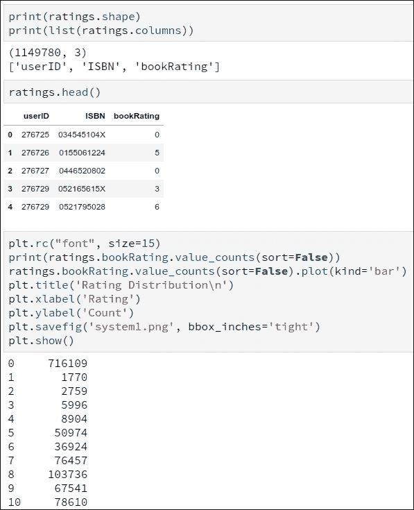

图 4.21：书籍评分数据文件的 EDA 代码片段

你可以在以下图中找到这个条形图：

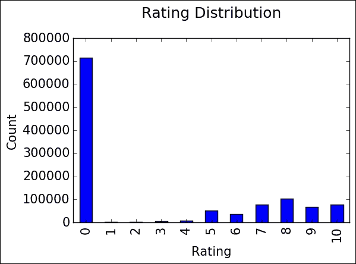

图 4.22：书籍评分分数分布的条形图

如我们所见，有 7,16,109 本书的评分为零，而 1,03,736 本书的评分为八。基于这种分析，我们可以推断出有很多书的评分为零，因此数据分布存在偏差。我们需要记住这一点。

### 探索书籍数据文件

在本节中，我们将对书籍数据文件进行 EDA 分析。我们还需要检查数据属性并格式化数据。对于这个数据文件，不需要应用其他技巧。请查看以下截图中的代码片段：

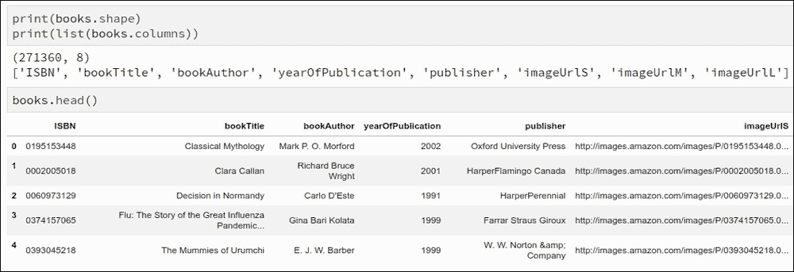

图 4.23：探索书籍数据文件的代码片段

您可以看到，我们已经检查了书籍数据文件的形状和列列表。在构建推荐引擎时，我们没有需要考虑的任何关键问题。

### 用户数据文件的 EDA 分析

在这里，我们需要对用户的数据文件进行分析。这个数据文件很重要，因为我们经常使用它来获取一些重要的事实。首先，我们需要获取年龄分布。当我们构建推荐系统时，年龄分布是关键数据点之一，因为相似年龄组的用户有相似的阅读模式，如果我们获得这种模式，那么我们可以为我们的用户提供更有效的推荐。您可以参考以下截图中的代码片段：

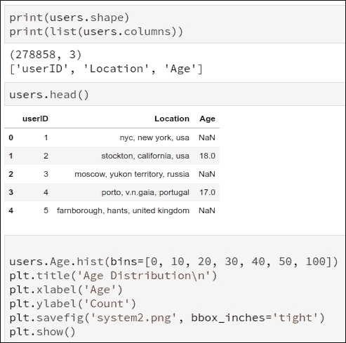

图 4.24：生成年龄分布的代码片段

您可以参考箱形图，它显示了以下图中的年龄分布：

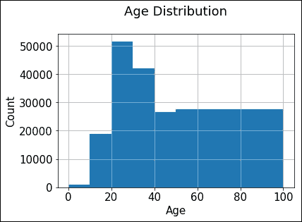

图 4.25：年龄分布的箱形图

根据分布，我们可以得出结论，大多数用户的年龄在 20 到 40 岁之间。因此，如果我们关注他们的阅读和浏览模式，那么我们的工作将更容易。

### 实现推荐引擎的相关性逻辑

在本节中，我们将介绍推荐引擎的核心逻辑。逻辑可以分为两部分：

+   基于书籍评分的推荐

+   基于相关性的推荐

那么，让我们开始吧！

#### 基于书籍评分的推荐

为了构建一个基于书籍评分的推荐系统，所有评分都由读者提供。因此，为了实现这种方法，我们需要提取评分最高的前五本书，这意味着我们需要从读者那里获得评分最高的书籍列表。相应的代码片段如下所示：

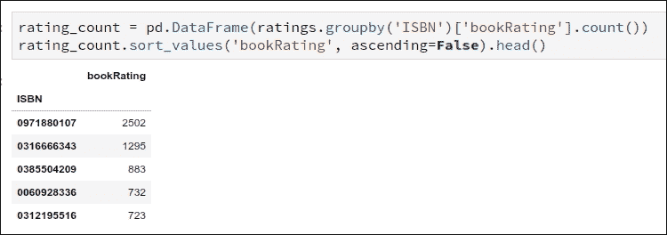

图 4.26：基于书籍评分生成前五本书的代码片段

我们已经生成了根据书籍评分计数排名前五的书籍的 ISBN，但我们还需要检查这些书籍的名称以及每本书的平均评分。你可以通过合并书籍和书籍评分数据框来找到书籍的名称。你可以在下面的屏幕截图中看到这段代码：

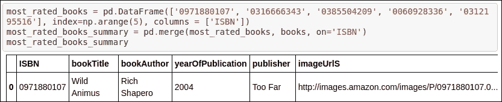

图 4.27：生成前 5 本书名称的代码片段

现在，你可能想知道这种方法的益处是什么。让我告诉你，我们根据书籍评分的顺序列出了一个书籍列表。如果一个用户根据书籍的评分购买书籍，那么我们可以推荐其他具有相同评分的书籍。这样，用户会得到比之前方法更准确的建议。

如果你查看前五本书的结果，那么你会了解到评分最高的是 Rich Shapero 的书籍《Wild Animus》。这五本书都是小说。如果有人想购买《Wild Animus》，那么用户也可能购买《The Lovely Bones: A Novel》。这就是为什么这种方法是有道理的。

现在让我们看看基于相关性的推荐引擎。

#### 基于相关性的推荐

我们使用双变量相关性和皮尔逊相关系数（**PCC**）。这也被称为“皮尔逊 r”。这种相关性提供了两个变量`a 和 b`之间线性相关性的度量。在这里，我们考虑了两本书的评分，并将 PCC 技术应用于它们。皮尔逊 r 的值在`+1`到`-1`之间。这个相关值的解释如下：

+   **+1**：这个值表示完全正线性相关性。这意味着如果变量 1 的值增加，那么变量 2 的值也会增加。

+   **0**：这个值表示没有线性相关性。这意味着两个变量之间没有关系。

+   **-1**：这个值表示存在完全负线性相关性。这意味着如果变量 1 的值增加，那么变量 2 的值会减少。

PCC 的公式如下所示：

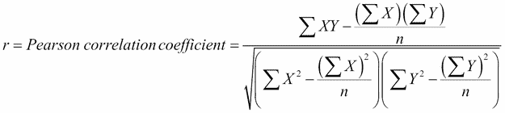

图 4.28：PCC 或皮尔逊相关系数的公式

让我们考虑一个简单的数学例子，这样你就知道我们是如何计算皮尔逊 r 的。看看下面的公式：

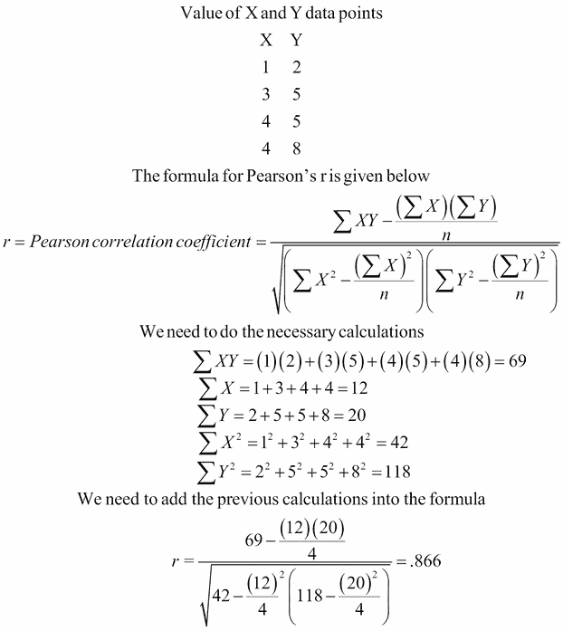

图 4.29：皮尔逊 r 的数学示例

### 注意

注意：我们正在考虑两本书的评分，以找到它们之间的相关性。

首先，我们需要获取所有书籍的平均评分。代码片段如下面的屏幕截图所示：

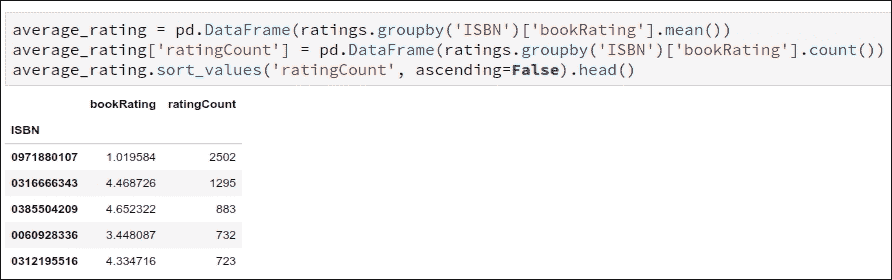

图 4.30：生成平均书籍评分的代码片段

注意，获得最多评分的书籍并不一定是评分最高的。这意味着有些书籍读者更频繁地分享他们的反馈，但这并不意味着这些书籍的评分很高。也许有些书籍被 100 个用户评分，但书籍的评分是 4.3。这是我最需要强调的重要观点，因为错误可能就发生在这里。为了构建一个更好的系统，我们需要考虑书籍的评分数量和评分分数。

在这里，我们将排除那些提供少于 200 个评分的用户以及那些获得少于 100 个评分的书籍。这意味着我们正在设置一个阈值，以便构建一个更好的系统。我们可以通过以下截图中的代码片段来实现这一点：

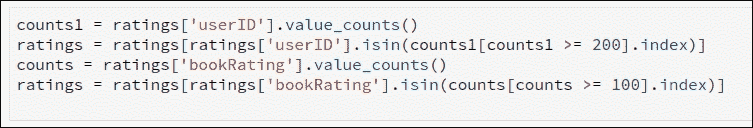

图 4.31：为考虑用户和书籍设置阈值的代码片段

现在我们正在将评分数据框转换为 2D 矩阵。这个矩阵是一个稀疏矩阵，因为并非每个用户都对每本书进行了评分。你可以在以下截图中的代码中看到：

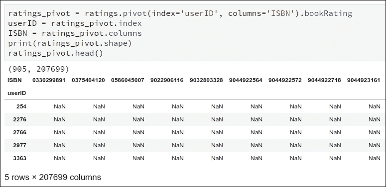

图 4.32：生成评分稀疏矩阵的代码片段

我们已经完成了一些基本工作，现在是时候找出与第二高评分书籍《可爱的骨头：一部小说》相关的书籍了。我想引用这本书的摘要，该摘要来自维基百科：[`en.wikipedia.org/wiki/The_Lovely_Bones`](https://en.wikipedia.org/wiki/The_Lovely_Bones)

> “这是一个关于一个少女的故事，她在被强奸和谋杀后，从她个人的天堂看着她的家人和朋友努力继续他们的生活，同时她也在接受自己的死亡”。

现在我们需要找到一本可以向用户推荐的书籍，如果他们正在尝试购买这本书。帮助我们获取推荐的代码在下面的截图中有展示：

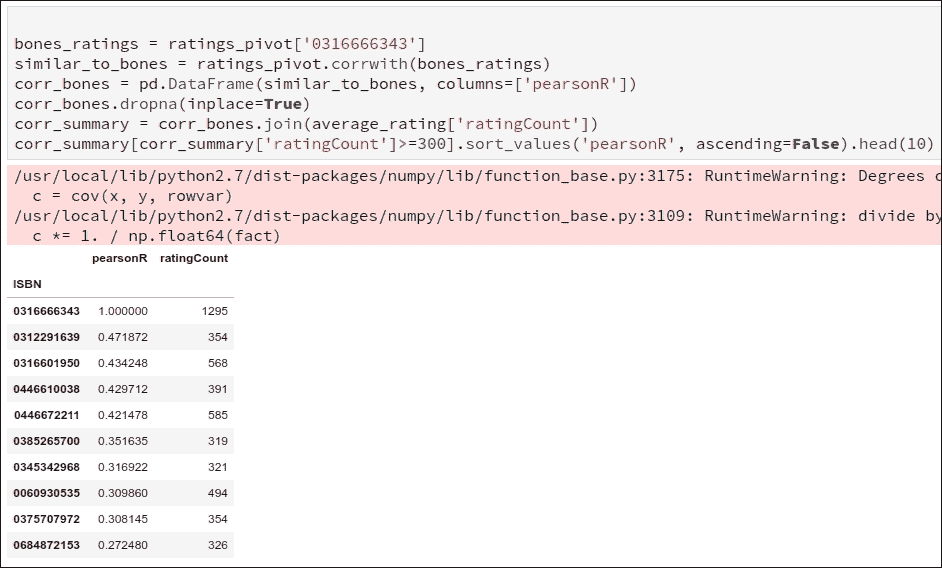

图 4.33：基于相关性生成推荐的代码片段

在这里，你可以看到我们正在使用稀疏矩阵，并应用了`corrwith` API 来生成相关性。可能会有一些运行时警告。它们与浮点数据类型有关。除此之外，我们已经编写了所需的条件，以便推荐那些获得超过或等于 300 个用户评分的书籍。我们使用前面的代码获取了 ISBN。因此，我们还需要获取书籍的名称。为此，我们需要使用以下截图中的代码片段：

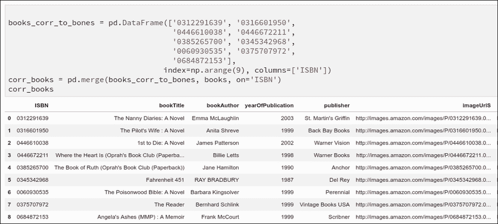

图 4.34：生成书籍名称的代码片段

让我们选择这本书的前三个推荐，它们是，《The Nanny Diaries: A Novel》（保姆日记：一部小说），《The Pilot's Wife: A Novel》（飞行员妻子：一部小说），以及《1st to Die: A Novel》（第一死：一部小说）。《保姆日记：一部小说》通过孩子们的保育员视角批评了曼哈顿的上层社会。《飞行员妻子：一部小说》是由写了《美好骨头》的同一作者所写。《第一死》是女性谋杀俱乐部系列的第一本书。

如果你实际查看这三本书的内容，那么我们可以看到所有这些推荐都是有意义的。

## 测试修订后的方法

我们已经获得了推荐，如果我们使用这种修订后的方法检查建议的书籍，那么我们可以看到这种基于简单相关性的方法工作得相当好。我们进行了手动测试并评估了推荐的品质，建议出乎意料地更加合理和有用。

在下一节中，我们将讨论这种方法的问题以及我们如何进一步改进方法。在实施优化之前，我们需要讨论我们将关注的要点。因此，让我们列出所有的问题或改进领域。

## 修订后方法的问题

在本节中，我们需要列出问题或改进领域，以便我们可以改进修订后的方法。以下是改进领域的要点：

+   基于相关性的方法并没有适用于所有情况，因此我们需要一个更复杂的方法。基本上，如果模型在训练期间看到了类似的数据示例，基于相关性的方法表现非常好。对于未见过的数据示例，它可能不会产生好的结果。

+   我们不能总是进行手动测试，因此我们需要一个易于开发、构建和测试的推荐引擎。新的方法也可以适应未来的变化，这意味着新的方法应该易于我们根据需要更改或修改。

现在我们来看看我们如何改进这种修订后的方法。

### 理解如何改进修订后的方法

为了改进修订后的方法，我们将使用众所周知的推荐算法，协同过滤（CF）。我们将使用机器学习（ML）算法 K 最近邻（KNN）。这是我们如何改进修订后方法的基本概述。

在 CF 算法和 ML 算法的帮助下，我们将很容易测试算法以及根据我们的要求修改算法。你可能知道 KNN 是如何工作的，所以我们不会深入探讨 KNN 算法的细节，但我们将努力理解 KNN 算法背后的直觉。我们还将详细了解基于 CF 的推荐引擎的工作原理，以确保在实施过程中所有概念都清晰。借助这些算法，我们将构建最佳可能的书籍推荐系统。我们将比较我们算法的结果与亚马逊。

在下一节中，我们将首先介绍算法，然后开始实现我们的方法。

# 最佳方法

在本节中，我们试图构建最好的推荐引擎。本节有两个部分：

+   理解关键概念

+   实施最佳方法

我们的第一部分涵盖了基本概念，例如 CF 和 KNN 算法是如何工作的，我们需要选择什么样的特征，等等。在第二部分，我们将使用 KNN 和 CF 算法实现推荐引擎。我们将生成准确度分数以及书籍推荐。那么，让我们开始吧！

## 理解关键概念

在本节中，我们将了解协同过滤的概念。这涵盖了推荐系统的许多方面。那么，让我们来探索 CF。

### 协同过滤

协同过滤主要有两种类型，如下所示：

+   基于记忆的 CF：

    +   用户-用户协同过滤

    +   项目-项目协同过滤

+   基于模型的 CF：

    +   基于矩阵分解的算法

    +   深度学习

我们将首先介绍基于记忆的 CF，然后转向基于模型的 CF。

#### 基于记忆的 CF

基于记忆的 CF 进一步分为两个部分。我之前已经定义了这些部分。请参阅*介绍问题陈述*部分。在这里，我们需要理解这些概念。我们将从用户-用户 CF 开始，然后探讨项目-项目 CF。

##### 用户-用户协同过滤

在用户-用户 CF 中，我们考虑一个特定的用户。现在我们需要找到与我们的特定用户相似的用户。我们通过观察他们对项目的购买模式和评分模式来找到相似用户。基于评分和购买模式中的相似性，我们向类似类型的用户推荐产品。为了理解用户-用户 CF，您可以参考以下图示：

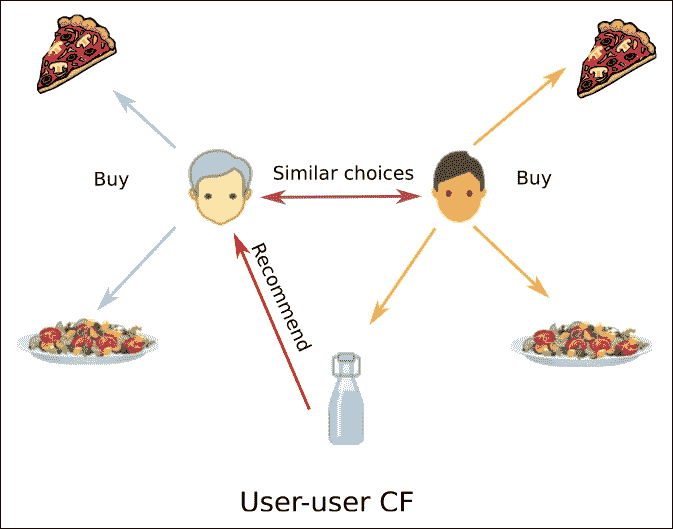

图 4.35：用户-用户 CF 的图示表示

然而，项目-项目 CF 的工作方式不同。

##### 项目-项目协同过滤

在项目-项目 CF 中，我们考虑项目。我们找到喜欢特定项目以及其他用户或类似用户也喜欢并购买的项目。因此，我们推荐与用户正在寻找的特定项目一起的项目。在这里，我们需要以项目作为输入，生成推荐项目列表。您可以参考以下图示：

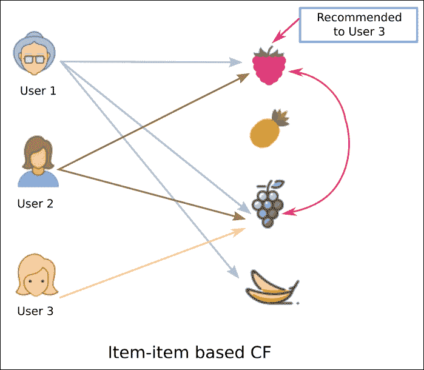

图 4.36：表示项目-项目 CF 的图像

这两种方法可以总结如下：

+   **项目-项目 CF**：我们考虑喜欢 x 项目和 y 项目的用户

+   **用户-用户 CF**：我们考虑与您相似，也喜欢 x 和 y 项目的用户

基于记忆的模型使用基于相似度的技术。在这个方法中，没有涉及优化技术，例如梯度下降，因此它将很容易实现。我们可以使用 KNN 机器学习算法，因为它不使用基于梯度的优化策略。因此，在实现过程中，我们将使用 KNN 算法。

KNN 算法背后的思想很简单。我们需要为每个用户或物品获得权重。我们可以通过余弦相似度或人的相关系数来生成这个权重。我们使用相似度值，但我们需要限制相似用户的数量，因为我们不能认为所有用户都是相似的。这个数字用 K 表示。在这里，K 表示我们需要考虑的相似邻居或用户的数量。这就是为什么算法被称为 K 近邻（KNN）。如果您想了解更多关于 KNN 算法的细节，可以参考这篇文章：[`www.analyticsvidhya.com/blog/2018/03/introduction-k-neighbours-algorithm-clustering/`](https://www.analyticsvidhya.com/blog/2018/03/introduction-k-neighbours-algorithm-clustering/)

#### 基于模型的 CF

在这个方法中，我们将使用基于机器学习的技巧来预测用户的推荐，特别是对于那些未评分的项目。为此，我们可以使用矩阵分解方法或基于深度学习的途径。我们将重点关注矩阵分解方法。

因此，让我们来看看矩阵分解。

##### 基于矩阵分解的算法

矩阵分解算法背后的主要思想是用户的偏好可以通过矩阵运算来确定。我们需要定义少数几个隐藏或潜在因素。我们可以将这个矩阵称为因素或嵌入。让我们通过一个例子来更好地理解它。

我们需要定义嵌入矩阵。在这里，值是随机初始化的，然后我们执行嵌入矩阵和书籍嵌入矩阵的点积。生成的矩阵是以一种方式生成的，我们可以预测哪本书可以推荐给哪个用户。对于矩阵分解，我们需要在结果矩阵中使用非负元素。我们将使用奇异值分解（SVD）模型来识别潜在因素。还有一些其他技术也可以使用，例如概率矩阵分解、非负矩阵分解等。我们将实现这种矩阵分解技术。

##### 基于记忆的 CF 与基于模型的 CF 之间的区别

基于记忆的 CF 与基于模型的 CF 之间的主要区别在于，在基于记忆的方法中，没有涉及优化技术，而在基于模型的方法中，有一个优化策略和其他优化函数涉及其中，这些函数可以在一段时间内提高模型的准确性。现在我们将实现基于 CF 的方法。

## 实施最佳方法

我们将通过以下步骤实现这一方法。您可以在 GitHub 上查看代码：[`github.com/jalajthanaki/Book_recommendation_system/blob/master/KNN_based_recommendation_system.ipynb`](https://github.com/jalajthanaki/Book_recommendation_system/blob/master/KNN_based_recommendation_system.ipynb)。

1.  加载 aset

1.  合并数据框

1.  对合并的数据框进行 EDA 分析

1.  根据地理位置过滤数据

1.  应用 KNN 算法

1.  使用 KNN 算法进行推荐

1.  应用矩阵分解

1.  使用矩阵分解进行推荐

### 加载数据集

就像我们在改进的方法中加载数据集一样，我们在这里也需要实现它。请看以下截图：

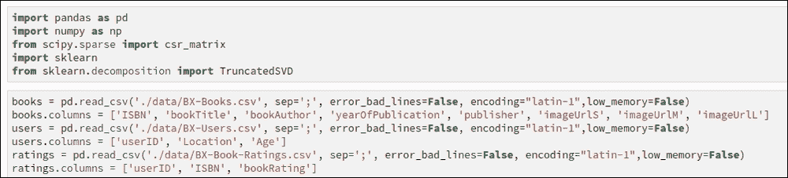

图 4.37：加载数据集代码片段

### 合并数据框

我们需要合并书籍和评分数据框。我们将生成每本书至今收到的总评分。以下代码片段显示了这一过程：

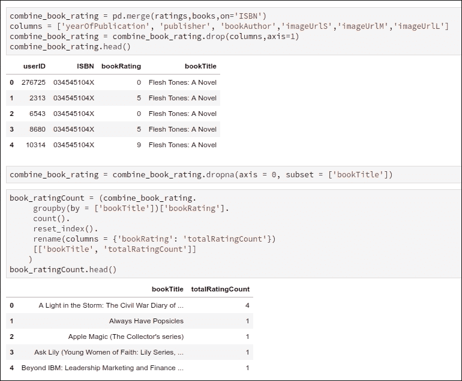

图 4.38：生成评分计数代码片段

之后，我们还将生成书籍评分。请参考以下截图：

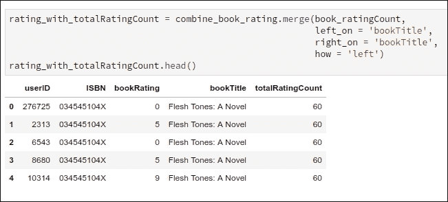

图 4.39：生成书籍评分代码片段

### 对合并的数据框进行 EDA 分析

在这里，我们将对总评分计数进行数据分析。之后，我们需要获取书籍评分的量数值。这个量数值能给我们关于数据分布的良好概念。您可以在以下截图所示的代码片段中参考：

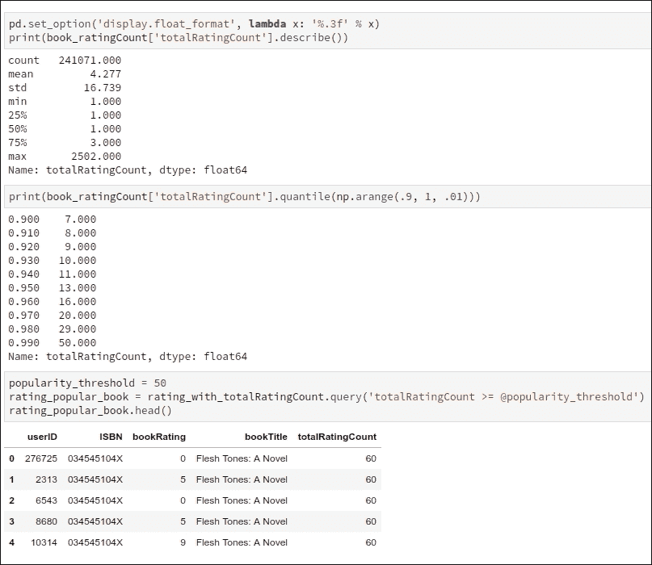

图 4.40：对总书籍评分进行 EDA 的代码片段

如您所见，只有 1%的书籍获得了 50 或以上的用户评分。在这个数据集中有很多书籍，但我们只考虑这些书籍中的 1%。独特书籍的总数是 2,713。

### 根据地理位置过滤数据

我们将限制我们的用户数据仅限于美国和加拿大地区。这个过滤器可以加快计算速度。我们需要合并用户数据和总书籍评分计数数据。以下截图显示了相应的代码：

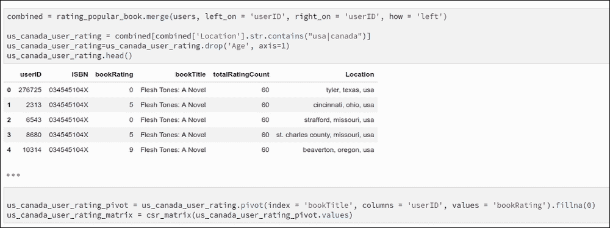

图 4.41：基于地理位置过滤的代码片段

如您所见，现在我们有来自美国和加拿大的用户。

### 应用 KNN 算法

是时候应用主要逻辑了。我们将使用`sklearn`库应用 KNN 算法。我们的主要目标是确定数据实例的接近程度。您可以在以下截图所示的代码片段中查看：

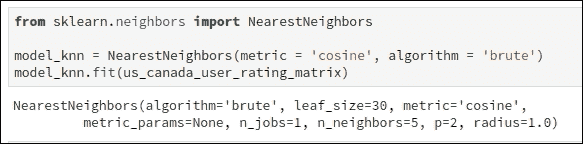

图 4.42：实现 KNN 算法的代码片段

我们已使用余弦相似度作为 KNN 矩阵参数，并考虑了五个最近的邻居。这意味着 K=5 的值。在模型训练后，我们需要使用它们来获取推荐。

### 使用 KNN 算法进行推荐

在这里，我们需要使用刚刚训练好的 KNN 算法来获取推荐。代码显示在以下截图：

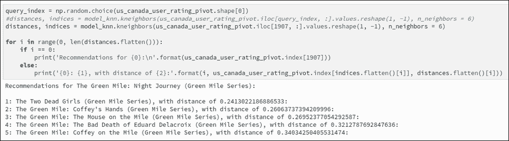

图 4.43：使用 KNN 获取推荐的代码片段

为了推荐的目的，我们选择了 K=6 的值，这意味着我们在为任何用户推荐书籍时考虑了最近的六个邻居。在这里，我们从`us_canada_user_rating_pivot`数据框中随机选择了这本书。

这些建议看起来很棒。这里推荐了《绿里奇迹》系列的所有书籍。

### 应用矩阵分解

现在我们来实现矩阵分解方法。我们将把美国和加拿大用户评分数据框转换成一个二维矩阵。这个矩阵也被称为效用矩阵。我们用 0 替换了缺失值。您可以参考以下截图中的代码：

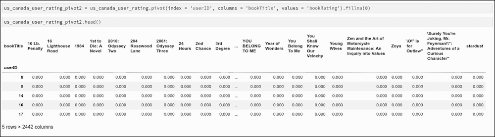

图 4.44：生成效用矩阵的代码片段

现在我们需要转置效用矩阵。`bookTitles`变成行，`userID`转换为列。之后，我们将应用`TruncatedSVD`进行降维。这个操作是在列——在`userID`上——执行的，因为我们之后需要使用书籍的标题。您可以参考以下截图中的代码：

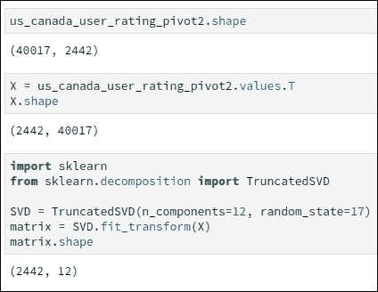

图 4.45：SVD 降维的代码片段

在这里，我们选择了`n_components`的值为 12。所以如您所见，我们数据框的维度已经大大减少。之前，数据框的维度是 40017 x 2442，现在变成了 2442 x 12。

现在我们对最终矩阵中的每一对书籍执行皮尔逊相关系数。我们将比较这些结果与 KNN 算法。基本上，我们应该使用这种方法以及 KNN 算法得到之前得到的建议。

### 使用矩阵分解进行推荐

在这里，我们需要使用矩阵分解技术生成一个推荐。我们将列出《绿里奇迹：夜行》（绿里奇迹系列）的所有推荐。算法应该建议高度相关的书籍。我们已应用了一个相关性阈值。只有那些相关性得分在 0.9 到 1 之间的书籍才使用这种方法列出。您可以参考以下截图中的代码片段：

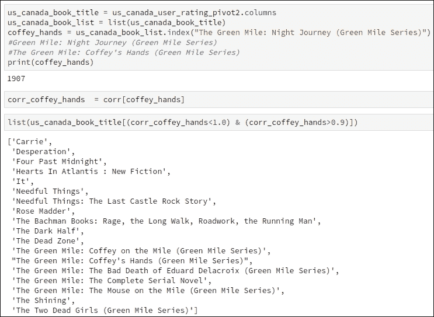

图 4.46：使用矩阵分解生成推荐的代码片段

正如你所见，使用基于 KNN 方法推荐的所有书籍的推荐也在这里列出。因此，这个基于 CF 的推荐系统工作得最好。你同样可以在亚马逊上找到类似的推荐。请参考以下截图：

图 4.47：亚马逊上的推荐

我们可以确认我们的推荐引擎工作得很好。

# 摘要

这是分析领域的最后一章。到目前为止，你已经学到了很多可以帮助我们构建令人惊叹的分析应用的概念。在本章中，你学习了如何为电子商务产品制作推荐引擎。在基线方法中，我们使用了 TF-IDF 和余弦相似度的概念。在修订方法中，我们构建了一个使用相关性的概念的书本推荐系统。在最佳方法中，我们使用了 KNN 算法构建了一个基于协同过滤方法的推荐引擎。我们探讨了所有方法的优缺点。你还学习了推荐系统的架构。所有这些主题都将帮助你理解和构建你自己的推荐系统。你也可以构建一个基于计算机视觉的推荐引擎。这种类型的推荐引擎真正改变了内容推荐给用户的方式。所以，不要犹豫去构建新的推荐系统类型。

从下一章开始，我们将讨论属于自然语言处理领域或自然语言生成领域的应用。下一章全部关于情感分析，这是一个众所周知且简单的 NLP 应用。我们将使用各种机器学习算法来达到最佳结果。
