# 第六章。职位推荐引擎

我们已经在第四章中看到了如何开发电子商务产品的推荐系统，*电子商务推荐系统*，现在，我们将应用你在第四章中学习到的相同概念，但数据集的类型和格式不同。基本上，我们将构建一个职位推荐引擎。对于这个应用，我们已经考虑了文本数据集。构建推荐引擎的主要概念不会改变，但本章将给你一个很好的想法，了解如何将相同的概念应用于不同类型的数据集。

在本章中，我们将涵盖以下主题：

+   介绍问题陈述

+   理解数据集

+   构建基线方法

    +   实现基线方法

    +   理解测试矩阵

    +   基线方法的问题

    +   优化基线方法

+   构建修订方法

    +   实现修订方法

    +   测试修订方法

    +   修订方法存在的问题

    +   理解如何改进修订方法

+   最佳方法

    +   实现最佳方法

+   概述

那么，让我们来讨论问题陈述。

# 介绍问题陈述

在本章中，我们将构建一个可以向任何用户推荐工作的引擎。这是我们想要实现的最简单目标。我们将如何构建它？为了回答这个问题，让我给你一个关于我们将采取什么方法来构建职位推荐系统的大致想法。

对于我们的基线方法，我们将抓取模拟用户的简历，并尝试基于抓取的数据集构建一个职位推荐引擎。我们抓取数据集的原因是，在许多数据科学应用中，大多数时候都不会有任何数据集可用。假设你处于一个没有找到任何数据集的位置。那时你会怎么做？我想为这类场景提供解决方案。所以，你将学习如何抓取数据并构建基线解决方案。

在修订方法中，我们将使用 Kaggle 托管的数据集。使用基于内容的策略，我们将构建一个职位推荐引擎。对于最佳方法，我们将使用基于用户的协同过滤概念来构建这个领域的最终职位推荐系统。

现在，让我们来看看数据集。

# 理解数据集

在这里，我们使用了两个数据集。这两个数据集如下：

+   抓取的数据集

+   职位推荐挑战数据集

让我们从抓取的数据集开始。

## 抓取的数据集

对于这个数据集，我们从 indeed.com 抓取了模拟简历（我们使用这些数据仅用于学习和研究目的）。我们将下载用户的 PDF 格式的简历。这些将成为我们的数据集。这个代码可以在以下 GitHub 链接中找到：[`github.com/jalajthanaki/Basic_job_recommendation_engine/blob/master/indeed_scrap.py`](https://github.com/jalajthanaki/Basic_job_recommendation_engine/blob/master/indeed_scrap.py)。

请查看以下截图给出的代码：

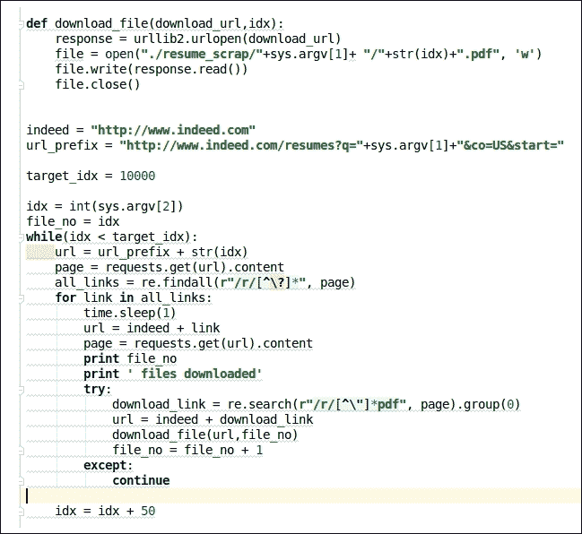

图 6.1：抓取数据的代码片段

使用前面的代码，我们可以下载简历。我们使用了`requests`库和`urllib`来抓取数据。所有这些下载的简历都是以 PDF 形式，因此我们需要解析它们。为了解析 PDF 文档，我们将使用一个名为`PDFminer`的 Python 库。我们需要从 PDF 文档中提取以下数据属性：

+   工作经验

+   教育

+   技能

+   奖项

+   证书

+   其他信息

您可以查看以下截图所示的代码片段：

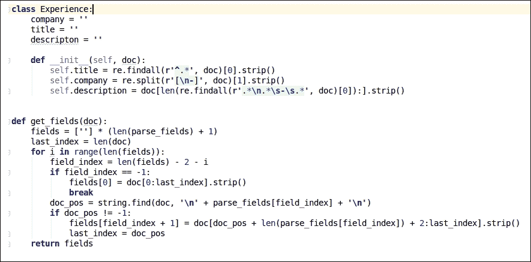

图 6.2：解析 PDF 文档的代码片段

基本上，`PDFminer`将 PDF 的内容转换为文本。一旦我们使用正则表达式获取了文本数据，我们就可以获取必要的详细信息。您可以通过使用以下 GitHub 链接查看整个代码：[`github.com/jalajthanaki/Basic_job_recommendation_engine/blob/master/pdf_parse.py`](https://github.com/jalajthanaki/Basic_job_recommendation_engine/blob/master/pdf_parse.py)。

一旦我们获取了所有必要的信息，我们将以 pickle 格式保存数据。现在，您不需要抓取数据并获取所有必要的信息。我已经将数据上传到 pickle 文件格式，您可以通过以下 GitHub 链接查看：[`github.com/jalajthanaki/Basic_job_recommendation_engine/blob/master/resume_data.pkl`](https://github.com/jalajthanaki/Basic_job_recommendation_engine/blob/master/resume_data.pkl)

我们将使用`resume_data.pkl`文件作为我们的基线方法。

## 职业推荐挑战数据集

这个数据集由[www.careerbuilder.com](http://www.careerbuilder.com)提供，并在 Kaggle 上托管。您可以通过此链接下载数据集：[`www.kaggle.com/c/job-recommendation/data`](https://www.kaggle.com/c/job-recommendation/data)。这些是我们将要用于我们修订和最佳方法的数据文件。这些数据文件中的所有值都是用制表符分隔的：

+   `apps.tsv`

+   `users.tsv`

+   `jobs.zip`

+   `user_history.tsv`

## apps.tsv

此数据文件包含用户求职申请的记录。它表示特定用户申请的职位。职位由 JobID 列描述。有关此数据文件的必要信息在以下截图给出：

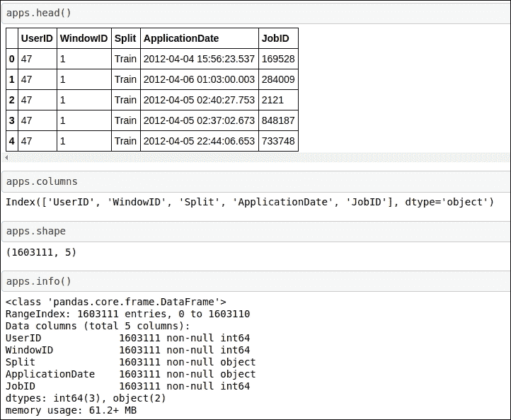

图 6.3：关于 apps.tsv 的数据信息

有五个数据列：

+   `UserId`: 这表示给定用户的唯一标识符。通过使用此 ID，我们可以访问用户的个人资料。

+   `WindowsID`: 这是一个具有常量值 1 的掩码数据属性。此数据属性对我们来说并不重要。

+   `Split`: 此数据属性表示我们应该考虑哪些数据记录用于训练和测试。

+   `Application date`: 这是用户申请工作的时间戳。

+   `JobID`: 此属性表示用户提名的工作的`JobIds`。使用此`JobId`，我们可以访问特定工作的其他信息。

## users.tsv

此数据文件包含用户个人资料和所有相关用户信息。您可以在以下屏幕截图中找到所有必要的信息：

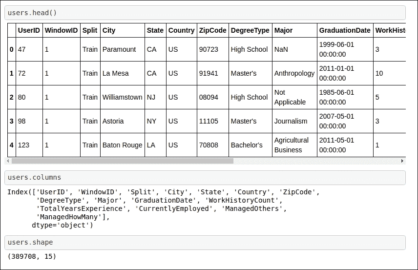

图 6.4 关于 users.tsv 的数据信息

这些是数据属性：

+   `UserID`: 此数据属性表示用户的唯一识别号码。

+   `WindowID`: 这是一个具有常量值 1 的掩码数据属性。此数据属性对我们来说并不重要。

+   `Split`: 此数据属性表示我们应该考虑哪些数据记录用于训练和测试。

+   `City`: 此属性表示用户的当前城市。

+   `State`: 此属性表示用户的州。

+   国家：此属性表示用户的国籍。

+   `ZipCode`: 此数据属性表示用户的邮政编码。

+   `DegreeType`: 此数据列表示用户的学位；用户是高中毕业生还是拥有学士学位。

+   `Major`: 此数据属性表示用户学位的主修科目。

+   `GraduationDate`: 此数据属性表示用户的毕业日期。

+   `WorkHistoryCount`: 此数据属性表示用户工作过的公司数量。

+   `TotalYearsExperience`: 此数据列表示用户的总工作经验年数。

+   `CurrentlyEmployed`: 此数据属性具有二进制值。如果用户目前有工作，则值为*是*；如果没有，则值为*否*。

+   `ManagedOthers`: 此数据属性也有二进制值。如果用户正在管理其他人，则此列的值为*是*；如果用户没有管理其他人，则此列的值为*否*。

+   `ManagedHowMany`: 此数据属性具有数值。此列的值表示由用户管理的员工人数。如果用户没有管理任何人，则此值为 0。

## Jobs.zip

当您解压此 ZIP 文件时，您可以获取`jobs.tsv`文件。以下屏幕截图中有更多信息：

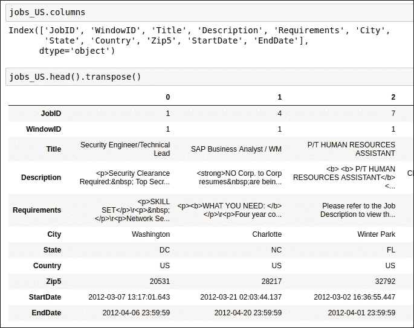

图 6.5：关于 jobs.tsv 的数据信息

+   `JobID`: 这是数据集中每个工作唯一的标识符。

+   `WindowID`: 这是一个具有常量值 1 的掩码数据属性。此数据属性对我们来说并不重要。

+   `Title`: 此数据属性表示工作标题。

+   `Description`: 此数据属性表示工作描述。

+   `Requirements`：这个数据属性表示工作要求。

+   `City`：这个数据字段表示工作地点的城市。

+   `State`：这个数据字段表示工作地点的州。

+   `Country`：这个数据字段表示工作地点的国家。

+   `Zip5`：这个数据字段表示工作地点的 ZIP 代码。

+   `StartDate`：这个日期表示工作发布或开放申请的时间。

+   `EndDate`：这个日期是工作申请的截止日期。

## user_history.tsv

`user_history.tsv` 文件包含用户的职业历史。关于此信息，以下截图提供了更多内容：

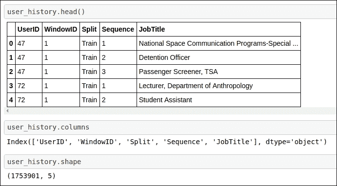

图 6.6：关于 user_history.tsv 的数据信息

这个数据文件只有两个新列。

+   `Sequence`：这个序列是一个数值字段。数字表示用户职业的顺序。

+   `JobTitle`：这个数据字段表示用户的职位名称。

我们已经覆盖了我们数据文件中的所有属性；现在让我们开始构建基线方法。

# 构建基线方法

在本节中，我们将构建基线方法。我们将使用抓取的数据集。我们将使用的主要方法是 TF-IDF（词频，逆文档频率）和余弦相似度。这两个概念已经在第四章，*电子商务推荐系统*中描述过。相关章节的名称是*使用 TF-IDF 生成特征*和*构建余弦相似度矩阵*。

由于这个应用程序有更多的文本数据，我们可以使用 TF-IDF、CountVectorizers、余弦相似度等。没有任何工作有评分。因此，我们没有使用其他矩阵分解方法，如 SVD，或基于相关系数的方法，如皮尔逊 R 相关系数。

对于基线方法，我们试图找出简历之间的相似度，因为这将告诉我们用户配置文件有多相似。通过使用这个事实，我们可以向所有具有类似专业配置文件的用户推荐工作。对于基线模型，我们的上下文是生成简历之间的相似度分数。

## 实施基线方法

为了开发一个简单的职位推荐系统，我们需要执行以下步骤：

+   定义常量

+   加载数据集

+   定义辅助函数

+   生成 TF-IDF 向量和余弦相似度

### 定义常量

我们将定义一些常量值。这些值基于我们抓取的数据集。在我们的数据集中，我们抓取了七家公司的模拟简历，并且通过解析简历生成了七个数据属性。我们将 100 份简历视为我们的第一个训练数据集，50 份简历作为我们的测试数据集。我们的第二个训练数据集的大小是 50。您可以参考以下截图所示的代码片段：

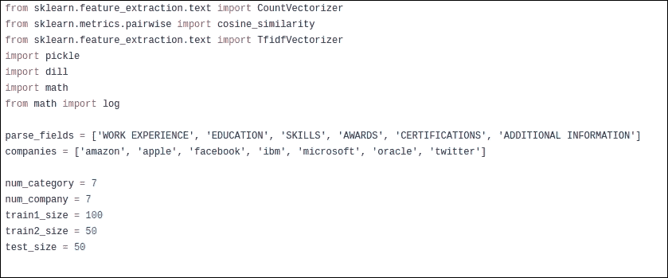

图 6.7：定义常量的代码片段

在此步骤之后，我们将加载数据集。

### 加载数据集

如您所知，我们已解析了 PDF 文件格式的简历。我们将解析的数据存储为 pickle 格式，并需要加载该 pickle 文件。我们将使用`dill`库来加载 pickle 文件。您可以在以下屏幕截图所示的代码片段中参考：

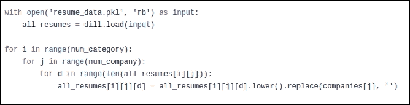

图 6.8：加载数据集的代码片段

我们已经恢复了数据集。作为下一步，我们需要定义函数，以便我们可以构建一个基本的职位推荐系统。

### 定义辅助函数

有各种辅助函数对我们很有用。对于这种方法，总共有三个辅助函数：

+   `my_normalize`

+   `get_sim_vector`

+   `get_class`

第一个函数用于标准化测试分数。我们将以矩阵的形式获得测试分数。您可以在以下屏幕截图所示的代码片段中查看：

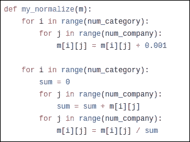

图 6.9：辅助函数 my_normalize 的代码片段

这种标准化实际上就是测试分数矩阵的加权平均值。因此，它接受测试分数矩阵并生成标准化的测试分数矩阵。请稍等片刻；当我们生成基线方法的结果时，我们将看到测试分数矩阵的样子。

第二个函数基本上将 TF-IDF 向量矩阵和数据集作为输入。作为输出，它生成余弦相似度分数。您可以在以下屏幕截图中找到提供的代码片段：

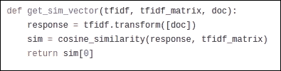

图 6.10：辅助函数 get_sim_vector 的代码片段

第三个函数基本上将余弦相似度数组作为输入，并按顺序遍历它以从余弦相似度数组中获得最大余弦值。您可以在以下屏幕截图中找到提供的代码片段：

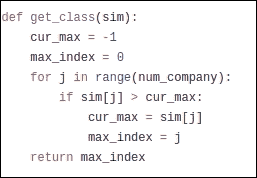

图 6.11：辅助函数 get_class 的代码片段

我们已经理解了辅助函数的输入、输出和工作原理。现在，让我们看看在生成 TF-IDF 向量和余弦相似度时它们的用法。因此，让我们继续到下一节。

### 生成 TF-IDF 向量和余弦相似度

在本节中，我们将开发基线方法的核心理念。我们将使用简单的 TF-IDF 概念。为了使用简单的 TF-IDF 构建工作推荐引擎，我们需要执行以下步骤：

+   构建训练数据集

+   为训练数据集生成 IF-IDF 向量

+   构建测试数据集

+   生成相似度分数

让我们构建训练数据集。

#### 构建训练数据集

基本上，我们并没有将数据集划分为训练集和测试集。因此，对于训练，我们需要使用以下截图中的代码片段来生成训练数据集：

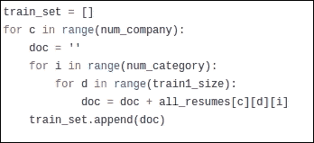

图 6.12：生成训练数据集的代码片段

代码易于理解。如您所见，我们使用了之前定义的`train1_size`常量值，以便我们可以生成 100 份可用于训练的简历。

现在，让我们继续下一步。

#### 为训练数据集生成 IF-IDF 向量

为了生成 TF-IDF 向量，我们将使用 scikit-learn 的`TfidfVectorizer` API。这基本上将我们的文本数据转换为数值格式。您可以查看以下截图中的代码片段：

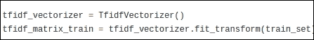

图 6.13：生成 TF-IDF 的代码片段

通过使用前面的代码，我们可以将我们的文本训练数据集转换为向量格式。当我们为测试数据集生成预测时，使用 TF-IDF 矩阵。现在，让我们构建测试数据集。

#### 构建测试数据集

我们已经训练了模型。现在，我们需要构建测试数据集，以便我们可以检查我们的训练模型在测试数据集上的表现是好是坏。我们已从数据集中使用了 100 份简历进行训练，因此现在我们需要使用那些不属于训练数据集的简历。为了生成测试数据集，我们将执行以下代码，以便我们可以生成测试数据集。您可以参考以下截图中的代码片段：

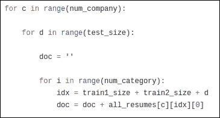

图 6.14：生成测试数据集的代码片段

如您所见，我们使用简历的索引生成了测试数据集，并仅选取了那些不属于训练集的文档。

#### 生成相似度分数

在本节中，首先，我们将以测试数据集作为输入并为其生成 TF-IDF 向量。一旦生成了 TF-IDF 向量矩阵，我们将使用余弦相似度 API 来生成相似度分数。对于此 API，我们将传递两个 TF-IDF 矩阵。一个矩阵是我们最近使用测试数据集生成的，另一个矩阵是我们使用训练数据集生成的。当我们传递这两个矩阵时，我们将得到余弦相似度数组作为输出。您可以参考以下截图中的代码片段：

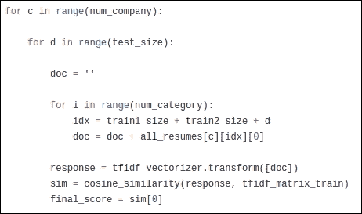

图 6.15：生成测试数据集余弦相似度的代码片段

作为输出，我们可以生成以下截图显示的余弦相似度数组：

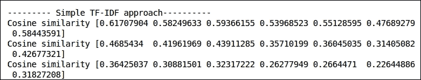

图 6.16：余弦相似度数组

前一截图显示的数组包含七个元素。每个元素表示该简历与七个公司的相似度。因此，如果最高的余弦值出现在 0 号索引，那么这意味着给定的简历与其他在亚马逊工作的用户的简历更相似。所以，我们将向该特定用户推荐亚马逊的工作机会，因为他们的简历与其他在亚马逊工作的员工更相似。

现在，让我们探讨一些与测试矩阵相关的事实。

## 理解测试矩阵

当我们使用 TF-IDF、计数向量化器和余弦相似度构建推荐引擎时，我们实际上是在构建基于内容的推荐引擎。没有预定义的测试矩阵可用于生成准确度分数。在这种情况下，我们可能需要手动检查推荐的相关性，或者我们可以采用启发式方法来获得基本的直观分数。在第四章，*电子商务推荐系统*中，对于基线方法，我们实现了一些基于阈值的启发式方法来了解推荐引擎的工作效果。我建议您参考第四章中的*测试基线方法的结果*部分。

## 基线方法的问题

基线方法存在许多问题。我将逐一列出：

+   数据集中可用的数据属性不足以构建一个良好的职位推荐系统。

+   基线方法实际上无法提供准确的职位推荐，因为我们只有用户简历的数据集，基于这些数据，我们只能说“你的简历看起来像亚马逊的其他员工，所以请申请亚马逊的工作机会”。现在的问题是确定我们需要向用户推荐哪种类型的工作：我们应该推荐亚马逊的所有职位空缺，还是其中的一些。

+   在我看来，由于数据集的质量和数量，基线解决方案无法提供完整的图景。

这些问题的解决方案将在下一节讨论。

## 优化基线方法

在前一节中，我们列出了基线方法的不足。在本节中，我们将探讨如何克服这些不足。我们面临一个主要问题，因为我们没有使用适当的质量和数量来处理数据集。因此，首先，我们需要使用包含用户资料信息以及职位空缺信息的数据库。在这里，我们不再抓取更多简历或发布关于工作的信息。我们正在使用由职业建设者发布的数据库。我们已经在本章前面看到了关于这个数据库的基本信息。

为了构建修订的方法，我们将使用这个新的数据集。现在，让我们开始构建修订的方法。

# 构建修订的方法

在本节中，我们将使用现成的职位推荐挑战数据集。我们已经覆盖了该数据集的数据属性。我们将使用基于上下文的方法来构建推荐引擎。为了构建修订的方法，我们需要执行以下步骤。修订方法的代码在以下 GitHub 链接中给出：[`github.com/jalajthanaki/Job_recommendation_engine/blob/master/Job_recommendation_engine.ipynb`](https://github.com/jalajthanaki/Job_recommendation_engine/blob/master/Job_recommendation_engine.ipynb)

让我们执行以下步骤：

+   加载数据集

+   分割训练和测试数据集

+   探索性数据分析

+   使用工作数据文件构建推荐引擎

## 加载数据集

如您所知，数据集在多个文件中。我们需要加载所有这些文件。请记住，所有数据文件都是`.tsv`格式，因此我们需要使用`\t`作为参数。您可以参考以下屏幕截图中显示的代码片段：

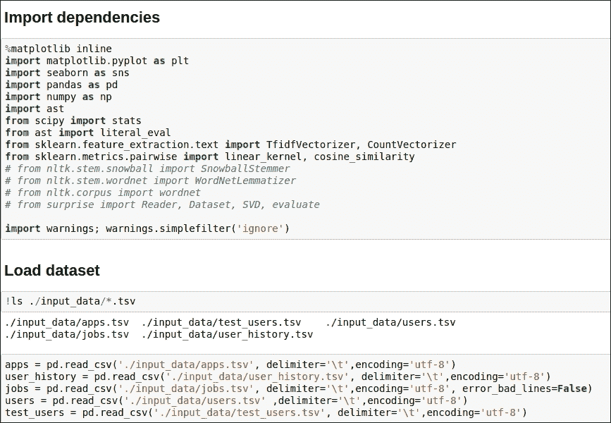

图 6.17：加载数据集的代码片段

如您所见，我们使用了 pandas 的`read_csv`方法，并将分隔符作为参数，以五种不同的数据框形式加载数据集。

## 分割训练和测试数据集

有三个数据文件，其中包含训练和测试两种类型的数据记录。以下数据框如下：

+   应用程序

+   user_history

+   users

在前面的数据框中，一些记录被标记为`Train`，一些记录被标记为`Test`。数据属性`Split`指示哪些数据记录被认为是训练数据集的一部分，哪些用于测试。因此，我们需要过滤我们的数据集。您可以查看以下屏幕截图中给出的代码片段：

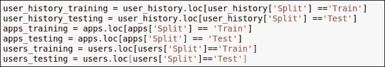

图 6.18：分割训练和测试数据集的代码片段

我们对三个数据框都应用了一个简单的过滤操作，并将它们的输出存储在新数据框中。

现在，让我们继续到**探索性数据分析**（**EDA**）部分。

## 探索性数据分析

在本节中，我们将执行一些基本分析，以便我们可以找出数据集中存在哪些类型的数据。对于修订的方法，我们正在使用工作数据框中给出的数据属性构建推荐系统。因此，在将其用于构建推荐引擎之前，我们将检查数据记录的质量。我们需要检查数据集中是否存在任何空白值。除此之外，我们还需要检查这个数据框的数据分布。

我们将对地理定位数据属性执行 EDA。在这里，我们对三个数据列：城市、州和国家进行了分组操作。您可以查看以下屏幕截图给出的代码片段：

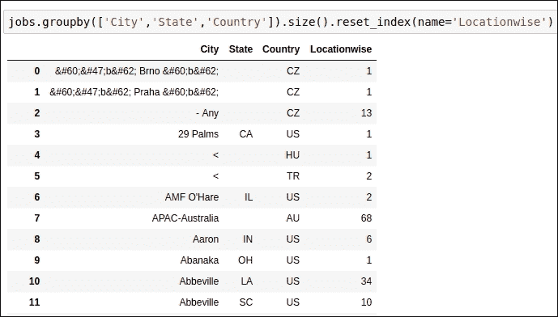

图 6.19：按城市、州和国家进行分组

如您在代码片段中看到的，有许多记录中缺少州名称。我们需要注意这些记录。

除了这个之外，我们还需要按国家计数数据记录，以便我们可以找出每个国家有多少数据记录。您可以参考以下屏幕截图所示的代码片段：

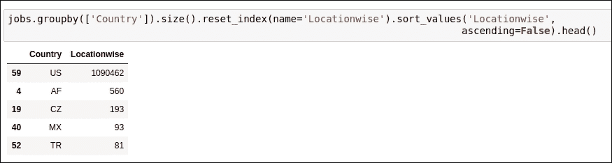

图 6.20：按国家计数数据记录的代码片段

如您在前面的代码片段中看到的，大约有 100 万个来自美国地区的职位。我们可以说，在我们的数据集中，大多数职位的国家位置是美国。为了使我们的工作更简单，我们只考虑国家为美国的职位。您可以参考以下屏幕截图给出的代码片段：

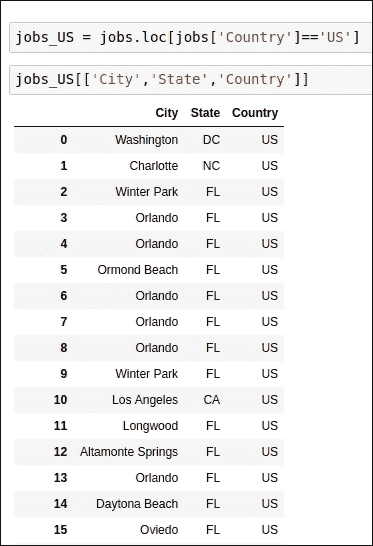

图 6.21：所有国家为美国的记录的代码片段

在这里，我们需要检查城市或州数据列中是否存在空数据值。观察前面代码的输出后，我们可以看到没有数据记录中缺少城市或州名称。

现在，让我们看看我们拥有最多职位空缺的州。请记住，我们只考虑了国家位置为美国的职位。为了找出按州划分的职位数量，您可以参考以下屏幕截图给出的代码片段：

图 6.22：按州生成就业数量代码片段

您也可以参考以下屏幕截图所示的图形：

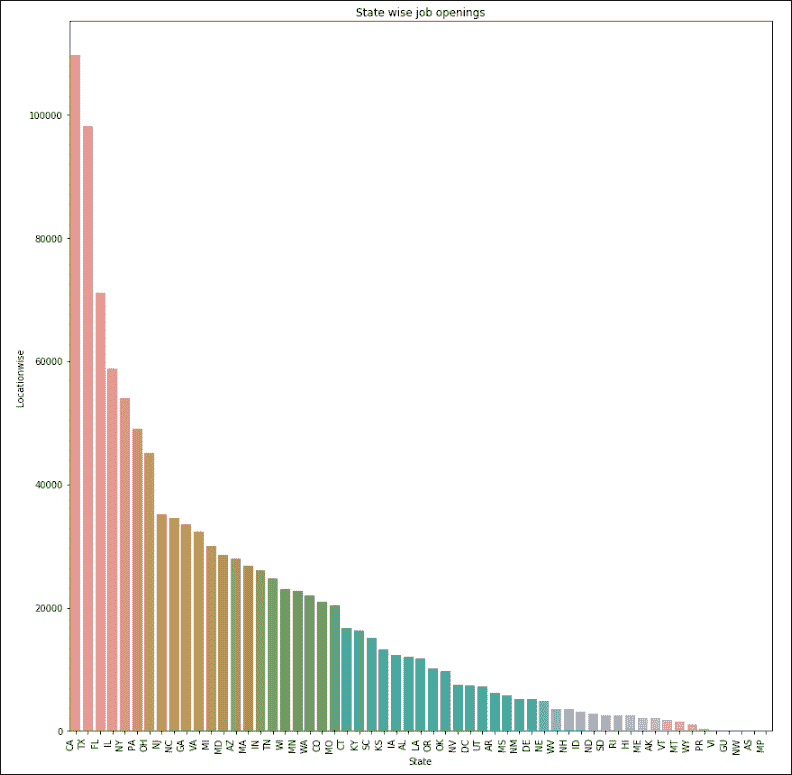

图 6.23：按州划分的就业数量图

如您所见，最多的工作机会在加利福尼亚州、德克萨斯州、佛罗里达州、伊利诺伊州和纽约州。我们已经为改进的方法做了足够的 EDA。现在，我们将开始构建推荐引擎。

## 使用工作数据文件构建推荐引擎

在本节中，我们将探索代码，看看我们如何构建一个职位推荐引擎。我们将使用 TF-IDF 和余弦相似度概念来构建推荐引擎。

我们已经考虑了`jobs_US dataframe`。这个 dataframe 包含国家为美国的职位。因此，我们没有任何垃圾数据记录。我们将只考虑 10,000 条数据记录进行训练，因为训练 1 百万条数据记录是耗时的。您可以参考以下屏幕截图所示的代码：

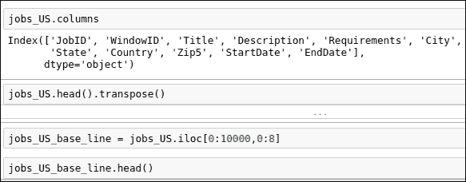

图 6.24：构建修订后方法的职位数据集代码片段

在这里，我们将关注职位名称和职位描述，以构建推荐引擎。由于我们使用的是职位的元数据，这是基于内容的方法。我们对职位名称和职位描述应用连接操作，并将`nan 值`替换为空字符串值。您可以参考以下截图中的代码：

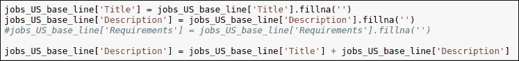

图 6.25：应用连接操作的代码片段

现在，我们将为连接字符串生成 TF-IDF 向量。我们将使用 TF-IDF 向量矩阵来生成余弦相似度分数。我们将使用 scikit-learn 中的`linear_kernel`函数来生成余弦相似度。这个函数比 scikit-learn 中的`cosine_similarity`函数生成余弦相似度所需的时间更短。您可以参考以下截图中的代码片段：

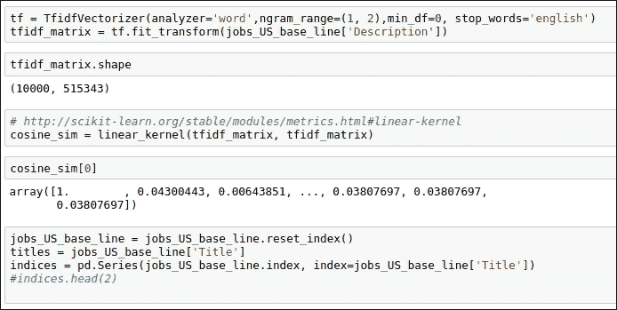

图 6.26：生成 TF-IDF 和余弦相似度的代码片段

如您所见，我们在这里生成了一个高维的 TF-IDF 矩阵。通过使用`linear_kernel`，我们还生成了余弦相似度分数。

在我们完成修订后方法的实现后，现在我们需要测试推荐。

## 测试修订后的方法

在本节中，我们将基于任何给定的职位名称生成类似类型的职位推荐。在这里，我们将职位名称作为输入传递，借助余弦相似度分数，我们可以生成任何用户可以申请的 10 个类似类型的职位。

例如，假设一个人是 SAP 商业分析师。那个人可能想申请类似类型的职位，所以在这里，我们的函数将职位名称作为输入，并为该特定用户生成前 10 个类似类型的职位。生成前 10 个职位推荐的代码如下截图所示：

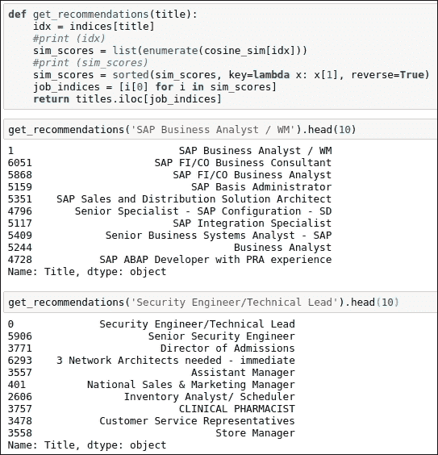

图 6.27：生成前 10 个职位推荐的代码片段

当我们看到输出时，推荐开始变得有意义。作为 SAP 商业分析师的人将获得如 SAP FI/ Co 商业分析师的职位推荐。修订后方法的结果对我们来说令人满意，推荐看起来是相关的。

## 修订后方法的问题

在本节中，我们将讨论修订后方法的问题。在最佳方法中，我们可以解决这个问题。在修订后的方法中，我们只使用了职位数据属性。我们没有考虑用户的个人资料或用户的偏好。在实施最佳方法时，我们也将考虑用户的个人资料，并根据用户的个人资料向他们推荐职位。

在下一节中，我们将探讨如何优化改进后的方法的直观想法。

## 理解如何改进改进后的方法

到目前为止，我们使用了工作数据文件中给出的数据属性，但我们还没有使用`users`数据文件和`apps`数据文件中的数据属性。`users`数据文件包含用户的个人资料信息，而`apps`数据文件包含关于哪些用户申请了哪些工作的信息。

最佳方法有三个简单的步骤：

1.  首先，借助用户的个人资料，我们将找到并生成前 10 个相似用户。

1.  我们将尝试找出这 10 个人申请的工作。然后我们可以生成`JobIDs`。

1.  现在，我们将使用`JobIDs`生成工作标题。

在这里，我们已经考虑了用户的个人资料，因此推荐更加具体地针对特定的用户群体。现在，让我们开始实施它。

# 最佳方法

我们已经看到了如何构建最佳可能方法的直观方法。在这里，我们将使用与改进方法中相同的技巧。在这个方法中，我们添加了更多的数据属性，以使推荐引擎更加准确。您可以通过使用此 GitHub 链接来参考代码：[`github.com/jalajthanaki/Job_recommendation_engine/blob/master/Job_recommendation_engine.ipynb`](https://github.com/jalajthanaki/Job_recommendation_engine/blob/master/Job_recommendation_engine.ipynb)。

## 实施最佳方法

这些是我们需要采取的步骤，以实现最佳可能的方法：

+   过滤数据集

+   准备训练数据集

+   应用连接操作

+   生成 TF-IDF 和余弦相似度分数

+   生成推荐

让我们开始实施这些列出的步骤。

### 过滤数据集

在这一步中，我们需要过滤用户数据框。我们正在对国家数据列应用过滤器。我们需要考虑基于美国的用户，因为大约有 30 万用户基于美国之外，其他用户来自世界各地的其他地方。过滤用户数据框的代码在以下截图中给出：

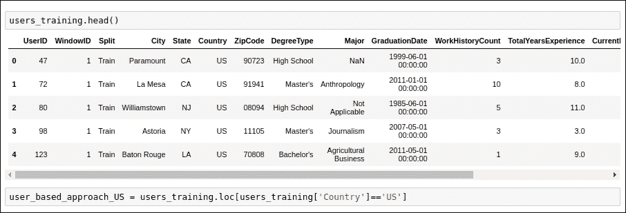

图 6.28：过滤用户数据框的代码片段

现在，让我们准备训练数据集。

### 准备训练数据集

有 30 万用户，但由于训练时间和计算能力的限制，我们并没有考虑所有用户。在这里，我们只考虑了 10,000 个用户。如果您有更多的计算资源，那么您可以考虑更多的用户数量。您可以参考以下截图中的代码片段：

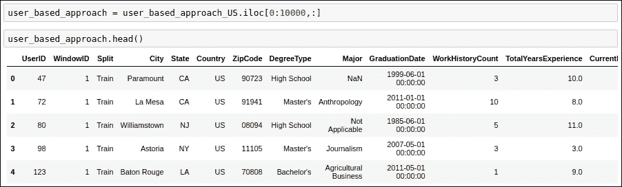

图 6.29：用于选择训练数据记录的代码片段

现在，让我们继续下一步。

### 应用连接操作

在这一步，我们基本上是在执行连接操作。为了找到一个相似的用户个人资料，我们将连接用户的学位类型、专业和经验年数。我们将为这个连接的数据值生成 TF-IDF 和余弦相似度。您可以参考以下截图给出的代码片段：

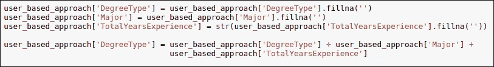

图 6.30：应用连接操作代码片段

现在，我们将使用这个连接的数据值生成 TF-IDF 和余弦相似度分数。

### 生成 TF-IDF 和余弦相似度分数

在本节中，我们将使用 scikit-learn API 生成 TF-IDF 和余弦相似度分数。我们使用的是我们在改进方法中使用的相同 API。在这里，我们没有改变技术，但我们将更改数据属性。您可以参考以下截图所示的代码片段：

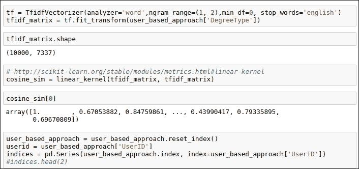

图 6.31：生成 TF-IDF 和余弦相似度代码片段

如您所见，我们已经生成了余弦相似度分数，因此基于这个分数，我们可以生成一个相似的用户个人资料，并根据他们的求职记录给出职位推荐。

### 生成推荐

为了生成职位推荐，我们需要执行以下步骤：

+   **步骤 1**：为了生成前 10 个相似的用户个人资料，我们需要传递 UserID，作为输出，我们得到与输入 UserID 最相似的 10 个 UserID。您可以参考以下截图：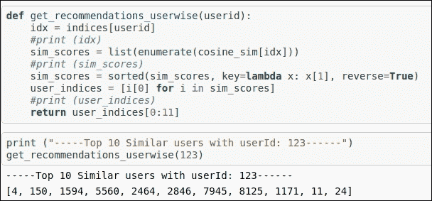

    图 6.32：生成前 10 个相似用户代码片段

+   **步骤 2**：我们将取步骤 1 中生成的`userIDs`列表，并尝试在 apps 数据框中找到相同的`UserIDs`。这种搜索操作的目的在于我们需要知道哪个用户申请了哪个职位。通过使用 apps 数据框，我们得到`JobIDs`。

+   **步骤 3**：一旦我们获得`JobIDs`，我们将使用 jobs 数据框获取职位名称。

步骤 2 和步骤 3 的代码片段如下截图所示：

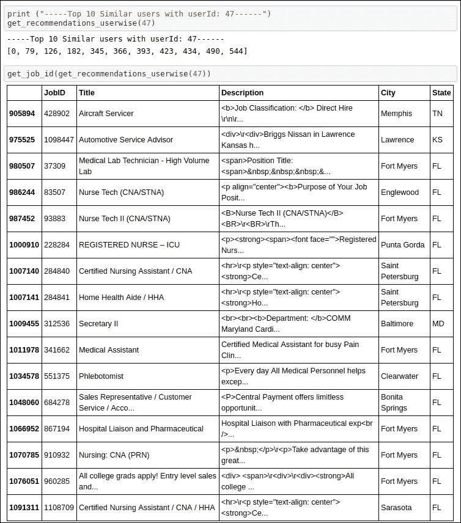

图 6.33：获取 JobIDs 和职位名称代码片段

如您所见，我们已经为`UserID 47`找到了相似用户，并且正如我们在工作推荐中看到的那样，我们根据用户的个人资料和教育资格得到了相当相关的职位。在推荐中，我们可以看到佛罗里达地区的医疗领域职位。这是因为，在我们的用户基础中，大多数用户的个人资料来自医疗背景。因为我们同时考虑了用户个人资料和职位个人资料，所以我们能够得到最相关的职位推荐。

# 摘要

在本章的整个过程中，我们使用基于内容的方法来开发一个职位推荐引擎，并且你学习了如何抓取数据集并构建基线职位推荐引擎。之后，我们探索了另一个数据集。为了改进和最佳的方法，我们使用了现成的数据集。在改进方法的发展过程中，我们考虑了职位的元数据，并构建了一个表现相当不错的推荐系统。对于最佳方法，我们试图找出相似的用户档案。基于用户的档案，我们向用户群体推荐了职位。

在下一章中，我们将构建一个摘要应用。在那里，我们将查看医学领域的文档并尝试对它们进行总结。我们将使用深度学习算法来构建这个应用。所以，继续阅读吧！
