# 第八章. 开发聊天机器人

2017 年是关于聊天机器人的年份，这一趋势在 2018 年继续。聊天机器人根本不是什么新鲜事物。聊天机器人的概念自 20 世纪 70 年代以来就已经存在。有时，聊天机器人应用程序也被称为问答系统。这是一个更具体的聊天机器人技术术语。让我们回顾一下历史。Lunar 是第一个基于规则的问答系统。使用这个系统，地质学家可以就阿波罗任务中的月球岩石提出问题。为了改进在阿波罗任务中使用的基于规则的系统，我们必须找到一种方法来编码基于模式的问题和答案。为此，我们使用了**人工智能标记语言**，也称为**AIML**。这有助于程序员用更少的代码行来实现我们通过使用硬编码的基于模式系统所生成相同的结果。随着机器学习（**ML**）领域的最新进展，我们可以构建一个无需硬编码响应的聊天机器人。

由于聊天机器人具有许多优势，它们现在被用于应用程序中；例如，用户不需要在他们的手机上安装不同种类的应用程序。如果有聊天机器人可以提供新闻，那么你可以要求 CNN 或《经济学人》上的新闻。像 Facebook、Hike、微信、Snapchat、Slack 等大型科技公司提供聊天机器人以实现更好的客户互动。他们通过创建一个可以引导客户执行某些操作的聊天机器人来实现这一点；它还提供了有关产品及其平台的有用信息。

聊天机器人提供不同的服务。通过使用 Facebook 聊天机器人平台，你可以订购鲜花并查看新闻。这听起来酷吗？从技术上讲，这些聊天机器人是当前时代的应用程序。我简要讨论了聊天机器人的好处，但我们将在本章中详细探讨它们。

在本章中，我们将涵盖以下主题：

+   介绍问题陈述

+   理解数据集

+   构建聊天机器人的基本版本：

    +   理解基于规则的系统

    +   理解方法

    +   理解架构

+   实施聊天机器人的基于规则系统

+   测试基于规则的聊天机器人

+   现有方法的缺点：

    +   理解优化方法的关键概念

+   实施修订的方法：

    +   数据准备

    +   实施序列到序列（seq2seq）模型

+   测试修订的方法：

    +   理解测试指标

    +   测试聊天机器人的修订版本

+   修订方法的缺点：

    +   理解解决现有问题的关键概念

+   最佳方法：

    +   实施最佳方法

+   摘要

# 介绍问题陈述

在本章中，我们的主要目标是了解如何构建一个聊天机器人。聊天机器人，或**问答系统**（**QA 系统**），非常有用。让我们考虑一个有趣的例子。假设你是一名学生，你有五本书要读。阅读和理解五本书可能需要时间。如果你能将这些五本书的内容输入到电脑中，只提出相关的问题呢？通过这样做，学生可以更快地学习概念和新信息。众所周知，主要的互联网产品公司正在整理信息，使其易于访问。聊天机器人或 QA 系统将帮助我们理解这些信息背后的含义。这就是为什么聊天机器人是 2017 年的热门词汇。无论你能想到什么应用，你都可以为它制作一个聊天机器人。现在许多消息平台都托管了开发者构建的聊天机器人，包括 Facebook Messenger、Slack、微信等等。聊天机器人是新的应用程序，因为它们已经存在于你每天可能使用十几次的已安装应用程序中。使用 Facebook 聊天机器人 API 开发的聊天机器人位于 Facebook Messenger 应用程序中。你可能每天会使用 Messenger 十几次。因此，用户不需要为特定的功能安装一个单独的应用程序。这将帮助公司更好地与客户互动。

在我们继续之前，我想介绍一些重要的术语，这些术语可以帮助我们了解在本章中我们针对的是哪种聊天机器人开发。首先，让我们了解开发聊天机器人的不同方法：

+   基于检索的方法

+   基于生成的方法

## 基于检索的方法

在基于检索的方法中，我们需要定义一组预定义的响应，并将某种启发式方法应用于预定义的响应，以便聊天机器人可以为给定的问题生成最佳可能的答案。这些答案非常依赖于输入问题和该输入问题的上下文。

在开发基于检索的模型的过程中，我们之前只使用了表达式匹配，这可以帮助我们得到适当的答案，但仅使用表达式匹配在这里不会有所帮助。因此，最近研究人员和程序员开始使用表达式匹配和高级机器学习（ML）分类器技术。让我们通过一个例子来了解机器学习分类器如何有助于构建基于检索的聊天机器人。

假设 Alice 需要在朋友的生日时送花。她的一个朋友 Emma 喜欢玫瑰，另一个朋友 Lucy 喜欢百合。Alice 使用一个花订购聊天机器人来预订她的订单。她写道：“我想预订一束多色的玫瑰花束和一束百合花。”在这种情况下，如果我们实现一个基本的机器学习分类器，聊天机器人可以轻松地识别 Alice 正在预订的两个不同的订单，并且它还能够解释每个订单的数量。聊天机器人还会要求提供不同的地址等。通过使用机器学习技术，我们可以编写更复杂的启发式算法，这有助于我们生成更合适的聊天机器人回答。Facebook messenger 聊天机器人 API 就是这样一个例子。

有另一个有趣的例子可以通过使用机器学习启发式算法来解决。比如说，你问聊天机器人：“今天是什么日子？”或者“今天是星期几？”如果我们实现了高级机器学习技术，那么它可以识别出这两个问题虽然措辞不同，但意图相同。在聊天机器人的开发过程中，意图和上下文检测是更复杂的任务，可以通过机器学习技术和一些启发式算法来实现。

现在让我们转向更困难的方法，即基于生成的方法。

## 基于生成的方法

在基于生成的方法中，没有为聊天机器人提供任何预定义的响应。聊天机器人从头开始生成响应。为了构建基于生成的聊天机器人，我们需要提供大量数据，机器将仅通过观察数据来学习如何回答用户提出的问题。2015 年，谷歌研究人员 Oriol Vinyals 和 Quoc V. Le 提出了一种称为 A *神经对话网络*的方法。您可以参考以下论文：[`arxiv.org/pdf/1506.05869v2.pdf`](https://arxiv.org/pdf/1506.05869v2.pdf)。

在本文中，研究人员使用了康奈尔电影对白数据集。这个数据集被输入到机器中，以便它能够学习基本的英语语言。为此，他们使用了**序列到序列**（**seq2seq**）神经网络架构。之后，他们使用了 IT 支持数据集，以便机器获得领域知识。一旦机器在这个数据集上训练完毕，他们就在 IT 支持部门测试了聊天机器人，这个聊天机器人将能够以极高的准确性回答问题。在接下来的章节中，我们将构建自己的神经对话网络。这种方法耗时较少，并克服了我们在基于检索的模型中面临的挑战，如意图识别、上下文识别等。

在此我们还需要讨论一些其他的重要术语。在开发聊天机器人之前，我们需要考虑一些重要的约束条件。第一个与对话领域相关：

+   开放域

+   封闭域

## 开放域

首先，让我们了解什么是开放域。有时候对话是模糊和不确定的。让我给你举一个例子。假设你遇到了一个多年未见的老同学。在对话的过程中，你不知道你们将要谈论哪个特定的话题。在这种情况下，对话可以随意展开。因此，对话的领域是不固定的。你可以谈论生活、工作、旅行、家庭等等。你可以谈论无数的话题。这种我们无法限制谈话领域的对话，被称为开放域。开发一个开放域聊天机器人是困难的，因为理想情况下，这种聊天机器人能够以人类水平的准确性回答来自任何领域的每一个问题。

目前，这类聊天机器人尚未被制造。当我们能够制造这种聊天机器人时，它将必须通过图灵测试。让我给你一个图灵测试的简要介绍，以便你能更好地理解解释。这个实验是由伟大的计算机科学家艾伦·图灵在 1950 年创造的。在这个实验中，一个被称为裁判的人向一个人和一个机器提出一系列问题。现在，裁判不知道哪个答案是来自人类，哪个答案是来自机器。但是，在看到或听到答案后，如果裁判无法区分哪些答案是来自人类，哪些答案是来自机器，那么机器就通过了图灵测试，我们可以说机器表现出了人类水平的智能，因为它表现得像人类一样聪明。到目前为止，还没有任何一个聊天机器人能够以人类水平的准确性通过图灵测试。你可以通过访问[`en.wikipedia.org/wiki/Turing_test`](https://en.wikipedia.org/wiki/Turing_test)了解更多关于图灵测试的信息。这一段技术正在快速发展，所以接下来的五年可能会非常激动人心。

谷歌在开发开放域聊天机器人方面非常积极。它正以谷歌助手的形式构建这个产品，但通过图灵测试的准确性和功能性仍然有限。现在让我们了解第二种类型的领域。

## 封闭域

封闭域是开放域的对立面。对于封闭域，我们需要限制对话话题。让我们举一个例子：在办公室，我们有时会有会议。在会议之前，参与者知道将要讨论的话题。因此，在会议期间，我们只关注那些话题。在这里，我们不会有无限的话题和领域可以谈论。这种我们限制了可以谈论的领域和话题的对话，被称为封闭域。

如果一家金融机构，如银行，为他们的客户推出聊天机器人，那么开发的聊天机器人不能回答诸如“你能告诉我今天新加坡的天气吗？”这样的问题。但它可以帮助你检查申请信用卡的程序，这是因为聊天机器人可以理解与特定领域相关的提问。一个针对封闭领域的聊天机器人是肯定可能的，而且有很多公司正在构建特定领域的聊天机器人，因为这对与客户群互动是有益的。所以在本章中，我们将重点关注封闭领域聊天机器人。

让我们尝试理解最后一个约束条件；对话长度，这意味着我们将从聊天机器人那里得到的答案的长度。基于这一点，我们需要理解以下术语：

+   简短对话

+   长对话

## 简短对话

这种类型的聊天机器人可以生成简短答案。在聊天机器人的开发过程中，我们需要问自己是否期望简短对话。如果我们期望简短答案，那么你应该很高兴，因为基于简短对话的聊天机器人可以很容易地构建。以下是一个简短对话的例子：

人：嗨

机器：你好

人：你好吗？

机器：我很好

这个例子表明了聊天机器人生成的简短对话。

## 长对话

这种类型的聊天机器人可以生成长答案。机器学习长对话是困难的，因此构建能够生成长对话的聊天机器人是困难的。让我们看看一个长对话的例子：

人：我想给你讲一个故事。

机器：请继续。

人：给你。约翰去了市场。丹尼尔正在去印度的路上。Siri 有一个苹果。Siri 在厨房。所以我的问题是，Siri 在哪里？

机器：根据你的故事，我认为 Siri 在厨房。

正如你在本例中看到的，为了生成正确的答案，机器也应该存储和处理给定的信息，以便它能生成正确的答案。因此，长对话和基于推理的聊天机器人开发起来有点困难。

到目前为止，你已经学习了很多术语。现在让我们看看它们在我们开发聊天机器人时将如何影响我们。根据方法和领域类型，我们可以构建不同类型的聊天机器人。

### 开放领域和基于生成的方法

我们希望使用基于生成的方法来构建聊天机器人，这种方法在开放领域上运行。这意味着聊天机器人需要从头开始学习如何回答来自任何领域的问题。这里的对话可以朝任何方向发展。这种类型的聊天机器人是**通用人工智能**（**AGI**）的一个例子，我们还没有达到那个阶段。

因此，开发这种类型的聊天机器人不是本章的一部分。

### 开放领域和基于检索的方法

如果我们想要构建一个可以使用基于检索的方法在开放域上运行的聊天机器人，那么作为编码者，我们需要硬编码几乎所有的响应以及可能的问题和变体。这种方法消耗了大量的时间，因此这种类型的聊天机器人也不是本章的一部分。

### 封闭域和基于检索的方法

我们已经了解到我们无法在开放域进行操作，但关于封闭域呢？我们当然可以在封闭域工作，因为用户可以向聊天机器人提出有限数量的问题，而聊天机器人可以回答。如果我们为封闭域使用基于检索的方法，那么我们可以编写相对简单的问题。我们可以集成一些 NLP 工具，例如解析器、**命名实体识别**（NER）等，以便生成最准确的答案。

让我们举一个例子。假设我们想要构建一个可以为我们提供任何位置的实时天气信息的聊天机器人。如果我们使用基于检索的方法构建聊天机器人，那么用户将肯定能够得到关于“孟买的天气如何？加利福尼亚的天气如何？今天有降雨的可能吗？”等问题准确的答案。聊天机器人会很好地回答前两个问题，但在第三个问题时，它会感到困惑，因为我们没有提供降雨可能性的位置。如果聊天机器人使用了某些启发式方法，那么你可能会得到一个响应。聊天机器人可能会询问你想要了解降雨可能性的位置，但大多数情况下，这种情况不会发生。聊天机器人会直接告诉你，例如，加利福尼亚的降雨可能性。实际上，我想知道孟买的降雨可能性。所以，这类与上下文相关的问题在基于检索的方法中很常见。我们需要实施基于生成的方法来克服与上下文相关的问题。

### 封闭域和基于生成的方法

当我们为封闭域使用基于生成的方法时，这种类型聊天机器人的开发所需编码时间更少，答案的质量也得到了提高。如果我们想让我们的聊天机器人理解用户一系列问题中的长上下文和意图，那么基于生成的方法是正确的选择。经过在大语料库上的训练和优化后，聊天机器人可以理解问题的上下文和意图，并且能够提出推理类型的问题。这个聊天机器人开发空间对于研究和实施新想法来说既令人兴奋又有趣。

让我们举一个例子。假设我们构建了一个聊天机器人来向银行申请住房贷款。当用户运行这个聊天机器人时，它可能会问这些问题：我的住房贷款申请状态如何？我这边还有哪些文件需要上传？我会在接下来的 2 天内获得批准吗？您收到我的税务报表和工资条了吗？最后一个问题的上下文取决于第二个问题。这些类型的问题及其答案可以很容易地通过基于生成的方法生成。

参考以下图，它将帮助我们总结前面的讨论：

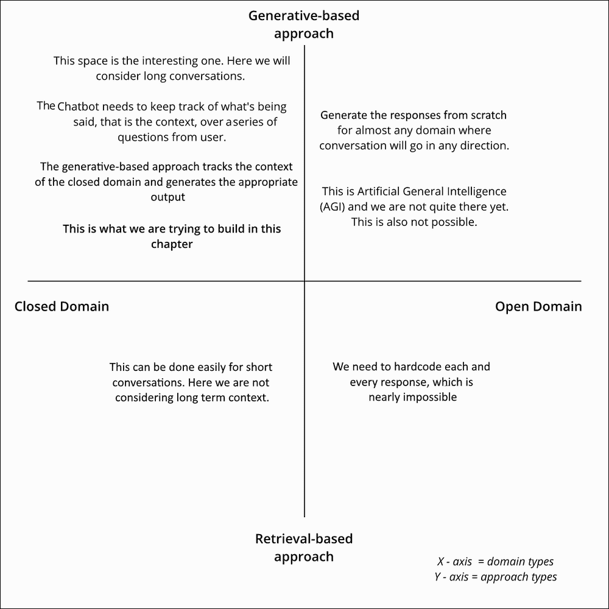

图 8.1：开发聊天机器人的方法示意图

在本章中，我们将构建一个基于封闭域的聊天机器人，它将使用基于检索和基于生成的方法。

现在让我们看看本章我们将使用的数据集。

# 理解数据集

为了开发聊天机器人，我们使用了两个数据集。这些数据集如下：

+   康奈尔电影对话数据集

+   bAbI 数据集

## 康奈尔电影对话数据集

这个数据集已被广泛用于开发聊天机器人。您可以从以下链接下载康奈尔电影对话语料库：[`www.cs.cornell.edu/~cristian/Cornell_Movie-Dialogs_Corpus.html`](https://www.cs.cornell.edu/~cristian/Cornell_Movie-Dialogs_Corpus.html)。这个语料库包含从原始电影剧本中提取的大量丰富元数据的虚构对话集合。

这个语料库包含 10,292 对电影角色之间的 220,579 个对话交换。它涉及来自 617 部电影中的 9,035 个角色。总共有 304,713 个话语。这个数据集还包含电影元数据。以下是一些元数据类型：

+   与电影相关的元数据包括以下细节：

    +   电影类型

    +   发布年份

    +   IMDb 评分

+   与角色相关的元数据包括以下细节：

    +   3,774 个角色的性别

    +   电影中的角色总数

当您下载这个数据集时，您会注意到我们将在这个章节中使用两个文件。这两个文件的名称是`movie_conversations.txt`和`movie_lines.txt`。让我们看看每个文件的内容细节。

### movie_conversations.txt 的内容细节

这个文件包含`movie_lines.txt`文件的`line_id`。您可以在以下图中看到`movie_conversations.txt`的内容：

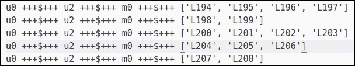

图 8.2：movie_conversations.txt 文件的内容示例

正如您在前面的图中可以看到，这个文件包含行号，实际对话内容位于*movie_lines.txt*中。*+++$+++*充当分隔符。您肯定非常想知道如何处理这个数据集；请稍等片刻，我们将在接下来的章节中介绍这一方面。

现在让我们看看下一个文件的内容。

### `movie_lines.txt` 的内容细节

这个文件包含实际的电影对白。你可以在下面的图像中看到 `movie_lines.txt` 的样本内容：


图 8.3：`movie_lines.txt` 的样本内容

正如你在前面的图像中可以看到的，每一行都有一个唯一的对话行 ID。这个 `line_id` 指的是 `movie_conversations.txt` 文件。这个文件包含相同的行分隔符和参与对话的角色名称。

如果你同时看到这两个文件，那么可能对你来说更有意义。在 `movie_conversations.txt` 文件中，参考 *行号 194, 195, 196* 和 *197* 上的对话。所有这些对话都可以在 `movie_lines.txt` 文件中找到。在前面的图像中，你可以看到 *行号* *194* 包含这个问题：*我们能快点吗？Roxanne Korrine 和 Andrew Barrett 在广场上正在进行一场可怕的公开分手。再次。* 另一方面，*行号* *195* 包含这个答案：*嗯，我想如果我们从发音开始，如果你觉得可以的话。*

在将数据集以问答格式准备并输入到机器之前，我们需要准备这个数据集。我们将在使用它进行训练之前实现数据准备步骤。

现在，让我们看看 bAbI 数据集。

## bAbI 数据集

这个数据集是由 Facebook AI Research (FAIR) 构建的，其中 AI 代表人工智能。这个数据集属于 bAbI 项目。你可以从 [`research.fb.com/downloads/babi/`](https://research.fb.com/downloads/babi/) 下载这个数据集。这是一个维护良好的数据集。bAbI 项目的目标是尝试构建一个自动文本理解和推理系统。这个数据集包括以下子数据集：

+   (20) QA bAbI 任务

+   (6) 对话 bAbI 任务

+   儿童书籍测试

+   电影对话数据集

+   WikiMovies 数据集

+   基于对话的语言学习数据集

+   简单问题数据集

+   HITL 对话模拟器

我们在这里将只使用一个子集，即 (20) QA bAbI 任务，因为它对于构建聊天机器人最有用。

### (20) QA bAbI 任务

让我们详细看看这个子数据集。在这里，使用这个 (20) QA bAbI 数据集执行了 20 个不同的任务。让我们看看这些任务是什么。这些任务赋予机器进行某些推理的能力，基于这些推理，机器可以回答问题。你可以参考以下图像中给出的任务名称：

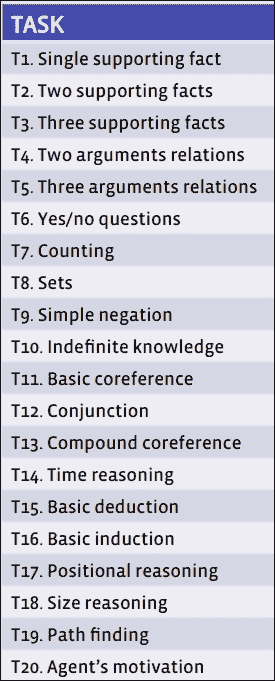

图 8.4： (20) QA bAbI 任务细节

图片来源：http://www.thespermwhale.com/jaseweston/babi/abordes-ICLR.pdf

Facebook 的研究员 Jason Weston、Antoine Bordes、Sumit Chopra、Alexander M. Rush、Bart van Merriënboer、Armand Joulin 和 Tomas Mikolov 发表了一篇论文，在论文中他们提出了一种有趣的基于 AI 的 QA 系统。你可以通过访问[`arxiv.org/abs/1502.05698`](https://arxiv.org/abs/1502.05698)来参考他们的研究论文。在本章中，我们将尝试实现任务 T1 的结果，并将重新生成其结果。

这个数据集包含两种语言的语料库，英语和印地语。这里有两种类型的文件夹：名为*en*的文件夹有 1,000 个训练示例，而*en-10K*有 10,000 个训练示例。每个任务数据集的格式如下图所示：

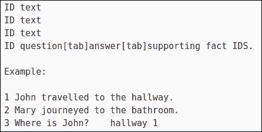

图 8.5：单个支持 QA bAbI 任务的格式

支持的事实被称为故事。基于故事，用户可以向机器提问，机器应该给出可以从提供的支持文本中推导出的逻辑上正确的答案。这是一个困难的任务，因为在这种情况下，机器应该记住它可以随时使用的长上下文。我们很快就会使用这个有趣的数据集。

现在我们开始构建聊天机器人的基本版本。

# 构建聊天机器人的基本版本

在本节中，我们将构建聊天机器人的基本版本。对于任何公司来说，获取数据都不是问题，但获取特定领域的对话数据集具有挑战性。

现在有那么多公司的目标是要创建一个创新的特定领域聊天机器人，但他们的主要挑战是获取正确的数据。如果你面临同样的问题，那么这个基本方法可以帮助你。这个聊天机器人的基本版本是基于封闭领域和基于检索的方法，它使用基于规则的系统。所以，让我们开始了解基于规则的系统的每个方面。

## 为什么基于规则的系统有效？

如我之前提到的，基于规则的系统是实现基于检索的方法的方式。现在，你可能想知道为什么我们需要基于规则的系统。考虑到我们生活在机器学习（ML）的时代，这难道听起来不古老吗？让我与你分享我的个人经历。我密切合作了许多初创公司。其中一些在金融领域运营，一些在人力资源领域运营，还有一些在法律领域运营。在这个聊天机器人的时代，初创公司非常热衷于开发特定领域的聊天机器人，以帮助用户。最初，他们使用一些通用数据集，以便机器可以学习语言并为它们生成逻辑因果答案，但他们很快意识到他们没有足够的特定领域数据来帮助他们构建一个好的聊天机器人。让我给你举一个例子。

我与一家金融科技初创公司合作，我们需要构建一个聊天机器人。聊天机器人的具体要求是它应该帮助想要申请住房贷款的客户，以及那些已经申请并需要一些帮助的客户。现在，这家金融科技初创公司刚刚开始运营 1 年半。因此，他们没有关于客户可能提出的问题的大量聊天记录。简而言之，公司没有足够的特定领域数据，例如住房贷款申请人可能提出的问题类型，以及如何将这些客户查询同步到这家金融科技公司遵循的贷款程序。在这种情况下，我们需要关注两个主要方面：

+   我们需要构建一个最小可行聊天机器人，以帮助客户处理基本的常见问题解答（FAQs）。

+   通过这个最小可行聊天机器人的帮助，你还可以了解人们提出的问题类型，并根据这些问题，调整聊天机器人。

在这类情况下，当我们没有特定领域的数据集时，基于规则的或基于检索的模型将为我们工作。从下一节开始，我们将探讨基于规则的系统以及开发基本聊天机器人和其架构的方法。

## 理解基于规则的系统

在本节中，我们将介绍基于规则的系统，这样当你我们开始开发基于检索的聊天机器人时，你不会感到被排除在外。**基于规则**（**RB**）系统定义为：使用可用的知识或规则，我们开发一个使用规则的系统，在语料库上应用可用的系统规则，并尝试生成或推断结果。从聊天机器人的角度来看，RB 系统包含所有可能的问题和答案，并且它们是硬编码的。我们绝对可以使用正则表达式和模糊逻辑来实现某种启发式方法，以使 RB 系统更加准确。

参考以下图示，它将给你一个关于使用基于检索方法的聊天机器人工作流程的思路：

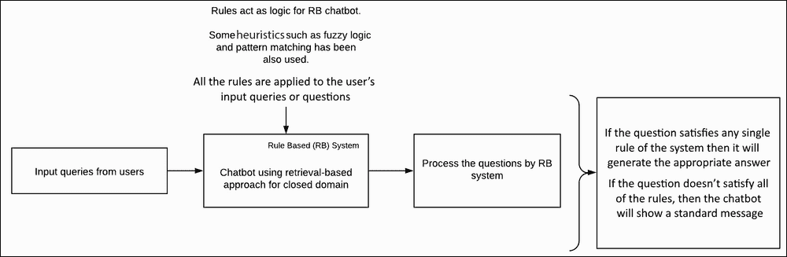

图 8.6：基于规则的聊天机器人工作流程

根据前面的图示，你知道在一个基于规则的（RB）系统中，我们将手动编写所有可能的问题和答案，以及实现正则表达式和模糊逻辑，这将使聊天机器人具备生成适当答案的能力。根据业务需求，可以从这个系统中添加和删除问题。现在让我们讨论我们的方法，并基于这个方法，我们将构建聊天机器人的基本版本。

## 理解方法

在本节中，我们将查看有助于我们实现聊天机器人基本版本的步骤。在这里，我正在为金融领域构建一个聊天机器人，它将帮助用户申请住房贷款。我们将编写一些问题，以便你知道如何开发基于规则的聊天机器人。我们需要执行以下步骤：

1.  列出可能的问题和答案。

1.  决定标准消息。

1.  理解架构。

## 列出可能的问题和答案

首先，我们需要列出所有我们可以代表用户想到的问题。一旦我们决定了这些问题，然后我们需要逐一决定这些问题的答案。假设我们要求用户提供全名、电子邮件 ID、电话号码和贷款金额，以便在用户中途退出时，客户代表可以回电。之后，我们询问用户他们需要什么样的帮助，然后他们可以提出问题。他们可能会询问资格标准、申请状态、文件要求等等。在第一次迭代中，您需要添加用户经常提出的最基本问题。一旦我们决定了问题和答案，编码它们就会变得容易。

例如，我在这个金融领域聊天机器人的基本版本中包含以下问题：

+   请告知我获得住房贷款的资格标准

+   请告知我的贷款申请状态

+   告知我需要提交的文件清单

每个问题的答案如下：

+   我们需要至少 3 年的工作经验、3 年的 IT 税单以及至少 35 万卢比的收入

+   您的申请已提交至我们的信用风险管理团队

+   您需要提交过去 6 个月的工资条、身份证明、3 年的 IT 税单以及您房屋的租赁文件。

我们还需要决定一些标准消息，这些内容将在下一节中介绍。

## 决定标准消息

我们需要决定标准消息，例如聊天机器人发出的欢迎信息。如果用户提出聊天机器人无法回答的问题，那么应该弹出什么信息？我们还需要决定用户结束聊天时的消息。

这些标准消息帮助用户了解他们可以向聊天机器人提出什么问题以及不能提出什么问题。现在让我们看看聊天机器人基本版本中的架构部分。

## 理解架构

在本节中，让我们谈谈架构。当我们构建一个特定领域的基于规则的聊天机器人时，我们需要存储用户提出的所有问题。我们还需要构建一个快速且可扩展的聊天机器人。在这种方法中，我们构建了 Web 服务。Web 服务的 REST API 将很容易与网站和前端集成。我们需要一个可以存储用户对话的数据库。这些对话数据将有助于我们改进聊天机器人或用于机器学习训练。我使用的库如下所示：

+   使用 Flask 实现 Web 服务和 REST API

+   使用 MongoDB 来存储对话。选择 NoSQL 数据库的原因是对话没有特定的格式。NoSQL 是存储无模式数据的良好选择。我们需要存储原始对话，因此 NoSQL 是一个很好的选择。

您可以参考以下图表，它将帮助您理解整个架构和流程：

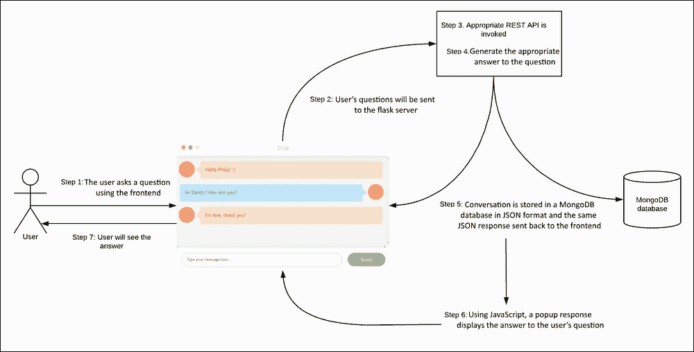

图 8.7：聊天机器人基本版本的架构设计

根据这个架构，您会发现聊天机器人基本版本的处理流程相当简单。这个流程涉及七个简单的步骤：

1.  用户将向聊天机器人提问。

1.  聊天机器人的基于规则的引擎将处理这个问题。在这里，已经调用了 REST API 来生成响应。

1.  如果提出的问题对 RB 系统可用，那么用户将得到一个适当的答案。

1.  如果提出的问题对 RB 系统不可用，那么用户将不会得到答案，而是收到一个标准错误信息。

1.  用户的对话将被存储在 MongoDB 数据库中。这个响应是 JSON 格式的。

1.  REST API 将发送相同的 JSON 响应到前端。在前端，JavaScript 解析这个响应并弹出适当的答案。

1.  当用户得到他们的答案后，他们可能会结束聊天或提出另一个问题。

我还想强调的一个主要观点是，在将数据存储到 MongoDB 之前，我们需要最终确定 JSON 响应的属性，这些属性实际上在用 JavaScript 解析 JSON 响应时对我们有帮助。您可以参考以下截图，这将帮助您了解我决定采用哪种类型的 JSON 模式：

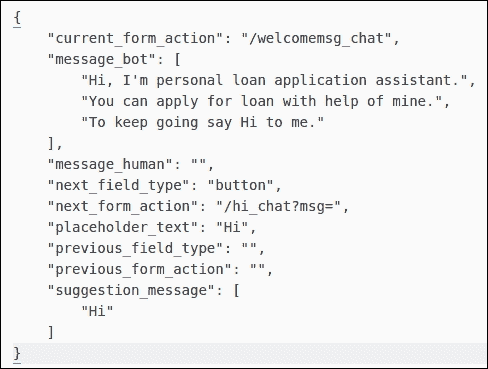

图 8.8：理解 JSON 响应属性

每个 JSON 属性的使用方法如下：

+   `current_form_action:` 这个属性指示当前正在调用的 REST API。

+   `message_bot:` 这个字段携带来自机器人的答案。

+   `message_human:` 这个字段携带用户的查询。

+   `next_field_type:` 如果我们需要在下一个问题中填充文本框或按钮，这个属性对于生成动态 HTML 组件很有用。

+   `next_form_action:` 这个属性指示在即将到来的请求中我们应该调用哪个 REST API。

+   `placeholder_text:` 如果您想在文本框中放置水印文本，那么这个属性可以帮助您实现 HTML 功能。

+   `previous_field_type:` 这个属性跟踪最后一个字段类型。

+   `previous_form_action:` 这个属性跟踪我们最后调用的 REST API。

+   `suggestion_message:` 有时，我们需要一条消息来调用特定的规则。这就像您说“OK Google”并调用 Google Home 助手一样。这个属性基本上指导用户在提问时可以期待什么。

现在，让我们开始实现基于规则的聊天机器人。

# 实现基于规则的聊天机器人

在本节中，我们将了解聊天机器人的实现。这个实现分为两部分。您可以通过访问以下链接找到此代码：[`github.com/jalajthanaki/Chatbot_Rule_Based`](https://github.com/jalajthanaki/Chatbot_Rule_Based)：

+   实现对话流程

+   使用 flask 实现 RESTful API

## 实现对话流程

为了实现对话逻辑，我们编写了一个单独的 Python 脚本，这样我们每次需要添加或删除一些逻辑时都会很容易。在这里，我们创建了一个 Python 包，我们将这个对话逻辑放入其中。文件名为 *conversationengine.py*，它使用 JSON、BSON 和 re 作为 Python 依赖项。

在这个文件中，我们将每个对话以函数的形式实现。当用户第一次打开聊天机器人时，应该会弹出一条欢迎信息。你可以在下面的屏幕截图中查看给出的代码：

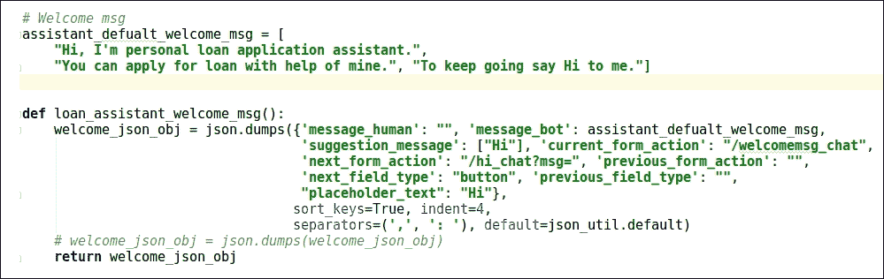

图 8.9：欢迎信息的代码片段

现在用户需要输入 **Hi** 来开始对话。当用户输入 **hi** 时，`start_coversation_action` 函数将被调用，聊天机器人将询问一些信息，以便它能给出更准确、个性化的答案。首先，它会询问用户的姓名，然后询问他们的电子邮件 ID 和电话号码。你可以在下面的屏幕截图中查看：

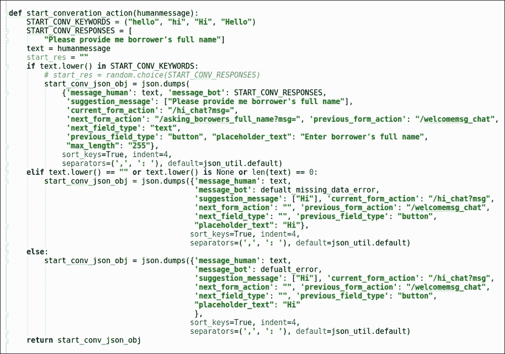

图 8.10：询问基本用户信息的代码片段

同样，还有 `borrowers_name_asking`、`borrowers_email_id_asking` 和 `mobilenumber_asking` 函数，它们要求用户提供他们的姓名、电子邮件 ID 和电话号码。除此之外，还有一些问题可以帮助用户了解他们的贷款申请状态。如果客户是新的，他们可以提出诸如 *为了申请住房贷款需要哪些文件？* 之类的问题。你可以在 `other_cases` 函数中找到这些状态和文件相关的问题。你可以在下面的屏幕截图中查看该函数的代码：

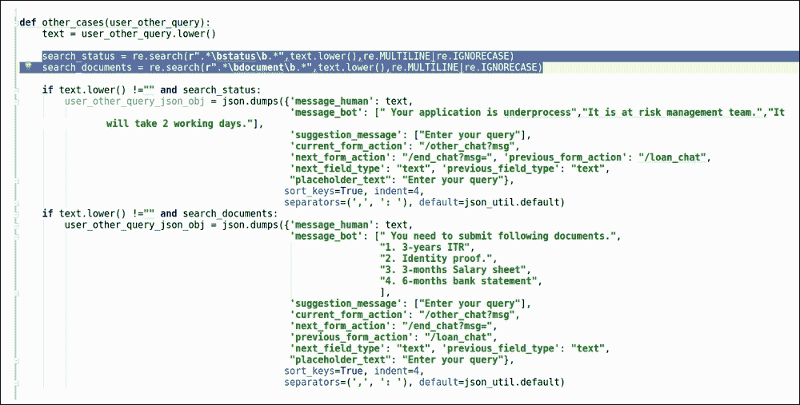

图 8.11：与贷款申请状态和申请住房贷款所需文件相关的代码片段

如前图所示，我们在这里使用了一个正则表达式，以便聊天机器人能够回答状态和文件相关的问题。这是纯粹使用基于关键字的逻辑编写的。

现在，让我们看看如何使用 Flask 构建这个函数的 Web 服务。

## 使用 Flask 实现 RESTful API

到目前为止，我们只编写了接收用户输入查询并基于该查询调用相应函数的功能。为了更好的维护和易于集成，我们需要使用 Flask 实现 RESTful API。为了实现这一点，我们使用了 `flask`、`json`、`os`、`uuid`、`datetime`、`pytz` 和 `flsk_pymongo` 库。Flask 是一个易于使用的 Web 框架。你可以在下面的图中找到代码片段：

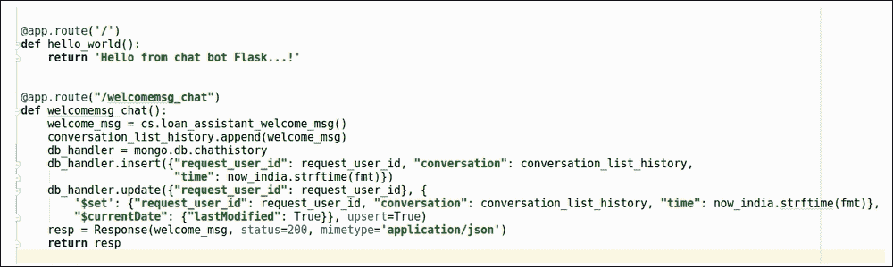

图 8.12：为聊天机器人创建 RESTful API 的代码片段

如前图所示，每个路由调用一个不同的方法，这些方法都是我们之前提到的`conversationengine.py`文件的一部分。为了运行这个 Flask 引擎，我们需要使用 Flask 的`app.run()`命令。你可以通过访问以下链接找到所有 API 及其功能：[`github.com/jalajthanaki/Chatbot_Rule_Based/blob/master/flaskengin.py`](https://github.com/jalajthanaki/Chatbot_Rule_Based/blob/master/flaskengin.py)。

现在我们来测试这个基于规则的聊天机器人。

# 测试基于规则的聊天机器人

在本节中，我们将测试聊天机器人的基本版本。让我们从聊天机器人从用户那里询问的基本个人信息开始。在这里，我将生成由 Flask RESTful API 生成的 JSON 响应。如果我们将这些 API 与前端集成，我们需要 JavaScript 来解析这个 JSON 响应。我不会在这里解释前端集成部分，所以让我们分析 JSON 响应。

对于欢迎信息，请参考以下截图：

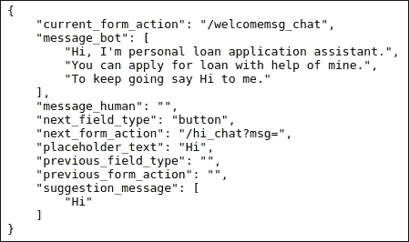

图 8.13：欢迎信息的 JSON 响应

当聊天机器人询问用户姓名时的 JSON 响应如下所示：


图 8.14：询问用户姓名的 JSON 响应

如果用户询问其应用程序的状态，那么他们将得到以下图中给出的 JSON 响应：

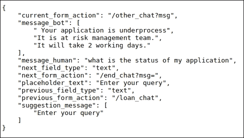

图 8.15：获取状态相关信息的 JSON 响应

如果用户用印地语-英语（Hinglish）混合提问并使用查询中的单词*状态*，那么聊天机器人将生成响应。你可以在以下图中看到响应：

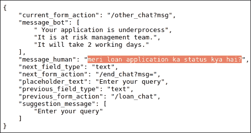

图 8.16：获取印地语-英语（Hinglish）语言相关信息的 JSON 响应

如果用户提出未编码的查询，它将生成以下 JSON 响应：

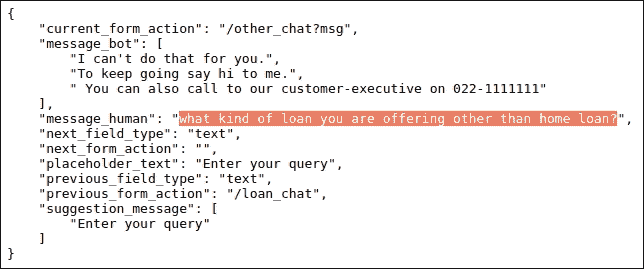

图 8.17：未知问题的 JSON 响应

经过测试，我们了解到已经编码的查询运行良好，但这个聊天机器人的基本版本对于未编码的问题处理不正确。我想在测试基于规则的聊天机器人后指出一些优点。然而，这种方法也有各种缺点，我们将在下一节中讨论。

## 基于规则的聊天机器人的优点

你可以参考以下基于规则的聊天机器人的优点：

+   编码简单。

+   计算能力需求较低。

+   使用模式匹配方法，因此如果用户在对话中使用英语和其他语言，他们仍然会得到答案。这是因为聊天机器人识别出用户在问题中提供的特定关键词。假设用户用英语问：“你能提供我需要提交的文档列表吗？”另一个用户可能用印地语提问：“Kya aap mujhe bata sakte hain mujhe kaun se documents submit karne hain?”对于这个问题，聊天机器人将生成答案，因为它从用户查询中找到特定的关键词，如果这些关键词存在，那么聊天机器人将生成答案，而不考虑语言。

现在，让我们看看与这种方法相关的问题，我们需要解决这些问题来改进聊天机器人。

# 现有方法的问题

在本节中，我们将讨论我们聊天机器人的基本版本存在的问题。正如我们所知，对于未见过的查询，这种方法不起作用，这意味着基本方法无法正确地泛化用户的问题。

我在这里列出了一些问题：

+   耗时，因为我们需要为每个场景硬编码，这根本不可行

+   它无法处理未见过的用例

+   用户应该处理对话的严格流程

+   它无法理解长上下文

大多数这些问题可以通过基于生成的方法来解决。让我们看看将帮助我们改进这种方法的关键概念。

## 理解优化方法的关键概念

在本节中，我们将讨论一些关键概念，这些概念可以帮助我们改进聊天机器人的基本版本。我们之前列出的问题可以通过使用**深度学习**（**DL**）技术来解决，这些技术可以帮助我们在更短的时间内构建一个更通用的聊天机器人。

在继续前进之前，我们需要决定我们将使用哪种深度学习技术来改进我们的方法。深度学习帮助我们取得很好的成果。在这里，我们需要使用端到端深度学习方法，它不对数据、对话结构和用例结构做出任何假设。这正是我们想要的。为了实现这一点，我们将使用**循环神经网络**（**RNN**）。现在你可能想知道为什么 RNN 是有用的。让我通过一个例子来解释这一点。假设我们想要将温度分类为热或冷；为了做到这一点，我们将使用前馈神经网络将温度分类为热或冷，但对话并不是固定大小的。对话是一系列单词。我们需要使用一个能够帮助我们处理单词序列的神经网络。RNN 最适合处理这类序列。在 RNN 中，我们在训练过程中将数据反馈到输入中，形成一个循环。

在改进的方法中，我们将使用 TensorFlow 中的序列到序列（seq2seq）模型。因此，让我们先讨论一下序列模型。

### 理解 seq2seq 模型

使用 seq2seq 模型的好处是我们不需要执行特征工程。像大多数深度学习技术一样，它通过自身生成特征。我们将简要讨论 seq2seq 模型。seq2seq 模型由两个**长短期记忆**（**LSTM**）循环神经网络组成。第一个神经网络是一个*编码器*。它处理输入。第二个神经网络是一个*解码器*。它生成输出。通常，深度学习算法需要输入和输出的维度是固定大小的，但在这里，我们接受一个句子中的单词序列作为输入，并输出一个新的单词序列。因此，我们需要一个能够学习具有长距离记忆依赖性的数据序列模型。LSTM 架构最适合这种情况。编码器 LSTM 将可变长度的输入句子转换为一个固定维度的向量表示。我们可以将其视为一个*思维向量*或*上下文向量*。我们使用 LSTM 的原因是它可以记住序列中远处的单词；在这里，我们处理 seq2seq 模型的大序列注意力机制，这有助于解码器选择性地查看与提高准确性最相关的序列部分。

您可以参考以下图中 seq2seq 模型的架构：

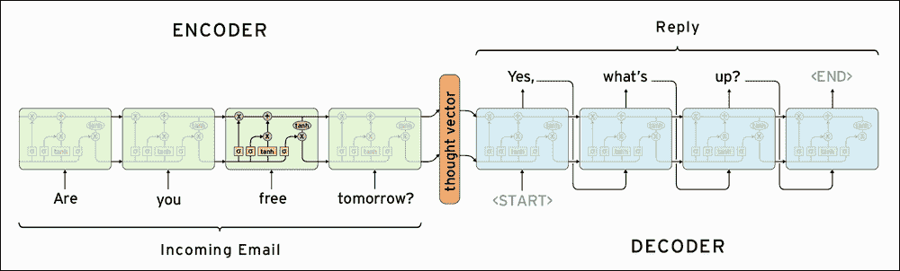

图 8.18：seq2seq 模型的架构

图片来源：[`suriyadeepan.github.io/img/seq2seq/seq2seq2.png`](http://suriyadeepan.github.io/img/seq2seq/seq2seq2.png)

当我们提供一个足够大的问题和回答的数据集时，它将识别问题集的相似性，并将它们表示为一个单独的思维向量。这种表示有助于机器理解问题的意图，而不管句子的结构如何，因此机器可以识别“现在几点了？”和“现在几点？”这样的问题具有相同的意图，因此它们将落入一个单独的思维向量中。训练后，我们将拥有一个巨大的集合，不仅包括突触权重，还有思维向量。之后，在训练模型时，我们需要使用额外的超参数以及适当的损失函数。一旦训练了模型，我们就可以与它聊天。

如果您想了解更多关于 seq2seq 模型的信息，那么您应该参考由谷歌研究人员发表的标题为*一个神经对话模型*的研究论文。您也可以参考这篇论文：[`arxiv.org/pdf/1506.05869v3.pdf`](https://arxiv.org/pdf/1506.05869v3.pdf)以及这篇关于 LSTM 的精彩文章：[`colah.github.io/posts/2015-08-Understanding-LSTMs/`](http://colah.github.io/posts/2015-08-Understanding-LSTMs/)。

现在，让我们使用 seq2seq 模型来实现聊天机器人。

# 实现改进的方法

在本节中，我们将介绍实现的每个部分。您可以通过使用此 GitHub 链接找到代码：[`github.com/jalajthanaki/Chatbot_tensorflow`](https://github.com/jalajthanaki/Chatbot_tensorflow)。请注意，在这里，我使用 TensorFlow 版本 0.12.1。我在 GeForce GTX 1060 6GB GPU 上训练了几小时。在这个实现中，我们不需要生成特征，因为 seq2seq 模型会为句子中给出的单词序列生成其内部表示。我们的实现部分有以下步骤：

+   数据准备

+   实现 seq2seq 模型

让我们开始编码。

## 数据准备

在这个实现过程中，我们将使用康奈尔电影对白数据集。首先，我们需要以我们可以用于训练的格式准备数据。有一个 Python 脚本用于执行数据准备。您可以在以下位置找到脚本：[`github.com/jalajthanaki/Chatbot_tensorflow/blob/master/data/prepare_data_script/data.py`](https://github.com/jalajthanaki/Chatbot_tensorflow/blob/master/data/prepare_data_script/data.py)。

数据准备可以细分为以下步骤：

+   生成问答对

+   预处理数据集

+   将数据集分割为训练数据集和测试数据集

+   为训练和测试数据集构建词汇表

### 生成问答对

为了从康奈尔电影对白数据集中生成问答对，我们使用 `movie_lines.txt` 和 `movie_conversations.txt` 文件。`movie_lines.txt` 文件提供了关于每个对话的 *line_id* 以及实际对话的信息，而 `movie_conversations.txt` 只包含 *line_ids*。在这种情况下，我们需要从数据集中生成适当的问答对。为此，我们将这两个文件结合起来。在 Python 脚本中，有一些函数帮助我们合并这些文件。有关函数的详细信息如下：

+   `get_id2line():` 这个函数帮助我们使用 +++$+++ 模式来分割数据。我们在 `movie_lines.txt` 文件上执行分割。分割后，借助这个函数，我们创建了一个字典，我们将 *line_id* 作为键，将电影对白作为值。所以，*键 = line_id* 和 *值 = 文本*

+   `get_conversations():` 这个函数分割 `movie_conversations.txt` 文件中给出的数据。这将帮助我们创建一个列表。这个列表包含 *line_ids* 的列表。

+   `gather_dataset():` 这个函数实际上生成问答对。在这个函数中，应用了一个简单的逻辑。我们取 *line_ids* 的列表，我们知道最后一个元素表示答案。因此，我们分离问题和答案。借助 `get_id2line()` 函数，我们搜索问题和相应的答案。在这里，我们使用键的值来搜索问题和答案。

您可以通过以下截图查看实际的编码：

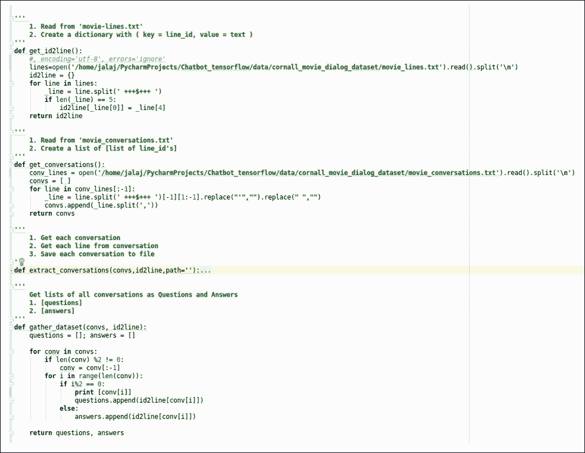

图 8.19：用于生成问答对的函数

现在，让我们探索数据预处理部分。

### 预处理数据集

这里涉及一些预处理和过滤步骤。作为预处理的一部分，我们执行以下步骤：

+   我们使用内置的字符串函数`lower()`将对话转换为小写。

+   我们还移除了垃圾字符以及过短或过长的对话。为此，我们使用基于列表的方法移除垃圾字符，并使用`filter_data()`函数移除过短或过长的对话。当我们对数据集应用`filter_data()`函数时，*28%*的数据集被过滤。

+   我们还过滤掉了包含大量未知词汇的对话。在这里，*2%*的数据集受到了影响。为此，我们使用了`filter_unk()`方法。

+   我们还将对句子进行分词。在这个过程中，我们将*文本行列表*转换为*单词行列表*。这种分词对于训练过程很有帮助，因为机器可以处理句子中的单个单词，借助单词 ID，数据检索变得更快。

您可以参考以下屏幕截图中给出的代码：

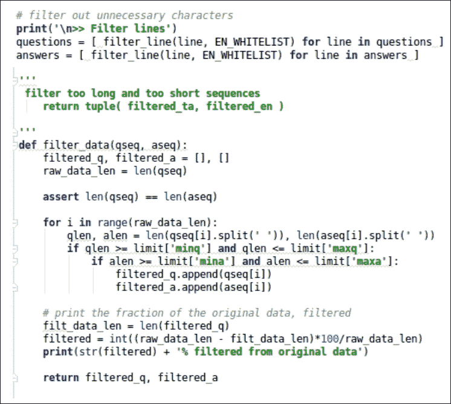

图 8.20：预处理代码片段

### 将数据集分为训练数据集和测试数据集

预处理完成后，我们将数据集分为训练数据集和测试数据集，为此，我们将使用以下函数：

+   我们可以使用`prepare_seq2seq_files()`函数保存训练和测试数据集。

+   您可以直接从以下 GitHub 链接访问`train.enc`、`train.dec`、`test.enc`和`test.dec`数据文件：[`github.com/jalajthanaki/Chatbot_tensorflow/tree/master/data`](https://github.com/jalajthanaki/Chatbot_tensorflow/tree/master/data)

### 为训练和测试数据集构建词汇表

现在是时候从数据集中生成词汇表了。对于词汇表的生成，我们将执行以下步骤：

+   使用`data_utils.py`文件中的`prepare_custom_data()`函数，我们可以在训练时生成要输入到 seq2seq 模型中的词汇表。

+   您可以使用此链接访问`data_uti``ls.py`文件：[`github.com/jalajthanaki/Chatbot_tensorflow/blob/master/data_utils.py`](https://github.com/jalajthanaki/Chatbot_tensorflow/blob/master/data_utils.py)

+   注意，当开始训练时，会生成词汇表文件。

+   词汇表文件的文件名是`train.enc.ids20000`、`train.dec.ids20000`、`test.enc.ids20000`和`test.dec.id``s20000`。这里的 20000 表示我们提供的词汇表大小。

+   您可以通过此链接访问该文件：[`github.com/jalajthanaki/Chatbot_tensorflow/tree/master/data`](https://github.com/jalajthanaki/Chatbot_tensorflow/tree/master/data)

您可以在以下屏幕截图中看到`prepare_custom_data()`函数的代码：

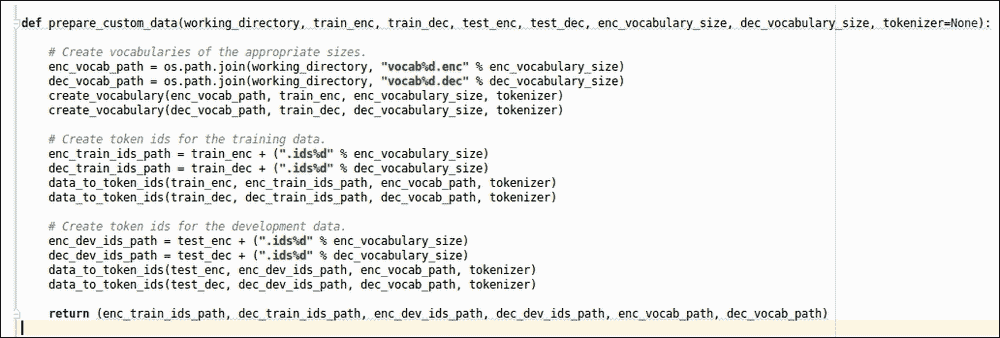

图 8.21：生成词汇的代码片段

现在我们实际上将使用 TensorFlow 实现 seq2seq 模型。

## 实现 seq2seq 模型

在本节中，我们将使用 seq2seq 模型进行实际训练。我们将使用 TensorFlow 来实现 seq2seq 模型。在开始训练之前，让我们看看超参数配置文件，您可以通过以下 GitHub 链接访问：[`github.com/jalajthanaki/Chatbot_tensorflow/blob/master/seq2seq.ini`](https://github.com/jalajthanaki/Chatbot_tensorflow/blob/master/seq2seq.ini)。

在聊天机器人开发过程中：seq2seq 模型，构建"训练，我们的脚本使用这些文件及其参数。以下参数位于此配置文件中：

+   `Mode`: 这可以是 train 或 test

+   `train_enc:` 这包含了解码器训练数据集的路径。

+   `train_dec:` 这包含了解码器训练数据集的路径。

+   `test_enc:` 这包含了解码器测试数据集的路径。

+   `test_dec:` 这包含了解码器测试数据集的路径。

+   `Working_directory:` 这是我们可以存储我们的检查点、词汇和临时数据文件的文件夹

+   `enc_vocab_size:` 这个数字定义了解码器的词汇量大小。我们将其设置为 20,000。

+   `dec_vocab_size:` 这个数字定义了解码器的词汇量大小。我们将其设置为 20,000。

+   `num_layers:` 这表示 LSTM 层的数量。在这里，我们将其设置为 3。

+   `layer_size:` 这表示 seq2seq 模型中的层数。我们将其设置为 256。

+   `steps_per_checkpoint:` 在检查点，模型的参数被保存，模型被评估，并打印结果。

+   `learning_rate:` 这表示我们训练模型的速度有多快或多慢。我们目前将其值设置为 0.5。

大多数前面的参数都可以更改以获得最佳结果。在训练期间，我们需要将模式设置为 train 并运行以下命令：

```py
$ python execute.py
```

现在是时候了解 execute.py 文件内部的内容了。您可以通过以下 GitHub 链接访问此文件：[`github.com/jalajthanaki/Chatbot_tensorflow/blob/master/execute.py`](https://github.com/jalajthanaki/Chatbot_tensorflow/blob/master/execute.py)。

在这个脚本中，我们调用 TensorFlow API。这个脚本可以分为以下几部分：

+   创建模型

+   训练模型

### 创建模型

我们在这里使用 TensorFlow 的`Seq2SeqModel()`函数。这个函数读取配置文件并使用配置文件中定义的值。为了存储训练模型，我们使用`saver.restore()`函数，为了获取检查点的状态，我们使用`get_checkpoint_state()`函数。您可以参考以下图中的代码片段：


图 8.22：创建 seq2seq 模型的代码片段

### 训练模型

我们在`execute.py`文件中定义了`train()`方法。此函数初始化 TensorFlow 会话并开始训练。您可以参考以下截图中的代码片段：

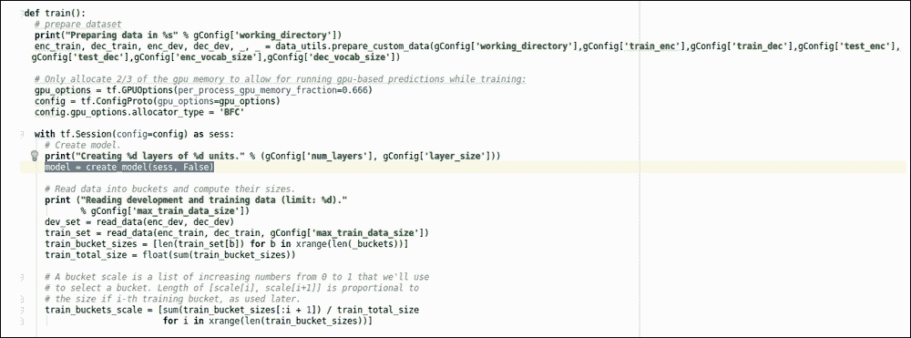

图 8.23：训练模型的代码片段

现在是训练模型的时候了。当我们执行`python execute.py`命令时，您将看到以下截图中的输出：


图 8.24：使用 TensorFlow 训练 seq2seq 模型

在这里，训练是在 GPU 上进行的。我训练了这个模型 3 个小时。我已经训练了这个模型 15,000 个检查点。您可以参考以下截图：

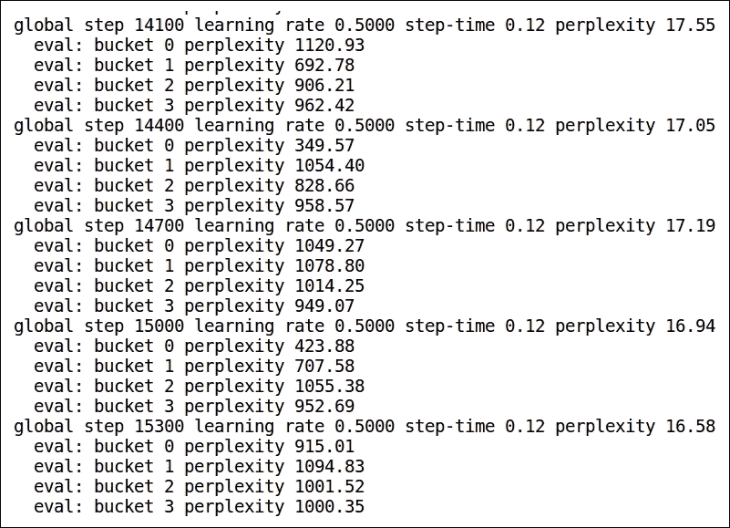

图 8.25：seq2seq 训练的输出

在 CPU 上，训练将花费很多时间，因此我还上传了预训练模型供您使用。您可以通过以下 GitHub 链接下载它们：[`github.com/jalajthanaki/Chatbot_tensorflow/tree/master/working_dir`](https://github.com/jalajthanaki/Chatbot_tensorflow/tree/master/working_dir)。

现在是了解帮助我们评估训练模型的测试指标的时候了。

# 测试改进的方法

在本节中，我们将对改进的方法进行测试。在执行实际测试并查看聊天机器人对话的好坏之前，我们需要了解我们将为此方法和最佳方法使用的测试指标。这些测试指标帮助我们评估模型精度。让我们首先了解测试指标，然后我们将继续对改进的方法进行测试。

## 理解测试指标

在本节中，我们需要了解以下测试指标：

+   混淆度

+   损失

### 混淆度

在 NLP 领域，混淆度也被称为每词混淆度。混淆度是衡量训练模型预测未见数据输出好坏的度量。它也用于比较概率模型。低混淆度表明概率分布擅长预测样本。即使在训练过程中，您也可以看到对于每个检查点，混淆度都在下降。理想情况下，当混淆度没有变化时，我们需要停止训练。在 seq2seq 模型的训练过程中，我在 3 小时后停止了训练，因此当您从您的端点训练模型时，您可以等待混淆度不再进一步下降。

混淆度是使用熵的概念。如果您想了解混淆度，可以参考[`www.youtube.com/watch?v=BAN3NB_SNHY`](https://www.youtube.com/watch?v=BAN3NB_SNHY)。每词混淆度基于熵。因此，为了理解熵，您可以参考以下链接：

+   [`www.youtube.com/watch?v=Bd15qhUrKCI`](https://www.youtube.com/watch?v=Bd15qhUrKCI)

+   [`www.youtube.com/watch?v=K-rQ8KnmmH8`](https://www.youtube.com/watch?v=K-rQ8KnmmH8)

+   [`www.youtube.com/watch?v=ICKBWIkfeJ8&list=PLAwxTw4SYaPkQXg8TkVdIvYv4HfLG7SiH`](https://www.youtube.com/watch?v=ICKBWIkfeJ8&list=PLAwxTw4SYaPkQXg8TkVdIvYv4HfLG7SiH)

一旦你理解了熵，理解困惑度方程就会变得容易。参考以下图中给出的方程：

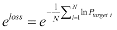

图 8.26：困惑度方程

图片来源：https://www.tensorflow.org/tutorials/recurrent

在这里，N 是样本数量，P 是一个概率函数。我们使用自然对数函数来计算熵。现在让我们看看另一个测试指标。

### 损失

训练损失表示训练进展的方向。通常，当我们开始训练时，损失值较高，训练准确率较低，但在训练过程中，损失值会下降，训练准确率会上升。在深度学习算法中使用了多种错误函数。在这里，我们使用交叉熵作为损失函数。交叉熵和对数损失在上下文中略有不同，但在机器学习中，当计算 0 到 1 之间的错误率时，它们是同一回事。你可以参考以下图中给出的方程：

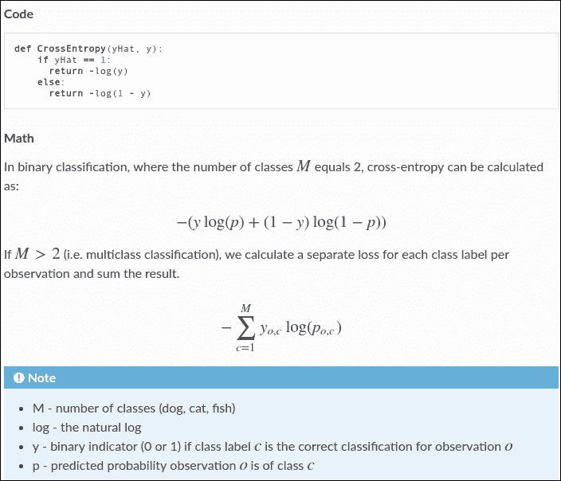

图 8.27：交叉熵方程

图片来源：http://ml-cheatsheet.readthedocs.io/en/latest/loss_functions.html#cross-entropy

如果你想要探索交叉熵损失函数，可以参考：[`neuralnetworksanddeeplearning.com/chap3.html`](http://neuralnetworksanddeeplearning.com/chap3.html)。

我们在这里没有深入数学细节，因为仅仅通过跟踪训练过程，你就可以知道损失值是增加还是减少。如果在训练时间内损失值在下降，那么训练就是在正确的方向上。这也适用于困惑度。最初，困惑度值很大，但在训练过程中它会逐渐下降，在某个时刻既不增加也不减少。那时，我们需要停止训练。现在让我们测试修改后的聊天机器人。

## 测试聊天机器人的修改版本

在本节中，我们将对修改后的聊天机器人进行测试。我仅在 GPU 上训练了 3 小时；现在让我们看看我们的聊天机器人能告诉我们多少。为了测试，我们需要在`seq2seq.ini`配置文件中进行一些小的更改。我们需要将*模式值设置为测试*，然后执行`python execute.py`命令。

执行给定的命令后，你将得到以下图中给出的输出：

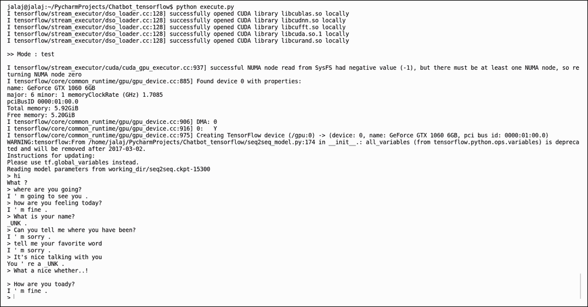

图 8.28：修改后方法的输出

如果你训练的时间更长，那么你将得到一个更令人印象深刻的结果。我觉得深度学习算法可以帮助我们，如果我们想使用基于生成的方法来构建聊天机器人。现在让我们讨论如何改进这个修订方法。

# 修订方法的问题

在本节中，我们将讨论修订方法存在的问题。我们是否有任何方法可以优化修订方法？所以首先，让我们讨论改进的领域，以便在即将到来的方法中，我们可以专注于那个特定的点。

我想强调的一些要点如下：

+   在我们聊天机器人的上一个版本中，缺乏推理能力，这意味着聊天机器人不能通过应用基本推理来回答问题。这正是我们需要改进的地方。

+   让我给你举一个例子。假设我告诉聊天机器人一个故事：“约翰在厨房。丹尼尔在浴室。”之后，我说，我向聊天机器人提出这个问题：“约翰在哪里？”我们迄今为止构建的聊天机器人将无法回答这个简单的问题。我们作为人类，很好地回答这类问题。

+   我们试图在我们的下一个方法中实现这种功能，以便我们可以在聊天机器人中启用一些人工智能功能。

让我们看看可以帮助我们构建人工智能聊天机器人的重要概念。

## 理解关键概念以解决现有问题

Facebook 人工智能研究小组发表了一篇论文，提出了一个可以证明机器也可以回答基于推理的问题的记忆网络。你当然可以参考这篇题为《迈向 AI 完整问答：一系列先决条件玩具任务》的论文。[链接](https://arxiv.org/pdf/1502.05698.pdf)。你还可以参考这篇关于记忆网络的论文：[链接](https://arxiv.org/pdf/1410.3916.pdf)。

在这里，我们将使用 bAbI 数据集，并基于改进的记忆网络来训练模型。一旦训练完成，我们将检查我们的聊天机器人是否能够根据使用简单的推理能力来回答问题。我们将重新创建 Facebook 研究论文的结果。在我们进入实现部分之前，我们需要了解记忆网络是什么，以及我们如何构建一个将使用逻辑来回答问题的系统。所以，让我们简要地看看记忆网络。

### 记忆网络

在本节中，我们将探讨记忆网络，以便我们能够理解在我们即将在下一节中实现它时幕后实际发生的事情。

在 LSTM 网络中，记忆是通过使用隐藏状态和权重进行编码的。这些隐藏状态和权重对于极长的数据序列来说太小了，无论是书籍还是电影。因此，在语言翻译应用中，为了选择适合上下文的翻译，会使用多个 LSTM 状态，并结合注意力机制。Facebook 研究人员开发了一种名为记忆网络的新策略，在问答系统中优于 LSTM。

记忆网络背后的基本思想是允许神经网络使用外部数据结构作为记忆存储，并且以监督方式学习从这种外部记忆结构中检索所需记忆的位置。您可以参考以下图示中给出的记忆网络架构：

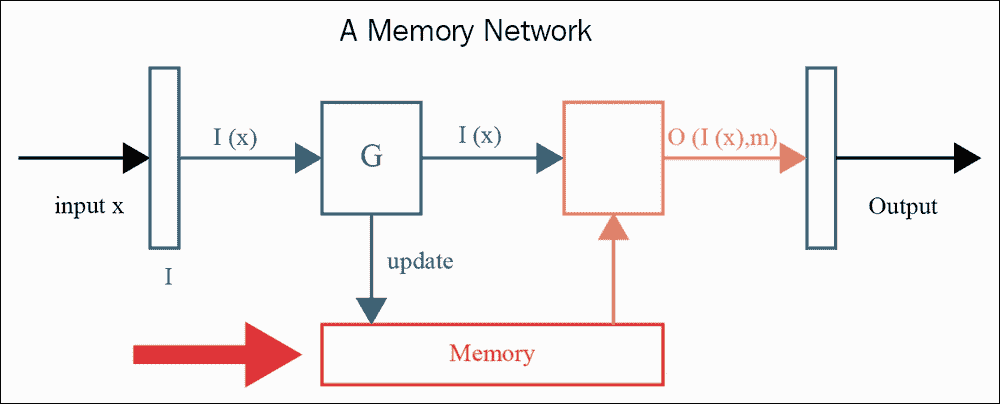

图 8.29：记忆网络架构

当涉及到回答由少量数据生成的问题时，使用记忆网络处理信息相当容易，但在现实世界中，处理具有长期依赖关系的数据是一个具有挑战性的任务。在 Kaggle 上，有一个名为 The Allen AI Science Challenge 的竞赛，获胜者使用了一种特殊的记忆网络变体，称为动态记忆网络（DMN），这是我们用来构建聊天机器人的。

#### 动态记忆网络（DMN）

DMN 的架构在以下图示中给出：

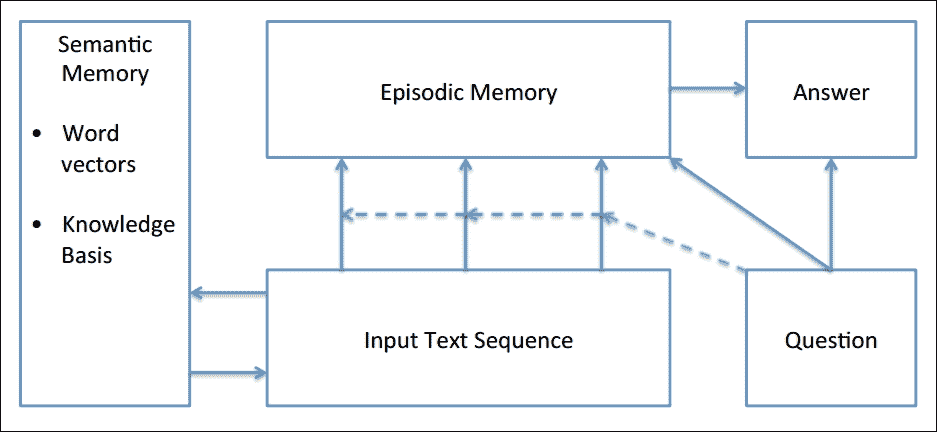

图 8.30：DMN 架构

图像来源：https://yerevann.github.io/public/2016-02-06/dmn-high-level.png

DMN 的架构定义了两种类型的记忆，如下所示：

+   语义记忆：我们使用预训练的 Glove 模型，该模型将为输入数据生成向量。这些向量是 DMN 模型的输入，并用作语义记忆。

+   事件记忆：这种记忆包含其他知识。这种记忆的灵感来源于我们大脑的海马体功能。它能够检索由响应（如图像或声音）触发的时态状态。我们将在稍后看到这种事件记忆的用法。

这些是我们需要理解的一些重要模块：

+   输入模块

+   问题模块

+   事件记忆模块

在我开始解释模块之前，请参考以下图示以更好地理解：

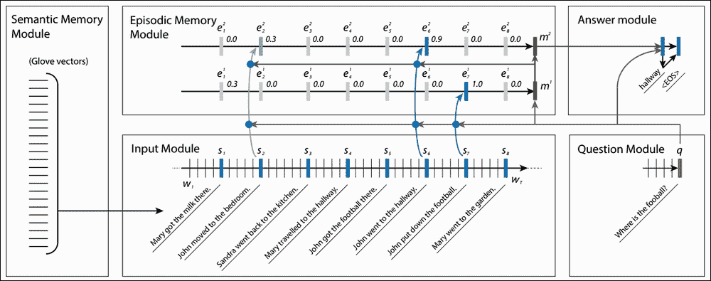

图 8.31：每个 DMN 模块的详细信息

图像来源：https://yerevann.github.io/public/2016-02-06/dmn-details.png

##### 输入模块

输入模块是一个在一系列词向量上运行的 GRU（门控循环单元）。GRU 单元有点像 LSTM 单元，但它更计算高效，因为它只有两个门，并且不使用记忆单元。这两个门控制内容何时更新和何时删除。GRU 只执行两个任务：一个是 *更新*，另一个是 *重置*。你可以参考以下展示 LSTM 和 GRU 的图：

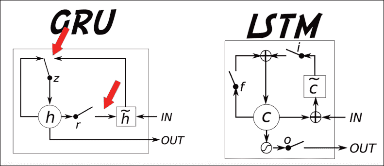

图 8.32：LSTM 和 GRU 的示意图

图片来源：https://cdn-images-1.medium.com/max/1200/0*1udenjz1XCZ5cHU4

输入模块的隐藏状态以向量的形式表示了到目前为止的输入过程。它在每个句子后输出隐藏状态，这些输出在论文中被称为事实，因为它们代表了所提供内容的本质。你可能想知道 GRU 中隐藏状态是如何计算的。为此，你可以参考以下方程：

Ht = GRU(Xt, ht-1)

在这里，Ht 是当前时间步，ht-1 是前一个时间步，Xt 是给定的词向量。前面的方程是 GRU 隐藏状态计算的简单格式。你可以在下面的图中看到更详细和复杂的方程：

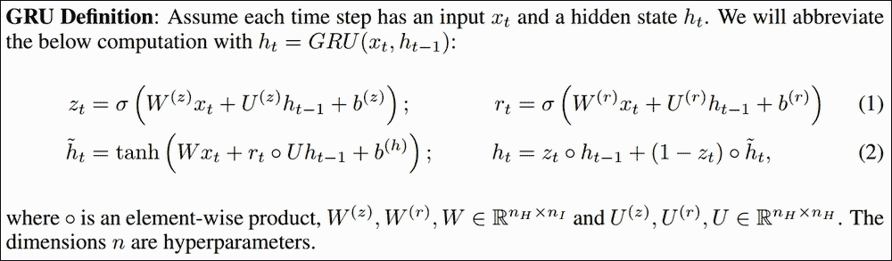

图 8.33：GRU 中计算隐藏状态的方程

图片来源：https://yerevann.github.io/public/2016-02-06/gru.png

在这个方程中，借助给定的词向量和前一个时间步向量，我们计算当前时间步向量。更新给我们一个单层神经网络。我们将矩阵乘法求和并添加偏置项。然后，sigmoid 函数将其压缩到 0 到 1 之间的值列表，这就是我们的输出向量。我们用不同的权重集重复这个过程两次，然后使用重置门，它会学习在必要时忽略过去的时步。例如，如果下一句话与前面的句子无关，更新门也是类似的，它可以学习完全忽略当前的时间步。也许当前句子与答案无关，而前面的句子有关。

##### 问题模块

此模块逐词处理问题，并使用与输入模块相同的 GRU 和相同的权重输出一个向量。我们需要为输入语句（输入数据）和我们将提出的问题进行编码。我们可以通过为它们实现嵌入层来实现这一点。现在我们需要为两者创建一个短时记忆表示。

##### 短时记忆

如我之前所述，情景记忆的概念源于我们大脑的海马体功能。从输入中提取的事实和问题向量进入情景记忆模块。它由两个嵌套的 GRU 组成。内层 GRU 生成所谓的情景。它通过遍历输入模块中的事实来完成这一任务。在更新其内部状态时，它考虑了当前事实上的注意力函数的输出。注意力函数给每个事实分配一个介于 0 到 1 之间的分数，因此 GRU 忽略了得分低的事实。在训练过程中，在遍历所有可用事实的完整遍历之后，内层 GRU 输出一个情景，然后将其输入到外层 GRU。我们需要多个情景，以便我们的模型能够学习它应该关注句子中的哪个部分。在第二次遍历中，GRU 意识到句子中还有其他重要因素。通过多次遍历，我们可以收集越来越相关的信息。

这是对 DMN 的简要说明。您还可以参考这篇优秀的文章：[`yerevann.github.io/2016/02/05/implementing-dynamic-memory-networks/`](https://yerevann.github.io/2016/02/05/implementing-dynamic-memory-networks/)。

现在，让我们看看这个实现的细节。

# 最佳方法

我们已经涵盖了所有有助于我们实现基于 DMN 的聊天机器人的概念。为了实现这种方法，我们将使用 Keras 和 TensorFlow 后端。我们不浪费时间，将直接跳到实现部分。您可以通过以下 GitHub 链接查看此方法的代码：[`github.com/jalajthanaki/Chatbot_based_on_bAbI_dataset_using_Keras`](https://github.com/jalajthanaki/Chatbot_based_on_bAbI_dataset_using_Keras)。

## 实施最佳方法

在这里，我们将使用给定的 bAbI 任务 1 数据集来训练我们的模型。首先，我们需要解析故事并构建词汇。您可以参考以下图中的代码：

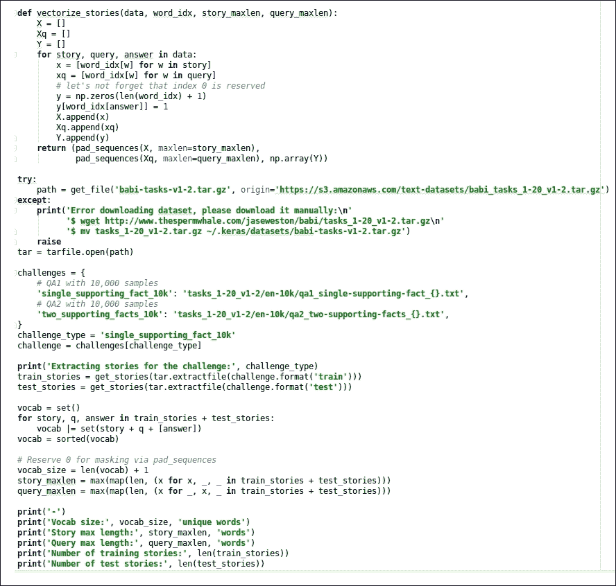

图 8.34：解析故事和构建词汇的代码片段

我们可以初始化我们的模型，并将其损失函数设置为 Keras 中使用 RMSprop 实现的分类交叉熵。您可以在以下屏幕截图中参考：

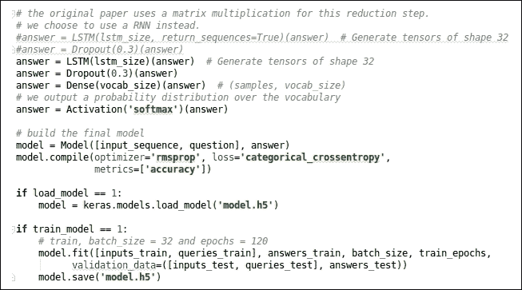

图 8.35：构建模型的代码片段

在训练之前，我们需要设置一个超参数。借助超参数脚本中的值，我们将决定是否以训练模式或测试模式运行脚本。您可以在以下图中看到我们训练过程中需要设置的所有超参数：

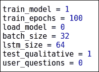

图 8.36：训练的超参数值

在这里，我们使用了三个超参数。我们可以对它们进行实验。让我们讨论一下：

+   train_epochs：此参数表示训练示例在神经网络中完成前向传递和反向传递的次数。一个 epoch 意味着一个训练示例的前向传递和一个反向传递。在这里，我们将 train_epochs 设置为 100 次。你可以增加它，但这样训练时间也会增加。

+   batch_size：此参数表示在一次前向传递和反向传递中训练示例的数量。较高的批量大小需要更多的内存，所以我们把这个值设置为 32。如果你有更多的内存可用，你可以增加批量大小。请参考以下信息框中给出的简单示例。

+   lstm_size：此参数表示我们神经网络中存在的 LSTM 单元的数量。你可以增加或减少 LSTM 单元的数量。在我们的案例中，少于 64 个 LSTM 单元将不会给我们好的输出，所以我将 lstm_size 设置为 64。

### 注意

如果你有一千个训练示例，并且你的批量大小是 500，那么完成一个 epoch 需要 2 次迭代。

我已经在 GPU 上训练了这个模型。如果你没有使用 GPU，那么它可能需要很长时间。你可以通过执行以下命令开始训练：`python main.py`。训练的输出在以下图中给出：

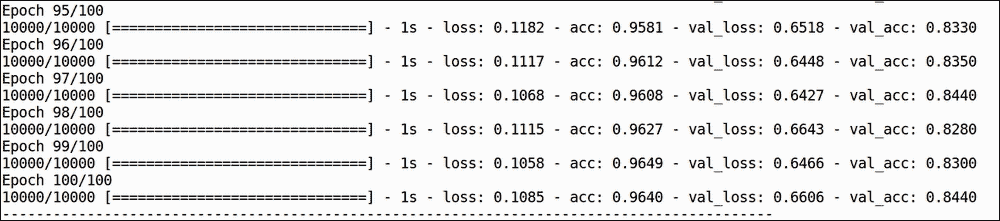

图 8.37：训练输出的代码片段

一旦我们训练了模型，我们就可以加载并测试它。有两种测试模式可用：

+   随机测试模式

+   用户交互测试模式

### 随机测试模式

在这种模式下，脚本本身将加载一个随机故事并给出其答案。你可以在以下图中看到超参数的值：

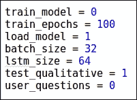

图 8.38，随机测试模式的超参数值。

对于测试，执行`python main.py`命令，你可以看到测试结果。这些结果在以下图中已经展示：


图 8.39：随机测试模式的结果

#### 用户交互测试模式

在这种模式下，如果测试用户可以给出自己的故事并提问，聊天机器人将生成对该问题的答案。你只需要记住，在每一个词之前，你需要提供空格。你可以在以下图中参考用户交互测试模式超参数的值：

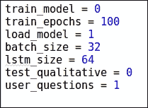

图 8.40：用户交互测试模式超参数的值

对于测试，执行`python main.py`命令，你可以看到测试结果。这些结果在以下图中已经展示：

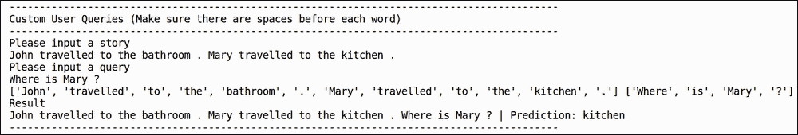

图 8.41：用户交互测试模式的结果

如果你想要测试所有其他任务，那么你可以使用这个网络应用：[`ethancaballero.pythonanywhere.com/`](https://ethancaballero.pythonanywhere.com/)。

这种方法可以使我们的准确率达到 92%到 95%。这种方法帮助我们构建了具有 AI 功能的聊天机器人。

# 讨论混合方法

在实际场景中，为了构建聊天机器人，我们还可以结合这里描述的一些技术。根据业务需求，我们可以使用混合方法。

让我们举一个例子。假设你正在为金融领域构建聊天机器人。如果用户询问其账户中的可用余额，我们只需要一个基于规则的系统，它可以查询数据库并为该用户生成账户余额详情。如果用户询问如何将资金从一个账户转账到另一个账户，聊天机器人可以通过生成逐步信息来帮助用户了解如何转账。在这里，我们将使用基于深度学习的生成方法。我们应该有一个系统，它包括一个基于规则的引擎以及一个用于生成最佳可能输出的深度学习算法。在这个系统中，用户的问题首先发送到基于规则的系统。如果该问题的答案可以通过基于规则的系统生成，那么答案将被传递给最终用户。如果答案不能由基于规则的系统生成，那么问题将进一步传递到深度学习算法，并生成答案。最后，最终用户将看到他问题的回答。

# 摘要

在本章中，我们引用了不同的数据集来构建聊天机器人。你学习了在没有数据集的情况下可以使用的基于规则的途径。你还了解了开放和封闭领域。之后，我们使用了基于检索的方法来构建聊天机器人的基本版本。在改进的方法中，我们使用了 TensorFlow。这种改进的方法对我们来说非常好，因为它与基本方法相比节省了时间。我们在 Cornell Movie-Dialogs 数据集上实现了谷歌的神经对话模型论文。对于最佳方法，我们构建了一个使用 Facebook bAbI 数据集的模型，并建立了基本的推理功能，这有助于我们为聊天机器人生成良好的结果。尽管改进和最佳方法的训练时间真的很长，但那些想在云平台上训练模型的人可以选择这样做。到目前为止，我喜欢亚马逊网络服务（AWS）和谷歌云平台。我还将一个预训练模型上传到了我的 GitHub 仓库，以便你可以重现结果。如果你是一个初学者，并且想制作一个非常好的聊天机器人，那么谷歌的 API.AI 是一个好的聊天机器人开发平台。它现在被称为 Dialogflow，可在以下网址找到：[`dialogflow.com/`](https://dialogflow.com/)。你还可以参考 IBM Watson API：[`www.ibm.com/watson/how-to-build-a-chatbot/`](https://www.ibm.com/watson/how-to-build-a-chatbot/)。这些 API 可以帮助你在构建聊天机器人方面取得很大进展；而且它需要的编码知识也更少。

在下一章中，我们将构建一个基于计算机视觉的应用程序，该程序将帮助我们识别图像和视频中存在的命名对象。这个应用程序将实时检测对象。对象检测应用程序用于构建自动驾驶汽车、机器人等，所以请继续阅读！
