# 第九章：构建实时目标识别应用

在本章中，我们将构建一个能够检测对象的应用。这个应用将帮助我们识别图像或视频流中存在的对象。我们将使用实时输入，例如来自网络摄像头的实时视频流，我们的实时目标检测应用将检测视频流中的对象。我们将使用实时视频流，这也是这种目标检测被称为**实时目标检测**的主要原因。在本章中，我们将使用**迁移学习**方法构建实时目标检测。我将在本章的讲解过程中详细解释迁移学习。

在本章中，我们将涵盖以下主题：

+   介绍问题陈述

+   理解数据集

+   迁移学习

+   设置编码环境

+   基线模型的特征工程

+   选择**机器学习**（**ML**）算法

+   构建基线模型

+   理解测试指标

+   测试基线模型

+   现有方法的问题

+   如何优化现有方法

    +   理解优化过程

+   实施改进方法

    +   测试改进方法

    +   理解改进方法的问题

+   最佳方法

    +   实施最佳方法

+   概述

# 介绍问题陈述

在本章中，我们将构建一个目标检测应用。我们不仅会检测对象，还会构建一个实时检测对象的应用。这种应用可以用于自动驾驶汽车、农业领域的分离任务，甚至可以在机器人领域使用。让我们了解我们的目标和实际构建的内容。

我们希望构建一个应用，其中我们将提供实时网络摄像头视频流或实时视频流作为输入。我们的应用将使用预训练的机器学习模型，这将帮助我们预测视频中出现的对象。这意味着，如果视频中有一个人物，那么我们的应用可以将其识别为人物。如果视频包含椅子、杯子或手机，那么我们的应用应该以正确的方式识别所有这些对象。因此，本章的主要目标是构建一个能够检测图像和视频中的对象的应用。在本章中，你还将学习迁移学习的概念。我们所有的方法都是基于深度学习技术的。

在下一节中，我们将讨论数据集。

# 理解数据集

在本节中，我们将介绍用于训练深度学习模型的那个数据集。当我们试图构建目标检测应用时，有两个数据集被广泛使用，这些数据集如下：

+   COCO 数据集

+   PASCAL VOC 数据集

我们将逐一查看每个数据集。

## COCO 数据集

COCO 代表上下文中的常见对象。因此，这个数据集的简称是 COCO 数据集。许多科技巨头，如谷歌、Facebook、微软等，都在使用 COCO 数据来构建对象检测、对象分割等令人惊叹的应用程序。你可以在这个官方网页上找到有关此数据集的详细信息：

[COCO 数据集](http://cocodataset.org/#home)

COCO 数据集是一个大规模的对象检测、分割和标题数据集。在这个数据集中，总共有 330,000 张图像，其中超过 200,000 张被标记。这些图像包含 1.5 百万个对象实例，分为 80 个对象类别。所有标记的图像都有五个不同的标题；因此，我们的机器学习方法能够有效地泛化对象检测和分割。

通过使用 COCO 探索器，我们可以探索 COCO 数据集。你可以使用[`cocodataset.org/#explore`](http://cocodataset.org/#explore) URL 来探索数据集。COCO 探索器是一个出色的用户界面。你只需选择对象标签，例如*我想看到图片中有人、自行车和公共汽车的图像*，探索器就会提供包含人、自行车和公共汽车的图像。你可以参考以下图示：

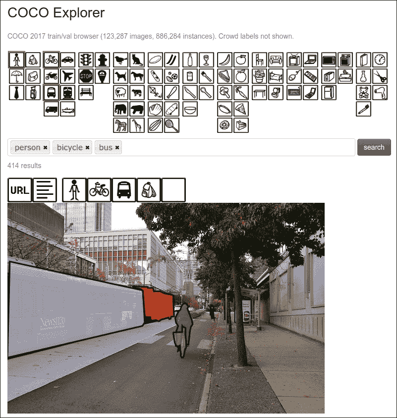

图 9.1：COCO 数据集探索片段

在每张图像中，都为每个主要对象提供了适当的对象边界。这就是为什么如果你想要从头开始构建自己的计算机视觉应用，这个数据集非常棒的主要原因。

在这里，我们不是下载数据集，因为如果我们需要在这个数据集上从头开始训练模型，那么这将需要大量的时间和大量的 GPU 才能获得良好的准确率。因此，我们将使用预训练模型，并通过迁移学习实现实时对象检测。现在让我们继续讨论 PASCAL VOC 数据集。

## PASCAL VOC 数据集

PASCAL 代表模式分析、统计建模和计算学习，VOC 代表视觉对象类别。在这个数据集中，图像被标记为 20 个类别用于对象检测。动作类别和人物布局标签也是可用的。在人物布局标签中，边界框是关于人体每个部分的标签（头部、手、脚）。你可以在这个网页上找到有关此数据集的详细信息：[`host.robots.ox.ac.uk/pascal/VOC/voc2012/index.html`](http://host.robots.ox.ac.uk/pascal/VOC/voc2012/index.html)。

### PASCAL VOC 类别

图像已被分为四个主要类别：

+   人类

+   动物

+   车辆

+   室内

每张图像都标记了前面的主要类别，并且还为图像中的对象提供了特定的标签。前四个类别都有特定的标签，以下列表中我将描述它们：

+   **人类**：人

+   **动物**：鸟、猫、牛、狗、马、羊

+   **车辆**：飞机、自行车、船、公共汽车、汽车、摩托车、火车

+   **室内**：瓶子、椅子、餐桌、盆栽植物、沙发、电视/显示器

您可以参考以下图示，它将帮助您理解这个 PASCAL VOC 数据集中的标签：

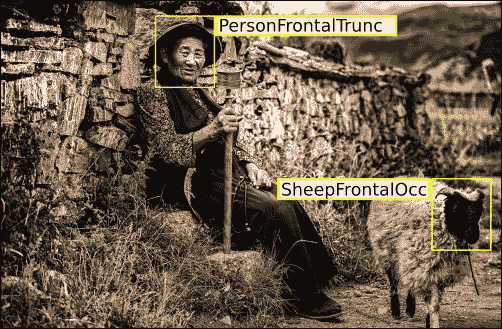

图 9.2：PASCAL VOC 标记图像示例

如您在前面的图示中看到的，已经标记了两个主要类别：人和动物。对于图像中出现的特定对象，即人和羊，已经给出了特定的标记。我们不会下载这个数据集；我们将使用使用此数据集训练的预训练模型。

到现在为止，您已经多次听说过迁移学习和预训练模型这两个术语。让我们了解它们是什么。

# 迁移学习

在本节中，我们将探讨迁移学习是什么，以及它在我们构建实时目标检测时将如何对我们有用。我们将本节分为以下部分：

+   什么是迁移学习？

+   什么是预训练模型？

+   我们为什么要使用预训练模型？

+   我们如何使用预训练模型？

让我们从第一个问题开始。

## 什么是迁移学习？

我们首先将探讨迁移学习的直觉，然后我们将介绍其技术定义。让我通过一个简单的师生类比来解释这个概念。一位教师拥有多年教授某些特定主题或学科的经验。无论教师拥有什么信息，他们都会传授给学生。因此，教学的过程就是将知识从教师转移到学生的过程。您可以参考以下图示：

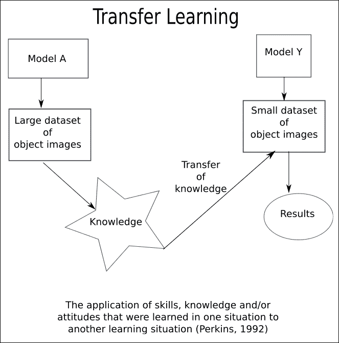

图 9.3：迁移学习概述

现在，请记住这个类比；我们将将其应用于神经网络。当我们训练一个神经网络时，它会从给定的数据集中获得知识。这个经过训练的神经网络有一些权重，帮助它从给定的数据集中学习；训练后，我们可以将这些权重以二进制格式存储。我们以二进制格式存储的权重可以被提取出来，然后转移到任何其他神经网络。因此，我们不是从头开始训练神经网络，而是转移先前训练的模型获得的知识。我们将学习到的特征转移到新的神经网络中，这将节省我们大量的时间。如果我们已经为特定应用训练了一个模型，那么我们将将其应用于新的但类似类型的应用，这将反过来帮助我们节省时间。

现在，是时候用更技术性的术语来定义迁移学习了。迁移学习是机器学习中的一个研究问题，它关注于在解决特定问题时获得的知识存储，并将其应用于不同但相关的问题。有时，迁移学习也被称为归纳迁移。让我们用一个具体的例子来巩固你的理解。如果我们构建一个在识别汽车时获得知识的机器学习模型，它也可以在我们尝试识别卡车时应用。在本章中，我们使用迁移学习来构建这个实时物体检测应用程序。

## 什么是预训练模型？

我想给你一个简单的解释。预训练模型是由其他人创建和构建来解决特定问题的。这意味着我们正在使用一个已经训练好的模型，并对其进行插入和播放。通过使用预训练模型，我们可以构建具有相似领域的新的应用程序。

让我给你举一个例子：假设我们想要创建一辆自动驾驶汽车。为了构建它，我们的第一步将是构建一个不错的物体识别系统。你可以花费一年或更长时间从头开始构建一个不错的图像和物体识别算法，或者你可以使用预训练模型，例如使用 PASCAL VOC 数据集构建的 Google Inception 模型或 YOLO 模型。

使用预训练模型有一些优势，如下所示：

+   预训练模型可能不会给你 100%的准确率，但它可以节省大量的努力。

+   你可以优化你正在工作的真实问题的准确度，而不是从头开始制作一个算法；正如我们有时所说的，没有必要重新发明轮子。

+   现在有众多库可以帮助我们保存训练好的模型，这样我们就可以在需要时轻松加载和使用它们。

除了预训练模型为我们提供的优势外，我们还需要了解其他真实的原因，为什么我们应该使用预训练模型。那么，让我们在下一节中讨论这个问题。

## 为什么我们应该使用预训练模型？

当我们专注于以不同方式开发现有算法时，我们的目标将是构建一个能够超越所有其他现有算法并使其更高效的算法。如果我们只关注研究部分，那么这可以是一个开发高效且精确算法的好方法，但如果你的目标是开发一个应用程序，而这个算法是整个应用程序的一部分，那么你应该关注你如何快速且高效地构建应用程序。让我们通过一个例子来理解这一点。

在这一章中，我们想要构建实时目标检测技术。现在，我的主要焦点将是构建一个可以实时检测对象的应用程序。不仅如此；我还需要结合目标检测和实时跟踪活动。如果我忽略我的主要目标，开始制作新的但有效的目标检测算法，那么我会失去专注。我的焦点将是构建整个实时目标检测应用程序，而不仅仅是某个特定的算法。

有时候，如果我们失去了专注，试图从头开始构建算法，那么这将会花费很多时间。我们也会浪费我们的努力，因为世界上可能已经有聪明的人为我们构建了它。当我们使用这个已经开发的算法时，我们将节省时间并专注于我们的应用。在构建我们实际应用的原型之后，我们将有时间对其进行改进，以便它可以被许多人使用。

让我告诉你我的故事。几个月前，我开始构建一个可以用于安全领域的图像检测应用。当时，我不想使用预训练模型，因为我想要探索从头开始构建算法需要多少努力。所以，我开始自己动手做。我尝试了多种不同的算法，例如 SVM、**多层感知器**（**MLP**）和**卷积神经网络**（**CNN**）模型，但准确率真的很低。我失去了构建一个可以用于安全领域的图像检测算法应用的专注，只是开始专注于使算法更好。过了一段时间，我意识到，如果使用一个带有优化技术的预训练模型，将节省我的时间并使我能够构建一个更好的解决方案，那会更好。这次经历之后，我试图探索在我解决的问题陈述中使用迁移学习的选项，如果我发现没有迁移学习的空间，那么我会从头开始构建算法；否则，我更愿意使用预训练模型。所以，在构建算法之前，总是探索所有选项。了解应用的使用情况，并基于此构建你的解决方案。假设你正在构建自己的自动驾驶汽车；那么，实时目标检测将成为自动驾驶汽车的一个重要组成部分，但它只是整个应用的一部分；因此，如果我们使用预训练模型来检测对象，那么我们可以用我们的时间来构建一个高质量的自动驾驶汽车。

## 我们如何使用预训练模型？

通常，预训练模型是二进制格式，可以下载后用于我们的应用程序。一些库，如 Keras、TensorFlow、Darknet 等，已经包含了那些可以加载和使用的预模型，你可以通过某些可用的 API 来使用这些预训练网络。这些预训练网络具有通过迁移学习泛化 PASCAL VOC 或 COCO 数据集之外图像的能力。我们可以通过微调模型来修改预存在的模型。我们不想修改权重太多，因为它是在大量数据集上使用大量 GPU 训练的。预训练模型具有泛化预测和对象分类的能力，因此我们知道这个预训练模型可以泛化到足够好的程度，以给出最佳的可能结果。然而，如果我们想从头开始训练模型，我们可以改变一些超参数。这些参数可以是学习率、周期数、层大小等。让我们讨论其中的一些：

+   学习率：学习率基本上控制了我们应该更新神经元权重多少。我们可以使用固定学习率、递减学习率、基于动量的方法或自适应学习率。

+   周期数：周期数表示整个训练数据集应该通过神经网络的次数。我们需要增加周期数以减少测试误差和训练误差之间的差距。

+   批处理大小：对于卷积神经网络，小批量大小通常更可取。对于卷积神经网络来说，从 16 到 128 的范围确实是一个很好的起点。

+   激活函数：正如我们所知，激活函数向模型引入非线性。ReLU 激活函数是卷积神经网络的第一个选择。你也可以使用其他激活函数，如 tanh、sigmoid 等。

+   Dropout 用于正则化：正则化技术用于防止过拟合问题。Dropout 是深度神经网络的正则化技术。在这个技术中，我们会丢弃神经网络中的一些神经元或单元。神经元的丢弃基于概率值。默认值为 0.5，这是一个很好的起点，但我们可以根据观察到的训练误差和测试误差来改变这个值以进行正则化。

在这里，我们将使用预训练模型，如 Caffe 预训练模型、TensorFlow 目标检测模型和**你只需看一眼**（**YOLO**）。对于从我们的摄像头进行实时流，我们使用 OpenCV，这对于绘制边界框也非常有用。所以，首先，让我们设置 OpenCV 环境。

# 设置编码环境

在本节中，我们将列出运行即将到来的代码所需的库和设备。你需要有一个至少可以以良好清晰度流式传输视频的摄像头。我们将使用 OpenCV、TensorFlow、YOLO、Darkflow 和 Darknet 库。我不会解释如何安装 TensorFlow，因为它是一个简单的过程，你可以通过点击[`www.tensorflow.org/install/install_linux`](https://www.tensorflow.org/install/install_linux)来找到安装文档。

在本节中，我们将探讨如何首先设置 OpenCV，在接下来的章节中，我们将看到如何设置 YOLO、Darkflow 和 DarkNet。

## 设置和安装 OpenCV

OpenCV 代表开源计算机视觉。它旨在提高计算效率，重点在于实时应用。在本节中，你将学习如何设置 OpenCV。我使用的是 Ubuntu 16.04，并且我有一个 GPU，因此我已经安装了 CUDA 和 CUDNN。如果你还没有安装 CUDA 和 CUDNN，那么你可以参考这个 GitHub 链接：[`gist.github.com/vbalnt/a0f789d788a99bfb62b61cb809246d64`](https://gist.github.com/vbalnt/a0f789d788a99bfb62b61cb809246d64)。完成这些后，开始执行以下步骤：

1.  这将更新软件和库：`$ sudo apt-get update`

1.  这将升级操作系统并安装操作系统级别的更新：`$ sudo apt-get upgrade`

1.  这是用于编译软件的：`$ sudo apt-get install build-essential`

1.  这个命令安装 OpenCV 的先决条件：`$ sudo apt-get install cmake git libgtk2.0-dev pkg-config libavcodec-dev libavformat-dev libswscale-dev`

1.  这个命令安装 OpenCV 的可选先决条件：`$ sudo apt-get install python-dev python-numpy libtbb2 libtbb-dev libjpeg-dev libpng-dev libtiff-dev libjasper-dev libdc1394-22-dev`

1.  使用此命令创建一个目录：`$ sudo mkdir ~/opencv`

1.  跳转到我们刚刚创建的目录：`$ cd ~/opencv`

1.  在 opencv 目录内从 GitHub 克隆以下 OpenCV 项目:

    1.  `$ sudo git clone https://github.com/opencv/opencv.git`

    1.  `$ sudo git clone https://github.com/opencv/opencv_contrib.git`

1.  在 opencv 文件夹内，创建一个名为 build 的子目录: `$ sudo mkdir ~/opencv/build`

1.  跳转到 build 目录或文件夹: `$ cd ~/opencv/build`

1.  一旦你处于 build 文件夹位置，运行此命令。这可能需要一些时间。如果你运行此命令没有错误，则继续下一步：

    ```py
    $ sudo cmake -D CMAKE_BUILD_TYPE=RELEASE \
    -D CMAKE_INSTALL_PREFIX=/usr/local \
    -D INSTALL_C_EXAMPLES=ON \
    -D INSTALL_PYTHON_EXAMPLES=ON \
    -D WITH_TBB=ON \
    -D WITH_V4L=ON \
    -D WITH_QT=ON \
    -D WITH_OPENGL=ON \
    -D OPENCV_EXTRA_MODULES_PATH=../../opencv_contrib/modules \
    -D BUILD_EXAMPLES=ON ..
    ```

1.  使用此命令识别你的 CPU 核心数：`$ nproc`

1.  一旦你知道 CPU 的核心数，你可以用它来处理多线程。我分配了四个 CPU 核心，这意味着有四个线程同时运行。这个命令是 `$ make -j4`，它会编译 OpenCV 中用 C 编写的所有类。

1.  现在，执行以下命令以实际安装 OpenCV: `$ sudo make install`

1.  将配置文件的路径添加到配置文件中：`$ sudo sh -c 'echo "/usr/local/lib" >> /etc/ld.so.conf.d/opencv.conf'`

1.  使用此命令检查适当的配置：`$ sudo ldconfig`

一旦成功安装了 OpenCV，我们就可以使用这个库来流式传输实时视频。现在，我们将开始构建我们的基线模型。让我们开始吧！

# 基线模型的特征工程

为了构建基线模型，我们将使用预训练权重的 Google MobileNet SSD 检测网络的 Caffe 实现。这个模型已经在 PASCAL VOC 数据集上进行了训练。因此，在本节中，我们将探讨谷歌如何训练这个模型的方法。我们将了解 MobileNet SSD 背后的基本方法，并使用预训练模型来帮助节省时间。为了创建这种精确的模型，我们需要大量的 GPU 和训练时间，所以我们使用预训练模型。这个预训练的 MobileNet 模型使用**卷积神经网络**（**CNN**）。

让我们看看 MobileNet 如何使用 CNN 提取特征。这将帮助我们理解 CNN 背后的基本思想，以及 MobileNet 是如何被使用的。CNN 网络由层组成，当我们向 CNN 提供图像时，它会扫描图像的区域，并尝试使用区域提议方法提取可能的物体。然后，它找到包含物体的区域，使用扭曲的区域，并生成 CNN 特征。这些特征可以是像素的位置、边缘、边缘的长度、图像的纹理、区域的尺度、图片的明暗度、物体部分等等。CNN 网络通过自身学习这些类型的特征。您可以参考以下图示：

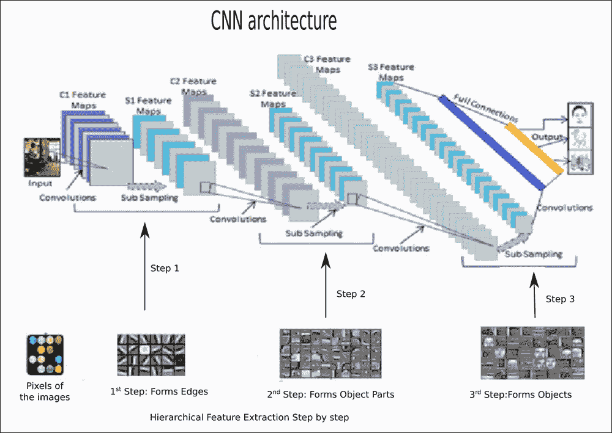

图 9.4：理解 CNN 中的特征提取

如您在前面的图像中看到的，图像区域已经被扫描，由 C1 和 S1 组成的第一个 CNN 层将生成特征。这些特征可以识别构成整个物体的边缘表示。在第二阶段，CNN 层学习有助于神经网络识别物体部分的特征表示。在最后阶段，它学习所有必要的特征，以便在给定的输入图像中识别存在的物体。如果您想探索 CNN 网络的每个方面，可以参考[`cs231n.github.io/convolutional-networks/`](http://cs231n.github.io/convolutional-networks/)。不用担心；我们将在下一节中概述 CNN 架构，以便您了解目标检测是如何工作的。现在，是时候探索 CNN 了。

# 选择机器学习算法

我们已经知道我们正在使用**卷积神经网络**（**CNN**）来开发这个应用程序。你可能想知道为什么我们选择了 CNN 而不是其他神经网络。你可能已经知道这个问题的答案。我们选择 CNN 有三个原因：

+   现今存在的、经过精心手工标注的视觉数据量

+   通过 GPU 打开优化大门的负担得起的计算机器

+   CNN 的各种架构优于其他算法

由于这些原因，我们选择了带有 SSD 的 CNN。在开发基线模型的过程中，我们将使用 MobileNet，它使用带有**单次检测器**（**SSD**）技术的 CNN。因此，在本节中，我们将查看开发 MobileNet 时使用的 CNN 架构。这将帮助我们理解预训练模型。

## MobileNet SSD 模型的架构

MobileNet SSD 速度快，在图像和视频中执行对象检测任务很好。这个模型比**基于区域的卷积神经网络**（**R-CNN**）更快。SSD 之所以能达到这种速度，是因为它以不同的方式扫描图像和视频帧。

在 R-CNN 中，模型在两个不同的步骤中执行区域提议和区域分类，如下所示：

+   首先，他们使用区域提议网络来生成感兴趣的区域

+   之后，全连接层或正敏感宪法层对所选区域中的对象进行分类。

这些步骤与 R-CNN 相当，但 SSD 在单次操作中完成这些步骤，这意味着它同时预测边界框和边界框中出现的对象的类别。SDD 在图像或视频流以及一组基本真实标签作为输入时执行以下步骤：

+   将图像通过一系列卷积层，生成不同尺寸矩阵形式的特征图集合。输出可以是 10×10 矩阵、6×6 矩阵或 3×3 矩阵。

+   对于每个特征图中的每个位置，使用 3×3 卷积滤波器来评估一组默认边界框。这些生成的默认边界框相当于锚框，这些锚框是使用 Faster R-CNN 生成的。

+   对于每个框，同时预测对象的边界框偏移和类别概率。

+   在训练过程中，将真实框与这些预测框进行匹配。这种匹配是通过使用交集并集（IoU）来完成的。最佳预测框将被标记为正边界框。这发生在每个边界框上。这里考虑的 IoU 的真实值超过 50%。

看看以下图，以图形方式表示。MobileNets 具有简化的架构，使用深度可分离卷积来构建适用于移动和嵌入式视觉应用的超轻量级深度神经网络。MobileNets 是计算机视觉应用中更高效的机器学习模型。您也可以参考 MobileNet 的原始论文，链接为[`arxiv.org/pdf/1704.04861.pdf`](https://arxiv.org/pdf/1704.04861.pdf)。

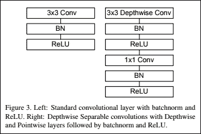

图 9.5：MobileNet SSD 的基本架构模块

图片来源：https://arxiv.org/pdf/1704.04861.pdf

如前图所示，我们使用了标准的卷积网络和深度卷积网络。MobileNet SDD 使用了 ReLU 激活函数。您可以通过以下图了解该网络具有什么样的滤波器形状：

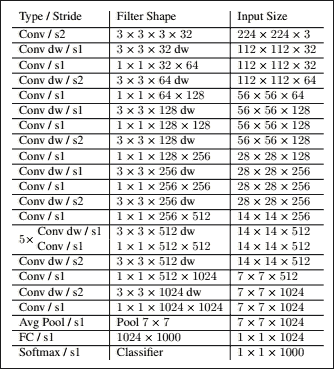

图 9.6，MobileNet 主体架构

图片来源：https://arxiv.org/pdf/1704.04861.pdf

如果您想解释这个表格，那么让我们考虑一个例子。如果我们有一个原始图像，像素大小为 224×224，那么这个 Mobilenet 网络将图像缩小到 7×7 像素；它还有 1,024 个通道。之后，有一个平均池化层作用于所有图像，生成一个 1×1×1,024 大小的向量，实际上就是一个包含 1,024 个元素的向量。如果您想了解更多关于 MobileNet SSD 的信息，请参考以下资源：

+   [`cs231n.github.io/convolutional-networks/`](http://cs231n.github.io/convolutional-networks/)

+   [`towardsdatascience.com/deep-learning-for-object-detection-a-comprehensive-review-73930816d8d9`](https://towardsdatascience.com/deep-learning-for-object-detection-a-comprehensive-review-73930816d8d9)

+   [`medium.com/ilenze-com/object-detection-using-deep-learning-for-advanced-users-part-1-183bbbb08b19`](https://medium.com/ilenze-com/object-detection-using-deep-learning-for-advanced-users-part-1-183bbbb08b19)

+   [`machinethink.net/blog/googles-mobile-net-architecture-on-iphone/`](http://machinethink.net/blog/googles-mobile-net-architecture-on-iphone/)

现在，让我们继续到实现部分。

# 构建基线模型

在本节中，我们将探讨编码部分。您可以参考以下 GitHub 链接中的代码：[`github.com/jalajthanaki/Real_time_object_detection/tree/master/base_line_model`](https://github.com/jalajthanaki/Real_time_object_detection/tree/master/base_line_model)。

首先，从提供的链接下载项目并安装 OpenCV，如本章前面所述的信息。当您下载此项目文件夹时，其中包含一个使用 Caffe 库实现的预训练的 MobileNet SSD，但在这里，我们使用预训练的二进制模型。我们使用 OpenCV 加载预训练模型以及从摄像头流式传输视频流。

在代码中，首先，我们指定需要导入的库和定义用于运行脚本的命令行参数。我们需要提供参数文件和预训练模型。参数文件的名称是`MobileNetSSD_deploy.prototxt.txt`，预训练模型的文件名是`MobileNetSSD_deploy.caffemodel`。我们还定义了模型可以识别的类别。之后，我们将使用 OpenCV 加载预训练模型。您可以在以下屏幕截图中参考此阶段的编码：

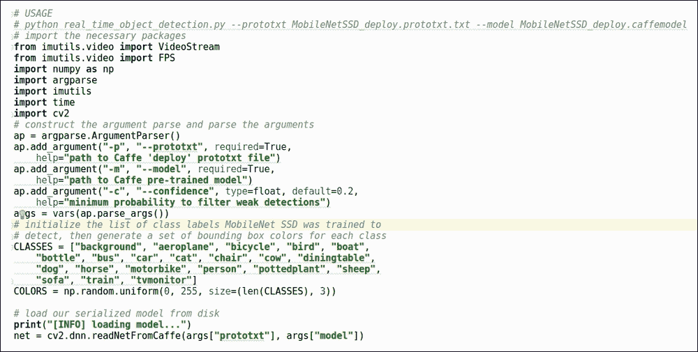

图 9.7：基线模型的代码片段

现在，让我们看看如何从我们的网络摄像头中流式传输视频。在这里，我们使用`imutils`库及其视频 API 从网络摄像头流式传输视频。使用 start 函数，我们将开始流式传输，然后定义帧大小。我们获取帧大小并将其转换为 blob 格式。此代码始终验证检测到的对象置信度分数将高于最小置信度分数或置信度分数的最小阈值。一旦我们得到更高的置信度分数，我们将为这些对象绘制边界框。我们可以看到到目前为止已经检测到的对象。您可以参考以下图中的基线模型视频流：

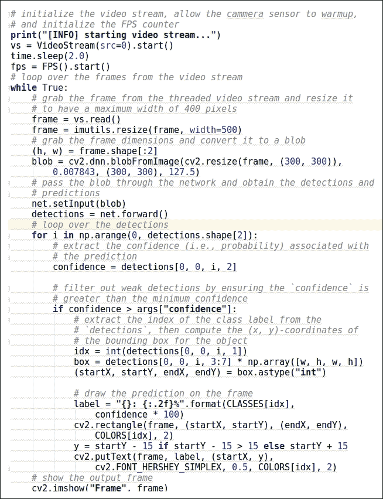

图 9.8：基线模型视频流的代码片段

为了停止流式传输，我们需要通过按 Q 键或 Ctrl + C 来中断循环，并且我们需要注意，当我们关闭程序时，所有窗口和进程都将适当地停止。您可以在以下屏幕截图中看到这一点：

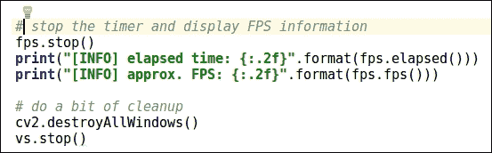

图 9.9：结束脚本的代码片段

在我们运行脚本测试之前，让我们了解对象检测应用程序的测试指标。一旦我们理解了测试指标，我们将运行代码并检查我们获得了多少精度。

# 理解测试指标

在本节中，我们将介绍测试指标。我们将查看两个矩阵，这两个矩阵将帮助我们理解如何测试对象检测应用程序。这些测试矩阵如下：

+   交并比 (IoU)

+   平均精度均值 (mAP)

## 交并比 (IoU)

对于检测，使用 IoU（交并比）是为了确定对象提议是否正确。这是确定对象检测是否完美完成的一种常规方法。IoU 通常取提议的对象像素集 A 和真实对象像素集 B，并基于以下公式计算 IoU：

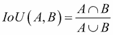

通常，IoU > 0.5，这意味着这是一个命中或识别了对象的像素或边界框；否则，它失败。这是对 IoU 的更正式理解。现在，让我们看看其背后的直觉和含义。让我们以一个图像为参考，帮助我们理解这个矩阵的直觉。您可以参考以下截图：

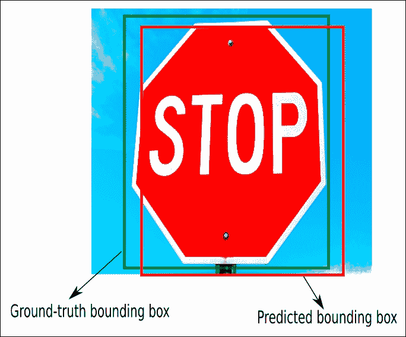

图 9.10：理解 IoU 背后的直觉

上述截图是检测图像中停车标志的一个示例。预测的边界框用红色绘制，属于这个红色框的像素被认为是集合 A 的一部分，而真实边界框用绿色绘制，属于这个绿色框的像素被认为是集合 B 的一部分。我们的目标是计算这些边界框之间的交并比。因此，当我们的应用程序绘制边界框时，它应该至少与真实边界框匹配超过 50%，这被认为是一个好的预测。IoU 的方程如下所示：

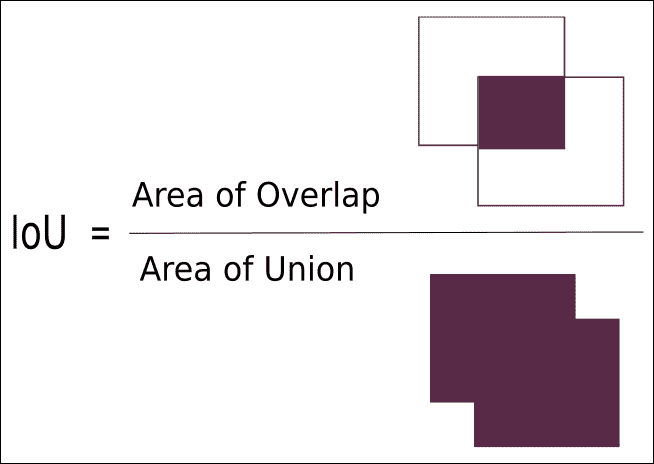

图 9.11：基于直观理解的 IoU 方程

在现实中，我们的预测边界框的(x, y)坐标与真实边界框的(x, y)坐标完全匹配的机会很少。在下面的图中，您可以看到各种关于 IoU 较差、较好和优秀的示例：

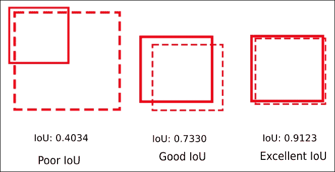

图 9.12：各种 IoU 边界框示例

IoU 帮助我们确定应用程序识别对象边界和区分不同对象的能力。现在，是时候了解下一个测试指标了。

## 平均精度均值

在本节中，我们将介绍**平均精度均值**（**mAP**）。在目标检测中，首先，我们识别目标边界框，然后将其分类到某个类别。这些类别有一些标签，我们将适当的标签提供给识别出的对象。现在，我们需要测试应用程序分配这些标签的效果如何，这意味着我们如何将对象分类到不同的预定义类别中。对于每个类别，我们将计算以下内容：

+   真阳性 TP(c)：预测的类别是 C，且该对象实际上属于类别 C

+   假阳性 FP(c)：预测的类别是 C，但实际上该对象不属于类别 C

+   类 C 的平均精度由以下方程给出：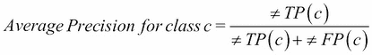

因此，对于所有类别，我们需要计算 mAP，其计算公式如下：

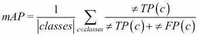

如果我们想要更好的预测，那么我们需要将 IoU 从 0.5 增加到更高的值（最高可达 1.0，这将是最完美的）。我们可以用这个方程表示：mAP[@p]，其中 p ∈ (0,1)是 IoU。mAP[@[0.5:0.95]]表示 mAP 是在多个阈值上计算，然后再次平均。

现在，让我们测试基线模型并检查此实现的 mAP 值。

# 测试基线模型

在本节中，我们将运行基线模型。为了运行脚本，我们需要跳转到放置名为`real_time_object_detection.py`的脚本的位置，并在命令提示符中执行以下命令：

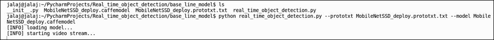

图 9.13：基线方法的执行

看看下面的图。在这里，我刚刚放置了示例图像，但当你运行脚本时，你可以看到整个视频。这里是使用基线方法进行实时物体检测的整个视频链接：[`drive.google.com/drive/folders/1RwKEUaxTExefdrSJSy44NugqGZaTN_BX?usp=sharing`](https://drive.google.com/drive/folders/1RwKEUaxTExefdrSJSy44NugqGZaTN_BX?usp=sharing)。

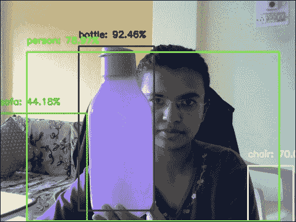

图 9.14：基线方法的输出（图像是视频流的一部分）

在这里，MobileNet SSD 的 mAP 为 71.1%。你将在下一节中学习如何优化这种方法。首先，我们将列出下一次迭代中我们可以改进的点。所以，让我们跳到下一节。

# 现有方法的弊端

虽然 MobileNet SSD 速度快且给出了良好的结果，但它仍然无法识别像杯子、钢笔等类别。因此，我们需要使用在多种物体上训练过的预训练模型。在即将到来的迭代中，我们需要使用预训练模型，例如 TensorFlow 对象检测 API，它将能够识别与基线方法相比的不同物体。所以现在，让我们看看我们将如何优化现有方法。

# 如何优化现有方法

如前所述，为了优化现有方法，我将使用 TensorFlow 对象检测 API。你可以通过以下链接参考 Google 的 TensorFlow GitHub 仓库中的此 API：[`github.com/tensorflow/models/tree/master/research/object_detection`](https://github.com/tensorflow/models/tree/master/research/object_detection)。此 API 使用 COCO 数据集以及 PASCAL VOC 数据集进行训练；因此，它将具有识别多种类别的功能。

## 理解优化过程

对于我们来说，最重要的部分是如何使用各种预训练模型。步骤如下：

1.  首先，使用此链接拉取 TensorFlow 模型存储库：[`github.com/tensorflow/models`](https://github.com/tensorflow/models)

1.  一旦您拉取了仓库，您就可以找到我提到的 iPython Notebook，以了解如何使用预训练模型，并找到 iPython 笔记本的链接[`github.com/tensorflow/models/blob/master/research/object_detection/object_detection_tutorial.ipynb`](https://github.com/tensorflow/models/blob/master/research/object_detection/object_detection_tutorial.ipynb)。

1.  在这里，我们使用了 SSD 与 MobileNet，但我们使用的是检测模型库。这个模型是在 COCO 数据集上训练的，它们的版本基于模型的速度和性能。您可以从以下链接下载预训练模型：[`github.com/tensorflow/models/blob/master/research/object_detection/g3doc/detection_model_zoo.md`](https://github.com/tensorflow/models/blob/master/research/object_detection/g3doc/detection_model_zoo.md)。我已经将这些部分组合在一起，因此对每个人来说实现代码都很容易。

1.  主要的是，这个模型是使用 SSD 方法训练的，但它使用了如 kitti 数据集和 Open Image 数据集等数据集。因此，这个模型能够检测更多的对象，并且更加通用。Kitti 数据集的链接是[`www.cvlibs.net/datasets/kitti/`](http://www.cvlibs.net/datasets/kitti/)，Open Image 数据集的链接是[`github.com/openimages/dataset`](https://github.com/openimages/dataset)。

一旦我们下载了仓库和预训练模型，我们将加载预训练模型。在 TensorFlow 中，众所周知，模型以.pb 文件保存。一旦我们加载了模型，我们将使用 OpenCV 来流式传输视频。在下一节中，我们将实现修订方法的代码。

# 实现修订方法

在本节中，我们将了解修订方法的实现。您可以参考以下 GitHub 链接：[`github.com/jalajthanaki/Real_time_object_detection/tree/master/revised_approach`](https://github.com/jalajthanaki/Real_time_object_detection/tree/master/revised_approach)，其中包含预训练模型和 TensorFlow 的物体检测文件夹。在我们开始编写代码之前，我将提供有关此方法文件夹结构的详细信息。您可以参考以下图示：

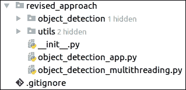

图 9.15：理解修订方法的文件夹结构

这里是下载自 TensorFlow 模型仓库的对象检测文件夹：[`github.com/tensorflow/models/tree/master/research/object_detection`](https://github.com/tensorflow/models/tree/master/research/object_detection)。在 `utils` 文件夹中，有一些辅助函数帮助我们流式传输视频。帮助我们运行脚本的主要脚本为 `object_detection_app.py`。预训练模型已保存在对象检测文件夹中。该文件夹中预训练模型的路径如下：`~/PycharmProjects/Real_time_object_detection/revised_approach/object_detection/ssd_mobilenet_v1_coco_11_06_2017/frozen_inference_graph.pb`。

现在，让我们一步一步地查看编码实现。在第一步中，我们将导入依赖库并加载预训练模型。您可以参考以下图示：

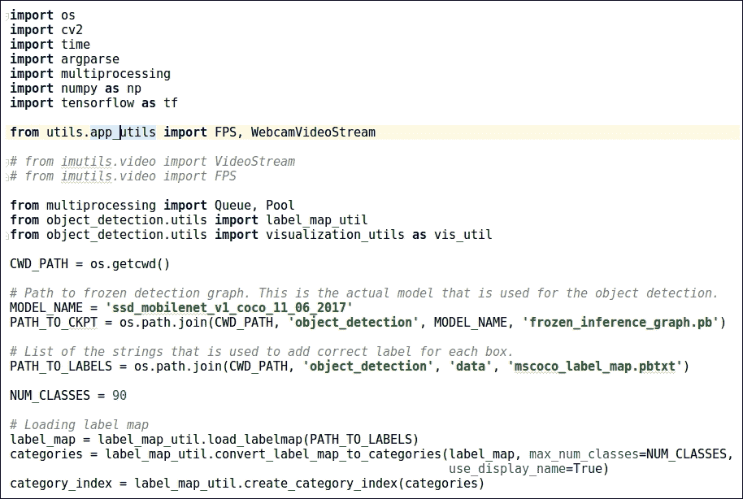

图 9.16：改进方法中加载预训练模型的代码片段

在这个模型中，有 90 种不同的对象可以被识别。一旦我们加载了模型，下一步就是 `detect_objects()` 函数，它用于识别对象。一旦对象被识别，就会为该对象绘制边界框，并且我们同时在这些对象上运行预训练模型，以便我们可以得到对象的识别标签，无论是杯子、瓶子、人等等。您可以参考以下图示：

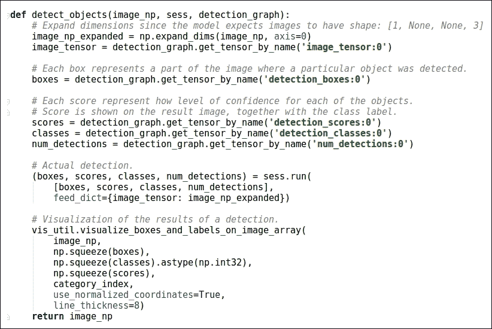

图 9.17：detect_objects()函数的代码片段

在此之后，我们有 `worker()` 函数，它帮助我们流式传输视频以及执行一些 GPU 内存管理。您可以参考以下图示：

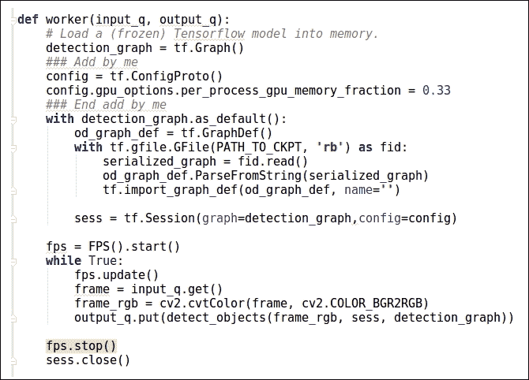

图 9.18：worker()函数的代码片段

如您所见，我们已定义了 GPU 内存分数，以及检测对象时使用的颜色类型。现在，让我们看看脚本的主要功能。在主函数中，我们定义了一些可选参数及其默认值。这些参数的列表如下：

+   摄像头设备索引：`--source=0`

+   视频流中帧的宽度 `--width= 500`

+   视频流中帧的高度 `--height= 500`

+   工作者数量 `--num-workers=2`

+   队列的大小 `--queue-size=5`

您可以参考以下图示中显示的主函数实现：

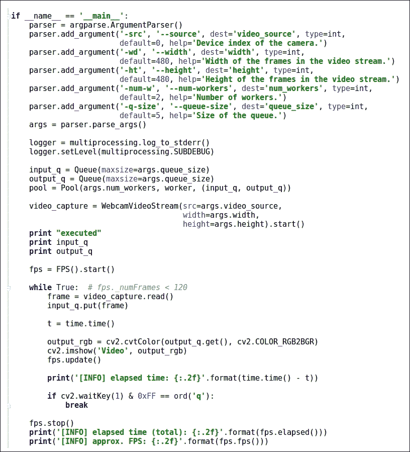

图 9.19：主函数的代码片段

当我们运行脚本时，我们可以看到即将给出的图示中的输出。在这里，我们放置了图像，但您可以通过此链接查看视频：

[`drive.google.com/drive/folders/1RwKEUaxTExefdrSJSy44NugqGZaTN_BX?usp=sharing`](https://drive.google.com/drive/folders/1RwKEUaxTExefdrSJSy44NugqGZaTN_BX?usp=sharing)

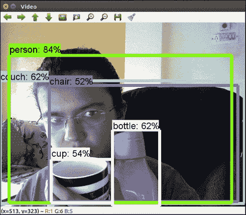

图 9.20：改进方法的结果输出

一旦我们结束视频，资源和过程也应该结束。为此，我们将使用以下图中提供的代码：


图 9.21：脚本终止后释放资源的代码片段

## 测试改进方法

一旦我们执行了这个方法，我们就可以识别杯子、钢笔等对象。因此，我们可以说我们的基线方法是肯定得到了改进的，并且有一些修改后的标签，例如沙发（在这个方法中，被识别为 couch）。除此之外，如果我们谈论这个预训练模型的 mAP，那么根据文档，在 COCO 数据集上，这个模型大约有 52.4%的准确性。在我们的输入中，我们将大约有 73%的准确性。这种方法识别了更多不同类别的对象，这是一个很大的优势。

在下一节中，我们将讨论我们可以用来找到最佳解决方案的要点。

## 理解改进方法中的问题

我们已经尝试了既快又准确的方法，但我们需要一个既快又准确且经过优化的方法。这些是我们开发最佳解决方案时需要记住的要点：

+   基于 SSD 的方法很好，但当你使用 COCO 或 PASCAL VOC 数据集训练自己的模型时，它的准确性并不高。

+   TensorFlow 检测模型库在 COCO 测试数据集上的 mAP 分数将在 20%到 40%之间。因此，我们需要探索其他技术，这些技术可以帮助我们在处理和目标检测准确性方面取得更好的结果。

因此，在下一节中，我们将探讨可以帮助我们优化改进方法的方法。

# 最佳方法

在本节中，我们将尝试名为**YOLO**的方法。YOLO 代表 You Only Look Once。这项技术提供了良好的准确性，速度快，内存管理简单。本节将分为两部分：

+   理解 YOLO

+   使用 YOLO 实现最佳方法

在第一部分，我们将了解 YOLO 的基本知识。在实现过程中，我们将使用预训练的 YOLO 模型来使用 YOLO。那么，让我们开始吧！

## 理解 YOLO

YOLO 是一种最先进的实时目标检测系统。在 GPU Titan X 上，它以 40-90 FPS 的速度处理图像，在 PASCAL VOC 数据集上的 mAP 为 78.6%，在 coco 测试-dev 数据集上的 mAP 为 48.1%。因此，现在我们将探讨 YOLO 是如何工作以及如何处理图像以识别对象的。我们使用 YOLOv2（YOLO 版本 2），因为它是一个更快的版本。

## YOLO 的工作原理

YOLO 重新定义了目标检测问题。它将对象识别任务视为从图像像素到边界框坐标和类别概率的单个回归问题。单个卷积网络同时预测多个边界框及其类别概率。YOLO 在完整图像上训练并直接优化检测性能。与传统方法相比，这种方法具有以下优点：

+   YOLO 非常快。这是因为，在 YOLO 中，帧检测是一个回归问题，我们不需要使用复杂的流程。

+   我们可以在测试时简单地在我们新的图像上运行我们的神经网络来预测检测。我们的基础网络在 Titan X GPU 上以每秒 45 帧的速度运行，没有批处理，而快速版本则超过 150 fps。这意味着我们可以以小于 25 毫秒的延迟实时处理流媒体视频。

YOLO 在预测关于类别及其外观的信息时，会全局处理图像。它还学习对象的泛化。

YOLO 将输入图像划分为一个 S×S 网格。如果一个物体的中心落在网格单元中，那么该网格单元负责检测该物体。每个网格单元预测 B 个边界框及其置信度分数。这些置信度分数反映了模型对框包含对象的信心程度以及它认为预测的框有多准确。因此，正式来说，我们可以通过这个符号定义 YOLO 的置信度机制。我们定义置信度为 Pr(object) * IoU。如果该单元格中没有对象存在，那么置信度分数应该是零；否则，我们希望置信度分数等于预测框与真实框之间的 IoU。每个边界框由五个预测组成：x, y, w, h 和置信度。其中(x, y)坐标表示框相对于网格单元边界的中心。w 和 h 代表宽度和高度，它们相对于整个图像进行预测。最后，置信度分数代表 IoU。对于每个网格单元，它预测 C 个条件类别概率，*Pr(Classi|Object)*。这些概率是在包含对象的网格单元上条件化的。我们每个网格单元只预测一组类别概率，无论边界框 B 的数量是多少。在测试时，我们乘以条件类别概率和由这个方程定义的个体框置信度预测：

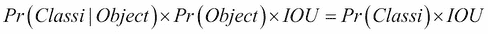

前面的方程为我们提供了每个框的类别特定置信度分数。这个分数包含了该类别出现在框中的概率以及预测框与对象拟合得有多好。YOLO 整个过程的图示如下所示：

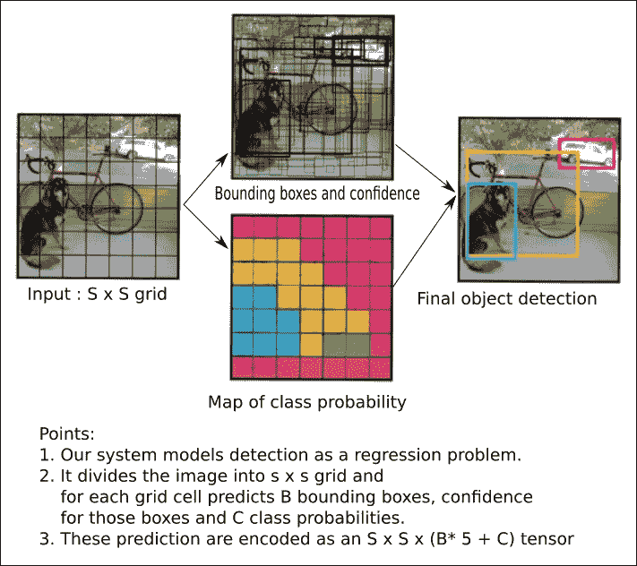

图 9.22：YOLO 目标检测的图示表示

现在，让我们了解 YOLO 架构的基本知识。

## YOLO 的架构

在本节中，你将学习 YOLO 架构的基本知识。在 YOLO 中，有 24 个卷积层，后面跟着两个全连接层。YOLO 没有使用 GoogleNet 中的 inception 模块，而是简单地使用 1×1 的降维层，然后是 3×3 的卷积层。Fast YOLO 使用具有较少卷积层的神经网络。我们使用 9 层而不是 24 层。在这些层中，我们也使用了较少的过滤器。除此之外，在训练和测试期间，YOLO 和 Fast YOLO 的所有参数都是相同的。你可以参考以下图中的架构：


图 9.23：YOLO 架构

现在，让我们继续到实现部分。

## 使用 YOLO 实现最佳方法

为了实现 YOLO，我们需要安装 Cython 模块。除此之外，你可以使用 Darknet 或 Darkflow，它是 Darknet 上的 TensorFlow 包装器。Darknet 使用 C 和 CUDA 编写，因此速度相当快。在这里，我们将实现这两种选项。在实现之前，我们需要设置环境。实现部分应分为两个部分：

+   使用 Darknet 实现

+   使用 Darkflow 的实现

你可以参考此 GitHub 仓库中的所有代码：[`github.com/jalajthanaki/Real_time_object_detection_with_YOLO`](https://github.com/jalajthanaki/Real_time_object_detection_with_YOLO)。

### 使用 Darknet 实现

我们按照以下步骤使用 Darknet 实现 YOLO：

+   为 Darknet 设置环境

+   编译 Darknet

+   下载预训练权重

+   对图像运行目标检测

+   对视频流运行目标检测

#### 为 Darknet 设置环境

在这一步，我们需要下载 Darknet 的 GitHub 仓库。我们可以使用以下命令完成此操作。你可以将此仓库下载到任何路径：

```py
$ git clone https://github.com/pjreddie/darknet
```

执行此命令后，将创建名为 Darknet 的目录。之后，你可以跳到下一步。

#### 编译 Darknet

下载完 Darknet 后，我们需要切换到名为 Darknet 的目录。之后，我们需要编译 Darknet。因此，我们需要依次执行以下命令：

```py
$ cd darknet
$ make

```

#### 下载预训练权重

配置文件已经包含在 darknet 目录中的 `cfg/` 子目录内。因此，通过执行以下命令，你可以下载 YOLO 模型的预训练权重：

```py
$ wegt https://pjreddie.com/media/files/yolo.weights
```

此下载可能需要一些时间。一旦我们有了预训练权重，我们就可以运行 Darknet。

#### 对图像运行目标检测

如果你想要识别图像中的对象，那么你需要执行以下命令：

```py
./darknet detect cfg/yolo.cfg yolo.weights data/dog.jpg
```

你可以在以下图中查看此命令的输出：


图 9.24：使用 Darknet 对图像进行目标检测的输出

现在，让我们在视频流上实现 YOLO。

#### 在视频流上运行目标检测

我们可以使用以下命令在视频流上运行 YOLO：

```py
./darknet detector demo cfg/coco.data cfg/yolo.cfg yolo.weights <video file>
```

在这里，我们需要传递视频的路径。有关更多信息，您可以参考以下 Darknet 文档：[`pjreddie.com/darknet/yolo/`](https://pjreddie.com/darknet/yolo/)。现在，让我们了解 Darkflow 的实现。

### 使用 Darkflow 的实现

在这个实现中，您需要参考名为 Darkflow 的文件夹中给出的代码。我们需要执行以下步骤：

1.  安装 Cython

1.  构建已提供的设置文件

1.  测试环境

1.  加载模型并在图像上运行目标检测

1.  加载模型并在视频流上运行目标检测

#### 安装 Cython

为了安装 Cython，我们需要执行以下命令。这个 Cython 包是必需的，因为 Darkflow 是一个 Python 包装器，它使用来自 Darknet 的 C 代码：

```py
$ sudo apt-get install Cython
```

一旦安装了 Cython，我们就可以构建其他设置。

#### 构建已提供的设置文件

在这个阶段，我们将执行设置必要的 Cython 环境的命令。命令如下：

```py
$ python setup.py build_ext --inplace
```

当我们执行此命令时，我们将在克隆的 Darkflow 目录中使用`./flow`而不是`flow`，因为 Darkflow 没有全局安装。一旦此命令成功运行，我们需要测试是否完美安装了所有依赖项。您可以使用以下命令下载预训练权重：

```py
$ wegt https://pjreddie.com/media/files/yolo.weights
```

#### 测试环境

在这个阶段，我们将测试 Darkflow 是否运行得完美。为了检查这一点，我们需要执行以下命令：

```py
$ ./flow --h
```

您可以参考以下图示：

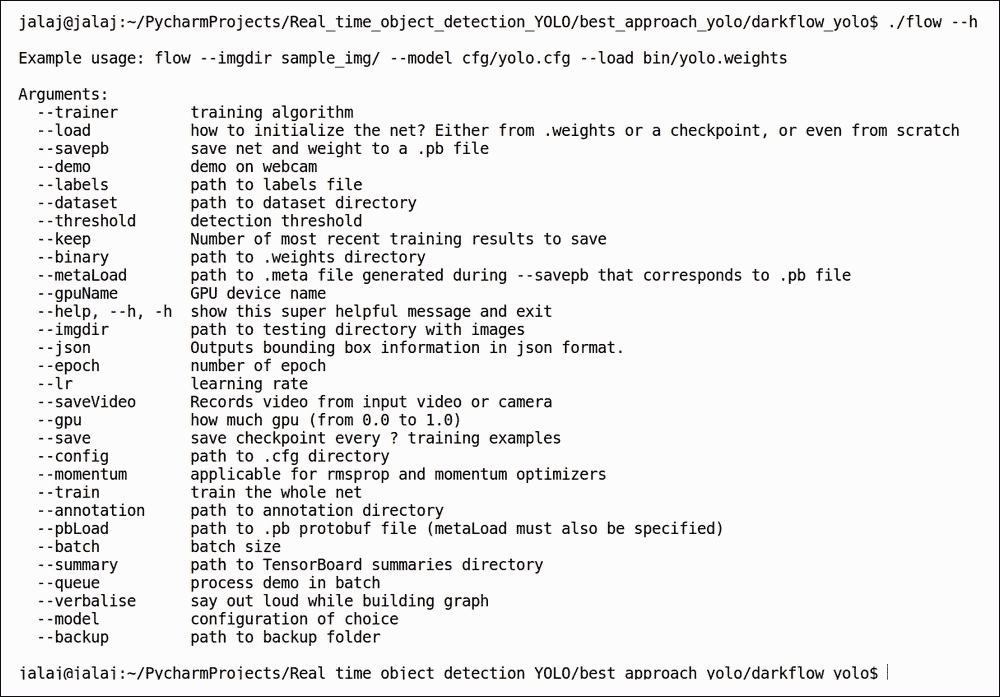

图 9.25：Darkflow 成功测试结果

一旦您看到前面的输出，您就会知道您已成功配置了 Darkflow。现在，让我们运行它。

#### 加载模型并在图像上运行目标检测

我们可以在图像上运行 Darkflow。为此，我们需要加载 YOLO 预训练权重、配置文件和图像路径，然后您可以执行以下命令：

```py
./flow --imgdir sample_img/ --model cfg/yolo.cfg --load ../darknet/yolo.weights
```

如果您想将目标检测保存为 json 格式，也是可能的。您需要执行以下命令：

```py
./flow --imgdir sample_img/ --model cfg/yolo.cfg --load ../darknet/yolo.weights --json
```

您可以在`sample_img/out`文件夹内看到输出；参考以下图示：

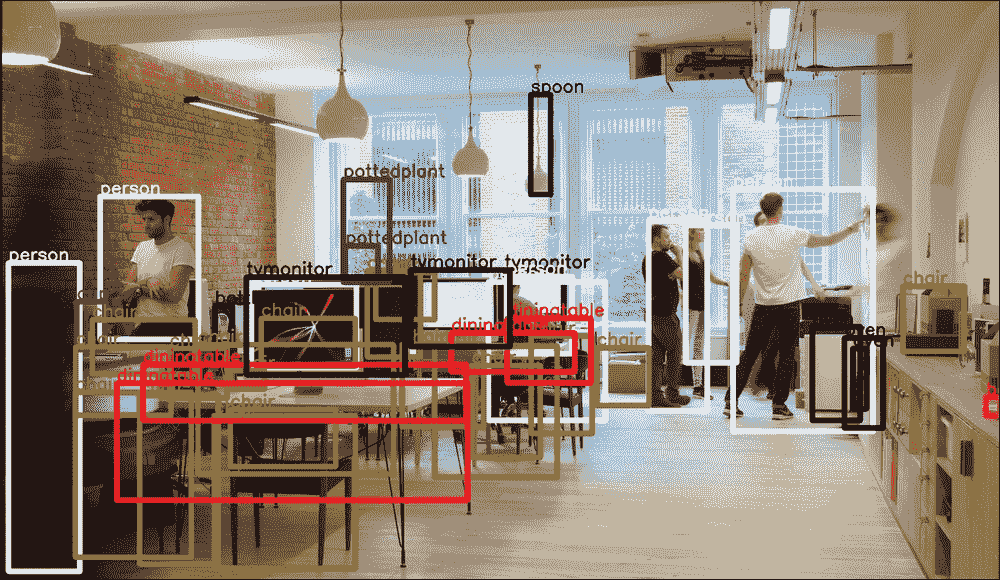

图 9.26：使用 Darkflow 预测对象输出的图像

您也可以参考以下图示：

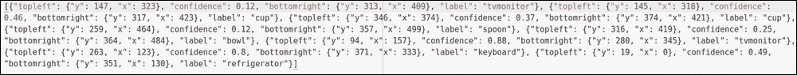

图 9.27：图像中检测到的对象的 json 输出

#### 加载模型并在视频流上运行目标检测

在本节中，我们将对视频流运行目标检测。首先，我们将看到如何使用网络摄像头并执行目标检测。该命令如下：

```py
./flow --model cfg/yolo.cfg --load ../darknet/yolo.weights --demo camera --saveVideo --gpu 0.60
```

你可以参考以下图表。你可以在以下链接中查看视频：[`drive.google.com/drive/folders/1RwKEUaxTExefdrSJSy44NugqGZaTN_BX?usp=sharing`](https://drive.google.com/drive/folders/1RwKEUaxTExefdrSJSy44NugqGZaTN_BX?usp=sharing)

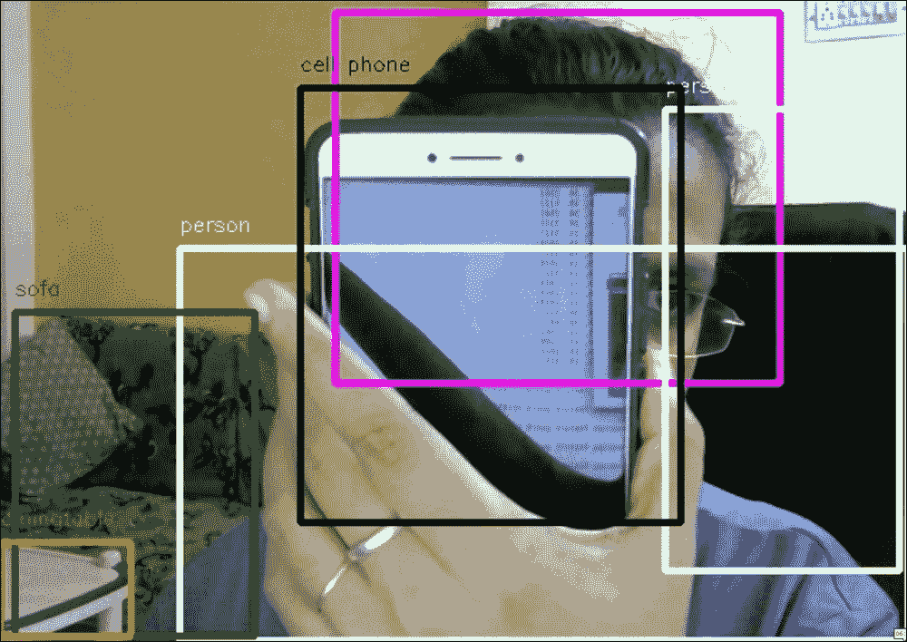

图 9.28：使用 Darkflow 对网络摄像头视频流进行目标检测的输出

我们也可以为预录制的视频运行 Darkflow。为此，你需要运行以下命令：

```py
./flow --model cfg/yolo.cfg --load ../darknet/yolo.weights --demo ~/Downloads/Traffic.avi --saveVideo --gpu 0.60
```

你可以参考以下图表。你可以在以下链接中查看视频：[`drive.google.com/drive/folders/1RwKEUaxTExefdrSJSy44NugqGZaTN_BX?usp=sharing`](https://drive.google.com/drive/folders/1RwKEUaxTExefdrSJSy44NugqGZaTN_BX?usp=sharing)。

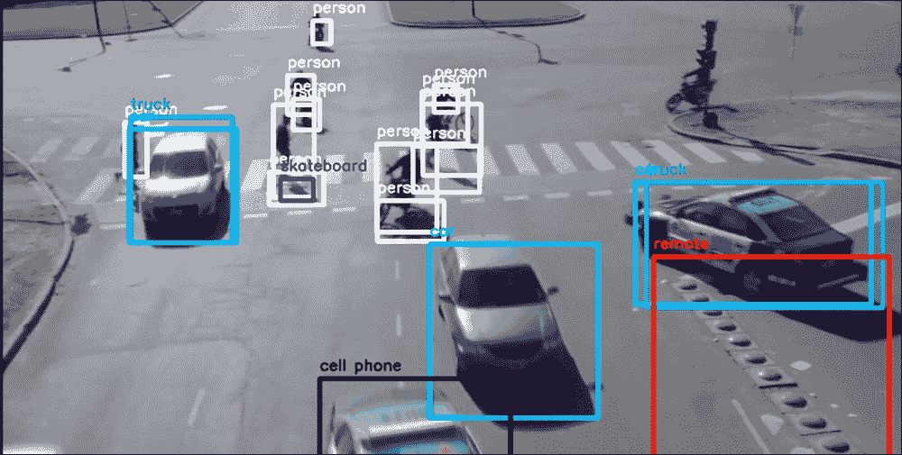

图 9.29：使用 Darkflow 对预录制的视频进行目标检测的输出

在这两个命令中，我们都使用了—save Video 标志来保存视频和—gpu 0.60 标志，它使用 GPU 的 60% 内存。使用这种方法，我们将获得 78% 的准确率。

# 摘要

在本章中，你学习了迁移学习。我们探索了不同的库和方法，以构建实时目标检测应用程序。你学习了如何设置 OpenCV，并了解了它在构建基线应用程序中的实用性。在基线方法中，我们使用了使用 caffe 深度学习库训练的模型。之后，我们使用 TensorFlow 构建了实时目标检测，但最终我们使用了预训练的 YOLO 模型，它优于其他所有方法。这种基于 YOLO 的方法为我们提供了更通用的目标检测应用程序方法。如果你对构建计算机视觉的创新解决方案感兴趣，那么你可以报名参加 VOC 挑战赛。这会提升你的技能，并给你一个学习的机会。你可以通过以下链接获取更多信息：[`host.robots.ox.ac.uk/pascal/VOC/`](http://host.robots.ox.ac.uk/pascal/VOC/)（PASCAL VOC 挑战赛 2005-2012）。你也可以构建自己的算法，检查结果，并将你的结果与现有方法进行比较，如果它优于现有方法，你绝对可以在知名期刊上发表论文。通过使用 YOLO 方法，我们在 PASCAL VOC 数据集上获得了 78% 的平均精度均值（mAP），当将此模型应用于任何视频或图像时，它表现得相当不错。本章的代码归功于 Adrian Rosebrock、Dat Tran 和 Trieu。我们根据 COCO 数据集或 PASCAL VOC 数据集得到的 mAP 来定义 mAP 分数。

在下一章中，我们将探讨属于计算机视觉领域的另一个应用：人脸检测和面部表情检测。为了构建这个应用，我们将使用深度学习技术。所以，继续阅读吧！
