# 第一章：开始并运行 Spark

**Apache Spark** 是一个分布式计算框架；该框架旨在简化编写并行程序的过程，这些程序可以在计算机集群或虚拟机中的许多节点上并行运行。它试图将资源调度、作业提交、执行、跟踪和节点之间的通信以及并行数据处理中固有的低级操作抽象出来。它还提供了一个更高级的 API 来处理分布式数据。因此，它类似于其他分布式处理框架，如 Apache Hadoop；但是，底层架构有所不同。

Spark 最初是加州大学伯克利分校（[`amplab.cs.berkeley.edu/projects/spark-lightning-fast-cluster-computing/`](https://amplab.cs.berkeley.edu/projects/spark-lightning-fast-cluster-computing/)）的 AMP 实验室的一个研究项目。该大学专注于分布式机器学习算法的用例。因此，它从头开始设计，以实现迭代性质的高性能，其中相同的数据被多次访问。这种性能主要通过将数据集缓存在内存中并结合低延迟和启动并行计算任务的开销来实现。除了容错性、灵活的分布式内存数据结构和强大的函数 API 等其他特性，Spark 已被证明在大规模数据处理任务中广泛适用，超越了机器学习和迭代分析。

更多信息，请访问：

+   [`spark.apache.org/community.html`](http://spark.apache.org/community.html)

+   [`spark.apache.org/community.html#history`](http://spark.apache.org/community.html#history)

在性能方面，Spark 在相关工作负载方面比 Hadoop 快得多。请参考以下图表：

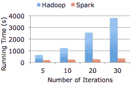

来源：https://amplab.cs.berkeley.edu/wp-content/uploads/2011/11/spark-lr.png

Spark 有四种运行模式：

+   独立的本地模式，其中所有 Spark 进程都在同一个**Java 虚拟机**（**JVM**）进程中运行

+   使用 Spark 自带的作业调度框架，设置独立集群模式

+   使用**Mesos**，一个流行的开源集群计算框架

+   使用 YARN（通常称为 NextGen MapReduce），Hadoop

在本章中，我们将进行以下操作：

+   下载 Spark 二进制文件并设置在 Spark 的独立本地模式下运行的开发环境。本环境将在整本书中用于运行示例代码。

+   使用 Spark 的交互式控制台来探索 Spark 的编程模型和 API。

+   在 Scala、Java、R 和 Python 中编写我们的第一个 Spark 程序。

+   使用亚马逊的**弹性云计算**（**EC2**）平台设置 Spark 集群，该平台可用于大型数据和更重的计算需求，而不是在本地模式下运行。

+   使用亚马逊弹性 Map Reduce 设置 Spark 集群

如果您之前有设置 Spark 的经验并且熟悉编写 Spark 程序的基础知识，可以跳过本章。

# 在本地安装和设置 Spark

Spark 可以在本地模式下使用内置的独立集群调度程序运行。这意味着所有 Spark 进程都在同一个 JVM 内运行，实际上是 Spark 的单个多线程实例。本地模式非常适用于原型设计、开发、调试和测试。然而，这种模式在实际场景中也可以用于在单台计算机的多个核心上执行并行计算。

由于 Spark 的本地模式与集群模式完全兼容；在本地编写和测试的程序只需进行一些额外的步骤即可在集群上运行。

在本地设置 Spark 的第一步是下载最新版本[`spark.apache.org/downloads.html`](http://spark.apache.org/downloads.html)，其中包含下载各种版本的 Spark 的链接，以及通过 GitHub 获取最新源代码的链接。

[`spark.apache.org/docs/latest/`](http://spark.apache.org/docs/latest/)提供的文档/文档是了解 Spark 的全面资源。我们强烈建议您探索一下！

为了访问**Hadoop 分布式文件系统**（**HDFS**）以及标准和自定义 Hadoop 输入源 Cloudera 的 Hadoop 分发、MapR 的 Hadoop 分发和 Hadoop 2（YARN），Spark 需要根据特定版本的 Hadoop 构建。除非您希望根据特定的 Hadoop 版本构建 Spark，我们建议您从[`d3kbcqa49mib13.cloudfront.net/spark-2.0.2-bin-hadoop2.7.tgz`](http://d3kbcqa49mib13.cloudfront.net/spark-2.0.2-bin-hadoop2.7.tgz)的 Apache 镜像下载预构建的 Hadoop 2.7 包。

在撰写本书时，Spark 需要 Scala 编程语言（版本为 2.10.x 或 2.11.x）才能运行。幸运的是，预构建的二进制包包含了 Scala 运行时包，因此您无需单独安装 Scala 即可开始。但是，您需要安装**Java 运行环境**（**JRE**）或**Java 开发工具包**（**JDK**）。

有关安装说明，请参考本书代码包中的软件和硬件列表。需要 R 3.1+。

下载 Spark 二进制包后，通过运行以下命令解压包的内容并切换到新创建的目录：

```scala
 $ tar xfvz spark-2.0.0-bin-hadoop2.7.tgz
 $ cd spark-2.0.0-bin-hadoop2.7

```

Spark 将用户脚本放置在`bin`目录中以运行 Spark。您可以通过运行 Spark 中包含的示例程序之一来测试一切是否正常工作。运行以下命令：

```scala
 $ bin/run-example SparkPi 100

```

这将在 Spark 的本地独立模式下运行示例。在此模式下，所有 Spark 进程都在同一个 JVM 中运行，并且 Spark 使用多个线程进行并行处理。默认情况下，上面的示例使用的线程数等于系统上可用的核心数。程序执行完毕后，您应该看到输出的末尾类似于以下行：

```scala
...
16/11/24 14:41:58 INFO Executor: Finished task 99.0 in stage 0.0 
    (TID 99). 872 bytes result sent to driver
16/11/24 14:41:58 INFO TaskSetManager: Finished task 99.0 in stage 
    0.0 (TID 99) in 59 ms on localhost (100/100)
16/11/24 14:41:58 INFO DAGScheduler: ResultStage 0 (reduce at 
    SparkPi.scala:38) finished in 1.988 s
16/11/24 14:41:58 INFO TaskSchedulerImpl: Removed TaskSet 0.0, 
    whose tasks have all completed, from pool 
16/11/24 14:41:58 INFO DAGScheduler: Job 0 finished: reduce at 
    SparkPi.scala:38, took 2.235920 s
Pi is roughly 3.1409527140952713

```

上述命令调用`org.apache.spark.examples.SparkPi`类。

此类以`local[N]`形式接受参数，其中`N`是要使用的线程数。例如，要仅使用两个线程，请运行以下命令`instead:N`是要使用的线程数。给定`local[*]`将使用本地机器上的所有核心--这是常见用法。

要仅使用两个线程，请运行以下命令：

```scala
 $ ./bin/spark-submit  --class org.apache.spark.examples.SparkPi 
 --master local[2] ./examples/jars/spark-examples_2.11-2.0.0.jar 100 

```

# Spark 集群

Spark 集群由两种类型的进程组成：驱动程序和多个执行器。在本地模式下，所有这些进程都在同一个 JVM 中运行。在集群中，这些进程通常在单独的节点上运行。

例如，运行在 Spark 独立模式下的典型集群（即使用 Spark 内置的集群管理模块）将具有以下内容：

+   运行 Spark 独立主进程和驱动程序的主节点

+   多个工作节点，每个节点运行一个执行器进程

虽然在本书中，我们将使用 Spark 的本地独立模式来说明概念和示例，但我们编写的相同 Spark 代码可以在 Spark 集群上运行。在上面的示例中，如果我们在 Spark 独立集群上运行代码，我们可以简单地传递主节点的 URL，如下所示：

```scala
 $ MASTER=spark://IP:PORT --class org.apache.spark.examples.SparkPi 
 ./examples/jars/spark-examples_2.11-2.0.0.jar 100

```

这里，`IP`是 Spark 主节点的 IP 地址，`PORT`是端口。这告诉 Spark 在运行 Spark 主进程的集群上运行程序。

Spark 的集群管理和部署的全面处理超出了本书的范围。但是，我们将简要教您如何在本章后面设置和使用 Amazon EC2 集群。

有关 Spark 集群应用部署的概述，请查看以下链接：

+   [`spark.apache.org/docs/latest/cluster-overview.html`](http://spark.apache.org/docs/latest/cluster-overview.html)

+   [`spark.apache.org/docs/latest/submitting-applications.html`](http://spark.apache.org/docs/latest/submitting-applications.html)

# Spark 编程模型

在我们深入了解 Spark 设计的高级概述之前，我们将介绍`SparkContext`对象以及 Spark shell，我们将使用它们来交互式地探索 Spark 编程模型的基础知识。

虽然本节提供了对 Spark 的简要概述和示例，但我们建议您阅读以下文档以获得详细的理解：

请参阅以下 URL：

+   有关 Spark 快速入门，请参阅[`spark.apache.org/docs/latest/quick-start`](http://spark.apache.org/docs/latest/quick-start)

+   有关 Spark 编程指南，涵盖 Scala、Java、Python 和 R--，请参阅[`spark.apache.org/docs/latest/programming-guide.html`](http://spark.apache.org/docs/latest/programming-guide.html)

# SparkContext 和 SparkConf

编写任何 Spark 程序的起点是`SparkContext`（在 Java 中为`JavaSparkContext`）。`SparkContext`使用包含各种 Spark 集群配置设置的`SparkConf`对象的实例进行初始化（例如，主节点的 URL）。

这是 Spark 功能的主要入口点。`SparkContext`是与 Spark 集群的连接。它可以用于在集群上创建 RDD、累加器和广播变量。

每个 JVM 只能有一个活动的`SparkContext`。在创建新的`SparkContext`之前，必须调用`stop()`来停止活动的`SparkContext`。

初始化后，我们将使用`SparkContext`对象中的各种方法来创建和操作分布式数据集和共享变量。Spark shell（在 Scala 和 Python 中，遗憾的是 Java 不支持）会为我们处理这个上下文的初始化，但以下代码示例展示了在 Scala 中创建本地模式下运行的上下文的示例：

```scala
val conf = new SparkConf() 
.setAppName("Test Spark App") 
.setMaster("local[4]") 
val sc = new SparkContext(conf)

```

这将创建一个在本地模式下运行的上下文，使用四个线程，应用程序的名称设置为`Test Spark App`。如果我们希望使用默认配置值，我们也可以调用`SparkContext`对象的以下简单构造函数，它的工作方式完全相同：

```scala
val sc = new SparkContext("local[4]", "Test Spark App")

```

下载示例代码

您可以从您在[`www.packtpub.com`](http://www.packtpub.com)的帐户中下载您购买的所有 Packt 图书的示例代码文件。如果您从其他来源购买了本书，您可以访问[`www.packtpub.com/support`](http://www.packtpub.com/support)并注册，以便直接通过电子邮件接收文件。

# SparkSession

`SparkSession`允许使用`DataFrame`和 Dataset API 进行编程。它是这些 API 的唯一入口点。

首先，我们需要创建`SparkConf`类的实例，并使用它创建`SparkSession`实例。考虑以下示例：

```scala
val spConfig = (new SparkConf).setMaster("local").setAppName("SparkApp")
 val spark = SparkSession
   .builder()
   .appName("SparkUserData").config(spConfig)
   .getOrCreate()

```

接下来，我们可以使用 spark 对象来创建一个`DataFrame`：

```scala
val user_df = spark.read.format("com.databricks.spark.csv")
   .option("delimiter", "|").schema(customSchema)
   .load("/home/ubuntu/work/ml-resources/spark-ml/data/ml-100k/u.user")
val first = user_df.first()

```

# Spark shell

Spark 支持使用 Scala、Python 或 R 的**REPL**（即**Read-Eval-Print-Loop**，或交互式 shell）进行交互式编程。当我们输入代码时，shell 会立即提供反馈，因为该代码会立即被评估。在 Scala shell 中，运行一段代码后还会显示返回结果和类型。

要在 Scala 中使用 Spark shell，只需从 Spark 基本目录运行`./bin/spark-shell`。这将启动 Scala shell 并初始化`SparkContext`，作为 Scala 值`sc`对我们可用。在 Spark 2.0 中，`SparkSession`实例以 Spark 变量的形式也在控制台中可用。

您的控制台输出应该类似于以下内容：

```scala
$ ~/work/spark-2.0.0-bin-hadoop2.7/bin/spark-shell 
Using Spark's default log4j profile: org/apache/spark/log4j-
    defaults.properties
Setting default log level to "WARN".
To adjust logging level use sc.setLogLevel(newLevel).
16/08/06 22:14:25 WARN NativeCodeLoader: Unable to load native-
    hadoop library for your platform... using builtin-java classes 
    where applicable
16/08/06 22:14:25 WARN Utils: Your hostname, ubuntu resolves to a 
    loopback address: 127.0.1.1; using 192.168.22.180 instead (on 
    interface eth1)
16/08/06 22:14:25 WARN Utils: Set SPARK_LOCAL_IP if you need to 
    bind to another address
16/08/06 22:14:26 WARN Utils: Service 'SparkUI' could not bind on 
    port 4040\. Attempting port 4041.
16/08/06 22:14:27 WARN SparkContext: Use an existing SparkContext, 
    some configuration may not take effect.
Spark context Web UI available at http://192.168.22.180:4041
Spark context available as 'sc' (master = local[*], app id = local-
    1470546866779).
Spark session available as 'spark'.
Welcome to
 ____              __
 / __/__  ___ _____/ /__
 _ / _ / ______/ __/  '_/
 /___/ .__/_,_/_/ /_/_   version 2.0.0
 /_/

Using Scala version 2.11.8 (Java HotSpot(TM) 64-Bit Server VM, 
    Java 1.7.0_60)
Type in expressions to have them evaluated.
Type :help for more information.

scala> 

```

要使用 Python shell 与 Spark 一起使用，只需运行`./bin/pyspark`命令。与 Scala shell 一样，Python 的`SparkContext`对象应该作为 Python 变量`sc`可用。您的输出应该类似于这样：

```scala
~/work/spark-2.0.0-bin-hadoop2.7/bin/pyspark 
Python 2.7.6 (default, Jun 22 2015, 17:58:13) 
[GCC 4.8.2] on linux2
Type "help", "copyright", "credits" or "license" for more 
    information.
Using Spark's default log4j profile: org/apache/spark/log4j-
    defaults.properties
Setting default log level to "WARN".
To adjust logging level use sc.setLogLevel(newLevel).
16/08/06 22:16:15 WARN NativeCodeLoader: Unable to load native-
    hadoop library for your platform... using builtin-java classes 
    where applicable
16/08/06 22:16:15 WARN Utils: Your hostname, ubuntu resolves to a 
    loopback address: 127.0.1.1; using 192.168.22.180 instead (on 
    interface eth1)
16/08/06 22:16:15 WARN Utils: Set SPARK_LOCAL_IP if you need to 
    bind to another address
16/08/06 22:16:16 WARN Utils: Service 'SparkUI' could not bind on 
    port 4040\. Attempting port 4041.
Welcome to
 ____              __
 / __/__  ___ _____/ /__
 _ / _ / ______/ __/  '_/
 /__ / .__/_,_/_/ /_/_   version 2.0.0
 /_/

Using Python version 2.7.6 (default, Jun 22 2015 17:58:13)
SparkSession available as 'spark'.
>>> 

```

**R**是一种语言，具有用于统计计算和图形的运行时环境。它是 GNU 项目。R 是**S**的另一种实现（由贝尔实验室开发的语言）。

R 提供了统计（线性和非线性建模、经典统计测试、时间序列分析、分类和聚类）和图形技术。它被认为是高度可扩展的。

要使用 R 来使用 Spark，运行以下命令打开 Spark-R shell：

```scala
$ ~/work/spark-2.0.0-bin-hadoop2.7/bin/sparkR
R version 3.0.2 (2013-09-25) -- "Frisbee Sailing"
Copyright (C) 2013 The R Foundation for Statistical Computing
Platform: x86_64-pc-linux-gnu (64-bit)

R is free software and comes with ABSOLUTELY NO WARRANTY.
You are welcome to redistribute it under certain conditions.
Type 'license()' or 'licence()' for distribution details.

 Natural language support but running in an English locale

R is a collaborative project with many contributors.
Type 'contributors()' for more information and
'citation()' on how to cite R or R packages in publications.

Type 'demo()' for some demos, 'help()' for on-line help, or
'help.start()' for an HTML browser interface to help.
Type 'q()' to quit R.

Launching java with spark-submit command /home/ubuntu/work/spark- 
    2.0.0-bin-hadoop2.7/bin/spark-submit   "sparkr-shell" 
    /tmp/RtmppzWD8S/backend_porta6366144af4f 
Using Spark's default log4j profile: org/apache/spark/log4j-
    defaults.properties
Setting default log level to "WARN".
To adjust logging level use sc.setLogLevel(newLevel).
16/08/06 22:26:22 WARN NativeCodeLoader: Unable to load native-
    hadoop library for your platform... using builtin-java classes 
    where applicable
16/08/06 22:26:22 WARN Utils: Your hostname, ubuntu resolves to a 
    loopback address: 127.0.1.1; using 192.168.22.186 instead (on 
    interface eth1)
16/08/06 22:26:22 WARN Utils: Set SPARK_LOCAL_IP if you need to 
    bind to another address
16/08/06 22:26:22 WARN Utils: Service 'SparkUI' could not bind on 
    port 4040\. Attempting port 4041.

 Welcome to
 ____              __ 
 / __/__  ___ _____/ /__ 
 _ / _ / _ ____/ __/  '_/ 
 /___/ .__/_,_/_/ /_/_   version  2.0.0 
 /_/ 
 SparkSession available as 'spark'.
During startup - Warning message:
package 'SparkR' was built under R version 3.1.1 
> 

```

# Resilient Distributed Datasets

Spark 的核心是一个叫做**Resilient Distributed Dataset**（**RDD**）的概念。RDD 是一个*记录*（严格来说，是某种类型的对象）的集合，分布或分区在集群中的许多节点上（对于 Spark 本地模式，单个多线程进程可以以相同的方式来看待）。Spark 中的 RDD 是容错的；这意味着如果给定的节点或任务失败（除了错误的用户代码之外的某些原因，如硬件故障、通信丢失等），RDD 可以在剩余的节点上自动重建，作业仍将完成。

# 创建 RDDs

RDDs 可以是您之前启动的 Scala Spark shells：

```scala
val collection = List("a", "b", "c", "d", "e") 
val rddFromCollection = sc.parallelize(collection)

```

RDDs 也可以从基于 Hadoop 的输入源创建，包括本地文件系统、HDFS 和 Amazon S3。基于 Hadoop 的 RDD 可以利用实现 Hadoop `InputFormat`接口的任何输入格式，包括文本文件、其他标准 Hadoop 格式、HBase、Cassandra、tachyon 等等。

以下代码是一个示例，演示如何从本地文件系统上的文本文件创建 RDD：

```scala
val rddFromTextFile = sc.textFile("LICENSE")

```

`textFile`方法返回一个 RDD，其中每个记录都是一个代表文本文件一行的`String`对象。前面命令的输出如下：

```scala
rddFromTextFile: org.apache.spark.rdd.RDD[String] = LICENSE   
MapPartitionsRDD[1] at textFile at <console>:24

```

以下代码是一个示例，演示如何使用`hdfs://`协议从 HDFS 上的文本文件创建 RDD：

```scala
val rddFromTextFileHDFS = sc.textFile("hdfs://input/LICENSE ")

```

以下代码是一个示例，演示如何使用`s3n://`协议从 Amazon S3 上的文本文件创建 RDD：

```scala
val rddFromTextFileS3 = sc.textFile("s3n://input/LICENSE ")

```

# Spark 操作

一旦我们创建了一个 RDD，我们就有了一个可以操作的分布式记录集合。在 Spark 的编程模型中，操作分为转换和动作。一般来说，转换操作将某个函数应用于数据集中的所有记录，以某种方式改变记录。动作通常运行一些计算或聚合操作，并将结果返回给运行`SparkContext`的驱动程序程序。

Spark 操作是函数式的风格。对于熟悉 Scala、Python 或 Java 8 中的 Lambda 表达式的函数式编程的程序员来说，这些操作应该看起来很自然。对于没有函数式编程经验的人，不用担心；Spark API 相对容易学习。

在 Spark 程序中，您将使用的最常见的转换之一是 map 操作符。这将对 RDD 的每个记录应用一个函数，从而将输入*映射*到一些新的输出。例如，以下代码片段将我们从本地文本文件创建的 RDD，并将`size`函数应用于 RDD 中的每个记录。请记住，我们创建了一个 String 的 RDD。使用`map`，我们可以将每个字符串转换为整数，从而返回一个`Ints`的 RDD：

```scala
val intsFromStringsRDD = rddFromTextFile.map(line => line.size)

```

您应该在 shell 中看到类似以下行的输出；这表示 RDD 的类型：

```scala
intsFromStringsRDD: org.apache.spark.rdd.RDD[Int] = 
MapPartitionsRDD[2] at map at <console>:26

```

在前面的代码中，我们看到了`=>`语法的使用。这是 Scala 中匿名函数的语法，它是一个不是命名方法的函数（也就是说，使用`def`关键字在 Scala 或 Python 中定义的方法）。

虽然匿名函数的详细处理超出了本书的范围，但它们在 Scala 和 Python 的 Spark 代码中被广泛使用，以及在 Java 8 中（在示例和实际应用中），因此涵盖一些实用性是有用的。

行`=> line.size`的语法意味着我们正在应用一个函数，其中`=>`是操作符，输出是`=>`操作符右侧代码的结果。在这种情况下，输入是行，输出是调用`line.size`的结果。在 Scala 中，将字符串映射为整数的函数表示为`String => Int`。

这种语法使我们不必每次使用 map 等方法时单独定义函数；当函数简单且只使用一次时，这是很有用的，就像这个例子。

现在，我们可以对我们的 RDD 应用一个常见的动作操作，count，以返回记录的数量：

```scala
intsFromStringsRDD.count

```

结果应该看起来像以下的控制台输出：

```scala
res0: Long = 299

```

也许我们想要找到这个文本文件中每行的平均长度。我们可以首先使用`sum`函数将所有记录的长度相加，然后将总和除以记录的数量：

```scala
val sumOfRecords = intsFromStringsRDD.sum 
val numRecords = intsFromStringsRDD.count 
val aveLengthOfRecord = sumOfRecords / numRecords

```

结果将如下所示：

```scala
scala> intsFromStringsRDD.count
res0: Long = 299

scala> val sumOfRecords = intsFromStringsRDD.sum
sumOfRecords: Double = 17512.0

scala> val numRecords = intsFromStringsRDD.count
numRecords: Long = 299

scala> val aveLengthOfRecord = sumOfRecords / numRecords
aveLengthOfRecord: Double = 58.5685618729097

```

Spark 操作在大多数情况下都会返回一个新的 RDD，除了大多数动作，它们返回计算的结果（例如在前面的示例中的`Long`表示计数，`Double`表示求和）。这意味着我们可以自然地链接操作以使我们的程序流更简洁和表达力更强。例如，可以使用以下代码实现与前一行代码相同的结果：

```scala
val aveLengthOfRecordChained = rddFromTextFile.map(line => line.size).sum / rddFromTextFile.count

```

一个重要的要点是，Spark 的转换是惰性的。也就是说，在 RDD 上调用转换不会立即触发计算。相反，转换被链接在一起，只有在调用动作时才有效地计算。这使得 Spark 能够更有效地只在必要时将结果返回给驱动程序，以便大多数操作在集群上并行执行。

这意味着如果您的 Spark 程序从不使用动作操作，它将永远不会触发实际的计算，也不会得到任何结果。例如，以下代码将简单地返回一个表示转换链的新 RDD：

```scala
val transformedRDD = rddFromTextFile.map(line => line.size).filter(size => size > 10).map(size => size * 2)

```

这将在控制台中返回以下结果：

```scala
transformedRDD: org.apache.spark.rdd.RDD[Int] = 
MapPartitionsRDD[6] at map at <console>:26

```

请注意，没有实际的计算发生，也没有结果返回。如果我们现在对生成的 RDD 调用一个动作，比如 sum，计算将被触发：

```scala
val computation = transformedRDD.sum

```

现在，您将看到运行了一个 Spark 作业，并且结果显示在控制台上：

```scala
computation: Double = 35006.0

```

有关 RDD 可能的所有转换和操作的完整列表，以及一组更详细的示例，都可以在 Spark 编程指南（位于[`spark.apache.org/docs/latest/programming-guide.html#rdd-operations`](http://spark.apache.org/docs/latest/programming-guide.html)）和 API 文档（Scala API 文档）中找到（位于[`spark.apache.org/docs/latest/api/scala/index.html#org.apache.spark.rdd.RDD`](http://spark.apache.org/docs/latest/api/scala/index.html#org.apache.spark.rdd.RDD)）。

# 缓存 RDDs

Spark 最强大的功能之一是能够在整个集群中将数据缓存在内存中。这是通过在 RDD 上使用 cache 方法来实现的：

```scala
rddFromTextFile.cache
res0: rddFromTextFile.type = MapPartitionsRDD[1] at textFile at 
<console>:27

```

在 RDD 上调用`cache`告诉 Spark 应该将 RDD 保存在内存中。第一次调用 RDD 上的操作以启动计算时，数据将从其源读取并放入内存。因此，第一次调用此类操作时，运行任务所需的时间部分取决于从输入源读取数据所需的时间。但是，当下一次访问数据时（例如，在分析中的后续查询或机器学习模型的迭代中），数据可以直接从内存中读取，从而避免昂贵的 I/O 操作，并在许多情况下显着加快计算速度。

如果我们现在在缓存的 RDD 上调用`count`或`sum`函数，RDD 将加载到内存中：

```scala
val aveLengthOfRecordChained = rddFromTextFile.map(line => 
line.size).sum / rddFromTextFile.count

```

Spark 还允许更精细地控制缓存行为。您可以使用`persist`方法指定 Spark 用于缓存数据的方法。有关 RDD 缓存的更多信息，请参见此处：

[`spark.apache.org/docs/latest/programmingguide.html#rdd-persistence`](http://spark.apache.org/docs/latest/programmingguide.html#rdd-persistence)

# 广播变量和累加器

Spark 的另一个核心特性是能够创建两种特殊类型的变量--广播变量和累加器。

**广播变量**是从驱动程序对象创建的*只读*变量，并提供给将执行计算的节点。这在需要以高效的方式将相同数据提供给工作节点的应用程序中非常有用，例如分布式系统。Spark 使创建广播变量变得非常简单，只需在`SparkContext`上调用一个方法即可，如下所示：

```scala
val broadcastAList = sc.broadcast(List("a", "b", "c", "d", "e"))

```

广播变量可以通过在变量上调用`value`来从创建它的驱动程序之外的节点（即工作节点）访问：

```scala
sc.parallelize(List("1", "2", "3")).map(x => broadcastAList.value ++  
  x).collect

```

此代码使用来自集合（在本例中为 Scala `List`）的三条记录创建一个新的 RDD。在映射函数中，它返回一个新的集合，其中包含从我们的新 RDD 附加到`broadcastAList`的相关记录，这是我们的广播变量：

```scala
...
res1: Array[List[Any]] = Array(List(a, b, c, d, e, 1), List(a, b, 
c, d, e, 2), List(a, b, c, d, e, 3))

```

请注意前面代码中的`collect`方法。这是一个 Spark *操作*，它将整个 RDD 作为 Scala（或 Python 或 Java）集合返回给驱动程序。

我们经常在希望在驱动程序中本地应用进一步处理结果时使用。

请注意，`collect`通常只应在我们真正希望将完整结果集返回给驱动程序并执行进一步处理的情况下使用。如果我们尝试在非常大的数据集上调用`collect`，可能会在驱动程序上耗尽内存并使程序崩溃。

最好尽可能在我们的 Spark 集群上执行尽可能多的重型处理，以防止驱动程序成为瓶颈。然而，在许多情况下，例如在许多机器学习模型的迭代中，将结果收集到驱动程序是必要的。

检查结果后，我们将看到我们的新 RDD 中的每个三条记录，现在都有一个记录，即我们原始广播的`List`，并将新元素附加到其中（即现在末尾有`"1"`、`"2"`或`"3"`）：

**累加器**也是广播到工作节点的变量。广播变量和累加器之间的关键区别在于，虽然`广播`变量是只读的，但累加器可以添加。这方面存在一些限制，即特别是加法必须是可关联的操作，以便可以正确地并行计算全局累积值并将其返回到驱动程序。每个工作节点只能访问并添加到其本地累加器值，只有驱动程序才能访问全局值。累加器也可以使用`value`方法在 Spark 代码中访问。

有关广播变量和累加器的更多详细信息，请参考*Spark 编程指南*中的*共享变量*部分，网址为[`spark.apache.org/docs/latest/programming-guide.html#shared-variables`](http://spark.apache.org/docs/latest/programming-guide.html#shared-variables)。

# SchemaRDD

**SchemaRDD**是 RDD 和模式信息的组合。它还提供了许多丰富且易于使用的 API（即`DataSet` API）。SchemaRDD 在 2.0 中不再使用，而是由`DataFrame`和`Dataset` API 在内部使用。

模式用于描述结构化数据的逻辑组织方式。在获取模式信息后，SQL 引擎能够为相应的数据提供结构化查询功能。`DataSet` API 是 Spark SQL 解析器函数的替代品。它是一个用于实现原始程序逻辑树的 API。后续处理步骤重用了 Spark SQL 的核心逻辑。我们可以安全地将`DataSet` API 的处理函数视为与 SQL 查询完全等效。

SchemaRDD 是一个 RDD 子类。当程序调用`DataSet` API 时，会创建一个新的 SchemaRDD 对象，并通过在原始逻辑计划树上添加一个新的逻辑操作节点来创建`new`对象的逻辑计划属性。`DataSet` API 的操作（与 RDD 一样）有两种类型--**Transformation**和**Action**。

与关系操作相关的 API 归属于 Transformation 类型。

与数据输出源相关的操作属于 Action 类型。与 RDD 一样，只有在调用 Action 类型操作时，Spark 作业才会被触发并交付给集群执行。

# Spark 数据框

在 Apache Spark 中，`Dataset`是分布式数据集合。`Dataset`是自 Spark 1.6 以来新增的接口。它结合了 RDD 的优点和 Spark SQL 的执行引擎的优点。`Dataset`可以从 JVM 对象构建，然后使用功能转换（`map`、`flatMap`、`filter`等）进行操作。`Dataset` API 仅适用于 Scala 和 Java，不适用于 Python 或 R。

`DataFrame`是一个带有命名列的数据集。它相当于关系数据库中的表或 R/Python 中的数据框，但具有更丰富的优化。`DataFrame`可以从结构化数据文件、Hive 中的表、外部数据库或现有的 RDD 构建。`DataFrame` API 在 Scala、Python、Java 和 R 中都可用。

Spark `DataFrame`首先需要实例化 Spark 会话：

```scala
import org.apache.spark.sql.SparkSession 
val spark = SparkSession.builder().appName("Spark SQL").config("spark.some.config.option", "").getOrCreate() 
import spark.implicits._

```

接下来，我们使用`spark.read.json`函数从 Json 文件创建一个`DataFrame`：

```scala
scala> val df = spark.read.json("/home/ubuntu/work/ml-resources
  /spark-ml/Chapter_01/data/example_one.json")

```

请注意，Spark `Implicits`正在被用来隐式地将 RDD 转换为数据框类型：

```scala
org.apache.spark.sql
Class SparkSession.implicits$
Object org.apache.spark.sql.SQLImplicits
Enclosing class: [SparkSession](https://spark.apache.org/docs/2.0.0/api/java/org/apache/spark/sql/SparkSession.html)

```

Scala 中可用的隐式方法，用于将常见的 Scala 对象转换为`DataFrames`。

输出将类似于以下清单：

```scala
df: org.apache.spark.sql.DataFrame = [address: struct<city: 
string, state: string>, name: string]

```

现在我们想看看这实际上是如何加载到`DataFrame`中的：

```scala
scala> df.show
+-----------------+-------+
|          address|   name|
+-----------------+-------+
|  [Columbus,Ohio]|    Yin|
|[null,California]|Michael|
+-----------------+-------+

```

# Spark 程序在 Scala 中的第一步

我们现在将使用我们在上一节介绍的思想来编写一个基本的 Spark 程序来操作数据集。我们将从 Scala 开始，然后在 Java 和 Python 中编写相同的程序。我们的程序将基于探索来自在线商店的一些数据，关于哪些用户购买了哪些产品。数据包含在名为`UserPurchaseHistory.csv`的**逗号分隔值**（**CSV**）文件中。该文件应该位于`data`目录中。

内容如下所示。CSV 的第一列是用户名，第二列是产品名称，最后一列是价格：

```scala
John,iPhone Cover,9.99
John,Headphones,5.49
Jack,iPhone Cover,9.99
Jill,Samsung Galaxy Cover,8.95
Bob,iPad Cover,5.49

```

对于我们的 Scala 程序，我们需要创建两个文件-我们的 Scala 代码和我们的项目构建配置文件-使用构建工具**Scala Build Tool**（**SBT**）。为了方便使用，我们建议您在本章中使用-spark-app。此代码还包含了 data 目录下的 CSV 文件。您需要在系统上安装 SBT 才能运行此示例程序（我们在撰写本书时使用的是版本 0.13.8）。

设置 SBT 超出了本书的范围；但是，您可以在[`www.scala-sbt.org/release/docs/Getting-Started/Setup.html`](http://www.scala-sbt.org/release/docs/Getting-Started/Setup.html)找到更多信息。

我们的 SBT 配置文件`build.sbt`看起来像这样（请注意，代码每一行之间的空行是必需的）：

```scala
name := "scala-spark-app" 
version := "1.0" 
scalaVersion := "2.11.7" 
libraryDependencies += "org.apache.spark" %% "spark-core" % "2.0.0"

```

最后一行将 Spark 的依赖项添加到我们的项目中。

我们的 Scala 程序包含在`ScalaApp.scala`文件中。我们将逐步讲解程序。首先，我们需要导入所需的 Spark 类：

```scala
import org.apache.spark.SparkContext 
import org.apache.spark.SparkContext._ 

/** 
 * A simple Spark app in Scala 
 */ 
object ScalaApp {

```

在我们的主方法中，我们需要初始化我们的`SparkContext`对象，并使用它来访问我们的 CSV 数据文件的`textFile`方法。然后，我们将通过在分隔符字符上拆分字符串并提取有关用户名、产品和价格的相关记录来映射原始文本：

```scala
def main(args: Array[String]) { 
  val sc = new SparkContext("local[2]", "First Spark App") 
  // we take the raw data in CSV format and convert it into a 
   set of records of the form (user, product, price) 
  val data = sc.textFile("data/UserPurchaseHistory.csv") 
    .map(line => line.split(",")) 
    .map(purchaseRecord => (purchaseRecord(0), 
     purchaseRecord(1), purchaseRecord(2)))

```

现在我们有了一个 RDD，其中每条记录由（`用户`，`产品`，`价格`）组成，我们可以为我们的商店计算各种有趣的指标，例如以下指标：

+   购买总数

+   购买的独特用户数量

+   我们的总收入

+   我们最受欢迎的产品

让我们计算前述指标：

```scala
// let's count the number of purchases 
val numPurchases = data.count() 
// let's count how many unique users made purchases 
val uniqueUsers = data.map{ case (user, product, price) => user 
}.distinct().count() 
// let's sum up our total revenue 
val totalRevenue = data.map{ case (user, product, price) => 
price.toDouble }.sum() 
// let's find our most popular product 
val productsByPopularity = data 
  .map{ case (user, product, price) => (product, 1) } 
  .reduceByKey(_ + _) 
  .collect() 
  .sortBy(-_._2)     
val mostPopular = productsByPopularity(0)

```

计算最受欢迎产品的最后一段代码是 Hadoop 流行的*Map/Reduce*模式的一个例子。首先，我们将我们的记录（`用户`，`产品`，`价格`）映射到（`产品`，`1`）的记录。然后，我们执行了`reduceByKey`操作，对每个唯一产品的 1 进行求和。

一旦我们有了这个转换后的 RDD，其中包含了每种产品的购买数量，我们将调用`collect`，将计算结果返回给驱动程序作为本地 Scala 集合。然后我们会在本地对这些计数进行排序（请注意，在实践中，如果数据量很大，我们通常会使用 Spark 操作（例如`sortByKey`）并行进行排序）。

最后，我们将在控制台上打印出我们的计算结果：

```scala
    println("Total purchases: " + numPurchases) 
    println("Unique users: " + uniqueUsers) 
    println("Total revenue: " + totalRevenue) 
    println("Most popular product: %s with %d 
    purchases".format(mostPopular._1, mostPopular._2)) 
  } 
}

```

我们可以通过在项目的基本目录中运行`sbt run`或者在使用 Scala IDE 时运行程序来运行此程序。输出应该类似于以下内容：

```scala
...
[info] Compiling 1 Scala source to ...
[info] Running ScalaApp
...
Total purchases: 5
Unique users: 4
Total revenue: 39.91
Most popular product: iPhone Cover with 2 purchases

```

我们可以看到我们有来自四个不同用户的`5`次购买，总收入为`39.91`。我们最受欢迎的产品是一个带有`2`次购买的`iPhone 保护套`。

# Java 中 Spark 程序的第一步

Java API 在原则上与 Scala API 非常相似。但是，虽然 Scala 可以很容易地调用 Java 代码，但在某些情况下，从 Java 调用 Scala 代码是不可能的。特别是当 Scala 代码使用 Scala 特性，如隐式转换、默认参数和 Scala 反射 API 时。

Spark 通常大量使用这些功能，因此有必要专门为 Java 提供一个单独的 API，其中包括常见类的 Java 版本。因此，`SparkContext`变成了`JavaSparkContext`，而 RDD 变成了 JavaRDD。

Java 8 之前的版本不支持匿名函数，也没有简洁的函数式编程语法，因此 Spark Java API 中的函数必须实现`WrappedFunction`接口，并具有`call`方法签名。虽然这种方式更加冗长，但我们经常会创建一次性的匿名类，将其传递给我们的 Spark 操作，这些匿名类实现了这个接口和`call`方法，从而实现了与 Scala 中匿名函数几乎相同的效果。

Spark 支持 Java 8 的匿名函数（或*lambda*）语法。使用这种语法使得用 Java 8 编写的 Spark 程序看起来非常接近等效的 Scala 程序。

在 Scala 中，键/值对的 RDD 提供了特殊的运算符（例如`reduceByKey`和`saveAsSequenceFile`），这些运算符可以通过隐式转换自动访问。在 Java 中，需要特殊类型的`JavaRDD`类才能访问类似的函数。这些包括`JavaPairRDD`用于处理键/值对和`JavaDoubleRDD`用于处理数值记录。

在本节中，我们介绍了标准的 Java API 语法。有关在 Java 中使用 RDD 以及 Java 8 lambda 语法的更多细节和示例，请参阅*Spark 编程指南*中的 Java 部分，网址为[`spark.apache.org/docs/latest/programming-guide.html#rdd-operations`](http://spark.apache.org/docs/latest/programming-guide.html#rdd-operations)。

我们将在接下来的 Java 程序中看到大部分这些差异的示例，该程序包含在本章示例代码的`java-spark-app`目录中。`code`目录还包含`data`子目录下的 CSV 数据文件。

我们将使用**Maven**构建工具构建和运行这个项目，我们假设您已经在系统上安装了它。

安装和设置 Maven 超出了本书的范围。通常，可以使用 Linux 系统上的软件包管理器，或者在 Mac OS X 上使用 HomeBrew 或 MacPorts 轻松安装 Maven。

详细的安装说明可以在[`maven.apache.org/download.cgi`](http://maven.apache.org/download.cgi)找到。

该项目包含一个名为`JavaApp.java`的 Java 文件，其中包含我们的程序代码：

```scala
import org.apache.spark.api.java.JavaRDD; 
import org.apache.spark.api.java.JavaSparkContext; 
import scala.Tuple2; 
import java.util.*; 
import java.util.stream.Collectors; 

/** 
 * A simple Spark app in Java 
 */ 
public class JavaApp { 
  public static void main(String[] args) {

```

与我们的 Scala 示例一样，我们首先需要初始化我们的上下文。请注意，我们将在这里使用`JavaSparkContext`类，而不是之前使用的`SparkContext`类。我们将以相同的方式使用`JavaSparkContext`类来使用`textFile`访问我们的数据，然后将每一行拆分为所需的字段。请注意我们如何使用匿名类来定义一个拆分函数，该函数在突出显示的代码中执行字符串处理：

```scala
JavaSparkContext sc = new JavaSparkContext("local[2]", 
     "First Spark App"); 
// we take the raw data in CSV format and convert it into a 
// set of records of the form (user, product, price) 
JavaRDD<String[]> data =   sc.textFile("data/UserPurchaseHistory.csv").map(s ->         s.split(","));

```

现在，我们可以计算与我们在 Scala 示例中所做的相同的指标。请注意，一些方法对于 Java 和 Scala API 是相同的（例如`distinct`和`count`）。还请注意我们传递给 map 函数的匿名类的使用。这段代码在这里突出显示：

```scala
// let's count the number of purchases 
long numPurchases = data.count(); 
// let's count how many unique users made purchases 
long uniqueUsers = data.map(strings ->  
      strings[0]).distinct().count(); 
// let's sum up our total revenue 
Double totalRevenue = data.map(strings ->  
      Double.parseDouble(strings[2])).reduce((Double v1,  
Double v2) -> new Double(v1.doubleValue() + v2.doubleValue()));

```

在以下代码行中，我们可以看到计算最受欢迎产品的方法与 Scala 示例中的方法相同。额外的代码可能看起来复杂，但它主要与创建匿名函数所需的 Java 代码相关（我们在这里进行了突出显示）。实际功能是相同的：

```scala
// let's find our most popular product 
List<Tuple2<String, Integer>> pairs = data.mapToPair(strings -> new Tuple2<String, Integer>(strings[1], 1)).reduceByKey((Integer i1, Integer i2) -> i1 + i2).collect(); 

Map<String, Integer> sortedData = new HashMap<>(); 
Iterator it = pairs.iterator(); 
while (it.hasNext()) { 
    Tuple2<String, Integer> o = (Tuple2<String, Integer>) it.next(); 
    sortedData.put(o._1, o._2); 
} 
List<String> sorted = sortedData.entrySet() 
        .stream() 
        .sorted(Comparator.comparing((Map.Entry<String, Integer> 
          entry) -> entry.getValue()).reversed())
         .map(Map.Entry::getKey) 
        .collect(Collectors.toList()); 
String mostPopular = sorted.get(0); 
            int purchases = sortedData.get(mostPopular); 
    System.out.println("Total purchases: " + numPurchases); 
    System.out.println("Unique users: " + uniqueUsers); 
    System.out.println("Total revenue: " + totalRevenue); 
    System.out.println(String.format("Most popular product:
     %s with %d purchases", mostPopular, purchases)); 
  } 
}

```

可以看到，一般结构与 Scala 版本相似，除了额外的样板代码用于通过匿名内部类声明变量和函数。通过逐行比较 Scala 代码和 Java 代码，理解如何在每种语言中实现相同的结果是一个很好的练习。

可以通过从项目的基本目录执行以下命令来运行此程序：

```scala
  $ mvn exec:java -Dexec.mainClass="JavaApp"

```

您将看到与 Scala 版本非常相似的输出，计算结果相同：

```scala
...
14/01/30 17:02:43 INFO spark.SparkContext: Job finished: collect 
at JavaApp.java:46, took 0.039167 s
Total purchases: 5
Unique users: 4
Total revenue: 39.91
Most popular product: iPhone Cover with 2 purchases

```

# Python 中 Spark 程序的第一步

Spark 的 Python API 在 Python 语言中几乎暴露了 Spark 的 Scala API 的所有功能。有一些功能目前尚不支持（例如，使用 GraphX 进行图处理以及一些 API 方法）。有关更多详细信息，请参阅*Spark 编程指南*的 Python 部分（[`spark.apache.org/docs/latest/programming-guide.html`](http://spark.apache.org/docs/latest/programming-guide.html)）。

**PySpark**是使用 Spark 的 Java API 构建的。数据在本地 Python 中处理，缓存，并在 JVM 中进行洗牌。Python 驱动程序的`SparkContext`使用 Py4J 来启动 JVM 并创建`JavaSparkContext`。驱动程序使用 Py4J 在 Python 和 Java 的`SparkContext`对象之间进行本地通信。Python 中的 RDD 转换映射到 Java 中的`PythonRDD`对象上的转换。`PythonRDD`对象在远程工作机器上启动 Python 子进程，并使用管道与它们通信。这些子进程用于发送用户的代码和处理数据。

在前面的例子之后，我们现在将写一个 Python 版本。我们假设你的系统上已安装了 Python 2.6 及更高版本（例如，大多数 Linux 和 Mac OS X 系统都预装了 Python）。

示例程序包含在本章的示例代码中，位于名为`python-spark-app`的目录中，该目录还包含`data`子目录下的 CSV 数据文件。该项目包含一个名为`pythonapp.py`的脚本，如下所示。

一个简单的 Python 中的 Spark 应用：

```scala
from pyspark import SparkContext

sc = SparkContext("local[2]", "First Spark App")
# we take the raw data in CSV format and convert it into a set of 
    records of the form (user, product, price)
data = sc.textFile("data/UserPurchaseHistory.csv").map(lambda 
    line: line.split(",")).map(lambda record: (record[0], record[1], 
    record[2]))
# let's count the number of purchases
numPurchases = data.count()
# let's count how many unique users made purchases
uniqueUsers = data.map(lambda record: record[0]).distinct().count()
# let's sum up our total revenue
totalRevenue = data.map(lambda record: float(record[2])).sum()
# let's find our most popular product
products = data.map(lambda record: (record[1], 
    1.0)).reduceByKey(lambda a, b: a + b).collect()
mostPopular = sorted(products, key=lambda x: x[1], reverse=True)[0]

print "Total purchases: %d" % numPurchases
print "Unique users: %d" % uniqueUsers
print "Total revenue: %2.2f" % totalRevenue
print "Most popular product: %s with %d purchases" % 
    (mostPopular[0], mostPopular[1])

```

如果你比较我们程序的 Scala 和 Python 版本，你会发现语法看起来非常相似。一个关键的区别是我们如何表达匿名函数（也称为`lambda`函数；因此，Python 语法中使用了这个关键字）。在 Scala 中，我们已经看到，将输入`x`映射到输出`y`的匿名函数表示为`x => y`，而在 Python 中，它是`lambda x: y`。在前面代码的突出行中，我们应用了一个将两个输入`a`和`b`（通常是相同类型的）映射到输出的匿名函数。在这种情况下，我们应用的函数是加法函数；因此，`lambda a, b: a + b`。

运行脚本的最佳方法是从示例项目的基本目录运行以下命令：

```scala
 $SPARK_HOME/bin/spark-submit pythonapp.py

```

在这里，`SPARK_HOME`变量应该被替换为你在本章开始时解压 Spark 预构建二进制包的目录路径。

运行脚本后，你应该看到与 Scala 和 Java 示例相似的输出，我们的计算结果也是相同的：

```scala
...
14/01/30 11:43:47 INFO SparkContext: Job finished: collect at 
pythonapp.py:14, took 0.050251 s
Total purchases: 5
Unique users: 4
Total revenue: 39.91
Most popular product: iPhone Cover with 2 purchases

```

# 在 R 中编写 Spark 程序的第一步

**SparkR**是一个 R 包，提供了一个前端来使用 Apache Spark。在 Spark 1.6.0 中，SparkR 提供了一个分布式数据框架用于大型数据集。SparkR 还支持使用 MLlib 进行分布式机器学习。在阅读机器学习章节时，你应该尝试一下这个。

# SparkR 数据框

`DataFrame`是一个由名称列组织的分布式数据集合。这个概念与关系数据库或 R 的数据框非常相似，但优化更好。这些数据框的来源可以是 CSV、TSV、Hive 表、本地 R 数据框等。

Spark 分发可以使用`./bin/sparkR shell`来运行。

在前面的例子之后，我们现在将写一个 R 版本。我们假设你的系统上已安装了 R（例如，大多数 Linux 和 Mac OS X 系统都预装了 Python）。

示例程序包含在本章的示例代码中，位于名为`r-spark-app`的目录中，该目录还包含`data`子目录下的 CSV 数据文件。该项目包含一个名为`r-script-01.R`的脚本，如下所示。确保你将`PATH`更改为适合你的环境的值。

```scala
Sys.setenv(SPARK_HOME = "/PATH/spark-2.0.0-bin-hadoop2.7") 
.libPaths(c(file.path(Sys.getenv("SPARK_HOME"), "R", "lib"), 
 .libPaths())) 
#load the Sparkr library 
library(SparkR) 
sc <- sparkR.init(master = "local", sparkPackages="com.databricks:spark-csv_2.10:1.3.0") 
sqlContext <- sparkRSQL.init(sc) 

user.purchase.history <- "/PATH/ml-resources/spark-ml/Chapter_01/r-spark-app/data/UserPurchaseHistory.csv" 
data <- read.df(sqlContext, user.purchase.history, "com.databricks.spark.csv", header="false") 
head(data) 
count(data) 

parseFields <- function(record) { 
  Sys.setlocale("LC_ALL", "C") # necessary for strsplit() to work correctly 
  parts <- strsplit(as.character(record), ",") 
  list(name=parts[1], product=parts[2], price=parts[3]) 
} 

parsedRDD <- SparkR:::lapply(data, parseFields) 
cache(parsedRDD) 
numPurchases <- count(parsedRDD) 

sprintf("Number of Purchases : %d", numPurchases) 
getName <- function(record){ 
  record[1] 
} 

getPrice <- function(record){ 
  record[3] 
} 

nameRDD <- SparkR:::lapply(parsedRDD, getName) 
nameRDD = collect(nameRDD) 
head(nameRDD) 

uniqueUsers <- unique(nameRDD) 
head(uniqueUsers) 

priceRDD <- SparkR:::lapply(parsedRDD, function(x) { as.numeric(x$price[1])}) 
take(priceRDD,3) 

totalRevenue <- SparkR:::reduce(priceRDD, "+") 

sprintf("Total Revenue : %.2f", s) 

products <- SparkR:::lapply(parsedRDD, function(x) { list( toString(x$product[1]), 1) }) 
take(products, 5) 
productCount <- SparkR:::reduceByKey(products, "+", 2L) 
productsCountAsKey <- SparkR:::lapply(productCount, function(x) { list( as.integer(x[2][1]), x[1][1])}) 

productCount <- count(productsCountAsKey) 
mostPopular <- toString(collect(productsCountAsKey)[[productCount]][[2]]) 
sprintf("Most Popular Product : %s", mostPopular)

```

在 bash 终端上使用以下命令运行脚本：

```scala
  $ Rscript r-script-01.R 

```

你的输出将类似于以下清单：

```scala
> sprintf("Number of Purchases : %d", numPurchases)
[1] "Number of Purchases : 5"

> uniqueUsers <- unique(nameRDD)
> head(uniqueUsers)
[[1]]
[[1]]$name
[[1]]$name[[1]]
[1] "John"
[[2]]
[[2]]$name
[[2]]$name[[1]]
[1] "Jack"
[[3]]
[[3]]$name
[[3]]$name[[1]]
[1] "Jill"
[[4]]
[[4]]$name
[[4]]$name[[1]]
[1] "Bob"

> sprintf("Total Revenue : %.2f", totalRevenueNum)
[1] "Total Revenue : 39.91"

> sprintf("Most Popular Product : %s", mostPopular)
[1] "Most Popular Product : iPad Cover"

```

# 在亚马逊 EC2 上运行 Spark

Spark 项目提供了在亚马逊的 EC2 服务上在云中运行 Spark 集群的脚本。这些脚本位于`ec2`目录中。你可以使用以下命令在这个目录中运行`spark-ec2`脚本：

```scala
>./ec2/spark-ec2 

```

以这种方式运行它而不带参数将显示帮助输出：

```scala
Usage: spark-ec2 [options] <action> <cluster_name>
<action> can be: launch, destroy, login, stop, start, get-master

Options:
...

```

在创建 Spark EC2 集群之前，您需要确保您有一个

亚马逊账户。

如果您没有 Amazon Web Services 账户，可以在[`aws.amazon.com/`](http://aws.amazon.com/)注册。

AWS 控制台可在[`aws.amazon.com/console/`](http://aws.amazon.com/console/)找到。

您还需要创建一个 Amazon EC2 密钥对并检索相关的安全凭据。EC2 的 Spark 文档（可在[`spark.apache.org/docs/latest/ec2-scripts.html`](http://spark.apache.org/docs/latest/ec2-scripts.html)找到）解释了要求：

为自己创建一个 Amazon EC2 密钥对。这可以通过登录您的 Amazon Web Services 账户，点击左侧边栏上的密钥对，创建和下载一个密钥来完成。确保将私钥文件的权限设置为 600（即只有您可以读取和写入它），以便 ssh 正常工作。

每当您想要使用 spark-ec2 脚本时，将环境变量`AWS_ACCESS_KEY_ID`和`AWS_SECRET_ACCESS_KEY`设置为您的 Amazon EC2 访问密钥`ID`和秘密访问密钥。这些可以从 AWS 主页上通过点击账户|安全凭据|访问凭据来获取。

在创建密钥对时，选择一个易于记住的名称。我们将简单地使用名称*spark*作为密钥对。密钥对文件本身将被称为`spark.pem`。如前所述，确保密钥对文件权限设置正确，并且通过以下命令导出 AWS 凭据的环境变量：

```scala
  $ chmod 600 spark.pem
 $ export AWS_ACCESS_KEY_ID="..."
 $ export AWS_SECRET_ACCESS_KEY="..."

```

您还需要小心保管您下载的密钥对文件，不要丢失，因为它只能在创建时下载一次！

请注意，在下一节中启动 Amazon EC2 集群将会对您的 AWS 账户产生费用。

# 启动 EC2 Spark 集群

现在我们已经准备好通过切换到`ec2`目录然后运行集群启动命令来启动一个小的 Spark 集群：

```scala
 $  cd ec2
 $ ./spark-ec2 --key-pair=rd_spark-user1 --identity-file=spark.pem  
    --region=us-east-1 --zone=us-east-1a launch my-spark-cluster

```

这将启动一个名为 test-cluster 的新 Spark 集群，其中包含一个 master 和一个 slave 节点，实例类型为`m3.medium`。此集群将使用为 Hadoop 2 构建的 Spark 版本。我们使用的密钥对名称是 spark，密钥对文件是`spark.pem`（如果您给文件取了不同的名称或者有现有的 AWS 密钥对，请使用该名称）。

集群完全启动和初始化可能需要相当长的时间。在运行启动命令后，您应该立即看到类似以下的内容：

```scala
Setting up security groups...
Creating security group my-spark-cluster-master
Creating security group my-spark-cluster-slaves
Searching for existing cluster my-spark-cluster in region 
    us-east-1...
Spark AMI: ami-5bb18832
Launching instances...
Launched 1 slave in us-east-1a, regid = r-5a893af2
Launched master in us-east-1a, regid = r-39883b91
Waiting for AWS to propagate instance metadata...
Waiting for cluster to enter 'ssh-ready' state...........
Warning: SSH connection error. (This could be temporary.)
Host: ec2-52-90-110-128.compute-1.amazonaws.com
SSH return code: 255
SSH output: ssh: connect to host ec2-52-90-110-128.compute- 
    1.amazonaws.com port 22: Connection refused
Warning: SSH connection error. (This could be temporary.)
Host: ec2-52-90-110-128.compute-1.amazonaws.com
SSH return code: 255
SSH output: ssh: connect to host ec2-52-90-110-128.compute-
    1.amazonaws.com port 22: Connection refused
Warnig: SSH connection error. (This could be temporary.)
Host: ec2-52-90-110-128.compute-1.amazonaws.com
SSH return code: 255
SSH output: ssh: connect to host ec2-52-90-110-128.compute-
    1.amazonaws.com port 22: Connection refused
Cluster is now in 'ssh-ready' state. Waited 510 seconds.

```

如果集群已经成功启动，最终你应该会看到类似以下清单的控制台输出：

```scala
./tachyon/setup.sh: line 5: /root/tachyon/bin/tachyon: 
    No such file or directory
./tachyon/setup.sh: line 9: /root/tachyon/bin/tachyon-start.sh: 
    No such file or directory
[timing] tachyon setup:  00h 00m 01s
Setting up rstudio
spark-ec2/setup.sh: line 110: ./rstudio/setup.sh: 
    No such file or directory
[timing] rstudio setup:  00h 00m 00s
Setting up ganglia
RSYNC'ing /etc/ganglia to slaves...
ec2-52-91-214-206.compute-1.amazonaws.com
Shutting down GANGLIA gmond:                               [FAILED]
Starting GANGLIA gmond:                                    [  OK  ]
Shutting down GANGLIA gmond:                               [FAILED]
Starting GANGLIA gmond:                                    [  OK  ]
Connection to ec2-52-91-214-206.compute-1.amazonaws.com closed.
Shutting down GANGLIA gmetad:                              [FAILED]
Starting GANGLIA gmetad:                                   [  OK  ]
Stopping httpd:                                            [FAILED]
Starting httpd: httpd: Syntax error on line 154 of /etc/httpd
    /conf/httpd.conf: Cannot load /etc/httpd/modules/mod_authz_core.so 
    into server: /etc/httpd/modules/mod_authz_core.so: cannot open 
    shared object file: No such file or directory              [FAILED]
[timing] ganglia setup:  00h 00m 03s
Connection to ec2-52-90-110-128.compute-1.amazonaws.com closed.
Spark standalone cluster started at 
    http://ec2-52-90-110-128.compute-1.amazonaws.com:8080
Ganglia started at http://ec2-52-90-110-128.compute-
    1.amazonaws.com:5080/ganglia
Done!
ubuntu@ubuntu:~/work/spark-1.6.0-bin-hadoop2.6/ec2$

```

这将创建两个 VM - Spark Master 和 Spark Slave，类型为 m1.large，如下截图所示：

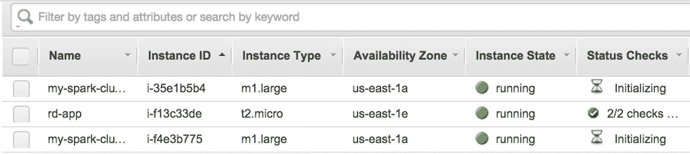

为了测试我们是否可以连接到我们的新集群，我们可以运行以下命令：

```scala
  $ ssh -i spark.pem root@ ec2-52-90-110-128.compute-1.amazonaws.com

```

请记住，用正确的 Amazon EC2 公共域名替换主节点的公共域名（在上述命令中`root@`之后的地址），该域名将在启动集群后显示在您的控制台输出中。

您还可以通过运行以下代码来检索集群的主公共域名：

```scala
  $ ./spark-ec2 -i spark.pem get-master test-cluster

```

成功运行`ssh`命令后，您将连接到 EC2 中的 Spark 主节点，并且您的终端输出应该与以下截图相匹配：

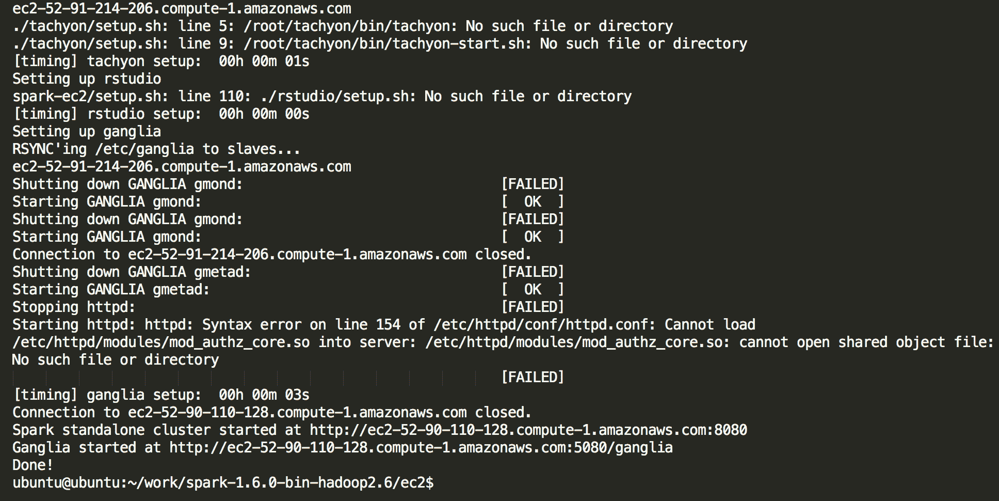

我们可以通过切换到`Spark`目录并在本地模式下运行示例来测试我们的集群是否正确设置了 Spark：

```scala
  $ cd spark
 $ MASTER=local[2] ./bin/run-example SparkPi

```

您应该看到类似于在本地计算机上运行相同命令时得到的输出：

```scala
...
14/01/30 20:20:21 INFO SparkContext: Job finished: reduce at 
SparkPi.scala:35, took 0.864044012 s
Pi is roughly 3.14032
...

```

现在我们有了一个实际的多节点集群，我们可以在集群模式下测试 Spark。我们可以通过传入主 URL 而在集群上运行相同的示例，使用我们的一个 slave 节点：

```scala
    `$ MASTER=spark://` ec2-52-90-110-128.compute-
      1.amazonaws.com:`7077 ./bin/run-example SparkPi` 

```

请注意，您需要用您特定集群的正确域名替换前面的主机域名。

再次，输出应类似于在本地运行示例；但是，日志消息将显示您的驱动程序已连接到 Spark 主机：

```scala
...
14/01/30 20:26:17 INFO client.Client$ClientActor: Connecting to 
    master spark://ec2-54-220-189-136.eu-
    west-1.compute.amazonaws.com:7077
14/01/30 20:26:17 INFO cluster.SparkDeploySchedulerBackend: 
    Connected to Spark cluster with app ID app-20140130202617-0001
14/01/30 20:26:17 INFO client.Client$ClientActor: Executor added: 
    app-20140130202617-0001/0 on worker-20140130201049-
    ip-10-34-137-45.eu-west-1.compute.internal-57119 
    (ip-10-34-137-45.eu-west-1.compute.internal:57119) with 1 cores
14/01/30 20:26:17 INFO cluster.SparkDeploySchedulerBackend:
    Granted executor ID app-20140130202617-0001/0 on hostPort 
    ip-10-34-137-45.eu-west-1.compute.internal:57119 with 1 cores, 
    2.4 GB RAM
14/01/30 20:26:17 INFO client.Client$ClientActor: 
    Executor updated: app-20140130202617-0001/0 is now RUNNING
14/01/30 20:26:18 INFO spark.SparkContext: Starting job: reduce at 
    SparkPi.scala:39
...

```

随时尝试您的集群。例如，尝试在 Scala 中使用交互式控制台：

```scala
  **$ ./bin/spark-shell --master spark://** ec2-52-90-110-128.compute-
    1.amazonaws.com**:7077**

```

完成后，键入`exit`以离开控制台。您还可以通过运行以下命令尝试 PySpark 控制台：

```scala
  **$ ./bin/pyspark --master spark://** ec2-52-90-110-128.compute-
    1.amazonaws.com**:7077**

```

您可以使用 Spark Master Web 界面查看与主机注册的应用程序。要加载 Master Web UI，请导航至`ec2-52-90-110-128.compute-1.amazonaws.com:8080`（再次，请记住用您自己的主机域名替换此域名）。

记住*您将被 Amazon 收费*用于使用集群。完成测试后，请不要忘记停止或终止此测试集群。要执行此操作，您可以首先通过键入`exit`退出`ssh`会话，返回到您自己的本地系统，然后运行以下命令：

```scala
  $ ./ec2/spark-ec2 -k spark -i spark.pem destroy test-cluster

```

您应该看到以下输出：

```scala
Are you sure you want to destroy the cluster test-cluster?
The following instances will be terminated:
Searching for existing cluster test-cluster...
Found 1 master(s), 1 slaves
> ec2-54-227-127-14.compute-1.amazonaws.com
> ec2-54-91-61-225.compute-1.amazonaws.com
ALL DATA ON ALL NODES WILL BE LOST!!
Destroy cluster test-cluster (y/N): y
Terminating master...
Terminating slaves...

```

按*Y*然后按*Enter*来销毁集群。

恭喜！您刚刚在云中设置了一个 Spark 集群，在该集群上运行了一个完全并行的示例程序，并终止了它。如果您想在集群上尝试后续章节中的任何示例代码（或您自己的 Spark 程序），请随时尝试使用 Spark EC2 脚本并启动您选择大小和实例配置文件的集群。（只需注意成本，并在完成后记得关闭它！）

# 在 Amazon Elastic Map Reduce 上配置和运行 Spark

使用 Amazon Elastic Map Reduce 安装了 Spark 的 Hadoop 集群。执行以下步骤创建安装了 Spark 的 EMR 集群：

1.  启动 Amazon EMR 集群。

1.  在[`console.aws.amazon.com/elasticmapreduce/`](https://console.aws.amazon.com/elasticmapreduce/)上打开 Amazon EMR UI 控制台。

1.  选择创建集群：

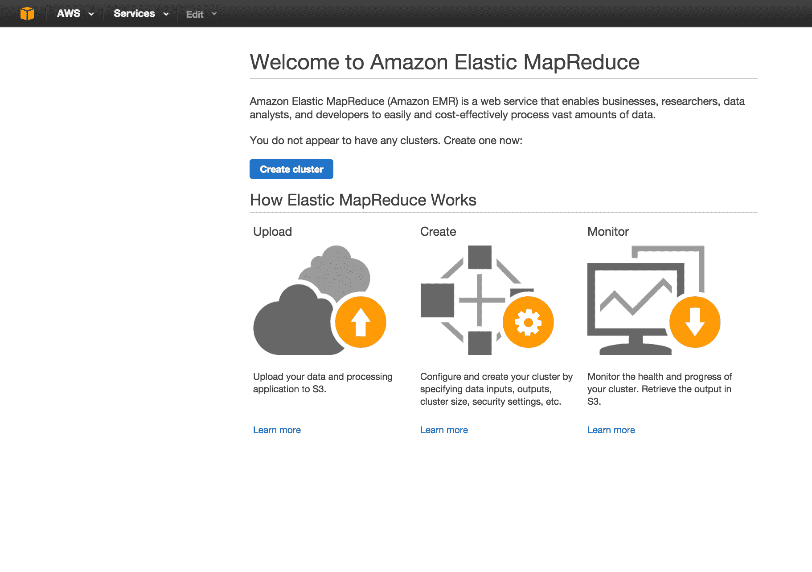

1.  选择适当的 Amazon AMI 版本 3.9.0 或更高版本，如下截图所示：

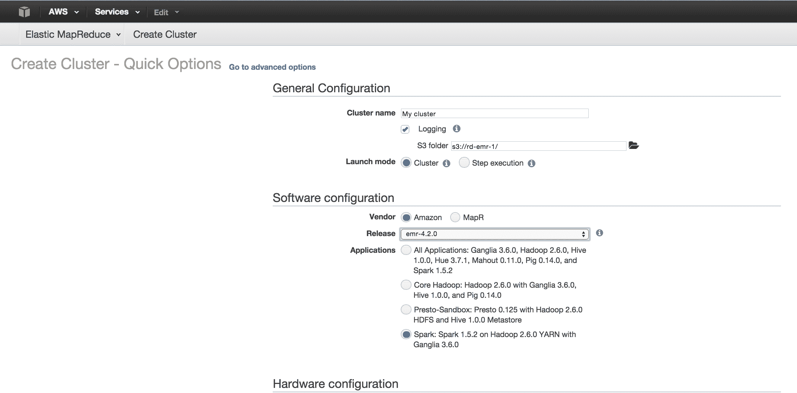

1.  要安装的应用程序字段中，从用户界面上显示的列表中选择 Spark 1.5.2 或更高版本，然后单击添加。

1.  根据需要选择其他硬件选项：

+   实例类型

+   用于 SSH 的密钥对

+   权限

+   IAM 角色（默认或自定义）

请参考以下截图：

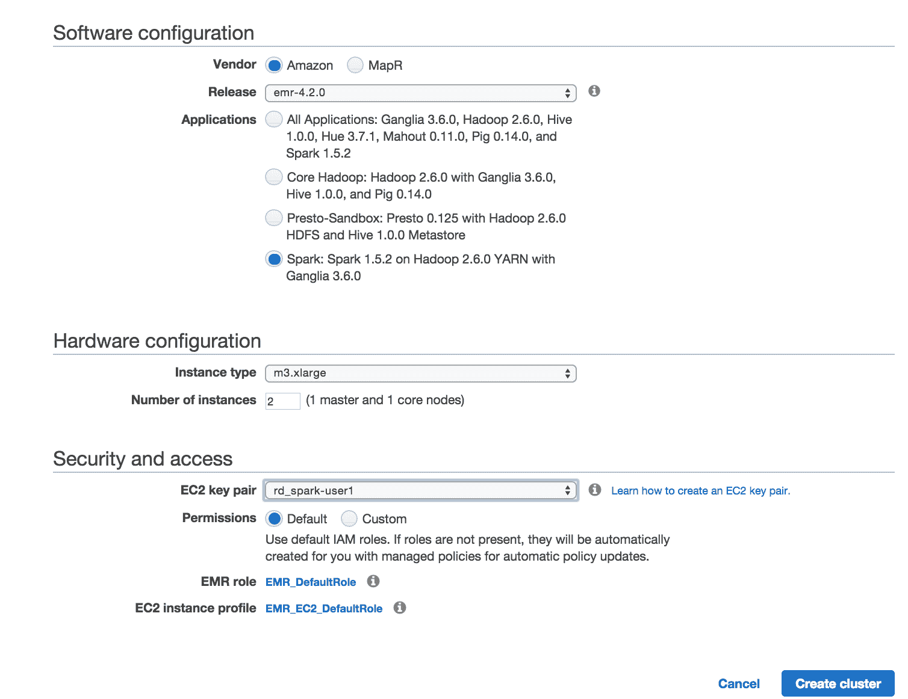

1.  单击创建集群。集群将开始实例化，如下截图所示：

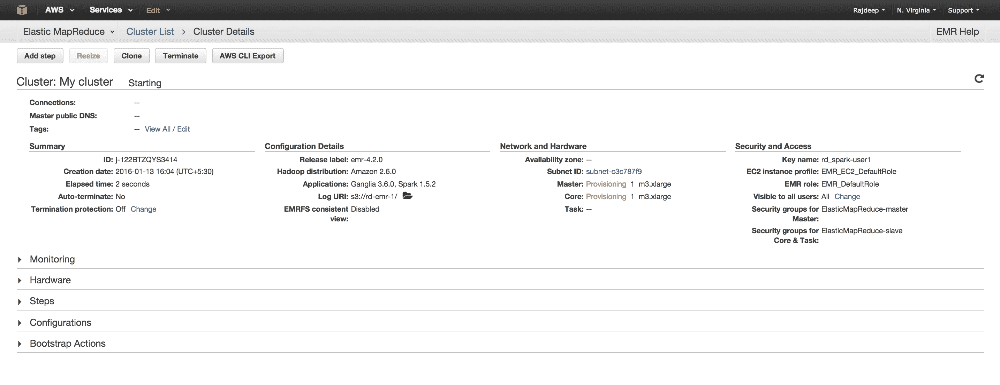

1.  登录到主机。一旦 EMR 集群准备就绪，您可以 SSH 登录到主机：

```scala
 **$ ssh -i rd_spark-user1.pem**
   hadoop@ec2-52-3-242-138.compute-1.amazonaws.com 

```

输出将类似于以下清单：

```scala
     Last login: Wed Jan 13 10:46:26 2016

 __|  __|_  )
 _|  (     /   Amazon Linux AMI
 ___|___|___|

 https://aws.amazon.com/amazon-linux-ami/2015.09-release-notes/
 23 package(s) needed for security, out of 49 available
 Run "sudo yum update" to apply all updates.
 [hadoop@ip-172-31-2-31 ~]$ 

```

1.  启动 Spark Shell：

```scala
      [hadoop@ip-172-31-2-31 ~]$ spark-shell
 16/01/13 10:49:36 INFO SecurityManager: Changing view acls to: 
          hadoop
 16/01/13 10:49:36 INFO SecurityManager: Changing modify acls to: 
          hadoop
 16/01/13 10:49:36 INFO SecurityManager: SecurityManager: 
          authentication disabled; ui acls disabled; users with view 
          permissions: Set(hadoop); users with modify permissions: 
          Set(hadoop)
 16/01/13 10:49:36 INFO HttpServer: Starting HTTP Server
 16/01/13 10:49:36 INFO Utils: Successfully started service 'HTTP 
          class server' on port 60523.
 Welcome to
 ____              __
 / __/__  ___ _____/ /__
 _ / _ / _ &grave;/ __/  '_/
 /___/ .__/_,_/_/ /_/_   version 1.5.2
 /_/
 scala> sc

```

1.  从 EMR 运行基本的 Spark 示例：

```scala
    scala> val textFile = sc.textFile("s3://elasticmapreduce/samples
      /hive-ads/tables/impressions/dt=2009-04-13-08-05
      /ec2-0-51-75-39.amazon.com-2009-04-13-08-05.log")
 scala> val linesWithCartoonNetwork = textFile.filter(line =>  
      line.contains("cartoonnetwork.com")).count()

```

您的输出将如下所示：

```scala
     linesWithCartoonNetwork: Long = 9

```

# Spark 中的 UI

Spark 提供了一个 Web 界面，可用于监视作业，查看环境并运行 SQL 命令。

`SparkContext`在端口`4040`上启动 Web UI，显示有关应用程序的有用信息。这包括以下内容：

+   调度程序阶段和任务的列表

+   RDD 大小和内存使用情况摘要

+   环境信息

+   有关正在运行的执行程序的信息

可以通过在 Web 浏览器中转到`http://<driver-node>:4040`来访问此界面。如果在同一主机上运行多个`SparkContexts`，它们将绑定到以端口`4040`（`4041`，`4042`等）开头的端口。

以下截图显示 Web UI 提供的一些信息：

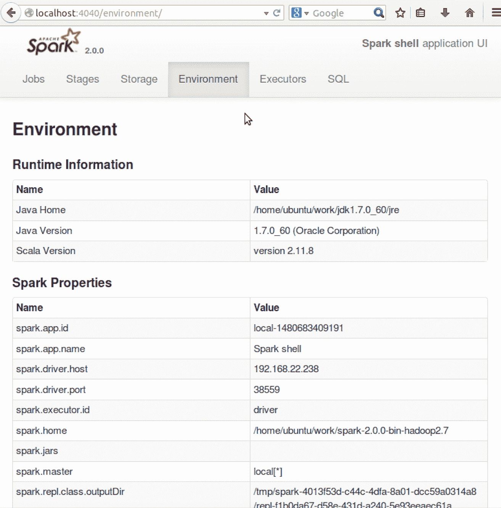

显示 Spark 内容环境的 UI

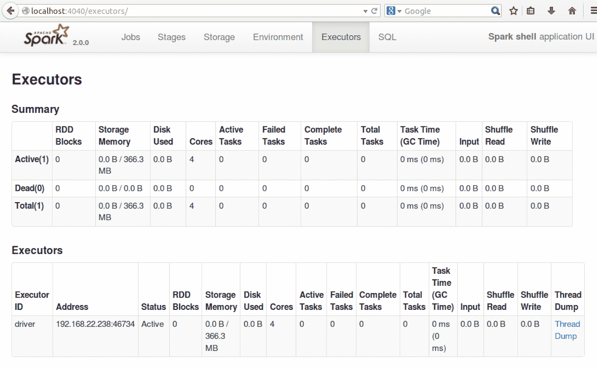

显示可用执行程序的 UI 表

# Spark 支持的机器学习算法

以下算法由 Spark ML 支持：

+   **协同过滤**

+   **交替最小二乘法（ALS）：** 协同过滤经常用于推荐系统。这些技术旨在填补用户-项目关联矩阵的缺失条目。`spark.mllib`目前支持基于模型的协同过滤。在这种实现中，用户和产品由一小组潜在因子描述，这些因子可以用来预测缺失的条目。`spark.mllib`使用 ALS 算法来学习这些潜在因子。

+   **聚类**：这是一个无监督学习问题，其目的是基于相似性的概念将实体的子集分组在一起。聚类用于探索性分析，并作为分层监督学习流水线的组成部分。在学习流水线中，为每个簇训练不同的分类器或回归模型。以下聚类技术在 Spark 中实现：

+   **k 均值**：这是一种常用的聚类算法，将数据点聚类到预定义数量的簇中。用户可以选择簇的数量。`spark.mllib`的实现包括 k 均值++方法的并行化变体（[`theory.stanford.edu/~sergei/papers/vldb12-kmpar.pdf`](http://theory.stanford.edu/~sergei/papers/vldb12-kmpar.pdf)）。

+   **高斯混合**：**高斯混合模型**（**GMM**）表示一个复合分布，其中的点来自 k 个高斯子分布之一。每个分布都有自己的概率。`spark.mllib`的实现使用期望最大化算法来诱导给定一组样本的最大似然模型。

+   **幂迭代聚类（PIC）**：这是一种可扩展的算法，用于根据边属性的成对相似性对图的顶点进行聚类。它使用幂迭代计算图的（归一化的亲和矩阵的）伪特征向量。

幂迭代是一种特征值算法。给定一个矩阵*X*，该算法将产生一个数字*λ*（特征值）和一个非零向量*v*（特征向量），使得*Xv = λv*。

矩阵的伪特征向量可以被视为附近矩阵的特征向量。更具体地说，伪特征向量被定义为：

设*A*为一个*n*乘以*n*的矩阵。设*E*为任何矩阵，使得*||E|| = €*。那么*A + E*的特征向量被定义为*A*的伪特征向量。这个特征向量用于对图顶点进行聚类。

`spark.mllib`包括使用*GraphX*实现的 PIC。它接受一个元组的 RDD，并输出具有聚类分配的模型。相似性必须是非负的。PIC 假设相似性度量是对称的。

（在统计学中，相似性度量或相似性函数是一种实值函数，用于量化两个对象之间的相似性。这些度量是距离度量的倒数；其中的一个例子是余弦相似性）

无论顺序如何，输入数据中的一对（`srcId`，`dstId`）应该最多出现一次。

+   +   **潜在狄利克雷分配**（**LDA**）：这是一种从文本文档集合中推断主题的主题模型。LDA 是一种聚类算法。以下几点解释了主题：

主题是聚类中心，文档对应于数据集中的示例。主题和文档都存在于特征空间中，其中特征向量是词频向量（也称为词袋）。

LDA 不使用传统的距离方法来估计聚类，而是使用基于文本文档生成模型的函数。

+   +   **二分 k 均值**：这是一种层次聚类的类型。**层次聚类分析**（**HCA**）是一种构建聚类层次结构的聚类分析方法。在这种方法中，所有观察开始在一个簇中，并且随着向下移动层次结构，递归地执行分裂。

层次聚类是一种常用的聚类分析方法，旨在构建一个集群的层次结构。

+   +   **流式 k 均值：**当数据以流的形式到达时，我们希望动态估计集群并在新数据到达时更新它们。`spark.mllib`支持流式 k 均值聚类，具有控制估计衰减的参数。该算法使用小批量 k 均值更新规则的泛化。

+   **分类**

+   **决策树：**决策树及其集成是分类和回归的方法之一。决策树很受欢迎，因为它们易于解释，处理分类特征，并扩展到多类分类设置。它们不需要特征缩放，也能捕捉非线性和特征交互。树集成算法，随机森林和提升是分类和回归场景中的顶级表现者之一。

`spark.mllib`实现了用于二元和多类分类和回归的决策树。它支持连续和分类特征。该实现通过行对数据进行分区，从而允许使用数百万个实例进行分布式训练。

+   +   **朴素贝叶斯：**朴素贝叶斯分类器是一类简单的概率分类器，基于应用贝叶斯定理（[`en.wikipedia.org/wiki/Bayes%27_theorem`](https://en.wikipedia.org/wiki/Bayes%27_theorem)）并假设特征之间有强（朴素）独立性。

朴素贝叶斯是一种多类分类算法，假设每对特征之间都是独立的。在训练数据的单次传递中，该算法计算每个特征在给定标签的条件概率分布，然后应用贝叶斯定理来计算给定观察结果的标签的条件概率分布，然后用于预测。`spark.mllib`支持多项式朴素贝叶斯和伯努利朴素贝叶斯。这些模型通常用于文档分类。

+   +   **概率分类器：**在机器学习中，概率分类器是一种可以预测给定输入的类别集上的概率分布的分类器，而不是输出样本应属于的最有可能的类别。概率分类器提供一定程度的分类确定性，这在单独使用或将分类器组合成集成时可能会有用。

+   **逻辑回归：**这是一种用于预测二元响应的方法。逻辑回归通过估计概率来衡量分类因变量和自变量之间的关系，使用逻辑函数。这个函数是一个累积逻辑分布。

这是**广义线性模型**（**GLM**）的特例，用于预测结果的概率。有关更多背景和实施细节，请参阅`spark.mllib`中关于逻辑回归的文档。

GLM 被认为是允许具有非正态分布的响应变量的线性回归的泛化。

+   +   **随机森林：**这些算法使用决策树的集成来决定决策边界。随机森林结合了许多决策树。这降低了过拟合的风险。

Spark ML 支持用于二元和多类分类以及回归的随机森林。它可以用于连续或分类值。

+   **降维：**这是减少机器学习变量数量的过程。它可以用于从原始特征中提取潜在特征，或者在保持整体结构的同时压缩数据。MLlib 在`RowMatrix`类的基础上支持降维。

+   +   **奇异值分解（SVD）**：矩阵*M：m x n*（实数或复数）的奇异值分解是一个形式为*UΣV**的分解，其中*U*是一个*m x R*矩阵。*Σ*是一个*R x R*的矩形对角矩阵，对角线上有非负实数，*V*是一个*n x r*的酉矩阵。*r*等于矩阵*M*的秩。

+   **主成分分析（PCA）**：这是一种统计方法，用于找到一个旋转，使得第一个坐标轴上的方差最大。依次，每个后续坐标轴的方差都尽可能大。旋转矩阵的列称为主成分。PCA 在降维中被广泛使用。

MLlib 支持使用`RowMatrix`对以行为导向格式存储的高瘦矩阵进行 PCA。

Spark 支持使用 TF-IDF、ChiSquare、Selector、Normalizer 和 Word2Vector 进行特征提取和转换。

+   **频繁模式挖掘**

+   **FP-growth**：FP 代表频繁模式。算法首先计算数据集中项（属性和值对）的出现次数，并将它们存储在头表中。

在第二次遍历中，算法通过插入实例（由项组成）来构建 FP 树结构。每个实例中的项按其在数据集中的频率降序排序；这确保了树可以快速处理。不满足最小覆盖阈值的实例中的项将被丢弃。对于许多实例共享最频繁项的用例，FP 树在树根附近提供了高压缩。

+   +   **关联规则**：关联规则学习是一种在大型数据库中发现变量之间有趣关系的机制。

它实现了一个并行规则生成算法，用于构建具有单个项作为结论的规则。

+   **PrefixSpan**：这是一种序列模式挖掘算法。

+   **评估指标**：`spark.mllib`配备了一套用于评估算法的指标。

+   ****PMML 模型导出****：**预测模型标记语言**（**PMML**）是一种基于 XML 的预测模型交换格式。PMML 提供了一种机制，使分析应用程序能够描述和交换由机器学习算法产生的预测模型。

`spark.mllib`允许将其机器学习模型导出为 PMML 及其等效的 PMML 模型。

+   **优化（开发人员）**

+   **随机梯度下降**：这用于优化梯度下降以最小化目标函数；该函数是可微函数的和。

梯度下降方法和**随机次梯度下降**（**SGD**）作为 MLlib 中的低级原语，各种 ML 算法都是在其之上开发的。

+   **有限内存 BFGS（L-BFGS）**：这是一种优化算法，属于拟牛顿方法家族，近似**Broyden-Fletcher-Goldfarb-Shanno**（**BFGS**）算法。它使用有限的计算机内存。它用于机器学习中的参数估计。

BFGS 方法近似牛顿法，这是一类寻找函数的稳定点的爬山优化技术。对于这样的问题，一个必要的最优条件是梯度应该为零**。**

# 与现有库相比，使用 Spark ML 的好处

伯克利的 AMQ 实验室评估了 Spark，并通过一系列在 Amazon EC2 上的实验以及用户应用程序的基准测试来评估了 RDD。

+   **使用的算法**：逻辑回归和 k-means

+   **用例**：第一次迭代，多次迭代。

所有测试都使用了具有 4 个核心和 15 GB RAM 的`m1.xlarge` EC2 节点。HDFS 用于存储，块大小为 256 MB。参考以下图表：

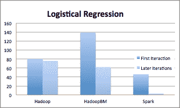

上面的图表显示了 Hadoop 和 Spark 在**逻辑回归**的第一次和后续迭代中的性能比较：

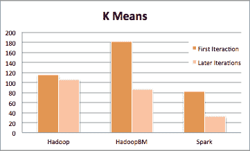

前面的图表显示了 K 均值聚类算法的第一次和后续迭代中 Hadoop 和 Spark 的性能比较。

总体结果如下：

+   Spark 在迭代式机器学习和图应用程序中的性能比 Hadoop 快 20 倍。这种加速来自于通过将数据存储在内存中作为 Java 对象来避免 I/O 和反序列化成本。

+   编写的应用程序表现良好并且扩展性好。Spark 可以将在 Hadoop 上运行的分析报告加速 40 倍。

+   当节点失败时，Spark 可以通过仅重建丢失的 RDD 分区来快速恢复。

+   Spark 被用来与 1TB 数据集进行交互式查询，延迟为 5-7 秒。

有关更多信息，请访问[`people.csail.mit.edu/matei/papers/2012/nsdi_spark.pdf`](http://people.csail.mit.edu/matei/papers/2012/nsdi_spark.pdf)。

Spark 与 Hadoop 的 SORT 基准测试-2014 年，Databricks 团队参加了 SORT 基准测试（[`sortbenchmark.org/`](http://sortbenchmark.org/)）。这是在一个 100TB 数据集上进行的。Hadoop 在一个专用数据中心运行，而 Spark 集群在 EC2 上运行了 200 多个节点。Spark 在 HDFS 分布式存储上运行。

Spark 比 Hadoop 快 3 倍，并且使用的机器数量少 10 倍。请参考以下图表：

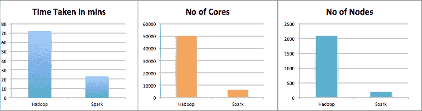

# Google Compute Engine 上的 Spark 集群-DataProc

**Cloud Dataproc**是在 Google Compute Engine 上运行的 Spark 和 Hadoop 服务。这是一个托管服务。Cloud Dataproc 自动化帮助快速创建集群，轻松管理它们，并在您不需要它们时关闭集群以节省费用。

在本节中，我们将学习如何使用 DataProc 创建一个 Spark 集群，并在其上运行一个示例应用程序。

确保您已经创建了 Google Compute Engine 帐户并安装了 Google Cloud SDK ([`cloud.google.com/sdk/gcloud/`](https://cloud.google.com/sdk/gcloud/))。

# Hadoop 和 Spark 版本

DataProc 支持以下 Hadoop 和 Spark 版本。请注意，随着新版本的推出，这些将会发生变化：

+   Spark 1.5.2

+   Hadoop 2.7.1

+   Pig 0.15.0

+   Hive 1.2.1

+   GCS 连接器 1.4.3-hadoop2

+   BigQuery 连接器 0.7.3-hadoop2 ([`github.com/GoogleCloudPlatform/bigdata-interop`](https://github.com/GoogleCloudPlatform/bigdata-interop))

有关更多信息，请访问[`cloud.google.com/dataproc-versions`](http://cloud.google.com/dataproc-versions)。

在接下来的步骤中，我们将使用 Google Cloud 控制台（用于创建 Spark 集群和提交作业的用户界面）。

# 创建集群

您可以通过转到 Cloud 平台控制台来创建一个 Spark 集群。选择项目，然后点击“继续”打开“集群”页面。如果您已经创建了任何集群，您将看到属于您项目的 Cloud Dataproc 集群。

点击“创建集群”按钮，打开“创建 Cloud Data pros 集群”页面。请参考以下截图：

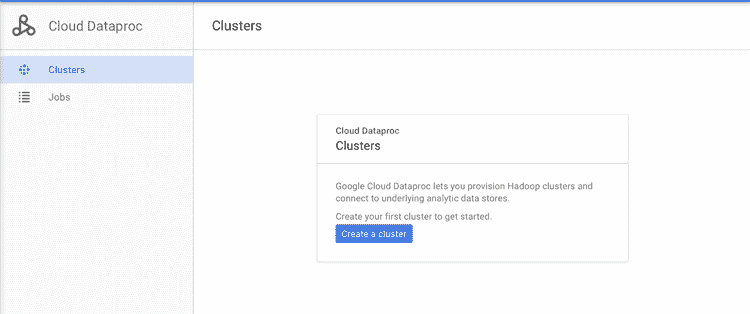

一旦您点击“创建集群”，一个详细的表单将显示出来，如下截图所示：

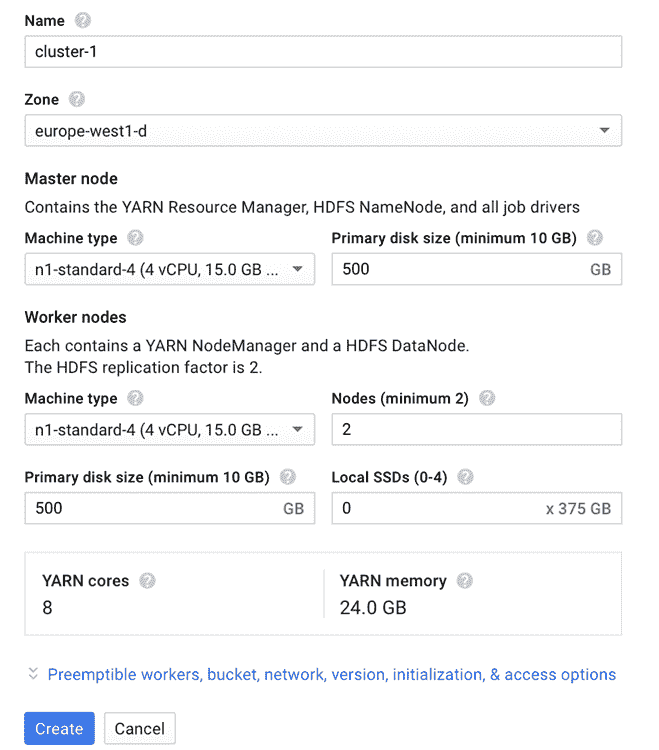

前面的截图显示了默认字段自动填充为新集群-1 集群的“创建 Cloud Dataproc 集群”页面。请看以下截图：

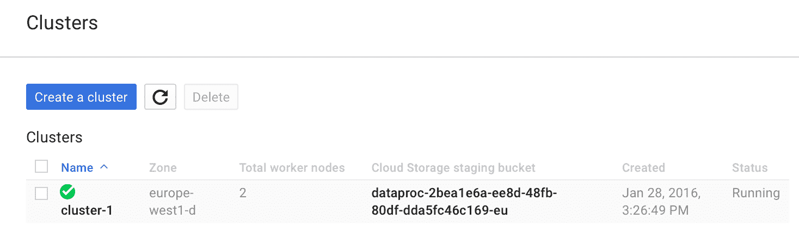

您可以展开工作节点、存储桶、网络、版本、初始化和访问选项面板，以指定一个或多个工作节点、一个暂存桶、网络、初始化、Cloud Dataproc 镜像版本、操作和项目级别的访问权限。提供这些值是可选的。

默认集群创建时没有工作节点，自动创建的暂存桶和默认网络。它还具有最新发布的 Cloud Dataproc 镜像版本。您可以更改这些默认设置：

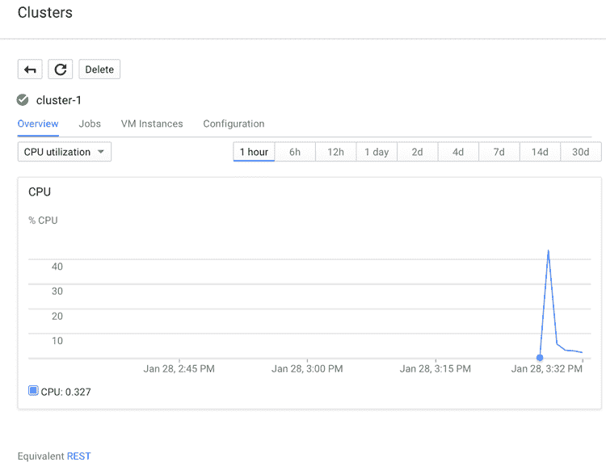

在页面上配置所有字段后，点击“创建”按钮创建集群。创建的集群名称将显示在集群页面上。一旦创建了 Spark 集群，状态就会更新为“运行”。

点击之前创建的集群名称以打开集群详情页面。它还有一个概述选项卡和 CPU 利用率图表选定。

您可以从其他选项卡查看集群的作业、实例等。

# 提交作业

要从 Cloud Platform 控制台向集群提交作业，请转到 Cloud Platform UI。选择适当的项目，然后点击“继续”。第一次提交作业时，会出现以下对话框：

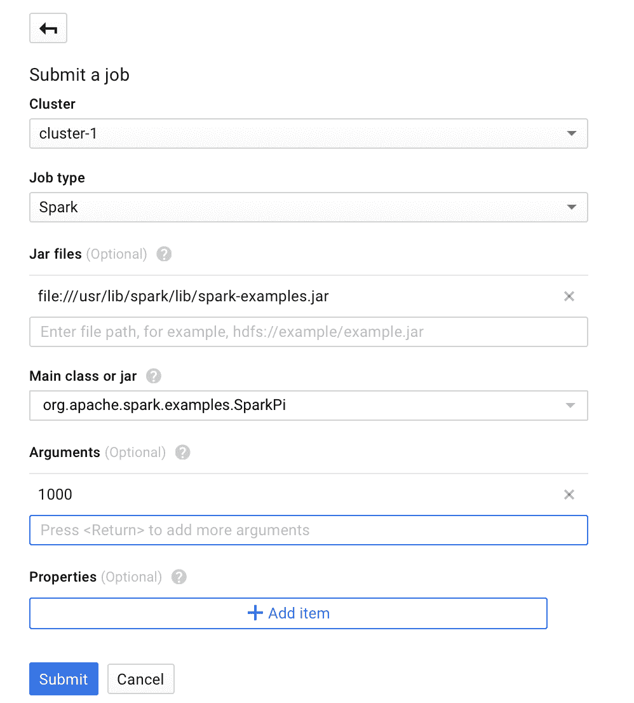

点击“提交作业”：

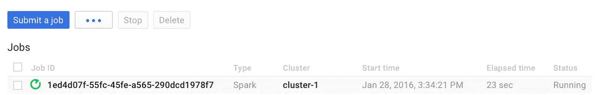

要提交一个 Spark 示例作业，请在“提交作业”页面上填写字段，如下所示：

1.  在屏幕上的集群列表中选择一个集群名称。

1.  将作业类型设置为 Spark。

1.  将`file:///usr/lib/spark/lib/spark-examples.jar`添加到 Jar 文件。这里，`file:///`表示 Hadoop 的`LocalFileSystem`方案；Cloud Dataproc 在创建集群时会在主节点上安装`/usr/lib/spark/lib/spark-examples.jar`。或者，您可以指定一个 Cloud Storage 路径（`gs://my-bucket/my-jarfile.jar`）或一个`HDFS`路径（`hdfs://examples/myexample.jar`）到其中一个自定义的 jar。

1.  将`Main`类或 jar 设置为`org.apache.spark.examples.SparkPi`。

1.  将参数设置为单个参数`1000`。

点击提交以开始作业。

作业开始后，它将被添加到作业列表中。请参考以下截图：

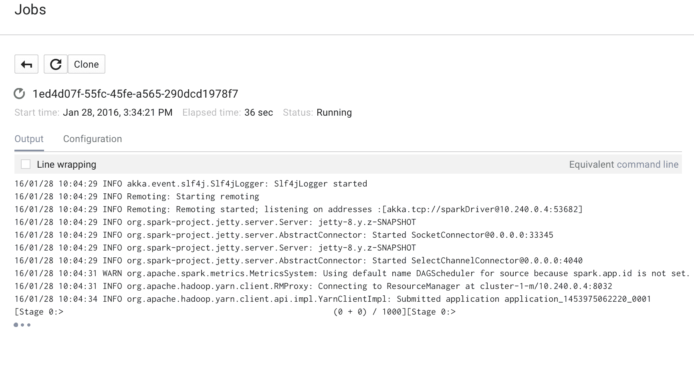

作业完成后，其状态会发生变化：

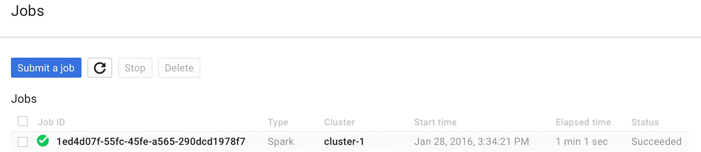

查看此处列出的`job`输出。

从终端执行带有适当作业 ID 的命令。

在我们的案例中，作业 ID 是`1ed4d07f-55fc-45fe-a565-290dcd1978f7`，项目 ID 是`rd-spark-1`；因此，命令如下所示：

```scala
  $ gcloud beta dataproc --project=rd-spark-1 jobs wait 1ed4d07f-
    55fc-45fe-a565-290dcd1978f7

```

（删节）输出如下所示：

```scala
Waiting for job output...
16/01/28 10:04:29 INFO akka.event.slf4j.Slf4jLogger: Slf4jLogger 
    started
16/01/28 10:04:29 INFO Remoting: Starting remoting
...
Submitted application application_1453975062220_0001
Pi is roughly 3.14157732 

```

您还可以通过 SSH 连接到 Spark 实例，并以交互模式运行 spark-shell。

# 摘要

在本章中，我们介绍了如何在我们自己的计算机上以及作为在云上运行的集群上本地设置 Spark。您学习了如何在 Amazon EC2 上运行 Spark。您还学习了如何使用 Google Compute Engine 的 Spark 服务来创建集群并运行简单作业。我们讨论了 Spark 的编程模型和 API 的基础知识，使用交互式 Scala 控制台编写了相同的基本 Spark 程序，并在 Scala、Java、R 和 Python 中编写了相同的基本 Spark 程序。我们还比较了不同机器学习算法的 Hadoop 与 Spark 的性能指标，以及 SORT 基准测试。

在下一章中，我们将考虑如何使用 Spark 创建一个机器学习系统。
